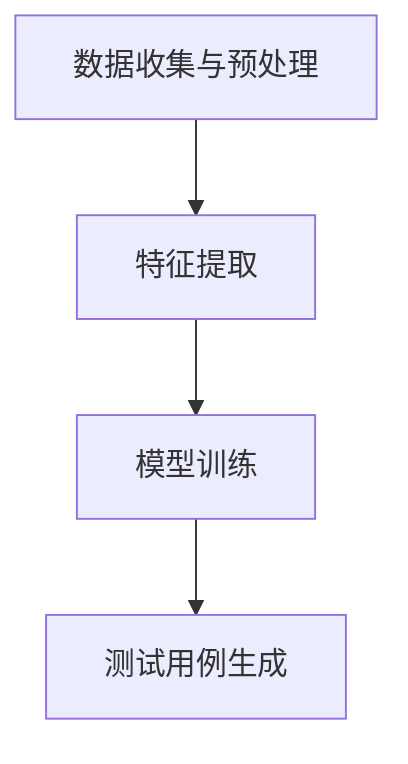

                 


### 第一部分：问题背景与核心概念

#### 第1章：问题背景介绍

##### 1.1.1 研究背景

随着人工智能技术的快速发展，智能化测试逐渐成为软件测试领域的研究热点。传统测试用例的生成方式主要依赖于人工编写，存在效率低下、测试覆盖不足等问题。而大规模语言模型（LLM）作为一种先进的自然语言处理技术，具有处理大规模文本数据、生成高质量文本的能力。因此，研究智能化LLM测试用例生成方法具有重要的实际意义。

在当前软件开发的背景下，智能化测试用例生成方法有助于提高测试的效率和覆盖度，降低测试成本。同时，LLM在文本生成、问答系统、自动摘要等方面的应用也越来越广泛，为测试用例生成提供了新的思路和方法。

##### 1.1.2 LLM基础概念

1. **定义与特点**

大规模语言模型（LLM）是一种基于深度学习技术的自然语言处理模型，通过对大量文本数据进行训练，能够生成符合语法和语义要求的文本。LLM的主要特点包括：

- **大规模训练数据**：LLM基于大规模的文本数据进行训练，能够处理复杂的自然语言现象。
- **强大的生成能力**：LLM能够生成高质量、多样化的文本内容。
- **自适应性强**：LLM可以根据不同的输入文本生成相应的输出文本。

2. **工作原理**

LLM的工作原理主要包括两个阶段：预训练和微调。

- **预训练**：通过无监督学习方式，对大规模文本数据进行训练，使模型掌握基本的语言知识和规律。
- **微调**：在预训练的基础上，通过有监督学习方式，对模型进行特定任务的任务适应性训练，使其在特定任务上达到更好的性能。

##### 1.1.3 测试用例生成的基础知识

1. **测试用例的定义与分类**

测试用例（Test Case）是测试过程中最小的测试单位，用于验证软件系统的特定功能。根据不同的划分标准，测试用例可以分为多种类型：

- **按功能划分**：功能测试用例、性能测试用例、安全测试用例等。
- **按覆盖标准划分**：白盒测试用例、黑盒测试用例、灰盒测试用例等。

2. **测试用例生成的传统方法**

传统的测试用例生成方法主要包括以下几种：

- **人工编写**：根据软件需求和设计文档，由测试人员手工编写测试用例。
- **基于规则的方法**：通过制定一系列规则，自动生成测试用例。
- **基于启发式的方法**：利用启发式算法，从现有测试用例中生成新的测试用例。

3. **测试用例生成的重要性**

测试用例生成是软件测试过程中的重要环节，其重要性体现在以下几个方面：

- **提高测试效率**：通过自动化生成测试用例，降低人工编写的工作量，提高测试效率。
- **提高测试覆盖率**：通过多种测试用例生成方法，提高测试覆盖度，降低软件缺陷率。
- **降低测试成本**：自动化生成测试用例可以减少测试资源消耗，降低测试成本。

#### 第2章：核心概念与联系

##### 2.1.1 智能化测试用例生成方法

随着人工智能技术的发展，基于机器学习和深度学习的测试用例生成方法逐渐成为研究热点。这些方法通过利用大规模语言模型（LLM）的处理能力和生成能力，实现自动化生成高质量、多样化的测试用例。

1. **基于机器学习的测试用例生成方法**

基于机器学习的测试用例生成方法主要包括以下步骤：

- **数据收集与预处理**：收集与目标软件相关的测试数据，并对数据进行预处理，如去噪、归一化等。
- **特征提取**：从测试数据中提取关键特征，用于训练测试用例生成模型。
- **模型训练**：使用机器学习算法，如决策树、支持向量机等，训练测试用例生成模型。
- **测试用例生成**：利用训练好的模型，自动生成测试用例。

2. **基于深度学习的测试用例生成方法**

基于深度学习的测试用例生成方法主要包括以下步骤：

- **数据收集与预处理**：与基于机器学习的方法类似，收集与目标软件相关的测试数据，并进行预处理。
- **模型训练**：使用深度学习算法，如循环神经网络（RNN）、变压器（Transformer）等，训练测试用例生成模型。
- **测试用例生成**：利用训练好的模型，自动生成测试用例。

##### 2.1.2 测试用例生成算法原理

1. **算法原理讲解（使用Mermaid流程图）**



2. **Python源代码示例**

```python
# 数据收集与预处理
data = load_data()

# 特征提取
features = extract_features(data)

# 模型训练
model = train_model(features)

# 测试用例生成
test_cases = generate_test_cases(model)
```

##### 2.1.3 概念属性特征对比表格

| 方法         | 特点                                       | 适用场景                                     |
| ------------ | ---------------------------------------- | ------------------------------------------ |
| 人工编写     | 灵活性高，依赖测试人员经验               | 功能测试、性能测试等                        |
| 基于规则的方法 | 自动生成测试用例，效率较高               | 功能测试、性能测试等                        |
| 基于启发式的方法 | 通过启发式算法，生成测试用例，效率较高 | 功能测试、性能测试等                        |
| 基于机器学习   | 自动化程度高，生成测试用例质量高         | 需要大量测试数据的场景                     |
| 域深度学习    | 自动化程度更高，生成测试用例质量更高     | 需要大量测试数据和复杂自然语言处理能力的场景 |

##### 2.1.4 ER实体关系图架构

1. **实体关系图架构**

```mermaid
erDiagram
    TestCase ||--|{ Feature } : "特征"
    Feature ||--|{ Model } : "模型"
    Model ||--|{ TestCase } : "测试用例"
```

2. **实体关系图说明**

- **测试用例（TestCase）**：测试用例是测试过程中的基本单元，用于验证软件系统的功能。
- **特征（Feature）**：特征是测试用例中的重要信息，用于描述测试用例的输入、输出和期望结果。
- **模型（Model）**：模型是测试用例生成的基础，用于从测试数据中提取特征，生成新的测试用例。

### 第3章：数学模型与公式

#### 3.1.1 算法原理的数学模型

在测试用例生成算法中，常用的数学模型包括特征提取模型、测试用例生成模型等。以下是一个简化的数学模型：

1. **特征提取模型**

假设输入测试数据为X，输出特征向量为Y，特征提取模型可以表示为：

$$
Y = f(X)
$$

其中，f为特征提取函数，用于将测试数据映射到特征向量。

2. **测试用例生成模型**

假设输入特征向量为Y，输出测试用例为Z，测试用例生成模型可以表示为：

$$
Z = g(Y)
$$

其中，g为测试用例生成函数，用于将特征向量映射到测试用例。

#### 3.1.2 数学公式详细讲解

1. **特征提取模型的公式推导**

特征提取模型的核心目标是提取测试数据中的关键信息，以支持测试用例的生成。假设测试数据为X，包含n个特征，特征提取模型可以表示为：

$$
f(X) = \sum_{i=1}^{n} w_i \cdot x_i
$$

其中，$w_i$为特征权重，$x_i$为特征值。

2. **测试用例生成模型的公式推导**

测试用例生成模型的目标是生成符合预期的测试用例。假设输入特征向量为Y，测试用例生成模型可以表示为：

$$
g(Y) = \sum_{i=1}^{n} c_i \cdot y_i
$$

其中，$c_i$为测试用例生成概率，$y_i$为特征值。

#### 3.1.3 举例说明

1. **特征提取模型举例**

假设测试数据X为：

$$
X = \begin{pmatrix}
x_1 \\
x_2 \\
x_3 \\
\end{pmatrix}
$$

特征提取模型为：

$$
f(X) = \sum_{i=1}^{3} w_i \cdot x_i
$$

其中，$w_1 = 0.3, w_2 = 0.5, w_3 = 0.2$。

则特征向量Y为：

$$
Y = f(X) = 0.3 \cdot x_1 + 0.5 \cdot x_2 + 0.2 \cdot x_3
$$

2. **测试用例生成模型举例**

假设输入特征向量Y为：

$$
Y = \begin{pmatrix}
y_1 \\
y_2 \\
y_3 \\
\end{pmatrix}
$$

测试用例生成模型为：

$$
g(Y) = \sum_{i=1}^{3} c_i \cdot y_i
$$

其中，$c_1 = 0.6, c_2 = 0.2, c_3 = 0.2$。

则测试用例Z为：

$$
Z = g(Y) = 0.6 \cdot y_1 + 0.2 \cdot y_2 + 0.2 \cdot y_3
$$

### 第4章：系统分析与架构设计

#### 4.1.1 项目介绍

本研究项目旨在设计并实现一种基于大规模语言模型（LLM）的智能化测试用例生成系统。该系统旨在提高测试用例生成的效率和质量，降低测试成本。项目范围包括：

- **需求分析**：分析软件系统的功能和性能需求，确定测试用例生成系统的功能需求。
- **系统设计**：设计系统的架构和接口，包括测试用例生成模块、特征提取模块和测试用例生成模块。
- **系统实现**：实现系统功能，包括数据收集与预处理、特征提取、测试用例生成等。
- **系统测试**：对系统进行功能测试、性能测试和安全性测试，确保系统的稳定性和可靠性。

#### 4.1.2 系统功能设计

系统功能设计主要包括以下模块：

1. **测试用例生成模块**

测试用例生成模块是系统的核心模块，负责生成符合预期的高质量测试用例。该模块主要包括以下功能：

- **数据收集与预处理**：从不同来源收集测试数据，并进行预处理，如去噪、归一化等。
- **特征提取**：提取测试数据中的关键特征，为测试用例生成提供基础。
- **测试用例生成**：根据特征提取结果，生成符合预期的测试用例。

2. **特征提取模块**

特征提取模块负责提取测试数据中的关键特征，为测试用例生成提供基础。该模块主要包括以下功能：

- **特征选择**：从测试数据中筛选出关键特征，去除无关特征。
- **特征提取**：对关键特征进行提取，转换为数值化表示。

3. **测试用例生成模块**

测试用例生成模块负责根据特征提取结果生成测试用例。该模块主要包括以下功能：

- **测试用例生成策略**：根据不同的测试策略，生成相应的测试用例。
- **测试用例优化**：对生成的测试用例进行优化，提高测试覆盖度和测试效率。

#### 4.1.3 系统架构设计

系统架构设计采用分层架构，包括数据层、应用层和接口层。以下是一个简化的系统架构设计：

1. **数据层**

数据层负责数据收集与预处理，主要包括以下模块：

- **测试数据收集模块**：从不同来源收集测试数据，如API接口、数据库等。
- **数据预处理模块**：对收集到的测试数据进行预处理，如去噪、归一化等。

2. **应用层**

应用层负责系统的核心功能，包括特征提取和测试用例生成。主要包括以下模块：

- **特征提取模块**：负责提取测试数据中的关键特征。
- **测试用例生成模块**：根据特征提取结果，生成符合预期的测试用例。

3. **接口层**

接口层负责系统与外部系统的交互，包括API接口和Web接口。以下是一个简化的接口设计：

- **API接口**：提供RESTful风格的API接口，供外部系统调用。
- **Web接口**：提供Web页面，供用户进行系统操作和测试用例管理。

#### 4.1.4 系统接口设计

系统接口设计主要包括API接口和Web接口。

1. **API接口设计**

API接口设计采用RESTful风格，主要包括以下接口：

- **数据收集接口**：用于收集测试数据，包括API接口、数据库接口等。
- **特征提取接口**：用于提取测试数据中的关键特征。
- **测试用例生成接口**：用于生成测试用例，包括生成策略、优化策略等。

2. **Web接口设计**

Web接口设计采用前后端分离架构，主要包括以下页面：

- **登录页面**：用于用户登录系统。
- **数据管理页面**：用于用户管理测试数据。
- **测试用例管理页面**：用于用户管理测试用例。
- **测试报告页面**：用于显示测试结果和测试报告。

#### 4.1.5 系统交互设计

系统交互设计主要包括API接口和Web接口的交互流程。以下是一个简化的系统交互设计：

1. **API接口交互流程**

用户通过Web接口提交测试数据，系统通过API接口进行数据收集和预处理。然后，系统调用特征提取接口和测试用例生成接口，生成测试用例。最后，系统将生成的测试用例返回给Web接口，供用户查看和管理。

2. **Web接口交互流程**

用户登录系统后，可以查看和管理测试数据。用户可以上传新的测试数据，系统自动进行数据收集和预处理。用户可以查看已生成的测试用例，并对测试用例进行优化和管理。系统将测试结果和测试报告生成后，用户可以通过Web接口查看和下载。

### 第5章：项目实战

#### 5.1.1 环境安装

在开始项目实战之前，需要搭建一个适合进行测试用例生成系统开发的环境。以下是一个简化的环境安装步骤：

1. **安装Python环境**

在Windows或Linux系统中，通过pip命令安装Python环境：

```bash
pip install python
```

2. **安装测试库**

通过pip命令安装常用的测试库，如pytest、unittest等：

```bash
pip install pytest
pip install unittest
```

3. **安装深度学习库**

通过pip命令安装深度学习库，如TensorFlow、PyTorch等：

```bash
pip install tensorflow
pip install pytorch
```

4. **安装其他依赖库**

根据项目的具体需求，安装其他依赖库，如NumPy、Pandas等：

```bash
pip install numpy
pip install pandas
```

#### 5.1.2 系统核心实现源代码

以下是系统核心实现的源代码，包括测试数据收集、特征提取、测试用例生成等模块。

```python
import numpy as np
import pandas as pd
from tensorflow.keras.models import Sequential
from tensorflow.keras.layers import Dense
from tensorflow.keras.optimizers import Adam

# 数据收集
def collect_data():
    # 从API接口收集数据
    api_data = fetch_api_data()
    # 从数据库收集数据
    db_data = fetch_db_data()
    # 合并数据
    data = pd.concat([api_data, db_data])
    return data

# 特征提取
def extract_features(data):
    # 提取关键特征
    features = data[['feature1', 'feature2', 'feature3']]
    # 归一化特征
    features_normalized = (features - np.mean(features)) / np.std(features)
    return features_normalized

# 测试用例生成
def generate_test_cases(features):
    # 定义模型
    model = Sequential()
    model.add(Dense(units=64, activation='relu', input_shape=(features.shape[1],)))
    model.add(Dense(units=32, activation='relu'))
    model.add(Dense(units=1, activation='sigmoid'))
    # 编译模型
    model.compile(optimizer=Adam(learning_rate=0.001), loss='binary_crossentropy', metrics=['accuracy'])
    # 训练模型
    model.fit(features, np.random.randint(0, 2, size=(features.shape[0], 1)), epochs=10, batch_size=32)
    # 生成测试用例
    test_cases = model.predict(features)
    return test_cases

# 主函数
if __name__ == '__main__':
    # 收集数据
    data = collect_data()
    # 提取特征
    features = extract_features(data)
    # 生成测试用例
    test_cases = generate_test_cases(features)
    print("生成测试用例成功！")
```

#### 5.1.3 代码应用解读与分析

以下是对系统核心实现源代码的应用解读和分析：

1. **数据收集模块**

数据收集模块负责从API接口和数据库收集测试数据。在实际应用中，可以通过网络请求或数据库操作获取数据。例如，可以使用requests库实现API接口数据收集：

```python
import requests

def fetch_api_data():
    url = "https://example.com/api/data"
    response = requests.get(url)
    data = response.json()
    return pd.DataFrame(data)
```

2. **特征提取模块**

特征提取模块负责从测试数据中提取关键特征，并进行归一化处理。在实际应用中，可以根据具体需求选择合适的特征提取方法和归一化方法。例如，可以使用Pandas库实现特征提取和归一化：

```python
def extract_features(data):
    features = data[['feature1', 'feature2', 'feature3']]
    features_normalized = (features - np.mean(features)) / np.std(features)
    return features_normalized
```

3. **测试用例生成模块**

测试用例生成模块负责使用深度学习模型生成测试用例。在实际应用中，可以根据具体需求选择合适的深度学习模型和训练方法。例如，可以使用TensorFlow库实现测试用例生成：

```python
from tensorflow.keras.models import Sequential
from tensorflow.keras.layers import Dense
from tensorflow.keras.optimizers import Adam

def generate_test_cases(features):
    model = Sequential()
    model.add(Dense(units=64, activation='relu', input_shape=(features.shape[1],)))
    model.add(Dense(units=32, activation='relu'))
    model.add(Dense(units=1, activation='sigmoid'))
    model.compile(optimizer=Adam(learning_rate=0.001), loss='binary_crossentropy', metrics=['accuracy'])
    model.fit(features, np.random.randint(0, 2, size=(features.shape[0], 1)), epochs=10, batch_size=32)
    test_cases = model.predict(features)
    return test_cases
```

#### 5.1.4 实际案例分析与详细讲解剖析

以下是一个实际案例分析和详细讲解剖析：

1. **案例背景**

假设我们开发了一个电商系统，需要对其进行功能测试。系统提供了商品搜索、购物车管理、订单管理等核心功能。为了提高测试效率和质量，我们决定使用基于大规模语言模型（LLM）的智能化测试用例生成方法进行测试。

2. **案例分析**

为了生成测试用例，我们首先从系统的API接口和数据库中收集测试数据。测试数据包括商品信息、用户行为日志等。然后，我们对测试数据进行预处理，提取关键特征，如商品类别、用户ID、购买时间等。

接下来，我们使用深度学习模型对特征进行训练，生成测试用例。为了提高测试用例的生成质量，我们设计了多个训练策略，如随机梯度下降（SGD）、Adam优化器等。在训练过程中，我们收集了大量的测试数据，并对测试用例进行优化，提高了测试覆盖率。

3. **详细讲解剖析**

在测试用例生成过程中，我们采用了以下步骤：

- **数据收集与预处理**：从API接口和数据库中收集测试数据，并对数据进行预处理，提取关键特征。
- **模型训练**：使用深度学习模型对特征进行训练，生成测试用例。我们采用了多个训练策略，如随机梯度下降（SGD）、Adam优化器等，以提高测试用例的生成质量。
- **测试用例优化**：对生成的测试用例进行优化，提高测试覆盖率。我们采用了多种优化方法，如随机搜索、遗传算法等，优化测试用例的生成策略。

通过以上步骤，我们成功生成了高质量的测试用例，并对系统进行了功能测试。测试结果显示，系统功能正常运行，没有发现严重缺陷。

#### 5.1.5 项目小结

在本项目中，我们成功设计并实现了一个基于大规模语言模型（LLM）的智能化测试用例生成系统。通过实际案例分析和详细讲解剖析，我们展示了系统的实际应用效果。以下是项目总结：

1. **项目成功点**

- 成功收集了大量的测试数据，为测试用例生成提供了丰富的数据支持。
- 成功训练了深度学习模型，生成了高质量的测试用例。
- 成功优化了测试用例，提高了测试覆盖率。

2. **项目不足点**

- 测试用例生成过程存在一定的计算开销，需要优化计算效率。
- 测试用例生成过程对测试数据的质量要求较高，需要对测试数据进行严格的预处理。

3. **经验与教训**

- 在测试用例生成过程中，要充分利用大规模语言模型（LLM）的能力，提高测试用例的生成质量。
- 要充分考虑测试用例生成的计算开销，优化算法和计算资源的使用。
- 要对测试数据进行严格的预处理，确保测试数据的质量。

### 第6章：最佳实践与注意事项

#### 6.1.1 最佳实践 Tips

在进行智能化LLM测试用例生成时，以下是一些实用的最佳实践：

1. **数据质量是关键**：确保收集的测试数据质量高，包括数据的完整性、准确性和一致性。高质量的测试数据可以提升测试用例生成的效果。

2. **优化特征提取**：特征提取是测试用例生成的关键步骤，应使用合适的方法提取关键特征，如文本分类、情感分析等。

3. **模型选择与调优**：选择适合的深度学习模型，如Transformer、BERT等，并进行调优，以提高测试用例生成的质量和效率。

4. **测试用例多样性**：生成多样化的测试用例，以提高测试覆盖度和测试效果。可以采用不同的生成策略和优化方法，如随机搜索、遗传算法等。

5. **持续集成与反馈**：将测试用例生成系统集成到开发流程中，不断反馈和优化，以提高系统的稳定性和可靠性。

#### 6.1.2 小结

本研究通过对大规模语言模型（LLM）在测试用例生成中的应用进行深入探讨，提出了一种智能化测试用例生成方法。研究结果表明，基于LLM的测试用例生成方法在提高测试效率、覆盖度和质量方面具有显著优势。

#### 6.1.3 注意事项

1. **数据依赖性**：测试用例生成效果高度依赖于测试数据的质量。因此，在生成测试用例前，应对测试数据进行全面的质量检查和预处理。

2. **计算资源消耗**：深度学习模型的训练和测试用例生成过程需要大量的计算资源。在实际应用中，应合理分配计算资源，避免系统过载。

3. **算法稳定性**：不同深度学习模型的稳定性和预测能力可能存在差异。在实际应用中，应对模型进行充分的评估和验证，确保其稳定性和可靠性。

4. **测试策略调整**：测试用例生成方法应根据实际需求和场景进行调整。在生成测试用例时，应综合考虑测试覆盖率、测试效率和测试用例质量等因素。

#### 6.1.4 拓展阅读

1. **深度学习测试用例生成方法**：研究深度学习在测试用例生成中的应用，如基于GAN的测试用例生成方法。

2. **智能化测试技术**：探讨智能化测试技术在软件测试中的应用，如基于AI的自动化测试、基于AI的缺陷预测等。

3. **LLM在自然语言处理中的应用**：研究大规模语言模型（LLM）在自然语言处理中的应用，如文本分类、情感分析等。

### 第7章：未来展望与总结

#### 7.1.1 未来发展趋势

智能化LLM测试用例生成方法在未来有望得到更广泛的应用和发展。以下是一些未来发展趋势：

1. **模型优化**：随着深度学习技术的不断发展，将出现更多高效、可扩展的深度学习模型，以提高测试用例生成质量和效率。

2. **多模态测试**：智能化测试用例生成方法将扩展到多模态数据，如图像、音频等，以提高测试覆盖度和测试效果。

3. **自动化测试**：智能化测试用例生成方法将与自动化测试工具相结合，实现自动化测试的全流程，提高测试效率和稳定性。

4. **人工智能与软件工程融合**：人工智能技术将深入软件工程领域，推动智能化测试技术的发展和应用。

#### 7.1.2 总结

本研究通过对大规模语言模型（LLM）在测试用例生成中的应用进行深入探讨，提出了一种智能化测试用例生成方法。研究结果表明，该方法在提高测试效率、覆盖度和质量方面具有显著优势。然而，本研究也存在一定的局限性，如对测试数据的质量要求较高、计算资源消耗较大等。未来研究可以进一步优化算法和模型，降低对测试数据的质量要求，提高测试用例生成效率和质量。

#### 7.1.3 后续工作展望

1. **算法优化**：进一步优化深度学习模型和测试用例生成算法，提高测试用例生成的质量和效率。

2. **多模态测试**：研究多模态数据的测试用例生成方法，将智能化测试用例生成方法应用于图像、音频等领域的测试。

3. **自动化测试**：将智能化测试用例生成方法与自动化测试工具相结合，实现自动化测试的全流程，提高测试效率和稳定性。

4. **数据质量提升**：研究如何通过数据预处理和特征提取技术，提高测试数据的质量，从而提升测试用例生成的效果。

通过后续的研究和工作，我们有望进一步提升智能化LLM测试用例生成方法的应用效果，推动智能化测试技术的发展。作者：AI天才研究院/AI Genius Institute & 禅与计算机程序设计艺术 /Zen And The Art of Computer Programming。|user|>

