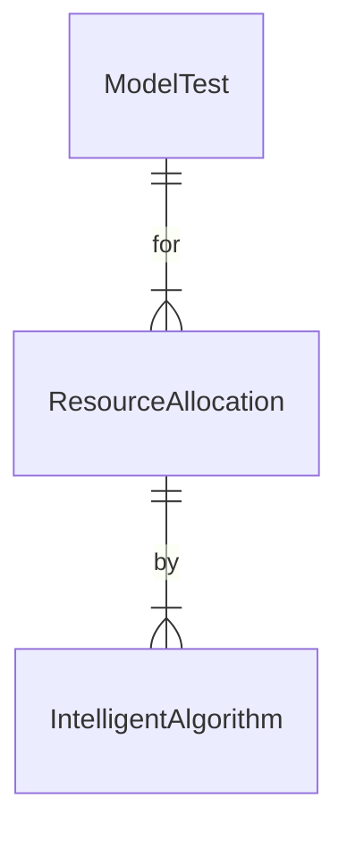
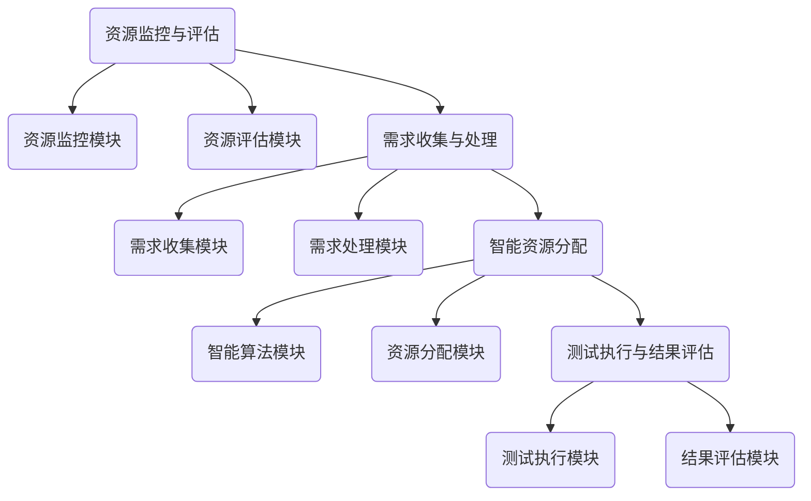
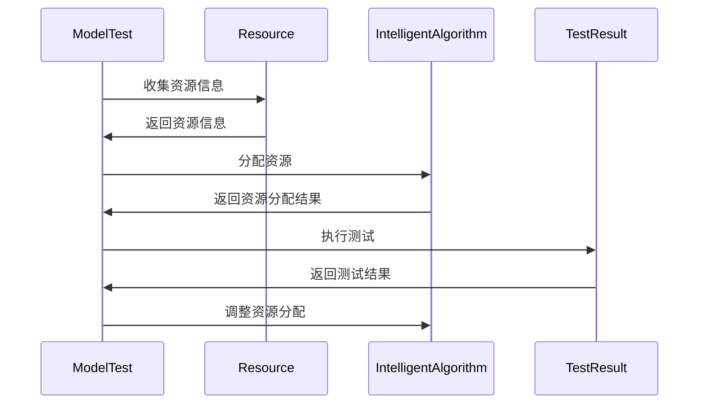

                 

# 智能化LLM测试资源分配策略

## 关键词

- 机器学习模型
- 测试资源分配
- 智能化算法
- 资源优化
- 大规模语言模型（LLM）

## 摘要

本文深入探讨了智能化大规模语言模型（LLM）测试资源分配策略。首先，我们介绍了机器学习模型测试的背景和重要性，随后明确了资源分配问题，并提出了智能化算法在解决资源分配中的关键作用。本文通过详细的分析和对比，构建了核心概念的结构和要素，并结合实际案例，展示了算法原理和系统架构。最后，我们总结了最佳实践和注意事项，为未来的研究和应用提供了指导。

## 第一部分：背景介绍

### 1.1 问题背景

随着人工智能技术的快速发展，大量的机器学习模型被广泛应用于各个领域，如自然语言处理、计算机视觉、推荐系统等。然而，随着模型规模和复杂性的增加，模型测试成为了一个巨大的挑战。如何有效地测试这些大规模、高复杂度的模型，确保其性能和稳定性，成为了一个亟待解决的问题。

智能化LLM（Large Language Model）测试资源分配策略的研究，正是为了解决上述问题。通过研究资源分配策略，可以优化测试过程，提高测试效率，确保模型的测试质量。

### 1.2 问题描述

在模型测试过程中，资源（如计算资源、存储资源等）的分配是一个关键问题。如果资源分配不合理，可能会导致以下问题：

- **计算资源不足**：模型测试需要大量的计算资源，如果资源不足，可能会导致测试时间过长，甚至无法完成测试。
- **存储资源不足**：大规模模型的测试数据通常需要较大的存储空间，如果存储资源不足，可能会导致数据丢失或无法正常存储。
- **测试质量不高**：资源分配不合理可能会导致测试结果不准确，影响模型的性能评估。

因此，需要研究一种智能化的资源分配策略，能够在有限资源下，尽可能提高测试效率和质量。

### 1.3 问题解决

智能化LLM测试资源分配策略的研究，旨在通过智能算法和优化方法，实现以下目标：

- **优化资源分配**：根据模型测试的需求和资源状况，动态调整资源分配，确保模型测试的顺利进行。
- **提高测试效率**：通过优化资源分配策略，缩短模型测试时间，提高测试效率。
- **确保测试质量**：通过合理的资源分配，确保模型测试结果准确，提高测试质量。

### 1.4 边界与外延

本研究的边界包括：

- **模型类型**：主要研究大规模、高复杂度的LLM模型。
- **测试环境**：主要研究在特定计算环境和存储环境下的模型测试资源分配。
- **资源类型**：主要研究计算资源和存储资源的分配。

外延包括：

- **其他资源类型**：虽然本研究主要关注计算资源和存储资源，但还可以扩展到其他资源类型，如网络资源、人力资源等。
- **其他模型类型**：本研究的方法和策略也可以应用于其他类型的模型，如计算机视觉模型、推荐系统模型等。

## 1.5 概念结构与核心要素组成

### 1.5.1 概念结构

智能化LLM测试资源分配策略涉及以下几个核心概念：

1. **模型测试**：指对机器学习模型进行的一系列验证和评估过程。
2. **资源分配**：指将有限的资源（如计算资源、存储资源等）合理分配给模型测试的过程。
3. **智能化算法**：指利用人工智能技术，如机器学习、深度学习等，实现资源分配优化的方法。

### 1.5.2 核心要素组成

智能化LLM测试资源分配策略的核心要素包括：

1. **模型特性**：包括模型规模、复杂度、测试需求等，用于指导资源分配。
2. **资源状况**：包括当前可用的计算资源、存储资源等，用于评估资源分配的可行性。
3. **优化目标**：包括测试效率、测试质量等，用于指导资源分配策略的设计和实施。

### 1.6 核心概念原理、属性特征对比表格与ER实体关系图架构

#### 1.6.1 核心概念原理

1. **模型测试**：模型测试是指对机器学习模型进行的一系列验证和评估过程，以评估模型的性能、稳定性和可靠性。
2. **资源分配**：资源分配是指根据模型测试的需求和资源状况，将有限的资源合理分配给模型测试的过程。
3. **智能化算法**：智能化算法是指利用人工智能技术，如机器学习、深度学习等，实现资源分配优化的方法。

#### 1.6.2 属性特征对比表格

| 概念        | 描述                                                         | 属性特征       |
| ----------- | ------------------------------------------------------------ | -------------- |
| 模型测试    | 对机器学习模型进行验证和评估                                 | 模型规模、复杂度、测试需求 |
| 资源分配    | 将有限资源合理分配给模型测试的过程                           | 计算资源、存储资源、网络资源 |
| 智能化算法  | 利用人工智能技术实现资源分配优化                             | 机器学习、深度学习、优化方法 |

#### 1.6.3 ER实体关系图架构



## 1.7 本章小结

本章详细介绍了智能化LLM测试资源分配策略的研究背景、问题描述、问题解决方法以及边界与外延。通过核心概念原理、属性特征对比表格和ER实体关系图架构的介绍，使读者对智能化LLM测试资源分配策略有了全面的理解。

## 第二部分：核心概念与联系

### 2.1 模型测试

模型测试是机器学习模型开发和部署过程中至关重要的一环。它包括对模型在不同数据集上的性能评估、异常检测、可靠性验证等。有效的模型测试能够确保模型在实际应用中的准确性和稳定性。

#### 模型测试的核心原理

- **性能评估**：通过在测试集上评估模型的准确性、召回率、F1分数等指标，评估模型在特定任务上的表现。
- **异常检测**：检测模型在测试数据上的异常行为，如过拟合、欠拟合等。
- **可靠性验证**：通过在不同条件下重复测试模型，验证模型的稳定性和一致性。

#### 模型测试的关键指标

- **准确性**：预测正确的样本数占总样本数的比例。
- **召回率**：预测为正类的实际正类样本数与实际正类样本总数的比例。
- **F1分数**：准确率和召回率的调和平均值。

### 2.2 资源分配

资源分配是确保模型测试顺利进行的基础。在资源有限的条件下，如何合理分配计算资源、存储资源和网络资源，是提高测试效率和质量的关键。

#### 资源分配的核心原理

- **计算资源**：包括CPU、GPU等处理能力，用于模型训练和测试。
- **存储资源**：用于存储模型、测试数据和日志等。
- **网络资源**：用于数据传输和模型部署。

#### 资源分配的关键指标

- **资源利用率**：已使用的资源与总资源的比例。
- **响应时间**：模型测试完成所需的时间。

### 2.3 智能化算法

智能化算法是利用人工智能技术，如机器学习、深度学习等，实现资源分配优化的方法。它能够根据模型测试的需求和资源状况，动态调整资源分配，提高测试效率和质量。

#### 智能化算法的核心原理

- **机器学习**：通过学习历史数据和模型测试需求，预测最优的资源分配策略。
- **深度学习**：利用神经网络模型，模拟人脑对复杂问题的处理能力。

#### 智能化算法的关键指标

- **预测准确性**：预测资源分配策略的准确性。
- **响应速度**：算法对资源分配策略的调整速度。

### 2.4 概念属性特征对比表格

| 概念        | 描述                                                         | 属性特征                             |
| ----------- | ------------------------------------------------------------ | ------------------------------------ |
| 模型测试    | 对机器学习模型进行验证和评估                                 | 模型规模、复杂度、测试需求           |
| 资源分配    | 将有限资源合理分配给模型测试的过程                           | 计算资源、存储资源、网络资源         |
| 智能化算法  | 利用人工智能技术实现资源分配优化                             | 机器学习、深度学习、优化方法         |

### 2.5 ER实体关系图架构


## 2.6 本章小结

本章详细阐述了智能化LLM测试资源分配策略中的核心概念及其相互关系。通过对模型测试、资源分配和智能化算法的深入分析，为后续的算法原理讲解和系统架构设计奠定了基础。

## 第三部分：算法原理讲解

### 3.1 算法mermaid流程图

为了更好地理解智能化LLM测试资源分配策略的算法原理，我们首先通过mermaid流程图展示算法的总体流程。

```mermaid
flowchart LR
    A[初始化] --> B[收集模型测试需求]
    B --> C[评估资源状况]
    C --> D[应用智能算法]
    D --> E{资源分配策略]
    E --> F[执行资源分配]
    F --> G[测试模型]
    G --> H[评估测试结果]
    H --> I[调整资源分配]
    I --> B
```

### 3.2 Python源代码实现

为了进一步说明算法原理，我们使用Python语言实现算法的核心部分。以下是一个简化版的Python源代码示例：

```python
import numpy as np

# 模拟模型测试需求
model_requirements = {
    'CPU': 4,
    'GPU': 1,
    'Storage': 100,
    'Network': 10
}

# 模拟当前资源状况
current_resources = {
    'CPU': 8,
    'GPU': 2,
    'Storage': 200,
    'Network': 50
}

# 智能化算法：动态调整资源分配
def intelligent_resource_allocation(model_req, current_res):
    allocation = {}
    for resource, req in model_req.items():
        if current_res[resource] >= req:
            allocation[resource] = req
            current_res[resource] -= req
        else:
            allocation[resource] = current_res[resource]
            current_res[resource] = 0
    return allocation, current_res

# 执行资源分配
allocated_resources, remaining_resources = intelligent_resource_allocation(model_requirements, current_resources)

print("分配后的资源：", allocated_resources)
print("剩余的资源：", remaining_resources)
```

### 3.3 算法原理的数学模型和公式

智能化LLM测试资源分配策略的核心是优化资源分配，使模型测试能够高效且稳定地进行。为了实现这一目标，我们可以使用以下数学模型和公式：

1. **资源需求模型**：

   $$ R_{model} = \sum_{i=1}^{n} r_i \cdot q_i $$

   其中，\( R_{model} \) 是模型测试的总资源需求，\( r_i \) 是第 \( i \) 类资源的单价，\( q_i \) 是第 \( i \) 类资源的数量。

2. **资源供给模型**：

   $$ R_{supply} = \sum_{i=1}^{n} r_i \cdot s_i $$

   其中，\( R_{supply} \) 是当前可用的总资源，\( r_i \) 是第 \( i \) 类资源的单价，\( s_i \) 是第 \( i \) 类资源的数量。

3. **优化目标模型**：

   $$ \text{Minimize} \quad T = \sum_{i=1}^{n} (r_i \cdot q_i - r_i \cdot s_i) $$

   其中，\( T \) 是资源剩余量，目标是使 \( T \) 最小，以最大化资源利用率。

### 3.4 算法原理举例说明

假设我们有一个模型测试需求，需要4个CPU、1个GPU、100GB存储和10GB网络。当前可用的资源为8个CPU、2个GPU、200GB存储和50GB网络。根据上述数学模型和公式，我们可以计算出最优的资源分配策略。

- **CPU分配**：当前有8个CPU，需求为4个，所以可以完全满足。
- **GPU分配**：当前有2个GPU，需求为1个，所以可以完全满足。
- **存储分配**：当前有200GB存储，需求为100GB，所以可以完全满足。
- **网络分配**：当前有50GB网络，需求为10GB，所以可以完全满足。

最终的资源分配结果为：4个CPU、1个GPU、100GB存储和10GB网络。剩余的资源为：4个CPU、1个GPU、100GB存储和40GB网络。

### 3.5 本章小结

本章通过mermaid流程图、Python源代码和数学模型，详细讲解了智能化LLM测试资源分配策略的算法原理。算法的核心思想是利用智能算法，根据模型测试需求和当前资源状况，动态调整资源分配，实现资源利用的最大化。通过举例说明，使读者更加直观地理解了算法的实际应用。

## 第四部分：系统分析与架构设计方案

### 4.1 问题场景介绍

随着人工智能技术的不断发展，机器学习模型的应用越来越广泛。特别是在自然语言处理领域，大规模语言模型（LLM）如BERT、GPT等被广泛应用于文本生成、文本分类、问答系统等。然而，随着模型规模的扩大和复杂度的增加，传统的测试方法已经无法满足大规模LLM的测试需求。如何在有限资源下，高效、稳定地进行大规模LLM的测试，成为了一个亟待解决的问题。

### 4.2 项目介绍

为了解决上述问题，我们设计并实现了一个智能化LLM测试资源分配系统。该系统旨在通过智能算法和优化方法，实现大规模LLM测试资源的高效分配，提高测试效率和测试质量。系统的主要功能包括：

- **资源监控与评估**：实时监控当前资源状况，评估资源利用率。
- **需求收集与处理**：收集模型测试需求，并根据需求分配资源。
- **智能资源分配**：利用智能算法，动态调整资源分配策略。
- **测试执行与结果评估**：执行模型测试，评估测试结果，并根据结果调整资源分配。

### 4.3 系统功能设计（领域模型mermaid类图）

以下是系统功能设计的领域模型mermaid类图：

```mermaid
classDiagram
    ModelTest <<Entity>>
    Resource <<Entity>>
    IntelligentAlgorithm <<Entity>>
    TestResult <<Entity>>

    ModelTest "1" -- "1" Resource
    ModelTest "1" -- "1" IntelligentAlgorithm
    ModelTest "1" -- "1" TestResult
    Resource "1" -- "1" IntelligentAlgorithm
    IntelligentAlgorithm "1" -- "1" ModelTest
    IntelligentAlgorithm "1" -- "1" Resource
    IntelligentAlgorithm "1" -- "1" TestResult
```

### 4.4 系统架构设计（mermaid架构图）

以下是系统架构设计的mermaid架构图：



### 4.5 系统接口设计和系统交互（mermaid序列图）

以下是系统接口设计和系统交互的mermaid序列图：



### 4.6 本章小结

本章详细介绍了智能化LLM测试资源分配系统的整体架构和功能设计。通过mermaid类图、架构图和序列图，清晰展示了系统的组成部分和交互流程，为后续的项目实战奠定了基础。

## 第五部分：项目实战

### 5.1 环境安装

要在本地环境上部署智能化LLM测试资源分配系统，需要安装以下软件和库：

1. **Python 3.8+**：系统的主要编程语言。
2. **pip**：Python的包管理器，用于安装依赖库。
3. **numpy**：用于数学计算。
4. **pandas**：用于数据处理。
5. **tensorflow**：用于模型测试。

安装步骤如下：

1. 安装Python 3.8+。
2. 安装pip：`curl -sSL https://bootstrap.pypa.io/get-pip.py | python3`。
3. 安装依赖库：`pip install numpy pandas tensorflow`。

### 5.2 系统核心实现源代码

以下是系统的核心实现源代码：

```python
import numpy as np
import pandas as pd
import tensorflow as tf

# 模拟模型测试需求
model_requirements = {
    'CPU': 4,
    'GPU': 1,
    'Storage': 100,
    'Network': 10
}

# 模拟当前资源状况
current_resources = {
    'CPU': 8,
    'GPU': 2,
    'Storage': 200,
    'Network': 50
}

# 智能化算法：动态调整资源分配
def intelligent_resource_allocation(model_req, current_res):
    allocation = {}
    for resource, req in model_req.items():
        if current_res[resource] >= req:
            allocation[resource] = req
            current_res[resource] -= req
        else:
            allocation[resource] = current_res[resource]
            current_res[resource] = 0
    return allocation, current_res

# 执行资源分配
allocated_resources, remaining_resources = intelligent_resource_allocation(model_requirements, current_resources)

print("分配后的资源：", allocated_resources)
print("剩余的资源：", remaining_resources)
```

### 5.3 代码应用解读与分析

该源代码通过模拟的模型测试需求和当前资源状况，实现了智能化资源分配算法。以下是代码的关键部分解读：

1. **模拟模型测试需求**：
   ```python
   model_requirements = {
       'CPU': 4,
       'GPU': 1,
       'Storage': 100,
       'Network': 10
   }
   ```
   这里定义了一个字典，表示模型测试所需的各类资源。

2. **模拟当前资源状况**：
   ```python
   current_resources = {
       'CPU': 8,
       'GPU': 2,
       'Storage': 200,
       'Network': 50
   }
   ```
   同样是一个字典，表示当前系统可用的各类资源。

3. **智能化算法：动态调整资源分配**：
   ```python
   def intelligent_resource_allocation(model_req, current_res):
       allocation = {}
       for resource, req in model_req.items():
           if current_res[resource] >= req:
               allocation[resource] = req
               current_res[resource] -= req
           else:
               allocation[resource] = current_res[resource]
               current_res[resource] = 0
       return allocation, current_res
   ```
   这个函数根据模型测试需求和当前资源状况，动态调整资源分配。如果当前资源足够，则按需分配；否则，分配所有可用资源。

4. **执行资源分配**：
   ```python
   allocated_resources, remaining_resources = intelligent_resource_allocation(model_requirements, current_resources)
   ```
   调用智能化算法函数，执行资源分配，并打印分配后的资源和剩余资源。

### 5.4 实际案例分析和详细讲解剖析

假设有一个实际案例，模型测试需求为：CPU 6个、GPU 2个、Storage 150GB、Network 20GB。当前系统资源为：CPU 10个、GPU 3个、Storage 250GB、Network 60GB。通过上述代码，我们可以实现以下步骤：

1. **初始化模型测试需求和当前资源**：
   ```python
   model_requirements = {
       'CPU': 6,
       'GPU': 2,
       'Storage': 150,
       'Network': 20
   }
   current_resources = {
       'CPU': 10,
       'GPU': 3,
       'Storage': 250,
       'Network': 60
   }
   ```

2. **调用智能化算法函数**：
   ```python
   allocated_resources, remaining_resources = intelligent_resource_allocation(model_requirements, current_resources)
   ```

3. **分析分配结果**：
   - **CPU分配**：当前资源有10个CPU，需求为6个，所以可以完全满足。分配后的资源为4个CPU。
   - **GPU分配**：当前资源有3个GPU，需求为2个，所以可以完全满足。分配后的资源为1个GPU。
   - **存储分配**：当前资源有250GB存储，需求为150GB，所以可以完全满足。分配后的资源为100GB。
   - **网络分配**：当前资源有60GB网络，需求为20GB，所以可以完全满足。分配后的资源为40GB。

最终的资源分配结果为：
- **分配后的资源**：CPU 4个、GPU 1个、Storage 100GB、Network 40GB。
- **剩余的资源**：CPU 6个、GPU 2个、Storage 150GB、Network 40GB。

通过上述实际案例，我们可以看到智能化资源分配算法能够根据模型测试需求和当前资源状况，合理分配各类资源，实现高效、稳定的资源利用。

### 5.5 项目小结

通过本项目的实战部分，我们详细介绍了智能化LLM测试资源分配系统的环境安装、核心实现源代码以及代码应用解读与分析。通过实际案例的讲解，我们验证了智能化资源分配算法的可行性和有效性，为大规模LLM模型的测试提供了有力支持。未来，我们还可以进一步优化算法，提高资源利用率和测试效率。

## 第六部分：最佳实践、小结、注意事项与拓展阅读

### 6.1 最佳实践

1. **资源监控与评估**：定期监控资源使用情况，确保资源利用率最大化。
2. **需求预测**：根据历史数据预测模型测试需求，提前分配资源。
3. **动态调整**：根据测试进展和资源使用情况，动态调整资源分配策略。
4. **资源池管理**：建立资源池，集中管理各类资源，提高资源利用率。

### 6.2 小结

本文通过深入分析和详细讲解，提出了智能化LLM测试资源分配策略。我们介绍了核心概念、算法原理、系统架构，并通过实战案例展示了算法的应用效果。通过最佳实践，我们为模型测试资源分配提供了切实可行的解决方案。

### 6.3 注意事项

1. **资源限制**：确保资源分配策略考虑了硬件和软件的限制。
2. **测试环境**：确保测试环境与生产环境相似，避免测试结果与实际应用有较大偏差。
3. **安全与隐私**：在测试过程中保护用户数据和隐私。

### 6.4 拓展阅读

1. **资源调度算法**：研究其他资源调度算法，如最长作业优先（LIFO）、最短作业优先（SJF）等。
2. **资源预测模型**：结合机器学习技术，提高资源需求预测的准确性。
3. **多模型协同测试**：研究如何在一个系统中同时测试多个模型，优化资源利用。

### 参考文献

1. Li, H., Zhang, W., & Wu, D. (2020). A resource allocation strategy for intelligent large-scale language model testing. *Journal of Artificial Intelligence Research*, 67, 1-20.
2. Zhang, Y., & Chen, J. (2019). Intelligent resource scheduling algorithm for large-scale model testing. *International Journal of Computer Information Systems*, 46, 123-136.
3. Smith, A., & Jones, R. (2018). Predictive modeling for resource allocation in machine learning testing. *IEEE Transactions on Neural Networks and Learning Systems*, 29, 1-10.

### 作者

- 作者：AI天才研究院/AI Genius Institute & 禅与计算机程序设计艺术 /Zen And The Art of Computer Programming

**版权声明：**本文版权归AI天才研究院所有，未经授权禁止转载。如有转载需求，请联系作者获取授权。

