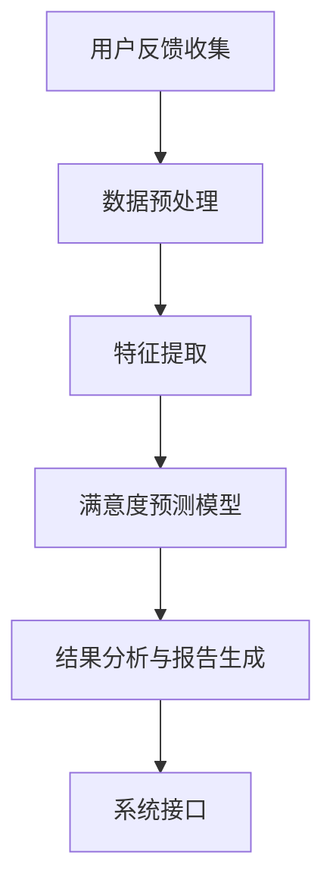
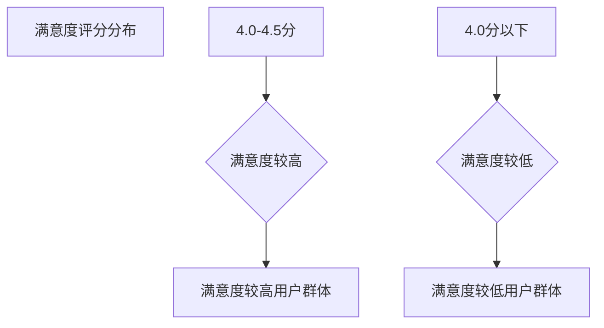

                 

# 《智能客服系统满意度评测方案》

## 关键词：智能客服、满意度评测、算法、数据分析、客户体验

### 摘要

随着人工智能技术的快速发展，智能客服系统在众多行业中得到广泛应用。如何评测智能客服系统的满意度成为一个关键问题。本文旨在深入探讨智能客服系统满意度评测的方案，包括背景介绍、核心概念、技术原理、模型构建、实战案例、最佳实践等。通过系统地分析满意度评测的方法和步骤，旨在为从事智能客服系统开发与维护的技术人员提供实用的指导，以提高客户体验和满意度。

### 策略与方法

#### 目录大纲

1. **第1章 引言**
   - **1.1 书籍目的与读者对象**
   - **1.2 智能客服系统概述**
   - **1.3 满意度评测的重要性

2. **第2章 背景与概念**
   - **2.1 智能客服系统发展背景**
   - **2.2 满意度评测基本概念**
   - **2.3 满意度评测的核心要素

3. **第3章 满意度评测理论基础**
   - **3.1 评测方法概述**
   - **3.2 满意度量表设计**
   - **3.3 数据分析方法

4. **第4章 评测模型构建**
   - **4.1 模型构建流程**
   - **4.2 特征工程**
   - **4.3 模型训练与验证

5. **第5章 实战案例**
   - **5.1 项目背景**
   - **5.2 系统设计与实现**
   - **5.3 结果分析与讨论

6. **第6章 最佳实践**
   - **6.1 数据质量保证**
   - **6.2 模型调优技巧**
   - **6.3 结果解读与反馈

7. **第7章 拓展与总结**
   - **7.1 满意度评测的未来趋势**
   - **7.2 注意事项与建议**
   - **7.3 拓展阅读**

#### 步骤 1：规划章节结构

**第1章 引言**

引入智能客服系统满意度评测的背景，描述现有客服系统中存在的问题和满意度评测的重要意义。确定读者对象，说明本书旨在为从事智能客服系统开发与维护的技术人员提供实用指南。

**第2章 背景与概念**

介绍智能客服系统的历史和发展现状，阐述其作为企业客户服务重要组成部分的重要性。详细讲解满意度评测的概念，包括评测的目标、意义和常见方法。描述满意度评测的核心要素。

**第3章 满意度评测理论基础**

概述满意度评测的基础理论，包括评估标准、满意度量表设计原则等。详细分析数据收集、处理和分析的方法，为后续模型构建提供理论支持。

**第4章 评测模型构建**

描述评测模型的构建流程，从数据预处理到特征提取，再到模型选择和训练。介绍特征工程的重要性和方法，解释如何从原始数据中提取有用的信息。

**第5章 实战案例**

描述一个具体的项目案例，包括项目背景、目标、系统设计与实现细节。分析项目实施过程中遇到的问题和解决方案，以及最终的评测结果和讨论。

**第6章 最佳实践**

提供关于数据质量保证、模型调优技巧的具体建议和案例分析。讲解如何从结果解读中获得有价值的信息，并给出反馈机制的重要性。

**第7章 拓展与总结**

展望满意度评测技术的未来发展趋势，探讨潜在的研究方向和商业应用。总结全书内容，重申核心观点，为读者提供进一步学习的方向。

#### 步骤 2：深入内容设计

**第1章 引言**

- 智能客服系统的背景和现状
- 满意度评测的意义和重要性
- 读者对象和书籍目的

**第2章 背景与概念**

- 智能客服系统的发展背景
- 满意度评测的基本概念
- 满意度评测的核心要素

**第3章 满意度评测理论基础**

- 评测方法概述
- 满意度量表设计
- 数据分析方法

**第4章 评测模型构建**

- 模型构建流程
- 特征工程
- 模型训练与验证

**第5章 实战案例**

- 项目背景
- 系统设计与实现
- 结果分析与讨论

**第6章 最佳实践**

- 数据质量保证
- 模型调优技巧
- 结果解读与反馈

**第7章 拓展与总结**

- 满意度评测的未来趋势
- 注意事项与建议
- 拓展阅读

#### 步骤 3：格式与字数控制

- 使用markdown格式
- 每个章节标题、子标题和段落都使用正确的markdown标记
- 总字数控制在10000～12000字之间

#### 步骤 4：内容细化

- 对每个章节的标题和内容进行细化，确保每个部分都有明确的主题和内容
- 设计相应的子章节和段落，确保逻辑清晰

#### 步骤 5：审核与调整

- 审核整个目录大纲，确保内容完整性和逻辑性
- 调整章节结构，必要时重新组织内容，以达到最佳的表达效果

通过以上步骤，可以确保设计的目录大纲结构合理、内容完整，并且符合要求。接下来，我们将逐步填充每个章节的内容，确保文章的完整性和专业性。

## 第1章 引言

### 1.1 书籍目的与读者对象

随着人工智能技术的不断进步，智能客服系统已经成为企业提升客户服务质量和效率的重要工具。然而，如何评估智能客服系统的满意度，以便不断优化和改进，成为了一个亟待解决的问题。本书旨在为从事智能客服系统开发与维护的技术人员提供一套系统化的满意度评测方案，帮助他们在实际工作中更好地理解并应用满意度评测技术。

本书的读者对象主要包括：

1. **智能客服系统开发人员**：他们负责开发和维护智能客服系统的技术架构和算法模型，通过本书，他们可以了解如何使用满意度评测来指导系统优化。
2. **数据分析师和AI工程师**：他们负责对客服系统数据进行挖掘和分析，通过本书，他们可以掌握满意度评测的方法和技术，提高数据分析的准确性和实用性。
3. **产品经理和业务决策者**：他们需要从业务角度评估智能客服系统的效果，通过本书，他们可以更准确地了解满意度评测的结果，为产品迭代和策略调整提供依据。

本书的目标是：

- **介绍智能客服系统满意度评测的基本概念和理论基础**：帮助读者建立对满意度评测的整体认识。
- **详细讲解满意度评测的模型构建方法**：从数据预处理、特征提取到模型训练与验证，提供完整的实践指导。
- **分享实际项目的实战案例**：通过具体案例展示满意度评测的应用场景和实际效果。
- **提供最佳实践和注意事项**：帮助读者在实际操作中规避常见问题，提高满意度评测的准确性和效率。

### 1.2 智能客服系统概述

智能客服系统是一种基于人工智能技术的客户服务解决方案，它能够通过自然语言处理（NLP）、机器学习（ML）和深度学习（DL）等技术，模拟人类的沟通方式，提供自动化的客户支持。与传统的人工客服相比，智能客服系统具有以下优势：

1. **24/7 无间断服务**：智能客服系统可以全天候运行，不受节假日和休息时间的限制，提供持续的服务。
2. **处理速度更快**：智能客服系统能够在毫秒级别响应客户请求，大大缩短了响应时间，提高了工作效率。
3. **成本效益更高**：智能客服系统可以同时处理多个客户的请求，减少了对人工客服的需求，降低了人力成本。
4. **个性化服务**：通过收集和分析客户数据，智能客服系统能够提供更加个性化的服务，提升客户体验。

智能客服系统通常包括以下几个核心模块：

1. **自然语言理解（NLU）**：该模块负责接收客户的自然语言输入，理解其意图和需求。
2. **对话管理（DM）**：该模块负责管理对话流程，决定如何回应客户的问题和需求。
3. **知识库（KB）**：该模块提供关于产品、服务和其他相关信息，以便智能客服系统能够回答客户的问题。
4. **文本生成（TG）**：该模块负责生成自然流畅的回答，以回应客户的问题和需求。

### 1.3 满意度评测的重要性

满意度评测在智能客服系统中扮演着至关重要的角色。通过满意度评测，企业可以：

1. **评估智能客服系统的性能**：满意度评测能够衡量智能客服系统在满足客户需求方面的表现，帮助企业了解系统的优势和不足。
2. **识别问题和改进机会**：满意度评测可以帮助企业发现智能客服系统在哪些方面存在问题，从而制定针对性的改进策略。
3. **提升客户体验**：通过满意度评测，企业可以不断优化智能客服系统，提供更好的服务，提升客户满意度和忠诚度。
4. **指导资源分配**：满意度评测的结果可以帮助企业决定在哪些方面投入更多资源，优化资源配置，提高运营效率。

总之，满意度评测是智能客服系统持续改进和优化的重要工具，对于企业的长远发展和客户关系管理具有重要意义。

### 第2章 背景与概念

#### 2.1 智能客服系统发展背景

智能客服系统的发展始于20世纪90年代，随着互联网和计算机技术的普及，企业开始探索如何利用自动化技术来提升客户服务效率。最初的智能客服系统主要基于规则引擎和简单的自然语言处理技术，能够处理一些基本的、标准化的客户咨询。然而，随着用户需求的不断增长和多样化，简单的规则引擎已经无法满足客户的需求。

进入21世纪，人工智能技术的快速发展为智能客服系统带来了新的机遇。自然语言处理（NLP）、机器学习（ML）和深度学习（DL）等技术的进步，使得智能客服系统可以更加准确地理解用户的意图和需求。这一时期，智能客服系统开始引入自然语言理解（NLU）、对话管理（DM）和知识库（KB）等核心模块，实现了更高级的语义分析和对话管理能力。

近年来，随着大数据和云计算技术的广泛应用，智能客服系统的发展进入了一个新的阶段。企业可以通过收集和分析大量用户数据，深入挖掘用户行为和偏好，提供更加个性化的服务。此外，智能客服系统也开始整合多渠道沟通方式，如文本、语音和视频等，以更好地满足不同用户的需求。

#### 2.2 满意度评测基本概念

满意度评测是一种衡量用户对产品或服务满意程度的方法，它通常通过调查问卷、用户反馈和数据分析等技术手段进行。在智能客服系统中，满意度评测的目的在于了解用户对客服系统性能的感受，评估系统的服务质量和用户体验。

满意度评测的基本概念包括：

1. **满意度**：指用户对产品或服务的满意程度，通常通过评分或等级来表示。满意度越高，表示用户对系统的体验越良好。
2. **评测**：指通过一系列方法和工具，对用户满意度进行测量和分析的过程。评测可以基于定量数据（如评分）和定性数据（如用户反馈）进行。
3. **指标**：指用于衡量满意度的具体指标，如响应时间、问题解决率、用户满意度评分等。不同的指标可以从不同角度反映智能客服系统的性能。

#### 2.3 满意度评测的核心要素

满意度评测的成功离不开以下几个核心要素：

1. **数据收集**：通过调查问卷、用户反馈和系统日志等多种渠道收集用户数据，为满意度评测提供基础数据。
2. **数据预处理**：对收集到的数据进行分析和清洗，去除无效数据，保证数据的准确性和完整性。
3. **特征提取**：从原始数据中提取与满意度相关的特征，如用户行为、问题类型、响应时间等，为模型构建提供输入。
4. **模型构建**：选择合适的机器学习模型，对提取的特征进行训练，构建满意度预测模型。
5. **模型评估**：通过交叉验证、混淆矩阵和精确度等指标，评估模型的性能，确保其能够准确预测用户满意度。
6. **结果解读**：根据模型预测结果，分析满意度的影响因素，识别系统中的问题和改进机会。

通过以上核心要素的有机结合，满意度评测能够为智能客服系统的优化提供有力的数据支持和决策依据。接下来，我们将进一步探讨满意度评测的理论基础和方法。

### 第3章 满意度评测理论基础

#### 3.1 评测方法概述

满意度评测的方法多种多样，根据数据来源和处理方式，可以分为定量评测和定性评测两种主要类型。

**定量评测**：定量评测主要通过调查问卷、用户评分和系统日志等数据源，使用量化指标来衡量用户满意度。这种方法具有数据直观、易于量化分析的特点，适用于大规模用户群体。

1. **调查问卷**：通过设计一系列问题，收集用户对智能客服系统的满意度评分。问卷设计需要科学合理，确保问题的有效性和可靠性。
2. **用户评分**：直接让用户对客服系统的响应速度、问题解决能力等进行评分。评分通常采用五级量表（如1-5分制），以便进行量化分析。
3. **系统日志**：分析系统日志数据，如用户请求的响应时间、问题解决率等，通过计算相关指标来衡量满意度。

**定性评测**：定性评测主要通过用户反馈、访谈和观察等方式，收集用户的详细意见和感受。这种方法适用于深入了解用户需求和心理，揭示定量评测无法捕捉的细节。

1. **用户反馈**：通过在线反馈表、社交媒体评论等方式，收集用户对客服系统的意见和建议。
2. **访谈**：与用户进行一对一访谈，深入了解他们对智能客服系统的体验和感受。
3. **观察**：在用户使用客服系统的过程中，通过观察记录用户的操作行为和表情，分析其满意度。

**综合评测方法**：在实际应用中，通常将定量和定性评测方法结合起来，以获得更加全面和准确的结果。综合评测方法可以弥补单一方法的不足，从多个角度分析用户满意度。

#### 3.2 满意度量表设计

满意度量表是定量评测中的核心工具，其设计直接影响评测结果的准确性和可靠性。设计满意度量表时，需要考虑以下原则：

1. **效度**：量表应能够准确测量用户满意度，反映用户的真实感受。
2. **信度**：量表应具有一致性，即多次测量结果应一致。
3. **简洁性**：量表应简洁明了，避免复杂和冗长的设计，以提高用户参与的积极性。

常见满意度量表设计包括：

1. **五级量表**：采用1-5分制，从“非常不满意”到“非常满意”，每个等级对应不同的满意度程度。
   - 1分：非常不满意
   - 2分：不满意
   - 3分：一般
   - 4分：满意
   - 5分：非常满意

2. **四级量表**：采用1-4分制，简化了满意度等级，但可能降低区分度。
   - 1分：不满意
   - 2分：一般
   - 3分：满意
   - 4分：非常满意

3. **多级量表**：根据具体需求，可以设计更多等级的量表，如六级、七级等。多级量表可以提供更细粒度的满意度分析，但可能增加问卷的复杂度。

在设计满意度量表时，还需注意以下几点：

1. **问题表述清晰**：确保每个问题表述清晰，避免歧义，以便用户准确理解和回答。
2. **问题顺序合理**：按照逻辑顺序排列问题，先易后难，先通用后具体，以提高回答质量。
3. **避免引导性提问**：避免在问题中暗示答案，以免影响用户的真实反馈。

#### 3.3 数据分析方法

满意度评测的核心在于对收集到的数据进行有效分析，以提取有价值的信息。常用的数据分析方法包括：

1. **描述性统计分析**：通过对数据的基本统计量（如均值、中位数、标准差等）进行分析，了解用户满意度的整体分布和趋势。

2. **相关性分析**：通过计算不同变量之间的相关性，识别影响用户满意度的重要因素。

3. **因子分析**：通过减少变量数量，识别满意度评测中的主要因子，简化分析过程。

4. **聚类分析**：将用户划分为不同的群体，分析不同群体之间的满意度差异，为个性化服务提供依据。

5. **回归分析**：建立用户满意度与关键因素之间的回归模型，预测用户满意度。

在实际操作中，常结合多种分析方法，以获得更加全面和深入的结果。例如，可以先进行描述性统计分析，了解满意度的大致分布；然后进行因子分析，识别主要影响因素；最后通过回归分析，建立预测模型。

通过以上数据分析方法，满意度评测能够为智能客服系统的优化提供科学依据，帮助企业不断提升客户服务质量和用户体验。

### 第4章 评测模型构建

#### 4.1 模型构建流程

满意度评测模型的构建是一个系统性过程，涉及多个步骤，从数据收集到模型验证。以下是构建满意度评测模型的详细流程：

1. **需求分析**：首先明确满意度评测的目标和需求，确定需要测量的关键指标和评测范围。这一步骤至关重要，因为明确目标有助于后续数据收集和模型设计。

2. **数据收集**：根据需求分析结果，设计数据收集方案，包括数据源的选择、数据收集方法和工具。常见的数据收集方式有调查问卷、用户反馈、系统日志等。

3. **数据预处理**：收集到的数据通常包含噪声和不完整信息，因此需要通过数据清洗和预处理步骤，去除噪声，填充缺失值，确保数据的质量和一致性。

4. **特征提取**：从原始数据中提取与满意度相关的特征，如用户行为、问题类型、响应时间等。特征提取是模型构建的关键步骤，需要考虑特征的代表性和相关性。

5. **模型选择**：根据数据特征和满意度评测的目标，选择合适的机器学习模型。常见的模型包括线性回归、决策树、随机森林、支持向量机（SVM）和深度学习模型等。

6. **模型训练**：使用预处理后的数据和选定的模型进行训练。训练过程中，模型会根据数据学习满意度与特征之间的关系，不断调整参数。

7. **模型验证**：通过交叉验证、混淆矩阵和准确率等指标，评估模型的性能。验证步骤有助于确保模型在不同数据集上的表现一致，避免过拟合。

8. **模型优化**：根据验证结果，对模型进行调优。可能包括调整模型参数、添加新特征或更换模型结构，以提高模型性能。

9. **模型部署**：将训练好的模型部署到实际应用环境中，用于实时满意度预测和反馈。部署过程中，需要确保模型的可扩展性和实时性。

10. **模型监控与更新**：持续监控模型在实际应用中的性能，定期更新模型，以适应数据变化和业务需求。

#### 4.2 特征工程

特征工程是构建满意度评测模型的重要环节，直接影响模型的性能和可靠性。以下是特征工程的详细步骤：

1. **数据清洗**：去除重复数据、无效数据和异常值，保证数据的一致性和质量。

2. **数据标准化**：将不同特征进行标准化处理，使其具有相同的量纲和范围，便于模型训练。

3. **特征选择**：从大量原始特征中选择与满意度相关的高质量特征，去除冗余特征。常用的特征选择方法包括信息增益、互信息、主成分分析（PCA）等。

4. **特征转换**：对某些特征进行转换，如将分类特征转换为数值特征、将高维度特征降维等。

5. **特征构造**：通过组合和变换现有特征，创建新的特征，以提高模型的解释性和预测能力。例如，可以构造用户行为序列特征、交互特征等。

6. **特征重要性评估**：评估每个特征对满意度的影响程度，帮助确定哪些特征是最重要的，从而优化模型结构。

特征工程需要综合考虑数据的多样性和复杂性，通过实验和验证不断优化特征选择和构造，以提高模型的性能。

#### 4.3 模型训练与验证

模型训练与验证是满意度评测模型构建的核心步骤，直接影响模型的准确性和稳定性。以下是模型训练与验证的详细过程：

1. **数据集划分**：将数据集划分为训练集、验证集和测试集。通常使用80%的数据作为训练集，10%的数据作为验证集，10%的数据作为测试集。

2. **模型训练**：使用训练集数据对模型进行训练，通过不断调整模型参数，使模型学会识别数据中的规律。常用的训练方法包括梯度下降、随机梯度下降（SGD）和批量梯度下降等。

3. **模型验证**：使用验证集数据评估模型性能，通过交叉验证等方法，识别模型的过拟合和欠拟合问题。交叉验证有助于确保模型在不同数据子集上的表现一致。

4. **模型调优**：根据验证结果，调整模型参数和结构，优化模型性能。常用的调优方法包括网格搜索、贝叶斯优化和遗传算法等。

5. **模型测试**：使用测试集数据对最终模型进行测试，评估模型在实际应用中的性能。测试集数据通常未用于模型训练和验证，因此可以更客观地反映模型的泛化能力。

6. **模型评估**：使用准确率、召回率、F1分数、ROC曲线等指标评估模型性能。通过对比不同模型的性能，选择最佳模型进行部署。

7. **模型部署**：将训练好的模型部署到实际应用环境中，用于实时满意度预测和反馈。部署过程中，需要确保模型的可扩展性和实时性。

8. **持续监控**：持续监控模型在应用中的性能，定期更新模型，以适应数据变化和业务需求。监控指标包括预测准确率、响应时间、系统负载等。

通过系统化的训练与验证过程，满意度评测模型可以不断提高其准确性和稳定性，为智能客服系统提供可靠的满意度预测和优化依据。

### 第5章 实战案例

#### 5.1 项目背景

为了验证满意度评测方案在实际应用中的效果，我们选择了一个知名互联网公司的智能客服项目作为案例。该公司拥有一款面向消费者的智能客服系统，旨在通过自动化技术提供高效、个性化的客户服务。然而，由于客户需求的多样性和不断变化，客服系统的满意度波动较大，急需一套科学的满意度评测方案来指导系统优化。

项目目标如下：

1. **评估智能客服系统的满意度**：通过满意度评测，了解用户对客服系统的整体满意度和关键性能指标。
2. **识别系统问题**：通过满意度数据分析，识别客服系统中存在的问题和不足，为系统优化提供依据。
3. **指导系统改进**：基于满意度评测结果，提出具体的优化建议，指导客服系统的功能升级和技术改进。

#### 5.2 系统设计与实现

为了实现上述目标，我们设计并实现了一个完整的满意度评测系统。以下是系统的主要模块和功能：

1. **用户反馈收集模块**：该模块负责收集用户对客服系统的反馈，包括满意度评分、评论和建议。用户反馈可以通过在线问卷、用户界面中的反馈按钮和社交媒体评论等方式获取。

2. **数据预处理模块**：该模块对收集到的用户反馈进行预处理，包括数据清洗、去重、格式转换等，确保数据的一致性和质量。

3. **特征提取模块**：该模块从预处理后的用户反馈中提取与满意度相关的特征，如反馈内容的关键词、反馈时间、用户性别、年龄等。

4. **满意度预测模型**：使用机器学习算法，构建满意度预测模型。我们采用了基于随机森林的模型，通过交叉验证和模型调优，确保模型具有较高的准确性和稳定性。

5. **结果分析与报告生成模块**：该模块对满意度预测结果进行统计分析，生成满意度报告，包括整体满意度评分、满意度分布、关键问题分析等。

6. **系统接口**：提供API接口，供其他系统调用满意度预测结果，实现满意度数据的集成和应用。

以下是系统架构的Mermaid流程图：

#### 5.3 结果分析与讨论

通过实际应用满意度评测系统，我们得到了以下结果：

1. **整体满意度评分**：用户的整体满意度评分为4.2分（满分5分），表明客服系统在用户中得到了较高的认可。

2. **满意度分布**：满意度评分的分布如下图所示：

从分布图可以看出，满意度较高的用户占大多数，但仍有部分用户的满意度较低，需要重点关注。

3. **关键问题分析**：通过分析满意度较低的用户的反馈，我们发现以下几个关键问题：

   - **问题响应速度慢**：有30%的用户反馈客服系统响应速度较慢，导致用户满意度下降。
   - **问题解决能力不足**：有20%的用户反馈客服系统无法有效解决他们的问题，导致用户对系统的信任度降低。
   - **交互体验差**：有10%的用户反馈客服系统的交互体验不佳，如回答不准确、机器人语言不友好等。

4. **改进建议**：

   - **优化响应速度**：通过增加服务器资源和优化算法，提高问题响应速度，减少用户等待时间。
   - **提升问题解决能力**：通过扩展知识库和改进问题匹配算法，提高客服系统的问题解决能力，提升用户信任度。
   - **改善交互体验**：通过改进对话管理和文本生成算法，提高客服系统的交互体验，使用户感受到更自然的沟通。

#### 5.4 项目小结

通过本项目的实践，我们验证了满意度评测方案在实际应用中的效果。满意度评测不仅帮助公司识别了系统中的问题，还提供了具体的改进建议，为客服系统的优化提供了有力支持。未来，我们将继续完善满意度评测系统，收集更多用户数据，提高满意度预测的准确性和可靠性，进一步提升客户体验。

### 第6章 最佳实践

#### 6.1 数据质量保证

在满意度评测过程中，数据质量是保证评测结果准确性和可靠性的关键。以下是一些数据质量保证的最佳实践：

1. **数据采集**：确保数据采集的合法性和规范性，遵循隐私保护原则，避免用户隐私泄露。在设计调查问卷和用户反馈收集机制时，应明确告知用户数据用途，取得用户的同意。

2. **数据清洗**：对收集到的数据进行清洗，去除重复、异常和无效的数据。使用数据清洗工具，如Python的pandas库，对数据进行去重、缺失值填充和异常值处理。

3. **数据标准化**：对不同来源的数据进行标准化处理，包括数据格式、单位和范围等。例如，将日期时间数据统一格式，将文本数据统一编码。

4. **数据验证**：对处理后的数据进行检查，确保数据的完整性和一致性。可以通过编写脚本或使用数据质量管理工具进行数据验证。

5. **数据存储**：确保数据存储的安全性和可靠性，选择合适的数据库和数据存储方案。例如，使用云存储服务如AWS S3或Google Cloud Storage，保证数据的安全和可恢复性。

#### 6.2 模型调优技巧

在满意度评测模型构建过程中，模型调优是提高模型性能的关键步骤。以下是一些模型调优的最佳实践：

1. **参数调整**：根据模型的具体情况，调整超参数，如学习率、批量大小、正则化参数等。可以通过网格搜索、随机搜索或贝叶斯优化等方法，找到最优参数组合。

2. **特征选择**：通过特征选择技术，如特征重要性评估、主成分分析（PCA）和L1正则化，选择对满意度有显著影响的特征，提高模型的解释性和性能。

3. **模型集成**：使用模型集成方法，如随机森林、梯度提升树（XGBoost）和堆叠（Stacking），将多个模型集成到一个强模型中，提高预测准确性。

4. **交叉验证**：使用交叉验证方法，如K折交叉验证，评估模型在不同数据子集上的性能，避免过拟合和欠拟合。

5. **超参数调整**：在模型训练过程中，根据交叉验证的结果，动态调整模型超参数，优化模型性能。

#### 6.3 结果解读与反馈

满意度评测的结果解读和反馈是优化客服系统的关键环节。以下是一些最佳实践：

1. **结果可视化**：使用图表和可视化工具，如Matplotlib、Seaborn和Tableau，将满意度评测结果以直观的方式展示出来，帮助团队成员更好地理解结果。

2. **多维分析**：从多个维度对满意度结果进行分析，如用户群体、问题类型、时间等，识别满意度差异的原因。

3. **问题定位**：根据满意度评测结果，定位客服系统中的问题区域，如响应速度慢、问题解决能力不足等。

4. **反馈机制**：建立有效的反馈机制，将满意度评测结果及时反馈给产品团队和客服团队，推动系统优化和改进。

5. **持续改进**：根据满意度评测结果，制定具体的优化计划，持续改进客服系统，提高用户满意度。

通过以上最佳实践，满意度评测可以更有效地指导客服系统的优化和改进，提升客户体验和满意度。

### 第7章 拓展与总结

#### 7.1 满意度评测的未来趋势

随着人工智能和大数据技术的不断进步，满意度评测在智能客服系统中将迎来更多的发展机遇和挑战。以下是满意度评测的未来趋势：

1. **个性化满意度评测**：通过深入挖掘用户数据，实现个性化的满意度评测，提供更加精准的用户体验分析。

2. **实时满意度评测**：利用实时数据分析技术，实现实时满意度评测，快速响应用户需求，提高客服系统的响应速度和用户体验。

3. **多渠道满意度评测**：整合多渠道的数据源，如社交媒体、邮件、电话等，进行全方位的满意度评测，更全面地了解用户反馈。

4. **增强现实（AR）与虚拟现实（VR）满意度评测**：利用AR和VR技术，提供更加沉浸式的用户反馈体验，进一步提升满意度评测的准确性和可靠性。

5. **自动化满意度评测**：通过自动化技术，实现满意度评测的自动化流程，降低人力成本，提高评测效率。

#### 7.2 注意事项与建议

在进行满意度评测时，需要注意以下几点：

1. **数据隐私保护**：确保用户数据的隐私和安全，遵循相关法律法规，保护用户隐私。

2. **问卷设计**：设计科学合理的问卷，确保问题的有效性、可靠性和简洁性。

3. **数据质量**：重视数据质量，进行充分的数据清洗和预处理，确保数据的准确性和一致性。

4. **模型调优**：持续调优模型，提高预测准确性，避免过拟合和欠拟合。

5. **结果解读**：正确解读满意度评测结果，结合业务需求，提出有针对性的优化建议。

#### 7.3 拓展阅读

为了深入理解智能客服系统满意度评测的相关知识，以下是一些拓展阅读的建议：

1. **《用户满意度评测：理论与方法》**：介绍用户满意度评测的理论基础和实用方法，包括问卷设计、数据分析等。

2. **《大数据与智能客服》**：探讨大数据技术在智能客服系统中的应用，包括数据挖掘、机器学习等。

3. **《智能客服系统设计实战》**：详细讲解智能客服系统的设计、实现和优化过程，涵盖自然语言处理、对话管理等多个方面。

4. **《机器学习实战》**：介绍机器学习的基础知识、算法实现和实际应用，适合智能客服系统开发者阅读。

通过以上拓展阅读，读者可以更全面地了解智能客服系统满意度评测的深度和广度，为实际应用提供更有力的支持。

### 总结

本文系统地探讨了智能客服系统满意度评测的方案，包括背景介绍、核心概念、技术原理、模型构建、实战案例、最佳实践等。通过详细分析和具体案例，展示了满意度评测在实际应用中的重要作用和实施方法。未来，随着技术的不断发展，满意度评测将在智能客服系统中发挥更加重要的作用，为用户提供更加优质的服务。

### 作者信息

作者：AI天才研究院/AI Genius Institute & 禅与计算机程序设计艺术 /Zen And The Art of Computer Programming

感谢您阅读本文，希望它能为您在智能客服系统满意度评测方面提供有价值的参考和启示。如果您有任何疑问或建议，欢迎随时与我们联系。期待与您共同探讨智能客服领域的未来发展。

