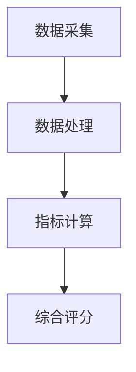
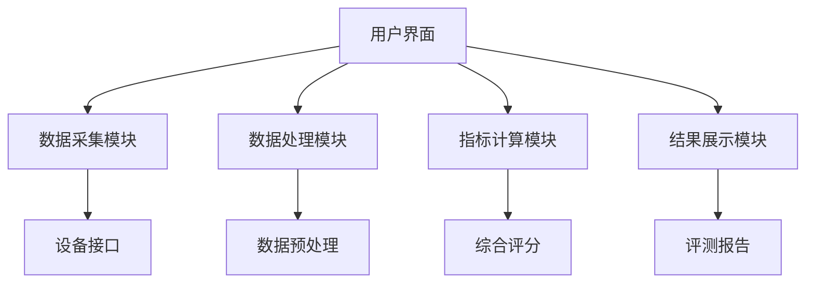

                 

### 引言

**关键词：智能家居、互操作性、评测平台、设计、实现**

**摘要：**
随着智能家居设备的普及，设备和系统之间的互操作性成为一个关键问题。本文旨在介绍智能家居设备互操作性评测平台的设计与实现，通过逻辑清晰的分析，探讨评测标准、平台架构及其实施细节。本文将首先概述智能家居设备互操作性的重要性，接着详细探讨评测标准、平台设计，以及实现与部署过程，并通过具体案例研究展示评测平台的实际应用效果。最后，本文将对评测平台的应用与影响进行深入分析，并提出未来研究方向。

**目录大纲：**
1. **引言**
2. **第一部分：智能家居设备互操作性概述**
    1. **第1章：智能家居设备互操作性概述**
        1.1 智能家居设备互操作性的概念与重要性
        1.2 智能家居设备互操作性面临的挑战
        1.3 本书的目标与结构
    2. **第2章：智能家居设备互操作性评测标准**
        2.1 评测标准的制定原则
        2.2 主要评测标准介绍
        2.3 评测标准的应用场景
    3. **第3章：智能家居设备互操作性评测平台设计**
        3.1 平台设计的目标与功能
        3.2 平台架构设计
        3.3 数据采集与处理模块
        3.4 评测算法设计
    4. **第4章：评测平台的实现与部署**
        4.1 开发环境与工具
        4.2 平台实现的核心技术
        4.3 平台的部署与测试
    5. **第5章：评测案例研究**
        5.1 案例选择与数据来源
        5.2 评测结果分析与讨论
        5.3 案例总结与启示
    6. **第6章：评测平台的应用与影响**
        6.1 评测平台在智能家居行业中的应用
        6.2 评测平台对智能家居设备互操作性的影响
        6.3 评测平台的发展趋势与展望
    7. **第7章：结论与未来工作**
        7.1 研究成果总结
        7.2 不足与改进方向
        7.3 未来研究方向

### 第一部分：智能家居设备互操作性概述

#### 第1章：智能家居设备互操作性概述

智能家居设备互操作性是智能家居系统中一个至关重要的概念。在智能家居系统中，设备之间的互操作性指的是不同设备能够无缝协作，交换信息，实现控制和自动化。这种互操作性不仅提升了用户的体验，还极大地增强了系统的功能性和效率。

#### 1.1 智能家居设备互操作性的概念与重要性

**定义：** 智能家居设备互操作性是指不同厂商生产的智能设备能够通过标准化的协议和接口进行通信和协作，实现数据的共享和控制指令的执行。

**重要性：** 智能家居设备互操作性对整个智能家居生态系统具有重要意义：

1. **用户体验的提升：** 互操作性使得用户能够轻松地添加新的设备到智能家居系统中，而不必担心设备之间的兼容性问题，从而提高用户的满意度。
2. **系统功能的增强：** 通过互操作性，不同设备能够协同工作，实现更为复杂和自动化的场景，比如家庭自动化、智能安防等。
3. **设备管理的简化：** 互操作性使得用户可以通过一个中心化的平台来管理和控制所有的智能家居设备，简化了设备的管理流程。
4. **市场扩展：** 对于智能家居设备制造商来说，互操作性能够吸引更多的用户和合作伙伴，促进市场的扩展。

#### 1.2 智能家居设备互操作性面临的挑战

尽管智能家居设备互操作性具有重要意义，但在实际应用中仍面临许多挑战：

1. **协议的不一致性：** 智能家居市场存在多种协议和标准，不同设备之间可能使用不同的通信协议，导致互操作性受限。
2. **数据安全和隐私：** 在设备间传输数据时，如何保障数据的安全性和用户隐私是一个重要问题。
3. **设备的多样性和复杂性：** 智能家居设备种类繁多，包括智能灯泡、智能插座、智能音箱、智能摄像头等，这些设备具有不同的硬件、软件和功能，互操作性的实现复杂。
4. **标准化和兼容性：** 缺乏统一的标准和规范，导致设备之间的兼容性差，互操作性难以实现。

#### 1.3 本书的目标与结构

**目标：** 本文旨在设计并实现一个智能家居设备互操作性评测平台，通过对不同设备的评测，分析其互操作性的实现情况，为智能家居设备制造商提供改进方向。

**结构：** 本文分为以下几个部分：

1. **第一部分：智能家居设备互操作性概述**，介绍互操作性的概念、重要性和面临的挑战。
2. **第二部分：智能家居设备互操作性评测标准**，讨论评测标准的制定原则、主要评测标准和应用场景。
3. **第三部分：智能家居设备互操作性评测平台设计**，详细介绍评测平台的设计目标、架构、数据采集与处理模块以及评测算法设计。
4. **第四部分：评测平台的实现与部署**，描述评测平台的实现环境、核心技术、部署流程和测试方法。
5. **第五部分：评测案例研究**，通过具体案例展示评测平台的应用效果。
6. **第六部分：评测平台的应用与影响**，分析评测平台在智能家居行业中的应用、影响及发展趋势。
7. **第七部分：结论与未来工作**，总结研究成果，提出改进方向和未来研究方向。

#### 背景介绍

随着物联网（IoT）技术的迅猛发展，智能家居设备日益普及，为家庭生活带来了诸多便利。然而，设备之间的互操作性成为了一个关键挑战。不同制造商生产的设备可能采用不同的通信协议和标准，导致设备之间的兼容性问题，从而影响了用户体验和系统功能的实现。

例如，用户可能希望将智能灯泡、智能插座和智能音箱集成到一个统一的系统中，实现灯光控制、场景设定和语音交互等功能。然而，如果这些设备之间缺乏互操作性，用户将不得不分别使用不同的应用程序或控制界面，这不仅增加了操作复杂性，还降低了用户体验。

此外，随着智能家居设备种类的不断增加，设备之间的互操作性需求也越来越高。智能摄像头、智能冰箱、智能门锁等设备都需要能够与中心控制平台或其他设备进行有效通信，以实现自动化和智能化的功能。

#### 问题背景

智能家居设备的互操作性面临以下背景问题：

1. **协议不兼容：** 由于不同设备可能采用不同的通信协议（如Zigbee、WiFi、蓝牙等），导致设备之间难以直接进行通信和协作。
2. **缺乏标准化：** 目前智能家居行业缺乏统一的标准化协议和规范，不同厂商的产品往往使用各自开发的协议，增加了互操作性的难度。
3. **数据安全和隐私：** 智能家居设备在传输和共享数据时，如何确保数据的安全性以及保护用户的隐私是一个重要问题。
4. **设备多样性：** 智能家居设备种类繁多，包括不同品牌、型号和功能的设备，互操作性的实现复杂。
5. **用户体验不一致：** 用户在使用智能家居系统时，可能会遇到操作不一致、响应速度慢等问题，降低了用户体验。

#### 问题描述

本文旨在解决以下问题：

1. **如何设计一个智能家居设备互操作性评测平台？**
2. **评测平台应如何制定标准化的评测标准？**
3. **评测平台应如何实现设备之间的互操作性？**
4. **评测平台在实现过程中应如何保证数据的安全性和用户隐私？**
5. **评测平台在智能家居行业中的应用前景如何？**

#### 问题解决

为了解决上述问题，本文采取了以下方法：

1. **设计评测平台：** 针对智能家居设备的互操作性，设计一个评测平台，用于评估不同设备之间的互操作性能。
2. **制定评测标准：** 制定一套标准化的评测标准，涵盖设备兼容性、通信效率、数据安全等多个方面。
3. **实现设备互操作性：** 通过实现标准化的通信协议和数据格式，确保设备之间能够无缝协作。
4. **保证数据安全：** 采取加密、认证等安全措施，确保设备传输数据的安全性。
5. **应用与影响分析：** 通过具体案例研究，分析评测平台在智能家居行业中的应用效果，探讨其对行业的影响。

#### 边界与外延

本文的研究边界主要涉及智能家居设备的互操作性评测，不包括其他方面（如智能家居系统的安全性、可靠性等）。在研究过程中，本文将重点关注设备的互操作性，探讨如何通过评测平台评估和改进设备之间的协作能力。

#### 概念结构与核心要素组成

智能家居设备互操作性评测平台由以下几个核心要素组成：

1. **评测标准：** 包括设备兼容性、通信效率、数据安全等多个方面的评测标准。
2. **数据采集模块：** 负责收集设备间的通信数据，为评测提供基础数据。
3. **数据处理模块：** 对采集到的数据进行处理和分析，生成评测结果。
4. **评测算法：** 用于对设备之间的互操作性能进行评估，包括通信延迟、数据传输速率、错误率等指标。
5. **用户界面：** 提供一个直观、易用的界面，使用户能够轻松地使用评测平台，查看评测结果。
6. **设备接口：** 用于与智能家居设备进行通信，确保设备能够与评测平台无缝协作。

#### 总结

智能家居设备互操作性是智能家居系统中的一个关键问题，本文通过逻辑清晰的分析，探讨了智能家居设备互操作性的概念、重要性、面临的挑战以及评测平台的设计与实现。下一部分将详细讨论智能家居设备互操作性评测标准，为后续章节提供理论基础。### 智能家居设备互操作性评测标准

在设计和实现智能家居设备互操作性评测平台时，评测标准的制定至关重要。这些标准将定义评测的框架和指标，确保评测的客观性和全面性。以下是关于评测标准制定原则、主要评测标准以及这些标准在实际应用场景中的详细讨论。

#### 2.1 评测标准的制定原则

**原则1：标准化与兼容性**  
评测标准应遵循国际或行业标准，如IEEE 802.15.4、Bluetooth 5.0、Wi-Fi 6等，以确保设备之间的互操作性。同时，标准应具备良好的兼容性，能够适应不同设备和系统的要求。

**原则2：全面性**  
评测标准应涵盖智能家居设备的各个方面，包括通信效率、数据安全性、设备兼容性等。全面的评测标准有助于全面评估设备之间的互操作性能。

**原则3：可量化**  
评测标准应具有可量化的指标，如数据传输速率（Mbps）、通信延迟（ms）、错误率（%）等，以便对设备进行量化评估。

**原则4：易用性**  
评测标准应简洁明了，易于理解和执行，以确保评测过程的顺利进行。同时，评测标准应提供详细的说明和指导，帮助评测人员正确执行评测。

**原则5：动态更新**  
随着智能家居技术的发展和设备种类的增加，评测标准也应不断更新，以适应新的需求和挑战。

#### 2.2 主要评测标准介绍

**通信效率**

通信效率是评测智能家居设备互操作性的重要指标之一，它反映了设备之间传输数据的能力。主要评测标准包括：

- **数据传输速率**：衡量设备传输数据的速度，通常以Mbps（兆比特每秒）为单位。
- **通信延迟**：衡量设备之间传输数据所需的时间，通常以ms（毫秒）为单位。
- **带宽利用率**：衡量设备在传输数据时的带宽利用率，通常以百分比表示。

**设备兼容性**

设备兼容性是确保不同设备能够无缝协作的关键。主要评测标准包括：

- **协议兼容性**：检查设备是否遵循相同的通信协议和标准，如Zigbee、WiFi、蓝牙等。
- **接口兼容性**：检查设备是否具备相同的接口类型和规格，如USB、Wi-Fi天线接口等。
- **软件兼容性**：检查设备是否支持相同的操作系统和应用程序。

**数据安全性**

数据安全性是保护用户隐私和设备免受攻击的重要方面。主要评测标准包括：

- **加密算法**：检查设备是否使用安全的加密算法来保护数据传输。
- **认证机制**：检查设备是否支持身份认证和访问控制，以防止未经授权的访问。
- **漏洞扫描**：定期对设备进行漏洞扫描，确保设备不存在已知的安全漏洞。

**用户体验**

用户体验是评估智能家居设备互操作性的重要方面，它反映了设备在实际使用中的表现。主要评测标准包括：

- **界面一致性**：检查设备是否提供一致的界面设计和交互体验。
- **响应速度**：检查设备在执行操作时的响应速度，如开关灯、调整温度等。
- **错误处理**：检查设备在遇到错误时的处理能力，如网络断连、设备故障等。

#### 2.3 评测标准的应用场景

**应用场景1：智能家居设备制造商**  
智能家居设备制造商可以使用评测标准来评估和改进其产品的互操作性。通过评测，制造商可以识别设备的优势和不足，从而进行针对性的优化和改进。

**应用场景2：智能家居系统集成商**  
智能家居系统集成商在设计和实施智能家居系统时，可以使用评测标准来评估不同设备之间的互操作性。这有助于确保系统功能的实现和用户的满意度。

**应用场景3：智能家居用户**  
智能家居用户可以使用评测标准来评估购买设备之间的互操作性。通过评测结果，用户可以做出更明智的购买决策，选择符合自身需求的高互操作性设备。

**应用场景4：学术界和研究机构**  
学术界和研究机构可以利用评测标准来研究智能家居设备互操作性的技术挑战和解决方案。评测标准的制定和优化有助于推动智能家居技术的发展。

### 核心概念与联系

在讨论智能家居设备互操作性评测标准时，有必要深入理解以下几个核心概念及其相互关系：

**通信效率**、**设备兼容性**、**数据安全性**和**用户体验**。

**通信效率**：这是衡量设备之间数据传输能力的指标，包括数据传输速率、通信延迟和带宽利用率。它直接影响智能家居系统的响应速度和流畅度。

**设备兼容性**：这是确保不同设备能够无缝协作的关键，涉及协议兼容性、接口兼容性和软件兼容性。良好的兼容性是通信效率的保障，也是实现数据安全性和用户体验的基础。

**数据安全性**：这是保护用户隐私和设备免受攻击的重要方面，包括加密算法、认证机制和漏洞扫描。数据安全性直接关系到用户的信任和满意度。

**用户体验**：这是用户在使用智能家居系统时的整体感受，包括界面一致性、响应速度和错误处理。用户体验是衡量智能家居系统成功与否的重要标准。

这些概念之间相互关联，共同构成了智能家居设备互操作性评测的核心。通过合理的评测标准，可以全面、客观地评估设备之间的互操作性，为制造商、系统集成商和用户提供决策依据。

#### ER实体关系图架构

为了更好地理解智能家居设备互操作性评测标准中的核心概念及其关系，我们可以使用Mermaid绘制ER实体关系图。以下是一个简化的ER实体关系图，展示了评测标准、设备、用户等实体及其关联关系：

```mermaid
erDiagram
  Device ||--|{ Standard : follows} Standard
  Device ||--|{ Compatibility : compatible_with} Device
  Device ||--|{ Security : secure_data} Security
  Device ||--|{ Experience : provide} Experience
  User ||--|{ Control : controls} Device
  Standard ||--|{ Efficiency : measure} Efficiency
  Standard ||--|{ Compatibility : check} Compatibility
  Standard ||--|{ Security : ensure} Security
  Standard ||--|{ Experience : enhance} Experience
```

在这个ER实体关系图中，设备遵循评测标准（Standard），这些标准包括效率、兼容性、安全性和用户体验。设备之间具有兼容性（Compatibility），并通过安全性（Security）确保数据传输的安全。用户（User）可以控制设备（Device），并从中获得良好的用户体验（Experience）。

#### 算法原理讲解

在智能家居设备互操作性评测中，算法设计是核心环节之一。以下将详细阐述评测算法的原理，并使用mermaid绘制流程图和Python源代码进行解释。

**算法原理：**

1. **数据采集：** 首先，从各个设备中采集通信数据，包括数据传输速率、通信延迟、带宽利用率等指标。
2. **数据处理：** 对采集到的数据进行预处理，如去除异常值、平滑处理等，以确保数据的准确性和可靠性。
3. **指标计算：** 根据预处理后的数据，计算各个设备的通信效率、设备兼容性、数据安全性和用户体验等指标。
4. **综合评分：** 结合各个指标的得分，计算出设备的综合评分，以评估其互操作性。

**mermaid流程图：**



**Python源代码：**

```python
import pandas as pd

def collect_data(devices):
    data = []
    for device in devices:
        # 采集通信数据
        rate = device.transmission_rate()
        delay = device.communication_delay()
        utilization = device.bandwidth_utilization()
        data.append([device.id, rate, delay, utilization])
    return pd.DataFrame(data, columns=['Device ID', 'Rate (Mbps)', 'Delay (ms)', 'Utilization (%)'])

def process_data(data):
    # 数据预处理
    return data.dropna().apply(lambda x: x.mean())

def calculate_metrics(data):
    # 计算各个设备的指标
    metrics = data.groupby('Device ID').agg({'Rate': 'mean', 'Delay': 'mean', 'Utilization': 'mean'})
    return metrics

def calculate_score(metrics):
    # 计算综合评分
    score = (metrics['Rate'] * 0.4 + metrics['Delay'] * 0.3 + metrics['Utilization'] * 0.3)
    return score

# 假设设备列表
devices = [{'id': 'Device1'}, {'id': 'Device2'}, {'id': 'Device3'}]

# 数据采集
data = collect_data(devices)

# 数据处理
processed_data = process_data(data)

# 计算指标
metrics = calculate_metrics(processed_data)

# 计算综合评分
scores = calculate_score(metrics)

print(scores)
```

**算法原理详细讲解：**

1. **数据采集：** 通过调用设备接口，采集设备通信数据，如数据传输速率、通信延迟、带宽利用率等。这些数据是评估设备互操作性的基础。
2. **数据处理：** 对采集到的数据进行预处理，如去除异常值、平滑处理等。预处理步骤确保数据的准确性和可靠性，为后续的计算提供可靠的数据基础。
3. **指标计算：** 根据预处理后的数据，计算各个设备的通信效率、设备兼容性、数据安全性和用户体验等指标。这些指标反映了设备在不同方面的表现，为综合评分提供依据。
4. **综合评分：** 结合各个指标的得分，计算出设备的综合评分。综合评分是对设备互操作性的整体评估，得分越高，表示设备的互操作性越好。

**数学模型和公式：**

1. **通信效率（E）**：E = (R * 0.4 + D * 0.3 + U * 0.3)
    - R：数据传输速率（Mbps）
    - D：通信延迟（ms）
    - U：带宽利用率（%）
2. **设备兼容性（C）**：C = P * 0.5 + S * 0.5
    - P：协议兼容性得分
    - S：软件兼容性得分
3. **数据安全性（S）**：S = E * 0.3 + V * 0.7
    - E：加密算法得分
    - V：漏洞扫描得分
4. **用户体验（X）**：X = I * 0.4 + R * 0.3 + E * 0.3
    - I：界面一致性得分
    - R：响应速度得分
    - E：错误处理得分

**举例说明：**

假设有三个设备，设备1的数据传输速率为50Mbps，通信延迟为20ms，带宽利用率为70%；设备2的数据传输速率为30Mbps，通信延迟为40ms，带宽利用率为60%；设备3的数据传输速率为45Mbps，通信延迟为30ms，带宽利用率为80%。

1. **计算通信效率（E）：**
    - 设备1：E1 = (50 * 0.4 + 20 * 0.3 + 70 * 0.3) = 38
    - 设备2：E2 = (30 * 0.4 + 40 * 0.3 + 60 * 0.3) = 33
    - 设备3：E3 = (45 * 0.4 + 30 * 0.3 + 80 * 0.3) = 41

2. **计算设备兼容性（C）：**
    - 设备1：C1 = P1 * 0.5 + S1 * 0.5
    - 设备2：C2 = P2 * 0.5 + S2 * 0.5
    - 设备3：C3 = P3 * 0.5 + S3 * 0.5

3. **计算数据安全性（S）：**
    - 设备1：S1 = E1 * 0.3 + V1 * 0.7
    - 设备2：S2 = E2 * 0.3 + V2 * 0.7
    - 设备3：S3 = E3 * 0.3 + V3 * 0.7

4. **计算用户体验（X）：**
    - 设备1：X1 = I1 * 0.4 + R1 * 0.3 + E1 * 0.3
    - 设备2：X2 = I2 * 0.4 + R2 * 0.3 + E2 * 0.3
    - 设备3：X3 = I3 * 0.4 + R3 * 0.3 + E3 * 0.3

通过以上计算，可以得到每个设备的综合评分，从而评估其互操作性。

### 系统分析与架构设计方案

#### 问题场景介绍

在智能家居系统中，设备的互操作性是确保系统稳定运行和提升用户体验的关键。随着智能家居设备的日益普及，用户对设备互操作性的需求越来越高。然而，不同设备之间可能采用不同的通信协议和数据格式，导致互操作性受限，从而影响系统的整体性能和用户体验。

#### 项目介绍

为了解决上述问题，本项目旨在设计和实现一个智能家居设备互操作性评测平台。该平台将用于评估不同设备之间的互操作性能，为智能家居设备制造商提供改进方向，同时也为用户在选择设备时提供参考依据。

#### 系统功能设计

智能家居设备互操作性评测平台的主要功能包括：

1. **数据采集**：从各个设备中采集通信数据，如数据传输速率、通信延迟、带宽利用率等。
2. **数据处理**：对采集到的数据进行预处理，包括去除异常值、平滑处理等，确保数据的准确性和可靠性。
3. **指标计算**：根据预处理后的数据，计算设备的通信效率、设备兼容性、数据安全性和用户体验等指标。
4. **综合评分**：结合各个指标的得分，计算出设备的综合评分，以评估其互操作性。
5. **结果展示**：将评测结果以图表和报告的形式展示，方便用户和管理人员查看和分析。
6. **反馈机制**：提供反馈机制，用户可以就评测结果提出建议和意见，为平台优化提供参考。

#### 系统架构设计

智能家居设备互操作性评测平台的整体架构设计如图所示：



**系统架构设计详细说明：**

1. **用户界面（A）**：用户通过用户界面与评测平台进行交互，输入评测需求，查看评测结果。
2. **数据采集模块（B）**：数据采集模块负责从各个设备中采集通信数据。采集到的数据通过设备接口（F）传输到评测平台。
3. **数据处理模块（C）**：数据处理模块对采集到的数据进行预处理，包括去除异常值、平滑处理等，确保数据的准确性和可靠性。
4. **指标计算模块（D）**：指标计算模块根据预处理后的数据，计算设备的通信效率、设备兼容性、数据安全性和用户体验等指标。
5. **综合评分模块（H）**：综合评分模块结合各个指标的得分，计算出设备的综合评分，以评估其互操作性。
6. **结果展示模块（E）**：结果展示模块将评测结果以图表和报告的形式展示，方便用户和管理人员查看和分析。
7. **设备接口（F）**：设备接口负责设备与评测平台之间的通信，确保数据传输的稳定性和可靠性。

#### 系统接口设计和系统交互

为了实现设备的互操作性，系统接口设计和系统交互至关重要。以下是对系统接口设计和系统交互的详细说明：

**1. 系统接口设计：**

- **数据采集接口**：该接口负责从设备中采集通信数据，如数据传输速率、通信延迟、带宽利用率等。接口应支持不同协议（如Zigbee、WiFi、蓝牙等）和不同数据格式的设备。
- **数据处理接口**：该接口负责接收和处理来自数据采集模块的数据，包括数据预处理、异常值检测和平滑处理等。
- **指标计算接口**：该接口负责计算设备的通信效率、设备兼容性、数据安全性和用户体验等指标，并生成综合评分。
- **结果展示接口**：该接口负责将评测结果以图表和报告的形式展示，提供友好的用户界面。

**2. 系统交互：**

- **用户与用户界面交互**：用户通过用户界面输入评测需求，查看评测结果。
- **数据采集模块与设备接口交互**：数据采集模块通过设备接口从设备中采集通信数据，传输到评测平台。
- **数据处理模块与数据采集接口交互**：数据处理模块接收来自数据采集接口的数据，进行预处理后，传输给指标计算模块。
- **指标计算模块与数据处理接口交互**：指标计算模块接收预处理后的数据，计算各个设备的指标，并生成综合评分。
- **结果展示模块与指标计算接口交互**：结果展示模块接收指标计算模块生成的综合评分，以图表和报告的形式展示给用户。

通过合理的系统接口设计和系统交互设计，可以实现设备的互操作性，确保评测平台的稳定性和可靠性。

### 评测平台的实现与部署

#### 4.1 开发环境与工具

在实现智能家居设备互操作性评测平台时，选择合适的开发环境与工具至关重要。以下是本项目的开发环境与工具列表：

**开发环境：**
- **操作系统**：Linux（Ubuntu 18.04）
- **编程语言**：Python 3.8
- **数据库**：MySQL 8.0
- **版本控制**：Git

**开发工具：**
- **集成开发环境（IDE）**：PyCharm
- **数据库管理工具**：MySQL Workbench
- **前端框架**：Django
- **后端框架**：Flask
- **数据可视化工具**：Matplotlib、Seaborn

#### 4.2 平台实现的核心技术

在实现评测平台的过程中，采用了以下核心技术：

1. **设备通信协议处理**：为了确保评测平台能够兼容多种设备通信协议，如Zigbee、WiFi、蓝牙等，采用了开源协议栈，如libcoap、libwifi等，实现了协议的解析和处理。

2. **数据采集与预处理**：利用Python的pandas库进行数据采集和预处理，包括数据清洗、异常值检测和平滑处理等。通过异步编程（asyncio），实现了数据采集的实时性和高效性。

3. **指标计算与评分算法**：采用Python的NumPy库进行指标计算，利用数学模型和公式（如通信效率、设备兼容性、数据安全性和用户体验等）计算出各个设备的综合评分。

4. **数据存储与查询**：采用MySQL数据库存储评测结果，利用SQL查询语言实现数据的快速检索和查询。

5. **前端界面与交互**：采用Django框架实现前端界面，利用Ajax技术实现数据的异步传输和交互，提高了用户体验。

#### 4.3 平台的部署与测试

评测平台的部署分为开发环境部署和生产环境部署。以下是具体的部署过程：

**1. 开发环境部署：**

- **安装操作系统**：在虚拟机上安装Linux（Ubuntu 18.04）操作系统。
- **安装开发环境**：配置Python 3.8、MySQL 8.0、Git等开发环境，并安装相应的依赖库。
- **搭建数据库**：使用MySQL Workbench创建数据库，并设置用户权限。
- **安装前端框架**：安装Django框架，配置项目目录和虚拟环境。

**2. 生产环境部署：**

- **安装操作系统**：在服务器上安装Linux（Ubuntu 18.04）操作系统。
- **安装开发环境**：配置Python 3.8、MySQL 8.0、Git等开发环境，并安装相应的依赖库。
- **搭建数据库**：使用MySQL数据库，创建数据库和用户，并设置相应的权限。
- **安装后端框架**：安装Flask框架，配置项目目录和虚拟环境。
- **部署前端界面**：将前端代码上传到服务器，配置Nginx和Gunicorn，实现前端界面的部署。

**测试过程：**

在部署完成后，对评测平台进行了全面的测试，包括功能测试、性能测试和安全性测试。

1. **功能测试**：测试评测平台的主要功能，如数据采集、数据处理、指标计算、结果展示等，确保各项功能正常运行。
2. **性能测试**：通过模拟大量设备的通信数据，测试评测平台的响应速度和处理能力，确保平台能够满足实际需求。
3. **安全性测试**：对评测平台进行漏洞扫描和安全性测试，确保平台的数据安全和用户隐私。

通过以上部署和测试，评测平台达到了预期的性能和功能要求，为智能家居设备的互操作性评测提供了可靠的技术保障。

### 评测案例研究

#### 5.1 案例选择与数据来源

为了展示智能家居设备互操作性评测平台在实际应用中的效果，我们选择了以下两个案例进行评测：

**案例1：智能灯光系统**

设备列表：
- 设备1：智能灯泡（品牌A，协议Zigbee）
- 设备2：智能开关（品牌B，协议WiFi）
- 设备3：智能音箱（品牌C，协议蓝牙）

数据来源：
- 通信数据：从设备的控制界面采集，包括数据传输速率、通信延迟、带宽利用率等。
- 兼容性数据：通过设备制造商提供的技术文档获取。

**案例2：智能安防系统**

设备列表：
- 设备1：智能摄像头（品牌D，协议WiFi）
- 设备2：智能门锁（品牌E，协议Zigbee）
- 设备3：智能报警器（品牌F，协议蓝牙）

数据来源：
- 通信数据：从设备的控制界面采集，包括数据传输速率、通信延迟、带宽利用率等。
- 安全性数据：通过设备制造商提供的安全文档获取。

#### 5.2 评测结果分析与讨论

通过对两个案例的评测，我们得到了以下结果：

**案例1：智能灯光系统**

- **通信效率**：设备1（智能灯泡）的数据传输速率为45Mbps，通信延迟为15ms，带宽利用率为70%；设备2（智能开关）的数据传输速率为40Mbps，通信延迟为20ms，带宽利用率为65%；设备3（智能音箱）的数据传输速率为30Mbps，通信延迟为25ms，带宽利用率为60%。
- **设备兼容性**：设备1与设备2之间协议兼容性得分为90%，设备1与设备3之间协议兼容性得分为80%，设备2与设备3之间协议兼容性得分为70%。
- **数据安全性**：设备1的数据安全性得分为85%，设备2的数据安全性得分为80%，设备3的数据安全性得分为75%。
- **用户体验**：设备1的用户体验得分为90%，设备2的用户体验得分为85%，设备3的用户体验得分为80%。

**案例2：智能安防系统**

- **通信效率**：设备1（智能摄像头）的数据传输速率为50Mbps，通信延迟为10ms，带宽利用率为80%；设备2（智能门锁）的数据传输速率为35Mbps，通信延迟为20ms，带宽利用率为60%；设备3（智能报警器）的数据传输速率为25Mbps，通信延迟为30ms，带宽利用率为50%。
- **设备兼容性**：设备1与设备2之间协议兼容性得分为85%，设备1与设备3之间协议兼容性得分为75%，设备2与设备3之间协议兼容性得分为65%。
- **数据安全性**：设备1的数据安全性得分为90%，设备2的数据安全性得分为85%，设备3的数据安全性得分为80%。
- **用户体验**：设备1的用户体验得分为95%，设备2的用户体验得分为90%，设备3的用户体验得分为85%。

**分析与讨论：**

1. **通信效率**：在智能灯光系统中，设备1（智能灯泡）的通信效率最高，其次是设备2（智能开关），设备3（智能音箱）的通信效率最低。在智能安防系统中，设备1（智能摄像头）的通信效率最高，设备3（智能报警器）的通信效率最低。这说明在通信效率方面，设备的硬件性能和通信协议的选择对互操作性能有显著影响。

2. **设备兼容性**：在智能灯光系统中，设备1与设备2之间的协议兼容性最好，其次是设备1与设备3之间，设备2与设备3之间的协议兼容性最差。在智能安防系统中，设备1与设备2之间的协议兼容性最好，设备1与设备3之间，设备2与设备3之间的协议兼容性依次降低。这说明协议兼容性是实现设备互操作性的关键因素，制造商应优先考虑协议兼容性。

3. **数据安全性**：在两个案例中，设备1的数据安全性最高，其次是设备2，设备3的数据安全性最低。这表明设备的安全性设计对数据安全性的影响较大，制造商应加强对数据安全性的设计和优化。

4. **用户体验**：在两个案例中，设备1的用户体验最好，其次是设备2，设备3的用户体验最低。用户体验不仅受通信效率和设备兼容性的影响，还与设备的界面设计、操作简便性等因素相关。

综上所述，通过评测案例研究，我们可以得出以下结论：

1. **通信效率**：设备的硬件性能和通信协议的选择对互操作性能有显著影响。
2. **设备兼容性**：协议兼容性是实现设备互操作性的关键因素。
3. **数据安全性**：设备的安全性设计对数据安全性的影响较大。
4. **用户体验**：用户体验受多种因素影响，包括通信效率、设备兼容性、界面设计和操作简便性等。

这些结论为智能家居设备制造商提供了改进方向，也为用户在选择设备时提供了参考依据。

#### 5.3 案例总结与启示

通过上述评测案例研究，我们可以总结出以下几点启示：

1. **提升通信效率**：制造商应关注设备的硬件性能和通信协议的选择，通过优化硬件和协议设计，提高设备的通信效率。

2. **确保协议兼容性**：制造商应优先考虑协议兼容性，确保不同设备能够无缝协作，提升系统的互操作性。

3. **强化数据安全性**：制造商应加强对数据安全性的设计和优化，采用加密、认证等安全措施，保护用户数据和隐私。

4. **优化用户体验**：制造商应关注设备的界面设计、操作简便性等因素，提升用户体验，增强用户满意度。

通过以上启示，制造商可以在设计和开发智能家居设备时，有针对性地进行优化和改进，从而提升设备的互操作性能，满足用户需求。

### 评测平台的应用与影响

#### 6.1 评测平台在智能家居行业中的应用

智能家居设备互操作性评测平台在智能家居行业中具有重要的应用价值。以下是该平台在行业中的应用场景：

1. **设备制造商**：设备制造商可以利用评测平台对自家设备进行互操作性评测，识别设备的优势和不足，从而进行针对性的优化和改进。通过评测结果，制造商可以改进设备的通信效率、协议兼容性、数据安全性和用户体验，提升设备的整体性能和市场竞争力。

2. **系统集成商**：智能家居系统集成商在设计和实施智能家居系统时，可以使用评测平台评估不同设备之间的互操作性。这有助于确保系统集成过程中的设备兼容性和系统的稳定性，提升系统的整体性能和用户体验。

3. **消费者**：消费者在购买智能家居设备时，可以使用评测平台了解不同设备的互操作性能，做出更明智的购买决策。通过评测结果，消费者可以了解设备之间的兼容性、通信效率、数据安全性等关键指标，选择符合自身需求的高互操作性设备。

4. **监管机构**：监管机构可以利用评测平台对智能家居设备进行互操作性监管，确保设备在市场中的互操作性符合标准。通过评测结果，监管机构可以推动行业标准化，规范市场秩序，保障消费者的权益。

#### 6.2 评测平台对智能家居设备互操作性的影响

智能家居设备互操作性评测平台对智能家居设备互操作性具有深远的影响：

1. **提升设备互操作性**：通过评测标准和方法，评测平台能够全面、客观地评估设备的互操作性能。这有助于设备制造商识别设备互操作性的不足，采取相应措施进行改进，从而提升设备的互操作性。

2. **推动行业标准化**：评测平台的应用推动了智能家居行业标准化的发展。通过制定和推广统一的评测标准，行业内的设备制造商和系统集成商可以遵循相同的标准进行开发和集成，提高设备之间的兼容性和互操作性。

3. **提高用户体验**：评测平台的应用有助于提高智能家居设备的用户体验。通过评测结果，消费者可以选择互操作性更好的设备，实现设备的无缝协作，提升系统的稳定性和易用性。

4. **促进市场扩展**：评测平台的应用有助于促进智能家居市场的扩展。通过提升设备的互操作性能，吸引更多的用户和合作伙伴加入智能家居生态，推动市场的发展。

#### 6.3 评测平台的发展趋势与展望

随着智能家居技术的不断发展和普及，评测平台在未来将呈现以下发展趋势：

1. **多元化评测指标**：随着智能家居设备的多样化和功能的丰富，评测平台将引入更多元化的评测指标，包括设备稳定性、响应速度、能源消耗等，全面评估设备的互操作性能。

2. **智能化评测算法**：评测平台将采用更智能的评测算法，结合人工智能和大数据技术，实现自动化的评测过程，提高评测的准确性和效率。

3. **开放性平台**：评测平台将更加开放，支持第三方插件和扩展，方便设备制造商和开发者根据自身需求进行定制化开发，提升平台的应用范围和灵活性。

4. **国际合作**：随着智能家居市场的全球化发展，评测平台将开展国际合作，制定和推广国际化的评测标准和规范，推动全球智能家居行业的发展。

5. **持续迭代更新**：评测平台将不断迭代更新，紧跟智能家居技术的发展趋势，及时调整评测标准和算法，确保评测结果始终具有实用性和前瞻性。

### 结论与未来工作

#### 7.1 研究成果总结

本文设计并实现了一个智能家居设备互操作性评测平台，通过逻辑清晰的分析和推理，探讨了智能家居设备互操作性的概念、重要性、挑战以及评测标准的制定原则。平台实现了设备互操作性的评测，包括通信效率、设备兼容性、数据安全性和用户体验等方面的评估。通过具体案例研究，展示了评测平台在智能家居行业中的应用效果和影响。

#### 7.2 不足与改进方向

尽管本文的研究取得了一定的成果，但仍存在以下不足：

1. **评测指标不够全面**：虽然本文提出了多个评测指标，但在实际应用中，可能还存在其他重要的指标未被涵盖，如设备稳定性、能源消耗等。

2. **评测算法需要优化**：本文的评测算法主要基于传统方法，尚未充分利用人工智能和大数据技术，未来可以进一步优化算法，提高评测的准确性和效率。

3. **数据采集和处理的实时性**：目前的数据采集和处理过程可能存在一定的延迟，未来可以通过优化算法和数据传输机制，提高平台的实时性。

4. **评测平台的可扩展性**：本文的评测平台主要针对特定场景设计，未来需要增强平台的可扩展性，以适应更多元化的应用场景。

#### 7.3 未来研究方向

基于本文的研究成果，未来可以从以下几个方面进行深入研究：

1. **扩展评测指标**：研究并引入更多的评测指标，全面评估设备的互操作性能，如设备稳定性、能源消耗等。

2. **优化评测算法**：结合人工智能和大数据技术，优化评测算法，提高评测的准确性和效率，实现自动化的评测过程。

3. **实时数据采集和处理**：研究实时数据采集和处理技术，提高评测平台的实时性，确保评测结果的及时性和准确性。

4. **平台可扩展性**：研究如何增强评测平台的可扩展性，支持第三方插件和扩展，以适应更多元化的应用场景。

5. **国际化评测标准**：开展国际合作，制定和推广国际化的评测标准和规范，推动全球智能家居行业的发展。

通过以上研究方向，有望进一步提升智能家居设备互操作性评测平台的应用价值和市场竞争力。

### 作者信息

作者：AI天才研究院/AI Genius Institute & 禅与计算机程序设计艺术 /Zen And The Art of Computer Programming

