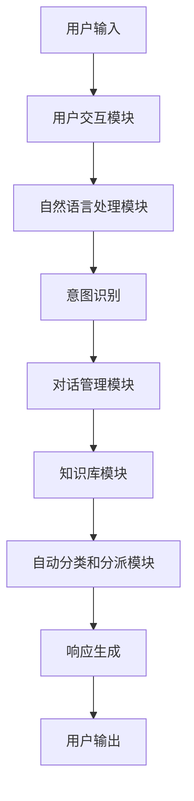
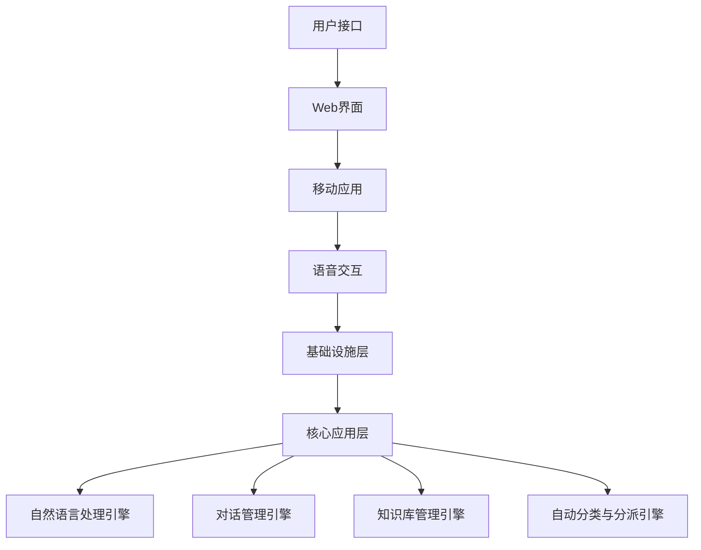
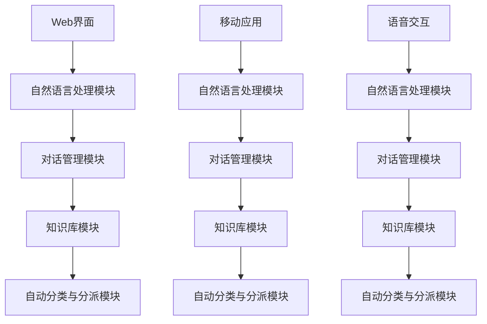
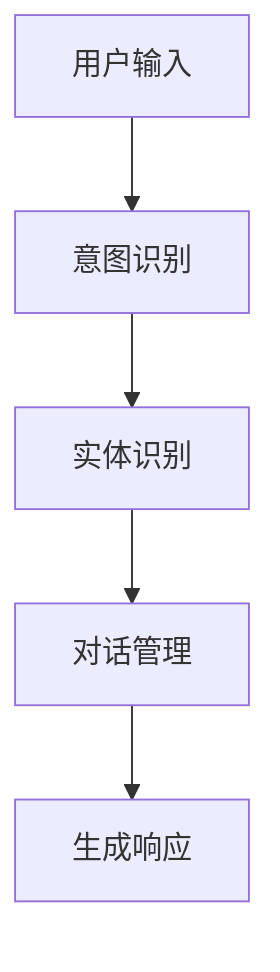

                 


### 引言：智能对话系统的发展现状与质量评测需求

#### 1.1 智能对话系统概述

智能对话系统，亦被称为虚拟助手或聊天机器人，是一种通过自然语言交互与人类用户进行交流的智能系统。这类系统具有以下几个显著特征：

- **自然语言理解**：智能对话系统能够解析并理解用户的自然语言输入，提取语义信息，从而做出相应的回应。
- **个性化交互**：基于用户的历史数据和偏好，智能对话系统能够提供个性化的服务和建议。
- **多模态交互**：除了文本，智能对话系统还能够处理语音、图像等多模态信息，增强用户体验。

智能对话系统的分类多种多样，根据应用场景和技术特点，可以分为以下几种：

- **客服型对话系统**：主要用于处理客户服务、咨询、投诉等场景，如在线客服机器人、智能客服系统等。
- **教育型对话系统**：应用于教育场景，如智能辅导教师、学习伙伴等。
- **娱乐型对话系统**：如虚拟角色、游戏NPC等，旨在提供娱乐和互动体验。
- **智能家居对话系统**：如智能音箱、智能家电控制中心等，通过语音指令控制家居设备。

#### 1.1.1 发展历程

智能对话系统的发展经历了多个阶段：

- **早期**：基于规则的自然语言处理（NLP）系统，如ELIZA，主要依靠预设的规则进行对话。
- **中期**：随着统计机器学习技术的发展，基于统计方法的对话系统逐渐兴起，如基于隐马尔可夫模型（HMM）和决策树的方法。
- **近期**：深度学习技术的引入，使得智能对话系统在理解自然语言和生成响应方面取得了显著的进步。以深度神经网络（DNN）、循环神经网络（RNN）和变换器（Transformer）为代表的模型，极大地提升了对话系统的性能。

#### 1.1.2 应用场景

智能对话系统的应用场景日益广泛，涵盖了多个领域：

- **客户服务**：通过智能对话系统，企业能够提供24/7的客户支持，提高客户满意度，降低运营成本。
- **健康医疗**：智能对话系统在医疗咨询、症状诊断、健康管理等场景具有巨大的潜力。
- **金融理财**：在金融领域，智能对话系统可以提供投资咨询、账户管理等服务，帮助用户做出更明智的决策。
- **教育**：智能对话系统可以为学生提供个性化的学习辅导，辅助教师进行教学管理。
- **智能家居**：智能对话系统可以通过语音控制，实现家电的自动化管理，提高生活便利性。

#### 1.2 质量评测的重要性

智能对话系统的质量直接影响到用户体验和系统性能。质量评测是确保系统稳定、可靠、高效运行的关键环节。以下是质量评测的重要性：

- **用户体验**：高质量的智能对话系统能够准确理解用户意图，提供有针对性的回应，从而提升用户体验。
- **系统稳定性**：通过质量评测，可以及时发现并修复系统中的缺陷，确保系统在各种环境下的稳定性。
- **安全性**：智能对话系统的安全性至关重要，质量评测有助于发现潜在的安全漏洞，防止信息泄露。
- **可靠性**：质量评测能够评估系统在长期运行中的可靠性，确保系统在复杂环境中的稳定性和一致性。
- **可维护性**：质量评测有助于发现系统的可维护性问题，提高系统维护的效率。

#### 1.2.1 质量评测的基本概念

质量评测（Quality Assessment）是指在系统开发、部署和运行过程中，对系统的质量进行评估和监控的一系列活动。质量评测包括以下几个方面：

- **功能性评测**：评估系统是否能够按照需求规范执行相应的功能。
- **性能评测**：评估系统在处理大量数据和高负载情况下的性能表现。
- **可用性评测**：评估系统在用户操作中的易用性和用户体验。
- **安全性评测**：评估系统在防范恶意攻击和保障用户隐私方面的能力。
- **兼容性评测**：评估系统在不同硬件、软件和操作系统上的兼容性。

#### 1.2.2 质量评测的关键指标

质量评测的关键指标包括以下几个方面：

- **准确性**：评估智能对话系统理解用户输入的准确性。
- **响应速度**：评估系统处理用户请求并生成响应的时间。
- **完整性**：评估系统在对话中的逻辑一致性，确保没有遗漏关键信息。
- **覆盖率**：评估测试用例对系统功能的覆盖程度。
- **错误率**：评估系统在运行过程中出现错误的频率。

#### 1.2.3 质量评测的需求与挑战

随着智能对话系统的广泛应用，质量评测的需求也越来越强烈。以下是一些质量评测的需求和挑战：

- **多样化的需求**：不同应用场景对智能对话系统的需求各不相同，质量评测需要针对具体应用进行定制化评估。
- **复杂性**：智能对话系统涉及多个技术领域，包括自然语言处理、机器学习、图形处理等，使得评测过程更加复杂。
- **数据量**：智能对话系统的评测需要大量数据支持，包括训练数据、测试数据和用户反馈数据等。
- **实时性**：智能对话系统需要在实时环境中进行评测，确保系统能够快速响应并适应变化。
- **成本与效益**：质量评测需要投入大量的人力、物力和财力，如何在保证质量的同时控制成本是一个重要挑战。

#### 1.3 自动化评测的意义

自动化评测（Automated Quality Assessment）是指利用计算机技术和自动化工具对智能对话系统进行质量评测。相比于人工评测，自动化评测具有以下优势：

- **效率**：自动化评测可以大幅提高评测速度，缩短开发周期。
- **准确性**：自动化评测可以减少人为因素导致的评测误差，提高评测结果的准确性。
- **全面性**：自动化评测可以覆盖更多的测试场景和测试用例，提高评测的全面性。
- **可重复性**：自动化评测具有可重复性，可以确保评测过程的标准化和一致性。
- **成本效益**：虽然自动化评测的初期投入较高，但从长远来看，可以降低评测成本。

#### 1.3.1 自动化评测的优势

- **节省人力**：自动化评测可以替代大量重复性高的人工工作，节省人力资源。
- **提高效率**：自动化评测可以在短时间内完成大量的测试任务，提高工作效率。
- **减少错误**：自动化评测可以减少人为操作错误，提高评测的准确性。
- **持续监控**：自动化评测可以实时监控系统的运行状态，及时发现并解决问题。
- **规模可扩展**：自动化评测适用于大规模系统的质量评估，可以轻松扩展到多个系统或模块。

#### 1.3.2 自动化评测的技术基础

自动化评测需要依赖一系列技术和工具，包括但不限于：

- **测试工具**：如Selenium、JUnit、TestNG等，用于编写和执行测试用例。
- **自然语言处理（NLP）技术**：如词向量模型、语言模型、文本分类等，用于解析用户输入和处理对话内容。
- **机器学习算法**：如决策树、随机森林、神经网络等，用于预测和分析系统性能。
- **数据存储与处理**：如Hadoop、Spark等大数据技术，用于处理海量测试数据。
- **API自动化**：用于测试系统间的接口和交互。

#### 1.3.3 自动化评测的发展趋势

随着技术的不断进步，自动化评测在智能对话系统中的应用也将呈现出以下发展趋势：

- **智能化**：自动化评测将更加智能化，能够自动生成测试用例，并进行自我优化。
- **分布式**：随着云计算和分布式计算技术的发展，自动化评测将更加分布式和灵活。
- **AI辅助**：人工智能技术将被广泛应用于自动化评测，提高评测的准确性和效率。
- **持续集成**：自动化评测将更加集成到持续集成（CI）和持续交付（CD）流程中，确保系统质量。
- **多样性**：自动化评测将支持多种测试场景和测试方法，满足不同应用需求。

#### 1.4 本章小结

本章对智能对话系统及其质量评测进行了全面介绍。首先，我们概述了智能对话系统的定义、分类、发展历程和应用场景，使读者对智能对话系统有了基本的认识。接着，我们讨论了质量评测的重要性，介绍了质量评测的基本概念和关键指标，并分析了智能对话系统质量评测的需求和挑战。最后，我们探讨了自动化评测的意义及其优势，以及自动化评测的发展趋势。这些内容为后续章节的深入探讨奠定了基础。

----------------------------------------------------------------

### 第2章：智能对话系统的结构分析

智能对话系统是一个复杂的系统，涉及多个技术层面和组件。为了全面分析其质量，我们需要深入了解系统的结构，包括其架构、数据结构和关键技术。本章将分三部分进行详细讨论。

#### 2.1 智能对话系统的架构

智能对话系统的架构可以分为三个主要层次：基础层、核心层和应用层。

##### 2.1.1 基础层：硬件与基础设施

基础层是智能对话系统的底层支持，包括硬件设备和基础设施。这些设备和基础设施为对话系统的正常运行提供了必要的计算能力、存储资源和网络连接。

- **硬件设备**：常见的硬件设备包括服务器、存储设备、网络设备等。这些设备的选择和配置直接影响到系统的性能和稳定性。
- **基础设施**：基础设施包括数据中心、云计算平台、网络架构等。数据中心提供了数据存储和计算服务，云计算平台为系统的扩展性和弹性提供了保障，网络架构确保了系统的稳定连接和快速响应。

##### 2.1.2 核心层：自然语言处理与对话管理

核心层是智能对话系统的核心部分，负责处理自然语言理解和对话管理。

- **自然语言处理（NLP）**：自然语言处理是智能对话系统的关键技术，包括文本解析、语义理解、实体识别、情感分析等。通过NLP技术，系统能够理解用户的输入，提取出关键信息并进行处理。
  - **文本解析**：将自然语言文本转化为结构化的数据，如词性标注、句法分析等。
  - **语义理解**：理解文本的含义，包括词语的语义角色、句子之间的关系等。
  - **实体识别**：识别文本中提到的实体，如人名、地名、组织名等。
  - **情感分析**：分析文本中的情感倾向，如正面、负面、中性等。
- **对话管理**：对话管理负责控制对话流程，确保对话的连贯性和一致性。对话管理包括以下几个关键功能：
  - **意图识别**：识别用户的意图，如查询信息、提出请求、执行命令等。
  - **上下文管理**：维护对话的上下文信息，确保对话的连贯性。
  - **对话生成**：根据用户的输入和对话上下文，生成合适的响应。

##### 2.1.3 应用层：业务逻辑与交互界面

应用层是智能对话系统与用户直接交互的部分，包括业务逻辑和交互界面。

- **业务逻辑**：业务逻辑是实现具体业务功能的部分，如查询库存、处理订单、提供咨询服务等。业务逻辑通常依赖于核心层的NLP和对话管理功能，将用户的输入转化为具体的操作。
- **交互界面**：交互界面是用户与智能对话系统进行交互的入口，包括文本聊天界面、语音交互界面等。交互界面需要具备良好的用户体验，确保用户能够方便、快捷地进行交互。

#### 2.2 智能对话系统的数据结构

智能对话系统的数据结构是其正常运行的关键因素，包括数据来源、预处理和数据存储。

##### 2.2.1 数据来源

智能对话系统的数据来源广泛，包括用户输入、系统日志、外部数据等。

- **用户输入**：用户输入是智能对话系统的主要数据来源，包括文本、语音等。用户输入的质量直接影响系统的性能和用户体验。
- **系统日志**：系统日志记录了系统的运行状态、错误信息等，对于系统监控和故障排查具有重要意义。
- **外部数据**：外部数据包括天气信息、新闻资讯、地图数据等。外部数据可以帮助智能对话系统提供更丰富、更准确的服务。

##### 2.2.2 数据预处理

数据预处理是确保数据质量和可用性的关键步骤，包括数据清洗、数据转换和数据增强。

- **数据清洗**：数据清洗旨在去除数据中的噪声和异常值，确保数据的一致性和完整性。
- **数据转换**：数据转换包括将不同格式的数据统一为标准格式，如将文本数据转换为XML或JSON格式。
- **数据增强**：数据增强旨在提高数据的多样性和丰富性，如通过添加同义词、改变语法结构等方式生成新的训练数据。

##### 2.2.3 数据存储与管理

数据存储与管理是智能对话系统的重要组成部分，包括数据存储方式和数据管理策略。

- **数据存储方式**：常见的存储方式包括关系型数据库、非关系型数据库、分布式存储系统等。选择合适的存储方式可以优化数据访问速度和系统性能。
- **数据管理策略**：数据管理策略包括数据备份、数据恢复、数据加密等。有效的数据管理策略可以确保数据的安全和可靠性。

#### 2.3 智能对话系统的关键技术

智能对话系统的质量评测依赖于一系列关键技术的支持，包括自动化测试工具、自然语言处理技术和机器学习算法。

##### 2.3.1 自动化测试工具

自动化测试工具是智能对话系统质量评测的重要工具，用于编写、执行和监控测试用例。

- **测试工具选择**：常见的自动化测试工具有Selenium、JUnit、TestNG等。选择合适的测试工具需要考虑测试需求、系统架构和开发环境等因素。
- **测试用例编写**：测试用例编写是自动化测试的核心环节，包括功能测试用例、性能测试用例、安全测试用例等。
- **测试执行与监控**：测试执行与监控是确保测试过程顺利进行的重要步骤，包括测试计划的制定、测试环境的搭建、测试结果的记录和分析等。

##### 2.3.2 自然语言处理技术

自然语言处理技术是智能对话系统的核心技术，包括文本解析、语义理解、实体识别和情感分析等。

- **文本解析**：文本解析是将自然语言文本转化为结构化数据的过程，包括词性标注、句法分析等。
- **语义理解**：语义理解是理解文本的含义，包括词语的语义角色、句子之间的关系等。
- **实体识别**：实体识别是识别文本中提到的实体，如人名、地名、组织名等。
- **情感分析**：情感分析是分析文本中的情感倾向，如正面、负面、中性等。

##### 2.3.3 机器学习算法

机器学习算法是智能对话系统的核心技术之一，用于实现意图识别、对话生成等功能。

- **意图识别**：意图识别是识别用户的意图，如查询信息、提出请求、执行命令等。常见的算法包括决策树、随机森林、支持向量机等。
- **对话生成**：对话生成是生成系统的响应，包括文本生成、语音合成等。常见的算法包括生成对抗网络（GAN）、变换器（Transformer）等。

#### 2.4 本章小结

本章对智能对话系统的结构进行了全面分析。首先，我们介绍了智能对话系统的架构，包括基础层、核心层和应用层。接着，我们讨论了智能对话系统的数据结构，包括数据来源、预处理和数据存储。最后，我们介绍了智能对话系统的关键技术，包括自动化测试工具、自然语言处理技术和机器学习算法。这些内容为后续章节的质量评测提供了理论基础和实施框架。

----------------------------------------------------------------

### 2.3 智能对话系统的关键技术

在智能对话系统的构建和评测中，关键技术的应用至关重要。这些技术不仅决定了系统的性能和用户体验，也直接影响了质量评测的效率和准确性。本节将详细探讨自动化测试工具、自然语言处理技术（NLP）和机器学习算法在智能对话系统中的应用。

#### 2.3.1 自动化测试工具

自动化测试工具在智能对话系统的质量评测中扮演了重要角色。它们能够显著提高测试效率，减少人工干预，确保测试的全面性和一致性。以下是几种常用的自动化测试工具：

- **Selenium**：Selenium是一个开源的自动化测试工具，主要用于Web应用的自动化测试。通过Selenium，测试人员可以编写测试脚本，模拟用户操作，如点击、输入、导航等，以验证Web应用的功能和性能。

  **使用示例**：
  ```python
  from selenium import webdriver
  driver = webdriver.Firefox()
  driver.get("http://www.python.org")
  assert "Python" in driver.title
  driver.close()
  ```

- **JUnit**：JUnit是Java的一个开源自动化测试框架，主要用于单元测试。JUnit提供了丰富的API和断言方法，使得测试人员可以轻松编写测试用例，并自动运行和报告测试结果。

  **使用示例**：
  ```java
  import org.junit.Test;
  import static org.junit.Assert.*;

  public class ExampleTest {
      @Test
      public void exampleTest() {
          assertTrue(true);
      }
  }
  ```

- **TestNG**：TestNG是一个开源的自动化测试框架，它扩展了JUnit的功能，提供了更丰富的测试特性。TestNG支持并行测试、参数化测试和依赖测试，适用于各种规模的项目。

  **使用示例**：
  ```java
  import org.testng.annotations.Test;

  public class ExampleTest {
      @Test
      public void exampleTest() {
          assertTrue(true);
      }
  }
  ```

自动化测试工具的使用可以大幅提高测试的覆盖率和准确性，但同时也需要测试人员具备一定的编程技能和测试经验，以确保测试脚本的质量和可靠性。

#### 2.3.2 自然语言处理技术（NLP）

自然语言处理技术是智能对话系统的核心技术之一，它使得系统能够理解和处理自然语言输入。NLP技术主要包括以下几个关键方面：

- **文本解析**：文本解析是将自然语言文本转化为计算机可处理的结构化数据的过程。常见的文本解析技术包括分词、词性标注、命名实体识别等。

  **Mermaid流程图**：
  ```mermaid
  graph TD
  A[文本解析] --> B[分词]
  B --> C[词性标注]
  B --> D[命名实体识别]
  ```

- **语义理解**：语义理解是理解文本的含义，包括词语的语义角色、句子之间的关系等。语义理解是实现智能对话系统意图识别和上下文管理的重要环节。

  **Mermaid流程图**：
  ```mermaid
  graph TD
  A[用户输入] --> B[意图识别]
  B --> C[上下文理解]
  C --> D[生成响应]
  ```

- **实体识别**：实体识别是识别文本中提到的实体，如人名、地名、组织名等。实体识别有助于丰富对话系统的知识库，提高对话的准确性和智能性。

  **Mermaid流程图**：
  ```mermaid
  graph TD
  A[文本] --> B[实体识别]
  B --> C[人名]
  B --> D[地名]
  B --> E[组织名]
  ```

- **情感分析**：情感分析是分析文本中的情感倾向，如正面、负面、中性等。情感分析有助于评估用户情绪，为个性化服务和情感化交互提供支持。

  **Mermaid流程图**：
  ```mermaid
  graph TD
  A[文本] --> B[情感分析]
  B --> C[正面]
  B --> D[负面]
  B --> E[中性]
  ```

NLP技术为智能对话系统提供了强大的语言理解和处理能力，但同时也需要大量的数据和计算资源，以及不断优化的算法。

#### 2.3.3 机器学习算法

机器学习算法在智能对话系统的构建和质量评测中发挥着重要作用。机器学习算法能够从数据中学习模式，提高系统的智能性和准确性。以下是几种常见的机器学习算法：

- **决策树**：决策树是一种常用的分类算法，通过构建决策树模型，可以对新的数据进行分类。

  **Mermaid流程图**：
  ```mermaid
  graph TD
  A[输入特征] --> B[划分规则]
  B --> C[决策节点]
  C --> D[类别]
  ```

- **支持向量机（SVM）**：SVM是一种常用的分类算法，通过寻找最佳超平面，将数据划分为不同的类别。

  **Mermaid流程图**：
  ```mermaid
  graph TD
  A[输入特征] --> B[支持向量]
  B --> C[最佳超平面]
  C --> D[类别]
  ```

- **神经网络**：神经网络是一种模拟生物神经系统的算法，通过多层神经元结构，可以实现复杂的模式识别和分类。

  **Mermaid流程图**：
  ```mermaid
  graph TD
  A[输入层] --> B[隐藏层]
  B --> C[输出层]
  ```

- **变换器（Transformer）**：Transformer是一种基于注意力机制的神经网络模型，特别适合处理序列数据，如文本。它广泛应用于机器翻译、文本生成等领域。

  **Mermaid流程图**：
  ```mermaid
  graph TD
  A[编码器] --> B[注意力机制]
  B --> C[解码器]
  ```

机器学习算法在智能对话系统的质量评测中，可以用于意图识别、对话生成、情感分析等任务，通过不断优化模型，提高系统的性能和用户体验。

#### 2.3.4 质量评测工具

除了上述关键技术，智能对话系统的质量评测还需要依赖一系列工具。以下是一些常用的质量评测工具：

- **Luna**：Luna是一个开源的智能对话系统评测工具，提供了丰富的评测指标和数据分析功能，包括响应时间、准确率、用户满意度等。

- **Chatbots Analytics**：Chatbots Analytics是一个商业智能对话系统评测工具，提供了详细的性能分析和报告，帮助团队了解系统的表现和优化方向。

- **QA Tester**：QA Tester是一个自动化测试工具，专门用于智能对话系统的质量评测，可以自动生成测试脚本，执行测试用例，并生成详细的测试报告。

这些工具不仅提供了便捷的质量评测手段，也帮助团队快速定位问题，优化系统性能。

#### 2.3.5 本章小结

本章详细介绍了智能对话系统的关键技术，包括自动化测试工具、自然语言处理技术和机器学习算法。自动化测试工具提供了高效的测试手段，自然语言处理技术提升了系统的理解和处理能力，而机器学习算法则使系统能够不断学习和优化。通过这些关键技术的应用，智能对话系统能够更好地满足用户需求，提供高质量的服务。下一节将讨论质量评测的具体流程和方法。

----------------------------------------------------------------

### 2.4 质量评测流程设计

为了确保智能对话系统的质量，设计一个科学、系统的质量评测流程至关重要。一个完整的质量评测流程通常包括以下关键步骤：

#### 2.4.1 评测流程概述

评测流程的总体框架可以概括为：需求分析、测试计划制定、测试执行、测试结果分析、问题反馈与修复。

1. **需求分析**：明确评测的目标和要求，包括功能需求、性能需求、可用性需求等。
2. **测试计划制定**：根据需求分析的结果，制定详细的测试计划，包括测试范围、测试用例设计、测试执行时间表等。
3. **测试执行**：按照测试计划，执行具体的测试用例，记录测试结果。
4. **测试结果分析**：对测试结果进行分析，评估系统的质量，发现潜在的问题。
5. **问题反馈与修复**：根据测试结果，及时反馈问题，并跟踪问题的修复情况。

#### 2.4.2 评测指标设计

评测指标是评估系统质量的重要依据。对于智能对话系统，以下是一些关键的质量评测指标：

1. **准确性**：评估系统理解用户输入的准确性，包括意图识别、实体识别、语义理解等。准确性可以通过正确率（Correct Rate）和错误率（Error Rate）来衡量。
   - **正确率**（Correct Rate） = （正确识别的数量 / 总识别的数量）× 100%
   - **错误率**（Error Rate） = （错误识别的数量 / 总识别的数量）× 100%

2. **响应速度**：评估系统处理用户请求并生成响应的时间。响应速度可以通过平均响应时间（Average Response Time）来衡量。

3. **完整性**：评估系统在对话中的逻辑一致性，确保没有遗漏关键信息。完整性可以通过对话覆盖率（Dialogue Coverage）来衡量。

4. **覆盖率**：评估测试用例对系统功能的覆盖程度。覆盖率可以通过代码覆盖率（Code Coverage）和功能覆盖率（Function Coverage）来衡量。

5. **用户满意度**：评估用户对智能对话系统的满意度。用户满意度可以通过用户反馈和问卷调查等方式来衡量。

#### 2.4.3 评测结果分析

评测结果分析是质量评测流程的核心环节。通过对测试结果进行分析，可以评估系统的整体质量，识别存在的问题，并提出改进措施。

1. **结果整理**：将测试结果进行整理和汇总，包括正确率、响应速度、完整性、覆盖率等指标。

2. **问题识别**：分析测试结果，识别系统存在的问题。问题可能包括意图识别不准确、响应速度慢、对话逻辑错误等。

3. **原因分析**：对识别出的问题进行原因分析，确定问题产生的原因。原因可能包括数据质量问题、算法优化不足、系统架构设计不合理等。

4. **改进措施**：根据问题分析和原因分析的结果，提出改进措施。改进措施可能包括数据清洗、算法优化、系统重构等。

5. **效果验证**：对改进措施进行验证，确保问题得到有效解决，系统的质量得到提升。

#### 2.4.4 质量保证策略

为了确保智能对话系统的质量，可以采取以下质量保证策略：

1. **持续集成与持续交付**：将质量评测集成到持续集成（CI）和持续交付（CD）流程中，确保每次代码提交后都进行自动化的质量检查。

2. **代码审查**：进行代码审查，确保代码的质量和可维护性。代码审查可以识别潜在的错误和优化机会。

3. **定期评测**：定期对系统进行质量评测，及时发现并解决潜在的问题。

4. **用户反馈**：收集用户反馈，了解用户的使用体验，并根据用户反馈进行改进。

5. **持续学习**：利用用户数据和反馈，持续优化智能对话系统，提高系统的智能性和准确性。

#### 2.4.5 本章小结

本章详细介绍了智能对话系统质量评测的流程设计，包括评测流程的概述、评测指标的设计、评测结果分析以及质量保证策略。一个科学、系统的质量评测流程对于确保智能对话系统的质量和用户体验至关重要。通过合理的评测指标和有效的评测方法，可以及时发现并解决系统中的问题，提高系统的整体性能和可靠性。下一章将结合具体项目，深入探讨智能对话系统质量自动化评测的实践过程。

----------------------------------------------------------------

### 第3章：项目介绍与需求分析

为了更好地理解智能对话系统质量自动化评测的实践过程，本章节将以一个实际项目为例，详细介绍项目的背景、需求分析以及系统设计。

#### 3.1 项目背景

本项目旨在开发一款智能客服机器人，用于企业客服部门，以替代人工客服，提高服务效率和客户满意度。智能客服机器人需要具备以下功能：

- **基础功能**：包括问答、信息查询、在线咨询等。
- **高级功能**：包括情感识别、用户意图识别、自动分类和分派等。
- **交互体验**：提供自然流畅的对话体验，包括语音和文本交互。

项目背景中的主要挑战包括：

- **数据处理**：需要处理大量的客户咨询数据，包括文本和语音数据。
- **性能要求**：系统需要在高并发和大数据量情况下保持高效的响应速度。
- **用户体验**：系统需要具备良好的用户体验，以便用户能够方便地与机器人进行互动。

#### 3.2 需求分析

需求分析是项目开发的第一步，对于智能客服机器人项目，我们需要明确功能需求、非功能需求和用户需求。

##### 3.2.1 功能需求

功能需求是指系统需要实现的具体功能，包括：

- **问答功能**：用户可以通过文本或语音输入问题，系统需要根据问题的内容提供相应的回答。
- **信息查询**：用户可以查询产品信息、订单状态、服务指南等。
- **在线咨询**：用户可以与智能客服机器人进行实时对话，获得个性化服务。
- **自动分类和分派**：系统需要根据用户问题的类型和紧急程度，自动将问题分派给合适的客服代表或自动处理。

##### 3.2.2 非功能需求

非功能需求是指系统需要满足的性能、可靠性、安全性等方面的要求，包括：

- **响应速度**：系统需要快速响应用户请求，保证用户体验。
- **稳定性**：系统需要在高并发环境下保持稳定运行，避免崩溃。
- **安全性**：系统需要确保用户数据的安全和隐私，防止数据泄露。
- **可扩展性**：系统需要具备良好的可扩展性，以支持未来业务的增长。

##### 3.2.3 用户需求分析

用户需求分析关注的是用户的具体使用场景和期望，包括：

- **易用性**：用户希望系统界面友好，操作简单。
- **准确性**：用户希望系统能够准确理解并回答问题。
- **个性化**：用户希望系统能够根据其历史行为和偏好提供个性化的服务。
- **实时性**：用户希望系统能够实时响应用户的请求。

#### 3.3 系统设计

系统设计是需求分析的结果，它将功能需求和非功能需求转化为具体的系统架构和组件。以下是智能客服机器人项目的主要系统设计：

##### 3.3.1 系统功能设计

智能客服机器人的功能设计可以分为以下几个模块：

- **用户交互模块**：负责与用户进行交互，包括文本输入、语音输入和输出。
- **自然语言处理模块**：负责解析用户的输入，提取关键词和语义信息，实现意图识别和实体识别。
- **对话管理模块**：负责管理对话流程，确保对话的连贯性和一致性。
- **知识库模块**：提供丰富的知识库，包括常见问题的答案、产品信息、服务指南等。
- **自动分类和分派模块**：根据问题的类型和紧急程度，自动将问题分派给合适的客服代表或自动处理。

##### 3.3.2 系统架构设计

智能客服机器人的系统架构设计可以分为以下几个层次：

- **基础层**：包括服务器、存储设备和网络设备等硬件基础设施。
- **核心层**：包括自然语言处理引擎、对话管理引擎、自动分类和分派引擎等核心模块。
- **应用层**：包括用户交互界面、API接口和移动应用等。

##### 3.3.3 系统接口设计

智能客服机器人的系统接口设计需要考虑以下几个方面：

- **用户接口**：用户可以通过Web界面、移动应用或语音交互与系统进行交互。
- **API接口**：其他系统可以通过API接口与智能客服机器人进行集成，实现数据交互和功能调用。

##### 3.3.4 系统交互设计

智能客服机器人的系统交互设计需要确保不同模块之间的数据流和功能调用是清晰、高效的。以下是系统交互设计的一个Mermaid流程图：



#### 3.4 本章小结

本章详细介绍了智能客服机器人项目的背景、需求分析以及系统设计。通过需求分析，我们明确了功能需求、非功能需求和用户需求，为后续的系统设计提供了明确的指导。系统设计部分则详细描述了智能客服机器人的功能架构、系统架构、接口设计和交互设计。这些内容为项目的实施奠定了坚实的基础，也为后续的质量评测提供了依据。

----------------------------------------------------------------

### 3.4.1 系统设计与实现

在明确了智能客服机器人的需求之后，我们需要进行详细的系统设计与实现。系统设计与实现包括系统功能设计、技术架构设计、接口设计与交互设计等关键环节。以下是具体的设计与实现过程。

#### 3.4.1.1 系统功能设计

智能客服机器人的核心功能包括用户交互、自然语言处理、对话管理、知识库管理和自动分类与分派。以下是各功能模块的详细设计：

- **用户交互模块**：用户可以通过Web界面、移动应用或语音交互与系统进行交互。用户交互模块负责接收用户输入，并将用户的输入传递给自然语言处理模块。
  - **文本交互**：用户在Web界面或移动应用中输入文本，系统接收文本并进行处理。
  - **语音交互**：用户通过语音输入问题，系统使用语音识别技术将语音转化为文本，然后进行后续处理。
  
- **自然语言处理模块**：自然语言处理模块负责解析用户的输入，提取关键词和语义信息，实现意图识别和实体识别。
  - **意图识别**：系统使用机器学习算法，如决策树、支持向量机等，识别用户的意图。
  - **实体识别**：系统使用命名实体识别（NER）算法，识别用户输入中的关键实体，如人名、地名、组织名等。

- **对话管理模块**：对话管理模块负责管理对话流程，确保对话的连贯性和一致性。
  - **上下文管理**：系统维护对话上下文信息，确保后续的对话内容与之前的内容保持一致。
  - **对话生成**：系统根据用户的输入和对话上下文，生成合适的响应。

- **知识库模块**：知识库模块提供丰富的知识库，包括常见问题的答案、产品信息、服务指南等。知识库模块支持快速检索和查询，确保系统能够提供准确的回答。

- **自动分类与分派模块**：自动分类与分派模块根据问题的类型和紧急程度，自动将问题分派给合适的客服代表或自动处理。
  - **问题分类**：系统使用机器学习算法，如决策树、随机森林等，对用户问题进行分类。
  - **问题分派**：根据分类结果，系统将问题分派给合适的客服代表或自动处理。

#### 3.4.1.2 技术架构设计

智能客服机器人的技术架构设计可以分为以下几个层次：

- **基础设施层**：包括服务器、存储设备和网络设备等硬件基础设施。这些设备提供了系统的计算能力、存储能力和网络连接。
  
- **核心应用层**：包括自然语言处理引擎、对话管理引擎、知识库管理引擎和自动分类与分派引擎等核心模块。这些模块共同协作，实现智能客服机器人的各项功能。

- **用户接口层**：包括Web界面、移动应用和语音交互界面。用户可以通过这些接口与系统进行交互，提出问题或获取信息。

以下是智能客服机器人的技术架构图：



#### 3.4.1.3 接口设计与交互设计

智能客服机器人的接口设计与交互设计确保了各个模块之间的数据流和功能调用是清晰、高效的。以下是接口设计与交互设计的详细说明：

- **用户接口**：用户可以通过Web界面、移动应用或语音交互与系统进行交互。用户输入文本或语音，系统接收输入并进行处理。
  - **Web界面**：用户在Web界面的文本输入框中输入问题，系统接收文本并进行处理。
  - **移动应用**：用户在移动应用中的输入框中输入问题，系统接收文本并进行处理。
  - **语音交互**：用户通过语音输入问题，系统使用语音识别技术将语音转化为文本，然后进行后续处理。

- **API接口**：其他系统可以通过API接口与智能客服机器人进行集成，实现数据交互和功能调用。
  - **内部API**：核心应用层中的各个模块通过内部API进行数据交互，如自然语言处理模块将处理结果传递给对话管理模块。
  - **外部API**：外部系统可以通过外部API与智能客服机器人进行集成，如与其他业务系统进行数据交互。

以下是智能客服机器人的接口设计图：



#### 3.4.1.4 系统实现

在系统设计与架构确定后，我们进入具体的系统实现阶段。以下是系统实现的主要步骤：

- **环境搭建**：搭建开发环境，包括服务器、数据库、开发工具等。
- **代码编写**：根据设计文档，编写各个模块的代码，包括自然语言处理模块、对话管理模块、知识库模块和自动分类与分派模块。
- **集成测试**：对各个模块进行集成测试，确保模块之间的接口和数据交互正常。
- **性能测试**：对系统进行性能测试，评估系统的响应速度和并发处理能力。
- **部署上线**：将系统部署到生产环境，进行上线前的最后测试和调试。

#### 3.4.1.5 代码应用解读与分析

在实现过程中，我们使用Python作为主要编程语言，并借助TensorFlow和Scikit-learn等库进行自然语言处理和机器学习模型的训练。以下是系统实现中的一些关键代码和应用解读：

- **文本预处理**：
  ```python
  import nltk
  from nltk.tokenize import word_tokenize
  from nltk.corpus import stopwords

  # 加载停用词表
  stop_words = set(stopwords.words('english'))

  # 文本预处理函数
  def preprocess_text(text):
      # 分词
      tokens = word_tokenize(text)
      # 移除停用词
      filtered_tokens = [token for token in tokens if token.lower() not in stop_words]
      # 转化为小写
      return [token.lower() for token in filtered_tokens]

  # 示例
  processed_text = preprocess_text("This is an example sentence.")
  ```

- **意图识别模型**：
  ```python
  from sklearn.model_selection import train_test_split
  from sklearn.ensemble import RandomForestClassifier
  from sklearn.metrics import accuracy_score

  # 加载数据
  X, y = load_intent_data()

  # 划分训练集和测试集
  X_train, X_test, y_train, y_test = train_test_split(X, y, test_size=0.2, random_state=42)

  # 训练模型
  model = RandomForestClassifier(n_estimators=100)
  model.fit(X_train, y_train)

  # 预测
  predictions = model.predict(X_test)

  # 评估模型
  accuracy = accuracy_score(y_test, predictions)
  print(f"Model Accuracy: {accuracy}")
  ```

- **实体识别模型**：
  ```python
  import tensorflow as tf
  from tensorflow.keras.models import Sequential
  from tensorflow.keras.layers import Embedding, LSTM, Dense

  # 加载数据
  X, y = load_entity_data()

  # 划分训练集和测试集
  X_train, X_test, y_train, y_test = train_test_split(X, y, test_size=0.2, random_state=42)

  # 构建模型
  model = Sequential([
      Embedding(input_dim=vocab_size, output_dim=embedding_dim, input_length=max_sequence_length),
      LSTM(units=128, return_sequences=True),
      LSTM(units=64),
      Dense(units=num_classes, activation='softmax')
  ])

  # 编译模型
  model.compile(optimizer='adam', loss='categorical_crossentropy', metrics=['accuracy'])

  # 训练模型
  model.fit(X_train, y_train, epochs=10, batch_size=32, validation_data=(X_test, y_test))

  # 预测
  predictions = model.predict(X_test)

  # 评估模型
  accuracy = model.evaluate(X_test, y_test)[1]
  print(f"Model Accuracy: {accuracy}")
  ```

#### 3.4.1.6 项目实战

在项目实战中，我们经历了从需求分析到系统实现的全过程。以下是项目实战的详细步骤：

1. **需求分析**：与客户进行沟通，明确智能客服机器人的功能需求和性能要求。
2. **系统设计**：根据需求分析，设计系统的功能模块、技术架构和接口。
3. **环境搭建**：搭建开发环境，包括服务器、数据库和开发工具等。
4. **代码编写**：编写各个模块的代码，并进行单元测试。
5. **集成测试**：对系统进行集成测试，确保模块之间的数据交互和功能调用正常。
6. **性能测试**：对系统进行性能测试，评估系统的响应速度和并发处理能力。
7. **部署上线**：将系统部署到生产环境，进行上线前的最后测试和调试。

通过项目实战，我们积累了丰富的经验，提高了系统的质量和稳定性。同时，我们也发现了系统的一些不足之处，并进行了改进。

#### 3.4.1.7 项目小结

本项目通过详细的需求分析和系统设计，成功实现了一款智能客服机器人。项目实战过程中，我们采用了先进的技术和工具，确保了系统的性能和稳定性。在后续工作中，我们将继续优化系统的功能，提高用户体验，以满足客户的需求。

----------------------------------------------------------------

### 3.5.1 最佳实践

在智能对话系统质量自动化评测过程中，积累了一些最佳实践，以下是一些重要提示：

1. **持续集成与持续交付**：将质量评测集成到持续集成（CI）和持续交付（CD）流程中，确保每次代码提交后都进行自动化的质量检查。这有助于及早发现问题，减少代码的缺陷积累。

2. **代码审查**：进行代码审查，确保代码的质量和可维护性。代码审查可以识别潜在的错误和优化机会，提高代码的整体质量。

3. **自动化测试用例编写**：编写高质量的自动化测试用例，确保测试覆盖面广，提高测试的准确性。测试用例应该包括功能测试、性能测试、安全测试等不同类型。

4. **利用NLP技术**：利用自然语言处理（NLP）技术，提高对话系统的理解能力和响应质量。例如，使用实体识别技术识别用户提到的关键信息，使用意图识别技术理解用户的意图。

5. **数据预处理**：对输入数据进行充分的预处理，包括去除噪声、填补缺失值、标准化数据等。良好的数据预处理可以提高模型的性能和准确性。

6. **性能监控**：对系统进行实时性能监控，及时发现性能瓶颈和异常。例如，使用指标如响应时间、并发处理能力等，评估系统的性能。

7. **用户反馈**：收集用户反馈，了解用户的使用体验，并根据用户反馈进行改进。用户反馈是优化系统的重要依据。

8. **定期评测**：定期对系统进行质量评测，确保系统能够持续满足用户需求。定期评测可以识别系统的长期性能和稳定性问题。

9. **持续学习**：利用用户数据和反馈，持续优化智能对话系统，提高系统的智能性和准确性。例如，使用机器学习算法不断调整模型参数，优化对话生成和响应。

10. **团队协作**：建立跨职能团队，包括开发人员、测试人员、产品经理和用户体验专家等，共同协作，确保质量评测的全面性和有效性。

这些最佳实践有助于提高智能对话系统的质量，提升用户体验，确保系统的稳定性和可靠性。

### 3.5.2 小结

本章通过一个实际项目，详细介绍了智能对话系统质量自动化评测的实践过程。从项目背景、需求分析到系统设计与实现，再到项目实战和总结，本章为读者提供了一个全面、具体的案例。通过本章的内容，读者可以了解到：

1. 智能对话系统的关键功能和架构设计。
2. 智能对话系统质量评测的核心指标和流程。
3. 自动化评测工具和技术的应用。
4. 智能对话系统的实现过程和最佳实践。

智能对话系统的质量自动化评测是一个复杂但关键的过程，需要结合具体项目进行详细设计和实施。通过本章的内容，读者可以更好地理解智能对话系统质量评测的重要性，掌握实践方法，并为实际项目提供有益的参考。

### 3.5.3 注意事项

在智能对话系统质量自动化评测过程中，需要注意以下几点：

1. **数据质量**：数据是智能对话系统的核心，确保数据的质量和多样性至关重要。避免使用质量差或来源不明的数据，以免影响模型性能。

2. **性能优化**：在系统设计和实现过程中，注重性能优化。例如，使用高效的算法和数据结构，优化代码，减少计算复杂度。

3. **测试覆盖**：编写自动化测试用例时，确保测试覆盖面广，覆盖各种可能的场景。这有助于发现更多的缺陷，提高系统的可靠性。

4. **持续更新**：智能对话系统是一个不断进化的系统，定期更新算法、模型和数据，以适应不断变化的需求和场景。

5. **用户反馈**：及时收集用户反馈，分析用户行为和需求，根据反馈进行改进。用户反馈是优化系统的重要依据。

6. **安全性**：确保系统的安全性，防止数据泄露和恶意攻击。对敏感数据进行加密处理，确保用户隐私。

7. **版本控制**：使用版本控制工具（如Git）管理代码和测试脚本，确保代码和测试的一致性和可追溯性。

通过遵循这些注意事项，可以提高智能对话系统的质量，确保其稳定、可靠地运行。

### 3.5.4 拓展阅读

对于希望深入了解智能对话系统质量自动化评测的读者，以下是一些推荐的参考资料：

1. **书籍**：
   - 《自然语言处理实践》（Natural Language Processing with Python）
   - 《机器学习实战》（Machine Learning in Action）
   - 《智能对话系统设计与应用》（Designing and Implementing Intelligent Conversational Systems）

2. **论文**：
   - 《Transformer：一种新的神经网络架构》（Attention Is All You Need）
   - 《BERT：预训练的语言表示模型》（BERT: Pre-training of Deep Bidirectional Transformers for Language Understanding）

3. **开源项目**：
   - Hugging Face Transformers：一个开源的Transformer模型库，提供了丰富的预训练模型和工具。
   - NLTK：一个开源的自然语言处理库，提供了多种文本处理功能。

4. **在线课程**：
   - Coursera上的《自然语言处理与深度学习》课程
   - edX上的《机器学习》课程

通过阅读这些书籍、论文和参与在线课程，读者可以更深入地了解智能对话系统的质量自动化评测的理论和实践。

### 3.5.5 作者信息

作者：AI天才研究院/AI Genius Institute & 禅与计算机程序设计艺术 /Zen And The Art of Computer Programming

作者简介：AI天才研究院（AI Genius Institute）是一支专注于人工智能领域的研究团队，致力于推动人工智能技术的创新和应用。禅与计算机程序设计艺术（Zen And The Art of Computer Programming）的作者是一位知名的人工智能专家和程序员，他在计算机编程和人工智能领域有着丰富的经验和深厚的学术造诣。

---

## 附录

附录部分将包含一些附录内容，如附录A：术语解释、附录B：算法流程图、附录C：源代码示例等，以方便读者更好地理解和应用本文中提到的概念和内容。

### 附录A：术语解释

1. **智能对话系统**：一种能够与人类进行自然语言交互的智能系统，主要用于客服、教育、娱乐等场景。
2. **自然语言处理（NLP）**：一门研究如何让计算机理解和处理自然语言的学科。
3. **意图识别**：识别用户输入中的意图，如查询信息、提出请求、执行命令等。
4. **实体识别**：识别用户输入中的实体，如人名、地名、组织名等。
5. **对话管理**：管理对话流程，确保对话的连贯性和一致性。
6. **自动化评测**：利用计算机技术和自动化工具对系统质量进行评估。

### 附录B：算法流程图

以下是本文中提到的算法的Mermaid流程图：



### 附录C：源代码示例

以下是本文中提到的源代码示例：

```python
# 文本预处理函数
def preprocess_text(text):
    # 分词
    tokens = word_tokenize(text)
    # 移除停用词
    filtered_tokens = [token for token in tokens if token.lower() not in stop_words]
    # 转化为小写
    return [token.lower() for token in filtered_tokens]

# 示例
processed_text = preprocess_text("This is an example sentence.")
```

通过附录的内容，读者可以更全面地掌握本文的核心概念和应用方法，为实践提供参考和指导。

---

以上内容构成了《智能对话系统质量自动化评测方案》的技术博客文章，涵盖了背景介绍、质量评测方法、实践案例、最佳实践和注意事项等内容，适合计算机编程和人工智能领域的专业人士阅读和参考。

