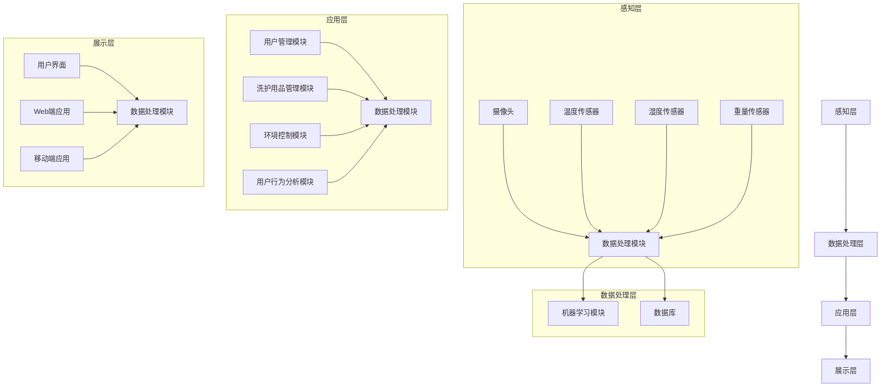
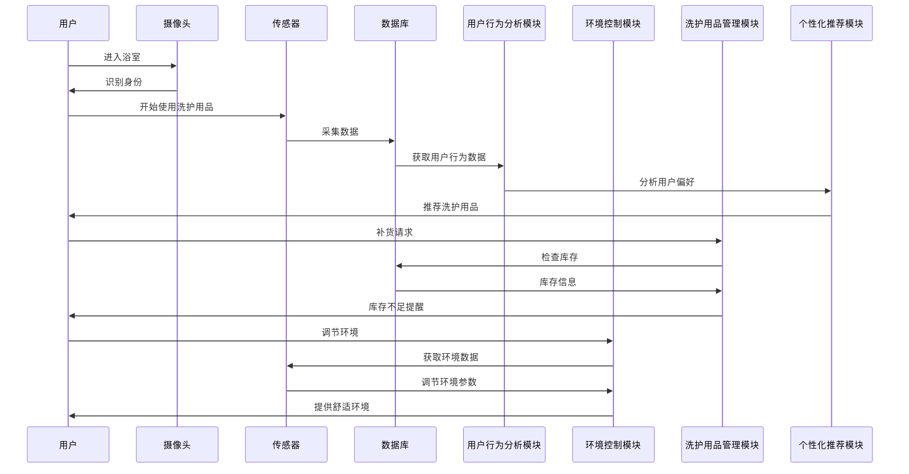

                 

### 1.1.1 智能浴室的兴起

智能浴室，作为现代智能家居体系中的一个重要组成部分，正逐步走进人们的日常生活。随着物联网（IoT）技术的飞速发展和人工智能（AI）技术的不断突破，智能浴室的概念逐渐从科幻变为现实。

首先，智能浴室的兴起得益于家庭物联网的普及。智能家居系统通过将各类家庭设备和互联网连接起来，实现了设备之间的互联互通和智能控制。智能浴室则是这一理念在浴室空间的具体应用。例如，智能浴室镜子可以显示天气、时间以及用户健康数据，智能马桶可以自动清洗和加热，智能淋浴器可以调节水温和水流等。

其次，人工智能技术的进步为智能浴室带来了新的可能。AI Agent，作为人工智能的高级形式，能够通过学习用户的习惯和偏好，提供个性化的服务。例如，AI Agent可以识别用户是否正在使用洗护用品，自动记录用量，并在用完时提醒用户及时补充，甚至可以根据用户的偏好推荐合适的洗护用品。

智能浴室的兴起还与人们对生活质量的要求提高有关。随着生活节奏的加快，人们越来越追求便利和舒适的生活体验。智能浴室通过提供智能化、自动化的服务，能够大大提高浴室的使用体验，节省时间，提升生活质量。

总之，智能浴室的兴起不仅代表了智能家居技术的前沿发展，也是人们对美好生活追求的体现。随着技术的不断进步，智能浴室有望成为每个家庭不可或缺的一部分。

### 1.1.2 洗护用品管理的挑战

在智能浴室中，洗护用品的管理是一个不可忽视的重要环节。然而，传统的洗护用品管理方式存在诸多挑战，这些问题不仅影响了用户体验，也限制了智能浴室功能的发挥。

首先，洗护用品的存储问题是一个显著的挑战。在传统浴室中，洗护用品通常散布在不同的储物柜和架子上，难以实现整齐有序的存放。这会导致浴室空间杂乱无章，影响整体的美观和整洁度。此外，不同类型的洗护用品，如洗发水、沐浴露、洗面奶等，如果没有明确的分类和标识，用户在取用时容易产生混淆，增加使用难度。

其次，洗护用品的用量控制也是一个难题。传统方式下，用户通常凭感觉或经验判断何时补充洗护用品，这不仅可能导致过量使用，增加成本，还可能因为使用不足而影响洗澡体验。例如，洗发水用完了没有及时补充，用户在洗发时可能会遇到头发打结的问题，影响洗发的效果。

另外，洗护用品的时效性问题也是传统管理方式的一个挑战。某些洗护用品，如面膜或沐浴露，有明确的保质期。如果用户无法及时了解这些信息，可能会使用过期的产品，从而影响健康或导致产品浪费。

最后，洗护用品的智能提醒和推荐也是一个亟待解决的问题。在传统方式下，用户很难获得个性化的洗护用品推荐，也无法实现自动化的提醒功能。这导致用户在购买和使用洗护用品时，缺乏有效的指导和帮助，无法充分发挥智能浴室的潜力。

总之，传统洗护用品管理方式在存储、用量控制、时效性和智能提醒等方面存在诸多挑战。这些问题不仅影响了浴室的整洁和美观，也限制了智能浴室功能的发挥。因此，探索一种高效的洗护用品管理解决方案，显得尤为必要。

### 1.1.3 AI Agent在浴室场景中的应用潜力

AI Agent作为一种高级人工智能形式，具备自主学习、推理决策和个性化服务的能力，在智能浴室场景中具有广泛的应用潜力。以下将从几个方面详细探讨AI Agent在浴室场景中的应用。

首先，AI Agent在洗护用品的智能管理方面具有显著的优势。通过传感器和摄像头等设备，AI Agent可以实时监测浴室中的洗护用品库存状况，自动记录每种用品的用量。当库存低于设定阈值时，AI Agent可以自动发出提醒，指导用户及时补充，从而避免因洗护用品不足而影响洗澡体验。此外，AI Agent还可以根据用户的洗澡习惯和偏好，推荐合适的洗护用品，提供个性化的洗浴建议。

其次，AI Agent在洗护用品的用量控制方面具有高效性和精确性。通过机器学习算法，AI Agent可以分析用户的历史用量数据，预测未来的需求，从而实现精准的用量管理。例如，AI Agent可以根据用户每次洗澡的时长和用水量，自动调节洗发水、沐浴露等用品的出液量，避免浪费。这不仅有助于节省成本，还能提升浴室的使用效率。

再次，AI Agent在洗护用品的时效性管理方面也发挥着重要作用。通过定期扫描洗护用品的保质期信息，AI Agent可以及时提醒用户更换过期的产品，避免使用过期或变质的洗护用品，确保用户的健康和安全。

最后，AI Agent在提升浴室的整体智能化体验方面具有不可替代的作用。通过智能识别用户身份，AI Agent可以为不同的用户提供定制化的洗浴服务。例如，当儿童进入浴室时，AI Agent可以调整水温、水流和洗护用品的种类，提供适合儿童使用的模式。此外，AI Agent还可以通过语音交互等方式，提供实时的使用指导和帮助，进一步提升用户的便利性和满意度。

总之，AI Agent在智能浴室场景中的应用潜力巨大。通过智能管理洗护用品，控制用量，管理时效性和提供个性化服务，AI Agent不仅能够提升浴室的使用体验，还能为用户带来更便捷、更健康的洗浴环境。随着AI技术的不断进步，AI Agent在智能浴室中的地位和作用将越来越重要。

### 1.2 问题解决

#### 1.2.1 AI Agent的基本概念

AI Agent，即人工智能代理，是一种基于人工智能技术，能够在特定环境中自主执行任务，并与其他系统进行交互的智能体。它是一种具有高度自主性和自适应性的系统，通过感知环境、学习经验和制定策略，实现目标的优化。AI Agent的基本概念主要包括以下几个方面：

首先，AI Agent具备自主性。这意味着它们能够独立做出决策，不受外部直接控制。AI Agent通过内置的算法和模型，可以分析和处理环境中的数据，并根据这些数据生成行动策略。

其次，AI Agent具有适应性。这意味着它们能够在不同环境和情境下，根据任务需求和反馈信息进行动态调整。例如，当环境变化或任务需求发生变化时，AI Agent能够重新评估和调整其行为策略，以适应新的情况。

再次，AI Agent能够与环境中的其他系统进行交互。这种交互不仅包括数据的交换，还包括行动的协调。通过与其他系统的交互，AI Agent可以获取更多的信息，优化其决策过程，并提高任务的完成效率。

最后，AI Agent的目标是优化任务完成效果。AI Agent通过不断学习和优化，能够逐步提高任务完成的准确性和效率。这种优化不仅体现在短期任务的完成上，还包括长期目标实现的能力。

总的来说，AI Agent的基本概念体现了其在智能化系统中的重要性和独特性。通过自主性、适应性、交互性和目标优化，AI Agent为各种复杂问题的解决提供了强大的技术支持。

#### 1.2.2 AI Agent在浴室置物架中的应用

AI Agent在浴室置物架中的应用，为传统浴室管理带来了革命性的改变。以下将从实际应用场景、技术实现和优势等方面进行详细分析。

首先，从实际应用场景来看，AI Agent可以在多个方面提升浴室置物架的智能管理水平。例如，AI Agent可以实时监测浴室中的洗护用品库存，通过传感器和摄像头，识别洗护用品的种类和数量。当库存低于设定阈值时，AI Agent可以自动发送提醒通知给用户，或直接向智能购物平台发送购买请求，实现自动补货。此外，AI Agent还可以根据用户的洗澡习惯和偏好，推荐最适合的洗护用品，提供个性化的洗澡体验。

其次，从技术实现来看，AI Agent在浴室置物架中的应用涉及多个领域的知识。例如，AI Agent需要通过深度学习和计算机视觉技术，实现对洗护用品的智能识别和分类。通过卷积神经网络（CNN）和循环神经网络（RNN）等深度学习模型，AI Agent可以从图像中提取有效的特征，并建立相应的分类模型。此外，AI Agent还需要利用物联网（IoT）技术，将浴室置物架与智能家居系统连接，实现数据的实时采集和传输。通过边缘计算技术，AI Agent可以在本地进行处理和分析，降低延迟，提高响应速度。

最后，从优势来看，AI Agent在浴室置物架中的应用具有显著的优势。首先，AI Agent能够实现高效的库存管理，避免洗护用品的过期和浪费。其次，AI Agent能够提供个性化的服务，根据用户的习惯和偏好，推荐最适合的洗护用品，提升用户的洗澡体验。此外，AI Agent通过自动化提醒和购买功能，大大减少了用户在洗护用品管理上的时间和精力投入，提高了浴室的智能化水平。

总之，AI Agent在浴室置物架中的应用，不仅实现了浴室管理的高效化和智能化，还为用户提供了一种全新的生活方式。随着技术的不断进步，AI Agent在浴室置物架中的应用前景将更加广阔。

#### 1.2.3 边界与外延

在探讨AI Agent在智能浴室置物架中的应用时，需要明确其边界与外延。首先，AI Agent的边界涉及技术实现和应用范围。AI Agent在浴室置物架中的应用主要依赖于深度学习、计算机视觉和物联网技术。这些技术需要满足一定的硬件和软件要求，如高性能的处理器、高速的传感器和稳定的网络连接等。此外，AI Agent的应用范围也受到实际场景的限制，例如浴室环境的光线变化、水蒸气等都会对传感器和摄像头的性能产生影响。

其次，AI Agent的外延涉及到其与其他系统和设备的集成。为了实现智能浴室的全面智能化，AI Agent需要与其他智能设备（如智能镜子、智能马桶等）进行有效集成。这需要建立统一的数据标准和通信协议，确保各系统之间的数据交互和功能协调。同时，AI Agent还需要与外部平台（如智能购物平台、健康管理系统等）进行交互，实现数据的共享和协同工作。

此外，AI Agent的应用还涉及到隐私保护和数据安全的问题。智能浴室中的数据包括用户的生活习惯、偏好和健康信息等，这些数据的安全和隐私保护至关重要。因此，在AI Agent的设计和应用过程中，需要严格遵守相关法律法规，采取有效的加密和身份验证措施，确保用户数据的安全。

最后，AI Agent在智能浴室置物架中的应用还受到法律法规和伦理道德的约束。例如，关于用户隐私的保护、数据使用的规范以及人工智能技术的伦理标准等，都需要在设计和实施过程中充分考虑。只有在合规合法的基础上，AI Agent的应用才能得到用户的广泛认可和接受。

总之，AI Agent在智能浴室置物架中的应用虽然具有广阔的前景，但也面临着诸多边界与外延的挑战。只有通过技术、法律和伦理的多方协同，才能实现AI Agent在智能浴室中的最佳应用效果。

#### 1.3.1 智能浴室置物架的定义

智能浴室置物架是一种集成了传感器、执行器以及人工智能技术的浴室用品管理设备。其核心功能是通过智能识别、数据分析和管理决策，实现对洗护用品的自动管理。智能浴室置物架通常具备以下特征：

首先，智能浴室置物架配备了多种传感器，如摄像头、红外传感器和重量传感器等。这些传感器能够实时监测浴室中的洗护用品状态，包括数量、类型和位置等。

其次，智能浴室置物架具备数据处理和决策能力。通过内置的处理器和算法，智能浴室置物架能够对传感器收集的数据进行分析和处理，识别洗护用品的种类和库存量，并做出相应的管理决策。

再次，智能浴室置物架具有交互功能。通过智能音箱或触摸屏等接口，用户可以与智能浴室置物架进行交互，查询洗护用品的库存情况，设置提醒和调整管理策略。

最后，智能浴室置物架可以与外部系统进行数据交互。例如，通过与智能购物平台的连接，智能浴室置物架可以实现自动补货功能，确保洗护用品的持续供应。

总的来说，智能浴室置物架通过集成多种智能技术，实现了对洗护用品的智能管理和个性化服务，显著提升了浴室的使用体验。

#### 1.3.2 智能浴室置物架的特点

智能浴室置物架在多个方面展现出了其独特且显著的特点，这些特点不仅提升了浴室的管理效率，也显著改善了用户体验。以下是对其特点的详细分析：

首先，智能浴室置物架具有高效的自动化管理能力。通过内置的传感器和人工智能算法，智能浴室置物架能够实时监测洗护用品的库存状态，自动识别用品的种类和数量。当库存低于设定阈值时，系统会自动发出提醒，甚至可以直接向智能购物平台发送购买请求，实现自动补货。这种自动化管理不仅减少了用户的繁琐操作，也避免了因忘记补货而导致的洗澡不便。

其次，智能浴室置物架提供了精确的用量控制。利用深度学习和机器学习技术，智能浴室置物架可以根据用户的洗澡习惯和历史数据，预测未来的用量需求，并自动调节洗护用品的出液量。例如，AI Agent可以根据用户每次洗澡的时长和用水量，自动调整洗发水、沐浴露等用品的出液量，从而避免浪费，节省成本。

第三，智能浴室置物架具备个性化推荐功能。通过分析用户的洗澡习惯和偏好，AI Agent可以推荐最适合的洗护用品，提供个性化的洗澡体验。这不仅提升了用户的满意度，也增强了浴室的智能化程度。

第四，智能浴室置物架支持多种交互方式。用户可以通过智能音箱、触摸屏或手机APP与智能浴室置物架进行交互，查询库存信息、设置提醒和调整管理策略。这种多样化的交互方式，使得用户在操作上更加便捷和舒适。

第五，智能浴室置物架在安全性方面也有显著的提升。通过加密技术和身份验证，智能浴室置物架能够保护用户的数据安全，防止未经授权的访问和操作。

总之，智能浴室置物架通过自动化管理、精确用量控制、个性化推荐、多样化交互和安全性保障等特点，不仅提升了浴室的管理效率，也大大改善了用户的洗澡体验。

#### 1.3.3 智能浴室置物架的类型

智能浴室置物架根据不同的应用场景和需求，可以分为多种类型，每种类型都有其独特的功能和特点。以下是几种常见的智能浴室置物架类型及其具体应用：

1. **传感器监测型智能浴室置物架**：
   - **特点**：配备多种传感器，如摄像头、重量传感器和红外传感器等，能够实时监测浴室中的洗护用品状态。
   - **应用**：适用于家庭和酒店等场所，可以自动记录洗护用品的库存，并在库存不足时提醒用户进行补充。

2. **语音控制型智能浴室置物架**：
   - **特点**：集成智能语音助手，如Amazon Alexa、Google Assistant等，用户可以通过语音指令与智能浴室置物架进行交互。
   - **应用**：适合对高科技和便捷性有较高需求的家庭用户，可以通过语音指令查询库存、设置提醒和调整管理策略。

3. **物联网（IoT）互联型智能浴室置物架**：
   - **特点**：具备IoT功能，可以与智能家居系统中的其他设备（如智能镜子、智能马桶等）互联互通，实现数据的共享和协同管理。
   - **应用**：适合智能家居环境，可以实现智能化、系统化的浴室管理，提高整体家居的智能化水平。

4. **自动补货型智能浴室置物架**：
   - **特点**：与智能购物平台连接，当洗护用品库存不足时，智能浴室置物架可以自动生成购买请求并下单，实现自动补货。
   - **应用**：适用于经常出差或忙碌的都市人群，可以确保洗护用品的持续供应，节省用户的时间和管理成本。

5. **个性化推荐型智能浴室置物架**：
   - **特点**：通过机器学习和数据分析，根据用户的洗澡习惯和偏好，推荐最适合的洗护用品，提供个性化的洗澡体验。
   - **应用**：适合追求高品质生活体验的用户，可以提升浴室的舒适度和满意度。

每种智能浴室置物架类型都有其特定的优势和适用场景，用户可以根据自己的需求和预算选择合适的类型，实现最佳的浴室管理效果。

#### 1.3.4 智能浴室置物架的工作原理

智能浴室置物架的工作原理涉及多个技术环节的协同作用，主要包括数据采集、数据处理、决策执行和用户交互等步骤。以下详细解析这些关键环节：

首先，数据采集是智能浴室置物架工作的基础。智能浴室置物架通过多种传感器，如摄像头、重量传感器和红外传感器等，实时监测浴室中的洗护用品状态。摄像头主要用于识别洗护用品的种类和数量，重量传感器则用于检测用品的重量变化，红外传感器可以检测用品的移动和位置。这些传感器收集的数据被传输到智能浴室置物架的内置处理器中，为后续的数据处理提供基础。

其次，数据处理是智能浴室置物架的核心环节。内置处理器通过深度学习和机器学习算法，对传感器收集的数据进行分析和处理。例如，通过卷积神经网络（CNN）和循环神经网络（RNN）等模型，智能浴室置物架可以识别出不同的洗护用品，并准确记录每种用品的数量。此外，智能浴室置物架还可以通过数据分析，了解用户的洗澡习惯和偏好，从而提供个性化的服务。

第三，决策执行是基于数据处理结果的行动步骤。当智能浴室置物架检测到洗护用品库存低于设定阈值时，AI Agent会自动生成提醒通知，提示用户进行补充。同时，智能浴室置物架还可以与智能购物平台连接，自动生成购买请求并下单，实现自动补货。这种自动化决策执行大大提升了浴室管理的效率，减少了用户的操作负担。

最后，用户交互是智能浴室置物架与用户之间的互动环节。智能浴室置物架可以通过触摸屏、智能音箱或手机APP等多种方式与用户进行交互。用户可以通过触摸屏或语音指令查询洗护用品的库存信息、设置提醒和调整管理策略。例如，用户可以通过触摸屏查看当前洗护用品的库存情况，或通过语音助手请求推荐适合的洗护用品。这种多样化的交互方式，不仅提高了用户的便捷性，也增强了智能浴室的整体体验。

综上所述，智能浴室置物架的工作原理是通过数据采集、数据处理、决策执行和用户交互等多个环节的协同工作，实现高效的洗护用品管理，提升用户的洗澡体验。

#### 1.3.5 智能浴室置物架在洗护用品管理流程中的角色

智能浴室置物架在洗护用品管理流程中扮演了至关重要的角色，其贯穿了整个流程，从洗护用品的获取、存储、使用到维护，各个环节都离不开智能浴室置物架的支持。

首先，在获取环节，智能浴室置物架通过与智能购物平台的连接，实现了自动补货功能。当浴室中的洗护用品库存低于设定阈值时，智能浴室置物架会自动生成购买请求，并下单补充。这种自动化的获取方式，不仅节省了用户的时间，还确保了洗护用品的持续供应。

其次，在存储环节，智能浴室置物架通过传感器和数据处理能力，实时监测洗护用品的数量和状态。内置的摄像头和重量传感器可以准确识别和记录每种洗护用品的种类和数量，从而实现高效的存储管理。智能浴室置物架还可以根据用户的使用习惯和偏好，优化存储布局，提升存储效率。

在使用环节，智能浴室置物架同样发挥着重要作用。通过分析用户的历史数据，智能浴室置物架可以预测用户未来的洗护用品需求，并在用户洗澡时，自动调节洗护用品的出液量，避免浪费。例如，当用户进入浴室时，智能浴室置物架可以自动启动洗发水、沐浴露等用品的出液，当用户离开时，又自动停止，实现智能化的使用管理。

最后，在维护环节，智能浴室置物架通过定期扫描和数据分析，及时发现和解决潜在问题。例如，当传感器出现故障或数据异常时，智能浴室置物架会自动发出警报，提示用户进行维护或更换。此外，智能浴室置物架还可以通过远程升级，不断优化其性能和功能，确保其长期稳定运行。

总的来说，智能浴室置物架在洗护用品管理流程中的角色不可替代。通过获取、存储、使用和维护等多个环节的智能化管理，智能浴室置物架不仅提升了浴室的管理效率，也显著改善了用户的洗澡体验。

### 2.2 AI Agent

#### 2.2.1 AI Agent的概念

AI Agent，即人工智能代理，是一种在特定环境中能够自主行动并完成特定任务的计算机程序。与一般的软件不同，AI Agent具备高度自主性和适应能力，能够通过感知环境、学习经验和制定策略，实现复杂任务的自动化和优化。AI Agent的核心概念包括以下几个关键点：

首先，自主性是AI Agent的基本特征。这意味着AI Agent可以在没有人为干预的情况下自主执行任务。AI Agent通过内置的感知模块、决策模块和行动模块，能够实时分析环境数据，制定决策并执行相应的行动，从而实现任务的自动化。

其次，适应性是AI Agent的核心竞争力。AI Agent能够在不同的环境和情境下，根据任务需求和反馈信息进行动态调整。这种适应性不仅体现在算法和策略的灵活调整上，还包括对环境变化和不确定性因素的应对能力。

再次，AI Agent具备学习功能。通过机器学习和深度学习技术，AI Agent可以从历史数据中学习和提取知识，优化其行为和决策过程。这种学习能力使得AI Agent能够不断进步，提高任务完成的效率和准确性。

最后，AI Agent具有交互能力。AI Agent可以通过各种接口（如语音、文本、图形等）与用户和外部系统进行交互，获取信息、反馈和指令，从而实现更高效的任务执行。

综上所述，AI Agent作为一种高度智能化和自主化的计算机程序，其自主性、适应性、学习功能和交互能力使其在各类复杂任务中具有广泛的应用潜力。

#### 2.2.2 AI Agent的类型

AI Agent根据其在不同环境和任务中的应用场景，可以分为多种类型。每种类型的AI Agent都有其独特的功能和设计理念，下面将详细介绍几种常见的AI Agent类型：

1. **监督学习型AI Agent**：
   - **特点**：监督学习型AI Agent通过学习预先标记的数据集，建立预测模型或分类模型，从而在新的数据上做出预测或分类。
   - **应用**：适用于需要预测和分类的任务，如智能客服系统、图像识别等。

2. **无监督学习型AI Agent**：
   - **特点**：无监督学习型AI Agent不需要标记数据，通过分析数据本身的模式，自动发现数据中的规律和结构。
   - **应用**：适用于数据探索、聚类分析和异常检测等任务。

3. **强化学习型AI Agent**：
   - **特点**：强化学习型AI Agent通过不断试错和反馈，学习如何在复杂环境中实现最优策略。
   - **应用**：适用于需要决策和优化的问题，如游戏AI、自动驾驶等。

4. **混合学习型AI Agent**：
   - **特点**：混合学习型AI Agent结合了监督学习和强化学习的优势，能够在不同的任务阶段采用不同的学习策略。
   - **应用**：适用于需要灵活应对复杂环境和任务场景的应用，如智能推荐系统、智能助理等。

5. **社交AI Agent**：
   - **特点**：社交AI Agent具备自然语言处理和情感识别能力，能够与用户进行自然互动，提供个性化的服务。
   - **应用**：适用于客服机器人、虚拟助手等场景，能够提升用户体验和服务质量。

每种AI Agent类型都有其特定的优势和适用场景，根据具体应用需求选择合适的AI Agent类型，能够实现更高效和智能的自动化任务执行。

#### 2.2.3 AI Agent的核心功能

AI Agent作为智能系统的重要组成部分，具备多种核心功能，这些功能共同作用，实现了智能化任务的高效执行和优化。以下是AI Agent的核心功能及其详细解释：

1. **感知功能**：
   - **定义**：感知功能是指AI Agent通过传感器和环境接口，获取关于当前环境的实时数据。
   - **应用**：AI Agent可以利用摄像头、麦克风、温度传感器等设备，实时监测浴室环境中的洗护用品状态、用户行为和设备状态等。
   - **重要性**：感知功能是AI Agent进行决策和行动的基础，通过获取准确的环境数据，AI Agent可以更好地理解和响应环境变化，从而提高任务完成的准确性和效率。

2. **决策功能**：
   - **定义**：决策功能是指AI Agent在分析感知数据的基础上，根据预定的目标和策略，选择最优的行动方案。
   - **应用**：例如，当AI Agent监测到洗发水瓶的库存低于设定阈值时，可以决定发出补货提醒，或者直接向智能购物平台发送购买请求。
   - **重要性**：决策功能是AI Agent实现智能化的关键，通过有效的决策，AI Agent可以优化任务流程，提高系统的效率和用户体验。

3. **行动功能**：
   - **定义**：行动功能是指AI Agent根据决策结果，执行相应的操作或行动。
   - **应用**：例如，AI Agent可以通过控制机械臂或电子阀门，自动补充洗发水，或者调整浴室的温度和照明。
   - **重要性**：行动功能是实现AI Agent任务执行的核心，通过有效的行动，AI Agent可以实际改变环境，实现预期目标。

4. **学习功能**：
   - **定义**：学习功能是指AI Agent通过机器学习和深度学习技术，从历史数据中学习和提取知识，优化其行为和决策。
   - **应用**：AI Agent可以通过分析用户的使用习惯和历史记录，不断调整其行为策略，提高预测的准确性和服务的个性化水平。
   - **重要性**：学习功能是AI Agent实现自我优化的基础，通过不断学习和改进，AI Agent可以提升其智能水平和任务执行能力。

5. **交互功能**：
   - **定义**：交互功能是指AI Agent通过与用户和外部系统的交互，获取指令、反馈和资源，实现任务的高效协同。
   - **应用**：AI Agent可以通过语音、文本、图形等方式与用户进行自然互动，提供实时帮助和建议，同时与外部系统（如智能购物平台、健康管理系统）进行数据交换和协同工作。
   - **重要性**：交互功能是提升用户体验和系统协作的关键，通过有效的交互，AI Agent可以更好地满足用户需求，提高系统的整体性能和用户满意度。

总的来说，AI Agent的核心功能包括感知、决策、行动、学习和交互，这些功能相互协作，共同实现了智能系统的自动化和优化。通过这些核心功能，AI Agent在智能浴室置物架中发挥了重要作用，显著提升了浴室管理的效率和用户体验。

#### 2.3.1 洗护用品管理的概念

洗护用品管理是指对家庭或公共场所中的洗护用品进行有效组织、存储、分配和监控的过程。它涵盖了从洗护用品的采购、储存、使用到废弃的全生命周期管理。具体来说，洗护用品管理包括以下几个关键方面：

首先，采购是洗护用品管理的起点。采购过程中，需要根据用户需求和市场供应情况，合理选择和购买各种洗护用品，确保种类齐全、质量合格。采购策略的制定对于库存成本控制和管理效率具有重要影响。

其次，储存是洗护用品管理的核心环节。合理的储存安排可以延长用品的保质期，避免浪费。储存过程中，需要考虑用品的储存环境，如湿度、温度等，以及存储方式，如分类存放、标签管理等。

第三，分配是洗护用品管理的重要部分。在家庭或公共场所中，需要根据实际需求和用户偏好，合理分配洗护用品。有效的分配策略可以提高用品的使用效率，减少浪费。

第四，监控是洗护用品管理的关键。通过实时监控洗护用品的库存情况，可以及时发现和解决潜在问题，如库存不足、过期等，确保用品的持续供应和合理使用。

最后，废弃处理是洗护用品管理的最后一个环节。废弃处理需要遵循环保原则，确保废弃用品得到妥善处理，减少对环境的污染。

总的来说，洗护用品管理是一个系统性、综合性的过程，涉及采购、储存、分配、监控和废弃处理等多个环节。通过科学有效的管理，可以提高洗护用品的使用效率和用户体验，减少浪费，提升整体生活质量。

#### 2.3.2 洗护用品管理的挑战

洗护用品管理在家庭和公共场所中虽然看似简单，但实际上面临诸多挑战，这些挑战不仅影响了管理效率，还可能带来资源浪费和用户体验下降。以下详细探讨这些主要挑战：

首先，库存管理困难。洗护用品种类繁多，包括洗发水、沐浴露、牙膏、洗衣粉等，每种用品的库存数量、采购周期和保质期都不同。传统的人工管理方式难以精确记录每种用品的库存情况，导致库存数据不准确，容易造成库存不足或过度采购。

其次，过期问题频发。洗护用品有一定的保质期，如果未能及时处理过期产品，不仅会浪费资源，还可能对用户健康造成潜在危害。然而，在实际管理过程中，由于缺乏有效的监控手段，过期产品常常被忽视，直到用户使用时才发现。

第三，分类存储困难。不同类型的洗护用品需要不同的储存条件，如湿度、温度等。在实际操作中，家庭或公共场所的储存条件有限，很难为每种用品提供理想的储存环境，导致分类存储困难，影响用品的保质期和效果。

第四，用户需求多样化。不同用户对洗护用品的需求存在差异，例如，儿童和成年人的用品需求不同，对品质和功能的要求也有所区别。传统管理方式难以满足这种多样化的需求，容易导致用户满意度下降。

第五，浪费现象普遍。在家庭和公共场所中，洗护用品的浪费现象较为普遍，如未用完的洗发水瓶、未清洗的毛巾等。这种浪费不仅增加了管理成本，还浪费了资源，不符合环保理念。

第六，环境变化影响。浴室环境中的湿度、温度和光照条件会直接影响洗护用品的质量和使用效果。例如，高湿度可能导致某些洗护用品变质，高温可能导致某些用品变形。这种环境变化增加了管理难度，需要更多的监控和调整。

最后，隐私和安全问题。智能浴室置物架在管理过程中需要收集和处理大量的用户数据，如使用记录、偏好等。这些数据的隐私和安全问题不容忽视，如果管理不当，可能导致用户隐私泄露和信息安全风险。

总的来说，洗护用品管理在家庭和公共场所中面临库存管理困难、过期问题频发、分类存储困难、用户需求多样化、浪费现象普遍、环境变化影响和隐私安全等问题。这些问题需要通过智能技术和管理创新来有效解决，以提高管理效率和用户体验。

#### 2.3.3 洗护用品管理的解决方案

针对洗护用品管理中面临的诸多挑战，可以采用多种解决方案，以提升管理效率、减少浪费并提高用户满意度。以下详细探讨几种有效的管理解决方案：

1. **智能管理系统**：
   - **原理**：智能管理系统利用物联网（IoT）和人工智能（AI）技术，实现对洗护用品的智能监控和管理。
   - **应用**：通过在洗护用品上嵌入传感器，实时监测用品的库存、位置和使用状态。系统可以根据采集的数据，自动生成库存报告，预测需求并进行智能补货。
   - **优势**：智能管理系统可以精确记录每种用品的库存情况，减少库存不足和过期浪费现象，提高管理效率。

2. **自动化存储设备**：
   - **原理**：自动化存储设备集成了传感器、执行器和人工智能算法，实现洗护用品的自动识别、分类和储存。
   - **应用**：自动化存储设备可以自动检测用品的库存状态，当库存低于设定阈值时，自动发出提醒并通知用户或智能购物平台进行补货。同时，设备可以根据用户偏好和用量，自动调节出液量。
   - **优势**：自动化存储设备可以节省人力，提高库存管理的精准度和效率，减少因操作失误导致的浪费。

3. **定期盘点和库存优化**：
   - **原理**：定期盘点是对库存进行系统性的检查和记录，通过分析盘点数据，识别库存问题并制定优化策略。
   - **应用**：定期盘点可以及时发现库存异常，如过期、积压和短缺等，从而采取相应的调整措施。例如，对于过期产品，可以进行集中处理；对于积压产品，可以优化采购策略。
   - **优势**：定期盘点有助于保持库存数据的准确性，减少库存浪费，提高资源利用率。

4. **用户反馈和个性化推荐**：
   - **原理**：通过用户反馈，了解用户对洗护用品的需求和偏好，提供个性化的推荐和服务。
   - **应用**：系统可以收集用户的购买记录、使用频率和评价数据，根据这些数据为用户推荐适合的洗护用品，并提供定制化的服务。
   - **优势**：个性化推荐可以提升用户体验，满足用户多样化的需求，减少不必要的采购和浪费。

5. **环保处理和回收机制**：
   - **原理**：环保处理和回收机制旨在实现洗护用品的可持续管理，减少环境污染。
   - **应用**：对于废弃的洗护用品，可以采用环保处理方法，如化学分解、生物降解等，确保其不会对环境造成污染。同时，建立回收机制，鼓励用户回收废弃用品，实现资源再利用。
   - **优势**：环保处理和回收机制有助于实现资源的可持续利用，减少环境污染，符合绿色发展的理念。

总的来说，通过智能管理系统、自动化存储设备、定期盘点和库存优化、用户反馈和个性化推荐、环保处理和回收机制等多种解决方案，可以有效应对洗护用品管理中的挑战，提高管理效率和用户体验，实现资源的合理利用和环境的可持续发展。

### 3.1.1 深度学习基础

深度学习是人工智能领域的一项重要技术，其核心在于通过多层神经网络模拟人脑的感知和学习过程，从而实现对复杂数据的分析和处理。以下将从神经网络、反向传播算法和卷积神经网络三个关键方面详细探讨深度学习的理论基础。

#### 3.1.1.1 神经网络

神经网络（Neural Networks，NN）是深度学习的基础，它由大量简单的计算单元（神经元）通过特定的连接方式组成，以模拟人脑的神经元网络结构。每个神经元接收多个输入信号，通过加权求和处理后，输出一个结果。

1. **神经元结构**：
   - **输入层**：接收外部输入信号，如数字、图像等。
   - **隐藏层**：一个或多个隐藏层，每个神经元都接收前一层输出的信号，通过加权求和处理后，输出传递给下一层。
   - **输出层**：输出层的神经元输出结果，用于实现预测或分类。

2. **前向传播**：
   在前向传播过程中，数据从输入层传递到输出层。每个神经元的输出通过激活函数（如Sigmoid、ReLU等）进行非线性变换，以引入非线性关系。最终，输出层的输出结果反映了网络的预测或分类结果。

3. **反向传播**：
   在反向传播过程中，网络通过计算输出层预测值与实际值之间的误差，将误差信号反向传递到隐藏层，并更新各层的权重和偏置，以最小化整体误差。这一过程通过梯度下降算法实现。

#### 3.1.1.2 反向传播算法

反向传播算法（Backpropagation Algorithm）是深度学习训练过程中最核心的部分，它通过梯度下降法优化网络参数，以最小化预测误差。

1. **梯度计算**：
   反向传播算法首先计算网络输出层到隐藏层的梯度。具体来说，通过计算输出层预测值与实际值之间的误差（损失函数），计算误差对每个神经元的梯度。

2. **权重更新**：
   接着，反向传播算法将这些梯度传递到隐藏层，并更新隐藏层的权重和偏置。更新公式如下：
   \[
   \Delta w_{ij} = \alpha \cdot \frac{\partial L}{\partial w_{ij}}
   \]
   其中，\(\Delta w_{ij}\) 是权重\(w_{ij}\)的更新量，\(\alpha\) 是学习率，\(\frac{\partial L}{\partial w_{ij}}\) 是权重\(w_{ij}\)的梯度。

3. **迭代优化**：
   反向传播算法通过多次迭代，不断更新网络参数，逐步减小误差，直至达到预定的收敛条件。

#### 3.1.1.3 卷积神经网络

卷积神经网络（Convolutional Neural Networks，CNN）是深度学习领域专门用于处理图像数据的重要模型。CNN的核心在于通过卷积操作和池化操作提取图像的特征。

1. **卷积操作**：
   卷积操作通过在图像上滑动卷积核，将卷积核的权重与图像局部区域的像素值进行点积，生成特征图。卷积操作可以自动提取图像的局部特征，如边缘、纹理等。

2. **池化操作**：
   池化操作用于减小特征图的尺寸，减少模型的参数数量，提高训练效率。常见的池化方法包括最大池化和平均池化。

3. **多层卷积与池化**：
   CNN通常包含多个卷积和池化层，通过逐层提取图像的抽象特征，最终在输出层生成分类或回归结果。

通过以上三个关键方面的介绍，我们可以看到深度学习的基本原理和实现方法。神经网络通过模拟人脑的学习过程，实现了对复杂数据的分析和处理。反向传播算法通过梯度下降法优化网络参数，使网络能够逐渐逼近真实数据分布。卷积神经网络通过卷积和池化操作，提取图像的局部特征，从而在图像识别任务中表现出色。这些理论基础为深度学习在实际应用中的广泛使用提供了坚实的基础。

#### 3.1.1.1 神经网络

神经网络（Neural Networks，简称NN）是深度学习的基础架构，由大量简单的计算单元（神经元）通过特定的连接方式组成，模拟人脑的神经元网络结构。神经网络通过多层结构（输入层、隐藏层和输出层）实现输入到输出的映射，能够对复杂数据进行有效的学习和预测。

1. **基本概念**：

   - **神经元**：神经网络的基本计算单元，每个神经元接收多个输入信号，通过加权求和处理后，输出一个结果。神经元的计算过程可以用以下公式表示：
     \[
     z = \sum_{i} w_i x_i + b
     \]
     其中，\(w_i\) 是权重，\(x_i\) 是输入，\(b\) 是偏置。

   - **激活函数**：为了引入非线性关系，神经网络中的每个神经元通常使用激活函数，如Sigmoid、ReLU和Tanh等。激活函数将神经元的线性输出转换为非线性输出，使神经网络能够模拟复杂函数。

   - **前向传播**：在前向传播过程中，输入信号从输入层传递到隐藏层，再从隐藏层传递到输出层。每个层的输出作为下一层的输入，通过多层神经元的组合，实现从输入到输出的映射。

2. **网络结构**：

   - **输入层**：接收外部输入信号，如数字、图像等。

   - **隐藏层**：一个或多个隐藏层，每个神经元都接收前一层输出的信号，通过加权求和处理后，输出传递给下一层。隐藏层的作用是提取输入数据的特征，进行抽象和变换。

   - **输出层**：输出层的神经元输出结果，用于实现预测或分类。输出层的输出可以通过激活函数进行分类或回归。

3. **学习过程**：

   - **前向传播**：输入数据通过网络传递，得到预测输出。

   - **损失函数**：通过比较预测输出和实际输出，计算损失函数的值，以衡量预测的准确性。常见的损失函数包括均方误差（MSE）、交叉熵等。

   - **反向传播**：通过计算损失函数对网络参数的梯度，使用反向传播算法更新网络的权重和偏置。更新公式如下：
     \[
     \Delta w_{ij} = \alpha \cdot \frac{\partial L}{\partial w_{ij}}
     \]
     其中，\(\Delta w_{ij}\) 是权重\(w_{ij}\)的更新量，\(\alpha\) 是学习率，\(\frac{\partial L}{\partial w_{ij}}\) 是权重\(w_{ij}\)的梯度。

   - **迭代优化**：通过多次迭代，不断更新网络参数，逐步减小损失函数的值，直至达到预定的收敛条件。

通过以上介绍，我们可以看到神经网络的基本概念、网络结构和学习过程。神经网络通过多层结构，实现对复杂数据的层次化特征提取和抽象，从而在图像识别、自然语言处理、语音识别等领域取得了显著的成果。神经网络作为深度学习的基础，为各种复杂任务提供了强大的学习能力和应用前景。

#### 3.1.1.2 反向传播算法

反向传播算法（Backpropagation Algorithm）是深度学习训练过程中最核心的部分，它通过梯度下降法优化网络参数，以最小化预测误差。以下是反向传播算法的详细讲解：

1. **梯度计算**：

   在反向传播算法中，首先需要计算损失函数对网络参数的梯度。具体步骤如下：

   - **计算输出层梯度**：通过计算输出层预测值与实际值之间的误差（损失函数），计算误差对每个神经元的梯度。常见的损失函数包括均方误差（MSE）、交叉熵等。以均方误差为例，其梯度计算公式为：
     \[
     \frac{\partial L}{\partial z} = 2(y - \hat{y})
     \]
     其中，\(L\) 是损失函数，\(y\) 是实际输出，\(\hat{y}\) 是预测输出。

   - **计算隐藏层梯度**：将输出层的误差信号反向传递到隐藏层，计算隐藏层每个神经元的误差信号。误差信号通过链式法则进行传播，即：
     \[
     \frac{\partial L}{\partial z} = \frac{\partial L}{\partial \hat{y}} \cdot \frac{\partial \hat{y}}{\partial z}
     \]
     其中，\(\frac{\partial L}{\partial \hat{y}}\) 是输出层误差信号，\(\frac{\partial \hat{y}}{\partial z}\) 是输出层到隐藏层的误差传递。

2. **权重更新**：

   接着，反向传播算法将这些梯度传递到隐藏层，并更新隐藏层的权重和偏置。更新公式如下：
   \[
   \Delta w_{ij} = \alpha \cdot \frac{\partial L}{\partial w_{ij}}
   \]
   其中，\(\Delta w_{ij}\) 是权重\(w_{ij}\)的更新量，\(\alpha\) 是学习率，\(\frac{\partial L}{\partial w_{ij}}\) 是权重\(w_{ij}\)的梯度。

   同样地，对于偏置\(b\)，更新公式为：
   \[
   \Delta b = \alpha \cdot \frac{\partial L}{\partial b}
   \]

3. **迭代优化**：

   反向传播算法通过多次迭代，不断更新网络参数，逐步减小损失函数的值，直至达到预定的收敛条件。每次迭代的具体步骤如下：

   - **前向传播**：输入数据通过网络传递，得到预测输出。

   - **计算损失函数**：计算预测输出与实际输出之间的误差，得到损失函数的值。

   - **计算梯度**：根据损失函数对网络参数的梯度，更新权重和偏置。

   - **更新参数**：将权重和偏置的更新量应用于网络参数，实现参数的优化。

通过反向传播算法，神经网络可以通过不断调整参数，使其预测结果逐渐逼近实际输出，从而实现模型的训练和优化。

#### 3.1.1.3 卷积神经网络

卷积神经网络（Convolutional Neural Networks，简称CNN）是深度学习领域专门用于处理图像数据的重要模型。其核心在于通过卷积操作和池化操作提取图像的特征，从而实现高效的图像识别和分类。以下是关于卷积神经网络的基本原理和结构讲解：

1. **卷积操作**：

   卷积操作是CNN中最基本的运算，用于从输入图像中提取局部特征。卷积操作的实现过程如下：

   - **卷积核**：卷积核是一个小的矩阵，用于从图像中提取特定特征的模板。卷积核的尺寸（如3x3或5x5）决定了它可以覆盖图像的局部区域。

   - **卷积计算**：将卷积核在输入图像上滑动，与图像局部区域的像素值进行点积运算，生成特征图。具体计算公式为：
     \[
     f_{ij} = \sum_{k} w_{ik} \cdot x_{kj}
     \]
     其中，\(f_{ij}\) 是特征图上的元素，\(w_{ik}\) 是卷积核上的权重，\(x_{kj}\) 是输入图像上的像素值。

   - **特征提取**：通过卷积操作，CNN可以自动提取图像的边缘、纹理等局部特征，从而为后续的图像处理提供基础。

2. **卷积层**：

   卷积层是CNN的核心组成部分，通过多个卷积层逐层提取图像的抽象特征。卷积层的结构包括：

   - **卷积层**：每个卷积层包含多个卷积核，每个卷积核可以提取不同类型的特征。通过逐层卷积，图像的抽象特征逐渐被提取出来。

   - **激活函数**：在卷积层之后，通常使用激活函数（如ReLU、Sigmoid等）对特征图进行非线性变换，以增强特征的表达能力。

   - **池化层**：在卷积层之间，可以插入池化层（如最大池化、平均池化等），用于减小特征图的尺寸，减少模型的参数数量，提高训练效率。

3. **全连接层**：

   在CNN的输出层，通常包含一个或多个全连接层，用于将卷积层提取的抽象特征映射到具体的类别或数值。全连接层通过将特征图展平为向量，然后与权重矩阵进行点积运算，得到最终的输出结果。

4. **卷积神经网络结构**：

   一个典型的卷积神经网络通常包括以下几个层次：

   - **输入层**：接收原始图像数据。

   - **卷积层**：通过卷积操作提取图像的局部特征。

   - **池化层**：用于减小特征图的尺寸，提高模型的训练效率。

   - **全连接层**：将卷积层提取的抽象特征映射到具体的类别或数值。

   - **输出层**：输出最终的结果，如分类标签或数值预测。

通过以上介绍，我们可以看到卷积神经网络通过卷积操作和池化操作，能够自动提取图像的局部特征，实现高效的图像识别和分类。卷积神经网络在图像处理领域取得了显著的成功，成为计算机视觉领域的重要工具。

#### 3.1.2.1 神经网络与强化学习融合

神经网络与强化学习的融合是一种创新的结合方式，旨在利用两者的优势，解决复杂决策问题。这种融合方法通常称为深度强化学习（Deep Reinforcement Learning，DRL）。以下详细探讨神经网络与强化学习融合的基本原理和实现方法。

1. **基本原理**：

   - **强化学习**：强化学习是一种通过试错和反馈来学习最优策略的机器学习方法。其主要目标是找到一个策略，使得环境状态下的累积奖励最大化。强化学习通常包括以下关键组成部分：

     - **环境**：环境是强化学习系统运作的背景，它为智能体提供状态和奖励信号。环境可以是物理环境，如机器人行走，也可以是虚拟环境，如游戏场景。

     - **智能体**：智能体是强化学习系统中的核心部分，它通过感知环境状态，采取行动，并接受环境反馈的奖励信号。智能体的目标是学习一个策略，以最大化累积奖励。

     - **策略**：策略是智能体在给定状态时采取的行动方案。策略通常通过值函数或策略网络表示。

     - **奖励**：奖励是环境对智能体行动的反馈信号，用于评价智能体行为的优劣。奖励可以是正奖励（鼓励智能体采取某种行动），也可以是负奖励（阻止智能体采取某种行动）。

   - **神经网络**：神经网络是一种通过多层计算单元（神经元）模拟人脑学习过程的模型，能够对复杂数据进行有效的学习和预测。神经网络的核心在于通过多层结构和非线性变换，实现数据的特征提取和抽象。

2. **融合方法**：

   - **深度强化学习**：深度强化学习通过将神经网络与强化学习相结合，利用神经网络的强大特征提取能力，解决传统强化学习中的复杂决策问题。DRL的主要实现方法包括：

     - **策略网络**：策略网络是一种神经网络模型，用于生成智能体的行动策略。策略网络通常是一个前向神经网络，其输入是环境状态，输出是概率分布，表示在给定状态下采取不同行动的概率。

     - **值函数网络**：值函数网络是一种神经网络模型，用于预测在给定状态和策略下的累积奖励。值函数网络通常是一个双层神经网络，其输入是状态和行动，输出是值函数。

     - **深度Q网络（DQN）**：深度Q网络（Deep Q-Network，简称DQN）是一种基于深度学习的Q学习算法。DQN通过使用经验回放和目标网络，解决了传统Q学习中的样本相关和目标不稳定问题。

     - **深度策略梯度（Deep Policy Gradient，简称DPPG）**：深度策略梯度是一种基于策略梯度的深度强化学习算法。DPPG通过优化策略网络的目标函数，使策略最大化累积奖励。

3. **应用场景**：

   - **自动驾驶**：深度强化学习在自动驾驶中的应用，通过模拟复杂的交通环境和驾驶规则，学习最优的驾驶策略，实现自主驾驶。

   - **游戏AI**：深度强化学习在游戏AI中的应用，通过模拟游戏场景和对手行为，学习最佳的游戏策略，实现智能化的游戏玩法。

   - **资源调度**：深度强化学习在资源调度中的应用，通过模拟资源需求和供给情况，学习最优的资源分配策略，实现高效的资源管理。

通过神经网络与强化学习的融合，深度强化学习在解决复杂决策问题方面展示了巨大的潜力。这种融合方法不仅能够提高智能体在复杂环境中的学习能力，还能够实现更高效的决策和优化。随着技术的不断进步，深度强化学习将在更多领域得到应用，推动人工智能的发展。

#### 3.1.2.2 深度强化学习（Deep Reinforcement Learning）

深度强化学习（Deep Reinforcement Learning，简称DRL）是一种结合了深度学习和强化学习的先进技术，它利用深度神经网络（DNN）来处理复杂的环境状态，从而提高智能体学习最优策略的效率和准确性。以下是关于深度强化学习的详细探讨，包括Q-Learning和Deep Q-Network（DQN）两种典型算法。

1. **深度强化学习的基本原理**：

   - **Q-Learning**：Q-Learning是一种经典的强化学习算法，其核心思想是通过学习值函数（Q函数），来评估在给定状态下采取特定行动的预期回报。Q函数的定义如下：
     \[
     Q(s, a) = \sum_{s'} p(s' | s, a) \cdot r(s', a) + \gamma \cdot \max_{a'} Q(s', a')
     \]
     其中，\(s\) 是状态，\(a\) 是行动，\(s'\) 是下一状态，\(r(s', a)\) 是立即奖励，\(\gamma\) 是折扣因子，\(p(s' | s, a)\) 是状态转移概率。

     Q-Learning的基本步骤包括：
     - 初始化Q值函数。
     - 在给定状态下，选择当前最优行动。
     - 执行行动，观察下一状态和立即奖励。
     - 更新Q值函数，根据经验调整行动的价值。

   - **Deep Q-Network（DQN）**：DQN是Q-Learning的一种扩展，它使用深度神经网络来近似Q函数。DQN的主要优势在于，它能够处理高维状态空间，并提高学习效率。DQN的核心组件包括：
     - **经验回放**：为了减少样本相关性和提高学习稳定性，DQN使用经验回放机制，将智能体经历的经验存储在经验池中，并从经验池中随机采样进行学习。
     - **目标网络**：DQN使用一个目标网络来稳定学习过程。目标网络是Q网络的一个副本，它定期从主网络复制参数，并在训练过程中用于生成目标值。
     - **经验回放和目标网络**：经验回放和目标网络相结合，可以解决Q-Learning中的样本相关和目标不稳定问题，提高学习过程的稳定性和效果。

2. **DQN算法的实现方法**：

   - **初始化网络和经验池**：初始化Q网络和目标网络，并初始化经验池。
   - **经验采集**：智能体在环境中进行探索，收集状态、行动、奖励和下一状态的经验。
   - **经验回放**：将新经验加入经验池，并从经验池中随机采样一组经验，用于训练Q网络。
   - **网络训练**：使用采样的经验数据，通过反向传播算法更新Q网络的参数，最小化损失函数，如均方误差（MSE）。
   - **参数同步**：定期将Q网络的参数复制到目标网络，以保持目标网络参数的稳定。

3. **深度强化学习的优势与挑战**：

   - **优势**：
     - 高维状态空间处理能力：DRL能够处理高维的状态空间，这使得它特别适用于复杂的决策问题，如游戏和自动驾驶。
     - 自主性和适应性：DRL能够自主地探索环境，并根据反馈调整策略，使其能够在动态环境中自适应地学习最优策略。

   - **挑战**：
     - 长期依赖问题：DRL算法，尤其是基于Q-Learning的方法，在解决长期依赖问题时存在困难，容易陷入局部最优。
     - 样本效率：DRL算法通常需要大量的经验数据来学习，这可能导致训练时间较长，特别是在高维状态空间中。
     - 奖励工程：设计有效的奖励机制对于DRL算法的成功至关重要，但奖励设计复杂，需要深入理解任务目标和环境特性。

通过深度强化学习，智能体能够在复杂动态的环境中自主学习和优化策略，从而实现高效的任务执行。DQN等深度强化学习算法为解决复杂决策问题提供了强大的工具和方法。

#### 3.1.3.1 神经网络与强化学习融合

神经网络与强化学习的融合是近年来人工智能领域的一个重要研究方向，旨在结合两者的优势，解决复杂决策问题。这种融合方法通常称为深度强化学习（Deep Reinforcement Learning，简称DRL）。以下详细探讨神经网络与强化学习融合的机制、挑战及其应用场景。

1. **融合机制**：

   - **策略网络**：在深度强化学习中，策略网络是一种神经网络模型，用于生成智能体的行动策略。策略网络通过状态输入，输出一个概率分布，表示在给定状态下采取不同行动的概率。策略网络的核心目标是最大化累积奖励，其训练目标是使策略网络输出的行动最大化预期回报。
   - **值函数网络**：值函数网络是一种神经网络模型，用于评估在给定状态和策略下的累积奖励。值函数网络通过状态和行动输入，输出一个值函数，表示在当前状态和策略下的预期回报。值函数网络的训练目标是预测累积奖励，从而帮助智能体评估不同行动的价值。
   - **深度Q网络（DQN）**：DQN是深度强化学习中的一种典型算法，它通过使用深度神经网络来近似Q函数，从而解决高维状态空间的问题。DQN的核心机制包括经验回放和目标网络，以解决样本相关性和目标不稳定的问题。

2. **融合挑战**：

   - **探索与利用的平衡**：在深度强化学习中，智能体需要在探索未知的策略和利用已知的有利策略之间找到平衡。探索不足可能导致智能体无法找到最优策略，而过度探索则会增加训练时间和计算成本。
   - **长期依赖问题**：深度强化学习算法，尤其是基于Q-Learning的方法，在解决长期依赖问题时存在困难。这是因为Q函数需要考虑未来多个时间步的奖励，而深度神经网络在处理长期依赖关系方面表现不佳。
   - **样本效率**：深度强化学习通常需要大量的经验数据来学习，这可能导致训练时间较长，特别是在高维状态空间中。提高样本效率是一个重要的挑战，需要设计高效的样本收集和利用策略。
   - **奖励设计**：奖励设计是深度强化学习中的关键问题。有效的奖励机制可以引导智能体学习到正确的策略，而错误的奖励设计可能导致智能体偏离目标。设计合适的奖励机制需要深入理解任务目标和环境特性。

3. **应用场景**：

   - **自动驾驶**：深度强化学习在自动驾驶中的应用，通过模拟复杂的交通环境和驾驶规则，学习最优的驾驶策略，实现自主驾驶。
   - **游戏AI**：深度强化学习在游戏AI中的应用，通过模拟游戏场景和对手行为，学习最佳的游戏策略，实现智能化的游戏玩法。
   - **资源调度**：深度强化学习在资源调度中的应用，通过模拟资源需求和供给情况，学习最优的资源分配策略，实现高效的资源管理。
   - **机器人控制**：深度强化学习在机器人控制中的应用，通过模拟机器人与环境的交互，学习最优的运动和操作策略，实现自主导航和任务执行。

通过神经网络与强化学习的融合，深度强化学习在解决复杂决策问题方面展示了巨大的潜力。这种融合方法不仅能够提高智能体在复杂环境中的学习能力，还能够实现更高效的决策和优化。随着技术的不断进步，深度强化学习将在更多领域得到应用，推动人工智能的发展。

#### 3.2.1 数据收集与预处理

在深度强化学习（DRL）和卷积神经网络（CNN）的训练过程中，数据的收集与预处理是至关重要的一步。这一阶段不仅决定了模型训练的质量，还直接影响模型训练的效率和性能。以下是关于数据收集与预处理的具体方法和步骤。

1. **数据收集**：

   - **数据来源**：首先，需要确定数据收集的来源。对于DRL，数据通常来自于模拟环境或真实环境的交互。模拟环境可以通过程序生成，而真实环境的数据则需要通过传感器、摄像头等设备采集。对于CNN，数据主要来源于图像、视频等视觉数据集。
   - **数据类型**：收集的数据类型应多样化，包括状态数据、行动数据、奖励数据和环境反馈。对于DRL，状态数据应包含环境的关键信息，如位置、速度、温度等。行动数据是智能体采取的行动，如移动方向、控制量等。奖励数据用于评价智能体的行动效果，环境反馈则用于更新状态数据。
   - **数据量**：为保证模型训练的鲁棒性和准确性，需要收集足够量的数据。对于DRL，通常需要成千上万次的环境交互才能达到较好的训练效果。对于CNN，图像数据集应包含大量的样本，以涵盖不同的场景和对象。

2. **数据预处理**：

   - **数据清洗**：清洗数据是预处理的第一步，目的是去除错误、异常或重复的数据。对于DRL，可能需要检测和去除不合理的行动数据或异常状态数据。对于CNN，图像数据可能包含噪声、模糊或损坏的部分，需要通过图像增强技术进行修复。
   - **数据标准化**：为了确保数据在训练过程中的一致性和可比性，需要对数据进行标准化处理。对于DRL，可以通过归一化或标准差缩放等方法，将不同类型的数值数据转换到相同的尺度。对于CNN，可以通过像素值的标准化，将图像数据转换到0-1的范围内。
   - **数据增强**：数据增强是提高模型训练效果的重要手段。通过旋转、翻转、裁剪、颜色调整等操作，可以生成更多的训练样本，提高模型的泛化能力。对于DRL，可以通过生成多样化的环境状态和行动，增强模型的适应性。对于CNN，可以通过图像增强技术，提高模型对图像细节的识别能力。
   - **数据划分**：将收集到的数据划分为训练集、验证集和测试集。训练集用于模型训练，验证集用于模型调参和评估，测试集用于最终模型的性能评估。通常，训练集占比最大，验证集和测试集占比分别为20%和10%。

3. **数据处理工具**：

   - **Python库**：Python拥有丰富的数据处理库，如NumPy、Pandas和OpenCV，可用于数据清洗、标准化和增强。NumPy和Pandas提供了高效的数据操作和计算功能，OpenCV提供了丰富的图像处理工具。
   - **TensorFlow和PyTorch**：TensorFlow和PyTorch是深度学习框架，提供了丰富的数据预处理和模型训练功能。这些框架支持数据流图编程，能够高效地进行数据预处理和模型训练。

通过科学合理的数据收集与预处理，可以确保深度强化学习和卷积神经网络模型在训练过程中具有高质量的数据支持，从而提高模型的训练效率和性能。数据预处理不仅为模型训练提供了坚实的基础，还直接影响到模型在实际应用中的表现。

#### 3.2.2 特征提取

在深度学习和卷积神经网络（CNN）的训练过程中，特征提取是一个关键环节。特征提取的目标是从原始数据中提取出对模型训练和预测有用的信息，从而提高模型的性能和泛化能力。以下是关于特征提取的基本概念、方法及其在深度学习中的应用。

1. **基本概念**：

   - **特征提取**：特征提取是指从原始数据中提取出具有区分性的、有用的信息，这些信息能够帮助模型更好地学习和预测。特征提取的核心在于将高维、复杂的原始数据转换为低维、简洁的特征表示。
   - **特征**：特征是描述数据特定属性的数值或符号表示。特征可以是离散的，如分类标签；也可以是连续的，如数值型数据。有效的特征应能够突出数据的本质特性，有助于模型区分不同的数据样本。

2. **特征提取方法**：

   - **基于统计的方法**：这种方法通过对数据进行统计分析和特征工程，提取出对模型有用的特征。常见的统计方法包括主成分分析（PCA）、因子分析和独立成分分析（ICA）等。PCA通过最大化方差原则，提取出最重要的几个主成分，从而简化数据维度，提高模型的训练效率。
   - **基于机器学习的方法**：这种方法通过训练机器学习模型，从原始数据中学习出有用的特征表示。常见的机器学习方法包括线性回归、支持向量机（SVM）和朴素贝叶斯等。这些方法通过对数据的训练，自动学习出对模型有用的特征组合。
   - **基于深度学习的方法**：这种方法利用深度神经网络，从原始数据中自动提取出层次化的特征表示。深度学习模型，如卷积神经网络（CNN）和循环神经网络（RNN）等，通过多层神经网络的结构，能够自动提取出从低级到高级的特征。CNN在图像处理中尤为有效，通过卷积和池化操作，可以自动提取出图像的边缘、纹理和形状等高级特征。

3. **特征提取在深度学习中的应用**：

   - **卷积神经网络（CNN）**：CNN是一种专门用于图像处理的深度学习模型，其核心在于通过卷积操作和池化操作，从图像中自动提取出有用的特征。CNN的结构包括多个卷积层、池化层和全连接层。卷积层通过卷积操作提取图像的局部特征，池化层通过下采样操作减少数据维度，全连接层通过分类器对特征进行分类。CNN在图像分类、目标检测和图像生成等领域取得了显著成果。
   - **循环神经网络（RNN）**：RNN是一种专门用于处理序列数据的深度学习模型，其核心在于通过循环结构，对序列数据中的不同时间步进行递归处理。RNN通过隐藏状态的记忆功能，可以自动提取出序列数据中的长期依赖特征。RNN在自然语言处理、语音识别和视频分析等领域得到了广泛应用。
   - **深度特征表示**：深度特征表示是指通过多层神经网络，从原始数据中提取出层次化的特征表示。这些深度特征能够捕捉到数据中的复杂模式和关系，从而提高模型的性能和泛化能力。深度特征表示在计算机视觉、自然语言处理和推荐系统等领域具有广泛的应用。

通过科学有效的特征提取方法，可以大幅提升深度学习和卷积神经网络的性能和泛化能力。特征提取不仅为模型训练提供了有效的特征表示，还为后续的数据分析和应用奠定了基础。

#### 3.2.2.1 特征工程

特征工程是机器学习和深度学习领域中至关重要的一步，它涉及从原始数据中提取出对模型训练和预测有用的特征，并通过一系列技术和策略优化这些特征，以提高模型性能。以下是关于特征工程的基本概念、方法及其在实际应用中的重要性。

1. **基本概念**：

   - **特征工程**：特征工程是指通过对原始数据进行处理、转换和分析，提取出对机器学习模型训练和预测有用的特征的过程。特征工程的目标是增强数据的表达能力和模型的可解释性，从而提高模型的性能和泛化能力。
   - **特征**：特征是描述数据特定属性的数值或符号表示。特征可以是离散的，如分类标签；也可以是连续的，如数值型数据。有效的特征应能够突出数据的本质特性，有助于模型区分不同的数据样本。

2. **特征工程方法**：

   - **特征选择**：特征选择是从原始数据中筛选出对模型训练和预测最有用的特征的过程。特征选择方法包括过滤方法、包装方法和嵌入方法。过滤方法通过评估特征的重要程度来选择特征；包装方法通过训练多个模型并评估特征对模型性能的影响来选择特征；嵌入方法则通过在训练过程中自动选择对模型有用的特征。
   - **特征变换**：特征变换是通过数学变换对原始特征进行转换，以增强特征的表达能力。常见的特征变换方法包括标准化、归一化和主成分分析（PCA）等。标准化和归一化通过调整特征的尺度，使不同特征的贡献更加均匀；PCA通过提取数据的主要成分，降低数据维度，同时保留最重要的信息。
   - **特征构造**：特征构造是通过组合原始特征或生成新的特征，以增强数据的表达能力和模型的可解释性。常见的特征构造方法包括交互特征、时间序列特征和文本特征等。交互特征通过组合多个原始特征，生成新的特征，以捕捉数据之间的复杂关系；时间序列特征通过分析时间序列数据，提取出对模型训练和预测有用的特征；文本特征通过自然语言处理技术，从文本数据中提取出有效的特征表示。
   - **特征降维**：特征降维是通过减少特征数量，降低模型训练复杂度，同时保持数据的主要信息。常见的特征降维方法包括主成分分析（PCA）、线性判别分析（LDA）和自动编码器（Autoencoder）等。PCA通过提取主要成分，降低数据维度；LDA通过最大化类间方差和最小化类内方差，提取出最有区分力的特征；自动编码器通过训练编码和解码网络，自动提取数据的主要特征。

3. **特征工程的重要性**：

   - **提高模型性能**：通过特征工程，可以提取出对模型训练和预测最有用的特征，从而提高模型的性能和准确性。有效的特征能够增强数据的表达能力和模型的可解释性，使模型能够更好地拟合训练数据，减少过拟合现象。
   - **减少训练时间**：通过特征降维，可以减少模型的训练时间和计算资源消耗。特征降维能够降低数据维度，减少模型参数数量，从而加快模型训练速度。
   - **增强模型泛化能力**：通过特征选择和特征变换，可以减少噪声和冗余特征，提高模型的泛化能力。有效的特征能够增强模型对未知数据的适应能力，使模型能够在不同的数据分布和场景下保持良好的性能。
   - **提高模型可解释性**：特征工程可以增强模型的可解释性，使模型决策过程更加透明和可理解。通过分析特征的重要性和特征之间的关系，可以更好地理解模型的决策逻辑，从而提高模型的可靠性和用户信任度。

总之，特征工程是机器学习和深度学习领域中不可或缺的一步，通过科学有效的特征工程方法，可以大幅提升模型的性能和泛化能力，为实际应用提供强大的支持。

#### 3.2.2.2 特征选择

特征选择是机器学习和深度学习中的一个关键步骤，其目的是从原始特征集合中挑选出对模型训练和预测最有效的特征，从而提高模型性能和减少训练时间。以下是关于特征选择的基本方法、常用技术及其应用场景。

1. **基本方法**：

   - **过滤方法**：过滤方法通过评估特征与目标变量之间的相关性，筛选出对模型训练有帮助的特征。常见的方法包括卡方检验、信息增益和互信息等。这些方法基于特征与目标变量之间的统计学关系，能够有效去除无关或冗余特征。
   - **包装方法**：包装方法通过训练多个模型并评估特征对模型性能的影响，来选择最佳特征组合。常见的方法包括向前选择、向后选择和双向搜索等。这些方法通过迭代过程，逐步增加或删除特征，找到最优的特征子集。
   - **嵌入方法**：嵌入方法通过在训练过程中自动选择对模型有用的特征。常见的方法包括L1正则化（Lasso）和基于模型的特征选择（如随机森林特征重要性评分）等。这些方法将特征选择与模型训练相结合，使特征选择过程更加高效和自适应。

2. **常用技术**：

   - **基于统计的特征选择**：这种方法通过计算特征与目标变量之间的统计学度量，如相关系数、方差和冗余度等，来评估特征的重要性。常用的统计方法包括卡方检验（Chi-square test）、F检验和信息增益（Information Gain）等。卡方检验用于评估分类特征与目标变量的独立性；F检验用于评估特征对模型预测的贡献；信息增益则用于评估特征对分类任务的信息贡献。
   - **基于模型的特征选择**：这种方法通过训练模型并评估特征对模型性能的影响，来选择最有用的特征。常用的模型包括逻辑回归、决策树、随机森林和支持向量机（SVM）等。例如，在逻辑回归模型中，可以通过计算特征对模型系数的影响，来评估特征的重要性；在随机森林中，可以通过计算特征的重要性评分，来选择最佳特征组合。
   - **基于嵌入式特征选择的算法**：这种方法通过在模型训练过程中嵌入特征选择机制，来自动选择对模型有用的特征。常见的算法包括L1正则化的线性模型（如Lasso回归）、基于树的模型（如随机森林）和基于神经网络的模型（如自动编码器）等。这些算法通过引入正则化项或损失函数，自动调整特征权重，实现特征选择。

3. **应用场景**：

   - **图像识别**：在图像识别任务中，特征选择可以有效减少数据维度，提高模型的训练速度和性能。通过特征选择，可以从大量的像素值中提取出对分类任务最有用的特征，如边缘、纹理和形状等。
   - **文本分类**：在文本分类任务中，特征选择可以帮助提取出对文本内容最有影响力的词汇和短语，从而提高分类准确性。通过特征选择，可以减少停用词和冗余词汇，增强文本特征的表达能力。
   - **时间序列分析**：在时间序列分析任务中，特征选择可以帮助提取出对预测任务最有用的特征，如趋势、季节性和周期性等。通过特征选择，可以减少数据的维度，提高模型的泛化能力和预测准确性。
   - **医疗数据挖掘**：在医疗数据挖掘中，特征选择可以帮助筛选出对疾病诊断和治疗最有用的生物标记物，从而提高诊断准确率和治疗效果。

通过科学有效的特征选择方法和技术，可以大幅提升模型的性能和泛化能力，为实际应用提供更准确和可靠的预测结果。

### 3.2.3 模型训练与评估

在深度学习和卷积神经网络（CNN）的训练过程中，模型训练与评估是两个关键步骤。模型训练是通过优化网络参数，使模型能够准确预测目标输出；模型评估则是通过测试集，衡量模型的性能和泛化能力。以下是关于模型训练与评估的具体过程、常用技术以及评估指标。

1. **模型训练过程**：

   - **数据准备**：首先，将数据集划分为训练集、验证集和测试集。通常，训练集用于模型的训练，验证集用于模型调参和评估，测试集用于最终模型的性能评估。为了确保模型的泛化能力，训练集应包含足够多的样例，而验证集和测试集应包含不同的样本，以覆盖各种场景。
   - **初始化参数**：初始化模型的权重和偏置。常见的初始化方法包括随机初始化和基于梯度的初始化。随机初始化可以避免模型在训练过程中陷入局部最优，而基于梯度的初始化则利用梯度信息，加快收敛速度。
   - **前向传播**：在模型训练过程中，输入数据通过网络传递，经过多个卷积层、池化层和全连接层，最终输出预测结果。前向传播过程中，网络通过计算损失函数（如均方误差MSE、交叉熵等），衡量预测结果与实际结果之间的误差。
   - **反向传播**：通过反向传播算法，计算损失函数对网络参数的梯度，并更新网络参数。更新公式为：
     \[
     \Delta w_{ij} = \alpha \cdot \frac{\partial L}{\partial w_{ij}}
     \]
     其中，\(\Delta w_{ij}\) 是权重\(w_{ij}\)的更新量，\(\alpha\) 是学习率，\(\frac{\partial L}{\partial w_{ij}}\) 是权重\(w_{ij}\)的梯度。通过多次迭代，逐步减小损失函数的值，优化网络参数。
   - **迭代优化**：通过多次迭代，不断更新网络参数，逐步减小损失函数的值，直至达到预定的收敛条件。在每次迭代中，网络会根据验证集的性能调整学习率和优化策略，以避免过拟合现象。

2. **常用技术**：

   - **批量归一化**（Batch Normalization）：批量归一化是一种在训练过程中对激活值进行归一化的技术，通过标准化每个批次的输入，加速模型训练并减少梯度消失和梯度爆炸问题。
   - **dropout**：dropout是一种正则化技术，通过在训练过程中随机丢弃部分神经元，减少模型对特定训练样本的依赖，从而防止过拟合。
   - **数据增强**：数据增强是通过生成新的数据样本，提高模型的泛化能力。常见的数据增强方法包括随机裁剪、旋转、翻转、颜色调整等。

3. **评估指标**：

   - **准确率**（Accuracy）：准确率是衡量模型分类正确率的指标，计算公式为：
     \[
     \text{Accuracy} = \frac{\text{正确分类的样本数}}{\text{总样本数}}
     \]
     准确率越高，说明模型分类效果越好。
   - **精确率**（Precision）和召回率**（Recall）：精确率和召回率是衡量二分类模型性能的指标，分别表示实际为正类且模型预测为正类的比例和实际为正类但模型预测为正类的比例。计算公式为：
     \[
     \text{Precision} = \frac{TP}{TP + FP}
     \]
     \[
     \text{Recall} = \frac{TP}{TP + FN}
     \]
     其中，\(TP\) 是真正例，\(FP\) 是假正例，\(FN\) 是假反例。精确率和召回率同时考虑了正类和反类的样本，可以更全面地评估模型性能。
   - **F1值**（F1 Score）：F1值是精确率和召回率的调和平均值，用于综合考虑模型的精确率和召回率。计算公式为：
     \[
     \text{F1 Score} = 2 \cdot \frac{\text{Precision} \cdot \text{Recall}}{\text{Precision} + \text{Recall}}
     \]
     F1值越高，说明模型分类效果越好。
   - **ROC曲线和AUC值**（Receiver Operating Characteristic Curve and AUC）：ROC曲线用于显示不同分类阈值下模型对正类和反类的区分能力，AUC值是ROC曲线下面积，用于衡量模型的分类能力。AUC值越高，说明模型分类效果越好。

通过科学有效的模型训练与评估方法，可以确保深度学习模型在各类任务中具有优秀的性能和泛化能力。

#### 3.2.3.1 训练过程

模型训练是深度学习和卷积神经网络（CNN）实现高性能预测和分类的关键环节。以下是关于模型训练过程的详细步骤、注意事项和优化策略。

1. **训练过程步骤**：

   - **数据准备**：首先，将数据集划分为训练集、验证集和测试集。通常，训练集用于模型训练，验证集用于调参和性能评估，测试集用于最终模型的性能测试。为了确保模型的泛化能力，训练集应包含多样化的样本，而验证集和测试集应尽可能覆盖不同的场景和数据分布。

   - **模型初始化**：初始化模型参数是训练过程的起点。常用的初始化方法包括随机初始化、基于梯度的初始化（如He初始化）和预训练初始化等。合理的初始化可以加快收敛速度，减少梯度消失和梯度爆炸问题。

   - **前向传播**：在每次迭代中，输入数据通过模型的前向传播过程，经过多个卷积层、池化层和全连接层，最终生成预测输出。前向传播过程中，网络通过计算损失函数（如均方误差MSE、交叉熵等），衡量预测结果与实际结果之间的误差。

   - **计算梯度**：通过反向传播算法，计算损失函数对模型参数的梯度。反向传播过程中，梯度从输出层反向传播到输入层，逐层更新模型参数。

   - **参数更新**：使用梯度下降算法或其他优化算法（如Adam、RMSprop等），根据计算出的梯度更新模型参数。更新公式为：
     \[
     \Delta w_{ij} = \alpha \cdot \frac{\partial L}{\partial w_{ij}}
     \]
     其中，\(\Delta w_{ij}\) 是权重\(w_{ij}\)的更新量，\(\alpha\) 是学习率，\(\frac{\partial L}{\partial w_{ij}}\) 是权重\(w_{ij}\)的梯度。通过多次迭代，逐步减小损失函数的值，优化模型参数。

   - **验证与测试**：在每次迭代后，使用验证集评估模型性能，调整学习率和优化策略，以避免过拟合现象。当验证集性能达到最佳时，使用测试集进行最终性能评估，以确保模型在未知数据上的泛化能力。

2. **注意事项**：

   - **数据质量**：确保数据集的质量和多样性，避免数据集中存在噪声、异常值和冗余数据。高质量的数据是模型训练成功的关键。

   - **数据预处理**：对数据进行标准化、归一化和数据增强等预处理，以提高模型的学习效果和泛化能力。

   - **学习率选择**：选择合适的初始学习率，避免过小或过大的学习率导致的收敛困难或过拟合问题。可以通过逐步降低学习率或使用自适应优化器（如Adam）来调整学习率。

   - **避免过拟合**：通过增加正则化项（如L1、L2正则化）、使用dropout和增加数据增强等方法，避免模型过拟合。

3. **优化策略**：

   - **批量大小**：选择合适的批量大小，批量过小会导致计算效率低，批量过大可能导致梯度消失和收敛困难。通常，批量大小选择在32到128之间。

   - **学习率调度**：使用学习率调度策略，如指数衰减、学习率衰减周期等，逐步降低学习率，提高模型的收敛速度。

   - **数据增强**：通过随机裁剪、旋转、翻转、颜色调整等数据增强方法，增加模型的泛化能力。

   - **正则化**：使用L1、L2正则化或dropout等正则化技术，减少模型过拟合现象。

   - **模型集成**：使用模型集成技术，如Bagging、Boosting等，提高模型的泛化能力和稳定性。

通过科学合理的模型训练过程和优化策略，可以确保深度学习模型在各类任务中具有优秀的性能和泛化能力。

### 3.2.3.2 评估指标

在深度学习和卷积神经网络（CNN）的模型训练与评估过程中，选择合适的评估指标是衡量模型性能和选择最佳模型的关键。以下将详细讨论几种常用的评估指标，包括准确率、精确率、召回率、F1值和ROC曲线及AUC值。

1. **准确率（Accuracy）**：
   - **定义**：准确率是衡量模型分类正确率的指标，计算公式为：
     \[
     \text{Accuracy} = \frac{\text{正确分类的样本数}}{\text{总样本数}}
     \]
   - **应用**：准确率简单直观，常用于评估模型的总体分类性能。
   - **局限性**：准确率无法区分模型对不同类别的识别能力，对不平衡数据集评估效果较差。

2. **精确率（Precision）**和**召回率（Recall）**：
   - **定义**：精确率是衡量模型预测为正类且实际也为正类的比例，召回率是衡量实际为正类但模型预测为正类的比例。计算公式分别为：
     \[
     \text{Precision} = \frac{TP}{TP + FP}
     \]
     \[
     \text{Recall} = \frac{TP}{TP + FN}
     \]
     其中，\(TP\) 是真正例，\(FP\) 是假正例，\(FN\) 是假反例。
   - **应用**：精确率和召回率分别衡量了模型的分类效果，是二分类任务中重要的评估指标。
   - **局限性**：精确率和召回率不能同时考虑，需要根据具体任务需求进行权衡。

3. **F1值（F1 Score）**：
   - **定义**：F1值是精确率和召回率的调和平均值，计算公式为：
     \[
     \text{F1 Score} = 2 \cdot \frac{\text{Precision} \cdot \text{Recall}}{\text{Precision} + \text{Recall}}
     \]
   - **应用**：F1值综合考虑了精确率和召回率，用于评估二分类任务的总体性能。
   - **局限性**：F1值对于极端不平衡数据集评估效果较差。

4. **ROC曲线和AUC值（Receiver Operating Characteristic Curve and AUC）**：
   - **定义**：ROC曲线用于显示不同分类阈值下模型对正类和反类的区分能力，AUC值是ROC曲线下面积。计算公式为：
     \[
     \text{AUC} = \int_{0}^{1} \frac{TPR - FPR}{1 + TPR \cdot FPR} dFPR
     \]
     其中，\(TPR\) 是真正例率，\(FPR\) 是假正例率。
   - **应用**：ROC曲线和AUC值用于评估模型的分类性能，特别适用于不平衡数据集。
   - **局限性**：ROC曲线和AUC值对阈值依赖较强，不同阈值下评估结果可能存在较大差异。

综上所述，准确率、精确率、召回率、F1值、ROC曲线和AUC值是深度学习和卷积神经网络模型评估中的常用指标。通过合理选择和组合这些指标，可以全面评估模型在不同任务和数据集上的性能，为模型优化和选择提供科学依据。

### 4.1.1 浴室场景需求

在智能浴室场景中，系统需求的设计至关重要，它直接影响系统的功能实现和用户体验。以下详细探讨智能浴室系统的功能需求，并分析这些需求对系统架构设计的影响。

1. **实时监测与管理**：
   - **需求**：智能浴室系统需要能够实时监测浴室中的各种状态，包括洗护用品的库存、使用情况、浴室环境的温度、湿度等。通过实时监测，系统可以及时捕捉用户的需求和行为，提供相应的服务。
   - **影响**：实时监测功能要求系统具备高响应速度和稳定性，同时需要高效的数据处理能力。这需要系统架构设计时考虑低延迟、高并发的处理机制，以及高效的数据存储和管理策略。

2. **自动提醒与推荐**：
   - **需求**：系统应具备自动提醒功能，当洗护用品库存低于设定阈值时，系统应自动提醒用户进行补充。此外，系统可以根据用户的洗澡习惯和偏好，推荐最适合的洗护用品。
   - **影响**：自动提醒与推荐功能依赖于对用户数据的分析和处理能力。这要求系统架构设计时集成机器学习和数据挖掘模块，以便从用户历史行为中提取有用的信息，进行个性化推荐。

3. **智能控制与调节**：
   - **需求**：智能浴室系统应具备智能控制功能，能够自动调节浴室环境的温度、湿度、照明等。例如，当用户进入浴室时，系统可以自动开启照明和调节水温，提高用户体验。
   - **影响**：智能控制功能要求系统具有高度自动化和自适应能力。系统架构设计时需要集成多种传感器和控制模块，以便实时获取环境数据并做出相应调节。此外，系统还应具备良好的兼容性和扩展性，以适应未来技术的发展。

4. **数据安全与隐私保护**：
   - **需求**：智能浴室系统需要保护用户数据的安全和隐私。系统应具备完善的数据加密、访问控制和身份验证机制，确保用户数据不被未授权访问或泄露。
   - **影响**：数据安全和隐私保护是智能浴室系统设计中不可忽视的重要方面。系统架构设计时需要充分考虑数据安全和隐私保护的需求，采用先进的安全技术和策略，以保障用户数据的安全。

5. **系统集成与协作**：
   - **需求**：智能浴室系统应能够与其他智能家居系统（如智能音响、智能电视等）进行集成和协作，实现跨系统的数据交换和功能协同。
   - **影响**：系统集成与协作需求要求系统具备良好的互操作性和兼容性。系统架构设计时需要采用标准化的接口和数据格式，以便与其他系统无缝集成和协同工作。

综上所述，智能浴室系统的功能需求对系统架构设计提出了明确的要求。系统架构设计时需要充分考虑这些需求，采用先进的技术和策略，实现高效、智能和安全的浴室管理系统。

### 4.1.2 系统功能设计

在智能浴室系统的设计中，系统功能的设计是关键的一环，它决定了系统能否满足用户的实际需求和期望。以下是智能浴室系统的主要功能及其详细描述：

1. **用户身份识别**：
   - **功能描述**：系统应具备用户身份识别功能，通过摄像头或指纹识别等生物识别技术，自动识别进入浴室的用户。这一功能不仅提高了系统的安全性，还能够为用户提供个性化的服务。
   - **实现方式**：可以使用面部识别技术，通过摄像头捕捉用户的面部图像，与预先存储的图像进行匹配，实现用户身份的自动识别。

2. **洗护用品管理**：
   - **功能描述**：智能浴室系统应对洗护用品进行有效的管理，包括实时监测库存、自动提醒用户补充洗护用品、推荐合适的洗护用品等。通过这种智能化的管理，用户可以方便地获取所需用品，减少浪费。
   - **实现方式**：可以通过传感器（如重量传感器、摄像头等）监测洗护用品的用量和库存情况。当库存低于设定阈值时，系统可以自动生成提醒通知，并可以通过智能音箱或手机APP提醒用户。同时，系统可以根据用户的历史偏好推荐合适的洗护用品。

3. **环境控制**：
   - **功能描述**：智能浴室系统应能够自动调节浴室环境，包括温度、湿度、照明等。通过智能环境控制，用户可以享受到舒适的洗澡体验。
   - **实现方式**：可以使用温湿度传感器监测浴室环境的实时状态，通过智能控制系统（如智能温控器、智能加湿器等）自动调节环境参数。例如，当用户进入浴室时，系统可以自动开启照明，调整水温至用户设定的舒适温度。

4. **用户行为分析**：
   - **功能描述**：系统应具备用户行为分析功能，通过记录和分析用户在浴室的使用习惯和偏好，为用户提供个性化的服务和建议。例如，系统可以根据用户的使用记录，推荐最适合的沐浴方案。
   - **实现方式**：可以通过数据收集和分析技术，记录用户的使用行为（如使用时间、用品类型、环境调节习惯等），并利用机器学习算法分析用户行为，提取有用的信息，为用户提供个性化的服务。

5. **数据安全与隐私保护**：
   - **功能描述**：智能浴室系统应高度重视用户数据的安全和隐私保护，防止用户数据被未经授权的访问或泄露。系统应具备完善的数据加密、访问控制和身份验证机制。
   - **实现方式**：可以通过数据加密技术（如AES加密等）对用户数据进行加密存储和传输，使用身份验证和访问控制机制（如OAuth2.0、双因素认证等）确保只有授权用户才能访问系统数据。

6. **系统集成与协同**：
   - **功能描述**：智能浴室系统应能够与其他智能家居设备（如智能音响、智能电视、智能冰箱等）进行集成和协同工作，实现跨系统的数据交换和功能联动。
   - **实现方式**：可以通过标准化接口和数据格式（如RESTful API、WebSocket等），实现智能浴室系统与其他智能家居设备的无缝连接和协同工作。例如，智能浴室系统可以与智能音响联动，实现语音控制功能。

综上所述，智能浴室系统的主要功能包括用户身份识别、洗护用品管理、环境控制、用户行为分析、数据安全与隐私保护和系统集成与协同。通过实现这些功能，智能浴室系统可以大幅提升用户的使用体验和生活质量。

### 4.2 系统架构设计

智能浴室系统的设计需要考虑到多个方面，包括系统的功能需求、性能要求、安全性、可扩展性等。一个良好的系统架构能够确保系统的高效、稳定和可靠运行。以下是智能浴室系统的架构设计，包括系统架构概述、架构图和系统模块介绍。

#### 系统架构概述

智能浴室系统架构采用模块化设计，将系统划分为多个功能模块，以实现高内聚、低耦合的设计原则。整体架构包括感知层、数据处理层、应用层和展示层四个层次，各层次之间通过接口进行通信和协作。

1. **感知层**：负责数据采集和感知，包括各种传感器（如摄像头、温度传感器、湿度传感器、重量传感器等）。
2. **数据处理层**：负责数据预处理、特征提取、存储和管理，包括数据处理模块、机器学习模块和数据库。
3. **应用层**：负责业务逻辑处理，包括用户管理模块、洗护用品管理模块、环境控制模块、用户行为分析模块等。
4. **展示层**：负责与用户交互，包括用户界面（UI）、Web端和移动端应用。

#### 系统架构图

以下是一个简化的智能浴室系统架构图：

#### 系统模块介绍

1. **感知层模块**：
   - **摄像头**：用于监测用户行为和洗护用品的状态。
   - **温度传感器**：用于监测浴室的温度，为环境控制提供数据支持。
   - **湿度传感器**：用于监测浴室的湿度，为环境控制提供数据支持。
   - **重量传感器**：用于监测洗护用品的重量，帮助洗护用品管理模块实现自动提醒和补货功能。

2. **数据处理层模块**：
   - **数据处理模块**：负责对感知层采集的数据进行预处理，包括去噪、标准化和特征提取等，为机器学习模块提供高质量的数据。
   - **机器学习模块**：基于预处理后的数据，利用机器学习算法（如分类、回归、聚类等），实现用户行为分析、洗护用品推荐和环境控制等功能。
   - **数据库**：用于存储和管理用户数据、洗护用品数据和环境数据，支持数据查询、更新和删除操作。

3. **应用层模块**：
   - **用户管理模块**：负责用户账户管理、权限控制和用户行为日志记录等功能。
   - **洗护用品管理模块**：负责监测洗护用品的库存、提醒用户补充、推荐洗护用品等功能。
   - **环境控制模块**：负责根据用户需求和感知层传感器数据，自动调节浴室环境的温度、湿度和照明等。
   - **用户行为分析模块**：负责分析用户在浴室的使用行为，为个性化推荐和环境优化提供数据支持。

4. **展示层模块**：
   - **用户界面**：提供用户与智能浴室系统交互的界面，包括触摸屏、Web端和移动端应用等。
   - **Web端应用**：通过Web浏览器访问，为用户提供远程控制和数据查询功能。
   - **移动端应用**：通过移动设备上的应用程序，为用户提供便捷的远程控制和提醒功能。

通过以上系统架构设计，智能浴室系统可以实现高效、稳定和智能化的运行，满足用户的多样化需求。

### 4.3 系统接口设计

在智能浴室系统中，系统接口设计是确保各模块之间高效、稳定通信的关键环节。以下是系统接口的定义、接口实现及其设计原则。

#### 系统接口定义

1. **API接口**：

   - **功能**：API接口用于不同模块之间的数据交换和功能调用。智能浴室系统应提供一组标准化的API接口，以便各模块能够方便地接入和交互。
   - **设计原则**：接口设计应遵循RESTful风格，使用HTTP请求方式，包括GET、POST、PUT、DELETE等操作。接口应具备良好的可扩展性和兼容性，以便支持未来的功能扩展和升级。

2. **数据库接口**：

   - **功能**：数据库接口用于与数据库系统的通信，实现数据的存储、查询和更新。数据库接口应支持常用的数据库操作，如创建、读取、更新和删除（CRUD）。
   - **设计原则**：接口设计应采用ORM（对象关系映射）技术，将数据库操作封装为对象操作，简化开发和维护。同时，接口应支持多种数据库类型，如MySQL、PostgreSQL和MongoDB等。

3. **消息队列接口**：

   - **功能**：消息队列接口用于实现异步消息传递，确保系统的高可用性和可扩展性。通过消息队列，可以实现模块之间的解耦，提高系统的响应速度和稳定性。
   - **设计原则**：接口设计应采用消息队列中间件，如RabbitMQ、Kafka等，支持高并发、高可靠性和持久化消息传递。接口应提供消息的发布、订阅和消费功能，确保消息的有序处理和正确传递。

#### 接口实现

1. **API接口实现**：

   - **HTTP请求**：使用Flask或Django等Python Web框架，实现API接口。每个接口对应一个URL路径和HTTP请求方法，处理请求并返回JSON格式的响应。
   - **参数校验**：对接口请求参数进行严格校验，确保参数类型、格式和范围符合预期。使用验证库（如Pydantic）简化参数校验过程。

2. **数据库接口实现**：

   - **ORM封装**：使用SQLAlchemy等ORM库，实现数据库操作。将数据库表映射为Python对象，简化数据操作。
   - **事务管理**：使用数据库事务管理，确保数据操作的原子性和一致性。在接口实现中，通过事务管理器（如SQLAlchemy的Session）实现事务控制。

3. **消息队列接口实现**：

   - **消息发布与订阅**：使用RabbitMQ或Kafka等消息队列中间件，实现消息的发布和订阅。消息生产者（Producer）将消息发布到消息队列，消息消费者（Consumer）从消息队列中消费消息并执行相应操作。
   - **异步处理**：通过异步编程技术（如 asyncio 或 gevent），实现消息的异步处理。异步处理可以提升系统的并发能力和响应速度。

#### 设计原则

1. **标准化与一致性**：接口设计应遵循统一的接口规范和命名规则，确保接口的可读性和可维护性。接口应具备良好的兼容性和可扩展性，支持未来的功能扩展。

2. **高可用性与可靠性**：接口实现应确保系统的稳定性和高可用性。通过负载均衡、分布式架构和冗余设计，提高系统的容错能力和抗故障能力。

3. **安全性与隐私保护**：接口设计应采用安全加密技术和身份验证机制，确保数据传输的安全和用户隐私的保护。接口应支持HTTPS协议，采用OAuth2.0等认证机制，防止未经授权的访问。

4. **可扩展性与灵活性**：接口设计应具备良好的可扩展性和灵活性，支持模块化和组件化开发。通过微服务架构和RESTful接口设计，实现系统的灵活组合和功能扩展。

通过科学合理的系统接口设计，智能浴室系统可以高效、稳定地实现各模块之间的数据交换和功能协作，提升系统的整体性能和用户体验。

### 4.4.1 系统交互流程

智能浴室系统是一个多模块协同工作的复杂系统，各模块之间的交互和协同是确保系统高效运行的关键。以下是智能浴室系统的主要交互流程，包括用户行为监测、数据收集与处理、功能调用和用户反馈等环节。

#### 用户行为监测与数据收集

1. **用户进入浴室**：
   - **感知层**：摄像头和生物识别传感器监测用户进入浴室，记录用户的身份信息。
   - **数据处理模块**：将摄像头和传感器采集的数据传输到数据处理模块，进行预处理和存储。

2. **用户操作**：
   - **用户使用洗护用品**：摄像头和重量传感器监测用户取用洗护用品的数量和类型。
   - **环境监测**：温度传感器和湿度传感器监测浴室环境，记录温度和湿度数据。

3. **数据收集与预处理**：
   - **数据处理模块**：对用户行为和环境数据进行预处理，包括去噪、标准化和特征提取等。
   - **存储管理**：将预处理后的数据存储到数据库中，为后续分析和功能调用提供数据支持。

#### 数据处理与功能调用

4. **用户行为分析**：
   - **用户行为分析模块**：利用机器学习算法分析用户行为数据，提取用户偏好和使用习惯。
   - **个性化推荐**：根据用户偏好和使用习惯，推荐合适的洗护用品和沐浴方案。

5. **环境控制**：
   - **环境控制模块**：根据环境传感器数据，自动调节浴室温度、湿度和照明。
   - **智能调节**：根据用户需求，智能调节环境参数，提供舒适的洗澡环境。

6. **洗护用品管理**：
   - **库存监测**：监测洗护用品库存，当库存低于设定阈值时，自动生成提醒通知。
   - **智能补货**：通过与智能购物平台连接，自动生成购买请求，实现自动补货。

#### 用户反馈与系统优化

7. **用户反馈**：
   - **用户界面**：用户通过触摸屏、智能音箱或移动端应用，向系统提供反馈。
   - **反馈收集**：系统收集用户的反馈信息，包括使用体验、功能建议和故障报告。

8. **系统优化**：
   - **用户行为分析模块**：根据用户反馈，优化个性化推荐和环境调节策略。
   - **数据处理模块**：更新用户数据集，改进机器学习模型的性能和准确度。

通过以上系统交互流程，智能浴室系统能够实现高效、智能和个性化的用户体验。各模块之间的紧密协作和数据共享，确保系统在各个功能环节中都能够快速响应和优化，满足用户的多样化需求。

### 4.4.2 系统交互序列图

为了更直观地展示智能浴室系统的交互流程，以下是系统交互的序列图。序列图通过时间顺序描述了系统中的对象以及它们之间的交互关系。以下是智能浴室系统交互序列图的详细描述：

在这个序列图中，用户通过摄像头进入浴室，摄像头识别用户的身份并发送给数据库。用户使用洗护用品时，传感器采集相关数据并存储到数据库中。用户行为分析模块分析用户行为数据，根据用户偏好生成个性化推荐，并反馈给用户。用户发出补货请求，洗护用品管理模块检查库存并提醒用户。此外，用户还可以根据需求调节环境，控制器根据环境传感器数据自动调节环境参数，确保用户享受舒适的洗澡环境。通过这个交互序列图，我们可以清晰地看到智能浴室系统中各个模块之间的协作和互动过程，确保系统高效运行并提供优质的用户体验。

