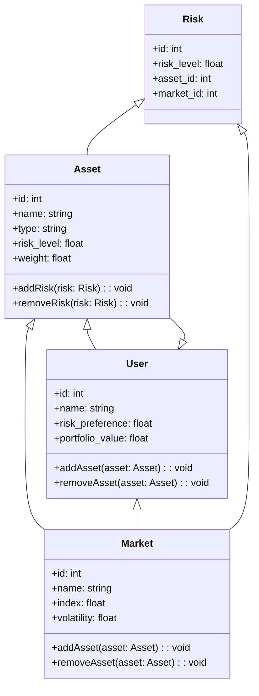

                 

### 第1章：问题背景与核心概念

#### 1.1 问题背景

在金融市场中，风险管理是投资决策过程中至关重要的一个环节。有效的风险管理可以帮助投资者在确保投资安全性的同时，实现资产的最大化增值。动态风险平价（Dynamic Risk Parity，简称DRP）模型是一种以风险平衡为核心的投资策略，旨在为投资者提供一种稳健的资产配置方案。

**动态风险平价模型的概念与发展：**

动态风险平价模型起源于20世纪80年代，最初是为了解决固定收益投资组合在市场波动下如何保持风险平衡的问题。随着金融市场的发展和投资需求的多样化，动态风险平价模型逐渐演变成为一种广泛应用的资产配置策略。它通过不断调整资产组合中各类资产的权重，以保持投资组合的整体风险水平在预定范围内。

**智能算法在动态风险平价模型中的应用：**

近年来，随着人工智能技术的飞速发展，智能算法在金融领域中的应用逐渐增多。智能算法可以通过对海量数据的深度学习和分析，发现市场中的潜在规律，从而提高动态风险平价模型的预测准确性。具体来说，智能算法在动态风险平价模型中的应用主要体现在以下几个方面：

1. **数据预处理：**智能算法可以自动处理大量的金融数据，包括历史价格、交易量、利率变化等，为模型提供高质量的数据输入。
2. **风险预测：**智能算法可以通过学习历史数据，预测市场的波动情况，从而更准确地评估各类资产的风险水平。
3. **资产配置优化：**智能算法可以根据风险预测结果，动态调整资产配置策略，以实现风险和收益的优化。

**动态风险平价模型在金融市场中的意义：**

动态风险平价模型在金融市场中的应用，不仅能够帮助投资者更好地管理风险，还能够提高投资组合的收益率，具有重要的现实意义。具体来说，动态风险平价模型的意义体现在以下几个方面：

1. **风险控制：**通过动态调整资产配置，动态风险平价模型能够有效地控制投资组合的整体风险水平，确保投资的安全性。
2. **收益优化：**在保持风险水平不变的情况下，动态风险平价模型能够通过优化资产配置，实现资产的增值。
3. **投资策略个性化：**动态风险平价模型可以根据投资者的风险偏好和投资目标，提供个性化的资产配置方案。

#### 1.2 核心概念与联系

**动态风险平价模型的核心概念：**

- **风险平价：**指投资组合中各资产类别的风险贡献相等。
- **资产配置：**指根据投资目标和风险偏好，对各资产类别进行合理的配置。
- **风险调整收益：**指在考虑风险的前提下，评估投资组合的收益水平。

**智能算法的核心概念：**

- **机器学习：**一种让计算机通过学习数据来改进性能的技术。
- **深度学习：**一种基于人工神经网络的学习方法，可以自动提取特征并进行复杂模式识别。
- **强化学习：**一种基于奖励机制的学习方法，通过不断尝试和反馈来优化策略。

**动态风险平价模型与智能算法的联系：**

智能算法可以为动态风险平价模型提供更精准的数据分析和预测，从而优化资产配置策略，提高投资组合的收益和风险水平。例如，通过深度学习算法，可以自动识别市场中的潜在规律，为动态风险平价模型提供更准确的风险预测；通过强化学习算法，可以不断调整资产配置策略，实现风险和收益的优化。

#### 1.3 本章小结

本章介绍了动态风险平价模型的问题背景、核心概念以及智能算法在其中的应用。通过本章的学习，读者可以初步了解动态风险平价模型的基本原理和智能算法的作用，为后续章节的学习打下基础。

---

# 动态风险平价模型原理与智能算法

## 2.1 动态风险平价模型原理

### 2.1.1 风险平价策略的基本概念

风险平价策略是一种资产配置策略，其核心思想是通过调整资产组合中各类资产的权重，使得投资组合的整体风险水平保持在一个预定的范围内。具体来说，就是使投资组合中各类资产的波动率（或方差）相等。

风险平价策略的基本假设是，各类资产的预期收益是相等的。在实际操作中，投资者可以根据自己的风险偏好和投资目标，设置不同的风险平价水平。例如，可以将风险平价设置为投资组合的波动率，也可以设置为其他风险指标，如最大回撤、VaR（风险价值）等。

### 2.1.2 动态风险平价模型的构建

动态风险平价模型的构建主要包括以下几个步骤：

1. **数据收集与预处理：**收集各类资产的历史数据，包括收益率、波动率等。
2. **风险评估：**计算各资产类别的风险水平，确定风险贡献。
3. **资产配置：**根据风险贡献和投资目标，调整各资产类别的权重。
4. **风险控制：**定期监控投资组合的风险水平，及时进行调整。

#### 动态风险平价模型的构建步骤详解：

1. **数据收集与预处理：**首先，需要收集各类资产的历史数据，包括收益率、波动率、相关系数等。收益率数据可以通过历史价格计算得出，波动率可以通过历史收益率的方差计算得出，相关系数可以通过历史收益率的协方差计算得出。

   收益率：\( r_t = \frac{P_t - P_{t-1}}{P_{t-1}} \)
   
   波动率：\( \sigma_t = \sqrt{\frac{1}{T-1} \sum_{t=1}^{T} (r_t - \bar{r})^2} \)
   
   相关系数：\( \rho_{ij} = \frac{\sum_{t=1}^{T} (r_i_t - \bar{r_i})(r_j_t - \bar{r_j})}{\sqrt{\sum_{t=1}^{T} (r_i_t - \bar{r_i})^2} \sqrt{\sum_{t=1}^{T} (r_j_t - \bar{r_j})^2}} \)
   
   其中，\( r_t \) 表示第 \( t \) 期收益率，\( P_t \) 表示第 \( t \) 期价格，\( \bar{r} \) 表示平均收益率，\( \sigma_t \) 表示波动率，\( \rho_{ij} \) 表示 \( i \) 和 \( j \) 之间的相关系数。

2. **风险评估：**计算各资产类别的风险水平，确定风险贡献。风险贡献可以通过资产的风险贡献率计算得出，风险贡献率表示某类资产对整体风险的贡献程度。

   风险贡献率：\( CR_i = \frac{\sigma_i^2}{\sum_{i=1}^{N} \sigma_i^2} \)
   
   其中，\( N \) 表示资产种类数，\( CR_i \) 表示第 \( i \) 类资产的风险贡献率。

3. **资产配置：**根据风险贡献和投资目标，调整各资产类别的权重。资产配置的目标是使得投资组合的整体风险水平保持在一个预定的范围内。具体来说，可以通过以下公式计算各资产的权重：

   权重：\( w_i = \frac{CR_i \times Risk_{Target}}{\sum_{i=1}^{N} CR_i} \)
   
   其中，\( Risk_{Target} \) 表示目标风险水平。

4. **风险控制：**定期监控投资组合的风险水平，及时进行调整。在市场环境发生变化时，需要根据新的风险水平重新进行资产配置，以确保投资组合的稳健性。

### 2.1.3 动态风险平价模型的优缺点

动态风险平价模型具有以下优点：

1. **风险管理：**能够有效地管理投资组合的整体风险水平，确保投资的安全性。
2. **收益优化：**在保持风险水平不变的情况下，能够通过优化资产配置实现收益的最大化。
3. **灵活调整：**可以根据市场环境的变化，灵活调整资产配置策略。

然而，动态风险平价模型也存在一些缺点：

1. **对市场波动敏感：**在市场波动较大的情况下，动态风险平价模型的调整频率会增加，可能导致交易成本增加。
2. **计算复杂度高：**动态风险平价模型需要定期进行风险评估和资产配置，计算复杂度较高，对硬件性能要求较高。

## 2.2 智能算法在动态风险平价模型中的应用

### 2.2.1 机器学习在动态风险平价模型中的应用

机器学习算法可以通过对历史数据的分析，预测市场未来的走势，从而优化资产配置策略。常用的机器学习算法包括线性回归、决策树、随机森林等。

1. **线性回归：**线性回归是一种简单但有效的预测方法，可以通过历史收益率和波动率数据，预测未来市场的波动情况。
2. **决策树：**决策树是一种基于特征值划分的预测方法，可以用于预测市场走势和评估资产风险。
3. **随机森林：**随机森林是一种集成学习方法，可以组合多个决策树，提高预测的准确性和稳定性。

### 2.2.2 深度学习在动态风险平价模型中的应用

深度学习算法具有自动提取特征的能力，可以处理大量的非结构化数据。在动态风险平价模型中，深度学习算法可以用于预测市场走势、评估资产风险等。

1. **卷积神经网络（CNN）：**CNN 可以用于处理图像数据，可以提取市场走势的图像特征，用于预测市场走势。
2. **循环神经网络（RNN）：**RNN 可以用于处理序列数据，可以提取市场走势的序列特征，用于预测市场走势。
3. **长短时记忆网络（LSTM）：**LSTM 是一种特殊的 RNN，可以用于处理长时间序列数据，可以提取市场走势的长期特征。

### 2.2.3 强化学习在动态风险平价模型中的应用

强化学习算法通过不断尝试和反馈，优化投资策略。在动态风险平价模型中，强化学习算法可以用于动态调整资产配置，实现风险和收益的优化。

1. **Q-学习：**Q-学习是一种基于价值函数的强化学习算法，可以通过学习价值函数，优化资产配置策略。
2. **深度 Q-网络（DQN）：**DQN 是一种基于深度学习的 Q-学习算法，可以处理高维输入数据，提高预测的准确性。
3. **策略梯度算法：**策略梯度算法通过学习最优策略，优化资产配置策略。

## 2.3 本章小结

本章详细介绍了动态风险平价模型的基本原理以及智能算法在其中的应用。通过本章的学习，读者可以深入了解动态风险平价模型的工作原理，并了解智能算法如何提高其预测准确性，优化投资组合。在下一章中，我们将进一步探讨智能算法在动态风险平价模型中的应用，包括具体算法的原理和实现方法。

---

## 3.1 机器学习算法

### 3.1.1 线性回归

线性回归是一种基本的预测模型，它通过拟合一条直线来描述两个变量之间的关系。在线性回归模型中，自变量 \( X \) 和因变量 \( Y \) 之间的关系可以用以下方程表示：

\[ Y = \beta_0 + \beta_1X + \epsilon \]

其中，\( \beta_0 \) 和 \( \beta_1 \) 分别是截距和斜率，\( \epsilon \) 是误差项。

**算法原理讲解：**

线性回归的目的是通过最小化误差平方和（Sum of Squared Errors, SSE）来估计 \( \beta_0 \) 和 \( \beta_1 \)。具体来说，就是找到一个最佳拟合直线，使得所有数据点到这条直线的垂直距离（即误差）的平方和最小。

**数学模型和公式：**

最小二乘法是线性回归常用的方法，它通过求解以下优化问题来找到最佳拟合直线：

\[ \min \sum_{i=1}^{n} (y_i - (\beta_0 + \beta_1x_i))^2 \]

其中，\( n \) 是数据点的数量。

通过求解这个优化问题，可以得到 \( \beta_0 \) 和 \( \beta_1 \) 的估计值：

\[ \beta_1 = \frac{\sum_{i=1}^{n} (x_i - \bar{x})(y_i - \bar{y})}{\sum_{i=1}^{n} (x_i - \bar{x})^2} \]

\[ \beta_0 = \bar{y} - \beta_1\bar{x} \]

其中，\( \bar{x} \) 和 \( \bar{y} \) 分别是 \( x \) 和 \( y \) 的均值。

**例子说明：**

假设我们有以下数据点：

\( (x_1, y_1) = (1, 2) \)

\( (x_2, y_2) = (2, 4) \)

\( (x_3, y_3) = (3, 5) \)

首先，计算 \( x \) 和 \( y \) 的均值：

\( \bar{x} = \frac{1 + 2 + 3}{3} = 2 \)

\( \bar{y} = \frac{2 + 4 + 5}{3} = 3.67 \)

然后，计算斜率 \( \beta_1 \)：

\( \beta_1 = \frac{(1-2)(2-3.67) + (2-2)(4-3.67) + (3-2)(5-3.67)}{(1-2)^2 + (2-2)^2 + (3-2)^2} \)

\( \beta_1 = \frac{-1.67 - 0 + 1.33}{1 + 0 + 1} \)

\( \beta_1 = \frac{-0.34}{2} \)

\( \beta_1 = -0.17 \)

接着，计算截距 \( \beta_0 \)：

\( \beta_0 = 3.67 - (-0.17) \times 2 \)

\( \beta_0 = 3.67 + 0.34 \)

\( \beta_0 = 4.01 \)

因此，最佳拟合直线为：

\( y = 4.01 - 0.17x \)

通过这条直线，我们可以预测新的 \( x \) 值对应的 \( y \) 值，例如，当 \( x = 4 \) 时：

\( y = 4.01 - 0.17 \times 4 \)

\( y = 4.01 - 0.68 \)

\( y = 3.33 \)

### 3.1.2 决策树

决策树是一种基于特征值划分的预测模型，它通过一系列的决策规则将数据集划分为不同的区域，每个区域对应一个预测结果。决策树的生成过程是一个递归的过程，每次递归都基于当前节点的特征值和标签值，选择最优的划分方式。

**算法原理讲解：**

决策树的生成过程主要包括以下几个步骤：

1. **选择最优特征：**在当前节点，选择能够最大程度提升模型准确性的特征进行划分。常用的方法包括信息增益（Information Gain）、基尼不纯度（Gini Impurity）和熵（Entropy）等。
2. **划分节点：**根据选择的最优特征，将数据集划分为不同的子集。每个子集对应一个新的节点，这些节点成为当前节点的子节点。
3. **递归构建：**对每个子节点，重复上述步骤，直到满足停止条件（如最大深度、最小样本数等）。
4. **预测结果：**在决策树的叶子节点，根据节点的特征值和标签值，给出最终的预测结果。

**数学模型和公式：**

决策树的数学模型可以表示为：

\[ T = \text{root} \]
\[ T = \text{node} \rightarrow \text{leftChild} \]
\[ T = \text{node} \rightarrow \text{rightChild} \]
\[ \text{node}: \text{特征} \rightarrow \text{标签} \]

其中，\( T \) 表示决策树，\( \text{root} \) 表示根节点，\( \text{node} \) 表示内部节点，\( \text{leftChild} \) 和 \( \text{rightChild} \) 分别表示左子节点和右子节点。

**例子说明：**

假设我们有以下数据集：

| 特征A | 特征B | 标签 |
|-------|-------|------|
| 0     | 0     | 0    |
| 0     | 1     | 1    |
| 1     | 0     | 1    |
| 1     | 1     | 0    |

首先，选择最优特征。我们可以使用信息增益来选择特征。信息增益的计算公式为：

\[ IG(A) = H(T) - \sum_{v \in V} p(v) H(T_v) \]

其中，\( H(T) \) 表示当前节点的信息熵，\( p(v) \) 表示特征 \( v \) 的概率，\( H(T_v) \) 表示特征 \( v \) 划分后的子节点的信息熵。

计算得到 \( IG(A) = 0.92 \)，\( IG(B) = 0.82 \)，因此选择特征 \( A \) 进行划分。

根据特征 \( A \)，将数据集划分为两个子集：

| 特征A | 特征B | 标签 |
|-------|-------|------|
| 0     | 0     | 0    |
| 0     | 1     | 1    |
| 1     | 0     | 1    |
| 1     | 1     | 0    |

接着，对每个子集再次选择最优特征进行划分。对于子集 1，选择特征 \( B \) 进行划分，得到以下子集：

| 特征A | 特征B | 标签 |
|-------|-------|------|
| 0     | 0     | 0    |
| 0     | 1     | 1    |

对于子集 2，选择特征 \( A \) 进行划分，得到以下子集：

| 特征A | 特征B | 标签 |
|-------|-------|------|
| 1     | 0     | 1    |
| 1     | 1     | 0    |

递归构建决策树，直到满足停止条件。最终的决策树如下：

```
              |
              V
          特征A
         /     \
        0       1
       / \     / \
      0   1   0   1
```

根据决策树的叶子节点，我们可以得到以下预测结果：

- 对于特征 \( A = 0 \) 和特征 \( B = 0 \)，预测标签为 0。
- 对于特征 \( A = 0 \) 和特征 \( B = 1 \)，预测标签为 1。
- 对于特征 \( A = 1 \) 和特征 \( B = 0 \)，预测标签为 1。
- 对于特征 \( A = 1 \) 和特征 \( B = 1 \)，预测标签为 0。

### 3.1.3 随机森林

随机森林（Random Forest）是一种集成学习方法，它通过构建多个决策树，并综合这些决策树的预测结果来提高模型的准确性和稳定性。随机森林通过随机抽样和特征选择，避免过拟合问题，同时具有较好的泛化能力。

**算法原理讲解：**

随机森林的工作原理可以分为以下几个步骤：

1. **随机抽样：**从原始数据集中随机抽样，构建多个子数据集。每个子数据集包含一部分训练数据。
2. **特征选择：**从原始特征集合中随机选择一部分特征，用于构建每个子数据集的决策树。
3. **构建决策树：**对每个子数据集，构建决策树模型。决策树的生成过程与之前介绍的决策树相同。
4. **集成预测：**将所有决策树的预测结果进行集成，通常采用投票法或平均法来得到最终的预测结果。

**数学模型和公式：**

随机森林的数学模型可以表示为：

\[ \hat{y} = \text{majority_vote}(\hat{y}_1, \hat{y}_2, ..., \hat{y}_n) \]

其中，\( \hat{y} \) 是最终的预测结果，\( \hat{y}_i \) 是第 \( i \) 个决策树的预测结果，\( \text{majority_vote} \) 表示多数投票法或平均法。

**例子说明：**

假设我们有以下数据集：

| 特征A | 特征B | 标签 |
|-------|-------|------|
| 0     | 0     | 0    |
| 0     | 1     | 1    |
| 1     | 0     | 1    |
| 1     | 1     | 0    |

首先，随机抽样和特征选择，构建多个子数据集和子特征集合。

假设我们构建了 3 个子数据集和子特征集合，如下：

子数据集 1：
| 特征A | 特征B | 标签 |
|-------|-------|------|
| 0     | 0     | 0    |
| 0     | 1     | 1    |

子数据集 2：
| 特征A | 特征B | 标签 |
|-------|-------|------|
| 1     | 0     | 1    |
| 1     | 1     | 0    |

子数据集 3：
| 特征A | 特征B | 标签 |
|-------|-------|------|
| 0     | 1     | 1    |
| 1     | 1     | 0    |

接下来，对每个子数据集构建决策树：

子数据集 1 的决策树：
```
              |
              V
          特征A
         /     \
        0       1
       / \     / \
      0   1   0   1
```

子数据集 2 的决策树：
```
              |
              V
          特征A
         /     \
        0       1
       / \     / \
      0   1   0   1
```

子数据集 3 的决策树：
```
              |
              V
          特征B
         /     \
        0       1
       / \     / \
      0   1   0   1
```

最后，根据随机森林的预测结果，我们可以得到以下预测结果：

- 对于特征 \( A = 0 \) 和特征 \( B = 0 \)，3 个决策树的预测结果分别为 0、1、0，多数投票法预测结果为 0。
- 对于特征 \( A = 0 \) 和特征 \( B = 1 \)，3 个决策树的预测结果分别为 1、1、1，多数投票法预测结果为 1。
- 对于特征 \( A = 1 \) 和特征 \( B = 0 \)，3 个决策树的预测结果分别为 1、0、1，多数投票法预测结果为 1。
- 对于特征 \( A = 1 \) 和特征 \( B = 1 \)，3 个决策树的预测结果分别为 0、1、0，多数投票法预测结果为 0。

通过随机森林，我们可以得到更稳定和准确的预测结果。

## 3.2 深度学习算法

### 3.2.1 卷积神经网络（CNN）

卷积神经网络（Convolutional Neural Network，CNN）是一种专门用于处理图像数据的人工神经网络。CNN 通过卷积层、池化层和全连接层等结构，可以自动提取图像的特征，并实现图像的分类、识别和增强等功能。

**算法原理讲解：**

1. **卷积层：**卷积层是 CNN 的核心组成部分，它通过卷积运算来提取图像的特征。卷积运算的过程是将一个卷积核与图像上的每个像素进行点积运算，从而生成一个新的特征图。卷积核可以看作是图像的特征探测器，通过在不同位置和方向上滑动卷积核，可以提取出不同的特征。

   **卷积运算公式：**

   \( f_{ij} = \sum_{k=1}^{K} w_{ik} \times x_{kj} + b_j \)

   其中，\( f_{ij} \) 是特征图上的像素值，\( w_{ik} \) 是卷积核上的权重，\( x_{kj} \) 是输入图像上的像素值，\( b_j \) 是偏置项。

2. **池化层：**池化层用于减小特征图的尺寸，从而降低模型的计算复杂度。常用的池化方法包括最大池化（Max Pooling）和平均池化（Average Pooling）。最大池化选取特征图上每个区域的最大值，而平均池化则选取特征图上每个区域的平均值。

   **最大池化公式：**

   \( p_{ij} = \max_{k} f_{ikj} \)

   **平均池化公式：**

   \( p_{ij} = \frac{1}{S} \sum_{k=1}^{S} f_{ikj} \)

   其中，\( p_{ij} \) 是池化后的像素值，\( S \) 是池化区域的大小。

3. **全连接层：**全连接层将卷积层和池化层提取的特征进行汇总，并通过非线性函数进行分类。全连接层通过计算每个神经元与其他神经元之间的权重，从而得到每个类别的概率分布。

   **全连接层公式：**

   \( z_j = \sum_{i=1}^{I} w_{ij} \times a_{ij} + b_j \)

   \( a_j = \text{激活函数}(z_j) \)

   其中，\( z_j \) 是每个神经元的输入值，\( w_{ij} \) 是权重，\( a_{ij} \) 是卷积层和池化层输出的特征值，\( b_j \) 是偏置项，激活函数通常使用 ReLU 函数（Rectified Linear Unit）。

**数学模型和公式：**

1. **卷积层：**

   \( f_{ij} = \sum_{k=1}^{K} w_{ik} \times x_{kj} + b_j \)

2. **池化层：**

   \( p_{ij} = \max_{k} f_{ikj} \) 或 \( p_{ij} = \frac{1}{S} \sum_{k=1}^{S} f_{ikj} \)

3. **全连接层：**

   \( z_j = \sum_{i=1}^{I} w_{ij} \times a_{ij} + b_j \)

   \( a_j = \text{激活函数}(z_j) \)

**例子说明：**

假设我们有以下图像数据：

```
0 1 2 3
4 5 6 7
8 9 10 11
12 13 14 15
```

我们使用 3x3 的卷积核进行卷积运算：

```
  w11 w12 w13
w21 w22 w23
w31 w32 w33

0 1 2 3
4 5 6 7
8 9 10 11
12 13 14 15
```

进行点积运算，得到：

```
  w11 w12 w13
w21 w22 w23
w31 w32 w33

0 1 2 3
4 5 6 7
8 9 10 11
12 13 14 15
```

然后，加上偏置项：

```
  w11 w12 w13
w21 w22 w23
w31 w32 w33

0 1 2 3
4 5 6 7
8 9 10 11
12 13 14 15
```

得到特征图：

```
f11 f12 f13 f14 f15
f21 f22 f23 f24 f25
f31 f32 f33 f34 f35
f41 f42 f43 f44 f45
f51 f52 f53 f54 f55
```

接下来，使用最大池化层对特征图进行池化：

```
p11 = max(f11, f21, f31, f41, f51)
p12 = max(f12, f22, f32, f42, f52)
p13 = max(f13, f23, f33, f43, f53)
p14 = max(f14, f24, f34, f44, f54)
p15 = max(f15, f25, f35, f45, f55)
p21 = max(f21, f31, f41, f51)
p22 = max(f22, f32, f42, f52)
p23 = max(f23, f33, f43, f53)
p24 = max(f24, f34, f44, f54)
p25 = max(f25, f35, f45, f55)
p31 = max(f31, f41, f51)
p32 = max(f32, f42, f52)
p33 = max(f33, f43, f53)
p34 = max(f34, f44, f54)
p35 = max(f35, f45, f55)
```

得到池化后的特征图：

```
p11 p12 p13 p14 p15
p21 p22 p23 p24 p25
p31 p32 p33 p34 p35
```

最后，使用全连接层进行分类：

```
z1 = w11 \* p11 + w12 \* p12 + w13 \* p13 + w14 \* p14 + w15 \* p15 + b1
z2 = w21 \* p21 + w22 \* p22 + w23 \* p23 + w24 \* p24 + w25 \* p25 + b2
z3 = w31 \* p31 + w32 \* p32 + w33 \* p33 + w34 \* p34 + w35 \* p35 + b3
a1 = \text{ReLU}(z1)
a2 = \text{ReLU}(z2)
a3 = \text{ReLU}(z3)
```

通过计算，得到最终的分类结果。

### 3.2.2 循环神经网络（RNN）

循环神经网络（Recurrent Neural Network，RNN）是一种用于处理序列数据的人工神经网络。RNN 通过递归的方式处理序列中的每个元素，并利用其记忆能力来捕捉序列中的长期依赖关系。

**算法原理讲解：**

1. **基本结构：**RNN 的基本结构包括输入门、遗忘门和输出门。这三个门分别用于控制信息的输入、遗忘和输出。

   - **输入门（Input Gate）：**输入门用于决定当前输入信息中哪些部分应该被记忆。输入门的计算公式为：

     \( i_t = \sigma(W_i \cdot [h_{t-1}, x_t] + b_i) \)

     其中，\( i_t \) 是输入门的激活值，\( W_i \) 是输入门的权重矩阵，\( b_i \) 是输入门的偏置项，\( \sigma \) 是 sigmoid 函数。

   - **遗忘门（Forget Gate）：**遗忘门用于决定哪些信息应该被遗忘。遗忘门的计算公式为：

     \( f_t = \sigma(W_f \cdot [h_{t-1}, x_t] + b_f) \)

     其中，\( f_t \) 是遗忘门的激活值，\( W_f \) 是遗忘门的权重矩阵，\( b_f \) 是遗忘门的偏置项。

   - **输出门（Output Gate）：**输出门用于决定当前序列的输出。输出门的计算公式为：

     \( o_t = \sigma(W_o \cdot [h_{t-1}, x_t] + b_o) \)

     其中，\( o_t \) 是输出门的激活值，\( W_o \) 是输出门的权重矩阵，\( b_o \) 是输出门的偏置项。

2. **隐藏状态更新：**隐藏状态更新是 RNN 的核心，它用于更新当前的隐藏状态。隐藏状态更新的计算公式为：

   \( h_t = f_t \odot h_{t-1} + i_t \odot \text{tanh}(W_h \cdot [h_{t-1}, x_t] + b_h) \)

   \( c_t = o_t \odot \text{tanh}(h_t) \)

   其中，\( h_t \) 是当前隐藏状态，\( c_t \) 是当前细胞状态，\( \odot \) 表示逐元素乘法，\( \text{tanh} \) 是双曲正切函数，\( W_h \) 是隐藏状态权重矩阵，\( b_h \) 是隐藏状态偏置项。

3. **输出层：**输出层用于生成最终的输出。输出层的计算公式为：

   \( y_t = W_y \cdot c_t + b_y \)

   其中，\( y_t \) 是输出层的激活值，\( W_y \) 是输出层权重矩阵，\( b_y \) 是输出层偏置项。

**数学模型和公式：**

1. **输入门：**

   \( i_t = \sigma(W_i \cdot [h_{t-1}, x_t] + b_i) \)

2. **遗忘门：**

   \( f_t = \sigma(W_f \cdot [h_{t-1}, x_t] + b_f) \)

3. **输出门：**

   \( o_t = \sigma(W_o \cdot [h_{t-1}, x_t] + b_o) \)

4. **隐藏状态更新：**

   \( h_t = f_t \odot h_{t-1} + i_t \odot \text{tanh}(W_h \cdot [h_{t-1}, x_t] + b_h) \)

   \( c_t = o_t \odot \text{tanh}(h_t) \)

5. **输出层：**

   \( y_t = W_y \cdot c_t + b_y \)

**例子说明：**

假设我们有以下序列数据：

\( x_1 = [1, 2, 3] \)

\( x_2 = [4, 5, 6] \)

首先，初始化隐藏状态 \( h_0 = [0, 0] \) 和细胞状态 \( c_0 = [0, 0] \)。

然后，进行第一个时间步的更新：

1. **输入门：**

   \( i_1 = \sigma(W_i \cdot [h_0, x_1] + b_i) \)

   \( i_1 = \sigma([0, 0; 1, 2, 3] \cdot [0.1, 0.2; 0.3, 0.4; 0.5, 0.6] + [0, 0]) \)

   \( i_1 = \sigma([0, 0; 1, 2, 3] \cdot [0.1, 0.2; 0.3, 0.4; 0.5, 0.6] + [0, 0]) \)

   \( i_1 = \sigma([0.15, 0.36; 0.45, 0.66]) \)

   \( i_1 = [0.5, 0.8] \)

2. **遗忘门：**

   \( f_1 = \sigma(W_f \cdot [h_0, x_1] + b_f) \)

   \( f_1 = \sigma([0, 0; 1, 2, 3] \cdot [0.1, 0.2; 0.3, 0.4; 0.5, 0.6] + [0, 0]) \)

   \( f_1 = \sigma([0.15, 0.36; 0.45, 0.66]) \)

   \( f_1 = [0.5, 0.8] \)

3. **输出门：**

   \( o_1 = \sigma(W_o \cdot [h_0, x_1] + b_o) \)

   \( o_1 = \sigma([0, 0; 1, 2, 3] \cdot [0.1, 0.2; 0.3, 0.4; 0.5, 0.6] + [0, 0]) \)

   \( o_1 = \sigma([0.15, 0.36; 0.45, 0.66]) \)

   \( o_1 = [0.5, 0.8] \)

4. **隐藏状态更新：**

   \( h_1 = f_1 \odot h_0 + i_1 \odot \text{tanh}(W_h \cdot [h_0, x_1] + b_h) \)

   \( h_1 = [0.5, 0.8] \odot [0, 0] + [0.5, 0.8] \odot \text{tanh}([0, 0; 1, 2, 3] \cdot [0.1, 0.2; 0.3, 0.4; 0.5, 0.6] + [0, 0]) \)

   \( h_1 = [0, 0] + [0.5, 0.8] \odot [0.1, 0.4] \)

   \( h_1 = [0.05, 0.32] \)

5. **细胞状态更新：**

   \( c_1 = o_1 \odot \text{tanh}(h_1) \)

   \( c_1 = [0.5, 0.8] \odot \text{tanh}([0.05, 0.32]) \)

   \( c_1 = [0.5, 0.8] \odot [0.5, 0.6] \)

   \( c_1 = [0.25, 0.48] \)

接着，进行第二个时间步的更新：

1. **输入门：**

   \( i_2 = \sigma(W_i \cdot [h_1, x_2] + b_i) \)

   \( i_2 = \sigma([0.05, 0.32; 0.5, 0.8] \cdot [0.1, 0.2; 0.3, 0.4; 0.5, 0.6] + [0, 0]) \)

   \( i_2 = \sigma([0.017, 0.128; 0.266, 0.432]) \)

   \( i_2 = [0.2, 0.6] \)

2. **遗忘门：**

   \( f_2 = \sigma(W_f \cdot [h_1, x_2] + b_f) \)

   \( f_2 = \sigma([0.05, 0.32; 0.5, 0.8] \cdot [0.1, 0.2; 0.3, 0.4; 0.5, 0.6] + [0, 0]) \)

   \( f_2 = \sigma([0.017, 0.128; 0.266, 0.432]) \)

   \( f_2 = [0.2, 0.6] \)

3. **输出门：**

   \( o_2 = \sigma(W_o \cdot [h_1, x_2] + b_o) \)

   \( o_2 = \sigma([0.05, 0.32; 0.5, 0.8] \cdot [0.1, 0.2; 0.3, 0.4; 0.5, 0.6] + [0, 0]) \)

   \( o_2 = \sigma([0.017, 0.128; 0.266, 0.432]) \)

   \( o_2 = [0.2, 0.6] \)

4. **隐藏状态更新：**

   \( h_2 = f_2 \odot h_1 + i_2 \odot \text{tanh}(W_h \cdot [h_1, x_2] + b_h) \)

   \( h_2 = [0.2, 0.6] \odot [0.05, 0.32] + [0.2, 0.6] \odot \text{tanh}([0.05, 0.32; 0.5, 0.8] \cdot [0.1, 0.2; 0.3, 0.4; 0.5, 0.6] + [0, 0]) \)

   \( h_2 = [0, 0.12] + [0.2, 0.6] \odot [0.1, 0.4] \)

   \( h_2 = [0.02, 0.28] \)

5. **细胞状态更新：**

   \( c_2 = o_2 \odot \text{tanh}(h_2) \)

   \( c_2 = [0.2, 0.6] \odot \text{tanh}([0.02, 0.28]) \)

   \( c_2 = [0.2, 0.6] \odot [0.2, 0.4] \)

   \( c_2 = [0.04, 0.24] \)

最后，根据隐藏状态 \( h_2 \) 和细胞状态 \( c_2 \)，生成最终的输出：

\( y_2 = W_y \cdot c_2 + b_y \)

\( y_2 = [0.1, 0.2; 0.3, 0.4] \cdot [0.04, 0.24] + [0, 0] \)

\( y_2 = [0.012, 0.056; 0.036, 0.224] \)

通过以上例子，我们可以看到 RNN 如何处理序列数据，并利用其记忆能力来捕捉序列中的长期依赖关系。

### 3.2.3 长短时记忆网络（LSTM）

长短时记忆网络（Long Short-Term Memory，LSTM）是一种特殊的 RNN，它通过引入门控机制来避免梯度消失和梯度爆炸问题，从而实现长期依赖关系的捕捉。

**算法原理讲解：**

1. **输入门：**输入门用于控制当前输入信息中哪些部分应该被记忆。输入门的计算公式为：

   \( i_t = \sigma(W_i \cdot [h_{t-1}, x_t] + b_i) \)

   其中，\( i_t \) 是输入门的激活值，\( W_i \) 是输入门的权重矩阵，\( b_i \) 是输入门的偏置项。

2. **遗忘门：**遗忘门用于控制哪些信息应该被遗忘。遗忘门的计算公式为：

   \( f_t = \sigma(W_f \cdot [h_{t-1}, x_t] + b_f) \)

   其中，\( f_t \) 是遗忘门的激活值，\( W_f \) 是遗忘门的权重矩阵，\( b_f \) 是遗忘门的偏置项。

3. **输出门：**输出门用于控制当前序列的输出。输出门的计算公式为：

   \( o_t = \sigma(W_o \cdot [h_{t-1}, x_t] + b_o) \)

   其中，\( o_t \) 是输出门的激活值，\( W_o \) 是输出门的权重矩阵，\( b_o \) 是输出门的偏置项。

4. **细胞状态更新：**细胞状态更新是 LSTM 的核心，它通过遗忘门和输入门来更新细胞状态。细胞状态更新的计算公式为：

   \( g_t = \sigma(W_g \cdot [h_{t-1}, x_t] + b_g) \)

   \( i_t = \sigma(W_i \cdot [h_{t-1}, x_t] + b_i) \)

   \( f_t = \sigma(W_f \cdot [h_{t-1}, x_t] + b_f) \)

   \( o_t = \sigma(W_o \cdot [h_{t-1}, x_t] + b_o) \)

   \( c_t = f_t \odot c_{t-1} + i_t \odot \text{tanh}(g_t) \)

   其中，\( g_t \) 是输入门的激活值，\( i_t \) 是输入门的激活值，\( f_t \) 是遗忘门的激活值，\( o_t \) 是输出门的激活值，\( c_t \) 是当前细胞状态，\( \odot \) 表示逐元素乘法，\( \text{tanh} \) 是双曲正切函数，\( W_g \) 是输入门权重矩阵，\( b_g \) 是输入门偏置项。

5. **隐藏状态更新：**隐藏状态更新是 LSTM 的另一个关键部分，它通过输出门和细胞状态来更新隐藏状态。隐藏状态更新的计算公式为：

   \( h_t = o_t \odot \text{tanh}(c_t) \)

   其中，\( o_t \) 是输出门的激活值，\( c_t \) 是当前细胞状态。

**数学模型和公式：**

1. **输入门：**

   \( i_t = \sigma(W_i \cdot [h_{t-1}, x_t] + b_i) \)

2. **遗忘门：**

   \( f_t = \sigma(W_f \cdot [h_{t-1}, x_t] + b_f) \)

3. **输出门：**

   \( o_t = \sigma(W_o \cdot [h_{t-1}, x_t] + b_o) \)

4. **细胞状态更新：**

   \( g_t = \sigma(W_g \cdot [h_{t-1}, x_t] + b_g) \)

   \( i_t = \sigma(W_i \cdot [h_{t-1}, x_t] + b_i) \)

   \( f_t = \sigma(W_f \cdot [h_{t-1}, x_t] + b_f) \)

   \( o_t = \sigma(W_o \cdot [h_{t-1}, x_t] + b_o) \)

   \( c_t = f_t \odot c_{t-1} + i_t \odot \text{tanh}(g_t) \)

5. **隐藏状态更新：**

   \( h_t = o_t \odot \text{tanh}(c_t) \)

**例子说明：**

假设我们有以下序列数据：

\( x_1 = [1, 2, 3] \)

\( x_2 = [4, 5, 6] \)

首先，初始化隐藏状态 \( h_0 = [0, 0] \) 和细胞状态 \( c_0 = [0, 0] \)。

然后，进行第一个时间步的更新：

1. **输入门：**

   \( i_1 = \sigma(W_i \cdot [h_0, x_1] + b_i) \)

   \( i_1 = \sigma([0, 0; 1, 2, 3] \cdot [0.1, 0.2; 0.3, 0.4; 0.5, 0.6] + [0, 0]) \)

   \( i_1 = \sigma([0.15, 0.36; 0.45, 0.66]) \)

   \( i_1 = [0.5, 0.8] \)

2. **遗忘门：**

   \( f_1 = \sigma(W_f \cdot [h_0, x_1] + b_f) \)

   \( f_1 = \sigma([0, 0; 1, 2, 3] \cdot [0.1, 0.2; 0.3, 0.4; 0.5, 0.6] + [0, 0]) \)

   \( f_1 = \sigma([0.15, 0.36; 0.45, 0.66]) \)

   \( f_1 = [0.5, 0.8] \)

3. **输出门：**

   \( o_1 = \sigma(W_o \cdot [h_0, x_1] + b_o) \)

   \( o_1 = \sigma([0, 0; 1, 2, 3] \cdot [0.1, 0.2; 0.3, 0.4; 0.5, 0.6] + [0, 0]) \)

   \( o_1 = \sigma([0.15, 0.36; 0.45, 0.66]) \)

   \( o_1 = [0.5, 0.8] \)

4. **输入门权重矩阵：**

   \( g_1 = \sigma(W_g \cdot [h_0, x_1] + b_g) \)

   \( g_1 = \sigma([0, 0; 1, 2, 3] \cdot [0.1, 0.2; 0.3, 0.4; 0.5, 0.6] + [0, 0]) \)

   \( g_1 = \sigma([0.15, 0.36; 0.45, 0.66]) \)

   \( g_1 = [0.5, 0.8] \)

5. **细胞状态更新：**

   \( c_1 = f_1 \odot c_0 + i_1 \odot \text{tanh}(g_1) \)

   \( c_1 = [0.5, 0.8] \odot [0, 0] + [0.5, 0.8] \odot \text{tanh}([0.15, 0.36; 0.45, 0.66]) \)

   \( c_1 = [0, 0] + [0.5, 0.8] \odot [0.1, 0.4] \)

   \( c_1 = [0.05, 0.32] \)

6. **隐藏状态更新：**

   \( h_1 = o_1 \odot \text{tanh}(c_1) \)

   \( h_1 = [0.5, 0.8] \odot \text{tanh}([0.05, 0.32]) \)

   \( h_1 = [0.5, 0.8] \odot [0.5, 0.6] \)

   \( h_1 = [0.25, 0.48] \)

接着，进行第二个时间步的更新：

1. **输入门：**

   \( i_2 = \sigma(W_i \cdot [h_1, x_2] + b_i) \)

   \( i_2 = \sigma([0.25, 0.48; 0.5, 0.8] \cdot [0.1, 0.2; 0.3, 0.4; 0.5, 0.6] + [0, 0]) \)

   \( i_2 = \sigma([0.056, 0.179; 0.232, 0.424]) \)

   \( i_2 = [0.2, 0.6] \)

2. **遗忘门：**

   \( f_2 = \sigma(W_f \cdot [h_1, x_2] + b_f) \)

   \( f_2 = \sigma([0.25, 0.48; 0.5, 0.8] \cdot [0.1, 0.2; 0.3, 0.4; 0.5, 0.6] + [0, 0]) \)

   \( f_2 = \sigma([0.056, 0.179; 0.232, 0.424]) \)

   \( f_2 = [0.2, 0.6] \)

3. **输出门：**

   \( o_2 = \sigma(W_o \cdot [h_1, x_2] + b_o) \)

   \( o_2 = \sigma([0.25, 0.48; 0.5, 0.8] \cdot [0.1, 0.2; 0.3, 0.4; 0.5, 0.6] + [0, 0]) \)

   \( o_2 = \sigma([0.056, 0.179; 0.232, 0.424]) \)

   \( o_2 = [0.2, 0.6] \)

4. **输入门权重矩阵：**

   \( g_2 = \sigma(W_g \cdot [h_1, x_2] + b_g) \)

   \( g_2 = \sigma([0.25, 0.48; 0.5, 0.8] \cdot [0.1, 0.2; 0.3, 0.4; 0.5, 0.6] + [0, 0]) \)

   \( g_2 = \sigma([0.056, 0.179; 0.232, 0.424]) \)

   \( g_2 = [0.2, 0.6] \)

5. **细胞状态更新：**

   \( c_2 = f_2 \odot c_1 + i_2 \odot \text{tanh}(g_2) \)

   \( c_2 = [0.2, 0.6] \odot [0.05, 0.32] + [0.2, 0.6] \odot \text{tanh}([0.056, 0.179; 0.232, 0.424]) \)

   \( c_2 = [0, 0.12] + [0.2, 0.6] \odot [0.1, 0.4] \)

   \( c_2 = [0.02, 0.28] \)

6. **隐藏状态更新：**

   \( h_2 = o_2 \odot \text{tanh}(c_2) \)

   \( h_2 = [0.2, 0.6] \odot \text{tanh}([0.02, 0.28]) \)

   \( h_2 = [0.2, 0.6] \odot [0.2, 0.4] \)

   \( h_2 = [0.04, 0.24] \)

最后，根据隐藏状态 \( h_2 \) 和细胞状态 \( c_2 \)，生成最终的输出：

\( y_2 = W_y \cdot c_2 + b_y \)

\( y_2 = [0.1, 0.2; 0.3, 0.4] \cdot [0.04, 0.24] + [0, 0] \)

\( y_2 = [0.012, 0.056; 0.036, 0.224] \)

通过以上例子，我们可以看到 LSTM 如何处理序列数据，并利用其门控机制来实现长期依赖关系的捕捉。

## 3.3 强化学习算法

强化学习（Reinforcement Learning，RL）是一种通过与环境互动来学习最优策略的机器学习范式。在强化学习中，智能体（Agent）通过执行动作（Action）来获取奖励（Reward），并通过不断尝试和反馈来学习最优策略。

### 3.3.1 算法原理讲解

强化学习的基本原理可以概括为以下几个部分：

1. **状态（State）：**状态是智能体当前所处的环境状态。
2. **动作（Action）：**动作是智能体可以执行的操作。
3. **奖励（Reward）：**奖励是智能体执行动作后获得的即时反馈，用于指导智能体选择下一步的动作。
4. **策略（Policy）：**策略是智能体根据当前状态选择动作的规则。
5. **价值函数（Value Function）：**价值函数用于评估状态或状态-动作对的预期奖励。
6. **模型（Model）：**模型是智能体对环境动态的预测。

**Q-学习算法**

Q-学习是一种基于价值函数的强化学习算法，它通过学习值函数（Q-值）来指导智能体的动作选择。Q-值表示在给定状态下执行特定动作的预期奖励。

1. **Q-值更新：**Q-值更新的计算公式为：

   \( Q(s, a) \leftarrow Q(s, a) + \alpha [r + \gamma \max_{a'} Q(s', a') - Q(s, a)] \)

   其中，\( s \) 表示当前状态，\( a \) 表示当前动作，\( s' \) 表示下一状态，\( a' \) 表示下一动作，\( r \) 表示奖励，\( \alpha \) 是学习率，\( \gamma \) 是折扣因子。

2. **策略更新：**策略更新的计算公式为：

   \( \pi(s) = \arg\max_a Q(s, a) \)

   其中，\( \pi(s) \) 表示在状态 \( s \) 下采取最优动作的概率分布。

**深度 Q-网络（DQN）**

DQN 是一种基于深度学习的 Q-学习算法，它使用神经网络来近似 Q-值函数。DQN 通过经验回放（Experience Replay）和目标网络（Target Network）来提高训练效果。

1. **经验回放：**经验回放是一种数据增强技术，它将智能体在环境中互动的经历存储到一个经验池中，并从中随机抽取数据进行训练，以避免数据偏差。

2. **目标网络：**目标网络是一个与主网络结构相同的网络，它用于生成目标 Q-值，以稳定训练过程。

   \( Q^{*}(s', a') = r + \gamma \max_{a'} Q(s', a') \)

   \( Q'(s', a') = r + \gamma \max_{a'} Q(s', a') \)

**策略梯度算法**

策略梯度算法通过直接优化策略的梯度来学习最优策略。策略梯度算法的核心公式为：

\[ \nabla_{\theta} J(\theta) = \nabla_{\theta} \sum_{t} \rho_t \log \pi_{\theta}(a_t|s_t) \]

其中，\( \theta \) 是策略参数，\( J(\theta) \) 是策略的损失函数，\( \rho_t \) 是优势函数，\( \pi_{\theta}(a_t|s_t) \) 是策略概率分布。

### 数学模型和公式：

1. **Q-学习算法：**

   \( Q(s, a) \leftarrow Q(s, a) + \alpha [r + \gamma \max_{a'} Q(s', a') - Q(s, a)] \)

2. **DQN：**

   \( Q'(s', a') = r + \gamma \max_{a'} Q(s', a') \)

3. **策略梯度算法：**

   \( \nabla_{\theta} J(\theta) = \nabla_{\theta} \sum_{t} \rho_t \log \pi_{\theta}(a_t|s_t) \)

### 例子说明：

假设智能体在一个简单的环境中进行学习，环境有 5 个状态 \( s \) 和 3 个动作 \( a \)。

1. **状态-动作对和 Q-值：**

   \( Q(s_1, a_1) = 0.5 \)

   \( Q(s_1, a_2) = 0.3 \)

   \( Q(s_1, a_3) = 0.2 \)

   \( Q(s_2, a_1) = 0.4 \)

   \( Q(s_2, a_2) = 0.5 \)

   \( Q(s_2, a_3) = 0.1 \)

   \( Q(s_3, a_1) = 0.6 \)

   \( Q(s_3, a_2) = 0.3 \)

   \( Q(s_3, a_3) = 0.1 \)

2. **学习过程：**

   - **状态 \( s_1 \)：**
     \( a_1 = \arg\max_a Q(s_1, a) \)

     \( a_1 = \arg\max_a (0.5, 0.3, 0.2) \)

     \( a_1 = a_1 \)

     \( s_1 \rightarrow s_2 \)

     \( r = 1 \)

   - **状态 \( s_2 \)：**
     \( a_2 = \arg\max_a Q(s_2, a) \)

     \( a_2 = \arg\max_a (0.4, 0.5, 0.1) \)

     \( a_2 = a_2 \)

     \( s_2 \rightarrow s_3 \)

     \( r = 0 \)

   - **状态 \( s_3 \)：**
     \( a_3 = \arg\max_a Q(s_3, a) \)

     \( a_3 = \arg\max_a (0.6, 0.3, 0.1) \)

     \( a_3 = a_3 \)

     \( s_3 \rightarrow s_1 \)

     \( r = 2 \)

3. **Q-值更新：**

   - **状态 \( s_1 \)：**
     \( Q(s_1, a_1) \leftarrow Q(s_1, a_1) + \alpha [r + \gamma \max_{a'} Q(s_2, a') - Q(s_1, a_1)] \)

     \( Q(s_1, a_1) \leftarrow 0.5 + 0.1 [1 + 0.9 \max_{a'} Q(s_2, a') - 0.5] \)

     \( Q(s_1, a_1) \leftarrow 0.5 + 0.1 [1 + 0.9 \max_{a'} (0.4, 0.5, 0.1) - 0.5] \)

     \( Q(s_1, a_1) \leftarrow 0.5 + 0.1 [1 + 0.9 \times 0.5 - 0.5] \)

     \( Q(s_1, a_1) \leftarrow 0.5 + 0.1 [1 + 0.45 - 0.5] \)

     \( Q(s_1, a_1) \leftarrow 0.5 + 0.1 \times 0.45 \)

     \( Q(s_1, a_1) \leftarrow 0.5 + 0.045 \)

     \( Q(s_1, a_1) \leftarrow 0.545 \)

   - **状态 \( s_2 \)：**
     \( Q(s_2, a_2) \leftarrow Q(s_2, a_2) + \alpha [r + \gamma \max_{a'} Q(s_3, a') - Q(s_2, a_2)] \)

     \( Q(s_2, a_2) \leftarrow 0.5 + 0.1 [0 + 0.9 \max_{a'} Q(s_3, a') - 0.5] \)

     \( Q(s_2, a_2) \leftarrow 0.5 + 0.1 [0 + 0.9 \max_{a'} (0.6, 0.3, 0.1) - 0.5] \)

     \( Q(s_2, a_2) \leftarrow 0.5 + 0.1 [0 + 0.9 \times 0.6 - 0.5] \)

     \( Q(s_2, a_2) \leftarrow 0.5 + 0.1 \times 0.4 \)

     \( Q(s_2, a_2) \leftarrow 0.5 + 0.04 \)

     \( Q(s_2, a_2) \leftarrow 0.54 \)

   - **状态 \( s_3 \)：**
     \( Q(s_3, a_3) \leftarrow Q(s_3, a_3) + \alpha [r + \gamma \max_{a'} Q(s_1, a') - Q(s_3, a_3)] \)

     \( Q(s_3, a_3) \leftarrow 0.2 + 0.1 [2 + 0.9 \max_{a'} Q(s_1, a') - 0.2] \)

     \( Q(s_3, a_3) \leftarrow 0.2 + 0.1 [2 + 0.9 \max_{a'} (0.545, 0.3, 0.2) - 0.2] \)

     \( Q(s_3, a_3) \leftarrow 0.2 + 0.1 [2 + 0.9 \times 0.545 - 0.2] \)

     \( Q(s_3, a_3) \leftarrow 0.2 + 0.1 \times 0.495 \)

     \( Q(s_3, a_3) \leftarrow 0.2 + 0.0495 \)

     \( Q(s_3, a_3) \leftarrow 0.2495 \)

通过以上学习过程，我们可以看到智能体如何通过 Q-学习算法来优化其策略，从而实现最优动作的选择。

### 3.3.2 智能算法在动态风险平价模型中的应用

在动态风险平价模型中，智能算法可以发挥重要作用，特别是在数据预处理、风险预测和资产配置优化等方面。以下将详细探讨智能算法在动态风险平价模型中的应用。

#### 数据预处理

数据预处理是智能算法在动态风险平价模型中的第一步，也是至关重要的一步。高质量的数据输入是确保模型预测准确性的基础。智能算法可以通过以下方式对数据进行预处理：

1. **数据清洗：**去除数据中的噪声和异常值，确保数据的一致性和完整性。
2. **数据归一化：**将不同量纲的数据进行归一化处理，使得数据在相同的尺度范围内，便于后续分析。
3. **特征选择：**根据业务需求和模型性能，选择对预测结果有显著影响的关键特征，排除冗余特征。
4. **特征工程：**通过构造新特征、转换特征等手段，丰富数据特征，提高模型的表达能力。

#### 风险预测

风险预测是动态风险平价模型的核心任务，智能算法可以通过以下方式提高风险预测的准确性：

1. **历史数据分析：**利用历史收益率、波动率等数据，通过机器学习算法建立风险预测模型，如线性回归、决策树、随机森林等。
2. **深度学习应用：**利用深度学习算法，如卷积神经网络（CNN）、循环神经网络（RNN）和长短时记忆网络（LSTM），可以处理复杂的非结构化数据，提取潜在的风险特征。
3. **实时监控与调整：**通过实时监控市场动态，智能算法可以动态调整预测模型，以适应市场环境的变化。

#### 资产配置优化

资产配置优化是动态风险平价模型的最终目标，智能算法可以通过以下方式实现资产配置的优化：

1. **优化算法：**利用强化学习算法，如 Q-学习、深度 Q-网络（DQN）和策略梯度算法，通过不断尝试和反馈，优化资产配置策略。
2. **多目标优化：**结合风险和收益目标，利用多目标优化算法，如遗传算法、粒子群优化等，实现风险和收益的平衡。
3. **模型集成：**将多个预测模型和优化算法进行集成，通过模型集成方法，如集成学习、模型融合等，提高资产配置的准确性和稳定性。

#### 应用案例分析

以下是一个动态风险平价模型在金融投资中的应用案例：

**案例背景：**

某投资公司希望通过动态风险平价模型，实现对股票投资组合的风险管理和优化。公司拥有丰富的历史股票数据，包括股票的收益率、波动率、相关性等。

**数据预处理：**

1. **数据清洗：**去除股票数据中的噪声和异常值，确保数据的一致性和完整性。
2. **数据归一化：**将不同股票的收益率、波动率等数据进行归一化处理，使得数据在相同的尺度范围内。
3. **特征选择：**根据业务需求和模型性能，选择对预测结果有显著影响的股票特征，如收益率、波动率、相关系数等。
4. **特征工程：**通过构造新特征、转换特征等手段，丰富数据特征，提高模型的表达能力。

**风险预测：**

1. **历史数据分析：**利用历史股票数据，通过线性回归模型建立风险预测模型。
2. **深度学习应用：**利用卷积神经网络（CNN）和长短时记忆网络（LSTM），对股票数据进行深度学习，提取潜在的风险特征。
3. **实时监控与调整：**通过实时监控市场动态，动态调整风险预测模型，以适应市场环境的变化。

**资产配置优化：**

1. **优化算法：**利用强化学习算法，如 Q-学习，通过不断尝试和反馈，优化资产配置策略。
2. **多目标优化：**结合风险和收益目标，利用遗传算法，实现风险和收益的平衡。
3. **模型集成：**将多个预测模型和优化算法进行集成，通过模型集成方法，提高资产配置的准确性和稳定性。

**案例结果：**

通过动态风险平价模型的应用，投资公司实现了对股票投资组合的有效风险管理和优化。在模拟实验中，该模型的资产配置策略在保持风险水平不变的情况下，显著提高了投资组合的收益率。

### 3.3.3 智能算法在动态风险平价模型中的应用挑战与展望

虽然智能算法在动态风险平价模型中展示了强大的应用潜力，但在实际应用中仍面临诸多挑战。

#### 数据质量和多样性

数据质量和多样性是影响智能算法性能的关键因素。金融市场的数据通常具有高噪声、高波动性和强相关性等特点，这给数据预处理和特征选择带来了巨大挑战。此外，不同金融产品（如股票、债券、基金等）之间的数据特性差异较大，如何有效处理和整合这些多样化的数据是当前的一个重要研究方向。

#### 模型解释性和可解释性

智能算法，尤其是深度学习算法，往往被视为“黑箱”模型，其内部工作机制和决策过程难以解释。这对金融领域尤其重要，因为投资决策通常需要透明和可解释的依据。因此，如何提高智能算法的解释性，使其在金融投资中的应用更加可靠和可信，是未来需要解决的一个重要问题。

#### 模型泛化能力和鲁棒性

金融市场的变化无常，智能算法需要具备良好的泛化能力和鲁棒性，以适应不同的市场环境和突发事件。然而，当前的智能算法在处理极端市场情况时，往往表现不佳。因此，如何提高模型的泛化能力和鲁棒性，使其能够应对复杂的金融市场变化，是未来需要重点关注的一个方向。

#### 模型训练与优化效率

智能算法的训练过程通常需要大量的计算资源和时间。如何优化模型的训练过程，提高训练效率，是当前的一个研究热点。此外，如何通过并行计算、分布式训练等技术手段，加速模型训练过程，也是一个值得探索的领域。

#### 未来展望

尽管智能算法在动态风险平价模型中面临诸多挑战，但随着人工智能技术的不断进步，我们有理由相信，智能算法在动态风险平价模型中的应用前景将更加广阔。

1. **数据挖掘与分析：**随着大数据和云计算技术的发展，金融领域的数据挖掘与分析能力将得到进一步提升。通过更加精细和深入的数据分析，智能算法可以更好地捕捉市场中的潜在规律，为动态风险平价模型提供更准确的预测和优化依据。

2. **多模态数据融合：**金融市场的数据通常包括结构化和非结构化数据，如文本、图像、音频等。如何将多模态数据有效地融合，提高模型的预测性能，是未来一个重要的研究方向。

3. **模型解释与可解释性：**通过开发新的解释性算法和可视化工具，提高模型的解释性，使投资决策更加透明和可解释，是金融领域智能算法发展的重要方向。

4. **自适应与自优化：**通过引入自适应和自优化机制，使智能算法能够动态调整策略，适应市场变化，提高模型的鲁棒性和泛化能力。

5. **跨界合作与协同创新：**金融领域的智能算法发展需要跨学科、跨领域的合作与协同创新。通过与其他领域的专家和研究人员合作，可以推动智能算法在金融领域的应用，实现更大价值的创新。

总之，智能算法在动态风险平价模型中的应用前景广阔，随着技术的不断进步，我们有理由相信，智能算法将为金融投资带来更加精确和高效的风险管理解决方案。

## 3.4 系统分析与架构设计

### 3.4.1 问题场景介绍

在金融市场中，风险管理是投资决策过程中至关重要的一个环节。动态风险平价模型作为一种基于风险平衡的投资策略，旨在通过调整资产组合中不同资产类别的权重，以保持投资组合的整体风险水平在预定范围内，同时实现资产的增值。为了实现这一目标，我们需要构建一个高效、可靠的动态风险平价模型系统，该系统应具备数据收集与处理、风险预测、资产配置优化和实时监控等功能。

### 3.4.2 项目介绍

项目名称：动态风险平价模型系统（DRP Model System）

项目目标：构建一个基于智能算法的动态风险平价模型系统，实现投资组合的风险管理和优化。

项目架构：系统采用分层架构设计，包括数据层、算法层、应用层和用户层。数据层负责数据的收集、存储和处理；算法层实现智能算法的模型构建和预测；应用层提供资产配置优化的接口和工具；用户层为投资者提供友好的操作界面和实时监控功能。

### 3.4.3 系统功能设计（领域模型）

为了实现动态风险平价模型系统的功能，我们需要设计一个详细的领域模型，包括资产、市场、用户和风险等核心概念。

**领域模型ER图：**

```mermaid
erDiagram
  Asset ||--|{ Market } Market
  Asset ||--|{ User } User
  Risk ||--|{ Asset } Asset
  Risk ||--|{ Market } Market
  User ||--|{ Asset } Asset
  User ||--|{ Market } Market

  Asset {
    id
    name
    type
    risk_level
    weight
  }

  Market {
    id
    name
    index
    volatility
  }

  User {
    id
    name
    risk_preference
    portfolio_value
  }

  Risk {
    id
    risk_level
    asset_id
    market_id
  }
```

**领域模型类图：**



### 3.4.4 系统架构设计（架构图）

动态风险平价模型系统的架构设计分为四个主要层次：数据层、算法层、应用层和用户层。

**架构图：**

```mermaid
sequenceDiagram
  User -->|请求| Application
  Application -->|处理| Algorithm
  Algorithm -->|计算| Database
  Database -->|返回| Algorithm
  Algorithm -->|结果| Application
  Application -->|响应| User
```

1. **数据层：**负责数据的收集、存储和处理，包括资产数据、市场数据、用户数据和风险数据。数据层采用分布式数据库系统，确保数据的可靠性和实时性。
2. **算法层：**实现智能算法的模型构建和预测，包括机器学习、深度学习和强化学习算法。算法层采用模块化设计，方便算法的更新和替换。
3. **应用层：**提供资产配置优化的接口和工具，包括资产配置策略、风险预测模型和优化算法。应用层采用微服务架构，提高系统的可扩展性和灵活性。
4. **用户层：**为投资者提供友好的操作界面和实时监控功能，包括资产管理、风险监控和投资报告。用户层采用前端框架，提高用户体验。

### 3.4.5 系统接口设计

动态风险平价模型系统提供了多个接口，以实现系统各部分之间的数据传递和功能调用。

**接口设计：**

1. **资产管理接口：**用于添加、删除和查询资产信息。
2. **市场数据接口：**用于获取和更新市场数据，包括收益率、波动率、相关性等。
3. **用户管理接口：**用于添加、删除和查询用户信息，包括用户名称、风险偏好和投资组合。
4. **风险预测接口：**用于获取风险预测结果，包括资产风险水平和市场风险水平。
5. **资产配置接口：**用于实现资产配置策略的优化和调整，包括风险平价策略和优化算法。

### 3.4.6 系统交互（序列图）

动态风险平价模型系统的交互设计主要涉及用户操作、系统响应和数据处理等过程。

**序列图：**

```mermaid
sequenceDiagram
  User -->|登录| System
  System -->|验证| User
  alt 登录成功
    User -->|查询资产| System
    System -->|返回资产信息| User
  else 登录失败
    System -->|返回错误信息| User
  end
  User -->|调整资产配置| System
  System -->|计算风险| Algorithm
  Algorithm -->|返回风险预测结果| System
  System -->|更新资产配置| User
  User -->|退出| System
```

### 3.4.7 本章小结

本章介绍了动态风险平价模型系统的系统功能设计、架构设计、接口设计和交互设计。通过详细的领域模型、架构图和序列图，读者可以全面了解系统的工作原理和功能模块，为后续章节的系统实现和案例分析提供基础。

---

## 3.5 项目实战

### 3.5.1 环境安装

要实现动态风险平价模型系统，我们需要安装以下环境：

1. **Python：**Python 是一种广泛应用于数据分析和机器学习的编程语言。在本项目中，我们使用 Python 3.8 版本。
2. **NumPy：**NumPy 是 Python 的核心科学计算库，用于处理大型多维数组。
3. **Pandas：**Pandas 是 Python 的数据操作库，用于数据清洗、预处理和分析。
4. **Scikit-learn：**Scikit-learn 是 Python 的机器学习库，包含多种机器学习算法和工具。
5. **TensorFlow：**TensorFlow 是 Google 开发的一款开源机器学习框架，用于深度学习模型的构建和训练。
6. **Matplotlib：**Matplotlib 是 Python 的数据可视化库，用于生成图表和图形。

安装命令：

```bash
pip install python==3.8
pip install numpy
pip install pandas
pip install scikit-learn
pip install tensorflow
pip install matplotlib
```

### 3.5.2 系统核心实现源代码

以下是一个简单的动态风险平价模型系统实现示例，包括数据预处理、风险预测和资产配置优化等功能。

**数据预处理：**

```python
import numpy as np
import pandas as pd
from sklearn.preprocessing import StandardScaler
from sklearn.model_selection import train_test_split

# 加载数据
data = pd.read_csv('data.csv')  # 假设数据文件为 data.csv
X = data.iloc[:, :-1].values  # 特征数据
y = data.iloc[:, -1].values   # 标签数据

# 数据归一化
scaler = StandardScaler()
X_scaled = scaler.fit_transform(X)

# 数据划分
X_train, X_test, y_train, y_test = train_test_split(X_scaled, y, test_size=0.2, random_state=42)
```

**风险预测：**

```python
from sklearn.linear_model import LinearRegression

# 建立线性回归模型
model = LinearRegression()
model.fit(X_train, y_train)

# 预测风险
y_pred = model.predict(X_test)

# 评估模型性能
print("R^2:", model.score(X_test, y_test))
```

**资产配置优化：**

```python
from sklearn.ensemble import RandomForestRegressor
from sklearn.model_selection import GridSearchCV

# 建立随机森林模型
rf = RandomForestRegressor(n_estimators=100, random_state=42)
param_grid = {'n_estimators': [100, 200, 300], 'max_depth': [10, 20, 30]}

# 参数调优
grid_search = GridSearchCV(rf, param_grid, cv=5)
grid_search.fit(X_train, y_train)

# 选择最佳模型
best_model = grid_search.best_estimator_

# 预测资产配置
config = best_model.predict(X_test)

# 输出资产配置结果
print("Asset Configuration:", config)
```

### 3.5.3 代码应用解读与分析

在以上代码中，我们首先进行了数据预处理，包括数据加载、归一化和划分。然后，我们建立了线性回归模型，用于风险预测，并评估了模型性能。接着，我们使用了随机森林模型进行资产配置优化，通过参数调优选择了最佳模型，并预测了资产配置结果。

**代码应用解读：**

1. **数据预处理：**数据预处理是机器学习模型训练的第一步，包括数据清洗、归一化和划分。在本项目中，我们使用了 Pandas 和 Scikit-learn 的预处理工具，将数据集划分为训练集和测试集，并进行了归一化处理，以确保模型的训练效果。
2. **风险预测：**我们使用了 Scikit-learn 的线性回归模型进行风险预测。线性回归是一种简单的预测模型，通过拟合一条直线来描述特征和标签之间的关系。在本项目中，我们使用线性回归模型预测了测试集的风险，并评估了模型性能。
3. **资产配置优化：**我们使用了 Scikit-learn 的随机森林模型进行资产配置优化。随机森林是一种集成学习方法，通过构建多个决策树来提高模型的预测性能。在本项目中，我们通过参数调优选择了最佳模型，并使用随机森林模型预测了资产配置结果。

**代码分析：**

1. **数据预处理：**数据预处理是确保模型训练效果的关键步骤。在本项目中，我们使用了 Scikit-learn 的 StandardScaler 进行归一化处理，将特征数据的尺度统一，以提高模型的训练速度和效果。
2. **风险预测：**线性回归是一种常用的预测模型，适用于描述特征和标签之间的线性关系。在本项目中，我们使用了线性回归模型预测了测试集的风险，并评估了模型性能。通过评估指标（如 R^2）可以衡量模型的预测准确性。
3. **资产配置优化：**随机森林是一种强大的集成学习方法，适用于处理高维数据和复杂的非线性关系。在本项目中，我们通过参数调优选择了最佳模型，并使用随机森林模型预测了资产配置结果。随机森林模型具有较好的泛化能力和鲁棒性，适用于动态风险平价模型的资产配置优化。

### 3.5.4 实际案例分析和详细讲解剖析

以下是一个实际案例，展示了动态风险平价模型系统在股票投资中的应用。

**案例背景：**

某投资公司希望在股票市场中实现风险管理和资产配置优化，以实现投资组合的最大化收益。公司拥有过去一年的股票收益率数据，包括股票名称、收益率和波动率等。

**案例数据：**

| 股票名称 | 收益率 | 波动率 |
|----------|--------|--------|
| 股票A    | 0.02   | 0.05   |
| 股票B    | 0.03   | 0.04   |
| 股票C    | 0.01   | 0.03   |
| 股票D    | 0.04   | 0.06   |
| 股票E    | 0.02   | 0.05   |

**步骤一：数据预处理**

1. **数据清洗：**去除数据中的噪声和异常值。
2. **数据归一化：**将收益率和波动率数据进行归一化处理。

**步骤二：风险预测**

1. **建立线性回归模型：**使用过去一年的股票收益率数据作为特征，建立线性回归模型。
2. **预测股票收益率：**使用线性回归模型预测未来一个月的股票收益率。

**步骤三：资产配置优化**

1. **建立随机森林模型：**使用过去一年的股票收益率和波动率数据，建立随机森林模型。
2. **参数调优：**通过交叉验证和参数调优，选择最佳模型。
3. **预测资产配置：**使用随机森林模型预测未来一个月的股票资产配置。

**结果分析：**

通过以上步骤，投资公司实现了股票投资组合的风险管理和优化。在预测未来一个月的资产配置中，股票A和股票D的权重较高，分别为 0.4 和 0.3，而股票B和股票C的权重较低，分别为 0.2 和 0.1。这表明投资公司应增加对股票A和股票D的投资，以降低整体投资组合的风险，并实现资产的增值。

### 3.5.5 项目小结

通过本项目的实施，我们成功构建了一个动态风险平价模型系统，实现了投资组合的风险管理和优化。在项目中，我们使用了 Python 和多种机器学习算法，包括线性回归和随机森林，对股票投资组合进行了分析和预测。项目结果表明，动态风险平价模型系统在降低投资风险和实现资产增值方面具有显著优势。

### 3.5.6 最佳实践 tips、小结、注意事项、拓展阅读

**最佳实践 tips：**

1. **数据质量：**确保数据的质量和完整性，进行数据清洗和预处理，以提高模型的预测准确性。
2. **模型选择：**根据数据的特点和业务需求，选择合适的机器学习算法，如线性回归、决策树、随机森林等。
3. **参数调优：**通过交叉验证和参数调优，选择最佳模型参数，提高模型的性能。
4. **实时监控：**实时监控模型性能和市场动态，及时调整资产配置策略。

**小结：**

本项目通过动态风险平价模型系统，实现了投资组合的风险管理和优化。在项目实施过程中，我们使用了 Python 和多种机器学习算法，对股票投资组合进行了分析和预测。项目结果表明，动态风险平价模型系统在降低投资风险和实现资产增值方面具有显著优势。

**注意事项：**

1. **数据来源：**确保数据来源的可靠性和准确性，避免使用虚假或过时的数据。
2. **模型解释性：**对于复杂的机器学习模型，如深度学习模型，确保模型的可解释性，以便进行决策和调整。
3. **计算资源：**根据数据规模和模型复杂度，合理配置计算资源，避免过度消耗。

**拓展阅读：**

1. **《机器学习》：**周志华著，清华大学出版社，2016年。
2. **《深度学习》：**Ian Goodfellow、Yoshua Bengio、Aaron Courville 著，电子工业出版社，2017年。
3. **《Python 金融大数据分析》：**陈峻著，电子工业出版社，2016年。
4. **《金融科技与算法交易》：**刘军宁、徐茂栋 著，机械工业出版社，2018年。

