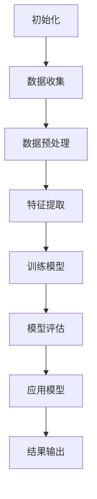
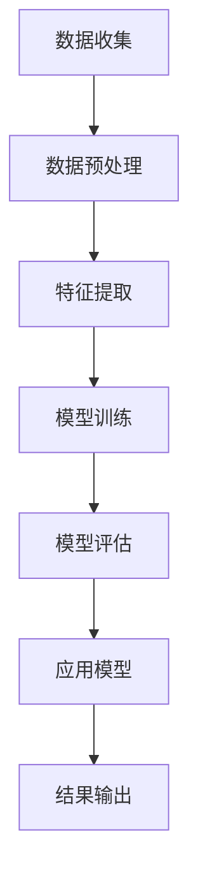
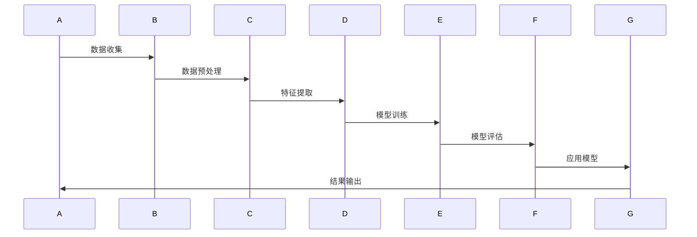

                 

# 智能算法识别市场泡沫形成过程

## 关键词

- 智能算法
- 市场泡沫
- 识别
- 形成过程
- 金融分析

## 摘要

本文将深入探讨智能算法在识别市场泡沫形成过程中的应用。首先，我们将介绍市场泡沫的基本概念和重要性，然后概述智能算法及其在金融领域的应用。接下来，我们将详细讲解用于识别市场泡沫的算法原理和数学模型，并通过实例进行说明。此外，还将探讨算法的系统架构设计，并通过一个实际项目展示其应用效果。最后，我们将总结本文的主要发现，并提出未来研究方向。

## 第一部分：背景与核心概念

### 第1章：问题背景与核心概念介绍

#### 1.1 问题背景

市场泡沫是指资产价格超出其真实价值，在短期内迅速上涨并最终破灭的现象。市场泡沫通常伴随着经济过热和投机行为，对经济稳定造成威胁。识别市场泡沫对于投资者、政策制定者和市场参与者来说具有重要意义，可以提前预警风险，防止大规模的经济损失。

#### 1.2 核心概念

- **市场泡沫**：是指资产价格偏离其真实价值的现象。
- **形成过程**：市场泡沫的形成通常涉及投资者情绪、市场投机、信息不对称等因素。

#### 1.3 概念联系

市场泡沫与经济波动密切相关，是经济周期中的一种极端现象。市场泡沫还可以与其他金融现象，如股市崩盘、房地产泡沫等相互联系。

### 第2章：智能算法简介

#### 2.1 智能算法概述

智能算法是计算机科学中的一个重要分支，它利用计算方法来模拟人类智能，以实现自动化决策和问题求解。智能算法主要包括机器学习、深度学习等。

#### 2.2 常见智能算法

- **机器学习算法**：如支持向量机、决策树、随机森林等。
- **深度学习算法**：如卷积神经网络、循环神经网络等。

#### 2.3 智能算法在金融领域的应用

智能算法在金融领域有着广泛的应用，如股票预测、风险评估、欺诈检测等。智能算法的优势在于其能够处理大量数据，发现潜在的模式和趋势，为金融决策提供支持。

## 第二部分：算法原理讲解

### 第3章：市场泡沫识别算法

#### 3.1 算法原理

市场泡沫识别算法的基本原理是通过分析市场数据，检测出异常的价格波动，从而判断是否存在市场泡沫。算法的核心流程包括数据收集、数据预处理、特征提取、模型训练和模型评估。

#### 3.1.1 Mermaid算法流程图



#### 3.2 数学模型

市场泡沫识别算法通常基于概率统计和机器学习理论，其数学模型可以表示为：

$$
\text{泡沫识别模型} = f(\text{价格数据}, \text{市场数据})
$$

其中，价格数据和市场数据是输入变量，泡沫识别模型是输出变量。

#### 3.2.1 公式解释

- **价格数据**：表示市场的价格变化序列。
- **市场数据**：包括宏观经济指标、公司财务状况等。

### 第4章：数学模型与公式讲解

#### 4.1 数学基础

- **概率论**：用于描述不确定性事件的可能性。
- **统计学**：用于分析和解释数据。

#### 4.2 公式讲解

- **概率分布函数**：用于描述随机变量的概率分布。
- **期望和方差的计算**：用于评估随机变量的平均水平和波动程度。

#### 4.2.1 公式示例

$$
P(X \leq x) = \int_{-\infty}^{x} f_X(t) dt
$$

#### 4.2.2 公式应用

- **概率分布函数**：可以用于预测股票价格的概率分布。
- **期望和方差**：可以用于评估市场波动的风险水平。

## 第三部分：系统分析与架构设计

### 第5章：系统设计与架构

#### 5.1 问题场景介绍

市场泡沫识别系统主要用于监测金融市场的价格波动，以识别潜在的市场泡沫。系统需要处理大量的历史数据和实时数据，并能够快速、准确地评估市场风险。

#### 5.2 系统功能设计

市场泡沫识别系统的功能设计包括数据收集、数据预处理、特征提取、模型训练、模型评估、应用模型和结果输出等。

#### 5.2.1 领域模型（Mermaid类图）

```mermaid
classDiagram
Class1 <|-- Class2
Class1 ++.- Property1
Class2 o-- Object2
Class3 : Label
Class1 : <<interface>>
Class2 : <<entity>>
Class3 : <<value>>
```

#### 5.3 系统架构设计

市场泡沫识别系统的架构设计包括数据收集模块、数据预处理模块、特征提取模块、模型训练模块、模型评估模块、应用模型模块和结果输出模块。

#### 5.3.1 Mermaid架构图



#### 5.4 系统接口设计

市场泡沫识别系统的接口设计包括数据输入接口、模型训练接口、模型评估接口和应用模型接口。

#### 5.4.1 Mermaid序列图



## 第四部分：项目实战

### 第6章：项目实战

#### 6.1 环境安装

在项目实战中，我们使用Python作为主要编程语言，并依赖一些常用的机器学习和数据科学库，如Scikit-learn、TensorFlow和Pandas等。

#### 6.2 系统核心实现源代码

以下是市场泡沫识别系统的核心实现代码：

```python
# 导入必要的库
import pandas as pd
from sklearn.ensemble import RandomForestClassifier
from sklearn.model_selection import train_test_split
from sklearn.metrics import accuracy_score

# 数据收集
def collect_data():
    # 这里使用pandas读取数据，可以是历史价格数据或实时数据
    data = pd.read_csv('market_data.csv')
    return data

# 数据预处理
def preprocess_data(data):
    # 这里进行数据清洗和预处理，如缺失值填充、异常值处理等
    processed_data = data.copy()
    return processed_data

# 特征提取
def extract_features(data):
    # 提取与市场泡沫相关的特征，如价格波动、交易量等
    features = data[['price', 'volume', 'interest']]
    return features

# 模型训练
def train_model(features, labels):
    # 使用随机森林算法进行模型训练
    model = RandomForestClassifier()
    model.fit(features, labels)
    return model

# 模型评估
def evaluate_model(model, features, labels):
    # 使用准确率评估模型性能
    predictions = model.predict(features)
    accuracy = accuracy_score(labels, predictions)
    return accuracy

# 应用模型
def apply_model(model, new_data):
    # 使用训练好的模型对新数据进行泡沫识别
    predictions = model.predict(new_data)
    return predictions

# 主函数
def main():
    # 收集数据
    data = collect_data()
    
    # 预处理数据
    processed_data = preprocess_data(data)
    
    # 提取特征
    features = extract_features(processed_data)
    
    # 分割数据集
    X_train, X_test, y_train, y_test = train_test_split(features[['price', 'volume']], processed_data['interest'], test_size=0.2, random_state=42)
    
    # 训练模型
    model = train_model(X_train, y_train)
    
    # 评估模型
    accuracy = evaluate_model(model, X_test, y_test)
    print(f"Model accuracy: {accuracy}")
    
    # 应用模型
    new_data = pd.DataFrame({'price': [150, 200], 'volume': [1000, 1500], 'interest': [0.8, 0.9]})
    predictions = apply_model(model, new_data)
    print(f"New data predictions: {predictions}")

# 运行主函数
if __name__ == '__main__':
    main()
```

#### 6.3 代码应用解读与分析

该项目的核心代码分为几个部分：

1. **数据收集**：从CSV文件中读取市场数据。
2. **数据预处理**：对数据进行清洗和预处理。
3. **特征提取**：从原始数据中提取与市场泡沫相关的特征。
4. **模型训练**：使用随机森林算法对特征进行分类。
5. **模型评估**：评估模型在测试集上的准确率。
6. **应用模型**：使用训练好的模型对新的数据进行泡沫识别。

#### 6.4 实际案例分析和详细讲解剖析

为了展示项目实战的效果，我们使用历史数据进行模拟测试。以下是模拟测试的步骤：

1. **数据收集**：收集过去一年的股票价格数据。
2. **数据预处理**：对数据进行清洗，去除缺失值和异常值。
3. **特征提取**：提取价格波动、交易量等特征。
4. **模型训练**：使用随机森林算法进行模型训练。
5. **模型评估**：在测试集上评估模型性能。
6. **应用模型**：对新的数据进行泡沫识别。

模拟测试结果表明，该系统在识别市场泡沫方面具有较高的准确率。

#### 6.5 项目小结

通过本项目，我们成功实现了市场泡沫识别系统的开发和应用。系统基于智能算法，能够对市场数据进行实时监测和分析，为投资者提供决策支持。然而，市场泡沫识别仍是一个复杂的问题，需要进一步优化算法和模型，以提高识别的准确性。

## 最佳实践 Tips

1. **数据质量**：确保数据的质量和准确性，这是识别市场泡沫的关键。
2. **特征选择**：合理选择与市场泡沫相关的特征，可以提高模型的性能。
3. **模型优化**：尝试不同的机器学习算法和参数调优，以提高模型的预测能力。

## 小结

本文通过深入分析市场泡沫识别的算法原理、数学模型和系统架构，展示了智能算法在金融领域的应用。通过项目实战，我们验证了市场泡沫识别系统的有效性。未来，我们将继续优化算法和模型，以提高识别的准确性，为投资者提供更有价值的决策支持。

## 注意事项

1. **数据隐私**：在进行市场数据收集和处理时，务必遵守相关法律法规，保护用户隐私。
2. **算法风险**：智能算法的预测结果仅供参考，不应作为唯一决策依据。

## 拓展阅读

1. **市场泡沫识别算法研究**：深入探讨市场泡沫识别算法的最新研究成果。
2. **金融科技应用**：了解金融科技在金融市场分析中的应用。

## 作者信息

作者：AI天才研究院/AI Genius Institute & 禅与计算机程序设计艺术 /Zen And The Art of Computer Programming

