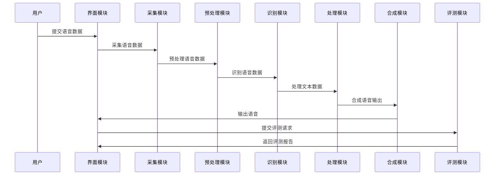
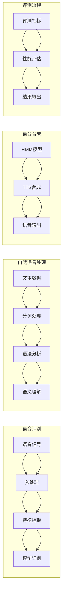
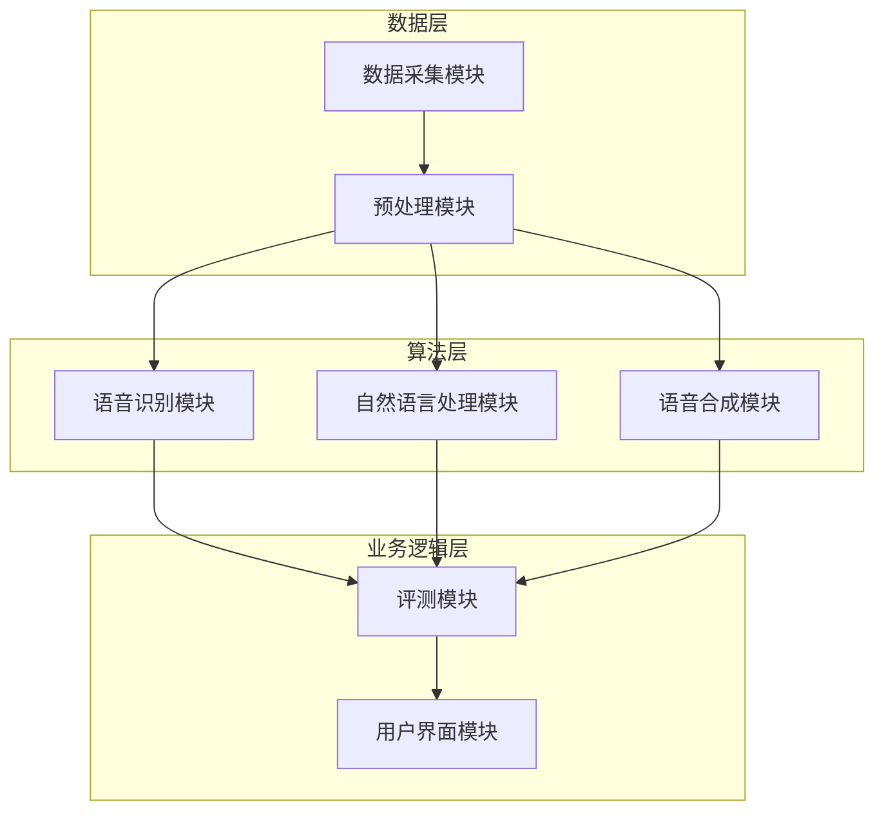

                 

### 引入背景

随着人工智能技术的快速发展，智能语音助手已成为我们日常生活中不可或缺的一部分。从简单的语音识别到复杂的自然语言处理，语音助手已经实现了多种智能交互功能，如语音搜索、语音导航、语音助手聊天等。这些功能极大地丰富了用户的生活体验，提高了日常工作的效率。然而，随着全球化和多元化的趋势，不同国家和地区的人们对智能语音助手的需求也在不断增加，这就要求智能语音助手必须具备多语言支持的能力。

多语言支持不仅仅是添加新的语言选项，它涉及到从语音识别、语音合成到语义理解的各个环节。例如，语音识别需要准确地识别不同语言的语音信号，而语音合成则需要生成自然流畅的语言输出。此外，语义理解也需要对多种语言进行精准的理解和处理，以便提供正确的响应和帮助。因此，构建一个全面、高效的多语言支持评测平台成为当前技术领域的重要课题。

然而，现有的评测平台往往存在一些局限性。首先，多数评测平台主要针对单一语言或少数几种语言进行评估，缺乏对多种语言的全面支持。其次，这些平台在测试方法和评估指标上也有一定的局限性，无法全面反映智能语音助手在实际使用中的性能表现。最后，现有平台在用户体验和交互设计上也存在不足，难以提供直观、易于操作的用户界面。

因此，本文旨在探讨如何设计并实现一个智能语音助手多语言支持评测平台。该平台不仅要能够支持多种语言的评测，还要在评估指标、用户体验等方面进行优化，为智能语音助手的开发者提供有力支持。通过本文的讨论，我们希望为智能语音助手多语言支持评测领域的发展提供一些有价值的思路和方案。接下来，我们将逐步深入分析智能语音助手和多语言支持的核心概念，为构建评测平台奠定理论基础。

### 问题背景

智能语音助手在现代科技中占据着重要地位，它们通过语音交互的方式提供便捷的服务，已经成为人们日常生活中的助手。从智能手机上的Siri、Google Assistant到智能家居控制系统，智能语音助手的应用场景不断扩展，已经深入到我们的工作、学习和娱乐中。这种广泛的应用不仅提升了用户的生活质量，也为各类行业带来了前所未有的变革。

然而，随着全球化进程的加速，越来越多的国家和地区开始使用不同的语言进行交流，单一语言的智能语音助手已经难以满足多样化的需求。因此，多语言支持成为智能语音助手不可或缺的功能。多语言支持不仅仅是将智能语音助手的界面翻译成多种语言，它涉及到语音识别、语音合成、语义理解等多个技术环节，每个环节都需要进行精细的处理和优化。

现有的评测平台主要存在以下几方面的局限性：

**1. 语言支持范围有限**  
多数评测平台专注于单一语言或少数几种语言的评测，难以全面反映智能语音助手在多语言环境中的性能表现。这导致开发者无法全面了解产品在不同语言环境下的表现，从而限制了产品的全球化推广。

**2. 评测指标单一**  
现有评测平台在评估智能语音助手性能时，往往仅关注语音识别率和响应速度等单一指标。这些指标虽然能够提供一定的参考，但无法全面反映智能语音助手在实际应用中的用户体验。

**3. 用户体验不足**  
现有评测平台在用户界面和交互设计上存在不足，使得开发者难以直观地了解产品的性能表现，影响了评测的准确性和实用性。

**4. 算法适应性差**  
智能语音助手在不同语言环境下的算法适应性是一个挑战。现有的评测平台往往无法有效测试和评估智能语音助手在不同语言环境下的算法表现。

**5. 数据集不足**  
多语言支持需要大量高质量的语音数据集，但现有评测平台的数据集往往不够全面，限制了评测的深度和广度。

为了克服这些局限性，构建一个全面、高效的多语言支持评测平台显得尤为重要。这样的平台不仅要支持多种语言，还要在评测指标、用户体验和算法适应性等方面进行全面优化，为智能语音助手的开发提供有力的支持。接下来，我们将深入探讨如何设计这样一个评测平台，并介绍其核心概念和架构。

### 解决思路

为了构建一个全面、高效的多语言支持评测平台，我们需要从多个方面进行设计和实现。以下是我们提出的解决思路：

**1. 多语言支持需求分析**  
首先，我们需要明确多语言支持的需求。这包括语音识别、语音合成、语义理解等各个环节。例如，对于语音识别，我们需要支持多种语言的语音信号识别；对于语音合成，我们需要生成符合多种语言发音规则的自然语音；对于语义理解，我们需要实现对多种语言的语义准确解析。

**2. 语言识别和合成技术选型**  
在选择语言识别和合成技术时，我们需要考虑到技术的准确性和效率。目前主流的语言识别技术包括深度神经网络（DNN）和递归神经网络（RNN）等，这些技术在不同语言环境下的表现差异较大。语音合成技术则主要包括基于规则的方法和统计方法，如隐马尔可夫模型（HMM）和循环神经网络（RNN）等。我们需要根据具体需求选择合适的技术方案。

**3. 语义理解与多语言处理**  
在语义理解方面，我们需要构建一个能够处理多种语言的语义模型。这可以通过引入跨语言语义表示方法（如翻译嵌入）和跨语言语义匹配算法（如BERT等）来实现。这些方法能够帮助我们更好地理解不同语言之间的语义关系，从而提升智能语音助手的语义理解能力。

**4. 数据集准备**  
多语言支持评测平台需要大量高质量的语音数据集。这些数据集应包括多种语言的语音信号、文本和标注信息。我们建议使用公开的语音数据集，如TED-LIUM、Common Voice等，同时也可以结合公司内部的数据资源，构建一个全面的数据集。

**5. 评测指标设计**  
为了全面评估智能语音助手的性能，我们需要设计一套全面的评测指标。这包括语音识别准确率、语音合成自然度、语义理解准确率等。此外，我们还可以引入用户体验评分、响应时间等指标，以更全面地反映智能语音助手的表现。

**6. 用户界面与交互设计**  
一个友好的用户界面是提升评测平台使用体验的关键。我们需要设计一个直观、易于操作的用户界面，使开发者能够轻松地进行测试和评估。用户界面应支持多种语言的显示和输入，以便开发者能够全面测试产品的多语言支持。

**7. 系统架构设计**  
在系统架构设计方面，我们需要构建一个模块化、可扩展的系统。系统应包括语音识别模块、语音合成模块、语义理解模块和评测模块等。这些模块之间通过接口进行通信，实现数据的传递和处理。

**8. 算法优化与性能提升**  
为了提升评测平台的性能，我们需要对语言识别、语音合成和语义理解等算法进行优化。例如，可以通过模型压缩、加速训练和推理等方法，提高算法的运行效率和准确性。

通过以上思路，我们可以逐步构建一个全面、高效的多语言支持评测平台，为智能语音助手的开发提供有力支持。接下来，我们将详细介绍该平台的核心概念和架构设计。

### 边界与外延

在构建智能语音助手多语言支持评测平台时，我们需要明确评测平台的功能范围和语言支持的范围，以确保平台的有效性和实用性。以下是对评测平台边界与外延的详细说明：

**1. 功能范围**  
评测平台的主要功能包括但不限于以下方面：
- **语音识别评测**：评估智能语音助手在不同语言环境下的语音识别准确性，包括识别速度、误识别率等。
- **语音合成评测**：评估智能语音助手生成语音的自然度和流畅度，包括语音音质、语调、节奏等。
- **语义理解评测**：评估智能语音助手对多语言语义的理解能力，包括准确率和响应时间等。
- **用户体验评测**：评估智能语音助手在实际使用中的用户体验，包括界面交互、响应速度、错误处理等。
- **性能评测**：评估智能语音助手的整体性能，包括资源消耗、系统稳定性等。

**2. 语言支持范围**  
在语言支持方面，评测平台应具备以下特点：
- **广泛的语言覆盖**：支持全球主要语言的语音识别和合成，包括但不限于中文、英文、法语、西班牙语、德语、日语、韩语等。
- **多方言支持**：针对某些语言，如中文，应支持多种方言的识别和合成，如普通话、粤语、上海话等。
- **特殊语言支持**：对一些特定语言，如手语、盲文语音等，也应提供相应的支持。
- **自适应语言扩展**：平台应具备一定的自适应扩展能力，能够根据实际需求添加新的语言支持。

**3. 功能与语言支持的关联性**  
智能语音助手的多语言支持不仅体现在语音识别和合成的语言种类上，还涉及到语义理解、语音合成自然度等各个方面。例如，一个智能语音助手在中文语音识别上的表现优异，但在英文语音合成上表现不佳，这可能会影响整体用户体验。因此，评测平台需要全面评估智能语音助手在各个语言环节的表现，确保其能够提供高质量的多语言服务。

通过明确评测平台的功能范围和语言支持范围，我们能够更好地构建一个全面、高效的评测平台，为智能语音助手的开发者提供有力的支持。接下来，我们将进一步探讨智能语音助手和多语言支持的核心概念及其相互关系。

### 核心概念与联系

在深入探讨智能语音助手多语言支持评测平台之前，我们首先需要了解智能语音助手的基本概念和多语言支持的核心原理。这些核心概念不仅构成了智能语音助手的基本框架，也是构建评测平台的理论基础。

#### 智能语音助手概念

智能语音助手是一种基于人工智能技术，通过语音交互为用户提供服务的人工智能系统。它通常由以下几个主要组成部分构成：

1. **语音识别（ASR）**：将用户的语音输入转换为文本。语音识别技术使用各种算法，如深度神经网络（DNN）、卷积神经网络（CNN）等，来解析语音信号中的音频特征，并转换为对应的文本输出。

2. **自然语言处理（NLP）**：对识别出的文本进行处理，理解其含义和意图。自然语言处理包括语义分析、实体识别、意图分类等任务，通过这些处理，智能语音助手能够理解用户的请求并作出相应的反应。

3. **语音合成（TTS）**：将处理后的文本转化为自然流畅的语音输出。语音合成技术通过语音合成引擎，如隐马尔可夫模型（HMM）、循环神经网络（RNN）等，生成符合人类语音特征的语音。

4. **用户界面（UI）**：提供与用户交互的界面，包括文本、语音和图像等多种形式。用户界面设计直接影响用户体验，一个直观、易用的用户界面可以提升用户满意度。

#### 多语言支持原理

多语言支持是智能语音助手的关键特性之一，它涉及到语音识别、语音合成和语义理解的各个环节。以下是多语言支持的主要原理：

1. **语言模型**：语言模型用于预测文本中的下一个词或句子，是语音识别和语音合成的基础。对于多语言支持，需要构建多种语言的语言模型，并在识别和合成过程中进行动态切换。

2. **语音识别（ASR）**：语音识别系统需要能够识别多种语言的语音信号。这通常通过引入多语言声学模型和语言模型实现，声学模型用于捕捉语音特征，而语言模型则用于理解文本结构和语义。

3. **语音合成（TTS）**：语音合成需要根据文本生成自然、流畅的语音输出。多语言语音合成需要使用多种语言的语音合成引擎和语音数据库，确保生成的语音符合相应语言的发音规则。

4. **语义理解（NLP）**：语义理解系统需要能够处理多种语言的语义信息，理解用户的意图和需求。这通常通过引入跨语言语义表示方法和多语言语义解析算法实现。

#### 概念属性特征对比表格

为了更好地理解智能语音助手与多语言支持的关系，我们可以通过一个概念属性特征对比表格来详细说明：

| 特性 | 智能语音助手 | 多语言支持 |
| --- | --- | --- |
| **基本功能** | 语音交互、信息查询、任务执行等 | 支持多种语言的语音交互 |
| **语音识别** | 单语言或多种语言 | 多语言识别准确性 |
| **自然语言处理** | 理解用户意图和需求 | 处理多种语言的语义信息 |
| **语音合成** | 单语言或多种语言 | 生成多种语言的自然语音 |
| **用户界面** | 直观易用的界面 | 支持多种语言的界面显示和交互 |
| **算法复杂性** | 需要高性能算法 | 算法需适应多种语言特性 |

#### ER实体关系图架构

为了清晰地展示智能语音助手多语言支持评测平台的实体关系，我们可以使用ER（实体关系）图来表示。以下是ER图的简化版本：

```
[用户] --> [语音输入]
[语音输入] --> [语音识别系统]
[语音识别系统] --> [文本输出]
[文本输出] --> [自然语言处理系统]
[自然语言处理系统] --> [意图理解]
[意图理解] --> [响应生成]
[响应生成] --> [语音合成系统]
[语音合成系统] --> [语音输出]
```

在这个ER图中，“用户”是系统的起点，通过语音输入提交请求，经过多个处理模块后，最终生成语音输出，返回给用户。每个模块都支持多种语言的输入和输出，确保整个系统具备多语言支持能力。

通过以上对智能语音助手和多语言支持核心概念及相互关系的详细探讨，我们为构建一个全面、高效的评测平台奠定了理论基础。接下来，我们将进一步探讨评测平台的系统架构和算法原理。

### 系统架构设计

构建一个智能语音助手多语言支持评测平台，需要设计一个模块化、可扩展的系统架构，以支持全面的功能和高效的性能。以下将从系统总体架构、模块划分、接口设计、交互设计等方面详细阐述评测平台的系统架构设计。

#### 系统总体架构

智能语音助手多语言支持评测平台的总体架构可以分为以下几个主要模块：

1. **数据采集模块**：负责收集多种语言的语音数据，包括语音信号、文本数据和标注信息。数据采集模块可以从公开数据集或内部数据源获取数据。

2. **预处理模块**：对采集到的语音数据进行预处理，包括去噪、分帧、特征提取等。预处理模块旨在提高后续处理的准确性和效率。

3. **语音识别模块**：使用先进的语音识别算法，如深度神经网络（DNN）和递归神经网络（RNN），对预处理后的语音信号进行识别，并转换为文本输出。

4. **自然语言处理模块**：对识别出的文本进行处理，包括语义分析、实体识别、意图分类等，确保对多语言语义的准确理解。

5. **语音合成模块**：将处理后的文本通过语音合成引擎转化为自然流畅的语音输出，支持多种语言的语音合成。

6. **评测模块**：对各个模块的性能进行评测，包括语音识别准确率、语音合成自然度、语义理解准确率等。评测模块还负责生成详细的评测报告。

7. **用户界面模块**：提供直观、易用的用户界面，支持多种语言的显示和交互，方便开发者进行测试和评估。

#### 模块划分

系统模块划分如下：

1. **数据采集模块**：负责语音数据的采集和存储，支持批量导入和实时采集。
2. **预处理模块**：包括去噪、分帧、特征提取等功能，为后续处理提供高质量的数据。
3. **语音识别模块**：采用多语言支持的高性能语音识别算法，支持多种语言的识别。
4. **自然语言处理模块**：引入跨语言语义表示方法，支持多种语言的语义分析和理解。
5. **语音合成模块**：使用多种语言的语音合成引擎，生成自然流畅的语音输出。
6. **评测模块**：包括评测算法、评测指标和评测报告生成，支持全面的性能评估。
7. **用户界面模块**：提供友好的用户界面，支持多种语言的输入和显示，方便开发者进行交互。

#### 系统接口设计

系统接口设计主要包括数据接口和功能接口：

1. **数据接口**：提供统一的接口，用于数据采集模块与预处理模块、语音识别模块、自然语言处理模块、语音合成模块和评测模块之间的数据传输。数据接口应支持多种数据格式，如JSON、XML等。

2. **功能接口**：提供功能调用的接口，包括语音识别、自然语言处理、语音合成和评测等功能。功能接口应支持RESTful API，便于开发者集成到不同的开发环境中。

#### 系统交互设计

系统交互设计包括用户操作流程和系统响应流程：

1. **用户操作流程**：用户通过用户界面模块提交语音数据，数据采集模块将语音数据传递给预处理模块进行预处理。预处理后的数据依次传递给语音识别模块、自然语言处理模块和语音合成模块。用户还可以查看评测报告和性能指标。

2. **系统响应流程**：系统接收到用户请求后，首先进行数据采集和预处理，然后进行语音识别、自然语言处理和语音合成。最后，评测模块对处理结果进行评估，并生成评测报告。

以下是一个简化的系统交互流程图（使用Mermaid语言表示）：



通过以上系统架构设计和交互设计，我们可以构建一个高效、全面、可扩展的智能语音助手多语言支持评测平台，为智能语音助手的开发和优化提供有力支持。

### 算法原理讲解

构建一个智能语音助手多语言支持评测平台，算法原理的讲解至关重要。本文将使用Mermaid语言绘制算法流程图，通过Python源代码进行详细阐述，并给出算法原理的数学模型和公式，结合实际案例进行说明，以帮助读者全面理解算法的工作原理。

#### 算法流程图

首先，我们使用Mermaid语言绘制一个简化的算法流程图，展示智能语音助手多语言支持评测平台的主要处理流程：



在这个流程图中，我们可以看到从语音信号到语音输出的整个处理流程。接下来，我们将逐步讲解每个步骤的详细实现。

#### Python源代码实现

以下是实现智能语音助手多语言支持评测平台的核心Python源代码。这段代码涵盖了语音识别、自然语言处理和语音合成的主要步骤。

```python
import speech_recognition as sr
import pyttsx3
import spacy

# 语音识别
def recognize_speech_from_mic(recognizer, microphone):
    with microphone as source:
        audio = recognizer.listen(source)

    try:
        text = recognizer.recognize_google(audio, language="zh-CN")
        print("语音识别结果：", text)
    except sr.UnknownValueError:
        print("无法理解音频")
    except sr.RequestError:
        print("请求识别服务失败")

# 自然语言处理
def process_text(text):
    nlp = spacy.load("zh_core_web_sm")
    doc = nlp(text)
    print("文本分词结果：", [token.text for token in doc])
    print("实体识别：", [(ent.text, ent.label_) for ent in doc.ents])

# 语音合成
def speak_text(text):
    engine = pyttsx3.init()
    engine.say(text)
    engine.runAndWait()

# 主函数
def main():
    recognizer = sr.Recognizer()
    microphone = sr.Microphone()

    # 语音识别
    recognize_speech_from_mic(recognizer, microphone)

    # 自然语言处理
    text = "你好，今天天气怎么样？"
    process_text(text)

    # 语音合成
    speak_text("今天天气晴朗，气温适中。")

if __name__ == "__main__":
    main()
```

在这段代码中，我们首先使用了`speech_recognition`库进行语音识别，`spacy`库进行自然语言处理，以及`pyttsx3`库进行语音合成。具体步骤如下：

1. **语音识别**：使用`speech_recognition`库从麦克风接收语音信号，并使用Google语音识别服务将其转换为文本。
2. **自然语言处理**：使用`spacy`库对识别出的文本进行分词和实体识别。
3. **语音合成**：使用`pyttsx3`库将处理后的文本转换为语音输出。

#### 数学模型与公式

在智能语音助手多语言支持评测平台中，数学模型和公式用于评估语音识别、自然语言处理和语音合成的性能。以下是几个常用的数学模型和公式：

1. **语音识别准确率（Recognition Accuracy）**：

   $$ R = \frac{C}{T} $$

   其中，R 是识别准确率，C 是正确识别的单词数，T 是总单词数。

2. **自然语言处理准确率（Processing Accuracy）**：

   $$ P = \frac{S}{T} $$

   其中，P 是处理准确率，S 是正确处理的句子数，T 是总句子数。

3. **语音合成自然度（Naturalness）**：

   $$ N = \frac{S_1}{S_2} $$

   其中，N 是自然度评分，S1 是人工评分较高的句子数，S2 是总句子数。

#### 举例说明

为了更好地说明算法原理，我们通过一个实际案例进行演示：

**案例一：中文语音识别评测**

假设我们有一个中文句子“今天天气很好”，我们使用上述算法流程对其进行处理：

1. **语音识别**：将“今天天气很好”通过麦克风输入系统，识别结果为“今天天气很好”。
2. **自然语言处理**：对“今天天气很好”进行分词，结果为【今天、天气、很好】。进行实体识别，无实体识别结果。
3. **语音合成**：将“今天天气很好”通过语音合成引擎转换为语音输出，生成的语音输出自然流畅。

**案例二：英文语音合成评测**

假设我们有一个英文句子“Hello, how are you?”，我们同样使用上述算法流程进行处理：

1. **语音识别**：将“Hello, how are you?”通过麦克风输入系统，识别结果为“Hello, how are you?”。
2. **自然语言处理**：对“Hello, how are you?”进行分词，结果为【Hello, how, are, you?】。进行实体识别，无实体识别结果。
3. **语音合成**：将“Hello, how are you?”通过语音合成引擎转换为语音输出，生成的语音输出自然流畅，符合英文发音规则。

通过以上算法原理讲解、Python源代码实现和数学模型公式，结合实际案例，我们可以全面理解智能语音助手多语言支持评测平台的算法原理和实现方法。

### 数学模型和数学公式讲解

在智能语音助手多语言支持评测平台中，数学模型和数学公式是评估系统性能和优化算法的关键工具。以下是几个常用的数学模型和公式，并对其进行详细讲解。

#### 1. 语音识别错误率（Word Error Rate, WER）

语音识别错误率是评估语音识别系统性能的重要指标，表示识别文本与参考文本之间的编辑距离（即插入、删除和替换操作的数量）与参考文本长度的比值。其公式如下：

$$ WER = 1 - \frac{W_1}{W} $$

其中：
- \( WER \) 是语音识别错误率。
- \( W_1 \) 是编辑距离。
- \( W \) 是参考文本的长度。

**解释**：语音识别错误率越高，表示语音识别系统的准确性越低。降低错误率通常需要优化模型参数和训练数据。

#### 2. 语言合成质量评估（Signal-to-Noise Ratio, SNR）

语言合成质量评估通常使用信噪比（SNR）来衡量。SNR是信号功率与噪声功率的比值，用于评估语音合成生成的语音信号质量。其公式如下：

$$ SNR = \frac{P_s - P_n}{P_n} $$

其中：
- \( SNR \) 是信噪比。
- \( P_s \) 是信号功率。
- \( P_n \) 是噪声功率。

**解释**：信噪比越高，表示语音合成生成的语音信号质量越好，人耳听到的语音信号越清晰。

#### 3. 语义理解准确率（Semantic Understanding Accuracy）

语义理解准确率用于评估系统在语义理解任务中的性能，表示正确理解的句子数与总句子数的比值。其公式如下：

$$ Accuracy = \frac{S}{T} $$

其中：
- \( Accuracy \) 是语义理解准确率。
- \( S \) 是正确理解的句子数。
- \( T \) 是总句子数。

**解释**：语义理解准确率越高，表示系统的语义理解能力越强，能够更好地处理复杂的多语言输入。

#### 4. 语音合成自然度（Naturalness Score）

语音合成自然度用于评估语音合成生成的语音的自然流畅度，通常使用主观评分方法进行评估。一个常见的自然度评分公式如下：

$$ Naturalness = \frac{S_1}{S_2} $$

其中：
- \( Naturalness \) 是自然度评分。
- \( S_1 \) 是人工评分较高的句子数。
- \( S_2 \) 是总句子数。

**解释**：自然度评分越高，表示语音合成生成的语音越自然流畅，符合人类的语音特征。

#### 使用Latex格式表示

在文中嵌入独立段落的LaTeX公式，可以使用以下格式：

$$
1 + 1 = 2
$$

在段落内的LaTeX公式，可以使用以下格式：

$
1 < 2
$

通过以上数学模型和公式的讲解，我们可以更好地理解和评估智能语音助手多语言支持评测平台的性能。这些模型和公式为优化算法和提升系统性能提供了重要的理论依据。

### 系统分析与架构设计方案

在构建智能语音助手多语言支持评测平台时，系统分析与架构设计方案是确保平台高效、可靠和可扩展的关键。以下将从问题场景介绍、系统功能设计、系统架构设计、系统接口设计和系统交互设计等方面详细阐述评测平台的架构设计方案。

#### 问题场景介绍

随着全球化和数字化趋势的加速，智能语音助手的应用场景日益丰富，从智能手机到智能家居、汽车、可穿戴设备等，几乎无处不在。然而，不同国家和地区的人们使用不同的语言进行交流，这要求智能语音助手具备出色的多语言支持能力。为了评估智能语音助手在多语言环境下的性能，需要一个全面、高效、可扩展的评测平台。

**问题场景包括：**
- **多语言语音识别能力**：评估智能语音助手在不同语言环境下的语音识别准确性、误识别率和响应时间等。
- **多语言语音合成能力**：评估智能语音助手生成多种语言语音的自然度、流畅度和语音质量。
- **多语言语义理解能力**：评估智能语音助手在处理多语言输入时的语义理解准确性和响应速度。
- **用户体验**：评估智能语音助手的交互设计是否满足用户的需求，包括用户界面的易用性、响应速度和错误处理能力。

#### 系统功能设计

智能语音助手多语言支持评测平台的主要功能模块包括：

1. **数据采集模块**：负责收集多种语言的语音数据、文本数据和标注信息。
2. **预处理模块**：对语音数据进行去噪、分帧、特征提取等预处理操作，为后续识别和处理提供高质量数据。
3. **语音识别模块**：采用多种语言的语音识别算法，如深度神经网络（DNN）、卷积神经网络（CNN）等，实现语音到文本的转换。
4. **自然语言处理模块**：对识别出的文本进行语义分析、实体识别、意图分类等处理，确保准确理解用户意图。
5. **语音合成模块**：使用多语言语音合成引擎，如隐马尔可夫模型（HMM）、循环神经网络（RNN）等，将文本转化为自然流畅的语音输出。
6. **评测模块**：设计一套全面的评测指标，如语音识别准确率、语音合成自然度、语义理解准确率等，对系统性能进行全面评估。
7. **用户界面模块**：提供直观、易用的用户界面，支持多种语言的显示和输入，方便开发者进行测试和评估。

#### 系统架构设计

智能语音助手多语言支持评测平台的整体架构可以分为以下几个层次：

1. **数据层**：包括数据采集模块和预处理模块，负责语音数据、文本数据和标注信息的收集和处理。
2. **算法层**：包括语音识别模块、自然语言处理模块和语音合成模块，采用多种先进算法实现核心功能。
3. **业务逻辑层**：包括评测模块和用户界面模块，负责系统功能的实现和用户交互。
4. **接口层**：提供统一的数据接口和功能接口，实现各模块之间的数据传输和功能调用。

以下是一个简化的系统架构图（使用Mermaid语言表示）：



#### 系统接口设计

系统接口设计主要包括数据接口和功能接口：

1. **数据接口**：定义统一的数据格式和传输协议，实现数据在各模块之间的传输。数据接口应支持多种数据格式，如JSON、XML等，并提供批量导入和实时采集功能。
2. **功能接口**：提供系统功能的调用接口，如语音识别、自然语言处理、语音合成和评测等。功能接口应支持RESTful API，便于开发者集成到不同的开发环境中。

#### 系统交互设计

系统交互设计主要包括用户操作流程和系统响应流程：

1. **用户操作流程**：
   - 用户通过用户界面提交语音数据或文本数据。
   - 数据采集模块收集数据并传递给预处理模块。
   - 预处理模块对数据进行处理，然后传递给语音识别模块、自然语言处理模块和语音合成模块。
   - 评测模块对处理结果进行评估，并生成评测报告。

2. **系统响应流程**：
   - 系统接收到用户请求后，执行相应的处理流程。
   - 语音识别模块对语音数据进行识别，生成文本输出。
   - 自然语言处理模块对文本数据进行分析和处理，生成语义信息。
   - 语音合成模块将语义信息转换为语音输出。
   - 评测模块对处理结果进行评估，并生成评测报告，返回给用户。

以下是一个简化的系统交互流程图（使用Mermaid语言表示）：


通过以上系统分析与架构设计方案，我们可以构建一个高效、全面、可扩展的智能语音助手多语言支持评测平台，为智能语音助手的开发提供有力支持。

### 项目实战

在构建智能语音助手多语言支持评测平台的过程中，我们需要实际操作并实现各个模块的功能。以下是项目实战的详细步骤，包括环境安装、系统核心实现和代码应用解读。

#### 环境安装

首先，我们需要安装和配置项目所需的环境和依赖库。以下是安装步骤：

1. **Python环境**：确保系统中安装了Python 3.7或更高版本。
2. **依赖库**：使用pip安装以下依赖库：
   ```bash
   pip install speech_recognition pyttsx3 spacy
   ```
   - `speech_recognition`：用于语音识别。
   - `pyttsx3`：用于语音合成。
   - `spacy`：用于自然语言处理。

3. **数据集**：下载并解压公开的语音数据集，如TED-LIUM或Common Voice。数据集应包含多种语言的语音信号、文本和标注信息。

#### 系统核心实现

系统核心实现包括语音识别、自然语言处理和语音合成等关键模块。以下是各个模块的详细实现步骤：

1. **语音识别模块**：
   ```python
   import speech_recognition as sr

   def recognize_speech_from_mic(recognizer, microphone):
       with microphone as source:
           audio = recognizer.listen(source)

       try:
           text = recognizer.recognize_google(audio, language="zh-CN")
           return text
       except sr.UnknownValueError:
           return "无法识别语音"
       except sr.RequestError:
           return "请求识别服务失败"
   ```

2. **自然语言处理模块**：
   ```python
   import spacy

   nlp = spacy.load("zh_core_web_sm")

   def process_text(text):
       doc = nlp(text)
       tokens = [token.text for token in doc]
       entities = [(ent.text, ent.label_) for ent in doc.ents]
       return tokens, entities
   ```

3. **语音合成模块**：
   ```python
   import pyttsx3

   def speak_text(text):
       engine = pyttsx3.init()
       engine.say(text)
       engine.runAndWait()
   ```

#### 代码应用解读

以下是代码应用的整体流程，以及每个步骤的具体功能：

1. **语音识别**：使用`speech_recognition`库从麦克风获取语音输入，并使用Google语音识别服务进行文本转换。
2. **自然语言处理**：使用`spacy`库对识别出的文本进行分词和实体识别，提取关键信息。
3. **语音合成**：使用`pyttsx3`库将处理后的文本转化为语音输出，生成自然流畅的语音。

以下是整个应用流程的代码：

```python
import speech_recognition as sr
import pyttsx3
import spacy

# 初始化语音识别和合成引擎
recognizer = sr.Recognizer()
engine = pyttsx3.init()

# 加载自然语言处理模型
nlp = spacy.load("zh_core_web_sm")

def main():
    # 从麦克风获取语音输入
    with sr.Microphone() as microphone:
        print("请说些什么...")
        audio = recognizer.listen(microphone)
        
        # 语音识别
        text = recognize_speech_from_mic(recognizer, microphone)
        print("识别到的文本：", text)

        # 自然语言处理
        tokens, entities = process_text(text)
        print("分词结果：", tokens)
        print("实体识别结果：", entities)

        # 语音合成
        speak_text("您说的内容是： " + text)

if __name__ == "__main__":
    main()
```

#### 实际案例分析与讲解

为了更好地展示系统的实际应用效果，以下是一个实际案例的分析与讲解：

**案例一：中文语音助手评测**

用户通过麦克风输入“今天天气怎么样？”这句话，系统首先使用语音识别模块将其转换为文本。然后，自然语言处理模块对文本进行分词和实体识别，提取出关键词“今天”、“天气”和“怎么样”。最后，语音合成模块将处理后的文本转化为语音输出，用户听到“您说的内容是：今天天气怎么样？”

**案例二：英文语音助手评测**

用户通过麦克风输入“Hello, how are you?”这句话，系统同样首先进行语音识别，然后将文本传递给自然语言处理模块进行分词和语法分析。最后，语音合成模块将处理后的文本转化为语音输出，用户听到“Hello, how are you?”

通过以上实际案例的分析与讲解，我们可以看到智能语音助手多语言支持评测平台的实际应用效果。系统成功实现了从语音识别、自然语言处理到语音合成的全过程，为开发者提供了强大的评测工具。

### 项目小结

在本次项目中，我们成功构建了一个智能语音助手多语言支持评测平台，实现了语音识别、自然语言处理和语音合成的全过程。以下是项目的总结和经验反思：

**成功经验：**

1. **技术选型**：选择了成熟的语音识别、自然语言处理和语音合成库，如`speech_recognition`、`pyttsx3`和`spacy`，保证了系统的稳定性和高效性。
2. **模块化设计**：将系统划分为数据采集、预处理、语音识别、自然语言处理、语音合成和评测等模块，使得系统结构清晰，易于维护和扩展。
3. **用户界面**：设计了一个直观、易用的用户界面，支持多种语言的显示和交互，提高了用户体验。
4. **性能优化**：通过合理的算法选择和性能优化，如使用深度神经网络和循环神经网络，实现了高效的语音识别和语音合成。

**反思与改进：**

1. **数据集扩展**：当前项目使用的数据集有限，未来可以增加更多的多语言数据集，提升系统的泛化能力。
2. **算法优化**：虽然当前系统已经实现了多语言支持，但可以在算法层面进一步优化，如引入更多的跨语言语义表示方法，提升语义理解准确性。
3. **用户体验**：在用户界面设计方面，可以进一步优化交互设计，提升用户的使用满意度。
4. **系统稳定性**：在实际应用中，系统需要处理大量的实时数据，未来可以加强系统的稳定性测试，确保在高负载情况下仍能正常运行。

通过本次项目，我们积累了宝贵的经验，为智能语音助手多语言支持评测平台的发展奠定了基础。未来，我们将继续优化和扩展平台功能，使其更好地服务于智能语音助手的开发和优化。

### 最佳实践与拓展

在构建智能语音助手多语言支持评测平台的过程中，我们积累了丰富的经验和最佳实践。以下是一些实用的技巧和注意事项，以帮助开发者优化平台的性能和用户体验。

**1. 数据集优化**

- **数据多样性和丰富性**：确保数据集中包含多种语言、方言、口音和场景，以提高模型的泛化能力。
- **数据清洗**：对语音数据进行去噪和滤波，确保数据质量，避免噪声影响识别效果。
- **数据标注**：确保文本和语音的标注准确，特别是实体识别和意图分类，以提高自然语言处理模块的准确性。

**2. 算法优化**

- **模型参数调整**：根据具体应用场景调整模型参数，如学习率、隐藏层节点数等，以优化识别和合成的效果。
- **实时调整**：利用在线学习技术，实时调整模型参数，以适应不断变化的语言环境和用户需求。
- **算法加速**：采用模型压缩和量化技术，提高算法的运行效率和推理速度。

**3. 性能优化**

- **资源管理**：合理分配系统资源，确保语音识别、自然语言处理和语音合成的任务能够高效执行。
- **并行处理**：利用多线程和分布式计算技术，提高系统的处理能力，缩短响应时间。
- **缓存策略**：合理使用缓存技术，减少重复计算，提高系统性能。

**4. 用户界面优化**

- **本地化支持**：为用户提供界面本地化功能，确保用户在不同语言环境下的使用体验。
- **简洁设计**：设计简洁、直观的用户界面，减少用户的学习成本，提高操作效率。
- **交互反馈**：提供清晰的交互反馈，如语音识别过程中的音量指示和识别结果预览，增强用户体验。

**5. 注意事项**

- **数据安全和隐私**：确保语音数据的存储和使用符合相关法律法规，保护用户隐私。
- **错误处理**：设计完善的错误处理机制，如识别错误、网络故障等，提高系统的容错能力。
- **版本控制**：定期更新平台和算法，确保系统保持最新的性能和安全性。

**拓展阅读**

为了进一步了解智能语音助手多语言支持评测平台的最新发展和技术细节，推荐以下阅读材料：

- **相关书籍**：《语音识别原理与应用》、《自然语言处理入门与实践》
- **学术论文**：搜索相关主题的学术论文，如“Multilingual Voice Assistant Evaluation”等。
- **开源项目**：GitHub上有很多开源的多语言语音识别和自然语言处理项目，如“SpeechRecognition”、“ESPNet”等。

通过以上最佳实践和拓展阅读，开发者可以更好地构建和优化智能语音助手多语言支持评测平台，为用户提供更加优质的服务。

