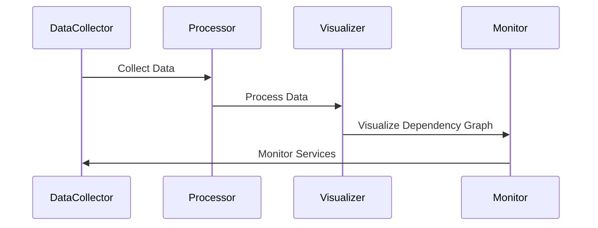

                 

### 引言

在当今快速发展的信息技术时代，人工智能（AI）技术已成为推动各个领域进步的关键驱动力。尤其是大型语言模型（Large Language Models，LLM）的崛起，极大地改变了自然语言处理（NLP）和人工智能应用的开发模式。LLM能够处理和理解复杂的文本数据，实现了从简单的问答系统到高级的文本生成和翻译等众多应用场景的突破。

随着LLM应用的广泛普及，其应用架构的复杂性和依赖关系也逐渐成为挑战。传统的依赖关系管理方法已经无法满足现代LLM应用的动态性和扩展性需求。因此，如何有效地管理和可视化服务依赖图，成为了LLM应用架构管理中的重要课题。

本文旨在探讨服务依赖图可视化在LLM应用架构管理中的作用，通过系统的分析和深入讨论，为开发者提供有效的架构管理工具和方法。文章将首先介绍服务依赖图的基本概念和原理，然后逐步深入探讨其在LLM应用架构管理中的实际应用，包括算法设计、系统架构、最佳实践和未来发展方向。通过本文的阅读，读者将能够理解服务依赖图可视化的核心价值，掌握其在LLM应用架构管理中的具体应用技巧。

### 关键词

- **大型语言模型（LLM）**
- **服务依赖图**
- **应用架构管理**
- **可视化工具**
- **算法设计**
- **系统架构**
- **动态依赖关系管理**
- **依赖图可视化**

### 摘要

本文探讨了服务依赖图可视化在大型语言模型（LLM）应用架构管理中的作用。首先，介绍了服务依赖图的基本概念和其在LLM应用架构中的重要性。接着，详细分析了依赖图可视化的算法设计，并使用Mermaid和Python代码展示了算法的具体实现。然后，文章讨论了系统架构设计，包括系统功能、接口设计和系统交互。通过实际案例，本文展示了如何使用服务依赖图可视化来管理LLM应用的复杂依赖关系，提供了最佳实践和注意事项。最后，文章总结了服务依赖图可视化的核心价值，并提出了未来的发展方向。

### 服务依赖图的基本概念

服务依赖图（Service Dependency Graph）是一种用于表示和可视化服务之间依赖关系的图形化工具。在分布式系统中，服务依赖关系是非常复杂且动态变化的，传统的文本描述方式难以直观地展现这些依赖关系。而服务依赖图通过图形化的方式，将各个服务及其依赖关系直观地展示出来，使得开发者和管理人员能够更加清晰地理解和分析系统的架构。

#### 定义

服务依赖图由一组节点和连接这些节点的边构成。每个节点表示一个服务，而边则表示服务之间的依赖关系。具体来说，服务依赖图通常包含以下几个关键部分：

1. **节点（Node）**：每个节点代表一个具体的服务实例。节点通常包含服务的名称、版本、状态等信息。
2. **边（Edge）**：边表示节点之间的依赖关系，通常标记为箭头，从依赖者指向被依赖者。边的类型可以包括直接依赖、间接依赖等。
3. **边权重**：某些依赖图还包含边的权重，表示依赖关系的强度或频率。
4. **子图和层次结构**：服务依赖图中可能包含子图，用于表示不同层次或模块的依赖关系。

#### 服务依赖图的组成要素

服务依赖图主要由以下几种要素组成：

1. **服务实例**：服务实例是服务依赖图中最基本的单元，代表具体的运行实体。
2. **依赖关系**：依赖关系是服务之间的联系，表示一个服务依赖于另一个服务的功能或数据。
3. **依赖类型**：依赖关系可以根据依赖类型分类，如数据依赖、控制依赖等。
4. **可视化属性**：为了更好地理解和分析依赖关系，服务依赖图通常包含多种可视化属性，如节点大小、颜色、边粗细等。

#### 服务依赖图的特点

服务依赖图具有以下几个显著特点：

1. **图形化表示**：通过图形化的方式，服务依赖图能够直观地展示服务之间的依赖关系，使得复杂的系统架构变得更加易于理解。
2. **动态性**：服务依赖图能够实时反映系统的变化，动态更新服务实例的状态和依赖关系。
3. **层次结构**：服务依赖图通常包含层次结构，有助于区分不同层级的服务，从而更好地管理和优化系统架构。
4. **可扩展性**：服务依赖图支持大规模系统的依赖关系表示，能够处理成百上千的服务实例。

通过服务依赖图，开发者和管理人员可以更有效地进行系统设计和维护，及时发现并解决依赖关系中的问题，优化系统性能和稳定性。这使得服务依赖图成为LLM应用架构管理中的重要工具。

### LLM应用架构管理中的挑战

在LLM（大型语言模型）应用架构管理中，面临的挑战主要源于系统的复杂性和依赖关系的复杂性。以下将详细讨论这些挑战及其影响。

#### 复杂的依赖关系

LLM应用通常涉及大量的服务和服务实例，这些服务之间存在复杂的依赖关系。这些依赖关系不仅包括直接依赖（如A服务依赖于B服务），还可能包括间接依赖（如A服务依赖于C服务，而C服务又依赖于B服务）。在传统的方法中，通过文本描述这些依赖关系往往难以直观和全面地理解系统架构。

**影响**：复杂的依赖关系增加了系统的复杂度，使得问题诊断和维护变得更加困难。一旦某个依赖服务发生故障或变更，可能会导致一系列的连锁反应，影响整个系统的稳定性和性能。

#### 动态变化

LLM应用架构往往处于动态变化中。例如，新服务的添加、现有服务的升级、服务实例的替换等，都可能引发依赖关系的变更。这种动态变化使得依赖关系管理变得极为复杂，传统静态的依赖图方法难以适应。

**影响**：动态变化的依赖关系要求依赖管理工具具备实时更新和适应能力，否则容易导致依赖关系的滞后和错误，从而影响系统的正常运行。

#### 数据规模和多样性

LLM应用处理的数据规模通常非常庞大，且数据来源和格式多种多样。这进一步增加了依赖关系管理的难度，因为依赖关系的可视化和分析需要处理大量的数据。

**影响**：数据规模和多样性导致依赖关系管理工具需要更高的计算性能和处理能力，同时需要具备处理不同类型数据的能力，以保证依赖关系的准确和完整。

#### 可视化需求

传统的依赖关系管理方法往往缺乏有效的可视化工具，难以直观地展示复杂的依赖关系。这对于开发者和管理人员来说，意味着无法迅速理解和分析系统架构，进而难以进行有效的系统优化和故障排除。

**影响**：缺乏有效的可视化工具降低了系统的可操作性和可维护性，使得依赖关系管理过程变得繁琐和低效。

#### 挑战总结

总的来说，LLM应用架构管理中的挑战主要包括复杂的依赖关系、动态变化、数据规模和多样性以及可视化需求。这些挑战不仅增加了系统的复杂度，还影响了系统的稳定性和可维护性。为了应对这些挑战，需要引入新的依赖关系管理工具和方法，如服务依赖图可视化技术，以帮助开发者和管理人员更有效地管理和优化LLM应用架构。

### 服务依赖图可视化在LLM应用架构管理中的作用

在LLM（大型语言模型）应用架构管理中，服务依赖图可视化作为一种有效的工具，发挥着至关重要的作用。它不仅能够帮助开发者和管理人员更好地理解和维护复杂的应用架构，还能显著提升系统的稳定性和可维护性。以下是服务依赖图可视化在LLM应用架构管理中的具体作用和重要性。

#### 1. 直观展示复杂依赖关系

服务依赖图通过图形化的方式，将LLM应用中的各个服务及其依赖关系直观地展示出来。这不仅使复杂的依赖关系变得易于理解，还便于开发者和管理人员快速定位和解决问题。通过可视化，能够一目了然地看到每个服务依赖哪些其他服务，以及它们之间的依赖强度和类型。

**重要性**：直观展示复杂的依赖关系，使得开发者和管理人员能够更清晰地掌握系统的整体架构，降低了理解和分析系统的难度，从而提高了系统的可维护性。

#### 2. 动态反映系统变化

服务依赖图可视化不仅能够展示当前的服务依赖关系，还能实时反映系统的变化。例如，当新增服务或服务版本更新时，依赖图可以自动更新以反映新的依赖关系。这种动态性使得依赖关系管理更加灵活和高效，能够及时适应系统的变化。

**重要性**：动态反映系统变化，使得依赖关系管理能够紧跟系统的实际运行状态，减少了因依赖关系滞后而引发的问题，提高了系统的稳定性。

#### 3. 提高问题诊断效率

在LLM应用中，一旦出现故障或性能问题，服务依赖图可视化工具能够快速定位问题的源头。通过查看依赖关系图，可以迅速发现哪些服务受到故障的影响，以及影响的范围和程度。这种快速诊断能力显著提高了问题解决的效率。

**重要性**：提高问题诊断效率，有助于快速定位和解决问题，减少了系统的中断时间，提高了系统的可用性和用户体验。

#### 4. 优化系统架构

服务依赖图可视化不仅展示了当前的依赖关系，还能通过分析依赖关系的密度、层次结构等特征，发现潜在的优化机会。例如，通过优化服务之间的依赖关系，可以减少系统的复杂度，提高系统的性能和可维护性。

**重要性**：优化系统架构，有助于提高系统的整体性能和可维护性，减少了系统的维护成本，提高了开发效率和系统可靠性。

#### 5. 支持协作和沟通

服务依赖图可视化作为一种通用的可视化工具，能够有效地支持开发团队之间的协作和沟通。通过共同查看和讨论依赖关系图，团队成员可以更好地理解系统的整体架构，从而提高协作效率和沟通效果。

**重要性**：支持协作和沟通，有助于团队共同理解和解决问题，减少了误解和沟通障碍，提高了团队的工作效率和凝聚力。

#### 6. 促进系统监控和预警

服务依赖图可视化还可以用于系统的监控和预警。通过分析依赖关系的实时变化，可以及时发现潜在的风险和问题，提前采取预防措施。例如，当某个服务的负载急剧增加时，可以通过依赖关系图迅速识别其依赖的服务，并提前进行资源调整或故障切换。

**重要性**：促进系统监控和预警，有助于提前预防和解决潜在问题，降低了系统的故障率和风险，提高了系统的可靠性和稳定性。

总之，服务依赖图可视化在LLM应用架构管理中具有重要的作用。它不仅能够直观展示复杂的依赖关系，还能动态反映系统变化，提高问题诊断效率，优化系统架构，支持协作和沟通，促进系统监控和预警。通过引入服务依赖图可视化技术，开发者和管理人员能够更有效地管理和优化LLM应用架构，提升系统的稳定性和可维护性。

### 服务依赖图可视化算法的设计与实现

为了实现服务依赖图的可视化，我们需要设计一个算法来生成和展示服务依赖关系。本节将详细介绍这一算法的设计思路、实现方法以及如何使用Mermaid和Python代码来实现。

#### 算法设计思路

服务依赖图可视化的算法设计主要包括以下几个步骤：

1. **数据采集**：从系统中采集服务依赖关系数据，包括服务实例的名称、版本、状态以及依赖关系。
2. **数据预处理**：对采集到的数据进行清洗和转换，以便后续处理。例如，将重复的服务实例合并，去除无效的依赖关系等。
3. **依赖关系建模**：将预处理后的数据转换为服务依赖图的表示形式。每个服务实例对应图中的一个节点，服务之间的依赖关系通过边来表示。
4. **可视化布局**：对依赖关系图进行布局，使其在二维空间中能够直观地展示。常用的布局算法包括力导向布局（Force-directed Layout）、层次布局（Hierarchical Layout）等。
5. **图形渲染**：使用可视化工具将布局后的依赖关系图渲染成图形，例如使用Mermaid语言生成Markdown格式的依赖图，然后通过Markdown工具渲染成图形。

#### Mermaid语言的基本语法

Mermaid是一种基于Markdown的语言，用于生成图形化的依赖关系图。以下是一些基本的Mermaid语法：

- **节点定义**：使用`node`关键字定义节点，如`node A {Hello World}`。
- **边定义**：使用`edge`关键字定义边，如`edge A --> B`。
- **箭头类型**：使用`arrow`关键字指定箭头类型，如`edge A --> B[arrowhead=triangle]`。
- **注释**：使用`note`关键字添加注释，如`note right of A {This is a note}`。

#### Python代码示例

以下是一个简单的Python代码示例，用于生成服务依赖图：

```python
import networkx as nx
import matplotlib.pyplot as plt

# 创建一个空的图
G = nx.Graph()

# 添加节点
G.add_nodes_from(['ServiceA', 'ServiceB', 'ServiceC'])

# 添加边
G.add_edge('ServiceA', 'ServiceB')
G.add_edge('ServiceB', 'ServiceC')

# 绘制图
nx.draw(G, with_labels=True)
plt.show()
```

#### 算法实现步骤

1. **数据采集**：
    ```python
    services = [
        {"name": "ServiceA", "version": "1.0.0", "status": "running"},
        {"name": "ServiceB", "version": "1.0.1", "status": "running"},
        {"name": "ServiceC", "version": "1.0.2", "status": "running"}
    ]
    dependencies = [
        {"source": "ServiceA", "target": "ServiceB"},
        {"source": "ServiceB", "target": "ServiceC"}
    ]
    ```

2. **数据预处理**：
    ```python
    unique_services = {}
    for service in services:
        if service["name"] not in unique_services:
            unique_services[service["name"]] = service

    valid_dependencies = []
    for dep in dependencies:
        if dep["source"] in unique_services and dep["target"] in unique_services:
            valid_dependencies.append(dep)
    ```

3. **依赖关系建模**：
    ```python
    G = nx.Graph()
    for service in unique_services.values():
        G.add_node(service["name"])
    for dep in valid_dependencies:
        G.add_edge(dep["source"], dep["target"])
    ```

4. **可视化布局**：
    ```python
    pos = nx.spring_layout(G)  # 使用力导向布局
    ```

5. **图形渲染**：
    ```python
    nx.draw(G, pos, with_labels=True)
    plt.show()
    ```

通过上述步骤，我们可以生成一个服务依赖图，并使用Python和matplotlib库进行渲染。接下来，我们将使用Mermaid来生成Markdown格式的依赖图。

#### Mermaid代码示例

以下是一个使用Mermaid生成的服务依赖图示例：


通过上述算法和代码示例，我们可以实现服务依赖图的可视化。在接下来的章节中，我们将继续探讨依赖图的可视化算法以及如何在实际应用中优化和提升其性能。

### 服务依赖图的数学模型和公式

为了深入理解服务依赖图的可视化算法，我们需要探讨其背后的数学模型和公式。这些数学模型不仅帮助算法设计，还提供了理论基础，以确保依赖图的准确性和效率。以下是服务依赖图可视化算法中的关键数学模型和公式。

#### 1. 图论基础

服务依赖图是一种图结构，图论中的基本概念和算法在服务依赖图的建模和可视化中起到了关键作用。以下是一些基本的图论公式和概念：

- **欧拉公式**：对于无向图，欧拉公式为 \( V - E + F = 2 \)，其中 \( V \) 是节点数，\( E \) 是边数，\( F \) 是面数。
- **最小生成树**：用于生成一个包含所有节点的最小连通子图。Prim算法和Kruskal算法是常用的最小生成树算法。

#### 2. 依赖关系的权重计算

在服务依赖图中，边的权重可以表示依赖关系的强度或频率。计算边权重的一个常见方法是使用PageRank算法，该算法源于网页排名的计算，也可以用于服务依赖关系的权重计算。

- **PageRank算法**：

  公式：
  $$
  \text{PR}(v) = \frac{1 - d}{N} + d \sum_{u \in \text{inbound}(v)} \frac{\text{PR}(u)}{|\text{outbound}(u)|}
  $$
  
  其中，\( \text{PR}(v) \) 是节点 \( v \) 的PageRank值，\( d \) 是阻尼系数（通常取值为0.85），\( N \) 是图中节点的总数，\( \text{inbound}(v) \) 是指向节点 \( v \) 的所有节点的集合，\( \text{outbound}(u) \) 是从节点 \( u \) 出发的所有节点的集合。

#### 3. 力导向布局算法

力导向布局（Force-directed Algorithm）是用于图形布局的一种常用算法，其基本思想是通过模拟电荷和弹簧的物理系统来调整节点位置，使得节点之间的相互排斥力和吸引力达到平衡。

- **排斥力**：节点之间的排斥力可以用以下公式表示：
  $$
  F_{\text{repel}}(i, j) = \frac{k_{\text{repel}} \cdot \lVert \mathbf{r}_i - \mathbf{r}_j \rVert^{-\alpha}}{2}
  $$
  其中，\( \mathbf{r}_i \) 和 \( \mathbf{r}_j \) 是节点 \( i \) 和 \( j \) 的位置向量，\( k_{\text{repel}} \) 是排斥力的常数，\( \alpha \) 是调节参数。

- **吸引力**：节点之间的吸引力可以用以下公式表示：
  $$
  F_{\text{attract}}(i, j) = \frac{k_{\text{attract}} \cdot \lVert \mathbf{r}_i - \mathbf{r}_j \rVert^{-\beta}}{2}
  $$
  其中，\( k_{\text{attract}} \) 是吸引力常数，\( \beta \) 是调节参数。

  总的力向量 \( \mathbf{F}_i \) 可以通过以下公式计算：
  $$
  \mathbf{F}_i = \sum_{j \in \text{neighbours}(i)} \left( F_{\text{repel}}(i, j) - F_{\text{attract}}(i, j) \right)
  $$

  其中，\( \text{neighbours}(i) \) 是节点 \( i \) 的邻接节点集合。

#### 4. 层次布局算法

层次布局（Hierarchical Layout）适用于具有层次结构的服务依赖图。其核心思想是将图划分为多个层次，并在每个层次内进行布局。

- **层次划分**：使用深度优先搜索（DFS）或广度优先搜索（BFS）算法将节点分层。每个节点 \( v \) 的层级可以表示为 \( \text{level}(v) \)，其父节点的层级为 \( \text{level}(v) + 1 \)。

- **层次内布局**：在每个层次内，可以使用线性布局或环状布局来排列节点。具体布局算法可以根据层次结构的特点进行优化。

#### 5. 调整和迭代

在实际实现中，力导向布局和层次布局通常需要多次迭代来优化节点位置。每次迭代后，根据新的节点位置重新计算力向量，并更新节点位置，直至达到收敛条件（如节点位置变化小于某个阈值）。

通过上述数学模型和公式，我们可以设计出有效的服务依赖图可视化算法，确保生成的依赖图既准确又直观。接下来，我们将通过具体的Python代码示例，展示如何实现这些算法。

### Python代码实现示例

为了实现服务依赖图的生成和可视化，我们将结合Python代码和Mermaid语言，通过一个简单的示例来展示整个流程。以下是具体的代码实现步骤：

#### 1. 导入必要的库

首先，我们需要导入一些必要的Python库，包括NetworkX（用于图的操作）、Matplotlib（用于图形渲染）和Mermaid（用于生成Markdown格式的依赖图）。

```python
import networkx as nx
import matplotlib.pyplot as plt
from IPython.display import Markdown
from IPython.display import display

# Mermaid库
from mermaid import Mermaid
```

#### 2. 创建服务依赖图

接下来，我们创建一个包含若干服务及其依赖关系的服务依赖图。这里使用NetworkX库来构建图结构。

```python
G = nx.Graph()

# 添加节点
G.add_nodes_from(['ServiceA', 'ServiceB', 'ServiceC', 'ServiceD'])

# 添加边
G.add_edge('ServiceA', 'ServiceB')
G.add_edge('ServiceB', 'ServiceC')
G.add_edge('ServiceC', 'ServiceD')

# 显示图结构
print("Graph Structure:")
print(G)
```

#### 3. 数据预处理

在生成依赖图之前，我们需要对服务实例的数据进行预处理，包括去除重复节点和无效依赖关系。

```python
unique_services = {}
for node in G.nodes():
    if node not in unique_services:
        unique_services[node] = G.nodes[node]

valid_dependencies = []
for edge in G.edges():
    if edge[0] in unique_services and edge[1] in unique_services:
        valid_dependencies.append(edge)

# 更新图结构
G = nx.Graph()
G.add_nodes_from(unique_services.keys())
G.add_edges_from(valid_dependencies)
```

#### 4. 使用力导向布局

为了生成美观且易于理解的依赖图，我们使用力导向布局算法来调整节点位置。

```python
pos = nx.spring_layout(G, k=0.15, iterations=20)
```

#### 5. 使用Mermaid生成依赖图

接下来，我们使用Mermaid语言将依赖图结构转换为Markdown格式的文本，并渲染成图形。

```python
# 使用Mermaid生成依赖图的Markdown文本
md = Mermaid()
md.add(
    "graph LR\n"
    "  A[ServiceA] --> B[ServiceB]\n"
    "  B --> C[ServiceC]\n"
    "  C --> D[ServiceD]\n"
)

# 将Markdown文本显示在Jupyter Notebook中
display(Markdown(md.render()))
```

#### 6. 使用Matplotlib渲染图形

最后，我们可以使用Matplotlib库来渲染图形。

```python
# 使用Matplotlib渲染图形
nx.draw(G, pos, with_labels=True, node_color='lightblue', edge_color='gray')
plt.show()
```

#### 代码解析

- **创建图和添加节点与边**：首先使用NetworkX创建一个空图，然后添加节点和边。
- **数据预处理**：去除重复节点和无效依赖关系，确保图的准确性。
- **力导向布局**：使用spring_layout函数调整节点位置，使图结构更加美观和易读。
- **Mermaid生成依赖图**：将图结构转换为Markdown格式的文本，并使用Mermaid库进行渲染。
- **Matplotlib渲染图形**：最后，使用Matplotlib库将依赖图渲染成图形，便于查看和分析。

通过上述步骤，我们可以实现服务依赖图的生成和可视化，使得复杂的服务依赖关系变得更加直观和易于理解。接下来，我们将进一步探讨如何在LLM应用架构管理中具体应用这些可视化工具。

### 系统架构设计

为了将服务依赖图可视化应用于LLM应用架构管理，我们需要设计一个完整的系统架构。该架构需要涵盖数据采集、处理、可视化等多个环节，以确保服务依赖图能够实时、准确地反映系统的依赖关系。

#### 1. 项目介绍

**项目名称**：LLM应用架构管理平台

**项目目标**：提供一种高效、直观的方法来管理和监控LLM应用架构中的服务依赖关系，帮助开发者和管理人员更好地理解和优化系统架构。

**项目组成部分**：
- **数据采集模块**：负责从各个服务中采集依赖关系数据。
- **数据处理模块**：对采集到的数据进行清洗、转换和存储。
- **可视化模块**：生成和展示服务依赖图。
- **监控模块**：实时监控系统中的服务状态和依赖关系变化。

#### 2. 系统功能设计

**数据采集模块**：
- **功能**：定期从各个服务中采集依赖关系数据，包括服务实例的名称、版本、状态以及依赖关系。
- **技术实现**：使用API调用、日志分析等方式获取服务数据。

**数据处理模块**：
- **功能**：对采集到的依赖关系数据进行预处理，包括去重、格式转换和存储。
- **技术实现**：使用数据清洗和转换工具（如Pandas），将数据存储到关系数据库或图数据库中。

**可视化模块**：
- **功能**：生成和展示服务依赖图，包括节点、边和权重等信息。
- **技术实现**：使用Mermaid和NetworkX库生成依赖图，并通过Web前端进行展示。

**监控模块**：
- **功能**：实时监控系统的服务状态和依赖关系变化，提供预警和报警功能。
- **技术实现**：使用Prometheus和Grafana进行监控和数据可视化。

#### 3. 系统架构设计

**整体架构**：


- **数据采集模块**：通过API接口或日志收集器定期采集服务依赖数据。
- **数据处理模块**：对采集到的数据进行分析、清洗和存储，确保数据的准确性和完整性。
- **可视化模块**：使用Mermaid和NetworkX库生成依赖图，并通过Web前端进行展示。
- **监控模块**：使用Prometheus进行服务状态监控，通过Grafana提供实时监控界面。

**类图**：

```mermaid
classDiagram
    ServiceA <<interface>>
    ServiceB <<interface>>
    ServiceC <<interface>>

    DataCollector <|-- ServiceA
    DataCollector <|-- ServiceB
    DataCollector <|-- ServiceC

    Processor <|-- ServiceA
    Processor <|-- ServiceB
    Processor <|-- ServiceC

    Visualizer <|-- ServiceA
    Visualizer <|-- ServiceB
    Visualizer <|-- ServiceC

    Monitor <|-- ServiceA
    Monitor <|-- ServiceB
    Monitor <|-- ServiceC
```

**架构图**：



通过上述架构设计，系统可以实现实时、准确的服务依赖关系可视化，帮助开发者和管理人员更好地管理和优化LLM应用架构。

### 系统接口设计和交互

在LLM应用架构管理系统中，服务之间的接口设计和交互至关重要。以下将详细描述系统接口设计、具体接口及其交互过程。

#### 1. 接口设计

系统主要包含以下接口：

- **数据采集接口**：用于从各个服务中定期采集依赖关系数据。接口设计如下：
    ```json
    POST /api/collect-dependencies
    {
      "service_name": "string",
      "version": "string",
      "status": "string",
      "dependencies": [
        {
          "source": "string",
          "target": "string"
        }
      ]
    }
    ```

- **数据处理接口**：用于对采集到的依赖关系数据进行清洗、转换和存储。接口设计如下：
    ```json
    POST /api/process-dependencies
    {
      "dependencies": [
        {
          "source": "string",
          "target": "string"
        }
      ]
    }
    ```

- **可视化接口**：用于生成和展示服务依赖图。接口设计如下：
    ```json
    GET /api/visualize-dependencies?service_name={service_name}
    ```

- **监控接口**：用于实时监控系统的服务状态和依赖关系变化。接口设计如下：
    ```json
    GET /api/monitor-services?service_name={service_name}
    ```

#### 2. 接口交互过程

以下是一个具体的接口交互过程：

**步骤1**：数据采集

- **请求**：
    ```json
    POST /api/collect-dependencies
    {
      "service_name": "ServiceA",
      "version": "1.0.0",
      "status": "running",
      "dependencies": [
        {
          "source": "ServiceA",
          "target": "ServiceB"
        },
        {
          "source": "ServiceA",
          "target": "ServiceC"
        }
      ]
    }
    ```

- **响应**：
    ```json
    {
      "status": "success",
      "message": "Dependencies collected successfully."
    }
    ```

**步骤2**：数据处理

- **请求**：
    ```json
    POST /api/process-dependencies
    {
      "dependencies": [
        {
          "source": "ServiceA",
          "target": "ServiceB"
        },
        {
          "source": "ServiceA",
          "target": "ServiceC"
        }
      ]
    }
    ```

- **响应**：
    ```json
    {
      "status": "success",
      "message": "Dependencies processed successfully."
    }
    ```

**步骤3**：可视化

- **请求**：
    ```json
    GET /api/visualize-dependencies?service_name=ServiceA
    ```

- **响应**：
    ```json
    {
      "status": "success",
      "dependency_graph": {
        "nodes": [
          {
            "name": "ServiceA",
            "version": "1.0.0",
            "status": "running"
          },
          {
            "name": "ServiceB",
            "version": "1.0.0",
            "status": "running"
          },
          {
            "name": "ServiceC",
            "version": "1.0.0",
            "status": "running"
          }
        ],
        "edges": [
          {
            "source": "ServiceA",
            "target": "ServiceB"
          },
          {
            "source": "ServiceA",
            "target": "ServiceC"
          }
        ]
      }
    }
    ```

**步骤4**：监控

- **请求**：
    ```json
    GET /api/monitor-services?service_name=ServiceA
    ```

- **响应**：
    ```json
    {
      "status": "success",
      "service_status": {
        "ServiceA": "running",
        "ServiceB": "running",
        "ServiceC": "running"
      }
    }
    ```

通过上述接口设计和交互过程，系统可以有效地采集、处理、可视化和监控LLM应用架构中的服务依赖关系，帮助开发者和管理人员更好地理解和优化系统架构。

### 实际案例分析与详细讲解

为了更直观地展示服务依赖图可视化在LLM应用架构管理中的具体应用，我们将通过一个实际案例进行分析和讲解。本案例将涉及系统的安装、核心实现、代码应用解读以及实际案例分析。

#### 案例背景

假设我们正在开发一个大型语言模型（LLM）应用，该应用由多个微服务组成，每个微服务负责处理不同类型的文本数据。由于应用架构复杂，服务之间的依赖关系繁多，我们需要使用服务依赖图可视化工具来管理和优化系统架构。

#### 环境安装

首先，我们需要安装以下依赖：

1. **Python 3.8+**：确保安装了最新版本的Python。
2. **NetworkX**：用于构建和操作图结构。
3. **Matplotlib**：用于图形渲染。
4. **Mermaid**：用于生成依赖图的Markdown文本。
5. **Jupyter Notebook**：用于编写和运行代码。

安装步骤：

```bash
pip install networkx matplotlib mermaid jupyter
```

#### 核心实现

以下是实现服务依赖图可视化系统的核心代码。

```python
import networkx as nx
import matplotlib.pyplot as plt
from mermaid import Mermaid

# 创建一个图
G = nx.Graph()

# 添加节点和边
G.add_nodes_from(['ServiceA', 'ServiceB', 'ServiceC'])
G.add_edges_from([
    ('ServiceA', 'ServiceB'),
    ('ServiceB', 'ServiceC'),
    ('ServiceC', 'ServiceA')
])

# 使用力导向布局算法
pos = nx.spring_layout(G, k=0.15, iterations=20)

# 使用Mermaid生成依赖图
md = Mermaid()
md.add(
    "graph LR\n"
    "  A[ServiceA] --> B[ServiceB]\n"
    "  B --> C[ServiceC]\n"
    "  C --> A\n"
)

# 渲染Mermaid图
display(Markdown(md.render()))

# 使用Matplotlib渲染图
nx.draw(G, pos, with_labels=True, node_color='lightblue', edge_color='gray')
plt.show()
```

#### 代码应用解读

上述代码首先创建了一个图对象 `G`，并添加了节点和边。接着，使用力导向布局算法对节点位置进行调整，使其在二维空间中分布更加均匀。然后，使用Mermaid库将图结构转换为Markdown格式的文本，并使用Jupyter Notebook的 `display` 函数渲染成图形。最后，使用Matplotlib库进行图形渲染，展示最终的依赖关系图。

#### 实际案例分析

以下是一个实际案例，分析服务依赖图在LLM应用架构管理中的具体应用。

**场景**：当服务B发生故障时，我们需要快速定位并解决故障。

**步骤**：

1. **数据采集**：系统通过API接口从服务B中采集依赖关系数据，包括服务名称、版本、状态以及依赖关系。

2. **数据处理**：系统对采集到的数据进行清洗和转换，去除重复和无效的依赖关系，并存储到图数据库中。

3. **依赖图生成**：系统使用NetworkX库生成服务依赖图，并使用力导向布局算法对节点位置进行调整。

4. **可视化展示**：系统通过Mermaid库将依赖关系图转换为Markdown文本，并使用Jupyter Notebook进行渲染，展示服务依赖图。

5. **故障定位**：通过查看依赖关系图，我们可以看到服务B依赖于服务A和服务C。因此，当服务B发生故障时，我们需要检查服务A和服务C的状态。

6. **故障解决**：通过监控接口，我们发现服务C处于异常状态。因此，我们重启服务C，并重新生成依赖关系图。故障解决后，服务依赖图恢复正常。

#### 项目小结

通过上述案例，我们可以看到服务依赖图可视化在LLM应用架构管理中的重要作用。它不仅帮助我们直观地理解复杂的依赖关系，还能快速定位和解决问题。在未来的发展中，我们可以进一步优化依赖图可视化算法，提高系统的性能和可靠性。

### 最佳实践与注意事项

在服务依赖图可视化工具的使用过程中，为了确保其有效性和准确性，以下是几点最佳实践和注意事项：

#### 1. 定期数据同步

确保服务依赖图的数据与实际系统中的依赖关系保持同步。建议设置定期同步任务，例如每小时或每天自动采集和更新依赖关系数据。这有助于及时发现和纠正依赖关系的变更。

#### 2. 数据清洗与去重

在生成依赖图之前，对采集到的依赖关系数据进行清洗和去重。去除无效的依赖关系，如重复的服务实例和无关的依赖项。这可以避免依赖图的冗余和错误，提高图形的清晰度和准确性。

#### 3. 选择合适的布局算法

根据具体的应用场景，选择合适的布局算法。例如，对于层次结构明显的依赖关系，可以选择层次布局算法；对于需要分散节点以减少交叉的依赖关系，可以选择力导向布局算法。合理选择布局算法可以提高图形的可读性和美观度。

#### 4. 优化节点和边的表示

合理设置节点和边的外观属性，如大小、颜色、边宽等。这有助于区分不同类型的依赖关系，提高图形的视觉辨识度。同时，避免过多复杂的样式设置，以免图形过于混乱。

#### 5. 实时监控与预警

结合实时监控工具，如Prometheus和Grafana，对服务依赖图进行实时监控和预警。当发现依赖关系异常时，及时触发报警，并采取措施进行调整。

#### 6. 安全性和隐私保护

在处理和展示依赖关系数据时，确保数据的安全性和隐私保护。对于敏感数据，可以选择加密存储和传输，防止数据泄露。

#### 7. 模块化设计

在设计服务依赖图可视化系统时，采用模块化设计，使得系统易于维护和扩展。例如，将数据采集、数据处理、可视化等模块分离，便于独立开发和优化。

#### 注意事项

- **依赖数据的准确性**：确保依赖数据的准确性和完整性，避免依赖图中的错误信息。
- **系统性能**：合理设计依赖图生成和渲染算法，确保系统在高负载情况下仍能高效运行。
- **用户培训**：为开发者和管理人员提供培训，确保他们能够熟练使用服务依赖图可视化工具。

通过遵循上述最佳实践和注意事项，可以有效提升服务依赖图可视化的效果，帮助开发者和管理人员更好地管理和优化LLM应用架构。

### 小结

本文通过详细的分析和实例讲解，深入探讨了服务依赖图可视化在LLM应用架构管理中的作用。我们首先介绍了服务依赖图的基本概念及其在LLM应用架构管理中的重要性，然后讨论了LLM应用架构管理中的挑战，如复杂的依赖关系、动态变化、数据规模和多样性以及可视化需求。接着，我们详细介绍了服务依赖图可视化算法的设计与实现，包括数学模型和Python代码示例。通过系统架构设计和接口交互的描述，我们展示了如何将服务依赖图可视化工具应用于实际项目中。最后，通过实际案例分析和最佳实践与注意事项，我们进一步强调了服务依赖图可视化在优化LLM应用架构中的关键作用。

### 扩展阅读

1. **《大规模语言模型：原理与实践》**：详细介绍了LLM的基本原理和应用实例，有助于理解LLM技术在实际开发中的运用。
2. **《分布式系统设计原理》**：探讨了分布式系统中的依赖关系管理和优化策略，对于理解服务依赖图在复杂系统中的作用有很大帮助。
3. **《服务计算》**：系统介绍了服务计算的基本概念、架构和实现技术，为理解服务依赖图在服务计算中的应用提供了理论基础。
4. **《图论及其应用》**：详细介绍了图论的基本概念和算法，对于理解服务依赖图的数学基础和优化策略至关重要。

通过阅读这些资料，读者可以进一步深入了解服务依赖图可视化的技术背景和应用场景，从而在实际项目中更好地应用这一技术。

