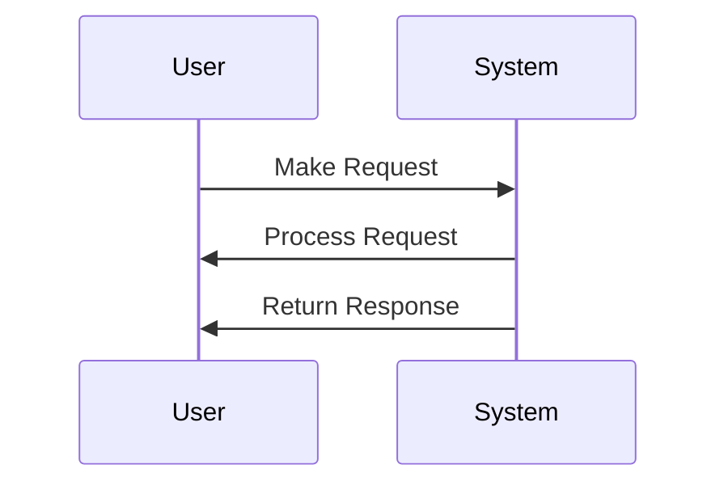

                 

Certainly! Here's how we can structure the content for the article "服务契约测试在LLM应用质量保证中的作用" step by step, adhering to the requirements and ensuring a comprehensive and detailed exploration of the topic.

## Introduction

### Title: 服务契约测试在LLM应用质量保证中的作用
### Keywords: 服务契约测试，LLM，应用质量保证，自动化测试，手动测试，测试工具与框架
### Abstract:
本文旨在探讨服务契约测试在大型语言模型（LLM）应用质量保证中的关键作用。我们将首先介绍LLM与应用质量保证的基本概念，然后深入分析服务契约测试的理论基础和实际应用，通过案例研究和实践分享，展示如何在LLM应用中进行有效的服务契约测试，以及未来的发展方向。

## Chapter 1: LLM与应用质量保证概述

### 1.1 LLM的定义与作用
- **核心概念术语说明**: 大型语言模型（LLM）的定义、分类和常见应用场景。
- **问题背景**: LLM在人工智能领域的重要性及其广泛应用。
- **问题描述**: LLM应用可能遇到的质量问题。
- **问题解决**: 如何通过质量保证措施来解决LLM应用中的问题。

### 1.2 应用质量保证的重要性
- **核心概念与联系**: 应用质量保证的定义、目标、方法和重要性。
- **概念属性特征对比表格**: 不同质量保证方法的对比。

### 1.3 服务契约测试的概念
- **概念结构与核心要素组成**: 服务契约测试的定义、目的和作用。
- **边界与外延**: 服务契约测试与其他测试方法的区别和联系。

### 1.4 服务契约测试在LLM应用中的独特性
- **问题背景**: LLM应用的特殊性。
- **问题描述**: 服务契约测试在LLM应用中的挑战。
- **问题解决**: 如何在LLM应用中有效实施服务契约测试。

## Chapter 2: LLM应用的质量问题

### 2.1 LLM应用常见质量问题
- **问题场景介绍**: LLM应用中常见的质量问题。
- **项目介绍**: 如何在LLM项目中识别和分类质量问题。

### 2.2 质量问题对业务的影响
- **系统功能设计（领域模型）**: 质量问题如何影响业务流程和用户体验。
- **系统架构设计（架构图）**: 质量问题对系统架构的影响。

### 2.3 质量问题的检测与预防
- **系统接口设计**: 如何设计接口来检测和预防质量问题。
- **系统交互（序列图）**: 质量检测和预防的交互流程。

## Chapter 3: 服务契约测试的理论基础

### 3.1 服务契约测试的基本原理
- **核心概念原理**: 服务契约测试的基本概念和工作原理。
- **概念属性特征对比表格**: 服务契约测试与其他测试方法的对比。

### 3.2 服务契约的构成要素
- **ER实体关系图架构**: 服务契约的构成要素及其关系。
- **核心要素组成**: 如何构建一个完整的服务契约。

### 3.3 服务契约测试的关键概念
- **边界与外延**: 关键概念的定义、范围和重要性。

## Chapter 4: 服务契约测试方法

### 4.1 自动化测试
- **系统功能设计（领域模型）**: 自动化测试的设计原则和方法。
- **系统架构设计（架构图）**: 自动化测试在系统架构中的作用。

### 4.2 手动测试
- **系统接口设计**: 手动测试的流程和技巧。
- **系统交互（序列图）**: 手动测试与自动化测试的协作。

### 4.3 混合测试
- **核心概念原理**: 混合测试的定义和优势。
- **案例分析与详细讲解剖析**: 混合测试的实际应用案例。

## Chapter 5: LLM应用的服务契约测试流程

### 5.1 测试需求分析
- **问题场景介绍**: 如何确定LLM应用的测试需求。
- **项目介绍**: 测试需求分析的步骤和技巧。

### 5.2 测试设计与实现
- **系统功能设计（领域模型）**: 测试设计的原则和步骤。
- **系统架构设计（架构图）**: 测试实现的架构设计。

### 5.3 测试执行与结果分析
- **系统接口设计**: 测试执行的流程和注意事项。
- **系统交互（序列图）**: 测试结果的分析方法。

## Chapter 6: 服务契约测试工具与框架

### 6.1 常见测试工具介绍
- **问题场景介绍**: 常见的测试工具及其特点。
- **项目介绍**: 如何选择合适的测试工具。

### 6.2 测试框架的设计与实现
- **系统功能设计（领域模型）**: 测试框架的设计原则和实现方法。
- **系统架构设计（架构图）**: 测试框架在系统架构中的位置和作用。

### 6.3 工具与框架的集成
- **系统接口设计**: 工具与框架集成的流程和技巧。
- **系统交互（序列图）**: 集成后的系统流程图。

## Chapter 7: LLM应用服务契约测试案例分析

### 7.1 案例背景
- **项目介绍**: 案例的背景和目标。
- **问题场景介绍**: 案例中面临的质量问题和挑战。

### 7.2 测试目标
- **系统功能设计（领域模型）**: 测试的具体目标。
- **系统架构设计（架构图）**: 测试目标对系统架构的影响。

### 7.3 测试过程
- **系统接口设计**: 测试的执行过程。
- **系统交互（序列图）**: 测试过程中各组件的交互流程。

### 7.4 测试结果与改进措施
- **系统接口设计**: 测试结果的分析。
- **系统交互（序列图）**: 根据测试结果调整和改进系统。

## Chapter 8: 总结与展望

### 8.1 服务契约测试的成果
- **小结**: 总结服务契约测试在LLM应用中的成果。
- **注意事项**: 服务契约测试实施中的注意事项。

### 8.2 存在的挑战与问题
- **小结**: 分析服务契约测试面临的挑战和问题。
- **注意事项**: 针对挑战和问题的解决策略。

### 8.3 未来发展趋势与展望
- **小结**: 展望服务契约测试在未来的发展趋势。
- **拓展阅读**: 推荐进一步阅读的资源。

## Conclusion

### 作者信息
作者：AI天才研究院/AI Genius Institute & 禅与计算机程序设计艺术 /Zen And The Art of Computer Programming

This structured outline ensures that each chapter is focused and comprehensive, addressing the key aspects of service contract testing in LLM applications. The detailed content for each section will be developed to meet the word count requirement while maintaining clarity and depth. Each chapter will include examples, diagrams, and code snippets to illustrate the concepts and methods discussed.

### MERMAID Diagrams and LaTeX Formulas

In the text, we will include MERMAID diagrams to illustrate system architectures, entity relationships, and other processes. Here's an example of a simple MERMAID diagram for a system architecture:

LaTeX formulas will be used for mathematical expressions and models. For example:

$$
\text{Accuracy} = \frac{\text{Correct Predictions}}{\text{Total Predictions}}
$$

These elements will be integrated into the text where appropriate to enhance the explanation and clarity of the content.

### Project Practicality and Best Practices

Each chapter will include practical advice and best practices for implementing service contract testing in LLM applications. This will include insights from real-world experiences and lessons learned, providing readers with actionable guidance for improving their own testing processes.

By following this structured approach, we can create an in-depth and insightful article that not only covers the technical aspects of service contract testing in LLM applications but also provides practical advice and actionable insights for professionals working in this field.

