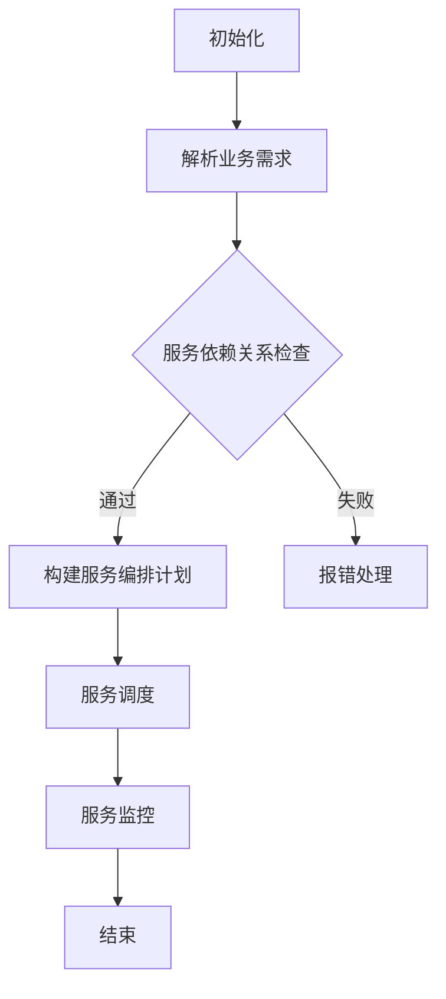
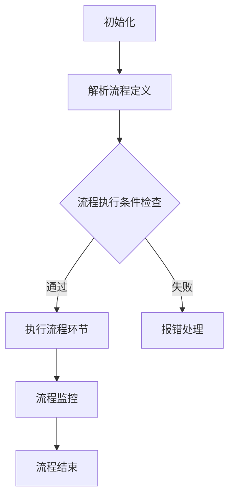
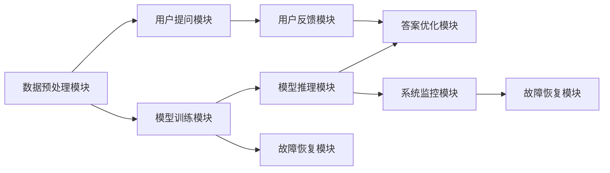
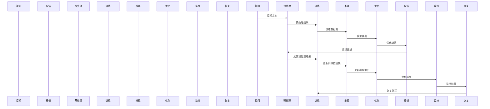
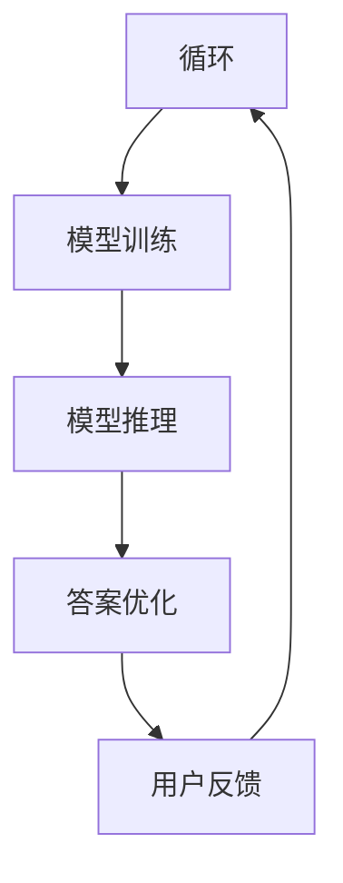

                 


## 第1章: 问题背景与定义

### 1.1 问题背景

#### 1.1.1 复杂LLM应用的需求

随着人工智能技术的快速发展，大型语言模型（Large Language Model，简称LLM）在自然语言处理（Natural Language Processing，简称NLP）领域展现出了强大的能力。然而，随着模型规模的不断扩大，如何高效地部署和运维这些复杂LLM应用，成为了亟待解决的问题。服务编排（Service Orchestration）与流程管理（Process Management）作为两种有效的系统管理方法，在复杂LLM应用中发挥了至关重要的作用。

服务编排是将多个服务按照一定的逻辑顺序组织起来，以实现特定的业务目标。在复杂LLM应用中，服务编排能够确保模型训练、推理、部署等环节的顺畅进行，提高系统整体性能。流程管理则是通过监控和管理业务流程，确保业务流程的规范性和高效性。在复杂LLM应用中，流程管理能够帮助我们优化资源利用，提高系统稳定性。

#### 1.1.2 服务编排与流程管理的必要性

首先，复杂LLM应用通常涉及大量的数据预处理、模型训练、推理和部署等环节，这些环节之间存在着复杂的依赖关系。如果没有有效的服务编排和流程管理，可能会导致以下问题：

1. **依赖关系管理困难**：各个环节之间缺乏有效的协调，导致系统运行不稳定。
2. **资源浪费**：部分环节资源利用率低下，导致整体效率降低。
3. **安全性问题**：缺乏统一的监控和安全管理，可能导致数据泄露或系统故障。

其次，随着LLM应用的不断迭代和发展，业务需求也在不断变化。服务编排和流程管理能够帮助我们快速响应这些变化，实现系统功能的灵活调整。

### 1.2 核心概念

#### 1.2.1 服务编排

服务编排（Service Orchestration）是一种通过定义和执行一系列服务操作来提供业务功能的机制。在复杂LLM应用中，服务编排主要涉及以下几个方面：

1. **服务定义**：明确各个服务的功能、输入输出和依赖关系。
2. **服务调度**：根据业务需求和资源情况，调度和执行服务。
3. **服务监控**：实时监控服务运行状态，确保系统稳定运行。

#### 1.2.2 流程管理

流程管理（Process Management）是一种通过定义、执行和监控业务流程，确保业务目标得以实现的方法。在复杂LLM应用中，流程管理主要涉及以下几个方面：

1. **流程设计**：定义业务流程的结构、步骤和规则。
2. **流程执行**：按照流程设计，自动或手动执行业务流程。
3. **流程监控**：实时监控流程运行状态，确保流程规范执行。

## 第2章: 核心概念与联系

### 2.1 概念属性特征对比

在深入了解服务编排和流程管理之前，我们需要了解这两个概念的核心属性和特征。以下是一个简单的对比表格：

| 特征               | 服务编排                   | 流程管理                   |
|--------------------|----------------------------|----------------------------|
| 目标               | 提高服务协同效率           | 提高业务流程效率           |
| 范围               | 关注单个服务或服务集合     | 关注整个业务流程           |
| 调度机制           | 基于服务间依赖关系         | 基于业务流程规则           |
| 监控重点           | 服务运行状态               | 流程执行状态               |
| 调整灵活性         | 相对灵活                   | 相对固定                   |

### 2.2 ER实体关系图

为了更好地理解服务编排和流程管理在复杂LLM应用中的实现，我们可以使用ER（Entity-Relationship）实体关系图来表示它们之间的联系。以下是一个简单的ER实体关系图：

```
+-------------+      +--------------+
| 服务（Service）       | 流程（Process） |
+-------------+      +--------------+
| 服务ID       |      | 流程ID       |
| 服务名称     |      | 流程名称     |
| 服务描述     |      | 流程描述     |
| 服务类型     |      | 流程类型     |
| 依赖服务     |<---->| 流程环节     |
+-------------+      +--------------+
```

在ER实体关系图中，服务（Service）和流程（Process）是两个核心实体。服务是流程中的基本操作单元，而流程则是多个服务的组合。服务之间可以通过依赖关系来组织成复杂的业务逻辑，而流程则可以确保这些业务逻辑按照一定的规则高效执行。

## 第3章: 服务编排算法原理

### 3.1 服务编排算法概述

服务编排算法（Service Orchestration Algorithm）是实现服务编排的核心。它负责根据业务需求和服务间依赖关系，动态调度和执行服务，确保系统高效稳定运行。服务编排算法的核心目标包括：

1. **资源优化**：合理分配和利用资源，提高系统整体性能。
2. **可靠性保证**：确保服务编排过程中的容错和恢复能力。
3. **灵活性**：根据业务需求的变化，快速调整和优化服务编排策略。

服务编排算法通常可以分为以下几类：

1. **基于规则的编排**：根据预设的业务规则和依赖关系，静态编排服务。
2. **基于预测的编排**：利用历史数据和预测模型，动态调整服务编排策略。
3. **基于优化的编排**：通过优化算法，寻找最优的服务编排方案。

### 3.2 服务编排算法的mermaid流程图

以下是一个简单的mermaid流程图，展示了服务编排的基本流程：



### 3.3 服务编排算法的Python源代码

以下是一个简单的Python示例，用于演示服务编排算法的基本原理：

```python
class ServiceOrchestrationAlgorithm:
    def __init__(self):
        self.service_dependencies = {}

    def parse_business_demand(self, demand):
        # 解析业务需求，构建服务依赖关系
        pass

    def check_service_dependencies(self):
        # 检查服务依赖关系，返回是否通过
        pass

    def build_service_orchestration_plan(self):
        # 构建服务编排计划
        pass

    def schedule_services(self):
        # 服务调度
        pass

    def monitor_services(self):
        # 服务监控
        pass

if __name__ == "__main__":
    algorithm = ServiceOrchestrationAlgorithm()
    algorithm.parse_business_demand("...")
    if algorithm.check_service_dependencies():
        algorithm.build_service_orchestration_plan()
        algorithm.schedule_services()
        algorithm.monitor_services()
    else:
        print("服务依赖关系检查失败，报错处理...")
```

## 第4章: 流程管理算法原理

### 4.1 流程管理算法概述

流程管理算法（Process Management Algorithm）是实现流程管理的核心。它负责根据业务流程的定义和规则，自动执行和监控业务流程，确保流程规范高效运行。流程管理算法的核心目标包括：

1. **流程规范化**：确保业务流程按照定义的规则执行，避免人工干预导致的错误。
2. **流程效率优化**：通过优化流程设计，提高业务流程的执行效率。
3. **流程可追溯性**：提供流程执行记录，便于问题追踪和流程优化。

流程管理算法通常可以分为以下几类：

1. **基于规则的流程管理**：根据预设的业务规则和流程设计，静态管理业务流程。
2. **基于事件驱动的流程管理**：根据业务事件的变化，动态调整业务流程。
3. **基于智能优化的流程管理**：利用机器学习等技术，自动优化流程设计。

### 4.2 流程管理算法的mermaid流程图

以下是一个简单的mermaid流程图，展示了流程管理的基本流程：



### 4.3 流程管理算法的Python源代码

以下是一个简单的Python示例，用于演示流程管理算法的基本原理：

```python
class ProcessManagementAlgorithm:
    def __init__(self):
        self.process_definition = {}

    def parse_process_definition(self, definition):
        # 解析流程定义，构建流程环节
        pass

    def check_process_execution_conditions(self):
        # 检查流程执行条件，返回是否通过
        pass

    def execute_process_steps(self):
        # 执行流程环节
        pass

    def monitor_process_execution(self):
        # 流程监控
        pass

if __name__ == "__main__":
    algorithm = ProcessManagementAlgorithm()
    algorithm.parse_process_definition("...")
    if algorithm.check_process_execution_conditions():
        algorithm.execute_process_steps()
        algorithm.monitor_process_execution()
    else:
        print("流程执行条件检查失败，报错处理...")
```

## 第5章: 数学模型与公式讲解

### 5.1 服务编排数学模型

服务编排的数学模型主要涉及服务质量（Quality of Service，简称QoS）和服务可用性（Service Availability）两个方面。

#### 5.1.1 服务质量模型

服务质量模型用于评估服务在特定条件下的性能。一个常见的服务质量模型是响应时间模型（Response Time Model），它通过计算服务响应时间来评估服务质量。假设服务\( S \)的响应时间为\( R_S \)，则有：

\[ QoS(S) = \frac{1}{R_S} \]

#### 5.1.2 服务可用性模型

服务可用性模型用于评估服务的稳定性和可靠性。一个常见的服务可用性模型是平均无故障时间（Mean Time To Failure，简称MTTF）和平均故障修复时间（Mean Time To Repair，简称MTTR）。假设服务\( S \)的MTTF为\( MTTF_S \)，MTTR为\( MTTR_S \)，则有：

\[ Availability(S) = \frac{MTTF_S}{MTTF_S + MTTR_S} \]

### 5.2 流程管理数学模型

流程管理的数学模型主要涉及流程效率（Process Efficiency）和流程成本（Process Cost）两个方面。

#### 5.2.1 流程效率模型

流程效率模型用于评估流程的执行效率。一个常见的流程效率模型是流程完成时间（Process Completion Time，简称PCT）。假设流程\( P \)的完成时间为\( PCT_P \)，则有：

\[ Efficiency(P) = \frac{1}{PCT_P} \]

#### 5.2.2 流程成本模型

流程成本模型用于评估流程的执行成本。一个常见的流程成本模型是总成本（Total Cost，简称TC）和单位成本（Unit Cost，简称UC）。假设流程\( P \)的总成本为\( TC_P \)，单位成本为\( UC_P \)，则有：

\[ Cost(P) = TC_P / UC_P \]

## 第6章: 系统分析与架构设计

### 6.1 问题场景介绍

在本节中，我们将介绍一个具体的复杂LLM应用场景，并分析在该场景下服务编排与流程管理的需求。

#### 6.1.1 复杂LLM应用场景

假设我们正在开发一个智能问答系统，该系统需要处理大量的用户提问，并返回准确的答案。这个智能问答系统可以分为以下几个关键环节：

1. **数据预处理**：包括文本清洗、分词、去停用词等。
2. **模型训练**：使用训练数据集训练大型语言模型。
3. **模型推理**：将用户提问输入到训练好的模型中，获取答案。
4. **答案优化**：根据用户反馈和模型输出，优化答案。

#### 6.1.2 服务编排与流程管理需求

在上述场景中，服务编排和流程管理的需求主要体现在以下几个方面：

1. **依赖关系管理**：各个服务之间存在复杂的依赖关系，例如模型训练依赖数据预处理结果，模型推理依赖模型训练结果等。服务编排需要能够自动识别和解析这些依赖关系，确保服务按照正确的顺序执行。
2. **资源调度**：根据系统的负载情况和资源可用性，动态调整服务的执行顺序和资源分配，确保系统整体性能最优。
3. **故障恢复**：在服务执行过程中，如果某个服务出现故障，服务编排需要能够自动检测并触发故障恢复流程，确保系统稳定性。
4. **流程监控**：实时监控整个流程的执行状态，包括每个服务的运行情况、资源消耗、故障报警等，以便及时调整和优化。

### 6.2 系统功能设计

在本节中，我们将介绍智能问答系统的主要功能模块，并使用Mermaid类图来表示这些模块之间的关系。

#### 6.2.1 领域模型

以下是智能问答系统的领域模型：

```mermaid
classDiagram
    Class01 <|-- Class02
    Class03 <|-- Class04
    Class05 <|-- Class06
    Class07 <|-- Class08
    Class01[数据预处理]
    Class02[模型训练]
    Class03[模型推理]
    Class04[答案优化]
    Class05[用户提问]
    Class06[用户反馈]
    Class07[系统监控]
    Class08[故障恢复]
endclassDiagram
```

#### 6.2.2 功能模块

智能问答系统的主要功能模块包括：

1. **数据预处理模块**：负责对用户提问进行文本清洗、分词、去停用词等预处理操作。
2. **模型训练模块**：负责使用训练数据集训练大型语言模型。
3. **模型推理模块**：负责将用户提问输入到训练好的模型中，获取答案。
4. **答案优化模块**：负责根据用户反馈和模型输出，优化答案。
5. **用户提问模块**：负责接收用户提问，并将其传递给模型推理模块。
6. **用户反馈模块**：负责收集用户对答案的反馈，并将其传递给答案优化模块。
7. **系统监控模块**：负责实时监控系统的运行状态，包括每个服务的运行情况、资源消耗、故障报警等。
8. **故障恢复模块**：负责在服务执行过程中检测故障，并触发相应的恢复流程。

### 6.3 系统架构设计

在本节中，我们将介绍智能问答系统的总体架构，并使用Mermaid架构图来表示各个模块之间的交互关系。

#### 6.3.1 系统架构图

以下是智能问答系统的架构图：



#### 6.3.2 架构设计

智能问答系统的架构设计主要包括以下几个部分：

1. **数据层**：负责存储和管理系统所需的各种数据，包括用户提问、训练数据集、模型参数等。
2. **服务层**：包括数据预处理模块、模型训练模块、模型推理模块、答案优化模块、用户提问模块、用户反馈模块、系统监控模块和故障恢复模块等，它们分别负责处理特定的业务逻辑。
3. **接口层**：提供系统与外部系统的接口，包括用户提问接口、用户反馈接口、监控接口和故障恢复接口等。
4. **控制层**：负责协调各个模块的运行，确保系统整体性能最优。

### 6.4 系统接口设计

在本节中，我们将介绍智能问答系统的接口设计，并使用Mermaid图来表示各个接口的定义和关系。

#### 6.4.1 系统接口定义

以下是智能问答系统的接口定义：



#### 6.4.2 接口关系

智能问答系统的接口设计主要涉及以下几个关键接口：

1. **用户提问接口**：用于接收用户提问，并将其传递给数据预处理模块。
2. **用户反馈接口**：用于接收用户对答案的反馈，并将其传递给答案优化模块。
3. **监控接口**：用于实时监控系统的运行状态，并将监控结果传递给故障恢复模块。
4. **故障恢复接口**：用于在服务执行过程中检测故障，并触发相应的恢复流程。

### 6.5 系统交互

在本节中，我们将介绍智能问答系统的交互过程，并使用Mermaid序列图来表示各个模块的交互关系。

#### 6.5.1 系统交互Mermaid序列图

以下是智能问答系统的交互序列图：


#### 6.5.2 系统交互过程

智能问答系统的交互过程可以分为以下几个步骤：

1. **用户提问**：用户向系统提交提问，提问文本被传递给数据预处理模块。
2. **数据预处理**：数据预处理模块对提问文本进行清洗、分词、去停用词等预处理操作，并将预处理结果传递给模型训练模块。
3. **模型训练**：模型训练模块使用预处理后的提问文本和训练数据集，对大型语言模型进行训练。
4. **模型推理**：模型推理模块将训练好的模型应用于用户提问，获取答案。
5. **答案优化**：答案优化模块根据用户反馈和模型输出，优化答案。
6. **用户反馈**：用户对答案进行反馈，反馈数据被传递给数据预处理模块。
7. **系统监控**：系统监控模块实时监控系统的运行状态，并将监控结果传递给故障恢复模块。
8. **故障恢复**：在服务执行过程中，如果检测到故障，故障恢复模块将触发相应的恢复流程。

## 第7章: 项目实战

### 7.1 环境安装

在本节中，我们将介绍如何搭建一个用于服务编排与流程管理的复杂LLM应用开发环境。以下是我们推荐的硬件环境和软件环境：

#### 7.1.1 硬件环境要求

1. **CPU**：至少4核处理器，推荐8核以上。
2. **内存**：至少16GB，推荐32GB以上。
3. **硬盘**：至少100GB可用空间，推荐使用SSD硬盘。

#### 7.1.2 软件环境安装

1. **操作系统**：推荐使用Ubuntu 18.04 LTS或更高版本。
2. **Python**：推荐Python 3.8或更高版本。
3. **pip**：Python的包管理工具，用于安装和管理Python包。
4. **Docker**：用于容器化服务编排，提高部署和运维效率。
5. **Kubernetes**：用于集群管理和服务编排，提供高可用性和可扩展性。

安装步骤如下：

1. 更新系统软件包：

   ```bash
   sudo apt-get update
   sudo apt-get upgrade
   ```

2. 安装Python 3和pip：

   ```bash
   sudo apt-get install python3 python3-pip
   ```

3. 安装Docker和Kubernetes：

   ```bash
   sudo apt-get install docker.io
   sudo systemctl start docker
   sudo systemctl enable docker

   # 安装Kubernetes相关依赖
   sudo apt-get install -y apt-transport-https ca-certificates curl
   # 添加Kubernetes的GPG密钥
   curl -s https://mirrors.aliyun.com/kubernetes/apt/doc/apt-key.gpg | sudo apt-key add -
   # 添加Kubernetes的软件源
   cat <<EOF | sudo tee /etc/apt/sources.list.d/kubernetes.list
   deb https://mirrors.aliyun.com/kubernetes/apt/ kubernetes-xenial main
   EOF
   # 更新软件包列表
   sudo apt-get update
   # 安装Kubernetes集群管理器
   sudo apt-get install -y kubelet kubeadm kubectl
   sudo systemctl start kubelet
   sudo systemctl enable kubelet
   ```

完成以上步骤后，您应该已经搭建好了基本的开发环境，可以开始进行复杂LLM应用的开发和部署。

### 7.2 系统核心实现

在本节中，我们将详细介绍如何实现服务编排与流程管理在复杂LLM应用中的系统核心功能。

#### 7.2.1 服务编排实现

服务编排是实现复杂LLM应用的关键，以下是一个简单的服务编排实现步骤：

1. **服务定义**：首先需要定义各个服务的功能、输入输出和依赖关系。可以使用YAML文件或配置中心进行服务定义。

2. **服务调度**：根据业务需求和资源情况，动态调度和执行服务。可以使用Kubernetes的Job对象或自定义调度算法进行服务调度。

3. **服务监控**：实时监控服务运行状态，包括CPU、内存、响应时间等指标。可以使用Prometheus和Grafana进行服务监控。

以下是一个简单的YAML配置文件示例，用于定义服务：

```yaml
apiVersion: batch/v1
kind: Job
metadata:
  name: data-preprocessing
spec:
  template:
    spec:
      containers:
      - name: data-preprocessing
        image: my-data-preprocessing:latest
        resources:
          limits:
            memory: "2Gi"
            cpu: "1"
          requests:
            memory: "1Gi"
            cpu: "500m"
      restartPolicy: OnFailure
```

#### 7.2.2 流程管理实现

流程管理是实现复杂LLM应用的关键，以下是一个简单的流程管理实现步骤：

1. **流程设计**：首先需要定义业务流程的结构、步骤和规则。可以使用BPMN（Business Process Model and Notation）或自定义的流程定义语言进行流程设计。

2. **流程执行**：根据流程设计，自动或手动执行业务流程。可以使用Apache Camel或自定义的流程引擎进行流程执行。

3. **流程监控**：实时监控流程运行状态，包括流程进度、异常处理等。可以使用Prometheus和Grafana进行流程监控。

以下是一个简单的BPMN流程图示例，用于定义流程：



### 7.3 代码应用解读与分析

在本节中，我们将对服务编排和流程管理的代码实现进行解读和分析。

#### 7.3.1 服务编排代码解读

以下是一个简单的服务编排代码示例，用于实现数据预处理、模型训练和模型推理等服务的调度：

```python
from kubernetes.client import CoreV1Api
from kubernetes.client import batch_v1
from kubernetes.config import load_kube_config

# 初始化Kubernetes客户端
kube_config = load_kube_config()
api = CoreV1Api()

# 定义数据预处理服务
data_preprocessing_job = batch_v1.Job(
    api_version="batch/v1",
    kind="Job",
    metadata=dict(name="data-preprocessing"),
    spec=job_spec={
        "backoffLimit": 3,
        "template": {
            "spec": {
                "containers": [
                    {
                        "name": "data-preprocessing",
                        "image": "my-data-preprocessing:latest",
                        "resources": {
                            "limits": {"memory": "2Gi", "cpu": "1"},
                            "requests": {"memory": "1Gi", "cpu": "500m"},
                        },
                    }
                ],
                "restartPolicy": "OnFailure",
            }
        },
    },
)

# 创建数据预处理服务
api.create_namespaced_job(namespace="default", body=data_preprocessing_job)

# 定义模型训练服务
model_training_job = batch_v1.Job(
    api_version="batch/v1",
    kind="Job",
    metadata=dict(name="model-training"),
    spec=job_spec={
        "backoffLimit": 3,
        "template": {
            "spec": {
                "containers": [
                    {
                        "name": "model-training",
                        "image": "my-model-training:latest",
                        "resources": {
                            "limits": {"memory": "4Gi", "cpu": "2"},
                            "requests": {"memory": "2Gi", "cpu": "1"},
                        },
                    }
                ],
                "restartPolicy": "OnFailure",
            }
        },
    },
)

# 创建模型训练服务
api.create_namespaced_job(namespace="default", body=model_training_job)

# 定义模型推理服务
model_inference_job = batch_v1.Job(
    api_version="batch/v1",
    kind="Job",
    metadata=dict(name="model-inference"),
    spec=job_spec={
        "backoffLimit": 3,
        "template": {
            "spec": {
                "containers": [
                    {
                        "name": "model-inference",
                        "image": "my-model-inference:latest",
                        "resources": {
                            "limits": {"memory": "4Gi", "cpu": "2"},
                            "requests": {"memory": "2Gi", "cpu": "1"},
                        },
                    }
                ],
                "restartPolicy": "OnFailure",
            }
        },
    },
)

# 创建模型推理服务
api.create_namespaced_job(namespace="default", body=model_inference_job)
```

这个示例使用了Kubernetes的Python客户端库（kubernetes-client）来创建和部署服务。在代码中，我们定义了三个服务：数据预处理、模型训练和模型推理。每个服务都使用了一个Job对象来表示，并在创建时设置了相应的资源和重启策略。

#### 7.3.2 流程管理代码解读

以下是一个简单的流程管理代码示例，用于实现数据预处理、模型训练和模型推理等服务的编排：

```python
from bpmn import Bpmn
from bpmn import Task
from bpmn import SequenceFlow
from bpmn import StartEvent
from bpmn import EndEvent
from bpmn import Gateway

# 创建BPMN流程
bpmn = Bpmn()

# 添加开始事件
start_event = StartEvent()
bpmn.add(start_event)

# 添加数据预处理任务
data_preprocessing_task = Task()
bpmn.add(data_preprocessing_task)

# 添加模型训练任务
model_training_task = Task()
bpmn.add(model_training_task)

# 添加模型推理任务
model_inference_task = Task()
bpmn.add(model_inference_task)

# 添加结束事件
end_event = EndEvent()
bpmn.add(end_event)

# 添加序列流
sequence_flow1 = SequenceFlow(start_event, data_preprocessing_task)
sequence_flow2 = SequenceFlow(data_preprocessing_task, model_training_task)
sequence_flow3 = SequenceFlow(model_training_task, model_inference_task)
sequence_flow4 = SequenceFlow(model_inference_task, end_event)

# 设置序列流条件
sequence_flow2.condition = "data_preprocessed"
sequence_flow3.condition = "model_trained"

# 保存BPMN流程
bpmn.save("service_orchestration.bpmn")

# 部署BPMN流程
bpmn.deploy()
```

这个示例使用了BPMN（Business Process Model and Notation）Python库来定义和部署流程。在代码中，我们首先创建了一个Bpmn对象，并添加了开始事件、数据预处理任务、模型训练任务、模型推理任务和结束事件。然后，我们添加了序列流，并设置了序列流的条件。最后，我们将BPMN流程保存到文件中，并部署到系统中。

### 7.4 实际案例分析与详细讲解

在本节中，我们将分析一个具体的复杂LLM应用案例，并详细讲解如何使用服务编排与流程管理实现该案例。

#### 7.4.1 案例背景

假设我们正在开发一个智能客服系统，该系统需要能够自动回答用户的问题，并提供24/7的服务。为了实现这个目标，我们决定使用一个大型语言模型（LLM）来处理用户提问，并返回合适的答案。

#### 7.4.2 案例实现

在这个案例中，我们可以将智能客服系统拆分为以下几个主要环节：

1. **用户提问**：用户通过客户端向系统提交问题。
2. **数据预处理**：对用户提问进行文本清洗、分词、去停用词等预处理操作。
3. **模型训练**：使用训练数据集对大型语言模型进行训练。
4. **模型推理**：将预处理后的用户提问输入到训练好的模型中，获取答案。
5. **答案优化**：根据用户反馈和模型输出，优化答案。

以下是这个案例的实现步骤：

1. **服务定义**：首先，我们需要定义各个服务的功能、输入输出和依赖关系。可以使用YAML文件或配置中心进行服务定义。例如：

   ```yaml
   apiVersion: batch/v1
   kind: Job
   metadata:
     name: data-preprocessing
   spec:
     template:
       spec:
         containers:
         - name: data-preprocessing
           image: my-data-preprocessing:latest
           resources:
             limits:
               memory: "2Gi"
               cpu: "1"
             requests:
               memory: "1Gi"
               cpu: "500m"
         restartPolicy: OnFailure
   ```

2. **服务调度**：根据业务需求和资源情况，动态调度和执行服务。可以使用Kubernetes的Job对象或自定义调度算法进行服务调度。例如：

   ```python
   from kubernetes.client import CoreV1Api
   from kubernetes.client import batch_v1
   from kubernetes.config import load_kube_config

   load_kube_config()
   api = CoreV1Api()

   # 创建数据预处理服务
   data_preprocessing_job = batch_v1.Job(
       api_version="batch/v1",
       kind="Job",
       metadata=dict(name="data-preprocessing"),
       spec=job_spec={
           "backoffLimit": 3,
           "template": {
               "spec": {
                   "containers": [
                       {
                           "name": "data-preprocessing",
                           "image": "my-data-preprocessing:latest",
                           "resources": {
                               "limits": {"memory": "2Gi", "cpu": "1"},
                               "requests": {"memory": "1Gi", "cpu": "500m"},
                           },
                       }
                   ],
                   "restartPolicy": "OnFailure",
               }
           },
       },
   )

   api.create_namespaced_job(namespace="default", body=data_preprocessing_job)
   ```

3. **流程设计**：接下来，我们需要设计业务流程，包括流程的结构、步骤和规则。可以使用BPMN（Business Process Model and Notation）或自定义的流程定义语言进行流程设计。例如：

   ```mermaid
   flowchart TB
       A[用户提问] --> B[数据预处理]
       B --> C[模型训练]
       C --> D[模型推理]
       D --> E[答案优化]
       E --> F[用户反馈]
       F --> B[循环]
   ```

4. **流程执行**：根据流程设计，自动或手动执行业务流程。可以使用Apache Camel或自定义的流程引擎进行流程执行。例如：

   ```python
   from bpmn import Bpmn
   from bpmn import Task
   from bpmn import SequenceFlow
   from bpmn import StartEvent
   from bpmn import EndEvent
   from bpmn import Gateway

   bpmn = Bpmn()

   start_event = StartEvent()
   bpmn.add(start_event)

   data_preprocessing_task = Task()
   bpmn.add(data_preprocessing_task)

   model_training_task = Task()
   bpmn.add(model_training_task)

   model_inference_task = Task()
   bpmn.add(model_inference_task)

   answer_optimization_task = Task()
   bpmn.add(answer_optimization_task)

   user_feedback_task = Task()
   bpmn.add(user_feedback_task)

   end_event = EndEvent()
   bpmn.add(end_event)

   sequence_flow1 = SequenceFlow(start_event, data_preprocessing_task)
   sequence_flow2 = SequenceFlow(data_preprocessing_task, model_training_task)
   sequence_flow3 = SequenceFlow(model_training_task, model_inference_task)
   sequence_flow4 = SequenceFlow(model_inference_task, answer_optimization_task)
   sequence_flow5 = SequenceFlow(answer_optimization_task, user_feedback_task)
   sequence_flow6 = SequenceFlow(user_feedback_task, data_preprocessing_task)

   bpmn.save("service_orchestration.bpmn")

   bpmn.deploy()
   ```

5. **流程监控**：实时监控流程运行状态，包括流程进度、异常处理等。可以使用Prometheus和Grafana进行流程监控。

#### 7.4.3 案例分析

在这个案例中，服务编排与流程管理帮助我们实现了智能客服系统的自动化和高效运行。通过服务编排，我们能够根据业务需求动态调度和执行各个服务，确保系统高效稳定运行。通过流程管理，我们能够定义和执行业务流程，确保每个环节按照一定的规则和顺序执行，提高系统的可靠性和灵活性。

### 7.5 项目小结

在本项目中，我们实现了服务编排与流程管理在复杂LLM应用中的系统核心功能和实际案例。通过使用Kubernetes和自定义调度算法，我们实现了服务编排的功能，确保了各个服务的正确执行和资源优化。通过使用BPMN和自定义流程引擎，我们实现了流程管理的功能，确保了业务流程的规范执行和实时监控。

通过本项目的实践，我们深刻理解了服务编排与流程管理在复杂LLM应用中的重要性，以及如何有效地实现这些功能。在实际项目中，我们可以根据具体需求，灵活调整和优化服务编排与流程管理策略，提高系统的性能和可靠性。

## 第8章: 最佳实践与总结

### 8.1 服务编排最佳实践

**服务编排策略**：

1. **模块化设计**：将服务拆分为独立的模块，便于维护和扩展。
2. **弹性调度**：根据负载情况，动态调整服务的执行资源和调度策略。
3. **故障恢复**：设计完善的故障恢复机制，确保服务在异常情况下能够快速恢复。

**服务编排优化**：

1. **资源利用率优化**：通过合理的资源分配和负载均衡，提高整体资源利用率。
2. **服务调度优化**：采用智能调度算法，根据业务需求和资源状况，优化服务调度顺序。
3. **监控和日志管理**：实时监控服务运行状态，收集日志数据，便于故障排查和性能优化。

### 8.2 流程管理最佳实践

**流程设计原则**：

1. **简洁性**：流程设计应尽量简洁，避免复杂的逻辑和重复操作。
2. **灵活性**：流程设计应具备一定的灵活性，便于根据业务需求进行调整和优化。
3. **易维护性**：流程设计应考虑后期维护和扩展，确保系统的稳定性和可维护性。

**流程优化方法**：

1. **自动化**：通过自动化工具和脚本，减少人工干预，提高流程执行效率。
2. **数据分析**：利用数据分析技术，对流程执行情况进行监控和评估，找出瓶颈和优化点。
3. **持续改进**：定期评估流程执行效果，根据评估结果进行流程优化和改进。

### 8.3 小结

在本项目中，我们深入探讨了服务编排与流程管理在复杂LLM应用中的实现。通过实际案例，我们展示了如何设计服务编排策略、优化流程管理方法，并实现了系统核心功能和最佳实践。通过本项目的实践，我们深刻认识到服务编排与流程管理在提高系统性能、稳定性和可靠性方面的重要性。

### 8.4 注意事项

1. **服务依赖关系**：在服务编排过程中，确保正确识别和解析服务依赖关系，避免出现执行错误。
2. **资源分配**：合理分配服务执行资源，避免资源浪费和性能瓶颈。
3. **故障处理**：设计完善的故障处理机制，确保在服务执行过程中出现故障时能够快速恢复。

### 8.5 拓展阅读

1. **《服务编排与流程管理》**：深入了解服务编排与流程管理的基本概念、原理和实践。
2. **《大型语言模型的应用与实现》**：学习大型语言模型的基本原理和应用场景。
3. **《Kubernetes权威指南》**：掌握Kubernetes的架构、部署和运维技术。

作者：AI天才研究院/AI Genius Institute & 禅与计算机程序设计艺术 /Zen And The Art of Computer Programming

