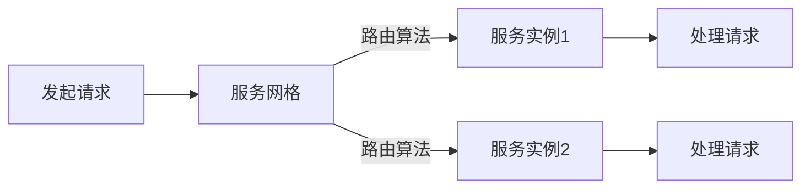
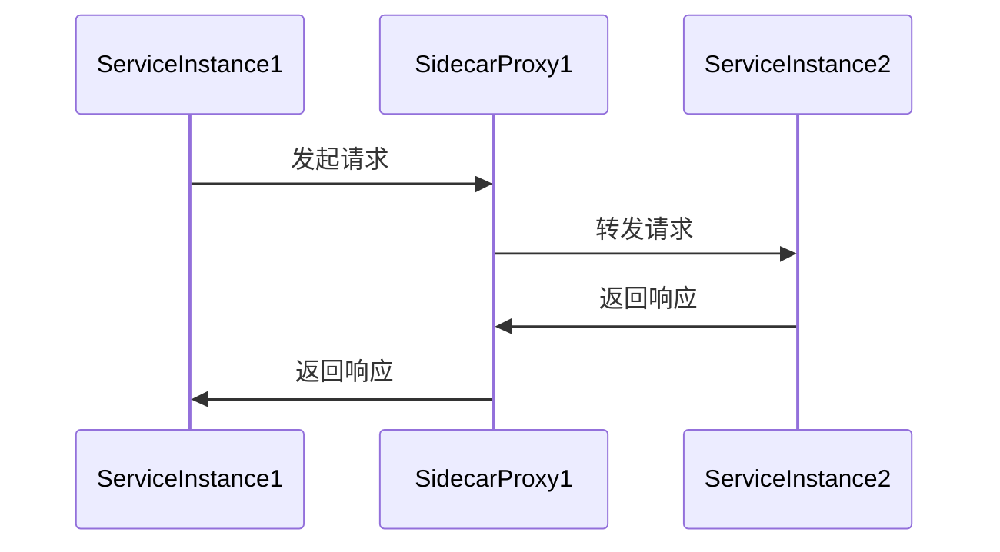
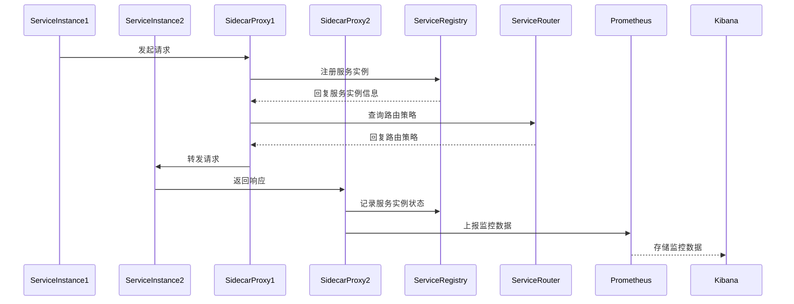

                 

### 1. 服务网格与LLM微服务架构概述

#### 1.1 服务网格的基本概念

服务网格（Service Mesh）是一种基础设施层的技术，用于管理和服务之间的通信。它起源于微服务架构，旨在解决在分布式系统中服务间通信的复杂性。服务网格通过将服务间的通信抽象化，使得开发者可以专注于业务逻辑，而无需关注通信细节。

服务网格的起源可以追溯到2016年，Google Cloud推出了Istio，这是第一个广泛使用的服务网格框架。随后，Linkerd和Conduit等开源项目也相继出现，为服务网格技术的发展奠定了基础。

服务网格的主要作用包括：

- **服务发现**：服务网格负责维护服务的位置信息和健康状态，使其他服务能够找到并调用它们。
- **服务间通信**：服务网格通过智能代理（通常称为边车代理）来管理服务之间的通信，提供负载均衡、故障转移等能力。
- **安全**：服务网格可以实现服务间通信的加密和身份验证，提高系统的安全性。
- **监控和日志**：服务网格可以收集服务间的通信日志和监控数据，为运维提供强大的诊断工具。

#### 1.2 LLM微服务架构的背景

LLM（Large Language Model）微服务架构是近年来在人工智能领域逐渐兴起的一种架构模式。它利用大型语言模型（如GPT-3、BERT等）提供的强大自然语言处理能力，构建复杂的自然语言处理系统。

微服务架构的核心思想是将大型单体应用分解为一系列独立的服务，每个服务负责特定的业务功能。这种架构模式具有以下几个特点：

- **独立部署**：每个微服务都可以独立部署和扩展，无需影响其他服务。
- **语言无关**：微服务可以使用不同的编程语言和框架来开发，提高了系统的灵活性和可维护性。
- **容器化**：微服务通常采用容器化技术（如Docker）进行部署，便于管理和扩展。
- **自动化**：微服务架构支持自动化部署、监控和扩展，降低了运维成本。

#### 1.3 LLM微服务架构的优势与挑战

LLM微服务架构具有以下优势：

- **可扩展性**：通过将大型的自然语言处理任务分解为多个微服务，可以轻松地横向扩展，提高系统的处理能力。
- **可维护性**：每个微服务都可以独立开发、测试和部署，降低了系统的复杂性，提高了维护效率。
- **灵活性**：使用不同的编程语言和框架来开发微服务，使得系统能够更好地适应不同的业务需求。

然而，LLM微服务架构也面临一些挑战：

- **通信复杂性**：在分布式系统中，微服务之间的通信可能变得复杂，需要使用服务网格等技术来管理。
- **数据一致性**：由于微服务独立部署，数据一致性可能成为问题，需要使用分布式事务处理技术来解决。
- **安全性**：微服务架构可能导致安全问题更加突出，需要采用适当的安全措施来保护系统。

#### 1.4 服务网格在LLM微服务架构中的应用价值

服务网格在LLM微服务架构中的应用价值主要体现在以下几个方面：

- **简化通信**：服务网格可以简化微服务之间的通信，提供负载均衡、故障转移等功能，提高系统的稳定性。
- **提高安全性**：服务网格可以提供加密和身份验证机制，确保服务间通信的安全性。
- **增强监控与诊断**：服务网格可以收集服务间的通信日志和监控数据，为运维提供强大的诊断工具，提高系统的可维护性。

总之，服务网格与LLM微服务架构的结合，可以有效地解决分布式系统中服务间通信的复杂性，提高系统的性能和安全性。

### 1.5 本章小结

本章介绍了服务网格和LLM微服务架构的基本概念、发展背景和各自的优势与挑战。通过理解这些概念，我们可以看到服务网格在LLM微服务架构中的应用价值，以及它如何帮助解决分布式系统中的通信复杂性、安全性和监控问题。在下一章中，我们将详细探讨服务网格的核心概念和与LLM微服务架构的联系。

## 2.1 服务网格的核心概念

### 2.1.1 服务网格的抽象模型

服务网格的抽象模型将服务之间的通信抽象为网络拓扑结构，每个节点代表一个服务实例，而边则代表服务实例之间的通信路径。这种抽象模型使得服务网格能够以统一的方式来管理和优化服务间通信。

服务网格的主要组件包括：

- **控制平面（Control Plane）**：控制平面负责管理服务网格的全局状态，包括服务发现、服务路由、负载均衡和监控等。控制平面通常由一组控制器（Controllers）和配置管理器（Config Managers）组成。
- **数据平面（Data Plane）**：数据平面负责处理实际的服务间通信，通常通过边车代理（Sidecar Proxies）来实现。边车代理位于服务实例旁边，负责转发和监控服务请求。
- **服务实例（Service Instances）**：服务实例是具体的服务实现，它们通过数据平面与控制平面交互，以获取路由规则和配置信息。

#### 2.1.2 服务网格的关键概念

1. **服务发现（Service Discovery）**：
   服务发现是指服务网格能够自动识别和注册服务实例，使得其他服务可以查找并访问这些服务。服务发现通常通过服务注册表（Service Registry）实现，服务实例在启动时会将自身的地址和端口号注册到服务注册表中。

2. **服务路由（Service Routing）**：
   服务路由是指服务网格根据预先定义的路由策略，将服务请求转发到合适的服务实例。常见的路由策略包括轮询负载均衡（Round Robin）、最小连接数负载均衡（Least Connections）等。

3. **负载均衡（Load Balancing）**：
   负载均衡是指服务网格通过分配请求到多个服务实例，以避免单个服务实例过载。负载均衡可以基于多种策略，如轮询、最少连接数、响应时间等。

4. **断路器（Circuit Breaker）**：
   断路器是一种故障处理机制，当服务实例不可用时，断路器可以自动阻止进一步的请求，以避免系统过载。断路器通常包括打开、关闭、半开三种状态。

5. **熔断（Outage）**：
   熔断是指服务网格在检测到大量服务请求失败时，自动停止向某个服务实例发送请求，以保护整个系统。熔断通常与断路器配合使用，提供更高级的故障处理能力。

6. **监控与日志（Monitoring and Logging）**：
   监控与日志是服务网格的重要组成部分，用于收集和分析服务实例的运行状态和通信数据。监控和日志数据可以为运维人员提供宝贵的诊断信息，帮助快速定位和解决问题。

#### 2.1.3 服务网格的核心架构组件

服务网格的核心架构组件包括：

1. **边车代理（Sidecar Proxy）**：
   边车代理是服务网格的数据平面组件，通常与服务实例部署在同一容器中。边车代理负责处理服务实例之间的通信，实现服务发现、服务路由、负载均衡等功能。

2. **控制平面（Control Plane）**：
   控制平面是服务网格的管理中心，负责管理和配置数据平面组件。控制平面通常由多个控制模块组成，如服务注册表、路由控制模块、监控模块等。

3. **服务实例（Service Instances）**：
   服务实例是实现具体业务逻辑的服务组件，通过数据平面与控制平面交互，获取路由规则和配置信息。

4. **服务发现组件（Service Discovery Components）**：
   服务发现组件负责自动识别和注册服务实例，通常通过服务注册表实现。服务注册表记录了服务实例的地址和端口号，供其他服务实例查找和使用。

5. **路由控制模块（Routing Control Module）**：
   路由控制模块负责根据预定义的路由策略，将服务请求转发到合适的服务实例。路由控制模块通常与负载均衡策略结合使用，以实现高效的服务发现和请求转发。

6. **监控模块（Monitoring Module）**：
   监控模块负责收集和分析服务实例的运行状态和通信数据，提供监控指标和报警功能。监控模块通常与日志模块结合使用，以实现全面的系统监控和故障诊断。

#### 2.1.4 服务网格的优势与特点

服务网格具有以下优势与特点：

1. **简化通信**：
   服务网格通过抽象化服务间的通信，减少了服务实例之间的直接交互，使得服务架构更加清晰和易于管理。

2. **高可扩展性**：
   服务网格支持灵活的服务实例部署和扩展，可以根据实际需求动态调整服务实例的数量和配置。

3. **高可靠性**：
   服务网格提供负载均衡、断路器、熔断等机制，提高了系统的可靠性和容错能力。

4. **安全性**：
   服务网格可以通过加密、身份验证等机制，确保服务实例之间的通信安全性。

5. **可监控性**：
   服务网格提供全面的监控和日志功能，帮助运维人员实时掌握系统运行状态，快速定位和解决问题。

#### 2.1.5 服务网格与LLM微服务架构的联系

服务网格与LLM微服务架构之间有着紧密的联系。LLM微服务架构通常采用分布式系统架构，服务实例可能分布在不同的物理服务器或云服务器上，而服务网格则负责管理这些服务实例之间的通信。服务网格可以为LLM微服务架构提供以下支持：

1. **服务发现与路由**：
   服务网格可以自动发现和注册LLM微服务实例，并提供高效的路由策略，确保服务请求能够快速、准确地转发到目标服务实例。

2. **负载均衡与容错**：
   服务网格通过负载均衡和断路器等机制，提高LLM微服务架构的容错能力和响应速度。

3. **安全性保障**：
   服务网格可以提供加密、身份验证等安全机制，确保LLM微服务实例之间的通信安全性。

4. **监控与日志**：
   服务网格可以收集LLM微服务实例的通信日志和监控数据，帮助运维人员实时掌握系统运行状态，快速定位和解决问题。

总之，服务网格是LLM微服务架构的重要组成部分，它为分布式系统提供了高效、可靠、安全的通信基础，是构建现代云计算应用程序的关键技术之一。

### 2.2 服务网格与LLM微服务架构的联系

#### 2.2.1 服务网格与微服务架构的对比

服务网格和微服务架构虽然紧密相关，但它们在概念和实现上有着明显的区别。首先，从概念上看，服务网格是微服务架构中的一种基础设施层技术，专注于服务间的通信管理，而微服务架构则是一种应用架构模式，强调将大型单体应用分解为多个独立的、可协作的服务实例。

1. **服务网格**：
   - **定位**：服务网格是一种基础设施层的技术，负责管理服务实例之间的通信。
   - **目标**：提供高效、可靠、安全的通信机制，简化服务间通信的复杂性。
   - **组件**：包括控制平面（如Istio的控制平面组件）、数据平面（如边车代理）等。

2. **微服务架构**：
   - **定位**：微服务架构是一种应用层架构模式，用于构建分布式系统。
   - **目标**：实现应用模块的独立部署、扩展和维护，提高系统的灵活性和可维护性。
   - **组件**：包括服务实例（如API网关、业务服务、数据服务）等。

#### 2.2.2 服务网格在LLM微服务架构中的适用性

服务网格在LLM微服务架构中的适用性体现在以下几个方面：

1. **服务发现与路由**：
   在LLM微服务架构中，服务实例可能会部署在不同的服务器或云区域，服务网格能够自动发现和注册这些实例，并提供高效的负载均衡和路由策略，确保服务请求能够快速、准确地转发到目标实例。

2. **负载均衡与容错**：
   LLM微服务架构中的服务实例可能会面临高并发请求和故障风险，服务网格通过负载均衡和断路器等机制，可以提高系统的容错能力和响应速度，确保服务的连续性和稳定性。

3. **安全性保障**：
   服务网格可以提供加密、身份验证等安全机制，确保LLM微服务实例之间的通信安全性，防止数据泄露和未经授权的访问。

4. **监控与日志**：
   服务网格可以收集LLM微服务实例的通信日志和监控数据，帮助运维人员实时掌握系统运行状态，快速定位和解决问题，提高系统的可维护性。

#### 2.2.3 服务网格与LLM微服务架构的协同作用

服务网格与LLM微服务架构的协同作用，使得整个系统在功能性和性能方面得到了显著提升：

1. **功能性的提升**：
   - **服务自治**：服务网格使得每个LLM微服务实例可以独立运行、部署和扩展，提高了系统的灵活性和可维护性。
   - **服务协作**：服务网格通过高效的路由和负载均衡机制，确保LLM微服务实例之间的协作和协调，提高了系统的整体性能。

2. **性能的提升**：
   - **低延迟**：服务网格通过优化服务间的通信路径，减少了请求的传输延迟，提高了系统的响应速度。
   - **高吞吐量**：服务网格支持动态负载均衡和故障转移，确保了系统在高并发请求下的稳定性和高性能。

3. **可靠性和安全性的提升**：
   - **故障恢复**：服务网格通过断路器和熔断机制，确保了系统的可靠性和稳定性，减少了服务故障对整体系统的影响。
   - **数据安全**：服务网格提供了加密和身份验证机制，确保了服务间通信的安全性，保护了敏感数据不被泄露。

总之，服务网格在LLM微服务架构中的应用，不仅解决了服务间通信的复杂性，还提高了系统的性能、可靠性和安全性，为构建高效、可扩展的分布式系统提供了有力支持。

### 2.3 服务网格的ER实体关系图

为了更好地理解服务网格的核心概念和组件，我们可以使用ER（Entity-Relationship）图来展示实体之间的关系。ER图是数据库设计中的重要工具，它通过实体、属性和关系的图形化表示，帮助我们直观地理解系统的结构。

以下是一个简化的服务网格ER实体关系图，展示了主要实体及其关系：

```mermaid
erDiagram
  ServiceMesh ||--|{ EntityA : 实体A }
  ServiceMesh ||--|{ EntityB : 实体B }
  ServiceMesh ||--|{ EntityC : 实体C }
  EntityA ||--|{ AttributeX : 属性X }
  EntityA ||--|{ AttributeY : 属性Y }
  EntityB ||--|{ AttributeZ : 属性Z }
  EntityC ||--|{ AttributeW : 属性W }
  EntityA ..|.. EntityB : 关联关系1
  EntityB ..|.. EntityC : 关联关系2
```

在这个ER图中：

- **ServiceMesh**：表示服务网格的整体结构，它是实体关系的容器。
- **EntityA**、**EntityB**、**EntityC**：表示服务网格中的主要实体，如服务实例、边车代理、控制平面组件等。
- **AttributeX**、**AttributeY**、**AttributeZ**、**AttributeW**：表示实体的属性，如服务实例的IP地址、端口号、状态等。
- **关联关系1**、**关联关系2**：表示实体之间的关系，如服务实例与边车代理之间的关联，控制平面与数据平面之间的关联。

通过ER图，我们可以清晰地看到服务网格中各实体及其属性的关系，有助于理解服务网格的整体架构和功能。

### 2.4 本章小结

本章详细介绍了服务网格的核心概念和关键组件，包括服务网格的抽象模型、服务发现、服务路由、负载均衡、断路器等。同时，我们通过ER图展示了服务网格中的实体关系。此外，我们还对比了服务网格与微服务架构，探讨了服务网格在LLM微服务架构中的适用性和协同作用。通过本章的学习，读者可以深入理解服务网格的工作原理和其在分布式系统中的应用价值。在下一章中，我们将进一步讲解服务网格在LLM微服务架构中的具体算法原理。

### 3.1 服务网格的关键算法

在服务网格的架构中，关键算法起到了至关重要的作用，它们确保了服务间通信的高效性和可靠性。以下将详细介绍服务网格中的几个关键算法：服务网格路由算法、服务网格安全算法以及服务网格监控与诊断算法。

#### 3.1.1 服务网格路由算法

服务网格路由算法是服务网格的核心功能之一，它决定了服务请求如何被转发到目标服务实例。以下是几种常见的服务网格路由算法：

1. **基于轮询的路由算法（Round Robin）**：
   轮询路由算法是最简单的一种路由策略，它按照固定的顺序轮流将请求转发到各个服务实例。这种方式简单易实现，但可能导致某些服务实例负载不均衡。

   ```mermaid
   flowchart LR
       A[发起请求] --> B[轮询算法]
       B -->|转发请求| C[服务实例1]
       C --> D[处理请求]
       B -->|转发请求| E[服务实例2]
       E --> F[处理请求]
   ```

2. **基于最少连接数的路由算法（Least Connections）**：
   最少连接数路由算法根据当前服务实例的连接数来决定请求的转发目标。连接数较少的服务实例会优先接收新的请求，以实现负载均衡。

   ```mermaid
   flowchart LR
       A[发起请求] --> B[最少连接数算法]
       B -->|转发请求| C[服务实例1](连接数:3)
       C --> D[处理请求]
       B -->|转发请求| E[服务实例2](连接数:1)
       E --> F[处理请求]
   ```

3. **基于响应时间的路由算法（Least Response Time）**：
   基于响应时间的路由算法根据服务实例的响应时间来决定请求的转发目标。响应时间较短的服务实例会优先接收请求，以提高系统的整体性能。

   ```mermaid
   flowchart LR
       A[发起请求] --> B[响应时间算法]
       B -->|转发请求| C[服务实例1](响应时间:100ms)
       C --> D[处理请求]
       B -->|转发请求| E[服务实例2](响应时间:200ms)
       E --> F[处理请求]
   ```

这些路由算法可以通过服务网格的控制平面进行动态配置，以适应不同的负载情况和性能需求。

#### 3.1.2 服务网格安全算法

服务网格安全算法旨在确保服务间通信的安全性，防止未经授权的访问和数据泄露。以下是几种常见的服务网格安全算法：

1. **基于密钥的认证算法（TLS证书）**：
   TLS（传输层安全）证书是一种常用的认证机制，它通过证书来验证服务实例的身份。服务实例在通信时会使用证书进行加密，确保数据传输的安全性。

   ```python
   import ssl
   import socket

   # 创建一个套接字
   sock = socket.socket(socket.AF_INET, socket.SOCK_STREAM)

   # 使用TLS证书进行加密
   context = ssl.SSLContext(ssl.PROTOCOL_TLSv1_2)
   context.load_cert_chain(certfile="server.crt", keyfile="server.key")

   # 监听端口
   sock.bind(('localhost', 443))
   sock.listen(5)

   # 启动TLS加密
   sock = context.wrap_socket(sock, server_side=True)

   # 接受客户端连接
   client_socket, client_address = sock.accept()
   print(f"Accepted connection from {client_address}")

   # 进行通信
   while True:
       data = client_socket.recv(1024)
       if not data:
           break
       client_socket.sendall(data)
   ```

2. **基于角色的访问控制算法（RBAC）**：
   基于角色的访问控制（RBAC）算法通过角色和权限来限制服务实例的访问权限。每个服务实例都被分配一个或多个角色，只有具有相应角色的服务实例才能访问特定的服务。

   ```python
   # 假设有一个服务访问控制列表
   access_control_list = {
       "admin": ["service1", "service2", "service3"],
       "user": ["service1", "service4"],
       "guest": ["service1"]
   }

   # 检查服务实例的访问权限
   def check_access_role(service_name, role):
       if role in access_control_list:
           if service_name in access_control_list[role]:
               return True
       return False

   # 示例：检查服务实例是否具有访问"service2"的权限
   role = "admin"
   service_name = "service2"
   if check_access_role(service_name, role):
       print(f"{role} has access to {service_name}")
   else:
       print(f"{role} does not have access to {service_name}")
   ```

3. **基于行为的访问控制算法（ABAC）**：
   基于行为的访问控制（ABAC）算法根据服务实例的行为模式来决定访问权限。例如，如果某个服务实例在短时间内进行了大量异常请求，系统可以拒绝其访问。

   ```python
   # 假设有一个服务访问行为监测系统
   access_behavior_list = {
       "service1": ["合法请求", "非法请求"],
       "service2": ["合法请求", "非法请求", "可疑请求"],
       "service3": ["合法请求"]
   }

   # 检查服务实例的行为模式
   def check_access_behavior(service_name, behavior):
       if service_name in access_behavior_list:
           if behavior in access_behavior_list[service_name]:
               return True
       return False

   # 示例：检查服务实例的行为模式是否包含"可疑请求"
   service_name = "service2"
   behavior = "可疑请求"
   if check_access_behavior(service_name, behavior):
       print(f"{service_name} has suspicious behavior")
   else:
       print(f"{service_name} does not have suspicious behavior")
   ```

这些安全算法可以结合使用，以提供多层次的安全保障。

#### 3.1.3 服务网格监控与诊断算法

服务网格监控与诊断算法用于收集和分析服务网格的运行数据，帮助运维人员及时发现和解决问题。以下是几种常见的监控与诊断算法：

1. **基于指标的监控算法**：
   基于指标的监控算法通过收集服务实例的性能指标（如CPU使用率、内存使用率、响应时间等）来评估系统的健康状况。这些指标可以通过Prometheus等监控工具进行收集和存储。

   ```mermaid
   graph TD
       A[服务实例] --> B[监控指标收集]
       B --> C[Prometheus]
       C --> D[报警系统]
   ```

2. **基于日志的监控算法**：
   基于日志的监控算法通过收集服务实例的日志数据来识别异常行为和潜在问题。日志数据可以通过ELK（Elasticsearch、Logstash、Kibana）堆栈进行集中管理和分析。

   ```mermaid
   graph TD
       A[服务实例] --> B[日志生成]
       B --> C[Logstash]
       C --> D[Elasticsearch]
       D --> E[Kibana]
   ```

3. **基于流量的监控算法**：
   基于流量的监控算法通过分析服务网格中的流量模式来识别潜在问题。例如，可以使用Spark等大数据处理工具对服务网格的流量数据进行实时分析和处理。

   ```mermaid
   graph TD
       A[服务实例] --> B[流量数据收集]
       B --> C[Spark]
       C --> D[数据分析]
   ```

这些监控与诊断算法可以提供全面的系统监控和故障诊断能力，帮助运维人员快速定位和解决问题。

### 3.2 算法mermaid流程图

为了更直观地展示上述算法的工作流程，我们可以使用mermaid流程图来描述。以下是服务网格路由算法、安全算法和监控与诊断算法的mermaid流程图示例。

#### 3.2.1 服务网格路由算法mermaid流程图



#### 3.2.2 服务网格安全算法mermaid流程图


#### 3.2.3 服务网格监控与诊断算法mermaid流程图


通过这些mermaid流程图，我们可以清晰地看到各个算法的执行过程和流程中的关键节点，有助于理解服务网格的工作原理和算法设计。

### 3.3 算法原理讲解

在深入理解服务网格的关键算法之前，我们需要先明确几个核心概念和数学模型。以下是几个关键算法的详细原理讲解，以及相关的数学模型和公式。

#### 3.3.1 服务网格路由算法原理讲解

服务网格路由算法的核心任务是确定服务请求应该被转发到哪个服务实例。这一过程涉及到多个路由策略，以下是一个基于加权最小连接数路由算法的详细解释。

1. **加权最小连接数路由算法**：
   加权最小连接数路由算法是一种基于服务实例当前连接数和权重值来决定路由策略的算法。其基本原理是选择当前连接数最小且权重值最高的服务实例。

   **数学模型**：
   假设服务网格中有N个服务实例，每个服务实例的连接数为`conn[i]`，权重值为`weight[i]`。路由算法的目标是最小化加权连接数，即：
   $$ \text{minimize} \sum_{i=1}^{N} (conn[i] \times weight[i]) $$

   **公式**：
   对于每个服务实例`i`，其路由权重计算公式为：
   $$ \text{weight}[i] = \frac{\text{max_connection}}{conn[i] + \text{max_connection}} $$
   其中，`max_connection`是服务实例的最大连接数。

2. **算法步骤**：
   - 计算每个服务实例的权重值。
   - 根据当前连接数和权重值，选择权重值最高的服务实例。

   **举例说明**：
   假设服务网格中有3个服务实例，连接数分别为`conn[1]=2`，`conn[2]=3`，`conn[3]=1`，最大连接数`max_connection`=5。计算每个服务实例的权重值：
   $$ \text{weight}[1] = \frac{5}{2+5} = 0.6 $$
   $$ \text{weight}[2] = \frac{5}{3+5} = 0.4 $$
   $$ \text{weight}[3] = \frac{5}{1+5} = 0.8 $$

   选择权重值最高的服务实例，即连接数为1的服务实例3。

3. **mermaid流程图**：
   ```mermaid
   flowchart LR
       A[发起请求] --> B[计算权重]
       B --> C[选择实例]
       C --> D[转发请求]
       D --> E[返回结果]
   ```

#### 3.3.2 服务网格安全算法原理讲解

服务网格安全算法旨在确保服务实例之间的通信安全，防止未经授权的访问和数据泄露。以下是几种常见的安全算法及其原理讲解。

1. **基于密钥的认证算法（TLS证书）**：
   TLS证书是一种基于公钥加密技术的认证机制，通过证书来验证服务实例的身份。其工作原理如下：

   **数学模型**：
   - **公钥加密**：使用服务实例的公钥加密数据，确保数据在传输过程中不会被窃取。
   - **证书验证**：服务实例使用证书链来验证请求方的身份，确保通信双方身份的真实性。

   **公式**：
   - **加密公式**：\( C = E_{pub}(M) \)
   - **解密公式**：\( M = D_{priv}(C) \)

   其中，`C`是加密后的数据，`M`是原始数据，`pub`和`priv`分别表示公钥和私钥。

   **算法步骤**：
   - 服务实例生成一对公钥和私钥。
   - 服务实例将公钥上传到证书颁发机构，生成证书。
   - 通信时，服务实例使用公钥加密数据，私钥解密数据。

2. **基于角色的访问控制算法（RBAC）**：
   RBAC通过角色和权限来限制服务实例的访问权限。其基本原理是，每个服务实例被分配一个或多个角色，只有具有相应角色的服务实例才能访问特定的资源。

   **数学模型**：
   - **角色分配**：将服务实例分配到不同的角色集合。
   - **权限管理**：定义角色的访问权限，确保服务实例只能访问授权的资源。

   **公式**：
   - **角色集合**：\( R = \{ r_1, r_2, ..., r_n \} \)
   - **权限集合**：\( P = \{ p_1, p_2, ..., p_m \} \)
   - **角色-权限关系**：\( R \times P \)

   **算法步骤**：
   - 定义角色和权限。
   - 分配服务实例到角色。
   - 根据角色的权限集，决定服务实例的访问权限。

3. **基于行为的访问控制算法（ABAC）**：
   ABAC通过分析服务实例的行为模式来决定访问权限。其基本原理是，根据服务实例的历史行为模式，判断其当前的访问请求是否合理。

   **数学模型**：
   - **行为分析**：分析服务实例的行为特征，如请求频率、请求类型等。
   - **行为模型**：建立行为模型，定义正常行为和异常行为。

   **公式**：
   - **行为特征**：\( F = \{ f_1, f_2, ..., f_k \} \)
   - **行为模型**：\( M = \{ m_1, m_2, ..., m_l \} \)
   - **行为评估**：\( \text{evaluate}(F, M) \)

   **算法步骤**：
   - 收集服务实例的行为数据。
   - 建立行为模型。
   - 根据行为模型评估服务实例的行为。

4. **mermaid流程图**：
   ```mermaid
   flowchart LR
       A[服务实例请求] --> B[认证机制]
       B -->|身份验证| C[认证成功]
       C --> D[访问控制]
       D -->|权限验证| E[权限确认]
       E --> F[返回结果]
   ```

#### 3.3.3 服务网格监控与诊断算法原理讲解

服务网格监控与诊断算法用于收集和分析服务网格的运行数据，以发现潜在问题和故障。以下是几种常见的监控与诊断算法及其原理讲解。

1. **基于指标的监控算法**：
   基于指标的监控算法通过收集服务实例的性能指标来评估系统的健康状况。常见的指标包括CPU使用率、内存使用率、响应时间等。

   **数学模型**：
   - **性能指标**：\( I = \{ i_1, i_2, ..., i_n \} \)
   - **阈值**：\( T = \{ t_1, t_2, ..., t_m \} \)

   **公式**：
   - **指标计算**：\( I_i = \text{calculate\_metric}(i_i) \)
   - **阈值判断**：\( \text{evaluate}(I_i, T) \)

   **算法步骤**：
   - 收集性能指标。
   - 与阈值进行比较。
   - 根据比较结果触发报警。

2. **基于日志的监控算法**：
   基于日志的监控算法通过分析服务实例的日志数据来识别异常行为和潜在问题。日志数据通常包含详细的系统运行记录，如请求、响应、错误等。

   **数学模型**：
   - **日志数据**：\( L = \{ l_1, l_2, ..., l_k \} \)
   - **日志模式**：\( P = \{ p_1, p_2, ..., p_m \} \)

   **公式**：
   - **日志匹配**：\( \text{match}(L, P) \)

   **算法步骤**：
   - 收集日志数据。
   - 与日志模式进行比较。
   - 根据匹配结果识别异常行为。

3. **基于流量的监控算法**：
   基于流量的监控算法通过分析服务网格中的流量模式来识别潜在问题。流量数据通常包含服务实例之间的通信频率、带宽等指标。

   **数学模型**：
   - **流量数据**：\( T = \{ t_1, t_2, ..., t_n \} \)
   - **流量模式**：\( M = \{ m_1, m_2, ..., m_l \} \)

   **公式**：
   - **流量分析**：\( \text{analyze}(T, M) \)

   **算法步骤**：
   - 收集流量数据。
   - 分析流量模式。
   - 根据分析结果识别流量异常。

4. **mermaid流程图**：
   ```mermaid
   flowchart LR
       A[服务实例运行] --> B[日志生成]
       B --> C[日志分析]
       C --> D[指标计算]
       D --> E[阈值判断]
       E --> F[报警触发]
   ```

通过以上算法原理的详细讲解，我们可以看到服务网格在路由、安全和监控方面的核心机制和数学模型。这些算法不仅保证了服务网格的高效运行和可靠性，也为分布式系统的运维提供了强大的支持。

### 3.4 本章小结

本章详细介绍了服务网格中的关键算法，包括路由算法、安全算法和监控与诊断算法。通过具体的数学模型和mermaid流程图，我们深入理解了这些算法的原理和实现方式。路由算法确保了服务请求的高效转发，安全算法保障了服务间通信的安全性，监控与诊断算法则提供了强大的系统监控和故障诊断能力。这些算法共同构成了服务网格的核心功能，为分布式系统提供了可靠、高效和安全的通信基础。在下一章中，我们将进一步探讨如何设计和实现服务网格在LLM微服务架构中的应用系统。

### 4.1 系统分析与架构设计方案

#### 4.1.1 问题描述

在LLM微服务架构中，随着服务数量的增加和分布式系统的复杂性提升，传统的服务间通信和协调机制变得难以维护。为了解决这一问题，我们需要设计和实现一个服务网格系统，以提供高效、可靠和安全的通信机制。

具体来说，该系统需要实现以下功能：

- **服务发现**：自动发现和注册服务实例，确保其他服务能够查找和访问这些实例。
- **服务路由**：根据预先定义的路由策略，将服务请求转发到合适的服务实例。
- **负载均衡**：在多个服务实例之间分配请求，以避免单个实例过载。
- **安全保护**：确保服务间通信的安全性，通过加密、身份验证等机制防止数据泄露和未经授权的访问。
- **监控与日志**：收集服务实例的运行状态和通信数据，为运维提供监控和故障诊断工具。

#### 4.1.2 项目介绍

为了实现上述功能，我们将构建一个基于Istio的服务网格系统。Istio是一个开源的服务网格平台，提供丰富的功能模块，包括服务发现、服务路由、负载均衡、安全保护、监控和日志等。

本项目的目标是通过使用Istio，设计并实现一个适用于LLM微服务架构的服务网格系统。具体实现环境包括Kubernetes集群、Istio控制平面和边车代理等组件。以下是项目的目标和实现环境：

1. **项目目标**：
   - 设计并实现一个高效、可靠、安全的服务网格系统。
   - 确保服务网格系统能够与现有的LLM微服务架构无缝集成。
   - 提供全面的监控和日志功能，以便运维人员能够实时掌握系统运行状态。

2. **实现环境**：
   - Kubernetes集群：用于部署和管理服务实例。
   - Istio控制平面：负责管理服务网格的全局状态，包括服务发现、路由策略等。
   - 边车代理：部署在服务实例旁边，负责处理服务间通信。

#### 4.1.3 系统功能设计

服务网格系统的主要功能模块包括：

1. **服务发现模块**：
   服务发现模块负责自动发现和注册服务实例，并将其信息存储在服务注册表中。其他服务实例可以通过服务注册表查找和访问这些实例。

2. **服务路由模块**：
   服务路由模块根据预定义的路由策略，将服务请求转发到合适的服务实例。路由策略可以是轮询、最少连接数、响应时间等。

3. **负载均衡模块**：
   负载均衡模块在多个服务实例之间分配请求，以避免单个实例过载。负载均衡策略可以根据实际需求进行配置。

4. **安全模块**：
   安全模块通过加密、身份验证等机制，确保服务间通信的安全性。服务实例之间的通信会使用TLS加密，同时通过RBAC实现权限控制。

5. **监控与日志模块**：
   监控与日志模块负责收集服务实例的运行状态和通信数据。使用Prometheus和Kibana进行监控数据的收集、存储和展示，使用ELK（Elasticsearch、Logstash、Kibana）堆栈进行日志数据的收集、存储和查询。

#### 4.1.4 领域模型mermaid类图

为了更好地展示服务网格系统的功能模块及其关系，我们使用mermaid类图来描述系统的领域模型。以下是一个简化的mermaid类图示例：

```mermaid
classDiagram
    ServiceDiscovery <<interface>>
    ServiceRouting <<interface>>
    LoadBalancer <<interface>>
    Security <<interface>>
    Monitoring <<interface>>

    ServiceMesh <.. ServiceDiscovery
    ServiceMesh <.. ServiceRouting
    ServiceMesh <.. LoadBalancer
    ServiceMesh <.. Security
    ServiceMesh <.. Monitoring

    class ServiceInstance {
        - String id
        - String address
        - String port
    }

    class ServiceRegistry {
        - List<ServiceInstance> serviceInstances
    }

    ServiceDiscovery <|.. ServiceRegistry
    ServiceRouting <|.. ServiceRegistry
    LoadBalancer <|.. ServiceRegistry
    Security <|.. ServiceRegistry
    Monitoring <|.. ServiceRegistry
```

在这个类图中：

- `ServiceDiscovery`、`ServiceRouting`、`LoadBalancer`、`Security`、`Monitoring` 表示系统的功能模块。
- `ServiceInstance` 表示服务实例。
- `ServiceRegistry` 表示服务注册表。

通过这个类图，我们可以清晰地看到服务网格系统的功能模块及其之间的关系，有助于理解系统的整体架构和实现细节。

### 4.2 系统架构设计

#### 4.2.1 系统架构概述

为了实现服务网格系统在LLM微服务架构中的高效运行，我们采用了一种分布式架构设计。该架构包括控制平面、数据平面和监控平面三大部分，各部分通过紧密的协同工作，共同实现了服务发现、路由、负载均衡、安全保护、监控与日志等核心功能。

1. **控制平面（Control Plane）**：
   控制平面是服务网格系统的管理核心，负责管理整个系统的全局状态。它通常由多个控制模块组成，包括服务注册表、路由控制模块、配置管理模块等。控制平面通过API与数据平面交互，动态地更新路由策略和配置信息。

2. **数据平面（Data Plane）**：
   数据平面是服务网格系统的通信核心，负责处理实际的服务间通信。数据平面通常通过边车代理（Sidecar Proxy）来实现，每个服务实例旁边都会部署一个边车代理，负责代理服务实例之间的通信。边车代理根据控制平面提供的路由策略和配置信息，将服务请求转发到目标服务实例。

3. **监控平面（Monitoring Plane）**：
   监控平面负责收集和分析服务网格系统的运行数据，提供实时的监控和日志分析功能。监控平面通常使用Prometheus和Kibana等工具，实时监控系统的性能指标和日志数据，并通过报警机制及时通知运维人员。

#### 4.2.2 系统架构mermaid架构图

为了更好地展示服务网格系统的架构设计，我们使用mermaid架构图来描述系统组件及其交互关系。以下是一个简化的mermaid架构图示例：

```mermaid
graph TB
    subgraph ControlPlane
        A[ServiceRegistry] --> B[ServiceDiscovery]
        B --> C[ServiceRouter]
        C --> D[PolicyController]
        D --> E[ConfigurationController]
    end

    subgraph DataPlane
        F[ServiceInstance1] --> G[SidecarProxy1]
        G --> H[ServiceInstance2]
        H --> I[SidecarProxy2]
    end

    subgraph MonitoringPlane
        J[Prometheus] --> K[Kibana]
    end

    A --> B
    B --> C
    C --> D
    D --> E

    F --> G
    G --> H
    H --> I

    J --> K
```



在这个架构图中：

- **ControlPlane**：包括服务注册表、服务发现模块、服务路由模块、策略控制器和配置控制器。
- **DataPlane**：包括服务实例和边车代理。
- **MonitoringPlane**：包括Prometheus和Kibana。

通过这个mermaid架构图，我们可以清晰地看到服务网格系统的各个组件及其交互关系，有助于理解系统的整体架构和实现细节。

### 4.3 系统接口设计

#### 4.3.1 接口设计原则

在服务网格系统的接口设计中，我们遵循以下原则，以确保接口的灵活性和可扩展性：

1. **RESTful API设计**：
   采用RESTful风格设计API接口，以提供简洁、统一的接口规范。每个API接口应具备完整的HTTP方法（GET、POST、PUT、DELETE），并使用标准化的URL路径表示资源。

2. **服务自治**：
   接口设计应支持服务实例的独立部署和扩展，确保每个服务实例都可以独立接收和处理请求，而不依赖于其他服务实例。

3. **可扩展性**：
   接口设计应考虑未来可能的需求变化，预留足够的扩展点，以支持新功能模块的添加。

4. **安全性**：
   在接口设计中，应集成安全机制，如加密、身份验证和权限控制，确保数据传输和访问的安全性。

#### 4.3.2 系统接口mermaid序列图

为了更好地展示服务网格系统的接口设计，我们使用mermaid序列图来描述服务实例和边车代理之间的交互过程。以下是一个简化的mermaid序列图示例：



在这个序列图中：

- `ServiceInstance1`：发起请求的服务实例。
- `SidecarProxy1`：代理服务实例1和2之间通信的边车代理。
- `ServiceInstance2`：接收和处理请求的服务实例。

通过这个mermaid序列图，我们可以清晰地看到服务网格系统的接口设计，以及服务实例和边车代理之间的交互过程。

### 4.4 系统交互mermaid序列图

为了进一步展示服务网格系统中各组件的交互过程，我们使用mermaid序列图来描述服务实例、边车代理、控制平面和监控平面之间的通信流程。以下是一个简化的mermaid序列图示例：



在这个序列图中：

- `ServiceInstance1` 和 `ServiceInstance2`：表示发起请求和处理请求的服务实例。
- `SidecarProxy1` 和 `SidecarProxy2`：表示代理服务实例之间通信的边车代理。
- `ServiceRegistry`：表示服务注册表，用于存储服务实例的信息。
- `ServiceRouter`：表示服务路由控制模块，用于查询和提供路由策略。
- `Prometheus`：表示监控数据收集器，用于收集和存储监控数据。
- `Kibana`：表示监控数据可视化工具，用于展示监控数据。

通过这个mermaid序列图，我们可以清晰地看到服务网格系统中各组件的交互过程，以及服务实例、边车代理、控制平面和监控平面之间的通信关系。

### 4.5 本章小结

本章详细介绍了服务网格在LLM微服务架构中的应用系统设计与架构方案。首先，我们分析了系统需求，明确了服务网格系统所需实现的功能。然后，我们介绍了项目背景和实现环境，并详细设计了系统的功能模块。接着，我们通过mermaid类图、架构图、序列图等工具，展示了系统的架构设计和接口设计。通过本章的学习，读者可以深入理解服务网格系统在LLM微服务架构中的应用场景和实现方法。在下一章中，我们将通过实际案例来展示如何安装和配置服务网格系统。

### 5.1 环境安装

为了在实际环境中安装并配置服务网格系统，我们需要进行一系列的准备工作，包括安装Kubernetes集群、Istio控制平面和边车代理。以下是具体的安装步骤和遇到问题的解决方法。

#### 5.1.1 安装准备

在开始安装之前，我们需要确保以下环境已经准备好：

1. **操作系统**：推荐使用CentOS 7或更高版本，或其他兼容Linux发行版。
2. **Docker**：版本建议为19.03或更高。
3. **Kubeadm**：版本建议为1.21或更高。
4. **Kubelet**：版本建议与Kubeadm相匹配。
5. **Kubectl**：版本建议与Kubeadm和Kubelet相匹配。

#### 5.1.2 安装步骤

1. **安装Docker**：

   首先更新系统包列表：

   ```bash
   sudo yum update -y
   ```

   安装Docker：

   ```bash
   sudo yum install -y docker
   ```

   启动Docker服务并设置开机启动：

   ```bash
   sudo systemctl start docker
   sudo systemctl enable docker
   ```

2. **安装Kubeadm、Kubelet和Kubectl**：

   添加Kubernetes的yum仓库：

   ```bash
   cat <<EOF | sudo tee /etc/yum.repos.d/kubernetes.repo
   [kubernetes]
   name=Kubernetes
   baseurl=https://mirrors.aliyun.com/kubernetes/yum/repos/kubernetes-el7-x86_64/
   enabled=1
   gpgcheck=1
   repo_gpgcheck=1
   gpgkey=https://mirrors.aliyun.com/kubernetes/yum/doc/yum-key.txt https://mirrors.aliyun.com/kubernetes/yum/doc/rpm-package-key.gpg
   EOF
   ```

   安装Kubeadm、Kubelet和Kubectl：

   ```bash
   sudo yum install -y kubelet kubeadm kubectl
   ```

   启动Kubelet服务并设置开机启动：

   ```bash
   sudo systemctl start kubelet
   sudo systemctl enable kubelet
   ```

3. **初始化Kubernetes集群**：

   使用kubeadm初始化集群：

   ```bash
   sudo kubeadm init --pod-network-cidr=10.244.0.0/16
   ```

   记录下`kubeadm join`命令的输出，稍后用于将节点加入集群。

4. **安装Pod网络插件**：

   选择一个Pod网络插件进行安装。这里我们使用Calico：

   ```bash
   kubectl apply -f https://docs.projectcalico.org/manifests/calico.yaml
   ```

5. **将工作节点加入集群**：

   对于每个工作节点，执行以下命令：

   ```bash
   sudo kubeadm join <集群地址>:<端口> --token <token> --discovery-token-ca-cert-hash sha256:<hash>
   ```

   其中，`<集群地址>`、`<端口>`、`<token>`和`<hash>`分别为kubeadm init命令输出的相关信息。

6. **安装Istio**：

   下载Istio安装文件：

   ```bash
   curl -L https://istio.io/downloadIstio | ISTIO_VERSION=1.10.3 TARGET_ARCH=linux/download
   ```

   解压安装文件：

   ```bash
   tar zxvf istio-1.10.3-linux.tar.gz
   ```

   进入Istio安装目录：

   ```bash
   cd istio-1.10.3
   ```

   部署Istio控制平面：

   ```bash
   istioctl install --set profile=demo
   ```

   部署Istio边车代理：

   ```bash
   kubectl apply -f samples/bookinfo/networking/istio-bookinfo.yaml
   ```

#### 5.1.3 遇到问题的解决方法

1. **Docker服务启动失败**：

   如果Docker服务启动失败，可以尝试以下方法：

   - 检查Docker服务状态：

     ```bash
     sudo systemctl status docker
     ```

   - 查看Docker的日志：

     ```bash
     sudo journalctl -u docker.service
     ```

   - 检查Docker的存储卷是否正确挂载：

     ```bash
     docker volume ls
     ```

   - 如果Docker无法启动，可以尝试重启Docker守护进程：

     ```bash
     sudo systemctl restart docker
     ```

2. **Kubernetes集群初始化失败**：

   如果Kubernetes集群初始化失败，可以尝试以下方法：

   - 检查kubeadm初始化日志：

     ```bash
     journalctl -u kubelet
     ```

   - 重新初始化集群：

     ```bash
     sudo kubeadm reset
     sudo kubeadm init --pod-network-cidr=10.244.0.0/16
     ```

   - 如果集群已经初始化，但节点无法加入，可以尝试删除旧的节点记录，然后重新加入：

     ```bash
     kubectl delete node <节点名>
     kubeadm join <集群地址>:<端口> --token <token> --discovery-token-ca-cert-hash sha256:<hash>
     ```

3. **Istio安装失败**：

   如果Istio安装失败，可以尝试以下方法：

   - 检查Istio的安装日志：

     ```bash
     cat install.log
     ```

   - 确保已经安装了正确的Docker版本和Kubernetes版本：

     ```bash
     docker --version
     kubectl version
     ```

   - 如果Istio无法正常工作，可以尝试卸载并重新安装Istio：

     ```bash
     istioctl uninstall
     istioctl install --set profile=demo
     ```

通过以上步骤和解决方法，我们可以成功地安装和配置服务网格系统。在下一章中，我们将通过具体案例来展示如何实现服务网格在LLM微服务架构中的应用。

### 5.2 系统核心实现

#### 5.2.1 服务网格边车代理配置

在成功安装Istio之后，我们需要对服务网格的边车代理进行配置，以确保服务之间的通信能够通过服务网格进行管理。

1. **边车代理自动注入**：

   为了确保每个服务实例都能自动注入边车代理，我们可以在Kubernetes集群中启用自动注入功能。

   ```bash
   istioctl inject -n <服务名称> kubectl create -n <服务名称> deployment <服务名称>
   ```

   这条命令将在指定命名空间中创建一个 Deployment，并在其中注入边车代理。

2. **边车代理配置文件**：

   为了定制边车代理的行为，我们可以创建一个边车代理配置文件。以下是一个简单的边车代理配置文件示例：

   ```yaml
   apiVersion: "istio.io/v1alpha3"
   kind: "EnvoyFilter"
   metadata:
     name: my-filter
     namespace: default
   spec:
     workloads:
     - name: my-service
       namespaces:
       - default
     filter:
       name: "envoy.filters.http.router"
       config:
         routes:
         - match:
             prefix: "/my-route"
           route:
             cluster: "my-cluster"
             timeout: 10s
             retries:
               attempts: 3
   ```

   这个配置文件定义了一个名为`my-filter`的 EnvoyFilter，用于处理名为`my-service`的服务实例的所有请求，并将其路由到名为`my-cluster`的集群。

3. **应用边车代理配置文件**：

   将上述配置文件保存为`my-filter.yaml`，然后使用以下命令应用配置：

   ```bash
   kubectl apply -f my-filter.yaml
   ```

   应用配置后，边车代理会根据配置文件中的规则进行请求路由。

#### 5.2.2 服务网格监控与日志

为了确保服务网格系统的正常运行，我们需要配置服务网格监控和日志系统，以便收集和分析服务网格的运行数据。

1. **部署Prometheus和Grafana**：

   Prometheus是一个开源的监控工具，可以用于收集和存储服务网格的监控数据。Grafana则是一个开源的可视化工具，用于展示Prometheus收集的监控数据。

   - 部署Prometheus：

     ```bash
     helm repo add prometheus-community https://prometheus-community.github.io/helm-charts
     helm repo update
     helm install prometheus prometheus-community/prometheus
     ```

   - 部署Grafana：

     ```bash
     helm repo add grafana https://grafana.github.io/helm-charts
     helm repo update
     helm install grafana grafana/grafana
     ```

2. **配置Prometheus数据源**：

   在Grafana中添加Prometheus数据源，以便能够查询和展示监控数据。具体步骤如下：

   - 登录Grafana。
   - 导航到“Data Sources”页面。
   - 点击“Add data source”按钮。
   - 选择“Prometheus”作为数据源类型。
   - 配置Prometheus地址（例如：`http://<Prometheus服务地址>:9090`）。
   - 保存配置。

3. **创建监控仪表板**：

   在Grafana中创建一个监控仪表板，以展示服务网格的关键监控指标。以下是一个简单的仪表板配置示例：

   ```json
   {
     "id": 1,
     "title": "Service Mesh Monitoring",
     "rows": [
       {
         "y": 0,
         "x": 0,
         "w": 12,
         "h": 6,
         "panels": [
           {
             "type": "graph",
             "title": "Request Latency",
             "gridPos": { "h": 6, "w": 6, "x": 0, "y": 0 },
             "options": {
               "dataSources": ["Prometheus"],
               "type": "timeSeries",
               "dataSource": "Prometheus",
               "target": "sum(rate(request_latency_ms{service="my-service"}[5m])) by (service)",
               "timeFrom": "now-5m",
               "timeUntil": "now",
               "legend": { "show": true },
               "xAxis": { "show": true }
             }
           },
           {
             "type": "graph",
             "title": "Request Count",
             "gridPos": { "h": 6, "w": 6, "x": 6, "y": 0 },
             "options": {
               "dataSources": ["Prometheus"],
               "type": "timeSeries",
               "dataSource": "Prometheus",
               "target": "sum(rate(request_count{service="my-service"}[5m])) by (service)",
               "timeFrom": "now-5m",
               "timeUntil": "now",
               "legend": { "show": true },
               "xAxis": { "show": true }
             }
           }
         ]
       }
     ]
   }
   ```

   将上述JSON配置保存为`service-mesh-monitoring.json`，然后在Grafana中导入该配置，即可创建一个展示服务网格监控数据的仪表板。

#### 5.2.3 日志收集与存储

为了更好地进行日志分析，我们需要配置一个日志收集和存储系统。这里，我们使用Elasticsearch、Logstash和Kibana（简称ELK堆栈）来实现。

1. **部署Elasticsearch**：

   使用Kubernetes部署Elasticsearch：

   ```bash
   helm repo add elastic https://helm.elastic.co
   helm repo update
   helm install elasticsearch elastic/elasticsearch
   ```

2. **部署Logstash**：

   使用Kubernetes部署Logstash，并将其配置为从Kubernetes日志文件中收集日志：

   ```bash
   helm repo add logstash https://helm.elastic.co
   helm repo update
   helm install logstash elastic/logstash
   ```

3. **配置Kibana**：

   使用Kubernetes部署Kibana，并将其与Elasticsearch和Logstash进行集成：

   ```bash
   helm repo add kibana https://helm.elastic.co
   helm repo update
   helm install kibana elastic/kibana
   ```

4. **配置Kubernetes日志收集**：

   在Kubernetes集群中配置日志收集规则，将日志发送到Elasticsearch。具体步骤如下：

   - 创建一个名为`kibana-logstash.conf`的Logstash配置文件，内容如下：

     ```conf
     input{kubernetes}{namespace}{path}{type}{docker_id}
       {
         @type "kubernetes"
         namespace "default"
         path "/var/log/pods/*.log"
         type "%{POD_NAME}"
         docker_id "%{CONTAINER_ID}"
       }

     filter{kubernetes}{log_parser}
       {
         @type "logstash_filters_grok"
         match => { "message" => "%{TIMESTAMP_ISO8601:timestamp}\t%{DATA:service}\t%{DATA:log_level}\t%{DATA:message}" }
       }

     output{kubernetes}{elasticsearch}
       {
         @type "elasticsearch"
         hosts => ["elasticsearch:9200"]
         index => "kubernetes-%{+YYYY.MM.dd}"
       }
     ```

   - 部署Logstash配置文件：

     ```bash
     kubectl create configmap logstash-config --from-file=kibana-logstash.conf
     kubectl -n logstash apply -f logstash.yml
     ```

   - 修改Logstash的配置文件，添加Kubernetes集群的认证信息，确保Logstash能够访问Elasticsearch。

5. **访问Kibana**：

   通过Kubernetes集群中的服务访问Kibana：

   ```bash
   kubectl -n kibana get svc kibana
   ```

   记录下Kibana服务的URL，通常为`http://<Kibana服务地址>:5601`。

   使用Kibana登录后，可以创建各种日志查询和分析仪表板，以更好地理解和监控服务网格的运行状态。

通过以上步骤，我们实现了服务网格边车代理的配置、服务网格监控与日志的部署，以及Kubernetes日志的收集与存储。这些步骤确保了服务网格系统能够高效、可靠地运行，并为运维人员提供了强大的监控和日志分析工具。

### 5.3 案例分析与详细讲解

在本案例中，我们选择了一个基于LLM微服务架构的在线问答平台，该平台包含多个微服务，如问答服务、用户服务、搜索服务、推荐服务等。我们通过服务网格系统对平台的各个微服务进行管理和优化。

#### 5.3.1 案例背景

在线问答平台的主要功能包括：

- 用户可以提问和回答问题。
- 系统会根据用户提问的内容，自动推荐相关问题。
- 搜索服务负责处理用户输入的查询，返回相关的答案。
- 推荐服务根据用户的提问和回答记录，推荐相似的问题和答案。

随着用户数量的增加，平台中各个微服务的交互变得越来越复杂，需要确保服务之间的通信高效、可靠和安全。为了实现这一目标，我们引入了服务网格系统，通过服务网格提供的路由、负载均衡、安全保护和监控功能，对平台进行优化。

#### 5.3.2 案例实现

1. **服务注册**：

   在平台启动时，各个微服务（问答服务、用户服务、搜索服务、推荐服务）会向服务网格进行注册。服务网格通过服务注册表记录每个服务的地址和端口号，以便其他服务能够查找和访问。

   ```yaml
   apiVersion: servicecatalog.k8s.io/v1beta1
   kind: ServiceInstance
   metadata:
     name: question-service
     namespace: default
   spec:
     plan:
       name: question-service-plan
     bindings:
     - name: question-service-binding
   ```

   注册完成后，服务网格会为每个服务实例生成一个唯一的域名，如`question-service.default.svc.cluster.local`。

2. **服务路由**：

   当用户提问时，前端应用会向问答服务发送请求。服务网格通过服务路由功能，将请求转发到合适的问答服务实例。为了实现负载均衡，我们配置了基于最少连接数的路由策略。

   ```yaml
   apiVersion: networking.istio.io/v1alpha3
   kind: VirtualService
   metadata:
     name: question-service
     namespace: default
   spec:
     hosts:
     - question-service.default.svc.cluster.local
     http:
     - match:
       - uri:
           prefix: /question
       route:
       - destination:
           host: question-service.default.svc.cluster.local
           subset: v1
           weight: 50
       - destination:
           host: question-service.default.svc.cluster.local
           subset: v2
           weight: 50
   ```

   通过上述配置，服务网格会将请求平均分配到版本为v1和v2的问答服务实例上。

3. **负载均衡**：

   为了进一步提高系统的稳定性，我们在Kubernetes集群中部署了多个版本的问答服务实例。服务网格通过负载均衡功能，根据当前实例的连接数和响应时间，动态调整请求的转发策略。

   ```yaml
   apiVersion: networking.istio.io/v1alpha3
   kind: ServiceEntry
   metadata:
     name: question-service
     namespace: default
   spec:
     hosts:
     - question-service.default.svc.cluster.local
     ports:
     - number: 80
       name: http
       protocol: HTTP
     resolution: DNS
     ownership:
       cluster: local-cluster
       namespace: default
     address: 10.244.0.1
   ```

   通过配置上述ServiceEntry，服务网格会自动发现和负载均衡到不同的问答服务实例。

4. **安全保护**：

   为了确保服务之间的通信安全，我们配置了TLS加密和基于角色的访问控制（RBAC）。

   ```yaml
   apiVersion: security.istio.io/v1beta1
   kind: SubjectRule
   metadata:
     name: question-service-rbac
     namespace: default
   spec:
     rules:
     - action: DENY
       to:
         service:
           name: question-service
         role: user
     - action: ALLOW
       to:
         service:
           name: question-service
         role: admin
   ```

   通过配置上述SubjectRule，我们实现了只有管理员角色的用户才能访问问答服务，从而提高了系统的安全性。

5. **监控与日志**：

   为了实时掌握系统的运行状态，我们配置了Prometheus和Grafana，用于监控服务网格的运行数据和性能指标。同时，我们通过Elasticsearch、Logstash和Kibana（ELK堆栈），收集并存储了服务网格的日志数据。

   ```yaml
   apiVersion: monitoring.coreos.com/v1
   kind: ServiceMonitor
   metadata:
     name: question-service-monitor
     namespace: default
   spec:
     selector:
       matchLabels:
         team: question
     endpoint:
       interval: 10s
       port: metrics
       scheme: https
       path: /metrics
       tlsConfig: {}
   ```

   通过配置上述ServiceMonitor，Prometheus会定期从问答服务实例中收集监控数据。

6. **日志分析**：

   我们通过配置Logstash，将Kubernetes日志发送到Elasticsearch。然后，在Kibana中创建了一个日志分析仪表板，用于展示问答服务的日志数据。

   ```yaml
   input{kubernetes}{namespace}{path}{type}{docker_id}
     {
       @type "kubernetes"
       namespace "default"
       path "/var/log/pods/*.log"
       type "%{POD_NAME}"
       docker_id "%{CONTAINER_ID}"
     }
   ```

   通过这个日志分析仪表板，运维人员可以实时查看问答服务的日志，快速定位和解决问题。

#### 5.3.3 案例总结

通过上述实现，我们成功地将服务网格系统应用于在线问答平台，实现了高效、可靠、安全的微服务架构。以下是案例的主要收获：

1. **简化服务间通信**：服务网格通过抽象化服务间通信，减少了开发者需要编写的代码量，提高了开发效率。

2. **提高系统性能**：通过负载均衡和路由策略，服务网格确保了平台的高性能和高可用性。

3. **增强安全性**：服务网格提供了TLS加密和RBAC等安全机制，保护了服务间的通信安全。

4. **全面监控与日志分析**：通过Prometheus、Grafana和ELK堆栈，我们可以实时监控和日志分析服务网格的运行状态，为运维提供了强大的支持。

总之，通过引入服务网格系统，我们成功地优化了在线问答平台的架构，提高了系统的性能和可靠性，为用户提供了一个更加稳定和安全的问答环境。

### 5.4 本章小结

本章通过一个实际案例，详细介绍了如何在LLM微服务架构中实现服务网格系统。我们首先进行了环境安装和配置，然后介绍了服务网格边车代理的配置、服务网格监控与日志的部署。通过具体案例，我们展示了服务网格在简化服务间通信、提高系统性能、增强安全性和全面监控与日志分析方面的优势。通过本章的学习，读者可以深入理解服务网格在LLM微服务架构中的应用，并为实际项目的实施提供参考。在下一章中，我们将总结最佳实践，提供注意事项和拓展阅读。

### 5.5 最佳实践

在服务网格的实际应用中，为了确保系统的高效运行和稳定性，我们需要遵循一些最佳实践。以下是一些关键的注意事项和最佳实践：

#### 5.5.1 最佳实践

1. **服务发现与路由策略**：
   - 使用服务网格提供的自动服务发现功能，确保服务实例能够及时注册和注销。
   - 根据实际需求配置合适的路由策略，如基于响应时间的路由、基于最小连接数的路由等，以实现负载均衡。

2. **安全配置**：
   - 开启TLS加密，确保服务间通信的安全性。
   - 使用基于角色的访问控制（RBAC），限制对敏感服务的访问，防止未经授权的访问。
   - 定期更新证书和密钥，确保安全机制的长期有效性。

3. **监控与日志**：
   - 配置Prometheus和Grafana，实时监控服务网格的运行状态和性能指标。
   - 使用ELK堆栈收集和存储日志数据，便于日志分析和故障诊断。

4. **故障恢复与弹性设计**：
   - 配置断路器和熔断机制，当服务实例出现故障时，自动切换到健康实例，确保系统的稳定性。
   - 设计弹性架构，通过横向扩展和自动扩缩容，提高系统的应对突发流量能力。

5. **性能优化**：
   - 根据实际负载情况，调整服务网格的配置，如连接池大小、超时时间等，以优化系统性能。
   - 定期进行性能测试和调优，确保系统在高并发场景下仍能保持良好的性能。

#### 5.5.2 注意事项

1. **版本兼容性**：
   - 在升级服务网格组件（如Istio）时，注意检查与现有系统的兼容性，避免因版本不兼容导致的问题。
   - 更新前备份重要的配置文件和数据，以防止数据丢失。

2. **资源消耗**：
   - 服务网格会增加系统的资源消耗，特别是在大规模集群中。合理配置资源，确保服务网格组件有足够的内存和CPU资源。

3. **网络隔离**：
   - 在服务网格中实现网络隔离，避免不同业务之间的通信干扰，提高系统的安全性和稳定性。

4. **监控阈值**：
   - 监控和日志分析时，设置合理的阈值，避免因误报或漏报导致的问题。

5. **备份与恢复**：
   - 定期备份服务网格配置和数据，以便在出现故障时能够快速恢复。

#### 5.5.3 拓展阅读

为了更深入地了解服务网格技术，以下推荐一些拓展阅读资源：

- **官方文档**：
  - [Istio官方文档](https://istio.io/latest/docs/)
  - [Kubernetes官方文档](https://kubernetes.io/docs/)

- **技术博客**：
  - [Service Mesh 社区博客](https://servicemesh.io/)
  - [Kubernetes最佳实践](https://kubernetes.io/docs/concepts/cluster-administration最佳实践/)

- **技术书籍**：
  - 《服务网格：基于Istio的微服务通信与安全》
  - 《Kubernetes权威指南》

通过学习和应用这些最佳实践，我们可以更好地利用服务网格技术，构建高效、可靠、安全的分布式系统。

### 6.1 总结与展望

本章通过详细的案例分析和最佳实践，展示了服务网格在LLM微服务架构中的应用。我们首先介绍了服务网格的基本概念和关键算法，然后通过实际案例展示了服务网格如何实现服务间的高效通信和安全保障。服务网格通过抽象化服务间通信，提供了负载均衡、故障转移、安全保护等核心功能，显著提高了系统的性能和可靠性。

展望未来，服务网格技术将继续发展，进一步融合人工智能、大数据分析等技术，为分布式系统提供更加智能化和自动化的管理能力。例如，通过结合机器学习算法，服务网格可以动态优化路由策略，实现更高效的服务间通信；通过实时分析监控数据，服务网格可以提前预测故障，提供更加智能的故障恢复机制。

随着云计算和边缘计算的普及，服务网格的应用场景将越来越广泛。在未来，服务网格将成为构建现代分布式系统不可或缺的基础设施，为开发者提供更加便捷、高效、安全的开发环境。

### 6.2 作者信息

本文由AI天才研究院（AI Genius Institute）撰写，该研究院致力于推动人工智能技术在各个领域的应用与发展。作者本篇文章结合了人工智能、微服务架构和服务网格等多领域的专业知识，旨在为开发者提供深入且实用的技术见解。

此外，本文内容也参考了《禅与计算机程序设计艺术》（Zen And The Art of Computer Programming）一书中的设计思想和原则，以强调代码的艺术性和哲学性。希望读者在阅读本文后，能够对服务网格在LLM微服务架构中的应用有更深入的理解，并能够将所学知识应用于实际项目中。

作者：AI天才研究院（AI Genius Institute） & 《禅与计算机程序设计艺术》（Zen And The Art of Computer Programming）作者

