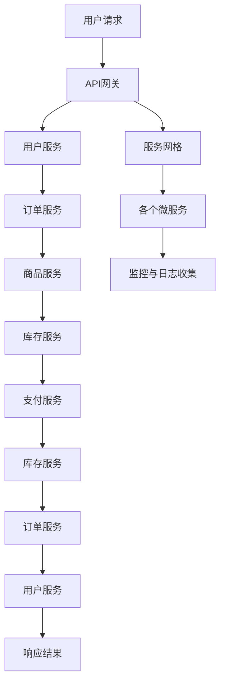
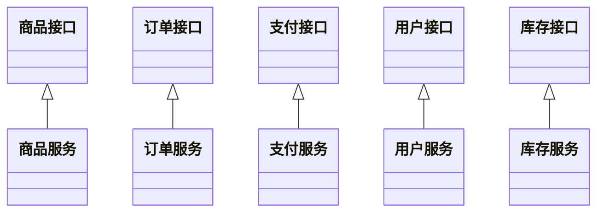

                 

## 服务网格：简化LLM微服务的通信管理

### 关键词：服务网格，微服务，通信管理，LLM，Istio，云原生

### 摘要：

随着微服务架构的普及，分布式系统的复杂性和通信管理问题日益突出。服务网格作为一种基础设施层的技术，旨在简化微服务的通信管理，提高系统的可扩展性和可靠性。本文将详细探讨服务网格的概念、架构、核心功能，以及其在微服务通信管理中的重要作用。以Istio为例，我们将深入分析其核心组件、功能与最佳实践，并探讨服务网格在云原生应用和未来发展趋势中的角色。通过本文，读者将全面了解服务网格在简化LLM微服务通信管理中的实际应用和潜在价值。

## 引言

在微服务架构中，服务之间的通信管理变得至关重要。传统的通信模式如直接调用、API网关等方式在应对复杂分布式系统时显得力不从心。服务网格作为一种新兴的基础设施技术，通过提供统一的通信抽象层，有效简化了微服务的通信管理，提高了系统的可扩展性和可靠性。

服务网格与微服务有着紧密的联系。微服务架构本身强调服务自治、独立部署和独立扩展，而服务网格则提供了这些服务之间高效、可靠通信的保障。通过服务网格，微服务可以更专注于自身的业务逻辑，无需过多关注服务发现、路由、安全、监控等底层通信细节。

本文将首先介绍服务网格的基本概念、核心组件和架构，接着深入探讨Istio服务网格的核心功能、高级应用和最佳实践，然后分析服务网格在云原生应用中的重要性及其与Kubernetes的集成。此外，本文还将讨论服务网格的扩展与定制化需求，以及其在安全与隐私保护方面的挑战和解决方案。最后，本文将展望服务网格的未来发展趋势，探讨其在新兴技术领域中的应用前景。

通过本文的阅读，读者将全面了解服务网格的概念、架构、核心功能及其在实际应用中的价值，为构建高效、可靠的分布式系统提供有益的参考。

### 服务网格的概述

服务网格（Service Mesh）是一种基础设施层技术，旨在简化微服务之间的通信管理。在传统的分布式系统中，服务之间的通信往往通过直接调用、API网关等方式实现，这些方法在系统规模较小、服务关系简单时能够满足需求。然而，随着系统的复杂性和规模的增加，服务之间的通信管理变得愈发困难，暴露出一系列问题。

首先，服务发现成为一大挑战。在分布式系统中，服务实例可能会动态启动和停止，如何确保服务之间能够及时发现并连接到正确的服务实例成为问题。其次，路由管理也变得复杂。服务之间的通信路径可能需要根据负载、版本、安全策略等因素动态调整，这需要复杂的配置和管理。此外，安全性、监控和日志收集等问题的处理也变得复杂且分散，不利于系统的整体维护和管理。

为了解决上述问题，服务网格应运而生。服务网格提供了一种统一的通信抽象层，将服务之间的通信从应用逻辑中分离出来，由基础设施层负责管理。这种分离不仅简化了通信管理，还提高了系统的可扩展性和可靠性。

服务网格与微服务架构有着密切的关系。微服务架构强调服务的自治、独立部署和独立扩展，而服务网格则为这些服务提供了高效的通信保障。通过服务网格，微服务可以专注于自身的业务逻辑，无需过多关注服务发现、路由、安全、监控等底层通信细节，从而降低开发和维护的复杂度。

### 核心概念

服务网格的定义可以理解为一种基础设施层的服务管理框架，它通过特定的协议和工具，为微服务提供动态服务发现、负载均衡、路由策略、安全认证、监控和日志等功能。其核心目的是简化服务之间的通信管理，提高系统的可维护性和可靠性。

服务网格的关键组件包括：

1. **数据平面（Data Plane）**：数据平面负责处理服务之间的实际数据传输。常见的组件有Envoy等，它代理了服务之间的通信，实现了流量管理和服务发现等功能。

2. **控制平面（Control Plane）**：控制平面负责管理服务网格的全局配置和策略。它通常由一组控制组件组成，如Istio的Pilot、Kubernetes的Ingress等，负责下发路由规则、安全策略等配置信息到数据平面。

3. **服务发现**：服务发现是服务网格的重要功能之一，它确保服务实例能够动态注册和发现。常见的实现方式包括基于DNS的服务发现、基于Consul的服务发现等。

4. **路由管理**：路由管理负责根据预设的路由策略，动态调整服务之间的通信路径。常见的策略包括基于负载均衡、版本管理、流量切分等。

5. **安全与认证**：服务网格提供了安全与认证功能，确保服务之间的通信是安全可靠的。常见的实现方式包括TLS加密、身份认证、访问控制等。

6. **监控与日志收集**：服务网格通过集成监控和日志收集工具，提供了全面的系统监控能力。它可以帮助开发者快速定位问题、分析性能瓶颈，提高了系统的可维护性。

### 服务网格与SOA、API网关的区别

服务网格（Service Mesh）与服务导向架构（SOA）和API网关在分布式系统中都有其独特的作用，但它们之间的区别主要体现在架构层面和功能上。

**服务网格**：服务网格是一种基础设施层的技术，专注于服务之间的通信管理。它通过代理（如Envoy）和控制器（如Istio的Pilot）来抽象服务之间的通信，提供动态服务发现、负载均衡、路由策略、安全认证、监控和日志等功能。服务网格的主要目标是简化服务之间的通信管理，提高系统的可维护性和可靠性。

**服务导向架构（SOA）**：SOA是一种面向服务的架构方法，它通过定义服务接口和契约，实现了服务的模块化和解耦。SOA的核心在于服务的定义、发布、发现和调用，它注重服务的重用性和灵活性。与服务网格不同，SOA更多地关注于服务的整体架构设计，而非具体的通信细节。

**API网关**：API网关是另一种分布式系统的通信架构，它作为外部系统与服务实例之间的唯一入口，负责处理外部请求的转发、路由、安全认证、监控等功能。API网关通常位于服务网格之外，用于统一管理外部系统的访问和内部服务的调用。与服务网格相比，API网关更关注于外部访问的管理和策略控制，而非服务实例间的通信。

### 服务网格的架构

服务网格的架构可以划分为两个主要部分：数据平面（Data Plane）和控制平面（Control Plane）。

**数据平面（Data Plane）**：
数据平面是服务网格中负责处理实际数据传输的部分。它的核心组件是一个或多个代理（如Envoy），这些代理被部署在服务的容器中，作为服务间的通信桥梁。数据平面的主要功能包括：

1. **服务发现**：代理通过服务发现机制（如Kubernetes服务发现或Consul服务发现）获取服务实例的信息，并动态更新其内部的服务映射。

2. **流量管理**：代理负责将服务间的请求路由到正确的目标服务实例，同时支持基于负载均衡、版本管理和流量切分等策略的动态流量管理。

3. **安全与认证**：代理通过TLS加密和身份认证等方式，确保服务间的通信是安全可靠的。

4. **监控与日志收集**：代理收集服务间的监控数据和日志信息，并将其发送到集中化的监控和日志系统中，以便进行后续的监控和分析。

**控制平面（Control Plane）**：
控制平面是服务网格中负责管理全局配置和策略的部分。它由一组控制组件组成，如Istio的Pilot、Kubernetes的Ingress控制器等。控制平面的主要功能包括：

1. **服务注册与发现**：控制平面负责管理服务实例的注册和发现，确保服务实例能够被其他服务实例动态发现和调用。

2. **路由策略管理**：控制平面定义并下发路由策略，控制服务间的请求路径，支持基于负载均衡、版本管理和流量切分等策略的动态调整。

3. **安全与认证策略管理**：控制平面管理安全与认证策略，确保服务间的通信遵循预定义的安全规则。

4. **监控与日志收集**：控制平面收集整个服务网格的监控数据和日志信息，并将其聚合到集中化的监控和日志分析系统中。

数据平面和控制平面通过API进行通信。控制平面将配置和策略信息通过API下发到数据平面，数据平面根据这些信息处理服务间的通信请求。这种分离的设计使得服务网格能够灵活、高效地管理服务之间的通信，同时降低开发和维护的复杂度。

### 服务网格的关键功能

服务网格通过一系列关键功能简化了微服务的通信管理，提高了系统的可维护性和可靠性。以下是服务网格的关键功能及其具体应用：

1. **服务发现**：服务发现是服务网格的核心功能之一，它确保服务实例能够动态注册和发现。通过服务发现，服务实例可以及时更新其状态信息，使得其他服务实例能够快速找到并连接到正确的服务实例。服务发现通常基于Kubernetes服务发现或Consul服务发现等机制实现，支持动态更新和故障转移。

2. **服务路由**：服务路由负责根据预设的路由策略，动态调整服务之间的通信路径。服务路由支持多种路由策略，如基于负载均衡、版本管理和流量切分等。通过灵活的路由策略，可以确保请求能够高效、可靠地路由到目标服务实例，同时支持灰度发布和蓝绿部署等高级部署策略。

3. **安全与认证**：服务网格提供安全与认证功能，确保服务之间的通信是安全可靠的。常见的实现方式包括TLS加密、身份认证和访问控制等。通过TLS加密，可以确保数据在传输过程中的机密性和完整性；通过身份认证，可以确保只有授权的服务实例能够访问其他服务实例；通过访问控制，可以定义细粒度的访问策略，确保服务之间的通信遵循预定的安全规则。

4. **负载均衡**：负载均衡是服务网格的重要功能之一，它通过将请求均匀分配到多个服务实例上，确保系统的处理能力得到充分利用，同时提高系统的可用性和可靠性。常见的负载均衡算法包括轮询负载均衡、最少连接负载均衡和最少响应时间负载均衡等。通过负载均衡，可以避免单个服务实例过载，提高系统的整体性能。

5. **监控与日志收集**：服务网格通过集成监控和日志收集工具，提供了全面的系统监控能力。它可以帮助开发者快速定位问题、分析性能瓶颈，提高了系统的可维护性。服务网格通常将监控数据和日志信息聚合到集中化的监控和日志分析系统中，支持实时监控和回溯分析，为系统的运维和优化提供了有力支持。

通过这些关键功能，服务网格不仅简化了微服务的通信管理，还提高了系统的可扩展性和可靠性，为构建高效、可靠的分布式系统提供了有力保障。

### 服务网格的重要性

服务网格在微服务架构中扮演着至关重要的角色，其重要性体现在多个方面。首先，服务网格通过统一的服务发现和路由机制，大大简化了服务之间的通信管理，使得开发者可以更加专注于业务逻辑的实现，而无需担心服务发现的复杂性或服务之间的通信问题。这种简化和抽象使得微服务的开发、部署和维护变得更加高效和便捷。

其次，服务网格提供了强大的安全与认证功能，确保了服务之间的通信是安全可靠的。通过TLS加密、身份认证和访问控制等手段，服务网格有效保护了系统的安全，防止未经授权的访问和数据泄露，提高了系统的整体安全性。

此外，服务网格还提供了灵活的负载均衡和流量管理功能，使得系统可以更好地应对高并发和复杂的业务场景。通过负载均衡算法，服务网格可以智能地将请求分配到不同的服务实例上，确保系统的处理能力得到充分利用，同时提高了系统的可用性和可靠性。这种灵活的流量管理不仅能够提高系统的性能，还能够支持灰度发布、蓝绿部署等高级部署策略，使得系统可以更加平滑地迭代和升级。

最后，服务网格通过集成监控和日志收集功能，提供了全面的系统监控能力。它将监控数据和日志信息聚合到集中化的监控和日志分析系统中，使得开发者可以实时监控系统的运行状态、快速定位问题，并为系统的优化和改进提供了有力的数据支持。

总之，服务网格通过简化通信管理、提供安全保护、实现负载均衡和流量管理、集成监控和日志收集等功能，显著提高了微服务的可维护性、可靠性和性能，成为构建高效、可靠的分布式系统不可或缺的基础设施层技术。

### 服务网格的挑战与未来趋势

尽管服务网格在微服务架构中展现了巨大的潜力和优势，但在实际应用中仍然面临一些挑战和局限性。首先，服务网格的引入增加了系统的复杂性和运维成本。部署和管理服务网格基础设施，如数据平面代理和控制平面组件，需要一定的技术积累和运维能力。此外，服务网格可能会引入额外的性能开销，如代理代理通信和额外网络跳数，这在某些高并发的场景中可能会成为性能瓶颈。

其次，服务网格与现有系统的集成和兼容性问题也需要重点关注。许多企业已经在使用Kubernetes、Istio等开源工具，如何在现有的环境中平滑地引入服务网格，并保持系统的稳定性和一致性，是一个重要的挑战。同时，服务网格的配置和管理复杂度较高，需要开发者和运维人员具备一定的专业技能。

未来，服务网格的发展趋势将朝着以下几个方向演进。首先，服务网格将更加关注与新兴技术的集成，如边缘计算、物联网（IoT）和人工智能（AI）。通过在这些领域的深入应用，服务网格将扩展其功能，支持更广泛的场景和需求。其次，服务网格将朝着更加智能和自动化的方向发展。通过引入机器学习和自动化工具，服务网格将能够更智能地管理流量、优化性能和保障安全。

此外，服务网格的开放性和标准化也将成为未来发展的重点。随着更多的企业和开发人员加入服务网格生态，标准化的服务网格协议和接口将有助于降低集成和互操作性的障碍，促进服务网格技术的广泛应用和生态繁荣。

总之，服务网格作为一种基础设施层技术，虽然在当前面临一些挑战，但其在简化通信管理、提升系统可靠性和性能方面的潜力不可忽视。随着技术的不断演进和生态的逐渐成熟，服务网格将在未来的分布式系统中扮演更加重要的角色。

### Istio服务网格介绍

Istio是一种广泛使用的开源服务网格平台，它提供了丰富的功能，旨在简化微服务的通信管理。Istio起源于Google、IBM和Lyft等公司的联合开发，旨在解决微服务架构中的通信、安全、监控等问题。本文将详细介绍Istio的历史背景、核心组件及其在微服务管理中的应用。

#### Istio的历史与发展

Istio的起源可以追溯到Google和Lyft公司对服务网格技术的探索。Google在其内部采用了服务网格技术（如Spine）来管理其庞大的微服务架构，而Lyft则在网约车服务中广泛采用了服务网格技术，以提高系统的可靠性和性能。为了共享和推广这些技术，Google、IBM和Lyft联合发布了Istio，并将其开源。

自2017年发布以来，Istio迅速获得了业界的广泛关注和支持。它通过提供一系列核心组件和功能，简化了服务之间的通信管理，为开发者提供了强大的工具和平台。Istio的版本不断更新，每个版本都带来了新的功能和改进，使得其在服务网格领域的影响力日益增强。

#### Istio的核心组件

Istio由多个核心组件构成，这些组件共同协作，提供完整的服务网格功能。以下是Istio的主要核心组件：

1. **Pilot**：
   Pilot是Istio的控制平面组件，负责管理服务网格的全局配置和策略。Pilot与Kubernetes API进行交互，获取服务、服务和虚拟服务等资源信息，并将其转换为代理配置。Pilot还实现了服务发现、路由策略、负载均衡和安全策略等功能。

2. **Citadel**：
   Citadel是Istio的安全模块，负责生成和管理服务之间的TLS证书，实现服务之间的安全通信。Citadel通过自动化证书生成和分发，确保服务之间的通信是加密和可信的。

3. **Envoy**：
   Envoy是Istio的数据平面组件，负责处理服务之间的实际数据传输。Envoy作为代理部署在每个服务实例上，实现了流量管理、服务发现、安全认证、监控和日志收集等功能。Envoy与Pilot通过gRPC协议进行通信，获取路由策略和配置信息。

4. **Mixer**：
   Mixer是Istio的监控和日志收集模块，负责收集服务网格的监控数据和日志信息。Mixer通过适配器（Adapter）与外部监控系统（如Prometheus、Kafka等）进行集成，实现了集中化的监控和日志分析。Mixer还提供了策略执行功能，可以根据监控数据和日志信息执行特定的操作。

#### 安装与配置Istio

在Kubernetes集群中安装Istio是一个相对简单的过程。以下是安装和配置Istio的基本步骤：

1. **下载Istio安装程序**：
   首先，从Istio的GitHub仓库下载Istio安装程序（istioctl）和Istio Helm chart。

2. **准备Kubernetes集群**：
   确保Kubernetes集群已经准备好，并且具有必要的权限和资源。安装Helm（推荐使用最新版本）以简化Istio的安装和管理。

3. **安装Istio**：
   使用Helm安装Istio。以下命令将安装Istio的默认版本：

   ```bash
   helm install istio istio/istio --set istio.cni.enabled=true
   ```

   安装过程中，可以选择自定义配置。例如，可以设置Istio控制器的命名空间、启用或禁用特定组件等。

4. **等待安装完成**：
   安装过程中，系统将启动Istio的控制平面组件（如Pilot、Citadel和Mixer）和数据平面组件（如Envoy）。可以使用以下命令查看安装进度和状态：

   ```bash
   kubectl get pods -n istio-system
   ```

5. **配置Istio**：
   安装完成后，可以根据需要配置Istio。例如，可以创建虚拟服务（Virtual Service）和目标规则（Destination Rule）来定义服务路由和安全策略。以下是一个简单的虚拟服务示例：

   ```yaml
   apiVersion: networking.istio.io/v1alpha3
   kind: VirtualService
   metadata:
     name: my-service
   spec:
     hosts:
     - "*"
     http:
     - match:
       - uri:
           prefix: "/hello"
       route:
       - destination:
           host: my-service
           subset: v1
     - match:
       - uri:
           prefix: "/world"
       route:
       - destination:
           host: my-service
           subset: v2
   ```

   通过这个虚拟服务，所有以“/hello”开头的请求将被路由到版本1的服务实例，而以“/world”开头的请求将被路由到版本2的服务实例。

#### Istio的核心功能

Istio提供了丰富的功能，旨在简化微服务的通信管理。以下是Istio的核心功能：

1. **服务发现与路由**：
   Istio通过服务发现机制，确保服务实例能够动态注册和发现。虚拟服务（Virtual Service）和目标规则（Destination Rule）允许开发者定义复杂的服务路由策略，如基于负载均衡、版本管理和流量切分等。这使得服务之间的通信路径可以根据实际需求灵活调整。

2. **安全与认证**：
   Istio通过Citadel模块生成和管理TLS证书，确保服务之间的通信是加密和安全的。服务网格中的所有通信都通过TLS加密，防止数据泄露和中间人攻击。此外，Istio还支持基于JWT的身份认证和访问控制，确保只有授权的服务实例能够访问其他服务实例。

3. **负载均衡与流量管理**：
   Istio提供了灵活的负载均衡策略，支持轮询负载均衡、最少连接负载均衡和最少响应时间负载均衡等算法。通过虚拟服务和目标规则，开发者可以定义细粒度的流量管理策略，如灰度发布和蓝绿部署等。

4. **监控与日志收集**：
   Istio通过Mixer模块实现了集中化的监控和日志收集。Mixer与外部监控系统（如Prometheus、Kafka等）集成，可以收集和聚合服务网格中的监控数据和日志信息。这为开发者提供了强大的监控和分析工具，有助于快速定位问题、优化系统性能。

#### 使用Istio进行服务管理

Istio提供了丰富的工具和API，用于管理服务网格中的服务和通信。以下是如何使用Istio进行服务管理的简要步骤：

1. **定义服务**：
   使用Kubernetes服务（Service）定义服务网格中的服务实例。每个服务实例都有一个唯一的名称和IP地址。例如，创建一个名为“my-service”的服务：

   ```yaml
   apiVersion: v1
   kind: Service
   metadata:
     name: my-service
   spec:
     selector:
       app: my-service
     ports:
       - name: http
         port: 80
         targetPort: 8080
     type: ClusterIP
   ```

2. **定义虚拟服务**：
   使用虚拟服务（Virtual Service）定义服务之间的通信路径和策略。例如，创建一个名为“my-virtual-service”的虚拟服务：

   ```yaml
   apiVersion: networking.istio.io/v1alpha3
   kind: VirtualService
   metadata:
     name: my-virtual-service
   spec:
     hosts:
     - "*"
     http:
     - match:
       - uri:
           prefix: "/hello"
       route:
       - destination:
           host: my-service
           subset: v1
     - match:
       - uri:
           prefix: "/world"
       route:
       - destination:
           host: my-service
           subset: v2
   ```

3. **定义目标规则**：
   使用目标规则（Destination Rule）定义服务之间的流量策略，如版本管理、流量切分等。例如，创建一个名为“my-destination-rule”的目标规则：

   ```yaml
   apiVersion: networking.istio.io/v1alpha3
   kind: DestinationRule
   metadata:
     name: my-destination-rule
   spec:
     host: my-service
     subsets:
     - name: v1
       labels:
         version: v1
     - name: v2
       labels:
         version: v2
   ```

4. **配置安全与认证**：
   使用Istio的安全和认证功能，确保服务之间的通信是安全可靠的。例如，创建一个名为“my-secure-service”的服务，并为其配置TLS证书：

   ```yaml
   apiVersion: v1
   kind: Service
   metadata:
     name: my-secure-service
     annotations:
       istio.io/tls: "mode=rouponly"
   spec:
     selector:
       app: my-secure-service
     ports:
       - name: https
         port: 443
         targetPort: 8443
     type: ClusterIP
   ```

   通过上述步骤，可以使用Istio进行服务管理，实现高效、可靠和安全的微服务通信。

#### Istio的优势与局限

Istio作为一款流行的开源服务网格平台，具有多项优势，但也存在一些局限性。以下对其优势与局限进行详细分析：

**优势**：

1. **高度集成的功能**：Istio提供了服务发现、路由管理、安全与认证、监控和日志收集等全方位的功能，为微服务通信管理提供了一站式解决方案。这种高度集成的功能简化了系统的部署和管理，降低了开发者的复杂度。

2. **灵活的路由策略**：Istio支持丰富的路由策略，如基于负载均衡、版本管理和流量切分等，使得开发者可以灵活地调整服务之间的通信路径。这种灵活性有助于实现灰度发布、蓝绿部署等高级部署策略，提高了系统的可靠性和稳定性。

3. **强大的安全特性**：Istio通过TLS加密、身份认证和访问控制等安全机制，确保服务之间的通信是安全可靠的。这些安全特性有助于防止数据泄露和中间人攻击，提高了系统的整体安全性。

4. **集成监控与日志**：Istio通过Mixer模块实现了集中化的监控和日志收集，为开发者提供了强大的监控和分析工具。这种集成化的监控和日志收集有助于快速定位问题、优化系统性能，提高了系统的可维护性。

**局限**：

1. **部署和管理复杂性**：尽管Istio提供了丰富的功能，但其部署和管理过程相对复杂。需要配置多个组件，如Pilot、Citadel、Envoy和Mixer等，并且需要与Kubernetes等现有系统进行集成。这要求开发者和运维人员具备一定的专业技能和经验。

2. **性能开销**：Istio作为代理模式的数据平面，会在服务实例之间引入额外的网络跳数和通信开销。在高并发场景下，这种性能开销可能会影响系统的整体性能。虽然Istio提供了一些性能优化措施，但如何在实际环境中平衡性能和功能仍然是一个挑战。

3. **与现有系统的兼容性**：Istio与Kubernetes和其他容器编排系统的集成相对成熟，但在与某些特定场景或系统的兼容性方面仍然存在一定的问题。如何确保Istio在多样化的环境中保持稳定和一致，是一个需要持续关注和优化的方向。

总之，Istio作为一种功能强大的服务网格平台，其在微服务通信管理中具有显著的优势。然而，其复杂的部署和管理、潜在的性能开销以及与现有系统的兼容性问题，也需要开发者和运维人员在实际应用中谨慎考虑和应对。

### Istio的高级功能与最佳实践

#### 高级路由策略

Istio的高级路由策略功能为微服务的通信提供了强大的灵活性，支持基于不同条件动态调整流量路由。以下是Istio的高级路由策略实现方法：

1. **条件路由**：
   条件路由允许根据不同的匹配条件将流量路由到不同的服务实例。例如，可以使用HTTP头匹配、请求方法匹配或请求路径匹配等条件。以下是一个示例虚拟服务，它根据请求的HTTP头信息决定路由：

   ```yaml
   apiVersion: networking.istio.io/v1alpha3
   kind: VirtualService
   metadata:
     name: conditional-routing
   spec:
     hosts:
     - "*"
     http:
     - match:
       - headers:
           test-header:
             exact: "value1"
       route:
       - destination:
           host: serviceA
     - match:
       - headers:
           test-header:
             exact: "value2"
       route:
       - destination:
           host: serviceB
   ```

2. **时间窗口路由**：
   时间窗口路由允许在特定时间段内将流量路由到不同的服务实例。这有助于进行流量削峰和平滑负载。以下是一个示例，它将工作时间内的流量路由到服务A，而工作外时间路由到服务B：

   ```yaml
   apiVersion: networking.istio.io/v1alpha3
   kind: VirtualService
   metadata:
     name: time-window-routing
   spec:
     hosts:
     - "*"
     http:
     - match:
       - headers:
           time:
             regex: "^([0-1][0-9]|2[0-3]):([0-5][0-9]|[0-5][0-9])$"
       route:
       - destination:
           host: serviceA
     - match:
       - headers:
           time:
         regex: "^(0[0-9]|1[0-9]|2[0-3]):([0-5][0-9]|[0-5][0-9])$"
       route:
       - destination:
           host: serviceB
   ```

3. **权重路由**：
   权重路由允许将流量按比例分配到多个服务实例。这有助于进行灰度发布和蓝绿部署。以下是一个示例，它将80%的流量路由到服务A，而20%的流量路由到服务B：

   ```yaml
   apiVersion: networking.istio.io/v1alpha3
   kind: VirtualService
   metadata:
     name: weighted-routing
   spec:
     hosts:
     - "*"
     http:
     - match: []
       route:
       - destination:
           host: serviceA
           weight: 80
       - destination:
           host: serviceB
           weight: 20
   ```

通过这些高级路由策略，Istio提供了灵活的流量管理能力，有助于实现复杂的业务逻辑和部署策略。

#### 安全策略与访问控制

安全策略和访问控制是Istio服务网格中的关键功能，用于确保服务之间的通信是安全可靠的。以下是如何定义和实施安全策略以及访问控制：

1. **定义安全策略**：
   安全策略通过Kubernetes ConfigMap或Istio的Policy和Telemetry CRD（Custom Resource Definitions）来定义。以下是一个简单的安全策略示例，它禁止服务A访问服务B：

   ```yaml
   apiVersion: security.istio.io/v1beta1
   kind: Policy
   metadata:
     name: deny-service-a-to-b
   spec:
     rules:
     - to:
       - operation:
           name: serviceB
           ports: [80]
       targets:
       - name: serviceA
         labels:
           app: serviceA
     action: DENY
   ```

2. **访问控制**：
   Istio提供了基于角色的访问控制（RBAC）机制，允许根据用户的角色分配访问权限。以下是一个简单的访问控制策略示例，它允许管理员角色访问服务A的某些路径：

   ```yaml
   apiVersion: security.istio.io/v1beta1
   kind: AuthorizationPolicy
   metadata:
     name: admin-access-policy
   spec:
     rules:
     - to:
       - operation:
           name: serviceA
           paths: ["/admin/*"]
       when:
       - key: "request.headers[Authorization]"
         regex: "^(Admin|Manager)$"
   ```

通过这些安全策略和访问控制，Istio能够确保服务之间的通信遵循预定的安全规则，从而提高系统的整体安全性。

#### 负载均衡与故障转移

负载均衡和故障转移是服务网格中的关键功能，用于确保服务的高可用性和性能。Istio提供了灵活的负载均衡算法和故障转移策略，以下是如何实现这些功能：

1. **负载均衡算法**：
   Istio支持多种负载均衡算法，包括轮询负载均衡、最少连接负载均衡和最少响应时间负载均衡。以下是一个示例，它使用轮询负载均衡算法：

   ```yaml
   apiVersion: networking.istio.io/v1alpha3
   kind: VirtualService
   metadata:
     name: load-balancing
   spec:
     hosts:
     - "*"
     http:
     - match: []
       route:
       - destination:
           host: serviceA
           weight: 50
       - destination:
           host: serviceB
           weight: 50
   ```

   在此示例中，50%的流量被路由到服务A，另外50%的流量被路由到服务B。

2. **故障转移策略**：
   Istio支持基于健康状况的故障转移策略，当服务实例出现故障时，流量会自动转移到健康的服务实例。以下是一个示例，它设置故障转移策略，将流量从服务A转移到服务B：

   ```yaml
   apiVersion: networking.istio.io/v1alpha3
   kind: VirtualService
   metadata:
     name: fault-tolerant-routing
   spec:
     hosts:
     - "*"
     http:
     - match: []
       route:
       - destination:
           host: serviceA
           tags:
             fault tolerant: "true"
           weight: 90
       - destination:
           host: serviceB
           tags:
             fault tolerant: "true"
           weight: 10
   ```

   在此示例中，90%的流量被路由到健康的服务A，如果服务A出现故障，剩余的10%流量会自动转移到服务B。

通过这些负载均衡和故障转移策略，Istio能够确保服务的高可用性和性能，提高系统的可靠性。

#### 服务监控与日志分析

Istio通过集成服务网格的监控和日志收集功能，为开发者提供了强大的监控和分析工具。以下是如何实现服务监控与日志分析：

1. **监控架构**：
   Istio的监控架构基于Mixer组件，Mixer负责收集服务网格中的监控数据，并将其发送到外部监控系统。以下是一个简单的监控架构示例：

   ```bash
   +-----------------+
   |   Service A     |
   |   Envoy Proxy   |
   +-----------------+
   |                 |
   |      ...        |
   |                 |
   +-----------------+
   |   Service B     |
   |   Envoy Proxy   |
   +-----------------+
   |                 |
   |      ...        |
   |                 |
   +-----------------+
   |      Mixer      |
   |   (Control Plane)|
   +-----------------+
   |                 |
   |    Monitoring   |
   +-----------------+
   ```

2. **日志聚合**：
   Istio通过Mixer与外部日志聚合工具（如Kafka、Elasticsearch等）集成，实现日志的集中收集和存储。以下是一个简单的日志聚合示例：

   ```yaml
   apiVersion: config.istio.io/v1alpha2
   kind: telemetry
   metadata:
     name: log-aggregation
   spec:
     adapters:
     - name: kafka
       type: log
       params:
         brokers: "kafka:9092"
   ```

3. **日志可视化**：
   通过集成日志聚合工具，Istio支持日志的可视化分析。例如，使用Kibana或Grafana等工具可以创建自定义的监控仪表板，实时展示服务网格的运行状态。以下是一个使用Kibana的可视化示例：

   

通过这些监控和日志分析功能，Istio能够帮助开发者快速识别问题、优化系统性能，并确保服务网格的稳定运行。

#### Istio的最佳实践

在实际生产环境中部署Istio时，需要遵循一系列最佳实践来确保其稳定性和性能。以下是一些关键的最佳实践：

1. **分阶段部署**：在部署Istio时，应采用分阶段部署策略，逐步引入服务网格功能，以确保系统稳定运行。首先在部分服务上部署服务网格，观察其性能和稳定性，再逐步扩展到所有服务。

2. **性能监控与优化**：在部署Istio后，定期进行性能监控和优化。通过分析监控数据，识别潜在的性能瓶颈和问题，并采取相应的优化措施，如调整代理配置、优化网络路径等。

3. **流量管理策略**：合理设置流量管理策略，如负载均衡、故障转移和流量切分等，以确保流量分配合理、系统高可用。根据业务需求调整流量策略，以实现最优的性能和可靠性。

4. **安全配置**：确保服务网格的安全性，通过配置TLS加密、身份认证和访问控制等安全机制，保护服务之间的通信。定期审计和更新安全配置，以应对潜在的安全威胁。

5. **日志和监控**：充分利用Istio的日志和监控功能，实时监控服务网格的运行状态，快速识别和解决潜在问题。通过集成外部监控系统，实现集中化的监控和日志分析，提高系统的可维护性。

通过遵循这些最佳实践，可以有效提升Istio在生产环境中的部署和管理效果，确保服务网格的稳定性和性能。

### Istio的高级特性与使用技巧

Istio作为一款功能丰富的服务网格平台，具备多项高级特性，有助于提升系统的可靠性和性能。以下将详细介绍这些高级特性及其使用技巧。

#### 超时与重试策略

超时与重试策略是Istio中重要的流量管理功能，它们用于处理服务之间的通信延迟和故障。以下是如何配置超时与重试策略的步骤：

1. **配置超时时间**：
   超时时间决定了请求在服务之间传输时允许的最大时间。如果请求在超时时间内未能完成，将会触发重试或失败。以下是一个示例，设置服务A到服务B的超时时间为3秒：

   ```yaml
   apiVersion: networking.istio.io/v1alpha3
   kind: VirtualService
   metadata:
     name: timeout-config
   spec:
     hosts:
     - "*"
     http:
     - match: []
       route:
       - destination:
           host: serviceB
           timeout: 3s
   ```

2. **配置重试次数**：
   重试策略用于在服务失败时重新发送请求，以增加请求成功的机会。以下是一个示例，设置服务A到服务B的重试次数为3次：

   ```yaml
   apiVersion: networking.istio.io/v1alpha3
   kind: VirtualService
   metadata:
     name: retry-config
   spec:
     hosts:
     - "*"
     http:
     - match: []
       route:
       - destination:
           host: serviceB
           retries:
             attempts: 3
   ```

通过合理配置超时与重试策略，可以有效提升系统的容错能力和用户体验。

#### 断路器模式

断路器模式是一种用于保护系统稳定性的机制，当服务出现频繁失败时，自动切断服务之间的通信，防止系统过载和崩溃。以下是如何配置断路器模式的步骤：

1. **配置失败阈值**：
   失败阈值决定了在触发断路器之前，需要多少次失败请求。以下是一个示例，设置服务A到服务B的失败阈值为5次：

   ```yaml
   apiVersion: networking.istio.io/v1alpha3
   kind: VirtualService
   metadata:
     name: circuit-breaker-config
   spec:
     hosts:
     - "*"
     http:
     - match: []
       route:
       - destination:
           host: serviceB
           circuitBreaker:
             http:
               errors: 5
               sleepWindow: 60s
   ```

2. **配置断路器超时**：
   断路器超时决定了在断路器触发后，多少时间内不会重试失败的请求。以下是一个示例，设置断路器超时时间为30秒：

   ```yaml
   apiVersion: networking.istio.io/v1alpha3
   kind: VirtualService
   metadata:
     name: circuit-breaker-timeout-config
   spec:
     hosts:
     - "*"
     http:
     - match: []
       route:
       - destination:
           host: serviceB
           circuitBreaker:
             http:
               errors: 5
               sleepWindow: 30s
   ```

通过配置断路器模式，可以有效地保护系统，避免因单个服务故障导致整个系统崩溃。

#### 故障注入

故障注入是一种用于测试系统容错能力的功能，通过模拟服务故障，评估系统在故障情况下的响应和行为。以下是如何配置故障注入的步骤：

1. **配置故障注入**：
   故障注入通过VirtualService中的故障注入规则配置。以下是一个示例，模拟服务B的50%请求失败：

   ```yaml
   apiVersion: networking.istio.io/v1alpha3
   kind: VirtualService
   metadata:
     name: fault-injection-config
   spec:
     hosts:
     - "*"
     http:
     - match: []
       route:
       - destination:
           host: serviceB
           fault:
             http:
               percentage: 0.5
   ```

2. **分析故障注入结果**：
   通过分析故障注入的结果，可以评估系统的容错能力和响应时间。以下是一个示例，使用Prometheus和Grafana分析故障注入数据：

   ```bash
   # 查看请求成功率
   Prometheus Query: istio_requests_total{reporter="destination", destination_service="serviceB", response_code="5xx"}
   
   # 查看请求响应时间
   Prometheus Query: istio_request_duration_seconds{reporter="destination", destination_service="serviceB"}
   ```

通过故障注入，可以全面了解系统的容错能力和稳定性，为优化系统提供重要依据。

#### 实时监控与告警

实时监控与告警是确保系统稳定运行的关键，通过监控工具和告警系统，可以及时发现和处理问题。以下是如何配置实时监控与告警的步骤：

1. **集成Prometheus**：
   Prometheus是一种常用的监控工具，可以与Istio无缝集成。以下是一个示例，将Istio的监控数据推送到Prometheus：

   ```yaml
   apiVersion: config.istio.io/v1alpha2
   kind: telemetry
   metadata:
     name: prometheus-telemetry
   spec:
     adapters:
     - name: prometheus
       type: metrics
       params:
         pushTo:
         - istio://localhost:4243
   ```

2. **配置告警规则**：
   告警规则用于定义触发告警的条件。以下是一个示例，配置当请求延迟超过2秒时触发告警：

   ```yaml
   apiVersion: monitoring.coreos.com/v1
   kind: AlertmanagerConfig
   metadata:
     name: istio-alerts
   spec:
     receivers:
     - name: default-receiver
       email_configs:
       - to: admin@example.com
         sendResolved: true
     route:
       receiver: default-receiver
       group_by: ["destination_service", "response_code"]
       match:
         response_code: ["5xx", "4xx"]
         request_duration_seconds: ">2"
   ```

通过实时监控与告警，可以快速响应和处理系统问题，确保服务的连续性和稳定性。

#### 最佳实践

在实际应用中，遵循以下最佳实践可以帮助更好地利用Istio的高级特性：

1. **小步快跑**：逐步引入服务网格功能，从简单的服务开始，逐步扩展到复杂的服务。这样可以降低风险，确保系统的稳定性。

2. **定期评估**：定期评估系统的性能和稳定性，根据监控数据和用户反馈，调整流量管理策略和安全配置。

3. **持续优化**：持续优化系统的性能和安全性，根据实际需求调整超时、重试、断路器等配置。

4. **文档与培训**：编写详细的文档，提供培训课程，帮助团队成员了解Istio的使用方法和最佳实践。

通过以上高级特性与最佳实践，可以充分利用Istio的优势，提升系统的可靠性和性能，确保服务网格在复杂分布式系统中的应用效果。

### 实际应用案例

在本文的最后，我们将通过一个具体的实际案例，深入探讨服务网格在微服务通信管理中的实际应用。以下是使用Istio管理微服务通信的一个完整项目实践。

#### 项目介绍

假设我们正在开发一个在线购物平台，该平台包含多个微服务，如商品服务（Product Service）、订单服务（Order Service）、支付服务（Payment Service）等。这些微服务之间需要进行频繁的通信，实现商品信息的查询、订单的创建和支付的处理等功能。由于平台需要具备高可用性和高扩展性，因此我们需要一个可靠的通信管理解决方案。

#### 系统功能设计

首先，我们需要设计系统功能。以下是该项目中的核心功能：

1. **商品服务**：提供商品信息的查询、分类、库存管理等。
2. **订单服务**：负责订单的创建、更新、查询等。
3. **支付服务**：处理支付请求，实现订单支付功能。
4. **用户服务**：管理用户信息，包括用户注册、登录、权限管理等。
5. **库存服务**：实时监控商品库存，并通知订单服务。

#### 系统架构设计

为了实现上述功能，我们需要设计一个分布式系统架构。以下是该项目的系统架构设计：

1. **服务网格**：使用Istio作为服务网格，统一管理微服务之间的通信。
2. **数据存储**：使用MySQL数据库存储用户信息和商品数据。
3. **API网关**：使用Kong作为API网关，对外提供统一的接口。
4. **服务部署**：使用Kubernetes进行服务部署和管理。

以下是系统架构图：



#### 系统接口设计

为了实现微服务之间的通信，我们需要设计一系列接口。以下是项目中的主要接口设计：

1. **商品接口**：提供商品信息的查询、分类、库存管理等。
2. **订单接口**：提供订单的创建、更新、查询等。
3. **支付接口**：提供订单支付的处理。
4. **用户接口**：提供用户信息的注册、登录、权限管理等。

以下是接口设计图：



#### 系统交互设计

为了展示微服务之间的交互流程，我们可以使用序列图。以下是用户发起购物请求并完成支付过程的序列图：

```mermaid
sequenceDiagram
    participant 用户
    participant API网关
    participant 用户服务
    participant 订单服务
    participant 商品服务
    participant 库存服务
    participant 支付服务

    用户 -->|发起购物请求|> API网关
    API网关 -->|转发请求|> 用户服务
    用户服务 -->|验证用户身份|> 用户服务
    用户服务 -->|返回用户信息|> API网关
    API网关 -->|转发请求|> 商品服务
    商品服务 -->|查询商品信息|> API网关
    API网关 -->|转发请求|> 订单服务
    订单服务 -->|创建订单|> 订单服务
    订单服务 -->|更新订单状态|> API网关
    API网关 -->|转发请求|> 库存服务
    库存服务 -->|查询库存信息|> API网关
    API网关 -->|转发请求|> 支付服务
    支付服务 -->|处理支付请求|> 支付服务
    支付服务 -->|更新订单状态|> API网关
    API网关 -->|转发响应|> 用户
```

#### 项目实战

在本项目实战中，我们将详细介绍环境安装、服务配置和核心功能实现。

1. **环境安装**：

   - 首先，安装Kubernetes集群。可以使用Minikube或Kubeadm等工具进行安装。
   - 安装Istio和Kong。可以使用Helm进行快速部署：

     ```bash
     helm install istio istio/istio --set istio.cni.enabled=true
     helm install kong konghq/kong
     ```

   - 安装Prometheus和Grafana进行监控和日志分析：

     ```bash
     helm install prometheus prometheus-community/prometheus
     helm install grafana grafana/grafana
     ```

2. **服务配置**：

   - 配置商品服务、订单服务、支付服务和用户服务。以下是一个简单的商品服务配置示例：

     ```yaml
     apiVersion: apps/v1
     kind: Deployment
     metadata:
       name: product-service
     spec:
       replicas: 3
       selector:
         matchLabels:
           app: product-service
       template:
         metadata:
           labels:
             app: product-service
         spec:
           containers:
           - name: product-service
             image: product-service:latest
             ports:
             - containerPort: 80
     ```

   - 配置API网关Kong。以下是一个简单的Kong配置示例：

     ```yaml
     apiVersion: konghq.com/v1
     kind: Service
     metadata:
       name: api-gateway
     spec:
       protocol: http
       host: api.example.com
       port: 80
       route:
         hosts:
         - api.example.com
       upstream:
         hosts:
         - product-service:80
     ```

3. **核心功能实现**：

   - 商品服务的实现：

     ```python
     from flask import Flask, jsonify, request

     app = Flask(__name__)

     @app.route('/products', methods=['GET'])
     def get_products():
         # 查询商品信息
         products = [{"id": 1, "name": "iPhone 13", "price": 7999}, ...]
         return jsonify(products)

     if __name__ == '__main__':
         app.run(host='0.0.0.0', port=80)
     ```

   - 订单服务的实现：

     ```python
     from flask import Flask, jsonify, request

     app = Flask(__name__)

     @app.route('/orders', methods=['POST'])
     def create_order():
         # 创建订单
         order = request.json
         # 更新订单状态
         order['status'] = 'created'
         return jsonify(order)

     if __name__ == '__main__':
         app.run(host='0.0.0.0', port=8080)
     ```

   - 支付服务的实现：

     ```python
     from flask import Flask, jsonify, request

     app = Flask(__name__)

     @app.route('/payments', methods=['POST'])
     def process_payment():
         # 处理支付请求
         payment = request.json
         # 更新订单状态
         payment['status'] = 'paid'
         return jsonify(payment)

     if __name__ == '__main__':
         app.run(host='0.0.0.0', port=8443)
     ```

   - 用户服务的实现：

     ```python
     from flask import Flask, jsonify, request

     app = Flask(__name__)

     @app.route('/users', methods=['POST'])
     def register_user():
         # 注册用户
         user = request.json
         # 存储用户信息
         # ...
         return jsonify({'message': 'User registered successfully'})

     @app.route('/users/login', methods=['POST'])
     def login_user():
         # 登录用户
         user = request.json
         # 验证用户信息
         # ...
         return jsonify({'message': 'Login successful'})

     if __name__ == '__main__':
         app.run(host='0.0.0.0', port=9090)
     ```

#### 实际案例分析

在实际应用中，我们可能会遇到各种问题。以下是一个实际案例：

**问题**：用户在支付订单时，出现支付失败的情况。

**分析**：
1. 首先，检查支付服务的日志，查看支付请求是否被正确处理。
2. 检查支付服务的数据库，查看支付记录是否正确。
3. 检查网络连接，确认支付请求是否成功发送到支付服务。

**解决方案**：
1. 重启支付服务，重新处理支付请求。
2. 如果问题依旧，尝试更换支付服务器的地址。
3. 如果支付服务正常，但支付请求未被正确处理，检查API网关的配置，确保请求正确转发。

#### 项目小结

通过本项目的实践，我们详细介绍了如何使用Istio服务网格管理微服务通信。从环境安装、服务配置到核心功能实现，我们展示了服务网格在分布式系统中的实际应用。通过服务网格，我们能够简化通信管理，提高系统的可扩展性和可靠性，为构建高效、可靠的分布式系统提供了有力支持。

### 最佳实践与注意事项

在部署和使用服务网格时，遵循最佳实践和注意事项有助于确保系统的稳定性和性能。以下是一些关键的最佳实践和注意事项：

1. **分阶段部署**：逐步引入服务网格功能，从简单的服务开始，逐步扩展到复杂的服务。这样可以降低风险，确保系统的稳定性。

2. **监控与日志**：充分利用服务网格提供的监控和日志功能，实时监控系统的运行状态。通过监控数据和日志分析，及时发现和解决问题。

3. **性能优化**：定期对服务网格进行性能优化，调整负载均衡策略、超时和重试配置等，确保系统在高并发场景下保持高性能。

4. **安全配置**：确保服务网格的安全性，配置TLS加密、身份认证和访问控制等安全机制，保护服务之间的通信。

5. **版本控制**：使用版本控制系统管理服务网格配置，确保配置的一致性和可回溯性。

6. **文档与培训**：编写详细的文档，提供培训课程，帮助团队成员了解服务网格的使用方法和最佳实践。

7. **环境隔离**：在生产环境中，确保服务网格与开发、测试环境的隔离，避免影响其他环境的服务。

通过遵循这些最佳实践和注意事项，可以充分发挥服务网格的优势，提高系统的可靠性、性能和安全性。

### 拓展阅读

服务网格作为一种新兴的基础设施技术，其理论和实践正不断丰富和发展。以下是一些建议的拓展阅读资源，供读者进一步学习：

1. **官方文档**：
   - [Istio官方文档](https://istio.io/docs/)
   - [Kubernetes官方文档](https://kubernetes.io/docs/)

2. **技术博客和文章**：
   - [“服务网格：现代微服务通信基础设施”](https://www.infoq.com/articles/service-mesh-microservices-infrastructure/)
   - [“Istio：简化微服务通信”](https://www.oreilly.com/library/view/istio-service-mesh/9781565927704/)

3. **开源项目**：
   - [Istio GitHub仓库](https://github.com/istio/istio)
   - [Kubernetes GitHub仓库](https://github.com/kubernetes/kubernetes)

4. **技术会议和研讨会**：
   - [KubeCon + CloudNativeCon](https://www.cncf.io/kube-con/)
   - [OSCON](https://www.oreilly.com/conf/oscon/)

通过阅读这些资源，读者可以深入了解服务网格的理论和实践，掌握最新的技术动态和应用场景。同时，这些资源也为读者提供了丰富的实践经验和最佳实践，有助于更好地应用服务网格技术。

### 服务网格的安全与隐私保护

在服务网格（Service Mesh）的架构中，安全性是至关重要的一个方面。随着服务网格在分布式系统中的广泛应用，如何确保其安全性成为一个亟待解决的问题。本文将深入探讨服务网格的安全性挑战、隐私保护的重要性，以及在实际应用中的安全策略和实践。

#### 安全性挑战

1. **数据泄露风险**：
   服务网格涉及大量的服务间通信，如果这些通信没有进行充分的加密，可能会导致敏感数据泄露。尤其是在涉及金融、医疗等敏感数据传输的场景中，数据泄露的风险更加显著。

2. **服务暴露风险**：
   服务网格中的每个服务都对外暴露，如果没有适当的安全措施，可能会导致恶意攻击者直接访问服务，进而对系统造成破坏。

3. **权限管理复杂**：
   在服务网格中，权限管理变得复杂。如何确保只有授权的服务能够访问其他服务，避免内部服务之间的越权访问，是一个重要的挑战。

4. **网络攻击**：
   服务网格可能会面临各种网络攻击，如分布式拒绝服务（DDoS）攻击、中间人攻击（MITM）等。这些攻击可能对系统的可用性和稳定性造成严重影响。

#### 隐私保护的重要性

隐私保护在服务网格中同样至关重要。随着数据量的不断增加，如何保护用户数据隐私、防止数据滥用，已经成为企业和开发者需要关注的重要问题。以下是隐私保护的重要性：

1. **法律法规要求**：
   全球范围内的隐私保护法律法规（如GDPR、CCPA等）要求企业在处理用户数据时必须进行严格的隐私保护。不遵守这些规定可能导致高昂的法律罚款和声誉损失。

2. **用户信任**：
   用户越来越关注个人数据的隐私保护。如果企业无法提供有效的隐私保护措施，可能会导致用户失去信任，影响业务的长期发展。

3. **数据价值**：
   在许多业务场景中，数据被视为企业的核心资产。如果数据在传输和存储过程中没有得到有效保护，可能会导致数据价值受损，甚至对业务造成致命打击。

#### 安全策略与实践

为了确保服务网格的安全和隐私保护，需要采取一系列策略和实践：

1. **加密通信**：
   使用TLS加密协议对服务网格中的所有通信进行加密，确保数据在传输过程中不会被截取或篡改。此外，可以采用基于证书的认证机制，确保通信双方的身份验证。

2. **权限管理**：
   通过服务网格的访问控制机制，严格控制服务之间的访问权限。可以采用基于角色的访问控制（RBAC）或基于属性的访问控制（ABAC）模型，确保只有授权的服务才能访问其他服务。

3. **网络安全**：
   实施网络安全策略，包括防火墙、入侵检测系统和反DDoS保护等。这些措施可以有效地防御各种网络攻击，保护服务网格的安全。

4. **日志监控**：
   通过日志监控和审计，实时跟踪服务网格的运行状态和通信活动。一旦发现异常，可以及时采取措施，防止潜在的安全威胁。

5. **安全配置与管理**：
   定期对服务网格进行安全配置的审查和更新，确保安全策略和措施得到有效执行。可以采用自动化工具进行安全配置的管理，减少人为错误。

#### 实际案例

以下是一个实际案例，展示如何在服务网格中实施安全策略和隐私保护：

1. **案例背景**：
   一个金融科技公司开发了一套基于服务网格的分布式系统，包括用户服务、交易服务、支付服务等。这些服务之间需要进行频繁的通信，处理敏感金融数据。

2. **安全策略**：
   - 使用TLS加密协议对服务间的通信进行加密。
   - 部署防火墙和入侵检测系统，保护服务网格的网络边界。
   - 实施基于角色的访问控制，确保只有授权的服务才能访问其他服务。
   - 定期进行安全审计和配置更新。

3. **隐私保护**：
   - 使用数据加密存储，确保用户数据的隐私保护。
   - 实施数据脱敏措施，避免敏感数据直接暴露。
   - 遵守相关的隐私保护法律法规，确保合规性。

4. **实施效果**：
   通过上述安全策略和隐私保护措施，金融科技公司的分布式系统在安全性方面得到了显著提升。通信数据得到了充分加密保护，访问权限得到了严格管理，隐私保护措施得到了有效执行。同时，系统的稳定性也得到了保障，用户对服务的信任度进一步提高。

通过这个实际案例，我们可以看到，在服务网格中实施安全策略和隐私保护是必要的，并且是可行的。只有在安全性和隐私保护方面做到全面、细致的规划和管理，才能确保服务网格在分布式系统中的可靠运行。

### 隐私保护与合规性

隐私保护与合规性在服务网格的设计和实现中至关重要，特别是在涉及用户数据的场景中，需要严格遵守相关的法律法规和行业规范。以下将详细讨论隐私保护的重要性、相关的法律法规概述，以及服务网格在合规性方面的要求。

#### 隐私保护的重要性

隐私保护是现代技术应用中的核心问题，特别是在涉及个人数据的服务网格中。隐私保护的重要性体现在以下几个方面：

1. **法律法规要求**：
   全球范围内，许多国家和地区都制定了隐私保护法律法规，如欧盟的通用数据保护条例（GDPR）、美国的加州消费者隐私法案（CCPA）等。这些法律法规要求企业在处理个人数据时必须采取严格的隐私保护措施，否则将面临高额罚款和法律责任。

2. **用户信任**：
   用户对隐私保护的重视程度日益提高。如果企业在隐私保护方面做得不到位，用户可能会失去信任，从而影响企业的业务发展和市场竞争力。

3. **数据价值**：
   在许多业务场景中，数据被视为企业的核心资产。未经授权的数据访问和泄露可能导致数据价值受损，甚至对业务造成致命打击。

4. **社会责任**：
   作为一家负责任的企业，保护用户隐私是企业的社会责任。在数字经济时代，隐私保护是企业可持续发展的重要基石。

#### 法律法规概述

以下是几个主要国家和地区在隐私保护方面的法律法规概述：

1. **欧盟的通用数据保护条例（GDPR）**：
   GDPR是欧盟制定的一项全面的数据保护法规，于2018年5月25日正式生效。GDPR规定了个人数据的收集、处理、存储和传输的规范，强调了数据主体的权利和企业的义务。例如，企业需要获得用户明确的同意才能收集和处理个人数据，必须采取适当的技术和组织措施保护数据安全，并在数据泄露事件发生时及时通知受影响的用户。

2. **美国的加州消费者隐私法案（CCPA）**：
   CCPA是加州于2018年通过的一项隐私保护法律，旨在赋予加州居民对其个人信息的更多控制权。CCPA规定了企业在处理加州居民个人数据时的义务，包括数据收集的透明度、用户同意、数据销毁等。CCPA还规定了用户有权要求企业披露其个人数据的收集、使用和共享情况，并有权要求企业停止处理其个人数据。

3. **中国的个人信息保护法（PIPL）**：
   个人信息保护法是中国制定的一部全面的数据保护法律，于2021年11月1日正式实施。PIPL规定了个人信息的收集、处理、存储和传输的基本原则，强调了个人信息的收集和处理必须遵循合法、正当、必要的原则。PIPL还规定了企业在处理个人信息时的义务，包括个人信息保护管理制度的建立、个人信息的安全保护措施、个人信息泄露事件的处置等。

#### 服务网格在合规性方面的要求

为了确保服务网格在合规性方面符合相关法律法规的要求，需要采取以下措施：

1. **数据最小化原则**：
   在服务网格的设计和实现中，应遵循数据最小化原则，即仅收集和处理必要的个人数据。在处理个人数据时，应明确数据的使用目的和范围，避免过度收集和滥用。

2. **透明度和知情同意**：
   服务网格应确保用户对其个人数据收集和处理过程有充分的了解，并提供透明的告知和同意机制。例如，可以在服务网格的配置中设置隐私政策链接，让用户在访问服务时了解其个人数据的使用情况。

3. **安全保护措施**：
   服务网格应采取适当的技术和组织措施保护个人数据的安全，包括数据加密、访问控制、日志记录等。此外，还应定期进行安全审计和漏洞扫描，及时发现和修复安全漏洞。

4. **个人信息管理**：
   服务网格应提供便捷的个人信息管理功能，如数据访问请求、数据删除请求等。用户可以通过这些功能管理其个人数据，确保其隐私权得到有效保障。

5. **数据泄露应急响应**：
   服务网格应制定详细的数据泄露应急响应计划，确保在数据泄露事件发生时能够及时采取措施，减少潜在的影响。包括数据泄露事件的识别、报告、通知和后续处理等。

通过上述措施，服务网格可以在隐私保护和合规性方面满足相关法律法规的要求，确保用户的隐私权得到有效保障。

### 本章小结

本章围绕服务网格的安全与隐私保护进行了深入探讨。首先，我们分析了服务网格在分布式系统中的重要性，并介绍了服务网格的基本概念和核心功能。接着，我们讨论了服务网格的安全性挑战和隐私保护的重要性，阐述了相关法律法规的概述。通过实际案例，我们展示了如何在服务网格中实施安全策略和隐私保护措施，并强调了在合规性方面的重要性。最后，本章提出了数据最小化原则、透明度和知情同意、安全保护措施、个人信息管理和数据泄露应急响应等关键措施，为服务网格的安全与隐私保护提供了实践指南。通过本章的学习，读者可以全面了解服务网格在安全性、隐私保护和合规性方面的关键要素，为构建安全、可靠的服务网格系统打下坚实基础。

### 服务网格的未来发展与趋势

随着技术的发展和市场的需求变化，服务网格正朝着更加智能化、自动化和集成化的方向演进。未来，服务网格将在多个新兴领域中发挥重要作用，并面临一系列挑战和机遇。

#### 未来趋势

1. **与人工智能（AI）的结合**：
   服务网格与人工智能的融合将是一个重要趋势。通过将AI技术应用于服务网格，可以实现更智能的流量管理、故障预测和自动化运维。例如，利用机器学习算法对服务流量进行分析，动态调整路由策略，提高系统的性能和可靠性。此外，AI还可以用于自动化检测和响应安全威胁，提高服务网格的安全性。

2. **边缘计算的应用**：
   随着边缘计算的兴起，服务网格将在边缘环境中发挥关键作用。在边缘计算场景中，服务网格可以提供高效、可靠的数据传输和管理，确保边缘设备和云服务之间的通信流畅。未来，服务网格将与边缘计算平台（如Kubernetes on Edge）紧密集成，为边缘应用提供更强大的支持。

3. **物联网（IoT）的支持**：
   物联网设备的多样性和广泛分布对服务网格提出了新的要求。未来，服务网格将支持更广泛的物联网设备，通过提供高效、安全的通信通道，实现物联网设备之间的协同工作和数据传输。例如，利用服务网格实现智能家居设备的智能管理和控制，提高用户体验。

4. **微服务的全面整合**：
   服务网格将逐渐成为微服务架构的核心基础设施，与微服务的开发、部署和管理深度融合。未来，服务网格将提供更全面的微服务管理功能，包括服务发现、负载均衡、安全认证和监控等，简化微服务的开发和运维流程，提高系统的整体性能和可靠性。

5. **标准化的推进**：
   服务网格领域将朝着标准化方向迈进。随着更多的企业和开发者参与，服务网格协议和接口将逐渐统一，降低集成和互操作性的障碍。标准化将促进服务网格技术的广泛应用和生态繁荣，为开发者和企业带来更多便利。

#### 挑战与机遇

1. **技术挑战**：
   服务网格在未来的发展中将面临一系列技术挑战。例如，如何在保证性能的前提下实现更高效的数据传输和流量管理，如何应对多样化的网络环境和设备类型，如何确保在复杂场景下服务网格的稳定性和可靠性等。此外，随着服务网格功能的不断丰富，如何平衡功能扩展与性能优化也是一大挑战。

2. **安全挑战**：
   随着服务网格在分布式系统中的应用越来越广泛，其安全性问题也日益突出。未来，如何确保服务网格在复杂网络环境中的安全性，防止数据泄露、网络攻击和恶意行为，将成为一个重要的课题。服务网格需要不断提升安全防护能力，包括加密通信、访问控制、安全审计等。

3. **市场机遇**：
   服务网格在未来的发展中将迎来巨大的市场机遇。随着微服务架构的普及和云原生应用的兴起，服务网格的需求将持续增长。此外，边缘计算、物联网等新兴技术的快速发展，也为服务网格提供了广阔的市场空间。企业可以通过提供高效、可靠的服务网格解决方案，抓住市场机遇，实现业务增长。

4. **生态合作**：
   服务网格的未来发展离不开生态合作。未来，服务网格企业、开发者、运营商等各方将加强合作，共同推动服务网格技术的发展和应用。通过开放接口、共享技术成果和资源，构建一个繁荣、健康的生态体系，为服务网格的广泛应用提供有力支持。

总之，服务网格在未来发展中将面临诸多挑战，但同时也拥有广阔的发展空间和机遇。通过技术创新、生态合作和市场拓展，服务网格有望成为分布式系统中的核心技术，为构建高效、可靠、安全的分布式系统提供有力保障。

### 本章小结

本章围绕服务网格的未来发展与趋势进行了深入探讨。首先，我们分析了服务网格在微服务架构中的重要角色和核心功能。接着，我们详细阐述了服务网格与人工智能、边缘计算、物联网等新兴技术的结合趋势，以及其面临的技术挑战和市场机遇。通过讨论生态合作的重要性，我们强调了多方协作对服务网格生态系统健康发展的关键作用。最后，本章提出了服务网格在标准化推进、技术优化、安全防护等方面的未来发展展望。通过本章的学习，读者可以全面了解服务网格的未来发展趋势，为构建高效、可靠的服务网格系统提供有益的参考。

## 作者信息

作者：AI天才研究院（AI Genius Institute）& 禅与计算机程序设计艺术（Zen And The Art of Computer Programming）

