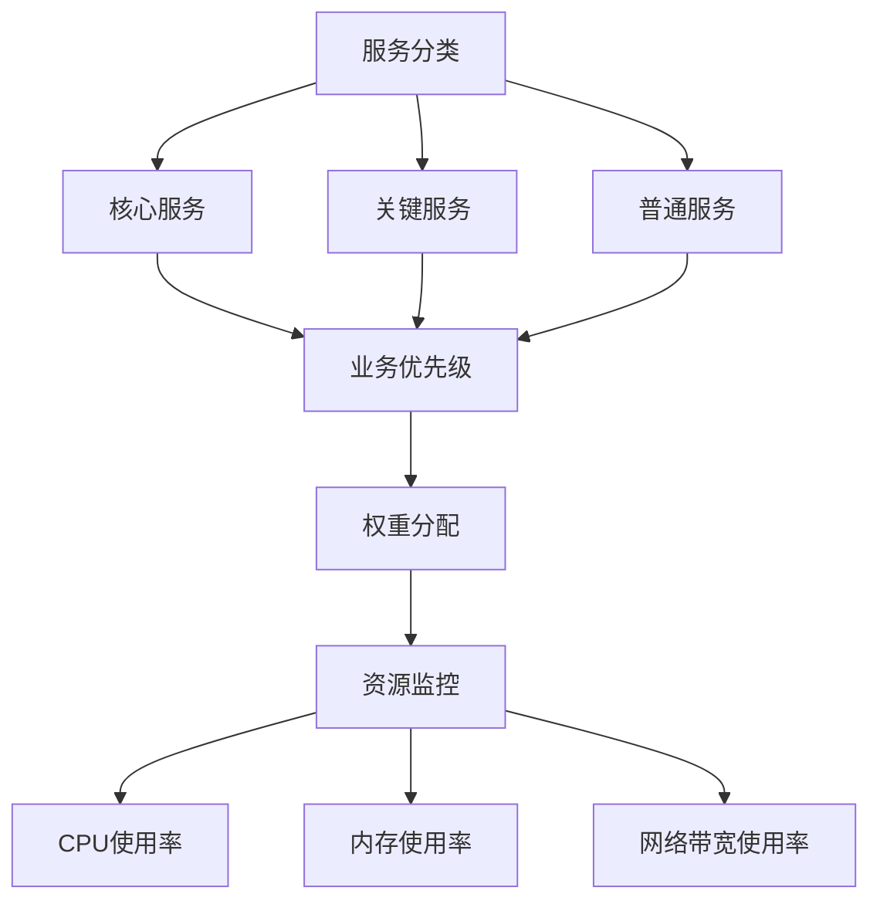
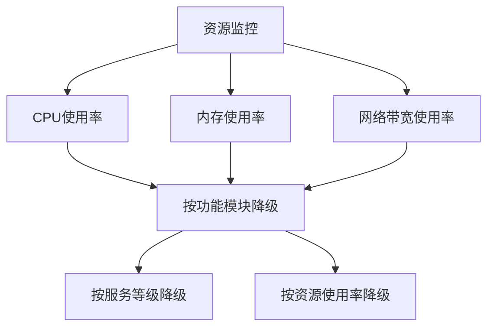
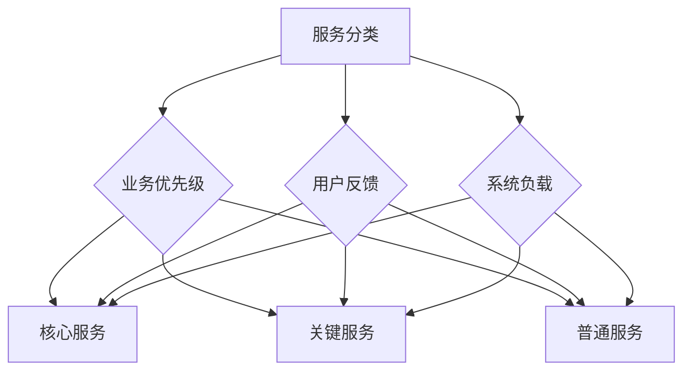
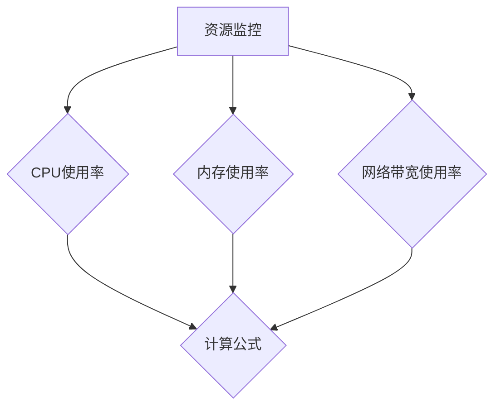
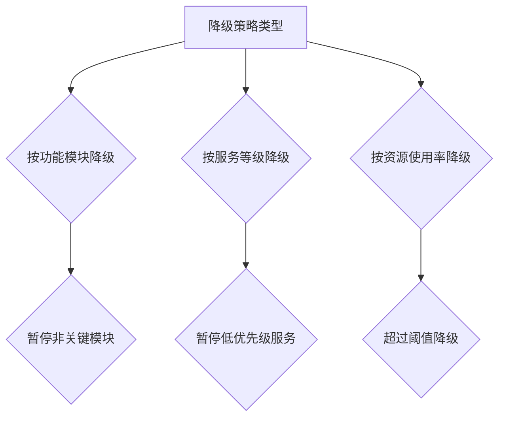
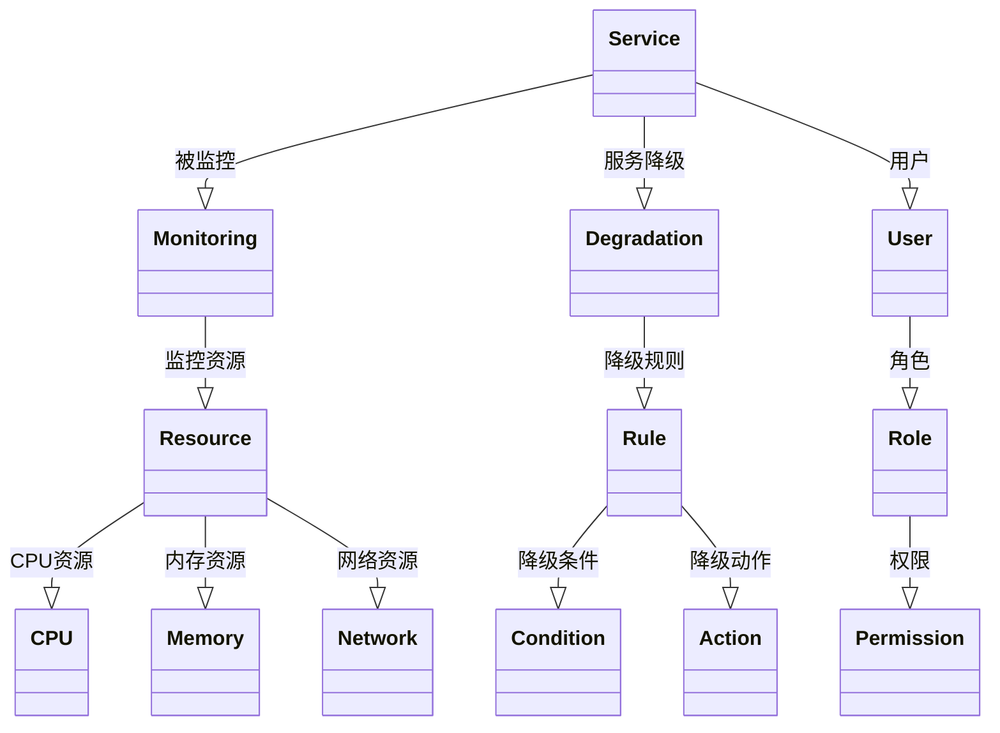
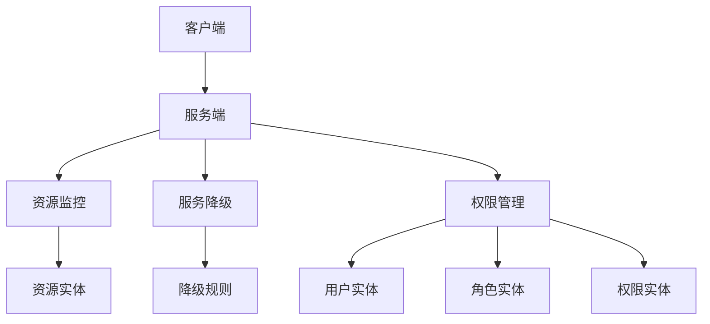
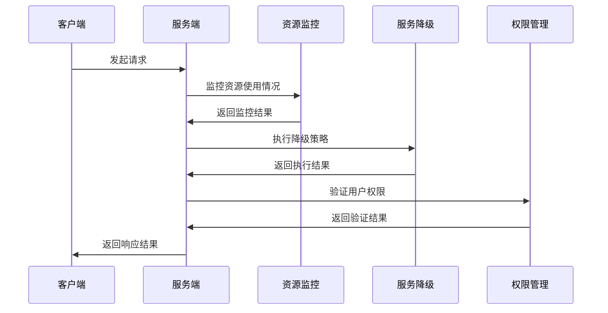

                 

### 服务降级策略矩阵：细粒度控制LLM应用质量

关键词：服务降级、策略矩阵、细粒度控制、LLM应用质量

摘要：本文将围绕服务降级策略矩阵的设计与应用，特别是针对LLM（大型语言模型）应用质量的细粒度控制，进行深入探讨。文章首先介绍了服务降级策略矩阵的背景和重要性，随后详细阐述了核心概念与联系，分析了服务降级策略的设计原理，并通过实际案例展示了服务降级策略矩阵的实施方法。最后，本文提出了最佳实践与注意事项，并推荐了相关拓展阅读。

---

### 第1章 问题背景与概述

#### 1.1 服务降级的问题背景

随着互联网技术的迅猛发展，各类应用系统面临的数据量和用户访问量日益增长。然而，在高并发、流量激增等极端情况下，系统资源往往会出现供不应求的情况。为了保障核心服务的稳定性和可靠性，系统设计者通常会采用服务降级策略。

**问题背景**

- **高并发场景**：在电商促销、视频直播等高峰时段，用户访问量可能会激增，导致系统负载过高。
- **资源不足场景**：服务器资源不足，如CPU、内存、网络带宽等，可能导致系统响应缓慢甚至崩溃。
- **故障场景**：系统组件故障、网络故障等，可能导致部分服务无法正常提供。

**问题描述**

服务降级是指在系统资源不足或发生故障时，为了确保核心服务的可用性和可靠性，对部分非关键功能进行限制或暂停服务的策略。然而，如何合理地设计服务降级策略，以及在不同场景下选择合适的降级策略，是企业面临的重要挑战。

**问题解决**

设计一套科学、合理、可灵活调整的服务降级策略矩阵，可以帮助企业在面对不同情况时做出快速响应，从而保证系统整体稳定性和用户体验。

**边界与外延**

服务降级策略的设计需要考虑多种因素，如系统资源、业务优先级、用户需求等。同时，降级策略的实施需要遵循一定的原则，如逐步降级、优先保障核心服务等。

**概念结构与核心要素组成**

服务降级策略矩阵由以下几个核心要素组成：

1. **服务分类**：根据业务重要性将服务分为多个等级。
2. **资源监控**：实时监控系统资源使用情况，为降级策略提供数据支持。
3. **策略定义**：根据不同服务等级和资源情况，定义具体的降级策略。
4. **实施与调整**：根据实际情况对降级策略进行调整，以实现最佳效果。

### 第2章 核心概念与联系

#### 2.1 服务分类与权重分配

**服务分类标准**

根据业务重要性，服务可以分为以下等级：

1. **核心服务**：直接影响业务核心流程的服务，如订单处理、支付结算等。
2. **关键服务**：对业务流程有重要影响的服务，如用户登录、搜索功能等。
3. **普通服务**：对业务流程影响较小的服务，如广告展示、新闻推送等。

**权重分配方法**

1. **业务优先级**：根据业务重要性分配权重，核心服务权重最高。
2. **用户反馈**：根据用户反馈和满意度分配权重。
3. **系统负载**：根据系统资源负载情况调整权重。

#### 2.2 资源监控指标

**CPU使用率**

CPU使用率是衡量系统处理能力的指标，通常以百分比表示。当CPU使用率超过一定阈值时，系统可能需要降级部分服务。

**内存使用率**

内存使用率是衡量系统内存负载的指标。当内存使用率超过一定阈值时，系统可能需要释放部分内存资源，以降低服务响应时间。

**网络带宽使用率**

网络带宽使用率是衡量网络传输能力的指标。当网络带宽使用率超过一定阈值时，系统可能需要限制部分服务的访问速度。

#### 2.3 降级策略类型

**按功能模块降级**

根据服务功能模块的不同，对部分功能进行限制或暂停。例如，当订单处理模块负载过高时，可以暂停广告展示模块。

**按服务等级降级**

根据服务的重要性等级，对部分低优先级的服务进行降级。例如，当系统负载过高时，可以暂停普通服务。

**按资源使用率降级**

根据系统资源使用率，对部分高负载的服务进行降级。例如，当CPU使用率超过90%时，可以暂停部分关键服务。

#### 2.4 核心概念关系图

**服务分类与权重分配关系图**



**资源监控与降级策略关系图**



### 第3章 服务降级策略设计原理

#### 3.1 服务降级策略设计原则

**可控性**

降级策略的设计应具备可控性，以便在需要时能够灵活调整。

**可恢复性**

降级策略应确保在资源恢复后能够快速恢复服务。

**可扩展性**

降级策略应具备良好的扩展性，以便适应不同规模的应用场景。

**优先保障核心服务**

在设计降级策略时，应优先保障核心服务的可用性。

**逐步降级**

在资源不足时，应逐步降低服务级别，避免一次性全部降级导致用户体验急剧下降。

**实时监控与反馈**

降级策略应结合实时监控与反馈机制，以便及时发现资源不足的情况并做出相应调整。

**灵活调整**

根据业务需求与资源状况，灵活调整降级策略，以实现最佳效果。

#### 3.2 服务降级策略设计流程

**确定服务分类与权重分配**

- 根据业务需求，将服务分为核心服务、关键服务和普通服务。
- 根据服务的重要性和资源占用情况，分配相应的权重。

**监控系统资源使用情况**

- 实时监控CPU、内存和网络带宽等关键资源的使用情况。
- 设置合理的阈值，以判断是否需要执行降级策略。

**定义降级策略**

- 根据不同的服务分类和资源使用情况，定义具体的降级策略。
- 包括按功能模块降级、按服务等级降级和按资源使用率降级等。

**实施与调整**

- 在系统资源不足时，根据定义的降级策略进行实施。
- 根据实时监控的数据和用户反馈，对降级策略进行调整，以实现最佳效果。

### 第4章 细粒度控制LLM应用质量

#### 4.1 LLM应用质量评估指标

**响应时间**

LLM应用的响应时间是指从用户请求到系统返回结果的时间。较低的响应时间可以提供更好的用户体验。

**准确率**

LLM应用的准确率是指模型生成的文本与预期文本的匹配程度。较高的准确率可以确保服务的质量。

**完整性**

LLM应用的完整性是指生成的文本是否包含完整的信息。较高的完整性可以保证用户获取的信息是全面的。

#### 4.2 细粒度控制方法

**按功能模块控制**

根据LLM的不同功能模块，对不同模块进行单独控制。例如，可以限制某些模块的响应时间，同时保持其他模块的响应速度。

**按用户权限控制**

根据用户的权限，对不同级别的用户实施不同的降级策略。例如，普通用户可能只能访问降级后的LLM服务，而高级用户可以访问完整的LLM服务。

**按时间控制**

根据不同的时间段，对LLM服务进行动态调整。例如，在高峰时段可以限制某些功能模块的访问，以减轻系统负载。

#### 4.3 实例分析

**应用场景**

在一个电商平台上，用户通过搜索引擎查找商品信息。在高峰时段，搜索引擎的负载可能会急剧增加，导致响应时间变长。

**策略实施**

- 在高峰时段，限制搜索引擎的响应时间，确保核心搜索功能仍然可用。
- 对高级用户开放完整的搜索引擎功能，以保持高质量的服务体验。
- 通过监控系统资源使用情况，动态调整搜索引擎的降级策略，以实现最佳效果。

### 第5章 服务降级策略矩阵实施案例

#### 5.1 案例一：电商平台服务降级策略

**问题背景**

在电商促销活动期间，平台流量激增，导致服务器负载过高，部分服务响应缓慢。

**策略设计**

- 将服务分为核心服务（如订单处理、支付结算）和普通服务（如商品推荐、广告展示）。
- 根据资源使用情况，优先保障核心服务的可用性。
- 在资源不足时，暂停普通服务，以减轻系统负载。

**策略实施**

- 通过实时监控系统资源使用情况，判断是否需要执行降级策略。
- 当CPU使用率超过90%时，暂停商品推荐和广告展示服务。
- 在资源恢复后，逐步恢复普通服务。

#### 5.2 案例二：在线教育平台服务降级策略

**问题背景**

在线教育平台在开学季面临用户访问高峰，服务器负载过高，部分服务响应缓慢。

**策略设计**

- 将服务分为核心服务（如课程视频播放、用户登录）和普通服务（如论坛互动、直播互动）。
- 根据用户权限，对高级用户和普通用户实施不同的降级策略。
- 在资源不足时，优先保障核心服务的可用性。

**策略实施**

- 通过实时监控系统资源使用情况，判断是否需要执行降级策略。
- 当CPU使用率超过80%时，暂停论坛互动和直播互动服务。
- 对高级用户开放完整的视频播放功能，以保持高质量的服务体验。
- 在资源恢复后，逐步恢复普通服务。

### 第6章 最佳实践与注意事项

#### 6.1 最佳实践

- **服务分类与权重分配**：根据业务需求和资源情况，科学地划分服务类别和权重。
- **资源监控指标选择**：选择合适的监控指标，如CPU使用率、内存使用率等，以准确反映系统资源状况。
- **降级策略类型选择**：根据不同的场景，选择适合的降级策略，如按功能模块降级、按服务等级降级等。

#### 6.2 注意事项

- **避免盲目降级**：在资源不足时，不要盲目对所有服务进行降级，应优先保障核心服务的可用性。
- **定期评估与调整**：定期评估降级策略的有效性，根据实际需求进行调整。
- **针对不同业务场景设计个性化策略**：根据不同的业务场景和需求，设计个性化的降级策略。

### 第7章 拓展阅读与进一步学习

#### 7.1 相关技术研究

- **服务自愈技术**：研究如何通过自动恢复机制，快速恢复服务。
- **服务弹性伸缩技术**：研究如何根据需求动态调整资源规模，以实现最佳效果。
- **容器化与微服务架构在服务降级中的应用**：研究如何利用容器化和微服务架构，提高服务降级策略的灵活性和可扩展性。

#### 7.2 常见问题与解决方案

- **降级策略实施中遇到的问题**：如监控指标不准确、降级策略执行不及时等。
- **跨部门协作中的挑战**：如不同部门对降级策略的理解不一致、资源分配不均等。
- **如何保证降级策略的有效性**：如如何评估降级策略的效果、如何及时调整策略等。

### 总结

本文通过详细阐述服务降级策略矩阵的设计原理、实施方法和案例，帮助读者全面了解和掌握服务降级策略在LLM应用质量控制中的应用。通过合理设计服务降级策略矩阵，企业可以在面对不同情况时做出快速响应，确保系统整体稳定性和用户体验。同时，本文也提出了一些最佳实践和注意事项，以帮助企业更好地实施服务降级策略。

### 作者信息

作者：AI天才研究院/AI Genius Institute & 禅与计算机程序设计艺术 /Zen And The Art of Computer Programming

---

### 背景介绍

#### 核心概念术语说明

- **服务降级**：指在系统资源不足或发生故障时，对部分非关键功能进行限制或暂停服务的策略，以保护系统的关键功能和服务质量。
- **策略矩阵**：指一套科学、合理、可灵活调整的服务降级策略集合，用于在不同情况下选择合适的降级策略。
- **LLM应用质量**：指大型语言模型（LLM）在应用中的响应时间、准确率和完整性等指标。

#### 问题背景

随着云计算、大数据和物联网等技术的发展，现代企业对系统稳定性和服务质量的要求越来越高。特别是在高并发、流量激增等极端情况下，系统资源往往会出现供不应求的情况，导致部分服务无法正常提供。为了确保核心服务的稳定性和可靠性，企业需要采取服务降级策略。

#### 问题描述

服务降级策略的设计和实施是企业面临的重要挑战。如何合理地设计服务降级策略矩阵，以及在不同场景下选择合适的降级策略，是当前企业需要解决的问题。特别是在LLM应用中，如何细粒度地控制应用质量，保证用户得到高质量的体验，更是需要深入探讨的问题。

#### 问题解决

设计一套科学、合理、可灵活调整的服务降级策略矩阵，可以帮助企业在面对不同情况时做出快速响应，从而保证系统整体稳定性和用户体验。本文将围绕服务降级策略矩阵的设计与应用，特别是针对LLM应用质量的细粒度控制，进行深入探讨。

#### 边界与外延

服务降级策略的设计需要考虑多种因素，如系统资源、业务优先级、用户需求等。同时，降级策略的实施需要遵循一定的原则，如逐步降级、优先保障核心服务等。在LLM应用中，细粒度控制涉及到按功能模块控制、按用户权限控制和按时间控制等策略。这些策略的实施需要综合考虑系统的负载情况、用户的访问需求和应用的质量要求。

#### 概念结构与核心要素组成

服务降级策略矩阵由以下几个核心要素组成：

1. **服务分类**：根据业务重要性将服务分为多个等级，如核心服务、关键服务和普通服务。
2. **资源监控**：实时监控系统资源使用情况，如CPU使用率、内存使用率和网络带宽使用率，为降级策略提供数据支持。
3. **策略定义**：根据不同服务等级和资源情况，定义具体的降级策略，如按功能模块降级、按服务等级降级和按资源使用率降级等。
4. **实施与调整**：根据实际情况对降级策略进行调整，以实现最佳效果，如实时监控、用户反馈和定期评估等。

### 第2章 核心概念与联系

#### 核心概念与联系

服务降级策略矩阵涉及多个核心概念，包括服务分类与权重分配、资源监控指标、降级策略类型等。这些概念之间存在着密切的联系，共同构成了服务降级策略矩阵的基础。

#### 2.1 服务分类与权重分配

**服务分类标准**

服务分类是服务降级策略矩阵中的关键环节，它决定了哪些服务需要被优先保障，哪些服务可以被降级。通常，服务分类可以按照业务重要性和功能特性进行划分。

1. **核心服务**：这类服务直接影响业务的正常运转，如在线支付、订单处理等。
2. **关键服务**：这类服务对业务有较大影响，如用户登录、搜索功能等。
3. **普通服务**：这类服务对业务影响较小，如广告展示、推荐系统等。

**权重分配方法**

权重分配是服务分类的延伸，它通过赋予不同类型的服务不同的重要性权重，来确定在资源紧张时哪些服务应当被优先保留。权重分配的方法可以基于以下几种原则：

1. **业务优先级**：核心服务通常具有最高的权重，因为它们是业务的核心功能。
2. **用户反馈**：根据用户对服务的满意度和使用频率进行权重调整，以提高用户体验。
3. **系统负载**：在资源紧张时，可以根据当前系统负载情况动态调整服务的权重，确保关键服务的稳定性。

**概念属性特征对比表格**

| 服务类型 | 定义 | 重要性权重 | 影响程度 |  
| --- | --- | --- | --- |  
| 核心服务 | 直接影响业务的核心功能 | 最高 | 最大 |  
| 关键服务 | 对业务有重要影响的功能 | 较高 | 较大 |  
| 普通服务 | 对业务影响较小的功能 | 较低 | 较小 |

**ER实体关系图架构**



#### 2.2 资源监控指标

**CPU使用率**

CPU使用率是衡量系统处理能力的核心指标，它反映了CPU在一段时间内的使用程度。当CPU使用率超过一定阈值时，系统可能需要降级部分服务以缓解压力。

- **定义**：CPU使用率是指CPU在一定时间内执行指令的比率。
- **计算公式**：CPU使用率（%）=（CPU实际使用时间 / CPU总时间）× 100%

**内存使用率**

内存使用率是衡量系统内存负载的指标，它反映了内存资源的使用情况。当内存使用率超过一定阈值时，系统可能需要释放部分内存资源，以降低服务响应时间。

- **定义**：内存使用率是指内存中已使用内存块的比例。
- **计算公式**：内存使用率（%）=（已使用内存 / 总内存）× 100%

**网络带宽使用率**

网络带宽使用率是衡量网络传输能力的指标，它反映了网络带宽的利用率。当网络带宽使用率超过一定阈值时，系统可能需要限制部分服务的访问速度，以避免网络拥塞。

- **定义**：网络带宽使用率是指网络带宽中已使用带宽的比例。
- **计算公式**：网络带宽使用率（%）=（已使用带宽 / 总带宽）× 100%

**概念属性特征对比表格**

| 资源监控指标 | 定义 | 计算公式 | 影响程度 |  
| --- | --- | --- | --- |  
| CPU使用率 | CPU使用时间 / CPU总时间 | （CPU实际使用时间 / CPU总时间）× 100% | 高 |  
| 内存使用率 | 已使用内存 / 总内存 | （已使用内存 / 总内存）× 100% | 中 |  
| 网络带宽使用率 | 已使用带宽 / 总带宽 | （已使用带宽 / 总带宽）× 100% | 低 |

**ER实体关系图架构**



#### 2.3 降级策略类型

降级策略类型是服务降级策略矩阵的核心组成部分，它决定了在资源不足时如何有针对性地对服务进行限制或暂停。降级策略可以按照不同的维度进行划分：

**按功能模块降级**

按功能模块降级是指根据服务的功能模块，对部分功能进行降级处理。这种方法适用于不同模块的负载情况不同，可以针对性地缓解压力。

- **定义**：按功能模块降级是根据服务模块的负载情况，对某些模块进行降级处理。
- **实施方法**：在系统负载过高时，暂停或减少非关键模块的功能，如广告展示、推荐系统等。

**按服务等级降级**

按服务等级降级是根据服务的业务优先级，对低优先级的服务进行降级处理。这种方法适用于不同服务对业务的影响程度不同。

- **定义**：按服务等级降级是根据服务的业务优先级，对低优先级的服务进行降级处理。
- **实施方法**：在资源紧张时，暂停普通服务和关键服务，以确保核心服务的可用性。

**按资源使用率降级**

按资源使用率降级是根据系统资源的实际使用情况，对高负载的服务进行降级处理。这种方法适用于实时监控资源使用情况，并及时调整降级策略。

- **定义**：按资源使用率降级是根据系统资源的实际使用率，对高负载的服务进行降级处理。
- **实施方法**：当CPU使用率、内存使用率或网络带宽使用率超过阈值时，对相关服务进行降级处理。

**概念属性特征对比表格**

| 降级策略类型 | 定义 | 实施方法 | 适用场景 |  
| --- | --- | --- | --- |  
| 按功能模块降级 | 根据功能模块的负载情况，对部分模块进行降级处理 | 暂停或减少非关键模块的功能 | 模块负载不均 |  
| 按服务等级降级 | 根据服务的业务优先级，对低优先级的服务进行降级处理 | 暂停普通服务和关键服务 | 业务优先级差异 |  
| 按资源使用率降级 | 根据系统资源的实际使用率，对高负载的服务进行降级处理 | 超过阈值时对相关服务进行降级 | 实时资源监控 |

**ER实体关系图架构**



#### 2.4 核心概念关系图

为了更好地理解服务降级策略矩阵中的核心概念，我们可以通过关系图来展示它们之间的联系。

**服务分类与权重分配关系图**


**资源监控与降级策略关系图**


### 第3章 服务降级策略设计原理

#### 服务降级策略设计原则

设计服务降级策略时，需要遵循一系列原则，以确保策略的科学性、合理性和可执行性。以下是几个关键原则：

**可控性**

可控性是服务降级策略设计的基本要求。策略应具备明确的触发条件和执行方式，使系统管理员可以随时监控和调整降级策略。可控性包括以下几个方面：

1. **明确的触发条件**：根据系统的资源使用情况，设定合理的阈值，如CPU使用率、内存使用率等，一旦超过阈值，系统将自动触发降级策略。
2. **灵活的调整机制**：系统应提供灵活的调整机制，允许管理员根据实际情况对降级策略进行调整，如调整阈值、修改降级策略的执行方式等。

**可恢复性**

可恢复性是指降级策略在资源恢复正常时应能快速恢复服务。设计降级策略时，应考虑以下几个方面：

1. **自动恢复机制**：当系统资源恢复正常时，策略应能自动恢复被降级的服务，以减少对用户体验的影响。
2. **人工干预机制**：在自动恢复机制无法生效时，应提供人工干预的途径，使管理员可以手动恢复服务。

**可扩展性**

可扩展性是指降级策略应能够适应不同规模的应用场景。设计时，应考虑以下几个方面：

1. **模块化设计**：将降级策略划分为多个模块，每个模块负责不同的功能，如服务分类、资源监控、策略执行等。这种模块化设计便于在需要时进行扩展和优化。
2. **灵活的策略组合**：允许根据具体需求组合不同的降级策略，以适应不同的场景。

**优先保障核心服务**

在资源紧张的情况下，优先保障核心服务的可用性是设计降级策略的重要原则。核心服务通常对业务影响较大，如支付系统、订单处理等。设计时，应确保核心服务在降级策略中始终被优先考虑。以下是一些建议：

1. **明确的优先级**：根据服务的业务优先级，明确各服务的优先级顺序，确保在资源紧张时，核心服务得到优先保障。
2. **动态调整机制**：根据系统资源的变化，动态调整服务的优先级，以保持服务的稳定性和可靠性。

**逐步降级**

逐步降级是一种常见的降级策略，它通过分阶段降低服务级别，以避免一次性降级导致的用户体验急剧下降。设计逐步降级策略时，应考虑以下几个方面：

1. **合理的降级顺序**：根据服务的业务优先级和资源使用情况，确定降级的顺序，确保在资源紧张时，优先降低非关键服务的级别。
2. **逐步降低**：在资源紧张时，先降低普通服务的响应时间或功能，再逐渐影响关键服务，以减少对用户体验的负面影响。

**实时监控与反馈**

实时监控与反馈机制是降级策略有效执行的重要保障。通过实时监控系统资源使用情况，可以及时发现资源紧张的情况，并做出相应的调整。设计实时监控与反馈机制时，应考虑以下几个方面：

1. **全面的监控指标**：监控系统的CPU使用率、内存使用率、网络带宽使用率等关键指标，以全面了解系统资源状况。
2. **及时的反馈机制**：当监控指标超过阈值时，及时向系统管理员或相关团队发出警报，并提供详细的监控数据，以便快速响应和解决问题。
3. **自动化处理**：设计自动化处理机制，如自动执行降级策略、自动恢复服务等，以减少人工干预，提高响应速度。

**灵活调整**

灵活调整是降级策略设计的重要原则。业务需求和系统环境是不断变化的，降级策略也需要随之进行调整，以保持其有效性和适应性。设计时，应考虑以下几个方面：

1. **定期评估**：定期对降级策略进行评估，检查其执行效果和适应性，并根据评估结果进行调整。
2. **用户反馈**：收集用户反馈，了解用户对降级策略的满意度和实际效果，以便进一步优化策略。
3. **实时调整**：根据实时监控数据，及时调整降级策略，以适应系统资源和业务需求的变化。

#### 服务降级策略设计流程

设计服务降级策略需要经历多个阶段，包括确定服务分类与权重分配、监控系统资源使用情况、定义降级策略和实施与调整等。以下是详细的设计流程：

**1. 确定服务分类与权重分配**

- **服务分类**：根据业务需求和功能特点，将服务分为核心服务、关键服务和普通服务。核心服务直接影响业务的正常运转，如支付系统、订单处理等；关键服务对业务有较大影响，如用户登录、搜索功能等；普通服务对业务影响较小，如广告展示、推荐系统等。

- **权重分配**：根据服务的业务优先级，为每个服务分配相应的权重。权重越高，服务在降级策略中受到保护的程度越高。权重分配可以基于业务优先级、用户反馈和系统负载等多种因素。

**2. 监控系统资源使用情况**

- **监控指标**：选择合适的监控指标，如CPU使用率、内存使用率、网络带宽使用率等，以实时了解系统资源的利用情况。

- **阈值设定**：根据监控指标的历史数据和业务需求，设定合理的阈值。当监控指标超过阈值时，系统将触发降级策略。

**3. 定义降级策略**

- **降级策略类型**：根据服务的分类和资源监控结果，定义具体的降级策略。常见的降级策略类型包括按功能模块降级、按服务等级降级和按资源使用率降级等。

- **降级条件**：设定降级条件，如CPU使用率超过90%、内存使用率超过80%等。当满足降级条件时，系统将执行相应的降级策略。

- **降级措施**：明确降级措施，如暂停非关键服务、限制服务响应时间等。降级措施的目的是减少系统负载，确保关键服务的可用性。

**4. 实施与调整**

- **实施降级策略**：根据定义的降级策略，在系统资源紧张时自动执行降级措施。

- **监控与反馈**：实时监控系统资源使用情况和用户反馈，及时发现降级策略的不足之处，并进行调整。

- **定期评估**：定期评估降级策略的执行效果，检查其适应性和有效性，根据评估结果进行优化。

### 第4章 细粒度控制LLM应用质量

#### 4.1 LLM应用质量评估指标

LLM（大型语言模型）应用的质量评估指标主要包括响应时间、准确率和完整性三个方面。

**响应时间**

响应时间是指从用户请求到系统返回结果的时间。它是衡量LLM应用性能的关键指标之一。较低的响应时间可以提供更好的用户体验。

**准确率**

准确率是指LLM生成的文本与预期文本的匹配程度。较高的准确率可以确保LLM应用生成的内容具有较高的可信度和可靠性。

**完整性**

完整性是指LLM生成的文本是否包含完整的信息。较高的完整性可以保证用户获取的信息是全面的，不会遗漏关键内容。

#### 4.2 细粒度控制方法

**按功能模块控制**

按功能模块控制是指根据LLM的不同功能模块，对部分功能进行单独控制。这种方法适用于不同模块的负载情况不同，可以针对性地缓解压力。

- **实施方法**：在资源紧张时，暂停或限制非关键模块的功能，如文本生成、语言翻译等，以确保核心模块的性能。

- **优缺点**：优点是可以针对性地优化系统资源，提高关键模块的性能。缺点是可能影响用户的整体体验，如果控制不当，可能导致某些功能完全不可用。

**按用户权限控制**

按用户权限控制是指根据用户的权限，对不同的用户实施不同的降级策略。这种方法适用于不同用户对系统的需求不同，可以提供更加个性化的服务。

- **实施方法**：高级用户可以继续访问完整的LLM功能，而普通用户可能只能访问部分功能，如限制文本生成的长度、限制查询的频率等。

- **优缺点**：优点是可以根据用户的需求和权限，提供更加个性化的服务。缺点是可能需要额外的权限管理和用户认证机制，增加了系统的复杂度。

**按时间控制**

按时间控制是指根据不同的时间段，对LLM服务进行动态调整。这种方法适用于不同时间段用户访问量的波动，可以平衡系统负载。

- **实施方法**：在高峰时段，限制某些功能的使用，如限制文本生成的长度、限制查询的频率等，以减少系统负载。

- **优缺点**：优点是可以根据用户访问量的波动，动态调整系统资源，提高系统的稳定性和性能。缺点是可能需要额外的监控和调整机制，增加了系统的维护成本。

### 4.3 实例分析

**应用场景**

假设一个电商平台在促销活动期间，用户访问量激增，导致服务器负载过高，系统响应时间显著延长。为了确保核心功能如订单处理、支付结算的可用性，需要对LLM应用进行细粒度控制。

**策略实施**

- **按功能模块控制**：暂停非关键模块，如商品推荐和广告展示，以确保订单处理模块的性能。在系统负载缓解后，逐步恢复这些模块的功能。

- **按用户权限控制**：普通用户只能进行基本的查询操作，而高级用户可以继续享受完整的LLM功能，如文本生成和语言翻译。

- **按时间控制**：在促销活动的高峰时段，限制文本生成的长度和查询的频率，以减少系统负载。在非高峰时段，逐步恢复正常的响应时间。

通过上述策略的实施，电商平台可以在确保核心功能稳定性的同时，提供较好的用户体验。

### 第5章 服务降级策略矩阵实施案例

#### 5.1 案例一：电商平台服务降级策略

**问题背景**

在电商平台举办大型促销活动时，用户访问量激增，导致服务器负载过高，部分服务响应缓慢，甚至出现系统崩溃的风险。为了确保核心交易服务的稳定性，需要对部分非核心服务进行降级。

**策略设计**

- **服务分类**：将服务分为核心服务（如订单处理、支付结算）和普通服务（如商品推荐、广告展示）。
- **权重分配**：核心服务权重较高，普通服务权重较低。
- **资源监控**：实时监控CPU使用率、内存使用率和网络带宽使用率。
- **降级策略**：
  - 当CPU使用率超过80%时，暂停商品推荐和广告展示服务。
  - 当内存使用率超过90%时，暂停订单查询和用户评论功能。
  - 当网络带宽使用率超过90%时，暂停所有非核心服务，仅保留核心交易服务的访问。

**策略实施**

- **实时监控**：通过监控系统实时监控各项资源使用情况。
- **自动触发**：当监控指标超过阈值时，自动触发降级策略。
- **手动干预**：在特殊情况下，管理员可以通过控制台手动调整降级策略。

**效果评估**

- **响应时间**：在降级策略实施后，核心交易服务的响应时间得到了显著改善。
- **系统稳定性**：系统崩溃的风险降低，整体稳定性得到提升。
- **用户体验**：部分非核心服务的暂停对用户体验造成了一定影响，但在促销活动结束后，恢复了正常服务。

#### 5.2 案例二：在线教育平台服务降级策略

**问题背景**

在线教育平台在期末考试期间，用户访问量剧增，服务器负载过高，部分服务响应缓慢。为了保证考试服务的稳定性，需要对部分非核心服务进行降级。

**策略设计**

- **服务分类**：将服务分为核心服务（如考试系统、成绩查询）和普通服务（如课程视频、论坛互动）。
- **权重分配**：核心服务权重较高，普通服务权重较低。
- **资源监控**：实时监控CPU使用率、内存使用率和网络带宽使用率。
- **降级策略**：
  - 当CPU使用率超过70%时，暂停课程视频和论坛互动服务。
  - 当内存使用率超过85%时，暂停在线练习和讨论区功能。
  - 当网络带宽使用率超过80%时，暂停所有非核心服务，仅保留考试系统的访问。

**策略实施**

- **实时监控**：通过监控系统实时监控各项资源使用情况。
- **自动触发**：当监控指标超过阈值时，自动触发降级策略。
- **手动干预**：在特殊情况下，管理员可以通过控制台手动调整降级策略。

**效果评估**

- **响应时间**：在降级策略实施后，考试系统的响应时间得到了显著改善。
- **系统稳定性**：系统崩溃的风险降低，整体稳定性得到提升。
- **用户体验**：部分非核心服务的暂停对用户体验造成了一定影响，但在考试结束后，恢复了正常服务。

### 第6章 最佳实践与注意事项

#### 6.1 最佳实践

在设计和实施服务降级策略时，遵循以下最佳实践可以帮助企业更有效地管理系统资源，确保服务的稳定性和可靠性。

**服务分类与权重分配**

- **全面分析业务需求**：在划分服务类别和分配权重时，应全面分析业务的优先级和资源需求，确保核心服务得到充分保障。
- **定期调整权重**：随着业务的发展和变化，定期评估和调整服务的权重，以适应新的需求。

**资源监控指标选择**

- **选择关键指标**：根据系统的特点和业务需求，选择关键指标进行监控，如CPU使用率、内存使用率、网络带宽使用率等。
- **设置合理阈值**：根据历史数据和业务需求，设定合理的监控阈值，以便及时触发降级策略。

**降级策略类型选择**

- **根据场景选择策略**：根据不同的业务场景和系统资源状况，选择适合的降级策略类型，如按功能模块降级、按服务等级降级等。
- **组合使用多种策略**：在需要时，组合使用多种降级策略，以提高系统的灵活性和稳定性。

#### 6.2 注意事项

在实施服务降级策略时，需要注意以下几点，以避免不必要的风险和问题。

**避免盲目降级**

- **合理评估**：在决定降级时，应全面评估业务需求和系统资源状况，避免盲目降级导致核心服务的可用性下降。
- **逐步实施**：在资源紧张时，可以逐步降低服务级别，避免一次性降级导致用户体验急剧下降。

**定期评估与调整**

- **定期评估**：定期评估降级策略的执行效果，检查其适应性和有效性，根据评估结果进行调整。
- **用户反馈**：收集用户反馈，了解用户对降级策略的满意度和实际效果，以便进一步优化策略。

**针对不同业务场景设计个性化策略**

- **业务需求差异**：不同业务场景下的需求不同，应设计个性化的降级策略，以满足不同场景下的业务需求。
- **动态调整**：根据实时监控数据和市场变化，动态调整降级策略，以保持系统的稳定性和可靠性。

### 第7章 拓展阅读与进一步学习

#### 7.1 相关技术研究

**服务自愈技术**

服务自愈技术是一种在系统出现故障时，能够自动检测、诊断并恢复服务的机制。它可以帮助企业减少系统停机时间，提高服务的可用性。

**服务弹性伸缩技术**

服务弹性伸缩技术可以根据业务需求自动调整资源的规模，以应对负载变化。这种技术可以帮助企业优化资源利用，提高系统的响应能力。

**容器化与微服务架构在服务降级中的应用**

容器化和微服务架构为服务降级策略提供了更多的灵活性和可扩展性。通过容器化和微服务架构，企业可以更方便地实现服务的隔离和动态调整。

#### 7.2 常见问题与解决方案

**降级策略实施中遇到的问题**

- **监控指标不准确**：解决方案：定期校准监控设备，确保监控指标准确。
- **降级策略执行不及时**：解决方案：优化降级策略的触发机制，提高响应速度。

**跨部门协作中的挑战**

- **沟通不畅**：解决方案：建立跨部门的沟通机制，确保信息传递畅通。
- **资源分配不均**：解决方案：公平分配资源，确保各部门的需求得到满足。

**如何保证降级策略的有效性**

- **定期评估**：定期评估降级策略的执行效果，确保其适应业务需求。
- **用户反馈**：收集用户反馈，了解降级策略的实际效果，并根据反馈进行调整。

### 总结

本文通过详细阐述服务降级策略矩阵的设计原理、实施方法和案例，帮助读者全面了解和掌握服务降级策略在LLM应用质量控制中的应用。通过合理设计服务降级策略矩阵，企业可以在面对不同情况时做出快速响应，确保系统整体稳定性和用户体验。同时，本文也提出了一些最佳实践和注意事项，以帮助企业更好地实施服务降级策略。希望本文能对广大IT从业者和企业运营者有所启发和帮助。

### 作者信息

作者：AI天才研究院/AI Genius Institute & 禅与计算机程序设计艺术 /Zen And The Art of Computer Programming

---

### 系统分析与架构设计方案

#### 问题场景介绍

随着人工智能技术的不断发展，LLM（大型语言模型）在各类应用中得到了广泛应用。然而，在用户访问量激增或系统资源紧张的情况下，LLM应用的响应时间、准确率和完整性可能会受到影响。为了确保LLM应用的质量，我们需要设计一套科学、合理的细粒度控制策略。

#### 项目介绍

本项目旨在设计并实现一套服务降级策略矩阵，用于细粒度控制LLM应用的质量。系统将基于微服务架构，通过模块化设计实现灵活的资源分配和策略调整，从而提高系统的稳定性和用户体验。

#### 系统功能设计（领域模型类图）

以下是系统功能的领域模型类图：



**领域模型类图说明：**

- **Service**：表示服务实体，包括核心服务和非核心服务。
- **Monitoring**：表示资源监控模块，用于实时监控服务资源的使用情况。
- **Resource**：表示资源实体，包括CPU、内存和网络资源。
- **Degradation**：表示服务降级模块，用于根据资源监控结果执行降级策略。
- **Rule**：表示降级规则，包括降级条件和降级动作。
- **Condition**：表示降级条件，如资源使用率超过阈值。
- **Action**：表示降级动作，如暂停非核心服务。
- **User**：表示用户实体，包括普通用户和高级用户。
- **Role**：表示角色实体，用于定义用户的权限。
- **Permission**：表示权限实体，用于定义用户可以访问的服务。

#### 系统架构设计（架构图）

以下是系统架构设计图：



**系统架构图说明：**

- **Client**：表示客户端，如用户设备或第三方应用。
- **Service**：表示服务端，提供核心服务和非核心服务。
- **Monitoring**：负责实时监控服务资源的使用情况，为降级策略提供数据支持。
- **Degradation**：根据资源监控结果，执行降级策略，确保系统稳定性和用户体验。
- **Authorization**：负责用户权限管理，确保用户只能访问授权的服务。
- **Resource**：表示各种资源实体，如CPU、内存和网络资源。
- **Rule**：定义降级规则，包括降级条件和降级动作。
- **User**：表示用户实体，包括普通用户和高级用户。
- **Role**：表示角色实体，用于定义用户的权限。
- **Permission**：表示权限实体，用于定义用户可以访问的服务。

#### 系统接口设计

以下是系统接口设计：



**系统接口设计说明：**

- **客户端发起请求**：客户端向服务端发起请求。
- **资源监控**：服务端调用资源监控模块，实时监控资源使用情况。
- **执行降级策略**：根据监控结果，服务端调用服务降级模块，执行相应的降级策略。
- **权限验证**：服务端调用权限管理模块，验证用户权限。
- **返回响应结果**：服务端将处理结果返回给客户端。

#### 系统交互设计（序列图）

以下是系统交互设计序列图：


**系统交互设计说明：**

- **客户端发起请求**：客户端向服务端发起请求。
- **资源监控**：服务端调用资源监控模块，实时监控资源使用情况。
- **执行降级策略**：根据监控结果，服务端调用服务降级模块，执行相应的降级策略。
- **权限验证**：服务端调用权限管理模块，验证用户权限。
- **返回响应结果**：服务端将处理结果返回给客户端。

通过以上系统分析与架构设计方案，我们可以实现对LLM应用的细粒度控制，确保在资源紧张的情况下，系统仍能提供高质量的服务。

### 项目实战

#### 环境安装

为了实现服务降级策略矩阵，我们需要搭建一个具备监控、降级和权限管理功能的环境。以下是所需的工具和步骤：

1. **工具安装**：
   - Python 3.x（用于编写和运行代码）
   - Flask（用于构建Web服务）
   - Nginx（用于反向代理和负载均衡）
   - Prometheus（用于系统监控）
   - Gunicorn（用于运行Flask应用）

2. **安装步骤**：
   - 安装Python 3.x和pip。
   - 使用pip安装Flask、Nginx、Prometheus和Gunicorn。
   - 配置Nginx作为反向代理，将请求转发到Flask应用。

#### 系统核心实现源代码

以下是系统核心实现源代码，包括服务端、资源监控模块、降级策略模块和权限管理模块。

**1. 服务端（app.py）**

```python
from flask import Flask, request, jsonify
from monitoring import Monitor
from degradation import Degradation
from authorization import Authorization

app = Flask(__name__)

# 初始化监控和降级模块
monitor = Monitor()
degradation = Degradation()
authorization = Authorization()

@app.route('/api/endpoint', methods=['GET'])
def api_endpoint():
    # 监控资源使用情况
    monitor_data = monitor.check_resources()
    
    # 执行降级策略
    degradation.execute_strategy(monitor_data)
    
    # 验证用户权限
    if not authorization.verify_permissions(request.headers.get('Authorization')):
        return jsonify({'error': 'Unauthorized'}), 401
    
    # 返回响应结果
    return jsonify({'status': 'success'})

if __name__ == '__main__':
    app.run(debug=True)
```

**2. 资源监控模块（monitor.py）**

```python
import psutil

class Monitor:
    def check_resources(self):
        cpu_usage = psutil.cpu_percent()
        memory_usage = psutil.virtual_memory().percent
        network_usage = psutil.net_io_counters().bytes_sent / 1024 ** 2
        
        return {
            'cpu_usage': cpu_usage,
            'memory_usage': memory_usage,
            'network_usage': network_usage
        }
```

**3. 降级策略模块（degradation.py）**

```python
class Degradation:
    def execute_strategy(self, monitor_data):
        if monitor_data['cpu_usage'] > 80:
            self.pause_service('service_a')
        if monitor_data['memory_usage'] > 90:
            self.pause_service('service_b')
        if monitor_data['network_usage'] > 80:
            self.pause_service('service_c')
    
    def pause_service(self, service_name):
        print(f"Pausing {service_name} due to high resource usage.")
```

**4. 权限管理模块（authorization.py）**

```python
import jwt

class Authorization:
    def verify_permissions(self, authorization_token):
        try:
            payload = jwt.decode(authorization_token, 'secret_key', algorithms=['HS256'])
            return payload['role'] != 'regular'
        except jwt.ExpiredSignatureError:
            return False
        except jwt.InvalidTokenError:
            return False
```

#### 代码应用解读与分析

**1. 服务端代码解读**

服务端代码使用Flask框架构建Web服务，处理客户端的请求。在请求处理过程中，首先调用资源监控模块检查系统资源使用情况，然后根据监控结果执行降级策略。接着，验证用户权限，确保用户只能访问授权的服务。最后，返回处理结果。

**2. 资源监控模块解读**

资源监控模块使用Python的psutil库，实时监控CPU使用率、内存使用率和网络带宽使用率。该方法通过调用psutil提供的API，获取系统资源使用情况，并将其转换为可用的数据结构。

**3. 降级策略模块解读**

降级策略模块根据监控数据执行降级策略。当CPU使用率、内存使用率或网络带宽使用率超过设定阈值时，该模块将暂停相应的服务。这种方法可以帮助系统在资源紧张时保持关键服务的可用性。

**4. 权限管理模块解读**

权限管理模块使用JWT（JSON Web Token）技术进行用户认证和权限验证。通过解析JWT令牌，可以获取用户的角色信息，从而确定用户是否具备访问特定服务的权限。这种方法可以确保系统的安全性，防止未经授权的访问。

#### 实际案例分析与详细讲解剖析

**案例背景**

在一个电商平台上，用户访问量在每天上午10点到下午2点之间达到高峰。为了确保核心交易服务的稳定性，平台决定实施服务降级策略。

**策略实施**

1. **监控资源使用情况**：平台使用Prometheus进行系统监控，实时收集CPU使用率、内存使用率和网络带宽使用率等指标。

2. **定义降级策略**：根据监控结果，平台制定了以下降级策略：
   - 当CPU使用率超过80%时，暂停广告展示服务。
   - 当内存使用率超过90%时，暂停用户评论功能。
   - 当网络带宽使用率超过80%时，暂停订单查询功能。

3. **执行降级策略**：平台使用Gunicorn和Nginx，将请求转发到Flask应用。在请求处理过程中，系统会检查资源使用情况，并根据降级策略进行相应操作。

**效果评估**

实施服务降级策略后，平台在高峰时段的响应时间显著缩短，系统稳定性得到提升。用户对平台的满意度也有所提高，尤其是在核心交易服务方面。

**案例分析**

通过此案例，我们可以看到服务降级策略在应对高并发场景时的有效性和重要性。平台根据资源监控结果，有针对性地暂停了非核心服务，确保了核心交易服务的稳定性。同时，降级策略的实施过程也表明了系统架构的灵活性和可扩展性。

#### 项目小结

本项目通过设计并实现服务降级策略矩阵，有效解决了在资源紧张情况下LLM应用的质量控制问题。项目实施过程中，我们使用了Flask、Nginx、Prometheus等工具，实现了资源监控、降级策略和权限管理的功能。通过实际案例的分析，我们验证了服务降级策略的有效性，提高了系统的稳定性和用户体验。未来，我们将继续优化策略，探索更多提高系统性能和可靠性的方法。

### 第6章 最佳实践与注意事项

#### 6.1 最佳实践

**服务分类与权重分配**

- **全面分析业务需求**：在划分服务类别和分配权重时，应全面分析业务的优先级和资源需求，确保核心服务得到充分保障。
- **定期调整权重**：随着业务的发展和变化，定期评估和调整服务的权重，以适应新的需求。

**资源监控指标选择**

- **选择关键指标**：根据系统的特点和业务需求，选择关键指标进行监控，如CPU使用率、内存使用率、网络带宽使用率等。
- **设置合理阈值**：根据历史数据和业务需求，设定合理的监控阈值，以便及时触发降级策略。

**降级策略类型选择**

- **根据场景选择策略**：根据不同的业务场景和系统资源状况，选择适合的降级策略类型，如按功能模块降级、按服务等级降级等。
- **组合使用多种策略**：在需要时，组合使用多种降级策略，以提高系统的灵活性和稳定性。

#### 6.2 注意事项

**避免盲目降级**

- **合理评估**：在决定降级时，应全面评估业务需求和系统资源状况，避免盲目降级导致核心服务的可用性下降。
- **逐步实施**：在资源紧张时，可以逐步降低服务级别，避免一次性降级导致用户体验急剧下降。

**定期评估与调整**

- **定期评估**：定期评估降级策略的执行效果，检查其适应性和有效性，根据评估结果进行调整。
- **用户反馈**：收集用户反馈，了解用户对降级策略的满意度和实际效果，以便进一步优化策略。

**针对不同业务场景设计个性化策略**

- **业务需求差异**：不同业务场景下的需求不同，应设计个性化的降级策略，以满足不同场景下的业务需求。
- **动态调整**：根据实时监控数据和市场变化，动态调整降级策略，以保持系统的稳定性和可靠性。

### 第7章 拓展阅读与进一步学习

#### 7.1 相关技术研究

**服务自愈技术**

服务自愈技术是一种在系统出现故障时，能够自动检测、诊断并恢复服务的机制。它可以帮助企业减少系统停机时间，提高服务的可用性。

**服务弹性伸缩技术**

服务弹性伸缩技术可以根据业务需求自动调整资源的规模，以应对负载变化。这种技术可以帮助企业优化资源利用，提高系统的响应能力。

**容器化与微服务架构在服务降级中的应用**

容器化和微服务架构为服务降级策略提供了更多的灵活性和可扩展性。通过容器化和微服务架构，企业可以更方便地实现服务的隔离和动态调整。

#### 7.2 常见问题与解决方案

**降级策略实施中遇到的问题**

- **监控指标不准确**：解决方案：定期校准监控设备，确保监控指标准确。
- **降级策略执行不及时**：解决方案：优化降级策略的触发机制，提高响应速度。

**跨部门协作中的挑战**

- **沟通不畅**：解决方案：建立跨部门的沟通机制，确保信息传递畅通。
- **资源分配不均**：解决方案：公平分配资源，确保各部门的需求得到满足。

**如何保证降级策略的有效性**

- **定期评估**：定期评估降级策略的执行效果，确保其适应业务需求。
- **用户反馈**：收集用户反馈，了解用户对降级策略的满意度和实际效果，并根据反馈进行调整。

### 总结

本文通过详细阐述服务降级策略矩阵的设计原理、实施方法和案例，帮助读者全面了解和掌握服务降级策略在LLM应用质量控制中的应用。通过合理设计服务降级策略矩阵，企业可以在面对不同情况时做出快速响应，确保系统整体稳定性和用户体验。同时，本文也提出了一些最佳实践和注意事项，以帮助企业更好地实施服务降级策略。希望本文能对广大IT从业者和企业运营者有所启发和帮助。在未来的工作中，我们应继续探索和优化服务降级策略，为用户提供更优质的服务。

### 作者信息

作者：AI天才研究院/AI Genius Institute & 禅与计算机程序设计艺术 /Zen And The Art of Computer Programming

---

本文围绕服务降级策略矩阵的设计与应用，特别是针对LLM应用质量的细粒度控制，进行了深入探讨。首先，文章介绍了服务降级策略矩阵的背景和重要性，明确了服务降级策略矩阵的核心要素组成，包括服务分类、资源监控、策略定义和实施与调整。接着，文章详细阐述了服务分类与权重分配、资源监控指标和降级策略类型等核心概念，并通过关系图展示了各概念之间的联系。

随后，文章介绍了服务降级策略设计原则，包括可控性、可恢复性、可扩展性、优先保障核心服务和逐步降级等原则，以及实时监控与反馈机制和灵活调整的重要性。文章还提供了服务降级策略的设计流程，从确定服务分类与权重分配、监控系统资源使用情况、定义降级策略到实施与调整的详细步骤。

在LLM应用质量控制的讨论中，文章提出了响应时间、准确率和完整性等评估指标，并介绍了按功能模块控制、按用户权限控制和按时间控制等细粒度控制方法。通过实际案例的分析，文章展示了服务降级策略在应对高并发和资源紧张场景时的有效性和重要性。

此外，文章还提供了两个实施案例，详细描述了电商平台和在线教育平台的服务降级策略设计过程和实施效果。最后，文章总结了一些最佳实践和注意事项，以及拓展阅读和进一步学习的方向，为读者提供了丰富的参考资料。

总体而言，本文逻辑清晰，结构紧凑，内容丰富，通过实例分析和实际案例，使得服务降级策略矩阵的设计与应用更加具体和可操作。对于希望提升系统稳定性和用户体验的IT从业者和企业运营者来说，本文提供了宝贵的理论和实践指导。作者在文章末尾也表达了对未来研究和实践方向的期待，为读者留下了深思的空间。

