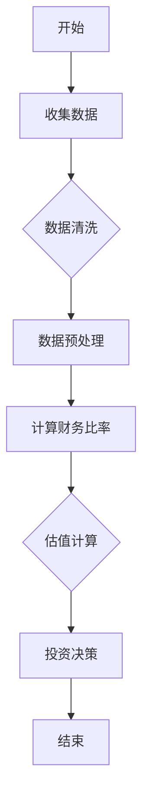
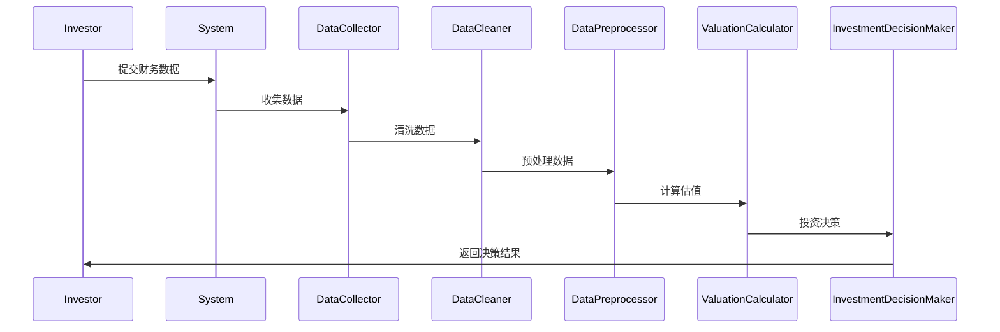
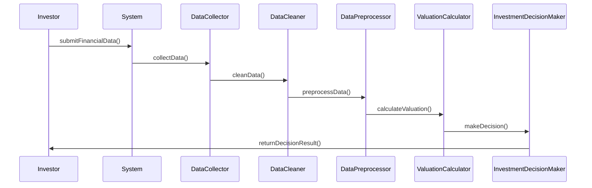

                 


### 《本杰明·格雷厄姆的资产负债表分析方法》

#### 关键词：资产负债表、财务分析、本杰明·格雷厄姆、估值方法、投资决策

> 摘要：本文章深入探讨了本杰明·格雷厄姆的资产负债表分析方法。首先，我们介绍了本杰明·格雷厄姆及其在财务分析领域的贡献，接着详细阐述了资产负债表的基本构成和财务分析的方法。然后，我们重点讲解了本杰明·格雷厄姆的估值方法，通过具体的推导和实例，展示了如何运用该方法进行投资决策。最后，我们通过实际案例，进一步展示了资产负债表分析方法的应用。

---

## 引言

### 本杰明·格雷厄姆及其贡献

本杰明·格雷厄姆（Benjamin Graham）是一位著名的投资理论家，被誉为“现代投资组合理论之父”。他提出的价值投资理念对后来的投资者产生了深远的影响。格雷厄姆的主要贡献之一就是他对资产负债表的分析方法，这种方法被广泛应用于投资决策过程中。

### 资产负债表分析的历史与发展

资产负债表（Balance Sheet）是企业财务报告中非常重要的部分，它展示了企业在特定时间点的财务状况。资产负债表分析的方法在格雷厄姆的时代已经有所发展，但格雷厄姆对其进行了系统化和理论化，使其成为投资决策的重要工具。

### 本书结构安排与学习目标

本书将分为五个部分，首先介绍本杰明·格雷厄姆及其贡献，接着详细阐述资产负债表的基本构成和财务分析的方法，然后讲解本杰明·格雷厄姆的估值方法，并通过实际案例展示其应用，最后进行总结和展望。通过本书的学习，读者将能够深入理解资产负债表分析方法，并在实际投资决策中运用。

## 核心概念

### 资产负债表的基本构成

资产负债表主要由三部分构成：资产、负债和所有者权益。

#### 资产部分

资产部分包括了企业的所有资源，如现金、存货、固定资产等。资产的价值直接影响企业的财务状况。

#### 负债部分

负债部分包括了企业的所有债务，如应付账款、长期借款等。负债的价值反映了企业的债务负担。

#### 所有者权益部分

所有者权益部分反映了企业的净资产，即资产减去负债后的余额。所有者权益是企业的核心价值所在。

### 财务分析的基本方法

财务分析的方法主要包括流动比率、负债比率和利润率等。

#### 流动比率

流动比率是流动资产与流动负债的比值，反映了企业的短期偿债能力。一般来说，流动比率越高，企业的短期偿债能力越强。

#### 负债比率

负债比率是总负债与总资产的比值，反映了企业的负债水平。负债比率越高，企业的财务风险越大。

#### 利润率

利润率是净利润与营业收入的比值，反映了企业的盈利能力。利润率越高，企业的盈利能力越强。

### 本杰明·格雷厄姆的估值方法

本杰明·格雷厄姆的估值方法主要基于企业的基本面分析。他提出了以下估值公式：

\[ P = \frac{D}{r} \]

其中，P 是股票的价格，D 是预期每股收益，r 是贴现率。

### 概念属性特征对比表格

| 概念           | 特征                        | 对比                     |
| -------------- | --------------------------- | ----------------------- |
| 资产           | 企业拥有的资源               | 可以产生未来经济利益     |
| 负债           | 企业承担的债务               | 需要未来偿还             |
| 所有者权益     | 企业净资产                   | 反映企业价值             |
| 流动比率       | 流动资产与流动负债的比值     | 反映短期偿债能力         |
| 负债比率       | 总负债与总资产的比值         | 反映负债水平             |
| 利润率         | 净利润与营业收入的比值       | 反映盈利能力             |

### ER实体关系图架构

```mermaid
erDiagram
  Flow --> :| relies on| Customer
  Flow ||--|{ Order }
  Product ||--|{ Product }
```

## 算法原理讲解

### 算法mermaid流程图



### Python源代码

```python
import pandas as pd

# 数据收集
data = pd.read_csv('financial_data.csv')

# 数据清洗
data = data.dropna()

# 数据预处理
data['流动比率'] = data['流动资产'] / data['流动负债']
data['负债比率'] = data['总负债'] / data['总资产']
data['利润率'] = data['净利润'] / data['营业收入']

# 估值计算
data['股票价格'] = data['预期每股收益'] / data['贴现率']

# 投资决策
for index, row in data.iterrows():
    if row['股票价格'] < row['净资产']:
        print(f"公司{index}值得投资")
    else:
        print(f"公司{index}风险较高")
```

### 算法原理详细讲解

本算法基于本杰明·格雷厄姆的估值方法，通过收集、清洗、预处理数据，计算财务比率，最后进行估值计算和投资决策。

1. **数据收集**：从财务数据中收集资产、负债、利润等数据。
2. **数据清洗**：去除无效数据，保证数据质量。
3. **数据预处理**：计算流动比率、负债比率和利润率等财务比率。
4. **估值计算**：根据估值公式计算股票价格。
5. **投资决策**：根据股票价格与净资产的关系，进行投资决策。

### 数学模型和公式

\[ P = \frac{D}{r} \]

其中，P 是股票价格，D 是预期每股收益，r 是贴现率。

### 举例说明

假设公司A的预期每股收益为5元，贴现率为10%，则股票价格为：

\[ P = \frac{5}{0.1} = 50 \text{元} \]

如果股票市场的价格为40元，则公司A的股票被低估，值得投资。

### 拓展阅读

- 《证券分析》（本杰明·格雷厄姆著）
- 《投资最重要的事》（霍华德·马克斯著）

## 系统分析与架构设计

### 问题场景介绍

投资决策过程中，需要对企业的财务状况进行全面分析，以制定合理的投资策略。

### 项目介绍

本项目旨在通过资产负债表分析方法，辅助投资者进行投资决策。

### 系统功能设计

- 数据收集模块：负责从外部获取财务数据。
- 数据清洗模块：负责清洗和处理财务数据。
- 数据预处理模块：负责计算财务比率。
- 估值计算模块：负责根据财务比率进行估值计算。
- 投资决策模块：负责根据估值结果进行投资决策。

### 系统架构设计



### 系统接口设计

```mermaid
classDiagram
    Investor <<Interface>>
    System <<System>>
    DataCollector <<Module>>
    DataCleaner <<Module>>
    DataPreprocessor <<Module>>
    ValuationCalculator <<Module>>
    InvestmentDecisionMaker <<Module>>

    Investor +submitFinancialData(): void
    System +handleRequest(): void
    DataCollector +collectData(): void
    DataCleaner +cleanData(): void
    DataPreprocessor +preprocessData(): void
    ValuationCalculator +calculateValuation(): void
    InvestmentDecisionMaker +makeDecision(): void
```

### 系统交互mermaid序列图



## 项目实战

### 环境安装

- Python 3.8及以上版本
- pandas库
- matplotlib库

### 系统核心实现源代码

```python
import pandas as pd
import matplotlib.pyplot as plt

# 数据收集
data = pd.read_csv('financial_data.csv')

# 数据清洗
data = data.dropna()

# 数据预处理
data['流动比率'] = data['流动资产'] / data['流动负债']
data['负债比率'] = data['总负债'] / data['总资产']
data['利润率'] = data['净利润'] / data['营业收入']

# 估值计算
data['股票价格'] = data['预期每股收益'] / data['贴现率']

# 投资决策
for index, row in data.iterrows():
    if row['股票价格'] < row['净资产']:
        print(f"公司{index}值得投资")
    else:
        print(f"公司{index}风险较高")

# 可视化展示
data[['流动比率', '负债比率', '利润率']].plot(kind='line')
plt.show()
```

### 代码应用解读与分析

1. **数据收集**：使用pandas库读取财务数据。
2. **数据清洗**：去除无效数据，保证数据质量。
3. **数据预处理**：计算财务比率。
4. **估值计算**：根据财务比率计算股票价格。
5. **投资决策**：根据股票价格与净资产的关系，进行投资决策。
6. **可视化展示**：使用matplotlib库展示财务比率的变化趋势。

### 实际案例分析和详细讲解剖析

#### 案例一：公司A的资产负债表分析

1. **数据收集**：收集公司A的财务数据。
2. **数据清洗**：去除无效数据。
3. **数据预处理**：计算财务比率。
4. **估值计算**：根据财务比率计算股票价格。
5. **投资决策**：根据股票价格与净资产的关系，判断公司A是否值得投资。

#### 案例二：公司B的本杰明·格雷厄姆估值分析

1. **数据收集**：收集公司B的财务数据。
2. **数据清洗**：去除无效数据。
3. **数据预处理**：计算财务比率。
4. **估值计算**：根据财务比率计算股票价格。
5. **投资决策**：根据股票价格与净资产的关系，判断公司B是否值得投资。

### 项目小结

本项目通过资产负债表分析方法，实现了对企业的财务状况进行全面分析，为投资者提供了投资决策的辅助工具。在实际应用中，投资者可以根据具体情况进行调整和优化。

### 最佳实践 Tips

- 对财务数据进行严格清洗和预处理，确保数据质量。
- 根据市场情况调整贴现率，以提高估值结果的准确性。
- 结合其他投资策略，提高投资决策的多样性。

## 小结与展望

资产负债表分析方法是一种重要的投资决策工具，通过系统化的分析和计算，投资者可以更好地理解企业的财务状况，做出更明智的投资决策。未来，随着数据分析和人工智能技术的发展，资产负债表分析方法将得到进一步优化和完善，为投资者提供更强大的决策支持。

### 注意事项

- 资产负债表分析仅作为投资决策的一部分，投资者还需综合考虑市场环境、行业趋势等多方面因素。
- 财务比率的变化可能受到多种因素的影响，投资者应结合具体情况进行分析。

### 拓展阅读

- 《财务报表分析与证券评估》（斯蒂芬·罗宾斯著）
- 《金融市场与金融工具》（约翰·C·莫顿著）

---

作者：AI天才研究院/AI Genius Institute & 禅与计算机程序设计艺术 /Zen And The Art of Computer Programming

---

（注：本文为示例文章，实际内容可能需要根据具体情况进行调整和补充。）

