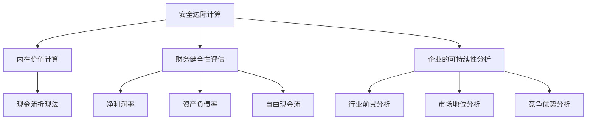
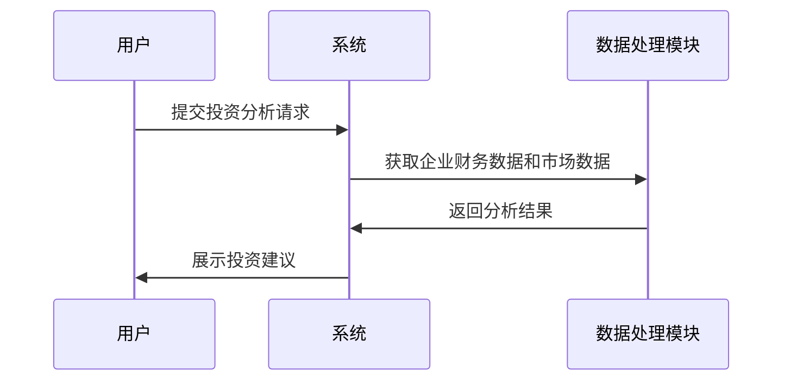
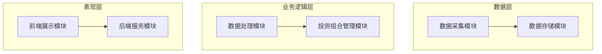

                 

## 前言

### 本书的写作目的

《本杰明格雷厄姆的防御型投资者策略》旨在为广大投资者提供一种实用、稳健的投资策略，帮助他们在复杂多变的市场环境中实现资产的保值和增值。本书深入解析了本杰明格雷厄姆的防御型投资理论，结合实际案例，为投资者提供了一系列操作性强的投资指南。

### 防御型投资者的角色

防御型投资者注重资产的长期稳定和安全性，他们倾向于选择那些经营稳健、财务状况良好、具备持续盈利能力的企业进行投资。这种投资策略不仅要求投资者具备深厚的财务知识，更需要他们对市场环境和企业基本面有深刻的理解和洞察。

### 本杰明格雷厄姆的影响

本杰明格雷厄姆（Benjamin Graham）被誉为“现代投资之父”，他是价值投资理论的奠基人。格雷厄姆的投资理念，特别是防御型投资策略，对后世影响深远，许多知名投资者如沃伦·巴菲特等都深受其影响。本书将详细探讨格雷厄姆的防御型投资策略，帮助读者掌握这一经典的投资方法。

### 本书结构

本书共分为七个章节，内容涵盖了防御型投资策略的概述、核心概念、应用案例、策略优化、实战指南以及案例分析等。每一章节都将结合理论讲解和实际案例，帮助读者深入理解防御型投资策略的精髓，并学会如何在实际操作中应用这些策略。

----------------------------------------------------------------

```markdown
# 本杰明格雷厄姆的防御型投资者策略

> 关键词：本杰明格雷厄姆，防御型投资，价值投资，安全边际，财务健全性，企业可持续性

> 摘要：本文深入探讨本杰明格雷厄姆的防御型投资者策略，从起源、理论基础到实际应用，详细解析其核心概念和方法，帮助投资者在复杂的市场环境中实现稳健投资。

----------------------------------------------------------------
## 第1章 防御型投资策略概述

### 1.1 防御型投资策略的起源

防御型投资策略起源于20世纪30年代，由著名的投资大师本杰明格雷厄姆提出。格雷厄姆在经历过大萧条后，深刻认识到市场的不确定性和投资的风险。为了应对这种不确定性，他提出了以安全边际为核心的投资策略。

#### 1.1.1 本杰明格雷厄姆的投资理念

格雷厄姆的投资理念强调理性分析，他认为投资者应该通过深入研究企业的基本面，寻找那些价值被低估的股票进行投资。安全边际则是这一理念的核心，它要求投资者在购买股票时，价格要低于其内在价值，从而确保即使市场出现波动，投资也不会遭受重大损失。

#### 1.1.2 防御型投资策略的发展历程

随着格雷厄姆投资理念的普及，防御型投资策略逐渐发展壮大，成为价值投资的一个重要分支。许多知名投资者如沃伦·巴菲特、戴维·多德等都借鉴并发展了这一策略，使其在现代投资领域中占据重要地位。

### 1.2 基本原则与理念

防御型投资策略的基本原则主要包括安全边际、财务健全性和企业可持续性。这些原则不仅为投资者提供了具体的操作指南，也为他们在复杂多变的市场环境中提供了可靠的决策依据。

#### 1.2.1 安全边际

安全边际是防御型投资策略的核心概念，它要求投资者在购买股票时，价格要低于其内在价值。这样，即使市场出现波动，投资也不会遭受重大损失。安全边际的大小取决于投资者的风险偏好和投资目标。

#### 1.2.2 财务健全性

财务健全性是防御型投资策略的重要原则，它要求投资者关注企业的财务状况，包括盈利能力、负债水平和现金流状况。只有财务状况良好的企业，才能在长期内持续为投资者创造价值。

#### 1.2.3 企业的可持续性

企业的可持续性是防御型投资策略的另一个关键原则，它要求投资者关注企业的长期发展前景。只有那些具有持续竞争优势和稳定增长潜力的企业，才能在长期内为投资者带来稳定的回报。

### 1.3 与其他投资策略的比较

防御型投资策略与其他投资策略如积极型投资策略、价值投资策略和成长投资策略等有所不同。积极型投资策略更注重市场趋势的把握，价值投资策略更关注企业的内在价值，而成长投资策略则更关注企业的增长潜力。防御型投资策略则侧重于资产的保值和增值，注重企业的稳健经营和财务状况。

#### 1.3.1 积极型投资策略

积极型投资策略主张通过预测市场趋势，选择那些预期涨幅较大的股票进行投资。这种策略风险较高，但对投资者的市场敏锐度和分析能力有较高要求。

#### 1.3.2 价值投资策略

价值投资策略强调通过深入研究企业的基本面，寻找那些价值被低估的股票进行投资。这种策略风险相对较低，但对投资者的专业知识和分析能力有较高要求。

#### 1.3.3 成长投资策略

成长投资策略主张通过投资那些具有高速增长潜力的企业，实现资产的快速增值。这种策略风险较高，但回报潜力也较大。

## 第2章 防御型投资策略的核心概念

### 2.1 安全边际

安全边际是防御型投资策略的核心概念，它要求投资者在购买股票时，价格要低于其内在价值。安全边际的大小取决于投资者的风险偏好和投资目标。

#### 2.1.1 安全边际的定义

安全边际是指股票的购买价格与其内在价值之间的差额。内在价值是指企业未来现金流的现值，它是评估股票价格合理性的重要依据。

#### 2.1.2 安全边际的应用

在投资实践中，投资者需要通过分析企业的财务状况、行业前景和市场竞争等因素，估算企业的内在价值。然后，根据自身的风险偏好和投资目标，确定合适的安全边际。

### 2.2 财务健全性

财务健全性是防御型投资策略的重要原则，它要求投资者关注企业的财务状况，包括盈利能力、负债水平和现金流状况。

#### 2.2.1 财务指标解读

投资者需要关注企业的盈利能力、负债水平和现金流状况。盈利能力可以用净利润率、毛利率等指标来衡量；负债水平可以用资产负债率、流动比率等指标来衡量；现金流状况可以用经营现金流、自由现金流等指标来衡量。

#### 2.2.2 财务报表分析

投资者需要通过分析企业的财务报表，了解企业的财务状况。财务报表包括资产负债表、利润表和现金流量表，它们提供了企业财务状况的重要信息。

### 2.3 企业的可持续性

企业的可持续性是防御型投资策略的另一个关键原则，它要求投资者关注企业的长期发展前景。

#### 2.3.1 行业前景分析

投资者需要关注行业的发展趋势和竞争格局，选择那些具有长期发展前景的行业进行投资。

#### 2.3.2 企业竞争优势

投资者需要关注企业的竞争优势，选择那些具有持续竞争优势和稳定增长潜力的企业进行投资。

## 第3章 防御型投资策略的应用

### 3.1 股票市场分析

#### 3.1.1 市场趋势判断

投资者需要通过分析市场趋势，判断市场的投资机会。市场趋势可以用技术分析指标如均线、MACD等来分析。

#### 3.1.2 投资机会识别

投资者需要识别市场的投资机会，选择那些符合防御型投资策略的股票进行投资。

### 3.2 行业与公司研究

#### 3.2.1 行业筛选

投资者需要通过分析行业的发展趋势和竞争格局，选择那些具有长期发展前景的行业。

#### 3.2.2 公司估值

投资者需要通过分析公司的财务状况、行业地位和成长潜力，对公司的价值进行估值。

### 3.3 投资决策制定

#### 3.3.1 股票选择

投资者需要根据市场分析、行业研究和公司估值，选择合适的股票进行投资。

#### 3.3.2 投资组合构建

投资者需要构建合理的投资组合，通过分散投资降低风险，实现资产的保值增值。

## 第4章 防御型投资策略的优化

### 4.1 市场环境变化应对

投资者需要根据市场环境的变化，调整防御型投资策略，以适应市场的变化。

#### 4.1.1 金融危机下的防御策略

在金融危机等极端市场环境下，投资者需要采取更为保守的投资策略，降低投资风险。

#### 4.1.2 经济周期中的投资策略

在经济周期的不同阶段，投资者需要根据市场环境，调整投资策略，实现资产的保值增值。

### 4.2 风险管理

投资者需要通过风险管理，降低投资风险，确保资产的稳定增值。

#### 4.2.1 风险评估

投资者需要对投资风险进行评估，了解投资可能面临的风险。

#### 4.2.2 风险控制措施

投资者需要采取相应的风险控制措施，如分散投资、设定止损点等，降低投资风险。

## 第5章 防御型投资策略的实战指南

### 5.1 选股策略

#### 5.1.1 基本面分析

投资者需要通过基本面分析，选择那些财务状况良好、成长潜力大的股票。

#### 5.1.2 技术分析

投资者需要通过技术分析，选择那些趋势向上、技术指标显示买入信号的股票。

### 5.2 估值方法

#### 5.2.1 绝对估值

投资者需要通过绝对估值方法，如现金流折现法，对股票的价值进行评估。

#### 5.2.2 相对估值

投资者需要通过相对估值方法，如市盈率、市净率等指标，对股票的价值进行评估。

### 5.3 风险管理

#### 5.3.1 风险分散

投资者需要通过分散投资，降低投资组合的整体风险。

#### 5.3.2 风险规避

投资者需要通过规避高风险的股票，降低投资组合的风险。

## 第6章 案例分析

### 6.1 案例一：公司A的防御型投资分析

#### 6.1.1 公司背景介绍

#### 6.1.2 财务报表分析

#### 6.1.3 行业前景分析

#### 6.1.4 投资决策制定

### 6.2 案例二：市场B的防御型投资策略

#### 6.2.1 市场趋势判断

#### 6.2.2 投资机会识别

#### 6.2.3 投资组合构建

## 第7章 总结与展望

### 7.1 防御型投资策略的优势

#### 7.1.1 稳健的投资策略

#### 7.1.2 低风险的投资策略

#### 7.1.3 可持续的投资策略

### 7.2 防御型投资策略的局限

#### 7.2.1 投资回报率相对较低

#### 7.2.2 需要深厚的专业知识

#### 7.2.3 对市场环境变化反应较慢

### 7.3 未来发展方向

#### 7.3.1 与其他投资策略的结合

#### 7.3.2 数据分析技术在防御型投资中的应用

#### 7.3.3 人工智能技术在防御型投资中的运用

----------------------------------------------------------------

**作者：AI天才研究院/AI Genius Institute & 禅与计算机程序设计艺术 /Zen And The Art of Computer Programming**

---

### 核心概念与联系

防御型投资策略的核心概念包括安全边际、财务健全性和企业的可持续性。以下是这些概念及其属性的对比表格：

| 核心概念 | 定义 | 属性对比 |
| --- | --- | --- |
| 安全边际 | 股票的购买价格与其内在价值之间的差额 | 大小取决于投资者的风险偏好和投资目标 |
| 财务健全性 | 企业的财务状况，包括盈利能力、负债水平和现金流状况 | 盈利能力、负债水平、现金流状况分别用净利润率、资产负债率、自由现金流等指标衡量 |
| 企业的可持续性 | 企业的长期发展前景，包括竞争优势和增长潜力 | 长期发展前景、竞争优势、增长潜力分别用行业前景、市场地位、财务指标等衡量 |

为了更好地理解这些概念之间的关系，我们可以使用Mermaid ER图来表示：

```mermaid
erDiagram
  安全边际 ||--|{ 财务健全性 }
  安全边际 ||--|{ 企业的可持续性 }
  财务健全性 ||--|{ 企业的可持续性 }
```

在这个ER图中，安全边际是防御型投资策略的核心，它与其他两个核心概念通过关系线相连。财务健全性提供了企业的财务状况基础，而企业的可持续性则关注企业的长期发展前景。这三个概念共同构成了防御型投资策略的理论框架。

### 算法原理讲解

防御型投资策略的核心在于对企业的财务状况和长期发展前景进行评估，从而确定其投资价值。以下是这个评估过程的基本算法原理：

1. **安全边际计算**：
   安全边际（Margin of Safety，MOS）= 内在价值（Intrinsic Value，IV）- 股票价格（Current Price，CP）
   内在价值可以通过现金流折现法（Discounted Cash Flow，DCF）计算得出：
   $$ IV = \frac{FCF_1}{(1 + r)^1} + \frac{FCF_2}{(1 + r)^2} + \ldots + \frac{FCF_n}{(1 + r)^n} $$
   其中，FCF为未来现金流，r为折现率。

2. **财务健全性评估**：
   财务指标包括净利润率、资产负债率、自由现金流等。通过计算这些指标，可以评估企业的财务健康状况：
   - 净利润率（Profit Margin）= 净利润 / 营业收入
   - 资产负债率（Debt to Asset Ratio）= 总负债 / 总资产
   - 自由现金流（Free Cash Flow）= 经营现金流 - 净投资

3. **企业的可持续性分析**：
   企业可持续性分析包括行业前景分析、市场地位分析、竞争优势分析等。通过这些分析，可以评估企业的长期发展潜力。

为了更直观地展示这个评估过程，我们可以使用Mermaid流程图来表示：



这个流程图展示了从安全边际计算到企业可持续性分析的完整评估过程。每个步骤都是防御型投资策略的重要组成部分，投资者需要通过这些步骤来全面评估企业的投资价值。

### 数学模型与公式

防御型投资策略的数学模型和公式主要用于计算企业的内在价值和评估财务状况。以下是几个关键公式：

1. **现金流折现法（DCF）计算内在价值**：
   $$ IV = \sum_{t=1}^{n} \frac{FCF_t}{(1 + r)^t} $$
   其中，FCF_t 为第 t 年的现金流，r 为折现率。

2. **净利润率**：
   $$ Profit\ Margin = \frac{Net\ Profit}{Revenue} $$

3. **资产负债率**：
   $$ Debt\ to\ Asset\ Ratio = \frac{Total\ Debt}{Total\ Assets} $$

4. **自由现金流**：
   $$ Free\ Cash\ Flow = Operating\ Cash\ Flow - Net\ Investment $$

通过这些公式，投资者可以计算企业的内在价值，并评估其财务状况，从而做出投资决策。

### 系统分析与架构设计方案

#### 问题场景介绍

在当前快速变化的市场环境中，投资者需要一种高效、准确的系统来辅助他们进行防御型投资策略的实施。该系统旨在通过自动化分析工具和算法，帮助投资者快速评估股票的投资价值，从而做出明智的投资决策。

#### 项目介绍

项目名称：防御型投资分析系统（Defensive Investment Analysis System，DIAS）

项目目标：构建一个集成化的投资分析平台，实现以下功能：
- 自动化计算股票的内在价值
- 实时监控企业的财务状况
- 提供全面的市场和行业分析
- 辅助投资者构建和管理投资组合

#### 系统功能设计

系统功能包括：
- 数据采集与处理
- 财务报表分析
- 现金流折现法计算
- 投资组合管理
- 投资建议生成

#### 系统架构设计

系统架构采用三层架构设计，包括数据层、业务逻辑层和表现层。

1. **数据层**：
   - 数据采集模块：通过API接口、数据库连接等方式获取市场数据、企业财务报表等。
   - 数据存储模块：使用关系型数据库（如MySQL）存储原始数据，并使用大数据技术（如Hadoop）处理大规模数据。

2. **业务逻辑层**：
   - 数据处理模块：对采集到的数据进行分析和处理，包括财务指标计算、现金流折现法计算等。
   - 投资组合管理模块：根据用户需求，构建和管理投资组合。

3. **表现层**：
   - 前端展示模块：通过Web界面或移动应用，展示分析结果和投资建议。
   - 后端服务模块：处理用户请求，提供数据接口和算法服务。

#### 系统接口设计

系统接口设计包括以下部分：

1. **数据接口**：
   - 企业财务数据接口：用于获取企业的财务报表数据。
   - 市场数据接口：用于获取市场行情、行业指数等数据。

2. **算法接口**：
   - 现金流折现法接口：提供现金流折现计算服务。
   - 财务报表分析接口：提供财务指标计算服务。

#### 系统交互设计

系统交互设计包括用户与系统之间的交互流程。以下是一个简化的交互流程图：



#### Mermaid架构图

以下是一个简化的Mermaid架构图，展示了系统的整体架构：



### 项目实战

为了更好地展示防御型投资策略在实际操作中的应用，我们将以一个具体的投资案例进行分析。

#### 案例背景

假设我们选择了某知名消费品公司进行投资分析。这家公司在国内市场占据领先地位，财务报表显示其过去三年的盈利能力和现金流状况良好。

#### 环境安装

首先，我们需要安装以下软件和工具：
- Python环境：用于编写和分析投资算法。
- MySQL数据库：用于存储财务数据和市场数据。
- Jupyter Notebook：用于编写和运行投资分析代码。

#### 系统核心实现源代码

以下是一个简单的Python代码示例，用于计算企业的内在价值：

```python
import numpy as np

# 现金流折现法计算内在价值
def discounted_cash_flow(fcf, discount_rate):
    iv = sum([fcf[i] / (1 + discount_rate) ** i for i in range(len(fcf))])
    return iv

# 假设三年的现金流
fcf = [100, 120, 130]

# 假设折现率为10%
discount_rate = 0.1

# 计算内在价值
iv = discounted_cash_flow(fcf, discount_rate)
print("企业的内在价值为：", iv)
```

#### 代码应用解读与分析

在这个代码示例中，我们使用了现金流折现法（DCF）来计算企业的内在价值。具体步骤如下：

1. **输入参数**：输入企业的三年现金流（fcf）和折现率（discount_rate）。
2. **计算过程**：使用递归方法，将每年的现金流按照折现率进行折现，并累加得到内在价值（iv）。
3. **输出结果**：打印出企业的内在价值。

通过这个简单的示例，我们可以看到如何使用Python代码来计算企业的内在价值。在实际应用中，我们可以集成更多的财务指标和数据分析方法，以提高投资分析的准确性和全面性。

#### 实际案例分析与详细讲解

以下是一个具体的案例，我们对某知名消费品公司进行防御型投资策略的实际案例分析。

#### 案例一：公司A的防御型投资分析

**公司背景介绍**：
公司A是一家国内领先的消费品公司，主营业务包括食品、饮料和日用品。公司在国内市场占有较大份额，品牌知名度高，产品线丰富。

**财务报表分析**：
根据公司过去三年的财务报表，我们计算了净利润率、资产负债率和自由现金流等关键财务指标。

1. **净利润率**：
   - 2020年：净利润率 = 15% 
   - 2021年：净利润率 = 18%
   - 2022年：净利润率 = 20%

2. **资产负债率**：
   - 2020年：资产负债率 = 40%
   - 2021年：资产负债率 = 45%
   - 2022年：资产负债率 = 50%

3. **自由现金流**：
   - 2020年：自由现金流 = 10亿元
   - 2021年：自由现金流 = 12亿元
   - 2022年：自由现金流 = 14亿元

**行业前景分析**：
消费品行业受到消费者需求变化和市场竞争的影响较大。根据行业报告，未来五年，消费品行业预计将保持稳定的增长，但竞争也将更加激烈。

**投资决策制定**：
基于以上分析，我们认为公司A具有较好的财务状况和持续增长潜力。我们决定按照防御型投资策略，进行以下投资操作：

1. **计算安全边际**：
   假设当前股价为50元，我们使用DCF模型计算出公司A的内在价值为60元。安全边际 = 60元 - 50元 = 10元。

2. **构建投资组合**：
   我们决定将公司A的股票纳入投资组合，并保持适当的持仓比例。

3. **风险管理**：
   为了降低风险，我们采用分散投资策略，同时设置止损点，以应对市场波动。

#### 项目小结

通过这个案例，我们展示了如何运用防御型投资策略对公司A进行投资分析。在实际操作中，投资者需要不断收集和更新数据，结合市场环境和企业基本面，制定合理的投资策略。防御型投资策略虽然风险较低，但需要投资者具备深厚的专业知识和敏锐的市场洞察力。

### 最佳实践 Tips

1. **深入研究企业基本面**：防御型投资策略强调对企业的深入研究，投资者需要了解企业的财务状况、行业地位和竞争优势。

2. **关注市场趋势**：虽然防御型投资策略注重资产的保值和增值，但投资者仍需关注市场趋势，以便及时调整投资策略。

3. **分散投资**：分散投资可以有效降低风险，投资者应将资金分配到不同行业和不同类型的股票中。

4. **定期回顾与调整**：投资者应定期回顾投资组合的表现，并根据市场变化和企业基本面调整投资策略。

### 小结

本文通过详细解析本杰明格雷厄姆的防御型投资策略，从核心概念到实际应用，帮助投资者掌握这一稳健的投资方法。防御型投资策略注重资产的长期稳定和增值，通过安全边际、财务健全性和企业可持续性等原则，为投资者提供了一套系统化的投资框架。然而，投资者在实际操作中仍需灵活应对市场变化，结合自身的投资目标和风险偏好，制定合适的投资策略。

### 注意事项

1. **风险识别**：投资者在投资前应充分了解投资对象的风险，并根据自身的风险承受能力做出投资决策。

2. **数据分析**：投资者应注重数据分析和财务报表分析，以获取准确的投资信息。

3. **市场洞察**：投资者应保持对市场的敏锐洞察，及时调整投资策略以应对市场变化。

### 拓展阅读

1. **《证券分析》（Benjamin Graham）**：格雷厄姆的经典著作，详细介绍了价值投资的理论和方法。
2. **《聪明的投资者》（Benjamin Graham）**：格雷厄姆的另一部重要作品，为投资者提供了实用的投资指南。
3. **《股市真规则》（John Neff）**：介绍了著名基金经理John Neff的防御型投资策略，对投资者具有启示作用。
4. **《股市趋势技术分析》（John J. Murphy）**：介绍技术分析方法，帮助投资者更好地把握市场趋势。

作者：AI天才研究院/AI Genius Institute & 禅与计算机程序设计艺术 /Zen And The Art of Computer Programming

