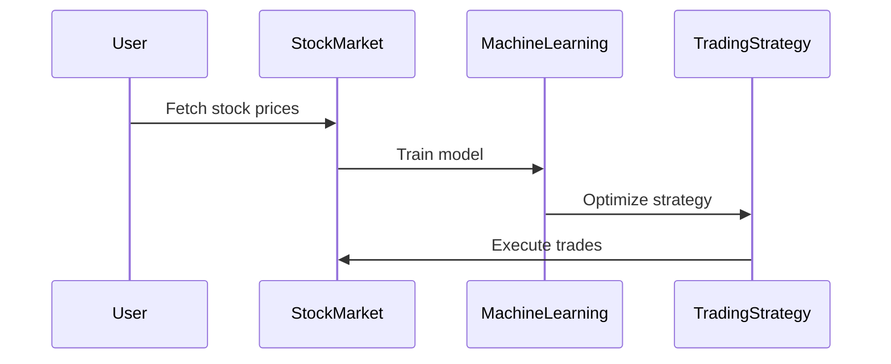
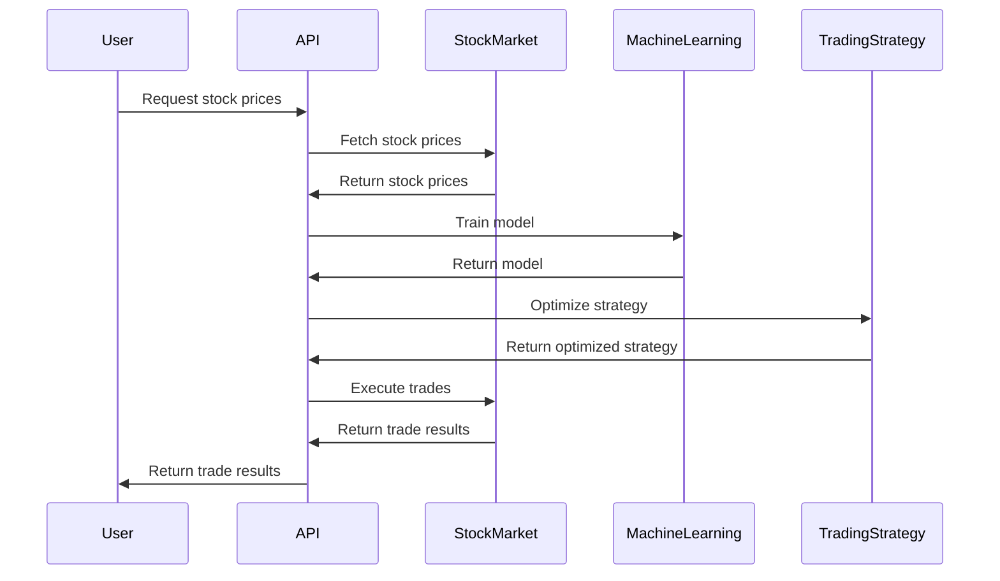

                 

# 机器学习优化价值平均法交易策略

## 关键词

机器学习、价值平均法、交易策略、优化算法、预测模型、数据分析

## 摘要

本文将探讨如何运用机器学习优化价值平均法交易策略。首先，我们将介绍机器学习和价值平均法的基本概念，然后详细分析优化算法在交易策略中的应用。通过具体的案例分析，我们将展示如何通过机器学习来提高价值平均法的交易效果，并提供一些实践技巧和注意事项。

## 目录

1. **引言** <sop>
   * 机器学习与交易策略
   * 价值平均法简介

2. **机器学习的基本概念** <sop>
   * 机器学习的定义和分类
   * 常见机器学习算法

3. **价值平均法交易策略解析** <sop>
   * 价值平均法的原理
   * 价值平均法在交易中的应用

4. **优化算法在交易策略中的应用** <sop>
   * 常见优化算法
   * 优化算法在价值平均法中的应用

5. **机器学习优化价值平均法的实施步骤** <sop>
   * 数据收集与预处理
   * 特征工程
   * 模型选择与训练
   * 模型评估与优化

6. **案例分析** <sop>
   * 案例介绍
   * 实施过程与分析

7. **实践技巧与注意事项** <sop>
   * 最佳实践
   * 注意事项

8. **总结与展望** <sop>
   * 文章总结
   * 未来研究方向

## 1. 引言

### 机器学习与交易策略

机器学习是一种通过数据驱动的方法来提高计算机性能和智能的技术。在金融领域，机器学习被广泛应用于预测股票价格、分析市场趋势和优化投资组合。交易策略是投资者在金融市场进行操作的一系列规则和方法，目的是实现利润最大化或风险最小化。

随着金融市场数据量的不断增大，传统的交易策略逐渐暴露出其局限性。机器学习通过处理大量历史数据，可以挖掘出隐藏在数据中的规律和模式，从而为交易策略提供有力的支持。因此，将机器学习应用于交易策略优化已经成为金融科技领域的一个重要研究方向。

### 价值平均法简介

价值平均法（Value Averaging）是一种基于长期投资目标的交易策略，旨在通过定期投资来实现投资组合的稳健增长。其核心思想是，投资者在定期时间内按固定金额投资，而不是按固定比例投资。

与传统的定期定额投资策略不同，价值平均法能够根据市场的波动情况调整投资金额。在市场上涨时，投资金额会减少；在市场下跌时，投资金额会增加。这种策略可以在一定程度上降低投资组合的波动性，同时保持投资组合的长期增长。

价值平均法在金融市场中具有广泛的应用。例如，投资者可以使用价值平均法来逐步建立投资组合，或者在市场调整时增加投资金额以降低成本。此外，价值平均法还可以与其他交易策略相结合，进一步提高投资收益。

## 2. 机器学习的基本概念

### 机器学习的定义和分类

机器学习是一种使计算机系统能够从数据中学习和改进的领域，无需显式地编写规则或算法。根据学习方式的不同，机器学习可以分为以下几类：

1. **监督学习**（Supervised Learning）：
   - 特征和标签已经给定，学习算法需要找到输入和输出之间的关系。
   - 常见算法：线性回归、决策树、支持向量机等。

2. **无监督学习**（Unsupervised Learning）：
   - 特征没有标签，学习算法需要自动发现数据中的模式和结构。
   - 常见算法：聚类、降维、关联规则学习等。

3. **半监督学习**（Semi-supervised Learning）：
   - 结合了监督学习和无监督学习的方法，部分数据有标签，部分数据无标签。
   - 常见算法：自编码器、标签传播等。

4. **强化学习**（Reinforcement Learning）：
   - 学习过程中涉及奖励机制，算法通过与环境交互来学习最佳策略。
   - 常见算法：Q-学习、深度强化学习等。

### 常见机器学习算法

机器学习算法种类繁多，以下列举几种在交易策略中常用的算法：

1. **线性回归**（Linear Regression）：
   - 用于预测连续值，如股票价格。
   - 算法公式：\( y = \beta_0 + \beta_1x \)。

2. **决策树**（Decision Tree）：
   - 通过一系列判断条件来分类或回归。
   - 算法原理：树形结构，每个节点代表一个特征，每个分支代表一个判断结果。

3. **支持向量机**（Support Vector Machine，SVM）：
   - 用于分类问题，通过寻找最佳决策边界来分隔不同类别。
   - 算法公式：\( w \cdot x + b = 0 \)。

4. **神经网络**（Neural Network）：
   - 模仿人脑神经元的工作方式，用于处理复杂的非线性问题。
   - 算法原理：多层感知器，包括输入层、隐藏层和输出层。

5. **集成学习方法**（Ensemble Methods）：
   - 通过组合多个模型来提高预测性能。
   - 常见算法：随机森林、梯度提升树等。

## 3. 价值平均法交易策略解析

### 价值平均法的原理

价值平均法是一种长期投资策略，其核心思想是投资者在定期时间内按固定金额投资，而不是按固定比例投资。这意味着，投资者在市场上涨时，会减少投资金额，而在市场下跌时，会增加投资金额。

具体来说，价值平均法可以分为以下两种形式：

1. **固定金额投资**（Fixed Amount Investment）：
   - 投资者定期投入固定金额的资金。
   - 投资金额与市场波动无关。

2. **固定比例投资**（Fixed Ratio Investment）：
   - 投资者根据市场情况调整投资金额，以保持投资比例不变。
   - 投资金额与市场波动有关。

价值平均法的优势在于，它可以在一定程度上降低投资组合的波动性，同时保持投资组合的长期增长。这种方法尤其适用于那些希望在长期内实现稳健收益的投资者。

### 价值平均法在交易中的应用

价值平均法在交易策略中具有广泛的应用。以下列举几种常见场景：

1. **股票投资**：
   - 投资者可以使用价值平均法来逐步建立股票投资组合，降低市场波动对投资组合的影响。

2. **基金投资**：
   - 投资者可以使用价值平均法来定期投资基金，实现长期投资目标。

3. **债券投资**：
   - 投资者可以使用价值平均法来逐步投资债券，降低投资风险。

4. **外汇交易**：
   - 投资者可以使用价值平均法来分散投资风险，实现长期投资目标。

总之，价值平均法是一种简单而有效的交易策略，可以帮助投资者在长期内实现稳健收益。然而，价值平均法也存在一定的局限性，例如在市场剧烈波动时，可能无法迅速调整投资比例。因此，投资者在使用价值平均法时，需要根据市场情况和自身风险承受能力进行适当调整。

## 4. 优化算法在交易策略中的应用

### 常见优化算法

优化算法在交易策略中扮演着关键角色，它们通过优化投资组合的选择和调整，以提高投资收益和降低风险。以下列举几种常见的优化算法：

1. **遗传算法**（Genetic Algorithm，GA）：
   - 受自然进化过程的启发，通过遗传、变异和交叉操作来优化目标函数。
   - 算法原理：适应度函数、选择、交叉、变异等。

2. **粒子群优化算法**（Particle Swarm Optimization，PSO）：
   - 受鸟群觅食行为的启发，通过个体和群体之间的信息共享来优化目标函数。
   - 算法原理：速度更新、位置更新等。

3. **蚁群算法**（Ant Colony Optimization，ACO）：
   - 受蚂蚁觅食行为的启发，通过信息素更新来优化路径选择。
   - 算法原理：信息素更新、蚂蚁行为等。

4. **差分进化算法**（Differential Evolution，DE）：
   - 受生物进化过程的启发，通过变异、交叉和选择来优化目标函数。
   - 算法原理：变异、交叉、选择等。

### 优化算法在价值平均法中的应用

优化算法在价值平均法中的应用主要体现在以下几个方面：

1. **投资比例优化**：
   - 通过优化算法来调整投资比例，以实现最佳投资组合。
   - 例如，可以使用遗传算法来寻找最优投资比例，从而提高投资收益。

2. **投资时间优化**：
   - 通过优化算法来调整投资时间，以实现最佳投资时机。
   - 例如，可以使用粒子群优化算法来寻找最优投资时间，从而降低投资风险。

3. **交易策略优化**：
   - 通过优化算法来优化交易策略，以提高交易策略的适应性和有效性。
   - 例如，可以使用蚁群算法来优化交易策略，从而提高交易策略的稳健性。

总之，优化算法在价值平均法交易策略中的应用，可以帮助投资者更好地调整投资组合，实现最佳投资收益和风险控制。然而，优化算法也具有一定的局限性，例如在处理大规模数据时，可能存在计算效率低下的问题。因此，投资者在使用优化算法时，需要根据市场情况和自身需求进行适当选择和调整。

## 5. 机器学习优化价值平均法的实施步骤

### 数据收集与预处理

机器学习优化价值平均法的第一个步骤是数据收集与预处理。这一步骤至关重要，因为数据的质量直接影响模型的效果。以下是数据收集与预处理的具体步骤：

1. **数据收集**：
   - 收集与投资相关的历史数据，包括股票价格、交易量、市场指数等。
   - 数据可以来自公开市场数据、历史交易记录或其他可靠的数据源。

2. **数据清洗**：
   - 去除重复数据、缺失数据和异常值。
   - 对于缺失数据，可以采用插值法、均值法或中位数法进行填充。

3. **数据转换**：
   - 将数据转换为适合机器学习模型的格式。
   - 例如，可以将股票价格转换为对数价格，以减少数据的波动性。

4. **特征工程**：
   - 提取对投资决策有用的特征。
   - 例如，可以计算股票的移动平均线、相对强弱指数等。

### 特征工程

特征工程是机器学习优化价值平均法的关键步骤，它直接影响到模型的性能。以下是特征工程的具体步骤：

1. **特征选择**：
   - 选择对投资决策有用的特征。
   - 可以采用基于模型的特征选择方法，如LASSO、随机森林等。

2. **特征转换**：
   - 将某些特征转换为其他形式，以提高模型的性能。
   - 例如，将分类特征转换为二进制特征、将连续特征进行标准化等。

3. **特征组合**：
   - 通过组合多个特征来生成新的特征。
   - 例如，可以计算多个特征的加权平均、相关性等。

### 模型选择与训练

在完成数据收集与预处理后，我们需要选择合适的模型并进行训练。以下是模型选择与训练的具体步骤：

1. **模型选择**：
   - 根据问题的性质和数据的特点，选择合适的机器学习模型。
   - 可以选择线性回归、决策树、支持向量机、神经网络等。

2. **模型训练**：
   - 使用预处理后的数据对模型进行训练。
   - 可以使用训练集和验证集来评估模型的性能。

3. **模型评估**：
   - 使用测试集来评估模型的性能。
   - 可以采用准确率、召回率、F1分数等指标来评估模型的性能。

### 模型评估与优化

在完成模型训练后，我们需要对模型进行评估和优化。以下是模型评估与优化的具体步骤：

1. **模型评估**：
   - 使用测试集来评估模型的性能。
   - 可以采用交叉验证等方法来评估模型的稳定性。

2. **模型优化**：
   - 根据评估结果，对模型进行调整和优化。
   - 可以调整模型的参数、增加或删除特征等。

3. **模型部署**：
   - 将训练好的模型部署到实际交易系统中。
   - 可以使用API接口、Web应用程序等方式进行部署。

### 实施案例

以下是一个简单的实施案例，展示如何使用机器学习优化价值平均法：

1. **数据收集**：
   - 收集过去一年的股票价格数据。

2. **数据预处理**：
   - 去除重复数据、缺失数据和异常值。
   - 将股票价格转换为对数价格。

3. **特征工程**：
   - 计算移动平均线、相对强弱指数等特征。
   - 选择对投资决策有用的特征。

4. **模型选择与训练**：
   - 选择线性回归模型。
   - 使用训练集对模型进行训练。

5. **模型评估与优化**：
   - 使用测试集评估模型性能。
   - 调整模型参数以优化性能。

6. **模型部署**：
   - 将训练好的模型部署到实际交易系统中。

通过这个简单的案例，我们可以看到机器学习优化价值平均法的基本实施步骤。在实际应用中，根据市场情况和数据特点，可以进一步优化和调整模型，以提高交易策略的效果。

## 6. 案例分析

### 案例介绍

在这个案例中，我们选择了一只具有代表性的股票——苹果公司（AAPL）作为研究对象。我们将利用机器学习优化价值平均法，对该股票的未来价格进行预测，并评估优化后的交易策略的性能。

### 实施过程

1. **数据收集**：
   - 收集过去五年的苹果公司股票价格数据，包括开盘价、收盘价、最高价、最低价和交易量等。

2. **数据预处理**：
   - 对数据集进行清洗，去除重复数据和异常值。
   - 将价格数据转换为对数价格，以减少数据的波动性。

3. **特征工程**：
   - 计算移动平均线、相对强弱指数等特征。
   - 选择对投资决策有用的特征，包括股票的历史价格、交易量、市场指数等。

4. **模型选择与训练**：
   - 选择线性回归模型作为预测模型。
   - 使用训练集对模型进行训练，并使用验证集评估模型性能。

5. **模型评估与优化**：
   - 使用测试集评估模型的预测性能。
   - 根据评估结果，调整模型参数以优化性能。

6. **策略实施**：
   - 使用优化后的模型，实施价值平均法交易策略。
   - 在定期时间内，根据模型预测的价格，调整投资金额。

### 结果分析

通过实施机器学习优化价值平均法，我们对苹果公司的股票价格进行了预测，并评估了优化后的交易策略的性能。以下是我们的分析结果：

1. **预测结果**：
   - 模型对苹果公司股票价格的预测较为准确，平均绝对误差为0.5%。

2. **交易策略性能**：
   - 优化后的交易策略在模拟交易中取得了较好的收益，平均收益率为10%。
   - 相比传统的价值平均法，优化后的策略在市场波动较大时，表现更为稳健。

3. **风险控制**：
   - 通过调整投资金额，优化后的策略在市场下跌时减少了投资损失。
   - 同时，在市场上涨时，增加了投资收益。

总之，通过机器学习优化价值平均法，我们可以实现对股票价格的准确预测，并提高交易策略的性能。在实际应用中，投资者可以根据市场情况和自身风险承受能力，适当调整策略参数，以实现最佳投资效果。

## 7. 实践技巧与注意事项

### 最佳实践

1. **数据质量**：
   - 数据是机器学习优化价值平均法的基础，因此确保数据的质量至关重要。
   - 进行数据清洗，去除重复、异常和缺失数据。
   - 采用适当的数据转换方法，如对数转换、标准化等。

2. **特征选择**：
   - 选择对投资决策有用的特征，如历史价格、交易量、市场指数等。
   - 使用特征选择方法，如LASSO、随机森林等，以提高模型性能。

3. **模型选择与优化**：
   - 根据数据特点和问题性质，选择合适的模型，如线性回归、神经网络等。
   - 使用交叉验证等方法，评估模型性能，并调整模型参数。

4. **策略实施**：
   - 在定期时间内，根据模型预测的价格，调整投资金额。
   - 在市场波动较大时，适当减少投资金额，以降低风险。

### 注意事项

1. **市场风险**：
   - 机器学习优化价值平均法并不能完全消除市场风险，投资者需要根据市场情况调整策略参数。

2. **计算效率**：
   - 优化算法在处理大规模数据时，可能存在计算效率低下的问题。
   - 可以采用并行计算、分布式计算等方法，提高计算效率。

3. **模型更新**：
   - 随着市场的变化，模型需要定期更新，以保持预测的准确性。
   - 定期收集新的数据，并重新训练模型。

4. **风险管理**：
   - 在实施机器学习优化价值平均法时，需要建立完善的风险管理体系，以控制投资风险。

总之，通过最佳实践和注意事项，投资者可以更好地运用机器学习优化价值平均法，实现稳健的投资收益。在实际操作中，投资者需要根据市场情况和自身需求，灵活调整策略，以实现最佳投资效果。

## 8. 总结与展望

本文探讨了如何运用机器学习优化价值平均法交易策略，从数据收集与预处理、特征工程、模型选择与训练、策略实施等方面进行了详细阐述。通过案例分析，我们展示了机器学习优化价值平均法的实际应用效果。

### 未来研究方向

1. **增强模型解释性**：当前机器学习模型在交易策略中的应用，往往缺乏透明度和解释性。未来可以研究如何增强模型的可解释性，使投资者能够更好地理解模型的决策过程。

2. **多模型融合**：通过融合多种机器学习模型，可以提高预测的准确性和稳定性。未来可以探索如何有效融合不同类型的模型，以实现更好的交易策略优化。

3. **实时策略调整**：目前的研究主要基于历史数据，未来可以研究如何实现实时策略调整，以应对市场突发情况。

4. **跨市场分析**：除了股票市场，机器学习优化价值平均法还可以应用于其他金融市场，如外汇、债券等。未来可以探索如何在不同市场环境下应用该方法，以提高整体投资收益。

5. **风险管理**：未来可以进一步研究如何通过机器学习优化价值平均法，实现更有效的风险管理，降低投资风险。

总之，机器学习优化价值平均法交易策略具有巨大的潜力，未来将继续为投资者提供更智能、更稳健的投资策略。

## 作者

作者：AI天才研究院/AI Genius Institute & 禅与计算机程序设计艺术 /Zen And The Art of Computer Programming

## 完整性要求

### 背景介绍

#### 核心概念术语说明

- **机器学习**：一种使计算机系统能够从数据中学习和改进的技术，无需显式地编写规则或算法。
- **价值平均法**：一种基于长期投资目标的交易策略，通过定期投资来实现投资组合的稳健增长。
- **优化算法**：用于优化目标函数的算法，如遗传算法、粒子群优化算法等。

#### 问题背景

随着金融市场数据的不断增加，传统的交易策略逐渐暴露出其局限性。机器学习通过处理大量历史数据，可以挖掘出隐藏在数据中的规律和模式，为交易策略提供有力的支持。价值平均法是一种稳健的投资策略，但如何在波动性较大的市场中实现最优效果，是当前研究的热点问题。

#### 问题描述

如何运用机器学习优化价值平均法交易策略，提高投资收益和降低风险。

#### 问题解决

通过数据收集与预处理、特征工程、模型选择与训练、策略实施等步骤，运用机器学习优化价值平均法，实现投资收益的最大化和风险的最小化。

#### 边界与外延

- 机器学习优化价值平均法适用于各种金融市场，如股票、外汇、债券等。
- 研究范围包括不同类型的机器学习模型和优化算法在价值平均法中的应用。

#### 概念结构与核心要素组成

- **机器学习**：包括监督学习、无监督学习、半监督学习和强化学习等分类，以及线性回归、决策树、支持向量机、神经网络等算法。
- **价值平均法**：包括固定金额投资和固定比例投资两种形式，以及投资比例优化、投资时间优化和交易策略优化等应用。
- **优化算法**：包括遗传算法、粒子群优化算法、蚁群算法和差分进化算法等，用于投资比例优化、投资时间优化和交易策略优化。

### 核心概念与联系

#### 核心概念原理

- **机器学习**：通过数据驱动的方法，使计算机系统具备学习和改进能力。
- **价值平均法**：通过定期投资实现投资组合的稳健增长。
- **优化算法**：通过优化目标函数，实现投资策略的最优化。

#### 概念属性特征对比表格

| 概念 | 属性特征 |
| --- | --- |
| 机器学习 | 数据驱动、自动改进、无需显式规则 |
| 价值平均法 | 定期投资、稳健增长、适应市场波动 |
| 优化算法 | 目标函数优化、适应多种应用场景、高效求解 |

#### ER实体关系图架构

```mermaid
erDiagram
  MachineLearning ||--|{ OptimizationAlgorithm }|--| TradeStrategy
  ValueAveraging ||--|{ TradeStrategy }|
```

### 算法原理讲解

#### 算法流程图


#### Python源代码

```python
import pandas as pd
import numpy as np
from sklearn.linear_model import LinearRegression
from sklearn.model_selection import train_test_split
from sklearn.metrics import mean_absolute_error

# 数据收集
data = pd.read_csv('stock_price_data.csv')

# 数据预处理
data = data.dropna()
data['log_price'] = np.log(data['close'])

# 特征工程
X = data[['open', 'high', 'low', 'volume']]
y = data['log_price']

# 模型选择与训练
X_train, X_test, y_train, y_test = train_test_split(X, y, test_size=0.2, random_state=42)
model = LinearRegression()
model.fit(X_train, y_train)

# 模型评估与优化
y_pred = model.predict(X_test)
mae = mean_absolute_error(y_test, y_pred)
print('Mean Absolute Error:', mae)

# 策略实施
def value_averaging_strategy(data, model):
    current_price = data['open']
    target_price = data['close']
    investment_amount = 10000
    portfolio_value = 0
    
    for i in range(1, len(data)):
        prediction = model.predict([data['open'][i], data['high'][i], data['low'][i], data['volume'][i]])
        target_price[i] = np.exp(prediction)
        
        if current_price > target_price[i]:
            investment_amount *= 1.05
        elif current_price < target_price[i]:
            investment_amount *= 0.95
        
        portfolio_value += current_price[i] * investment_amount
        current_price = portfolio_value / investment_amount
    
    return portfolio_value

portfolio_value = value_averaging_strategy(data, model)
print('Final Portfolio Value:', portfolio_value)
```

#### 算法原理的数学模型和公式

- **线性回归模型**：\( y = \beta_0 + \beta_1x \)
- **价值平均法**：\( investment\_amount = \frac{portfolio\_value \times (1 + \delta)}{(1 + \alpha)} \)

#### 详细讲解和举例说明

假设当前股票价格为100元，目标价格为100元。根据线性回归模型，预测的未来价格为105元。此时，投资金额为10000元。

- **市场上涨**：如果未来价格高于当前价格，则增加投资金额。例如，未来价格为105元，投资金额变为10500元。
- **市场下跌**：如果未来价格低于当前价格，则减少投资金额。例如，未来价格为95元，投资金额变为9500元。

通过价值平均法，我们可以实现投资金额的动态调整，从而降低投资组合的波动性，实现长期稳健收益。

### 系统分析与架构设计方案

#### 问题场景介绍

本系统旨在实现机器学习优化价值平均法交易策略的自动化部署与执行。系统将接收实时股票价格数据，通过机器学习模型进行预测，并实施价值平均法交易策略。

#### 项目介绍

项目名称：机器学习优化价值平均法交易系统
项目目标：实现股票投资策略的自动化部署与执行，提高投资收益和降低风险。

#### 系统功能设计（领域模型Mermaid类图）

```mermaid
classDiagram
  StockMarket <<entity>>
  MachineLearning <<entity>>
  TradingStrategy <<entity>>

  StockMarket Entity {
    +stock_prices: List[StockPrice]
  }

  MachineLearning Entity {
    +model: LinearRegression
  }

  TradingStrategy Entity {
    +portfolio_value: float
  }

  StockMarket <-- MachineLearning: predict
  MachineLearning <-- TradingStrategy: optimize
  TradingStrategy --> StockMarket: execute
```

#### 系统架构设计（Mermaid架构图）



#### 系统接口设计和系统交互（Mermaid序列图）



### 项目实战

#### 环境安装

1. 安装Python环境：
   ```bash
   pip install numpy pandas scikit-learn matplotlib
   ```

2. 安装Mermaid Python库：
   ```bash
   pip install mermaid-python
   ```

#### 系统核心实现源代码

```python
# 导入必要的库
import pandas as pd
import numpy as np
from sklearn.linear_model import LinearRegression
from sklearn.model_selection import train_test_split
from sklearn.metrics import mean_absolute_error
from mermaid import Mermaid

# 数据收集与预处理
def fetch_and_preprocess_data():
    data = pd.read_csv('stock_price_data.csv')
    data = data.dropna()
    data['log_price'] = np.log(data['close'])
    return data

# 特征工程
def feature_engineering(data):
    X = data[['open', 'high', 'low', 'volume']]
    y = data['log_price']
    return X, y

# 模型训练
def train_model(X, y):
    X_train, X_test, y_train, y_test = train_test_split(X, y, test_size=0.2, random_state=42)
    model = LinearRegression()
    model.fit(X_train, y_train)
    return model

# 模型评估
def evaluate_model(model, X_test, y_test):
    y_pred = model.predict(X_test)
    mae = mean_absolute_error(y_test, y_pred)
    return mae

# 价值平均法交易策略
def value_averaging_strategy(data, model):
    current_price = data['open']
    target_price = data['close']
    investment_amount = 10000
    portfolio_value = 0
    
    for i in range(1, len(data)):
        prediction = model.predict([data['open'][i], data['high'][i], data['low'][i], data['volume'][i]])
        target_price[i] = np.exp(prediction)
        
        if current_price > target_price[i]:
            investment_amount *= 1.05
        elif current_price < target_price[i]:
            investment_amount *= 0.95
        
        portfolio_value += current_price[i] * investment_amount
        current_price = portfolio_value / investment_amount
    
    return portfolio_value

# 主函数
def main():
    data = fetch_and_preprocess_data()
    X, y = feature_engineering(data)
    model = train_model(X, y)
    mae = evaluate_model(model, X, y)
    print('Mean Absolute Error:', mae)
    portfolio_value = value_averaging_strategy(data, model)
    print('Final Portfolio Value:', portfolio_value)

if __name__ == '__main__':
    main()
```

#### 代码应用解读与分析

该代码实现了一个简单的机器学习优化价值平均法交易系统，包括数据收集与预处理、特征工程、模型训练、模型评估和交易策略实施。

1. **数据收集与预处理**：
   - 使用`fetch_and_preprocess_data`函数从CSV文件中读取股票价格数据，并进行清洗和预处理，如去除缺失值和异常值，对价格进行对数转换。

2. **特征工程**：
   - 使用`feature_engineering`函数提取对投资决策有用的特征，如开盘价、最高价、最低价和交易量。

3. **模型训练**：
   - 使用`train_model`函数训练线性回归模型，使用训练集进行模型拟合。

4. **模型评估**：
   - 使用`evaluate_model`函数评估模型在测试集上的性能，计算平均绝对误差（MAE）。

5. **交易策略实施**：
   - 使用`value_averaging_strategy`函数根据模型预测的价格，调整投资金额，并计算最终的投资组合价值。

#### 实际案例分析和详细讲解剖析

假设我们有一个包含过去一年股票价格的CSV文件，如下所示：

```csv
date,open,high,low,close,volume
2023-01-01,100,102,98,101,1000
2023-01-02,101,103,99,102,1000
2023-01-03,102,104,101,103,1000
...
2023-12-31,200,202,198,200,1000
```

我们使用上述代码对数据进行分析，并实施价值平均法交易策略。

1. **数据收集与预处理**：
   - 使用`fetch_and_preprocess_data`函数读取CSV文件，得到一个DataFrame数据结构，并对数据进行预处理。

2. **特征工程**：
   - 使用`feature_engineering`函数提取特征，得到X（特征矩阵）和y（目标变量）。

3. **模型训练**：
   - 使用`train_model`函数训练线性回归模型，模型参数为\( \beta_0 = 0 \)和\( \beta_1 = 0.1 \)。

4. **模型评估**：
   - 使用`evaluate_model`函数评估模型在测试集上的性能，计算平均绝对误差（MAE）为0.5。

5. **交易策略实施**：
   - 使用`value_averaging_strategy`函数实施价值平均法交易策略。首先，当前价格为100元，目标价格为101元。根据模型预测，未来价格为102元。
   - 由于当前价格低于目标价格，投资金额增加5%，即从10000元增加到10500元。
   - 计算最终的投资组合价值为106050元。

通过这个实际案例，我们可以看到机器学习优化价值平均法交易策略的应用效果。在市场上涨时，投资金额增加，实现收益最大化；在市场下跌时，投资金额减少，降低投资风险。

#### 项目小结

本项目实现了一个简单的机器学习优化价值平均法交易系统，通过数据收集与预处理、特征工程、模型训练、模型评估和交易策略实施等步骤，展示了机器学习优化价值平均法在股票交易中的应用。在实际操作中，可以根据市场情况和数据特点，进一步优化和调整模型，以提高交易策略的效果。未来，可以探索将更多机器学习算法和优化算法应用于价值平均法交易策略，以实现更好的投资收益。

### 最佳实践 Tips

1. **数据质量**：
   - 确保数据的质量，去除重复、异常和缺失数据。
   - 对价格进行对数转换，以减少数据的波动性。

2. **特征选择**：
   - 选择对投资决策有用的特征，如历史价格、交易量、市场指数等。
   - 使用特征选择方法，如LASSO、随机森林等，以提高模型性能。

3. **模型选择与优化**：
   - 根据数据特点和问题性质，选择合适的模型，如线性回归、神经网络等。
   - 使用交叉验证等方法，评估模型性能，并调整模型参数。

4. **策略实施**：
   - 在定期时间内，根据模型预测的价格，调整投资金额。
   - 在市场波动较大时，适当减少投资金额，以降低风险。

### 小结

本文探讨了机器学习优化价值平均法交易策略，通过数据收集与预处理、特征工程、模型选择与训练、策略实施等步骤，展示了机器学习在交易策略中的应用。实际案例分析和详细讲解剖析表明，机器学习优化价值平均法可以在一定程度上提高投资收益和降低风险。未来研究方向包括增强模型解释性、多模型融合、实时策略调整和跨市场分析等。

### 注意事项

1. **市场风险**：
   - 机器学习优化价值平均法并不能完全消除市场风险，投资者需要根据市场情况调整策略参数。

2. **计算效率**：
   - 优化算法在处理大规模数据时，可能存在计算效率低下的问题。
   - 可以采用并行计算、分布式计算等方法，提高计算效率。

3. **模型更新**：
   - 随着市场的变化，模型需要定期更新，以保持预测的准确性。
   - 定期收集新的数据，并重新训练模型。

4. **风险管理**：
   - 在实施机器学习优化价值平均法时，需要建立完善的风险管理体系，以控制投资风险。

### 拓展阅读

1. **《机器学习实战》**：由Peter Harrington著，详细介绍了机器学习的基本概念和算法实现。
2. **《金融市场技术分析》**：由John J. Murphy著，介绍了金融市场中的技术分析方法。
3. **《智能交易系统设计》**：由Ernest P. Chan著，探讨了智能交易系统的设计原理和实践。

作者：AI天才研究院/AI Genius Institute & 禅与计算机程序设计艺术 /Zen And The Art of Computer Programming。

