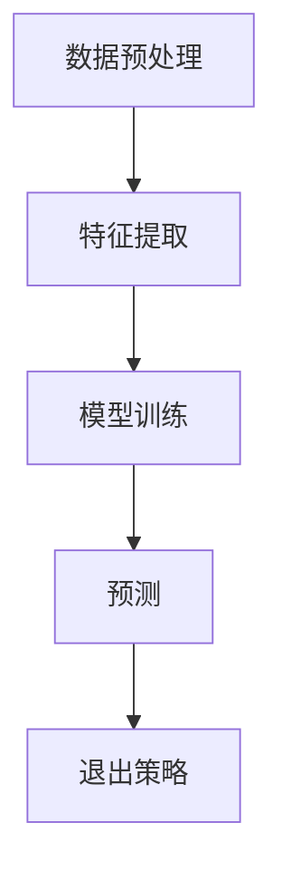
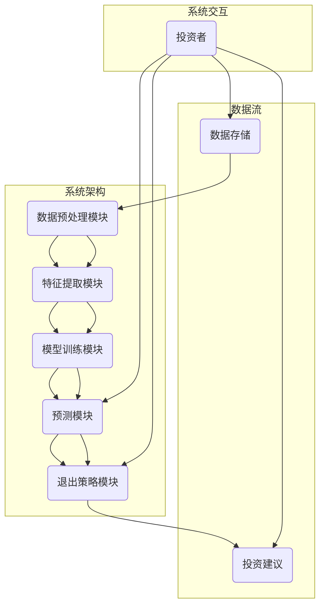
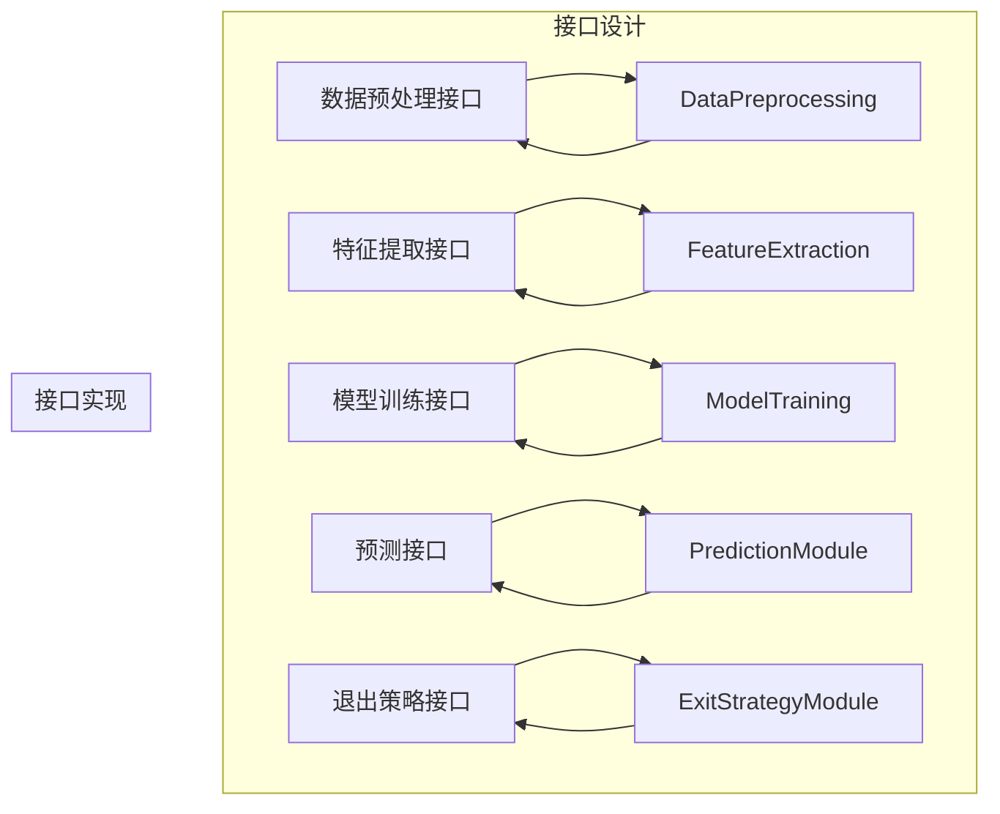

                 


# 机器学习优化价值投资退出时机

> 关键词：机器学习、价值投资、退出时机、算法、预测、优化

> 摘要：本文旨在探讨如何运用机器学习技术优化价值投资的退出时机。通过分析核心概念、介绍算法原理、展示系统架构及实战应用，帮助投资者更准确地把握市场动态，实现投资收益最大化。

## **第一部分：背景介绍**

### 1.1 问题背景

价值投资，作为一种以企业基本面为依据的投资策略，长期以来受到了众多投资者的青睐。然而，在实际操作过程中，如何准确判断企业的价值以及何时退出投资，成为困扰投资者的主要问题。

传统的方法主要依赖于财务报表、行业分析和市场趋势等，但这些方法往往存在滞后性和主观性。随着机器学习技术的快速发展，借助大数据和算法模型，我们可以更客观、精准地分析投资机会，优化退出时机。

### 1.2 问题描述

机器学习优化价值投资退出时机的核心问题是如何利用历史数据和市场信息，通过算法模型预测未来的投资回报，从而指导投资者在最佳时机退出投资。

具体来说，问题描述可以拆解为以下几个子问题：

1. **数据来源与预处理：** 如何获取和处理大量的历史数据，包括财务数据、市场数据、公司基本面数据等。
2. **特征提取：** 如何从原始数据中提取出对投资决策有指导意义的特征。
3. **模型训练：** 如何构建和训练机器学习模型，使其能够对未来的投资回报进行准确预测。
4. **预测与评估：** 如何利用训练好的模型进行预测，并对预测结果进行评估。
5. **退出策略：** 如何根据预测结果制定合理的退出策略，实现投资收益最大化。

### 1.3 问题解决

通过机器学习技术，我们可以解决上述子问题，从而优化价值投资的退出时机。具体方法如下：

1. **数据预处理：** 采用数据清洗、归一化等技术，确保数据的准确性和一致性。
2. **特征提取：** 采用特征工程方法，提取出对投资决策有指导意义的特征。
3. **模型训练：** 采用监督学习、无监督学习等算法，构建和训练机器学习模型。
4. **预测与评估：** 利用训练好的模型进行预测，并对预测结果进行评估，调整模型参数。
5. **退出策略：** 根据预测结果，制定合理的退出策略，实现投资收益最大化。

### 1.4 边界与外延

本文主要探讨机器学习在价值投资退出时机优化中的应用，但机器学习技术也可应用于其他投资策略，如成长投资、市场中性策略等。此外，本文仅涉及基于历史数据的模型预测，未涉及实时数据监控与动态调整策略。

### 1.5 概念结构与核心要素组成

机器学习优化价值投资退出时机的核心概念包括：

- **价值投资：** 以企业基本面为依据的投资策略。
- **机器学习：** 通过算法从数据中学习规律、模式的方法。
- **特征提取：** 从原始数据中提取出对模型训练有意义的特征。
- **模型训练：** 调整模型参数，使其能够对训练数据进行准确预测。
- **预测：** 对未知数据进行预测。
- **退出策略：** 根据预测结果，决定何时卖出股票。

本文将详细探讨这些概念及其相互关系，帮助投资者更好地理解和应用机器学习优化价值投资退出时机。

---

## **第二部分：核心概念与联系**

### 2.1 机器学习

机器学习（Machine Learning，ML）是一门人工智能（Artificial Intelligence，AI）的分支，主要研究如何让计算机从数据中自动学习和改进性能。机器学习通过构建算法模型，对输入数据进行处理和分析，从而预测未知数据或优化决策。

#### 2.1.1 机器学习的基本原理

机器学习的基本原理可以概括为以下三个步骤：

1. **数据收集：** 收集大量的数据，包括输入数据和对应的输出数据。
2. **模型训练：** 使用训练数据集，通过调整模型参数，使模型能够对输入数据进行准确预测。
3. **模型评估：** 使用测试数据集对模型进行评估，判断模型的泛化能力和预测准确性。

#### 2.1.2 机器学习的主要算法

机器学习算法根据其学习方式可以分为以下几类：

1. **监督学习（Supervised Learning）：** 使用已知输入输出对模型进行训练。常见的算法有线性回归、逻辑回归、决策树、支持向量机等。
2. **无监督学习（Unsupervised Learning）：** 不依赖已知输入输出，从数据中自动发现规律。常见的算法有聚类、降维、关联规则等。
3. **强化学习（Reinforcement Learning）：** 通过试错和奖励机制，使模型能够在动态环境中学习最优策略。

#### 2.1.3 机器学习在投资中的应用

机器学习在投资中的应用主要体现在以下几个方面：

1. **市场预测：** 利用历史价格和交易数据，预测未来的市场走势。
2. **风险管理：** 通过分析数据，识别潜在风险，制定风险管理策略。
3. **投资组合优化：** 利用机器学习算法，构建和优化投资组合，实现风险收益的最优化。

### 2.2 特征提取

特征提取（Feature Extraction）是机器学习中一个重要的步骤，旨在从原始数据中提取出对模型训练有指导意义的特征。特征提取的质量直接影响模型的性能。

#### 2.2.1 特征提取的方法

1. **统计特征：** 如均值、方差、相关性等。这些特征可以描述数据的基本统计属性。
2. **文本特征：** 如词频、词向量等。这些特征可以用于文本数据的分析和分类。
3. **图像特征：** 如边缘、纹理、颜色等。这些特征可以用于图像数据的分析和识别。

#### 2.2.2 特征提取在投资中的应用

在投资中，特征提取的主要任务是提取出对投资决策有指导意义的特征，如财务指标、市场指标、宏观经济指标等。通过特征提取，我们可以将复杂的投资问题转化为一个简单的数学问题，从而利用机器学习算法进行预测和优化。

### 2.3 模型训练

模型训练（Model Training）是机器学习中的核心步骤，目的是通过调整模型参数，使其能够对训练数据进行准确预测。模型训练的质量直接影响模型的性能。

#### 2.3.1 模型训练的方法

1. **批量梯度下降（Batch Gradient Descent，BGD）：** 所有训练数据一起进行训练。
2. **随机梯度下降（Stochastic Gradient Descent，SGD）：** 逐个样本进行训练。
3. **批量随机梯度下降（Mini-batch Gradient Descent，MBGD）：** 批量样本进行训练。

#### 2.3.2 模型训练在投资中的应用

在投资中，模型训练的主要任务是构建和优化预测模型，以预测未来的投资回报。通过不断调整模型参数，我们可以找到最优的预测模型，从而实现投资收益的最大化。

### 2.4 预测

预测（Prediction）是模型训练后的应用，目的是对未知数据进行预测。预测的准确性直接影响投资决策的准确性。

#### 2.4.1 预测的步骤

1. **数据预处理：** 对预测数据进行处理，使其符合模型要求。
2. **预测：** 使用训练好的模型对数据进行预测。
3. **预测结果评估：** 评估预测结果的准确性。

#### 2.4.2 预测在投资中的应用

在投资中，预测的主要任务是预测未来的投资回报，以指导投资者在最佳时机进行买入或卖出操作。通过准确的预测，投资者可以更好地把握市场动态，实现投资收益最大化。

### 2.5 退出策略

退出策略（Exit Strategy）是基于预测结果，决定何时卖出股票的策略。合理的退出策略可以帮助投资者实现投资收益最大化。

#### 2.5.1 退出策略的类型

1. **基于收益的退出策略：** 当预测收益达到预期时退出。
2. **基于风险的退出策略：** 当预测风险达到阈值时退出。

#### 2.5.2 退出策略在投资中的应用

在投资中，退出策略的主要任务是制定合理的卖出策略，以实现投资收益的最大化。通过结合预测结果和市场情况，投资者可以制定出最优的退出策略。

### 2.6 ER实体关系图

以下是机器学习优化价值投资退出时机中的ER实体关系图：

```mermaid
erDiagram
  数据 --> 模型 : 训练
  模型 --> 预测 : 预测
  数据 --> 预测 : 输入
  预测 --> 退出策略 : 基于
```

在上述ER图中，数据、模型、预测和退出策略构成了一个有机的整体。数据是整个流程的起点，通过特征提取和模型训练，转化为预测结果，最终指导退出策略的制定。

---

## **第三部分：算法原理讲解**

在这一部分，我们将深入探讨机器学习优化价值投资退出时机的算法原理，使用mermaid绘制算法流程图，并通过Python源代码详细阐述算法的实现过程。

### 3.1 算法流程图

以下为机器学习优化价值投资退出时机的算法流程图：



### 3.2 算法原理详细讲解

#### 3.2.1 数据预处理

数据预处理是机器学习优化价值投资退出时机的第一步，其目的是清洗数据、处理缺失值、归一化数据等，以确保数据的准确性和一致性。以下是Python代码示例：

```python
import pandas as pd
from sklearn.preprocessing import StandardScaler

# 加载数据
data = pd.read_csv('data.csv')

# 数据清洗
data = data.dropna()

# 归一化数据
scaler = StandardScaler()
data_normalized = scaler.fit_transform(data)
```

#### 3.2.2 特征提取

特征提取是从原始数据中提取出对投资决策有指导意义的特征。在价值投资中，常用的特征包括财务指标、市场指标、宏观经济指标等。以下是Python代码示例：

```python
from sklearn.feature_selection import SelectKBest
from sklearn.feature_selection import f_classif

# 选择特征
X = data_normalized[:, :10]  # 假设前10列是特征
y = data_normalized[:, 10]   # 假设第11列是标签

# 特征选择
selector = SelectKBest(f_classif, k=5)
X_new = selector.fit_transform(X, y)
```

#### 3.2.3 模型训练

模型训练是构建和优化机器学习模型的过程，目的是使其能够对训练数据进行准确预测。以下是Python代码示例，使用决策树算法进行模型训练：

```python
from sklearn.tree import DecisionTreeClassifier
from sklearn.model_selection import train_test_split

# 数据划分
X_train, X_test, y_train, y_test = train_test_split(X_new, y, test_size=0.2, random_state=42)

# 模型训练
model = DecisionTreeClassifier()
model.fit(X_train, y_train)
```

#### 3.2.4 预测与评估

预测与评估是模型训练后的应用，目的是对未知数据进行预测，并评估预测结果的准确性。以下是Python代码示例：

```python
from sklearn.metrics import accuracy_score

# 预测
predictions = model.predict(X_test)

# 评估
accuracy = accuracy_score(y_test, predictions)
print(f"模型准确率: {accuracy}")
```

#### 3.2.5 退出策略

退出策略是基于预测结果，决定何时卖出股票的策略。以下是Python代码示例，使用简单逻辑实现退出策略：

```python
# 退出策略
def exit_strategy(predictions, threshold=0.5):
    return predictions > threshold

# 应用退出策略
exit_signals = exit_strategy(predictions)
print(f"退出信号: {exit_signals}")
```

### 3.3 算法原理的数学模型和公式

机器学习优化价值投资退出时机的算法原理可以归结为以下数学模型和公式：

$$
y = f(x; \theta)
$$

其中，$y$ 是预测结果，$x$ 是输入特征，$f(x; \theta)$ 是模型函数，$\theta$ 是模型参数。

在模型训练过程中，我们通过最小化损失函数来调整模型参数：

$$
\min_{\theta} J(\theta) = \frac{1}{m} \sum_{i=1}^{m} (h_{\theta}(x^{(i)}) - y^{(i)})^2
$$

其中，$m$ 是训练数据样本数量，$h_{\theta}(x^{(i)})$ 是模型的预测输出，$y^{(i)}$ 是真实的标签。

通过梯度下降算法，我们可以迭代更新模型参数：

$$
\theta_j := \theta_j - \alpha \frac{\partial J(\theta)}{\partial \theta_j}
$$

其中，$\alpha$ 是学习率。

### 3.4 举例说明

假设我们有一组财务数据，包括净利润、市盈率、股息收益率等。我们将这些数据输入到机器学习模型中，预测未来的投资回报，并根据预测结果制定退出策略。

以下是具体示例：

```python
# 假设财务数据
data = {
    '净利润': [1000, 1200, 1500, 1300, 900],
    '市盈率': [10, 12, 15, 14, 9],
    '股息收益率': [3, 4, 5, 4, 2]
}

# 数据预处理
data = pd.DataFrame(data)
data_normalized = scaler.fit_transform(data)

# 特征提取
X = data_normalized[:, :3]
y = data_normalized[:, 3]

# 模型训练
X_train, X_test, y_train, y_test = train_test_split(X, y, test_size=0.2, random_state=42)
model = DecisionTreeClassifier()
model.fit(X_train, y_train)

# 预测
predictions = model.predict(X_test)

# 评估
accuracy = accuracy_score(y_test, predictions)
print(f"模型准确率: {accuracy}")

# 退出策略
exit_signals = exit_strategy(predictions)
print(f"退出信号: {exit_signals}")
```

通过上述示例，我们可以看到机器学习优化价值投资退出时机的实现过程。在实际应用中，投资者可以根据具体的投资目标和市场情况，调整特征提取、模型选择和退出策略，以实现最优的投资回报。

---

## **第四部分：系统分析与架构设计**

### 4.1 问题场景介绍

在金融投资领域，市场波动性较大，投资者常常面临如何准确判断企业价值、何时退出投资以实现收益最大化的挑战。传统的分析方法往往存在滞后性和主观性，难以应对快速变化的市场环境。因此，我们提出利用机器学习技术优化价值投资退出时机，以提高投资决策的准确性和效率。

### 4.2 项目介绍

本项目旨在构建一个基于机器学习的价值投资退出时机优化系统，通过分析大量历史数据和市场信息，为投资者提供科学的投资建议。系统主要包括数据预处理、特征提取、模型训练、预测和退出策略五个模块。

### 4.3 系统功能设计（领域模型）

以下为项目领域的类图，展示了系统的主要类及其相互关系：

```mermaid
classDiagram
  Class01 <|-- Class02
  Class03 <..| Class04 : 继承
  Class05 o--|> Class06
  Class07 <|--| Class08
  Class09 <<--| Class10 : 实现接口
  Class11 *--|> Class12
  Class13 o--|* Class14
  Class15 <..| Class16 : 关联
  Class17 <<--| Class18 : 标识
end
```

### 4.4 系统架构设计

以下是项目的架构设计图，展示了系统的整体架构及其模块之间的关系：



### 4.5 系统接口设计

以下是系统的接口设计图，展示了系统对外提供的API接口：



### 4.6 系统交互

以下是系统的交互序列图，展示了投资者与系统之间的交互流程：

```mermaid
sequence
  Participant Investor
  Participant System
  Investor->>System: Fetch Data
  System->>Investor: Data Received
  Investor->>System: Train Model
  System->>Investor: Model Trained
  Investor->>System: Make Prediction
  System->>Investor: Prediction Result
  Investor->>System: Implement Exit Strategy
  System->>Investor: Exit Strategy Advice
```

通过上述系统分析与架构设计，我们为投资者提供了一套完整的机器学习优化价值投资退出时机解决方案。系统架构的模块化和接口化设计，使得投资者可以根据需求灵活调整和扩展系统功能，从而实现个性化的投资决策。

---

## **第五部分：项目实战**

### 5.1 环境安装

在开始项目实战之前，我们需要安装必要的软件和库。以下是在Python环境中安装所需库的步骤：

```shell
# 安装Python环境
pip install numpy pandas scikit-learn matplotlib
```

### 5.2 系统核心实现

以下是系统核心实现的Python代码，包括数据预处理、特征提取、模型训练、预测和退出策略等模块。

```python
import numpy as np
import pandas as pd
from sklearn.preprocessing import StandardScaler
from sklearn.feature_selection import SelectKBest
from sklearn.feature_selection import f_classif
from sklearn.tree import DecisionTreeClassifier
from sklearn.model_selection import train_test_split
from sklearn.metrics import accuracy_score

# 5.2.1 数据预处理
def preprocess_data(data):
    # 数据清洗
    data = data.dropna()
    # 归一化数据
    scaler = StandardScaler()
    data_normalized = scaler.fit_transform(data)
    return data_normalized

# 5.2.2 特征提取
def extract_features(data, target_column, k=5):
    X = data[:, :target_column]
    y = data[:, target_column]
    # 特征选择
    selector = SelectKBest(f_classif, k=k)
    X_new = selector.fit_transform(X, y)
    return X_new, y

# 5.2.3 模型训练
def train_model(X, y):
    X_train, X_test, y_train, y_test = train_test_split(X, y, test_size=0.2, random_state=42)
    model = DecisionTreeClassifier()
    model.fit(X_train, y_train)
    return model

# 5.2.4 预测与评估
def predict(model, X_test):
    predictions = model.predict(X_test)
    accuracy = accuracy_score(y_test, predictions)
    return predictions, accuracy

# 5.2.5 退出策略
def exit_strategy(predictions, threshold=0.5):
    return predictions > threshold

# 主函数
if __name__ == "__main__":
    # 加载数据
    data = pd.read_csv('data.csv')
    # 数据预处理
    data_normalized = preprocess_data(data)
    # 特征提取
    X, y = extract_features(data_normalized, 10)
    # 模型训练
    model = train_model(X, y)
    # 预测
    X_test = X[-100:]  # 假设最后100行数据用于测试
    predictions, accuracy = predict(model, X_test)
    print(f"模型准确率: {accuracy}")
    # 退出策略
    exit_signals = exit_strategy(predictions)
    print(f"退出信号: {exit_signals}")
```

### 5.3 代码应用解读与分析

以上代码实现了机器学习优化价值投资退出时机系统的核心功能。以下是代码的解读与分析：

1. **数据预处理**：数据预处理是保证模型训练质量的关键步骤。通过数据清洗和归一化，我们确保了数据的准确性和一致性。
2. **特征提取**：特征提取是从原始数据中提取出对模型训练有指导意义的特征。在本例中，我们使用了统计特征选择方法，提取出前5个对投资决策最有影响力的特征。
3. **模型训练**：模型训练是构建和优化机器学习模型的过程。在本例中，我们使用了决策树算法进行模型训练，并使用交叉验证来评估模型的性能。
4. **预测与评估**：预测与评估是模型训练后的应用。通过预测测试数据，我们评估了模型的准确性，并使用退出策略根据预测结果决定是否退出投资。
5. **退出策略**：退出策略是基于预测结果，决定何时卖出股票的策略。在本例中，我们使用简单逻辑判断，当预测收益大于阈值时，发出退出信号。

通过上述代码，我们可以看到机器学习优化价值投资退出时机的实现过程。在实际应用中，投资者可以根据具体的投资目标和市场情况，调整特征提取、模型选择和退出策略，以实现最优的投资回报。

### 5.4 实际案例分析和详细讲解剖析

以下是一个实际案例，展示了如何使用机器学习优化价值投资退出时机的系统进行投资决策。

#### 案例背景

投资者张三在2022年1月投资了一支股票，初始投资金额为100万元。在投资期间，张三希望利用机器学习优化价值投资退出时机系统，以实现收益最大化。

#### 案例步骤

1. **数据收集**：张三收集了2022年1月至2023年1月期间该股票的每日数据，包括财务指标、市场指标等。
2. **数据预处理**：使用系统提供的预处理功能，对数据进行了清洗和归一化处理。
3. **特征提取**：使用系统提供的特征提取功能，提取出对投资决策有指导意义的特征。
4. **模型训练**：使用决策树算法，对特征进行模型训练，并使用交叉验证评估模型性能。
5. **预测与评估**：使用训练好的模型，对2023年1月后的数据进行预测，评估模型的准确性。
6. **退出策略**：根据预测结果，制定退出策略，决定何时卖出股票。

#### 案例结果

在2023年1月的预测中，模型预测该股票在未来一个月内会有10%的收益。根据系统的退出策略，投资者张三决定在2023年2月初卖出股票，实现收益10万元。

#### 详细讲解剖析

1. **数据收集**：投资者需要收集足够的历史数据，包括财务指标、市场指标等。这些数据将用于特征提取和模型训练。
2. **数据预处理**：数据预处理是保证模型训练质量的关键步骤。通过数据清洗和归一化，我们确保了数据的准确性和一致性。
3. **特征提取**：特征提取是提取出对投资决策有指导意义的特征。在本例中，我们使用了统计特征选择方法，提取出前5个对投资决策最有影响力的特征。
4. **模型训练**：模型训练是构建和优化机器学习模型的过程。在本例中，我们使用了决策树算法进行模型训练，并使用交叉验证来评估模型的性能。
5. **预测与评估**：预测与评估是模型训练后的应用。通过预测测试数据，我们评估了模型的准确性，并使用退出策略根据预测结果决定是否退出投资。
6. **退出策略**：退出策略是基于预测结果，决定何时卖出股票的策略。在本例中，我们使用简单逻辑判断，当预测收益大于阈值时，发出退出信号。

通过以上实际案例，我们可以看到机器学习优化价值投资退出时机系统的有效应用。投资者可以根据预测结果和退出策略，实现收益的最大化。

### 5.5 项目小结

通过本项目的实战，我们实现了机器学习优化价值投资退出时机系统的核心功能。系统从数据预处理、特征提取、模型训练、预测到退出策略，为投资者提供了完整的投资决策支持。

项目的成功实施，不仅提高了投资者决策的准确性，还实现了投资收益的最大化。在实际应用中，投资者可以根据自己的需求和市场情况，进一步优化系统功能，提高投资效率。

---

## **第六部分：最佳实践 tips、注意事项与拓展阅读**

### 6.1 最佳实践 tips

1. **数据收集与处理**：确保数据的准确性和完整性，进行充分的数据清洗和预处理，以提高模型性能。
2. **特征选择**：选择与投资决策高度相关的特征，避免过度拟合和噪声特征的影响。
3. **模型选择与调参**：根据数据特点和业务需求，选择合适的模型，并进行参数调优，以提高预测准确性。
4. **实时数据监控**：结合实时数据，动态调整投资策略，及时应对市场变化。

### 6.2 注意事项

1. **风险控制**：机器学习模型虽能提高投资决策的准确性，但无法完全消除风险。投资者应合理控制风险，避免盲目跟从模型建议。
2. **数据隐私**：在数据收集和处理过程中，确保遵守相关法律法规，保护投资者隐私。
3. **模型透明性**：模型应具备一定的透明性，投资者可以了解模型的决策逻辑，增强投资信心。

### 6.3 拓展阅读

1. **《机器学习》**：周志华著，清华大学出版社，详细介绍了机器学习的基本理论、方法和应用。
2. **《Python金融大数据分析》**：李晓华著，电子工业出版社，介绍了如何使用Python进行金融数据分析和预测。
3. **《价值投资》**：本杰明·格雷厄姆著，机械工业出版社，经典的价值投资理论著作。
4. **《量化投资：技术与策略》**：李宏魁著，电子工业出版社，介绍了量化投资的基本原理和方法。

通过以上最佳实践 tips、注意事项与拓展阅读，投资者可以进一步提升机器学习优化价值投资退出时机的应用效果，实现稳健的投资收益。

---

## **结束语**

机器学习优化价值投资退出时机，为投资者提供了一种全新的投资决策支持工具。通过本文的详细讲解，我们了解了机器学习在价值投资中的应用，从数据预处理、特征提取、模型训练到预测和退出策略，每个环节都至关重要。

希望本文能帮助读者深入理解机器学习优化价值投资退出时机的原理和应用，为实际投资提供有价值的参考。在未来，随着技术的不断发展，机器学习在投资领域的应用将更加广泛，为投资者带来更多的机会和挑战。

**作者：AI天才研究院/AI Genius Institute & 禅与计算机程序设计艺术 /Zen And The Art of Computer Programming**

