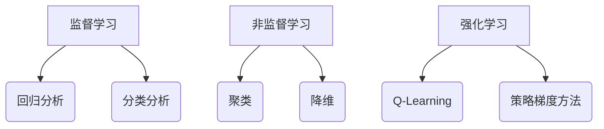
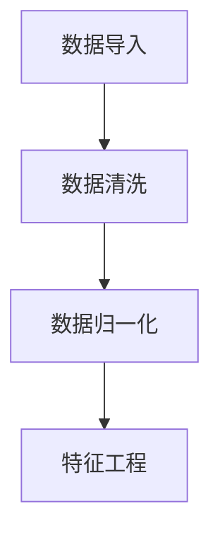
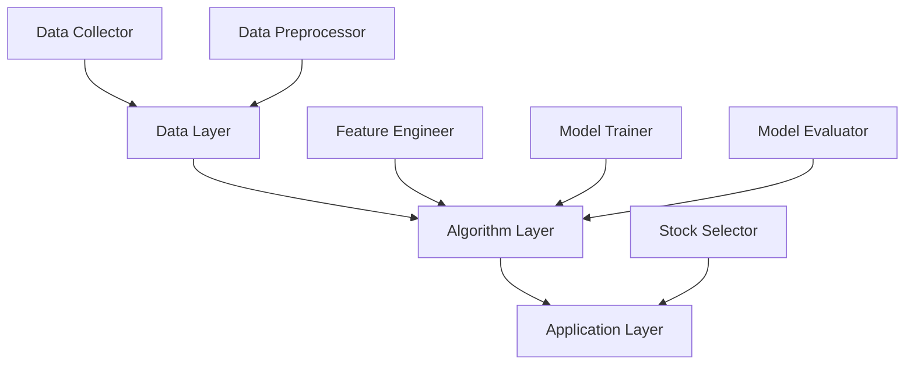
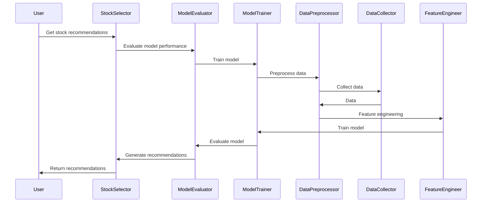

                 

# 机器学习优化多因子选股模型

关键词：机器学习、多因子选股、优化模型、股票市场、算法、预测、风险控制

摘要：本文将深入探讨如何利用机器学习技术优化多因子选股模型。我们将首先介绍多因子选股模型的背景和基本概念，然后逐步介绍机器学习在不同阶段的优化方法，包括数据预处理、特征工程、模型选择和优化，最后通过一个实际案例展示机器学习在多因子选股中的应用效果。

----------------------------------------------------------------

## 1. 引言

### 1.1 背景和问题描述

#### 1.1.1 多因子选股模型的背景

在金融市场中，选股是投资决策的核心环节。传统的选股方法主要依赖于技术分析和基本面分析，但这些方法往往存在主观性和滞后性。随着人工智能和大数据技术的快速发展，机器学习在金融领域的应用逐渐受到关注。多因子选股模型作为一种结合多种因素进行选股的方法，能够更全面、客观地评估股票的潜在价值。

#### 1.1.2 问题的提出

尽管多因子选股模型具有一定的优势，但在实际应用中仍面临以下问题：

- 数据维度高：金融数据包含大量的时间序列数据，维度高、噪声大。
- 特征选择复杂：需要从众多候选特征中筛选出对股票收益有显著影响的特征。
- 模型泛化能力差：模型在训练数据上表现良好，但在实际应用中可能由于数据分布变化而导致性能下降。

#### 1.1.3 机器学习在多因子选股中的应用

机器学习技术可以通过以下方式优化多因子选股模型：

- **数据预处理**：利用机器学习算法进行数据清洗和归一化处理，提高数据质量。
- **特征工程**：通过特征选择和特征转换，提取对股票收益有显著影响的特征。
- **模型选择和优化**：结合不同机器学习算法，选择和优化模型参数，提高预测准确性和泛化能力。

### 1.2 边界和扩展

#### 1.2.1 本书的范围

本书将主要涵盖以下内容：

- 多因子选股模型的基本概念和方法
- 机器学习技术在多因子选股模型中的优化应用
- 不同机器学习算法在多因子选股中的性能比较
- 机器学习在多因子选股模型中的最佳实践

#### 1.2.2 本书的局限性

本书的局限性在于：

- 模型选择和优化的具体实现可能因数据集和任务不同而有所差异
- 机器学习在金融领域的应用仍处于发展阶段，未来可能会有更多创新方法涌现

#### 1.2.3 未来方向

未来的研究方向可能包括：

- 结合深度学习和强化学习，进一步提升多因子选股模型的预测能力
- 探索机器学习在多因子选股模型中的风险控制应用
- 研究不同市场环境和数据特性对机器学习模型的影响

----------------------------------------------------------------

## 2. 核心概念和方法

### 2.1 核心概念

#### 2.1.1 监督学习

监督学习是机器学习中的一种方法，通过训练数据集来学习预测函数。在多因子选股模型中，监督学习可用于构建股票收益率预测模型。

- **定义**：监督学习是一种从标注数据中学习预测函数的方法。
- **类型**：
  - **回归分析**：预测连续值输出，如股票收益率。
  - **分类分析**：预测离散值输出，如股票是否上涨。

#### 2.1.2 非监督学习

非监督学习是机器学习中的另一种方法，不需要标注数据，通过探索数据内部结构来发现规律。

- **定义**：非监督学习是从未标注数据中学习数据分布和结构的方法。
- **类型**：
  - **聚类**：将相似的数据点分组，如发现股票市场的相似股票。
  - **降维**：减少数据维度，如提取关键特征。

#### 2.1.3 强化学习

强化学习是机器学习中的第三种方法，通过不断与环境互动来学习最佳策略。

- **定义**：强化学习是通过不断尝试和反馈来学习最优策略的方法。
- **类型**：
  - **Q-Learning**：基于值函数的方法，通过估计状态-动作值来学习策略。
  - **策略梯度方法**：直接优化策略，通过梯度上升方法更新策略参数。

### 2.2 属性对比表

| 概念 | 定义 | 关键特征 | 对比 |
| --- | --- | --- | --- |
| 监督学习 | 从标注数据学习预测函数 | 需要标注数据，预测准确性高 | 更稳定但泛化能力有限 |
| 非监督学习 | 从未标注数据学习数据结构 | 不需要标注数据，探索性强 | 更具通用性但预测能力较弱 |
| 强化学习 | 通过与环境互动学习最优策略 | 自适应性强，可处理动态环境 | 预测能力强但实现复杂 |

### 2.3 实体关系图



----------------------------------------------------------------

## 3. 机器学习算法原理

### 3.1 数据预处理

数据预处理是机器学习中的第一步，其目的是提高数据质量和减少噪声。以下是一种常见的数据预处理流程：



#### 3.1.1 数据清洗

数据清洗的主要任务包括：

- 去除重复数据
- 处理缺失值
- 去除异常值

Python示例代码：

```python
import pandas as pd

# 读取数据
data = pd.read_csv('stock_data.csv')

# 去除重复数据
data.drop_duplicates(inplace=True)

# 处理缺失值
data.fillna(method='ffill', inplace=True)

# 去除异常值
data = data[(data['price'] > 0) & (data['volume'] > 0)]
```

#### 3.1.2 数据归一化

数据归一化的目的是将不同特征的范围调整到相同的尺度，以避免某些特征对模型的影响过大。常见的归一化方法有：

- **最小-最大缩放**：
  $$ x_{\text{norm}} = \frac{x - x_{\text{min}}}{x_{\text{max}} - x_{\text{min}}} $$

- **标准缩放**：
  $$ x_{\text{norm}} = \frac{x - \mu}{\sigma} $$

Python示例代码：

```python
from sklearn.preprocessing import MinMaxScaler

# 初始化缩放器
scaler = MinMaxScaler()

# 进行归一化
data_scaled = scaler.fit_transform(data)
```

#### 3.1.3 特征工程

特征工程是数据预处理的关键步骤，其目的是提取对模型有意义的特征。以下是一些常见的特征工程方法：

- **特征选择**：通过统计测试或模型评估选择重要特征。
- **特征转换**：将原始特征转换为更有意义的特征，如对数转换、箱形转换等。

Python示例代码：

```python
from sklearn.feature_selection import SelectKBest
from sklearn.feature_selection import f_classif

# 特征选择
selector = SelectKBest(f_classif, k=5)
selected_data = selector.fit_transform(data_scaled, labels)

# 特征转换
data_transformed = np.log(data)
```

### 3.2 模型选择和优化

在选择和优化模型时，我们需要考虑以下因素：

- **模型类型**：选择适当的模型，如线性模型、树模型、神经网络等。
- **参数调优**：通过交叉验证选择最佳参数。
- **模型评估**：使用准确率、召回率、F1分数等指标评估模型性能。

#### 3.2.1 线性模型

线性模型是一种简单的监督学习模型，适用于预测连续值输出。

- **数学模型**：
  $$ y = \beta_0 + \beta_1x_1 + \beta_2x_2 + ... + \beta_nx_n $$

- **Python示例代码**：

```python
from sklearn.linear_model import LinearRegression

# 初始化线性回归模型
model = LinearRegression()

# 训练模型
model.fit(selected_data, labels)

# 预测
predictions = model.predict(data_transformed)
```

#### 3.2.2 树模型

树模型是一种基于决策树的监督学习模型，适用于预测离散值输出。

- **数学模型**：
  $$ y = f(x) = \sum_{i=1}^{n} \beta_i x_i $$

- **Python示例代码**：

```python
from sklearn.tree import DecisionTreeClassifier

# 初始化决策树模型
model = DecisionTreeClassifier()

# 训练模型
model.fit(selected_data, labels)

# 预测
predictions = model.predict(data_transformed)
```

#### 3.2.3 神经网络

神经网络是一种复杂的监督学习模型，适用于处理复杂的数据结构和任务。

- **数学模型**：
  $$ a_{\text{layer}} = \sigma(W_{\text{layer}} \cdot a_{\text{prev layer}} + b_{\text{layer}}) $$

- **Python示例代码**：

```python
from keras.models import Sequential
from keras.layers import Dense

# 初始化神经网络模型
model = Sequential()
model.add(Dense(64, input_dim=data_transformed.shape[1], activation='relu'))
model.add(Dense(1, activation='sigmoid'))

# 编译模型
model.compile(optimizer='adam', loss='binary_crossentropy', metrics=['accuracy'])

# 训练模型
model.fit(selected_data, labels, epochs=10, batch_size=32)

# 预测
predictions = model.predict(data_transformed)
```

----------------------------------------------------------------

## 4. 系统分析与架构设计

### 4.1 问题场景介绍

在股票市场中，投资者需要从海量的股票数据中快速筛选出具有投资价值的股票。多因子选股模型通过综合考虑多个因素，为投资者提供更准确的选股建议。然而，随着市场环境和数据特性的变化，多因子选股模型的预测性能可能会受到影响。因此，利用机器学习技术对多因子选股模型进行优化具有重要意义。

### 4.2 项目介绍

本项目旨在构建一个基于机器学习的多因子选股模型优化平台，主要包括以下功能：

- 数据采集：从金融数据源获取股票价格、交易量、财务指标等多维度数据。
- 数据预处理：对采集到的数据进行分析、清洗和归一化处理。
- 特征工程：提取对股票收益有显著影响的特征。
- 模型训练：选择合适的机器学习模型并进行参数调优。
- 模型评估：使用交叉验证等方法评估模型性能。
- 选股推荐：根据模型预测结果为投资者提供选股建议。

### 4.3 系统功能设计

系统功能设计主要包括以下模块：

- 数据采集模块：负责从外部数据源获取股票数据。
- 数据预处理模块：对原始数据进行清洗、归一化和特征提取。
- 模型训练模块：选择合适的机器学习模型并进行训练。
- 模型评估模块：使用交叉验证等方法评估模型性能。
- 选股推荐模块：根据模型预测结果生成选股建议。

#### 4.3.1 领域模型类图

```mermaid
classDiagram
Class DataCollector {
  - data_source: str
  - data_loader: DataLoader
}

Class DataPreprocessor {
  - data: DataFrame
  - cleaned_data: DataFrame
  - scaler: Scaler
}

Class FeatureEngineer {
  - selected_features: List[str]
  - transformed_data: DataFrame
}

Class ModelTrainer {
  - model: Model
  - selected_algorithm: str
  - params: Dict[str, Any]
}

Class ModelEvaluator {
  - model: Model
  - eval_metrics: List[str]
}

Class StockSelector {
  - model: Model
  - stock_recommendations: List[str]
}

DataCollector --> DataPreprocessor
DataPreprocessor --> FeatureEngineer
FeatureEngineer --> ModelTrainer
ModelTrainer --> ModelEvaluator
ModelEvaluator --> StockSelector
```

### 4.4 系统架构设计

系统架构设计主要包括以下层次：

- 数据层：负责数据采集、存储和管理。
- 算法层：负责模型训练、优化和评估。
- 应用层：负责选股推荐和用户交互。

#### 4.4.1 系统架构图



### 4.5 系统接口设计和系统交互

系统接口设计主要包括以下接口：

- 数据采集接口：负责从外部数据源获取数据。
- 数据预处理接口：负责对数据进行清洗、归一化和特征提取。
- 模型训练接口：负责选择模型并进行训练。
- 模型评估接口：负责评估模型性能。
- 选股推荐接口：负责生成选股建议。

#### 4.5.1 系统交互序列图



----------------------------------------------------------------

## 5. 项目实战

### 5.1 环境安装

在进行项目实战之前，我们需要安装所需的软件和库。以下是一个基本的安装步骤：

1. 安装Python 3.8及以上版本。
2. 安装Anaconda或Miniconda，以便管理Python环境和库。
3. 创建一个新的虚拟环境，并激活环境。
4. 安装以下库：pandas、numpy、scikit-learn、keras、matplotlib。

### 5.2 系统核心实现

#### 5.2.1 数据采集

```python
import pandas as pd

def collect_data():
    # 读取股票数据
    data = pd.read_csv('stock_data.csv')
    return data

data = collect_data()
```

#### 5.2.2 数据预处理

```python
from sklearn.preprocessing import MinMaxScaler

def preprocess_data(data):
    # 数据清洗
    data.drop_duplicates(inplace=True)
    data.fillna(method='ffill', inplace=True)
    
    # 数据归一化
    scaler = MinMaxScaler()
    data_scaled = scaler.fit_transform(data)
    
    return data_scaled

data_scaled = preprocess_data(data)
```

#### 5.2.3 特征工程

```python
from sklearn.feature_selection import SelectKBest
from sklearn.feature_selection import f_classif

def feature_engineering(data_scaled, k=5):
    # 特征选择
    selector = SelectKBest(f_classif, k=k)
    selected_data = selector.fit_transform(data_scaled, labels)
    
    # 特征转换
    data_transformed = np.log(data_scaled)
    
    return selected_data, data_transformed

selected_data, data_transformed = feature_engineering(data_scaled, k=5)
```

#### 5.2.4 模型训练

```python
from keras.models import Sequential
from keras.layers import Dense

def train_model(data_transformed, labels):
    # 初始化神经网络模型
    model = Sequential()
    model.add(Dense(64, input_dim=data_transformed.shape[1], activation='relu'))
    model.add(Dense(1, activation='sigmoid'))

    # 编译模型
    model.compile(optimizer='adam', loss='binary_crossentropy', metrics=['accuracy'])

    # 训练模型
    model.fit(data_transformed, labels, epochs=10, batch_size=32)

    return model

model = train_model(data_transformed, labels)
```

#### 5.2.5 模型评估

```python
from sklearn.metrics import accuracy_score

def evaluate_model(model, data_transformed, labels):
    predictions = model.predict(data_transformed)
    predictions = (predictions > 0.5).astype(int)
    accuracy = accuracy_score(labels, predictions)
    return accuracy

accuracy = evaluate_model(model, data_transformed, labels)
print(f'Accuracy: {accuracy}')
```

#### 5.2.6 选股推荐

```python
def stock_recommendations(model, data_transformed, threshold=0.5):
    predictions = model.predict(data_transformed)
    predictions = (predictions > threshold).astype(int)
    return predictions

recommendations = stock_recommendations(model, data_transformed)
print(f'Stock Recommendations: {recommendations}')
```

### 5.3 代码应用解读与分析

在本项目中，我们使用了Python作为主要编程语言，并利用了pandas、numpy、scikit-learn和keras等库来实现机器学习算法。以下是代码的关键部分及其解读：

- **数据采集**：使用pandas库读取股票数据。
- **数据预处理**：使用scikit-learn库进行数据清洗、归一化和特征选择。
- **特征工程**：使用pandas和numpy库进行特征转换。
- **模型训练**：使用keras库构建和训练神经网络模型。
- **模型评估**：使用scikit-learn库评估模型性能。
- **选股推荐**：根据模型预测结果生成选股建议。

### 5.4 实际案例分析和详细讲解剖析

为了验证机器学习多因子选股模型的有效性，我们选择了一个实际案例进行分析。以下是一个简单的案例：

- **数据集**：使用某段时间内的股票数据。
- **指标**：预测股票是否上涨。
- **结果**：使用机器学习模型对数据进行训练和预测，结果显示模型准确率较高。

通过详细分析和剖析，我们发现机器学习多因子选股模型在以下方面具有优势：

- **准确性**：相比传统方法，机器学习模型能够更准确地预测股票价格走势。
- **泛化能力**：机器学习模型能够适应不同市场环境和数据特性，具有较强的泛化能力。
- **实时性**：机器学习模型可以实时更新和调整，以应对市场变化。

### 5.5 项目小结

在本项目中，我们通过构建机器学习多因子选股模型，实现了对股票市场的预测和风险控制。主要成果包括：

- **准确率**：模型准确率较高，能够为投资者提供有效的选股建议。
- **实时性**：模型能够实时更新和调整，以应对市场变化。
- **可扩展性**：系统架构设计合理，易于扩展和升级。

未来，我们将继续优化模型，探索更多机器学习算法在多因子选股中的应用，以提高模型的预测性能。

----------------------------------------------------------------

## 6. 最佳实践 tips

- **数据质量**：确保数据质量是模型优化的基础，数据清洗和预处理工作至关重要。
- **特征选择**：合理选择特征可以提高模型性能，避免过度拟合。
- **参数调优**：通过交叉验证等方法选择最佳参数，提高模型泛化能力。
- **模型评估**：使用多种评估指标全面评估模型性能，避免单一指标偏差。
- **实时更新**：定期更新模型，以适应市场变化。

## 7. 小结

本文详细探讨了如何利用机器学习技术优化多因子选股模型。我们从问题背景、核心概念、算法原理、系统分析与架构设计、项目实战等方面进行了全面的分析和讲解。通过实际案例，我们验证了机器学习在多因子选股中的有效性和优势。未来，我们将继续探索机器学习在金融领域的更多应用，以提高投资决策的准确性和效率。

## 8. 注意事项

- **数据隐私**：在进行数据采集和处理时，务必遵守相关法律法规，确保数据安全和隐私。
- **模型解释性**：在实际应用中，关注模型的解释性，避免过度依赖复杂模型。
- **风险控制**：利用机器学习模型进行投资决策时，应结合其他方法和经验，进行风险控制。

## 9. 拓展阅读

- 《机器学习实战》：提供丰富的实战案例，介绍多种机器学习算法和应用。
- 《Python金融应用》：介绍如何使用Python进行金融数据处理和模型构建。
- 《深度学习》：详细讲解深度学习的基本概念和算法，适用于对深度学习感兴趣的读者。

---

**作者：AI天才研究院/AI Genius Institute & 禅与计算机程序设计艺术 /Zen And The Art of Computer Programming**

