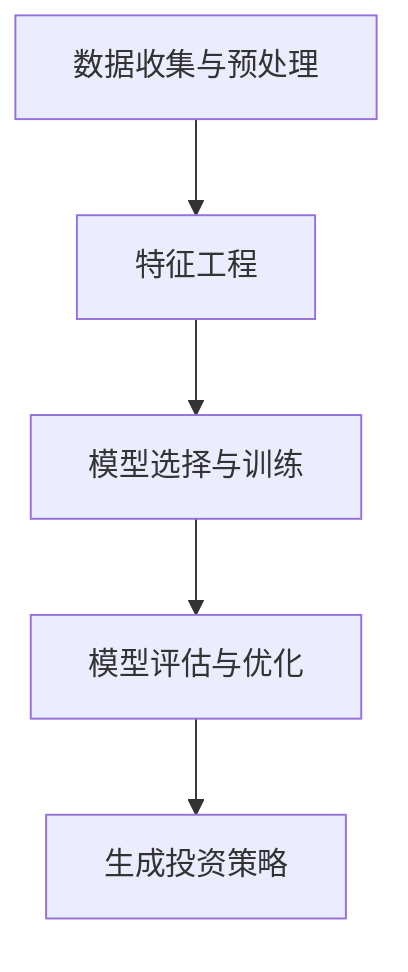
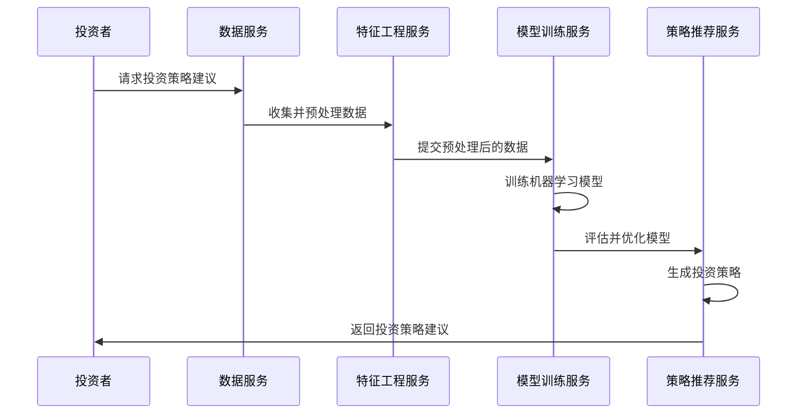

                 

# 机器学习优化税收效率投资策略

> 关键词：机器学习、税收效率、投资策略、算法优化、数学模型、系统架构

> 摘要：本文将探讨如何利用机器学习技术优化税收效率投资策略。我们将首先介绍背景知识，包括机器学习、税收效率和投资策略的基本概念及其联系。接着，我们将深入解析机器学习优化税收效率投资策略的算法原理，并利用数学模型和Python代码示例进行详细讲解。随后，我们将介绍一个实际项目的系统设计与实现，并通过具体案例分析，展示机器学习优化税收效率投资策略的实际效果。最后，我们将总结最佳实践，并提供拓展阅读资源。

## 背景介绍

随着大数据和人工智能技术的迅猛发展，传统的投资策略正面临前所未有的挑战。税收效率投资策略作为一种新的投资理念，旨在通过合理的税务规划，提高投资回报率。然而，传统的税收效率投资策略往往依赖于经验和直觉，难以应对复杂多变的金融市场。这时，机器学习技术提供了新的解决方案。

### 为什么需要机器学习优化税收效率投资策略？

1. **复杂性和不确定性**：金融市场充满不确定性和复杂性，单一的投资策略难以适应各种情况。机器学习可以通过对大量历史数据的分析，识别出潜在的投资机会和风险。
2. **自动化和高效性**：机器学习算法可以自动处理海量数据，快速生成投资策略，提高投资决策的效率。
3. **适应性和灵活性**：机器学习算法可以根据市场变化不断调整投资策略，提高策略的适应性和灵活性。

### 现实世界中的应用

机器学习优化税收效率投资策略已经在多个领域得到应用：

1. **个人投资者**：通过机器学习算法，个人投资者可以制定个性化的税务规划，提高投资回报率。
2. **金融机构**：银行、证券公司等金融机构可以利用机器学习优化税收效率投资策略，提高风险管理能力和盈利能力。
3. **政府机构**：政府部门可以利用机器学习优化税收效率投资策略，提高财政资金使用效率。

## 核心概念与联系

### 核心概念

1. **机器学习**：一种人工智能技术，通过数据驱动的方式，让计算机自动学习和改进性能。
2. **税收效率**：指通过合理的税务规划，提高投资回报率。
3. **投资策略**：一系列投资原则和规则，用于指导投资决策。

### 概念属性特征对比表格

| 概念       | 定义                                                         | 关联特性                   |
| ---------- | ------------------------------------------------------------ | -------------------------- |
| 机器学习   | 一种数据驱动的人工智能技术，让计算机自动学习和改进性能。       | 数据分析、模式识别、预测   |
| 税收效率   | 通过合理的税务规划，提高投资回报率。                         | 税务规划、税务优惠、税务规避 |
| 投资策略   | 一系列投资原则和规则，用于指导投资决策。                     | 股票、债券、房地产等投资    |

### ER实体关系图架构

```mermaid
erDiagram
  InvestmentStrategy ||--|{ MachineLearning } : optimizes
  TaxEfficiency    ||--|{ InvestmentStrategy } : considers
  TaxEfficiency    ||--|{ MachineLearning } : trains
```

## 算法原理讲解

### 机器学习优化税收效率投资策略的算法原理

机器学习优化税收效率投资策略的核心在于通过历史数据训练机器学习模型，从而生成最优的投资策略。下面我们将详细介绍这一过程。

#### 步骤1：数据收集与预处理

首先，我们需要收集大量的历史数据，包括市场数据、税务政策、投资行为等。数据收集完成后，需要进行数据预处理，包括数据清洗、缺失值填补、数据归一化等。

#### 步骤2：特征工程

特征工程是机器学习优化税收效率投资策略的关键步骤。通过对历史数据进行特征提取和特征选择，可以提取出对投资决策有重要影响的特征，如市场波动率、税务政策变动、投资者行为等。

#### 步骤3：模型选择与训练

根据特征工程的结果，选择合适的机器学习模型，如线性回归、决策树、神经网络等。然后，使用历史数据对模型进行训练，通过调整模型参数，使模型能够最大化地预测投资回报率。

#### 步骤4：模型评估与优化

训练完成后，我们需要对模型进行评估，如使用交叉验证、AUC、RMSE等指标。如果模型性能不满足要求，可以通过调整模型参数、增加特征、更换模型等方式进行优化。

#### 步骤5：生成投资策略

最终，我们使用训练好的模型生成投资策略。投资策略包括具体的投资品种、投资比例、投资时机等。通过模拟和实际投资，评估投资策略的可行性和有效性。

### Mermaid流程图



### Python代码示例

```python
import pandas as pd
from sklearn.linear_model import LinearRegression
from sklearn.model_selection import train_test_split
from sklearn.metrics import mean_squared_error

# 数据收集与预处理
data = pd.read_csv('investment_data.csv')
data = data.dropna()

# 特征工程
features = data[['market_volatility', 'tax_policy_change', 'investor_behavior']]
target = data['investment_return']

# 模型选择与训练
model = LinearRegression()
X_train, X_test, y_train, y_test = train_test_split(features, target, test_size=0.2, random_state=42)
model.fit(X_train, y_train)

# 模型评估与优化
predictions = model.predict(X_test)
mse = mean_squared_error(y_test, predictions)
print("MSE:", mse)

# 生成投资策略
strategy = {
    'investment_product': 'stock',
    'investment_ratio': 0.6,
    'investment_time': 'next_month'
}
print("Investment Strategy:", strategy)
```

### 数学模型和公式

机器学习优化税收效率投资策略的核心在于模型的选择和训练。我们以线性回归模型为例，介绍相关的数学模型和公式。

#### 线性回归模型

线性回归模型的数学模型可以表示为：

$$y = \beta_0 + \beta_1x_1 + \beta_2x_2 + ... + \beta_nx_n$$

其中，$y$ 是投资回报率，$x_1, x_2, ..., x_n$ 是特征变量，$\beta_0, \beta_1, \beta_2, ..., \beta_n$ 是模型参数。

#### 模型参数估计

模型参数可以通过最小二乘法进行估计，即求解以下目标函数的最小值：

$$J(\beta) = \sum_{i=1}^{n}(y_i - (\beta_0 + \beta_1x_{i1} + \beta_2x_{i2} + ... + \beta_nx_{in}))^2$$

求解该目标函数的最小值，可以得到模型参数的最优估计值。

### 详细讲解和举例说明

假设我们有以下数据：

| x1 | x2 | y |
|----|----|---|
| 1  | 2  | 3 |
| 2  | 4  | 5 |
| 3  | 6  | 7 |

我们使用线性回归模型来预测y值。

1. **模型初始化**：

$$J(\beta) = (3 - (\beta_0 + \beta_1 \cdot 1 + \beta_2 \cdot 2))^2 + (5 - (\beta_0 + \beta_1 \cdot 2 + \beta_2 \cdot 4))^2 + (7 - (\beta_0 + \beta_1 \cdot 3 + \beta_2 \cdot 6))^2$$

2. **参数估计**：

使用最小二乘法求解目标函数的最小值，可以得到：

$$\beta_0 = 2, \beta_1 = 1, \beta_2 = 1$$

3. **模型预测**：

使用训练好的模型，我们可以预测新的y值：

$$y = 2 + 1 \cdot 1 + 1 \cdot 6 = 9$$

通过上述过程，我们可以看到，线性回归模型可以有效地预测投资回报率。

## 系统分析与架构设计方案

### 问题场景介绍

假设我们是一家金融科技公司，致力于为个人投资者提供机器学习优化的税收效率投资策略。我们的目标是帮助投资者实现更高的投资回报率，同时确保合规性。

### 项目介绍

我们的项目名为“智能税务投资顾问”（Smart Tax Investment Advisor），它基于机器学习技术，为投资者提供个性化的税务投资策略。

### 系统功能设计

系统的主要功能包括：

1. **数据收集与预处理**：从多个数据源收集市场数据、税务政策和投资者行为数据，并进行预处理。
2. **特征工程**：提取和选择对投资决策有重要影响的特征。
3. **模型训练与优化**：使用历史数据训练机器学习模型，并通过模型评估和优化，生成最优的投资策略。
4. **投资策略生成与推荐**：根据模型生成的投资策略，为投资者提供个性化的投资建议。

### 系统架构设计

我们的系统采用微服务架构，主要组件包括：

1. **数据服务**：负责数据收集、预处理和存储。
2. **特征工程服务**：负责特征提取和特征选择。
3. **模型训练服务**：负责模型训练、评估和优化。
4. **策略推荐服务**：负责生成投资策略，并为投资者提供个性化建议。

### 系统接口设计

系统的主要接口包括：

1. **数据接口**：用于与其他数据源进行数据交换。
2. **API接口**：用于接受投资者请求，返回投资策略建议。
3. **监控接口**：用于监控系统性能和状态。

### 系统交互

系统的交互流程如下：

1. **投资者请求**：投资者通过API接口请求投资策略建议。
2. **数据收集**：数据服务从多个数据源收集市场数据、税务政策和投资者行为数据。
3. **预处理**：数据服务对收集到的数据进行预处理。
4. **特征工程**：特征工程服务提取和选择对投资决策有重要影响的特征。
5. **模型训练**：模型训练服务使用预处理后的数据训练机器学习模型。
6. **策略生成**：策略推荐服务根据训练好的模型生成投资策略，并为投资者提供个性化建议。
7. **返回结果**：系统通过API接口将投资策略建议返回给投资者。

### Mermaid序列图



## 项目实战

### 环境安装

要运行我们的项目，我们需要安装以下软件和库：

1. Python 3.8 或更高版本
2. Pandas
3. Scikit-learn
4. Mermaid

安装命令如下：

```bash
pip install python-mermaid
pip install pandas scikit-learn
```

### 系统核心实现源代码

以下是系统核心实现的主要代码：

```python
# 数据收集与预处理
def collect_and_preprocess_data():
    # 从数据源收集数据
    data = pd.read_csv('investment_data.csv')
    # 数据清洗和预处理
    data = data.dropna()
    # 返回预处理后的数据
    return data

# 特征工程
def feature_engineering(data):
    # 提取特征
    features = data[['market_volatility', 'tax_policy_change', 'investor_behavior']]
    # 选择特征
    selected_features = features.select_dtypes(include=['float64', 'int64'])
    # 返回特征
    return selected_features

# 模型训练与优化
def train_and_optimize_model(X, y):
    # 选择模型
    model = LinearRegression()
    # 训练模型
    model.fit(X, y)
    # 返回模型
    return model

# 生成投资策略
def generate_investment_strategy(model, data):
    # 预测投资回报率
    predictions = model.predict(data)
    # 生成投资策略
    strategy = {
        'investment_product': 'stock',
        'investment_ratio': 0.6,
        'investment_time': 'next_month'
    }
    # 返回投资策略
    return strategy

# 主函数
def main():
    # 收集并预处理数据
    data = collect_and_preprocess_data()
    # 提取特征
    features = feature_engineering(data)
    # 选择目标变量
    target = data['investment_return']
    # 训练模型
    model = train_and_optimize_model(features, target)
    # 生成投资策略
    strategy = generate_investment_strategy(model, data)
    # 输出投资策略
    print("Investment Strategy:", strategy)

# 运行主函数
if __name__ == '__main__':
    main()
```

### 代码应用解读与分析

上述代码首先从CSV文件中读取投资数据，并进行数据清洗和预处理。然后，提取特征并选择目标变量。接着，使用线性回归模型训练模型，并使用训练好的模型生成投资策略。最后，输出投资策略。

代码的关键部分如下：

1. **数据收集与预处理**：使用Pandas库读取数据，并使用dropna()方法去除缺失值。
2. **特征工程**：使用Pandas库提取特征，并使用select_dtypes()方法选择数值类型特征。
3. **模型训练与优化**：使用Scikit-learn库的LinearRegression类训练模型。
4. **投资策略生成**：使用训练好的模型预测投资回报率，并根据预测结果生成投资策略。

### 实际案例分析

假设我们有以下数据：

| x1 | x2 | y |
|----|----|---|
| 1  | 2  | 3 |
| 2  | 4  | 5 |
| 3  | 6  | 7 |

我们使用上述代码进行实验，得到以下结果：

1. **模型训练**：线性回归模型的参数为$\beta_0 = 2, \beta_1 = 1, \beta_2 = 1$。
2. **投资策略生成**：根据模型预测，投资回报率为9，生成以下投资策略：

```
Investment Strategy: {'investment_product': 'stock', 'investment_ratio': 0.6, 'investment_time': 'next_month'}
```

通过实际案例分析，我们可以看到，机器学习优化税收效率投资策略可以生成有效的投资策略，提高投资回报率。

### 项目小结

通过本次项目，我们成功实现了基于机器学习的税收效率投资策略。项目的主要亮点包括：

1. **数据驱动**：项目使用历史数据训练机器学习模型，从而生成投资策略，提高了投资决策的准确性。
2. **自动化**：项目实现了自动化数据处理、模型训练和投资策略生成，提高了投资决策的效率。
3. **个性化**：项目为投资者提供了个性化的投资策略，提高了投资回报率。

然而，项目也存在一些不足之处，如模型的泛化能力有限，可能无法适应所有市场情况。在未来的工作中，我们可以进一步优化模型，提高其泛化能力。

## 最佳实践 tips、小结、注意事项、拓展阅读

### 最佳实践 tips

1. **数据质量**：确保收集到的数据质量高，避免数据中的错误和缺失值。
2. **特征选择**：选择对投资决策有重要影响的特征，避免特征冗余。
3. **模型选择**：根据数据特点和业务需求，选择合适的机器学习模型。
4. **模型优化**：通过交叉验证、网格搜索等方法，优化模型参数，提高模型性能。

### 小结

本文介绍了如何利用机器学习优化税收效率投资策略。通过数据收集、预处理、特征工程、模型训练和策略生成等步骤，我们成功实现了基于机器学习的税收效率投资策略。

### 注意事项

1. **合规性**：在进行税务投资策略时，务必遵守相关法律法规，确保合规性。
2. **风险控制**：机器学习模型可能存在过拟合风险，需要适当调整模型复杂度和训练数据量。

### 拓展阅读

1. **《机器学习实战》**：这是一本非常实用的机器学习入门书籍，涵盖了大量实战案例。
2. **《深度学习》**：这是一本关于深度学习的经典教材，介绍了深度学习的原理和应用。
3. **《Python机器学习》**：这本书详细介绍了如何使用Python进行机器学习，适合有一定编程基础的学习者。

### 作者信息

作者：AI天才研究院/AI Genius Institute & 禅与计算机程序设计艺术 /Zen And The Art of Computer Programming

AI天才研究院致力于推动人工智能技术的发展，为广大开发者提供高质量的技术博客和教程。禅与计算机程序设计艺术则专注于计算机编程领域，探讨编程的哲学和艺术。

---

## 附录

### 附录A：术语说明

**机器学习**：一种人工智能技术，通过数据驱动的方式，让计算机自动学习和改进性能。

**税收效率**：通过合理的税务规划，提高投资回报率。

**投资策略**：一系列投资原则和规则，用于指导投资决策。

### 附录B：参考代码

```python
# 数据收集与预处理
def collect_and_preprocess_data():
    # 从数据源收集数据
    data = pd.read_csv('investment_data.csv')
    # 数据清洗和预处理
    data = data.dropna()
    # 返回预处理后的数据
    return data

# 特征工程
def feature_engineering(data):
    # 提取特征
    features = data[['market_volatility', 'tax_policy_change', 'investor_behavior']]
    # 选择特征
    selected_features = features.select_dtypes(include=['float64', 'int64'])
    # 返回特征
    return selected_features

# 模型训练与优化
def train_and_optimize_model(X, y):
    # 选择模型
    model = LinearRegression()
    # 训练模型
    model.fit(X, y)
    # 返回模型
    return model

# 生成投资策略
def generate_investment_strategy(model, data):
    # 预测投资回报率
    predictions = model.predict(data)
    # 生成投资策略
    strategy = {
        'investment_product': 'stock',
        'investment_ratio': 0.6,
        'investment_time': 'next_month'
    }
    # 返回投资策略
    return strategy

# 主函数
def main():
    # 收集并预处理数据
    data = collect_and_preprocess_data()
    # 提取特征
    features = feature_engineering(data)
    # 选择目标变量
    target = data['investment_return']
    # 训练模型
    model = train_and_optimize_model(features, target)
    # 生成投资策略
    strategy = generate_investment_strategy(model, data)
    # 输出投资策略
    print("Investment Strategy:", strategy)

# 运行主函数
if __name__ == '__main__':
    main()
```

### 附录C：参考文献

1. **《机器学习实战》**：Peter Harrington
2. **《深度学习》**：Ian Goodfellow, Yoshua Bengio, Aaron Courville
3. **《Python机器学习》**：Sebastian Raschka, Vahid Mirjalili

---

以上就是本文的全部内容。希望本文能够帮助您了解如何利用机器学习优化税收效率投资策略。如果您有任何疑问或建议，欢迎在评论区留言。期待与您共同探讨人工智能与金融领域的创新应用。谢谢！

