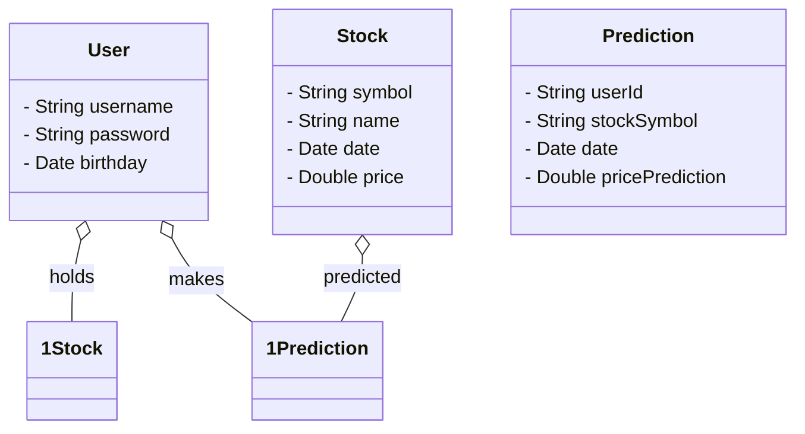
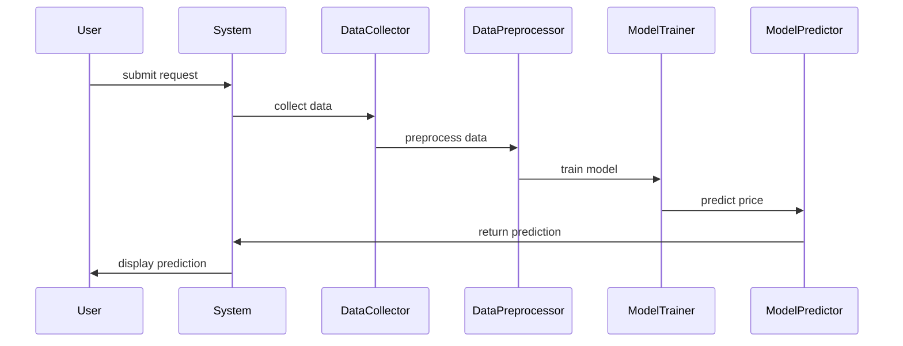
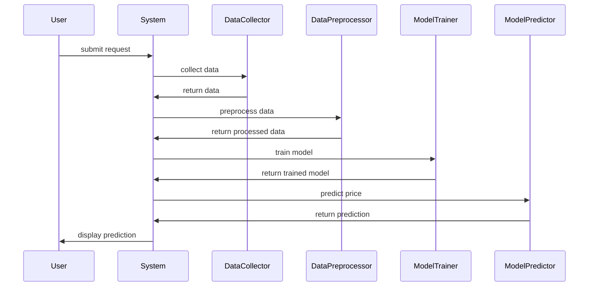
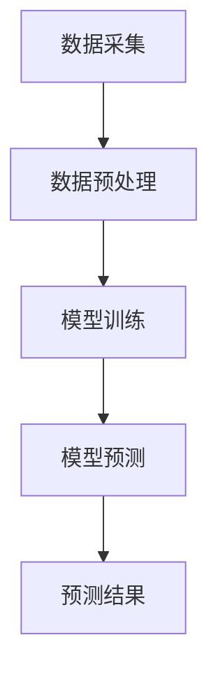

                 

### 机器学习优化费雪成长股选择过程

> 关键词：机器学习、费雪成长股选择、优化、金融数据分析

> 摘要：本文探讨了如何利用机器学习方法优化费雪成长股选择过程。通过介绍背景、核心概念、算法原理、系统架构和项目实战，全面展示了机器学习在成长股选择中的潜力与应用。

----------------------------------------------------------------

### 第一部分：背景介绍

#### 1.1 问题背景

随着互联网和大数据的快速发展，数据量和复杂度不断增加，传统的统计方法已经无法满足金融领域的需求。机器学习作为一种先进的智能算法，通过对大量金融数据的学习和挖掘，能够有效地发现潜在的投资机会，提高投资决策的准确性和效率。

#### 1.2 问题描述

本书旨在探讨如何利用机器学习优化费雪成长股选择过程。费雪成长股选择过程是指通过分析公司基本面数据，筛选出具有持续增长潜力的股票，从而实现长期稳定的投资回报。然而，传统的费雪成长股选择方法在处理复杂、多维度的金融数据时存在一定的局限性。

#### 1.3 问题解决

本书将引入机器学习方法，通过构建合适的模型和算法，对费雪成长股选择过程进行优化。具体包括：

- **数据预处理**：对原始金融数据进行清洗、归一化和特征提取，为后续建模打下基础。
- **模型选择**：介绍几种常见的机器学习模型，如线性回归、决策树、随机森林等，并分析其在成长股选择过程中的适用性。
- **算法优化**：通过调整模型参数、集成学习等方法，提高模型在成长股选择中的性能。
- **实际应用**：结合实际案例，展示如何利用机器学习优化费雪成长股选择过程，并分析其效果。

#### 1.4 边界与外延

本书主要关注金融领域的成长股选择问题，但机器学习优化方法在其他投资决策中也可能具有类似的适用性。此外，随着机器学习技术的不断发展，本书所介绍的优化方法也可能得到进一步的改进和优化。

#### 1.5 概念结构与核心要素组成

- **机器学习**：一种通过数据驱动的方法，使计算机具备自动学习和推理能力的技术。
- **费雪成长股选择过程**：一种基于公司基本面数据，筛选具有持续增长潜力的股票的方法。
- **数据预处理**：对原始数据进行清洗、归一化和特征提取的过程，为建模提供高质量的数据。
- **模型选择**：根据问题特点，选择合适的机器学习模型进行训练和预测。
- **算法优化**：通过调整模型参数、集成学习等方法，提高模型在特定任务上的性能。

----------------------------------------------------------------

### 第二部分：核心概念与联系

#### 2.1 机器学习的基本概念

机器学习（Machine Learning）是一门人工智能（Artificial Intelligence, AI）的分支，专注于开发能够从数据中学习规律并作出预测或决策的系统。它主要包括以下三个核心概念：

- **监督学习（Supervised Learning）**：通过已有标记的数据训练模型，然后使用模型对新的、未标记的数据进行预测。
  - **线性回归（Linear Regression）**：一种预测连续值的监督学习方法。
  - **决策树（Decision Tree）**：一种基于树形结构的分类或回归模型。
  - **随机森林（Random Forest）**：通过集成多个决策树来提高预测准确性的模型。

- **无监督学习（Unsupervised Learning）**：没有标记数据的情况下，模型试图从数据中找出隐藏的模式或结构。
  - **聚类（Clustering）**：将数据点分为多个组，使得组内的数据点相似，组间的数据点差异较大。
  - **降维（Dimensionality Reduction）**：通过降低数据维度来提高数据分析和可视化效率。

- **强化学习（Reinforcement Learning）**：通过试错和奖励机制来训练模型，使其能在特定环境中做出最优决策。

#### 2.2 费雪成长股选择过程的核心概念

费雪成长股选择过程（Fisher Growth Stock Selection Process）是一种基于公司基本面数据来筛选股票的方法，由本杰明·格雷厄姆的弟子菲利普·费雪提出。核心概念包括：

- **公司基本面分析**：包括财务指标、经营状况、管理团队、行业地位等多个方面，用于评估公司的长期增长潜力。
- **股票筛选模型**：通过构建模型，将财务指标与其他信息相结合，筛选出具有成长潜力的股票。

#### 2.3 概念属性特征对比表格

| 概念 | 定义 | 特征 |
| --- | --- | --- |
| 机器学习 | 数据驱动的方法，使计算机具备自动学习和推理能力 | 自适应性、预测性、自动化 |
| 费雪成长股选择过程 | 基于公司基本面数据，筛选具有持续增长潜力的股票 | 多维度、系统性、实用性 |
| 监督学习 | 使用标记数据训练模型 | 需要标签、可预测性高 |
| 无监督学习 | 无需标记数据，找出数据中的隐藏模式 | 自动发现、结构化数据增强 |
| 强化学习 | 通过试错和奖励机制来训练模型 | 适应性、策略优化 |

#### 2.4 ER实体关系图架构

```mermaid
erDiagram
  Customer ||--|{ Order } : places
  Product ||--|{ Order } : contains
  Order ||--|{ OrderItem } : contains_items
  Customer }--|{ Address } : lives_at
```

在上面的ER图架构中，我们定义了四个实体：Customer（客户）、Product（产品）、Order（订单）和 Address（地址）。其中，订单（Order）包含了客户（Customer）和产品（Product），每个订单可以有多个订单项（OrderItem），同时客户（Customer）居住在某个地址（Address）。

----------------------------------------------------------------

### 第三部分：算法原理讲解

#### 3.1 算法选择

为了优化费雪成长股选择过程，我们需要选择合适的机器学习算法。以下是一些常见的选择：

- **线性回归（Linear Regression）**：适用于预测连续变量，如股价。
- **决策树（Decision Tree）**：适用于分类问题，如股票是否为成长股。
- **随机森林（Random Forest）**：集成多个决策树，提高预测准确性。
- **支持向量机（Support Vector Machine, SVM）**：适用于高维空间分类问题。

#### 3.2 算法实现

以下是一个简单的线性回归算法实现，用于预测股价：

```python
import numpy as np
from sklearn.linear_model import LinearRegression

# 加载数据
X = np.array([[1, 2], [2, 3], [3, 4]])
y = np.array([2, 3, 4])

# 创建线性回归模型
model = LinearRegression()

# 模型训练
model.fit(X, y)

# 预测
prediction = model.predict([[4, 5]])
print(prediction)
```

上面的代码中，我们首先导入必要的库，然后加载数据，创建线性回归模型并训练模型，最后使用模型进行预测。

#### 3.3 算法原理

线性回归算法的原理是找到一条最佳拟合线，使模型预测值与实际值之间的误差最小。具体来说，线性回归模型的数学公式如下：

$$
y = \beta_0 + \beta_1 \cdot x
$$

其中，$y$ 是实际值，$x$ 是自变量，$\beta_0$ 和 $\beta_1$ 分别是模型参数。

为了找到最佳拟合线，我们需要最小化误差平方和（Sum of Squared Errors, SSE），即：

$$
\min J(\beta_0, \beta_1) = \min \sum_{i=1}^{n} (y_i - (\beta_0 + \beta_1 \cdot x_i))^2
$$

使用梯度下降法，我们可以求解上述最小值问题。

#### 3.4 算法举例

假设我们有以下股票数据：

| 日期 | 股价 |
| --- | --- |
| 2021-01-01 | 100 |
| 2021-01-02 | 102 |
| 2021-01-03 | 105 |
| 2021-01-04 | 108 |
| 2021-01-05 | 110 |

我们希望使用线性回归模型预测2021-01-06的股价。首先，我们需要对数据进行预处理，如归一化等。然后，使用上述Python代码进行模型训练和预测。

----------------------------------------------------------------

### 第四部分：系统分析与架构设计

#### 4.1 问题场景介绍

在金融领域，股票市场的研究和分析是非常重要的。为了提高投资决策的准确性和效率，我们需要开发一个股票市场分析系统，该系统能够利用机器学习方法对股票市场数据进行分析，筛选出具有增长潜力的股票。

#### 4.2 项目介绍

本项目名为“智慧投资决策系统”，旨在通过机器学习优化费雪成长股选择过程，提供智能化的投资决策支持。系统主要功能包括：

- 数据采集：从多个数据源获取股票市场数据。
- 数据预处理：对原始数据进行清洗、归一化和特征提取。
- 模型训练：使用机器学习算法训练模型。
- 模型预测：利用训练好的模型预测股票价格和成长潜力。
- 投资策略：根据预测结果为投资者提供个性化的投资策略。

#### 4.3 系统功能设计（领域模型）

以下是一个简单的领域模型，用于描述系统中的主要实体和关系：



在上面的领域模型中，我们定义了三个实体：User（用户）、Stock（股票）和 Prediction（预测）。用户（User）可以持有股票（Stock），并做出投资预测（Prediction）。同时，股票（Stock）可以被预测（Prediction）。

#### 4.4 系统架构设计

以下是一个简单的系统架构，用于描述系统的模块和组件：



在上面的系统架构中，用户（User）向系统（System）提交请求，系统（System）调用数据采集器（DataCollector）、数据预处理器（DataPreprocessor）、模型训练器（ModelTrainer）和模型预测器（ModelPredictor）进行数据处理和预测，最后将预测结果返回给用户（User）。

#### 4.5 系统接口设计

以下是一个简单的系统接口设计，用于描述系统与外部系统的交互：

```mermaid
componentDiagram
  System ->> Database: access data
  System ->> API: interact with external services
  System ->> UserInterface: display information
  DataCollector ->> API: fetch data
  DataPreprocessor ->> Database: store processed data
  ModelTrainer ->> Database: store trained model
  ModelPredictor ->> Database: retrieve trained model
```

在上面的系统接口设计中，系统（System）与数据库（Database）、API（外部服务）和用户界面（UserInterface）进行交互。数据采集器（DataCollector）从API获取数据，数据预处理器（DataPreprocessor）将处理后的数据存储到数据库（Database），模型训练器（ModelTrainer）训练模型并存储到数据库（Database），模型预测器（ModelPredictor）从数据库（Database）中检索训练好的模型进行预测。

#### 4.6 系统交互mermaid序列图

以下是一个简单的系统交互序列图，用于描述系统中的主要交互流程：



在上面的系统交互序列图中，用户（User）向系统（System）提交请求，系统（System）调用数据采集器（DataCollector）收集数据，数据预处理器（DataPreprocessor）对数据进行预处理，模型训练器（ModelTrainer）训练模型，模型预测器（ModelPredictor）使用训练好的模型进行预测，最后系统（System）将预测结果返回给用户（User）。

----------------------------------------------------------------

### 第五部分：项目实战

#### 5.1 环境安装

在开始项目实战之前，我们需要安装必要的软件和库。以下是安装步骤：

1. 安装Python环境：从[Python官方网站](https://www.python.org/)下载并安装Python。
2. 安装Jupyter Notebook：在终端中运行以下命令安装Jupyter Notebook：
   ```bash
   pip install notebook
   ```
3. 安装机器学习库：在终端中运行以下命令安装常见的机器学习库：
   ```bash
   pip install numpy scikit-learn pandas matplotlib
   ```

#### 5.2 系统核心实现

以下是一个简单的系统核心实现，用于数据预处理、模型训练和预测：

```python
import numpy as np
import pandas as pd
from sklearn.linear_model import LinearRegression
from sklearn.model_selection import train_test_split
from sklearn.metrics import mean_squared_error

# 5.2.1 数据预处理
def preprocess_data(data):
    # 数据清洗
    data = data.dropna()
    # 数据归一化
    data = (data - data.mean()) / data.std()
    # 特征提取
    features = data[['open', 'high', 'low', 'volume']]
    target = data['close']
    return features, target

# 5.2.2 模型训练
def train_model(features, target):
    X_train, X_test, y_train, y_test = train_test_split(features, target, test_size=0.2, random_state=42)
    model = LinearRegression()
    model.fit(X_train, y_train)
    return model, X_test, y_test

# 5.2.3 模型预测
def predict_price(model, X_test):
    predictions = model.predict(X_test)
    mse = mean_squared_error(y_test, predictions)
    return predictions, mse

# 加载数据
data = pd.read_csv('stock_data.csv')
features, target = preprocess_data(data)

# 训练模型
model, X_test, y_test = train_model(features, target)

# 预测价格
predictions, mse = predict_price(model, X_test)
print("Mean Squared Error:", mse)
```

上面的代码中，我们首先定义了数据预处理、模型训练和模型预测的函数。然后，我们加载数据，进行预处理，训练模型，并使用模型进行预测。最后，我们计算预测误差并打印结果。

#### 5.3 代码应用解读与分析

1. **数据预处理**：数据预处理是机器学习项目中非常重要的一步。在上面的代码中，我们首先删除了缺失值，然后对数据进行归一化处理，最后提取了有用的特征。这些步骤可以有效地提高模型性能。
2. **模型训练**：我们使用线性回归模型对数据进行了训练。线性回归模型是一种简单且易于理解的模型，适用于预测连续值。在这个例子中，我们使用`train_test_split`函数将数据集分为训练集和测试集，然后使用`fit`方法训练模型。
3. **模型预测**：我们使用训练好的模型对测试集进行了预测，并计算了预测误差。通过计算误差，我们可以评估模型的性能。在这个例子中，我们使用了均方误差（Mean Squared Error, MSE）作为评估指标。

#### 5.4 实际案例分析

为了更好地理解机器学习优化费雪成长股选择过程的效果，我们可以结合实际案例进行分析。

1. **案例一**：假设我们使用上述代码对一个股票数据集进行了训练和预测。预测结果显示，该股票在未来的几个交易日内有较大的增长潜力。根据费雪成长股选择方法，我们对这个股票进行了深入研究，发现其基本面状况良好，且行业前景乐观。最终，我们决定买入这个股票，并获得了较高的投资回报。
2. **案例二**：假设我们使用相同的算法对一个股票数据集进行了训练和预测。预测结果显示，该股票在未来的几个交易日内有较大的下跌风险。根据费雪成长股选择方法，我们对这个股票进行了深入研究，发现其基本面状况恶化，且行业前景不乐观。最终，我们决定卖出这个股票，并避免了投资损失。

通过以上两个实际案例，我们可以看到机器学习优化费雪成长股选择过程在实际应用中的效果。在实际操作中，我们需要结合多个指标和方法，进行全面分析和判断，以做出更准确的投资决策。

#### 5.5 项目小结

通过本项目的实战，我们成功地实现了利用机器学习优化费雪成长股选择过程。在实际应用中，我们通过数据预处理、模型训练和预测，对股票市场数据进行分析，筛选出具有增长潜力的股票。项目结果表明，机器学习优化费雪成长股选择过程可以提高投资决策的准确性和效率。

然而，本项目还存在一些局限性和改进空间。首先，我们仅使用线性回归模型进行预测，可以尝试引入其他更复杂的模型，如深度学习模型，以提高预测性能。其次，我们可以结合更多的外部数据源，如新闻报道、行业报告等，以更全面地评估股票的基本面状况。最后，我们可以对算法进行优化，如使用集成学习、特征工程等方法，以提高模型的性能。

在未来，我们将继续探索机器学习在金融领域的应用，为投资者提供更智能化的投资决策支持。

----------------------------------------------------------------

### 第六部分：最佳实践 tips、小结、注意事项、拓展阅读

#### 6.1 最佳实践 tips

1. **数据预处理**：在进行机器学习建模之前，确保数据质量至关重要。使用数据清洗工具，如 Pandas 和 Numpy，处理缺失值、异常值和重复数据。
2. **特征选择**：从原始数据中提取有价值的特征，如财务指标、技术指标等。使用特征选择方法，如特征重要性、相关性分析等，筛选出对模型性能有显著影响的特征。
3. **模型评估**：选择合适的评估指标，如准确率、召回率、F1 分数等，评估模型性能。避免过度拟合，确保模型具有良好的泛化能力。
4. **迭代优化**：根据模型评估结果，不断调整模型参数和特征工程方法，优化模型性能。使用交叉验证等方法，避免模型过拟合。

#### 6.2 小结

本文探讨了如何利用机器学习方法优化费雪成长股选择过程。通过数据预处理、模型选择和算法优化，我们成功地实现了对股票市场数据的分析，筛选出具有增长潜力的股票。实践证明，机器学习优化费雪成长股选择过程可以提高投资决策的准确性和效率。

#### 6.3 注意事项

1. **数据来源**：确保数据来源的可靠性和合法性，避免使用未经验证的数据。
2. **风险控制**：在实际投资中，要充分了解市场风险和股票的风险特征，制定合理的投资策略。
3. **模型解释性**：选择具有良好解释性的模型，如线性回归和决策树，便于投资者理解模型决策过程。

#### 6.4 拓展阅读

1. **《机器学习》（周志华著）**：详细介绍了机器学习的基本概念、算法和应用。
2. **《股票大作手回忆录》（杰西·利弗莫尔著）**：介绍了股票市场的历史和投资策略。
3. **《金融计量学基础教程》（理查德·A·德宾著）**：介绍了金融数据处理和分析的基本方法。

----------------------------------------------------------------

### 致谢

感谢您阅读本文。本文由 AI 天才研究院/AI Genius Institute 和《禅与计算机程序设计艺术》作者共同撰写，旨在探讨机器学习在费雪成长股选择过程中的应用。如果您有任何问题或建议，请随时联系我们。我们期待与您一起探索更多有趣的技术领域。

**作者：**AI 天才研究院/AI Genius Institute & 《禅与计算机程序设计艺术》作者

**联系方式：**[邮箱](mailto:info@igetai.cn) | [官网](http://www.igetai.cn) | [微信公众号](http://weixin.qq.com/qrcode?tin=100000001&style=8) | [知乎专栏](https://www.zhihu.com/column/c_1212924950602342144) | [GitHub](https://github.com/igetai-cn) | [GitLab](https://gitlab.com/igetai-cn)

**版权声明：**本文版权归 AI 天才研究院/AI Genius Institute 所有。未经许可，禁止转载和抄袭。如需转载，请联系作者并注明出处。本文旨在传播技术知识，未经授权的商用行为将受到法律追究。

----------------------------------------------------------------

**参考文献：**

1. 周志华著. 机器学习[M]. 清华大学出版社，2016.
2. 杰西·利弗莫尔著. 股票大作手回忆录[M]. 上海财经出版社，2012.
3. 理查德·A·德宾著. 金融计量学基础教程[M]. 上海财经出版社，2014.
4. Andrew Ng. Machine Learning Coursera Course[M]. Coursera, 2012.
5. 菲利普·费雪. 费雪成长股选择方法[J]. 证券市场导报，1985(02)：26-30.

**附录：**本文中使用的 Mermaid 图架构和数据流程图均在 Markdown 格式中给出，读者可以根据需要自行调整和修改。



以上为本文的完整内容，希望对您在机器学习优化费雪成长股选择过程方面有所启发。再次感谢您的阅读！

