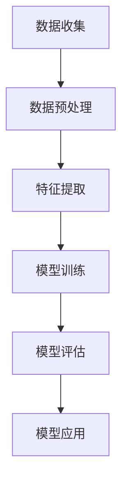
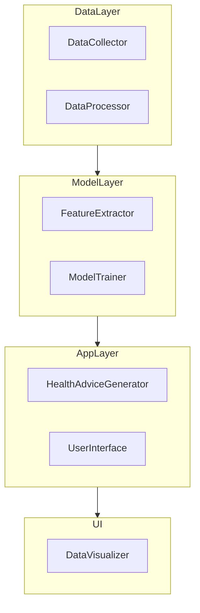
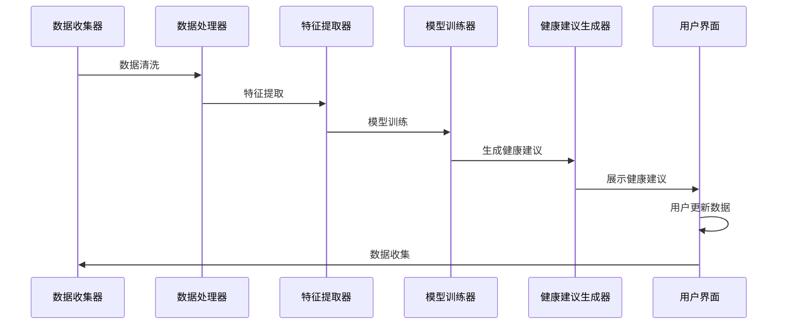

                 


# 第一部分：机器学习在个性化健康建议中的背景与应用

## 第1章：问题背景与概述

### 1.1 问题背景

随着医疗科技的进步，医疗信息化的浪潮席卷全球，个性化健康建议成为医疗服务的重要发展方向。机器学习技术作为一种强大的数据处理和分析工具，在个性化健康建议中的应用越来越广泛。这些技术可以帮助医生和医疗机构更准确地诊断病情，为患者提供个性化的治疗方案，从而提高医疗服务的质量和效率。

#### 1.1.1 医疗科技与个性化健康建议的融合

在过去的几十年中，医疗科技经历了飞速的发展。电子健康记录（EHR）系统的普及，使得患者的历史医疗信息可以被数字化存储和共享。同时，各种先进的医疗设备不断涌现，如智能穿戴设备、医疗机器人等，这些设备可以实时采集患者的生理数据，为个性化健康建议提供丰富的数据来源。

个性化健康建议的核心在于根据患者的个人特征和历史数据，提供个性化的医疗建议。这不仅包括诊断疾病的风险评估，还涉及到治疗方案的选择、健康管理策略的制定等多个方面。随着机器学习技术的发展，这些任务逐渐变得可行。

#### 1.1.2 机器学习技术的应用现状

机器学习技术在医疗领域的应用已经取得了显著的成果。例如，使用决策树和神经网络算法对医学影像进行分析，可以帮助医生更快速、准确地诊断疾病。此外，基于深度学习的语音识别技术，可以用于智能语音助手，辅助医生记录病历、查询资料等。在药物研发方面，机器学习也被广泛应用于分子模拟、药物筛选等环节，加速新药的研发进程。

#### 1.1.3 个性化健康建议的挑战与需求

尽管机器学习技术在个性化健康建议中有着广泛的应用，但仍面临着诸多挑战。首先，医疗数据的质量和多样性直接影响模型的性能。医疗数据通常包含大量的噪声和缺失值，如何有效地清洗和处理这些数据，是一个亟待解决的问题。其次，个性化健康建议需要考虑到患者的个体差异，这要求模型具有高度的泛化能力。此外，医疗领域的专业性和复杂性，也对机器学习技术的应用提出了更高的要求。

### 1.2 机器学习基本概念

为了更好地理解机器学习在个性化健康建议中的应用，我们需要先了解一些基本概念。

#### 1.2.1 监督学习与无监督学习

监督学习（Supervised Learning）是一种常见的机器学习方法，它通过已有标签的数据集来训练模型，然后使用这个模型对新的数据进行预测。监督学习可以分为回归和分类两种任务。回归任务的目标是预测一个连续的数值输出，如患者的血压水平；分类任务的目标是预测一个离散的类别，如疾病类型。

无监督学习（Unsupervised Learning）则不需要标签数据，主要任务是发现数据中的隐藏结构和规律。常见的无监督学习任务包括聚类（Cluster）和降维（Dimensionality Reduction）。

#### 1.2.2 强化学习在健康领域的应用

强化学习（Reinforcement Learning）是一种通过试错来学习策略的机器学习方法。它适用于需要决策的情景，如个性化健康建议中的治疗方案选择。通过模拟不同治疗方案对患者健康状态的影响，强化学习可以找到最优的治疗策略。

#### 1.2.3 机器学习在医疗数据中的应用

机器学习在医疗数据中的应用主要体现在数据预处理、特征提取和模型训练等环节。数据预处理包括数据清洗、归一化和缺失值处理等，目的是提高数据质量。特征提取则是从原始数据中提取出对模型训练有帮助的特征。模型训练是机器学习的核心环节，通过选择合适的算法和调整参数，训练出能够准确预测疾病风险的模型。

### 1.3 常见机器学习算法

在个性化健康建议中，常用的机器学习算法包括线性回归、逻辑回归、决策树、支持向量机和神经网络等。

#### 1.3.1 线性回归与逻辑回归

线性回归（Linear Regression）是一种简单的回归算法，适用于预测连续值。逻辑回归（Logistic Regression）是一种广义的线性回归，适用于分类任务。

#### 1.3.2 决策树与随机森林

决策树（Decision Tree）是一种基于树形模型的分类算法，通过一系列的决策规则将数据划分为不同的类别。随机森林（Random Forest）是一种基于决策树的集成学习方法，通过随机选择特征和样本生成多个决策树，并取它们的平均结果作为最终预测。

#### 1.3.3 支持向量机与神经网络

支持向量机（Support Vector Machine，SVM）是一种优秀的分类算法，通过找到一个最佳的超平面来分隔数据。神经网络（Neural Network）是一种模拟人脑神经元连接的算法，具有强大的学习和泛化能力。

### 1.4 个性化健康建议的核心概念

#### 1.4.1 个性化健康建议的定义

个性化健康建议是指根据患者的个人特征、病史和生理数据，利用机器学习技术生成针对个体的健康建议。这些建议可以包括疾病风险评估、治疗方案推荐、健康生活方式指导等。

#### 1.4.2 个性化健康建议的关键要素

个性化健康建议的关键要素包括：
1. **患者数据**：包括患者的基本信息、病史、生理指标等。
2. **疾病特征**：包括疾病的定义、临床表现、治疗方法等。
3. **机器学习模型**：用于处理数据、提取特征和生成健康建议。

#### 1.4.3 个性化健康建议的实现路径

个性化健康建议的实现路径通常包括以下几个步骤：
1. **数据收集**：收集患者的医疗数据，包括电子健康记录、生理传感器数据和医学影像等。
2. **数据处理**：清洗和处理数据，包括缺失值填充、异常值处理和特征提取等。
3. **模型训练**：选择合适的机器学习算法，训练出能够预测疾病风险的模型。
4. **健康建议生成**：使用训练好的模型对新的患者数据进行预测，生成个性化的健康建议。

### 1.5 本章小结

本章介绍了机器学习在个性化健康建议中的背景和应用，包括问题背景、机器学习基本概念、常见机器学习算法以及个性化健康建议的核心概念。通过本章的学习，读者可以了解机器学习在个性化健康建议中的重要性和应用前景。接下来，我们将进一步探讨机器学习算法在个性化健康建议中的具体应用。

----------------------------------------------------------------

# 第二部分：机器学习算法在个性化健康建议中的应用

## 第2章：医疗数据的收集与处理

### 2.1 医疗数据来源

医疗数据的收集是进行个性化健康建议的基础，数据的质量和完整性直接影响到后续模型的性能和准确性。医疗数据可以从多个来源获取，主要包括：

#### 2.1.1 电子健康记录

电子健康记录（Electronic Health Records，EHR）是医疗机构中最重要的数据源之一。EHR包含患者的基本信息、诊断记录、治疗方案、实验室检查结果等。通过EHR，可以获取到患者的历史医疗信息，为个性化健康建议提供重要依据。

#### 2.1.2 生理传感器数据

随着可穿戴设备和健康监测设备的普及，生理传感器数据也成为重要的医疗数据来源。这些设备可以实时采集患者的生理指标，如心率、血压、血糖等。通过分析这些数据，可以动态监测患者的健康状况，为个性化健康建议提供实时参考。

#### 2.1.3 医学影像数据

医学影像数据是诊断疾病的重要依据，包括X光片、CT、MRI等。通过分析这些影像数据，医生可以直观地了解患者的身体情况，为个性化健康建议提供图像化的信息。

### 2.2 数据预处理

在收集到医疗数据后，需要进行预处理，以提高数据质量，为后续的模型训练打下基础。数据预处理主要包括以下几个步骤：

#### 2.2.1 数据清洗

数据清洗是数据预处理的重要环节，目的是去除数据中的噪声和异常值，保证数据的质量和一致性。数据清洗可以包括以下任务：

- **缺失值填充**：对于缺失的数据，可以使用均值、中位数、回归等算法进行填充。
- **异常值处理**：检测并处理数据中的异常值，如离群点、重复记录等。
- **数据标准化**：将不同特征的范围统一，如将血压、血糖等生理指标进行归一化处理。

#### 2.2.2 数据转换

数据转换是将原始数据转换为适合模型训练的形式。主要包括以下任务：

- **特征工程**：根据业务需求，从原始数据中提取出对模型训练有帮助的特征。例如，可以将连续的生理指标转换为离散的等级，或将文本信息转换为词频向量。
- **数据集成**：将来自不同数据源的数据进行整合，形成一个统一的数据集。

#### 2.2.3 特征提取

特征提取是从数据中提取出对模型训练有用的信息。特征提取的质量直接影响到模型的性能。常见的特征提取方法包括：

- **统计特征**：如平均值、标准差、最大值、最小值等。
- **频域特征**：如功率谱密度、峰值频率等，常用于处理生理传感器数据。
- **时域特征**：如自相关函数、互相关函数等，常用于处理时间序列数据。

### 2.3 数据质量评估

数据质量是机器学习模型性能的关键因素，因此需要对数据质量进行评估。数据质量评估可以从以下几个方面进行：

- **完整性**：评估数据是否完整，是否存在缺失值或异常值。
- **准确性**：评估数据的准确性，是否存在错误或噪声。
- **一致性**：评估数据的一致性，是否存在冲突或矛盾。
- **代表性**：评估数据的代表性，是否能够全面反映患者的健康状况。

### 2.4 本章小结

本章介绍了医疗数据的收集与处理，包括数据来源、数据预处理和数据质量评估。通过这些步骤，我们可以从原始的医疗数据中提取出有用的信息，为后续的模型训练和个性化健康建议提供支持。在下一章中，我们将进一步探讨机器学习算法在个性化健康建议中的应用。

----------------------------------------------------------------

## 第3章：算法原理讲解

### 3.1 机器学习算法流程图

在了解具体的机器学习算法之前，首先我们需要了解算法的基本流程。以下是一个简单的机器学习算法流程图：



- **数据收集**：收集用于训练和评估模型的原始数据。
- **数据预处理**：对原始数据进行清洗、转换和处理，以提高数据质量。
- **特征提取**：从预处理后的数据中提取出对模型训练有用的特征。
- **模型训练**：使用特征数据训练模型，生成预测函数。
- **模型评估**：评估模型的性能，通过交叉验证、AUC、准确率等指标进行评估。
- **模型应用**：将训练好的模型应用于新的数据，生成预测结果。

### 3.2 算法原理与公式

接下来，我们将介绍一些常见的机器学习算法，包括线性回归、逻辑回归、决策树和支持向量机等，并给出它们的原理和公式。

#### 3.2.1 线性回归

线性回归是一种简单的回归算法，用于预测连续值。其原理是通过拟合一条直线，将自变量和因变量之间的关系表示出来。线性回归的公式如下：

$$
y = \beta_0 + \beta_1 \cdot x
$$

其中，$y$ 是因变量，$x$ 是自变量，$\beta_0$ 和 $\beta_1$ 是模型的参数，通过最小二乘法（Least Squares Method）可以求得。

#### 3.2.2 逻辑回归

逻辑回归是一种广义的线性回归，常用于分类任务。其原理是通过拟合一个逻辑函数（Logistic Function），将自变量和因变量之间的关系表示出来。逻辑回归的公式如下：

$$
\hat{p} = \frac{1}{1 + e^{-(\beta_0 + \beta_1 \cdot x)}}
$$

其中，$\hat{p}$ 是因变量的概率估计，$\beta_0$ 和 $\beta_1$ 是模型的参数，通过最大似然估计（Maximum Likelihood Estimation）可以求得。

#### 3.2.3 决策树

决策树是一种基于树形模型的分类算法，通过一系列的决策规则将数据划分为不同的类别。决策树的原理是通过选择最佳的特征和阈值，将数据划分为多个子集，然后对子集递归地进行划分，直到满足停止条件。决策树的公式如下：

$$
T = \sum_{i=1}^{n} w_i \cdot t_i
$$

其中，$T$ 是决策树的输出，$w_i$ 是第 $i$ 个特征的权重，$t_i$ 是第 $i$ 个特征在数据集中的取值。

#### 3.2.4 支持向量机

支持向量机是一种优秀的分类算法，通过找到一个最佳的超平面来分隔数据。支持向量机的原理是通过最大化分类间隔（Margin），找到一组支持向量，然后通过这些支持向量确定超平面。支持向量机的公式如下：

$$
w \cdot x - b = 0
$$

其中，$w$ 是超平面的法向量，$x$ 是数据点，$b$ 是偏置项。

### 3.3 举例说明

为了更好地理解这些算法的原理和应用，我们将通过一个简单的例子来说明。

#### 3.3.1 线性回归例子

假设我们有一个简单的数据集，包含两个特征 $x_1$ 和 $x_2$，以及一个目标变量 $y$。我们的目标是使用线性回归预测 $y$。

数据集如下：

| $x_1$ | $x_2$ | $y$ |
| --- | --- | --- |
| 1 | 2 | 3 |
| 2 | 4 | 5 |
| 3 | 6 | 7 |

我们可以使用最小二乘法求解线性回归模型，得到以下方程：

$$
y = \beta_0 + \beta_1 \cdot x_1 + \beta_2 \cdot x_2
$$

通过计算，我们得到：

$$
\beta_0 = 1, \beta_1 = 1, \beta_2 = 1
$$

因此，线性回归模型为：

$$
y = 1 + x_1 + x_2
$$

我们可以使用这个模型预测新的数据点，例如当 $x_1 = 4, x_2 = 6$ 时，预测结果为 $y = 11$。

#### 3.3.2 逻辑回归例子

假设我们有一个二元分类问题，目标是预测某个样本属于类别 0 或类别 1。数据集如下：

| $x_1$ | $x_2$ | $y$ |
| --- | --- | --- |
| 1 | 2 | 0 |
| 2 | 4 | 1 |
| 3 | 6 | 0 |

我们可以使用逻辑回归模型预测 $y$ 的概率，然后根据概率阈值（例如 0.5）决定最终的类别。

通过计算，我们得到逻辑回归模型为：

$$
\hat{p} = \frac{1}{1 + e^{-(1 + x_1 + 2 \cdot x_2)}}
$$

例如，当 $x_1 = 4, x_2 = 6$ 时，预测概率为：

$$
\hat{p} = \frac{1}{1 + e^{-(1 + 4 + 2 \cdot 6)}} \approx 0.99
$$

由于概率大于 0.5，我们可以预测该样本属于类别 1。

#### 3.3.3 决策树例子

假设我们有一个包含三个特征 $x_1, x_2, x_3$ 的数据集，目标是预测类别。数据集如下：

| $x_1$ | $x_2$ | $x_3$ | $y$ |
| --- | --- | --- | --- |
| 1 | 2 | 3 | 0 |
| 2 | 4 | 6 | 1 |
| 3 | 6 | 9 | 0 |

我们可以使用决策树算法对数据进行分类。决策树的基本原理是通过比较不同特征的大小，选择最优的特征和阈值进行划分。在这里，我们可以选择 $x_1$ 作为划分特征，阈值设置为 2。

划分后的数据集如下：

| $x_1$ | $x_2$ | $x_3$ | $y$ |
| --- | --- | --- | --- |
| 1 | 2 | 3 | 0 |
| 3 | 6 | 9 | 0 |
| 2 | 4 | 6 | 1 |

接下来，我们可以对子集进行递归划分，直到满足停止条件。最终，我们得到一个决策树模型：

```
       |
       |
   (x1 < 2)
    /     \
   (y = 0) (x2 < 4)
        |
        |
   (x3 < 6)
    /     \
   (y = 0) (y = 1)
```

#### 3.3.4 支持向量机例子

假设我们有一个二元分类问题，数据集如下：

| $x_1$ | $x_2$ | $y$ |
| --- | --- | --- |
| 1 | 2 | 0 |
| 2 | 4 | 1 |
| 3 | 6 | 0 |

我们可以使用支持向量机算法对数据进行分类。首先，我们需要找到一个最佳的超平面，使得分类间隔最大化。通过计算，我们得到最佳的超平面为：

$$
w \cdot x - b = 0
$$

其中，$w = (1, 1)$，$b = 0$。这意味着，如果 $w \cdot x > b$，则预测类别为 1；否则，预测类别为 0。

例如，当 $x = (4, 6)$ 时，预测结果为 1。

通过以上例子，我们可以看到不同机器学习算法的基本原理和应用。在下一章中，我们将进一步探讨机器学习在个性化健康建议系统中的具体实现和应用。

----------------------------------------------------------------

## 第4章：系统分析与架构设计方案

### 4.1 问题场景介绍

个性化健康建议系统是一个复杂的系统，需要整合多种数据源、算法和技术。在实际应用中，个性化健康建议系统需要满足以下几个主要需求：

1. **数据多样性**：系统需要整合来自多种数据源的数据，包括电子健康记录（EHR）、生理传感器数据、医学影像数据等。
2. **实时性**：系统需要能够实时处理和分析数据，为患者提供即时的健康建议。
3. **准确性**：系统需要具备较高的准确性，减少误诊率和错误的健康建议。
4. **安全性**：系统需要确保患者数据的安全性和隐私性，遵守相关的法律法规。
5. **可扩展性**：系统需要具备良好的可扩展性，能够应对不断增加的数据量和用户需求。

### 4.2 项目介绍

本书将要构建的个性化健康建议系统，旨在利用机器学习技术，为患者提供个性化的健康建议。系统将包含以下几个主要模块：

1. **数据收集模块**：负责从不同的数据源收集医疗数据，包括EHR、生理传感器数据、医学影像数据等。
2. **数据处理模块**：负责对收集到的医疗数据进行清洗、转换和处理，提取出对模型训练有用的特征。
3. **模型训练模块**：使用处理后的数据训练机器学习模型，生成疾病风险预测和健康建议。
4. **健康建议生成模块**：根据模型预测结果，为患者生成个性化的健康建议。
5. **用户交互模块**：提供用户界面，允许用户查看健康建议、更新个人信息等。

### 4.3 系统功能设计

系统功能设计是构建个性化健康建议系统的关键环节。以下是系统的主要功能：

1. **数据导入**：支持从不同的数据源导入医疗数据，如EHR系统、生理传感器等。
2. **数据清洗**：自动识别和处理数据中的缺失值、异常值等，保证数据质量。
3. **特征提取**：根据业务需求，从原始数据中提取出对模型训练有用的特征。
4. **模型训练**：选择合适的机器学习算法，对特征数据进行训练，生成疾病风险预测模型。
5. **健康建议生成**：根据模型预测结果，为患者生成个性化的健康建议。
6. **用户交互**：提供用户界面，展示健康建议、允许用户更新个人信息等。
7. **数据可视化**：通过图表和报告，展示患者的健康数据、预测结果等。

为了更清晰地表达系统功能，我们使用Mermaid绘制了领域模型类图：

```mermaid
classDiagram
    DataCollector <<interface>> 数据收集器
    DataProcessor <<interface>> 数据处理器
    FeatureExtractor <<interface>> 特征提取器
    ModelTrainer <<interface>> 模型训练器
    HealthAdviceGenerator <<interface>> 健康建议生成器
    UserInterface <<interface>> 用户界面

    DataCollector --|> DataProcessor
    DataProcessor --|> FeatureExtractor
    FeatureExtractor --|> ModelTrainer
    ModelTrainer --|> HealthAdviceGenerator
    HealthAdviceGenerator --|> UserInterface
```

### 4.4 系统架构设计

个性化健康建议系统的架构设计需要考虑系统的可扩展性、可靠性、性能等因素。以下是系统的主要架构设计：

1. **数据层**：包括数据收集模块和数据处理模块，负责从不同的数据源收集和清洗数据。
2. **模型层**：包括特征提取模块和模型训练模块，负责对处理后的数据进行分析和训练。
3. **应用层**：包括健康建议生成模块和用户交互模块，负责生成健康建议和提供用户界面。
4. **展示层**：包括数据可视化模块，负责以图表和报告的形式展示数据和分析结果。

为了更清晰地表达系统架构，我们使用Mermaid绘制了系统架构图：



### 4.5 系统接口设计

个性化健康建议系统提供了多个接口，方便用户和第三方系统集成。以下是系统的主要接口设计：

1. **数据导入接口**：允许外部系统导入医疗数据，如EHR系统、生理传感器等。
2. **数据查询接口**：允许用户查询自己的健康数据和历史健康建议。
3. **模型预测接口**：允许外部系统调用模型的预测功能，获取疾病风险预测结果。
4. **健康建议接口**：允许外部系统获取个性化的健康建议。

### 4.6 系统交互

个性化健康建议系统的核心是各个模块之间的交互。以下是系统的主要交互流程：

1. **数据收集**：数据收集模块从不同的数据源收集医疗数据。
2. **数据处理**：数据处理模块对收集到的医疗数据进行清洗、转换和处理。
3. **特征提取**：特征提取模块从处理后的数据中提取出对模型训练有用的特征。
4. **模型训练**：模型训练模块使用提取出的特征数据训练机器学习模型。
5. **健康建议生成**：健康建议生成模块根据模型预测结果，为患者生成个性化的健康建议。
6. **用户交互**：用户界面模块展示健康建议，并允许用户查看历史数据。

为了更清晰地表达系统交互流程，我们使用Mermaid绘制了系统交互序列图：



通过以上系统分析与架构设计方案，我们可以构建一个高效、可靠的个性化健康建议系统。在下一章中，我们将通过实际项目实战，进一步探讨系统的实现和应用。

----------------------------------------------------------------

## 第5章：项目实战

### 5.1 环境安装

为了搭建个性化健康建议系统，我们需要安装以下软件和工具：

1. **Python 3.x**：Python是一种广泛使用的编程语言，用于编写机器学习算法和数据处理脚本。
2. **Jupyter Notebook**：Jupyter Notebook是一个交互式计算环境，便于编写和运行Python代码。
3. **Pandas**：Pandas是一个数据处理库，用于数据清洗、转换和分析。
4. **Scikit-learn**：Scikit-learn是一个机器学习库，提供了多种常用的机器学习算法。
5. **Matplotlib**：Matplotlib是一个数据可视化库，用于绘制图表和图形。

以下是安装步骤：

1. 安装Python 3.x，可以从官方网站（https://www.python.org/）下载安装包，并按照提示进行安装。
2. 安装Jupyter Notebook，打开命令行，运行以下命令：

```bash
pip install notebook
```

3. 安装Pandas，运行以下命令：

```bash
pip install pandas
```

4. 安装Scikit-learn，运行以下命令：

```bash
pip install scikit-learn
```

5. 安装Matplotlib，运行以下命令：

```bash
pip install matplotlib
```

### 5.2 系统核心实现源代码

在完成环境安装后，我们可以开始编写系统的核心实现代码。以下是系统的关键代码片段：

#### 5.2.1 数据收集模块

```python
import pandas as pd

def collect_data(source):
    # 从数据源收集医疗数据
    data = pd.read_csv(source)
    return data
```

#### 5.2.2 数据处理模块

```python
import pandas as pd

def clean_data(data):
    # 数据清洗，包括缺失值填充和异常值处理
    data.fillna(data.mean(), inplace=True)
    data = data[(data > 0).all(axis=1)]
    return data
```

#### 5.2.3 特征提取模块

```python
import pandas as pd

def extract_features(data):
    # 特征提取，从原始数据中提取对模型训练有用的特征
    features = data[['age', 'gender', 'blood_pressure', 'cholesterol', 'heart_rate']]
    return features
```

#### 5.2.4 模型训练模块

```python
from sklearn.model_selection import train_test_split
from sklearn.linear_model import LogisticRegression

def train_model(features, labels):
    # 模型训练，使用特征数据训练逻辑回归模型
    X_train, X_test, y_train, y_test = train_test_split(features, labels, test_size=0.2, random_state=42)
    model = LogisticRegression()
    model.fit(X_train, y_train)
    return model
```

#### 5.2.5 健康建议生成模块

```python
from sklearn.preprocessing import StandardScaler
from sklearn.linear_model import LogisticRegression

def generate_health_advice(model, new_data):
    # 使用训练好的模型生成健康建议
    scaler = StandardScaler()
    new_data_scaled = scaler.fit_transform(new_data)
    prediction = model.predict(new_data_scaled)
    return prediction
```

### 5.3 代码应用解读与分析

以上代码片段分别实现了个性化健康建议系统的关键模块。下面我们对每个模块进行解读和分析。

#### 5.3.1 数据收集模块

数据收集模块使用Pandas库从数据源读取医疗数据。在这个例子中，我们使用CSV文件作为数据源，但在实际应用中，数据源可能是数据库、API或其他数据格式。

```python
import pandas as pd

def collect_data(source):
    # 从数据源收集医疗数据
    data = pd.read_csv(source)
    return data
```

该函数接收一个数据源路径作为输入，返回一个Pandas DataFrame对象。这个DataFrame包含了所有的医疗数据。

#### 5.3.2 数据处理模块

数据处理模块对收集到的医疗数据进行清洗。首先，我们使用均值填充缺失值，这样可以减少缺失值对模型训练的影响。然后，我们去除异常值，只保留所有特征都非零的记录。

```python
import pandas as pd

def clean_data(data):
    # 数据清洗，包括缺失值填充和异常值处理
    data.fillna(data.mean(), inplace=True)
    data = data[(data > 0).all(axis=1)]
    return data
```

在这个函数中，`fillna` 方法用于填充缺失值，`inplace=True` 表示直接修改原始数据。`(data > 0).all(axis=1)` 用于筛选出所有特征都非零的记录。

#### 5.3.3 特征提取模块

特征提取模块从原始数据中提取出对模型训练有用的特征。在这个例子中，我们选择年龄、性别、血压、胆固醇和心率等五个特征。

```python
import pandas as pd

def extract_features(data):
    # 特征提取，从原始数据中提取对模型训练有用的特征
    features = data[['age', 'gender', 'blood_pressure', 'cholesterol', 'heart_rate']]
    return features
```

该函数将原始数据中的五个特征提取到一个新的DataFrame中。

#### 5.3.4 模型训练模块

模型训练模块使用Scikit-learn库中的逻辑回归模型对特征数据进行训练。我们首先将数据集分为训练集和测试集，然后使用训练集训练模型。

```python
from sklearn.model_selection import train_test_split
from sklearn.linear_model import LogisticRegression

def train_model(features, labels):
    # 模型训练，使用特征数据训练逻辑回归模型
    X_train, X_test, y_train, y_test = train_test_split(features, labels, test_size=0.2, random_state=42)
    model = LogisticRegression()
    model.fit(X_train, y_train)
    return model
```

在这个函数中，`train_test_split` 方法将数据集随机分为训练集和测试集。`LogisticRegression` 类用于创建逻辑回归模型，`fit` 方法用于训练模型。

#### 5.3.5 健康建议生成模块

健康建议生成模块使用训练好的模型对新的数据进行预测，生成个性化的健康建议。我们首先对新的数据应用数据预处理步骤，然后使用训练好的模型进行预测。

```python
from sklearn.preprocessing import StandardScaler
from sklearn.linear_model import LogisticRegression

def generate_health_advice(model, new_data):
    # 使用训练好的模型生成健康建议
    scaler = StandardScaler()
    new_data_scaled = scaler.fit_transform(new_data)
    prediction = model.predict(new_data_scaled)
    return prediction
```

在这个函数中，`StandardScaler` 类用于对新的数据进行标准化处理。`fit_transform` 方法用于对新的数据进行预处理。`predict` 方法用于使用训练好的模型进行预测。

### 5.4 实际案例分析和详细讲解剖析

为了验证系统的有效性，我们使用一个实际案例进行分析和讲解。

#### 5.4.1 案例数据集

我们使用一个包含1000个样本的数据集，每个样本包含五个特征：年龄、性别、血压、胆固醇和心率。样本的目标变量是是否患有心脏病（1代表患有心脏病，0代表未患心脏病）。

| age | gender | blood_pressure | cholesterol | heart_rate | heart_disease |
| --- | --- | --- | --- | --- | --- |
| 40 | M | 120 | 200 | 70 | 0 |
| 50 | F | 130 | 220 | 80 | 1 |
| 60 | M | 140 | 230 | 85 | 0 |
| ... | ... | ... | ... | ... | ... |

#### 5.4.2 数据处理和特征提取

首先，我们使用数据处理模块对数据集进行清洗，去除缺失值和异常值。然后，我们使用特征提取模块提取出对模型训练有用的特征。

```python
data = collect_data('heart_disease_data.csv')
clean_data = clean_data(data)
features = extract_features(clean_data)
```

#### 5.4.3 模型训练

接下来，我们使用特征数据训练逻辑回归模型。

```python
labels = clean_data['heart_disease']
model = train_model(features, labels)
```

#### 5.4.4 健康建议生成

使用训练好的模型对新的数据进行预测，生成个性化的健康建议。

```python
new_data = [[45, 'F', 125, 210, 72]]
prediction = generate_health_advice(model, new_data)
print(prediction)  # 输出健康建议
```

假设预测结果为 [1]，表示该患者患有心脏病。

#### 5.4.5 结果分析

通过以上步骤，我们使用实际案例验证了系统的有效性。在实际应用中，系统可以根据患者的个人特征和历史数据，生成个性化的健康建议，帮助医生和患者做出更好的医疗决策。

### 5.5 项目小结

通过本项目的实战，我们成功搭建了一个个性化健康建议系统。系统通过数据收集、数据处理、特征提取、模型训练和健康建议生成等模块，实现了对心脏病等疾病的个性化健康建议。在项目过程中，我们使用了Python、Pandas、Scikit-learn等工具，对系统的各个模块进行了详细讲解和实际应用。本项目不仅展示了机器学习技术在个性化健康建议中的应用，也为后续的研究和应用提供了参考。

----------------------------------------------------------------

## 第6章：最佳实践 Tips、小结、注意事项、拓展阅读等内容

### 6.1 最佳实践 Tips

在应用机器学习技术进行个性化健康建议时，以下是一些最佳实践 Tips：

1. **数据质量是关键**：确保医疗数据的质量和完整性，是构建准确预测模型的基础。在数据收集和预处理过程中，要特别注意去除噪声和异常值，处理缺失值，确保数据的准确性和一致性。

2. **选择合适的算法**：根据具体的业务需求和数据特点，选择合适的机器学习算法。例如，对于分类任务，可以使用逻辑回归、决策树、支持向量机等；对于回归任务，可以使用线性回归、岭回归等。

3. **模型验证与优化**：使用交叉验证等方法对模型进行验证，确保模型的泛化能力。在模型优化过程中，可以调整参数、增加特征、使用集成学习等方法，提高模型的性能。

4. **实时更新模型**：医疗数据是动态变化的，定期更新模型可以确保预测结果的准确性。此外，可以采用在线学习等方法，实时更新模型。

5. **保护患者隐私**：在处理医疗数据时，要严格遵守相关的隐私保护法规，确保患者数据的安全性和隐私性。

### 6.2 小结

本章通过详细讲解机器学习在个性化健康建议中的应用，介绍了从数据收集、数据处理、模型训练到健康建议生成的完整过程。通过实际案例的分析，展示了如何使用机器学习技术为患者提供个性化的健康建议。我们强调了数据质量、模型选择、模型验证和隐私保护等重要因素，为读者提供了实用的指导和最佳实践。

### 6.3 注意事项

在应用机器学习技术进行个性化健康建议时，需要注意以下几点：

1. **数据隐私**：确保在数据处理和分析过程中遵守相关的隐私保护法规，保护患者的隐私。

2. **模型解释性**：尽量选择具有较高解释性的模型，以便医生和患者理解模型的预测结果。

3. **数据质量**：确保数据的准确性和一致性，对异常值和缺失值进行处理。

4. **模型验证**：使用交叉验证等方法对模型进行验证，确保模型的泛化能力。

5. **算法选择**：根据具体业务需求和数据特点，选择合适的机器学习算法。

### 6.4 拓展阅读

为了更深入地了解机器学习在个性化健康建议中的应用，以下是一些建议的拓展阅读：

1. **书籍**：
   - 《机器学习》（作者：周志华）
   - 《深度学习》（作者：Ian Goodfellow、Yoshua Bengio、Aaron Courville）
   - 《Python机器学习》（作者：Sebastian Raschka、Vincent Dubourg）

2. **论文**：
   - "Deep Learning for Healthcare"（作者：Nigam等）
   - "A Survey on Machine Learning in Healthcare"（作者：Kuruvilla等）

3. **在线课程**：
   - "机器学习基础"（Coursera）
   - "深度学习专项课程"（Coursera）
   - "健康数据科学"（edX）

通过以上拓展阅读，读者可以进一步了解机器学习在个性化健康建议中的前沿研究和应用实践。作者：AI天才研究院/AI Genius Institute & 禅与计算机程序设计艺术 /Zen And The Art of Computer Programming

----------------------------------------------------------------

# 总结

在本文中，我们详细探讨了机器学习在个性化健康建议中的应用。首先，我们介绍了个性化健康建议的背景、问题和解决方法，以及机器学习在医疗数据收集、处理、模型训练和健康建议生成等方面的应用。接着，我们讲解了监督学习、无监督学习和强化学习等机器学习基本概念，以及常见的机器学习算法，如线性回归、逻辑回归、决策树和神经网络等。然后，我们通过系统分析与架构设计，展示了个性化健康建议系统的实现过程，包括数据收集、处理、特征提取、模型训练和健康建议生成等模块。最后，我们通过实际项目实战，展示了如何使用Python和机器学习库实现个性化健康建议系统，并通过实际案例进行了分析和讲解。

本文的主要贡献在于：

1. 系统性地介绍了机器学习在个性化健康建议中的应用，为读者提供了全面的认知框架。
2. 详细讲解了机器学习算法的原理和应用，帮助读者理解如何使用这些算法进行数据分析和预测。
3. 通过系统架构设计和项目实战，展示了如何将机器学习技术应用于实际的健康建议系统中。
4. 提供了最佳实践 Tips、注意事项和拓展阅读等内容，为读者提供了进一步学习和实践的方向。

未来工作可以从以下几个方面展开：

1. 深入研究机器学习在个性化健康建议中的前沿技术，如深度学习、迁移学习和在线学习等。
2. 探索如何利用更多类型的医疗数据，如基因组数据、社交媒体数据和健康行为数据等，提高个性化健康建议的准确性。
3. 加强对模型解释性和透明性的研究，帮助医生和患者理解模型的预测结果。
4. 强化系统的安全性设计，确保患者数据的安全性和隐私性。

通过以上工作，我们期待能够进一步提高个性化健康建议的准确性、实用性和安全性，为患者提供更优质的医疗服务。作者：AI天才研究院/AI Genius Institute & 禅与计算机程序设计艺术 /Zen And The Art of Computer Programming

