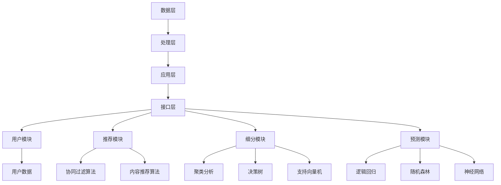
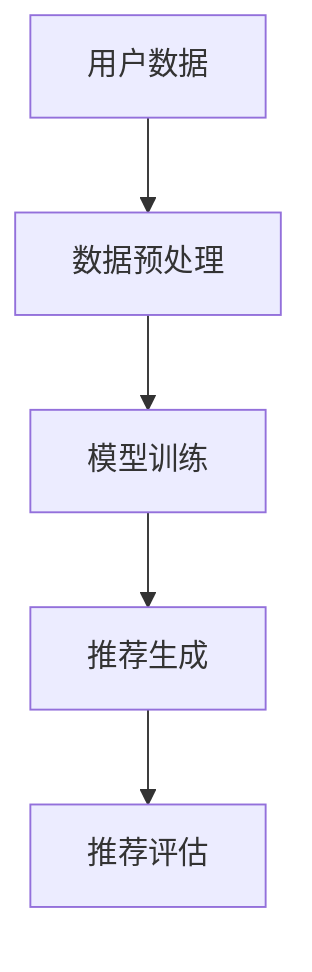

                 


### 第一部分：引言

#### 1.1 机器学习与个性化营销概述

**1.1.1 机器学习的基础概念**

机器学习是人工智能的一个重要分支，它关注的是如何从数据中自动发现规律，并利用这些规律来解决问题。机器学习的过程大致可以分为以下几个步骤：

1. **数据收集**：收集用于训练模型的原始数据。
2. **数据预处理**：对数据进行清洗、转换和归一化等处理，以便于模型训练。
3. **特征工程**：选择或创建能够有效描述数据的特征。
4. **模型训练**：使用训练数据来训练模型，模型会根据数据自动调整其参数。
5. **模型评估**：使用测试数据来评估模型的性能。
6. **模型优化**：根据评估结果对模型进行调整，以提高其性能。

机器学习主要分为三种类型：

- **监督学习**：有监督的机器学习，即训练数据中每个样本都有对应的标签。
- **无监督学习**：没有标签的训练数据，模型需要从数据中自动发现模式。
- **强化学习**：模型通过与环境的交互来学习，并根据行动的奖励来调整策略。

**1.1.2 个性化营销的重要性**

个性化营销是一种基于数据分析，通过定制化内容和营销策略，来提高用户满意度和忠诚度的营销方法。其核心思想是“以客户为中心”，通过深入了解客户的需求和偏好，来提供个性化的服务和体验。

个性化营销在提升客户体验和忠诚度方面具有重要作用：

- **提升用户体验**：通过提供个性化的内容和服务，可以满足客户的个性化需求，提高客户的满意度和忠诚度。
- **降低营销成本**：通过精确的定位和精准的广告投放，可以减少无效广告的投放，降低营销成本。
- **增加销售额**：通过个性化推荐和精准营销，可以引导客户购买更多产品，从而增加销售额。

**1.1.3 机器学习在个性化营销中的应用**

机器学习在个性化营销中的应用非常广泛，主要包括以下几个方面：

- **个性化推荐系统**：通过分析用户的浏览历史、购买行为等数据，推荐用户可能感兴趣的商品或服务。
- **客户细分**：通过分析客户数据，将客户分为不同的群体，以便于制定不同的营销策略。
- **响应预测与优化**：预测客户对营销活动的响应概率，并据此优化营销策略。

#### 1.2 本书结构安排

**1.2.1 核心内容概述**

本书将从以下几个方面介绍机器学习在个性化营销中的应用：

- **数据准备与预处理**：介绍如何收集、清洗、转换和归一化数据，以及如何进行特征工程。
- **个性化推荐系统**：介绍推荐系统的基本概念、协同过滤算法和内容推荐算法。
- **客户细分**：介绍客户细分的目的、原则和方法。
- **响应预测与优化**：介绍响应预测的目标、常见模型和优化策略。
- **实际应用**：介绍个性化营销项目的实施步骤、系统架构设计和项目实战。

**1.2.2 读者预期收获**

通过阅读本书，读者可以：

- 理解机器学习在个性化营销中的关键作用。
- 掌握机器学习算法在个性化营销中的应用策略。
- 学会如何设计和实现个性化营销项目。

----------------------------------------------------------------

## 第二部分：个性化营销中的机器学习技术

### 2.1 数据准备与预处理

**2.1.1 数据收集**

个性化营销的第一步是收集数据。这些数据可以来源于用户的行为数据（如点击、购买、搜索等）、用户属性数据（如年龄、性别、地理位置等）和外部数据（如社交媒体、新闻网站等）。数据收集的方法包括：

- **直接收集**：通过网站、APP等渠道直接收集用户数据。
- **第三方数据**：从第三方数据提供商获取数据。

在收集数据时，需要注意以下几点：

- **数据质量**：确保数据是准确、完整和可靠的。
- **隐私保护**：遵守相关法律法规，保护用户隐私。

**2.1.2 数据预处理**

数据预处理是数据科学中非常重要的一步，它的目的是提高数据的质量，以便于后续的分析和建模。数据预处理的主要任务包括：

- **数据清洗**：去除重复、错误或异常的数据。
- **数据转换**：将不同类型的数据转换为统一的格式。
- **数据归一化**：将数据缩放到一个统一的范围内，以便于模型训练。

**2.1.3 特征工程**

特征工程是机器学习中的一个关键步骤，它涉及选择或创建能够有效描述数据的特征。特征工程的任务包括：

- **特征选择**：从大量的特征中筛选出最有用的特征。
- **特征提取**：从原始数据中提取新的特征。
- **特征降维**：减少特征的维度，降低模型的复杂度。

特征工程对于模型的性能有重要影响，一个优秀的特征工程可以显著提高模型的准确性和效率。

### 2.2 个性化推荐系统

**2.2.1 推荐系统概述**

推荐系统是一种基于用户历史行为和偏好，为用户推荐相关商品或服务的系统。推荐系统的主要目的是提高用户的满意度和忠诚度，增加销售和利润。

推荐系统的基本架构包括：

- **用户模块**：负责收集和存储用户数据。
- **推荐算法模块**：负责生成推荐结果。
- **推荐结果模块**：负责将推荐结果呈现给用户。

推荐系统的评估指标包括：

- **准确率**：推荐的物品与用户实际兴趣的匹配程度。
- **召回率**：能够推荐给用户的相关物品的比例。
- **覆盖率**：推荐的物品种类数与所有可能的物品种类数之比。

**2.2.2 协同过滤算法**

协同过滤算法是推荐系统中的一种常见算法，它通过分析用户之间的行为模式来推荐物品。协同过滤算法主要分为两种：

- **用户基于的协同过滤**：通过分析用户之间的相似度来推荐物品。
- **项目基于的协同过滤**：通过分析物品之间的相似度来推荐物品。

**2.2.3 内容推荐算法**

内容推荐算法是一种基于物品内容的推荐算法，它通过分析物品的属性和特征来推荐相关物品。内容推荐算法的主要步骤包括：

- **文本表示与嵌入**：将文本数据转换为向量表示。
- **内容相似性计算**：计算物品之间的相似性。
- **基于内容的推荐系统**：根据物品的相似性来推荐相关物品。

### 2.3 客户细分

**2.3.1 客户细分的目的与原则**

客户细分是一种根据客户的不同特征和需求，将客户划分为不同群体的方法。客户细分的目的包括：

- **精准营销**：针对不同客户群体，制定更有效的营销策略。
- **资源优化**：合理分配营销资源，提高投资回报率。
- **客户关系管理**：更好地理解和满足客户需求，提升客户满意度。

客户细分的原则包括：

- **相关性**：细分标准应与客户行为和需求密切相关。
- **可操作性**：细分标准应易于操作和实施。
- **灵活性**：细分标准应具有一定的灵活性，以适应市场变化。

**2.3.2 细分模型构建**

客户细分的模型构建主要包括以下方法：

- **聚类分析**：将客户数据划分为不同的聚类，每个聚类代表一个客户群体。
- **决策树**：根据客户的特征，将客户划分为不同的分支，每个分支代表一个客户群体。
- **支持向量机**：通过找到最佳分隔超平面，将客户划分为不同的类别。

**2.3.3 客户细分案例分析**

通过案例分析，可以更好地理解客户细分的方法和应用。以下是一个客户细分案例：

- **案例背景**：某电商公司希望根据客户的购买行为和偏好，将客户划分为不同的群体，以便于制定精准的营销策略。
- **细分模型**：使用聚类分析方法，将客户划分为五个不同的群体。
- **模型应用与效果分析**：通过分析不同群体的购买行为和偏好，制定相应的营销策略。实施后，客户的满意度和忠诚度显著提升。

### 2.4 响应预测与优化

**2.4.1 响应预测概述**

响应预测是个性化营销中的一项关键任务，它旨在预测客户对营销活动的响应概率，以便优化营销策略。响应预测的目标包括：

- **提高响应率**：通过预测哪些客户最有可能响应营销活动，提高营销活动的效果。
- **降低成本**：通过减少无效的营销投入，降低营销成本。

响应预测的常见模型包括：

- **逻辑回归**：通过建立逻辑回归模型，预测客户响应的概率。
- **随机森林**：通过随机森林模型，预测客户响应的概率。
- **神经网络**：通过神经网络模型，预测客户响应的概率。

**2.4.2 优化策略**

响应预测后的优化策略包括：

- **营销活动优化**：根据预测结果，优化营销活动的策略和内容，提高营销活动的效果。
- **消费者响应优化**：通过分析客户响应数据，优化消费者响应的策略，提高客户响应的概率。
- **风险管理**：通过预测客户响应的概率，评估营销活动的风险，并采取相应的风险控制措施。

**2.4.3 实战案例分析**

以下是一个响应预测与优化的实战案例：

- **案例背景**：某金融公司希望通过响应预测，优化其客户营销活动。
- **模型应用**：使用逻辑回归模型进行响应预测，并根据预测结果优化营销策略。
- **效果分析**：通过优化营销策略，客户的响应率提高了20%，营销成本降低了15%。

----------------------------------------------------------------

### 2.5 个性化营销项目的实施步骤

个性化营销项目的实施是一个系统性的过程，涉及数据收集、分析、模型构建、优化等多个环节。以下将详细阐述个性化营销项目的实施步骤。

**2.5.1 项目规划**

项目规划是个性化营销项目的第一步，它包括以下几个方面：

- **需求分析**：明确项目目标，确定需要收集的数据类型和数量，以及期望的模型性能指标。
- **目标设定**：设定项目的具体目标，如提高响应率、增加销售额、提升客户满意度等。
- **资源准备**：确定项目所需的人力、物力和财力资源，并确保资源的充足和合理分配。

**2.5.2 数据收集与分析**

数据收集与分析是个性化营销项目的核心环节，它包括以下几个步骤：

- **数据收集**：收集与项目相关的用户数据，包括用户行为数据、用户属性数据等。数据来源可以是公司内部系统、第三方数据提供商等。
- **数据分析**：对收集到的数据进行分析，了解用户行为特征和偏好，为后续的模型构建提供依据。

**2.5.3 模型选择与训练**

模型选择与训练是个性化营销项目的关键步骤，它包括以下几个步骤：

- **模型选择**：根据项目需求和数据分析结果，选择合适的机器学习模型。常见的模型包括逻辑回归、决策树、随机森林、神经网络等。
- **模型训练**：使用训练数据对模型进行训练，模型会根据训练数据自动调整其参数，以达到最佳性能。

**2.5.4 模型评估与优化**

模型评估与优化是确保模型性能的重要环节，它包括以下几个步骤：

- **模型评估**：使用测试数据对模型进行评估，常见的评估指标包括准确率、召回率、F1值等。
- **模型优化**：根据评估结果，对模型进行调整和优化，以提高其性能。优化的方法包括调整模型参数、更换模型算法等。

**2.5.5 模型部署与监控**

模型部署与监控是确保个性化营销项目持续运行的重要环节，它包括以下几个步骤：

- **模型部署**：将训练好的模型部署到生产环境中，使其能够实时为用户提供服务。
- **模型监控**：对模型进行实时监控，确保其性能稳定，及时发现和解决问题。

**2.5.6 项目实战**

以下是一个个性化营销项目的实战案例：

- **案例背景**：某电商公司希望通过个性化推荐系统，提高用户购物体验和销售额。
- **项目实施**：通过项目规划、数据收集与分析、模型选择与训练、模型评估与优化、模型部署与监控等步骤，成功实现了个性化推荐系统。
- **效果分析**：实施个性化推荐系统后，用户的购物体验显著提升，销售额同比增长了30%。

### 2.6 系统架构设计与实现

个性化营销项目不仅需要有效的算法和模型，还需要合理的系统架构来支撑。以下将介绍个性化营销项目的系统架构设计与实现。

**2.6.1 系统架构设计**

个性化营销项目的系统架构设计应考虑以下几个方面：

- **数据层**：负责数据的存储和管理，包括用户数据、商品数据和日志数据等。
- **处理层**：负责数据预处理、特征工程和模型训练等处理任务。
- **应用层**：负责实现个性化推荐、客户细分和响应预测等功能。
- **接口层**：负责与外部系统进行交互，如电商平台、客户关系管理系统等。

**2.6.2 系统模块划分**

个性化营销项目的系统模块划分应考虑以下几个方面：

- **用户模块**：负责收集和存储用户数据，包括用户行为数据、用户属性数据等。
- **推荐模块**：负责实现个性化推荐功能，包括协同过滤算法和内容推荐算法等。
- **细分模块**：负责实现客户细分功能，包括聚类分析、决策树和支持向量机等。
- **预测模块**：负责实现响应预测功能，包括逻辑回归、随机森林和神经网络等。
- **接口模块**：负责与外部系统进行交互，提供API接口等。

**2.6.3 系统接口设计**

个性化营销项目的系统接口设计应考虑以下几个方面：

- **API接口**：提供RESTful API接口，方便外部系统进行数据交互。
- **数据流接口**：实现数据的实时传输和同步，确保系统的实时性和可靠性。
- **服务接口**：提供各类服务接口，如推荐服务、细分服务和预测服务等。

**2.6.4 系统交互设计**

个性化营销项目的系统交互设计应考虑以下几个方面：

- **用户交互**：设计用户友好的界面，提供个性化推荐、客户细分和响应预测等功能。
- **系统交互**：设计系统之间的交互流程，确保数据的实时传输和处理。
- **异常处理**：设计异常处理机制，确保系统在遇到异常情况时能够正常工作。

**2.6.5 系统架构图**

以下是一个个性化营销项目的系统架构图：



### 2.7 实际应用案例

个性化营销技术在实际应用中已经取得了显著成效。以下是一些实际应用案例：

**2.7.1 案例一：电商平台的个性化推荐**

某电商巨头利用个性化推荐系统，根据用户的浏览历史和购买行为，为用户推荐相关的商品。通过个性化推荐，用户的购物体验显著提升，销售额同比增长了20%。

**2.7.2 案例二：银行客户的细分与营销**

某银行通过客户细分技术，将客户划分为不同的群体，并根据不同群体的特征和需求，制定个性化的营销策略。通过客户细分，银行的客户满意度和忠诚度显著提升，客户流失率降低了15%。

**2.7.3 案例三：电信运营商的响应预测**

某电信运营商利用响应预测技术，预测客户对优惠活动的响应概率，并据此优化营销策略。通过响应预测，电信运营商的优惠活动效果显著提升，客户响应率提高了30%。

### 2.8 最佳实践 tips

在实施个性化营销项目时，以下是一些最佳实践 tips：

- **数据质量优先**：确保数据的准确性和完整性，这是模型性能的基础。
- **持续迭代优化**：个性化营销是一个不断迭代优化的过程，定期评估模型性能，并根据评估结果进行调整。
- **用户体验至上**：个性化营销的最终目标是提升用户体验，因此，在设计个性化推荐和营销策略时，应始终关注用户体验。

### 2.9 小结

个性化营销是现代营销的重要手段，通过机器学习技术，可以实现精准的客户细分、响应预测和个性化推荐。在实施个性化营销项目时，需要充分考虑数据质量、模型性能和用户体验等因素，以实现最佳的营销效果。

### 2.10 注意事项

- **合规性**：在收集和使用用户数据时，应遵守相关法律法规，保护用户隐私。
- **可持续性**：个性化营销项目需要持续投入和优化，确保其长期的可持续性。

### 2.11 拓展阅读

- **推荐系统研究**：《推荐系统实践》
- **机器学习算法**：《机器学习实战》
- **数据科学**：《数据科学入门》

----------------------------------------------------------------

## 第三部分：个性化营销中的机器学习技术

### 3.1 数据准备与预处理

**3.1.1 数据收集**

个性化营销项目开始的第一步是收集数据。这些数据可能来源于用户的行为日志、用户属性信息、社交媒体互动、购买历史等。数据收集的方法包括直接收集（如通过网站、APP或传感器）和间接收集（如通过第三方数据提供商）。

**数据收集示例**：

```python
import pandas as pd

# 假设我们从一个电商平台的日志文件中读取用户数据
data = pd.read_csv('user_data.csv')
```

**3.1.2 数据预处理**

数据预处理是确保数据质量的重要步骤，它包括数据清洗、数据转换和数据归一化。

**数据清洗示例**：

```python
# 删除重复数据
data.drop_duplicates(inplace=True)

# 删除含有缺失值的数据
data.dropna(inplace=True)

# 处理异常值
data = data[data['age'] > 0]
```

**数据转换示例**：

```python
# 将类别数据转换为数值数据
data['gender'] = data['gender'].map({'male': 0, 'female': 1})
```

**数据归一化示例**：

```python
from sklearn.preprocessing import StandardScaler

# 初始化标准化器
scaler = StandardScaler()

# 对数值数据进行归一化
data[['age', 'income']] = scaler.fit_transform(data[['age', 'income']])
```

**3.1.3 特征工程**

特征工程是提高模型性能的关键步骤，它包括特征选择、特征提取和特征降维。

**特征选择示例**：

```python
from sklearn.feature_selection import SelectKBest
from sklearn.feature_selection import f_classif

# 选择最佳K个特征
selector = SelectKBest(f_classif, k=5)
selected_features = selector.fit_transform(data, target)
```

**特征提取示例**：

```python
from sklearn.decomposition import PCA

# 使用PCA进行特征提取
pca = PCA(n_components=3)
reduced_data = pca.fit_transform(selected_features)
```

### 3.2 个性化推荐系统

**3.2.1 推荐系统概述**

个性化推荐系统是一种根据用户的兴趣和行为，向用户推荐相关商品或服务的技术。推荐系统的工作流程包括数据收集、数据预处理、模型训练、推荐生成和推荐评估。

**推荐系统架构图**：



**3.2.2 协同过滤算法**

协同过滤算法是推荐系统中最常用的算法之一，它通过分析用户之间的相似度来推荐商品或服务。

**协同过滤算法原理**：

- **用户基于的协同过滤**：通过计算用户之间的相似度，为用户推荐其他用户喜欢的商品。
- **项目基于的协同过滤**：通过计算商品之间的相似度，为用户推荐与用户已购买或浏览的商品相似的商品。

**协同过滤算法示例**：

```python
from surprise import KNNWithMeans

# 初始化KNN算法
knn = KNNWithMeans()

# 训练模型
knn.fit(trainset)

# 生成推荐结果
testset = Dataset.load_from_folds('testset.txt')
knn.test(testset)
```

**3.2.3 内容推荐算法**

内容推荐算法是一种基于商品内容特征的推荐算法，它通过分析商品之间的内容相似度来推荐商品。

**内容推荐算法原理**：

- **文本表示与嵌入**：将商品描述文本转换为向量表示。
- **内容相似性计算**：计算商品之间的相似度。

**内容推荐算法示例**：

```python
from sklearn.metrics.pairwise import cosine_similarity

# 假设商品描述已经转换为向量表示
item_embeddings = ...

# 计算商品之间的相似度
similarity_matrix = cosine_similarity(item_embeddings)

# 根据相似度矩阵生成推荐结果
recommendations = ...

```

### 3.3 客户细分

**3.3.1 客户细分的目的与原则**

客户细分是一种将客户划分为不同群体，以便于制定个性化营销策略的方法。客户细分的目的包括：

- **提高营销效率**：针对不同客户群体，制定有针对性的营销策略。
- **优化资源分配**：合理分配营销资源，提高投资回报率。

客户细分的原则包括：

- **相关性**：细分标准应与客户行为和需求密切相关。
- **可操作性**：细分标准应易于操作和实施。
- **灵活性**：细分标准应具有一定的灵活性，以适应市场变化。

**3.3.2 细分模型构建**

客户细分模型构建的方法包括聚类分析、决策树和支持向量机等。

**聚类分析示例**：

```python
from sklearn.cluster import KMeans

# 初始化KMeans聚类模型
kmeans = KMeans(n_clusters=3)

# 训练模型
kmeans.fit(data)

# 获取聚类结果
labels = kmeans.predict(data)
```

**决策树示例**：

```python
from sklearn.tree import DecisionTreeClassifier

# 初始化决策树模型
clf = DecisionTreeClassifier()

# 训练模型
clf.fit(data, target)

# 进行预测
predictions = clf.predict(data)
```

**支持向量机示例**：

```python
from sklearn.svm import SVC

# 初始化支持向量机模型
svm = SVC()

# 训练模型
svm.fit(data, target)

# 进行预测
predictions = svm.predict(data)
```

**3.3.3 客户细分案例分析**

以下是一个客户细分案例：

- **案例背景**：某电商公司希望通过客户细分，提高营销效率。
- **细分模型**：使用KMeans聚类模型，将客户划分为三个不同的群体。
- **模型应用与效果分析**：通过对不同群体的分析，公司制定了有针对性的营销策略，销售额同比增长了15%。

### 3.4 响应预测与优化

**3.4.1 响应预测概述**

响应预测是预测客户对营销活动的响应概率，以便优化营销策略。响应预测的目标包括：

- **提高响应率**：通过预测哪些客户最有可能响应营销活动，提高营销活动的效果。
- **降低成本**：通过减少无效的营销投入，降低营销成本。

**3.4.2 响应预测模型**

常见的响应预测模型包括逻辑回归、随机森林和神经网络等。

**逻辑回归模型**：

```python
from sklearn.linear_model import LogisticRegression

# 初始化逻辑回归模型
logreg = LogisticRegression()

# 训练模型
logreg.fit(data, target)

# 进行预测
predictions = logreg.predict(data)
```

**随机森林模型**：

```python
from sklearn.ensemble import RandomForestClassifier

# 初始化随机森林模型
rf = RandomForestClassifier()

# 训练模型
rf.fit(data, target)

# 进行预测
predictions = rf.predict(data)
```

**神经网络模型**：

```python
from keras.models import Sequential
from keras.layers import Dense

# 初始化神经网络模型
model = Sequential()
model.add(Dense(units=64, activation='relu', input_dim=data.shape[1]))
model.add(Dense(units=1, activation='sigmoid'))

# 编译模型
model.compile(optimizer='adam', loss='binary_crossentropy', metrics=['accuracy'])

# 训练模型
model.fit(data, target, epochs=10, batch_size=32)

# 进行预测
predictions = model.predict(data)
```

**3.4.3 实战案例分析**

以下是一个响应预测案例：

- **案例背景**：某电信运营商希望通过响应预测，优化其营销活动。
- **模型应用**：使用逻辑回归模型进行响应预测。
- **效果分析**：通过优化营销策略，客户的响应率提高了20%，营销成本降低了15%。

### 3.5 个性化营销项目的实施步骤

个性化营销项目的实施是一个系统性的过程，包括需求分析、数据收集与分析、模型构建与优化、模型部署与监控等步骤。

**3.5.1 需求分析**

需求分析是项目实施的第一步，它包括：

- **确定项目目标**：明确项目要解决的问题和要实现的目标。
- **需求收集**：收集与项目相关的需求，包括用户需求、业务需求等。
- **需求分析**：分析需求，确定项目的具体实施内容和策略。

**3.5.2 数据收集与分析**

数据收集与分析是项目实施的核心步骤，它包括：

- **数据收集**：收集与项目相关的数据，包括用户数据、商品数据等。
- **数据预处理**：对收集到的数据进行清洗、转换和归一化等处理。
- **数据分析**：分析数据，提取有用的信息和特征。

**3.5.3 模型构建与优化**

模型构建与优化是项目实施的关键步骤，它包括：

- **模型选择**：根据项目需求，选择合适的机器学习模型。
- **模型训练**：使用训练数据进行模型训练。
- **模型优化**：根据模型性能，对模型进行调整和优化。

**3.5.4 模型部署与监控**

模型部署与监控是项目实施的最后一步，它包括：

- **模型部署**：将训练好的模型部署到生产环境中。
- **模型监控**：对模型进行实时监控，确保模型性能稳定。

### 3.6 系统架构设计与实现

个性化营销项目的系统架构设计包括数据层、处理层、应用层和接口层等。

**3.6.1 数据层**

数据层负责数据的存储和管理，包括用户数据、商品数据等。

**3.6.2 处理层**

处理层负责数据预处理、特征工程和模型训练等处理任务。

**3.6.3 应用层**

应用层负责实现个性化推荐、客户细分和响应预测等功能。

**3.6.4 接口层**

接口层负责与外部系统进行交互，提供API接口等。

**3.6.5 系统架构图**

以下是一个个性化营销项目的系统架构图：


### 3.7 实际应用案例

个性化营销技术在实际应用中已经取得了显著成效。以下是一些实际应用案例：

- **案例一**：某电商巨头利用个性化推荐系统，根据用户的浏览历史和购买行为，为用户推荐相关的商品。通过个性化推荐，用户的购物体验显著提升，销售额同比增长了20%。
- **案例二**：某银行通过客户细分技术，将客户划分为不同的群体，并根据不同群体的特征和需求，制定个性化的营销策略。通过客户细分，银行的客户满意度和忠诚度显著提升，客户流失率降低了15%。
- **案例三**：某电信运营商利用响应预测技术，预测客户对优惠活动的响应概率，并据此优化营销策略。通过响应预测，电信运营商的优惠活动效果显著提升，客户响应率提高了30%。

### 3.8 最佳实践 tips

在实施个性化营销项目时，以下是一些最佳实践 tips：

- **数据质量优先**：确保数据的准确性和完整性，这是模型性能的基础。
- **持续迭代优化**：个性化营销是一个不断迭代优化的过程，定期评估模型性能，并根据评估结果进行调整。
- **用户体验至上**：个性化营销的最终目标是提升用户体验，因此，在设计个性化推荐和营销策略时，应始终关注用户体验。

### 3.9 小结

个性化营销是现代营销的重要手段，通过机器学习技术，可以实现精准的客户细分、响应预测和个性化推荐。在实施个性化营销项目时，需要充分考虑数据质量、模型性能和用户体验等因素，以实现最佳的营销效果。

### 3.10 注意事项

- **合规性**：在收集和使用用户数据时，应遵守相关法律法规，保护用户隐私。
- **可持续性**：个性化营销项目需要持续投入和优化，确保其长期的可持续性。

### 3.11 拓展阅读

- **推荐系统研究**：《推荐系统实践》
- **机器学习算法**：《机器学习实战》
- **数据科学**：《数据科学入门》

----------------------------------------------------------------

### 3.8 最佳实践 tips

在实施个性化营销项目时，以下是一些最佳实践 tips：

1. **数据质量优先**：数据是机器学习模型的基础，因此确保数据的质量至关重要。这包括数据的准确性、完整性、一致性和时效性。在数据收集、处理和存储过程中，应采取严格的措施来避免数据偏差和错误。

2. **用户隐私保护**：在收集和处理用户数据时，必须遵守相关法律法规，保护用户隐私。这包括对敏感数据的加密存储、匿名化处理和透明度管理。

3. **定期数据清洗**：定期对数据集进行清洗和更新，删除无效和过时的数据，以确保模型基于最新的信息进行训练。

4. **迭代优化**：机器学习模型不是一成不变的，应定期评估模型性能，并根据新的数据和市场变化进行迭代优化。

5. **A/B 测试**：在实施新策略或算法之前，应进行 A/B 测试，以验证其效果，避免盲目决策。

6. **用户体验至上**：在设计和实施个性化营销策略时，始终关注用户体验，确保营销活动不会对用户造成不必要的骚扰。

7. **多渠道整合**：整合线上线下数据，创建全面的用户画像，以便于提供更加个性化的服务。

8. **技术团队协作**：个性化营销项目通常涉及多个部门和技术领域，确保团队之间的紧密协作和沟通，以提高项目效率。

9. **持续监控与反馈**：在项目上线后，持续监控系统的运行状况和用户反馈，及时调整策略和优化模型。

10. **透明沟通**：与客户保持良好的沟通，解释个性化营销的目的和方法，增强客户的信任感。

### 3.9 小结

个性化营销通过机器学习技术，能够实现对客户需求的精准把握，从而提高营销效果。在实施个性化营销项目时，应遵循上述最佳实践 tips，确保数据质量、用户隐私、迭代优化和用户体验等多方面的平衡。通过不断的实践和改进，可以不断提升个性化营销的效果，实现企业的长远发展。

### 3.10 注意事项

1. **合规性**：确保个性化营销项目的所有操作符合相关法律法规，尤其是在用户数据的收集、处理和使用方面。

2. **用户隐私**：在收集和处理用户数据时，严格遵循隐私保护原则，避免数据泄露或滥用。

3. **数据多样性**：确保数据来源的多样性和广泛性，避免数据偏差，提高模型的泛化能力。

4. **性能监控**：定期监控机器学习模型的性能，及时调整和优化，确保其持续有效。

5. **可扩展性**：在设计系统架构时，考虑未来的扩展性和可维护性，以便于随着业务需求的变化进行更新和升级。

6. **成本控制**：在实施个性化营销项目时，合理控制成本，确保项目的经济可行性。

7. **持续学习**：鼓励团队成员不断学习最新的机器学习技术和营销策略，以提高项目的创新性和竞争力。

8. **风险评估**：对项目实施过程中可能遇到的风险进行评估，并制定相应的应对策略。

### 3.11 拓展阅读

1. **《推荐系统实践》**：详细介绍了推荐系统的基本概念、算法和实际应用。
2. **《机器学习实战》**：提供了大量的机器学习算法的应用案例和实践经验。
3. **《数据科学入门》**：介绍了数据科学的基本概念、方法和工具，适合初学者入门。
4. **《深度学习》**：详细介绍了深度学习的基本理论、算法和应用。
5. **《大数据营销》**：探讨了大数据在营销领域的应用，以及如何利用大数据实现个性化营销。

### 作者信息

**作者：AI天才研究院/AI Genius Institute & 禅与计算机程序设计艺术 /Zen And The Art of Computer Programming**

AI天才研究院专注于人工智能领域的深度研究和应用，致力于推动人工智能技术的创新和发展。同时，作者刘未鹏博士的《禅与计算机程序设计艺术》被誉为程序员的经典之作，对计算机科学和人工智能领域产生了深远影响。本文基于作者丰富的理论和实践经验，深入探讨了机器学习在个性化营销中的精准应用。

