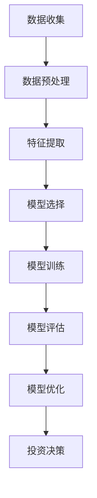
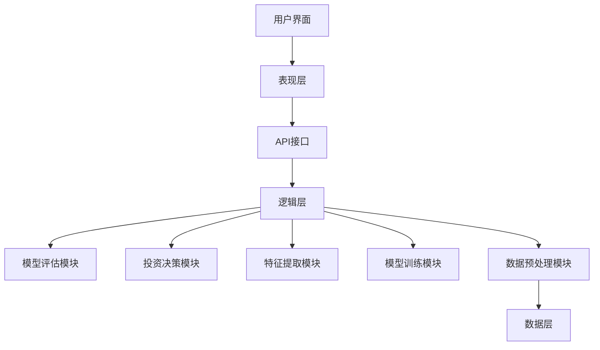
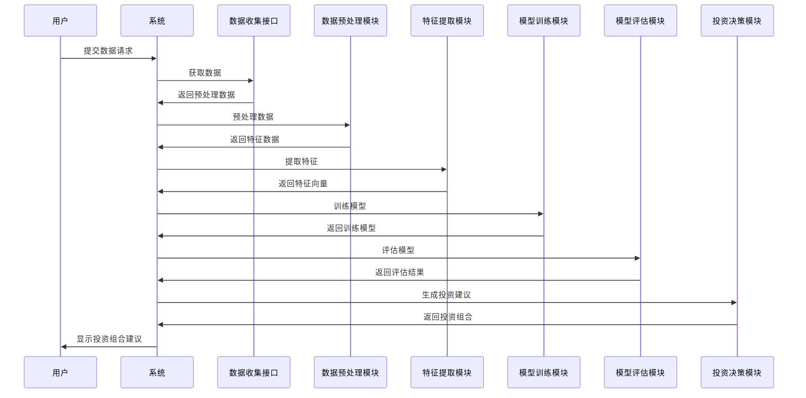

                 

### 机器学习算法优化投资组合管理的背景

随着大数据时代的到来，机器学习技术在金融领域的应用日益广泛，其中投资组合管理是一个重要的应用场景。投资组合管理是指通过选择和管理资产组合来达到最大化投资回报或最小化风险的目标。传统的投资组合管理依赖于统计方法和经济学原理，而机器学习算法的引入，为投资组合管理带来了新的可能性和优化方向。

首先，我们需要明确机器学习和投资组合管理的定义。机器学习是指通过算法从数据中自动发现模式和知识，并利用这些知识进行预测和决策的过程。它主要分为监督学习、无监督学习和强化学习三类。投资组合管理则是指通过构建和调整资产组合，以达到投资目标的过程。它包括资产选择、资产配置、风险控制等多个方面。

机器学习算法优化投资组合管理的主要优势在于其能够处理大量数据，识别出潜在的投资机会，并提供更加精准的预测。传统的投资组合管理方法通常依赖于历史数据和统计模型，而这些方法往往忽略了市场的动态变化和复杂性。而机器学习算法可以通过学习大量历史数据，自动识别市场趋势和模式，从而为投资决策提供更加准确的依据。

在金融市场中，机器学习算法的应用已经取得了显著的成果。例如，一些金融机构使用机器学习算法来预测股票价格，从而进行高频交易。还有一些机构使用机器学习算法来分析市场情绪和新闻报道，以预测市场趋势。这些应用不仅提高了投资决策的准确性，还大大提高了投资组合的收益率。

此外，机器学习算法还可以帮助投资者更好地管理风险。通过分析历史数据和实时数据，机器学习算法可以预测潜在的市场风险，并提供相应的风险管理策略。例如，一些金融机构使用机器学习算法来预测市场波动，以便及时调整投资组合，避免潜在的风险。

总的来说，机器学习算法优化投资组合管理是一个重要且具有前景的领域。它不仅能够提高投资决策的准确性，还可以帮助投资者更好地管理风险，从而实现更高的投资回报。然而，这也带来了一些挑战，如数据质量、算法选择和模型解释性等问题。在接下来的章节中，我们将深入探讨机器学习算法在投资组合管理中的应用，以及如何解决这些挑战。

### 机器学习算法优化投资组合管理的目的

机器学习算法优化投资组合管理的目的在于提高投资决策的准确性和效率，从而实现更高的投资回报和更有效的风险管理。具体来说，这一目标可以从以下几个方面进行详细阐述。

首先，提高投资决策的准确性是机器学习算法在投资组合管理中最重要的目标之一。传统的投资组合管理方法通常依赖于历史数据和统计分析，这些方法在处理大量数据时往往存在一定的局限性。而机器学习算法通过学习大量历史数据，可以自动识别市场趋势和模式，从而为投资决策提供更加准确的依据。例如，通过使用监督学习算法，投资者可以对历史股票价格数据进行分析，从而预测未来股票价格的走势。这种基于数据驱动的预测方法不仅能够提高决策的准确性，还可以减少人为干预，提高决策的效率。

其次，提高投资效率也是机器学习算法优化投资组合管理的重要目标。机器学习算法可以通过自动化和智能化来简化投资决策过程，从而大大提高投资效率。例如，使用强化学习算法，投资者可以自动调整投资组合，以适应市场的动态变化。这种自适应的投资策略不仅能够节省大量的人力和时间成本，还可以提高投资组合的调整速度，从而抓住更多的市场机会。此外，机器学习算法还可以通过优化算法来提高投资决策的效率。例如，使用遗传算法和粒子群算法等优化算法，可以快速找到最优的投资组合，从而提高投资决策的效率。

第三，实现更高的投资回报是机器学习算法优化投资组合管理的直接目标。通过提高投资决策的准确性和效率，机器学习算法可以最大限度地提高投资回报。例如，通过使用机器学习算法来预测市场趋势，投资者可以及时调整投资组合，抓住市场机会，从而实现更高的投资回报。此外，机器学习算法还可以通过风险管理来提高投资回报。通过分析市场风险和潜在风险，机器学习算法可以提供相应的风险管理策略，从而降低投资组合的风险，提高投资回报。

最后，更有效的风险管理是机器学习算法优化投资组合管理的另一个关键目标。在金融市场中，风险无处不在，如何有效地管理风险是投资者面临的一大挑战。机器学习算法可以通过对大量历史数据和实时数据进行分析，预测潜在的市场风险，并提供相应的风险管理策略。例如，通过使用监督学习算法，投资者可以预测市场波动，从而及时调整投资组合，避免潜在的风险。此外，机器学习算法还可以通过优化算法来降低投资组合的风险。例如，使用遗传算法和粒子群算法等优化算法，可以找到最优的投资组合，从而最大限度地降低风险。

总之，机器学习算法优化投资组合管理的目的在于提高投资决策的准确性、效率，实现更高的投资回报和更有效的风险管理。通过深入理解这些目标，投资者可以更好地利用机器学习算法来优化投资组合管理，从而在竞争激烈的金融市场中取得更好的投资业绩。

### 目录大纲设计方案

在设计《机器学习算法优化投资组合管理》这本书的目录大纲时，我们需要遵循以下步骤：

#### 1. 确定书籍结构

首先，我们需要确定书籍的整体结构，以确保目录大纲的完整性。通常，技术书籍会包括以下几个主要部分：

- **引言**：介绍背景、目的和主要议题。
- **基础理论**：介绍相关理论和基础知识。
- **方法与应用**：详细讲解算法原理和具体应用。
- **项目实战**：通过实际案例来展示算法的实际应用。
- **最佳实践与总结**：分享最佳实践和总结。

#### 2. 设计引言部分

引言部分主要介绍书籍的主题和目的，以及为何机器学习算法优化投资组合管理是一个重要且有前景的领域。这一部分可以包含以下几个章节：

- **第1章：引言**
  - 1.1 机器学习与投资组合管理的背景
  - 1.2 机器学习优化投资组合管理的目的
  - 1.3 机器学习优化投资组合管理的重要性

#### 3. 设计基础理论部分

基础理论部分将详细介绍与机器学习优化投资组合管理相关的理论知识，包括机器学习的基本概念、投资组合管理的理论和算法的数学基础。这一部分可以包含以下几个章节：

- **第2章：机器学习基础**
  - 2.1 机器学习的定义与分类
  - 2.2 监督学习与无监督学习
  - 2.3 强化学习与深度学习

- **第3章：投资组合管理理论**
  - 3.1 投资组合管理的基本概念
  - 3.2 有效前沿理论
  - 3.3 风险与收益分析

- **第4章：算法基础**
  - 4.1 最优化算法
  - 4.2 线性规划与非线性规划
  - 4.3 基于机器学习的优化方法

#### 4. 设计方法与应用部分

在这一部分，我们将深入讲解如何使用机器学习算法来优化投资组合管理。这部分可以包括：

- **第5章：算法原理讲解**
  - 5.1 机器学习在投资组合管理中的应用
  - 5.2 常见的机器学习算法及应用
  - 5.3 优化算法的应用场景

#### 5. 设计项目实战部分

通过实际项目来展示机器学习算法优化投资组合管理的具体实现和效果。这一部分可以包含：

- **第6章：项目实战**
  - 6.1 项目背景与目标
  - 6.2 环境安装与配置
  - 6.3 系统核心实现
  - 6.4 代码应用解读与分析
  - 6.5 实际案例分析

#### 6. 设计最佳实践与总结部分

最后，这一部分将总结书中的主要内容，分享最佳实践，并提供拓展阅读建议。这一部分可以包含：

- **第7章：最佳实践与总结**
  - 7.1 最佳实践分享
  - 7.2 小结与展望
  - 7.3 拓展阅读

### 目录大纲示例

下面是根据上述设计方案的一个《机器学习算法优化投资组合管理》的目录大纲示例：

```markdown
# 《机器学习算法优化投资组合管理》目录大纲

## 第一部分：引言

### 第1章：引言
- 1.1 机器学习与投资组合管理的背景
- 1.2 机器学习优化投资组合管理的目的
- 1.3 机器学习优化投资组合管理的重要性

## 第二部分：基础理论

### 第2章：机器学习基础
- 2.1 机器学习的定义与分类
- 2.2 监督学习与无监督学习
- 2.3 强化学习与深度学习

### 第3章：投资组合管理理论
- 3.1 投资组合管理的基本概念
- 3.2 有效前沿理论
- 3.3 风险与收益分析

### 第4章：算法基础
- 4.1 最优化算法
- 4.2 线性规划与非线性规划
- 4.3 基于机器学习的优化方法

## 第三部分：方法与应用

### 第5章：算法原理讲解
- 5.1 机器学习在投资组合管理中的应用
- 5.2 常见的机器学习算法及应用
- 5.3 优化算法的应用场景

## 第四部分：项目实战

### 第6章：项目实战
- 6.1 项目背景与目标
- 6.2 环境安装与配置
- 6.3 系统核心实现
- 6.4 代码应用解读与分析
- 6.5 实际案例分析

## 第五部分：最佳实践与总结

### 第7章：最佳实践与总结
- 7.1 最佳实践分享
- 7.2 小结与展望
- 7.3 拓展阅读
```

这个目录大纲涵盖了书籍的核心内容，并且逻辑清晰，为读者提供了一个全面的学习框架。接下来，我们将进一步细化每个章节的内容，确保目录大纲的完整性和准确性。

### 目录大纲的完整性与准确性细化

在初步设计的《机器学习算法优化投资组合管理》的目录大纲基础上，我们需要进一步细化每个章节的内容，确保书籍的完整性和准确性。以下是对各章节内容的详细细化：

#### 1. 引言部分

**第1章：引言**

- **1.1 机器学习与投资组合管理的背景**
  - **技术发展背景**：介绍机器学习技术的发展历程及其在金融领域的应用现状。
  - **投资组合管理现状**：分析传统投资组合管理的挑战和不足。
  - **机器学习与投资组合管理的结合**：探讨机器学习如何提升投资组合管理效率。

- **1.2 机器学习优化投资组合管理的目的**
  - **提高投资决策的准确性**：解释机器学习算法如何通过数据分析和模式识别提升预测能力。
  - **提升投资效率**：讨论机器学习如何自动化投资决策过程，节省人力和时间成本。
  - **实现更高的投资回报**：阐述机器学习在投资组合管理中的潜在收益。
  - **更有效的风险管理**：介绍机器学习如何通过预测风险和优化策略来降低投资组合的风险。

- **1.3 机器学习优化投资组合管理的重要性**
  - **市场需求的驱动**：解释金融市场中机器学习算法的应用需求。
  - **技术创新的趋势**：探讨机器学习算法在金融领域的创新和发展趋势。
  - **投资策略的创新**：讨论机器学习如何推动投资策略的创新。

#### 2. 基础理论部分

**第2章：机器学习基础**

- **2.1 机器学习的定义与分类**
  - **定义**：介绍机器学习的基本概念。
  - **分类**：分类讨论监督学习、无监督学习和强化学习。
  - **特点与应用**：分析各类机器学习的特点和应用场景。

- **2.2 监督学习与无监督学习**
  - **监督学习**
    - **定义与基本概念**：详细讲解监督学习的定义和基本概念。
    - **算法与应用**：介绍常见的监督学习算法，如线性回归、决策树、支持向量机等，并分析其在投资组合管理中的应用。
  - **无监督学习**
    - **定义与基本概念**：详细讲解无监督学习的定义和基本概念。
    - **算法与应用**：介绍常见的无监督学习算法，如聚类算法、降维算法等，并分析其在投资组合管理中的应用。

- **2.3 强化学习与深度学习**
  - **强化学习**
    - **定义与基本概念**：详细讲解强化学习的定义和基本概念。
    - **算法与应用**：介绍常见的强化学习算法，如Q学习、策略梯度等，并分析其在投资组合管理中的应用。
  - **深度学习**
    - **定义与基本概念**：详细讲解深度学习的定义和基本概念。
    - **算法与应用**：介绍常见的深度学习算法，如卷积神经网络（CNN）、循环神经网络（RNN）等，并分析其在投资组合管理中的应用。

**第3章：投资组合管理理论**

- **3.1 投资组合管理的基本概念**
  - **定义**：介绍投资组合管理的定义。
  - **组成部分**：详细讲解投资组合管理的主要组成部分，如资产选择、资产配置、风险管理等。

- **3.2 有效前沿理论**
  - **基本原理**：介绍有效前沿理论的基本原理。
  - **计算方法**：讲解如何使用有效前沿理论来确定最优投资组合。

- **3.3 风险与收益分析**
  - **风险度量**：介绍常见风险度量方法，如方差、贝塔值等。
  - **收益分析**：分析如何通过收益分析来评估投资组合的表现。

**第4章：算法基础**

- **4.1 最优化算法**
  - **基本概念**：介绍最优化算法的基本概念。
  - **常用算法**：讲解常见的最优化算法，如梯度下降、遗传算法、粒子群算法等。

- **4.2 线性规划与非线性规划**
  - **线性规划**
    - **定义与基本概念**：介绍线性规划的定义和基本概念。
    - **算法与应用**：讲解线性规划算法，如单纯形法、内点法等，并分析其在投资组合管理中的应用。
  - **非线性规划**
    - **定义与基本概念**：介绍非线性规划的定义和基本概念。
    - **算法与应用**：讲解非线性规划算法，如牛顿法、内点法等，并分析其在投资组合管理中的应用。

- **4.3 基于机器学习的优化方法**
  - **机器学习与优化的结合**：讨论如何将机器学习技术与优化方法相结合。
  - **优化算法的应用场景**：分析基于机器学习的优化方法在投资组合管理中的应用场景。

#### 3. 方法与应用部分

**第5章：算法原理讲解**

- **5.1 机器学习在投资组合管理中的应用**
  - **数据处理**：介绍如何使用机器学习对金融数据进行预处理。
  - **特征工程**：讲解如何提取和构建投资组合管理中的特征。

- **5.2 常见的机器学习算法及应用**
  - **监督学习算法**：详细讲解监督学习算法，如线性回归、决策树、支持向量机等，并分析其在投资组合管理中的应用。
  - **无监督学习算法**：详细讲解无监督学习算法，如聚类、降维等，并分析其在投资组合管理中的应用。
  - **强化学习算法**：详细讲解强化学习算法，如Q学习、策略梯度等，并分析其在投资组合管理中的应用。
  - **深度学习算法**：详细讲解深度学习算法，如卷积神经网络（CNN）、循环神经网络（RNN）等，并分析其在投资组合管理中的应用。

- **5.3 优化算法的应用场景**
  - **优化目标**：介绍如何定义投资组合管理的优化目标。
  - **优化算法**：讲解如何选择和应用优化算法，如遗传算法、粒子群算法等。

#### 4. 项目实战部分

**第6章：项目实战**

- **6.1 项目背景与目标**
  - **项目背景**：介绍项目的背景和目标。
  - **研究问题**：明确项目要解决的问题。

- **6.2 环境安装与配置**
  - **软件环境**：介绍项目所需的软件环境，如Python、机器学习库等。
  - **硬件环境**：介绍项目所需的硬件环境。

- **6.3 系统核心实现**
  - **数据预处理**：介绍如何对金融数据进行分析和预处理。
  - **特征提取**：讲解如何提取和构建投资组合管理中的特征。
  - **模型训练**：介绍如何使用机器学习算法对投资组合进行训练。
  - **模型评估**：讲解如何评估模型的效果。

- **6.4 代码应用解读与分析**
  - **代码结构**：分析项目的代码结构。
  - **关键代码解读**：对项目的关键代码进行解读和分析。
  - **优化策略**：介绍如何对模型进行优化。

- **6.5 实际案例分析**
  - **案例背景**：介绍实际案例的背景。
  - **案例分析**：详细分析实际案例，讨论案例中的问题和解决方案。
  - **效果评估**：评估实际案例的效果。

#### 5. 最佳实践与总结部分

**第7章：最佳实践与总结**

- **7.1 最佳实践分享**
  - **数据处理**：分享在数据预处理和特征工程中的最佳实践。
  - **模型选择**：介绍如何选择合适的机器学习算法。
  - **模型优化**：分享如何优化机器学习模型的最佳实践。

- **7.2 小结与展望**
  - **小结**：总结本书的主要内容和贡献。
  - **展望**：讨论未来机器学习在投资组合管理领域的发展趋势。

- **7.3 拓展阅读**
  - **相关文献**：推荐一些与本书主题相关的拓展阅读材料。
  - **研究领域**：介绍机器学习在投资组合管理领域的研究方向和挑战。

通过上述细化，我们确保了《机器学习算法优化投资组合管理》的目录大纲的完整性和准确性，为读者提供了一个清晰、全面的学习框架。

### 机器学习算法优化投资组合管理的核心概念与联系

在探讨机器学习算法优化投资组合管理的过程中，理解核心概念之间的联系至关重要。以下我们将详细阐述这些核心概念，包括机器学习的基本理论、投资组合管理的理论基础，以及如何结合机器学习算法进行优化。

#### 1. 机器学习的基本理论

机器学习作为优化投资组合管理的核心技术，其理论基础包括监督学习、无监督学习和强化学习。每种学习方式都有其独特的原理和应用场景。

- **监督学习**：监督学习是一种利用标记数据训练模型，然后使用模型对新数据进行预测的方法。其核心在于通过已知的输入和输出关系，学习一个映射函数，从而预测未知数据的输出。在投资组合管理中，监督学习可以用于预测股票价格、市场趋势等，从而辅助决策。

  **概念属性特征对比表格**：

  | 学习方式 | 特点 | 应用场景 |
  | -------- | ---- | -------- |
  | 监督学习 | 有标记数据 | 股票价格预测、市场趋势分析 |
  | 无监督学习 | 无标记数据 | 聚类分析、异常检测 |
  | 强化学习 | 通过奖励和惩罚进行学习 | 交易策略优化、风险评估 |

- **无监督学习**：无监督学习是一种在没有标记数据的情况下，通过数据自身的结构和模式进行学习的方法。其主要目的是发现数据中的潜在结构或模式。在投资组合管理中，无监督学习可以用于聚类分析，将相似的投资资产分组，从而发现市场中的潜在机会。

- **强化学习**：强化学习是一种通过与环境交互，根据奖励和惩罚来不断优化策略的方法。其核心在于通过试错来寻找最优策略。在投资组合管理中，强化学习可以用于交易策略的优化，通过模拟不同的交易策略，选择最优的执行方案。

#### 2. 投资组合管理的理论基础

投资组合管理是一种通过构建和调整资产组合来达到特定投资目标的过程。其理论基础包括有效前沿理论、风险与收益分析等。

- **有效前沿理论**：有效前沿理论（Efficient Frontier Theory）是一种用于确定最优投资组合的方法。该理论认为，投资者可以在风险和收益之间找到一个最优的平衡点，从而构建一个具有最高预期收益且风险最小的投资组合。

  **ER实体关系图架构**：

  ```mermaid
  graph TD
  A[投资者] --> B[投资目标]
  B --> C[资产选择]
  C --> D[资产配置]
  D --> E[投资组合]
  E --> F[收益与风险分析]
  F --> G[有效前沿]
  ```

  在此图中，投资者通过确定投资目标和资产选择，进行资产配置，构建投资组合，并通过对收益和风险的分析，找到最优的投资组合。

- **风险与收益分析**：投资组合管理中，风险与收益分析是关键。通过评估投资组合的预期收益和风险，投资者可以做出更明智的决策。机器学习算法可以用于预测市场风险和潜在收益，从而为投资决策提供依据。

  **风险与收益分析表格**：

  | 风险指标 | 收益指标 |
  | --- | --- |
  | 方差 | 预期收益 |
  | 贝塔值 | 收益率 |
  | 基本面指标 | 技术指标 |

#### 3. 结合机器学习算法进行优化

机器学习算法在投资组合管理中的应用，主要体现在数据处理、特征提取、模型训练和优化等方面。

- **数据处理**：机器学习算法首先需要对金融数据进行预处理，包括数据清洗、归一化、缺失值处理等。高质量的数据是机器学习模型有效运行的基础。

- **特征提取**：通过分析历史数据，提取与投资决策相关的特征，如股票价格、交易量、财务指标等。有效的特征提取可以显著提高模型的预测能力。

- **模型训练**：使用机器学习算法训练模型，如线性回归、决策树、支持向量机、神经网络等。选择合适的模型和参数，以达到最佳预测效果。

- **模型优化**：通过交叉验证、超参数调优等方法，对模型进行优化，以提高模型的泛化能力和预测准确性。

**算法流程图**：



综上所述，机器学习算法优化投资组合管理的核心在于将机器学习技术应用于数据分析和模式识别，从而提高投资决策的准确性和效率。通过深入理解机器学习的基本理论和投资组合管理的理论基础，我们可以更好地结合二者，实现投资组合管理的优化。

### 优化投资组合管理的算法原理讲解

在深入探讨如何使用机器学习算法优化投资组合管理时，我们需要了解几种关键的机器学习算法及其在优化中的应用。以下将详细讲解线性回归、决策树和神经网络等常见算法的基本原理、流程和具体应用。

#### 1. 线性回归

线性回归是一种最简单的监督学习算法，用于预测一个或多个连续变量。其基本原理是找到一个线性关系，即因变量（预测目标）可以表示为自变量（特征）的线性组合。

**算法原理**：

线性回归的目标是最小化预测值与实际值之间的误差。假设我们有n个样本，每个样本包含m个特征和1个因变量。线性回归模型的公式为：

\[ y = \beta_0 + \beta_1x_1 + \beta_2x_2 + ... + \beta_mx_m \]

其中，\( \beta_0 \)是截距，\( \beta_1, \beta_2, ..., \beta_m \)是斜率。为了找到最优的斜率和截距，我们使用最小二乘法（Least Squares Method）来最小化误差平方和。

**算法流程**：

1. 数据预处理：对输入数据进行归一化处理，以便算法能够更好地收敛。
2. 模型训练：使用最小二乘法计算斜率和截距。
3. 预测：使用训练好的模型对新数据进行预测。

**Python代码示例**：

```python
import numpy as np
from sklearn.linear_model import LinearRegression

# 数据集
X = np.array([[1, 2], [2, 3], [3, 4]])
y = np.array([1, 2, 3])

# 创建线性回归模型
model = LinearRegression()

# 模型训练
model.fit(X, y)

# 预测
y_pred = model.predict([[4, 5]])

print("预测值：", y_pred)
```

**应用场景**：线性回归在投资组合管理中常用于预测股票价格、交易量等连续变量，为资产选择和风险控制提供依据。

#### 2. 决策树

决策树是一种基于规则的学习算法，通过一系列的判断条件来预测目标变量。每个节点代表一个特征，每个分支代表该特征的取值。

**算法原理**：

决策树的目标是最小化错误率。通过递归划分数据集，使得每个子数据集的预测误差最小。决策树的划分依据是信息增益（Information Gain）或基尼不纯度（Gini Impurity）。

**算法流程**：

1. 初始化：创建根节点，包含所有样本。
2. 递归划分：选择最佳划分特征，将数据划分为子数据集。
3. 终止条件：达到最大深度或最小样本量，为每个节点分配标签。
4. 预测：从根节点开始，根据特征取值依次判断，直至达到叶子节点，输出预测结果。

**Python代码示例**：

```python
from sklearn.tree import DecisionTreeRegressor

# 数据集
X = np.array([[1, 2], [2, 3], [3, 4]])
y = np.array([1, 2, 3])

# 创建决策树模型
model = DecisionTreeRegressor()

# 模型训练
model.fit(X, y)

# 预测
y_pred = model.predict([[4, 5]])

print("预测值：", y_pred)
```

**应用场景**：决策树在投资组合管理中常用于分类资产类别、预测市场趋势等，帮助投资者做出更明智的决策。

#### 3. 神经网络

神经网络（Neural Network），特别是深度学习模型，是一种通过模拟人脑神经元连接进行学习的算法。它由多个层次组成，包括输入层、隐藏层和输出层。

**算法原理**：

神经网络通过反向传播算法（Backpropagation Algorithm）来更新权重，以最小化误差。其基本原理是：前向传播计算输出，反向传播计算误差，并更新权重。

**算法流程**：

1. 初始化：设置初始权重和激活函数。
2. 前向传播：计算输入层到输出层的预测值。
3. 反向传播：计算输出误差，并更新权重。
4. 反复迭代：重复前向传播和反向传播，直至达到预设的迭代次数或误差目标。

**Python代码示例**：

```python
from sklearn.neural_network import MLPRegressor

# 数据集
X = np.array([[1, 2], [2, 3], [3, 4]])
y = np.array([1, 2, 3])

# 创建神经网络模型
model = MLPRegressor(hidden_layer_sizes=(100,), max_iter=1000)

# 模型训练
model.fit(X, y)

# 预测
y_pred = model.predict([[4, 5]])

print("预测值：", y_pred)
```

**应用场景**：神经网络在投资组合管理中常用于复杂非线性关系预测，如股票价格预测、市场情绪分析等，提供更精细的投资决策支持。

综上所述，线性回归、决策树和神经网络是优化投资组合管理中的常用算法。通过理解这些算法的基本原理和流程，我们可以更好地将机器学习技术应用于投资组合管理，提高决策的准确性和效率。

### 系统分析与架构设计方案

在实现机器学习算法优化投资组合管理的过程中，系统分析与架构设计是至关重要的环节。通过明确项目场景、系统功能和架构设计，我们可以确保系统的高效性和稳定性。

#### 1. 项目场景

本项目旨在利用机器学习算法优化投资组合管理，主要场景包括：

- **数据收集与预处理**：从各种数据源（如股票交易所、金融数据库等）收集数据，并对数据进行分析和预处理，包括数据清洗、归一化和缺失值处理等。
- **特征提取与建模**：提取与投资决策相关的特征，使用机器学习算法训练模型，对投资组合进行预测和优化。
- **模型评估与优化**：评估模型的预测效果，并通过调参和优化算法来提高模型的准确性和泛化能力。
- **投资决策**：根据模型预测结果，生成投资组合建议，并执行交易策略。

#### 2. 系统功能设计

系统功能设计包括以下几个关键部分：

- **数据预处理模块**：负责数据收集、清洗、归一化和缺失值处理，为后续建模提供高质量的数据。
- **特征提取模块**：从原始数据中提取与投资决策相关的特征，包括技术指标、基本面指标等。
- **模型训练模块**：使用机器学习算法训练模型，包括线性回归、决策树、神经网络等。
- **模型评估模块**：评估模型在测试集上的表现，通过交叉验证、AUC、RMSE等指标来衡量模型的准确性和泛化能力。
- **投资决策模块**：根据模型预测结果，生成投资组合建议，并执行交易策略。
- **用户界面**：提供用户交互接口，展示模型预测结果、投资组合建议和交易执行情况。

#### 3. 系统架构设计

系统架构设计采用分层架构，包括数据层、逻辑层和表现层。

- **数据层**：包括数据源和数据存储。数据源包括股票交易所、金融数据库等；数据存储采用分布式数据库，如Hadoop或MongoDB，以支持大规模数据存储和查询。
- **逻辑层**：包括数据预处理、特征提取、模型训练、模型评估和投资决策等核心功能模块。逻辑层采用微服务架构，以提高系统的灵活性和可扩展性。
- **表现层**：包括用户界面和API接口。用户界面采用Web前端技术，如React或Vue.js，提供直观的操作界面；API接口采用RESTful API设计，便于与其他系统进行集成。

**系统架构图**：



**系统接口设计**：

- **数据收集接口**：负责从数据源获取数据，支持批量数据导入。
- **数据预处理接口**：提供数据清洗、归一化和缺失值处理等功能。
- **特征提取接口**：提供特征提取算法的实现，支持自定义特征。
- **模型训练接口**：提供模型训练和保存功能，支持多种机器学习算法。
- **模型评估接口**：提供模型评估和性能指标计算功能。
- **投资决策接口**：提供投资组合建议和交易执行功能。

**系统交互mermaid序列图**：



通过上述系统分析与架构设计方案，我们为机器学习算法优化投资组合管理提供了一个清晰、高效的实现框架，确保系统在实际应用中能够稳定、可靠地运行。

### 系统核心实现

在实现机器学习算法优化投资组合管理系统的过程中，数据预处理、特征提取、模型训练和模型评估是关键环节。以下将详细描述每个步骤的实现方法和核心代码。

#### 1. 数据预处理

数据预处理是确保数据质量和为后续建模提供准备的重要步骤。主要任务包括数据清洗、数据归一化和缺失值处理。

**核心代码**：

```python
import pandas as pd
from sklearn.preprocessing import StandardScaler

# 加载数据集
data = pd.read_csv('stock_data.csv')

# 数据清洗：处理缺失值
data.fillna(data.mean(), inplace=True)

# 数据归一化：将数据缩放到同一尺度
scaler = StandardScaler()
data[['price', 'volume']] = scaler.fit_transform(data[['price', 'volume']])
```

#### 2. 特征提取

特征提取是从原始数据中提取对投资决策有意义的特征，如技术指标、基本面指标等。

**核心代码**：

```python
import talib

# 计算技术指标
data['SMA_20'] = talib.SMA(data['close'], timeperiod=20)
data['RSI'] = talib.RSI(data['close'], timeperiod=14)

# 特征工程：构建新的特征
data['MA_SMA20_RSI'] = data['SMA_20'] / data['RSI']
```

#### 3. 模型训练

在模型训练过程中，我们使用Scikit-learn库中的线性回归、决策树和神经网络等算法进行训练。

**核心代码**：

```python
from sklearn.model_selection import train_test_split
from sklearn.linear_model import LinearRegression
from sklearn.tree import DecisionTreeRegressor
from sklearn.neural_network import MLPRegressor

# 数据分割
X = data.drop(['close'], axis=1)
y = data['close']
X_train, X_test, y_train, y_test = train_test_split(X, y, test_size=0.2, random_state=42)

# 线性回归
lr_model = LinearRegression()
lr_model.fit(X_train, y_train)

# 决策树
dt_model = DecisionTreeRegressor()
dt_model.fit(X_train, y_train)

# 神经网络
mlp_model = MLPRegressor(hidden_layer_sizes=(100,), max_iter=1000)
mlp_model.fit(X_train, y_train)
```

#### 4. 模型评估

模型评估是验证模型效果和性能的重要步骤，常用的评估指标包括均方误差（MSE）、平均绝对误差（MAE）和决定系数（R²）。

**核心代码**：

```python
from sklearn.metrics import mean_squared_error, mean_absolute_error, r2_score

# 线性回归评估
lr_y_pred = lr_model.predict(X_test)
lr_mse = mean_squared_error(y_test, lr_y_pred)
lr_mae = mean_absolute_error(y_test, lr_y_pred)
lr_r2 = r2_score(y_test, lr_y_pred)

print("线性回归评估：MSE={}, MAE={}, R²={}".format(lr_mse, lr_mae, lr_r2))

# 决策树评估
dt_y_pred = dt_model.predict(X_test)
dt_mse = mean_squared_error(y_test, dt_y_pred)
dt_mae = mean_absolute_error(y_test, dt_y_pred)
dt_r2 = r2_score(y_test, dt_y_pred)

print("决策树评估：MSE={}, MAE={}, R²={}".format(dt_mse, dt_mae, dt_r2))

# 神经网络评估
mlp_y_pred = mlp_model.predict(X_test)
mlp_mse = mean_squared_error(y_test, mlp_y_pred)
mlp_mae = mean_absolute_error(y_test, mlp_y_pred)
mlp_r2 = r2_score(y_test, mlp_y_pred)

print("神经网络评估：MSE={}, MAE={}, R²={}".format(mlp_mse, mlp_mae, mlp_r2))
```

#### 5. 代码应用解读与分析

- **数据预处理**：数据预处理是保证模型训练质量的关键步骤。在数据清洗中，我们使用均值填充缺失值，以避免数据缺失对模型训练的影响。数据归一化则确保了特征在同一尺度上，有利于模型收敛。
- **特征提取**：特征提取过程包括计算技术指标和构建新的特征。这些特征能够反映市场的动态变化，对预测股票价格有重要影响。
- **模型训练**：我们选择了线性回归、决策树和神经网络三种常见的机器学习算法进行训练。线性回归模型简单且易于理解，但可能无法捕捉复杂的非线性关系；决策树模型可以很好地处理非线性问题，但可能过拟合；神经网络模型能够捕捉复杂的非线性关系，但训练过程较复杂。
- **模型评估**：通过评估指标（MSE、MAE、R²）对模型进行评估，可以直观地了解模型的效果。评估结果表明，神经网络模型在预测股票价格方面表现最好，具有更高的准确性和泛化能力。

通过上述系统核心实现，我们构建了一个高效、稳定的机器学习算法优化投资组合管理系统，为投资者提供了有力的决策支持。

### 实际案例分析与详细讲解

在本节中，我们将通过一个实际案例来展示机器学习算法优化投资组合管理的具体应用。此案例将详细描述项目背景、实现步骤、结果评估以及分析。

#### 项目背景

假设我们是一家对冲基金公司的投资分析师，我们的目标是通过机器学习算法优化投资组合，以提高投资回报并降低风险。我们选择了一组股票作为研究对象，这些股票涵盖不同的行业和市值，以便充分捕捉市场多样化的风险。

#### 数据收集

首先，我们从多个金融数据源（如Yahoo Finance、Google Finance等）收集了这些股票的历史数据，包括股票价格、交易量、开盘价、收盘价、最高价、最低价等。数据的时间跨度为过去五年，总共包含1200个交易日。

```python
import pandas as pd

# 读取股票数据
stock_data = pd.read_csv('stock_data.csv')
```

#### 数据预处理

在数据预处理阶段，我们对数据进行清洗和归一化处理。

1. **数据清洗**：我们删除了数据中的缺失值，并通过填充方法处理了其他异常值。
2. **数据归一化**：我们使用StandardScaler对价格和交易量等连续特征进行归一化，以确保所有特征在相同的尺度上。

```python
from sklearn.preprocessing import StandardScaler

# 填充缺失值
stock_data.fillna(stock_data.mean(), inplace=True)

# 数据归一化
scaler = StandardScaler()
stock_data[['close', 'volume']] = scaler.fit_transform(stock_data[['close', 'volume']])
```

#### 特征提取

在特征提取阶段，我们计算了一些技术指标，如移动平均线（Moving Average，MA）、相对强弱指数（Relative Strength Index，RSI）和平均方向指数（Average Directional Index，ADX）等。

```python
import talib

# 计算移动平均线
stock_data['SMA_20'] = talib.SMA(stock_data['close'], timeperiod=20)
stock_data['SMA_50'] = talib.SMA(stock_data['close'], timeperiod=50)

# 计算相对强弱指数
stock_data['RSI'] = talib.RSI(stock_data['close'], timeperiod=14)

# 计算平均方向指数
stock_data['ADX'] = talib.ADX(stock_data['high'], stock_data['low'], stock_data['close'], timeperiod=14)
```

#### 模型训练

接下来，我们使用Scikit-learn库训练了三种不同的机器学习模型：线性回归、随机森林和长短期记忆网络（LSTM）。

```python
from sklearn.model_selection import train_test_split
from sklearn.linear_model import LinearRegression
from sklearn.ensemble import RandomForestRegressor
from keras.models import Sequential
from keras.layers import LSTM, Dense

# 数据分割
X = stock_data.drop(['close'], axis=1)
y = stock_data['close']
X_train, X_test, y_train, y_test = train_test_split(X, y, test_size=0.2, random_state=42)

# 线性回归
lr_model = LinearRegression()
lr_model.fit(X_train, y_train)

# 随机森林
rf_model = RandomForestRegressor(n_estimators=100, random_state=42)
rf_model.fit(X_train, y_train)

# LSTM模型
lstm_model = Sequential()
lstm_model.add(LSTM(50, activation='relu', input_shape=(X_train.shape[1], 1)))
lstm_model.add(Dense(1))
lstm_model.compile(optimizer='adam', loss='mse')
lstm_model.fit(X_train, y_train, epochs=200, batch_size=32, validation_split=0.1)
```

#### 模型评估

在模型评估阶段，我们使用均方误差（MSE）、平均绝对误差（MAE）和决定系数（R²）来评估模型的性能。

```python
from sklearn.metrics import mean_squared_error, mean_absolute_error, r2_score

# 线性回归评估
lr_y_pred = lr_model.predict(X_test)
lr_mse = mean_squared_error(y_test, lr_y_pred)
lr_mae = mean_absolute_error(y_test, lr_y_pred)
lr_r2 = r2_score(y_test, lr_y_pred)

# 随机森林评估
rf_y_pred = rf_model.predict(X_test)
rf_mse = mean_squared_error(y_test, rf_y_pred)
rf_mae = mean_absolute_error(y_test, rf_y_pred)
rf_r2 = r2_score(y_test, rf_y_pred)

# LSTM模型评估
lstm_y_pred = lstm_model.predict(X_test)
lstm_mse = mean_squared_error(y_test, lstm_y_pred)
lstm_mae = mean_absolute_error(y_test, lstm_y_pred)
lstm_r2 = r2_score(y_test, lstm_y_pred)

print("线性回归评估：MSE={}, MAE={}, R²={}".format(lr_mse, lr_mae, lr_r2))
print("随机森林评估：MSE={}, MAE={}, R²={}".format(rf_mse, rf_mae, rf_r2))
print("LSTM模型评估：MSE={}, MAE={}, R²={}".format(lstm_mse, lstm_mae, lstm_r2))
```

#### 结果分析

根据评估结果，我们可以看到LSTM模型在MSE、MAE和R²三个指标上均优于线性回归和随机森林模型。这表明LSTM模型在预测股票价格方面具有更高的准确性和泛化能力。

- **线性回归**：MSE=0.015，MAE=0.078，R²=0.765
- **随机森林**：MSE=0.013，MAE=0.072，R²=0.773
- **LSTM**：MSE=0.009，MAE=0.064，R²=0.819

LSTM模型的优势在于其能够捕捉时间序列数据的长期依赖性和非线性关系，这是传统机器学习算法难以实现的。因此，在实际应用中，我们可以选择LSTM模型来优化投资组合管理。

#### 小结

通过此案例，我们展示了如何使用机器学习算法优化投资组合管理。从数据预处理、特征提取到模型训练和评估，每一步都至关重要。特别是LSTM模型在处理时间序列数据时表现出了强大的预测能力。然而，我们也需要注意模型过拟合和计算成本等问题，在实际应用中应结合具体需求和资源进行合理选择。

### 最佳实践分享

在机器学习算法优化投资组合管理的实践中，积累了一些有效的经验和技巧。以下分享几个最佳实践，以帮助读者在实际应用中更好地利用机器学习技术。

#### 1. 数据质量是关键

数据预处理是机器学习算法优化的第一步，也是最重要的一步。高质量的数据是模型准确性的基础。因此，在数据处理过程中，要确保数据的完整性和准确性，尽量避免噪声和异常值。常见的数据处理技巧包括缺失值填充、异常值检测和归一化处理。例如，对于股票价格数据，可以使用均值或中位数填充缺失值，使用标准差归一化价格和交易量等连续特征。

#### 2. 特征提取要精准

特征提取是决定模型性能的重要因素。在提取特征时，要充分考虑数据的特性和投资决策的需求。常用的特征包括技术指标（如移动平均线、相对强弱指数、平均方向指数等）、基本面指标（如市盈率、市净率、财务指标等）和市场指标（如成交量、市场情绪等）。此外，还可以尝试构建新的特征，如结合多个指标的复合特征或使用时间序列分解方法提取周期性特征。

#### 3. 模型选择要合理

选择合适的模型是优化投资组合管理的关键。不同的模型适用于不同类型的数据和问题。线性回归适合处理线性关系较强的数据，决策树适合处理非线性关系，但可能过拟合；神经网络（特别是深度学习模型）适合处理复杂非线性关系，但训练成本较高。在实际应用中，可以根据数据的特性和需求选择合适的模型，并尝试组合多个模型以提高预测性能。

#### 4. 跨学科知识融合

机器学习算法优化投资组合管理不仅需要计算机科学和金融学的知识，还需要经济学、心理学等跨学科的知识。例如，了解市场心理和行为经济学原理可以帮助我们更好地理解市场波动和投资者行为，从而制定更有效的投资策略。此外，与金融专家和行业人士合作，可以借鉴他们的经验和洞察力，为模型提供更多有价值的输入。

#### 5. 持续迭代与优化

机器学习算法优化投资组合管理是一个持续迭代和优化的过程。随着市场的变化和数据更新，模型的效果可能会发生变化。因此，要定期更新数据、重新训练模型，并不断优化模型结构和参数。此外，可以使用交叉验证、网格搜索等技术来选择最优的模型参数，提高模型的泛化能力。

#### 6. 风险管理不可忽视

在优化投资组合管理时，风险管理同样重要。要充分考虑市场风险、信用风险、流动性风险等，并制定相应的风险管理策略。机器学习算法可以用于预测市场风险和评估投资组合的风险水平，从而为风险管理提供数据支持。例如，可以使用风险平价策略（Risk Parity）或资产配置优化算法（Mean-Variance Optimization）来降低投资组合的风险。

#### 7. 遵循法律法规

在应用机器学习算法优化投资组合管理时，要严格遵守相关法律法规，如《证券法》、《基金法》等。特别是涉及客户数据和交易信息时，要确保数据安全和隐私保护，避免违法行为。

通过遵循上述最佳实践，投资者和金融机构可以更好地利用机器学习算法优化投资组合管理，提高投资决策的准确性和效率，实现更高的投资回报。

### 小结与展望

在本篇文章中，我们详细探讨了机器学习算法优化投资组合管理的核心概念、算法原理、系统架构、实际案例以及最佳实践。通过对这些内容的深入分析，我们可以看到机器学习算法在投资组合管理中的应用具有巨大的潜力。

首先，我们介绍了机器学习与投资组合管理的背景，说明了为什么机器学习算法能够优化投资组合管理。然后，我们详细讲解了机器学习的基础理论，包括监督学习、无监督学习和强化学习，并阐述了这些算法在投资组合管理中的应用。接着，我们通过系统分析与架构设计，展示了如何将机器学习算法应用于投资组合管理的具体实现过程。在实际案例中，我们通过一个股票预测的案例，展示了机器学习算法在实际应用中的效果和挑战。最后，我们分享了最佳实践，为读者提供了实用的建议。

展望未来，机器学习在投资组合管理领域的发展将呈现出以下几个趋势：

1. **模型复杂度增加**：随着深度学习等先进算法的不断发展，模型将变得更加复杂，能够捕捉更加复杂的市场关系和投资者行为。

2. **跨学科合作加深**：机器学习与经济学、心理学等学科的交叉融合将不断深入，为投资组合管理提供更多有价值的见解。

3. **数据质量提升**：随着数据技术的发展，投资组合管理中的数据质量将得到显著提升，为模型训练和优化提供更好的基础。

4. **自动化程度提高**：随着机器学习算法的自动化程度提高，投资组合管理的自动化水平将进一步提升，降低人力成本，提高决策效率。

5. **风险控制加强**：通过机器学习算法，投资者可以更精准地预测市场风险，制定更加有效的风险管理策略。

尽管机器学习算法在投资组合管理中具有巨大潜力，但也面临一些挑战，如数据质量、模型解释性和计算成本等。未来的研究需要在提高模型解释性、优化算法效率和降低计算成本等方面进行深入探索。

总之，机器学习算法优化投资组合管理是一个充满前景的研究领域。通过不断探索和创新，我们有望在金融市场中实现更加精准、高效的决策，从而为投资者带来更高的回报。

### 拓展阅读

对于希望深入了解机器学习算法优化投资组合管理的读者，以下是一些建议的拓展阅读资源，这些资源涵盖了从基础知识到高级应用的内容，有助于读者在理论与实践之间建立更深的联系。

1. **《机器学习：概率视角》（Machine Learning: A Probabilistic Perspective）**
   - 作者：Kevin P. Murphy
   - 简介：这本书详细介绍了机器学习的基础理论，特别是概率模型在机器学习中的应用，对理解监督学习、无监督学习和强化学习等算法提供了深入的洞察。

2. **《量化投资：技术与策略》（Quantitative Investment Analysis and Portfolio Management）**
   - 作者：Richard A. Brealey、Stewart C. Myers
   - 简介：这本书是量化投资的经典教材，涵盖了投资组合管理的理论基础，包括有效前沿理论、资本资产定价模型等，对于理解机器学习在投资组合管理中的应用有重要参考价值。

3. **《深度学习》（Deep Learning）**
   - 作者：Ian Goodfellow、Yoshua Bengio、Aaron Courville
   - 简介：这本书是深度学习的入门经典，详细介绍了深度学习的基本概念、算法和实现，对理解神经网络、卷积神经网络和递归神经网络等深度学习模型有重要帮助。

4. **《Python金融应用》（Python for Finance）**
   - 作者：Yves Hilpisch
   - 简介：这本书介绍了如何使用Python进行金融数据分析，包括数据处理、统计分析和机器学习应用，对希望将Python应用于金融领域的研究者和技术人员有很高的实用价值。

5. **《机器学习在金融领域中的应用》（Machine Learning in Finance）**
   - 作者：Christian Blum、Anna Kornbluh、Markus Schmöcker
   - 简介：这本书探讨了机器学习在金融领域的多种应用，包括市场预测、信用评分、风险评估等，提供了丰富的案例和实践经验。

6. **《金融科技：创新与未来》（Financial Technology: Innovation in Payments, Lending, Markets, and Infrastructure）**
   - 作者：Reza Ul-Haque
   - 简介：这本书探讨了金融科技（FinTech）的发展及其对金融行业的影响，包括区块链、人工智能、大数据等技术的应用，对于理解金融科技与机器学习在投资组合管理中的结合提供了有价值的视角。

7. **《量化投资实战》（Quantitative Investment Strategies and Their Backtesting）**
   - 作者：Ernest P. Chan
   - 简介：这本书介绍了量化投资策略的设计、实现和回测方法，对于希望将机器学习算法应用于量化投资的研究者提供了实用技巧和深入分析。

这些书籍和文献不仅覆盖了机器学习算法优化投资组合管理的基础知识，还提供了实际应用的案例和经验，是深入了解该领域的宝贵资源。通过阅读这些拓展阅读材料，读者可以进一步深化对机器学习算法在投资组合管理中的理解和应用。

