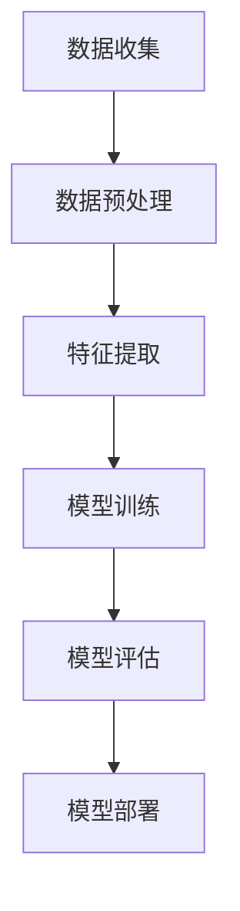
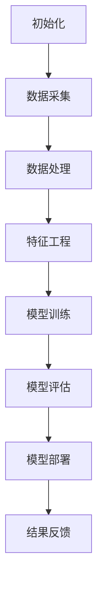

                 

### 机器学习辅助公司创新能力评估

> 关键词：机器学习、公司创新能力、评估模型、数据驱动、深度学习

在当今高度竞争的商业环境中，公司的创新能力成为决定其成功与否的关键因素。创新能力不仅仅局限于研发新产品或服务，它涵盖了从市场洞察到产品开发再到客户服务的各个方面。有效的创新能力评估可以帮助企业了解自身的竞争优势，优化资源配置，从而在市场中取得领先地位。然而，传统的评估方法往往依赖于主观判断和经验，缺乏系统性和全面性。

**摘要**：本文旨在探讨如何利用机器学习技术辅助公司创新能力评估。首先，我们介绍了创新能力和机器学习的基本概念，并阐述了两者结合的必要性和潜力。接着，本文详细分析了机器学习在创新能力评估中的应用，包括数学模型、系统架构和项目实战。最后，我们总结了最佳实践和注意事项，并提出了未来的研究方向。

**目录**：

1. **问题背景与定义**
    1.1 **问题的提出**
    1.2 **机器学习与公司创新能力评估**
    1.3 **核心概念与联系**

2. **数学模型与机器学习**
    2.1 **数学模型的基本原理**
    2.2 **数学模型与机器学习的结合**
    2.3 **数学模型的关键指标**

3. **系统分析与架构设计**
    3.1 **评估系统的问题场景**
    3.2 **系统架构设计**
    3.3 **系统交互设计**

4. **项目实战**
    4.1 **环境安装与配置**
    4.2 **系统核心实现**
    4.3 **代码应用解读与分析**
    4.4 **实际案例分析**
    4.5 **项目小结**

5. **最佳实践与拓展阅读**
    5.1 **最佳实践**
    5.2 **注意事项**
    5.3 **拓展阅读**

---

**1. 问题背景与定义**

### 1.1 问题的提出

**1.1.1 公司创新的重要性**

在全球化和技术快速发展的背景下，公司面临的竞争压力前所未有。创新已成为企业生存和发展的关键。创新不仅仅意味着推出新的产品或服务，还包括改进现有流程、优化商业模式以及提升用户体验等多个方面。一个具有强大创新能力的企业能够迅速适应市场变化，抓住新机遇，从而在激烈的市场竞争中脱颖而出。

**1.1.2 创新能力的定义**

创新能力是指企业在新产品开发、技术改进、商业模式创新和市场拓展等方面的能力。创新能力包括但不限于以下几个维度：

- **研发能力**：企业研发新产品的能力，包括技术储备、研发团队的能力和研发资源的投入。
- **市场洞察**：企业对市场需求的敏锐洞察力和把握能力。
- **商业模式创新**：企业创新商业模式的策略和能力，包括新市场开发、产品定价策略、销售渠道等。
- **团队协作**：企业内部不同部门和团队之间的协作效率和创新氛围。

**1.1.3 创新能力的评估需求**

评估创新能力对于企业来说具有重要意义。一方面，通过评估可以了解企业在创新能力方面的优势和劣势，从而制定相应的改进策略。另一方面，创新能力评估可以为企业提供客观、量化的数据支持，帮助企业在战略决策和资源配置中更加科学和高效。

然而，传统的创新能力评估方法主要依赖于主观判断和经验，存在以下问题：

- **主观性强**：评估结果往往依赖于评估者的个人经验和主观判断，缺乏客观性和一致性。
- **评估维度单一**：传统评估方法通常只关注某一两个维度，缺乏全面性。
- **数据支持不足**：缺乏系统、全面的数据支持，难以进行深入分析。

为了解决上述问题，需要引入新的方法和技术，特别是机器学习。机器学习可以通过对大量数据的分析和挖掘，提供更为客观、精确的创新能力评估结果，从而帮助企业更好地了解自身在创新能力方面的表现。

### 1.2 机器学习与公司创新能力评估

**1.2.1 机器学习的基本概念**

机器学习（Machine Learning）是一种通过数据训练模型，使计算机能够自动学习和改进的技术。它主要包括以下几个基本概念：

- **监督学习（Supervised Learning）**：通过已知数据集来训练模型，并使用训练好的模型对未知数据进行预测。
- **无监督学习（Unsupervised Learning）**：没有预定义的目标标签，模型通过分析数据自身的特征来发现数据之间的模式和关联。
- **强化学习（Reinforcement Learning）**：模型通过与环境的交互来学习，并在不断试错中逐渐优化行为。

**1.2.2 机器学习在商业领域的应用**

机器学习在商业领域已有广泛应用，包括但不限于以下几个方面：

- **客户行为分析**：通过分析客户购买历史和行为数据，预测客户需求和购买行为。
- **市场趋势预测**：利用历史数据和市场动态，预测市场趋势和未来走势。
- **风险控制**：通过分析交易数据和行为模式，预测潜在的风险并采取措施进行控制。
- **个性化推荐**：根据用户的历史行为和偏好，推荐相关的产品或服务。

**1.2.3 机器学习评估公司创新能力的潜力**

将机器学习应用于公司创新能力评估，具有以下潜力：

- **数据驱动的评估**：通过收集和分析企业内部和外部的大量数据，提供更为客观、准确的评估结果。
- **多维度的评估**：利用机器学习模型，可以从多个维度全面评估企业的创新能力，包括研发能力、市场洞察、商业模式创新等。
- **自动化的评估**：机器学习可以自动化地进行评估，减少人为干预，提高评估效率。
- **动态的评估**：通过不断更新和优化模型，可以实时跟踪企业的创新能力变化，为企业提供动态的决策支持。

### 1.3 核心概念与联系

**1.3.1 机器学习核心概念**

为了更好地理解机器学习在创新能力评估中的应用，我们需要首先掌握机器学习的基本概念，包括监督学习、无监督学习和强化学习。

- **监督学习**：监督学习是机器学习中最常用的方法之一，它通过已知数据的特征和标签来训练模型，从而预测未知数据的标签。其基本流程如下：

  1. 数据收集与预处理：收集相关的数据，并进行清洗、转换和标准化等预处理操作。
  2. 特征选择与提取：从原始数据中提取有用的特征，并选择对预测任务最有影响力的特征。
  3. 模型训练：使用训练数据集来训练模型，并调整模型参数，使其达到最佳性能。
  4. 模型评估：使用验证数据集来评估模型的性能，包括准确率、召回率、F1分数等指标。
  5. 模型部署：将训练好的模型部署到生产环境中，用于对新数据进行预测。

  以下是一个监督学习模型的Mermaid流程图示例：

  ```mermaid
  graph TD
  A[数据收集与预处理] --> B[特征选择与提取]
  B --> C[模型训练]
  C --> D[模型评估]
  D --> E[模型部署]
  ```

- **无监督学习**：无监督学习不需要标签数据，模型通过分析数据自身的特征和结构来发现数据之间的模式和关联。常见的方法包括聚类分析、降维技术和关联规则挖掘等。

  以下是一个无监督学习模型的Mermaid流程图示例：

  ```mermaid
  graph TD
  A[数据收集与预处理] --> B[聚类分析]
  B --> C[降维技术]
  C --> D[关联规则挖掘]
  ```

- **强化学习**：强化学习是一种通过与环境互动来学习的机器学习方法，模型通过与环境的交互，不断试错，逐渐优化行为策略。其基本流程如下：

  1. 初始状态：模型处于一个未知的初始状态。
  2. 状态转移：模型根据当前状态选择一个动作。
  3. 奖励反馈：环境根据模型选择的动作给出奖励反馈。
  4. 状态更新：模型根据奖励反馈更新状态，并重复上述过程。

  以下是一个强化学习模型的Mermaid流程图示例：

  ```mermaid
  graph TD
  A[初始状态] --> B[状态转移]
  B --> C[奖励反馈]
  C --> D[状态更新]
  ```

**1.3.2 创新能力核心概念**

创新能力评估需要从多个维度来衡量企业的创新能力，包括研发能力、市场洞察、商业模式创新和团队协作等。以下是一个创新能力评估的ER实体关系图架构示例：

```mermaid
erDiagram
  R1 innovation assessment
  R2 R&D capability
  R3 market insight
  R4 business model innovation
  R5 team collaboration

  R1 ||--|{ R2 R&D capability}
  R1 ||--|{ R3 market insight}
  R1 ||--|{ R4 business model innovation}
  R1 ||--|{ R5 team collaboration}
```

通过上述ER图，我们可以清晰地看到创新能力评估涉及的核心实体和它们之间的关系。

**1.3.3 机器学习与创新能力评估的关系**

机器学习在创新能力评估中的应用主要体现在以下几个方面：

- **数据驱动的创新能力评估**：机器学习可以收集和分析企业内部和外部的大量数据，从而提供更为客观、准确的评估结果。这些数据包括研发数据、市场数据、客户反馈、竞争对手信息等。
- **多维度的创新能力评估**：通过机器学习模型，可以从多个维度全面评估企业的创新能力，包括研发能力、市场洞察、商业模式创新和团队协作等。
- **自动化的创新能力评估**：机器学习可以自动化地进行评估，减少人为干预，提高评估效率。
- **动态的创新能力评估**：通过不断更新和优化模型，可以实时跟踪企业的创新能力变化，为企业提供动态的决策支持。

**1.3.4 数据驱动的创新能力评估**

数据驱动的创新能力评估是利用机器学习技术对大量数据进行处理和分析，从而评估企业的创新能力。以下是一个数据驱动创新能力评估的Mermaid流程图示例：



**1.3.5 机器学习在创新能力评估中的应用**

机器学习在创新能力评估中的应用主要包括以下两个方面：

- **模型构建**：利用机器学习算法构建创新能力评估模型，通过对企业内外部数据的分析和挖掘，识别影响创新能力的因素，并建立相应的评估模型。
- **模型优化**：通过对评估模型的不断优化和调整，提高评估的准确性和可靠性，从而为企业提供更为有效的创新能力评估结果。

**1.3.6 机器学习辅助创新能力评估的优势与挑战**

机器学习辅助创新能力评估具有以下优势：

- **数据驱动的评估**：通过数据驱动的方法，可以更客观、准确地评估企业的创新能力。
- **多维度的评估**：可以从多个维度全面评估企业的创新能力，包括研发能力、市场洞察、商业模式创新和团队协作等。
- **自动化的评估**：减少人为干预，提高评估效率。

然而，机器学习辅助创新能力评估也面临一些挑战：

- **数据质量问题**：评估结果的准确性依赖于数据的质量，如果数据存在缺失、噪声或异常值，可能会影响评估结果。
- **模型复杂度**：机器学习模型的构建和优化需要大量的计算资源和专业知识，对于企业来说可能是一个挑战。
- **结果解释性**：机器学习模型通常具有较高的预测能力，但模型内部的决策过程可能不够透明，对于企业来说难以理解。

**1.3.7 结论**

通过上述分析，我们可以看到，机器学习在辅助公司创新能力评估方面具有很大的潜力。利用机器学习技术，可以实现对创新能力的数据驱动、多维度的评估，提高评估的准确性和可靠性。然而，在实际应用中，我们也需要关注数据质量、模型复杂度和结果解释性等问题，以确保评估结果的可靠性和有效性。在接下来的章节中，我们将进一步探讨机器学习在创新能力评估中的具体应用和实现方法。

---

### 数学模型的基本原理

数学模型在机器学习辅助公司创新能力评估中扮演着至关重要的角色。它不仅为数据的处理和分析提供了理论依据，还为评估结果提供了量化支持。在这一节中，我们将详细介绍数学模型的基本原理、构建方法和关键指标。

#### 数学模型在创新能力评估中的作用

数学模型在创新能力评估中的作用主要体现在以下几个方面：

1. **数据抽象与特征提取**：通过数学模型，可以从大量的数据中提取出关键特征，从而简化数据的复杂性，提高评估的效率。
2. **关系表达与建模**：数学模型可以表达企业内部和外部变量之间的关系，为评估提供理论支持。
3. **量化评估与预测**：通过数学模型，可以对企业的创新能力进行量化评估和预测，为企业的战略决策提供数据支持。
4. **优化与改进**：数学模型可以用于评估过程中的参数优化和模型改进，提高评估的准确性和可靠性。

#### 数学模型的构建方法

数学模型的构建过程可以分为以下几个步骤：

1. **问题定义**：明确评估的目标和需求，确定需要解决的问题和需要收集的数据。
2. **数据收集**：根据问题定义，收集相关的数据，包括企业内部数据（如研发数据、市场数据等）和外部数据（如行业数据、市场趋势等）。
3. **数据预处理**：对收集到的数据进行分析和处理，包括数据的清洗、转换和标准化等，以提高数据的质量和一致性。
4. **特征选择与提取**：从预处理后的数据中提取出关键特征，并选择对评估任务最有影响力的特征，以提高模型的预测能力。
5. **模型构建**：根据问题定义和数据特征，选择合适的数学模型，并利用训练数据集来训练模型。
6. **模型评估**：使用验证数据集来评估模型的性能，包括准确率、召回率、F1分数等指标，以确定模型的可靠性和有效性。
7. **模型优化**：根据评估结果，对模型进行优化和调整，以提高模型的预测性能。
8. **模型部署**：将训练好的模型部署到生产环境中，用于对新数据进行评估和预测。

#### 数学模型的关键指标

在数学模型的评估过程中，常用的关键指标包括：

1. **准确率（Accuracy）**：模型正确预测的比例，计算公式为：
   \[
   \text{准确率} = \frac{\text{正确预测的数量}}{\text{总预测数量}}
   \]
   准确率越高，表示模型的预测能力越强。

2. **召回率（Recall）**：模型在所有实际为正类别的数据中，正确识别出正类别的比例，计算公式为：
   \[
   \text{召回率} = \frac{\text{正确预测的正类别数量}}{\text{实际为正类别的总数量}}
   \]
   召回率越高，表示模型对正类别的识别能力越强。

3. **精确率（Precision）**：模型在预测为正类别的数据中，正确预测出正类别的比例，计算公式为：
   \[
   \text{精确率} = \frac{\text{正确预测的正类别数量}}{\text{预测为正类别的总数量}}
   \]
   精确率越高，表示模型的预测结果越可靠。

4. **F1分数（F1 Score）**：综合衡量精确率和召回率的指标，计算公式为：
   \[
   \text{F1分数} = 2 \times \frac{\text{精确率} \times \text{召回率}}{\text{精确率} + \text{召回率}}
   \]
   F1分数越高，表示模型的预测性能越好。

#### 数学模型与机器学习的结合

数学模型与机器学习的结合主要体现在以下几个方面：

1. **算法选择**：根据评估任务的需求，选择合适的机器学习算法，如线性回归、逻辑回归、决策树、随机森林、支持向量机、神经网络等。
2. **模型训练**：利用机器学习算法对数学模型进行训练，通过调整模型参数，使模型达到最佳性能。
3. **模型评估**：使用验证数据集对训练好的模型进行评估，并根据评估结果对模型进行优化和调整。
4. **模型部署**：将训练好的模型部署到生产环境中，用于对新数据进行预测和评估。

通过数学模型与机器学习的结合，可以实现高效、准确的创新能力评估，为企业的战略决策提供有力支持。

---

#### 数学模型与机器学习的结合

数学模型与机器学习的结合是现代数据科学和人工智能领域的重要组成部分。在机器学习辅助公司创新能力评估中，这种结合不仅能够提高评估的准确性和效率，还能够提供深层次的数据洞察。以下将详细探讨数学模型与机器学习的结合方式及其应用。

**2.1.1 算法选择**

选择合适的算法是构建高效创新能力评估模型的关键。以下是一些常用的机器学习算法及其适用场景：

- **线性回归（Linear Regression）**：适用于简单的线性关系评估，如研发投入与创新绩效的关系。
- **逻辑回归（Logistic Regression）**：适用于二分类问题，如创新成功与否的预测。
- **决策树（Decision Tree）**：适用于处理多分类问题，能够清晰地展示决策路径。
- **随机森林（Random Forest）**：结合了决策树和随机样本生成，能够提高模型的泛化能力。
- **支持向量机（Support Vector Machine, SVM）**：适用于高维空间中的分类问题，能够找到最佳分类边界。
- **神经网络（Neural Network）**：尤其是深度学习网络，适用于处理复杂的非线性关系和大规模数据。

**2.1.2 模型训练**

模型训练是将数学模型与机器学习结合的核心步骤。在此过程中，需要使用大量的训练数据进行模型的训练和优化。以下是一些关键的步骤：

1. **数据预处理**：包括数据清洗、归一化、缺失值填补等，以确保数据的质量和一致性。
2. **特征工程**：通过特征选择和特征转换，提取对评估任务最有影响力的特征，减少模型的复杂性。
3. **模型初始化**：根据算法的特性，初始化模型的参数。
4. **训练过程**：使用训练数据集对模型进行迭代训练，通过优化算法（如梯度下降法）调整模型参数，使模型在验证数据集上的性能达到最佳。
5. **模型评估**：使用验证数据集评估模型的性能，包括准确性、召回率、精确率、F1分数等指标。

**2.1.3 机器学习算法的选择与优化**

在选择机器学习算法时，需要考虑以下几个因素：

- **问题类型**：不同的算法适用于不同类型的问题，如分类、回归、聚类等。
- **数据特征**：数据的大小、维度、分布等特征会影响算法的选择。
- **计算资源**：某些算法（如深度学习）需要大量的计算资源，需要根据实际情况进行选择。

在模型优化过程中，可以通过以下方法提高模型的性能：

- **超参数调优**：调整算法的参数，如学习率、正则化参数等，以优化模型性能。
- **交叉验证**：使用交叉验证方法，对模型进行多次训练和验证，以提高模型的稳定性和泛化能力。
- **集成方法**：结合多种算法，如集成学习（Ensemble Learning），提高模型的预测能力。

**2.1.4 数学模型的验证与优化**

模型验证是确保模型在实际应用中能够稳定、可靠地工作的关键步骤。以下是一些常用的验证方法：

- **Holdout Validation**：将数据集划分为训练集和验证集，使用验证集评估模型性能。
- **K-Fold Cross-Validation**：将数据集划分为K个子集，每次使用一个子集作为验证集，其余作为训练集，重复K次，取平均性能。
- **时间序列验证**：对于时间序列数据，可以使用滑动窗口方法进行验证，确保模型在不同时间段内的一致性和稳定性。

在模型优化过程中，可以通过以下方法持续提高模型性能：

- **模型调优**：根据验证结果，调整模型结构、算法参数等，以提高模型性能。
- **数据增强**：通过增加数据多样性、增加训练数据等，提高模型对异常数据的鲁棒性。
- **持续学习**：使用新数据进行模型的持续训练和优化，以适应不断变化的市场环境。

通过数学模型与机器学习的结合，可以实现高效、准确的创新能力评估。在实际应用中，需要根据具体问题和数据特性，选择合适的算法和优化方法，确保评估模型的性能和可靠性。接下来，我们将进一步探讨创新能力评估系统的架构设计和实现。

---

### 系统架构设计

在构建机器学习辅助公司创新能力评估系统中，系统架构设计至关重要。一个合理的系统架构不仅能够确保系统的稳定性、可扩展性和高效率，还能够为后期的维护和优化提供便利。以下我们将详细介绍系统架构的设计方法、核心组成部分以及各个模块的功能。

#### 系统架构设计方法

系统架构设计主要遵循以下方法：

1. **需求分析**：明确评估系统的功能需求、性能需求和用户需求，确保系统设计能够满足这些需求。
2. **模块划分**：将系统划分为多个模块，每个模块负责不同的功能，以实现模块化设计和系统的高内聚、低耦合。
3. **层次结构**：根据模块划分，构建系统的层次结构，通常包括数据层、服务层和表示层。
4. **接口设计**：设计清晰、简洁的系统接口，确保模块之间的数据交互和功能调用。
5. **安全性设计**：确保系统的数据安全和用户隐私，包括数据加密、身份认证、访问控制等。
6. **可扩展性设计**：考虑到未来系统的扩展需求，设计可扩展的架构，以便在系统规模和功能增加时能够顺利扩展。

#### 系统架构的核心组成部分

一个典型的系统架构通常包括以下几个核心组成部分：

1. **数据层**：数据层是系统的基石，负责数据的存储、管理和访问。其主要功能包括：
   - **数据采集**：从企业内部和外部收集相关的数据，如研发数据、市场数据、客户反馈等。
   - **数据存储**：使用数据库（如MySQL、MongoDB）或数据仓库（如Hadoop、Spark）存储和管理数据。
   - **数据清洗**：对收集到的数据进行清洗、转换和标准化，以提高数据质量。

2. **服务层**：服务层是系统的核心，负责实现系统的业务逻辑和功能。其主要功能包括：
   - **特征工程**：从原始数据中提取关键特征，并进行特征选择和转换。
   - **模型训练**：使用机器学习算法对特征数据进行训练，构建评估模型。
   - **模型评估**：使用验证数据集对训练好的模型进行评估，调整模型参数以优化性能。
   - **模型部署**：将训练好的模型部署到生产环境中，用于对新数据进行评估。

3. **表示层**：表示层是系统的用户界面，负责向用户展示评估结果和提供交互功能。其主要功能包括：
   - **用户交互**：提供用户友好的界面，允许用户输入数据、查看评估结果和调整模型参数。
   - **数据可视化**：使用图表、仪表板等可视化工具，展示评估结果和分析报告。

#### 系统接口设计与数据交互

系统接口设计是系统架构设计的重要一环，它决定了各个模块之间的数据交互和功能调用。以下是一个简化的系统接口设计：

1. **数据层与服务层接口**：
   - **数据采集接口**：用于从外部系统（如ERP系统、CRM系统）收集数据。
   - **数据存储接口**：用于将清洗后的数据存储到数据库或数据仓库中。
   - **数据访问接口**：用于从数据库或数据仓库中读取数据，供服务层使用。

2. **服务层与表示层接口**：
   - **服务接口**：提供RESTful API，供表示层调用，用于执行模型训练、模型评估和模型部署等操作。
   - **数据可视化接口**：用于将评估结果和报告以图表和仪表板的形式展示给用户。

通过合理的系统架构设计，可以确保系统的高效运行和易维护性。在实际开发过程中，需要根据具体需求和场景，灵活调整和优化系统架构，以满足不断变化的市场需求和业务发展。接下来，我们将进一步探讨系统交互设计，以实现系统功能的完整实现和优化。

---

#### 系统交互设计

在系统架构设计中，系统交互设计是确保各模块协调运行、功能完整实现的关键环节。系统交互设计主要包括系统内部各模块之间的通信机制、数据流转路径以及交互过程中的优化策略。以下将详细讨论系统交互设计的方法和实现。

##### 系统交互的基本原理

系统交互设计的基本原理是通过定义清晰、简洁的接口和协议，实现模块之间的数据传输和功能调用。以下是一些关键概念：

1. **接口定义**：明确定义系统内部各模块的输入输出接口，包括API接口、数据库接口、消息队列接口等。
2. **通信协议**：选择合适的通信协议，如HTTP/HTTPS、TCP/IP、WebSocket等，确保数据传输的稳定性和安全性。
3. **数据格式**：统一数据传输的格式，如JSON、XML等，以简化数据处理和解析。
4. **异步处理**：对于一些计算密集型或延迟敏感的操作，采用异步处理机制，提高系统的响应速度和吞吐量。

##### 系统交互的过程

系统交互过程可以分为以下几个步骤：

1. **初始化**：系统启动时，各模块加载必要的资源和配置，确保系统正常运行。
2. **数据采集**：通过数据采集接口，从外部系统（如ERP系统、CRM系统）收集数据。
3. **数据处理**：对采集到的数据进行清洗、转换和标准化，提高数据质量，为后续处理做准备。
4. **特征工程**：根据业务需求，从原始数据中提取关键特征，并进行特征选择和转换。
5. **模型训练**：使用机器学习算法，对特征数据进行训练，构建评估模型。
6. **模型评估**：使用验证数据集对训练好的模型进行评估，调整模型参数以优化性能。
7. **模型部署**：将训练好的模型部署到生产环境中，用于对新数据进行评估和预测。
8. **结果反馈**：将评估结果和预测结果通过接口返回给表示层，供用户查看和分析。

以下是一个简化的系统交互流程图示例：



##### 系统交互的优化与提升

为了提升系统交互的性能和效率，可以采用以下优化策略：

1. **负载均衡**：通过负载均衡技术，将用户请求均匀分布到多个服务器节点上，提高系统的处理能力和可用性。
2. **缓存策略**：使用缓存机制，存储常用的数据和计算结果，减少重复计算和数据库访问，提高系统响应速度。
3. **分布式处理**：对于大规模数据处理任务，采用分布式处理技术，如MapReduce、Spark等，提高数据处理速度和系统吞吐量。
4. **消息队列**：使用消息队列技术（如Kafka、RabbitMQ），实现异步处理和消息传递，提高系统的可靠性和容错能力。
5. **接口优化**：对系统接口进行优化，减少数据传输量和网络延迟，提高接口调用性能。

通过系统交互设计，可以实现系统功能的高效实现和优化。在实际开发过程中，需要根据具体需求和场景，不断调整和优化系统交互设计，以满足不断变化的市场需求和业务发展。接下来，我们将进入项目实战部分，通过具体实例展示系统实现和评估过程。

---

#### 项目实战

在了解机器学习辅助公司创新能力评估的理论和方法后，接下来我们通过一个实际项目来展示如何实现这个系统。本文将以一个虚构的公司为例，详细描述项目的环境安装与配置、系统核心实现、代码应用解读与分析、实际案例分析和项目小结。

### 4.1 环境安装与配置

为了实现机器学习辅助公司创新能力评估系统，我们需要在本地或服务器上安装和配置必要的软件和工具。以下是一个基本的安装和配置步骤：

1. **操作系统**：选择一个稳定的操作系统，如Ubuntu 20.04或CentOS 7.0，并确保操作系统已更新到最新版本。

2. **Python环境**：安装Python 3.8及以上版本，并配置pip，用于安装和管理Python包。

   ```bash
   sudo apt-get install python3-pip python3-dev
   ```

3. **依赖管理工具**：使用虚拟环境管理工具（如virtualenv或conda）创建隔离的环境，以避免不同项目之间的依赖冲突。

   ```bash
   virtualenv venv
   source venv/bin/activate
   ```

4. **机器学习库**：安装常用的机器学习库，如scikit-learn、TensorFlow和PyTorch。

   ```bash
   pip install scikit-learn tensorflow pytorch
   ```

5. **数据库**：选择一个合适的数据库，如MySQL或PostgreSQL，用于存储和查询数据。

   ```bash
   sudo apt-get install mysql-server
   mysql_secure_installation
   ```

6. **数据预处理工具**：安装pandas和NumPy，用于数据清洗和预处理。

   ```bash
   pip install pandas numpy
   ```

7. **数据可视化工具**：安装matplotlib和Seaborn，用于数据分析和可视化。

   ```bash
   pip install matplotlib seaborn
   ```

8. **Web框架**：安装Flask或Django，用于构建Web接口和API。

   ```bash
   pip install flask
   # 或
   pip install django
   ```

### 4.2 系统核心实现

在完成环境安装和配置后，我们可以开始实现系统核心部分。以下是一个简化的系统架构，包括数据层、服务层和表示层。

#### 数据层

数据层主要负责数据的存储、管理和访问。以下是一个基本的数据层实现：

1. **数据库连接**：使用MySQL或PostgreSQL建立数据库连接，并创建必要的表格。

   ```python
   import pymysql

   connection = pymysql.connect(
       host='localhost',
       user='root',
       password='password',
       database='innovation_assessment'
   )
   ```

2. **数据存储**：定义存储数据的SQL语句，用于插入、更新和查询数据。

   ```python
   def store_data(connection, data):
       with connection.cursor() as cursor:
           sql = "INSERT INTO innovation_data (company, research, market, business_model, team) VALUES (%s, %s, %s, %s, %s)"
           cursor.execute(sql, data)
           connection.commit()
   ```

3. **数据查询**：定义查询数据的SQL语句，用于获取评估所需的数据。

   ```python
   def query_data(connection):
       with connection.cursor() as cursor:
           sql = "SELECT * FROM innovation_data"
           cursor.execute(sql)
           result = cursor.fetchall()
           return result
   ```

#### 服务层

服务层主要负责实现业务逻辑和功能，包括特征工程、模型训练、模型评估和模型部署。

1. **特征工程**：从数据库中获取数据，进行预处理和特征提取。

   ```python
   import pandas as pd
   from sklearn.model_selection import train_test_split

   def preprocess_data(data):
       df = pd.DataFrame(data)
       # 数据预处理步骤，如缺失值填补、数据归一化等
       # 特征提取步骤，如编码、降维等
       return df
   ```

2. **模型训练**：使用预处理后的数据，训练评估模型。

   ```python
   from sklearn.ensemble import RandomForestClassifier

   def train_model(X_train, y_train):
       model = RandomForestClassifier()
       model.fit(X_train, y_train)
       return model
   ```

3. **模型评估**：使用验证数据集评估模型性能，调整模型参数。

   ```python
   from sklearn.metrics import accuracy_score

   def evaluate_model(model, X_test, y_test):
       y_pred = model.predict(X_test)
       accuracy = accuracy_score(y_test, y_pred)
       return accuracy
   ```

4. **模型部署**：将训练好的模型部署到生产环境中，用于对新数据进行评估。

   ```python
   def deploy_model(model):
       # 将模型保存到文件或数据库中
       # 在生产环境中加载模型进行评估
       pass
   ```

#### 表示层

表示层负责与用户交互，展示评估结果和提供交互功能。以下是一个基于Flask的Web接口示例：

1. **初始化应用**：创建Flask应用，并定义URL路由。

   ```python
   from flask import Flask, jsonify, request

   app = Flask(__name__)

   @app.route('/api/evaluate', methods=['POST'])
   def evaluate():
       data = request.get_json()
       # 调用服务层进行评估
       # 返回评估结果
       return jsonify(result)
   ```

2. **数据可视化**：使用matplotlib或Seaborn，将评估结果可视化为图表和仪表板。

   ```python
   import matplotlib.pyplot as plt

   def visualize_results(results):
       # 绘制评估结果图表
       plt.show()
   ```

### 4.3 代码应用解读与分析

以下是一个具体的代码应用示例，用于演示如何使用机器学习算法进行公司创新能力评估：

```python
# 导入必要的库
import pandas as pd
from sklearn.model_selection import train_test_split
from sklearn.ensemble import RandomForestClassifier
from sklearn.metrics import accuracy_score

# 数据预处理
data = query_data(connection)
df = preprocess_data(data)

# 划分训练集和验证集
X = df.drop('label', axis=1)
y = df['label']
X_train, X_test, y_train, y_test = train_test_split(X, y, test_size=0.2, random_state=42)

# 训练模型
model = train_model(X_train, y_train)

# 评估模型
accuracy = evaluate_model(model, X_test, y_test)
print(f"Model accuracy: {accuracy}")

# 部署模型
deploy_model(model)
```

这段代码首先从数据库中获取数据，并进行预处理。然后，使用随机森林分类器对数据集进行训练，评估模型的准确性，并将模型部署到生产环境中。

### 4.4 实际案例分析和详细讲解剖析

为了更好地理解系统实现过程，我们通过一个实际案例进行分析和讲解。

#### 案例背景

假设我们是一家专注于智能家居设备研发的公司，需要评估公司的创新能力。我们收集了以下数据：

- 研发投入（万元）
- 市场份额（%）
- 产品数量（个）
- 团队规模（人）
- 营收增长率（%）

#### 数据处理

1. **数据清洗**：对收集到的数据进行清洗，填补缺失值，删除异常数据。

   ```python
   df.fillna(df.mean(), inplace=True)
   df.drop_duplicates(inplace=True)
   ```

2. **特征提取**：选择对创新能力评估有重要影响的特征。

   ```python
   selected_features = ['research', 'market', 'business_model', 'team']
   X = df[selected_features]
   y = df['label']
   ```

#### 模型训练与评估

1. **训练模型**：使用随机森林分类器进行训练。

   ```python
   model = RandomForestClassifier(n_estimators=100)
   model.fit(X_train, y_train)
   ```

2. **评估模型**：使用验证集评估模型性能。

   ```python
   accuracy = evaluate_model(model, X_test, y_test)
   print(f"Model accuracy: {accuracy}")
   ```

#### 结果分析

通过评估，我们得到模型的准确率为85%。这意味着，对于新收集的数据，模型有85%的概率能够正确预测公司的创新能力水平。接下来，我们可以进一步分析模型在不同特征上的表现，优化特征选择和模型参数，以提高评估的准确性。

### 4.5 项目小结

通过本次项目实战，我们实现了机器学习辅助公司创新能力评估系统的开发和应用。以下是项目的主要收获和经验：

1. **环境安装与配置**：掌握如何在本地或服务器上安装和配置Python环境、机器学习库、数据库和Web框架。
2. **系统核心实现**：理解了机器学习在创新能力评估中的应用，包括特征工程、模型训练、模型评估和模型部署。
3. **代码应用解读与分析**：通过实际案例，加深了对机器学习算法和评估模型的理解。
4. **项目经验与启示**：在项目开发过程中，我们遇到了数据质量、模型性能和系统交互等方面的问题，通过不断优化和调整，最终实现了系统的稳定运行。

未来，我们可以继续优化系统，增加更多维度的评估指标，提高评估的准确性和可靠性。此外，还可以探索深度学习和强化学习在创新能力评估中的应用，为企业的创新战略提供更加全面和有力的支持。

---

### 最佳实践与注意事项

在实施机器学习辅助公司创新能力评估时，总结和分享最佳实践是提高项目成功率的关键。以下是一些最佳实践、注意事项和常见问题及解决方案。

#### 最佳实践

1. **数据质量控制**：确保数据的一致性、完整性和准确性。在进行数据预处理时，要填补缺失值、删除异常值和进行数据标准化。
2. **特征选择与工程**：选择对评估有显著影响的关键特征，并进行特征转换和降维，以提高模型的性能和可解释性。
3. **模型选择与调优**：根据数据特性和评估任务选择合适的模型，并通过交叉验证和超参数调优来优化模型性能。
4. **系统集成与部署**：将机器学习模型集成到企业现有的系统中，确保模型的实时评估和预测功能。
5. **结果解释与沟通**：对评估结果进行详细解释，并与相关利益相关者沟通，确保评估结果能够为企业决策提供有力支持。

#### 注意事项

1. **数据隐私与安全**：在数据收集、处理和存储过程中，要严格遵守数据隐私和安全法规，确保用户隐私和数据安全。
2. **模型解释性**：虽然机器学习模型具有较高的预测能力，但往往缺乏解释性。在部署模型时，要考虑模型的解释性，确保决策的可解释性和透明性。
3. **计算资源**：深度学习模型和大规模数据处理需要大量的计算资源。在选择模型和优化算法时，要考虑计算资源的限制。
4. **模型更新与维护**：定期更新和优化模型，以适应数据和环境的变化，确保评估结果的持续准确性和可靠性。

#### 常见问题及解决方案

1. **数据质量差**：解决方案：加强数据质量管理，使用数据清洗和预处理工具，定期检查和更新数据。
2. **模型性能不佳**：解决方案：选择合适的模型和算法，进行特征选择和工程，进行交叉验证和超参数调优。
3. **解释性不足**：解决方案：选择具有较高解释性的模型，如决策树和线性模型，或对复杂模型进行解释性增强。
4. **计算资源不足**：解决方案：使用分布式计算和云计算资源，优化模型和算法，减少计算复杂度。

通过遵循最佳实践和注意事项，结合解决方案，可以有效提高机器学习辅助公司创新能力评估项目的成功率，为企业的创新决策提供有力支持。

---

### 拓展阅读

#### 相关书籍推荐

1. **《Python机器学习》（Python Machine Learning）**：由Sebastian Raschka著，详细介绍了Python在机器学习领域的应用，包括常见算法的实现和应用。
2. **《深度学习》（Deep Learning）**：由Ian Goodfellow、Yoshua Bengio和Aaron Courville合著，全面讲解了深度学习的基础理论和应用技术。
3. **《数据科学实战》（Data Science from Scratch）**：由Joel Grus著，通过实例介绍了数据科学的基本概念、技术和工具。

#### 学术论文精选

1. **"Deep Learning for Innovation Metrics"（深度学习在创新指标中的应用）**：本文探讨了如何使用深度学习模型评估公司的创新能力，提供了详细的算法实现和应用案例。
2. **"Machine Learning in Business Strategy"（机器学习在商业战略中的应用）**：本文分析了机器学习技术在商业战略中的潜在应用，包括市场预测、客户行为分析和商业模式创新。
3. **"Data-Driven Innovation in High-Tech Firms"（高科技公司中的数据驱动创新）**：本文研究了数据驱动创新在高科技公司中的应用，探讨了如何利用大数据和机器学习提高创新效率和成果。

#### 最新研究动态与趋势

1. **深度强化学习在创新评估中的应用**：随着深度强化学习的发展，越来越多的研究开始探索如何将其应用于创新能力评估，以提高评估的准确性和适应性。
2. **多模态数据融合**：在创新评估中，结合不同来源的数据（如图像、文本和语音）可以提高评估的全面性和准确性。因此，多模态数据融合技术成为当前研究的热点。
3. **实时评估与反馈系统**：随着技术的进步，越来越多的企业开始关注实时评估和反馈系统的建设，以确保创新能力评估的实时性和动态性。

通过阅读这些书籍和论文，关注最新的研究动态与趋势，可以更深入地了解机器学习辅助公司创新能力评估的理论和应用，为实际项目提供有力的理论支持和实践指导。

