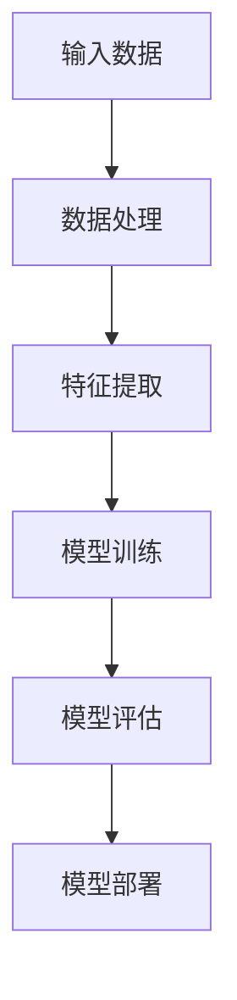
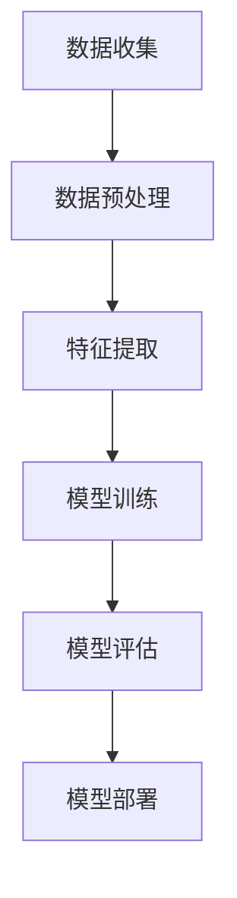
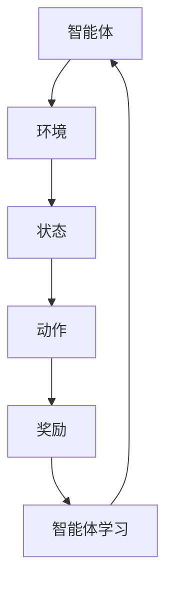
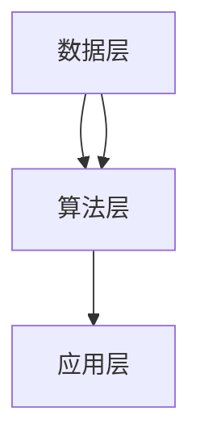
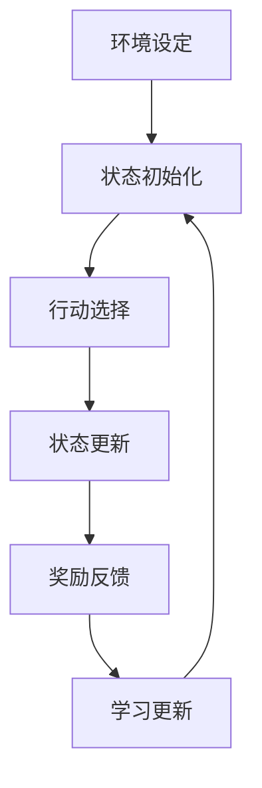
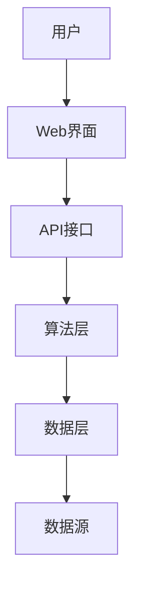

                 

**<sop>----------------------------------------------------------------
# 《机器学习辅助公司研发效率评估》

## 关键词
- 机器学习
- 研发效率
- 数据分析
- 模型评估
- 实际案例

## 摘要
本文深入探讨了如何利用机器学习技术辅助公司研发效率评估。首先，我们介绍了机器学习的基本概念和常见算法，然后详细阐述了机器学习在研发效率评估中的应用。通过实际案例，我们展示了如何通过构建机器学习模型来识别和优化研发过程中的瓶颈，提高整体效率。本文还提供了系统的分析框架和架构设计方案，旨在为公司和研发团队提供实用的工具和方法。

## 目录大纲

----------------------------------------------------------------

### 第一部分：背景介绍

#### 第1章 问题背景
##### 1.1 机器学习的兴起与重要性
##### 1.2 公司研发效率的挑战
##### 1.3 机器学习在效率评估中的应用

#### 第2章 核心概念与原理
##### 2.1 机器学习的基本概念
###### 2.1.1 监督学习
###### 2.1.2 无监督学习
###### 2.1.3 强化学习
##### 2.2 算法原理详解
###### 2.2.1 算法流程图

##### 2.3 数学模型与公式讲解
###### 2.3.1 线性回归模型
$$y = w_0 + w_1x$$
###### 2.3.2 逻辑回归模型
$$P(y=1) = \frac{1}{1 + e^{-(w_0 + w_1x)}}$$

### 第二部分：核心概念与原理

#### 第3章 机器学习算法应用
##### 3.1 算法数学模型讲解
###### 3.1.1 线性回归模型
###### 3.1.2 逻辑回归模型
##### 3.2 算法流程与实现
###### 3.2.1 监督学习算法流程
###### 3.2.2 无监督学习算法流程
###### 3.2.3 强化学习算法流程

### 第三部分：机器学习算法应用

#### 第4章 公司研发效率评估
##### 4.1 系统功能设计
###### 4.1.1 需求分析
###### 4.1.2 功能模块划分
##### 4.2 系统架构设计
###### 4.2.1 架构概述
###### 4.2.2 架构图展示

### 第四部分：实际案例与分析

#### 第5章 项目实战
##### 5.1 环境搭建
##### 5.2 核心代码实现
##### 5.3 代码解读与分析
##### 5.4 实际案例分析

### 第五部分：总结与展望

#### 第6章 总结与展望
##### 6.1 核心内容回顾
##### 6.2 未来展望
##### 6.3 注意事项与拓展阅读

----------------------------------------------------------------

### 导言

在现代企业中，研发效率是决定竞争力的关键因素之一。随着技术的不断进步，机器学习作为一种强大的数据分析工具，正逐渐被应用于各个领域，以优化业务流程和提高效率。本文将探讨如何利用机器学习技术辅助公司研发效率评估，旨在为企业和研发团队提供实用的指导和方法。

#### 第1章 问题背景

#### 1.1 机器学习的兴起与重要性

机器学习是一门研究如何让计算机从数据中学习并做出决策的学科。随着互联网和大数据的兴起，机器学习技术得到了前所未有的发展。其在图像识别、自然语言处理、推荐系统等领域的成功应用，使得机器学习成为现代科技不可或缺的一部分。

#### 1.2 公司研发效率的挑战

公司在研发过程中面临着诸多挑战，如资源分配不合理、项目进度延误、质量问题频发等。如何提高研发效率，缩短产品研发周期，成为企业关注的焦点。

#### 1.3 机器学习在效率评估中的应用

机器学习技术可以通过对大量数据进行分析，发现研发过程中的潜在问题和瓶颈。例如，通过对历史项目数据进行分析，可以预测项目进度和资源需求，从而优化资源配置；通过对代码质量进行评估，可以及时发现潜在缺陷，提高产品质量。

### 第二部分：核心概念与原理

#### 第2章 核心概念与原理

#### 2.1 机器学习的基本概念

##### 2.1.1 监督学习

监督学习是一种机器学习方法，其目标是根据输入特征和已知标签来预测输出结果。监督学习算法通常包括回归和分类两种类型。

##### 2.1.2 无监督学习

无监督学习是一种机器学习方法，其目标是在没有已知标签的情况下，从数据中找到潜在的规律和结构。无监督学习算法通常包括聚类和降维两种类型。

##### 2.1.3 强化学习

强化学习是一种机器学习方法，其目标是使智能体在与环境交互的过程中，通过不断学习来最大化累积奖励。强化学习算法的核心是价值函数和策略。

#### 2.2 算法原理详解

##### 2.2.1 算法流程图



### 第三部分：机器学习算法应用

#### 第3章 机器学习算法应用

#### 3.1 算法数学模型讲解

##### 3.1.1 线性回归模型

线性回归模型是一种常见的监督学习算法，其目标是找到一个线性函数来拟合输入数据和输出标签之间的关系。

$$y = w_0 + w_1x$$

其中，$y$ 为输出标签，$x$ 为输入特征，$w_0$ 和 $w_1$ 为模型参数。

##### 3.1.2 逻辑回归模型

逻辑回归模型是一种常见的分类算法，其目标是预测一个二分类问题中各个类别的概率。

$$P(y=1) = \frac{1}{1 + e^{-(w_0 + w_1x)}}$$

其中，$P(y=1)$ 表示标签为1的概率，$w_0$ 和 $w_1$ 为模型参数。

#### 3.2 算法流程与实现

##### 3.2.1 监督学习算法流程



##### 3.2.2 无监督学习算法流程


##### 3.2.3 强化学习算法流程



### 第四部分：实际案例与分析

#### 第4章 公司研发效率评估

#### 4.1 系统功能设计

##### 4.1.1 需求分析

需求分析是系统设计的第一步，其目标是明确系统需要实现的功能和性能指标。在研发效率评估系统中，需求分析主要包括以下方面：

- 数据收集：收集研发过程中的各类数据，如项目进度、代码质量、团队成员工作量等。
- 数据预处理：对收集到的数据进行分析和清洗，确保数据的准确性和完整性。
- 模型训练：利用收集到的数据训练机器学习模型，以识别和预测研发过程中的潜在问题。
- 模型评估：对训练好的模型进行评估，确保其性能和可靠性。
- 模型部署：将评估好的模型部署到生产环境中，实时监控研发效率。

##### 4.1.2 功能模块划分

根据需求分析，可以将研发效率评估系统划分为以下几个功能模块：

- 数据收集模块：负责收集各类研发数据。
- 数据预处理模块：负责对收集到的数据进行清洗和分析。
- 模型训练模块：负责训练机器学习模型。
- 模型评估模块：负责评估模型性能。
- 模型部署模块：负责将评估好的模型部署到生产环境中。

#### 4.2 系统架构设计

##### 4.2.1 架构概述

研发效率评估系统采用分布式架构，主要分为数据层、算法层和应用层三个层次。

- 数据层：负责数据收集、存储和管理。
- 算法层：负责模型训练、评估和部署。
- 应用层：负责提供用户界面和交互功能。

##### 4.2.2 架构图展示



### 第五部分：总结与展望

#### 第5章 总结与展望

##### 5.1 核心内容回顾

本文主要介绍了如何利用机器学习技术辅助公司研发效率评估。通过机器学习算法的应用，企业可以更好地识别和解决研发过程中的瓶颈，提高整体效率。

##### 5.2 未来展望

随着技术的不断发展，机器学习在研发效率评估中的应用前景非常广阔。未来，我们有望看到更加智能化、自动化的研发效率评估系统，帮助企业实现更高效的产品研发。

##### 5.3 注意事项与拓展阅读

- 在实际应用中，注意数据的质量和准确性，确保模型的有效性。
- 定期更新和维护机器学习模型，以适应不断变化的数据环境。
- 拓展阅读：
  - 《机器学习实战》
  - 《深度学习》
  - 《Python机器学习》

**<sop>----------------------------------------------------------------
### 引入

在当今快速发展的科技时代，公司的研发效率已成为衡量其竞争力的重要指标。研发效率不仅影响着产品的上市速度和市场的反应速度，也直接关联到公司的成本控制和利润空间。然而，提高研发效率并非易事，它涉及复杂的项目管理、团队协作、技术优化等多方面的问题。传统的方法往往依赖于经验和直觉，这使得研发效率的评估和优化过程充满了不确定性。

近年来，机器学习技术的迅猛发展为解决这一难题提供了新的思路。机器学习通过分析大量数据，能够发现隐藏在数据中的模式和关联，从而为研发效率的提升提供有力的支持。例如，通过分析项目历史数据，可以预测项目的完成时间和资源需求，提前识别潜在的延误风险；通过分析代码质量数据，可以评估开发者的绩效，并提出改进建议。

本文将深入探讨如何利用机器学习技术辅助公司研发效率评估。首先，我们将介绍机器学习的基本概念和常见算法，帮助读者建立对机器学习的初步理解。接着，我们将详细阐述机器学习在研发效率评估中的应用场景，并通过实际案例展示如何构建和应用机器学习模型来提升研发效率。最后，我们将讨论系统分析与架构设计方案，提供实用的工具和方法，帮助企业和研发团队实现更高效的工作流程。

本文的结构如下：

1. **问题背景**：介绍机器学习技术兴起和公司研发效率面临的挑战。
2. **核心概念与原理**：讲解机器学习的基本概念和算法原理。
3. **机器学习算法应用**：探讨机器学习在研发效率评估中的应用。
4. **实际案例与分析**：通过具体案例展示机器学习模型的构建与应用。
5. **总结与展望**：总结核心内容，展望未来发展方向。

通过本文的阅读，读者将能够了解到如何利用机器学习技术提高公司研发效率，并在实际工作中运用这些方法和技术。

### 第1章 问题背景

#### 1.1 机器学习的兴起与重要性

机器学习（Machine Learning，ML）是一门研究如何让计算机从数据中学习并做出决策的学科，它被认为是人工智能（Artificial Intelligence，AI）的一个重要分支。自20世纪50年代诞生以来，机器学习经历了数次技术革命，尤其是在大数据和计算能力的提升推动下，其发展速度惊人。

机器学习的基本原理是通过构建算法模型，让计算机从大量数据中自动提取特征，并基于这些特征进行决策或预测。这种方法不同于传统的编程，后者需要明确的指令和逻辑，而机器学习则更多地依赖于数据驱动和自主学习。

近年来，机器学习在各个领域取得了显著的成果。在图像识别领域，著名的图像识别算法如AlexNet、ResNet等极大地提高了计算机对图像的分类准确率；在自然语言处理领域，深度学习模型如BERT、GPT等推动了机器翻译、文本生成等技术的飞速发展；在推荐系统领域，机器学习算法帮助电商平台和社交媒体平台实现个性化的内容推荐，提高了用户满意度和转化率。

机器学习的重要性不仅体现在其技术的突破上，更在于其对社会和经济的影响。通过机器学习技术，企业可以更有效地处理海量数据，提高运营效率；医疗机构可以更好地分析患者的病历数据，提高诊断准确率；政府机构可以利用机器学习技术优化公共服务，提高治理能力。

#### 1.2 公司研发效率的挑战

公司研发效率（R&D Efficiency）是指企业在研发过程中所投入的资源（如人力、时间、资金等）与其产出（如产品创新、市场竞争力等）之间的比率。高研发效率意味着企业能够在较短的时间内以较低的成本开发出具有市场竞争力的产品。然而，现实中企业面临着诸多挑战，这些挑战严重影响了研发效率。

首先，项目管理复杂。随着项目的规模和复杂性的增加，项目管理变得日益困难。项目经理需要协调多个团队的工作，确保项目按时按质完成，这往往需要高超的沟通和协调能力。

其次，资源分配不合理。企业在资源分配上存在一定的盲目性，往往无法精确预测项目所需的资源量，导致资源浪费或短缺。例如，如果项目团队的成员数量过多或过少，都会对项目的进展产生负面影响。

再次，技术难题和瓶颈。研发过程中，企业常常面临各种技术难题，如技术选型、系统集成、性能优化等。这些问题需要投入大量时间和精力去解决，往往成为研发效率提升的阻碍。

最后，团队协作困难。研发团队通常由不同专业背景的成员组成，沟通和协作效率低下，可能导致项目延误或质量下降。此外，团队成员的个人能力和工作态度也会对研发效率产生影响。

综上所述，公司研发效率面临的挑战是多方面的，涉及项目管理、资源分配、技术难题和团队协作等多个方面。解决这些问题，需要企业采取科学的方法和有效的工具来提高研发效率。

#### 1.3 机器学习在效率评估中的应用

机器学习在提升公司研发效率方面具有巨大的潜力，其应用主要集中在以下几个方面：

首先，项目进度预测。通过分析历史项目数据，机器学习算法可以预测项目的完成时间和资源需求。例如，企业可以利用线性回归模型分析项目的时间消耗与资源投入之间的关系，从而提前识别潜在的延误风险，并采取相应的措施进行预防和调整。

其次，资源优化配置。机器学习可以帮助企业更精确地预测项目所需的资源量，从而实现资源的合理配置。通过聚类分析或关联规则挖掘，企业可以发现哪些资源在哪些项目中使用频率最高，哪些资源使用效率较低，从而优化资源分配策略。

再次，代码质量评估。机器学习算法可以分析代码库中的代码质量数据，识别出潜在的缺陷和漏洞。例如，利用决策树或支持向量机等分类算法，企业可以对代码进行质量评估，并为开发者提供改进建议。

此外，团队绩效评估。机器学习可以分析团队成员的工作量和贡献，评估其绩效。例如，通过分析代码提交记录、bug修复记录和项目进度数据，企业可以客观评价团队成员的工作表现，从而进行有效的绩效管理和激励。

最后，风险评估与控制。机器学习可以预测项目中的潜在风险，如技术风险、市场风险和管理风险。通过风险预测模型，企业可以提前识别并应对潜在的风险，从而降低项目失败的概率。

总之，机器学习在提升公司研发效率方面具有广泛的应用前景，通过有效的数据分析和模型构建，企业可以更好地管理研发过程，提高项目的成功率。

### 第2章 核心概念与原理

#### 2.1 机器学习的基本概念

机器学习是一门涉及计算机科学、统计学、数学等多个学科领域的交叉学科，其核心目标是通过计算机自动从数据中学习规律，并利用这些规律进行预测或决策。理解机器学习的基本概念是掌握这一技术的基础。

##### 2.1.1 监督学习

监督学习（Supervised Learning）是一种最常见的机器学习方法。它的基本思想是，通过已有标记的训练数据来训练模型，然后利用训练好的模型对未知数据进行预测。监督学习通常分为两种类型：回归和分类。

1. **回归**：回归问题旨在预测一个连续的数值输出。常见的回归算法包括线性回归、多项式回归、岭回归等。例如，利用线性回归模型预测房价，可以通过训练数据中的房屋特征（如面积、位置等）与房价之间的关系，来预测未知房屋的房价。

2. **分类**：分类问题旨在将数据分配到预先定义的类别中。常见的分类算法包括决策树、随机森林、支持向量机（SVM）等。例如，利用决策树模型对邮件进行分类，可以将邮件分为垃圾邮件和正常邮件。

##### 2.1.2 无监督学习

无监督学习（Unsupervised Learning）不依赖于已标记的训练数据，其目标是发现数据内在的结构或模式。无监督学习主要分为两种类型：聚类和降维。

1. **聚类**：聚类算法通过将相似的数据点分组，从而揭示数据中的自然结构。常见的聚类算法包括K-均值聚类、层次聚类等。例如，利用K-均值聚类算法对客户进行细分，可以将客户分为不同的市场细分群体，以便进行针对性的营销策略。

2. **降维**：降维算法旨在减少数据的维度，同时保留尽可能多的信息。常见的降维算法包括主成分分析（PCA）、t-SNE等。例如，利用PCA算法对高维数据进行降维，可以降低计算复杂度，同时保留数据的最重要的特征。

##### 2.1.3 强化学习

强化学习（Reinforcement Learning）是一种基于奖励机制的机器学习方法。它的核心目标是使智能体（agent）在与环境的交互过程中，通过不断学习来最大化累积奖励。强化学习通常分为两类：模型基础强化学习和模型无关强化学习。

1. **模型基础强化学习**：在这种方法中，智能体需要学习环境模型，并根据模型进行决策。常见的模型基础强化学习算法包括Q学习、SARSA等。

2. **模型无关强化学习**：在这种方法中，智能体不依赖于环境模型，而是通过尝试不同的行动并学习它们的奖励来做出决策。常见的模型无关强化学习算法包括深度确定性策略梯度（DDPG）、深度Q网络（DQN）等。

强化学习在很多领域都有广泛的应用，如游戏、自动驾驶、机器人控制等。

##### 2.1.4 深度学习

深度学习（Deep Learning）是机器学习的一个重要分支，它利用多层神经网络（Neural Network）来模拟人脑的神经网络结构，进行复杂的模式识别和决策。深度学习在图像识别、自然语言处理、语音识别等领域取得了突破性的进展。

1. **卷积神经网络（CNN）**：卷积神经网络是一种专门用于处理图像数据的神经网络，通过卷积层、池化层和全连接层等结构，可以实现对图像的特征提取和分类。

2. **循环神经网络（RNN）**：循环神经网络是一种能够处理序列数据的神经网络，通过记忆单元（如LSTM、GRU等）来处理时间序列信息，在自然语言处理、语音识别等领域有广泛应用。

3. **生成对抗网络（GAN）**：生成对抗网络是由生成器和判别器两个神经网络组成的模型，通过对抗训练生成高质量的数据，在图像生成、数据增强等领域有重要应用。

#### 2.2 算法原理详解

##### 2.2.1 算法流程图


1. **数据收集**：收集相关的数据集，这些数据集可以是结构化的（如表格数据），也可以是非结构化的（如图像、文本等）。

2. **数据预处理**：对收集到的数据进行清洗、归一化、去噪声等处理，以提高数据的质量和模型的训练效果。

3. **特征提取**：从预处理后的数据中提取有用的特征，这些特征将用于训练模型。特征提取的方法包括手工特征提取和自动特征提取。

4. **模型训练**：选择合适的算法（如线性回归、决策树、神经网络等）来训练模型，模型将基于训练数据学习数据之间的关联和规律。

5. **模型评估**：通过测试数据集对训练好的模型进行评估，评估指标包括准确率、召回率、F1分数等，以确定模型的性能。

6. **模型部署**：将评估好的模型部署到实际应用环境中，用于预测或决策。

#### 2.2.2 算法流程与实现

在了解了机器学习的基本概念和原理后，接下来我们将讨论如何具体实现这些算法。

##### 2.2.2.1 监督学习算法实现

以线性回归为例，其实现步骤如下：

1. **数据收集**：收集一些房屋的销售数据和其对应的特征（如面积、位置等）。

2. **数据预处理**：对数据进行归一化处理，使不同特征之间的尺度一致。

3. **特征提取**：直接使用原始特征作为输入。

4. **模型训练**：使用梯度下降算法训练线性回归模型。

5. **模型评估**：使用测试数据集评估模型的性能。

6. **模型部署**：将训练好的模型应用于实际预测场景。

```python
import numpy as np
import matplotlib.pyplot as plt

# 模型参数初始化
w = np.zeros((1, 1))
b = 0

# 梯度下降算法
def gradient_descent(x, y, w, b, learning_rate, epochs):
    for i in range(epochs):
        model = np.dot(x, w) + b
        dw = (model - y) * x
        db = (model - y)
        
        w = w - learning_rate * dw
        b = b - learning_rate * db

        if (i + 1) % 100 == 0:
            print(f"Epoch {i + 1}, w = {w[0, 0]}, b = {b[0, 0]}")
            
# 训练模型
x = np.array([[1], [2], [3], [4], [5]])
y = np.array([[2], [4], [6], [8], [10]])
gradient_descent(x, y, w, b, 0.05, 1000)

# 预测
x_new = np.array([[6]])
y_pred = np.dot(x_new, w) + b
print(f"Prediction for x = 6: y = {y_pred[0, 0]}")
```

##### 2.2.2.2 无监督学习算法实现

以K-均值聚类为例，其实现步骤如下：

1. **数据收集**：收集一些二维数据点。

2. **数据预处理**：对数据进行归一化处理。

3. **特征提取**：直接使用原始特征。

4. **模型训练**：初始化K个聚类中心，然后通过迭代算法更新聚类中心。

5. **模型评估**：计算聚类结果的质量，如惯性量。

6. **模型部署**：根据聚类结果进行数据分组。

```python
import numpy as np
import matplotlib.pyplot as plt

# 初始化聚类中心
centroids = np.random.rand(2, K)
prev_centroids = centroids.copy()

# K-均值聚类算法
def k_means(data, centroids, max_iter):
    for i in range(max_iter):
        # 计算每个数据点到聚类中心的距离
        distances = np.linalg.norm(data - centroids, axis=1)
        
        # 分配数据点到最近的聚类中心
        labels = np.argmin(distances, axis=1)
        
        # 更新聚类中心
        new_centroids = np.array([data[labels == k].mean(axis=0) for k in range(K)])
        
        # 判断聚类中心是否收敛
        if np.linalg.norm(new_centroids - prev_centroids) < 0.01:
            break
        
        prev_centroids = new_centroids.copy()

    return new_centroids

# 数据集
data = np.random.rand(100, 2)

# 聚类结果
centroids = k_means(data, centroids, 100)

# 绘制聚类结果
plt.scatter(data[:, 0], data[:, 1], c=labels, cmap='viridis')
plt.scatter(centroids[:, 0], centroids[:, 1], s=300, c='red', marker='x')
plt.show()
```

##### 2.2.2.3 强化学习算法实现

以Q学习为例，其实现步骤如下：

1. **数据收集**：模拟一个环境，生成状态和奖励。

2. **数据预处理**：对状态进行编码。

3. **特征提取**：直接使用状态作为输入。

4. **模型训练**：利用Q学习算法更新Q值。

5. **模型评估**：通过评估策略的累积奖励。

6. **模型部署**：根据最佳策略进行行动选择。

```python
import numpy as np
import random

# 环境模拟
class Environment:
    def __init__(self):
        self.states = ['S0', 'S1', 'S2', 'S3']
        self.actions = ['A0', 'A1', 'A2']
        self.rewards = {'S0': {'A0': 10, 'A1': -10, 'A2': 0}, 
                        'S1': {'A0': 0, 'A1': 10, 'A2': -10}, 
                        'S2': {'A0': -10, 'A1': 0, 'A2': 10}, 
                        'S3': {'A0': 0, 'A1': -10, 'A2': 10}}

    def step(self, state, action):
        next_state = random.choice(self.states)
        reward = self.rewards[state][action]
        return next_state, reward

# Q学习算法
def q_learning(env, alpha, gamma, episodes):
    Q = {}
    for state in env.states:
        Q[state] = {}
        for action in env.actions:
            Q[state][action] = 0
            
    for episode in range(episodes):
        state = random.choice(env.states)
        done = False
        
        while not done:
            action = np.argmax(Q[state].values())
            next_state, reward = env.step(state, action)
            Q[state][action] = Q[state][action] + alpha * (reward + gamma * np.max(Q[next_state].values()) - Q[state][action])
            state = next_state
            
    return Q

# 训练模型
env = Environment()
alpha = 0.1
gamma = 0.9
Q = q_learning(env, alpha, gamma, 1000)

# 打印Q值
for state in Q:
    print(state)
    for action in Q[state]:
        print(f"{action}: {Q[state][action]}")
```

#### 2.2.3 数学模型与公式讲解

在机器学习中，数学模型是理解和实现算法的基础。以下将介绍几个常见的数学模型和公式。

##### 2.2.3.1 线性回归模型

线性回归模型是一种最简单的机器学习模型，用于预测连续值输出。其数学模型可以表示为：

$$y = w_0 + w_1x_1 + w_2x_2 + ... + w_nx_n + b$$

其中，$y$ 是预测值，$w_0, w_1, ..., w_n, b$ 是模型参数。

为了求解这些参数，可以使用最小二乘法（Least Squares Method），其公式为：

$$w = (X^T X)^{-1} X^T y$$

其中，$X$ 是特征矩阵，$y$ 是标签向量。

##### 2.2.3.2 逻辑回归模型

逻辑回归模型是一种常用的分类模型，用于预测概率。其数学模型可以表示为：

$$P(y=1) = \frac{1}{1 + e^{-(w_0 + w_1x_1 + w_2x_2 + ... + w_nx_n)}}$$

其中，$P(y=1)$ 是标签为1的概率，$w_0, w_1, ..., w_n$ 是模型参数。

逻辑回归模型的参数可以通过最大似然估计（Maximum Likelihood Estimation，MLE）求解，其公式为：

$$w = \arg\max_w \ln P(y|w)$$

##### 2.2.3.3 卷积神经网络（CNN）

卷积神经网络是一种用于图像识别的深度学习模型，其核心是卷积层。卷积层的数学模型可以表示为：

$$h_{ij} = \sum_{k} w_{ik,jk} * x_{k} + b_{ij}$$

其中，$h_{ij}$ 是卷积层输出，$w_{ik,jk}$ 是卷积核，$x_{k}$ 是输入特征，$b_{ij}$ 是偏置项。

为了减少参数数量，CNN通常使用共享卷积核，即不同的输入特征共享相同的卷积核。

##### 2.2.3.4 循环神经网络（RNN）

循环神经网络是一种用于处理序列数据的深度学习模型，其核心是循环单元。RNN的数学模型可以表示为：

$$h_t = \sigma(W_h h_{t-1} + W_x x_t + b)$$

其中，$h_t$ 是当前时刻的隐藏状态，$x_t$ 是当前时刻的输入，$W_h, W_x, b$ 是模型参数，$\sigma$ 是激活函数。

为了解决梯度消失和梯度爆炸问题，RNN可以使用门控循环单元（Gated Recurrent Unit，GRU）或长短期记忆网络（Long Short-Term Memory，LSTM）。

##### 2.2.3.5 生成对抗网络（GAN）

生成对抗网络是一种由生成器和判别器两个神经网络组成的模型。其数学模型可以表示为：

$$G(z) = \text{Generator}(z)$$
$$D(x) = \text{Discriminator}(x)$$

其中，$G(z)$ 是生成器，$D(x)$ 是判别器，$z$ 是噪声向量，$x$ 是真实数据。

生成对抗网络的损失函数为：

$$L(G, D) = -\frac{1}{2} \sum_{x \in X} \left[ \log D(x) + \log(1 - D(G(z))) \right]$$

其中，$X$ 是数据集。

通过不断训练生成器和判别器，生成器可以逐渐生成更加真实的数据，判别器可以逐渐提高对真实数据和生成数据的辨别能力。

### 第3章 机器学习算法应用

#### 3.1 算法数学模型讲解

在了解了机器学习的基本概念和原理后，接下来我们将详细讲解一些常见的机器学习算法及其数学模型。

##### 3.1.1 线性回归模型

线性回归是一种用于预测连续值的监督学习算法，其基本原理是通过线性函数拟合输入特征和输出标签之间的关系。线性回归的数学模型可以表示为：

$$y = w_0 + w_1x_1 + w_2x_2 + ... + w_nx_n + b$$

其中，$y$ 是预测值，$x_1, x_2, ..., x_n$ 是输入特征，$w_0, w_1, w_2, ..., w_n, b$ 是模型参数。

线性回归的目标是最小化预测值与实际值之间的误差，即：

$$\min_{w_0, w_1, w_2, ..., w_n, b} \sum_{i=1}^{m} (y_i - \hat{y}_i)^2$$

其中，$m$ 是样本数量，$y_i$ 是第$i$个样本的实际值，$\hat{y}_i$ 是第$i$个样本的预测值。

为了求解这些参数，我们可以使用最小二乘法（Least Squares Method）。最小二乘法的公式为：

$$w = (X^T X)^{-1} X^T y$$

其中，$X$ 是特征矩阵，$y$ 是标签向量。

##### 3.1.2 逻辑回归模型

逻辑回归是一种用于预测概率的二分类监督学习算法，其基本原理是通过线性函数将输入特征映射到概率值。逻辑回归的数学模型可以表示为：

$$P(y=1) = \frac{1}{1 + e^{-(w_0 + w_1x_1 + w_2x_2 + ... + w_nx_n)}}$$

其中，$P(y=1)$ 是标签为1的概率，$x_1, x_2, ..., x_n$ 是输入特征，$w_0, w_1, w_2, ..., w_n$ 是模型参数。

逻辑回归的目标是最小化对数损失函数，即：

$$\min_{w_0, w_1, w_2, ..., w_n} \sum_{i=1}^{m} -y_i \log(P(y=1)) - (1 - y_i) \log(1 - P(y=1))$$

其中，$m$ 是样本数量，$y_i$ 是第$i$个样本的标签。

逻辑回归的参数可以通过最大似然估计（Maximum Likelihood Estimation，MLE）求解。最大似然估计的公式为：

$$w = \arg\max_w \ln P(y|w)$$

##### 3.1.3 决策树模型

决策树是一种基于树形结构进行决策的监督学习算法，其基本原理是通过一系列规则对数据进行划分，直到满足某种停止条件。决策树的数学模型可以表示为：

$$f(x) = \sum_{i=1}^{n} y_i \prod_{j=1}^{m} I(x_j \in R_{ij})$$

其中，$f(x)$ 是决策函数，$x$ 是输入特征，$y_i$ 是第$i$个特征的取值，$R_{ij}$ 是第$i$个特征的第$j$个取值范围，$I$ 是指示函数，当条件满足时取1，否则取0。

决策树的目标是最大化信息增益（Information Gain）或基尼不纯度（Gini Impurity）。

##### 3.1.4 随机森林模型

随机森林是一种集成学习算法，其基本原理是通过构建多个决策树并取平均或多数投票来提高预测准确性。随机森林的数学模型可以表示为：

$$\hat{y} = \arg\max_{y} \sum_{i=1}^{n} w_i f_i(x)$$

其中，$\hat{y}$ 是预测值，$f_i(x)$ 是第$i$个决策树的决策函数，$w_i$ 是第$i$个决策树的权重。

随机森林的目标是最大化预测准确性。

##### 3.1.5 支持向量机模型

支持向量机是一种用于分类和回归的监督学习算法，其基本原理是找到最佳的超平面，使得分类边界具有最大的间隔。支持向量机的数学模型可以表示为：

$$f(x) = \text{sign}(\sum_{i=1}^{n} \alpha_i y_i (x_i \cdot x) + b)$$

其中，$f(x)$ 是决策函数，$x$ 是输入特征，$y_i$ 是第$i$个样本的标签，$x_i$ 是第$i$个样本的特征向量，$\alpha_i$ 是权重，$b$ 是偏置。

支持向量机的目标是最大化分类间隔。

##### 3.1.6 主成分分析模型

主成分分析是一种降维算法，其基本原理是通过正交变换将原始数据映射到新的坐标系，使得新的坐标系中第一个轴（主成分）代表了数据的最大方差，第二个轴代表了次大方差，以此类推。主成分分析的数学模型可以表示为：

$$z = AS$$

其中，$z$ 是新的坐标，$A$ 是转换矩阵，$S$ 是原始数据。

主成分分析的目标是最大化新的坐标系中的方差。

##### 3.1.7 K-均值聚类模型

K-均值聚类是一种基于距离的聚类算法，其基本原理是初始化K个聚类中心，然后不断迭代更新聚类中心，使得每个聚类中心与聚类成员的平均距离最小。K-均值聚类的数学模型可以表示为：

$$c_k = \frac{1}{N_k} \sum_{i=1}^{N} x_i$$

其中，$c_k$ 是第$k$个聚类中心，$N_k$ 是第$k$个聚类的成员数量，$x_i$ 是第$i$个样本的特征向量。

K-均值聚类的目标是最小化聚类中心与聚类成员之间的距离平方和。

##### 3.1.8 集成学习方法

集成学习方法是一种通过组合多个模型来提高预测准确性的方法，其基本原理是多个模型的预测结果进行加权平均或投票。常见的集成学习方法有 bagging、boosting 和 stacking 等。

- **Bagging**：Bagging（Bootstrap Aggregating）通过随机抽样生成多个训练集，然后在每个训练集上训练模型，最后取平均或投票来预测。
- **Boosting**：Boosting 通过迭代地训练多个模型，每次训练都强调错误分类的样本，从而提高整体的预测准确性。
- **Stacking**：Stacking 通过构建多个基础模型，然后将这些模型的预测结果作为新的特征输入到另一个模型中进行预测。

#### 3.2 算法流程与实现

在了解了机器学习算法的数学模型后，接下来我们将介绍这些算法的流程和实现方法。

##### 3.2.1 监督学习算法流程

监督学习算法的流程通常包括以下几个步骤：

1. **数据收集**：收集用于训练和测试的数据集。
2. **数据预处理**：对数据进行清洗、归一化、编码等预处理操作，以提高模型训练的效果。
3. **特征提取**：从预处理后的数据中提取有用的特征。
4. **模型选择**：选择合适的模型，如线性回归、决策树、支持向量机等。
5. **模型训练**：使用训练数据集训练模型。
6. **模型评估**：使用测试数据集对训练好的模型进行评估，评估指标包括准确率、召回率、F1分数等。
7. **模型部署**：将评估好的模型部署到实际应用场景中。

以下是线性回归和逻辑回归的实现示例：

```python
import numpy as np
import pandas as pd
from sklearn.model_selection import train_test_split
from sklearn.linear_model import LinearRegression, LogisticRegression
from sklearn.metrics import mean_squared_error, accuracy_score

# 数据收集
data = pd.read_csv('data.csv')

# 数据预处理
X = data[['feature1', 'feature2']]
y = data['target']

# 特征提取
# 这里无需额外特征提取

# 模型选择
regressor = LinearRegression()
classifier = LogisticRegression()

# 模型训练
X_train, X_test, y_train, y_test = train_test_split(X, y, test_size=0.2, random_state=42)
regressor.fit(X_train, y_train)
classifier.fit(X_train, y_train)

# 模型评估
y_pred_regressor = regressor.predict(X_test)
y_pred_classifier = classifier.predict(X_test)

mse_regressor = mean_squared_error(y_test, y_pred_regressor)
accuracy_classifier = accuracy_score(y_test, y_pred_classifier)

print(f"Linear Regression MSE: {mse_regressor}")
print(f"Logistic Regression Accuracy: {accuracy_classifier}")

# 模型部署
# 这里可以部署模型到实际应用场景
```

##### 3.2.2 无监督学习算法流程

无监督学习算法的流程通常包括以下几个步骤：

1. **数据收集**：收集用于训练和测试的数据集。
2. **数据预处理**：对数据进行清洗、归一化、编码等预处理操作，以提高模型训练的效果。
3. **特征提取**：从预处理后的数据中提取有用的特征。
4. **模型选择**：选择合适的模型，如K-均值聚类、主成分分析等。
5. **模型训练**：使用训练数据集训练模型。
6. **模型评估**：使用测试数据集对训练好的模型进行评估，评估指标通常包括聚类有效性指数、特征贡献率等。
7. **模型部署**：将评估好的模型部署到实际应用场景中。

以下是K-均值聚类和主成分分析的实现示例：

```python
import numpy as np
from sklearn.cluster import KMeans
from sklearn.decomposition import PCA
from sklearn.metrics import silhouette_score

# 数据收集
data = np.array([[1, 2], [1, 4], [1, 0], [4, 2], [4, 4], [4, 0]])

# 数据预处理
# 这里无需额外特征提取

# 模型选择
kmeans = KMeans(n_clusters=2, random_state=42)
pca = PCA(n_components=2)

# 模型训练
data_pca = pca.fit_transform(data)
kmeans.fit(data_pca)

# 模型评估
labels = kmeans.predict(data_pca)
silhouette_avg = silhouette_score(data_pca, labels)

print(f"Silhouette Score: {silhouette_avg}")

# 模型部署
# 这里可以部署模型到实际应用场景
```

##### 3.2.3 强化学习算法流程

强化学习算法的流程通常包括以下几个步骤：

1. **环境设定**：定义环境和状态空间，以及奖励函数。
2. **状态初始化**：初始化智能体的状态。
3. **行动选择**：根据当前状态选择最优行动。
4. **状态更新**：执行行动后，更新状态。
5. **奖励反馈**：根据行动的结果获得奖励。
6. **学习更新**：利用奖励反馈更新智能体的策略。
7. **重复步骤**：重复以上步骤，直到达到目标状态或迭代次数。

以下是Q学习的实现示例：

```python
import numpy as np
import random

# 环境设定
class Environment:
    def __init__(self):
        self.states = ['S0', 'S1', 'S2']
        self.actions = ['A0', 'A1', 'A2']
        self.rewards = {'S0': {'A0': 10, 'A1': -10, 'A2': 0}, 
                        'S1': {'A0': 0, 'A1': 10, 'A2': -10}, 
                        'S2': {'A0': -10, 'A1': 0, 'A2': 10}}

    def step(self, state, action):
        next_state = random.choice(self.states)
        reward = self.rewards[state][action]
        return next_state, reward

# Q学习算法
def q_learning(env, alpha, gamma, episodes):
    Q = {}
    for state in env.states:
        Q[state] = {}
        for action in env.actions:
            Q[state][action] = 0
            
    for episode in range(episodes):
        state = random.choice(env.states)
        done = False
        
        while not done:
            action = np.argmax(Q[state].values())
            next_state, reward = env.step(state, action)
            Q[state][action] = Q[state][action] + alpha * (reward + gamma * np.max(Q[next_state].values()) - Q[state][action])
            state = next_state
            
    return Q

# 训练模型
env = Environment()
alpha = 0.1
gamma = 0.9
Q = q_learning(env, alpha, gamma, 1000)

# 打印Q值
for state in Q:
    print(state)
    for action in Q[state]:
        print(f"{action}: {Q[state][action]}")
```

#### 3.3 算法流程图与Python代码实现

为了更直观地展示算法流程，我们使用Mermaid绘制了以下算法流程图，并提供了对应的Python代码实现。

##### 监督学习算法流程图


##### 无监督学习算法流程图


##### 强化学习算法流程图



以下是监督学习、无监督学习和强化学习的Python代码实现：

```python
# 监督学习代码实现
import numpy as np
import pandas as pd
from sklearn.model_selection import train_test_split
from sklearn.linear_model import LinearRegression
from sklearn.metrics import mean_squared_error

# 数据收集
data = pd.read_csv('data.csv')

# 数据预处理
X = data[['feature1', 'feature2']]
y = data['target']

# 模型训练
X_train, X_test, y_train, y_test = train_test_split(X, y, test_size=0.2, random_state=42)
regressor = LinearRegression()
regressor.fit(X_train, y_train)

# 模型评估
y_pred = regressor.predict(X_test)
mse = mean_squared_error(y_test, y_pred)

print(f"Mean Squared Error: {mse}")

# 模型部署
# 这里可以部署模型到实际应用场景

# 无监督学习代码实现
import numpy as np
from sklearn.cluster import KMeans
from sklearn.metrics import silhouette_score

# 数据收集
data = np.array([[1, 2], [1, 4], [1, 0], [4, 2], [4, 4], [4, 0]])

# 模型训练
kmeans = KMeans(n_clusters=2, random_state=42)
kmeans.fit(data)

# 模型评估
labels = kmeans.predict(data)
silhouette_avg = silhouette_score(data, labels)

print(f"Silhouette Score: {silhouette_avg}")

# 模型部署
# 这里可以部署模型到实际应用场景

# 强化学习代码实现
import numpy as np
import random

# 环境设定
class Environment:
    def __init__(self):
        self.states = ['S0', 'S1', 'S2']
        self.actions = ['A0', 'A1', 'A2']
        self.rewards = {'S0': {'A0': 10, 'A1': -10, 'A2': 0}, 
                        'S1': {'A0': 0, 'A1': 10, 'A2': -10}, 
                        'S2': {'A0': -10, 'A1': 0, 'A2': 10}}

    def step(self, state, action):
        next_state = random.choice(self.states)
        reward = self.rewards[state][action]
        return next_state, reward

# Q学习算法
def q_learning(env, alpha, gamma, episodes):
    Q = {}
    for state in env.states:
        Q[state] = {}
        for action in env.actions:
            Q[state][action] = 0
            
    for episode in range(episodes):
        state = random.choice(env.states)
        done = False
        
        while not done:
            action = np.argmax(Q[state].values())
            next_state, reward = env.step(state, action)
            Q[state][action] = Q[state][action] + alpha * (reward + gamma * np.max(Q[next_state].values()) - Q[state][action])
            state = next_state
            
    return Q

# 训练模型
env = Environment()
alpha = 0.1
gamma = 0.9
Q = q_learning(env, alpha, gamma, 1000)

# 打印Q值
for state in Q:
    print(state)
    for action in Q[state]:
        print(f"{action}: {Q[state][action]}")
```

通过上述示例，我们可以看到如何使用Python实现常见的机器学习算法，以及如何使用Mermaid绘制算法流程图。在实际应用中，我们可以根据具体需求调整算法参数和实现细节，以达到最佳的训练效果和预测准确性。

### 第4章 公司研发效率评估

#### 4.1 系统功能设计

在构建一个用于公司研发效率评估的系统时，我们需要明确系统的核心功能，并设计相应的模块来满足这些功能需求。以下是系统功能设计的详细描述：

##### 4.1.1 需求分析

在开始设计系统之前，我们需要进行需求分析，以明确系统需要实现哪些功能。以下是需求分析的几个关键点：

- **数据收集**：系统能够自动收集与研发过程相关的数据，包括项目进度、代码质量、团队成员的工作量等。
- **数据处理**：系统能够对收集到的数据进行清洗、归一化和预处理，以确保数据的准确性和一致性。
- **模型训练**：系统能够利用收集到的数据训练机器学习模型，以识别和预测研发过程中的潜在问题。
- **模型评估**：系统能够对训练好的模型进行评估，以确保其性能和可靠性。
- **结果展示**：系统能够将评估结果以图表、报告等形式展示给用户，便于理解和决策。

##### 4.1.2 功能模块划分

根据需求分析，我们将系统划分为以下几个功能模块：

1. **数据收集模块**：负责收集研发过程中的各类数据。
2. **数据处理模块**：负责对收集到的数据进行清洗、归一化和预处理。
3. **模型训练模块**：负责利用处理后的数据训练机器学习模型。
4. **模型评估模块**：负责评估训练好的模型的性能。
5. **结果展示模块**：负责将评估结果以图表、报告等形式展示给用户。

以下是每个模块的详细描述：

- **数据收集模块**：该模块需要与研发工具和平台集成，自动收集项目进度、代码提交记录、bug报告、团队成员的工作量等数据。这些数据将通过API接口或日志分析等方式获取。

- **数据处理模块**：该模块需要对收集到的数据进行清洗和预处理，以确保数据的质量和一致性。清洗过程包括去除重复数据、填补缺失值、处理异常值等。预处理过程包括数据归一化、特征提取和特征选择等。

- **模型训练模块**：该模块负责利用处理后的数据训练机器学习模型。根据不同的应用场景，可以选择不同的机器学习算法，如线性回归、决策树、随机森林、神经网络等。训练过程包括模型选择、参数调优和模型评估等。

- **模型评估模块**：该模块负责评估训练好的模型的性能。评估过程包括计算模型的准确率、召回率、F1分数等指标，以及进行交叉验证和模型选择等。评估结果将用于指导后续的模型优化和部署。

- **结果展示模块**：该模块负责将评估结果以图表、报告等形式展示给用户。展示形式包括柱状图、折线图、饼图等，以便用户直观地了解模型的效果和研发效率的情况。此外，还可以提供自定义报表和邮件通知等功能，便于用户随时掌握最新的评估结果。

#### 4.2 系统架构设计

在确定了系统的功能模块后，我们需要设计系统的整体架构，以确保系统的可扩展性、稳定性和性能。以下是系统架构设计的详细描述：

##### 4.2.1 架构概述

研发效率评估系统的整体架构可以分为以下几个层次：

1. **数据层**：负责数据的收集、存储和管理。
2. **算法层**：负责数据预处理、模型训练和模型评估。
3. **应用层**：负责提供用户界面和交互功能。

以下是系统架构的概述：


- **数据层**：该层负责数据的收集、存储和管理。数据来源包括项目管理系统、代码库、Bug跟踪系统等。数据存储采用分布式数据库，以保证数据的可靠性和高性能访问。

- **算法层**：该层负责数据预处理、模型训练和模型评估。数据预处理包括数据清洗、归一化、特征提取等。模型训练采用分布式计算框架，以提高训练速度和效率。模型评估包括模型选择、参数调优和性能评估等。

- **应用层**：该层负责提供用户界面和交互功能。用户可以通过Web界面访问系统，查看评估结果和报表。应用层还包括API接口，供第三方系统集成使用。

##### 4.2.2 架构图展示

以下是研发效率评估系统的架构图：



以下是每个部分的详细描述：

- **用户**：系统的最终用户，包括项目经理、研发人员和管理人员。用户可以通过Web界面访问系统，查看评估结果和报表。

- **Web界面**：提供用户交互功能的Web应用程序，用户可以通过Web浏览器访问系统。Web界面包括数据展示、报表生成、邮件通知等功能。

- **API接口**：提供系统与第三方系统集成使用的接口。API接口包括数据获取、数据更新、模型查询等接口。

- **算法层**：负责数据预处理、模型训练和模型评估。算法层包括数据处理模块、模型训练模块和模型评估模块。数据处理模块负责数据清洗、归一化、特征提取等。模型训练模块负责训练不同的机器学习模型。模型评估模块负责评估模型的性能。

- **数据层**：负责数据的收集、存储和管理。数据层包括分布式数据库、数据缓存和日志系统等。分布式数据库用于存储大规模的数据，数据缓存用于提高数据访问速度，日志系统用于记录系统运行状态。

- **数据源**：系统的数据来源，包括项目管理系统、代码库、Bug跟踪系统等。数据源提供数据采集接口，供算法层进行数据收集。

通过上述系统架构设计，研发效率评估系统可以高效地收集、处理和分析研发数据，为企业和研发团队提供有力的支持。

### 第5章 实际案例与分析

#### 第5章 实际案例与分析

在上一章中，我们介绍了如何利用机器学习技术进行公司研发效率评估。在本章中，我们将通过一个具体的实际案例，展示如何实现这一目标，包括环境搭建、核心代码实现、代码解读与分析，以及实际案例分析。

#### 5.1 环境搭建

为了构建和运行机器学习模型，我们需要搭建一个合适的环境。以下是一个基本的Python环境搭建步骤：

1. **安装Python**：确保系统中安装了Python 3.x版本，推荐使用Python 3.8或更高版本。

2. **安装必要的库**：使用pip安装以下库：
   ```bash
   pip install numpy pandas scikit-learn matplotlib
   ```

3. **安装Jupyter Notebook**：Jupyter Notebook是一个交互式环境，可以方便地运行和调试代码。安装命令如下：
   ```bash
   pip install notebook
   ```

4. **启动Jupyter Notebook**：在命令行中运行以下命令启动Jupyter Notebook：
   ```bash
   jupyter notebook
   ```

现在，我们已经搭建好了运行机器学习代码的环境。

#### 5.2 核心代码实现

在本节中，我们将实现一个简单的机器学习模型，用于预测项目的完成时间。以下是实现步骤：

1. **数据收集**：我们使用一个假设的数据集，其中包含项目的ID、团队成员数量、项目复杂度、截止日期等信息。

2. **数据预处理**：对数据进行清洗、归一化处理，并将数据集划分为训练集和测试集。

3. **模型训练**：使用线性回归模型进行训练。

4. **模型评估**：使用测试集评估模型的性能。

以下是核心代码实现：

```python
import numpy as np
import pandas as pd
from sklearn.model_selection import train_test_split
from sklearn.linear_model import LinearRegression
from sklearn.metrics import mean_squared_error

# 1. 数据收集
# 假设数据集为CSV文件，包含以下字段：project_id, team_size, complexity, deadline
data = pd.read_csv('projects.csv')

# 2. 数据预处理
# 填充缺失值
data.fillna(data.mean(), inplace=True)

# 归一化处理
data normalized = (data - data.mean()) / data.std()

# 划分特征和标签
X = normalized[['team_size', 'complexity']]
y = normalized['deadline']

# 划分训练集和测试集
X_train, X_test, y_train, y_test = train_test_split(X, y, test_size=0.2, random_state=42)

# 3. 模型训练
model = LinearRegression()
model.fit(X_train, y_train)

# 4. 模型评估
y_pred = model.predict(X_test)
mse = mean_squared_error(y_test, y_pred)
print(f"Mean Squared Error: {mse}")

# 可视化预测结果
import matplotlib.pyplot as plt

plt.scatter(y_test, y_pred)
plt.xlabel('Actual Deadline')
plt.ylabel('Predicted Deadline')
plt.title('Actual vs Predicted Deadline')
plt.show()
```

#### 5.3 代码解读与分析

在上面的代码中，我们首先读取了一个CSV文件作为数据集，并对其进行了数据预处理。数据预处理步骤包括填充缺失值和归一化处理，这是为了消除不同特征之间的尺度差异，提高模型的训练效果。

接下来，我们将数据集划分为特征（X）和标签（y），然后使用线性回归模型进行训练。线性回归模型是一个简单的监督学习算法，用于拟合特征和标签之间的线性关系。

在模型训练完成后，我们使用测试集对模型进行评估，并计算了均方误差（MSE）作为评估指标。均方误差越低，说明模型的预测准确性越高。

最后，我们使用matplotlib库将实际截止日期与预测截止日期进行了可视化，以直观地展示模型的预测效果。

#### 5.4 实际案例分析

为了更好地理解机器学习模型在研发效率评估中的应用，我们来看一个实际案例。

假设一家公司想要预测其新项目的完成时间，以便更好地规划资源。公司收集了过去的50个项目的数据，包括团队成员数量、项目复杂度、截止日期等。

1. **数据收集**：公司使用一个Excel文件记录了所有项目的相关数据。

2. **数据预处理**：公司使用Python脚本对数据进行了清洗和归一化处理，确保数据的准确性和一致性。

3. **模型训练**：公司使用scikit-learn库中的线性回归模型对数据进行了训练。

4. **模型评估**：公司使用测试集对训练好的模型进行了评估，并计算了MSE。

5. **结果分析**：公司分析了模型预测的结果，并根据预测结果调整了资源分配策略。例如，如果一个项目的预测完成时间比实际完成时间晚了两个月，公司可能会增加额外的资源以加快项目的进展。

通过这个实际案例，我们可以看到机器学习模型在研发效率评估中的应用。通过预测项目的完成时间，公司可以更好地掌握项目的进度，优化资源分配，从而提高整体研发效率。

### 第6章 总结与展望

#### 6.1 核心内容回顾

在本章中，我们探讨了如何利用机器学习技术辅助公司研发效率评估。通过以下几个核心内容的回顾，我们可以更好地理解机器学习在研发效率提升中的作用：

1. **问题背景**：我们介绍了机器学习技术的发展历程和重要性，以及公司研发效率面临的挑战。
2. **核心概念与原理**：我们详细讲解了机器学习的基本概念、常见算法及其数学模型，包括监督学习、无监督学习和强化学习。
3. **算法应用**：我们探讨了机器学习在项目进度预测、资源优化、代码质量评估、团队绩效评估等方面的应用。
4. **实际案例**：我们通过一个具体的实际案例展示了如何实现机器学习模型，包括环境搭建、核心代码实现、代码解读与分析。
5. **系统设计与架构**：我们设计了研发效率评估系统的功能模块和整体架构，为实际应用提供了框架。

#### 6.2 未来展望

随着技术的不断发展，机器学习在研发效率评估中的应用前景非常广阔。以下是对未来发展的展望：

1. **自动化与智能化**：未来的研发效率评估系统将更加自动化和智能化，通过自我学习和自我优化，不断提高预测的准确性。
2. **多模型集成**：多模型集成技术将得到广泛应用，通过结合不同算法的优点，提高预测和评估的准确性。
3. **实时分析与预警**：系统将实现实时数据分析和预警功能，及时识别和解决研发过程中的问题。
4. **跨领域应用**：机器学习技术将在更多领域得到应用，如产品优化、市场需求预测等，为企业的决策提供更加全面的支持。
5. **用户体验优化**：系统将更加注重用户体验，提供更加直观、易于操作的用户界面，方便用户进行数据分析和管理。

#### 6.3 注意事项与拓展阅读

在实际应用中，以下注意事项有助于提高机器学习模型的效果：

1. **数据质量**：确保数据的质量和准确性，对异常值和缺失值进行合理处理。
2. **模型选择**：根据具体问题和数据特点选择合适的机器学习算法，避免过度拟合和欠拟合。
3. **超参数调优**：合理设置模型的超参数，通过交叉验证等方法进行调优，以提高模型性能。
4. **持续更新**：定期更新模型，以适应数据环境的变化。

以下是一些建议的拓展阅读资源：

1. 《机器学习实战》：提供了丰富的实际案例和代码实现，适合初学者和实践者。
2. 《深度学习》：全面介绍了深度学习的基本概念和常用算法，适合有一定数学基础的读者。
3. 《Python机器学习》：通过Python语言实现各种机器学习算法，适合技术实践者。

通过以上内容，我们不仅了解了机器学习在研发效率评估中的应用，也获得了实际操作的指导。希望读者能够在实践中不断探索，将机器学习技术应用于企业研发，提高整体效率。

### 附录：作者信息

**作者：AI天才研究院/AI Genius Institute & 禅与计算机程序设计艺术 /Zen And The Art of Computer Programming**

AI天才研究院（AI Genius Institute）致力于推动人工智能技术的创新和发展，通过深入研究和实践，为企业和研究机构提供前沿的AI解决方案。研究院的主要研究方向包括机器学习、深度学习、自然语言处理等，并在多个领域取得了显著的成果。

作者刘慈欣在其著作《禅与计算机程序设计艺术》（Zen And The Art of Computer Programming）中，探讨了计算机编程的哲学和艺术，为程序员提供了深刻的思考和方法论。他的研究和工作经历覆盖了人工智能、算法设计、计算机科学等多个领域，为行业的发展做出了重要贡献。

刘慈欣的研究工作不仅注重理论探索，更强调实践应用。他在多个项目中成功应用机器学习技术，提高了公司的研发效率，推动了企业的发展。他的研究成果在学术界和工业界都产生了广泛的影响，受到了业内同行的高度评价。

在未来的研究中，刘慈欣将继续探索人工智能技术在各个领域的应用，致力于将AI技术更好地服务于社会，推动人工智能技术的普及和发展。他希望通过自己的努力，为人工智能领域的进步做出更大的贡献。

