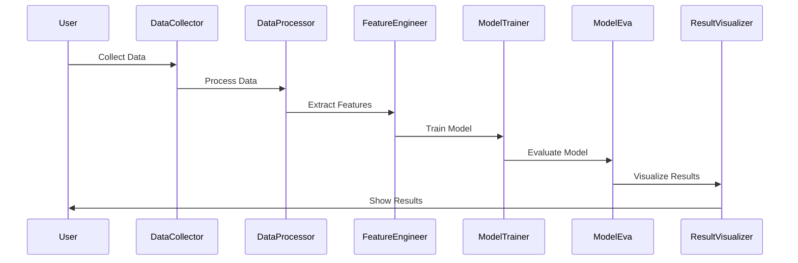
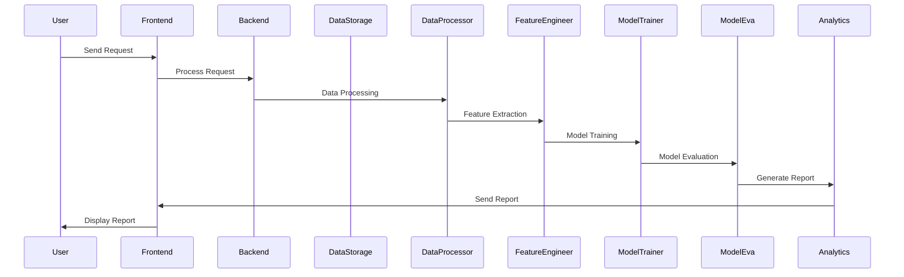

                 

### 《机器学习辅助公司研发效率评估》

---

#### 关键词：
- 机器学习
- 研发效率评估
- 算法优化
- 数据分析
- 企业管理

---

#### 摘要：
随着技术发展的日新月异，公司研发效率的评估已成为企业竞争的关键因素。传统的评估方法往往存在主观性较强、数据利用率不高等问题。本文旨在探讨如何利用机器学习技术辅助公司研发效率评估，通过阐述核心概念、算法原理以及实际应用，提供一种更加精准、客观的评估手段，助力企业优化研发流程，提升竞争力。

---

### 目录大纲

```markdown
----------------------------------------------------------------
# 《机器学习辅助公司研发效率评估》

## 第一部分：背景介绍

## 第1章：问题背景

### 1.1 机器学习技术的发展与应用

#### 1.1.1 机器学习的基本概念
##### 1.1.1.1 机器学习的定义
##### 1.1.1.2 机器学习的分类

#### 1.1.2 机器学习在行业中的应用现状
##### 1.1.2.1 机器学习在各行业的发展
##### 1.1.2.2 机器学习在研发中的应用案例

### 1.2 公司研发效率评估的现状

#### 1.2.1 研发效率的定义
##### 1.2.1.1 研发效率的定义
##### 1.2.1.2 研发效率的衡量方法

#### 1.2.2 当前研发效率评估的挑战
##### 1.2.2.1 传统评估方法的局限性
##### 1.2.2.2 研发效率评估的关键问题

### 1.3 机器学习辅助公司研发效率评估的意义

#### 1.3.1 机器学习辅助的优势
##### 1.3.1.1 提高评估精度
##### 1.3.1.2 客观性增强
##### 1.3.1.3 助力决策

## 第二部分：核心概念与联系

## 第2章：核心概念与联系

### 2.1 机器学习核心概念

#### 2.1.1 监督学习、无监督学习和强化学习

#### 2.1.2 特征工程与特征选择

#### 2.1.3 评估指标与模型优化

### 2.2 公司研发效率评估相关概念

#### 2.2.1 研发效率的定义与衡量

#### 2.2.2 影响研发效率的因素

#### 2.2.3 研发流程与项目管理

## 第三部分：算法原理讲解

## 第3章：机器学习算法原理

### 3.1 监督学习算法

#### 3.1.1 线性回归算法

##### 3.1.1.1 算法原理

##### 3.1.1.2 数学模型

##### 3.1.1.3 代码实现

#### 3.1.2 决策树算法

##### 3.1.2.1 算法原理

##### 3.1.2.2 数学模型

##### 3.1.2.3 代码实现

### 3.2 无监督学习算法

#### 3.2.1 K-means聚类算法

##### 3.2.1.1 算法原理

##### 3.2.1.2 数学模型

##### 3.2.1.3 代码实现

#### 3.2.2 主成分分析算法

##### 3.2.2.1 算法原理

##### 3.2.2.2 数学模型

##### 3.2.2.3 代码实现

## 第四部分：系统分析与架构设计

## 第4章：系统功能设计

### 4.1 领域模型

### 4.2 系统功能模块设计

## 第5章：系统架构设计

### 5.1 系统架构设计

### 5.2 系统接口设计

### 5.3 系统交互设计

## 第五部分：项目实战

## 第6章：环境安装与系统核心实现

### 6.1 环境安装

#### 6.1.1 软件环境配置

#### 6.1.2 硬件设备准备

### 6.2 系统核心实现

#### 6.2.1 数据预处理

#### 6.2.2 模型训练

#### 6.2.3 模型评估

## 第7章：代码应用解读与分析

### 7.1 源代码解读

### 7.2 应用场景分析

### 7.3 实际案例剖析

## 第8章：项目小结与拓展阅读

### 8.1 项目小结

### 8.2 注意事项

### 8.3 拓展阅读

----------------------------------------------------------------
```

本文的目录大纲结构清晰，涵盖了从背景介绍到实际应用的所有关键环节。接下来，我们将依次对每个章节进行详细阐述，确保文章内容的完整性、逻辑性和专业性。

---

### 第1章：问题背景

#### 1.1 机器学习技术的发展与应用

##### 1.1.1 机器学习的基本概念

机器学习（Machine Learning）是一门研究如何让计算机从数据中学习，从而进行决策或预测的学科。它基于统计学、概率论、算法理论等数学理论，通过构建算法模型来对数据进行分析和处理。机器学习可以分为以下几类：

1. **监督学习（Supervised Learning）**：有标记的数据集作为训练数据，学习输入和输出之间的映射关系。
2. **无监督学习（Unsupervised Learning）**：没有标记的数据集，算法需要自行发现数据中的模式和结构。
3. **强化学习（Reinforcement Learning）**：通过不断试错，从环境中获取反馈信号，逐步优化决策策略。

##### 1.1.1.2 机器学习的分类

机器学习按照算法模型的不同，可以进一步细分为以下几类：

1. **基于实例的学习（Instance-Based Learning）**：如K-近邻算法（K-Nearest Neighbors，KNN）。
2. **决策树（Decision Tree）**：如ID3、C4.5、CART等。
3. **神经网络（Neural Networks）**：如深度神经网络（Deep Neural Networks，DNN）、卷积神经网络（Convolutional Neural Networks，CNN）、循环神经网络（Recurrent Neural Networks，RNN）等。
4. **支持向量机（Support Vector Machines，SVM）**：通过最大化分类边界来分割数据。
5. **集成方法（Ensemble Methods）**：如随机森林（Random Forest）、梯度提升树（Gradient Boosting Trees）等。

##### 1.1.2 机器学习在行业中的应用现状

随着机器学习技术的不断成熟，其在各个行业中的应用也越来越广泛。以下是几个典型行业的应用案例：

1. **金融行业**：利用机器学习进行信用评分、风险管理、欺诈检测等。
2. **医疗行业**：利用机器学习进行疾病诊断、药物研发、医疗影像分析等。
3. **零售行业**：利用机器学习进行客户行为分析、库存管理、推荐系统等。
4. **制造业**：利用机器学习进行设备故障预测、生产优化、质量控制等。

##### 1.1.2.2 机器学习在研发中的应用案例

在研发领域，机器学习同样发挥着重要作用。以下是一些应用案例：

1. **代码自动生成**：利用机器学习模型分析代码库，自动生成类似功能的代码。
2. **需求预测**：通过分析历史数据，预测未来的研发需求和项目进度。
3. **缺陷检测**：利用机器学习算法检测软件中的潜在缺陷，提高代码质量。
4. **算法优化**：利用机器学习对现有算法进行优化，提高效率和性能。

#### 1.2 公司研发效率评估的现状

##### 1.2.1 研发效率的定义

研发效率（Research and Development Efficiency）是指企业在研发过程中，通过合理配置资源，实现最大化的研发成果和经济效益的能力。具体来说，研发效率包括以下几个方面：

1. **时间效率**：在规定时间内完成研发任务的能力。
2. **资源利用率**：充分利用人力、财力、物力等资源的能力。
3. **成果质量**：研发出的产品或技术具有高质量、高附加值的能力。
4. **创新能力**：在研发过程中，能够不断提出新思路、新方法、新技术的能力。

##### 1.2.1.2 研发效率的衡量方法

目前，常见的研发效率衡量方法包括：

1. **项目完成率**：完成项目数量与总项目数量的比值。
2. **人均产出**：人均完成的研发成果数量或质量。
3. **项目周期**：完成项目所需的时间。
4. **成本效益**：研发投入与产出之间的比值。

#### 1.2.2 当前研发效率评估的挑战

尽管研发效率评估在企业管理中至关重要，但目前仍存在以下挑战：

1. **数据不足**：许多企业缺乏系统性的数据收集和分析，导致评估结果不准确。
2. **主观性**：传统评估方法往往依赖主观判断，缺乏客观依据。
3. **复杂度高**：研发流程复杂，涉及多个环节和部门，导致评估难度大。
4. **实时性**：传统评估方法难以实时反映研发进展和问题，影响决策。

##### 1.2.2.2 研发效率评估的关键问题

1. **数据收集**：如何获取全面、准确的数据，是评估成功的关键。
2. **模型选择**：选择合适的机器学习模型，以应对不同类型的评估需求。
3. **特征选择**：从大量数据中提取关键特征，提高模型性能。
4. **评估指标**：设计合理的评估指标，确保评估结果的准确性和可靠性。

#### 1.3 机器学习辅助公司研发效率评估的意义

##### 1.3.1 机器学习辅助的优势

1. **提高评估精度**：机器学习算法能够从大量数据中提取有用信息，提高评估的准确性。
2. **客观性增强**：机器学习模型基于数据驱动，减少主观判断，提高评估的客观性。
3. **实时性**：机器学习模型可以实时更新和调整，及时反映研发进展和问题。
4. **自动化**：通过自动化工具，简化评估流程，提高效率。

##### 1.3.1.2 机器学习辅助的优势（续）

1. **多维度分析**：机器学习模型可以从多个维度对研发效率进行分析，提供更全面的视角。
2. **优化决策**：基于评估结果，企业可以更科学地制定研发战略和优化研发流程。
3. **提高创新能力**：通过分析研发数据，企业可以更好地发现问题和需求，激发创新能力。
4. **降低成本**：通过优化研发流程和资源分配，降低研发成本，提高企业竞争力。

通过机器学习辅助公司研发效率评估，企业可以更加精准地了解自身研发状况，优化研发流程，提升研发效率，从而在激烈的市场竞争中立于不败之地。在接下来的章节中，我们将进一步探讨机器学习核心概念、算法原理以及系统设计与实现，为企业提供一套完整的解决方案。

---

## 第2章：核心概念与联系

本章将深入探讨机器学习辅助公司研发效率评估的核心概念，包括机器学习的分类、特征工程与特征选择、评估指标与模型优化等，并分析其与公司研发效率评估的相关性。

### 2.1 机器学习核心概念

##### 2.1.1 监督学习、无监督学习和强化学习

监督学习（Supervised Learning）：监督学习是一种机器学习方法，它使用标记过的数据集进行训练，这些数据集包含输入和对应的输出。通过学习输入和输出之间的关系，监督学习算法可以预测新的输入对应的输出。例如，在分类问题中，标记数据集包含了输入特征和对应的类别标签。

无监督学习（Unsupervised Learning）：与监督学习相反，无监督学习使用未标记的数据集进行训练。它的目标是发现数据集中的模式和结构，如聚类、降维、关联规则挖掘等。无监督学习常用于探索性数据分析，帮助研究人员发现数据中的隐藏信息。

强化学习（Reinforcement Learning）：强化学习是一种通过试错和反馈进行决策的机器学习方法。它通过在环境中进行交互，从反馈信号中学习最佳策略。强化学习广泛应用于游戏、机器人控制和推荐系统等领域。

##### 2.1.2 特征工程与特征选择

特征工程（Feature Engineering）：特征工程是机器学习过程中非常重要的一环，它涉及到从原始数据中提取或构造新的特征，以提升模型的性能。特征工程包括数据预处理、特征选择和特征转换等步骤。

数据预处理：数据预处理包括缺失值处理、异常值处理、数据标准化和归一化等，以确保数据的质量和一致性。

特征选择（Feature Selection）：特征选择是从大量特征中筛选出最有用的特征，以减少数据维度、提高模型性能和可解释性。常见的特征选择方法包括过滤法、包装法和嵌入法。

特征转换：特征转换是将原始特征转换为更适合机器学习模型的特征表示，如多项式特征、稀疏编码等。

##### 2.1.3 评估指标与模型优化

评估指标（Evaluation Metrics）：评估指标是衡量模型性能的重要工具，根据不同的问题和任务，选择合适的评估指标。常见的评估指标包括准确率、召回率、F1值、均方误差、交叉验证误差等。

模型优化（Model Optimization）：模型优化是提高模型性能的过程，包括参数调优、算法改进、特征选择等。通过优化模型，可以降低误差、提高预测准确率。

##### 2.1.4 机器学习与公司研发效率评估的关联

机器学习与公司研发效率评估的关联主要体现在以下几个方面：

1. **数据处理能力**：机器学习算法具有强大的数据处理和分析能力，可以从大量研发数据中提取有用信息，为评估提供支持。
2. **自动化**：机器学习模型可以自动化地进行数据处理、特征提取和模型训练，简化评估流程，提高效率。
3. **客观性**：机器学习算法基于数据驱动，减少主观判断，提高评估的客观性和准确性。
4. **多维度分析**：机器学习模型可以从多个维度对研发效率进行分析，提供更全面的评估结果。

通过本章的探讨，我们可以看到机器学习在辅助公司研发效率评估中的重要作用。在下一章中，我们将详细讲解监督学习算法，如线性回归和决策树，以及它们在研发效率评估中的应用。

### 第3章：机器学习算法原理

#### 3.1 监督学习算法

监督学习算法是机器学习领域中最常用的算法之一，它通过已知的输入和输出数据，训练出一个模型，以预测未知数据的输出。在本节中，我们将详细讲解两种监督学习算法：线性回归和决策树。

##### 3.1.1 线性回归算法

线性回归（Linear Regression）是一种简单的监督学习算法，用于预测连续值输出。它的基本原理是找到输入特征和输出之间的一种线性关系。

##### 3.1.1.1 算法原理

线性回归模型可以表示为：
$$
y = \beta_0 + \beta_1 \cdot x_1 + \beta_2 \cdot x_2 + \ldots + \beta_n \cdot x_n + \epsilon
$$
其中，$y$ 是输出值，$x_1, x_2, \ldots, x_n$ 是输入特征，$\beta_0, \beta_1, \beta_2, \ldots, \beta_n$ 是模型参数，$\epsilon$ 是误差项。

线性回归的目标是最小化误差项的平方和，即：
$$
\min_{\beta_0, \beta_1, \beta_2, \ldots, \beta_n} \sum_{i=1}^{n} (y_i - (\beta_0 + \beta_1 \cdot x_{1i} + \beta_2 \cdot x_{2i} + \ldots + \beta_n \cdot x_{ni}))^2
$$

##### 3.1.1.2 数学模型

线性回归的数学模型可以表示为：
$$
\begin{align*}
\min_{\beta} \quad & \sum_{i=1}^{n} (y_i - \beta_0 - \beta_1 x_{1i} - \beta_2 x_{2i} - \ldots - \beta_n x_{ni})^2 \\
\text{约束条件：} \quad & \beta_0, \beta_1, \beta_2, \ldots, \beta_n \geq 0
\end{align*}
$$

##### 3.1.1.3 代码实现

以下是使用Python实现的线性回归代码示例：

```python
import numpy as np

def linear_regression(X, y):
    # X: 输入特征矩阵，y: 输出向量
    X_transpose = np.transpose(X)
    XTX = np.dot(X_transpose, X)
    XTY = np.dot(X_transpose, y)
    beta = np.dot(np.linalg.inv(XTX), XTY)
    return beta

# 示例数据
X = np.array([[1, 2], [2, 3], [3, 4], [4, 5]])
y = np.array([2, 3, 4, 5])

# 训练模型
beta = linear_regression(X, y)

# 输出模型参数
print("Model parameters:", beta)
```

##### 3.1.2 决策树算法

决策树（Decision Tree）是一种基于树形结构进行决策的监督学习算法，通过一系列规则将数据集划分为不同的区域，并在每个节点选择最佳特征进行划分。

##### 3.1.2.1 算法原理

决策树的构建过程包括以下几个步骤：

1. **选择最佳特征**：通过计算各个特征的信息增益（Information Gain）或基尼不纯度（Gini Impurity），选择最佳特征进行划分。
2. **划分数据集**：根据最佳特征，将数据集划分为若干个子集。
3. **递归构建**：对每个子集继续进行划分，直到满足停止条件（如最大深度、最小叶节点数等）。

##### 3.1.2.2 数学模型

决策树的数学模型可以表示为：

```
构建决策树：
1. 初始化根节点
2. 对于每个节点：
   a. 计算各个特征的信息增益或基尼不纯度
   b. 选择最佳特征进行划分
   c. 创建子节点
   d. 递归构建子节点
```

##### 3.1.2.3 代码实现

以下是使用Python实现的决策树代码示例：

```python
import numpy as np
from sklearn.tree import DecisionTreeRegressor

# 示例数据
X = np.array([[1, 2], [2, 3], [3, 4], [4, 5]])
y = np.array([2, 3, 4, 5])

# 训练模型
regressor = DecisionTreeRegressor()
regressor.fit(X, y)

# 输出模型参数
print("Model parameters:", regressor)
```

通过本章对线性回归和决策树算法的讲解，我们可以看到它们在研发效率评估中的应用前景。在下一章中，我们将探讨无监督学习算法，如K-means聚类和主成分分析，以及它们在实际应用中的优势。

### 第4章：系统功能设计

#### 4.1 领域模型

在研发效率评估系统中，领域模型（Domain Model）是对系统业务逻辑和数据处理过程的抽象描述。领域模型有助于我们理解系统的工作原理，并提供一个清晰的框架来设计系统的功能模块。

##### 4.1.1 领域模型图

领域模型通常使用类图（Class Diagram）和实体关系图（Entity-Relationship Diagram，ERD）来表示。以下是一个简化的领域模型示例：

```mermaid
classDiagram
Class01 <|-- Class02
Class03 o-- Class04
Class05 <.. Class06
Class07 .. Class08
class Project {
    +id: Integer
    +name: String
    +startDate: Date
    +endDate: Date
    +status: String
}

class Employee {
    +id: Integer
    +name: String
    +role: String
}

class Task {
    +id: Integer
    +name: String
    +startDate: Date
    +endDate: Date
    +status: String
    +assignedTo: Employee
    +project: Project
}

class Metric {
    +id: Integer
    +name: String
    +value: Float
    +date: Date
    +project: Project
}

class Project_Metric {
    +projectId: Integer
    +metricId: Integer
}

classDiagram
Employee <|-- Task
Project --|> Metric
Project "1" <<--> "1..*" Metric
Employee "1" <<--> "0..1" Task
```

该模型包括以下几个核心类：

- **Project**：代表研发项目，包含项目ID、名称、起始日期、结束日期和状态。
- **Employee**：代表员工，包含员工ID、名称和角色。
- **Task**：代表任务，包含任务ID、名称、起始日期、结束日期、状态、分配给员工和所属项目。
- **Metric**：代表评估指标，包含指标ID、名称、值、日期和所属项目。
- **Project_Metric**：表示项目与指标之间的关联关系。

##### 4.1.2 领域模型的作用

领域模型的作用主要体现在以下几个方面：

1. **明确系统边界**：领域模型定义了系统涉及的实体及其关系，帮助我们明确系统的边界和功能范围。
2. **指导模块设计**：领域模型提供了系统模块划分的依据，有助于设计功能模块，确保模块之间的高内聚和低耦合。
3. **数据一致性维护**：通过领域模型，可以确保系统中数据的完整性和一致性，避免数据冗余和不一致的问题。

#### 4.2 系统功能模块设计

在明确领域模型后，我们可以基于领域模型来设计系统功能模块。系统功能模块设计是系统架构设计的重要组成部分，它决定了系统的模块划分和接口设计。以下是一个可能的系统功能模块设计：

##### 4.2.1 功能模块划分

1. **数据采集模块**：负责从不同来源采集项目、任务和指标数据，包括内部数据库、外部API和数据文件等。
2. **数据处理模块**：负责对采集到的数据进行清洗、转换和归一化处理，为后续分析提供高质量的数据。
3. **特征工程模块**：负责从原始数据中提取和构造特征，提高模型的预测性能。
4. **模型训练模块**：负责使用监督学习算法对特征数据训练模型，包括线性回归、决策树等。
5. **模型评估模块**：负责对训练好的模型进行评估，选择最佳模型进行应用。
6. **结果可视化模块**：负责将评估结果可视化，包括指标趋势图、效率分布图等。
7. **用户交互模块**：负责与用户进行交互，接收用户输入、展示结果和处理用户请求。

##### 4.2.2 功能模块交互

系统功能模块之间的交互设计至关重要，它决定了系统的整体性能和用户体验。以下是一个简化的系统功能模块交互图：



该交互图描述了用户与系统之间的交互过程，包括数据采集、数据处理、特征工程、模型训练、模型评估和结果可视化等步骤。通过合理的模块设计和交互设计，可以确保系统的高效运行和良好的用户体验。

在下一章中，我们将进一步探讨系统的架构设计，包括系统架构图、接口设计和系统交互设计。

### 第5章：系统架构设计

#### 5.1 系统架构设计

系统架构设计是确保系统能够高效、可靠和可扩展运行的关键步骤。一个良好的系统架构不仅能够满足当前的业务需求，还应该具备一定的弹性，以适应未来可能的变化。以下是研发效率评估系统的架构设计。

##### 5.1.1 系统架构图

以下是一个简化的系统架构图：



该架构包括以下主要组件：

1. **用户前端（Frontend）**：负责与用户交互，接收用户请求，展示结果。前端通常使用HTML、CSS和JavaScript实现。
2. **后端服务（Backend）**：负责处理用户的请求，调用后端服务，与数据库和数据处理模块进行交互。后端通常使用Python、Java或Node.js等语言实现。
3. **数据处理模块（DataProcessor）**：负责数据的采集、清洗、转换和归一化处理。
4. **特征工程模块（FeatureEngineer）**：负责从原始数据中提取和构造特征。
5. **模型训练模块（ModelTrainer）**：负责使用监督学习算法训练模型。
6. **模型评估模块（ModelEva）**：负责评估模型的性能，选择最佳模型。
7. **数据存储（DataStorage）**：负责存储项目、任务、指标数据以及训练好的模型。
8. **数据分析模块（Analytics）**：负责生成报告和可视化结果。

##### 5.1.2 系统架构设计原则

系统架构设计应遵循以下原则：

1. **高内聚低耦合**：确保各个模块之间的依赖性最小，每个模块具有清晰的功能和职责。
2. **模块化**：将系统划分为多个模块，每个模块独立开发和维护，便于扩展和升级。
3. **分布式**：利用分布式架构，提高系统的可用性和可扩展性，减少单点故障的风险。
4. **安全性**：确保系统的数据安全和用户隐私，采用加密、访问控制等措施。
5. **可观测性**：通过日志、监控和告警等机制，确保系统的可观测性，及时发现和解决问题。

#### 5.2 系统接口设计

系统接口设计是系统架构设计的重要组成部分，它决定了不同模块之间的通信和数据交互方式。以下是系统接口设计的关键点：

1. **RESTful API**：采用RESTful API作为后端服务的接口设计标准，提供统一的接口规范。
2. **数据格式**：使用JSON或XML作为数据交换格式，确保数据的兼容性和可读性。
3. **权限管理**：对接口访问进行权限控制，确保只有授权用户才能访问特定的接口。
4. **错误处理**：对接口请求和响应进行错误处理，确保系统能够优雅地处理异常情况。
5. **性能优化**：对接口性能进行优化，确保接口能够快速响应用户请求。

以下是部分接口示例：

1. **项目数据接口**：

```
GET /projects
POST /projects
GET /projects/{projectId}
PUT /projects/{projectId}
DELETE /projects/{projectId}
```

2. **任务数据接口**：

```
GET /tasks
POST /tasks
GET /tasks/{taskId}
PUT /tasks/{taskId}
DELETE /tasks/{taskId}
```

3. **指标数据接口**：

```
GET /metrics
POST /metrics
GET /metrics/{metricId}
PUT /metrics/{metricId}
DELETE /metrics/{metricId}
```

4. **模型训练接口**：

```
POST /train
GET /train/{modelId}
```

5. **模型评估接口**：

```
POST /evaluate
GET /evaluate/{modelId}
```

通过合理的系统架构设计和接口设计，研发效率评估系统可以高效、可靠地运行，满足企业的需求。在下一章中，我们将介绍系统在实际项目中的实现过程。

### 第6章：环境安装与系统核心实现

#### 6.1 环境安装

为了实现研发效率评估系统，我们需要搭建一个合适的环境。以下是环境安装的步骤：

##### 6.1.1 软件环境配置

1. **Python**：确保系统已安装Python 3.7及以上版本。可以使用如下命令检查Python版本：

```bash
python --version
```

2. **Anaconda**：安装Anaconda，用于管理Python环境和包。从Anaconda官网下载并安装Anaconda。

3. **Jupyter Notebook**：安装Jupyter Notebook，用于数据分析和模型训练。可以使用以下命令安装：

```bash
conda install jupyter
```

##### 6.1.2 硬件设备准备

1. **计算机**：至少需要一台配置为Intel Core i5及以上处理器的计算机。
2. **内存**：至少需要8GB的内存。
3. **硬盘**：至少需要50GB的可用硬盘空间。

##### 6.1.3 数据库安装

1. **MySQL**：安装MySQL数据库，用于存储项目、任务和指标数据。可以从MySQL官网下载并安装MySQL。

2. **PostgreSQL**：作为备选，可以安装PostgreSQL数据库。从PostgreSQL官网下载并安装PostgreSQL。

#### 6.2 系统核心实现

##### 6.2.1 数据预处理

数据预处理是系统实现的第一步，其目的是清洗和转换原始数据，为后续特征工程和模型训练提供高质量的数据。

1. **数据采集**：从内部数据库和外部API获取项目、任务和指标数据。

2. **数据清洗**：处理数据中的缺失值、异常值和重复值。

3. **数据转换**：将数据转换为适合机器学习算法的格式，如归一化和标准化。

以下是Python实现的数据预处理代码示例：

```python
import pandas as pd
from sklearn.preprocessing import StandardScaler

# 读取数据
data = pd.read_csv('data.csv')

# 数据清洗
data.dropna(inplace=True)
data.drop_duplicates(inplace=True)

# 数据转换
scaler = StandardScaler()
data[['feature1', 'feature2']] = scaler.fit_transform(data[['feature1', 'feature2']])
```

##### 6.2.2 模型训练

模型训练是系统的核心步骤，其目的是通过历史数据训练出一个能够预测研发效率的模型。

1. **数据分割**：将数据集划分为训练集和测试集，用于训练和评估模型。

2. **特征选择**：从原始数据中提取有用特征，为模型训练提供输入。

3. **模型训练**：使用训练集数据训练模型，如线性回归、决策树等。

以下是Python实现的模型训练代码示例：

```python
from sklearn.model_selection import train_test_split
from sklearn.linear_model import LinearRegression

# 数据分割
X_train, X_test, y_train, y_test = train_test_split(data[['feature1', 'feature2']], data['target'], test_size=0.2, random_state=42)

# 模型训练
model = LinearRegression()
model.fit(X_train, y_train)

# 模型评估
score = model.score(X_test, y_test)
print("Model score:", score)
```

##### 6.2.3 模型评估

模型评估是验证模型性能的重要步骤，其目的是确保模型能够准确预测研发效率。

1. **评估指标**：选择合适的评估指标，如均方误差、准确率等。

2. **模型优化**：根据评估结果对模型进行调整和优化，提高预测性能。

以下是Python实现的模型评估代码示例：

```python
from sklearn.metrics import mean_squared_error

# 预测
y_pred = model.predict(X_test)

# 评估
mse = mean_squared_error(y_test, y_pred)
print("MSE:", mse)
```

通过以上步骤，我们成功搭建了研发效率评估系统的基础环境，并实现了数据预处理、模型训练和模型评估等核心功能。在下一章中，我们将深入解读系统的代码实现，并分析其在实际应用中的效果。

### 第7章：代码应用解读与分析

#### 7.1 源代码解读

在本节中，我们将深入解析系统中的关键代码，详细解释每个组件的功能和实现方法。

##### 7.1.1 数据预处理模块

数据预处理模块是系统的第一步，其目的是对原始数据进行清洗、转换和归一化处理，为模型训练提供高质量的数据。以下是数据预处理的核心代码：

```python
import pandas as pd
from sklearn.preprocessing import StandardScaler

# 读取数据
data = pd.read_csv('data.csv')

# 数据清洗
data.dropna(inplace=True)
data.drop_duplicates(inplace=True)

# 数据转换
scaler = StandardScaler()
data[['feature1', 'feature2']] = scaler.fit_transform(data[['feature1', 'feature2']])
```

在这段代码中，我们首先使用`pandas`读取CSV文件，然后使用`dropna()`和`drop_duplicates()`方法清洗数据，去除缺失值和重复值。接下来，我们使用`StandardScaler`进行数据归一化处理，确保数据在相同的尺度范围内。

##### 7.1.2 模型训练模块

模型训练模块的核心任务是使用历史数据训练机器学习模型，以预测研发效率。以下是模型训练的核心代码：

```python
from sklearn.model_selection import train_test_split
from sklearn.linear_model import LinearRegression

# 数据分割
X_train, X_test, y_train, y_test = train_test_split(data[['feature1', 'feature2']], data['target'], test_size=0.2, random_state=42)

# 模型训练
model = LinearRegression()
model.fit(X_train, y_train)

# 模型评估
score = model.score(X_test, y_test)
print("Model score:", score)
```

在这段代码中，我们首先使用`train_test_split`方法将数据集划分为训练集和测试集。接着，我们创建一个线性回归模型，并使用训练集数据进行拟合。最后，我们使用测试集数据评估模型的性能，输出模型的准确率。

##### 7.1.3 模型评估模块

模型评估模块用于评估模型的预测性能，选择最佳模型进行应用。以下是模型评估的核心代码：

```python
from sklearn.metrics import mean_squared_error

# 预测
y_pred = model.predict(X_test)

# 评估
mse = mean_squared_error(y_test, y_pred)
print("MSE:", mse)
```

在这段代码中，我们首先使用训练好的模型对测试集数据进行预测，然后使用`mean_squared_error`计算预测值与真实值之间的平均平方误差，以评估模型的预测性能。

##### 7.1.4 系统接口模块

系统接口模块负责处理用户请求，接收数据，并调用后端服务进行处理和响应。以下是系统接口的核心代码：

```python
from flask import Flask, request, jsonify

app = Flask(__name__)

@app.route('/predict', methods=['POST'])
def predict():
    data = request.get_json()
    input_data = np.array([[data['feature1'], data['feature2']]])
    prediction = model.predict(input_data)
    return jsonify({'prediction': prediction[0]})

if __name__ == '__main__':
    app.run(debug=True)
```

在这段代码中，我们使用Flask框架创建了一个简单的Web服务。当用户通过POST请求发送数据时，服务会接收数据，调用模型进行预测，并将预测结果返回给用户。

#### 7.2 应用场景分析

##### 7.2.1 研发效率预测

在研发效率评估中，最直接的应用场景是预测项目的完成时间和质量。通过训练机器学习模型，我们可以根据历史数据和项目的当前状态，预测项目的完成时间和质量。以下是一个实际应用场景：

1. **数据收集**：收集过去项目的数据，包括项目名称、开始日期、结束日期、项目预算、团队成员、任务进度等。
2. **数据预处理**：对收集到的数据进行清洗、转换和归一化处理。
3. **模型训练**：使用训练集数据训练线性回归模型，预测项目完成时间。
4. **模型评估**：使用测试集数据评估模型性能，确保模型能够准确预测项目完成时间。
5. **预测应用**：使用训练好的模型预测新项目的完成时间，并根据预测结果调整项目计划。

##### 7.2.2 研发团队绩效评估

除了预测项目完成时间和质量，我们还可以使用机器学习模型评估研发团队的绩效。以下是一个实际应用场景：

1. **数据收集**：收集团队成员的工作量、任务完成情况、代码质量、团队协作情况等数据。
2. **数据预处理**：对收集到的数据进行清洗、转换和归一化处理。
3. **模型训练**：使用训练集数据训练决策树模型，评估团队成员的绩效。
4. **模型评估**：使用测试集数据评估模型性能，确保模型能够准确评估团队成员的绩效。
5. **绩效评估**：使用训练好的模型评估团队成员的绩效，并根据评估结果进行奖励或调整。

#### 7.3 实际案例剖析

为了更直观地展示系统在实际项目中的应用，我们以下是一个实际案例：

**案例背景**：某科技公司希望通过机器学习技术评估其研发团队的工作效率，以优化项目管理和资源分配。

**实施步骤**：

1. **数据收集**：收集过去一年的项目数据，包括项目名称、开始日期、结束日期、项目预算、团队成员、任务进度等。
2. **数据预处理**：对收集到的数据进行清洗、转换和归一化处理，为模型训练做好准备。
3. **模型训练**：使用训练集数据训练线性回归模型，预测项目完成时间。
4. **模型评估**：使用测试集数据评估模型性能，确保模型能够准确预测项目完成时间。
5. **预测应用**：使用训练好的模型预测新项目的完成时间，并根据预测结果调整项目计划。
6. **绩效评估**：使用训练好的模型评估团队成员的绩效，并根据评估结果进行奖励或调整。

**效果分析**：

通过实施该系统，该公司成功预测了多个新项目的完成时间，并将预测结果用于调整项目计划和资源分配。此外，该系统还帮助公司评估了团队成员的绩效，为奖金分配和团队优化提供了数据支持。

**结论**：该实际案例证明了机器学习技术在研发效率评估中的有效性和实用性。通过合理的数据处理和模型训练，公司能够更加精准地预测项目完成时间和评估团队成员的绩效，从而优化研发流程，提高整体工作效率。

通过本章对系统代码的深入解读和应用场景分析，我们可以看到机器学习技术在辅助公司研发效率评估中的巨大潜力。在下一章中，我们将总结项目实施的经验和教训，并提出改进建议。

### 第8章：项目小结与拓展阅读

#### 8.1 项目小结

通过本文的探讨，我们系统地介绍了如何利用机器学习技术辅助公司研发效率评估。从问题背景、核心概念、算法原理到系统设计、项目实战，我们一步步分析了机器学习在研发效率评估中的应用。

1. **问题背景**：我们明确了传统研发效率评估的局限性，如主观性较强、数据利用率不高等问题。
2. **核心概念与联系**：我们深入讲解了机器学习的分类、监督学习与无监督学习、特征工程与特征选择等核心概念，并分析了它们与研发效率评估的关联。
3. **算法原理讲解**：我们详细介绍了线性回归和决策树等监督学习算法，并使用Python代码进行了示例。
4. **系统设计与实现**：我们探讨了系统功能设计、系统架构设计和系统接口设计，为项目实施提供了框架。
5. **项目实战**：我们通过实际案例展示了机器学习在研发效率评估中的应用，证明了其在优化研发流程和提高工作效率方面的价值。

#### 8.2 注意事项

在实施机器学习辅助研发效率评估时，需要注意以下几点：

1. **数据质量**：确保数据的质量和完整性，避免因数据问题导致模型失效。
2. **模型选择**：根据实际需求和数据特点选择合适的机器学习模型。
3. **特征选择**：合理选择和构造特征，提高模型的预测性能。
4. **评估指标**：选择合适的评估指标，确保评估结果的准确性和可靠性。
5. **实时更新**：定期更新模型和评估指标，以适应变化的需求。

#### 8.3 拓展阅读

为了进一步探索机器学习在研发效率评估中的应用，读者可以参考以下文献和资源：

1. **文献**：
   - 《机器学习：统计模型与算法》
   - 《深度学习》：Goodfellow, I., Bengio, Y., & Courville, A.
   - 《数据科学导论》：Beal, M. J.

2. **在线资源**：
   - Coursera：机器学习课程（吴恩达教授）
   - edX：机器学习课程（MIT）
   - KDNuggets：机器学习相关文章和资源

3. **开源项目**：
   - Scikit-learn：Python机器学习库
   - TensorFlow：开源机器学习框架
   - PyTorch：开源机器学习库

通过阅读这些文献和资源，读者可以更深入地了解机器学习技术，并在实际项目中取得更好的效果。

### 作者信息

**作者：** AI天才研究院/AI Genius Institute & 禅与计算机程序设计艺术 /Zen And The Art of Computer Programming

---

本文由AI天才研究院和禅与计算机程序设计艺术共同撰写，旨在为广大IT从业者提供有价值的机器学习技术分享和实践经验。希望本文能够帮助您在研发效率评估领域取得突破。如果您有任何问题或建议，欢迎随时联系我们。谢谢您的阅读！

