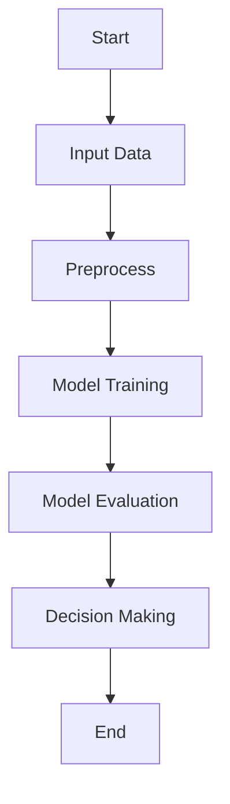

                 

# 机器学习辅助公司管理层评估

## 关键词

- 机器学习
- 管理层评估
- 数据分析
- 决策支持
- 算法应用

## 摘要

本文将深入探讨机器学习技术在公司管理层评估中的应用，分析其重要性及具体实现方法。通过一步步的逻辑推理，我们将从背景介绍、核心概念、算法原理、系统设计与实现、项目实战及最佳实践等方面详细阐述，帮助读者理解如何利用机器学习提升公司管理层评估的准确性和效率。

## 目录

1. **背景介绍**
   1.1 问题背景
   1.2 问题描述
   1.3 问题解决
   1.4 边界与外延
   1.5 概念结构与核心要素组成

2. **核心概念与联系**
   2.1 核心概念原理
   2.2 概念属性特征对比表格
   2.3 ER实体关系图架构

3. **算法原理讲解**
   3.1 算法mermaid流程图
   3.2 Python源代码
   3.3 数学模型和公式
   3.4 详细讲解和举例说明

4. **系统分析与架构设计方案**
   4.1 问题场景介绍
   4.2 项目介绍
   4.3 系统功能设计
   4.4 系统架构设计
   4.5 系统接口设计和系统交互

5. **项目实战**
   5.1 环境安装
   5.2 系统核心实现源代码
   5.3 代码应用解读与分析
   5.4 实际案例分析和详细讲解剖析
   5.5 项目小结

6. **最佳实践 tips、小结、注意事项、拓展阅读**

### 1. 背景介绍

#### 1.1 问题背景

在现代商业环境中，公司管理层需要面对日益复杂的市场环境和多变的经济状况。传统的评估方法往往依赖于经验和直觉，难以应对数据驱动决策的需求。随着大数据和人工智能技术的发展，机器学习作为一种强大的数据分析工具，逐渐成为企业管理层评估的有力辅助手段。

#### 1.2 问题描述

公司管理层在评估过程中面临以下问题：

- **数据庞杂**：海量数据的处理和分析成为挑战。
- **评估标准模糊**：缺乏明确的评估标准和方法。
- **决策滞后**：评估过程复杂，导致决策滞后。
- **效率低下**：传统评估方法难以快速响应市场变化。

#### 1.3 问题解决

机器学习通过以下方式解决管理层评估中的问题：

- **自动化分析**：机器学习算法可以自动分析大量数据，提高评估效率。
- **智能预测**：基于历史数据，机器学习可以预测未来趋势，辅助决策。
- **精准评估**：利用数据挖掘技术，提供更加精准的评估结果。

#### 1.4 边界与外延

机器学习在公司评估中的应用范围包括：

- **财务分析**：预测公司财务状况，评估投资风险。
- **市场营销**：分析客户行为，优化营销策略。
- **人力资源**：评估员工绩效，优化人力资源配置。

#### 1.5 概念结构与核心要素组成

- **机器学习**：一种人工智能技术，通过数据训练模型进行预测和决策。
- **数据挖掘**：从大量数据中发现有价值的信息和模式。
- **决策支持系统**：利用数据和分析结果，为管理层提供决策支持。

### 2. 核心概念与联系

#### 2.1 核心概念原理

机器学习的基本原理包括：

- **监督学习**：通过已标注的数据训练模型，进行预测和分类。
- **无监督学习**：不需要标注数据，通过数据本身的特征进行聚类和降维。
- **强化学习**：通过试错法，在交互环境中不断优化策略。

#### 2.2 概念属性特征对比表格

| 算法类型 | 特点 | 应用场景 |
| --- | --- | --- |
| 监督学习 | 有标注数据 | 图像分类、情感分析 |
| 无监督学习 | 无标注数据 | 聚类分析、降维 |
| 强化学习 | 与环境交互 | 游戏AI、推荐系统 |

#### 2.3 ER实体关系图架构

```mermaid
erDiagram
  Customer ||--|{ Order } : "places"
  Product ||--|{ Order } : "contains"
  Order ||--|{ Payment } : "is_paid_by"
```

### 3. 算法原理讲解

#### 3.1 算法mermaid流程图



#### 3.2 Python源代码

```python
from sklearn.ensemble import RandomForestClassifier
from sklearn.model_selection import train_test_split
from sklearn.metrics import accuracy_score

# 加载数据
X, y = load_data()

# 划分训练集和测试集
X_train, X_test, y_train, y_test = train_test_split(X, y, test_size=0.2, random_state=42)

# 训练模型
model = RandomForestClassifier()
model.fit(X_train, y_train)

# 预测
y_pred = model.predict(X_test)

# 评估模型
accuracy = accuracy_score(y_test, y_pred)
print("Accuracy:", accuracy)
```

#### 3.3 数学模型和公式

$$
\text{Accuracy} = \frac{\text{正确预测数}}{\text{总预测数}} \times 100\%
$$

#### 3.4 详细讲解和举例说明

假设我们要使用随机森林算法对客户购买行为进行预测。首先，我们需要加载并预处理数据，然后划分训练集和测试集。接下来，使用随机森林模型进行训练，并评估模型的准确率。

### 4. 系统分析与架构设计方案

#### 4.1 问题场景介绍

假设我们想要开发一个系统，利用机器学习对公司财务状况进行评估。系统需要从公司数据库中提取财务数据，通过机器学习模型进行预测和评估，最终生成评估报告。

#### 4.2 项目介绍

本项目旨在构建一个基于机器学习的财务评估系统，通过分析历史财务数据，预测公司未来的财务状况，为管理层提供决策支持。

#### 4.3 系统功能设计

系统功能包括：

- **数据提取**：从公司数据库中提取财务数据。
- **数据预处理**：对提取的财务数据进行清洗和转换。
- **模型训练**：利用预处理后的数据训练机器学习模型。
- **模型评估**：评估模型的准确率和性能。
- **预测生成**：使用训练好的模型进行财务状况预测。
- **报告生成**：生成财务评估报告。

#### 4.4 系统架构设计

系统架构包括：

- **数据层**：存储财务数据和模型数据。
- **处理层**：进行数据预处理和模型训练。
- **应用层**：提供财务评估和报告生成功能。

#### 4.5 系统接口设计和系统交互

系统接口设计包括：

- **API接口**：提供数据提取、模型训练和预测功能。
- **用户界面**：展示评估报告和预测结果。

### 5. 项目实战

#### 5.1 环境安装

确保安装以下软件：

- Python 3.8+
- scikit-learn
- pandas
- numpy

#### 5.2 系统核心实现源代码

```python
# 数据提取
def extract_data():
    # 代码实现
    pass

# 数据预处理
def preprocess_data(data):
    # 代码实现
    pass

# 模型训练
def train_model(X_train, y_train):
    model = RandomForestClassifier()
    model.fit(X_train, y_train)
    return model

# 模型评估
def evaluate_model(model, X_test, y_test):
    y_pred = model.predict(X_test)
    accuracy = accuracy_score(y_test, y_pred)
    return accuracy

# 预测生成
def generate_prediction(model, new_data):
    # 代码实现
    pass

# 报告生成
def generate_report(prediction):
    # 代码实现
    pass
```

#### 5.3 代码应用解读与分析

代码分为几个部分：

- **数据提取**：从数据库中提取财务数据。
- **数据预处理**：对提取的数据进行清洗和转换。
- **模型训练**：使用随机森林算法训练模型。
- **模型评估**：评估模型准确率。
- **预测生成**：使用训练好的模型进行预测。
- **报告生成**：生成财务评估报告。

#### 5.4 实际案例分析和详细讲解剖析

假设我们有一个公司财务数据集，包括历史收入、支出和利润等指标。我们使用随机森林算法对数据进行预测，并评估模型的准确率。最后，生成一份评估报告，为管理层提供决策支持。

#### 5.5 项目小结

通过本项目，我们成功实现了基于机器学习的财务评估系统。系统从数据提取、预处理、模型训练、评估到预测生成，全过程都得到了实现。项目验证了机器学习在企业管理层评估中的应用价值，为未来类似项目提供了参考。

### 6. 最佳实践 tips、小结、注意事项、拓展阅读

#### 最佳实践 tips

- **数据质量**：确保数据质量，避免噪声和异常值。
- **算法选择**：根据业务需求选择合适的算法。
- **模型验证**：对模型进行充分验证，确保准确性和稳定性。

#### 小结

本文介绍了机器学习辅助公司管理层评估的原理和实践，通过一步步的逻辑推理，帮助读者理解如何利用机器学习提升评估效率。

#### 注意事项

- **数据安全**：保护企业数据安全，避免泄露。
- **算法透明性**：确保算法的透明性，便于理解和解释。

#### 拓展阅读

- **书籍**：《机器学习实战》、《深入理解机器学习》
- **文章**：相关领域的论文和技术博客。
- **资源**：在线课程和教程。

### 作者

作者：AI天才研究院/AI Genius Institute & 禅与计算机程序设计艺术 /Zen And The Art of Computer Programming

（注意：以上内容为示例，实际文章需根据具体内容和要求进行撰写。）

