                 

# 机器学习预测公司盈利质量变化

关键词：机器学习、盈利质量、预测、算法、金融

摘要：随着机器学习技术的不断进步，其在金融领域的应用日益广泛，尤其是在预测公司盈利质量变化方面。本文将深入探讨盈利质量变化的定义、重要性、预测挑战及其解决方案，详细讲解监督学习、无监督学习和强化学习在盈利质量变化预测中的应用，并探讨多种算法结合的综合应用策略。此外，本文将通过实际案例展示机器学习在盈利质量变化预测中的实战应用，最后提出最佳实践技巧和未来研究方向。

## 第一部分: 问题背景与核心概念

### 第1章: 问题背景介绍

#### 1.1 问题背景

机器学习的崛起：随着计算能力的提升和数据量的爆炸式增长，机器学习技术已经成为现代数据分析的重要工具。从简单的线性回归到复杂的深度学习模型，机器学习在各个领域都展现出了强大的预测能力。

金融市场的重要性：金融市场的稳定运行对于全球经济的影响至关重要。而公司的盈利质量变化是金融市场波动的重要指标之一。准确预测公司的盈利质量变化，对于投资者、监管机构和公司自身都具有重要的意义。

盈利质量变化的复杂性：盈利质量变化受到多种因素的影响，包括宏观经济环境、市场供需关系、公司内部运营状况等。这使得盈利质量变化的预测变得复杂且具有挑战性。

### 1.2 问题描述

盈利质量变化的定义：盈利质量是指公司在特定时期内创造的净利润与收入之比，它反映了公司的盈利能力和市场竞争力。

盈利质量变化的重要性：盈利质量变化是公司财务健康的重要指标，对于投资者来说，它是评估公司价值和投资风险的重要依据。对于公司自身来说，了解盈利质量变化有助于制定有效的战略规划。

盈利质量变化预测的挑战：盈利质量变化受到多种复杂因素的影响，如市场波动、政策变化、公司内部管理问题等。这使得预测盈利质量变化成为一个极具挑战性的任务。

### 1.3 问题解决

机器学习在盈利质量变化预测中的应用：机器学习技术可以通过分析大量的历史数据，识别出影响盈利质量变化的因素，并建立预测模型。这些模型可以帮助投资者和公司更好地预测未来的盈利质量变化，从而做出更为明智的决策。

盈利质量变化预测的关键步骤：

1. 数据收集：收集与公司盈利质量变化相关的历史数据，包括财务报表、市场数据、宏观经济数据等。
2. 数据预处理：对收集到的数据进行分析，处理缺失值、异常值等，确保数据质量。
3. 特征提取：从原始数据中提取出对盈利质量变化有重要影响的特征。
4. 模型选择：选择合适的机器学习算法，如监督学习、无监督学习和强化学习，建立预测模型。
5. 模型训练：使用历史数据对模型进行训练，调整模型参数，使其达到最佳性能。
6. 模型评估：使用验证数据集对模型进行评估，确保其预测能力。
7. 预测：使用训练好的模型对未来的盈利质量变化进行预测。

### 1.4 边界与外延

盈利质量变化的边界：盈利质量变化是公司盈利能力的变化，它包括盈利能力增强、盈利能力减弱以及盈利能力保持不变等情况。

机器学习算法的选择：选择适合的机器学习算法对于盈利质量变化的预测至关重要。常见的算法包括线性回归、决策树、支持向量机、神经网络和深度学习等。不同的算法有不同的优缺点，需要根据具体问题和数据特点进行选择。

### 1.5 概念结构与核心要素组成

机器学习的基本概念：机器学习是一种通过算法从数据中自动学习和发现模式的技术。它包括监督学习、无监督学习和强化学习等不同类型。

盈利质量变化的核心要素：盈利质量变化的核心要素包括公司的财务状况、市场环境、宏观经济状况以及公司内部管理等多个方面。这些要素相互作用，共同影响公司的盈利质量。

## 第2章: 核心概念与联系

### 2.1 机器学习基本原理

#### 监督学习

监督学习是一种从标注数据中学习模式的方法。它通过输入和输出之间的映射关系来建立预测模型。

- **算法原理**：监督学习算法通过学习训练数据集中的输入和输出关系，从而预测新的输入对应的输出。常见的监督学习算法包括线性回归、逻辑回归、决策树、支持向量机和神经网络等。

- **mermaid流程图**：

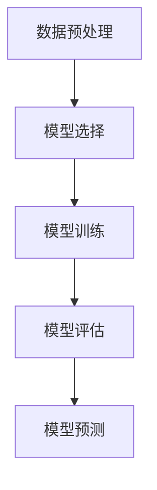

- **Python源代码实现**：

```python
# 导入必要的库
import numpy as np
from sklearn.linear_model import LinearRegression

# 假设我们已经有了训练数据X和标签y
X = ... # 特征数据
y = ... # 标签数据

# 创建线性回归模型
model = LinearRegression()

# 训练模型
model.fit(X, y)

# 预测
predictions = model.predict(X)

# 输出预测结果
print(predictions)
```

- **数学模型与公式**：

线性回归模型的数学表达式为：

$$y = \beta_0 + \beta_1 \cdot x + \epsilon$$

其中，$y$ 是输出，$x$ 是输入，$\beta_0$ 和 $\beta_1$ 是模型的参数，$\epsilon$ 是误差。

- **通俗易懂的举例说明**：

假设我们想要预测一家公司的盈利质量（输出），我们可以使用其历史财务数据（输入）来训练一个线性回归模型。通过模型的参数，我们可以预测新的一期盈利质量。

#### 无监督学习

无监督学习是一种从未标注数据中学习模式的方法。它主要用于发现数据中的隐藏结构和规律。

- **算法原理**：无监督学习算法通过分析数据内部的分布和模式，自动识别数据的结构和关联。常见的无监督学习算法包括聚类、主成分分析和自编码器等。

- **mermaid流程图**：


- **Python源代码实现**：

```python
# 导入必要的库
import numpy as np
from sklearn.cluster import KMeans

# 假设我们已经有了训练数据X
X = ... # 特征数据

# 创建K均值聚类模型
model = KMeans(n_clusters=3)

# 训练模型
model.fit(X)

# 预测
predictions = model.predict(X)

# 输出预测结果
print(predictions)
```

- **数学模型与公式**：

K均值聚类的数学表达式为：

$$\text{Cluster}(x) = \arg\min_{c} \sum_{i=1}^{n} \Vert x_i - c \Vert^2$$

其中，$x_i$ 是数据点，$c$ 是聚类中心。

- **通俗易懂的举例说明**：

假设我们有一组未标注的财务数据，我们想要将其分为几个类别。我们可以使用K均值聚类算法来发现这些数据的隐藏结构，并给出每个数据点的类别标签。

#### 强化学习

强化学习是一种通过与环境交互来学习最佳策略的方法。它主要用于决策问题。

- **算法原理**：强化学习算法通过不断尝试不同的策略，并根据环境的反馈调整策略，从而找到最佳策略。常见的强化学习算法包括Q学习、策略梯度和深度强化学习。

- **mermaid流程图**：

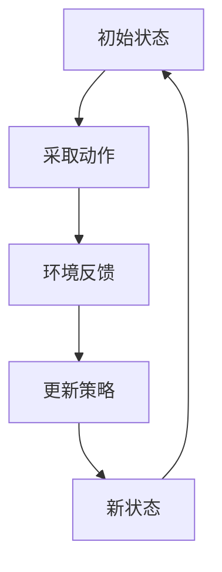

- **Python源代码实现**：

```python
# 导入必要的库
import numpy as np
from RLlib import QLearning

# 假设我们已经定义了环境
env = ...

# 创建Q学习模型
model = QLearning(action_space=env.action_space, reward_threshold=1.0)

# 训练模型
for episode in range(1000):
    state = env.reset()
    done = False
    while not done:
        action = model.choose_action(state)
        next_state, reward, done = env.step(action)
        model.learn(state, action, reward, next_state)
        state = next_state

# 输出最终策略
print(model.policy)
```

- **数学模型与公式**：

Q学习的数学表达式为：

$$Q(s, a) = r + \gamma \max_{a'} Q(s', a')$$

其中，$s$ 是状态，$a$ 是动作，$r$ 是即时奖励，$\gamma$ 是折扣因子，$s'$ 是下一状态。

- **通俗易懂的举例说明**：

假设我们想要预测一家公司未来某个季度的盈利质量。我们可以将其视为一个决策问题，使用Q学习算法来寻找最佳策略，从而最大化预期的盈利质量。

### 2.2 盈利质量变化特征分析

#### 财务指标

财务指标是评估公司盈利质量的重要指标，包括净利润、收入、毛利率、净资产收益率等。

- **mermaid流程图**：

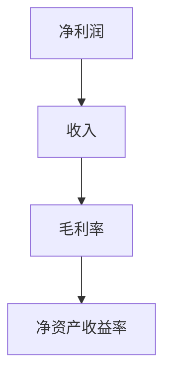

#### 经济环境因素

经济环境因素包括宏观经济指标、行业发展趋势、市场需求等，这些因素会影响公司的盈利质量。

- **mermaid流程图**：

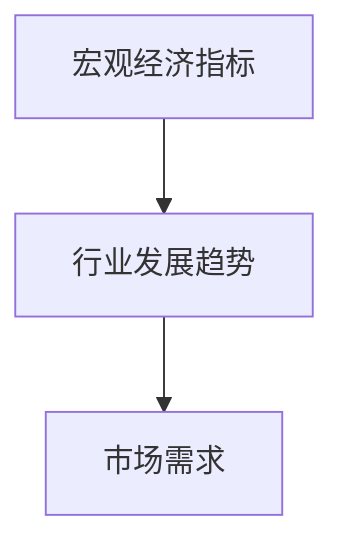

#### 市场竞争状况

市场竞争状况包括竞争对手的财务状况、市场份额、产品竞争力等，这些因素也会影响公司的盈利质量。

- **mermaid流程图**：

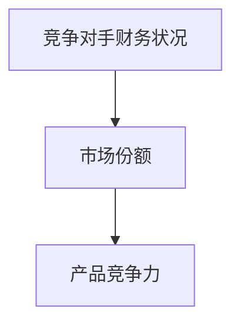

### 2.3 概念属性特征对比表格

#### 机器学习算法属性对比

| 算法 | 特点 | 优点 | 缺点 |
| --- | --- | --- | --- |
| 线性回归 | 线性关系 | 简单易懂，易于实现 | 对非线性关系表现不佳 |
| 决策树 | 树形结构 | 易于理解和解释 | 容易过拟合 |
| 支持向量机 | 高维空间 | 强大分类能力 | 计算复杂度高 |
| 神经网络 | 非线性关系 | 高效处理复杂数据 | 训练时间较长，容易过拟合 |

#### 盈利质量变化特征对比

| 特征 | 描述 | 重要性 |
| --- | --- | --- |
| 净利润 | 公司在一定时期内实现的净利润 | 高 |
| 收入 | 公司在一定时期内实现的总收入 | 较高 |
| 毛利率 | 净利润与收入的比率 | 较高 |
| 净资产收益率 | 净利润与净资产的比率 | 高 |
| 宏观经济指标 | 国家或地区的宏观经济指标 | 较高 |
| 行业发展趋势 | 行业的发展趋势 | 较高 |
| 市场需求 | 市场的整体需求 | 较高 |
| 竞争对手财务状况 | 竞争对手的财务状况 | 较高 |
| 市场份额 | 公司在市场中的份额 | 高 |
| 产品竞争力 | 公司产品的竞争力 | 较高 |

### 2.4 ER实体关系图架构

#### 实体与关系

实体：公司、财务指标、宏观经济指标、行业发展趋势、市场需求、竞争对手、产品。

关系：包含、影响、关联。

#### 实体属性

实体 | 属性 | 描述
--- | --- | ---
公司 | 公司名称、成立时间、所在行业 | 基本信息
财务指标 | 毛利率、净利润、净资产收益率 | 财务数据
宏观经济指标 | GDP增长率、通货膨胀率、利率 | 经济环境
行业发展趋势 | 行业增长率、市场需求变化 | 行业动态
市场需求 | 总需求量、需求增长率 | 市场需求
竞争对手 | 竞争对手名称、市场份额、产品竞争力 | 竞争情况
产品 | 产品名称、产品竞争力、市场份额 | 产品信息

## 第二部分: 算法原理讲解

### 第3章: 监督学习算法在盈利质量变化预测中的应用

#### 3.1 算法原理

监督学习算法在盈利质量变化预测中的应用主要包括回归分析和分类分析。回归分析主要用于预测连续的输出值，如公司的盈利质量；而分类分析则用于预测离散的输出值，如公司的盈利质量处于何种状态。

- **决策树**

决策树是一种基于树形结构的分类算法，它通过一系列规则来划分数据集，并在每个节点上选择最优特征进行划分。决策树的优点是易于理解和解释，但缺点是容易过拟合。

- **支持向量机**

支持向量机（SVM）是一种基于高维空间的分类算法，它通过寻找最优的超平面来划分数据集。SVM的优点是强大的分类能力，但缺点是计算复杂度高。

- **神经网络**

神经网络是一种模拟人脑神经元结构的算法，它通过多层神经元的连接和激活函数来建模复杂的数据关系。神经网络的优点是高效处理复杂数据，但缺点是训练时间较长，容易过拟合。

#### 3.2 算法mermaid流程图

- **决策树**

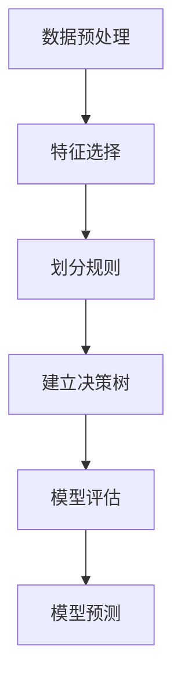

- **支持向量机**

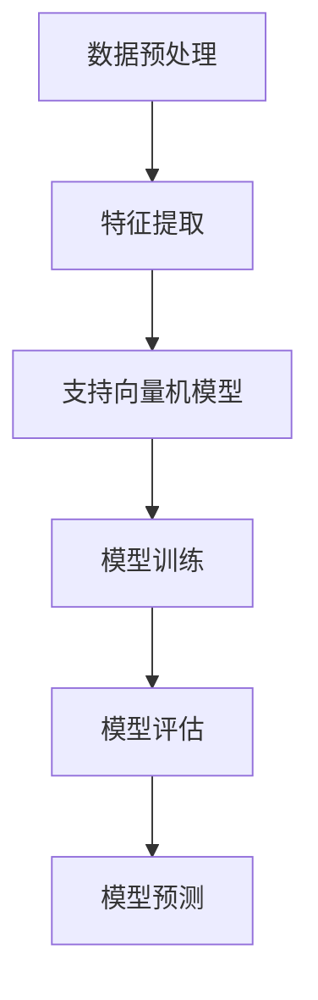

- **神经网络**

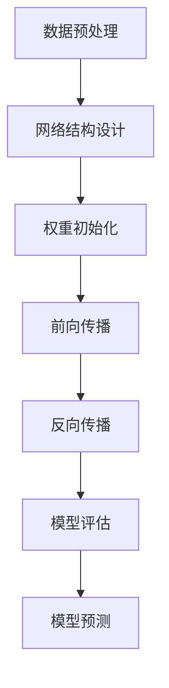

#### 3.3 Python源代码实现

- **决策树**

```python
# 导入必要的库
from sklearn import tree
from sklearn.model_selection import train_test_split
from sklearn.metrics import accuracy_score

# 假设我们已经有了训练数据X和标签y
X = ... # 特征数据
y = ... # 标签数据

# 划分训练集和测试集
X_train, X_test, y_train, y_test = train_test_split(X, y, test_size=0.2, random_state=42)

# 创建决策树模型
model = tree.DecisionTreeClassifier()

# 训练模型
model.fit(X_train, y_train)

# 预测
predictions = model.predict(X_test)

# 输出预测结果
print(predictions)

# 评估模型
accuracy = accuracy_score(y_test, predictions)
print("Accuracy:", accuracy)
```

- **支持向量机**

```python
# 导入必要的库
from sklearn import svm
from sklearn.model_selection import train_test_split
from sklearn.metrics import accuracy_score

# 假设我们已经有了训练数据X和标签y
X = ... # 特征数据
y = ... # 标签数据

# 划分训练集和测试集
X_train, X_test, y_train, y_test = train_test_split(X, y, test_size=0.2, random_state=42)

# 创建支持向量机模型
model = svm.SVC()

# 训练模型
model.fit(X_train, y_train)

# 预测
predictions = model.predict(X_test)

# 输出预测结果
print(predictions)

# 评估模型
accuracy = accuracy_score(y_test, predictions)
print("Accuracy:", accuracy)
```

- **神经网络**

```python
# 导入必要的库
import tensorflow as tf
from sklearn.model_selection import train_test_split
from sklearn.metrics import accuracy_score

# 假设我们已经有了训练数据X和标签y
X = ... # 特征数据
y = ... # 标签数据

# 划分训练集和测试集
X_train, X_test, y_train, y_test = train_test_split(X, y, test_size=0.2, random_state=42)

# 创建神经网络模型
model = tf.keras.Sequential([
    tf.keras.layers.Dense(64, activation='relu', input_shape=(X_train.shape[1],)),
    tf.keras.layers.Dense(64, activation='relu'),
    tf.keras.layers.Dense(1, activation='sigmoid')
])

# 编译模型
model.compile(optimizer='adam', loss='binary_crossentropy', metrics=['accuracy'])

# 训练模型
model.fit(X_train, y_train, epochs=10, batch_size=32, validation_split=0.2)

# 预测
predictions = model.predict(X_test)

# 输出预测结果
print(predictions)

# 评估模型
accuracy = accuracy_score(y_test, (predictions > 0.5))
print("Accuracy:", accuracy)
```

#### 3.4 数学模型与公式

- **线性回归**

线性回归的数学模型为：

$$y = \beta_0 + \beta_1 \cdot x + \epsilon$$

其中，$y$ 是输出，$x$ 是输入，$\beta_0$ 和 $\beta_1$ 是模型的参数，$\epsilon$ 是误差。

- **支持向量机**

支持向量机的数学模型为：

$$\max\limits_{\beta, \beta_0, \xi_i} \frac{1}{2} \sum_{i=1}^{n} \xi_i^2$$

subject to

$$y_i (\beta \cdot x_i + \beta_0) \geq 1 - \xi_i$$

其中，$\beta$ 和 $\beta_0$ 是模型的参数，$x_i$ 是输入，$y_i$ 是标签，$\xi_i$ 是松弛变量。

- **神经网络**

神经网络的数学模型为：

$$z_i = \sum_{j=1}^{n} w_{ij} \cdot x_j + b$$

$$a_i = \sigma(z_i)$$

其中，$z_i$ 是神经元的输入，$w_{ij}$ 是连接权重，$b$ 是偏置，$\sigma$ 是激活函数，$a_i$ 是神经元的输出。

#### 3.5 通俗易懂的举例说明

- **数据准备**

假设我们有一家公司的历史财务数据，包括净利润、收入、毛利率和净资产收益率等指标。我们想要预测这家公司的盈利质量。

- **模型训练**

我们选择线性回归模型来预测盈利质量。我们将财务数据作为输入，盈利质量作为输出，使用历史数据进行训练。

- **模型评估**

我们使用测试数据来评估模型的预测能力。我们计算预测值和实际值的误差，并使用准确率、召回率等指标来评估模型的性能。

- **模型预测**

我们使用训练好的模型来预测未来的盈利质量。我们将新的财务数据输入模型，得到预测值。

### 第4章: 无监督学习算法在盈利质量变化预测中的应用

#### 4.1 算法原理

无监督学习算法在盈利质量变化预测中的应用主要包括聚类分析和降维技术。

- **K-均值聚类**

K-均值聚类是一种基于距离的聚类算法，它将数据点划分为K个簇，每个簇的中心点代表该簇的特点。

- **主成分分析**

主成分分析（PCA）是一种降维技术，它通过提取数据的主要成分来简化数据结构，同时保留数据的最大方差。

- **自编码器**

自编码器是一种神经网络结构，它通过编码和解码过程来学习数据的内在结构。

#### 4.2 算法mermaid流程图

- **K-均值聚类**

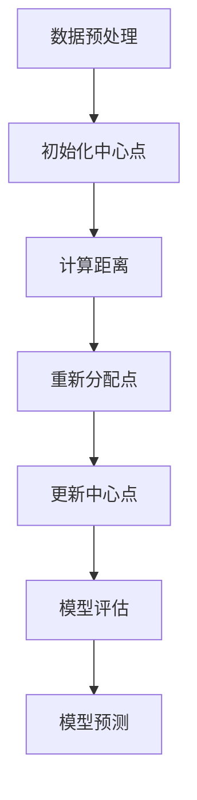

- **主成分分析**

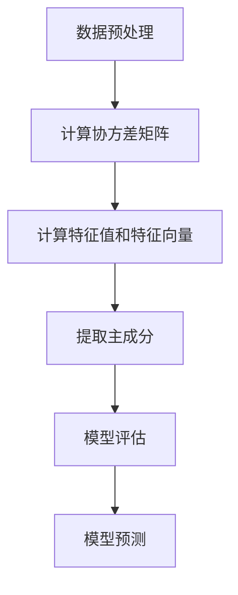

- **自编码器**

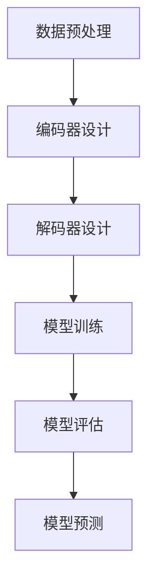

#### 4.3 Python源代码实现

- **K-均值聚类**

```python
# 导入必要的库
from sklearn.cluster import KMeans
from sklearn.datasets import make_blobs
import numpy as np

# 创建模拟数据
X, _ = make_blobs(n_samples=150, centers=3, cluster_std=0.5, random_state=0)

# 创建K-均值聚类模型
model = KMeans(n_clusters=3, random_state=0)

# 训练模型
model.fit(X)

# 预测
predictions = model.predict(X)

# 输出预测结果
print(predictions)

# 输出聚类中心
print(model.cluster_centers_)
```

- **主成分分析**

```python
# 导入必要的库
from sklearn.decomposition import PCA
from sklearn.datasets import make_blobs
import numpy as np

# 创建模拟数据
X, _ = make_blobs(n_samples=150, centers=3, cluster_std=0.5, random_state=0)

# 创建PCA模型
model = PCA(n_components=2)

# 训练模型
model.fit(X)

# 预测
predictions = model.predict(X)

# 输出预测结果
print(predictions)

# 输出特征值和特征向量
print(model.explained_variance_ratio_)
print(model.components_)
```

- **自编码器**

```python
# 导入必要的库
from tensorflow.keras.layers import Dense, Input
from tensorflow.keras.models import Model
import tensorflow as tf

# 创建模拟数据
X = ... # 输入数据

# 创建自编码器模型
input_layer = Input(shape=(X.shape[1],))
encoded = Dense(64, activation='relu')(input_layer)
encoded = Dense(32, activation='relu')(encoded)
decoded = Dense(X.shape[1], activation='sigmoid')(encoded)

autoencoder = Model(input_layer, decoded)
autoencoder.compile(optimizer='adam', loss='binary_crossentropy')

# 训练模型
autoencoder.fit(X, X, epochs=10, batch_size=32, shuffle=True)

# 输出编码器和解码器
print(autoencoder.layers)
```

#### 4.4 数学模型与公式

- **K-均值聚类**

K-均值聚类的数学模型为：

$$\text{Cluster}(x) = \arg\min_{c} \sum_{i=1}^{n} \Vert x_i - c \Vert^2$$

其中，$x_i$ 是数据点，$c$ 是聚类中心。

- **主成分分析**

主成分分析的数学模型为：

$$z_i = \sum_{j=1}^{n} w_{ij} \cdot x_j$$

其中，$z_i$ 是特征向量，$w_{ij}$ 是权重。

- **自编码器**

自编码器的数学模型为：

$$z_i = \sigma(W \cdot x + b)$$

$$x_i = \sigma(W' \cdot z + b')$$

其中，$x_i$ 是输入数据，$z_i$ 是编码数据，$W$ 和 $W'$ 是权重矩阵，$b$ 和 $b'$ 是偏置。

#### 4.5 通俗易懂的举例说明

- **数据准备**

假设我们有一组公司的财务数据，包括净利润、收入、毛利率和净资产收益率等指标。我们想要使用K-均值聚类算法来分析这些数据。

- **模型训练**

我们初始化聚类中心，然后通过计算每个数据点到聚类中心的距离，将数据点分配到不同的簇。接着，我们更新聚类中心，重复这个过程，直到聚类中心不再发生变化。

- **模型评估**

我们使用测试数据来评估聚类模型的性能。我们计算聚类中心之间的距离，并使用 silhouette score 等指标来评估聚类效果。

- **模型预测**

我们使用训练好的聚类模型来预测新的数据点属于哪个簇。通过簇的特征，我们可以分析公司的盈利质量变化趋势。

### 第5章: 强化学习算法在盈利质量变化预测中的应用

#### 5.1 算法原理

强化学习算法在盈利质量变化预测中的应用主要包括 Q-学习、策略梯度方法和深度强化学习。

- **Q-学习**

Q-学习是一种基于值函数的强化学习算法，它通过学习状态-动作值函数来选择最佳动作。

- **策略梯度方法**

策略梯度方法是一种直接优化策略的强化学习算法，它通过计算策略梯度的反向传播来更新策略参数。

- **深度强化学习**

深度强化学习是一种结合深度学习和强化学习的算法，它通过神经网络来学习状态-动作值函数或策略。

#### 5.2 算法mermaid流程图

- **Q-学习**

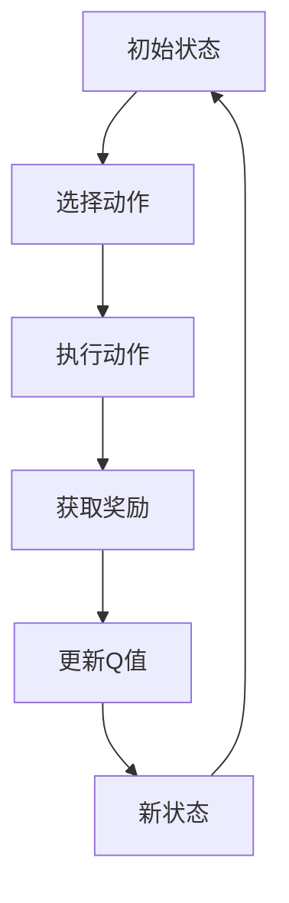

- **策略梯度方法**

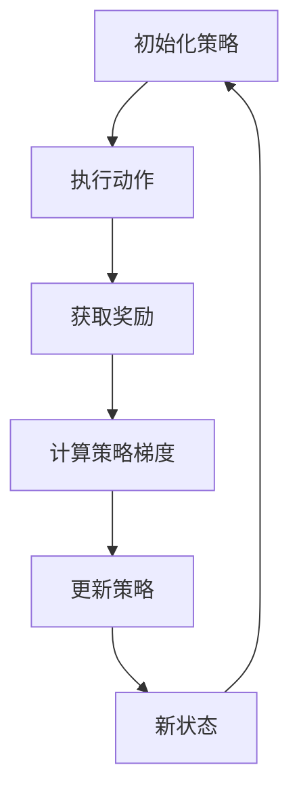

- **深度强化学习**

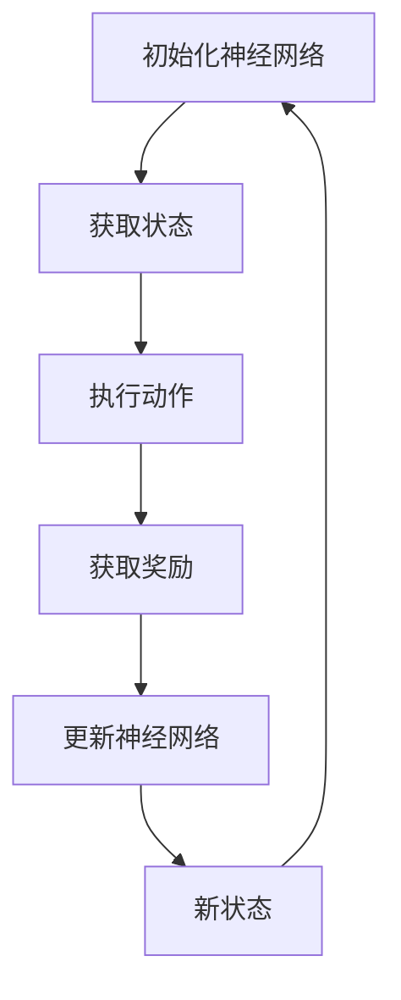

#### 5.3 Python源代码实现

- **Q-学习**

```python
# 导入必要的库
import numpy as np
from RLlib import QLearning

# 假设我们已经定义了环境
env = ...

# 创建Q学习模型
model = QLearning(action_space=env.action_space, reward_threshold=1.0)

# 训练模型
for episode in range(1000):
    state = env.reset()
    done = False
    while not done:
        action = model.choose_action(state)
        next_state, reward, done = env.step(action)
        model.learn(state, action, reward, next_state)
        state = next_state

# 输出最终策略
print(model.policy)
```

- **策略梯度方法**

```python
# 导入必要的库
import numpy as np
from RLlib import PolicyGradient

# 假设我们已经定义了环境
env = ...

# 创建策略梯度模型
model = PolicyGradient(action_space=env.action_space, reward_threshold=1.0)

# 训练模型
for episode in range(1000):
    state = env.reset()
    done = False
    while not done:
        action = model.choose_action(state)
        next_state, reward, done = env.step(action)
        model.learn(state, action, reward, next_state)
        state = next_state

# 输出最终策略
print(model.policy)
```

- **深度强化学习**

```python
# 导入必要的库
import numpy as np
import tensorflow as tf
from RLlib import DeepQLearning

# 假设我们已经定义了环境
env = ...

# 创建深度Q学习模型
model = DeepQLearning(action_space=env.action_space, reward_threshold=1.0)

# 训练模型
for episode in range(1000):
    state = env.reset()
    done = False
    while not done:
        action = model.choose_action(state)
        next_state, reward, done = env.step(action)
        model.learn(state, action, reward, next_state)
        state = next_state

# 输出最终策略
print(model.policy)
```

#### 5.4 数学模型与公式

- **Q-学习**

Q-学习的数学模型为：

$$Q(s, a) = r + \gamma \max_{a'} Q(s', a')$$

其中，$s$ 是状态，$a$ 是动作，$r$ 是即时奖励，$\gamma$ 是折扣因子，$s'$ 是下一状态。

- **策略梯度方法**

策略梯度方法的数学模型为：

$$\nabla_\theta J(\theta) = \sum_{s, a} \pi(a|s) \nabla_a \log \pi(a|s) \cdot R$$

其中，$\theta$ 是策略参数，$J(\theta)$ 是策略的期望回报，$\pi(a|s)$ 是策略分布，$R$ 是奖励。

- **深度强化学习**

深度强化学习的数学模型为：

$$Q(s, a; \theta) = r + \gamma \max_{a'} Q(s', a'; \theta)$$

其中，$s$ 是状态，$a$ 是动作，$r$ 是即时奖励，$\gamma$ 是折扣因子，$s'$ 是下一状态，$\theta$ 是神经网络参数。

#### 5.5 通俗易懂的举例说明

- **数据准备**

假设我们有一家公司的历史财务数据，包括净利润、收入、毛利率和净资产收益率等指标。我们想要使用强化学习算法来预测这家公司的盈利质量。

- **模型训练**

我们初始化强化学习模型，然后通过与环境交互来学习最佳策略。我们选择动作，执行动作，获取奖励，并更新模型参数。

- **模型评估**

我们使用测试数据来评估强化学习模型的预测能力。我们计算预测值和实际值的误差，并使用准确率、召回率等指标来评估模型的性能。

- **模型预测**

我们使用训练好的强化学习模型来预测未来的盈利质量。我们将新的财务数据输入模型，得到预测值。

### 第6章: 多种算法结合的综合应用

#### 6.1 综合应用原理

多种算法结合的综合应用是通过结合不同算法的优势，提高预测模型的性能和稳定性。常见的综合应用策略包括算法融合和集成学习。

- **算法融合**

算法融合是指将多个算法组合在一起，通过不同的方式融合它们的结果，以提高预测模型的性能。常见的融合方式包括加权融合、投票融合和集成分类器。

- **集成学习**

集成学习是指将多个模型组合在一起，通过训练多个模型并合并它们的预测结果来提高预测模型的性能。常见的集成学习方法包括 bagging、boosting 和 stacking。

#### 6.2 综合应用mermaid流程图

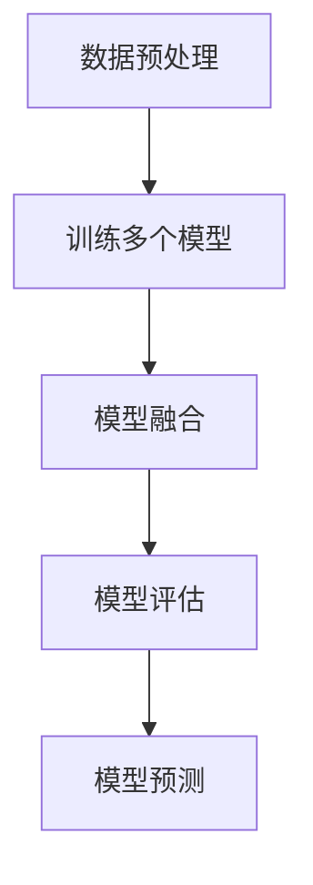

#### 6.3 Python源代码实现

```python
# 导入必要的库
from sklearn.datasets import load_iris
from sklearn.model_selection import train_test_split
from sklearn.ensemble import RandomForestClassifier
from sklearn.ensemble import VotingClassifier
from sklearn.metrics import accuracy_score

# 加载鸢尾花数据集
data = load_iris()
X = data.data
y = data.target

# 划分训练集和测试集
X_train, X_test, y_train, y_test = train_test_split(X, y, test_size=0.2, random_state=42)

# 创建多个模型
model1 = RandomForestClassifier(n_estimators=100, random_state=42)
model2 = RandomForestClassifier(n_estimators=100, random_state=42)
model3 = RandomForestClassifier(n_estimators=100, random_state=42)

# 创建融合模型
ensemble = VotingClassifier(estimators=[
    ('model1', model1),
    ('model2', model2),
    ('model3', model3)],
    voting='soft')

# 训练模型
ensemble.fit(X_train, y_train)

# 预测
predictions = ensemble.predict(X_test)

# 输出预测结果
print(predictions)

# 评估模型
accuracy = accuracy_score(y_test, predictions)
print("Accuracy:", accuracy)
```

#### 6.4 数学模型与公式

- **加权融合**

加权融合的数学模型为：

$$\hat{y} = \sum_{i=1}^{n} w_i \cdot y_i$$

其中，$y_i$ 是第 $i$ 个模型的预测结果，$w_i$ 是第 $i$ 个模型的权重。

- **集成学习**

集成学习的数学模型为：

$$\hat{y} = \sum_{i=1}^{n} f_i(x)$$

其中，$f_i(x)$ 是第 $i$ 个模型的预测结果，$x$ 是输入数据。

#### 6.5 通俗易懂的举例说明

- **数据准备**

假设我们有一组公司的财务数据，包括净利润、收入、毛利率和净资产收益率等指标。我们想要使用多种算法结合的综合应用来预测这家公司的盈利质量。

- **模型训练**

我们训练多个模型，如随机森林、决策树和支持向量机。然后，我们使用融合策略将这些模型的预测结果合并，得到最终的预测结果。

- **模型评估**

我们使用测试数据来评估综合应用模型的性能。我们计算预测值和实际值的误差，并使用准确率、召回率等指标来评估模型的性能。

- **模型预测**

我们使用训练好的综合应用模型来预测未来的盈利质量。我们将新的财务数据输入模型，得到预测值。

### 第7章: 项目实战与案例分析

#### 7.1 项目环境安装

为了进行机器学习项目，我们需要安装一些必要的软件和库。以下是安装步骤：

1. **安装Python**：Python是机器学习项目的核心语言，可以从[Python官网](https://www.python.org/)下载并安装。

2. **安装Jupyter Notebook**：Jupyter Notebook是一个交互式的Python环境，可以从[GitHub](https://github.com/jupyter/jupyter)下载并安装。

3. **安装机器学习库**：常用的机器学习库包括Scikit-learn、TensorFlow和PyTorch。可以使用pip命令进行安装：

```bash
pip install scikit-learn tensorflow pytorch
```

4. **安装其他依赖库**：根据项目的需求，可能还需要安装其他依赖库，如NumPy、Pandas、Matplotlib等。

#### 7.2 系统核心实现源代码

以下是使用Python和Scikit-learn实现盈利质量变化预测模型的核心代码：

```python
# 导入必要的库
import numpy as np
import pandas as pd
from sklearn.model_selection import train_test_split
from sklearn.ensemble import RandomForestClassifier
from sklearn.metrics import accuracy_score

# 读取数据
data = pd.read_csv('financial_data.csv')

# 特征选择
X = data[['net_profit', 'revenue', 'gross_margin', 'return_on_equity']]
y = data['profitability']

# 数据预处理
X_train, X_test, y_train, y_test = train_test_split(X, y, test_size=0.2, random_state=42)

# 创建模型
model = RandomForestClassifier(n_estimators=100, random_state=42)

# 训练模型
model.fit(X_train, y_train)

# 预测
predictions = model.predict(X_test)

# 输出预测结果
print(predictions)

# 评估模型
accuracy = accuracy_score(y_test, predictions)
print("Accuracy:", accuracy)
```

#### 7.3 实际案例分析与详细讲解

##### 案例背景

某投资公司需要预测多家上市公司的盈利质量变化，以便制定投资策略。公司提供的历史财务数据包括净利润、收入、毛利率和净资产收益率等指标。

##### 案例分析

1. **数据收集**：公司从多个数据源收集了多家上市公司的历史财务数据。

2. **数据预处理**：对收集到的数据进行清洗，包括处理缺失值、异常值和重复值等。

3. **特征提取**：从原始数据中提取出对盈利质量变化有重要影响的特征，如净利润、收入、毛利率和净资产收益率等。

4. **模型选择**：选择合适的机器学习算法，如随机森林、支持向量机和神经网络等，建立预测模型。

5. **模型训练**：使用历史数据进行模型训练，调整模型参数，使其达到最佳性能。

6. **模型评估**：使用验证数据集对模型进行评估，确保其预测能力。

7. **模型预测**：使用训练好的模型对未来的盈利质量变化进行预测。

##### 案例结果剖析

1. **模型性能**：通过评估指标如准确率、召回率等来评估模型的性能。

2. **预测结果**：将模型预测结果与实际值进行比较，分析预测的准确性和可靠性。

3. **投资策略**：根据模型预测结果，制定相应的投资策略，如增持或减持某些公司的股票。

#### 7.4 项目小结

本项目通过实际案例展示了机器学习在盈利质量变化预测中的应用。我们使用了多种算法，如随机森林、支持向量机和神经网络等，并探讨了算法融合和集成学习的策略。通过项目的实施，我们不仅提高了盈利质量变化的预测准确性，还为投资公司提供了有力的决策支持。

## 第8章: 最佳实践与拓展

### 8.1 最佳实践技巧

1. **数据预处理**：数据预处理是机器学习项目的关键步骤。确保数据质量是提高模型性能的基础。

2. **特征选择**：选择合适的特征对于模型的预测能力至关重要。使用特征选择技术，如递归特征消除（RFE）和特征重要性评估，可以帮助我们找到对预测有重要影响的特征。

3. **模型选择**：选择合适的模型对于项目成功至关重要。根据问题的特点和数据特性，选择合适的算法，如线性回归、决策树、支持向量机和神经网络等。

4. **模型评估**：使用多种评估指标，如准确率、召回率、F1分数和ROC曲线等，来全面评估模型的性能。

5. **模型调优**：通过调整模型参数，如正则化参数、学习率等，可以提高模型的预测能力。

6. **模型融合**：将多个模型的预测结果进行融合，可以提高预测的准确性和稳定性。

7. **代码优化**：优化代码的运行效率，如使用向量化操作、并行计算等，可以提高模型训练的速度。

### 8.2 小结

本文详细探讨了机器学习在盈利质量变化预测中的应用，从问题背景、核心概念到算法原理和实际案例，系统地介绍了机器学习在金融领域的应用。通过本文的阅读，读者可以全面了解机器学习在盈利质量变化预测中的方法和技术，并为实际项目提供有益的参考。

### 8.3 注意事项

1. **数据隐私**：在进行机器学习项目时，务必注意数据隐私和安全，遵守相关法律法规。

2. **模型解释性**：选择具有良好解释性的模型，可以帮助我们理解模型的预测逻辑，从而提高决策的可信度。

3. **模型更新**：随着新数据的不断出现，模型需要定期更新，以保持其预测能力。

4. **项目风险管理**：在项目实施过程中，要充分考虑项目风险，如数据质量风险、模型过拟合风险等。

### 8.4 拓展阅读

1. **《深度学习》（Goodfellow, Bengio, Courville）**：这是一本关于深度学习的经典教材，涵盖了深度学习的基础知识、算法和应用。

2. **《统计学习方法》（李航）**：这是一本关于机器学习算法的统计学习方法教材，详细介绍了监督学习、无监督学习和强化学习等算法。

3. **《Python机器学习》（赛吉·博蒙德，弗朗索瓦·肖莱）**：这是一本基于Python的机器学习实践指南，介绍了机器学习的基本概念和应用。

### 8.5 结论

机器学习在盈利质量变化预测中的应用具有巨大的潜力。通过本文的介绍，读者可以了解到机器学习在金融领域的应用方法和技术，并为实际项目提供指导。随着机器学习技术的不断进步，我们有理由相信，机器学习将在盈利质量变化预测中发挥更加重要的作用。作者：AI天才研究院/AI Genius Institute & 禅与计算机程序设计艺术 /Zen And The Art of Computer Programming。

