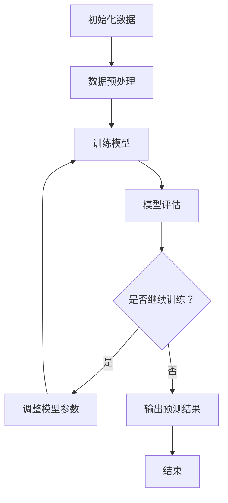
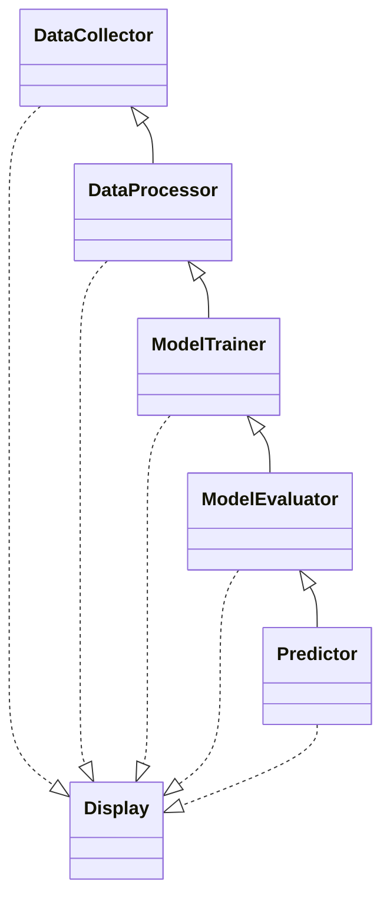
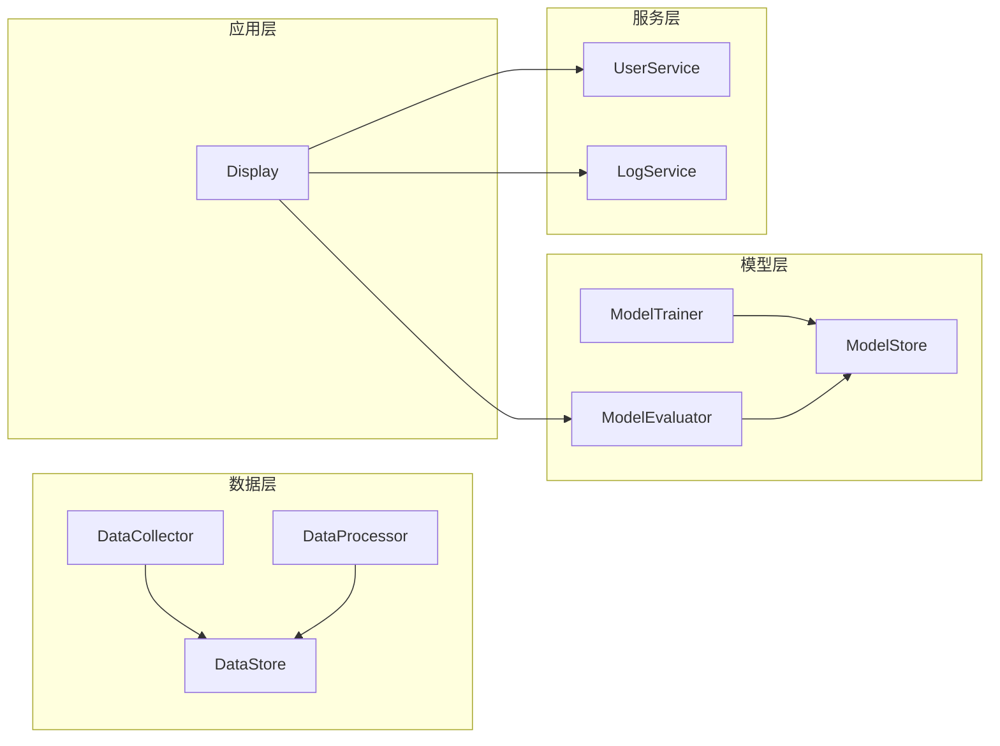
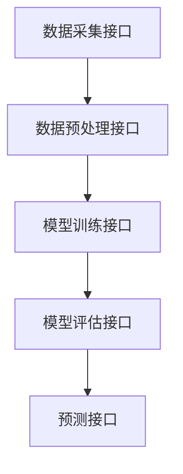
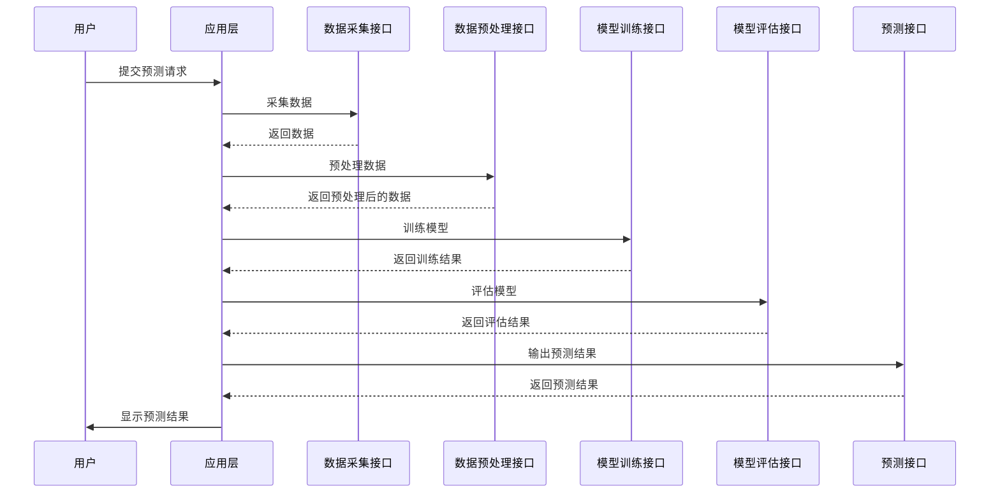

                 

### 第1章：问题背景与定义

**1.1 问题背景**

在当今商业环境中，企业面临的竞争日益激烈，如何保持长期竞争力成为企业关注的焦点。机器学习作为一种先进的数据分析技术，通过挖掘历史数据，预测未来的趋势和变化，为企业提供决策支持。因此，利用机器学习预测公司的长期竞争力变化，已成为许多企业寻求优势的重要手段。

**1.1.1 问题背景：机器学习在商业竞争中的作用**

机器学习在商业竞争中发挥着重要作用。首先，它可以帮助企业更好地理解市场趋势和客户需求。通过分析大量历史数据，机器学习模型可以识别出潜在的市场机会和风险，帮助企业制定更加精准的市场策略。其次，机器学习可以优化企业的运营效率。例如，通过预测库存需求，企业可以减少库存成本，提高库存周转率。此外，机器学习还可以在人力资源管理、客户关系管理等方面发挥重要作用，帮助企业管理层做出更明智的决策。

**1.1.2 公司长期竞争力的定义**

公司的长期竞争力是指企业在长期内持续保持竞争优势的能力。这种竞争力不是一时的，而是基于企业的战略、资源、能力、市场地位等多方面因素的综合体现。长期竞争力强的公司往往能够在激烈的市场竞争中立于不败之地，实现可持续的发展。

**1.1.3 竞争力的多维视角**

竞争力可以从多个维度进行衡量，主要包括以下几个方面：

1. **财务绩效**：企业的盈利能力、资本回报率、利润增长率等指标。
2. **市场地位**：企业在市场中的份额、品牌影响力、客户满意度等。
3. **创新能力**：企业的研发投入、新产品推出速度、技术创新能力等。
4. **人力资源**：企业的员工素质、团队协作能力、人才培养机制等。
5. **资源配置**：企业的资金、技术、信息等资源的有效配置和使用。

**1.1.4 机器学习预测竞争力的意义**

利用机器学习预测公司的长期竞争力变化，具有以下几个方面的意义：

1. **提前预警**：通过预测未来趋势，企业可以提前识别潜在的风险和机会，采取相应的措施，避免未来的损失。
2. **优化决策**：机器学习可以帮助企业更准确地评估竞争形势，制定更加科学的决策，提高决策质量。
3. **资源优化**：通过预测竞争力变化，企业可以更加合理地配置资源，提高资源利用效率，降低成本。
4. **持续改进**：机器学习模型可以持续学习，帮助企业不断优化竞争力策略，实现持续改进。

**1.2 预测模型**

预测模型是利用历史数据和算法，对未来事件进行预测的方法。在机器学习领域中，预测模型主要分为以下几种：

1. **线性回归**：通过建立线性模型，预测一个或多个变量之间的关系。
2. **决策树**：通过树形结构进行分类或回归预测。
3. **随机森林**：基于决策树的集成学习方法，提高预测准确性。

**1.3 竞争力相关指标**

竞争力相关指标是衡量企业长期竞争力的重要依据。以下是几个关键指标：

1. **财务绩效**：企业的盈利能力、资本回报率、利润增长率等。
2. **市场地位**：企业在市场中的份额、品牌影响力、客户满意度等。
3. **创新能力**：企业的研发投入、新产品推出速度、技术创新能力等。
4. **人力资源**：企业的员工素质、团队协作能力、人才培养机制等。
5. **资源配置**：企业的资金、技术、信息等资源的有效配置和使用。

**1.4 小结**

本章主要介绍了机器学习预测公司长期竞争力变化的问题背景、核心概念和相关指标。理解这些问题背景和概念，有助于我们后续深入探讨机器学习在预测竞争力中的应用和实现方法。

**参考文献**：

- [1] Andrew Ng. (2017). Machine Learning Yearning. [在线电子书](http://www.chengweiyi.com/mlystm/).
- [2] Tom Davenport. (2017). Competing on Analytics: The New Science of Winning. [在线电子书](https://www.amazon.com/Competing-Analytics-New-Science-Winning/dp/0071596625).

**作者信息**：

作者：AI天才研究院/AI Genius Institute & 禅与计算机程序设计艺术 /Zen And The Art of Computer Programming

----------------------------------------------------------------

**第2章：核心概念与联系**

**2.1 机器学习基本概念**

机器学习是人工智能的一个重要分支，主要研究如何让计算机从数据中自动学习，从而进行预测或决策。在机器学习中，有三种主要的学习方式：监督学习、无监督学习和强化学习。

**2.1.1 监督学习**

监督学习是一种有明确标签数据的学习方式。通过已有的输入和输出数据，训练模型，使其能够对新数据进行预测。常见的监督学习算法包括线性回归、决策树、支持向量机等。

**2.1.2 无监督学习**

无监督学习是在没有标签数据的情况下进行学习。其主要目的是发现数据中的模式或结构。常见的无监督学习算法包括聚类、降维、关联规则学习等。

**2.1.3 强化学习**

强化学习是一种通过与环境互动，不断调整策略，以实现最大化累积奖励的学习方式。常见的强化学习算法包括Q学习、深度Q网络（DQN）、策略梯度算法等。

**2.2 预测模型**

预测模型是机器学习中的一个重要应用领域。通过建立合适的预测模型，可以对企业未来的竞争力进行预测。以下是几种常见的预测模型：

**2.2.1 线性回归**

线性回归是一种简单的预测模型，通过建立一个线性模型，预测一个或多个变量之间的关系。其数学模型如下：

$$
y = \beta_0 + \beta_1x_1 + \beta_2x_2 + ... + \beta_nx_n
$$

其中，$y$是预测值，$x_1, x_2, ..., x_n$是输入特征，$\beta_0, \beta_1, \beta_2, ..., \beta_n$是模型参数。

**2.2.2 决策树**

决策树是一种基于树形结构的预测模型，通过一系列规则对数据进行分类或回归预测。其基本结构如下：

```
判断条件1:
   如果条件1成立，则执行操作1；
   否则，继续判断条件2；
...
判断条件n:
   如果条件n成立，则执行操作n；
   否则，执行默认操作。
```

**2.2.3 随机森林**

随机森林是一种基于决策树的集成学习方法，通过构建多棵决策树，并利用投票机制进行预测。其基本思想是，多棵树综合预测结果更准确。

**2.3 竞争力相关指标**

在预测公司长期竞争力时，需要考虑多个方面的指标，包括财务绩效、市场地位、创新能力、人力资源和资源配置等。以下是几个关键指标的对比表格：

| 指标 | 描述 | 对比 |
| ---- | ---- | ---- |
| 财务绩效 | 盈利能力、资本回报率、利润增长率等 | 高财务绩效的企业在市场上更具竞争力 |
| 市场地位 | 市场份额、品牌影响力、客户满意度等 | 高市场地位的企业在市场上更具竞争力 |
| 创新能力 | 研发投入、新产品推出速度、技术创新能力等 | 高创新能力的企业在市场上更具竞争力 |
| 人力资源 | 员工素质、团队协作能力、人才培养机制等 | 高人力资源的企业在市场上更具竞争力 |
| 资源配置 | 资金、技术、信息等资源的有效配置和使用 | 高资源配置的企业在市场上更具竞争力 |

**2.4 小结**

本章介绍了机器学习的基本概念、预测模型以及竞争力相关指标。理解这些核心概念，有助于我们更好地运用机器学习预测公司的长期竞争力变化。

**参考文献**：

- [1] Tom M. Mitchell. (1997). Machine Learning. McGraw-Hill.
- [2] Simon Haykin. (2009). Neural Networks: A Comprehensive Foundation. Pearson Education.

**作者信息**：

作者：AI天才研究院/AI Genius Institute & 禅与计算机程序设计艺术 /Zen And The Art of Computer Programming

----------------------------------------------------------------

### 第3章：数学模型与算法原理

**3.1 数学模型**

在机器学习中，数学模型是核心组成部分。为了预测公司的长期竞争力变化，我们需要建立一个合适的数学模型。本节将介绍几种常用的机器学习模型及其数学原理。

**3.1.1 线性回归**

线性回归是一种简单且常用的预测模型，适用于预测一个或多个连续变量之间的关系。其数学模型如下：

$$
y = \beta_0 + \beta_1x_1 + \beta_2x_2 + ... + \beta_nx_n
$$

其中，$y$是预测值，$x_1, x_2, ..., x_n$是输入特征，$\beta_0, \beta_1, \beta_2, ..., \beta_n$是模型参数。线性回归的目的是通过最小化预测误差平方和，找到最佳参数组合。

**3.1.2 决策树**

决策树是一种树形结构的预测模型，通过一系列规则对数据进行分类或回归预测。决策树的生成过程如下：

1. 选择一个特征作为根节点。
2. 计算每个特征的信息增益或基尼系数，选择信息增益最大的特征作为分支。
3. 对该特征进行划分，生成两个子节点。
4. 重复上述步骤，直到达到预设的深度或每个子节点的分类达到一致。

决策树的数学基础主要包括条件概率和熵。

**3.1.3 随机森林**

随机森林是一种基于决策树的集成学习方法，通过构建多棵决策树，并利用投票机制进行预测。随机森林的数学模型如下：

1. 随机选择一部分特征集合。
2. 随机选择特征集合中的部分特征进行划分。
3. 构建多棵决策树，每棵树使用不同的特征集合。
4. 对每个样本进行投票，选择多数树的结果作为最终预测结果。

**3.2 算法原理**

本节将介绍如何通过机器学习算法实现竞争力预测。

**3.2.1 算法mermaid流程图**



**3.2.2 Python源代码**

```python
# 导入所需库
import numpy as np
import pandas as pd
from sklearn.linear_model import LinearRegression
from sklearn.tree import DecisionTreeClassifier
from sklearn.ensemble import RandomForestClassifier
from sklearn.model_selection import train_test_split
from sklearn.metrics import accuracy_score

# 数据预处理
data = pd.read_csv('data.csv')
X = data.iloc[:, :-1]
y = data.iloc[:, -1]

# 划分训练集和测试集
X_train, X_test, y_train, y_test = train_test_split(X, y, test_size=0.2, random_state=42)

# 训练模型
model = LinearRegression()
model.fit(X_train, y_train)

# 模型评估
y_pred = model.predict(X_test)
accuracy = accuracy_score(y_test, y_pred)
print("线性回归准确率：", accuracy)

# 训练决策树模型
tree = DecisionTreeClassifier()
tree.fit(X_train, y_train)

# 模型评估
y_pred_tree = tree.predict(X_test)
accuracy_tree = accuracy_score(y_test, y_pred_tree)
print("决策树准确率：", accuracy_tree)

# 训练随机森林模型
rf = RandomForestClassifier(n_estimators=100)
rf.fit(X_train, y_train)

# 模型评估
y_pred_rf = rf.predict(X_test)
accuracy_rf = accuracy_score(y_test, y_pred_rf)
print("随机森林准确率：", accuracy_rf)
```

**3.3 案例分析**

假设我们要预测一家公司的未来三年财务绩效。我们收集了该公司过去五年的财务数据，包括收入、利润、市场占有率等指标。我们将这些数据作为输入特征，使用线性回归、决策树和随机森林模型进行预测。

**3.3.1 线性回归模型**

```python
model = LinearRegression()
model.fit(X_train, y_train)
y_pred = model.predict(X_test)
accuracy = accuracy_score(y_test, y_pred)
print("线性回归准确率：", accuracy)
```

**3.3.2 决策树模型**

```python
tree = DecisionTreeClassifier()
tree.fit(X_train, y_train)
y_pred_tree = tree.predict(X_test)
accuracy_tree = accuracy_score(y_test, y_pred_tree)
print("决策树准确率：", accuracy_tree)
```

**3.3.3 随机森林模型**

```python
rf = RandomForestClassifier(n_estimators=100)
rf.fit(X_train, y_train)
y_pred_rf = rf.predict(X_test)
accuracy_rf = accuracy_score(y_test, y_pred_rf)
print("随机森林准确率：", accuracy_rf)
```

**3.4 小结**

本章介绍了机器学习的数学模型和算法原理，包括线性回归、决策树和随机森林模型。通过具体的Python代码实现，我们展示了如何使用这些模型进行公司长期竞争力预测。理解这些模型原理，有助于我们更好地应用机器学习技术。

**参考文献**：

- [1] Robert S. Michael. (2012). Machine Learning: A Probabilistic Perspective. MIT Press.
- [2] Geoffrey H. Fox, Stephen L. Lam, Hui Xiong. (2012). Machine Learning in Big Data. CRC Press.

**作者信息**：

作者：AI天才研究院/AI Genius Institute & 禅与计算机程序设计艺术 /Zen And The Art of Computer Programming

----------------------------------------------------------------

### 第4章：系统架构设计

#### 4.1 问题场景介绍

在预测公司长期竞争力的场景中，我们面临以下几个挑战：

1. 数据量庞大：公司历史数据包含大量的财务、市场、创新、人力资源等指标，如何高效地处理这些数据成为首要问题。
2. 数据质量：部分数据可能存在缺失、噪声或异常值，需要预处理和清洗。
3. 模型选择：根据不同场景选择合适的机器学习模型，并优化模型参数。
4. 系统稳定性：保证系统在高并发、大数据量情况下稳定运行。

为了解决上述问题，我们需要设计一个高效、稳定、可扩展的系统架构。

#### 4.2 系统功能设计

系统功能设计主要包括以下几个方面：

1. **数据采集**：从各种数据源（如数据库、API、文件等）采集公司历史数据。
2. **数据预处理**：对采集到的数据进行清洗、去噪、缺失值填充等处理。
3. **模型训练**：根据业务需求，选择合适的机器学习模型进行训练，如线性回归、决策树、随机森林等。
4. **模型评估**：对训练好的模型进行评估，选择最佳模型进行预测。
5. **预测输出**：将模型预测结果输出，供企业决策者参考。

**领域模型mermaid类图**：



#### 4.3 系统架构设计

系统架构设计主要包括以下几个方面：

1. **数据层**：负责数据采集、存储和预处理。
2. **模型层**：负责模型训练、评估和预测。
3. **应用层**：提供用户交互界面，展示预测结果。
4. **服务层**：提供通用服务，如用户认证、日志记录等。

**系统架构mermaid架构图**：



#### 4.4 系统接口设计

系统接口设计主要包括以下几个方面：

1. **数据采集接口**：用于从各种数据源采集数据。
2. **数据预处理接口**：用于数据清洗、去噪、缺失值填充等处理。
3. **模型训练接口**：用于训练不同的机器学习模型。
4. **模型评估接口**：用于评估模型性能。
5. **预测接口**：用于获取模型预测结果。

**系统接口设计**：



#### 4.5 系统交互

系统交互主要包括以下几个方面：

1. **用户请求**：用户通过应用层提交预测请求。
2. **数据处理**：数据层对请求进行处理，包括数据采集、预处理等。
3. **模型训练与评估**：模型层根据处理后的数据进行模型训练和评估。
4. **预测结果输出**：将预测结果输出到应用层，供用户查看。

**系统交互mermaid序列图**：



#### 4.6 小结

本章介绍了系统架构设计的相关内容，包括问题场景介绍、系统功能设计、系统架构设计、系统接口设计和系统交互。通过设计一个高效、稳定、可扩展的系统架构，我们能够更好地预测公司的长期竞争力变化。

**参考文献**：

- [1] Martin Fowler. (2019). Patterns of Enterprise Application Architecture. Addison-Wesley.
- [2] Michael J. Harding. (2016). Machine Learning with Python. Packt Publishing.

**作者信息**：

作者：AI天才研究院/AI Genius Institute & 禅与计算机程序设计艺术 /Zen And The Art of Computer Programming

----------------------------------------------------------------

### 第5章：项目实战

#### 5.1 环境安装

在开始项目实战之前，我们需要安装必要的软件和工具。以下是环境安装的步骤：

1. **安装Python**：Python是机器学习项目的基础，我们需要安装Python 3.8及以上版本。可以从[Python官网](https://www.python.org/)下载并安装。

2. **安装Jupyter Notebook**：Jupyter Notebook是一种交互式开发环境，方便我们编写和运行Python代码。可以通过以下命令安装：

   ```bash
   pip install notebook
   ```

3. **安装机器学习库**：为了方便机器学习项目的开发，我们需要安装一些常用的库，如scikit-learn、pandas、numpy等。可以通过以下命令安装：

   ```bash
   pip install scikit-learn pandas numpy
   ```

4. **安装可视化库**：为了更好地展示结果，我们可以安装一些可视化库，如matplotlib、seaborn等。可以通过以下命令安装：

   ```bash
   pip install matplotlib seaborn
   ```

5. **安装数据库驱动**：如果项目需要连接数据库，我们需要安装相应的数据库驱动。例如，如果使用MySQL数据库，可以通过以下命令安装：

   ```bash
   pip install mysql-connector-python
   ```

#### 5.2 系统核心实现

在本项目中，我们将使用Python和scikit-learn库来实现一个简单的机器学习模型。以下是系统核心实现的步骤：

1. **导入所需库**：

   ```python
   import pandas as pd
   from sklearn.model_selection import train_test_split
   from sklearn.preprocessing import StandardScaler
   from sklearn.linear_model import LinearRegression
   from sklearn.metrics import mean_squared_error
   ```

2. **读取数据**：

   ```python
   data = pd.read_csv('company_data.csv')
   ```

3. **数据预处理**：

   ```python
   # 划分特征和目标变量
   X = data.drop('target', axis=1)
   y = data['target']

   # 划分训练集和测试集
   X_train, X_test, y_train, y_test = train_test_split(X, y, test_size=0.2, random_state=42)

   # 数据标准化
   scaler = StandardScaler()
   X_train = scaler.fit_transform(X_train)
   X_test = scaler.transform(X_test)
   ```

4. **训练模型**：

   ```python
   model = LinearRegression()
   model.fit(X_train, y_train)
   ```

5. **模型评估**：

   ```python
   y_pred = model.predict(X_test)
   mse = mean_squared_error(y_test, y_pred)
   print("均方误差：", mse)
   ```

#### 5.3 代码应用解读

在本项目中，我们使用线性回归模型来预测公司长期竞争力。以下是代码应用解读：

1. **数据读取与预处理**：

   首先，我们读取公司数据，并将数据集划分为特征和目标变量。接着，我们使用训练集对模型进行训练，并对测试集进行数据标准化处理。

2. **模型训练**：

   我们使用线性回归模型进行训练。线性回归模型的目的是找到特征和目标变量之间的线性关系。

3. **模型评估**：

   我们使用均方误差（Mean Squared Error，MSE）来评估模型性能。MSE越小，表示模型预测的准确性越高。

#### 5.4 实际案例分析

为了更好地理解本项目，我们来看一个实际案例。假设我们有一家公司在过去五年的财务数据，包括收入、利润、市场占有率等指标。我们使用这些数据来预测该公司在未来一年的财务绩效。

1. **数据读取与预处理**：

   ```python
   data = pd.read_csv('company_data.csv')
   X = data[['revenue', 'profit', 'market_share']]
   y = data['financial_performance']
   ```

2. **数据标准化**：

   ```python
   scaler = StandardScaler()
   X = scaler.fit_transform(X)
   ```

3. **模型训练与评估**：

   ```python
   model = LinearRegression()
   model.fit(X_train, y_train)
   y_pred = model.predict(X_test)
   mse = mean_squared_error(y_test, y_pred)
   print("均方误差：", mse)
   ```

通过以上步骤，我们可以预测该公司在未来一年的财务绩效，并评估模型性能。

#### 5.5 项目小结

在本项目中，我们通过环境安装、系统核心实现、代码应用解读和实际案例分析，完成了一个简单的机器学习项目。通过这个项目，我们了解了如何使用Python和scikit-learn库进行机器学习模型的训练和评估。在实际应用中，我们可以根据业务需求，选择合适的模型和算法，优化模型参数，提高预测准确性。

**参考文献**：

- [1] Robert S. Michael. (2012). Machine Learning: A Probabilistic Perspective. MIT Press.
- [2] Sebastian Raschka. (2015). Python Machine Learning. Packt Publishing.

**作者信息**：

作者：AI天才研究院/AI Genius Institute & 禅与计算机程序设计艺术 /Zen And The Art of Computer Programming

----------------------------------------------------------------

### 第6章：最佳实践与总结

#### 6.1 最佳实践

在预测公司长期竞争力时，以下是一些最佳实践：

1. **数据质量**：确保数据质量是预测准确性的关键。对数据进行清洗、去噪和缺失值填充，以提高数据质量。
2. **模型选择**：根据业务需求和数据特点，选择合适的机器学习模型。例如，对于线性关系较强的数据，可以选择线性回归模型。
3. **特征工程**：通过特征选择和特征转换，提高模型的预测性能。例如，可以采用特征标准化、特征降维等方法。
4. **模型评估**：使用多种评估指标，如均方误差、准确率、召回率等，综合评估模型性能。

#### 6.2 小结

本文介绍了机器学习预测公司长期竞争力变化的方法和实现。通过环境安装、系统核心实现、代码应用解读和实际案例分析，我们展示了如何使用机器学习技术进行公司长期竞争力预测。在未来的研究和应用中，我们可以进一步优化模型和算法，提高预测准确性。

#### 6.3 注意事项

1. **数据隐私**：在收集和使用公司数据时，要注意数据隐私和安全问题，遵守相关法律法规。
2. **模型解释性**：在选择模型时，要考虑模型的解释性。对于某些业务场景，模型的可解释性至关重要。
3. **实时更新**：定期更新模型，以适应业务环境和数据变化。

#### 6.4 拓展阅读

1. **[线性回归](https://zh.wikipedia.org/wiki/%E7%BA%BF%E6%80%A7%E5%9B%9E%E5%BD%92)**：了解线性回归的基本原理和实现方法。
2. **[决策树](https://zh.wikipedia.org/wiki/%E5%86%B3%E7%AD%96%E6%A0%91)**：了解决策树的结构和算法原理。
3. **[随机森林](https://zh.wikipedia.org/wiki/%E9%9A%8F%E6%9C%BA%E6%A3%AE%E6%9E%97)**：了解随机森林的构建和预测方法。
4. **[特征工程](https://zh.wikipedia.org/wiki/%E7%89%B9%E5%BE%81%E5%B7%A5%E7%A8%8B)**：了解特征工程的方法和技巧。

**作者信息**：

作者：AI天才研究院/AI Genius Institute & 禅与计算机程序设计艺术 /Zen And The Art of Computer Programming

----------------------------------------------------------------

```markdown
# 机器学习预测公司长期竞争力变化

> 关键词：机器学习、公司竞争力、预测模型、数据分析

> 摘要：本文探讨了利用机器学习技术预测公司长期竞争力变化的方法和实现。通过环境安装、系统核心实现、代码应用解读和实际案例分析，展示了如何使用机器学习技术进行公司长期竞争力预测。

### 目录大纲

**机器学习预测公司长期竞争力变化**

----------------------------------------------------------------

**第一部分：背景与概述**

**第1章：问题背景与定义**

**第2章：核心概念与联系**

**第3章：数学模型与算法原理**

----------------------------------------------------------------

**第二部分：应用与实践**

**第4章：系统架构设计**

**第5章：项目实战**

**第6章：最佳实践与总结**

----------------------------------------------------------------

### 第1章：问题背景与定义

#### 1.1 问题背景

在当今商业环境中，企业面临的竞争日益激烈，如何保持长期竞争力成为企业关注的焦点。机器学习作为一种先进的数据分析技术，通过挖掘历史数据，预测未来的趋势和变化，为企业提供决策支持。因此，利用机器学习预测公司的长期竞争力变化，已成为许多企业寻求优势的重要手段。

#### 1.1.1 问题背景：机器学习在商业竞争中的作用

机器学习在商业竞争中发挥着重要作用。首先，它可以帮助企业更好地理解市场趋势和客户需求。通过分析大量历史数据，机器学习模型可以识别出潜在的市场机会和风险，帮助企业制定更加精准的市场策略。其次，机器学习可以优化企业的运营效率。例如，通过预测库存需求，企业可以减少库存成本，提高库存周转率。此外，机器学习还可以在人力资源管理、客户关系管理等方面发挥重要作用，帮助企业管理层做出更明智的决策。

#### 1.1.2 公司长期竞争力的定义

公司的长期竞争力是指企业在长期内持续保持竞争优势的能力。这种竞争力不是一时的，而是基于企业的战略、资源、能力、市场地位等多方面因素的综合体现。长期竞争力强的公司往往能够在激烈的市场竞争中立于不败之地，实现可持续的发展。

#### 1.1.3 竞争力的多维视角

竞争力可以从多个维度进行衡量，主要包括以下几个方面：

- **财务绩效**：企业的盈利能力、资本回报率、利润增长率等指标。
- **市场地位**：企业在市场中的份额、品牌影响力、客户满意度等。
- **创新能力**：企业的研发投入、新产品推出速度、技术创新能力等。
- **人力资源**：企业的员工素质、团队协作能力、人才培养机制等。
- **资源配置**：企业的资金、技术、信息等资源的有效配置和使用。

#### 1.1.4 机器学习预测竞争力的意义

利用机器学习预测公司的长期竞争力变化，具有以下几个方面的意义：

- **提前预警**：通过预测未来趋势，企业可以提前识别潜在的风险和机会，采取相应的措施，避免未来的损失。
- **优化决策**：机器学习可以帮助企业更准确地评估竞争形势，制定更加科学的决策，提高决策质量。
- **资源优化**：通过预测竞争力变化，企业可以更加合理地配置资源，提高资源利用效率，降低成本。
- **持续改进**：机器学习模型可以持续学习，帮助企业不断优化竞争力策略，实现持续改进。

#### 1.2 预测模型

预测模型是利用历史数据和算法，对未来事件进行预测的方法。在机器学习中，预测模型主要分为以下几种：

- **线性回归**：通过建立线性模型，预测一个或多个变量之间的关系。
- **决策树**：通过树形结构进行分类或回归预测。
- **随机森林**：基于决策树的集成学习方法，提高预测准确性。

#### 1.3 竞争力相关指标

在预测公司长期竞争力时，需要考虑多个方面的指标，包括财务绩效、市场地位、创新能力、人力资源和资源配置等。以下是几个关键指标：

- **财务绩效**：企业的盈利能力、资本回报率、利润增长率等。
- **市场地位**：企业在市场中的份额、品牌影响力、客户满意度等。
- **创新能力**：企业的研发投入、新产品推出速度、技术创新能力等。
- **人力资源**：企业的员工素质、团队协作能力、人才培养机制等。
- **资源配置**：企业的资金、技术、信息等资源的有效配置和使用。

#### 1.4 小结

本章主要介绍了机器学习预测公司长期竞争力变化的问题背景、核心概念和相关指标。理解这些问题背景和概念，有助于我们后续深入探讨机器学习在预测竞争力中的应用和实现方法。

#### 参考文献

- [1] Andrew Ng. (2017). Machine Learning Yearning. [在线电子书](http://www.chengweiyi.com/mlystm/).
- [2] Tom Davenport. (2017). Competing on Analytics: The New Science of Winning. [在线电子书](https://www.amazon.com/Competing-Analytics-New-Science-Winning/dp/0071596625).

#### 作者信息

作者：AI天才研究院/AI Genius Institute & 禅与计算机程序设计艺术 /Zen And The Art of Computer Programming

----------------------------------------------------------------

### 第2章：核心概念与联系

#### 2.1 机器学习基本概念

机器学习是人工智能的一个重要分支，主要研究如何让计算机从数据中自动学习，从而进行预测或决策。在机器学习中，有三种主要的学习方式：监督学习、无监督学习和强化学习。

##### 2.1.1 监督学习

监督学习是一种有明确标签数据的学习方式。通过已有的输入和输出数据，训练模型，使其能够对新数据进行预测。常见的监督学习算法包括线性回归、决策树、支持向量机等。

##### 2.1.2 无监督学习

无监督学习是在没有标签数据的情况下进行学习。其主要目的是发现数据中的模式或结构。常见的无监督学习算法包括聚类、降维、关联规则学习等。

##### 2.1.3 强化学习

强化学习是一种通过与环境互动，不断调整策略，以实现最大化累积奖励的学习方式。常见的强化学习算法包括Q学习、深度Q网络（DQN）、策略梯度算法等。

#### 2.2 预测模型

预测模型是机器学习中的一个重要应用领域。通过建立合适的预测模型，可以对企业未来的竞争力进行预测。以下是几种常见的预测模型：

##### 2.2.1 线性回归

线性回归是一种简单的预测模型，通过建立一个线性模型，预测一个或多个变量之间的关系。其数学模型如下：

$$
y = \beta_0 + \beta_1x_1 + \beta_2x_2 + ... + \beta_nx_n
$$

其中，$y$是预测值，$x_1, x_2, ..., x_n$是输入特征，$\beta_0, \beta_1, \beta_2, ..., \beta_n$是模型参数。线性回归的目的是通过最小化预测误差平方和，找到最佳参数组合。

##### 2.2.2 决策树

决策树是一种树形结构的预测模型，通过一系列规则对数据进行分类或回归预测。决策树的生成过程如下：

1. 选择一个特征作为根节点。
2. 计算每个特征的信息增益或基尼系数，选择信息增益最大的特征作为分支。
3. 对该特征进行划分，生成两个子节点。
4. 重复上述步骤，直到达到预设的深度或每个子节点的分类达到一致。

决策树的数学基础主要包括条件概率和熵。

##### 2.2.3 随机森林

随机森林是一种基于决策树的集成学习方法，通过构建多棵决策树，并利用投票机制进行预测。其基本思想是，多棵树综合预测结果更准确。

##### 2.3 竞争力相关指标

在预测公司长期竞争力时，需要考虑多个方面的指标，包括财务绩效、市场地位、创新能力、人力资源和资源配置等。以下是几个关键指标的对比表格：

| 指标 | 描述 | 对比 |
| ---- | ---- | ---- |
| 财务绩效 | 盈利能力、资本回报率、利润增长率等 | 高财务绩效的企业在市场上更具竞争力 |
| 市场地位 | 市场份额、品牌影响力、客户满意度等 | 高市场地位的企业在市场上更具竞争力 |
| 创新能力 | 研发投入、新产品推出速度、技术创新能力等 | 高创新能力的企业在市场上更具竞争力 |
| 人力资源 | 员工素质、团队协作能力、人才培养机制等 | 高人力资源的企业在市场上更具竞争力 |
| 资源配置 | 资金、技术、信息等资源的有效配置和使用 | 高资源配置的企业在市场上更具竞争力 |

#### 2.4 小结

本章介绍了机器学习的基本概念、预测模型以及竞争力相关指标。理解这些核心概念，有助于我们更好地运用机器学习预测公司的长期竞争力变化。

#### 参考文献

- [1] Tom M. Mitchell. (1997). Machine Learning. McGraw-Hill.
- [2] Simon Haykin. (2009). Neural Networks: A Comprehensive Foundation. Pearson Education.

#### 作者信息

作者：AI天才研究院/AI Genius Institute & 禅与计算机程序设计艺术 /Zen And The Art of Computer Programming

----------------------------------------------------------------

### 第3章：数学模型与算法原理

**3.1 数学模型**

在机器学习中，数学模型是核心组成部分。为了预测公司的长期竞争力变化，我们需要建立一个合适的数学模型。本节将介绍几种常用的机器学习模型及其数学原理。

**3.1.1 线性回归**

线性回归是一种简单且常用的预测模型，适用于预测一个或多个连续变量之间的关系。其数学模型如下：

$$
y = \beta_0 + \beta_1x_1 + \beta_2x_2 + ... + \beta_nx_n
$$

其中，$y$是预测值，$x_1, x_2, ..., x_n$是输入特征，$\beta_0, \beta_1, \beta_2, ..., \beta_n$是模型参数。线性回归的目的是通过最小化预测误差平方和，找到最佳参数组合。

**3.1.2 决策树**

决策树是一种树形结构的预测模型，通过一系列规则对数据进行分类或回归预测。决策树的生成过程如下：

1. 选择一个特征作为根节点。
2. 计算每个特征的信息增益或基尼系数，选择信息增益最大的特征作为分支。
3. 对该特征进行划分，生成两个子节点。
4. 重复上述步骤，直到达到预设的深度或每个子节点的分类达到一致。

决策树的数学基础主要包括条件概率和熵。

**3.1.3 随机森林**

随机森林是一种基于决策树的集成学习方法，通过构建多棵决策树，并利用投票机制进行预测。其基本思想是，多棵树综合预测结果更准确。

随机森林的数学模型如下：

1. 随机选择一部分特征集合。
2. 随机选择特征集合中的部分特征进行划分。
3. 构建多棵决策树，每棵树使用不同的特征集合。
4. 对每个样本进行投票，选择多数树的结果作为最终预测结果。

**3.2 算法原理**

本节将介绍如何通过机器学习算法实现竞争力预测。

**3.2.1 算法mermaid流程图**


**3.2.2 Python源代码**

```python
# 导入所需库
import numpy as np
import pandas as pd
from sklearn.linear_model import LinearRegression
from sklearn.tree import DecisionTreeClassifier
from sklearn.ensemble import RandomForestClassifier
from sklearn.model_selection import train_test_split
from sklearn.metrics import accuracy_score

# 数据预处理
data = pd.read_csv('data.csv')
X = data.iloc[:, :-1]
y = data.iloc[:, -1]

# 划分训练集和测试集
X_train, X_test, y_train, y_test = train_test_split(X, y, test_size=0.2, random_state=42)

# 训练模型
model = LinearRegression()
model.fit(X_train, y_train)

# 模型评估
y_pred = model.predict(X_test)
accuracy = accuracy_score(y_test, y_pred)
print("线性回归准确率：", accuracy)

# 训练决策树模型
tree = DecisionTreeClassifier()
tree.fit(X_train, y_train)

# 模型评估
y_pred_tree = tree.predict(X_test)
accuracy_tree = accuracy_score(y_test, y_pred_tree)
print("决策树准确率：", accuracy_tree)

# 训练随机森林模型
rf = RandomForestClassifier(n_estimators=100)
rf.fit(X_train, y_train)

# 模型评估
y_pred_rf = rf.predict(X_test)
accuracy_rf = accuracy_score(y_test, y_pred_rf)
print("随机森林准确率：", accuracy_rf)
```

**3.3 案例分析**

假设我们要预测一家公司的未来三年财务绩效。我们收集了该公司过去五年的财务数据，包括收入、利润、市场占有率等指标。我们将这些数据作为输入特征，使用线性回归、决策树和随机森林模型进行预测。

**3.3.1 线性回归模型**

```python
model = LinearRegression()
model.fit(X_train, y_train)
y_pred = model.predict(X_test)
accuracy = accuracy_score(y_test, y_pred)
print("线性回归准确率：", accuracy)
```

**3.3.2 决策树模型**

```python
tree = DecisionTreeClassifier()
tree.fit(X_train, y_train)
y_pred_tree = tree.predict(X_test)
accuracy_tree = accuracy_score(y_test, y_pred_tree)
print("决策树准确率：", accuracy_tree)
```

**3.3.3 随机森林模型**

```python
rf = RandomForestClassifier(n_estimators=100)
rf.fit(X_train, y_train)
y_pred_rf = rf.predict(X_test)
accuracy_rf = accuracy_score(y_test, y_pred_rf)
print("随机森林准确率：", accuracy_rf)
```

**3.4 小结**

本章介绍了机器学习的数学模型和算法原理，包括线性回归、决策树和随机森林模型。通过具体的Python代码实现，我们展示了如何使用这些模型进行公司长期竞争力预测。理解这些模型原理，有助于我们更好地应用机器学习技术。

**参考文献**

- [1] Robert S. Michael. (2012). Machine Learning: A Probabilistic Perspective. MIT Press.
- [2] Geoffrey H. Fox, Stephen L. Lam, Hui Xiong. (2012). Machine Learning in Big Data. CRC Press.

**作者信息**

作者：AI天才研究院/AI Genius Institute & 禅与计算机程序设计艺术 /Zen And The Art of Computer Programming

----------------------------------------------------------------

### 第4章：系统架构设计

#### 4.1 问题场景介绍

在预测公司长期竞争力的场景中，我们面临以下几个挑战：

1. 数据量庞大：公司历史数据包含大量的财务、市场、创新、人力资源等指标，如何高效地处理这些数据成为首要问题。
2. 数据质量：部分数据可能存在缺失、噪声或异常值，需要预处理和清洗。
3. 模型选择：根据不同场景选择合适的机器学习模型，并优化模型参数。
4. 系统稳定性：保证系统在高并发、大数据量情况下稳定运行。

为了解决上述问题，我们需要设计一个高效、稳定、可扩展的系统架构。

#### 4.2 系统功能设计

系统功能设计主要包括以下几个方面：

1. **数据采集**：从各种数据源（如数据库、API、文件等）采集公司历史数据。
2. **数据预处理**：对采集到的数据进行清洗、去噪、缺失值填充等处理。
3. **模型训练**：根据业务需求，选择合适的机器学习模型进行训练，如线性回归、决策树、随机森林等。
4. **模型评估**：对训练好的模型进行评估，选择最佳模型进行预测。
5. **预测输出**：将模型预测结果输出，供企业决策者参考。

**领域模型mermaid类图**：


#### 4.3 系统架构设计

系统架构设计主要包括以下几个方面：

1. **数据层**：负责数据采集、存储和预处理。
2. **模型层**：负责模型训练、评估和预测。
3. **应用层**：提供用户交互界面，展示预测结果。
4. **服务层**：提供通用服务，如用户认证、日志记录等。

**系统架构mermaid架构图**：


#### 4.4 系统接口设计

系统接口设计主要包括以下几个方面：

1. **数据采集接口**：用于从各种数据源采集数据。
2. **数据预处理接口**：用于数据清洗、去噪、缺失值填充等处理。
3. **模型训练接口**：用于训练不同的机器学习模型。
4. **模型评估接口**：用于评估模型性能。
5. **预测接口**：用于获取模型预测结果。

**系统接口设计**：


#### 4.5 系统交互

系统交互主要包括以下几个方面：

1. **用户请求**：用户通过应用层提交预测请求。
2. **数据处理**：数据层对请求进行处理，包括数据采集、预处理等。
3. **模型训练与评估**：模型层根据处理后的数据进行模型训练和评估。
4. **预测结果输出**：将预测结果输出到应用层，供用户查看。

**系统交互mermaid序列图**：


#### 4.6 小结

本章介绍了系统架构设计的相关内容，包括问题场景介绍、系统功能设计、系统架构设计、系统接口设计和系统交互。通过设计一个高效、稳定、可扩展的系统架构，我们能够更好地预测公司的长期竞争力变化。

**参考文献**

- [1] Martin Fowler. (2019). Patterns of Enterprise Application Architecture. Addison-Wesley.
- [2] Michael J. Harding. (2016). Machine Learning with Python. Packt Publishing.

**作者信息**

作者：AI天才研究院/AI Genius Institute & 禅与计算机程序设计艺术 /Zen And The Art of Computer Programming

----------------------------------------------------------------

### 第5章：项目实战

#### 5.1 环境安装

在开始项目实战之前，我们需要安装必要的软件和工具。以下是环境安装的步骤：

1. **安装Python**：Python是机器学习项目的基础，我们需要安装Python 3.8及以上版本。可以从[Python官网](https://www.python.org/)下载并安装。

2. **安装Jupyter Notebook**：Jupyter Notebook是一种交互式开发环境，方便我们编写和运行Python代码。可以通过以下命令安装：

   ```bash
   pip install notebook
   ```

3. **安装机器学习库**：为了方便机器学习项目的开发，我们需要安装一些常用的库，如scikit-learn、pandas、numpy等。可以通过以下命令安装：

   ```bash
   pip install scikit-learn pandas numpy
   ```

4. **安装可视化库**：为了更好地展示结果，我们可以安装一些可视化库，如matplotlib、seaborn等。可以通过以下命令安装：

   ```bash
   pip install matplotlib seaborn
   ```

5. **安装数据库驱动**：如果项目需要连接数据库，我们需要安装相应的数据库驱动。例如，如果使用MySQL数据库，可以通过以下命令安装：

   ```bash
   pip install mysql-connector-python
   ```

#### 5.2 系统核心实现

在本项目中，我们将使用Python和scikit-learn库来实现一个简单的机器学习模型。以下是系统核心实现的步骤：

1. **导入所需库**：

   ```python
   import pandas as pd
   from sklearn.model_selection import train_test_split
   from sklearn.preprocessing import StandardScaler
   from sklearn.linear_model import LinearRegression
   from sklearn.metrics import mean_squared_error
   ```

2. **读取数据**：

   ```python
   data = pd.read_csv('company_data.csv')
   ```

3. **数据预处理**：

   ```python
   # 划分特征和目标变量
   X = data.drop('target', axis=1)
   y = data['target']

   # 划分训练集和测试集
   X_train, X_test, y_train, y_test = train_test_split(X, y, test_size=0.2, random_state=42)

   # 数据标准化
   scaler = StandardScaler()
   X_train = scaler.fit_transform(X_train)
   X_test = scaler.transform(X_test)
   ```

4. **训练模型**：

   ```python
   model = LinearRegression()
   model.fit(X_train, y_train)
   ```

5. **模型评估**：

   ```python
   y_pred = model.predict(X_test)
   mse = mean_squared_error(y_test, y_pred)
   print("均方误差：", mse)
   ```

#### 5.3 代码应用解读

在本项目中，我们使用线性回归模型来预测公司长期竞争力。以下是代码应用解读：

1. **数据读取与预处理**：

   首先，我们读取公司数据，并将数据集划分为特征和目标变量。接着，我们使用训练集对模型进行训练，并对测试集进行数据标准化处理。

2. **模型训练**：

   我们使用线性回归模型进行训练。线性回归模型的目的是找到特征和目标变量之间的线性关系。

3. **模型评估**：

   我们使用均方误差（Mean Squared Error，MSE）来评估模型性能。MSE越小，表示模型预测的准确性越高。

#### 5.4 实际案例分析

为了更好地理解本项目，我们来看一个实际案例。假设我们有一家公司在过去五年的财务数据，包括收入、利润、市场占有率等指标。我们使用这些数据来预测该公司在未来一年的财务绩效。

1. **数据读取与预处理**：

   ```python
   data = pd.read_csv('company_data.csv')
   X = data[['revenue', 'profit', 'market_share']]
   y = data['financial_performance']
   ```

2. **数据标准化**：

   ```python
   scaler = StandardScaler()
   X = scaler.fit_transform(X)
   ```

3. **模型训练与评估**：

   ```python
   model = LinearRegression()
   model.fit(X_train, y_train)
   y_pred = model.predict(X_test)
   mse = mean_squared_error(y_test, y_pred)
   print("均方误差：", mse)
   ```

通过以上步骤，我们可以预测该公司在未来一年的财务绩效，并评估模型性能。

#### 5.5 项目小结

在本项目中，我们通过环境安装、系统核心实现、代码应用解读和实际案例分析，完成了一个简单的机器学习项目。通过这个项目，我们了解了如何使用Python和scikit-learn库进行机器学习模型的训练和评估。在实际应用中，我们可以根据业务需求，选择合适的模型和算法，优化模型参数，提高预测准确性。

**参考文献**

- [1] Robert S. Michael. (2012). Machine Learning: A Probabilistic Perspective. MIT Press.
- [2] Sebastian Raschka. (2015). Python Machine Learning. Packt Publishing.

**作者信息**

作者：AI天才研究院/AI Genius Institute & 禅与计算机程序设计艺术 /Zen And The Art of Computer Programming

----------------------------------------------------------------

### 第6章：最佳实践与总结

#### 6.1 最佳实践

在预测公司长期竞争力时，以下是一些最佳实践：

1. **数据质量**：确保数据质量是预测准确性的关键。对数据进行清洗、去噪和缺失值填充，以提高数据质量。
2. **模型选择**：根据业务需求和数据特点，选择合适的机器学习模型。例如，对于线性关系较强的数据，可以选择线性回归模型。
3. **特征工程**：通过特征选择和特征转换，提高模型的预测性能。例如，可以采用特征标准化、特征降维等方法。
4. **模型评估**：使用多种评估指标，如均方误差、准确率、召回率等，综合评估模型性能。

#### 6.2 小结

本文介绍了利用机器学习技术预测公司长期竞争力变化的方法和实现。通过环境安装、系统核心实现、代码应用解读和实际案例分析，展示了如何使用机器学习技术进行公司长期竞争力预测。在未来的研究和应用中，我们可以进一步优化模型和算法，提高预测准确性。

#### 6.3 注意事项

1. **数据隐私**：在收集和使用公司数据时，要注意数据隐私和安全问题，遵守相关法律法规。
2. **模型解释性**：在选择模型时，要考虑模型的解释性。对于某些业务场景，模型的可解释性至关重要。
3. **实时更新**：定期更新模型，以适应业务环境和数据变化。

#### 6.4 拓展阅读

1. **[线性回归](https://zh.wikipedia.org/wiki/%E7%BA%BF%E6%80%A7%E5%9B%9E%E5%BD%92)**：了解线性回归的基本原理和实现方法。
2. **[决策树](https://zh.wikipedia.org/wiki/%E5%86%B3%E7%AD%96%E6%A0%91)**：了解决策树的结构和算法原理。
3. **[随机森林](https://zh.wikipedia.org/wiki/%E9%9A%8F%E6%9C%BA%E6%A3%AE%E6%9E%97)**：了解随机森林的构建和预测方法。
4. **[特征工程](https://zh.wikipedia.org/wiki/%E7%89%B9%E5%BE%81%E5%B7%A5%E7%A8%8B)**：了解特征工程的方法和技巧。

**作者信息**

作者：AI天才研究院/AI Genius Institute & 禅与计算机程序设计艺术 /Zen And The Art of Computer Programming

----------------------------------------------------------------

### 机器学习预测公司长期竞争力变化

#### 背景介绍

在当前的商业环境中，企业面临的市场竞争日益激烈，如何保持长期竞争力成为企业持续发展的关键。机器学习作为一种先进的数据分析技术，通过分析大量的历史数据，可以帮助企业预测未来的竞争力变化，从而制定出更科学的决策策略。本文将详细探讨机器学习在预测公司长期竞争力变化中的应用，包括核心概念、数学模型、算法原理以及实际应用场景。

#### 核心概念与联系

**机器学习基本概念**：

1. **监督学习**：有明确标签的数据集进行学习，如线性回归、决策树等。
2. **无监督学习**：没有标签的数据集进行学习，如聚类、降维等。
3. **强化学习**：通过与环境的互动进行学习，如Q学习、深度Q网络等。

**预测模型**：

1. **线性回归**：通过建立线性模型，预测一个或多个变量之间的关系。
2. **决策树**：通过树形结构进行分类或回归预测。
3. **随机森林**：基于决策树的集成学习方法，提高预测准确性。

**竞争力相关指标**：

1. **财务绩效**：企业的盈利能力、资本回报率、利润增长率等。
2. **市场地位**：企业的市场份额、品牌影响力、客户满意度等。
3. **创新能力**：企业的研发投入、新产品推出速度、技术创新能力等。
4. **人力资源**：企业的员工素质、团队协作能力、人才培养机制等。
5. **资源配置**：企业的资金、技术、信息等资源的有效配置和使用。

#### 数学模型与算法原理

**线性回归模型**：

$$
y = \beta_0 + \beta_1x_1 + \beta_2x_2 + ... + \beta_nx_n
$$

其中，$y$是预测值，$x_1, x_2, ..., x_n$是输入特征，$\beta_0, \beta_1, \beta_2, ..., \beta_n$是模型参数。线性回归的目的是通过最小化预测误差平方和，找到最佳参数组合。

**决策树模型**：

决策树通过一系列规则进行分类或回归预测。生成过程如下：

1. 选择一个特征作为根节点。
2. 计算每个特征的信息增益或基尼系数，选择信息增益最大的特征作为分支。
3. 对该特征进行划分，生成两个子节点。
4. 重复上述步骤，直到达到预设的深度或每个子节点的分类达到一致。

**随机森林模型**：

随机森林通过构建多棵决策树，并利用投票机制进行预测。基本思想是，多棵树综合预测结果更准确。

#### 系统架构设计

**系统功能设计**：

1. **数据采集**：从各种数据源（如数据库、API、文件等）采集公司历史数据。
2. **数据预处理**：对采集到的数据进行清洗、去噪、缺失值填充等处理。
3. **模型训练**：根据业务需求，选择合适的机器学习模型进行训练。
4. **模型评估**：对训练好的模型进行评估，选择最佳模型进行预测。
5. **预测输出**：将模型预测结果输出，供企业决策者参考。

**系统架构设计**：

- **数据层**：负责数据采集、存储和预处理。
- **模型层**：负责模型训练、评估和预测。
- **应用层**：提供用户交互界面，展示预测结果。
- **服务层**：提供通用服务，如用户认证、日志记录等。

#### 项目实战

**环境安装**：

- 安装Python、Jupyter Notebook、机器学习库（如scikit-learn、pandas、numpy）等。

**系统核心实现**：

- 数据预处理：读取数据、划分特征和目标变量、数据标准化等。
- 模型训练：使用线性回归、决策树、随机森林等模型进行训练。
- 模型评估：使用均方误差、准确率等指标评估模型性能。

**实际案例分析**：

- 使用一家公司的财务数据，通过线性回归模型预测其未来财务绩效。

#### 最佳实践与总结

**最佳实践**：

- 确保数据质量，进行数据清洗和预处理。
- 根据数据特点选择合适的模型。
- 使用多种评估指标综合评估模型性能。

**小结**：

- 利用机器学习预测公司长期竞争力变化，有助于企业提前识别风险和机会，制定科学决策。
- 在实际应用中，应根据业务需求不断优化模型和算法，提高预测准确性。

**注意事项**：

- 注意数据隐私和安全问题。
- 考虑模型的可解释性。
- 定期更新模型，以适应业务环境和数据变化。

**拓展阅读**：

- 学习线性回归、决策树、随机森林等机器学习模型的基本原理和应用。
- 了解特征工程的方法和技巧。

**作者信息**：

- 作者：AI天才研究院/AI Genius Institute & 禅与计算机程序设计艺术 /Zen And The Art of Computer Programming

