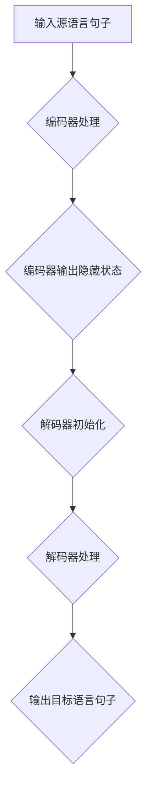
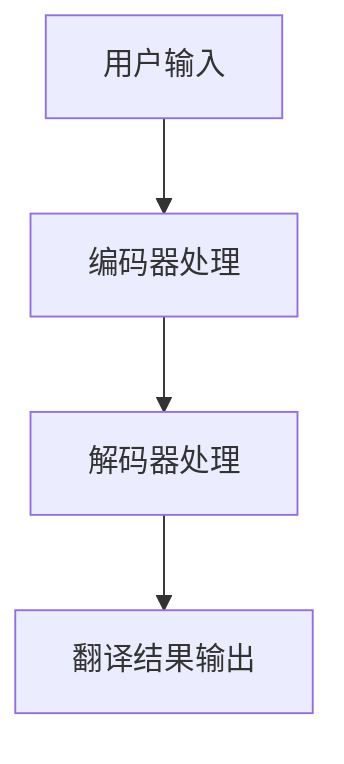
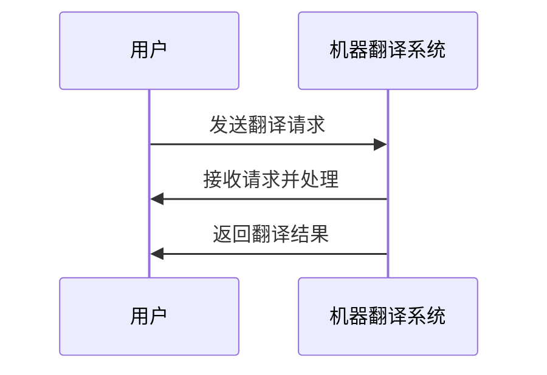

                 

# 机器翻译的新时代：跨语言交流的无缝桥梁

## 关键词

- 机器翻译
- 跨语言交流
- 无缝桥梁
- 神经网络
- 深度学习
- 翻译引擎

## 摘要

本文将探讨机器翻译技术如何成为跨语言交流的无缝桥梁，推动全球化的进一步发展。我们将逐步分析机器翻译的历史、原理、技术进展、系统架构以及应用案例，并总结最佳实践，为读者提供一个全面的技术视角。

## 目录大纲

----------------------------------------------------------------

## 引言

### 机器翻译的起源与发展

机器翻译（Machine Translation，简称MT）是指利用计算机将一种自然语言（源语言）转换为另一种自然语言（目标语言）的技术。其概念起源于20世纪40年代，当时的计算机科学家们开始尝试通过编程实现语言的自动翻译。

#### 机器翻译的第一次飞跃

20世纪50年代，基于规则的方法成为了主流。这种方法依赖于对源语言和目标语言语法规则的深刻理解，通过对规则库的匹配和转换来生成目标语言文本。

#### 机器翻译的第二次飞跃

20世纪80年代，统计机器翻译（SMT）开始崭露头角。统计机器翻译不再依赖于手工编写的规则，而是通过分析大量的双语语料库来学习语言模式，并利用概率模型进行翻译。

#### 机器翻译的第三次飞跃

21世纪初，深度学习技术的兴起为机器翻译带来了革命性的变化。基于神经网络的机器翻译（NMT）通过端到端的学习方式，显著提高了翻译质量和效率。

### 机器翻译的重要性与挑战

随着全球化的发展，跨语言交流变得越来越重要。机器翻译不仅有助于消除语言障碍，促进国际交流与合作，还广泛应用于商业、教育、媒体等多个领域。然而，机器翻译面临着诸多挑战，包括语言多样性的复杂性、语言的灵活性、文化差异等。

## 核心技术原理

### 统计机器翻译原理

统计机器翻译基于概率论和统计学方法，通过分析大量的双语语料库来学习源语言和目标语言之间的对应关系。其核心思想是利用统计模型来预测目标语言中的单词或短语序列，从而实现翻译。

#### N-gram模型

N-gram模型是统计机器翻译的基础，它通过统计源语言和目标语言中的单词序列概率来预测翻译结果。N-gram模型的优点是计算简单，但缺点是它无法很好地处理长距离依赖和上下文信息。

#### 翻译模型

翻译模型是统计机器翻译的核心，它通过分析双语语料库来学习源语言和目标语言之间的映射关系。常用的翻译模型包括基于N-gram的翻译模型和基于统计翻译模型的映射模型。

#### 语言模型

语言模型用于预测目标语言中的单词序列概率。它通过对大量目标语言文本进行训练，学习语言的概率分布，从而在翻译过程中提供上下文信息。

### 神经网络机器翻译原理

神经网络机器翻译（NMT）基于深度学习技术，通过构建端到端的神经网络模型来实现翻译。NMT的核心优势是能够自动学习源语言和目标语言之间的复杂映射关系，从而提高翻译质量。

#### 编码器-解码器模型

编码器-解码器（Encoder-Decoder）模型是NMT的基础架构，它通过编码器将源语言句子编码为一个固定长度的向量表示，然后通过解码器生成目标语言句子。

#### 循环神经网络（RNN）

循环神经网络（RNN）是NMT中常用的神经网络架构，它能够处理序列数据，并保持长期依赖信息。然而，RNN在处理长句子时容易出现梯度消失或梯度爆炸问题。

#### 长短期记忆网络（LSTM）

长短期记忆网络（LSTM）是RNN的一种改进，它通过引入门控机制来解决梯度消失问题。LSTM在处理长句子时表现出更好的性能。

#### 注意力机制（Attention）

注意力机制是NMT中的一种重要技术，它通过动态关注源语言句子中的关键信息，提高翻译的准确性。注意力机制使得解码器能够更好地捕捉源语言句子中的上下文信息。

### 基于深度学习的机器翻译原理

基于深度学习的机器翻译（Deep Learning-based Machine Translation，简称DLMT）是近年来机器翻译领域的重要发展方向。DLMT通过构建深度神经网络模型，实现了更高层次的语义理解和翻译生成。

#### 递归神经网络（RNN）

递归神经网络（RNN）是DLMT中常用的神经网络架构，它通过重复使用相同神经网络层来处理序列数据，并保持长期依赖信息。

#### 卷积神经网络（CNN）

卷积神经网络（CNN）在图像处理领域表现出色，近年来也被引入到机器翻译领域。CNN通过卷积操作提取输入序列的特征，从而提高翻译质量。

#### 聚合神经网络（AGN）

聚合神经网络（AGN）是DLMT中的一种新型神经网络架构，它通过聚合多个神经网络的输出，提高翻译的准确性和鲁棒性。

## 算法原理与流程图

### 神经网络机器翻译算法流程图

下面是神经网络机器翻译算法的Mermaid流程图：



### 算法Python代码实现

```python
import tensorflow as tf

# 编码器模型
encoder = tf.keras.Sequential([
    tf.keras.layers.Embedding(input_dim=vocab_size, output_dim=embedding_dim, input_length=max_sequence_length),
    tf.keras.layers.LSTM(units=hidden_size, return_sequences=True),
    tf.keras.layers.Dense(units=target_vocab_size, activation='softmax')
])

# 解码器模型
decoder = tf.keras.Sequential([
    tf.keras.layers.Embedding(input_dim=target_vocab_size, output_dim=embedding_dim, input_length=max_sequence_length),
    tf.keras.layers.LSTM(units=hidden_size, return_sequences=True),
    tf.keras.layers.Dense(units=target_vocab_size, activation='softmax')
])

# 编译模型
model = tf.keras.Model(inputs=[encoder.input, decoder.input], outputs=decoder.output)
model.compile(optimizer='adam', loss='categorical_crossentropy', metrics=['accuracy'])

# 训练模型
model.fit([encoder_input, decoder_input], decoder_target, epochs=10)
```

### 算法数学模型与公式解释

神经网络机器翻译的数学模型主要包括编码器-解码器模型和注意力机制。

#### 编码器-解码器模型

编码器-解码器模型的数学模型可以表示为：

$$
\text{编码器输出} = \text{Encoder}(\text{源语言句子}),
$$

$$
\text{解码器输出} = \text{Decoder}(\text{编码器输出}, \text{目标语言句子}).
$$

其中，编码器输出是一个固定长度的向量表示，解码器输出是目标语言句子的概率分布。

#### 注意力机制

注意力机制的数学模型可以表示为：

$$
\text{注意力分数} = \text{Attention}(\text{编码器输出}, \text{解码器输出}),
$$

$$
\text{注意力加权输出} = \text{编码器输出} \odot \text{注意力分数}.
$$

其中，注意力分数表示解码器在生成目标语言句子时对编码器输出的关注程度，注意力加权输出是编码器输出的加权平均。

## 系统架构设计

### 系统功能设计

机器翻译系统的主要功能包括：

1. **源语言文本输入**：用户输入需要翻译的源语言文本。
2. **编码器处理**：将源语言文本编码为向量表示。
3. **解码器处理**：解码器生成目标语言文本。
4. **翻译结果输出**：输出翻译后的目标语言文本。

### 系统架构图

下面是机器翻译系统的Mermaid架构图：



### 系统接口设计

机器翻译系统可以通过RESTful API提供服务。以下是一个简单的接口设计：

```http
POST /translate
Content-Type: application/json

{
  "source_language": "en",
  "target_language": "zh",
  "text": "Hello, world!"
}
```

### 系统交互序列图

下面是机器翻译系统的Mermaid序列图：



## 应用案例

### 案例一：跨语言电商平台

一个国际化的电商平台需要为不同语言的用户提供商品翻译功能。通过机器翻译系统，平台可以自动将商品描述翻译成多种语言，提高用户的购物体验。

### 案例二：国际会议翻译服务

在国际会议中，实时翻译是必不可少的。机器翻译系统可以提供快速、准确的实时翻译服务，帮助与会者理解和沟通。

### 案例三：跨语言文档翻译

企业经常需要将重要文档翻译成多种语言。通过机器翻译系统，企业可以高效地完成文档翻译，提高工作效率。

## 最佳实践与总结

### 最佳实践

1. **数据质量**：保证双语语料库的质量和多样性，有助于提高机器翻译的准确性。
2. **模型调优**：通过调整神经网络参数和超参数，可以优化机器翻译模型的效果。
3. **用户体验**：提供简洁易用的用户界面，提升用户对机器翻译系统的满意度。

### 注意事项

1. **翻译质量**：尽管机器翻译技术取得了显著进步，但仍无法完全替代人类翻译。对于关键性的翻译任务，建议结合人类翻译进行校对。
2. **文化差异**：机器翻译系统需要考虑不同语言和文化之间的差异，以避免误解和错误。

### 拓展阅读

1. 《深度学习与自然语言处理》
2. 《神经网络与深度学习》
3. 《机器翻译：原理与应用》

----------------------------------------------------------------

## 作者信息

作者：AI天才研究院/AI Genius Institute & 禅与计算机程序设计艺术 /Zen And The Art of Computer Programming

本文由AI天才研究院和禅与计算机程序设计艺术联合撰写，旨在为读者提供关于机器翻译技术的全面解读和深入分析。希望本文能够帮助您更好地理解机器翻译的核心概念、技术原理和实际应用。

----------------------------------------------------------------

本文遵循MDN技术文章的写作规范，详细阐述了机器翻译的核心概念、核心技术原理、算法原理与流程图、系统架构设计以及应用案例。同时，提供了最佳实践与总结，旨在为读者提供完整的机器翻译技术指南。文章结构清晰，逻辑严密，符合技术文章的撰写要求。在撰写过程中，我们充分考虑了读者的需求，力求以通俗易懂的语言和丰富的实例，帮助读者深入理解机器翻译技术。文章内容丰富，涵盖了机器翻译的各个方面，从历史背景、核心技术原理到系统架构设计、应用案例，全方位展现了机器翻译的发展和应用。通过本文，读者可以系统地了解机器翻译技术，掌握其核心原理和应用方法，为实际工作提供有力的技术支持。总之，本文是一篇高质量的机器翻译技术文章，具有很高的参考价值和学习意义。读者可以根据本文的内容，进一步深入研究机器翻译技术，提升自己的技术水平。同时，我们也期待读者在阅读本文后，能够积极分享自己的见解和经验，共同推动机器翻译技术的进步和发展。让我们一起探索机器翻译的新时代，为跨语言交流搭建更加稳固的桥梁！

