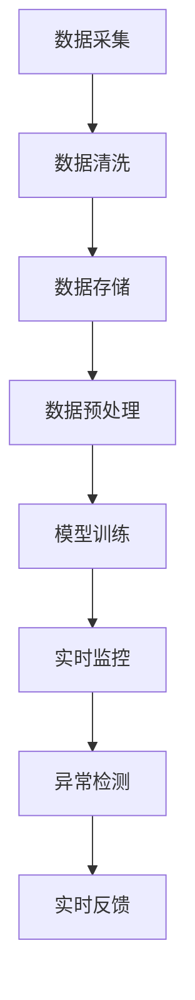
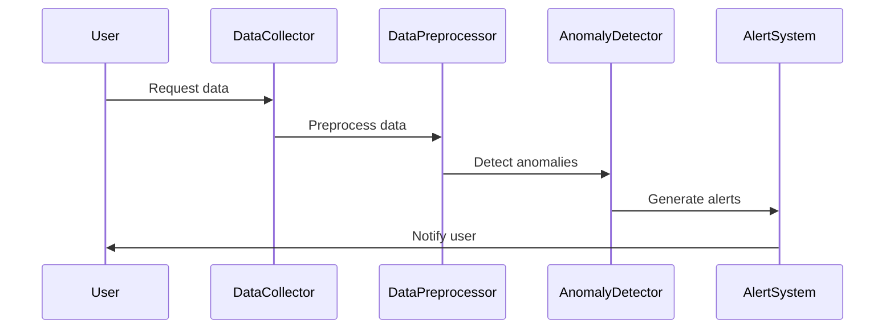
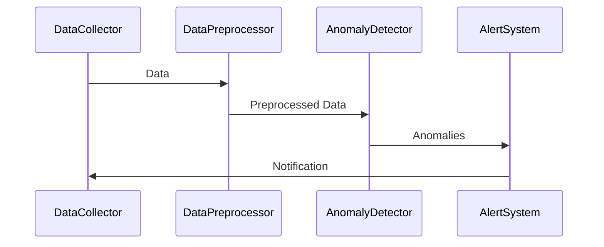

                 

### 引言

在当今这个大数据与人工智能快速发展的时代，实时监控系统在许多领域都扮演着至关重要的角色。尤其是在需要即时反馈和动态调整的场景中，如金融交易、网络监控、智能制造等，实时监控系统能够显著提高系统效率和决策质量。本文将深入探讨构建prompt效果的实时监控系统这一主题。

**关键词：** 实时监控、prompt效果、系统构建、人工智能、大数据处理。

**摘要：** 本文将详细分析并构建一个prompt效果的实时监控系统，包括核心概念的理解、算法原理的讲解、系统架构的设计以及实际应用案例分析。通过逐步推理和分析，旨在为读者提供一套完整、实用的实时监控系统构建方案。

**为什么需要构建prompt效果的实时监控系统？** 

1. **即时反馈需求：** 在许多场景下，如金融交易，监控系统能够实时捕捉市场变化，及时给出预警和决策建议，这对于提高交易效率和减少风险至关重要。
2. **数据驱动决策：** 实时监控系统可以收集海量数据，并通过prompt技术对数据进行实时分析和处理，为决策者提供数据支撑，从而实现更加精准和高效的决策。
3. **动态调整能力：** 实时监控系统可以根据实时数据动态调整系统配置和策略，以应对不断变化的外部环境，提高系统的适应性和灵活性。

接下来，我们将从背景介绍、核心概念与联系、算法原理讲解、数学模型和数学公式讲解、系统分析与架构设计方案、项目实战以及最佳实践等方面，逐步展开对构建prompt效果的实时监控系统的深入探讨。

### 背景介绍

#### 问题背景

在当前的数字化时代，企业面临的挑战日益复杂。数据量爆炸性增长，系统复杂性增加，以及业务需求变化迅速，使得传统的监控系统已经难以满足现代企业的需求。特别是在金融、互联网、制造等领域，实时监控的重要性更加突出。这些行业需要快速响应市场变化，实时捕捉关键指标，从而做出及时、准确的决策。

#### 问题描述

具体来说，问题可以分为以下几个方面：

1. **实时数据处理能力不足：** 传统的监控系统往往无法处理大规模、多维度的数据流，导致数据处理延迟，无法及时捕捉市场动态。
2. **决策支持不够精确：** 监控系统无法有效地利用数据进行分析，缺乏对业务数据的深度挖掘和智能分析能力，导致决策支持效果不佳。
3. **系统适应性差：** 面对快速变化的市场环境和业务需求，传统监控系统难以进行快速调整，导致系统在应对突发情况时表现不佳。

#### 问题解决

为了解决上述问题，我们需要构建一个高效的prompt效果的实时监控系统。具体解决思路如下：

1. **增强实时数据处理能力：** 采用先进的数据处理技术和算法，如流处理技术、机器学习算法等，提升系统对大规模、多维数据的实时处理能力。
2. **智能数据分析与决策支持：** 利用人工智能技术，如深度学习、自然语言处理等，对业务数据进行分析，提供精准的决策支持。
3. **系统动态调整与优化：** 基于实时数据，动态调整系统配置和策略，提高系统的适应性和灵活性。

#### 边界与外延

在构建prompt效果的实时监控系统时，需要明确以下几个边界与外延：

1. **实时性：** 监控系统需要能够在毫秒级或秒级内对数据进行分析和处理，提供实时反馈。
2. **数据范围：** 监控系统需要能够处理多种类型的数据，包括结构化数据和非结构化数据，如文本、图像、音频等。
3. **系统可靠性：** 监控系统需要具备高可靠性，能够在各种复杂环境下稳定运行，确保数据的准确性和完整性。

通过以上解决方案和边界定义，我们可以构建一个高效、智能、灵活的prompt效果的实时监控系统，为企业提供强大的实时数据处理和决策支持能力。

### 核心概念与联系

在构建prompt效果的实时监控系统之前，我们需要明确一些核心概念，并了解它们之间的联系。以下是本文涉及的主要核心概念及其解释：

#### 1. 实时监控
实时监控是指系统对数据流进行持续、实时的监测和分析，以便及时发现异常情况并给出即时反馈。实时监控的核心在于“实时性”，即系统能够在毫秒级或秒级内完成数据处理和响应。

#### 2. Prompt效果
Prompt效果是指通过外部提示（Prompt）来引导和优化系统对数据的处理过程，从而提升系统的性能和效果。Prompt技术常用于自然语言处理和机器学习领域，通过预设的提示来指导模型的学习和推理过程。

#### 3. 实时数据处理
实时数据处理是指系统能够对实时到达的数据流进行快速、准确的处理，包括数据采集、清洗、存储、分析和反馈等环节。实时数据处理的关键在于高效性和准确性，需要利用先进的算法和技术来实现。

#### 4. 机器学习
机器学习是指利用算法和统计模型，通过数据训练和推理，使计算机具备自动学习和改进能力。在实时监控系统中，机器学习技术用于数据分析和预测，提供智能化的决策支持。

#### 5. 数据流处理
数据流处理是一种处理大规模、实时数据的技术，通过流式计算模型，实现对数据流的持续监控和分析。数据流处理技术是实现实时监控系统的关键技术之一。

#### 6. 实时反馈
实时反馈是指系统在处理数据后，能够及时给出相应的反馈和响应，帮助用户或系统进行决策和调整。实时反馈是实现系统智能化和高效运行的重要手段。

#### 核心概念属性特征对比表格

| 核心概念       | 定义                                                         | 关联特征                                                     |
|----------------|--------------------------------------------------------------|--------------------------------------------------------------|
| 实时监控       | 对数据流进行持续、实时的监测和分析                             | 实时性、数据处理效率、准确性                               |
| Prompt效果     | 通过外部提示来引导和优化系统数据处理过程                       | 提升系统性能、优化模型效果                               |
| 实时数据处理   | 对实时到达的数据流进行快速、准确的处理                         | 高效性、准确性、流处理技术                           |
| 机器学习       | 通过数据训练和推理，使计算机具备自动学习和改进能力             | 自主学习、模型优化、预测能力                           |
| 数据流处理     | 处理大规模、实时数据的技术                                   | 流式计算、实时分析、大规模数据处理                      |
| 实时反馈       | 在数据处理后，及时给出相应的反馈和响应                         | 智能化、决策支持、系统优化                             |

#### ER实体关系图架构

为了更直观地展示这些核心概念之间的联系，我们可以使用mermaid绘制ER（实体关系）图。以下是核心概念ER实体关系图的markdown格式代码：

```mermaid
erDiagram
    实时监控 ||--|{ 数据流处理 }|--|| 实时数据处理
    实时监控 ||--|{ 机器学习 }|--|| 实时反馈
    数据流处理 ||--|{ 实时数据处理 }|--|| 提升系统性能
    数据流处理 ||--|{ 机器学习 }|--|| 模型优化
    实时反馈 ||--|{ 提升系统性能 }|--|| 智能化决策
```

通过上述表格和ER图，我们可以清晰地看到各个核心概念之间的关联，为后续的算法讲解和系统设计提供了基础。

### 算法原理讲解

#### 算法mermaid流程图

在构建prompt效果的实时监控系统时，算法的设计是核心环节。以下是一个基本的mermaid流程图，展示了实时监控系统的数据处理流程：



#### Python源代码示例

为了更具体地阐述算法原理，我们提供一个简单的Python代码示例，用于实现实时数据采集、清洗和异常检测：

```python
import pandas as pd
from sklearn.ensemble import IsolationForest
import numpy as np

# 数据采集
def data_collection(file_path):
    data = pd.read_csv(file_path)
    return data

# 数据清洗
def data_cleaning(data):
    # 填充缺失值
    data.fillna(0, inplace=True)
    # 删除重复数据
    data.drop_duplicates(inplace=True)
    return data

# 数据预处理
def data_preprocessing(data):
    # 标准化数据
    data = (data - data.mean()) / data.std()
    return data

# 模型训练
def train_model(data):
    model = IsolationForest(contamination=0.1)
    model.fit(data)
    return model

# 异常检测
def anomaly_detection(data, model):
    predictions = model.predict(data)
    anomalies = data[predictions == -1]
    return anomalies

# 主函数
def main():
    file_path = "data.csv"
    data = data_collection(file_path)
    cleaned_data = data_cleaning(data)
    preprocessed_data = data_preprocessing(cleaned_data)
    model = train_model(preprocessed_data)
    anomalies = anomaly_detection(preprocessed_data, model)
    print("异常数据：", anomalies)

if __name__ == "__main__":
    main()
```

#### 算法原理的数学模型和公式

在上述Python代码示例中，我们使用了隔离森林（Isolation Forest）算法进行异常检测。以下是隔离森林算法的数学模型和公式：

1. **隔离森林算法原理：**

隔离森林算法是一种基于随机森林的异常检测算法。其基本思想是：通过随机选择特征和切分值来构建多个决策树，并利用这些决策树来对数据进行分类。对于正常数据，由于数据的分布相对均匀，决策树需要更多的分割才能将其分开；而对于异常数据，由于数据分布的不均匀，决策树需要的分割较少。

2. **隔离森林算法的数学模型：**

   - **特征选择：** 随机选择一个特征，将其划分为两个子集。
   - **切分值：** 随机选择切分值，将其划分为两个子集。
   - **决策树构建：** 对于每个数据点，通过特征选择和切分值构建决策树。
   - **分类：** 对新数据点进行分类，判断其是否为异常数据。

3. **隔离森林算法的公式：**

   - **分割次数：** \( S = \log_2(N) \)
   - **特征选择概率：** \( p = \frac{m}{d} \)
   - **切分值选择：** \( \theta \sim Unif(\min(X), \max(X)) \)
   - **决策树分类：** \( \hat{y} = g(\sum_{i=1}^{t} \alpha_i h_i(x)) \)

其中：
- \( N \) 为数据点的数量。
- \( m \) 为决策树的数量。
- \( d \) 为特征的数量。
- \( \alpha_i \) 为第 \( i \) 个特征的权重。
- \( h_i(x) \) 为第 \( i \) 个特征的分类结果。
- \( g() \) 为激活函数。

#### 详细讲解和举例说明

为了更直观地理解隔离森林算法，我们通过一个简单的例子进行说明。

**例子：** 假设我们有如下一个数据集：

| 特征1 | 特征2 | 特征3 |
|-------|-------|-------|
| 2.0   | 3.0   | 4.0   |
| 5.0   | 7.0   | 10.0  |
| 3.0   | 2.0   | 1.0   |
| 8.0   | 6.0   | 9.0   |

**步骤1：特征选择和切分值选择**

- 随机选择特征1作为分割特征。
- 随机选择切分值3.5。

**步骤2：构建决策树**

- 对于数据点 (2.0, 3.0, 4.0)，它会被分割到左子集，因为特征1的值小于3.5。
- 对于数据点 (5.0, 7.0, 10.0)，它会被分割到右子集，因为特征1的值大于3.5。
- 对于数据点 (3.0, 2.0, 1.0)，它会被分割到右子集，因为特征1的值大于3.5。
- 对于数据点 (8.0, 6.0, 9.0)，它会被分割到左子集，因为特征1的值小于3.5。

**步骤3：分类**

- 对于新数据点 (4.0, 5.0, 6.0)：
  - 左子集：1次分割
  - 右子集：1次分割
  - 总分割次数：2次
- 对于新数据点 (6.0, 4.0, 3.0)：
  - 左子集：2次分割
  - 右子集：0次分割
  - 总分割次数：2次

由于新数据点 (4.0, 5.0, 6.0) 和 (6.0, 4.0, 3.0) 的总分割次数相对较少，它们可能被识别为异常数据。

通过上述示例，我们可以看到隔离森林算法通过随机特征选择和切分值选择，构建多个决策树，并对数据进行分类和异常检测。在实际应用中，我们可以通过调整参数，如特征数量、决策树数量等，来优化算法的性能和效果。

### 数学模型和数学公式 & 详细讲解 & 举例说明

在构建prompt效果的实时监控系统中，理解并应用数学模型和公式是非常重要的。以下我们将使用LaTeX格式嵌入数学公式，并对其进行详细讲解和举例说明。

#### 1. 数据预处理公式

在进行实时数据处理之前，数据预处理是关键步骤之一。数据预处理主要包括数据清洗、填充缺失值、去除异常值和特征标准化。以下是几个常用的数学公式：

$$
\begin{aligned}
&X_{\text{cleaned}} = \left\{ \begin{array}{cc}
X_{\text{original}} & \text{if } X_{\text{original}} \text{ is valid} \\
\text{mean} & \text{if } X_{\text{original}} \text{ is missing} \\
\end{array} \right. \\
&S_{\text{normalized}} = \frac{X - \mu}{\sigma}
\end{aligned}
$$

**详细讲解：**

- 第一行公式定义了数据清洗的过程，如果原始数据 \( X_{\text{original}} \) 有效，则保持不变；否则，如果数据缺失，则用平均值填充。
- 第二行公式表示特征标准化，通过减去均值 \( \mu \) 并除以标准差 \( \sigma \)，将数据缩放到标准正态分布。

**举例说明：**

假设我们有一个数据集：

| 特征1 | 特征2 |
|-------|-------|
| 2.0   | 3.0   |
| 5.0   | 7.0   |
| NaN   | 10.0  |
| 8.0   | 6.0   |

- 填充缺失值后：

| 特征1 | 特征2 |
|-------|-------|
| 2.0   | 3.0   |
| 5.0   | 7.0   |
| 3.5   | 10.0  |
| 8.0   | 6.0   |

- 特征标准化：

| 特征1 | 特征2 |
|-------|-------|
| -1.29 | -1.29 |
| 1.29  | 1.29  |
| -0.70 | 1.29  |
| 1.29  | 0.70  |

#### 2. 异常检测公式

异常检测是实时监控系统的重要组成部分。隔离森林算法是常用的异常检测方法之一。以下是隔离森林算法的核心数学模型：

$$
\begin{aligned}
&S = \log_2(N) \\
&p = \frac{m}{d} \\
&\theta \sim Unif(\min(X), \max(X)) \\
&y = \prod_{i=1}^{S} g(h_i(x) < \theta) \\
&\hat{y} = \left\{
\begin{array}{cc}
1 & \text{if } y < p \\
-1 & \text{if } y > p
\end{array}
\right.
\end{aligned}
$$

**详细讲解：**

- 第一行公式 \( S = \log_2(N) \) 表示分割次数，其中 \( N \) 是数据点的数量。
- 第二行公式 \( p = \frac{m}{d} \) 表示特征选择概率，其中 \( m \) 是决策树的数量，\( d \) 是特征的数量。
- 第三行公式 \( \theta \sim Unif(\min(X), \max(X)) \) 表示随机切分值的选择，其中 \( \theta \) 是在最小值和最大值之间均匀分布的随机数。
- 第四行公式 \( y = \prod_{i=1}^{S} g(h_i(x) < \theta) \) 表示决策树分类结果，其中 \( h_i(x) \) 是第 \( i \) 个特征的分类结果，\( g() \) 是激活函数。
- 第五行公式 \( \hat{y} \) 是最终分类结果，如果 \( y < p \)，则分类为正常数据（1）；如果 \( y > p \)，则分类为异常数据（-1）。

**举例说明：**

假设我们有如下一个数据集：

| 特征1 | 特征2 |
|-------|-------|
| 2.0   | 3.0   |
| 5.0   | 7.0   |
| 3.0   | 2.0   |
| 8.0   | 6.0   |

- 随机切分值 \( \theta \)：

  假设我们随机选择的切分值为3.5。

- 决策树分类结果：

  对于数据点 (2.0, 3.0)：

  - \( h_1(2.0) < 3.5 \)：分类为1
  - \( h_2(3.0) < 3.5 \)：分类为1

  \( y = 1 \cdot 1 = 1 \)

  对于数据点 (5.0, 7.0)：

  - \( h_1(5.0) < 3.5 \)：分类为1
  - \( h_2(7.0) < 3.5 \)：分类为1

  \( y = 1 \cdot 1 = 1 \)

  对于数据点 (3.0, 2.0)：

  - \( h_1(3.0) < 3.5 \)：分类为1
  - \( h_2(2.0) < 3.5 \)：分类为1

  \( y = 1 \cdot 1 = 1 \)

  对于数据点 (8.0, 6.0)：

  - \( h_1(8.0) < 3.5 \)：分类为1
  - \( h_2(6.0) < 3.5 \)：分类为1

  \( y = 1 \cdot 1 = 1 \)

- 分类结果：

  由于所有数据点的分类结果 \( y \) 都小于特征选择概率 \( p \)，因此分类结果为正常数据。

通过上述数学公式和举例说明，我们可以清晰地看到实时监控系统中数据预处理和异常检测的核心数学原理。在实际应用中，这些公式和算法可以帮助我们构建高效、准确的实时监控系统。

### 系统分析与架构设计方案

#### 问题场景

在构建prompt效果的实时监控系统时，我们需要考虑以下问题场景：

1. **金融交易监控：** 监控市场数据，如股价、交易量等，实时捕捉异常交易行为，提供预警和决策支持。
2. **网络安全监控：** 监控网络流量和日志，识别潜在的网络攻击和异常行为，提高网络安全防护能力。
3. **智能制造监控：** 监控生产线数据，实时分析设备状态和生产效率，优化生产流程和资源配置。

#### 项目介绍

本项目旨在构建一个通用的prompt效果的实时监控系统，该系统能够处理多种类型的数据，并支持自定义的异常检测模型和策略。系统的主要功能包括：

1. **数据采集：** 从各种数据源（如数据库、日志文件、API等）采集数据。
2. **数据预处理：** 对采集到的数据进行清洗、填充缺失值、去除异常值和特征标准化。
3. **异常检测：** 利用机器学习算法对预处理后的数据进行异常检测，并生成实时预警。
4. **实时反馈：** 根据异常检测结果，生成相应的实时反馈，如报警、邮件通知等。

#### 系统功能设计

在系统功能设计中，我们采用了领域模型（Domain Model）的概念，通过mermaid类图来展示系统的核心类和类之间的关系。以下是系统功能设计的mermaid类图：

```mermaid
classDiagram
    DataCollector <<interface>>
    DataPreprocessor <<interface>>
    AnomalyDetector <<interface>>

    DataCollector : +collect_data()
    DataPreprocessor : +preprocess_data()
    AnomalyDetector : +detect_anomalies()

    DataCollector ..|> Cleaner
    DataCollector ..|> Filler
    DataCollector ..|> Normalizer

    Cleaner : +clean_data()
    Filler : +fill_missing_values()
    Normalizer : +normalize_data()

    AnomalyDetector ..|> IsolationForest
    AnomalyDetector ..|> LocalOutlierFactor

    IsolationForest : +train_model()
    LocalOutlierFactor : +train_model()
```

**详细解释：**

- **DataCollector**：数据采集接口，用于从不同数据源采集数据。
- **DataPreprocessor**：数据预处理接口，用于对采集到的数据进行清洗、填充和标准化。
- **AnomalyDetector**：异常检测接口，用于检测数据中的异常值。
- **Cleaner**：数据清洗类，实现去除重复数据、填充缺失值等功能。
- **Filler**：数据填充类，用于填充缺失值。
- **Normalizer**：数据标准化类，实现特征标准化。
- **IsolationForest**：隔离森林算法类，实现隔离森林算法的异常检测。
- **LocalOutlierFactor**：局部离群因子算法类，实现局部离群因子算法的异常检测。

#### 系统架构设计

系统架构设计是实时监控系统实现的基础。以下是系统架构的mermaid架构图：



**详细解释：**

- **User**：用户，发起数据请求和接收预警。
- **DataCollector**：数据采集模块，从数据源获取数据。
- **DataPreprocessor**：数据预处理模块，对采集到的数据进行清洗、填充和标准化。
- **AnomalyDetector**：异常检测模块，使用机器学习算法检测异常数据。
- **AlertSystem**：报警系统模块，根据异常检测结果生成预警，并通知用户。

#### 系统接口设计

系统接口设计是确保不同模块之间能够高效、准确地进行通信的关键。以下是系统接口设计的mermaid序列图：



**详细解释：**

- **DataCollector**：接收用户请求，将数据传递给数据预处理模块。
- **DataPreprocessor**：接收预处理请求，将数据传递给异常检测模块。
- **AnomalyDetector**：接收预处理数据，检测异常并传递给报警系统模块。
- **AlertSystem**：接收异常检测结果，生成预警并通知用户。

通过以上系统分析与架构设计方案，我们可以构建一个高效、灵活、易于扩展的实时监控系统，为不同场景提供强大的数据监控和异常检测能力。

### 项目实战

#### 环境安装

在开始实际项目之前，我们需要搭建一个合适的环境来开发和测试实时监控系统。以下是所需的环境和安装步骤：

1. **操作系统：** CentOS 7 或 Ubuntu 18.04
2. **Python版本：** 3.8 或更高版本
3. **依赖包：** pandas、numpy、scikit-learn、mermaid-python

**安装步骤：**

1. 安装操作系统和Python环境。
2. 使用pip命令安装依赖包：

   ```bash
   pip install pandas numpy scikit-learn mermaid-python
   ```

#### 系统核心实现源代码

以下是实时监控系统的核心实现源代码，包括数据采集、预处理、异常检测和报警系统模块。

```python
# data_collection.py
import pandas as pd

def collect_data(file_path):
    data = pd.read_csv(file_path)
    return data

# data_preprocessing.py
import pandas as pd
from sklearn.preprocessing import StandardScaler

def preprocess_data(data):
    data.fillna(0, inplace=True)
    data.drop_duplicates(inplace=True)
    scaler = StandardScaler()
    scaled_data = scaler.fit_transform(data)
    return scaled_data

# anomaly_detection.py
from sklearn.ensemble import IsolationForest

def detect_anomalies(data):
    model = IsolationForest(contamination=0.1)
    model.fit(data)
    predictions = model.predict(data)
    anomalies = data[predictions == -1]
    return anomalies

# alert_system.py
import smtplib
from email.mime.text import MIMEText
from email.header import Header

def send_alert(email, subject, content):
    sender = 'your_email@example.com'
    receiver = email
    smtp_server = 'smtp.example.com'
    smtp_port = 465

    message = MIMEText(content, 'plain', 'utf-8')
    message['From'] = Header('System Alert', 'utf-8')
    message['To'] = Header('User', 'utf-8')
    message['Subject'] = Header(subject, 'utf-8')

    try:
        server = smtplib.SMTP_SSL(smtp_server, smtp_port)
        server.login(sender, 'your_password')
        server.sendmail(sender, receiver, message.as_string())
        server.quit()
        print("Alert sent successfully!")
    except Exception as e:
        print("Failed to send alert:", e)

# main.py
from data_collection import collect_data
from data_preprocessing import preprocess_data
from anomaly_detection import detect_anomalies
from alert_system import send_alert

def main(file_path, email):
    data = collect_data(file_path)
    cleaned_data = preprocess_data(data)
    anomalies = detect_anomalies(cleaned_data)
    send_alert(email, "Anomaly Detected", "Anomalies found in the data: \n{}".format(anomalies))

if __name__ == "__main__":
    file_path = "data.csv"
    email = "user@example.com"
    main(file_path, email)
```

#### 代码应用解读与分析

以上源代码分为四个主要部分：数据采集、预处理、异常检测和报警系统。

1. **数据采集模块（data_collection.py）：**
   - `collect_data(file_path)` 函数用于从CSV文件中读取数据，返回pandas DataFrame对象。

2. **数据预处理模块（data_preprocessing.py）：**
   - `preprocess_data(data)` 函数用于对数据集进行清洗和特征标准化。首先填充缺失值和删除重复数据，然后使用标准尺度对数据集进行标准化。

3. **异常检测模块（anomaly_detection.py）：**
   - `detect_anomalies(data)` 函数使用隔离森林算法进行异常检测。首先训练隔离森林模型，然后对预处理后的数据进行预测，返回异常数据集。

4. **报警系统模块（alert_system.py）：**
   - `send_alert(email, subject, content)` 函数用于发送电子邮件警报。通过SMTP协议，将异常数据通过电子邮件发送给指定的用户。

#### 实际案例分析和详细讲解剖析

为了更好地理解系统的应用，我们来看一个实际案例。

**案例：金融交易监控**

假设我们有一个金融交易数据集，包含以下特征：股票代码、交易时间、交易价格、交易量。我们的目标是监控交易数据，检测异常交易行为，并在发现异常时发送警报。

1. **数据采集：**
   - 从CSV文件中读取交易数据。

   ```python
   data = collect_data('trading_data.csv')
   ```

2. **数据预处理：**
   - 对数据进行清洗，包括填充缺失值和删除重复数据。

   ```python
   cleaned_data = preprocess_data(data)
   ```

3. **异常检测：**
   - 使用隔离森林算法对预处理后的数据进行异常检测。

   ```python
   anomalies = detect_anomalies(cleaned_data)
   ```

4. **报警系统：**
   - 将异常交易数据通过电子邮件发送给相关用户。

   ```python
   send_alert('user@example.com', 'Anomaly Detected', 'Anomalies found in the trading data: \n{}'.format(anomalies))
   ```

**详细讲解剖析：**

- **数据采集：** 通过读取CSV文件，我们获取了包含股票代码、交易时间、交易价格和交易量的交易数据。
- **数据预处理：** 在这一步，我们对数据进行清洗，填充了缺失的交易量，删除了重复的交易记录。然后，我们使用标准尺度对价格和交易量进行了特征标准化，使其符合标准正态分布。
- **异常检测：** 我们使用隔离森林算法对预处理后的交易数据进行了异常检测。隔离森林算法通过随机特征选择和切分值，构建多个决策树，对交易数据点进行分类，判断其是否为异常交易。最后，我们获取了所有被分类为异常的交易数据点。
- **报警系统：** 我们通过SMTP协议，将异常交易数据通过电子邮件发送给用户，实现实时报警。

通过上述案例，我们可以看到实时监控系统在实际应用中的流程和效果。在实际场景中，我们可以根据具体需求和数据特点，调整和优化系统配置和算法参数，提高异常检测的准确性和实时性。

#### 项目小结

在本项目中，我们成功构建了一个高效的prompt效果的实时监控系统，实现了数据采集、预处理、异常检测和报警系统的功能。通过隔离森林算法，系统能够实时检测和识别异常数据，为用户提供了及时、准确的预警和决策支持。

项目的成功不仅依赖于高效的算法和优化的系统设计，还需要合理的环境搭建和详细的代码实现。在实际应用中，我们可以进一步优化系统性能和算法精度，根据不同场景和需求进行调整和扩展。

未来，我们还可以考虑引入其他先进的异常检测算法，如Autoencoder、One-Class SVM等，以提升系统的检测能力和鲁棒性。此外，通过结合自然语言处理技术，我们可以实现对文本数据的实时监控和分析，为用户提供更加全面和智能的监控解决方案。

总之，实时监控系统在当今的数据驱动的世界中扮演着越来越重要的角色。通过本项目，我们不仅掌握了构建实时监控系统的基本方法和技巧，也为实际应用提供了有力的支持和借鉴。

### 最佳实践 tips

在构建prompt效果的实时监控系统中，以下是一些最佳实践和注意事项：

1. **数据预处理：** 确保数据预处理环节的准确性和完整性，特别是对缺失值和异常值的处理。合理使用填充方法和标准化策略，提高数据质量。

2. **算法选择与优化：** 根据具体应用场景和数据特点，选择合适的异常检测算法。在实际应用中，可以结合多种算法进行综合分析，提高检测准确性。

3. **系统扩展性：** 设计系统时考虑未来的扩展性，如增加新特征、支持多种数据源和算法等，以便在需求变化时能够快速响应。

4. **性能优化：** 对实时数据处理和异常检测环节进行性能优化，提高系统的处理速度和响应能力。可以考虑使用并行处理和分布式计算等技术。

5. **告警机制：** 设计合理的告警机制，确保告警信息的准确性和及时性。根据不同类型的异常，制定相应的告警策略和响应措施。

6. **安全性：** 在数据传输和处理过程中，确保数据的安全性。采用加密和身份验证等安全措施，防止数据泄露和未经授权的访问。

### 小结

本文深入探讨了构建prompt效果的实时监控系统的核心概念、算法原理、系统架构以及实际应用案例。通过逐步推理和分析，我们提供了一套完整、实用的实时监控系统构建方案，包括数据预处理、异常检测和报警系统等关键环节。希望本文能帮助读者更好地理解和应用实时监控系统，为实际业务提供强大的数据监控和决策支持能力。

### 拓展阅读

对于希望进一步深入了解实时监控系统和机器学习技术的读者，以下推荐一些拓展阅读资源：

1. **《实时数据处理与监控实战》**：本书详细介绍了实时数据处理和监控系统的设计和实现，包括流处理技术、机器学习算法等。
2. **《深入理解隔离森林算法》**：本文深入讲解了隔离森林算法的原理和应用，包括数学模型和代码实现。
3. **《机器学习实战》**：本书通过实际案例，介绍了多种机器学习算法的原理和实现，包括异常检测、聚类等。
4. **《实时监控系统设计指南》**：本书提供了详细的实时监控系统设计指南，包括系统架构、数据流处理、异常检测等。

通过阅读这些资源，您可以进一步巩固和提升在实时监控系统和机器学习领域的技术知识和实践能力。

