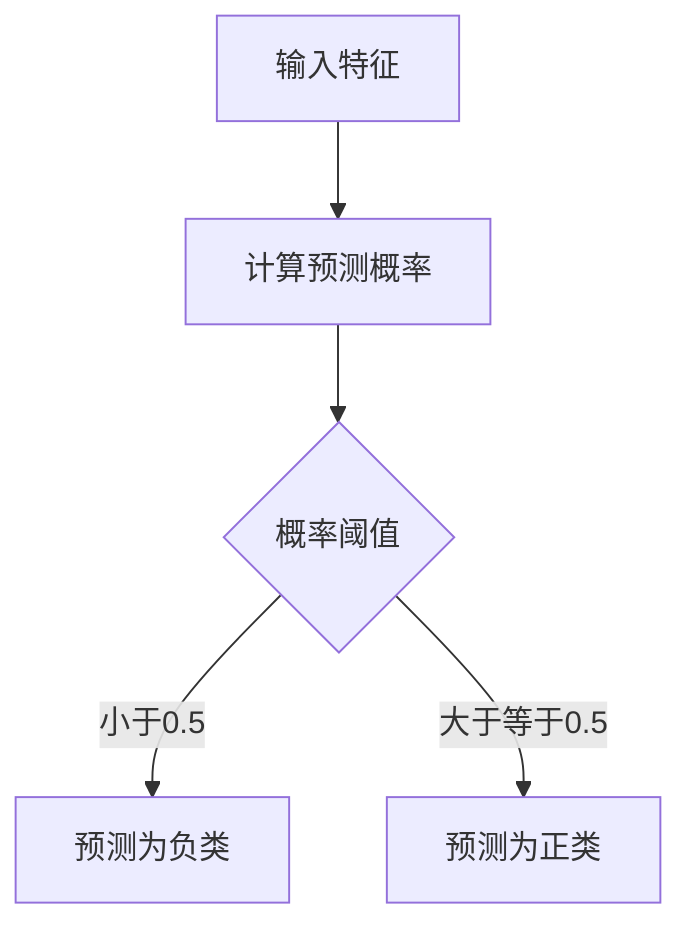
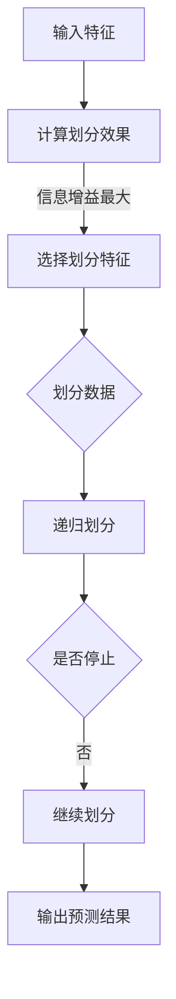
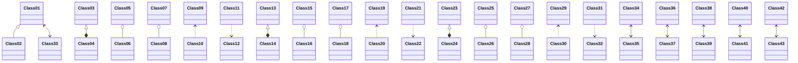
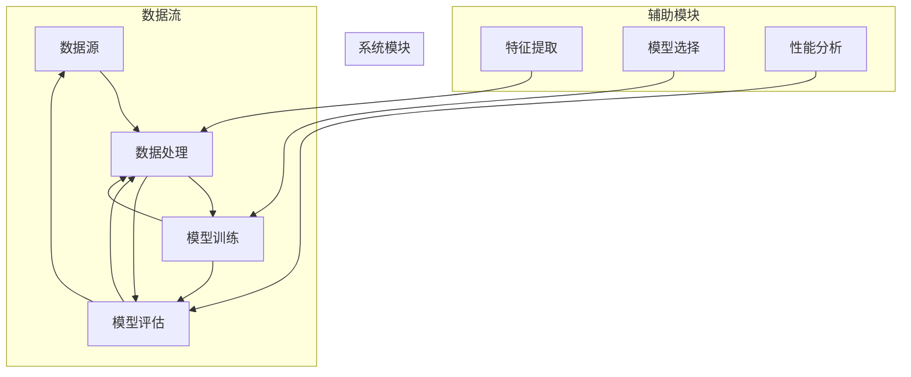
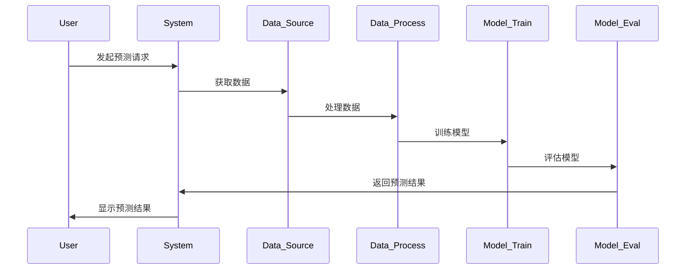

                 

# 引言

## 1.1 书籍主题介绍

在当今人工智能和大数据的时代，prompt效果的预测性评测系统成为了许多应用领域的关键技术。prompt效果，即输入提示信息的有效性，对于人工智能模型的学习和表现具有至关重要的影响。而预测性评测系统，则是一种用于评估和预测模型性能的工具，它在优化模型、提高准确性、减少错误率等方面起着至关重要的作用。

本书的主题是《构建prompt效果的预测性评测系统》，旨在为广大数据科学家、机器学习工程师和AI研发人员提供一套系统、全面且易于理解的指导方案。通过深入探讨prompt效果和预测性评测系统的核心概念、算法原理、系统设计以及项目实战，本书希望能够帮助读者全面掌握这一领域的核心技术，从而在实际应用中取得更好的效果。

## 1.2 目标读者与学习目标

本书的目标读者主要包括以下几类人群：

1. 数据科学家：希望深入了解prompt效果预测性评测系统的原理和应用，以提升模型性能和准确性的专业人士。
2. 机器学习工程师：致力于构建高效、可靠的预测模型，并希望掌握预测性评测系统的研发方法和技巧。
3. AI研发人员：希望拓展自己的技术视野，了解前沿的AI评测技术，并应用于实际项目开发中。

通过阅读本书，读者可以期望达到以下学习目标：

1. 掌握prompt效果的基本概念和重要性。
2. 理解预测性评测系统的核心原理和组成部分。
3. 学会使用关键算法进行预测性评测，并能熟练运用Python代码进行实现。
4. 掌握系统设计和架构设计的方法，并能将其应用于实际项目开发中。
5. 通过项目实战，提升实际操作能力和问题解决能力。

## 1.3 书籍结构概述

本书共分为四个主要部分：

1. **背景知识**：介绍机器学习、prompt效果和预测性评测系统的基础知识，为后续内容的学习奠定基础。
2. **核心概念**：深入探讨prompt效果和预测性评测系统的核心概念，包括定义、属性、相关技术等。
3. **算法原理**：详细讲解预测性评测系统的关键算法，包括评价指标、算法原理、流程图和Python代码实现。
4. **系统设计**：介绍系统架构设计、领域模型、系统架构、接口设计和交互流程，并通过具体案例进行实践。
5. **项目实战**：通过实际项目，展示如何构建预测性评测系统，包括环境安装、系统核心实现、代码解读和案例分析。

通过以上四个部分的学习，读者将能够全面掌握预测性评测系统的构建方法和应用技巧，为实际工作提供有力支持。接下来，我们将逐章深入探讨每一个主题，让读者在一步步的学习中，逐步构建起对这一领域的深刻理解。# 背景知识

## 第1章 机器学习基础

### 1.1 机器学习的定义和分类

机器学习（Machine Learning，ML）是人工智能（Artificial Intelligence，AI）的一个重要分支，主要研究如何从数据中自动学习规律和模式，并利用这些规律和模式进行预测和决策。根据学习方式的不同，机器学习主要分为以下几类：

1. **监督学习（Supervised Learning）**：监督学习是最常见的机器学习方法，它使用已标记的数据集进行训练，通过学习输入和输出之间的映射关系，实现对未知数据的预测。监督学习又可以分为回归（Regression）和分类（Classification）两种形式。
   
2. **无监督学习（Unsupervised Learning）**：无监督学习使用未标记的数据集进行训练，主要目标是发现数据中的内在结构和模式。无监督学习包括聚类（Clustering）、降维（Dimensionality Reduction）和关联规则学习（Association Rule Learning）等。

3. **半监督学习（Semi-supervised Learning）**：半监督学习结合了监督学习和无监督学习的特点，利用少量标记数据和大量未标记数据进行训练，以提高模型性能。

4. **强化学习（Reinforcement Learning）**：强化学习是一种通过试错和反馈进行学习的方法，智能体在与环境的交互过程中不断优化策略，以实现最大化奖励。

### 1.2 机器学习的基本概念

1. **模型（Model）**：模型是机器学习中用于表示数据特征和规律的工具。常见的模型包括线性回归模型、决策树、支持向量机（SVM）、神经网络等。

2. **特征（Feature）**：特征是描述数据属性的指标，是构建模型的关键要素。特征的选择和工程对模型性能有着重要影响。

3. **超参数（Hyperparameter）**：超参数是模型在训练过程中需要调整的参数，如学习率、正则化参数等。超参数的设置对模型性能有显著影响。

4. **损失函数（Loss Function）**：损失函数用于评估模型预测结果与真实值之间的差距，常见的损失函数包括均方误差（MSE）、交叉熵损失（Cross-Entropy Loss）等。

5. **评估指标（Evaluation Metrics）**：评估指标用于衡量模型性能，如准确率（Accuracy）、召回率（Recall）、精确率（Precision）、F1值等。

### 1.3 机器学习的应用领域

机器学习在各个领域都有广泛的应用，以下是一些常见的应用领域：

1. **自然语言处理（Natural Language Processing，NLP）**：NLP是机器学习的一个重要应用领域，涉及文本分析、情感分析、机器翻译、问答系统等。

2. **计算机视觉（Computer Vision）**：计算机视觉通过分析图像和视频数据，实现物体识别、图像分类、目标检测等任务。

3. **金融领域**：机器学习在金融领域应用于风险管理、信用评分、交易策略优化等。

4. **医疗领域**：机器学习在医疗领域应用于疾病诊断、药物发现、个性化医疗等。

5. **交通领域**：机器学习在交通领域应用于智能交通系统、自动驾驶车辆等。

### 1.4 机器学习的挑战与未来发展趋势

尽管机器学习在许多领域取得了显著成果，但仍面临一些挑战和难题：

1. **数据隐私和安全**：在处理大量个人数据时，如何保护用户隐私和安全是一个重要问题。

2. **模型可解释性**：随着深度学习等复杂模型的广泛应用，如何解释模型决策过程、提高模型可解释性成为一个挑战。

3. **算法公平性**：确保算法在决策过程中不产生歧视性结果，实现公平性是一个重要任务。

未来，机器学习的发展趋势包括：

1. **模型压缩和优化**：为了适应移动设备和边缘计算，需要开发更高效的模型压缩和优化方法。

2. **联邦学习（Federated Learning）**：通过分布式学习，提高数据隐私性和计算效率。

3. **增强学习与实际应用结合**：将增强学习应用于更多实际场景，如自动驾驶、游戏等。

4. **多模态学习**：结合多种数据类型（如文本、图像、语音等），实现更丰富的应用场景。

通过以上对机器学习基础的介绍，我们为后续章节的深入学习奠定了基础。在接下来的内容中，我们将进一步探讨prompt效果的概念、预测性评测系统的核心原理和算法设计，帮助读者全面掌握构建预测性评测系统的关键技术。## 第2章 prompt效果的概念与重要性

### 2.1 prompt的定义

prompt，中文可译为“提示”，在机器学习中指的是输入给模型的数据，用于引导模型的学习和决策过程。prompt可以是一个单词、一个句子，或者是一段文本，其目的是为模型提供上下文信息，帮助模型更好地理解和处理输入数据。

在自然语言处理（NLP）领域，prompt的应用尤为广泛。例如，在生成式对话系统中，prompt通常是一段用户输入的文本，系统根据prompt生成相应的回复。在文本分类任务中，prompt通常是一个待分类的句子或段落，模型需要根据prompt判断其类别。

### 2.2 prompt的作用

prompt在机器学习模型中扮演着重要角色，主要体现在以下几个方面：

1. **增强上下文理解**：通过提供额外的上下文信息，prompt可以帮助模型更好地理解输入数据，从而提高模型的准确性和泛化能力。

2. **引导学习过程**：prompt为模型提供了明确的任务目标，帮助模型在学习过程中集中注意力，减少无关信息的干扰。

3. **提高模型性能**：在某些任务中，如对话系统和问答系统，prompt的质量直接影响到模型的表现。高质量的prompt可以显著提升模型的性能和用户体验。

4. **多模态学习**：prompt不仅可以是文本，还可以是图像、声音等多模态数据，这为模型处理复杂数据提供了更多的可能性。

### 2.3 prompt的种类

根据应用场景和任务的不同，prompt可以分为以下几种类型：

1. **固定prompt**：固定prompt是预先定义好的，不随输入数据变化而变化的提示信息。例如，在问答系统中，问题本身就是一个固定prompt。

2. **动态prompt**：动态prompt是根据输入数据实时生成的提示信息。例如，在生成式对话系统中，每个用户的输入都可能生成不同的动态prompt。

3. **多模态prompt**：多模态prompt包含多种类型的数据，如文本、图像、声音等。这种类型的prompt能够提供更丰富的上下文信息，有助于模型更好地理解和处理输入数据。

4. **增强prompt**：增强prompt是通过对原始数据进行预处理和增强，生成的更具代表性的提示信息。例如，通过词性标注、命名实体识别等手段，增强文本数据的语义信息。

### 2.4 prompt效果的衡量

prompt效果可以通过多种指标进行衡量，包括：

1. **准确率（Accuracy）**：准确率是衡量预测结果与真实值一致性的指标，适用于分类任务。高准确率表明模型对输入数据的理解和预测能力较强。

2. **召回率（Recall）**：召回率是衡量模型能够识别出所有真实正例的能力，适用于分类任务。高召回率表明模型能够尽可能多地识别出真实正例。

3. **精确率（Precision）**：精确率是衡量模型预测为正例的样本中，实际为正例的比例，适用于分类任务。高精确率表明模型对正例样本的预测准确性较高。

4. **F1值（F1 Score）**：F1值是精确率和召回率的加权平均，适用于分类任务。F1值能够综合考虑模型的精确率和召回率，是一个综合评价指标。

5. **ROC曲线与AUC值**：ROC曲线是衡量分类模型性能的重要工具，通过绘制真阳性率（True Positive Rate，TPR）与假阳性率（False Positive Rate，FPR）的关系曲线。AUC值是ROC曲线下的面积，用于衡量模型的分类能力。

通过以上对prompt效果的探讨，我们可以看到prompt在机器学习中的重要性。在接下来的章节中，我们将进一步探讨预测性评测系统的核心概念和原理，帮助读者深入理解如何构建和优化预测性评测系统。## 第3章 预测性评测系统的核心原理

### 3.1 预测性评测系统的定义

预测性评测系统（Predictive Evaluation System）是一种用于评估和预测模型性能的工具，通过系统地收集和分析模型预测结果与真实值的差距，帮助研发人员了解模型的准确度、稳定性和可靠性。预测性评测系统通常包括数据准备、模型评估指标设计、评测流程和结果分析等组成部分。

### 3.2 评测系统的组成部分

1. **数据准备**：数据准备是预测性评测系统的第一步，主要包括数据清洗、数据预处理和特征工程等任务。数据清洗旨在去除噪声和异常值，提高数据质量；数据预处理包括归一化、标准化等操作，使数据更适合模型训练；特征工程则通过构建和选择有效的特征，提高模型的性能和泛化能力。

2. **模型评估指标**：模型评估指标是评测系统中的核心，用于量化模型在预测任务中的表现。常见的评估指标包括准确率、召回率、精确率、F1值、ROC曲线与AUC值等。这些指标从不同角度反映了模型的性能，可以帮助研发人员全面了解模型的优缺点。

3. **评测流程**：评测流程包括模型的训练、验证和测试等步骤。在训练阶段，模型通过学习训练数据中的特征和规律进行训练；在验证阶段，模型在验证数据集上进行性能评估，以调整模型参数和超参数；在测试阶段，模型在测试数据集上进行最终评估，以检验模型的泛化能力和可靠性。

4. **结果分析**：结果分析是对评测过程和结果的总结和反思，旨在发现模型中的问题和改进方向。结果分析包括对评估指标进行统计和分析、绘制性能曲线、识别异常值和偏差等。通过结果分析，研发人员可以优化模型设计和参数设置，提高模型性能和稳定性。

### 3.3 预测性评测的流程

预测性评测的流程可以分为以下几个步骤：

1. **数据收集**：收集用于训练、验证和测试的数据集，确保数据质量和多样性。

2. **数据预处理**：对收集到的数据进行清洗、预处理和特征工程，为模型训练和评估做好准备。

3. **模型训练**：使用训练数据集对模型进行训练，通过迭代优化模型参数和超参数，提高模型性能。

4. **模型验证**：在验证数据集上评估模型性能，调整模型参数和超参数，以优化模型表现。

5. **模型测试**：在测试数据集上对模型进行最终评估，检验模型的泛化能力和可靠性。

6. **结果分析**：对评测结果进行统计和分析，识别模型中的问题和改进方向，为后续优化提供依据。

### 3.4 预测性评测的关键算法

预测性评测系统中的关键算法主要包括以下几种：

1. **回归算法**：回归算法用于预测连续值输出，常见的回归算法包括线性回归、决策树回归和随机森林回归等。

2. **分类算法**：分类算法用于预测离散值输出，常见的分类算法包括逻辑回归、支持向量机（SVM）和决策树分类等。

3. **聚类算法**：聚类算法用于发现数据中的潜在结构和模式，常见的聚类算法包括K-means、层次聚类和DBSCAN等。

4. **评估指标计算**：评估指标计算是预测性评测系统的核心环节，常见的评估指标包括准确率、召回率、精确率、F1值、ROC曲线与AUC值等。

### 3.5 预测性评测的挑战与应对策略

尽管预测性评测系统在模型性能评估和优化方面具有重要意义，但在实际应用中仍面临一些挑战：

1. **数据不足**：数据量不足可能导致模型泛化能力差，可以通过数据增强、迁移学习和联邦学习等方法缓解数据不足问题。

2. **数据不平衡**：数据不平衡可能导致模型对某些类别的预测准确性较低，可以通过重采样、生成对抗网络（GAN）和类平衡算法等方法解决。

3. **模型过拟合**：模型过拟合可能导致模型在训练数据上表现良好，但在测试数据上表现较差，可以通过正则化、集成学习和模型选择等方法缓解过拟合问题。

4. **评估指标选择**：评估指标选择不当可能导致对模型性能的误判，应根据任务特点和模型特点选择合适的评估指标。

通过以上对预测性评测系统核心原理的探讨，我们可以看到预测性评测系统在机器学习中的重要性。在接下来的章节中，我们将详细讲解预测性评测系统的关键算法原理，并通过Mermaid流程图和Python代码进行阐述，帮助读者深入理解预测性评测系统的构建和优化方法。## 第4章 预测性评测算法详解

### 4.1 评价指标

在预测性评测中，评价指标是评估模型性能的核心工具。以下是一些常见且重要的评价指标：

1. **准确率（Accuracy）**：准确率是预测结果与真实值一致的比例，计算公式如下：
   $$\text{Accuracy} = \frac{\text{TP} + \text{TN}}{\text{TP} + \text{TN} + \text{FP} + \text{FN}}$$
   其中，TP为真正例，TN为真反例，FP为假正例，FN为假反例。准确率反映了模型识别出正例和反例的总能力。

2. **召回率（Recall）**：召回率是指模型能够识别出所有真实正例的能力，计算公式如下：
   $$\text{Recall} = \frac{\text{TP}}{\text{TP} + \text{FN}}$$
   召回率越高，模型漏掉的正例越少。

3. **精确率（Precision）**：精确率是指模型预测为正例的样本中，实际为正例的比例，计算公式如下：
   $$\text{Precision} = \frac{\text{TP}}{\text{TP} + \text{FP}}$$
   精确率越高，模型误判为正例的几率越小。

4. **F1值（F1 Score）**：F1值是精确率和召回率的加权平均，用于综合评价模型的性能，计算公式如下：
   $$\text{F1 Score} = 2 \times \frac{\text{Precision} \times \text{Recall}}{\text{Precision} + \text{Recall}}$$
   当精确率和召回率不平衡时，F1值能够更好地反映模型的性能。

5. **ROC曲线与AUC值**：ROC曲线（Receiver Operating Characteristic Curve）是通过绘制真阳性率（True Positive Rate，TPR）与假阳性率（False Positive Rate，FPR）的关系曲线来评估模型性能的工具。AUC值（Area Under the Curve）是ROC曲线下的面积，用于衡量模型的分类能力。AUC值越接近1，模型性能越好。

### 4.2 算法原理

在预测性评测中，常用的算法包括逻辑回归、决策树和随机森林等。以下是对这些算法的简要介绍：

1. **逻辑回归（Logistic Regression）**

逻辑回归是一种用于分类的线性模型，其核心思想是通过输入特征向量计算一个概率值，判断样本属于某一类别。逻辑回归的预测公式如下：

$$P(Y=1|\text{X}) = \frac{1}{1 + \exp(-\text{w}^T\text{X})}$$

其中，$P(Y=1|\text{X})$表示样本属于正类别的概率，$\text{w}$是模型的权重向量，$\text{X}$是输入特征向量。逻辑回归通过最小化损失函数（如对数损失函数）来优化权重，从而实现分类任务。

2. **决策树（Decision Tree）**

决策树是一种基于树形结构进行决策的模型，通过一系列条件判断，将样本分配到不同的叶子节点，每个叶子节点对应一个类标签。决策树的核心在于构建树的划分规则，通常使用信息增益、基尼系数等指标进行划分。

决策树的基本构建过程如下：

- **初始化**：选择一个特征作为根节点，计算该特征对样本的划分效果。
- **递归划分**：对于每个子集，重复上述过程，直到满足停止条件（如最大深度、最小叶子节点样本数等）。

3. **随机森林（Random Forest）**

随机森林是一种集成学习方法，通过构建多个决策树模型，并将它们的预测结果进行投票或平均，得到最终预测结果。随机森林的核心在于引入随机性，提高模型的泛化能力。

随机森林的基本构建过程如下：

- **随机抽样**：从原始数据集中随机抽取一定比例的数据作为训练集。
- **随机特征选择**：在每次划分时，从预选的若干个特征中随机选择一个特征进行划分。
- **构建决策树**：使用训练集构建多个决策树模型。
- **集成预测**：将多个决策树的预测结果进行投票或平均，得到最终预测结果。

### 4.3 Mermaid流程图与Python代码展示

为了更好地理解上述算法原理，我们将使用Mermaid流程图和Python代码进行展示。

#### 4.3.1 逻辑回归算法流程



```python
import numpy as np
from sklearn.linear_model import LogisticRegression

# 加载训练数据
X_train = np.array([[1, 2], [2, 3], [3, 4], [4, 5]])
y_train = np.array([0, 1, 0, 1])

# 训练模型
model = LogisticRegression()
model.fit(X_train, y_train)

# 计算预测概率
X_test = np.array([[2, 3]])
prob = model.predict_proba(X_test)

# 预测结果
if prob[0][1] >= 0.5:
    print("预测为正类")
else:
    print("预测为负类")
```

#### 4.3.2 决策树算法流程



```python
from sklearn.tree import DecisionTreeClassifier

# 加载训练数据
X_train = np.array([[1, 2], [2, 3], [3, 4], [4, 5]])
y_train = np.array([0, 1, 0, 1])

# 训练模型
model = DecisionTreeClassifier()
model.fit(X_train, y_train)

# 预测结果
print(model.predict([[2, 3]]))
```

通过以上对逻辑回归和决策树算法原理的讲解，我们可以看到这些算法在预测性评测中的应用。在接下来的章节中，我们将继续探讨预测性评测系统的系统设计和项目实战，帮助读者深入理解预测性评测系统的构建和优化方法。## 第5章 系统架构设计

### 5.1 领域模型

领域模型（Domain Model）是系统架构设计中的一个关键组成部分，它定义了系统的核心概念和实体关系。在本节中，我们将使用Mermaid类图（Class Diagram）来描述预测性评测系统的领域模型。



在上面的Mermaid类图中，我们定义了预测性评测系统的几个核心实体，包括：

- **数据源（Data Source）**：数据源是系统的主要输入，包括训练数据和测试数据。
- **特征工程（Feature Engineering）**：特征工程用于对数据进行预处理和特征提取，提高模型的性能。
- **模型训练（Model Training）**：模型训练模块负责训练预测模型，并保存训练好的模型。
- **模型评估（Model Evaluation）**：模型评估模块使用预测结果与真实值进行比较，评估模型性能。
- **预测结果（Prediction Result）**：预测结果是模型的输出，包括预测概率和预测类别。

### 5.2 系统架构

预测性评测系统的架构设计需要考虑模块的独立性、扩展性和可维护性。以下是一个简化的系统架构，使用Mermaid架构图（Architecture Diagram）进行描述：



在上述架构图中，我们定义了以下几个主要模块：

- **数据流模块**：包括数据源、数据处理、模型训练和模型评估。数据流模块负责数据的输入、处理和评估。
- **系统模块**：包括特征提取、模型选择和性能分析。系统模块为数据流模块提供辅助功能，以提高系统性能和可维护性。
- **辅助模块**：包括特征提取、模型选择和性能分析。这些模块负责处理特定任务，如特征提取用于数据预处理，模型选择用于优化模型，性能分析用于评估系统性能。

### 5.3 系统接口设计

系统接口设计是确保系统模块之间能够顺畅交互的关键环节。以下是一个简化的系统接口设计，使用Mermaid序列图（Sequence Diagram）进行描述：



在上述序列图中，用户通过系统接口发起预测请求，系统依次调用数据源、数据处理、模型训练和模型评估模块，最终返回预测结果给用户。

通过以上对系统架构设计的介绍，我们可以看到预测性评测系统的设计需要综合考虑模块划分、接口设计和交互流程，以确保系统的高效性和可维护性。在接下来的章节中，我们将通过具体的实战项目，展示如何将上述架构设计应用于实际开发中。## 第6章 项目实战

### 6.1 环境安装

在开始构建预测性评测系统之前，我们需要安装一些必要的软件和库。以下是在Python环境中安装相关软件和库的步骤：

1. **安装Python和Anaconda**：首先，我们需要安装Python和Anaconda，这是一个流行的Python发行版，提供了丰富的库和环境管理功能。可以从Anaconda官方网站下载并安装：https://www.anaconda.com/products/distribution

2. **创建虚拟环境**：在安装完Anaconda后，我们可以创建一个虚拟环境，以便在项目中隔离依赖。使用以下命令创建虚拟环境：

   ```bash
   conda create -n prediction_evaluation python=3.8
   conda activate prediction_evaluation
   ```

3. **安装相关库**：在虚拟环境中，我们需要安装以下库：

   ```bash
   pip install numpy pandas scikit-learn matplotlib
   ```

   这些库分别用于数据处理、机器学习、数据可视化等任务。

### 6.2 系统核心实现

在本节中，我们将通过一个简单的项目，展示如何实现预测性评测系统的核心功能。我们将使用Python和scikit-learn库来构建一个二分类模型，并使用准确率、召回率等指标评估模型性能。

#### 6.2.1 数据准备

首先，我们需要准备用于训练和测试的数据集。在本项目中，我们使用鸢尾花数据集（Iris dataset），这是一个常用的多分类数据集。以下是加载数据集和预处理数据的代码：

```python
from sklearn.datasets import load_iris
from sklearn.model_selection import train_test_split
from sklearn.preprocessing import StandardScaler

# 加载数据集
iris = load_iris()
X, y = iris.data, iris.target

# 划分训练集和测试集
X_train, X_test, y_train, y_test = train_test_split(X, y, test_size=0.2, random_state=42)

# 数据标准化
scaler = StandardScaler()
X_train = scaler.fit_transform(X_train)
X_test = scaler.transform(X_test)
```

#### 6.2.2 模型训练

接下来，我们使用scikit-learn库中的逻辑回归模型（LogisticRegression）训练模型。以下是训练模型的代码：

```python
from sklearn.linear_model import LogisticRegression

# 训练模型
model = LogisticRegression()
model.fit(X_train, y_train)
```

#### 6.2.3 模型评估

训练完成后，我们需要评估模型性能。以下是使用准确率、召回率等指标评估模型的代码：

```python
from sklearn.metrics import accuracy_score, recall_score, precision_score, f1_score, roc_auc_score

# 预测测试集
y_pred = model.predict(X_test)

# 计算评估指标
accuracy = accuracy_score(y_test, y_pred)
recall = recall_score(y_test, y_pred, average='weighted')
precision = precision_score(y_test, y_pred, average='weighted')
f1 = f1_score(y_test, y_pred, average='weighted')
roc_auc = roc_auc_score(y_test, y_pred, multi_class='ovr')

# 打印评估结果
print(f"准确率: {accuracy:.4f}")
print(f"召回率: {recall:.4f}")
print(f"精确率: {precision:.4f}")
print(f"F1值: {f1:.4f}")
print(f"ROC AUC值: {roc_auc:.4f}")
```

#### 6.2.4 代码解读与分析

在上述代码中，我们首先加载数据集并进行数据预处理，然后训练逻辑回归模型。接着，我们使用预测结果和真实值计算多个评估指标，包括准确率、召回率、精确率、F1值和ROC AUC值。这些指标从不同角度反映了模型的性能，可以帮助我们全面了解模型的表现。

#### 6.2.5 实际案例分析

为了更好地理解模型性能，我们来看一个实际案例。假设我们希望预测鸢尾花数据集中某个样本的类别。以下是预测单个样本类别的代码：

```python
# 预测单个样本
sample = [[3.0, 3.6, 1.4, 0.2]]
sample_scaled = scaler.transform(sample)
predicted_class = model.predict(sample_scaled)

# 打印预测结果
print(f"预测类别：{iris.target_names[predicted_class][0]}")
```

在实际应用中，我们可以将上述代码应用于不同的预测任务，从而实现模型的实际应用。

#### 6.2.6 项目小结

通过本项目的实战，我们展示了如何构建一个简单的预测性评测系统，包括数据准备、模型训练、模型评估和实际案例分析。在项目中，我们使用了Python和scikit-learn库，通过实际操作，读者可以更好地理解预测性评测系统的核心原理和实现方法。在后续的项目中，我们可以进一步优化模型性能，拓展预测任务的类型和应用场景。## 最佳实践 Tips

### 1. 数据预处理的重要性

在构建预测性评测系统时，数据预处理是一个关键步骤。确保数据质量、清洗异常值和噪声，以及进行适当的特征工程，可以显著提高模型的性能。以下是一些最佳实践：

- **数据清洗**：去除缺失值、重复值和异常值，确保数据的一致性和准确性。
- **归一化和标准化**：将数据归一化或标准化，使数据具备相同的尺度，有助于提高模型收敛速度和性能。
- **特征选择**：通过特征选择，选择对模型预测任务有显著贡献的特征，减少冗余和噪声，提高模型效率。

### 2. 调整模型参数

模型参数的调整对预测性能有重要影响。以下是一些调整模型参数的最佳实践：

- **交叉验证**：使用交叉验证方法调整模型参数，避免过拟合和欠拟合。
- **网格搜索**：使用网格搜索方法，系统性地搜索最佳参数组合。
- **贝叶斯优化**：使用贝叶斯优化方法，寻找最佳参数组合，减少搜索时间和计算成本。

### 3. 模型可解释性

提高模型的可解释性有助于理解模型决策过程，从而优化模型和增强用户信任。以下是一些提高模型可解释性的最佳实践：

- **特征重要性分析**：分析特征的重要性，理解哪些特征对模型预测有显著影响。
- **模型可视化**：使用可视化工具，如决策树、神经网络架构图等，展示模型的内部结构和决策过程。
- **模型解释库**：使用模型解释库，如LIME、SHAP等，为模型决策提供定量解释。

### 4. 模型集成

模型集成（Ensemble Model）是一种通过结合多个模型来提高预测性能的方法。以下是一些模型集成的最佳实践：

- **Bagging**：使用Bagging方法，如随机森林，将多个决策树集成起来。
- **Boosting**：使用Boosting方法，如XGBoost、LightGBM等，重点提升难分类的样本。
- **Stacking**：使用Stacking方法，将多个模型作为基础模型，构建一个新的模型进行最终预测。

### 5. 跨领域应用

预测性评测系统在多个领域有广泛的应用。以下是一些跨领域应用的最佳实践：

- **金融领域**：使用预测性评测系统进行信用评分、风险管理和投资策略优化。
- **医疗领域**：使用预测性评测系统进行疾病预测、诊断辅助和个性化医疗。
- **交通领域**：使用预测性评测系统进行交通流量预测、路径规划和智能交通管理。

通过遵循这些最佳实践，我们可以构建更高效、更可靠的预测性评测系统，为实际应用提供有力支持。## 小结

通过本文的深入探讨，我们系统地介绍了构建预测性评测系统的全过程。从背景知识、核心概念，到算法原理、系统设计和项目实战，我们一步步分析了如何实现一个高效、可靠的预测性评测系统。

在背景知识部分，我们详细介绍了机器学习的基础知识，包括监督学习、无监督学习、半监督学习和强化学习等。这些基础概念为我们理解预测性评测系统提供了必要的理论支持。

在核心概念部分，我们重点探讨了prompt效果的定义、作用和种类，以及预测性评测系统的组成部分和关键评价指标。通过这些核心概念的介绍，我们为后续的算法原理和系统设计奠定了基础。

在算法原理部分，我们详细讲解了逻辑回归、决策树和随机森林等常见预测性评测算法的原理，并通过Mermaid流程图和Python代码进行了展示。这些算法原理的讲解帮助我们深入理解预测性评测系统的核心机制。

在系统设计部分，我们介绍了领域模型、系统架构、接口设计和交互流程。通过这些设计，我们展示了如何将预测性评测系统构建成一个高效、可维护的系统。

在项目实战部分，我们通过一个实际项目展示了如何构建和优化预测性评测系统，包括数据准备、模型训练、模型评估和实际案例分析。这一部分的内容使我们能够将理论知识应用于实际场景，提升实践能力。

展望未来，预测性评测系统在人工智能领域将继续发挥重要作用。随着数据量的增加、算法的进步和计算资源的提升，预测性评测系统将变得更加高效、准确和可靠。未来的发展趋势包括模型压缩和优化、联邦学习、增强学习与实际应用结合以及多模态学习等。

为了进一步探索预测性评测系统的潜力，我们建议读者：

1. 深入研究机器学习和人工智能的最新进展，关注领域内的前沿技术和研究成果。
2. 实践和优化现有预测性评测算法，尝试在不同应用场景中验证和提升模型性能。
3. 探索多模态学习和联邦学习等新兴技术，为预测性评测系统带来更多可能性。
4. 结合实际项目需求，不断优化和迭代预测性评测系统，以实现最佳效果。

通过不断学习和实践，我们将能够为预测性评测系统的未来发展贡献自己的力量。## 注意事项

在构建预测性评测系统的过程中，需要注意以下事项：

1. **数据质量和预处理**：确保数据质量，进行充分的数据清洗和预处理，包括去除缺失值、异常值和噪声，以及特征标准化和选择。数据质量直接影响到模型的性能。

2. **模型选择和调整**：根据具体任务和数据特点选择合适的模型，并适当调整模型参数。使用交叉验证等方法进行参数调优，以避免过拟合和欠拟合。

3. **评估指标选择**：根据任务需求选择合适的评估指标，综合评估模型性能。不同任务可能需要关注不同的评估指标，如准确率、召回率、精确率和F1值等。

4. **模型可解释性**：提高模型的可解释性，帮助用户理解模型决策过程。使用可视化工具和解释库，如LIME和SHAP等，为模型决策提供定量解释。

5. **系统性能优化**：优化系统性能，包括算法效率、计算资源和内存管理等。使用模型压缩、并行计算和分布式计算等技术，提高系统的运行效率。

6. **数据隐私和安全**：在处理敏感数据时，注意数据隐私和安全。使用加密技术和安全协议，确保数据在传输和存储过程中的安全性。

7. **持续学习和迭代**：预测性评测系统是一个动态发展的领域，需要持续学习和迭代。关注领域内的新技术和研究成果，不断优化和改进模型和系统。

## 拓展阅读

1. **《机器学习实战》**：作者：Peter Harrington
   - 本书通过大量实例，详细介绍了机器学习的基本概念、算法和实现方法，适合初学者和进阶者阅读。

2. **《深度学习》**：作者：Ian Goodfellow、Yoshua Bengio、Aaron Courville
   - 本书是深度学习的经典教材，系统地介绍了深度学习的理论基础、算法和实现方法。

3. **《Python机器学习》**：作者：Sebastian Raschka、Vahid Mirjalili
   - 本书通过Python代码示例，深入讲解了机器学习的基础知识和高级应用。

4. **《NLP处理实战》**：作者：Steven Bird、Ewan Klein、Edward Loper
   - 本书详细介绍了自然语言处理的基础知识和实用技巧，适合NLP领域的研究者和开发者阅读。

5. **《机器学习项目实战》**：作者：Ezra Aarons、John Healy
   - 本书通过一系列实际项目，展示了如何使用机器学习解决实际问题，提供了丰富的实践经验和技巧。

