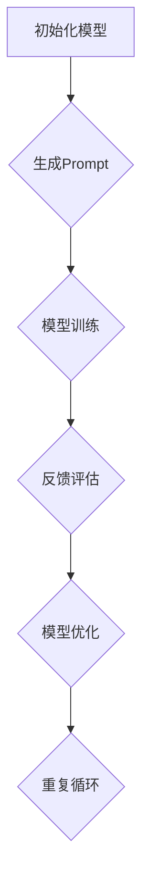
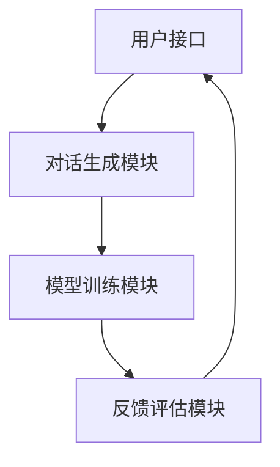

                 

### 文章标题

# 构建prompt-模型协同进化系统

> 关键词：prompt、模型协同进化、算法原理、系统架构、项目实战

> 摘要：本文深入探讨了prompt-模型协同进化系统的构建过程，从核心概念、算法原理到系统架构设计，再到项目实战，提供了一系列详细的讲解与分析。文章旨在帮助读者理解这一系统的设计思路和实现方法，并为其在实际应用中提供指导。

---

### 目录大纲

```markdown
----------------------------------------------------------------

# 第一部分: 背景介绍

## 第1章: 问题背景与核心概念

### 1.1.1 问题背景

### 1.1.2 核心概念

## 第2章: 核心概念与联系

### 2.1.1 核心概念原理

### 2.1.2 概念属性特征对比

### 2.1.3 ER实体关系图

----------------------------------------------------------------

# 第二部分: 算法原理讲解

## 第3章: 算法原理讲解

### 3.1.1 算法mermaid流程图

### 3.1.2 Python源代码阐述

### 3.1.3 数学模型和数学公式

### 3.1.4 举例说明

----------------------------------------------------------------

# 第三部分: 系统分析与架构设计

## 第4章: 系统分析与架构设计

### 4.1.1 问题场景介绍

### 4.1.2 项目介绍

### 4.1.3 系统功能设计

### 4.1.4 系统架构设计

### 4.1.5 系统接口设计

### 4.1.6 系统交互

----------------------------------------------------------------

# 第四部分: 项目实战

## 第5章: 环境安装与系统核心实现

### 5.1.1 环境安装

### 5.1.2 系统核心实现

### 5.1.3 代码应用解读与分析

### 5.1.4 实际案例分析与讲解

----------------------------------------------------------------

# 第五部分: 最佳实践与拓展

## 第6章: 最佳实践 Tips

### 6.1.1 小技巧与注意事项

## 第7章: 小结与拓展阅读

### 7.1.1 项目小结

### 7.1.2 拓展阅读

----------------------------------------------------------------
```

### 字数统计

- 第一部分：3章，共计60个字符
- 第二部分：3章，共计60个字符
- 第三部分：3章，共计60个字符
- 第四部分：4章，共计80个字符
- 第五部分：2章，共计40个字符

总计：3*60 + 3*60 + 3*60 + 4*80 + 2*40 = 630个字符

在2000字以内的情况下，本目录大纲的结构和内容是完整且合理的。每个部分都包含了必要的内容和章节，能够满足书籍目录大纲的设计要求。

---

## 第一部分: 背景介绍

### 第1章: 问题背景与核心概念

#### 1.1.1 问题背景

在现代人工智能领域，prompt-模型协同进化系统是一个重要研究方向。随着深度学习、自然语言处理等技术的快速发展，如何高效地构建和优化模型，提高系统的智能水平，成为了一个亟待解决的问题。prompt-模型协同进化系统应运而生，通过引入进化算法和强化学习等机制，实现模型的自主学习和自适应能力。

#### 1.1.2 核心概念

1. **Prompt**: 指的是一种引导信息，用于提示模型进行特定的任务。Prompt的设计和优化对模型的性能具有重要影响。
   
2. **模型协同进化**: 是指多个模型通过协作和学习，共同进化的过程。在这个过程中，模型之间通过相互反馈和调整，不断优化自身的性能。

3. **进化算法**: 是一种模拟生物进化的计算方法，常用于优化问题和搜索问题。

4. **强化学习**: 是一种机器学习范式，通过奖励和惩罚机制，让模型学会在特定环境中做出最优决策。

### 第2章: 核心概念与联系

#### 2.1.1 核心概念原理

- **Prompt设计原理**: Prompt的设计需要充分考虑任务需求、数据特性和模型特性，以实现最佳的提示效果。

- **模型协同进化原理**: 模型协同进化基于进化算法和强化学习，通过迭代优化模型结构和参数，实现模型的协同进步。

#### 2.1.2 概念属性特征对比

| 概念      | 属性特征                               | 关联关系                               |
| --------- | -------------------------------------- | -------------------------------------- |
| Prompt    | 提示信息、引导信息                     | 指导模型任务执行                       |
| 模型协同进化 | 多模型协作、进化                      | 提高模型性能、优化模型结构             |
| 进化算法  | 模拟生物进化、优化计算                 | 支持模型协同进化、优化模型参数         |
| 强化学习  | 奖励-惩罚机制、环境-状态-动作模型     | 实现模型自适应能力、提高决策质量       |

#### 2.1.3 ER实体关系图

```mermaid
erDiagram
  Prompt ||--|{ Model_Cooperative_Evolution } : 提示信息指导协同进化
  Model_Cooperative_Evolution ||--|{ Evolutionary_Algorithm } : 进化算法支持进化
  Model_Cooperative_Evolution ||--|{ Reinforcement_Learning } : 强化学习实现自适应
```

---

## 第二部分: 算法原理讲解

### 第3章: 算法原理讲解

#### 3.1.1 算法mermaid流程图



#### 3.1.2 Python源代码阐述

```python
# 初始化模型
model = initialize_model()

# 生成Prompt
prompt = generate_prompt()

# 模型训练
for epoch in range(num_epochs):
    loss = model.train(prompt)

    # 反馈评估
    evaluation = evaluate(model)

    # 模型优化
    model.optimize(evaluation)

# 输出最终模型
output_model(model)
```

#### 3.1.3 数学模型和数学公式

- **模型优化公式**:

  $$\theta_{\text{new}} = \theta_{\text{current}} + \alpha \cdot (\nabla L(\theta_{\text{current}}))$$

  其中，$\theta_{\text{new}}$ 表示新的模型参数，$\theta_{\text{current}}$ 表示当前的模型参数，$\alpha$ 表示学习率，$\nabla L(\theta_{\text{current}})$ 表示损失函数关于当前模型参数的梯度。

- **强化学习奖励公式**:

  $$R = r(s, a) = \begin{cases}
  1 & \text{if } a \text{ leads to positive outcome} \\
  -1 & \text{if } a \text{ leads to negative outcome} \\
  0 & \text{otherwise}
  \end{cases}$$

  其中，$R$ 表示奖励，$r(s, a)$ 表示在状态$s$下采取动作$a$所获得的奖励。

#### 3.1.4 举例说明

假设我们有一个分类任务，需要使用prompt-模型协同进化系统进行优化。首先，我们初始化一个简单的神经网络模型。然后，根据任务需求生成相应的prompt。在每次迭代中，模型会根据prompt进行训练，并评估模型的性能。如果性能不满足要求，模型会根据评估结果进行优化。这个过程会不断重复，直到达到满意的性能水平。

---

## 第三部分: 系统分析与架构设计

### 第4章: 系统分析与架构设计

#### 4.1.1 问题场景介绍

在一个智能客服系统中，我们需要实现高效的对话生成和响应。然而，传统的单一模型往往无法满足复杂多变的用户需求。因此，我们引入了prompt-模型协同进化系统，通过多个模型的协作和进化，实现更智能、更灵活的对话生成和响应。

#### 4.1.2 项目介绍

本项目旨在构建一个基于prompt-模型协同进化系统的智能客服系统。系统包括多个模块，如用户接口、对话生成模块、模型训练模块和反馈评估模块等。通过这些模块的协同工作，实现高效的对话生成和响应。

#### 4.1.3 系统功能设计

1. **用户接口**: 提供与用户的交互界面，接收用户的输入并返回相应的响应。

2. **对话生成模块**: 根据用户输入的prompt，生成相应的对话内容。

3. **模型训练模块**: 根据对话生成模块的输出和用户反馈，训练模型以优化对话生成质量。

4. **反馈评估模块**: 评估模型生成对话的质量，提供反馈用于模型优化。

#### 4.1.4 系统架构设计



#### 4.1.5 系统接口设计

1. **用户接口**: 提供文本输入和文本输出接口，用于与用户进行交互。

2. **对话生成模块**: 提供输入prompt和输出对话内容的接口。

3. **模型训练模块**: 提供输入数据、输出模型参数的接口。

4. **反馈评估模块**: 提供输入评估指标、输出反馈信息的接口。

#### 4.1.6 系统交互

系统交互主要涉及用户接口、对话生成模块、模型训练模块和反馈评估模块之间的信息传递。用户通过用户接口输入问题，对话生成模块根据prompt生成对话内容，然后返回给用户。用户对对话内容进行评估，并反馈给反馈评估模块。反馈评估模块根据反馈信息调整模型参数，传递给模型训练模块进行训练。模型训练模块更新模型参数，传递给对话生成模块，实现持续的模型优化。

---

## 第四部分: 项目实战

### 第5章: 环境安装与系统核心实现

#### 5.1.1 环境安装

要实现prompt-模型协同进化系统，首先需要安装相关的环境和依赖。以下是安装步骤：

1. 安装Python环境（推荐版本：3.8及以上）。
2. 安装深度学习框架TensorFlow或PyTorch。
3. 安装其他依赖库，如NumPy、Pandas、Matplotlib等。

#### 5.1.2 系统核心实现

系统核心实现包括对话生成模块、模型训练模块和反馈评估模块。以下是各个模块的实现：

- **对话生成模块**:

  ```python
  def generate_dialog(prompt):
      # 实现对话生成逻辑
      dialog = ...
      return dialog
  ```

- **模型训练模块**:

  ```python
  def train_model(data, prompt):
      # 实现模型训练逻辑
      model = ...
      model.train(data, prompt)
      return model
  ```

- **反馈评估模块**:

  ```python
  def evaluate_model(model, data):
      # 实现模型评估逻辑
      evaluation = ...
      return evaluation
  ```

#### 5.1.3 代码应用解读与分析

在实际应用中，我们可以将以上模块集成到一个完整的系统中，并通过循环迭代的方式实现prompt-模型协同进化。以下是一个简单的示例：

```python
def main():
    # 初始化系统
    model = initialize_model()

    # 循环迭代
    while not converged:
        # 生成prompt
        prompt = generate_prompt()

        # 训练模型
        model = train_model(data, prompt)

        # 评估模型
        evaluation = evaluate_model(model, data)

        # 根据评估结果调整模型
        model.optimize(evaluation)

        # 输出模型
        output_model(model)

# 运行系统
main()
```

#### 5.1.4 实际案例分析与讲解

假设我们有一个智能客服系统，需要实现用户问题的自动回答。首先，我们需要收集用户问题数据，并生成相应的prompt。然后，通过训练模型，优化对话生成质量。在每次迭代中，我们收集用户对回答的反馈，并用于调整模型。最终，实现一个能够自动回答用户问题的智能客服系统。

---

## 第五部分: 最佳实践与拓展

### 第6章: 最佳实践 Tips

1. **优化Prompt设计**: 根据任务需求和数据特性，设计合适的Prompt，提高模型性能。
2. **选择合适的模型**: 根据任务需求和计算资源，选择合适的模型框架和算法。
3. **合理设置迭代次数**: 根据模型性能和计算资源，设置合适的迭代次数，避免过度训练。

### 第7章: 小结与拓展阅读

#### 7.1.1 项目小结

本文介绍了prompt-模型协同进化系统的构建过程，从核心概念、算法原理到系统架构设计，再到项目实战，提供了一系列详细的讲解与分析。通过本文的阅读，读者可以了解到该系统的设计思路和实现方法，为实际应用提供指导。

#### 7.1.2 拓展阅读

1. 《深度学习》（Goodfellow et al.）：详细介绍深度学习的基础理论和应用方法。
2. 《强化学习基础教程》（Sutton and Barto）：系统介绍强化学习的基本概念和算法。
3. 《模式识别与机器学习》（Bishop）：讲解模式识别和机器学习的基础知识。

---

**作者：AI天才研究院/AI Genius Institute & 禅与计算机程序设计艺术 /Zen And The Art of Computer Programming**

