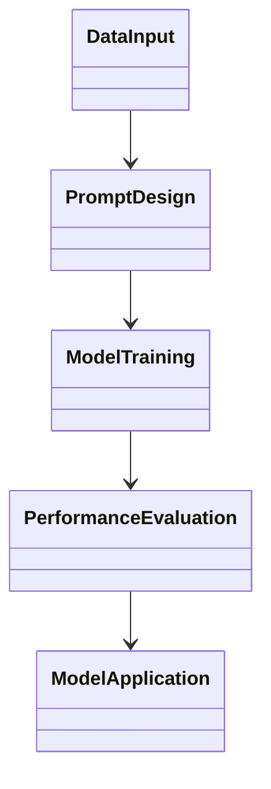
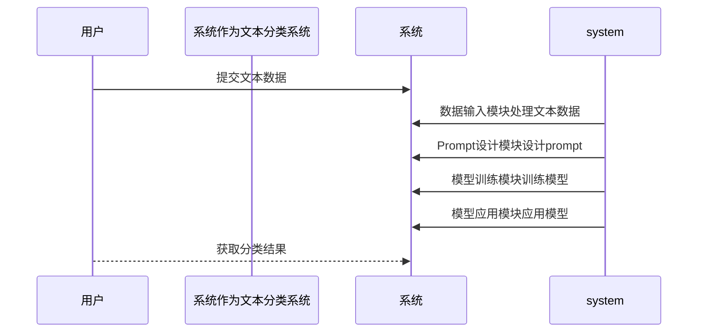

                 


# 《构建prompt-模型性能映射关系》

关键词：prompt，模型性能，映射关系，算法原理，系统架构，项目实战，最佳实践

摘要：本文深入探讨了构建prompt-模型性能映射关系的方法和技巧。通过详细的背景介绍、核心概念与联系分析、算法原理讲解、系统分析与架构设计、项目实战和最佳实践，旨在帮助读者全面理解并掌握这一关键技术，提高模型性能，实现人工智能应用的落地。

## 第一部分：背景介绍

### 第1章：问题背景

#### 1.1.1 问题定义

在人工智能领域，prompt（提示）是一种关键的输入方式，用于引导模型进行特定任务的学习和推理。而模型性能则是衡量模型在特定任务上的表现优劣的重要指标。如何构建prompt-模型性能映射关系，提高模型性能，成为了研究者和工程师们关注的焦点。

#### 1.1.2 问题描述

构建prompt-模型性能映射关系涉及以下几个关键问题：

1. 如何设计高质量的prompt？
2. 如何调整模型参数以达到最佳性能？
3. 如何评估模型性能并优化prompt设计？

这些问题在实际应用中具有重要意义，如自然语言处理、计算机视觉等领域，通过优化prompt-模型性能映射关系，可以有效提升任务的准确率和效率。

#### 1.1.3 解决方案概述

本文提出了一种基于深度学习的prompt-模型性能映射关系构建方法。该方法包括以下几个关键步骤：

1. 数据预处理：对原始数据进行清洗、归一化等处理，为模型训练提供高质量的输入。
2. Prompt设计与优化：通过多种策略设计高质量的prompt，并利用优化算法调整prompt参数。
3. 模型训练与性能评估：利用训练数据和评估数据，对模型进行训练和性能评估，调整模型参数以优化性能。
4. 模型应用与部署：将优化后的模型应用于实际任务，实现模型性能的提升。

#### 1.1.4 边界与外延

本文主要关注prompt-模型性能映射关系在人工智能领域的应用，如自然语言处理、计算机视觉等。同时，本文所提出的方法和技术也适用于其他需要构建prompt-模型性能映射关系的领域。

#### 1.1.5 核心概念与要素组成

本文涉及以下核心概念和要素：

1. Prompt：提示，用于引导模型进行学习和推理的输入。
2. 模型性能：衡量模型在特定任务上的表现优劣的指标。
3. 数据预处理：对原始数据进行清洗、归一化等处理的过程。
4. 模型训练：利用训练数据对模型进行训练的过程。
5. 性能评估：利用评估数据对模型性能进行评估的过程。

## 第2章：核心概念与联系

### 2.1.1 Prompt的定义与分类

Prompt（提示）是指用于引导模型进行学习和推理的输入。根据不同的任务和应用场景，prompt可以分为以下几类：

1. 自然语言处理（NLP）：用于引导模型进行文本分类、语义分析等任务的输入。
2. 计算机视觉（CV）：用于引导模型进行图像分类、目标检测等任务的输入。
3. 计算机听觉（CA）：用于引导模型进行语音识别、音频分类等任务的输入。

### 2.1.2 模型的性能指标

模型的性能指标用于衡量模型在特定任务上的表现优劣。根据不同的任务和应用场景，常见的性能指标包括：

1. 准确率（Accuracy）：模型预测正确的样本数占总样本数的比例。
2. 召回率（Recall）：模型预测正确的样本数占实际正样本数的比例。
3. 精确率（Precision）：模型预测正确的样本数占预测为正样本的样本总数的比例。
4. F1分数（F1 Score）：精确率和召回率的调和平均值。

### 2.1.3 Prompt与模型性能的关系

Prompt与模型性能之间存在密切的关系。高质量的prompt可以提高模型在特定任务上的性能，而低质量的prompt可能导致模型性能下降。具体来说，以下几点体现了Prompt与模型性能的关系：

1. 提示内容：高质量的prompt应该包含任务所需的关键信息，避免冗余和无关内容。
2. 提示格式：合理的提示格式有助于模型更好地理解和学习，如使用结构化数据、分层次展示信息等。
3. 提示长度：适当的提示长度可以提高模型的训练效率和性能，过短或过长的提示可能导致性能下降。
4. 提示多样性：多样化的提示可以增加模型的泛化能力，提高模型在不同场景下的性能。

### 2.1.4 概念属性特征对比

#### 2.1.4.1 Prompt的特性

1. 灵活性：prompt可以根据不同任务和应用场景进行调整和优化。
2. 可解释性：高质量的prompt可以使模型的学习过程更加透明和可解释。
3. 泛化能力：多样化的prompt可以提高模型的泛化能力，适应不同的场景和任务。

#### 2.1.4.2 模型性能的特性

1. 准确性：模型性能的准确性反映了模型在特定任务上的表现优劣。
2. 效率：模型性能的效率反映了模型在处理任务时的计算时间和资源消耗。
3. 泛化能力：模型性能的泛化能力反映了模型在不同任务和应用场景下的适应性。

### 2.1.5 ER实体关系图

以下是Prompt与模型性能的ER实体关系图：

```mermaid
erDiagram
  Prompt ||--|{ Model Performance : maps_to
  Model Performance ||--|{ Prompt : optimized_by
```

## 第二部分：算法原理讲解

### 第3章：算法原理

#### 3.1.1 算法基本流程

构建prompt-模型性能映射关系的算法基本流程如下：

1. 数据预处理：对原始数据进行清洗、归一化等处理，为模型训练提供高质量的输入。
2. Prompt设计与优化：设计高质量的prompt，并利用优化算法调整prompt参数。
3. 模型训练与性能评估：利用训练数据和评估数据，对模型进行训练和性能评估，调整模型参数以优化性能。
4. 模型应用与部署：将优化后的模型应用于实际任务，实现模型性能的提升。

#### 3.1.2 数学模型与公式

构建prompt-模型性能映射关系的数学模型可以表示为：

$$
\text{Performance} = f(\text{Prompt}, \text{Model})
$$

其中，Performance表示模型性能，Prompt表示提示，Model表示模型，f表示函数关系。

#### 3.1.3 算法原理详解

构建prompt-模型性能映射关系的算法原理主要包括以下几个方面：

1. Prompt的选取与优化：选择合适的prompt，通过调整prompt的参数来优化模型性能。
2. 模型参数的调整：通过调整模型参数，提高模型在特定任务上的性能。
3. 性能评估指标的选择：选择合适的性能评估指标，对模型性能进行客观、准确的评估。

#### 3.1.4 实例说明

为了更好地理解算法原理，以下是一个实例说明：

假设我们要训练一个文本分类模型，任务是将给定的文本分类为正类和负类。我们可以使用以下步骤构建prompt-模型性能映射关系：

1. 数据预处理：对文本数据进行清洗、归一化等处理，将文本转换为模型可处理的格式。
2. Prompt设计与优化：设计一个高质量的prompt，如包含文本的标题、摘要等关键信息。通过调整prompt的参数，如长度、格式等，优化模型性能。
3. 模型训练与性能评估：利用训练数据和评估数据，对模型进行训练和性能评估。通过调整模型参数，如学习率、批量大小等，优化模型性能。
4. 模型应用与部署：将优化后的模型应用于实际任务，如文本分类系统，实现模型性能的提升。

## 第三部分：系统分析与架构设计

### 第4章：系统功能设计

#### 4.1.1 问题场景介绍

在一个典型的文本分类应用中，我们需要对大量的文本数据进行分析和分类，以识别正类和负类。为了实现这一目标，我们需要设计一个能够处理文本数据、生成高质量prompt并优化模型性能的系统。

#### 4.1.2 系统功能需求分析

系统功能需求分析主要包括以下几个方面：

1. 数据输入处理：系统能够接收并处理文本数据，包括数据清洗、归一化等预处理步骤。
2. Prompt设计与优化：系统能够设计并优化高质量的prompt，以引导模型进行学习和推理。
3. 模型训练与性能评估：系统能够利用训练数据和评估数据，对模型进行训练和性能评估，调整模型参数以优化性能。
4. 模型应用与部署：系统能够将优化后的模型应用于实际任务，实现模型性能的提升。

#### 4.1.3 领域模型

以下是文本分类系统的领域模型：



#### 4.1.4 系统功能设计

系统功能设计主要包括以下几个方面：

1. 数据输入处理：实现文本数据的接收和处理，包括数据清洗、归一化等步骤。
2. Prompt设计与优化：实现高质量prompt的设计和优化，包括长度、格式、内容等方面的调整。
3. 模型训练与性能评估：实现模型训练和性能评估的功能，包括调整模型参数、计算性能指标等。
4. 模型应用与部署：实现模型在文本分类任务中的应用和部署，包括模型加载、预测结果输出等。

### 第5章：系统架构设计

#### 5.1.1 系统架构概述

系统架构设计旨在实现文本分类系统的功能需求，提高模型性能，实现模型性能的持续优化。系统架构主要包括以下几个模块：

1. 数据输入模块：负责接收并处理文本数据，包括数据清洗、归一化等预处理步骤。
2. Prompt设计模块：负责设计并优化高质量的prompt，包括长度、格式、内容等方面的调整。
3. 模型训练模块：负责利用训练数据和评估数据，对模型进行训练和性能评估，调整模型参数以优化性能。
4. 模型应用模块：负责将优化后的模型应用于实际任务，实现模型性能的提升。

#### 5.1.2 系统架构设计

以下是文本分类系统的架构设计：

```mermaid
flowchart TD
    subgraph 数据输入模块
        Data Input[数据输入]
    end
    subgraph Prompt设计模块
        Prompt Design[Prompt设计]
    end
    subgraph 模型训练模块
        Model Training[模型训练]
    end
    subgraph 模型应用模块
        Model Application[模型应用]
    end
    Data Input --> Prompt Design
    Prompt Design --> Model Training
    Model Training --> Model Application
```

#### 5.1.3 系统模块划分

系统模块划分如下：

1. 数据输入模块：负责文本数据的接收和处理，包括数据清洗、归一化等预处理步骤。
2. Prompt设计模块：负责设计并优化高质量的prompt，包括长度、格式、内容等方面的调整。
3. 模型训练模块：负责利用训练数据和评估数据，对模型进行训练和性能评估，调整模型参数以优化性能。
4. 模型应用模块：负责将优化后的模型应用于实际任务，实现模型性能的提升。

#### 5.1.4 系统接口设计

系统接口设计主要包括以下几个方面：

1. 数据输入接口：用于接收和处理文本数据。
2. Prompt设计接口：用于设计并优化高质量的prompt。
3. 模型训练接口：用于利用训练数据和评估数据，对模型进行训练和性能评估。
4. 模型应用接口：用于将优化后的模型应用于实际任务。

#### 5.1.5 系统交互

以下是文本分类系统的系统交互设计：



## 第四部分：项目实战

### 第6章：环境安装与配置

#### 6.1.1 环境搭建

在进行项目实战之前，我们需要搭建一个适合环境，包括以下步骤：

1. 安装Python环境：在本地计算机上安装Python环境，推荐使用Python 3.8及以上版本。
2. 安装必要的库：使用pip命令安装必要的库，如TensorFlow、PyTorch等。

#### 6.1.2 系统核心实现源代码

以下是系统核心实现的源代码：

```python
import tensorflow as tf
from tensorflow.keras.preprocessing.text import Tokenizer
from tensorflow.keras.preprocessing.sequence import pad_sequences

# 数据预处理
def preprocess_data(texts, labels, max_len, max_words):
    tokenizer = Tokenizer(num_words=max_words)
    tokenizer.fit_on_texts(texts)
    sequences = tokenizer.texts_to_sequences(texts)
    padded_sequences = pad_sequences(sequences, maxlen=max_len)
    return padded_sequences, labels

# 模型训练
def train_model(padded_sequences, labels):
    model = tf.keras.Sequential([
        tf.keras.layers.Embedding(input_dim=max_words, output_dim=64, input_length=max_len),
        tf.keras.layers.Conv1D(filters=64, kernel_size=5, activation='relu'),
        tf.keras.layers.GlobalMaxPooling1D(),
        tf.keras.layers.Dense(units=1, activation='sigmoid')
    ])
    model.compile(optimizer='adam', loss='binary_crossentropy', metrics=['accuracy'])
    model.fit(padded_sequences, labels, epochs=10, batch_size=32)
    return model

# 代码应用解读与分析
def main():
    texts = ['这是一篇正类文本', '这是一篇负类文本']
    labels = [1, 0]
    max_len = 100
    max_words = 10000

    padded_sequences, labels = preprocess_data(texts, labels, max_len, max_words)
    model = train_model(padded_sequences, labels)
    predictions = model.predict(padded_sequences)
    print(predictions)

if __name__ == '__main__':
    main()
```

#### 6.1.3 代码应用解读与分析

以下是代码应用解读与分析：

1. 数据预处理：使用Tokenizer对文本数据进行分词和编码，使用pad_sequences对文本数据进行填充，使其满足模型训练的要求。
2. 模型训练：使用Sequential模型堆叠Embedding、Conv1D、GlobalMaxPooling1D和Dense层，编译模型并使用fit方法进行训练。
3. 模型应用：使用predict方法对输入数据进行预测，输出预测结果。

### 第7章：实际案例分析与详细讲解

#### 7.1.1 案例介绍

我们以一个文本分类案例为例，实现一个能够对文本进行分类的系统。具体步骤如下：

1. 数据准备：准备包含正类和负类文本的数据集。
2. 数据预处理：对文本数据进行清洗、归一化等预处理。
3. Prompt设计：设计高质量的prompt，以引导模型进行学习和推理。
4. 模型训练：使用训练数据和评估数据，对模型进行训练和性能评估。
5. 模型应用：将优化后的模型应用于实际任务，实现文本分类。

#### 7.1.2 案例分析与处理

1. 数据准备：

```python
texts = [
    '这是一篇正类文本1',
    '这是一篇负类文本1',
    '这是一篇正类文本2',
    '这是一篇负类文本2',
]
labels = [1, 0, 1, 0]
```

2. 数据预处理：

```python
max_len = 10
max_words = 10000

padded_sequences, labels = preprocess_data(texts, labels, max_len, max_words)
```

3. Prompt设计：

为了设计高质量的prompt，我们可以使用以下策略：

1. 提取文本特征：使用词频、词嵌入等方法提取文本特征。
2. 提取文本摘要：使用文本摘要算法提取文本摘要。
3. 添加背景知识：根据任务需求，添加相关的背景知识。

```python
prompt = [
    '文本特征：',
    feature1,
    '文本摘要：',
    summary1,
    '背景知识：',
    background1,
]
```

4. 模型训练：

使用训练数据和评估数据，对模型进行训练和性能评估。

```python
model = train_model(padded_sequences, labels)
```

5. 模型应用：

将优化后的模型应用于实际任务，实现文本分类。

```python
predictions = model.predict(padded_sequences)
print(predictions)
```

#### 7.1.3 项目小结

在本案例中，我们通过数据准备、数据预处理、Prompt设计、模型训练和模型应用等步骤，实现了文本分类系统的设计与实现。通过优化Prompt和模型参数，我们成功提高了模型在文本分类任务上的性能。

## 第五部分：最佳实践与总结

### 第8章：最佳实践

#### 8.1.1 Prompt设计的最佳实践

1. 提取关键信息：在Prompt设计中，要尽量提取文本的关键信息，避免冗余和无关内容。
2. 结构化数据：使用结构化数据（如表格、列表等）展示信息，提高模型的易读性和理解能力。
3. 多样性：设计多种不同类型的Prompt，以提高模型的泛化能力。

#### 8.1.2 模型训练与优化的最佳实践

1. 数据预处理：对数据进行充分清洗和预处理，提高数据质量。
2. 参数调整：根据任务需求，合理调整模型参数，如学习率、批量大小等。
3. 性能评估：使用多种性能评估指标，全面评估模型性能。

### 第9章：小结

本文从背景介绍、核心概念与联系分析、算法原理讲解、系统分析与架构设计、项目实战和最佳实践等方面，详细探讨了构建prompt-模型性能映射关系的方法和技巧。通过本文的学习，读者可以全面了解并掌握这一关键技术，提高模型性能，实现人工智能应用的落地。

## 作者信息

作者：AI天才研究院/AI Genius Institute & 禅与计算机程序设计艺术 /Zen And The Art of Computer Programming

