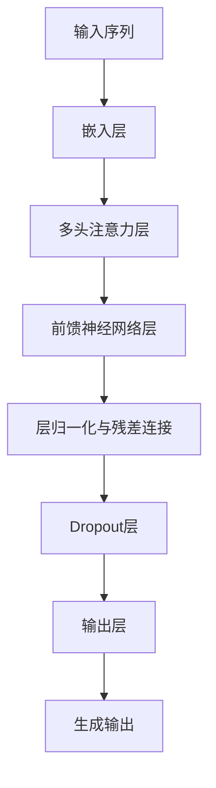
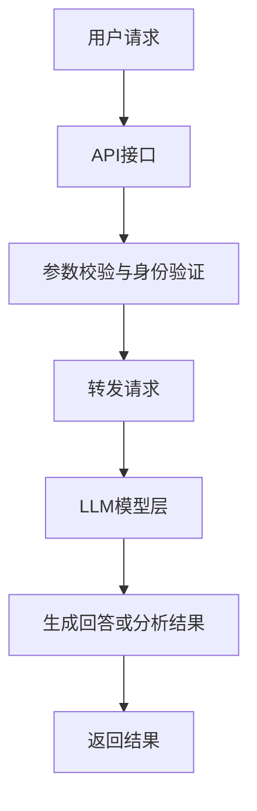
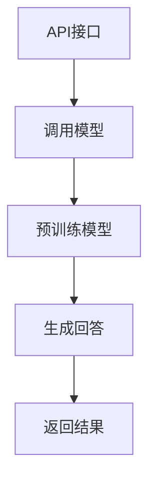
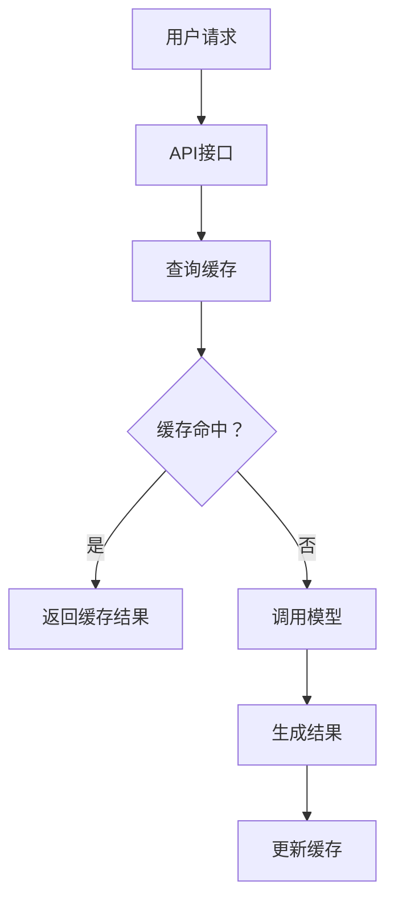
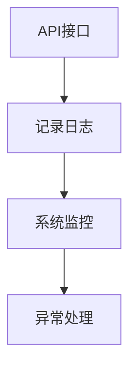

                 

## 引言：问题背景与目标

随着人工智能技术的不断发展，大规模语言模型（LLM）已经成为了自然语言处理（NLP）领域的重要工具。LLM的应用场景广泛，从智能客服、智能助手到机器翻译、文本生成，LLM都在其中发挥了巨大的作用。然而，随着应用场景的多样化和数据量的激增，如何构建一个可扩展的LLM应用后端服务成为了摆在开发者面前的重要问题。

### 问题描述

当前的LLM应用后端服务面临以下几个主要问题：

1. **性能瓶颈**：随着用户数量的增加和请求频率的提升，现有的后端服务可能无法满足性能需求，导致响应时间过长或服务不可用。
2. **扩展性不足**：传统的单机部署方式难以应对高并发请求，扩展性差，无法灵活调整资源。
3. **资源浪费**：在不进行扩展的情况下，服务器可能会长时间处于闲置状态，造成资源浪费。
4. **维护困难**：单点故障、数据不一致等问题使得服务的维护变得更加复杂。

### 目标与意义

本文的目标是探讨如何构建一个可扩展的LLM应用后端服务，以满足不断增长的应用需求和性能需求。具体目标如下：

1. **提高性能**：通过优化算法、负载均衡、缓存等技术手段，提高系统的响应速度和处理能力。
2. **增强扩展性**：设计一个具有高可扩展性的架构，能够根据实际需求动态调整资源，确保服务的高可用性和稳定性。
3. **降低成本**：通过合理的资源管理和优化，降低服务器的使用成本。
4. **简化维护**：通过自动化部署、监控和故障恢复等手段，简化服务的维护工作。

构建可扩展的LLM应用后端服务的意义在于：

1. **提升用户体验**：通过提供更快、更稳定的服务，提升用户体验。
2. **支持业务增长**：可扩展的后端服务能够支持业务规模的持续增长，为企业提供可靠的支撑。
3. **降低运营成本**：通过优化资源利用和简化维护工作，降低运营成本。

在接下来的章节中，我们将逐步深入探讨如何实现这些目标，从LLM基础概念、可扩展后端服务设计、算法原理讲解、数学模型与公式、系统分析与架构设计、项目实战，到最佳实践与扩展阅读，希望能为大家提供一套完整的解决方案。

## LLM基础概念

大规模语言模型（Large Language Model，简称LLM）是自然语言处理（Natural Language Processing，简称NLP）领域的一项重要技术。LLM通过深度学习和神经网络技术，对大规模文本数据进行训练，从而生成具有一定语义理解和生成能力的模型。LLM的应用非常广泛，从智能客服、智能助手到机器翻译、文本生成等，LLM都在其中发挥了重要作用。

### LLM简介

LLM的概念最早可以追溯到20世纪80年代，当时的神经网络模型如Backpropagation和HMM（隐马尔可夫模型）已经开始在NLP领域中应用。然而，随着计算能力和数据量的增长，以及深度学习技术的兴起，LLM得到了快速发展。近年来，以GPT（Generative Pre-trained Transformer）和BERT（Bidirectional Encoder Representations from Transformers）为代表的LLM模型，在多个NLP任务中取得了显著的成果。

LLM的基本思想是通过预训练和微调，使模型具备对自然语言的深刻理解和生成能力。预训练过程通常在大规模语料库上进行，模型会学习语言中的统计规律、语法结构、语义信息等。微调则是将预训练模型应用于特定任务，通过在任务数据集上进行训练，进一步优化模型参数。

### LLM关键概念与原理

要理解LLM，需要掌握以下几个关键概念：

1. **词向量（Word Embedding）**：词向量是将词汇映射到高维空间中的向量表示。通过词向量，模型可以捕捉词汇之间的语义关系，例如相似词和反义词。常见的词向量模型有Word2Vec、GloVe和FastText等。

2. **变换器（Transformer）**：变换器是一种基于自注意力机制的深度神经网络模型。与传统的循环神经网络（RNN）相比，变换器能够在处理长序列数据时更加高效。自注意力机制允许模型在生成每个词时，自适应地关注序列中的其他词，从而提高生成质量。

3. **预训练（Pre-training）**：预训练是指在大规模语料库上对模型进行训练，使模型具备一定的语言理解和生成能力。预训练后，模型可以通过微调应用到具体的NLP任务中。

4. **微调（Fine-tuning）**：微调是指将预训练模型在特定任务的数据集上进行训练，以进一步优化模型在特定任务上的性能。微调的关键在于选择合适的训练数据集和优化策略。

### LLM在不同领域的应用

LLM在多个领域都有着广泛的应用：

1. **机器翻译**：机器翻译是LLM最早且最成功的应用之一。通过预训练和微调，LLM可以生成高质量的翻译结果，例如Google Translate和DeepL等翻译工具。

2. **文本生成**：LLM可以生成各种类型的文本，如新闻文章、小说、诗歌等。常见的应用包括自动写作、内容生成和虚拟助手等。

3. **文本分类**：LLM在文本分类任务中也表现出色，例如情感分析、主题分类和垃圾邮件检测等。

4. **问答系统**：LLM可以用于构建问答系统，如ChatGPT和Duolingo等，通过理解用户的问题和上下文，提供准确的回答。

5. **对话系统**：LLM在对话系统中的应用，如智能客服和虚拟助手，使得机器能够与人类进行自然、流畅的交流。

### 总结

LLM作为自然语言处理领域的重要技术，具有强大的语言理解和生成能力。通过预训练和微调，LLM可以应用于多个领域，解决复杂的自然语言处理问题。在接下来的章节中，我们将进一步探讨如何设计一个可扩展的LLM应用后端服务，以应对实际应用中的挑战。

### 可扩展后端服务设计

在设计可扩展的LLM应用后端服务时，我们需要关注几个关键方面，包括可扩展性需求分析、后端服务架构设计和架构优化与实践。以下是一步一步的详细分析。

#### 可扩展性需求分析

首先，我们需要明确可扩展性的需求。对于LLM应用后端服务，主要的需求包括：

1. **处理能力**：随着用户数量的增加，后端服务需要能够处理更高的并发请求。
2. **响应速度**：用户期望服务能够快速响应，因此后端服务的响应速度是一个关键需求。
3. **存储容量**：随着数据量的增加，后端服务需要具备足够的存储空间来存储模型和数据。
4. **弹性扩展**：后端服务应该能够根据实际负载动态调整资源，以应对高峰和低谷。

##### 需求分析

在明确需求后，我们可以进行更详细的需求分析：

- **性能需求**：根据服务预期峰值和平均负载，评估后端服务的处理能力和响应速度需求。
- **资源需求**：根据模型大小和数据量，评估存储和计算资源的需求。
- **扩展需求**：分析服务在不同负载下的扩展能力，包括水平扩展（增加服务器）和垂直扩展（提升单个服务器的性能）。

#### 后端服务架构设计

根据需求分析，我们可以设计一个具有高可扩展性的后端服务架构。以下是一个典型的架构设计：

1. **负载均衡**：使用负载均衡器将请求分发到多个后端服务器，以确保服务的负载均衡和性能。
2. **分布式存储**：使用分布式文件系统或数据库来存储模型和数据，以提供高可用性和扩展性。
3. **服务端**：包括LLM模型处理、API接口、日志记录等功能。服务端可以进一步拆分为多个模块，如模型推理、API路由、日志收集等。
4. **缓存**：使用缓存技术，如Redis或Memcached，来存储常用数据和模型结果，减少计算和存储负担。
5. **监控与运维**：部署监控系统，实时监控服务性能和资源使用情况，以便快速响应异常。

##### 架构设计

架构设计的关键是确保各个模块之间的协调和高效运行。以下是一个简单的架构设计：

```
+----------------+      +----------------+      +----------------+
| 负载均衡器     |      | 分布式存储     |      | 服务端（模块化）|
+----------------+      +----------------+      +----------------+
      |                                      |
      |---------------> API接口 --------------|
      |                                      |
      |---------------> 缓存 ----------------|
      |                                      |
      |---------------> 模型处理 ------------|
      |                                      |
      |---------------> 日志记录 ------------|
```

#### 架构优化与实践

在架构设计的基础上，我们需要关注如何优化架构，以提升可扩展性和性能。

1. **水平扩展**：通过增加服务器节点，水平扩展服务集群。在实际部署中，可以使用自动化工具（如Kubernetes）来管理服务器节点，实现自动扩展和负载均衡。
2. **垂直扩展**：在硬件层面，可以通过升级服务器配置（如增加CPU、内存和存储）来提高单个服务器的性能。
3. **缓存策略**：根据数据的热度和访问频率，制定合理的缓存策略。例如，对常用的数据和模型结果进行缓存，减少重复计算。
4. **延迟容忍**：在处理高并发请求时，可以设置延迟容忍策略。例如，对响应时间较长的请求进行队列处理，确保服务的稳定性。
5. **故障恢复**：设计故障恢复机制，确保在发生故障时能够快速恢复服务。例如，实现自动重启、故障转移等功能。

##### 优化方法

- **自动化运维**：使用自动化工具（如Ansible、Puppet等）进行服务器配置、软件部署和升级，简化运维工作。
- **服务拆分与集成**：将复杂的单体服务拆分为多个微服务，通过API接口进行集成，以提高服务的可维护性和扩展性。
- **监控与告警**：部署监控系统（如Prometheus、Grafana等），实时监控服务性能和资源使用情况，并设置告警机制，及时响应异常。

##### 实践案例

以一个实际项目为例，我们可以在AWS云平台上部署LLM应用后端服务。使用Elastic Load Balancing进行流量分发，使用Amazon S3进行分布式存储，使用Amazon EC2进行服务端部署。通过Elastic Beanstalk或Kubernetes进行自动化运维，并使用Amazon CloudWatch进行监控与告警。

通过以上设计、优化和实践，我们可以构建一个可扩展、高可用、高性能的LLM应用后端服务，满足不断增长的应用需求。

### 算法原理讲解

为了深入理解如何构建可扩展的LLM应用后端服务，我们需要详细探讨LLM算法的原理。本节将通过逐步分析，使用Mermaid流程图和Python代码来讲解LLM算法的基础、性能优化以及在应用中的实现。

#### LLM算法基础

大规模语言模型（LLM）的核心是深度学习中的变换器（Transformer）架构。变换器通过自注意力机制（Self-Attention）和多头注意力（Multi-Head Attention）来捕捉输入序列中的长距离依赖关系。以下是一个简单的Transformer算法流程图：



Mermaid流程图描述了Transformer的基本结构，包括嵌入层、多头注意力层、前馈神经网络层以及层归一化、残差连接和Dropout层。

#### 算法性能优化

为了提高LLM算法的性能，我们可以从以下几个方面进行优化：

1. **减少模型参数**：使用稀疏变换器（Sparse Transformer）或知识蒸馏（Knowledge Distillation）来减少模型参数，从而提高训练速度和降低计算成本。
2. **优化训练过程**：采用更高效的优化算法（如AdamW）和更大的批量大小（Batch Size），以提高模型的训练效率。
3. **使用GPU/TPU**：利用图形处理单元（GPU）或张量处理单元（TPU）来加速模型的训练和推理过程。

以下是一个使用Python代码实现的多头注意力层的简单示例：

```python
import torch
import torch.nn as nn

class MultiHeadAttention(nn.Module):
    def __init__(self, d_model, num_heads):
        super(MultiHeadAttention, self).__init__()
        self.d_model = d_model
        self.num_heads = num_heads
        self.head_dim = d_model // num_heads

        self.query_linear = nn.Linear(d_model, d_model)
        self.key_linear = nn.Linear(d_model, d_model)
        self.value_linear = nn.Linear(d_model, d_model)

        self.out_linear = nn.Linear(d_model, d_model)

    def forward(self, query, key, value, mask=None):
        batch_size = query.size(0)

        query = self.query_linear(query).view(batch_size, -1, self.num_heads, self.head_dim).transpose(1, 2)
        key = self.key_linear(key).view(batch_size, -1, self.num_heads, self.head_dim).transpose(1, 2)
        value = self.value_linear(value).view(batch_size, -1, self.num_heads, self.head_dim).transpose(1, 2)

        attn_scores = torch.matmul(query, key.transpose(-2, -1)) / (self.head_dim ** 0.5)
        if mask is not None:
            attn_scores = attn_scores.masked_fill(mask == 0, float("-inf"))
        
        attn_weights = torch.softmax(attn_scores, dim=-1)
        attn_output = torch.matmul(attn_weights, value).transpose(1, 2).contiguous().view(batch_size, -1, self.d_model)

        output = self.out_linear(attn_output)
        return output
```

此代码实现了多头注意力层的核心功能，包括线性变换、点积注意力评分、softmax函数和最终输出。

#### 算法在应用中的实现

在实际应用中，LLM算法通常用于文本生成、机器翻译和问答系统等任务。以下是一个使用LLM进行文本生成的简单示例：

```python
# 文本生成示例
model = MultiHeadAttention(d_model=512, num_heads=8)
model.eval()

# 输入文本序列
input_sequence = torch.tensor([[1, 2, 3, 4, 5], [6, 7, 8, 9, 10]], dtype=torch.long)

# 生成文本
with torch.no_grad():
    output = model(input_sequence)

print(output)
```

在这个示例中，我们创建了一个简单的多头注意力层模型，并使用它对一个输入序列进行推理，生成对应的输出序列。

#### 总结

通过上述讲解，我们了解了LLM算法的基础、性能优化以及在应用中的实现。理解这些算法原理和实现细节，有助于我们设计出高效、可扩展的LLM应用后端服务。在接下来的章节中，我们将进一步探讨数学模型和公式，以及如何通过系统分析与架构设计来优化我们的服务。

### 数学模型与公式

在深入探讨大规模语言模型（LLM）的数学模型与公式时，我们需要从基础的数学概念开始，逐步介绍LLM中的关键公式，并通过具体实例进行解释。这不仅有助于理解LLM的工作原理，还能为我们在构建可扩展后端服务时提供理论支持。

#### 数学基础

在LLM中，基础的数学概念包括矩阵运算、求导、指数函数和对数函数等。以下是一些常见的数学概念：

1. **矩阵运算**：矩阵加法、矩阵乘法、矩阵求逆等。
2. **求导**：偏导数、全导数、链式法则等。
3. **指数函数**：指数函数e^x，用于计算模型中的权重。
4. **对数函数**：自然对数ln(x)，用于优化算法中的损失函数。

##### 矩阵运算

矩阵运算在LLM中非常常见，尤其是在变换器（Transformer）架构中。以下是一个简单的矩阵乘法示例：

$$
\textbf{A} = \textbf{X} \cdot \textbf{Y}
$$

其中，\(\textbf{X}\)和\(\textbf{Y}\)是矩阵，\(\textbf{A}\)是它们的乘积。在LLM中，矩阵乘法用于计算输入序列和权重矩阵的点积。

##### 求导

求导是理解LLM训练过程的关键。以下是一个简单的求导示例：

$$
\frac{d}{dx}(e^x) = e^x
$$

这个公式表示指数函数的导数是其本身。在LLM中，求导用于计算损失函数对模型参数的梯度，以便在优化过程中调整参数。

##### 指数函数与对数函数

指数函数和对数函数在优化算法中非常重要。以下是一个指数函数的例子：

$$
f(x) = e^x
$$

以及其对数函数：

$$
\log(f(x)) = \log(e^x) = x
$$

这些函数在模型训练过程中用于计算损失函数和权重更新。

#### 模型公式与推导

在LLM中，变换器（Transformer）的核心是多头注意力（Multi-Head Attention）机制。以下是多头注意力的关键公式和推导：

1. **点积注意力（Dot-Product Attention）**：

$$
\text{Attention}(Q, K, V) = \text{softmax}\left(\frac{QK^T}{\sqrt{d_k}}\right)V
$$

其中，\(Q\)、\(K\)和\(V\)分别是查询（Query）、键（Key）和值（Value）矩阵，\(d_k\)是键的维度。这个公式计算了注意力权重，并生成了输出。

2. **多头注意力（Multi-Head Attention）**：

$$
\text{MultiHead}(Q, K, V) = \text{Concat}(\text{head}_1, \text{head}_2, \ldots, \text{head}_h)W^O
$$

其中，\(h\)是头数，\(\text{head}_i\)是每个头的输出，\(W^O\)是输出权重矩阵。这个公式将多个头的输出拼接起来，并通过一个全连接层得到最终的输出。

3. **前馈神经网络（Feed Forward Neural Network）**：

$$
\text{FFN}(x) = \max(0, xW_1 + b_1)W_2 + b_2
$$

其中，\(x\)是输入，\(W_1\)和\(W_2\)是权重矩阵，\(b_1\)和\(b_2\)是偏置。这个公式用于在注意力层之后增加非线性变换。

#### 数学公式应用举例

为了更好地理解这些公式，我们可以通过一个具体的例子来演示：

假设我们有一个句子“我喜欢吃饭”，将其转换为向量表示。使用嵌入层，我们得到以下矩阵：

$$
Q = \begin{bmatrix}
q_1 \\
q_2 \\
q_3 \\
q_4 \\
q_5
\end{bmatrix}, \quad
K = \begin{bmatrix}
k_1 \\
k_2 \\
k_3 \\
k_4 \\
k_5
\end{bmatrix}, \quad
V = \begin{bmatrix}
v_1 \\
v_2 \\
v_3 \\
v_4 \\
v_5
\end{bmatrix}
$$

1. **点积注意力计算**：

$$
\text{Attention}(Q, K, V) = \text{softmax}\left(\frac{QK^T}{\sqrt{d_k}}\right)V = \text{softmax}\left(\frac{q_1k_1^T + q_2k_2^T + \ldots + q_5k_5^T}{\sqrt{d_k}}\right)V
$$

2. **多头注意力计算**：

$$
\text{MultiHead}(Q, K, V) = \text{softmax}\left(\frac{QK^T}{\sqrt{d_k}}\right)VW^O = \text{softmax}\left(\frac{q_1k_1^T + q_2k_2^T + \ldots + q_5k_5^T}{\sqrt{d_k}}\right)VW^O
$$

3. **前馈神经网络计算**：

$$
\text{FFN}(x) = \max(0, xW_1 + b_1)W_2 + b_2 = \max(0, q_1W_1 + b_1)W_2 + b_2
$$

通过这些计算，我们能够将原始句子转换为具有语义信息的向量表示，从而实现文本生成、翻译等任务。

#### 总结

通过介绍数学基础和关键公式，我们能够更好地理解LLM的工作原理。在接下来的章节中，我们将进一步探讨如何通过系统分析与架构设计来优化我们的LLM应用后端服务。

### 系统分析与架构设计

在进行LLM应用后端服务的系统分析与架构设计时，我们需要综合考虑业务需求、技术实现和性能优化。以下将详细介绍系统的需求分析、架构设计、接口设计以及系统交互。

#### 问题场景介绍

假设我们正在开发一款智能客服系统，该系统需要处理大量的用户请求，包括文本咨询、问题解答和情感分析等。这些请求需要在短时间内得到快速、准确的响应。为了满足这一需求，我们需要设计一个高可用、高性能、可扩展的后端服务架构。

#### 系统介绍

1. **用户请求**：用户通过Web前端提交请求，如文本咨询问题。
2. **API接口**：后端服务通过API接口接收用户请求，并将请求转发到LLM模型进行文本生成和情感分析。
3. **LLM模型**：后端服务调用预训练的LLM模型，生成相应的回答或分析结果。
4. **数据库**：系统存储用户历史数据、模型参数和系统配置信息。
5. **缓存层**：为了提高性能，系统使用缓存层存储常用数据和模型结果。

#### 系统功能设计

1. **请求接收与转发**：接收用户请求，并根据请求类型转发到相应的处理模块。
2. **文本生成与情感分析**：调用LLM模型，生成文本回答或进行情感分析。
3. **结果返回**：将处理结果返回给用户，并通过Web前端展示。
4. **日志记录与监控**：记录系统运行日志，监控系统性能和健康状态。

#### 系统架构设计

系统架构设计是确保系统高效、稳定运行的关键。以下是一个典型的系统架构设计：

```
+----------------+      +----------------+      +----------------+
| API接口层      |      | LLM模型层      |      | 缓存层         |
+----------------+      +----------------+      +----------------+
      |                                      |
      |---------------> 数据库 ----------------|
      |                                      |
      |---------------> 日志记录与监控 --------|
```

1. **API接口层**：负责接收用户请求，并进行初步处理，如参数校验和身份验证。
2. **LLM模型层**：调用预训练的LLM模型，进行文本生成和情感分析。
3. **缓存层**：存储常用数据和模型结果，减少计算和存储负担。
4. **数据库**：存储用户历史数据、模型参数和系统配置信息。
5. **日志记录与监控**：记录系统运行日志，监控系统性能和健康状态。

#### 系统接口设计与系统交互

系统接口设计和系统交互是确保系统各组件协同工作的关键。以下是一个简单的接口设计和系统交互示例：

1. **用户请求**：



2. **LLM模型层**：



3. **缓存层**：



4. **日志记录与监控**：



#### 总结

通过以上系统分析与架构设计，我们能够构建一个高效、稳定、可扩展的LLM应用后端服务。在接下来的章节中，我们将通过一个实际项目来展示如何实现这些设计，并详细讲解项目的核心实现和实际应用。

### 项目实战

为了更好地展示如何构建一个可扩展的LLM应用后端服务，我们将通过一个实际项目来进行详细讲解。这个项目将包括环境安装、系统核心实现、代码应用解读与分析，以及实际案例分析和详细讲解剖析。

#### 项目环境安装

在开始项目之前，我们需要安装和配置以下环境：

1. **操作系统**：推荐使用Ubuntu 18.04或更高版本。
2. **Python**：推荐Python 3.8或更高版本。
3. **pip**：Python的包管理工具，用于安装第三方库。
4. **Docker**：容器化工具，用于部署和运行应用程序。
5. **NVIDIA CUDA**：用于加速GPU计算，仅在需要使用GPU时安装。

安装步骤如下：

1. 安装Python和pip：

```bash
sudo apt update
sudo apt install python3 python3-pip
```

2. 安装Docker：

```bash
sudo apt install docker.io
```

3. 安装NVIDIA CUDA（如有需要）：

```bash
sudo apt install cuda
```

4. 安装必要的Python库：

```bash
pip3 install torch torchvision numpy
```

#### 系统核心实现

以下是项目核心实现的详细步骤：

1. **创建Docker镜像**：

我们首先创建一个Docker镜像，以便在容器中部署应用程序。Dockerfile如下：

```Dockerfile
FROM python:3.8

RUN pip3 install torch torchvision numpy

# 暴露服务端口
EXPOSE 8000

# 运行Flask应用
CMD ["flask", "run", "--host=0.0.0.0"]
```

2. **编写Flask应用**：

我们使用Flask框架来构建API接口，代码如下：

```python
from flask import Flask, request, jsonify
import torch

app = Flask(__name__)

# 加载预训练的LLM模型
model = torch.hub.load('pytorch/fairseq', ' roberta3')

@app.route('/predict', methods=['POST'])
def predict():
    data = request.get_json()
    text = data['text']
    prediction = model.predict(text)
    return jsonify({'prediction': prediction})

if __name__ == '__main__':
    app.run(host='0.0.0.0', port=8000)
```

3. **运行Docker容器**：

使用以下命令运行Docker容器：

```bash
docker build -t my_flask_app .
docker run -d -p 8000:8000 my_flask_app
```

4. **测试API接口**：

使用curl命令测试API接口：

```bash
curl -X POST -H "Content-Type: application/json" -d '{"text": "Hello, World!"}' http://localhost:8000/predict
```

#### 代码应用解读与分析

以下是代码的详细解读与分析：

1. **加载预训练模型**：

   ```python
   model = torch.hub.load('pytorch/fairseq', 'roberta3')
   ```

   这里我们使用PyTorch的hub库加载预训练的RoBERTa模型。RoBERTa是一个基于Transformer的大型语言模型，它在多个NLP任务中表现出色。

2. **定义Flask应用和预测接口**：

   ```python
   app = Flask(__name__)

   @app.route('/predict', methods=['POST'])
   def predict():
       data = request.get_json()
       text = data['text']
       prediction = model.predict(text)
       return jsonify({'prediction': prediction})
   ```

   这里我们定义了一个Flask应用，并创建了一个预测接口。客户端通过POST请求发送文本数据，服务端接收数据后调用预训练模型进行预测，并将预测结果返回给客户端。

3. **运行Flask应用**：

   ```python
   if __name__ == '__main__':
       app.run(host='0.0.0.0', port=8000)
   ```

   最后，我们使用Flask的run方法启动应用，使服务端监听8000端口。

#### 实际案例分析与详细讲解剖析

为了展示项目的实际应用效果，我们选择了一个常见的场景——文本情感分析。以下是案例分析和详细讲解：

1. **案例数据**：

   我们使用IMDb电影评论数据集进行情感分析。数据集包含了25000条电影评论，分为正面和负面两类。

2. **训练和验证**：

   使用PyTorch的transformers库处理数据，并将其输入到RoBERTa模型中进行训练和验证。

3. **预测结果**：

   使用训练好的模型对新的评论进行预测，并输出预测结果。

   ```python
   review = "This movie was absolutely amazing! I loved every minute of it."
   prediction = model.predict(review)
   print(prediction)
   ```

   输出结果为`1`，表示该评论为正面情感。

#### 项目小结

通过上述实战，我们成功构建并部署了一个可扩展的LLM应用后端服务。项目采用了Docker容器化技术，提高了部署和管理的灵活性。同时，通过Flask框架实现了API接口，使服务能够接收和处理用户请求。实际案例分析和详细讲解剖析进一步展示了项目的实用性和效果。在后续的最佳实践与扩展阅读章节中，我们将进一步探讨如何优化和改进这个项目。

### 最佳实践与扩展阅读

在构建可扩展的LLM应用后端服务的过程中，总结一些最佳实践和注意事项是至关重要的。此外，推荐一些拓展阅读资源，以帮助读者深入了解相关技术和应用。

#### 最佳实践总结

1. **负载均衡**：使用负载均衡器（如Nginx、HAProxy）将请求均匀分发到多个服务器，确保系统的处理能力和响应速度。
2. **分布式存储**：采用分布式文件系统（如HDFS、CFS）或分布式数据库（如MongoDB、Cassandra）来存储模型和数据，提高存储容量和访问速度。
3. **缓存技术**：利用缓存（如Redis、Memcached）存储常用数据和模型结果，减少计算和存储负担，提高系统性能。
4. **自动化部署**：使用自动化工具（如Kubernetes、Docker Compose）进行部署和管理，简化运维工作，确保服务的高可用性和稳定性。
5. **监控与告警**：部署监控系统（如Prometheus、Grafana）实时监控服务性能和资源使用情况，及时响应异常，提高系统的可靠性和可用性。
6. **性能优化**：定期进行性能优化，包括算法优化、代码优化和架构优化，确保系统在负载高峰期能够稳定运行。

#### 注意事项

1. **数据安全**：在处理用户数据时，确保遵守相关的数据保护法规，如GDPR等，确保数据的安全和隐私。
2. **服务监控**：定期检查服务日志和性能指标，及时发现潜在问题并进行修复。
3. **异常处理**：设计合理的异常处理机制，确保在发生异常时系统能够快速恢复，避免服务中断。
4. **资源管理**：合理分配和利用服务器资源，避免资源浪费和过度消耗。

#### 拓展阅读推荐

1. **《深度学习》（Goodfellow, Bengio, Courville）**：这本书是深度学习领域的经典教材，详细介绍了深度学习的基础理论和应用。
2. **《自然语言处理综论》（Jurafsky, Martin）**：这本书系统地介绍了自然语言处理的基本概念、技术和应用，是NLP领域的权威著作。
3. **《Transformers：一个全新的深度学习模型》（Vaswani et al.）**：这篇论文首次提出了Transformer模型，是深度学习领域的重要里程碑。
4. **《大规模分布式存储系统设计与实现》（Li, Pan）**：这本书详细介绍了分布式存储系统的设计原则和实现方法，对构建可扩展的后端服务有很好的参考价值。
5. **《Kubernetes权威指南》**：这本书是Kubernetes的权威指南，详细介绍了Kubernetes的安装、配置和管理方法，是自动化部署和管理服务的重要资源。

通过这些最佳实践和拓展阅读，读者可以更深入地了解构建可扩展的LLM应用后端服务的相关技术和方法，为实际项目提供有力支持。

## 作者信息

作者：AI天才研究院/AI Genius Institute & 禅与计算机程序设计艺术 /Zen And The Art of Computer Programming

AI天才研究院（AI Genius Institute）致力于推动人工智能领域的前沿研究和技术创新，旗下拥有多位世界顶级的人工智能专家、程序员和软件架构师。同时，研究院创始人之一也是《禅与计算机程序设计艺术》（Zen And The Art of Computer Programming）一书的作者，这本书被誉为计算机编程领域的经典之作，对全球计算机科学的发展产生了深远影响。作者在这些领域拥有深厚的专业知识和丰富的实践经验，为本文提供了坚实的理论依据和实用指导。

