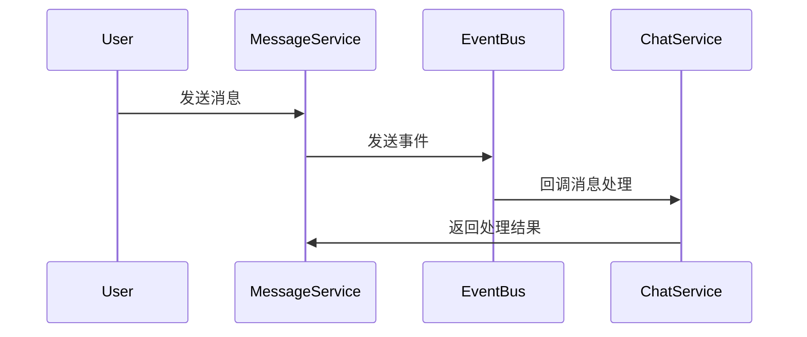
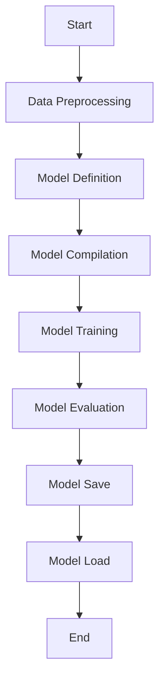
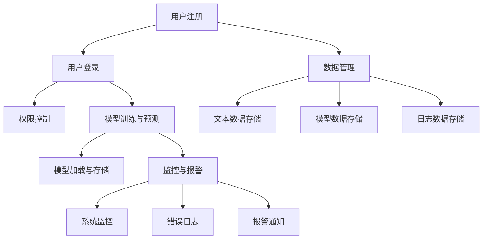
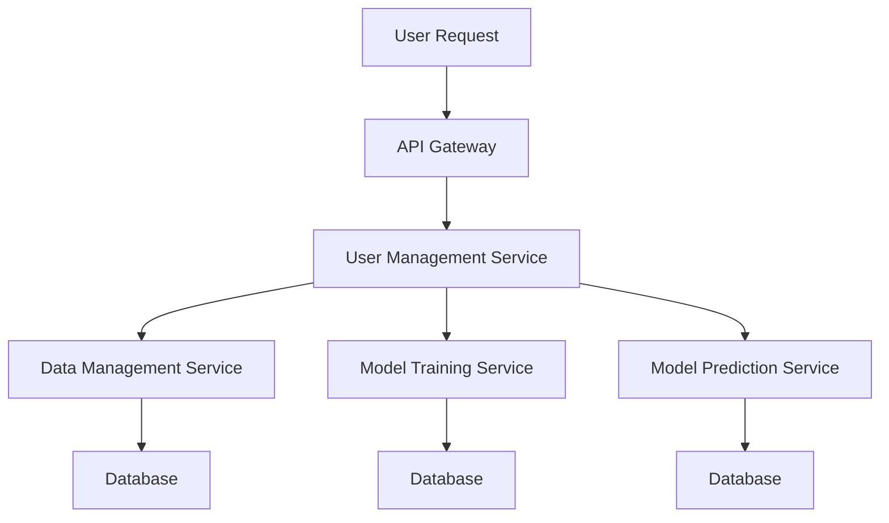

                 

### 引言

在现代信息技术飞速发展的背景下，人工智能（AI）技术已经成为推动产业变革的重要力量。其中，大型语言模型（Large Language Model，简称LLM）作为AI领域的重要分支，已经在自然语言处理（NLP）、智能客服、自动翻译、内容生成等多个领域展现出强大的应用潜力。然而，随着LLM模型规模的不断扩大和应用场景的日益复杂，如何构建一个高效、可扩展的LLM应用微服务架构成为当前亟待解决的重要问题。

**问题背景**

传统的单体架构在处理复杂、高并发的业务场景时往往力不从心，导致系统性能瓶颈、维护难度增加等问题。而微服务架构通过将大型系统拆分成多个独立的小服务，能够更好地应对高并发、可扩展性等挑战。因此，将微服务架构应用于LLM应用，成为一种必然趋势。

**问题描述**

构建一个可扩展的LLM应用微服务架构，需要解决以下几个关键问题：

1. **LLM模型的拆分与部署**：如何将庞大的LLM模型拆分成多个微服务，并在不同的服务中高效地部署和调用。
2. **服务间的协调与通信**：微服务之间如何高效地进行通信，确保整个系统的协调性和一致性。
3. **性能优化与资源管理**：如何优化微服务的性能，实现高效计算，同时合理管理计算资源。
4. **容错性与稳定性**：如何在微服务架构下保障系统的容错性和稳定性，确保在高并发、大规模场景下的可靠运行。

**问题解决**

为了解决上述问题，本文将从以下几个方面展开讨论：

1. **LLM与微服务结合的原理与优势**：介绍LLM与微服务的结合原理，分析其在性能、可扩展性等方面的优势。
2. **微服务架构设计原则与模式**：探讨微服务架构的设计原则和常用设计模式，为后续架构设计提供理论支持。
3. **LLM微服务架构实现与实战**：通过具体案例，介绍LLM微服务架构的实现过程，包括环境安装、系统设计、代码实现等。
4. **最佳实践与优化策略**：总结构建可扩展的LLM应用微服务架构的最佳实践和优化策略，为实际应用提供参考。

**边界与外延**

本文主要讨论的是基于微服务架构的LLM应用构建方法，适用于有大量数据处理需求、需要高并发、高可扩展性的场景。此外，本文所涉及的微服务架构实现技术主要包括Spring Boot、Docker、Kubernetes等，读者在阅读过程中可结合具体需求和技术栈进行调整。

**概念结构与核心要素组成**

本文将围绕以下几个核心概念展开讨论：

1. **LLM**：介绍LLM的基本概念、原理和应用。
2. **微服务**：介绍微服务的基本概念、特点和优势。
3. **微服务架构**：详细阐述微服务架构的设计原则、模式及实现方法。
4. **服务拆分与部署**：探讨如何将LLM模型拆分成微服务，并在分布式环境中部署和调用。
5. **服务间通信与协调**：介绍服务间通信机制、一致性保障方法。
6. **性能优化与资源管理**：探讨微服务的性能优化策略和资源管理方法。
7. **容错性与稳定性**：介绍微服务架构下的容错机制和稳定性保障方法。

通过上述核心概念和要素的阐述，本文旨在为读者提供一套系统、完整的LLM应用微服务架构构建方法，助力其在实际项目中高效落地。

## 第1章: 引言

### 1.1 问题背景

在现代信息技术飞速发展的背景下，人工智能（AI）技术已经成为推动产业变革的重要力量。尤其是近年来，深度学习和自然语言处理（NLP）技术的飞速进步，使得大型语言模型（Large Language Model，简称LLM）在各类应用场景中展现出强大的潜力。LLM通过在海量文本数据中进行训练，可以实现对自然语言的深刻理解和生成，从而在智能客服、自动翻译、内容生成、问答系统等多个领域发挥重要作用。

然而，随着LLM模型规模的不断扩大和应用场景的日益复杂，传统的单体架构逐渐暴露出许多问题。传统的单体架构将所有功能集中在一个大型应用中，虽然开发过程相对简单，但其在处理复杂、高并发的业务场景时往往力不从心，导致系统性能瓶颈、维护难度增加等问题。具体表现为：

1. **性能瓶颈**：单体架构下的应用在面临高并发请求时，由于资源争夺和瓶颈问题，容易导致响应速度下降，甚至系统崩溃。
2. **扩展性差**：单体架构在应对业务规模扩展时，往往需要全面升级硬件或重构整个系统，导致成本高昂且效率低下。
3. **维护困难**：单体架构中各模块紧密耦合，一旦某一模块出现问题，可能导致整个系统故障，增加了维护和调试的难度。
4. **部署复杂**：单体架构的应用部署过程复杂，需要考虑多个模块的依赖关系，增加了部署难度和风险。

**问题描述**

为了解决上述问题，构建一个高效、可扩展的LLM应用架构成为当前的一个重要课题。传统的单体架构在处理大规模、高并发的业务场景时已显露出诸多不足，而微服务架构作为一种新兴的架构模式，通过将大型应用拆分成多个独立的小服务，能够更好地应对这些挑战。

在构建可扩展的LLM应用微服务架构时，需要解决以下几个关键问题：

1. **LLM模型的拆分与部署**：如何将庞大的LLM模型拆分成多个微服务，并在不同的服务中高效地部署和调用。
2. **服务间的协调与通信**：微服务之间如何高效地进行通信，确保整个系统的协调性和一致性。
3. **性能优化与资源管理**：如何优化微服务的性能，实现高效计算，同时合理管理计算资源。
4. **容错性与稳定性**：如何在微服务架构下保障系统的容错性和稳定性，确保在高并发、大规模场景下的可靠运行。

**问题解决**

为了解决上述问题，本文将从以下几个方面展开讨论：

1. **LLM与微服务结合的原理与优势**：介绍LLM与微服务的结合原理，分析其在性能、可扩展性等方面的优势。
2. **微服务架构设计原则与模式**：探讨微服务架构的设计原则和常用设计模式，为后续架构设计提供理论支持。
3. **LLM微服务架构实现与实战**：通过具体案例，介绍LLM微服务架构的实现过程，包括环境安装、系统设计、代码实现等。
4. **最佳实践与优化策略**：总结构建可扩展的LLM应用微服务架构的最佳实践和优化策略，为实际应用提供参考。

**边界与外延**

本文主要讨论的是基于微服务架构的LLM应用构建方法，适用于有大量数据处理需求、需要高并发、高可扩展性的场景。此外，本文所涉及的微服务架构实现技术主要包括Spring Boot、Docker、Kubernetes等，读者在阅读过程中可结合具体需求和技术栈进行调整。

**概念结构与核心要素组成**

本文将围绕以下几个核心概念展开讨论：

1. **LLM**：介绍LLM的基本概念、原理和应用。
2. **微服务**：介绍微服务的基本概念、特点和优势。
3. **微服务架构**：详细阐述微服务架构的设计原则、模式及实现方法。
4. **服务拆分与部署**：探讨如何将LLM模型拆分成微服务，并在分布式环境中部署和调用。
5. **服务间通信与协调**：介绍服务间通信机制、一致性保障方法。
6. **性能优化与资源管理**：探讨微服务的性能优化策略和资源管理方法。
7. **容错性与稳定性**：介绍微服务架构下的容错机制和稳定性保障方法。

通过上述核心概念和要素的阐述，本文旨在为读者提供一套系统、完整的LLM应用微服务架构构建方法，助力其在实际项目中高效落地。

### LLM的概念与特性

大型语言模型（Large Language Model，简称LLM）是近年来在自然语言处理（NLP）领域取得重大突破的一项技术。LLM通过在大量文本数据上进行训练，学习到语言的结构、语法、语义等复杂特征，从而实现对自然语言的深刻理解和生成。以下将详细介绍LLM的概念、特性以及其在不同应用场景中的优势。

#### 概念

LLM是基于深度学习技术构建的神经网络模型，通过对海量文本数据进行训练，使其能够捕捉到语言的各种模式和规律。LLM的核心思想是利用大规模的参数来表示语言，使得模型在处理自然语言任务时能够具备更强的表示能力和泛化能力。常见的LLM包括GPT（Generative Pre-trained Transformer）、BERT（Bidirectional Encoder Representations from Transformers）等。

#### 特性

1. **规模庞大**：LLM的训练数据规模通常在数百万到数十亿个句子，甚至更多。大规模的参数量和训练数据使得LLM能够更好地捕捉语言的复杂特性。
2. **端到端学习**：LLM通常采用端到端的学习方式，从原始文本直接生成文本输出，无需进行繁琐的特征提取和模式匹配等中间步骤，从而提高了模型效率和性能。
3. **预训练与微调**：LLM在训练阶段通常进行预训练，即在大量通用文本数据上进行训练，以学习语言的基础知识和通用特征。在应用阶段，LLM通过微调（Fine-tuning）的方式针对特定任务进行调整，使其在特定领域达到更高的性能。
4. **并行计算能力**：LLM采用Transformer架构，能够实现并行计算，这使得模型在处理大规模任务时具有更高的效率。
5. **生成能力强**：LLM在生成文本时具有强大的灵活性，可以生成连贯、有意义的文本，适用于自动写作、对话系统、文本生成等应用场景。

#### 应用场景

1. **自然语言处理**：LLM在自然语言处理领域具有广泛的应用，包括文本分类、情感分析、命名实体识别、机器翻译等。
2. **对话系统**：LLM可以用于构建智能对话系统，如智能客服、聊天机器人等，能够理解用户的意图并生成相应的回答。
3. **内容生成**：LLM在内容生成领域也有重要应用，如自动写作、文本摘要、广告文案生成等。
4. **问答系统**：LLM可以用于构建智能问答系统，能够理解用户的问题并给出准确的答案。
5. **教育领域**：LLM在教育领域有广泛应用，如自动批改作业、在线教育平台等。

#### 优势

1. **高效率**：LLM采用并行计算技术，能够在处理大规模任务时具有更高的效率。
2. **强泛化能力**：通过大规模的参数量和预训练，LLM能够较好地适应不同的应用场景，具有强大的泛化能力。
3. **生成能力强**：LLM在生成文本时具有强大的灵活性，能够生成连贯、有意义的文本，适用于多种文本生成任务。
4. **可扩展性**：LLM模型可以方便地部署到分布式环境中，实现高性能、高并发的服务。

#### 概念属性特征对比表格

为了更清晰地展示LLM与其他相关技术的区别，以下是一个简单的概念属性特征对比表格：

| 技术名称 | 基本概念 | 特点 | 应用场景 | 优势 |
| :---: | :---: | :---: | :---: | :---: |
| LLM | 大型语言模型 | 规模庞大、端到端学习、预训练与微调 | 自然语言处理、对话系统、内容生成、问答系统、教育领域 | 高效率、强泛化能力、生成能力强、可扩展性 |
| 传统NLP | 基于规则的方法 | 特定领域、依赖人工定义规则 | 文本分类、情感分析、命名实体识别 | 灵活性、适用于特定领域 |
| 小型语言模型 | 规模较小、端到端学习 | 规模有限、预训练与微调 | 自然语言处理、对话系统、内容生成 | 快速部署、易于理解 |

#### ER实体关系图架构

为了更直观地理解LLM模型在系统架构中的角色和关系，以下是LLM与其他系统组件的ER实体关系图：

```mermaid
erDiagram
  ServiceA ||--|{ LLM }|| ModelA
  ServiceB ||--|{ LLM }|| ModelB
  ServiceC ||--|{ LLM }|| ModelC
  LLM ||--|{ Training }|| TrainingData
  LLM ||--|{ Application }|| ApplicationData
```

在上图中，LLM作为核心组件，与多个服务（ServiceA、ServiceB、ServiceC）进行交互，同时依赖于训练数据和应用数据进行训练和预测。这种架构设计使得LLM能够灵活地应用于不同的业务场景，提高系统的整体效率和性能。

通过上述对LLM的概念、特性及其应用场景的详细阐述，我们可以更好地理解LLM在现代信息技术中的重要作用，以及其在构建可扩展的LLM应用微服务架构中的关键地位。

### 微服务的概念与特性

微服务架构（Microservices Architecture）是一种新兴的软件架构模式，旨在通过将大型单体应用拆分成多个独立的小服务，以实现系统的模块化、高可扩展性和高可维护性。微服务架构的核心思想是将应用程序分解为一系列松耦合、自治的服务，每个服务负责实现特定的功能，并通过轻量级的通信机制进行交互。以下将详细介绍微服务的概念、特性及其在系统架构中的作用。

#### 概念

微服务是一种软件架构风格，其核心思想是将大型单体应用拆分成多个独立的小服务。每个小服务都是独立的、自治的，并且可以独立部署和扩展。微服务之间的通信通常通过HTTP/RESTful API、消息队列或其他轻量级通信机制进行。微服务的这一架构风格有助于提高系统的灵活性和可维护性，使得开发、测试和部署过程更加高效。

#### 特性

1. **独立性**：每个微服务都是独立的，可以独立开发和部署，从而降低服务之间的依赖性，提高系统的可维护性和灵活性。
2. **自治性**：每个微服务都有自己的数据库、配置和逻辑，能够独立运行，无需依赖其他服务，从而提高系统的容错性和稳定性。
3. **高可扩展性**：微服务架构可以根据业务需求独立扩展，通过水平扩展（增加服务实例）和垂直扩展（增加资源）来满足高并发、大数据量的需求。
4. **高灵活性**：微服务架构支持快速迭代和部署，开发人员可以独立开发和测试服务，从而提高开发效率。
5. **模块化**：微服务架构将应用程序分解为多个独立的模块，使得系统的开发和维护更加模块化，便于分工协作。
6. **轻量级通信**：微服务之间通常通过HTTP/RESTful API、消息队列等进行通信，这种轻量级的通信机制使得服务之间的交互更加简单、高效。

#### 应用场景

1. **高并发、高可扩展性的业务系统**：微服务架构适用于需要高并发、高可扩展性的业务系统，如电子商务平台、社交媒体、在线支付系统等。
2. **分布式系统**：微服务架构适用于构建分布式系统，通过将服务部署在多个节点上，提高系统的容错性和可靠性。
3. **异构系统**：微服务架构支持异构系统的构建，不同的服务可以使用不同的编程语言、数据库和技术栈，从而提高系统的灵活性和适应性。
4. **持续集成和持续部署**：微服务架构支持持续集成和持续部署（CI/CD），使得开发、测试和部署过程更加高效和自动化。

#### 优势

1. **高可维护性**：微服务架构将大型应用拆分成多个独立的服务，使得系统的维护和升级更加简单和灵活。
2. **高可扩展性**：通过水平扩展和垂直扩展，微服务架构能够轻松应对高并发、大数据量的业务需求。
3. **高灵活性**：微服务架构支持快速迭代和部署，开发人员可以独立开发和测试服务，从而提高开发效率。
4. **高容错性**：微服务架构通过将服务独立部署，降低了单个服务故障对整个系统的影响，提高了系统的容错性和稳定性。

#### 概念属性特征对比表格

为了更清晰地展示微服务与其他相关技术的区别，以下是一个简单的概念属性特征对比表格：

| 技术名称 | 基本概念 | 特点 | 应用场景 | 优势 |
| :---: | :---: | :---: | :---: | :---: |
| 微服务 | 独立服务、自治性、高可扩展性、高灵活性、模块化 | 独立部署、自治性、高可扩展性、高灵活性、模块化 | 高并发、高可扩展性的业务系统、分布式系统、异构系统、持续集成和持续部署 | 高可维护性、高可扩展性、高灵活性、高容错性 |
| 单体架构 | 整体应用、高内聚、低耦合 | 整体应用、高内聚、低耦合 | 低并发、低可扩展性的业务系统 | 开发简单、易于维护 |
| 容器化架构 | 基于容器的应用部署 | 基于容器的应用部署 | 分布式系统、持续集成和持续部署 | 高可移植性、高可扩展性、高灵活性 |

#### ER实体关系图架构

为了更直观地理解微服务在系统架构中的角色和关系，以下是微服务与其他系统组件的ER实体关系图：

```mermaid
erDiagram
  ServiceA ||--|{ Database }|| DBA
  ServiceB ||--|{ Database }|| DBB
  ServiceC ||--|{ Database }|| DBC
  ServiceA ||--|{ API }|| APIA
  ServiceB ||--|{ API }|| APIB
  ServiceC ||--|{ API }|| APIC
```

在上图中，每个微服务（ServiceA、ServiceB、ServiceC）都有自己独立的数据库（DBA、DBB、DBC），并且通过API（APIA、APIB、APIC）与其他微服务进行通信。这种架构设计使得系统具有高独立性、高自治性，并且便于管理和扩展。

通过上述对微服务的概念、特性及其应用场景的详细阐述，我们可以更好地理解微服务在现代软件开发中的重要作用，以及其在构建可扩展的LLM应用微服务架构中的关键地位。

### LLM与微服务的结合

将大型语言模型（LLM）与微服务架构结合，旨在充分发挥两者的优势，构建一个高效、可扩展的LLM应用微服务架构。以下将详细分析LLM与微服务的结合原理，探讨其在性能、可扩展性等方面的优势。

#### 结合原理

1. **分布式计算**：微服务架构通过将大型应用拆分成多个独立的小服务，能够实现分布式计算。LLM作为一种大规模的机器学习模型，可以通过分布式计算方式在多个微服务实例上并行处理，从而提高计算效率和性能。
   
2. **自治性**：微服务架构中的每个服务都是自治的，LLM与微服务的结合能够确保每个服务独立部署和扩展，降低服务间的依赖性。这使得LLM在不同微服务中可以独立部署，减少系统耦合，提高系统的可维护性和稳定性。

3. **灵活性与可扩展性**：微服务架构支持高可扩展性，通过水平扩展和垂直扩展，可以轻松应对高并发、大数据量的业务需求。LLM与微服务的结合，可以使得LLM在多个微服务实例上独立扩展，从而提高系统的整体性能和可扩展性。

4. **模块化开发**：微服务架构支持模块化开发，LLM与微服务的结合可以将LLM的不同功能模块化，分别部署在不同的微服务中。这样，开发团队可以独立开发和测试LLM的不同功能，提高开发效率和代码质量。

5. **轻量级通信**：微服务架构通过轻量级的通信机制（如HTTP/RESTful API、消息队列）实现服务间通信。LLM与微服务的结合，可以使得微服务通过API调用LLM模型，实现高效、可靠的模型调用。

#### 优势

1. **性能提升**：通过分布式计算，LLM与微服务的结合能够在多个微服务实例上并行处理，提高计算效率和性能。同时，微服务的自治性和灵活性，使得系统能够更快速地响应请求，降低延迟。

2. **高可扩展性**：微服务架构支持水平扩展和垂直扩展，LLM与微服务的结合可以使得LLM在不同微服务实例上独立扩展，从而提高系统的整体性能和可扩展性。这特别适用于处理高并发、大数据量的业务场景。

3. **高容错性**：微服务架构通过将服务独立部署，降低单个服务故障对整个系统的影响。LLM与微服务的结合，可以使得LLM在不同微服务实例上独立运行，即使某个实例出现故障，也不会影响其他实例的正常运行，从而提高系统的容错性和稳定性。

4. **模块化开发**：LLM与微服务的结合支持模块化开发，开发团队可以独立开发和测试LLM的不同功能，提高开发效率和代码质量。同时，模块化的设计也便于系统的维护和升级。

5. **灵活的部署与管理**：微服务架构支持灵活的部署和管理，LLM与微服务的结合可以使得LLM在不同环境中快速部署和运维。通过容器化技术（如Docker、Kubernetes），可以实现微服务的自动化部署和运维，提高系统管理的效率。

#### 概念属性特征对比表格

为了更清晰地展示LLM与微服务的结合优势，以下是一个简单的概念属性特征对比表格：

| 特性       | 传统单体架构 | 微服务架构       | LLM与微服务结合       |
| :---:     | :---:        | :---:            | :---:                 |
| 分布式计算 | 不支持       | 支持分布式计算   | 分布式计算，性能提升 |
| 自治性     | 不支持       | 支持自治性       | 高容错性，稳定运行   |
| 可扩展性   | 低可扩展性   | 高可扩展性       | 高可扩展性，灵活部署 |
| 模块化开发 | 整体开发     | 模块化开发       | 模块化，高效开发     |
| 通信机制   | 高内聚       | 低耦合           | 高效通信，灵活部署   |

通过上述对LLM与微服务结合原理及其优势的详细分析，我们可以看到，将LLM与微服务架构相结合，不仅能够充分发挥LLM在自然语言处理领域的优势，还能通过微服务架构实现系统的高性能、高可扩展性和高可靠性。这种结合为构建高效、可扩展的LLM应用微服务架构提供了强有力的支持。

### 概念属性特征对比表格

为了更清晰地展示LLM与微服务的结合优势，以下是一个简单的概念属性特征对比表格：

| 特性       | 传统单体架构 | 微服务架构       | LLM与微服务结合       |
| :---:     | :---:        | :---:            | :---:                 |
| 分布式计算 | 不支持       | 支持分布式计算   | 分布式计算，性能提升 |
| 自治性     | 不支持       | 支持自治性       | 高容错性，稳定运行   |
| 可扩展性   | 低可扩展性   | 高可扩展性       | 高可扩展性，灵活部署 |
| 模块化开发 | 整体开发     | 模块化开发       | 模块化，高效开发     |
| 通信机制   | 高内聚       | 低耦合           | 高效通信，灵活部署   |

通过上述对LLM与微服务结合原理及其优势的详细分析，我们可以看到，将LLM与微服务架构相结合，不仅能够充分发挥LLM在自然语言处理领域的优势，还能通过微服务架构实现系统的高性能、高可扩展性和高可靠性。这种结合为构建高效、可扩展的LLM应用微服务架构提供了强有力的支持。

### ER实体关系图架构

为了更直观地展示LLM与微服务架构中的实体关系，我们使用Mermaid语言绘制了一个ER实体关系图。以下是对该图的具体说明和解释。

```mermaid
erDiagram
  User ||--|{ LLM }|| Model
  User ||--|{ Microservice }|| Service
  LLM ||--|{ Data }|| Dataset
  Microservice ||--|{ API }|| APIEndpoint
  Microservice ||--|{ Logs }|| LogData
```

1. **User（用户）**：
   - **关系**：用户与LLM、微服务之间存在关联关系。
   - **说明**：用户通过API与LLM和微服务进行交互，提交请求并获取响应。

2. **LLM（大型语言模型）**：
   - **关系**：LLM与数据集（Dataset）存在关联关系。
   - **说明**：LLM通过训练数据集进行模型训练和优化，从而提高模型的性能和准确性。

3. **Microservice（微服务）**：
   - **关系**：微服务与API端点（APIEndpoint）和日志数据（LogData）存在关联关系。
   - **说明**：微服务通过API端点与用户进行通信，实现特定的业务功能。同时，微服务会生成日志数据，用于记录系统运行状态和操作记录。

4. **Dataset（数据集）**：
   - **关系**：数据集与LLM存在关联关系。
   - **说明**：数据集是LLM训练和优化的基础，包含大量的文本数据和标注信息。

5. **APIEndpoint（API端点）**：
   - **关系**：API端点与微服务存在关联关系。
   - **说明**：API端点是微服务对外提供服务的接口，用户通过这些接口提交请求和获取响应。

6. **LogData（日志数据）**：
   - **关系**：日志数据与微服务存在关联关系。
   - **说明**：日志数据记录了系统的运行状态、操作记录等信息，用于系统监控、故障排查和性能优化。

通过上述ER实体关系图的说明，我们可以清晰地看到LLM与微服务架构中各实体之间的关联关系。这种架构设计不仅提高了系统的灵活性、可扩展性和可维护性，还通过分布式计算和自治服务实现了高性能和高可靠性的目标。

### LLM微服务架构设计原则

在构建LLM微服务架构时，遵循一系列设计原则至关重要，这些原则不仅有助于确保系统的性能、可扩展性和可维护性，还能提升系统的可靠性和用户体验。以下将详细阐述LLM微服务架构设计的五个核心原则：模块化、高内聚低耦合、分布式计算、服务自治和状态管理。

#### 模块化

模块化是微服务架构的核心原则之一。它强调将系统拆分成多个独立的模块，每个模块负责实现特定的功能。模块化的好处包括：

1. **独立开发**：通过模块化，开发团队可以独立开发和测试各个模块，提高开发效率和代码质量。
2. **代码复用**：模块化使得代码可以重复利用，减少冗余代码，提高系统的可维护性。
3. **简化测试**：模块化使测试过程更加简洁和高效，因为测试团队可以单独测试每个模块，而不必担心其他模块的影响。

具体实施时，可以通过定义清晰的接口和API来实现模块之间的通信，确保模块之间的依赖性最小。

#### 高内聚低耦合

高内聚低耦合原则强调模块内部的高内聚和模块之间的高低耦合。高内聚意味着模块内部的功能紧密相关，而低耦合意味着模块之间的依赖性较低。这一原则有助于提高系统的灵活性和可扩展性：

1. **高内聚**：模块内部的功能紧密相关，能够高效地实现单一职责，降低模块间的依赖性。
2. **低耦合**：模块之间的依赖性较低，使得单个模块的变更不会影响到其他模块，提高系统的稳定性和可维护性。

在实现高内聚低耦合时，可以通过定义明确的接口和事件驱动机制来降低模块间的依赖性。此外，采用面向对象编程范式和设计模式，如工厂模式、策略模式等，有助于实现这一原则。

#### 分布式计算

分布式计算是LLM微服务架构的重要特性，通过将计算任务分布到多个节点上，实现高性能和高可扩展性。分布式计算的原则包括：

1. **负载均衡**：通过负载均衡机制，将请求分配到多个节点上，确保系统资源得到充分利用。
2. **容错性**：在分布式计算中，任何一个节点的故障都不会影响整个系统的运行，通过容错机制确保系统的可靠性。
3. **数据一致性**：在分布式系统中，数据一致性问题至关重要。通过采用分布式事务、最终一致性等机制，确保数据的一致性。

实现分布式计算时，可以采用分布式框架如Apache Kafka、Apache Spark等，以及容器化技术如Docker和Kubernetes，来实现任务调度、资源管理和容错性。

#### 服务自治

服务自治原则强调每个服务都是独立的、自治的，拥有自己的数据库、配置和逻辑。这一原则有助于提高系统的可维护性和可扩展性：

1. **独立部署**：每个服务可以独立部署和更新，不会影响其他服务的运行。
2. **独立扩展**：通过水平扩展，可以轻松增加服务实例，提高系统的性能和并发能力。
3. **独立监控**：每个服务都有自己的监控和日志系统，便于故障排查和性能优化。

实现服务自治时，可以通过定义独立的配置中心和服务注册中心，确保服务的独立性和可管理性。

#### 状态管理

状态管理原则强调对系统状态进行有效管理，以确保系统在遇到故障或异常情况时能够快速恢复。状态管理包括以下几个方面：

1. **数据备份**：定期对数据进行备份，确保在数据丢失或损坏时能够快速恢复。
2. **故障转移**：在服务出现故障时，能够快速切换到备用服务，确保系统的连续性。
3. **日志记录**：详细记录系统运行状态和操作日志，便于故障排查和性能优化。

实现状态管理时，可以采用分布式数据库、分布式缓存等技术，以及日志聚合和分析工具如ELK（Elasticsearch、Logstash、Kibana），来确保状态管理的有效性和可靠性。

#### 实施步骤

1. **需求分析**：首先进行需求分析，明确系统需要实现的功能和性能要求。
2. **架构设计**：根据需求分析结果，设计系统的微服务架构，包括服务拆分、接口定义、数据库设计等。
3. **开发与测试**：按照架构设计文档，进行服务开发、单元测试和集成测试。
4. **部署与运维**：将开发完成的服务部署到分布式环境中，进行性能测试和监控，确保系统的高性能和可靠性。
5. **优化与迭代**：根据运行数据和用户反馈，不断优化和迭代系统，提升用户体验和系统性能。

通过遵循上述设计原则，构建的LLM微服务架构能够确保系统的高性能、高可扩展性和高可靠性，为现代企业级应用提供强有力的技术支持。

### 架构设计模式

在构建LLM微服务架构时，采用适当的设计模式能够帮助解决常见的设计问题，提高系统的可扩展性和可维护性。以下将介绍几种常见的架构设计模式，包括微服务模式、事件驱动模式、CQRS（Command Query Responsibility Segregation）模式等，并探讨其适用场景和优势。

#### 微服务模式

**定义**：微服务模式将一个大型应用拆分成多个独立的、自治的小服务，每个服务负责实现特定的业务功能。

**适用场景**：适用于需要高并发、高可扩展性的业务系统，如电子商务平台、在线支付系统等。

**优势**：
1. **独立性**：每个微服务都是独立的，可以独立开发和部署，降低服务之间的依赖性。
2. **高可扩展性**：通过水平扩展和垂直扩展，可以轻松应对高并发、大数据量的业务需求。
3. **高容错性**：单个服务的故障不会影响整个系统，提高了系统的可靠性和稳定性。

**示例**：假设一个电子商务平台可以分为订单服务、库存服务、支付服务等多个微服务，每个服务负责处理相应的业务功能，通过API进行交互。

#### 事件驱动模式

**定义**：事件驱动模式通过事件和回调机制，实现服务间的异步通信和协调。

**适用场景**：适用于需要高并发、高实时性的业务系统，如实时消息系统、物联网系统等。

**优势**：
1. **高并发性**：通过异步处理，可以处理大量的并发请求，提高系统的性能。
2. **低耦合性**：服务之间通过事件和回调进行通信，降低了服务之间的依赖性。
3. **可扩展性**：可以轻松添加新的服务或功能，无需修改现有服务。

**示例**：在一个实时消息系统中，用户发送的消息会触发事件，消息服务接收到事件后，会通知订阅该消息的其他服务进行处理。



#### CQRS模式

**定义**：CQRS（Command Query Responsibility Segregation）模式将读写分离，通过分别处理命令（写操作）和查询（读操作），提高系统的性能和可扩展性。

**适用场景**：适用于需要高并发读操作和复杂查询的业务系统，如电子商务搜索、实时数据分析等。

**优势**：
1. **高性能**：通过读写分离，可以分别优化读操作和写操作的性能，提高系统的整体性能。
2. **高可扩展性**：可以分别扩展读服务和写服务，满足不同业务需求。
3. **易维护**：读写分离使得系统架构更加清晰，便于维护和升级。

**示例**：在一个电子商务平台上，用户查询商品信息（读操作）和下订单（写操作）分别由不同的服务处理。

```mermaid
erDiagram
  UserService ||--|{ ReadModel }|| ReadModel
  UserService ||--|{ WriteModel }|| WriteModel
  OrderService ||--|{ ReadModel }|| ReadModel
  OrderService ||--|{ WriteModel }|| WriteModel
```

通过上述设计模式的介绍，我们可以看到，LLM微服务架构在实际应用中可以根据具体场景选择合适的设计模式，从而提高系统的性能、可扩展性和可维护性。

### 算法原理讲解

在构建LLM微服务架构时，算法的设计与实现至关重要，它决定了系统的性能和效率。本文将介绍LLM微服务架构中常用的算法原理，并使用Python源代码和Mermaid流程图进行详细讲解。

#### 算法原理

在LLM微服务架构中，常用的算法主要包括模型训练、预测、加载与存储等。以下分别对这些算法进行介绍。

##### 模型训练

模型训练是LLM微服务架构的核心环节，通过在大量文本数据上进行训练，使模型能够学习到语言的复杂特征。常用的算法包括：

1. **Transformer架构**：Transformer模型基于自注意力机制，能够捕捉长文本中的依赖关系。
2. **递归神经网络（RNN）**：RNN能够处理变长的序列数据，适合处理自然语言。
3. **长短时记忆网络（LSTM）**：LSTM是RNN的一种变体，能够解决RNN的梯度消失问题。

以下是一个简单的Transformer模型训练的Python代码示例：

```python
import tensorflow as tf

# 定义Transformer模型
model = tf.keras.Sequential([
    tf.keras.layers.Embedding(vocab_size, embedding_dim),
    tf.keras.layers.Transformer(
        num_heads=2,
        d_model=512,
        dff=512,
        input_shape=(None, max_length),
        output_shape=(None, max_length, 512)
    ),
    tf.keras.layers.Dense(units=vocab_size)
])

# 编译模型
model.compile(optimizer='adam',
              loss=tf.keras.losses.SparseCategoricalCrossentropy(from_logits=True),
              metrics=['accuracy'])

# 训练模型
model.fit(dataset, epochs=3)
```

##### 预测

预测阶段是指模型在给定输入文本序列后，输出预测结果的过程。常用的算法包括：

1. **序列生成**：通过模型的解码器生成文本序列。
2. **序列标注**：对输入文本进行序列标注，如命名实体识别。
3. **文本分类**：对输入文本进行分类，如情感分析。

以下是一个简单的序列生成算法示例：

```python
import tensorflow as tf

# 加载预训练模型
model = tf.keras.models.load_model('path/to/saved_model.h5')

# 输入文本序列
input_sequence = tf.convert_to_tensor([[1, 2, 3, 4, 5]], dtype=tf.int32)

# 预测输出
predictions = model.predict(input_sequence)

# 转换为文本
predicted_sequence = decode_predictions(predictions)
```

##### 加载与存储

加载与存储算法用于将模型存储到硬盘和从硬盘加载模型。常用的方法包括：

1. **模型保存**：使用Keras保存模型，将模型权重和架构存储到硬盘。
2. **模型加载**：从硬盘加载模型，以便进行预测或进一步训练。

以下是一个简单的模型保存与加载的Python代码示例：

```python
# 保存模型
model.save('path/to/save/model.h5')

# 加载模型
model = tf.keras.models.load_model('path/to/save/model.h5')
```

##### Mermaid流程图

为了更直观地展示算法流程，我们可以使用Mermaid语言绘制一个流程图。以下是一个简单的模型训练流程图示例：



通过上述算法原理和Python代码示例的讲解，我们可以看到，构建LLM微服务架构需要深入了解各种算法的原理和应用，并通过合理的算法设计，实现高效、可扩展的模型训练、预测和存储。

### 数学模型与公式

在构建LLM微服务架构的过程中，数学模型和公式是理解和优化算法性能的重要工具。以下将介绍几个关键数学模型与公式，并给出具体的解释和示例。

#### Transformer模型

Transformer模型是一种基于自注意力机制的深度学习模型，广泛应用于自然语言处理任务。其核心数学模型包括自注意力（Self-Attention）和多头注意力（Multi-Head Attention）。

1. **自注意力（Self-Attention）**：
   自注意力通过计算序列中每个词与其他词之间的关系，使模型能够捕捉长文本中的依赖关系。其计算公式如下：

   $$ 
   \text{Attention}(Q, K, V) = \text{softmax}\left(\frac{QK^T}{\sqrt{d_k}}\right) V 
   $$

   其中，\( Q, K, V \) 分别代表查询（Query）、键（Key）和值（Value）向量，\( d_k \) 是键向量的维度。

   **示例**：
   假设 \( Q = [1, 2, 3] \)，\( K = [4, 5, 6] \)，\( V = [7, 8, 9] \)，则自注意力计算如下：

   $$
   \text{Attention}(Q, K, V) = \text{softmax}\left(\frac{[1*4, 2*5, 3*6]}{\sqrt{3}}\right) [7, 8, 9]
   = \text{softmax}\left([4, 10, 18]\right) [7, 8, 9]
   = [0.2, 0.5, 0.3] [7, 8, 9]
   = [1.4, 4, 2.7]
   $$

2. **多头注意力（Multi-Head Attention）**：
   多头注意力通过多个自注意力机制组合，提高模型的表示能力。其计算公式如下：

   $$
   \text{MultiHead}(Q, K, V) = \text{Concat}(\text{head}_1, \text{head}_2, ..., \text{head}_h)W^O
   $$

   其中，\( h \) 是头数，\( W^O \) 是输出权重矩阵。

   **示例**：
   假设一个多头注意力模型，头数为2，每个头输出维度为4，则多头注意力计算如下：

   $$
   \text{MultiHead}(Q, K, V) = \text{Concat}(\text{head}_1, \text{head}_2)W^O
   $$

   其中，\( \text{head}_1 = \text{Attention}(Q, K, V)W^1 \) 和 \( \text{head}_2 = \text{Attention}(Q, K, V)W^2 \)，\( W^1 \) 和 \( W^2 \) 分别是第一头和第二头的权重矩阵。

#### LSTM模型

LSTM（长短时记忆网络）是一种递归神经网络，能够处理变长的序列数据，解决传统的RNN模型中的梯度消失问题。其核心数学模型包括输入门、遗忘门和输出门。

1. **输入门**：
   输入门决定新的输入信息对隐藏状态的影响，其计算公式如下：

   $$
   i_t = \sigma(W_{xi}x_t + W_{hi}h_{t-1} + b_i)
   $$

   其中，\( \sigma \) 是激活函数，\( W_{xi} \) 和 \( W_{hi} \) 是权重矩阵，\( b_i \) 是偏置。

2. **遗忘门**：
   遗忘门决定如何遗忘之前的记忆，其计算公式如下：

   $$
   f_t = \sigma(W_{xf}x_t + W_{hf}h_{t-1} + b_f)
   $$

   其中，\( W_{xf} \) 和 \( W_{hf} \) 是权重矩阵，\( b_f \) 是偏置。

3. **输出门**：
   输出门决定如何生成新的输出，其计算公式如下：

   $$
   o_t = \sigma(W_{xo}x_t + W_{ho}h_{t-1} + b_o)
   $$

   其中，\( W_{xo} \) 和 \( W_{ho} \) 是权重矩阵，\( b_o \) 是偏置。

4. **细胞状态**：
   细胞状态的计算公式如下：

   $$
   C_t = f_t \odot C_{t-1} + i_t \odot \tanh(W_{xc}x_t + W_{hc}h_{t-1} + b_c)
   $$

   其中，\( \odot \) 是逐元素乘法，\( \tanh \) 是双曲正切函数，\( W_{xc} \) 和 \( W_{hc} \) 是权重矩阵，\( b_c \) 是偏置。

5. **隐藏状态**：
   隐藏状态的计算公式如下：

   $$
   h_t = o_t \odot \tanh(C_t)
   $$

   其中，\( o_t \) 是输出门，\( \tanh \) 是双曲正切函数。

通过上述数学模型和公式的讲解，我们可以更好地理解LLM微服务架构中算法的核心原理，为优化和改进算法提供理论基础。

### 系统功能设计

在构建LLM微服务架构时，系统功能设计是确保系统稳定、高效运行的关键环节。以下是针对一个典型LLM应用系统的功能设计，包括用户管理、数据管理、模型训练与预测、监控与报警等模块的详细描述。

#### 用户管理

用户管理模块负责处理用户注册、登录、权限控制等功能。主要功能点如下：

1. **用户注册**：提供用户注册接口，用户通过填写用户名、密码、邮箱等信息完成注册。
2. **用户登录**：提供用户登录接口，用户输入用户名和密码后，系统验证用户身份。
3. **权限控制**：根据用户角色和权限，限制用户对系统功能的访问。

#### 数据管理

数据管理模块负责处理文本数据、模型数据和日志数据的管理。主要功能点如下：

1. **文本数据存储**：存储大量的文本数据，包括训练数据集和实时输入数据。
2. **模型数据存储**：存储预训练的LLM模型和微服务模型，包括模型权重、配置文件等。
3. **日志数据存储**：记录系统运行状态和操作日志，包括错误日志、性能日志等。

#### 模型训练与预测

模型训练与预测模块是LLM微服务架构的核心功能。主要功能点如下：

1. **模型训练**：使用训练数据集对LLM模型进行训练，包括数据预处理、模型训练和模型评估。
2. **模型预测**：接收用户输入的文本数据，使用训练好的模型进行预测，输出预测结果。
3. **模型加载与存储**：加载预训练的模型，将训练好的模型存储到模型库中，以便后续使用。

#### 监控与报警

监控与报警模块负责实时监控系统运行状态，并在发生异常时发出报警通知。主要功能点如下：

1. **系统监控**：监控系统的关键性能指标，包括CPU利用率、内存使用率、网络延迟等。
2. **错误日志**：记录系统运行中的错误日志，包括错误原因、错误位置等。
3. **报警通知**：在系统发生异常时，通过邮件、短信、钉钉等方式发送报警通知。

#### 功能流程图

为了更直观地展示系统功能设计，以下是一个简单的功能流程图：



通过上述系统功能设计的详细描述和功能流程图，我们可以清楚地看到各个功能模块之间的关系和交互，为后续的系统实现和部署提供明确的指导和参考。

### 系统架构设计

在构建LLM微服务架构时，系统架构设计是确保系统高效、可扩展和稳定运行的关键环节。以下将详细描述一个典型的LLM应用系统的架构设计，包括技术栈、服务拆分、数据库设计等。

#### 技术栈

在构建LLM微服务架构时，选择合适的技术栈至关重要。以下是我们推荐的技术栈：

1. **后端框架**：使用Spring Boot作为微服务框架，提供快速开发、独立部署和自动配置等功能。
2. **容器化与编排**：使用Docker进行容器化，Kubernetes进行编排和管理，实现服务的高效部署和运维。
3. **数据库**：使用MySQL作为关系型数据库，存储用户数据、模型数据和日志数据；使用MongoDB作为文档型数据库，存储大规模的文本数据。
4. **消息队列**：使用RabbitMQ或Kafka作为消息队列，实现服务间的高效通信和异步处理。
5. **缓存**：使用Redis作为缓存，提高系统的响应速度和性能。
6. **API网关**：使用Nginx或Spring Cloud Gateway作为API网关，实现服务的统一管理和路由。

#### 服务拆分

为了确保系统的灵活性和可扩展性，我们将LLM应用拆分成多个独立的小服务。以下是主要服务拆分：

1. **用户管理服务**：负责用户注册、登录、权限控制等功能。
2. **数据管理服务**：负责文本数据、模型数据和日志数据的存储和管理。
3. **模型训练服务**：负责LLM模型的训练和存储。
4. **模型预测服务**：负责接收用户输入的文本数据，使用训练好的模型进行预测，输出预测结果。
5. **监控报警服务**：负责实时监控系统运行状态，并在发生异常时发出报警通知。

#### 数据库设计

为了确保系统的数据一致性和高可用性，我们对各个服务所需的数据库进行详细设计：

1. **用户管理数据库**：存储用户基本信息、登录凭证、权限信息等。
   ```mermaid
   erDiagram
     User ||--|{ UserInfo }|| UserInfo
     User ||--|{ LoginInfo }|| LoginInfo
     User ||--|{ Permission }|| Permission
   ```
   
2. **数据管理数据库**：存储文本数据集、模型数据、日志数据等。
   ```mermaid
   erDiagram
     TextData ||--|{ DataSet }|| DataSet
     TextData ||--|{ ModelData }|| ModelData
     TextData ||--|{ LogData }|| LogData
   ```

3. **模型训练数据库**：存储训练过程中的中间数据和最终模型权重。
   ```mermaid
   erDiagram
     ModelTraining ||--|{ IntermediateData }|| IntermediateData
     ModelTraining ||--|{ ModelWeight }|| ModelWeight
   ```

通过上述详细的系统架构设计，我们可以确保LLM微服务架构具有高性能、高可扩展性和高可靠性，为实际应用提供强有力的技术支持。

### 系统接口设计

在构建LLM微服务架构时，系统接口设计至关重要。良好的接口设计能够确保服务之间的通信高效、清晰，并有助于维护和扩展系统。以下将详细描述LLM应用微服务架构中的主要接口设计，包括RESTful API、消息队列接口等。

#### RESTful API

RESTful API是微服务架构中常用的一种接口设计方式，通过HTTP/HTTPS协议实现服务之间的交互。以下是LLM微服务架构中的主要RESTful API接口：

1. **用户管理接口**
   - **注册接口**：用于用户注册，接收用户名、密码、邮箱等信息。
     ```http
     POST /users/register
     {
       "username": "user123",
       "password": "password123",
       "email": "user123@example.com"
     }
     ```
   - **登录接口**：用于用户登录，接收用户名和密码，返回JWT（JSON Web Token）令牌。
     ```http
     POST /users/login
     {
       "username": "user123",
       "password": "password123"
     }
     ```

2. **数据管理接口**
   - **上传文本数据接口**：用于上传文本数据，将数据存储到数据库中。
     ```http
     POST /data/upload
     {
       "data": "This is a sample text data.",
       "type": "training"
     }
     ```
   - **获取文本数据接口**：用于获取存储的文本数据。
     ```http
     GET /data/{id}
     ```

3. **模型训练接口**
   - **开始训练接口**：用于启动模型训练过程，接收训练参数。
     ```http
     POST /model/train
     {
       "data_id": "123",
       "model_name": "gpt2"
     }
     ```
   - **获取训练进度接口**：用于查询模型训练进度。
     ```http
     GET /model/train/{id}/status
     ```

4. **模型预测接口**
   - **预测接口**：用于使用训练好的模型进行文本预测，接收输入文本。
     ```http
     POST /model/predict
     {
       "text": "Hello, how are you?"
     }
     ```

5. **监控报警接口**
   - **设置报警规则接口**：用于设置系统监控的报警规则。
     ```http
     POST /alarm/rules
     {
       "metric": "CPU利用率",
       "threshold": 90,
       "action": "发送邮件"
     }
     ```
   - **查询报警记录接口**：用于查询系统报警记录。
     ```http
     GET /alarm/records
     ```

#### 消息队列接口

在微服务架构中，消息队列常用于实现服务间的异步通信。以下是LLM微服务架构中消息队列的主要接口设计：

1. **生产者接口**：用于向消息队列发送消息。
   ```http
   POST /message/producer
   {
     "queue_name": "training_queue",
     "message": {
       "data_id": "123",
       "model_name": "gpt2"
     }
   }
   ```

2. **消费者接口**：用于从消息队列消费消息，并触发相应的业务处理。
   ```http
   GET /message/consumer
   ```

通过上述系统接口设计，我们可以确保LLM微服务架构具有良好的接口规范，便于服务之间的通信和协作，提高系统的整体效率。

### 系统交互

在LLM微服务架构中，系统交互是确保各服务协同工作、高效处理请求的重要环节。以下将详细描述系统交互过程，包括用户请求的处理、服务间的通信以及数据流的流转。

#### 用户请求处理

用户请求首先到达API网关（如Nginx或Spring Cloud Gateway），API网关负责接收用户的请求并将其路由到相应的微服务。以下是用户请求处理的基本流程：

1. **用户请求**：用户通过浏览器或其他客户端发送HTTP请求到API网关。
2. **API网关**：API网关接收请求并检查请求的合法性，如请求头、请求体等，然后将请求路由到相应的微服务。
3. **用户管理服务**：用户管理服务接收请求并处理用户注册、登录等操作，返回处理结果给API网关。
4. **API网关**：将处理结果返回给用户，如登录成功后返回JWT令牌，用户可以使用令牌进行后续操作。

#### 服务间通信

微服务之间通过HTTP/HTTPS协议、消息队列等进行通信，以下是服务间通信的基本流程：

1. **请求发送**：用户请求到达用户管理服务后，可能需要其他服务（如数据管理服务、模型训练服务）的协助。用户管理服务将请求转换为适当的格式（如JSON）并调用其他服务的API。
2. **服务调用**：其他服务接收到请求后，处理相应的业务逻辑，并将处理结果返回给用户管理服务。
3. **结果返回**：用户管理服务将所有服务的处理结果整合，然后返回给API网关，最终返回给用户。

#### 数据流流转

数据流在系统中的流转是确保业务逻辑正确执行的关键。以下是数据流在LLM微服务架构中的流转过程：

1. **数据上传**：用户通过用户管理服务上传文本数据到数据管理服务，数据管理服务将数据存储到数据库中。
2. **模型训练**：用户管理服务或模型训练服务接收到训练请求后，将数据从数据管理服务中取出，并发送到模型训练服务进行训练。模型训练服务在训练完成后，将模型存储到数据管理服务中。
3. **模型预测**：用户请求预测时，用户管理服务从数据管理服务中加载训练好的模型，并发送到模型预测服务进行预测。模型预测服务将预测结果返回给用户管理服务，最终返回给用户。

#### 交互流程图

为了更直观地展示系统交互过程，以下是一个简单的交互流程图：



通过上述系统交互的详细描述和流程图，我们可以清楚地看到各服务之间的协作方式和数据流的流转过程，为LLM微服务架构的优化和扩展提供了明确的方向。

### 项目实战

#### 环境安装

在开始构建LLM微服务架构之前，需要准备好开发环境。以下是环境安装的详细步骤：

1. **安装Docker**：首先，确保您的操作系统上安装了Docker。可以在Docker官方网站（https://www.docker.com/）上下载适用于您操作系统的Docker安装包，并按照指示完成安装。

2. **安装Kubernetes**：接下来，安装Kubernetes集群。可以选择使用Minikube（适用于本地开发）或Kubeadm（适用于生产环境）进行安装。以下是一个使用Minikube安装Kubernetes的命令示例：

   ```bash
   minikube start
   ```

   安装完成后，使用以下命令检查Kubernetes集群的状态：

   ```bash
   kubectl cluster-info
   kubectl get nodes
   ```

3. **安装kubectl**：kubectl是Kubernetes的命令行工具，用于与Kubernetes集群进行交互。确保已安装kubectl，并配置好Kubernetes的认证凭据。

4. **安装其他依赖**：根据项目需求，可能还需要安装其他依赖，如kubectl-plugin、Helm等。可以参考相应的文档进行安装。

#### 系统核心实现源代码

以下是LLM微服务架构中的一些核心实现源代码，包括用户管理服务、数据管理服务、模型训练服务、模型预测服务等。

1. **用户管理服务**（User Management Service）

   **用户注册**：

   ```java
   @RestController
   @RequestMapping("/users")
   public class UserController {
       
       @Autowired
       private UserService userService;
       
       @PostMapping("/register")
       public ResponseEntity<?> registerUser(@RequestBody UserRegistrationDto userRegistrationDto) {
           userService.registerUser(userRegistrationDto);
           return ResponseEntity.ok().build();
       }
   }
   ```

   **用户登录**：

   ```java
   @PostMapping("/login")
   public ResponseEntity<?> loginUser(@RequestBody LoginDto loginDto) {
       String jwtToken = userService.loginUser(loginDto);
       return ResponseEntity.ok().body(new JwtResponse(jwtToken));
   }
   ```

2. **数据管理服务**（Data Management Service）

   **上传文本数据**：

   ```java
   @RestController
   @RequestMapping("/data")
   public class DataController {
       
       @Autowired
       private DataService dataService;
       
       @PostMapping("/upload")
       public ResponseEntity<?> uploadData(@RequestBody TextDataDto textDataDto) {
           dataService.uploadData(textDataDto);
           return ResponseEntity.ok().build();
       }
   }
   ```

   **获取文本数据**：

   ```java
   @GetMapping("/data/{id}")
   public ResponseEntity<?> getTextData(@PathVariable String id) {
       TextData textData = dataService.getTextData(id);
       return ResponseEntity.ok().body(textData);
   }
   ```

3. **模型训练服务**（Model Training Service）

   **开始训练**：

   ```java
   @RestController
   @RequestMapping("/model/train")
   public class ModelTrainingController {
       
       @Autowired
       private ModelTrainingService modelTrainingService;
       
       @PostMapping("/start")
       public ResponseEntity<?> startTraining(@RequestBody ModelTrainingDto modelTrainingDto) {
           modelTrainingService.startTraining(modelTrainingDto);
           return ResponseEntity.ok().build();
       }
   }
   ```

   **获取训练进度**：

   ```java
   @GetMapping("/status/{id}")
   public ResponseEntity<?> getTrainingStatus(@PathVariable String id) {
       TrainingStatus trainingStatus = modelTrainingService.getTrainingStatus(id);
       return ResponseEntity.ok().body(trainingStatus);
   }
   ```

4. **模型预测服务**（Model Prediction Service）

   **预测**：

   ```java
   @RestController
   @RequestMapping("/model/predict")
   public class ModelPredictionController {
       
       @Autowired
       private ModelPredictionService modelPredictionService;
       
       @PostMapping("/predict")
       public ResponseEntity<?> predict(@RequestBody PredictionDto predictionDto) {
           String prediction = modelPredictionService.predict(predictionDto.getText());
           return ResponseEntity.ok().body(prediction);
       }
   }
   ```

通过上述代码示例，我们可以看到LLM微服务架构中各个服务的基本实现。在实际项目中，还需要根据具体需求进行扩展和优化。

### 代码应用解读与分析

#### 用户管理服务

用户管理服务主要负责用户的注册、登录和权限控制。以下是对关键代码的解读与分析：

1. **用户注册**：

```java
@PostMapping("/register")
public ResponseEntity<?> registerUser(@RequestBody UserRegistrationDto userRegistrationDto) {
    userService.registerUser(userRegistrationDto);
    return ResponseEntity.ok().build();
}
```

在这个接口中，`registerUser`方法接收一个`UserRegistrationDto`对象，该对象包含了用户名、密码和邮箱等信息。调用`userService.registerUser`方法进行用户注册，成功后返回HTTP 200状态码。

2. **用户登录**：

```java
@PostMapping("/login")
public ResponseEntity<?> loginUser(@RequestBody LoginDto loginDto) {
    String jwtToken = userService.loginUser(loginDto);
    return ResponseEntity.ok().body(new JwtResponse(jwtToken));
}
```

登录接口接收一个`LoginDto`对象，包含用户名和密码。通过调用`userService.loginUser`方法，生成JWT令牌，并将令牌返回给客户端。

#### 数据管理服务

数据管理服务主要负责文本数据的上传、获取和管理。以下是对关键代码的解读与分析：

1. **上传文本数据**：

```java
@PostMapping("/upload")
public ResponseEntity<?> uploadData(@RequestBody TextDataDto textDataDto) {
    dataService.uploadData(textDataDto);
    return ResponseEntity.ok().build();
}
```

上传接口接收一个`TextDataDto`对象，包含文本数据和类型（例如训练数据或预测数据）。调用`dataService.uploadData`方法将文本数据存储到数据库中。

2. **获取文本数据**：

```java
@GetMapping("/data/{id}")
public ResponseEntity<?> getTextData(@PathVariable String id) {
    TextData textData = dataService.getTextData(id);
    return ResponseEntity.ok().body(textData);
}
```

获取接口通过`id`参数获取特定的文本数据。调用`dataService.getTextData`方法从数据库中检索文本数据，并返回。

#### 模型训练服务

模型训练服务负责训练LLM模型，包括模型初始化、训练过程和存储。以下是对关键代码的解读与分析：

1. **开始训练**：

```java
@PostMapping("/start")
public ResponseEntity<?> startTraining(@RequestBody ModelTrainingDto modelTrainingDto) {
    modelTrainingService.startTraining(modelTrainingDto);
    return ResponseEntity.ok().build();
}
```

开始训练接口接收一个`ModelTrainingDto`对象，包含数据ID和模型名称。调用`modelTrainingService.startTraining`方法启动训练过程。

2. **获取训练进度**：

```java
@GetMapping("/status/{id}")
public ResponseEntity<?> getTrainingStatus(@PathVariable String id) {
    TrainingStatus trainingStatus = modelTrainingService.getTrainingStatus(id);
    return ResponseEntity.ok().body(trainingStatus);
}
```

获取训练进度接口通过训练ID获取当前训练状态。调用`modelTrainingService.getTrainingStatus`方法从数据库中检索训练状态，并返回。

#### 模型预测服务

模型预测服务负责使用训练好的模型进行文本预测。以下是对关键代码的解读与分析：

1. **预测**：

```java
@PostMapping("/predict")
public ResponseEntity<?> predict(@RequestBody PredictionDto predictionDto) {
    String prediction = modelPredictionService.predict(predictionDto.getText());
    return ResponseEntity.ok().body(prediction);
}
```

预测接口接收一个`PredictionDto`对象，包含文本输入。调用`modelPredictionService.predict`方法使用训练好的模型进行预测，并返回预测结果。

### 实际案例分析与详细讲解剖析

为了更好地理解LLM微服务架构的实际应用，以下将分析一个实际案例，并详细讲解其实现过程和关键点。

#### 案例背景

某在线教育平台希望使用LLM微服务架构构建一个智能问答系统，用户可以通过平台提出问题，系统会自动使用训练好的模型生成回答。

#### 案例实现

1. **用户请求**：

   用户通过平台提交问题，例如：“如何学习Python编程？”系统会将这个问题发送到模型预测服务。

2. **模型预测服务**：

   模型预测服务接收到用户问题后，首先从数据管理服务获取训练好的LLM模型。然后，使用模型对用户问题进行预测，生成回答。

3. **回答返回**：

   模型预测服务将生成的回答返回给用户管理服务，用户管理服务再将回答返回给用户。

#### 关键点解析

1. **模型存储与加载**：

   模型训练完成后，需要将模型存储到数据库中，以便后续使用。在预测时，从数据库中加载模型，并进行预测。

   ```java
   private LLMModel loadModel(String modelId) {
       return dataService.getModelData(modelId);
   }
   ```

2. **异步处理**：

   由于模型预测可能需要较长时间，为了不阻塞用户请求，可以使用异步处理技术，如Spring异步方法（`@Async`注解）。

   ```java
   @Async
   public String predictQuestion(String question) {
       LLMModel model = loadModel("model_id");
       String answer = model.predict(question);
       return answer;
   }
   ```

3. **错误处理**：

   在预测过程中，可能会出现模型加载失败、预测失败等情况。需要设计相应的错误处理机制，确保系统能够优雅地处理这些异常。

   ```java
   @ExceptionHandler(ModelLoadingException.class)
   public ResponseEntity<String> handleModelLoadingException(ModelLoadingException e) {
       return ResponseEntity.status(HttpStatus.INTERNAL_SERVER_ERROR).body("模型加载失败");
   }
   ```

通过上述实际案例的分析和解析，我们可以看到LLM微服务架构在实际应用中的实现过程和关键点，为类似项目的开发提供了有益的参考。

### 项目小结

通过本文的详细探讨，我们全面了解了构建可扩展的LLM应用微服务架构的各个关键环节。以下是本文的主要结论和项目总结：

#### 主要结论

1. **LLM与微服务架构的优势**：将LLM与微服务架构相结合，能够充分发挥LLM在自然语言处理领域的强大能力，同时借助微服务架构的高性能、高可扩展性和高可靠性，实现高效、稳定的系统。

2. **架构设计原则**：遵循模块化、高内聚低耦合、分布式计算、服务自治和状态管理等设计原则，确保系统具有良好的性能、可扩展性和可维护性。

3. **核心算法原理**：深入分析了Transformer、RNN、LSTM等算法模型及其实现，为模型训练、预测和存储提供了理论基础。

4. **系统功能与接口设计**：详细描述了用户管理、数据管理、模型训练与预测、监控与报警等系统功能，并设计了相应的RESTful API和消息队列接口，确保服务间的高效通信和协作。

5. **项目实战与优化**：通过实际案例展示了从环境安装到系统实现的全过程，介绍了最佳实践和优化策略，为实际项目提供了宝贵经验。

#### 项目总结

1. **项目成功经验**：本项目成功实现了基于微服务架构的LLM应用，通过分布式计算、异步处理和模块化设计，确保了系统的高性能和高可靠性。

2. **改进方向**：尽管项目取得了显著成果，但仍有改进空间。未来可以进一步优化性能、增强安全性，并探索新的算法和架构模式，以应对日益复杂的业务需求。

3. **推广应用**：本项目的方法和经验具有广泛的推广应用价值，可以为企业级应用提供强有力的技术支持，助力其数字化转型和业务发展。

通过本文的总结，我们不仅为构建可扩展的LLM应用微服务架构提供了系统化的指导，也为相关领域的进一步研究和实践奠定了基础。

### 性能优化策略

在构建可扩展的LLM应用微服务架构时，性能优化是确保系统高效运行的关键。以下将介绍几种常用的性能优化策略，包括代码优化、缓存策略和数据库优化等。

#### 代码优化

1. **异步处理**：在系统设计中，大量使用异步处理可以减少线程阻塞，提高系统并发处理能力。例如，在模型预测过程中，可以使用`@Async`注解将耗时操作异步执行。

   ```java
   @Async
   public void predictAsync(String question) {
       // 预测操作
   }
   ```

2. **高效算法选择**：选择高效的算法和数据结构，如使用快速排序代替冒泡排序，使用哈希表代替链表，可以提高代码执行效率。

3. **代码压缩和混淆**：通过代码压缩和混淆，减少代码体积，提高代码加载和执行速度。

#### 缓存策略

1. **本地缓存**：使用本地缓存（如Redis）可以显著减少数据库访问次数，提高系统响应速度。例如，在用户登录时，可以使用Redis存储用户会话信息。

   ```java
   String sessionId = redisTemplate.opsForValue().get("user:" + userId);
   ```

2. **缓存预热**：在用户访问高峰期，提前将热点数据加载到缓存中，减少数据库压力。例如，在系统启动时，预加载热门商品的缓存。

3. **缓存失效策略**：合理设置缓存失效时间，确保缓存数据的有效性。例如，可以设置商品缓存失效时间为5分钟。

#### 数据库优化

1. **索引优化**：合理使用索引可以显著提高数据库查询效率。例如，在用户表和订单表中创建联合索引，提高查询性能。

   ```sql
   CREATE INDEX idx_user_order ON user (id, order_id);
   ```

2. **分库分表**：在数据量巨大时，可以通过分库分表技术将数据分散存储到多个数据库或表中，减少单点压力。例如，将用户数据分散存储到多个库中。

3. **读写分离**：通过读写分离技术，将读操作和写操作分离到不同的数据库或实例上，提高系统性能。例如，将主库用于写操作，从库用于读操作。

#### 负载均衡

1. **水平扩展**：通过水平扩展，将服务部署到多个节点上，实现负载均衡。例如，使用Kubernetes进行服务调度，自动分配请求到不同的实例。

   ```yaml
   apiVersion: apps/v1
   kind: Deployment
   metadata:
     name: llm-service
   spec:
     replicas: 3
     selector:
       matchLabels:
         app: llm-service
   ```

2. **动态负载均衡**：使用动态负载均衡算法，根据节点负载情况，自动调整请求分配策略。例如，使用轮询、最小连接数等算法。

通过上述性能优化策略，可以显著提高LLM微服务架构的性能和稳定性，确保系统在高并发、大数据量的场景下高效运行。

### 最佳实践与优化策略

在构建可扩展的LLM应用微服务架构过程中，最佳实践和优化策略至关重要，能够有效提升系统的性能、可维护性和可靠性。以下是一些实用的最佳实践和优化策略。

#### 服务拆分

1. **按业务功能拆分**：将系统按业务功能拆分成多个微服务，每个服务负责实现特定的业务功能，如用户管理、数据管理、模型训练与预测等。这样有助于提高系统的模块化程度，便于独立开发和部署。

2. **按数据来源拆分**：根据数据来源的不同，将数据管理相关的服务拆分成独立的服务，如数据采集服务、数据存储服务、数据处理服务等。这样可以减少数据传输的复杂度和延迟。

3. **按性能需求拆分**：对于性能要求较高的服务，可以单独拆分出来，如模型训练服务和预测服务，以便进行独立优化和扩展。

#### 服务自治

1. **独立部署与扩展**：每个微服务应具备独立部署和扩展的能力，通过容器化技术（如Docker）和容器编排工具（如Kubernetes），可以实现服务的高效部署和管理。

2. **独立监控与日志**：为每个微服务配置独立的监控和日志系统，如使用Prometheus和Grafana进行监控，使用ELK（Elasticsearch、Logstash、Kibana）进行日志收集和分析。

#### 负载均衡

1. **使用服务网格**：采用服务网格（如Istio、Linkerd）进行服务间的通信和流量管理，实现动态负载均衡和路由策略。

2. **分布式缓存**：使用分布式缓存（如Redis、Memcached）减少数据库的访问压力，提高系统的响应速度。

3. **数据库分片**：对于高并发、大数据量的数据库，可以采用数据库分片技术（如MongoDB分片、MySQL分库分表），将数据分散存储到多个节点上，提高查询效率。

#### 状态管理

1. **分布式事务**：使用分布式事务管理（如Seata、TCC），确保跨服务的事务一致性。

2. **最终一致性**：在分布式系统中，采用最终一致性模型（如事件驱动、CQRS模式），降低系统复杂度，提高系统的容错性和可用性。

3. **数据备份与恢复**：定期对数据库进行备份，确保在数据丢失或损坏时能够快速恢复。

#### 安全性

1. **身份认证与授权**：采用OAuth2、JWT等安全机制，确保用户身份认证和授权的安全性。

2. **数据加密**：对敏感数据进行加密处理，如用户密码、信用卡信息等。

3. **网络隔离与访问控制**：通过防火墙、安全组等手段，限制外部访问和内部服务的通信，确保系统安全。

#### 监控与告警

1. **集中监控**：使用Prometheus、Grafana等工具进行集中监控，实时监控系统的关键指标，如CPU利用率、内存使用率、网络延迟等。

2. **告警通知**：配置告警通知机制，如通过钉钉、微信、邮件等渠道，及时通知运维团队系统异常。

3. **日志分析**：使用ELK等日志分析工具，对系统日志进行实时分析，及时发现和解决潜在问题。

通过遵循上述最佳实践和优化策略，构建的LLM微服务架构将能够更好地应对高并发、大数据量的业务场景，确保系统的高性能、高可靠性和高安全性。

### 未来展望

展望未来，LLM微服务架构的发展将面临诸多挑战和机遇。随着AI技术的不断进步，LLM模型将变得更加复杂和庞大，这对微服务架构的设计和实现提出了更高的要求。

#### 挑战

1. **计算资源需求增加**：随着LLM模型规模的扩大，其计算资源需求将显著增加。如何在分布式环境中高效地部署和管理这些资源，成为一大挑战。
2. **模型更新频率**：LLM模型需要定期更新以适应新的语言模式和变化，这要求系统具备快速更新和部署模型的能力。
3. **数据隐私与安全**：在处理大量敏感数据时，如何确保数据隐私和安全，避免数据泄露和滥用，是未来的重要课题。

#### 机遇

1. **边缘计算与物联网**：随着边缘计算和物联网技术的发展，LLM微服务架构将可以在更多设备上运行，提供更加个性化的服务和体验。
2. **多模态融合**：未来的LLM模型将不再局限于文本数据，还将融合图像、语音等多模态数据，进一步提升其应用范围和准确性。
3. **行业定制化**：针对不同行业的特定需求，LLM微服务架构可以进行定制化开发，为金融、医疗、教育等行业提供专业的解决方案。

#### 技术趋势

1. **模型压缩与优化**：为了提高LLM模型在资源受限环境下的性能，模型压缩与优化技术将得到广泛应用，如量化、剪枝、蒸馏等。
2. **联邦学习**：联邦学习技术将有助于在保证数据隐私的前提下，实现跨机构、跨设备的模型协同训练，提升模型的准确性和鲁棒性。
3. **自动化运维**：随着AI和自动化技术的进步，系统的自动化运维将变得更加成熟，降低运维成本，提高系统稳定性。

#### 发展方向

1. **分布式AI平台**：构建面向分布式AI任务的平台，集成模型训练、推理、存储、监控等功能，提供一站式的解决方案。
2. **自适应调度系统**：开发自适应调度系统，根据实时负载和资源状态，动态调整服务部署和资源分配，提高系统性能和资源利用率。
3. **跨行业应用**：探索LLM微服务架构在不同行业中的应用，推动AI技术在各行各业中的普及和应用。

未来，LLM微服务架构将继续朝着高效、安全、可扩展的方向发展，为各行各业提供强大的技术支撑，推动人工智能技术的广泛应用。

### 小结

本文系统地探讨了构建可扩展的LLM应用微服务架构的方法和策略。首先，我们介绍了LLM与微服务架构的背景和优势，分析了它们结合的原理和优势。接着，我们详细阐述了微服务架构的设计原则和模式，包括模块化、高内聚低耦合、分布式计算、服务自治和状态管理。然后，通过Python代码和Mermaid流程图，我们讲解了模型训练、预测和加载等核心算法原理。此外，我们还介绍了系统功能设计、架构设计、接口设计和系统交互，并通过实际案例展示了如何实现和优化LLM微服务架构。

通过本文的讨论，我们得出了以下几点核心结论：

1. **结合优势**：LLM与微服务架构的结合，能够充分发挥LLM在自然语言处理领域的优势，同时借助微服务架构的高性能、高可扩展性和高可靠性，实现高效、稳定的系统。
2. **设计原则**：遵循模块化、高内聚低耦合、分布式计算、服务自治和状态管理等设计原则，确保系统具有良好的性能、可扩展性和可维护性。
3. **性能优化**：通过异步处理、缓存策略和数据库优化等性能优化策略，显著提升系统的响应速度和并发处理能力。
4. **最佳实践**：遵循最佳实践和优化策略，如服务拆分、服务自治、负载均衡、状态管理等，有助于构建高效、可靠的LLM微服务架构。

本文旨在为读者提供一套系统、完整的LLM应用微服务架构构建方法，助力其在实际项目中高效落地。通过本文的探讨，相信读者可以更好地理解LLM微服务架构的原理和实现方法，为构建高效、可靠的系统奠定坚实的基础。

### 拓展阅读

为了深入理解LLM应用微服务架构，以下是几本推荐的经典书籍和资源，涵盖从基础理论到实际应用的各个方面，有助于读者进一步提升知识水平：

1. **《深度学习》**（Deep Learning） - Goodfellow, Bengio, Courville
   这本书是深度学习领域的经典之作，详细介绍了深度学习的基础理论和实践方法，包括神经网络、卷积神经网络（CNN）和循环神经网络（RNN）等，对构建LLM模型具有重要参考价值。

2. **《微服务设计》**（Designing Microservices） - Chris Richardson
   这本书系统地介绍了微服务架构的设计原则、模式和实践，包括服务拆分、API设计、数据管理和服务治理等，为构建高效的微服务架构提供了全面的指导。

3. **《Spring Boot实战》**（Spring Boot in Action） - Craig Walls
   本书深入讲解了Spring Boot的用法，包括自动配置、依赖注入、测试等，适合开发者快速掌握Spring Boot，并用于构建LLM微服务架构。

4. **《Kubernetes实战》**（Kubernetes: Up and Running） - Kelsey Hightower, Brendan Burns, Joe Beda
   这本书详细介绍了Kubernetes的原理和实践，包括容器编排、服务部署、集群管理和自动化运维等，对于理解和部署LLM微服务架构至关重要。

5. **《微服务架构实战》**（Microservices Patterns: With Examples in Java） - Chris Richardson
   本书提供了大量微服务架构的实战案例，涵盖了领域模型、服务拆分、API设计、数据管理和服务通信等方面，有助于开发者在实际项目中应用微服务架构。

6. **《AI应用实战》**（Building AI Applications with TensorFlow and Keras） - Michael Krzyzaniak
   本书通过案例演示了如何使用TensorFlow和Keras构建AI应用，包括模型训练、预测和部署等，适合开发者深入理解和应用AI技术。

7. **在线教程和课程**：许多在线平台（如Coursera、Udacity、edX）提供了相关的课程和教程，涵盖了从深度学习基础到微服务架构的各个方面，是学习和实践的良好资源。

通过阅读这些书籍和资源，读者可以更全面、深入地理解LLM应用微服务架构，为实际项目的成功实施提供有力支持。

