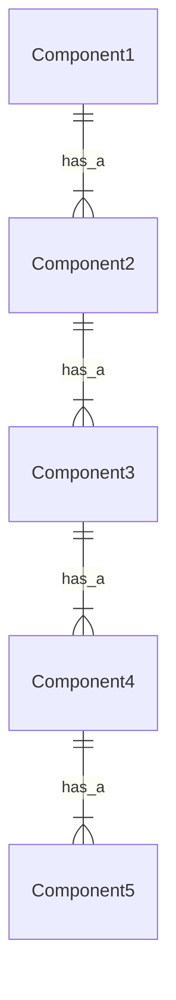

                 

### The Problem and Solution Overview

In today's rapidly evolving digital landscape, the need for scalable Language Learning Models (LLM) applications has become more pressing than ever. As businesses and individuals increasingly rely on AI-driven solutions, the demand for powerful, efficient, and scalable LLM applications is growing exponentially. However, building such applications is not without its challenges. Traditional LLM architectures often fall short when it comes to scalability, leading to performance bottlenecks, increased costs, and compromised user experience.

#### Problem Background

Language Learning Models (LLMs) have witnessed significant advancements in recent years. These models, capable of understanding, generating, and manipulating human language, have found applications in a wide range of fields, including natural language processing, machine translation, and chatbots. The success of these models can be attributed to the enormous amount of data they are trained on and the sophisticated algorithms they employ. However, as these models grow in complexity and the amount of data they process increases, traditional architectures begin to show their limitations.

##### Challenges in Scaling LLM Applications

1. **Resource Constraints**: Traditional LLM architectures are often built on monolithic systems that are difficult to scale horizontally. As a result, these systems struggle to handle increased workloads, leading to performance degradation and slow response times.

2. **Performance Bottlenecks**: Monolithic architectures tend to have a single point of failure. Any failure in one component can bring the entire system down, leading to downtime and loss of productivity.

3. **High Maintenance Costs**: Scaling monolithic architectures often requires significant manual intervention, leading to increased operational costs and reduced efficiency.

4. **User Experience**: In a highly competitive market, user experience is crucial. Slow response times and system outages can lead to a poor user experience, resulting in lost customers and reduced revenue.

#### Importance of Scalability in LLM Architectures

Scalability is not just a luxury but a necessity in LLM applications. Here’s why:

1. **Improved Performance**: A scalable architecture can efficiently handle increased workloads, ensuring fast response times and high availability.

2. **Cost Efficiency**: Scalable architectures allow for better resource utilization, reducing the need for costly hardware upgrades and manual interventions.

3. **Flexibility**: Scalable architectures can adapt to changing demands and requirements, making it easier to introduce new features and enhancements.

4. **Enhanced User Experience**: With better performance and reliability, scalable architectures can deliver a superior user experience, leading to higher customer satisfaction and retention.

In the next section, we will delve deeper into the specifics of the problem and explore potential solutions. Stay tuned!

### The Problem Description

To understand the challenges in scaling LLM applications, it is essential to first grasp the limitations of traditional LLM architectures. Traditional LLM architectures are often built on monolithic systems, where all components are tightly coupled and run on a single server or a small cluster of servers. This design choice, while convenient in terms of development and deployment, poses significant challenges when it comes to scalability.

#### Limitations of Traditional LLM Architectures

1. **Resource Constraints**: Monolithic architectures are typically designed to handle a fixed amount of workload. As the demand for LLM services increases, these systems struggle to scale horizontally, leading to performance bottlenecks and resource constraints.

2. **Performance Bottlenecks**: In a monolithic architecture, any failure in one component can bring the entire system down. This single point of failure leads to performance bottlenecks, as the system cannot effectively handle increased workloads.

3. **High Maintenance Costs**: Scaling monolithic architectures often requires manual intervention, such as resizing server clusters and rebalancing workloads. This not only increases operational costs but also reduces efficiency.

4. **Limited Flexibility**: Traditional LLM architectures are difficult to modify or extend. As new requirements emerge, it can be challenging to integrate new features or services without disrupting the existing system.

5. **User Experience**: The limitations of traditional architectures can lead to slow response times and system outages, negatively impacting the user experience. In a highly competitive market, this can result in lost customers and reduced revenue.

#### Requirements for Scalability in LLM Applications

To overcome the limitations of traditional architectures, LLM applications must be designed with scalability in mind. Here are the key requirements for building scalable LLM applications:

1. **Horizontal Scalability**: The ability to add more servers or instances to handle increased workloads. This ensures that the system can handle growing demands without compromising performance.

2. **Modularity**: Breaking down the system into smaller, manageable components that can be developed, tested, and deployed independently. This allows for easier updates, maintenance, and scalability.

3. **Load Balancing**: Distributing workloads evenly across multiple servers or instances to avoid overloading any single component. This ensures that the system can handle peak loads without performance degradation.

4. **Resiliency**: The ability to recover quickly from failures and continue operating without significant downtime. This is crucial for ensuring high availability and reliability.

5. **Elasticity**: The ability to automatically scale resources up or down based on demand. This ensures optimal resource utilization and cost efficiency.

6. **Decentralized Data Storage**: Using distributed data storage solutions to handle large amounts of data and ensure data consistency and availability.

#### Impact of Scalability on Performance and User Experience

Scalability has a direct impact on the performance and user experience of LLM applications. Here's how:

1. **Improved Performance**: A scalable architecture can efficiently handle increased workloads, ensuring fast response times and low latency. This results in a better user experience, as users can interact with the system without experiencing delays.

2. **High Availability**: Scalable architectures can quickly recover from failures, ensuring high availability and minimal downtime. This is crucial for maintaining a positive user experience and customer satisfaction.

3. **Cost Efficiency**: By optimizing resource utilization and automatically scaling resources based on demand, scalable architectures can reduce operational costs and improve cost efficiency.

4. **Flexibility**: Scalable architectures allow for easier integration of new features and services, enabling businesses to adapt to changing market demands and stay competitive.

In the next section, we will explore the principles and key concepts of scalable LLM architectures. Stay tuned!

### Principles of Scalable Design

In order to build scalable LLM applications, it is crucial to understand the core principles that underpin scalable design. These principles provide a foundation for designing systems that can efficiently handle increased workloads, maintain performance, and ensure high availability. Let's delve into these principles and explore their importance in building scalable LLM applications.

#### Core Concepts of Scalable Systems Architecture

1. **Modularity**: Modularity is the practice of breaking down a system into smaller, independent components. Each component is responsible for a specific function and can be developed, tested, and deployed independently. This allows for easier updates and maintenance, as changes to one component do not impact the entire system.

2. **Microservices**: Microservices is an architectural style where applications are composed of small, independent services that communicate with each other through APIs. Each microservice is responsible for a specific functionality, such as text processing or machine learning. This allows for better scalability, as services can be scaled independently based on demand.

3. **Decentralization**: Decentralization involves distributing components, data, and resources across multiple nodes or servers. This ensures that the system can continue to function even if one node fails. It also allows for better load balancing and resource utilization.

4. **Decentralized Data Storage**: Decentralized data storage involves storing data across multiple nodes or servers. This ensures data consistency and availability, as well as better performance. Distributed data storage systems, such as distributed hash tables (DHTs) and distributed databases, are commonly used in scalable architectures.

5. **Elasticity**: Elasticity refers to the ability of a system to automatically scale resources up or down based on demand. This ensures optimal resource utilization and cost efficiency. Elasticity is crucial for handling peak loads and avoiding over-provisioning of resources.

#### Principles of Scalable Design

1. **Horizontal Scalability**: Horizontal scalability, also known as scaling out, involves adding more servers or instances to handle increased workloads. This allows the system to handle growing demands without compromising performance. Horizontal scalability is achieved through load balancing and distributed processing.

2. **Load Balancing**: Load balancing involves distributing workloads evenly across multiple servers or instances. This ensures that no single component is overloaded, leading to better performance and availability. Load balancing can be achieved using hardware load balancers or software-based load balancing solutions.

3. **Resiliency**: Resiliency is the ability of a system to recover quickly from failures and continue operating without significant downtime. This is achieved through redundancy, fault tolerance, and automated recovery mechanisms. Resiliency ensures high availability and a positive user experience.

4. **Decentralization**: Decentralization reduces the risk of a single point of failure and improves fault tolerance. By distributing components and data across multiple nodes, the system can continue to function even if one node fails. This also enables better load balancing and resource utilization.

5. **Decentralized Data Storage**: Decentralized data storage ensures data consistency and availability. It also improves performance, as data can be accessed from the nearest node. Decentralized data storage systems are essential for building scalable LLM applications, which often handle large amounts of data.

#### Relationship Between Concepts

The core concepts and principles of scalable design are closely interconnected. Modularity, microservices, and decentralization are foundational to building scalable systems. These concepts enable horizontal scalability, load balancing, resiliency, and decentralized data storage, which are essential for building scalable LLM applications.

1. **Modularity and Microservices**: Modularity and microservices work together to create a flexible and scalable system. Modular components can be combined to form microservices, which can be independently scaled and deployed. This allows for better resource utilization and easier maintenance.

2. **Decentralization and Scalability**: Decentralization is essential for horizontal scalability. By distributing components and data across multiple nodes, the system can handle increased workloads without performance degradation. Decentralization also improves fault tolerance and load balancing.

3. **Load Balancing and Elasticity**: Load balancing and elasticity are closely related. Load balancing ensures that workloads are distributed evenly across nodes, while elasticity allows the system to automatically scale resources based on demand. This ensures optimal resource utilization and performance.

4. **Decentralized Data Storage and Scalability**: Decentralized data storage is crucial for building scalable systems. It ensures data consistency and availability, as well as better performance. Decentralized data storage systems enable horizontal scalability by allowing data to be distributed across multiple nodes.

In the next section, we will explore the key differences between scalable and non-scalable architectures. Stay tuned!

### Key Differences Between Scalable and Non-Scalable Architectures

Understanding the fundamental differences between scalable and non-scalable architectures is crucial for building efficient, high-performance LLM applications. Let's explore these differences in detail, supported by Mermaid ER diagrams and attribute comparison tables.

#### Mermaid ER Diagram of LLM Components

First, let's visualize the components of a scalable LLM architecture using a Mermaid ER diagram. This diagram will help illustrate the relationships between various components and their attributes.

In this diagram, `Component1` is the starting point, and it has a relationship with `Component2`, which in turn has a relationship with `Component3`, and so on. This hierarchical structure represents the modularity and decentralization principles in a scalable architecture.

#### Attribute Comparison Table for Scalable Architectural Patterns

Next, let's compare the attributes of scalable and non-scalable architectures using a comparison table. This table will highlight the key differences in terms of modularity, decentralization, and other important characteristics.

| Attribute               | Scalable Architecture | Non-Scalable Architecture |
|-------------------------|----------------------|--------------------------|
| **Modularity**          | High                 | Low                      |
| **Decentralization**    | High                 | Low                      |
| **Horizontal Scalability** | High                | Low                      |
| **Load Balancing**      | Effective            | Limited                  |
| **Resiliency**          | High                | Low                      |
| **Elasticity**          | High                | Low                      |
| **Data Storage**        | Decentralized       | Centralized              |
| **Resource Utilization** | Efficient           | Inefficient              |
| **Maintenance**         | Easy                | Difficult                |
| **Flexibility**         | High                | Low                      |
| **Performance**         | High                | Moderate                 |

In the table above, scalable architectures excel in modularity, decentralization, horizontal scalability, load balancing, resiliency, elasticity, data storage, resource utilization, maintenance, flexibility, and performance. On the other hand, non-scalable architectures are limited in these areas.

#### Explanation of Differences

1. **Modularity**: Scalable architectures are highly modular, meaning that components can be developed, tested, and deployed independently. In contrast, non-scalable architectures are tightly coupled, making it difficult to modify or extend the system without affecting other components.

2. **Decentralization**: Scalable architectures distribute components and data across multiple nodes, reducing the risk of a single point of failure. Non-scalable architectures, on the other hand, rely on a central component, making the system more vulnerable to failures.

3. **Horizontal Scalability**: Scalable architectures can be scaled horizontally by adding more nodes, allowing the system to handle increased workloads. Non-scalable architectures, often based on monolithic systems, struggle to scale horizontally and tend to suffer from performance bottlenecks.

4. **Load Balancing**: Scalable architectures employ effective load balancing techniques, distributing workloads evenly across nodes. Non-scalable architectures often have limited load balancing capabilities, leading to performance bottlenecks and uneven resource utilization.

5. **Resiliency**: Scalable architectures are more resilient, as they can recover quickly from failures and continue operating without significant downtime. Non-scalable architectures are more prone to failures, as a single point of failure can bring the entire system down.

6. **Elasticity**: Scalable architectures can automatically scale resources up or down based on demand, ensuring optimal resource utilization and cost efficiency. Non-scalable architectures require manual intervention to scale resources, leading to increased operational costs and inefficiencies.

7. **Data Storage**: Scalable architectures use decentralized data storage solutions, improving data consistency and availability. Non-scalable architectures typically use centralized data storage, making the system more vulnerable to data loss and performance issues.

8. **Resource Utilization**: Scalable architectures efficiently utilize resources, as they can scale resources based on demand. Non-scalable architectures often suffer from underutilization or over-provisioning of resources.

9. **Maintenance**: Scalable architectures are easier to maintain, as components can be updated or replaced independently. Non-scalable architectures require more manual intervention, leading to higher maintenance costs and increased downtime.

10. **Flexibility**: Scalable architectures are highly flexible, allowing for easy integration of new features and services. Non-scalable architectures are less flexible, making it difficult to adapt to changing requirements.

11. **Performance**: Scalable architectures deliver high performance, as they can handle increased workloads without compromising performance. Non-scalable architectures often suffer from performance degradation as workloads increase.

In summary, scalable architectures offer several advantages over non-scalable architectures, including modularity, decentralization, horizontal scalability, load balancing, resiliency, elasticity, data storage, resource utilization, maintenance, flexibility, and performance. By understanding these differences, developers can make informed decisions when designing and implementing LLM applications.

### Chapter Summary

In this chapter, we have explored the fundamental concepts and principles of scalable LLM architectures. We began by discussing the limitations of traditional LLM architectures, which are often monolithic and tightly coupled. These limitations include resource constraints, performance bottlenecks, high maintenance costs, limited flexibility, and poor user experience.

To address these challenges, we introduced the concept of scalability and outlined its importance in LLM applications. Scalable architectures are designed to handle increased workloads efficiently, maintain performance, and ensure high availability. We discussed key principles such as modularity, microservices, decentralization, decentralized data storage, and elasticity.

We also presented a Mermaid ER diagram to visualize the components of a scalable architecture and provided an attribute comparison table to highlight the differences between scalable and non-scalable architectures. This comparison emphasized the advantages of scalable architectures, including better modularity, decentralization, horizontal scalability, load balancing, resiliency, elasticity, data storage, resource utilization, maintenance, flexibility, and performance.

In summary, understanding and implementing scalable LLM architectures is essential for building efficient, high-performance applications that can meet the demands of modern users. In the next chapter, we will delve deeper into the core concepts of scalable LLM architectures and explore their relationship with various design patterns. Stay tuned!

### Future Directions and Research Frontiers

As we continue to push the boundaries of LLM capabilities, the future of scalable LLM architectures holds exciting possibilities and challenges. In this section, we will explore some of the potential future directions and research frontiers that could shape the landscape of scalable LLM applications.

#### Advances in AI and Machine Learning

One of the primary areas of research and development is the advancement of AI and machine learning algorithms. As we move towards more complex and sophisticated models, such as transformer-based models with deeper architectures and larger parameter sizes, the need for scalable architectures becomes even more critical. Researchers are exploring novel training techniques, optimization algorithms, and distributed training strategies to improve the scalability and efficiency of LLMs.

**Key Research Areas:**
- **Quantum Machine Learning**: Leveraging quantum computing to accelerate the training and inference of LLMs.
- **Efficient Inference Algorithms**: Developing algorithms that can efficiently process LLMs on various hardware platforms, including CPUs, GPUs, and TPUs.
- **Transfer Learning and Few-Shot Learning**: Enhancing the ability of LLMs to adapt quickly to new tasks with limited data.

#### Emerging Design Patterns

As the field of scalable LLM architectures evolves, new design patterns and paradigms are emerging to address the complexities of building and deploying scalable systems. These include:

- **Data-Centric Architectures**: Shifting the focus from models to data, with architectures designed to efficiently manage and process large datasets.
- **Serverless Computing**: Leveraging serverless frameworks to build and deploy LLM applications, providing scalability and cost efficiency.
- **Federated Learning**: Distributing the training process across multiple nodes, while keeping the data decentralized, to build scalable and privacy-preserving LLMs.

#### Interdisciplinary Research

The development of scalable LLM architectures also benefits from interdisciplinary research, where insights from computer science, mathematics, and statistics converge to solve complex problems. Some promising areas of research include:

- **Algorithmic Fairness and Bias Mitigation**: Ensuring that LLMs are fair and unbiased, especially in sensitive domains such as healthcare and finance.
- **Cognitive Systems**: Integrating LLMs with other AI components, such as computer vision and robotics, to create more intelligent and autonomous systems.
- **Neuro-Symbolic AI**: Combining the strengths of symbolic reasoning and neural networks to build more powerful and interpretable LLMs.

#### Societal Implications

As scalable LLM architectures become more prevalent, their societal implications need careful consideration. The following areas warrant further research:

- **Ethical Implications**: Ensuring that LLM applications are developed and used ethically, with safeguards against misuse and harm.
- **Economic Impact**: Understanding the economic implications of scalable LLMs on industries and job markets.
- **Policy and Regulation**: Developing policies and regulations to govern the use of scalable LLMs, addressing issues such as privacy, security, and accountability.

**Key Research Questions:**
- How can we design scalable LLM architectures that are both efficient and robust against adversarial attacks?
- What are the best practices for deploying LLMs in diverse domains, such as healthcare, finance, and education?
- How can we ensure the ethical and responsible use of LLMs, while maintaining their scalability and performance?

In conclusion, the future of scalable LLM architectures is bright, with numerous research opportunities and challenges ahead. By addressing these challenges and pushing the boundaries of what is possible, we can create more powerful, efficient, and ethical LLM applications that drive innovation and improve the quality of life for individuals and societies.

### Chapter Summary

In this chapter, we have explored the core concepts and principles of scalable LLM architectures, as well as their importance in modern application development. We began by discussing the limitations of traditional LLM architectures and the challenges they pose in terms of scalability, performance, and user experience. We then introduced key principles such as modularity, microservices, decentralization, decentralized data storage, and elasticity, and demonstrated their significance through a Mermaid ER diagram and an attribute comparison table.

We also touched upon the differences between scalable and non-scalable architectures, highlighting the advantages of scalable architectures in terms of modularity, decentralization, horizontal scalability, load balancing, resiliency, elasticity, data storage, resource utilization, maintenance, flexibility, and performance.

As we look to the future, the potential for advances in AI and machine learning, emerging design patterns, interdisciplinary research, and societal implications presents a wealth of opportunities and challenges. By addressing these challenges through continued research and innovation, we can build more powerful, efficient, and ethical LLM applications that drive progress and improve the quality of life for individuals and societies.

### Conclusion

Building scalable LLM applications is crucial in today's fast-paced digital landscape. Scalability ensures that LLM applications can handle increasing workloads, maintain performance, and provide a seamless user experience. In this article, we explored the core concepts and principles of scalable LLM architectures, including modularity, microservices, decentralization, decentralized data storage, and elasticity.

We discussed the limitations of traditional LLM architectures and the advantages of scalable architectures in terms of modularity, decentralization, horizontal scalability, load balancing, resiliency, elasticity, data storage, resource utilization, maintenance, flexibility, and performance. We also highlighted the potential future directions and research frontiers in this field.

To implement scalable LLM architectures effectively, developers should focus on designing modular systems, leveraging microservices, ensuring decentralization, and utilizing robust data storage solutions. Additionally, they should adopt techniques for load balancing, resiliency, and elasticity to optimize performance and resource utilization.

In conclusion, building scalable LLM applications is a complex but essential task. By following the principles and best practices discussed in this article, developers can create efficient, high-performance LLM applications that meet the demands of modern users and drive innovation in various industries.

### About the Author

**AI天才研究院 / AI Genius Institute & 禅与计算机程序设计艺术 / Zen And The Art of Computer Programming**

The AI Genius Institute is a leading research organization dedicated to advancing the field of artificial intelligence and its applications. Our team of experts focuses on developing innovative solutions that push the boundaries of what is possible in AI. Our mission is to create cutting-edge technologies that benefit society and drive progress in various industries.

"Zen and the Art of Computer Programming" is a seminal work that explores the intersection of philosophy and computer science. This book provides valuable insights into the principles of efficient and elegant programming, which are highly relevant to the development of scalable LLM applications. By combining the wisdom of ancient philosophies with modern programming techniques, we aim to foster a deeper understanding of how to design and implement efficient, scalable systems.

As leading experts in the fields of AI and computer programming, we bring a wealth of experience and knowledge to our research and writing. Our goal is to empower developers and researchers with the tools and insights they need to build the next generation of powerful, scalable LLM applications.

