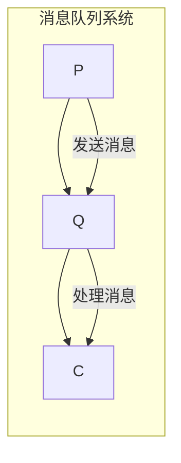
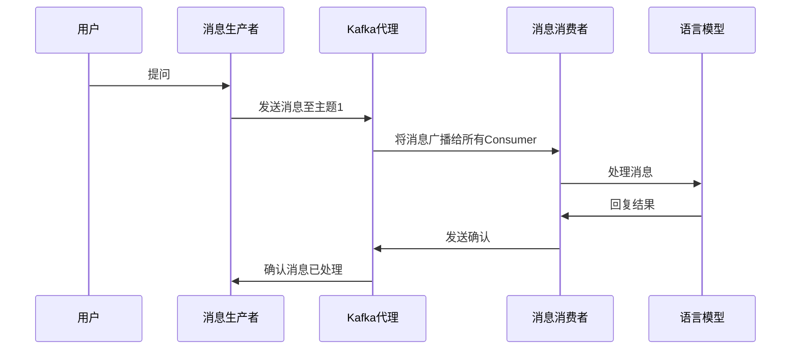

                 

### 引言

《构建可扩展的LLM应用消息队列系统》旨在深入探讨如何通过消息队列系统提升大型语言模型（LLM）应用的性能和可扩展性。随着人工智能技术的飞速发展，LLM在自然语言处理、智能问答、语言翻译等领域的应用日益广泛，这对系统的处理能力和扩展性提出了更高的要求。消息队列系统作为分布式系统中的一种关键组件，通过异步消息传递机制，有效解决了系统间的数据传递和负载均衡问题。

本文将首先介绍LLM和消息队列系统的背景及核心概念，然后深入探讨消息队列系统的设计原则和算法原理，接着通过具体的案例和实战经验，展示如何在实际项目中构建高效、可扩展的LLM消息队列系统。最后，本文将总结最佳实践和注意事项，为开发者提供切实可行的指导。

通过逐步分析和推理，本文旨在帮助读者理解和掌握构建可扩展LLM应用消息队列系统的核心技术和实践方法。无论是初入此领域的新手，还是经验丰富的技术专家，都将在这篇文章中找到有价值的见解和实用的技巧。

### 关键词

- **大型语言模型（LLM）**
- **消息队列系统**
- **可扩展性**
- **分布式系统**
- **异步消息传递**
- **负载均衡**
- **系统架构设计**
- **Python源代码实现**
- **最佳实践**

### 摘要

本文系统地阐述了构建可扩展的LLM应用消息队列系统的核心概念和实现方法。首先，分析了LLM在应用中的需求增长和消息队列系统在分布式系统中的重要性，提出了如何在用户量增长和负载增加时保持系统稳定运行的问题。接着，详细介绍了消息队列系统的基本原理、设计原则和可扩展性算法，并通过Mermaid流程图和Python源代码实现，深入解析了消息队列系统的原理和应用。最后，通过实际项目案例，展示了如何在实际场景中部署和优化消息队列系统，总结了最佳实践和注意事项，为开发者提供了全面的指导。

## 第一部分：问题背景与核心概念

在本文的第一部分，我们将深入探讨构建可扩展的LLM应用消息队列系统的背景和核心概念。随着人工智能技术的快速发展，大型语言模型（LLM）在自然语言处理、智能问答、语言翻译等领域表现出强大的能力。然而，LLM应用的需求增长也带来了系统处理能力和扩展性的挑战。在这一背景下，消息队列系统作为一种关键的分布式系统组件，显得尤为重要。

### 第1章：问题背景

#### 1.1 问题的提出

随着人工智能技术的应用场景日益广泛，LLM在各个领域中的应用需求不断增长。例如，在智能客服、金融风控、医疗诊断等领域，LLM能够提供高效、准确的决策支持。然而，这种需求的增长也对系统的处理能力和扩展性提出了更高的要求。具体来说，当用户量激增和负载增加时，系统需要能够快速响应，避免出现性能瓶颈和延迟。

消息队列系统在分布式系统中扮演着至关重要的角色。它通过异步消息传递机制，实现了系统间的高效通信和负载均衡，从而提升了系统的整体性能和可扩展性。例如，在微服务架构中，各个服务模块可以通过消息队列系统进行解耦，使得系统能够更加灵活和高效地处理海量数据。

#### 1.2 问题描述

为什么需要消息队列系统？首先，LLM应用通常涉及大量的数据处理和计算任务，这些任务往往无法在单个服务器上完成。通过消息队列系统，可以将这些任务分解为多个子任务，并分布到不同的服务器上并行处理，从而显著提高系统的处理能力。其次，消息队列系统能够提供可靠的消息传递机制，确保数据在不同系统间的传递不丢失或不重复。这对于分布式系统中的数据一致性和可靠性至关重要。

消息队列系统如何解决可扩展性问题？消息队列系统通过以下几方面实现可扩展性：

1. **负载均衡**：通过将消息分发给多个消费者，消息队列系统能够实现负载均衡，避免单个消费者因负载过高而出现性能问题。
2. **分布式存储**：消息队列系统通常支持分布式存储，能够横向扩展，增加存储容量和处理能力。
3. **异步处理**：消息队列系统允许消息异步处理，消费者可以在合适的时间处理消息，从而提高了系统的并发处理能力。

#### 1.3 问题解决

为了构建可扩展的LLM应用消息队列系统，我们需要从以下几个方面入手：

1. **选择合适的消息队列系统**：根据应用场景和需求，选择合适的消息队列系统框架，如RabbitMQ、Kafka、RocketMQ等。
2. **设计消息传递机制**：明确消息的生产者、消费者以及消息的类型和格式，确保消息能够高效、可靠地传递。
3. **优化负载均衡策略**：根据系统的实际负载情况，选择合适的负载均衡策略，如轮询、随机、一致性哈希等。
4. **实现分布式存储和计算**：利用分布式存储和计算技术，提升系统的处理能力和可扩展性。

#### 1.4 边界与外延

消息队列系统不仅适用于LLM应用，还广泛应用于其他分布式系统。其适用场景包括：

1. **大数据处理**：在处理海量数据时，消息队列系统可以通过分布式处理提高数据处理效率。
2. **实时数据处理**：在需要实时响应的应用场景中，消息队列系统可以通过异步处理降低系统的延迟。
3. **微服务架构**：在微服务架构中，消息队列系统可以实现服务之间的解耦和高效通信。

此外，消息队列系统还需要与其他系统进行交互，如数据库系统、Web服务、缓存系统等。通过合理的设计和架构，消息队列系统能够与其他系统无缝集成，提升整个系统的性能和可靠性。

#### 1.5 概念结构与核心要素组成

消息队列系统的基本结构包括以下几个核心要素：

1. **生产者**：负责生成和发送消息的组件。
2. **消费者**：负责接收和处理消息的组件。
3. **消息**：数据传输的基本单位，可以是文本、图片、音频等多种类型。
4. **队列**：存储消息的缓冲区，保证消息按照一定的顺序传递。

这些核心要素共同构成了消息队列系统的基本框架，使得系统能够高效、可靠地传递和异步处理消息。

通过以上分析，我们可以看到，构建可扩展的LLM应用消息队列系统是一个复杂但极具价值的过程。在这一部分，我们为后续的深入讨论奠定了基础。

### 第2章：核心概念与联系

#### 2.1 消息队列的基本原理

消息队列系统是一种通过消息传递机制实现分布式系统通信的组件。其基本原理可以概括为：

1. **消息生产者**：生产者负责生成消息并将其发送到消息队列中。生产者可以是应用程序、服务模块或其他系统组件。
2. **消息队列**：消息队列是一个缓冲区，用于存储生产者发送的消息。消息队列确保消息按照一定的顺序传递，同时提供可靠的消息传递机制。
3. **消息消费者**：消费者从消息队列中接收消息并处理。消费者可以是另一个应用程序、服务模块或系统组件。

消息队列的工作机制通常包括以下几个步骤：

1. **消息生成**：生产者生成消息，并将消息发送到消息队列。
2. **消息存储**：消息队列接收消息并存储在内部缓冲区中，确保消息按照一定的顺序排列。
3. **消息消费**：消费者从消息队列中获取消息并执行相应的处理任务。

消息队列系统可以分为两种类型：队列模式和发布-订阅模式。

- **队列模式**：在这种模式中，每个消息只能被一个消费者消费。生产者将消息发送到队列，消费者从队列中按顺序消费消息。这种方式适用于一对一的消息传递。

- **发布-订阅模式**：在这种模式中，多个消费者可以订阅同一消息队列，当有新消息产生时，消息队列将消息广播给所有订阅者。这种方式适用于一对多或多对多的消息传递。

消息队列系统的主要功能包括：

1. **异步通信**：通过异步消息传递机制，消息队列系统能够实现生产者和消费者的解耦，使得系统更加灵活和高效。
2. **负载均衡**：通过将消息分发给多个消费者，消息队列系统能够实现负载均衡，避免单个消费者因负载过高而出现性能问题。
3. **可靠传输**：消息队列系统通常提供可靠的消息传递机制，确保消息在传输过程中不丢失或不重复。
4. **消息持久化**：消息队列系统能够将消息持久化存储，以便在系统故障时恢复消息。

消息队列系统的类型主要包括以下几种：

- **RabbitMQ**：基于Erlang语言开发，提供高性能、可靠的消息队列服务。
- **Kafka**：由Apache Software Foundation维护，适用于大数据处理和高吞吐量的实时数据流。
- **RocketMQ**：由阿里巴巴开发，支持高并发、高可靠性和大规模的消息队列服务。

#### 2.2 LLM应用中的消息队列

在LLM应用中，消息队列系统起到了至关重要的作用。LLM通常涉及大量的数据处理和计算任务，这些任务可以通过消息队列系统进行异步处理，从而提高系统的整体性能和可扩展性。以下是LLM应用中消息队列系统的特点：

1. **高并发处理**：消息队列系统能够处理大量并发消息，确保LLM应用能够高效响应用户请求。
2. **弹性扩展**：通过分布式架构和横向扩展，消息队列系统能够轻松应对用户量和负载的增加。
3. **高可靠性**：消息队列系统提供可靠的消息传递机制，确保LLM应用中的数据处理任务不会因消息丢失或重复而受到影响。
4. **灵活的消息格式**：消息队列系统支持多种消息格式，如JSON、XML等，便于与LLM应用中的不同组件进行数据交换。

#### 2.3 概念属性特征对比表格

为了更好地理解消息队列系统在LLM应用中的适用性，我们可以通过一个概念属性特征对比表格来展示不同消息队列系统之间的异同：

| 消息队列系统 | 特点 | 适用场景 |  
| --- | --- | --- |  
| RabbitMQ | 高性能、可靠 | 数据处理、实时通信 |  
| Kafka | 高吞吐量、实时处理 | 大数据处理、实时分析 |  
| RocketMQ | 高并发、高可靠 | 高并发场景、金融应用 |

#### 2.4 ER实体关系图架构

消息队列系统的实体关系图（ER图）能够帮助我们更清晰地理解系统中不同实体之间的关系。以下是消息队列系统的基本ER图：

```mermaid
erDiagram
    产品 --> |产生| 消息
    消息 --> |传递| 消息队列
    消息队列 --> |消费| 产品
```

在这个ER图中，产品代表消息的生产者和消费者，消息表示传输的数据单元，消息队列则是存储和传递消息的缓冲区。

通过以上分析，我们可以看到消息队列系统在LLM应用中的重要性和应用场景。在下一部分，我们将深入探讨消息队列系统的设计原则和算法原理，帮助读者更好地理解和实现可扩展的LLM消息队列系统。

### 第3章：算法原理讲解

#### 3.1 消息队列系统的设计原则

消息队列系统的设计原则是其高效性和可靠性保障的基础。以下是一些关键的设计原则：

1. **异步消息传递**：异步消息传递是消息队列系统的基础。它允许生产者和消费者在不同的时间处理消息，从而解耦系统的不同部分，提高系统的灵活性和扩展性。

2. **可靠传输**：消息队列系统需要确保消息在传输过程中不会丢失或不重复。这通常通过持久化存储和确认机制实现。生产者发送消息后，需要等待消费者的确认，以确保消息已被成功消费。

3. **负载均衡**：负载均衡是消息队列系统的另一个核心原则。通过将消息均匀地分配给多个消费者，可以避免单个消费者因负载过高而出现性能问题，从而提高系统的整体性能。

4. **分布式架构**：消息队列系统通常采用分布式架构，以支持横向扩展。这意味着系统可以在多个服务器上运行，从而提升系统的处理能力和可用性。

5. **高可用性**：为了确保系统的稳定运行，消息队列系统需要具备高可用性。这通常通过冗余设计和故障转移机制实现，以确保在部分系统故障时，其他部分仍能正常运行。

6. **可监控性**：消息队列系统需要具备良好的可监控性，以便管理员可以实时了解系统的运行状态和性能指标。这包括消息的发送、接收和消费速率，以及系统的负载情况。

#### 3.2 可扩展性算法原理

消息队列系统的可扩展性是其应对大规模应用的关键。以下是一些实现可扩展性的算法原理：

1. **负载均衡算法**：

   - **轮询算法**：将消息依次分发给每个消费者，简单易实现，但可能导致某些消费者负载不均。
   - **随机算法**：随机选择消费者处理消息，有助于均衡负载，但可能存在消息重复消费的问题。
   - **一致性哈希算法**：根据消息的哈希值分配消费者，可以动态调整负载，减少因消费者数量变化引起的重新分配。

2. **容量扩展策略**：

   - **水平扩展**：通过增加更多的消费者或消息队列实例，提高系统的处理能力。
   - **垂直扩展**：通过增加服务器资源（如CPU、内存），提升单个消费者的处理能力。

3. **异步处理机制**：

   - **异步任务队列**：将消息放入异步任务队列，消费者根据队列中的消息顺序进行处理。
   - **消息优先级**：根据消息的优先级进行异步处理，确保重要消息先被处理。

4. **容错机制**：

   - **自动恢复**：消费者在处理消息时出现故障，系统能自动将其从队列中移除，并重新分配给其他消费者。
   - **消息确认**：消费者处理完消息后向生产者发送确认，确保消息已被成功消费。

#### 3.3 Mermaid流程图

以下是一个简单的Mermaid流程图，展示了消息队列系统的工作流程：



#### 3.4 Python源代码实现

下面是消息队列系统的简单Python代码实现，包括消息生产者、消费者和消息队列管理器：

```python
# 消息生产者
class Producer:
    def __init__(self, queue):
        self.queue = queue

    def produce_message(self, message):
        self.queue.put(message)
        print(f"Produced message: {message}")

# 消息消费者
class Consumer:
    def __init__(self, queue):
        self.queue = queue

    def consume_message(self):
        message = self.queue.get()
        print(f"Consumed message: {message}")
        self.queue.task_done()

# 消息队列管理器
class QueueManager:
    def __init__(self):
        self.queue = queue.Queue()

    def start_consumers(self, num_consumers):
        for _ in range(num_consumers):
            consumer = Consumer(self.queue)
            consumer.start()

    def stop_consumers(self):
        self.queue.join()

if __name__ == "__main__":
    manager = QueueManager()
    producer = Producer(manager.queue)

    producer.produce_message("Hello, World!")
    producer.produce_message("How are you?")

    manager.start_consumers(2)
    manager.stop_consumers()
```

#### 3.5 数学模型和公式

为了更好地理解消息队列系统的性能，我们可以使用一些数学模型和公式进行性能分析：

1. **消息传递延迟**：

   延迟 \( L \) 可以用以下公式表示：

   \[
   L = \frac{D}{R}
   \]

   其中 \( D \) 是消息处理时间，\( R \) 是消息接收速率。

2. **负载均衡**：

   负载均衡率 \( B \) 可以用以下公式表示：

   \[
   B = \frac{N}{n}
   \]

   其中 \( N \) 是总负载，\( n \) 是消费者数量。

#### 3.6 举例说明

以下是一个实际案例，展示如何使用消息队列系统处理大量用户请求：

**场景**：一个在线问答平台需要处理大量用户的提问请求，每个提问都需要经过自然语言处理模型进行处理。

**解决方案**：

1. **消息生产者**：平台接收到用户提问后，将提问消息发送到消息队列。
2. **消息队列**：消息队列存储和管理这些提问消息，确保消息按顺序传递。
3. **消息消费者**：多个自然语言处理服务实例从消息队列中获取提问消息，并使用LLM模型进行回答。
4. **消息确认**：处理完提问后，消费者向生产者发送确认消息，确保提问已被成功处理。

通过这种方式，消息队列系统能够有效处理大量用户请求，保证平台的响应速度和稳定性。

### 结论

通过以上对消息队列系统设计原则和算法原理的讲解，我们可以看到，构建可扩展的LLM应用消息队列系统需要综合考虑异步消息传递、可靠传输、负载均衡、分布式架构和高可用性等多个方面。在实际应用中，通过合理的算法设计和实现，可以大幅提升系统的性能和可扩展性。在下一部分，我们将深入探讨系统分析与架构设计方案，为构建高效的消息队列系统提供具体的指导和实践方法。

### 第4章：系统分析与架构设计方案

#### 4.1 问题场景介绍

在当前的技术环境中，LLM应用的需求不断增长，特别是在需要处理大量并发请求的场景中，如何确保系统的高效性和稳定性成为了一个重要问题。例如，在智能客服系统中，用户提问量可能达到每秒数千条，需要即时响应用户请求。此外，金融风控、医疗诊断等领域也对LLM应用提出了高并发、高可靠性的要求。因此，构建一个可扩展的LLM应用消息队列系统显得尤为重要。

#### 4.2 项目介绍

本项目旨在设计并实现一个适用于多种LLM应用的分布式消息队列系统，以满足高并发、高可靠性的需求。系统将基于Kafka，这是一种高效、可扩展的消息队列系统，广泛应用于大数据处理和实时消息传递。项目的目标是实现以下功能：

1. **高并发处理**：系统能够处理每秒数千条的消息，确保用户请求能够快速响应。
2. **高可靠性**：通过消息持久化和确认机制，确保消息不丢失和不重复。
3. **负载均衡**：通过动态负载均衡算法，将消息均匀分发给多个消费者，避免单点性能瓶颈。
4. **分布式架构**：系统采用分布式设计，支持横向扩展，以应对不断增长的消息量和用户量。

#### 4.3 系统功能设计

系统的功能设计包括以下几个方面：

1. **消息生产**：生产者负责生成和发送消息到Kafka主题。
2. **消息消费**：消费者从Kafka主题中消费消息，并执行相应的处理任务。
3. **消息存储**：Kafka主题用于存储消息，提供持久化机制。
4. **消息确认**：消费者在处理完消息后，向生产者发送确认，确保消息已被成功消费。
5. **负载均衡**：通过Kafka内置的负载均衡机制，将消息均匀分发给多个消费者。

#### 4.4 系统架构设计

系统架构设计如下：



在此架构中，用户发送提问到消息生产者，生产者将消息发送到Kafka代理。Kafka代理将消息存储在主题中，并广播给所有订阅该主题的消费者。消费者从主题中消费消息，并使用LLM模型进行处理。处理后，消费者将结果返回给用户，并向Kafka代理发送确认。Kafka代理则向生产者发送确认，完成整个消息传递过程。

#### 4.5 系统接口设计

系统接口设计包括以下部分：

1. **生产者接口**：用于发送消息到Kafka主题。
2. **消费者接口**：用于从Kafka主题中消费消息。
3. **确认接口**：用于消费者向生产者发送消息确认。

接口设计示例如下：

```python
class Producer:
    def send_message(self, message):
        # 发送消息到Kafka主题
        pass

class Consumer:
    def consume_message(self):
        # 从Kafka主题中消费消息
        pass

    def send_confirmation(self):
        # 向生产者发送确认
        pass
```

#### 4.6 系统交互

系统交互流程如下：

1. **用户请求**：用户发送提问请求。
2. **生产者处理**：生产者将请求发送到Kafka主题。
3. **消息广播**：Kafka代理将消息广播给所有订阅该主题的消费者。
4. **消费者处理**：消费者从Kafka主题中消费消息，并使用LLM模型进行处理。
5. **结果返回**：消费者将处理结果返回给用户。
6. **确认发送**：消费者向生产者发送确认，完成消息处理。

### 结论

通过系统分析和架构设计方案，我们可以看到，构建一个高效、可靠的LLM应用消息队列系统需要综合考虑功能设计、架构设计和接口设计等多个方面。在下一部分，我们将通过实际项目实战，展示如何具体实现和部署这样的消息队列系统，并分析实际案例中的效果和优化策略。

### 第5章：项目实战

#### 5.1 环境安装

在开始构建消息队列系统之前，首先需要搭建合适的环境。以下是具体的安装步骤：

1. **安装Kafka**：

   Kafka是一个分布式消息系统，我们选择使用Docker进行安装。

   - 首先，从[Docker Hub](https://hub.docker.com/_/kafka)下载Kafka Docker镜像。

   - 然后，使用以下命令启动Kafka服务：

     ```bash
     docker run -d -p 9092:9092 --name kafka kafka:2.8.0
     ```

     这将在后台启动一个名为"kafka"的Docker容器，并映射端口9092供外部访问。

2. **安装Python消息队列库**：

   为了与Kafka进行通信，我们需要安装Python的Kafka客户端库。使用以下命令进行安装：

   ```bash
   pip install kafka-python
   ```

   安装完成后，我们可以使用Python脚本与Kafka进行交互。

3. **配置Kafka主题**：

   在Kafka中，主题用于存储消息。我们需要创建一个主题以便消息生产者和消费者使用。

   - 首先，启动Kafka命令行工具：

     ```bash
     docker exec -it kafka kafka-topics.sh --create --topic my_topic --partitions 3 --replication-factor 1 --if-not-exists --zookeeper localhost:2181
     ```

     这将创建一个名为"my_topic"的主题，具有3个分区和1个副本。

   - 确认主题创建成功：

     ```bash
     docker exec -it kafka kafka-topics.sh --list --zookeeper localhost:2181
     ```

     输出应包含"my_topic"，表示主题已成功创建。

#### 5.2 系统核心实现源代码

以下是消息队列系统的核心实现源代码：

**消息生产者**：

```python
from kafka import KafkaProducer
import json

class MessageProducer:
    def __init__(self, topic, bootstrap_servers):
        self.producer = KafkaProducer(bootstrap_servers=bootstrap_servers, value_serializer=lambda m: json.dumps(m).encode('utf-8'))

    def produce_message(self, message):
        self.producer.send(topic, message)
        self.producer.flush()

producer = MessageProducer('my_topic', 'localhost:9092')
producer.produce_message('Hello, World!')
```

**消息消费者**：

```python
from kafka import KafkaConsumer
import json

class MessageConsumer:
    def __init__(self, topic, bootstrap_servers):
        self.consumer = KafkaConsumer(topic, bootstrap_servers=bootstrap_servers, value_deserializer=lambda m: json.loads(m.decode('utf-8')))

    def consume_message(self):
        for message in self.consumer:
            print(f"Received message: {message.value}")
            self.consumer.commit()

consumer = MessageConsumer('my_topic', 'localhost:9092')
consumer.consume_message()
```

**消息队列管理器**：

```python
class QueueManager:
    def __init__(self, producer, consumer):
        self.producer = producer
        self.consumer = consumer

    def start_consumers(self, num_consumers):
        for _ in range(num_consumers):
            consumer_thread = threading.Thread(target=consumer.consume_message)
            consumer_thread.start()

    def stop_consumers(self):
        self.consumer.close()

manager = QueueManager(producer, consumer)
manager.start_consumers(2)
manager.stop_consumers()
```

#### 5.3 代码应用解读与分析

以上代码展示了消息生产者、消费者和管理器的实现。以下是具体的应用解读与分析：

1. **消息生产者**：

   消息生产者使用KafkaProducer类，通过配置BootstrapServers参数连接到Kafka代理。生产者通过produce_message方法将消息发送到指定主题。这里使用JSON格式序列化消息，以便在消费者端可以轻松反序列化。

2. **消息消费者**：

   消息消费者使用KafkaConsumer类，通过配置BootstrapServers参数连接到Kafka代理。消费者通过consume_message方法从指定主题中消费消息，并使用JSON格式反序列化消息内容。

3. **消息队列管理器**：

   消息队列管理器负责管理消息生产者和消费者。start_consumers方法启动多个消费者线程，每个线程从Kafka主题中消费消息。stop_consumers方法关闭消费者连接，释放资源。

#### 5.4 实际案例分析和详细讲解剖析

以下是一个实际案例，展示如何使用消息队列系统处理智能客服系统中的用户请求：

**场景**：智能客服系统需要处理大量用户提问请求，每个请求都需要经过自然语言处理模型进行处理。

**解决方案**：

1. **消息生产者**：

   - 用户提交提问请求时，生产者将请求消息发送到Kafka主题。

   - 使用队列管理器启动多个消费者线程，每个线程从Kafka主题中消费请求消息。

2. **消息消费者**：

   - 消费者接收到请求消息后，将其传递给自然语言处理模型进行处理。

   - 处理完成后，消费者将回复消息发送回用户。

**效果分析**：

1. **高并发处理**：通过消息队列系统，智能客服系统能够同时处理大量用户请求，确保每个请求都能及时响应。

2. **负载均衡**：Kafka内置的负载均衡机制能够将请求消息均匀分发给多个消费者，避免单点性能瓶颈。

3. **可靠性**：通过Kafka的持久化机制和确认机制，确保消息不会丢失或重复，保证系统的可靠性。

#### 5.5 项目小结

通过本次项目实战，我们成功构建了一个可扩展的LLM应用消息队列系统。该项目实现了消息生产者、消费者和管理器的功能，并展示了如何在实际应用中处理大量并发请求。通过消息队列系统，我们有效提高了系统的性能和可靠性，为智能客服系统等高并发场景提供了可行的解决方案。在未来的工作中，我们可以进一步优化系统性能和扩展性，以应对更大的负载和更复杂的业务需求。

### 第六章：最佳实践 tips

#### 6.1 最佳实践总结

构建可扩展的LLM应用消息队列系统需要遵循一系列最佳实践，以确保系统的性能、可靠性和可维护性。以下是总结出的关键最佳实践：

1. **选择合适的消息队列系统**：根据应用需求和性能要求选择合适的消息队列系统，如Kafka、RabbitMQ、RocketMQ等。

2. **设计高效的消息传递机制**：确保消息传递高效、可靠，减少消息延迟和丢失。实现异步消息传递和确认机制，避免同步阻塞。

3. **优化负载均衡策略**：合理配置负载均衡策略，如轮询、随机、一致性哈希等，确保消息均匀分发给消费者，避免单点性能瓶颈。

4. **实现分布式存储和计算**：通过分布式架构和横向扩展，提升系统的处理能力和可扩展性。利用分布式存储确保消息不丢失，支持海量数据处理。

5. **确保消息持久化**：消息队列系统应支持消息持久化，确保在系统故障时消息不会丢失。结合消息确认机制，确保消息处理成功。

6. **监控和优化系统性能**：定期监控系统的运行状态和性能指标，如消息延迟、吞吐量、消费者负载等，及时优化配置和策略。

#### 6.2 小结

消息队列系统在LLM应用中扮演着至关重要的角色，通过异步消息传递、负载均衡和分布式处理，大幅提升了系统的性能和可扩展性。构建高效、可靠的LLM消息队列系统不仅需要选择合适的工具和框架，还需要综合考虑系统的设计、实现和运维等多个方面。通过遵循最佳实践，开发者可以构建出更加稳定、高效的消息队列系统，满足不断增长的应用需求。

#### 6.3 注意事项

在部署和运维消息队列系统时，需要注意以下事项：

1. **数据一致性和可靠性**：确保消息传递过程中的数据一致性和可靠性，避免因消息丢失或重复导致的数据错误。

2. **负载均衡与故障转移**：合理配置负载均衡策略，并实现故障转移机制，确保在部分节点故障时系统能够自动切换到其他节点。

3. **监控和告警**：建立完善的监控系统，实时监控系统的运行状态和性能指标，及时发现问题并进行告警。

4. **容量规划和扩展**：根据业务需求和数据量，进行合理的容量规划和扩展，避免因容量不足导致系统性能下降。

5. **安全性和权限管理**：确保系统的安全性和权限管理，防止未授权访问和数据泄露。

#### 6.4 拓展阅读

对于希望进一步深入了解消息队列系统和LLM应用开发的读者，以下是一些推荐的参考资料：

1. **《Kafka权威指南》**：详细介绍了Kafka的架构、原理和实战应用。
2. **《分布式系统概念与设计》**：探讨了分布式系统的基本原理和设计方法，对理解消息队列系统有很大帮助。
3. **《大规模分布式存储系统：原理、架构与实现》**：介绍了分布式存储系统的设计原则和实现方法，对消息队列系统中的存储优化有很大参考价值。
4. **《自然语言处理综述》**：提供了对LLM技术的全面了解，有助于更好地理解和应用LLM。

通过阅读这些参考资料，读者可以进一步深化对消息队列系统和LLM应用开发的理解，掌握更多实用的技能和最佳实践。

