                 


## 引言

### 构建可维护的LLM应用代码库的重要性

在当今人工智能高速发展的时代，大型语言模型（LLM）作为一种先进的自然语言处理技术，已经广泛应用于各种领域，如智能客服、文本生成、机器翻译等。随着LLM应用的不断深入，如何构建一个可维护的代码库成为了一个关键问题。可维护的代码库不仅能够提高开发效率，减少开发成本，还能保证软件的质量和稳定性，为企业的长期发展提供强有力的支持。

### 文章关键词

- 可维护性
- 大型语言模型（LLM）
- 代码库设计
- 代码质量
- 安全性
- 持续集成与部署

### 文章摘要

本文将深入探讨构建可维护的LLM应用代码库的方方面面。首先，我们将介绍LLM的基础知识，包括其定义、历史发展、基本架构等。接着，我们将讨论可维护性的核心概念，并阐述其在LLM应用开发中的重要性。随后，我们将详细分析LLM应用代码库的设计原则、组织结构、代码质量和可读性、训练与优化、安全性与隐私保护，以及持续集成与部署策略。最后，我们将通过一个实际项目案例，展示如何在实际中构建和维护一个可维护的LLM应用代码库，并提供一些最佳实践和注意事项。

----------------------------------------------------------------

### 第1章：LLM概述

#### 1.1 LLM的定义与历史

大型语言模型（LLM）是指那些拥有巨大词汇量和强大语言理解能力的语言模型。它们通常基于深度学习技术，尤其是基于变换器（Transformer）架构的模型。LLM的典型代表包括GPT系列、BERT、T5等。这些模型能够在各种自然语言处理任务中表现出色，如文本生成、文本分类、命名实体识别等。

LLM的发展历程可以追溯到20世纪80年代，当时的统计语言模型和规则驱动的语言模型逐渐被深度学习模型所取代。随着计算能力的提升和数据量的增加，深度学习模型在语言理解任务中的表现越来越突出。2018年，Google推出了BERT模型，标志着LLM进入了一个新的时代。BERT的成功引发了大量的研究和应用，使得LLM在自然语言处理领域成为主流。

#### 1.2 LLM的发展与应用趋势

近年来，LLM的发展趋势呈现出几个显著的特点：

1. **模型规模不断扩大**：随着计算资源的增加，模型的规模也在不断增大。例如，GPT-3拥有1750亿个参数，是当前最大的语言模型之一。

2. **应用场景多样化**：LLM不仅在传统的自然语言处理任务中表现出色，还在新的应用场景中展现出巨大的潜力，如智能客服、自动写作、法律文本生成等。

3. **预训练与微调相结合**：预训练模型通过在大规模语料库上进行训练，获得了强大的语言理解能力。在实际应用中，通过微调预训练模型，使其能够适应特定的任务需求。

4. **跨模态学习**：LLM正在逐步扩展到跨模态学习领域，能够处理图像、音频等多种类型的数据，实现更全面的智能交互。

#### 1.3 LLM的基本架构

LLM的基本架构通常包括以下几个部分：

1. **嵌入层**：将输入的文本转换为固定长度的向量表示。

2. **编码器**：通常采用变换器架构，对输入向量进行处理，提取出丰富的语义信息。

3. **解码器**：根据编码器提取的语义信息，生成文本输出。

4. **注意力机制**：通过注意力机制，模型能够关注到输入文本中的重要信息，提高生成文本的质量。

5. **输出层**：将解码器生成的中间结果转换为输出文本。

下面是一个简单的LLM架构的Mermaid流程图：

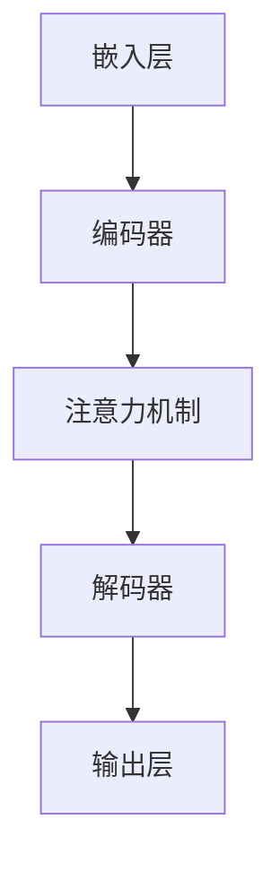

在下一章中，我们将深入探讨可维护性的核心概念，并分析其在LLM应用开发中的重要性。

----------------------------------------------------------------

### 第2章：可维护性的核心概念

#### 2.1 可维护性的重要性

在软件开发中，可维护性是一个至关重要的概念。对于LLM应用代码库而言，可维护性尤为重要。因为LLM模型通常较为复杂，涉及大量的数据预处理、模型训练和优化等步骤。如果代码库不可维护，将导致以下问题：

1. **开发效率低下**：不可维护的代码库使得新功能的添加和问题的修复变得困难，从而降低开发效率。

2. **维护成本增加**：维护一个不可维护的代码库需要更多的时间和资源，增加了维护成本。

3. **软件质量下降**：代码质量无法得到保障，可能导致软件出现更多错误，影响用户体验。

4. **安全性问题**：不稳定的代码库可能存在安全漏洞，威胁系统的安全性和数据的隐私。

#### 2.2 可维护性的评估指标

评估代码库的可维护性通常可以从以下几个方面进行：

1. **代码质量**：包括代码的可读性、可扩展性和模块化程度。

2. **文档完备性**：代码库是否配有详细的文档，包括代码注释、使用说明和API文档等。

3. **测试覆盖率**：测试代码的覆盖率越高，代码库的可维护性越强。

4. **bug修复速度**：当发现问题时，修复速度越快，代码库的可维护性越好。

5. **社区参与度**：一个活跃的社区可以提供更多的支持和反馈，有助于提高代码库的可维护性。

#### 2.3 可维护性与代码库管理

为了确保LLM应用代码库的可维护性，需要从以下几个方面进行管理：

1. **代码质量保证**：通过代码审查、静态代码分析和单元测试等手段，确保代码质量。

2. **版本控制**：使用版本控制系统（如Git）管理代码，确保代码的可追踪性和可回滚性。

3. **文档管理**：编写详细的文档，包括代码注释、API文档和用户指南等。

4. **测试策略**：制定全面的测试策略，包括单元测试、集成测试和性能测试等。

5. **持续集成与部署**：通过持续集成和持续部署（CI/CD）流程，确保代码库的稳定性和可维护性。

下面是一个简单的代码库管理流程的Mermaid流程图：

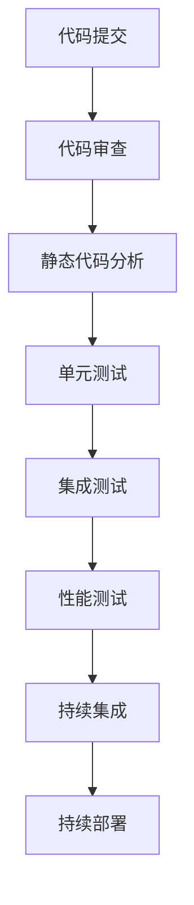

在下一章中，我们将探讨LLM应用代码库的设计原则和组织结构。

----------------------------------------------------------------

### 第3章：LLM应用代码库设计

#### 3.1 设计原则与最佳实践

设计一个可维护的LLM应用代码库，需要遵循一系列的设计原则和最佳实践。以下是一些关键原则：

1. **模块化**：将代码库划分为多个模块，每个模块负责一个特定的功能。这有助于提高代码的可读性和可维护性。

2. **松耦合**：模块之间应该保持松耦合，即尽量减少模块之间的依赖关系。这样可以降低模块修改对其他模块的影响。

3. **高内聚**：每个模块应该具有较高的内聚度，即模块内部的代码应该紧密相关，完成一个特定的功能。

4. **代码质量**：编写高质量的代码，包括良好的命名习惯、清晰的结构、合理的注释等。

5. **文档完备**：为每个模块编写详细的文档，包括功能描述、接口定义、使用示例等。

6. **版本控制**：使用版本控制系统（如Git）管理代码，确保代码的版本可追踪和可回滚。

7. **测试覆盖**：确保代码库的每个模块都经过充分的测试，包括单元测试、集成测试和性能测试。

#### 3.2 代码库的组织结构

一个典型的LLM应用代码库可能包含以下几个部分：

1. **模型训练模块**：负责模型的训练、验证和测试。

2. **数据处理模块**：负责数据清洗、预处理和特征提取。

3. **模型应用模块**：负责将训练好的模型应用于实际任务，如文本生成、分类等。

4. **API模块**：提供对外接口，方便其他系统或应用程序调用。

5. **测试模块**：包含单元测试、集成测试和性能测试代码。

6. **文档模块**：包含代码库的文档，包括使用说明、API文档等。

7. **工具模块**：包含一些辅助工具，如数据预处理脚本、模型评估脚本等。

下面是一个简单的代码库组织结构的Mermaid类图：

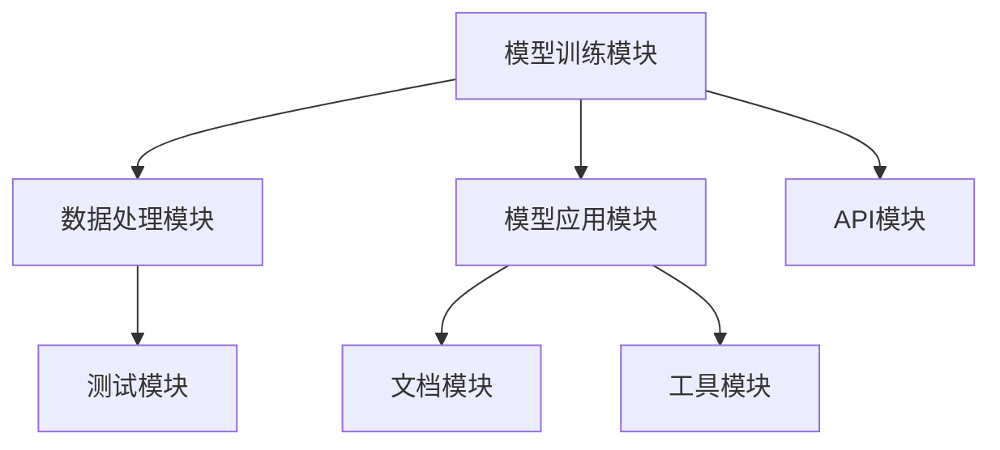

#### 3.3 代码库的版本控制

版本控制是确保代码库可维护性的关键环节。以下是一些版本控制的最佳实践：

1. **分支策略**：采用合适的分支策略（如Git Flow或GitHub Flow），确保代码库的稳定性和安全性。

2. **代码审查**：在提交代码前，进行严格的代码审查，确保代码的质量和符合规范。

3. **自动化测试**：每次提交代码时，自动运行测试用例，确保代码的稳定性。

4. **文档更新**：及时更新代码库的文档，确保与代码的最新版本保持一致。

5. **版本回滚**：在遇到问题时，能够快速回滚到上一个稳定的版本。

在下一章中，我们将讨论代码质量和可读性的重要性，并提供一些提高代码质量的具体方法。

----------------------------------------------------------------

### 第4章：代码质量与可读性

#### 4.1 代码质量的重要性

代码质量是软件项目成功的关键因素之一。对于LLM应用代码库来说，代码质量尤为重要，因为LLM模型通常较为复杂，涉及大量的数据处理和模型训练过程。以下是一些代码质量的关键指标：

1. **可读性**：良好的代码可读性使得其他人能够轻松理解和修改代码，提高开发效率。

2. **可扩展性**：代码应该易于扩展，以便在需要添加新功能时能够方便地进行修改。

3. **可维护性**：代码的可维护性直接影响到代码库的长期稳定性和可靠性。

4. **性能**：代码的性能直接影响应用程序的响应速度和资源消耗。

5. **安全性**：代码中应避免潜在的安全漏洞，确保系统的安全性和数据的隐私。

#### 4.2 可读性的关键要素

以下是一些提高代码可读性的关键要素：

1. **命名规范**：使用有意义的变量名和函数名，使得代码容易理解。

2. **代码注释**：在关键代码段添加注释，解释代码的功能和逻辑。

3. **代码格式**：遵循统一的代码格式规范，使得代码整齐美观。

4. **模块化**：将代码划分为多个模块或函数，每个模块或函数负责一个特定的功能。

5. **避免复杂逻辑**：避免过多的嵌套和复杂的逻辑，使得代码更加直观。

6. **合理的代码分割**：在适当的位置分割代码，使得每个代码块都有明确的功能和目的。

#### 4.3 代码审查与测试策略

代码审查和测试是提高代码质量的重要手段。以下是一些最佳实践：

1. **代码审查**：定期进行代码审查，确保代码符合规范和质量标准。

2. **静态代码分析**：使用静态代码分析工具（如SonarQube）检测代码中的潜在问题和漏洞。

3. **单元测试**：编写单元测试，确保每个模块的功能正确无误。

4. **集成测试**：进行集成测试，确保模块之间的交互正常。

5. **性能测试**：进行性能测试，确保代码在预期的工作负载下能够稳定运行。

6. **自动化测试**：建立自动化测试框架，确保每次代码提交都经过严格的测试。

下面是一个简单的代码质量和测试策略的Mermaid流程图：

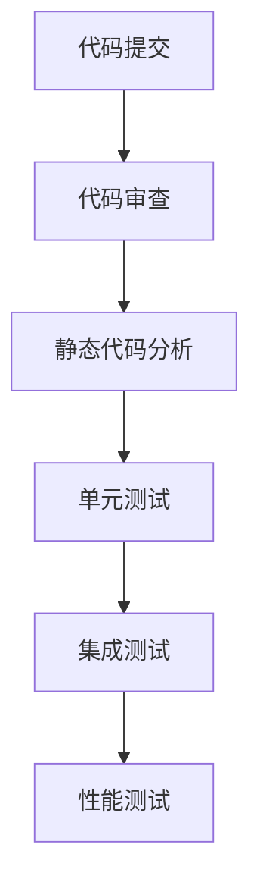

在下一章中，我们将探讨LLM的训练与优化过程。

----------------------------------------------------------------

### 第5章：LLM训练与优化

#### 5.1 训练流程详解

LLM的训练是一个复杂的过程，涉及到大量的数据处理、模型初始化、优化算法选择等步骤。以下是LLM训练流程的详细步骤：

1. **数据准备**：收集和准备训练数据，包括文本数据和标注信息。数据预处理步骤通常包括文本清洗、分词、词向量嵌入等。

2. **模型初始化**：初始化模型参数，包括权重和偏置。常用的初始化方法有随机初始化、高斯分布初始化等。

3. **前向传播**：输入数据通过嵌入层和编码器，生成中间表示。解码器根据中间表示生成输出。

4. **损失函数计算**：计算预测结果与真实标签之间的损失，常用的损失函数有交叉熵损失、均方误差等。

5. **反向传播**：使用梯度下降等优化算法更新模型参数，减少损失。

6. **迭代训练**：重复执行前向传播、损失函数计算和反向传播，直到满足停止条件（如训练误差达到预设阈值或达到最大迭代次数）。

下面是一个简单的LLM训练流程的Mermaid流程图：

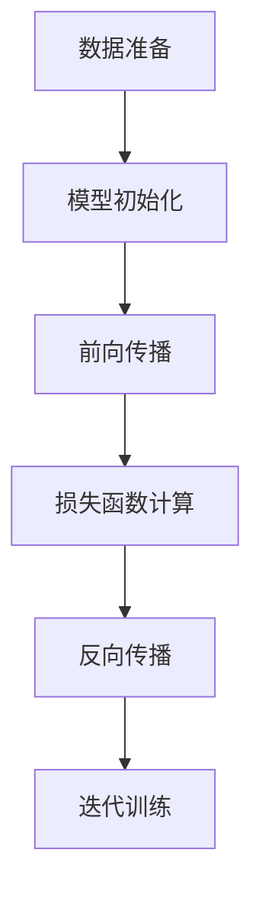

#### 5.2 优化策略与实践

优化策略是提高LLM性能的关键因素之一。以下是一些常见的优化策略：

1. **学习率调整**：学习率的选择对训练过程有重要影响。常用的学习率调整策略有固定学习率、学习率衰减、自适应学习率等。

2. **批量大小调整**：批量大小影响模型的收敛速度和稳定性。较小的批量大小可以提高模型的泛化能力，但可能降低收敛速度。

3. **数据增强**：通过数据增强方法（如随机裁剪、旋转、缩放等）增加训练数据的多样性，有助于提高模型的泛化能力。

4. **正则化**：使用正则化方法（如L1正则化、L2正则化）防止模型过拟合。

5. **模型剪枝**：通过剪枝方法（如权重剪枝、结构剪枝）减少模型的参数数量，提高计算效率。

6. **分布式训练**：利用多台机器进行分布式训练，加快模型训练速度。

下面是一个简单的优化策略与实践的Mermaid流程图：

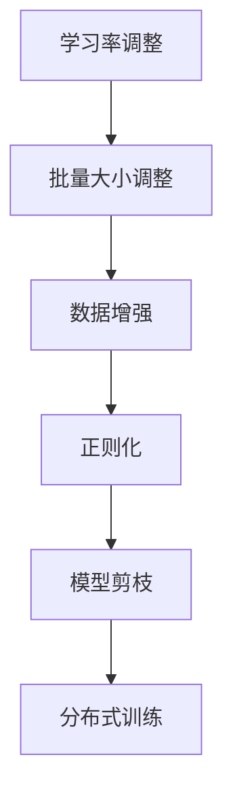

#### 5.3 调参技巧与案例分析

调参是LLM训练过程中至关重要的一环。以下是一些调参技巧和案例分析：

1. **实验记录**：记录每次实验的超参数设置和结果，以便分析调参效果。

2. **逐步调整**：从基本的超参数（如学习率、批量大小）开始调整，逐步深入到更复杂的超参数。

3. **对比实验**：设计对比实验，比较不同超参数设置下的模型性能。

4. **交叉验证**：使用交叉验证方法评估模型的泛化能力。

5. **案例分析**：通过实际案例分析，总结有效的调参策略。

下面是一个简单的调参技巧与案例分析的Mermaid流程图：

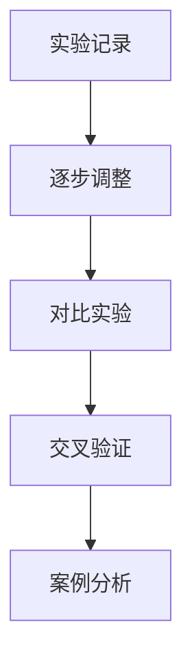

在下一章中，我们将探讨如何确保LLM应用的安全性，以及如何保护用户数据的隐私。

----------------------------------------------------------------

### 第6章：安全性与隐私保护

#### 6.1 LLM安全性的挑战

随着LLM在各个领域的广泛应用，其安全性问题逐渐凸显。以下是一些常见的LLM安全性挑战：

1. **模型篡改**：攻击者可以通过篡改训练数据或模型参数，影响LLM的输出结果。

2. **隐私泄露**：LLM在处理用户数据时，可能泄露用户的隐私信息。

3. **恶意攻击**：攻击者可以利用LLM进行恶意操作，如生成虚假信息、恶意代码等。

4. **模型过拟合**：当训练数据不足以代表实际问题时，模型可能过拟合，导致在真实场景中表现不佳。

#### 6.2 隐私保护策略

为了保护用户隐私，需要采取一系列隐私保护策略：

1. **数据加密**：对用户数据进行加密处理，确保数据在传输和存储过程中不被窃取。

2. **匿名化处理**：对用户数据进行匿名化处理，去除可识别的个人信息。

3. **差分隐私**：采用差分隐私技术，确保对单个用户的隐私保护。

4. **最小化数据使用**：只使用必要的数据进行模型训练和推理，减少隐私泄露风险。

5. **访问控制**：对用户数据的访问进行严格控制，确保只有授权人员才能访问敏感数据。

#### 6.3 安全性与隐私保护的实践案例

以下是一些安全性和隐私保护的实践案例：

1. **案例1**：某智能客服系统通过数据加密和匿名化处理，确保用户咨询记录的安全。

2. **案例2**：某在线教育平台采用差分隐私技术，保护学员的学习数据。

3. **案例3**：某金融公司通过访问控制策略，确保员工只能访问与其工作相关的数据。

4. **案例4**：某搜索引擎公司通过最小化数据使用，降低用户隐私泄露的风险。

下面是一个简单的安全性与隐私保护实践案例的Mermaid流程图：

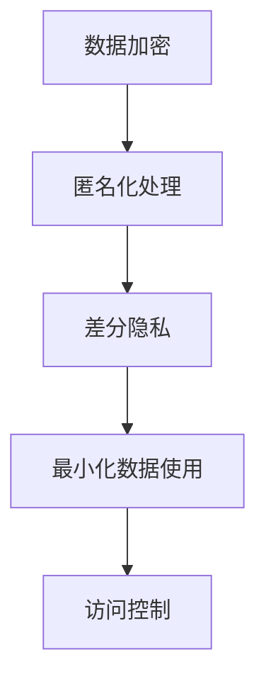

在下一章中，我们将探讨如何实现LLM应用的持续集成与部署。

----------------------------------------------------------------

### 第7章：持续集成与部署

#### 7.1 CI/CD的概念与实践

持续集成（CI）和持续部署（CD）是现代软件开发中常用的方法，旨在通过自动化流程提高软件交付的效率和可靠性。CI/CD的核心目标是通过自动化构建、测试和部署过程，确保代码库的质量和稳定性。

**持续集成（CI）**：CI指的是在开发过程中，每次代码提交都会自动触发一系列的构建和测试流程。这有助于及早发现和修复潜在的问题，减少合并代码时的冲突。

**持续部署（CD）**：CD是在CI的基础上，将经过CI测试通过的代码自动部署到生产环境。CD的目标是确保生产环境的代码始终是最新和经过验证的。

**CI/CD流程**：

1. **代码提交**：开发人员将代码提交到版本控制系统。

2. **构建**：构建工具（如Jenkins、GitLab CI）自动构建代码，生成可执行文件或容器镜像。

3. **测试**：运行自动化测试（单元测试、集成测试、性能测试等），确保代码的功能和性能符合要求。

4. **部署**：通过自动化部署脚本，将通过测试的代码部署到测试环境或生产环境。

下面是一个简单的CI/CD流程的Mermaid流程图：

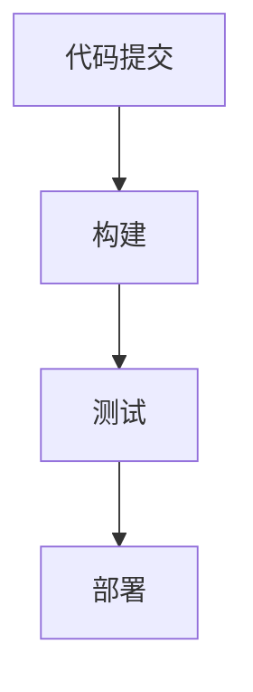

#### 7.2 部署策略与工具选择

部署策略和工具的选择直接影响CI/CD的效率和可靠性。以下是一些常见的部署策略和工具：

**部署策略**：

1. **蓝绿部署**：在旧版本（蓝色）和新版本（绿色）之间切换，确保新版本在上线前经过充分测试。

2. **灰度发布**：逐步将流量导向新版本，监控新版本的性能和稳定性。

3. **滚动更新**：逐步更新所有实例，确保服务始终可用。

**部署工具**：

1. **Kubernetes**：用于容器化应用的自动化部署和管理。

2. **Jenkins**：用于CI/CD流程的自动化构建和部署。

3. **Docker**：用于容器化应用的开发和部署。

4. **AWS CodePipeline**：用于CI/CD流程的自动化部署。

下面是一个简单的部署策略和工具选择的Mermaid流程图：

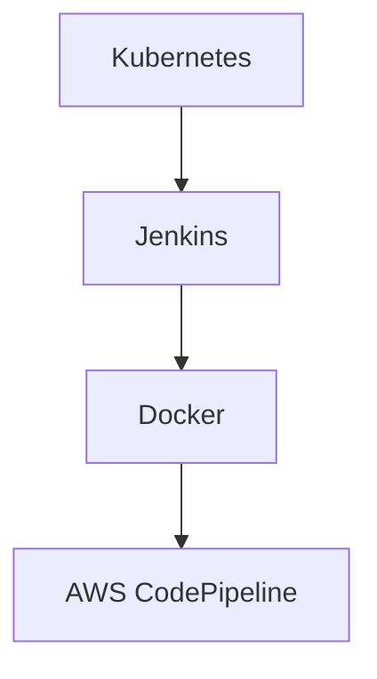

#### 7.3 持续集成与部署的最佳实践

为了确保CI/CD的顺利进行，以下是一些最佳实践：

1. **自动化测试**：确保所有代码提交都经过严格的自动化测试，包括单元测试、集成测试和性能测试。

2. **版本控制**：使用版本控制系统（如Git）管理代码，确保代码的可追踪性和可回滚性。

3. **文档管理**：为每个部署步骤编写详细的文档，确保团队成员能够理解和遵循部署流程。

4. **监控与报警**：设置监控和报警系统，及时发现问题并通知相关人员。

5. **持续优化**：定期评估CI/CD流程的效率和质量，持续优化和改进。

下面是一个简单的持续集成与部署最佳实践的Mermaid流程图：

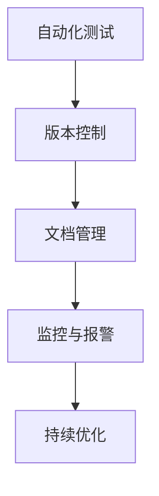

通过上述流程和最佳实践，我们可以构建一个高效、稳定和可维护的LLM应用代码库。

### 总结

本文详细探讨了如何构建可维护的LLM应用代码库。我们从LLM的基础知识入手，介绍了其定义、历史发展、应用趋势和基本架构。接着，我们深入分析了可维护性的核心概念，阐述了其在LLM应用开发中的重要性。随后，我们讨论了代码库设计的原则、组织结构、代码质量和可读性，以及训练与优化策略。我们还探讨了安全性和隐私保护的重要性，并介绍了持续集成与部署的最佳实践。

通过本文，我们希望能够为开发者提供一套完整的构建和维护LLM应用代码库的指南。在实际项目中，开发者应根据具体需求和环境，灵活应用本文提出的方法和策略，确保代码库的可维护性和可靠性。

### 最佳实践 Tips

1. **代码质量优先**：在编写代码时，始终将代码质量放在首位，遵循良好的编码规范，确保代码的可读性和可维护性。

2. **文档详尽**：为代码库编写详细的文档，包括代码注释、API文档和使用指南，确保团队成员能够快速上手。

3. **持续集成**：建立持续集成和部署流程，确保代码库的质量和稳定性，及时发现问题并进行修复。

4. **安全防护**：采取有效的安全措施，保护用户数据和隐私，防止潜在的安全威胁。

5. **持续优化**：定期评估和优化CI/CD流程，提高开发效率和质量。

### 小结

构建可维护的LLM应用代码库是确保软件长期稳定和高效运行的关键。通过本文的探讨，我们了解了LLM的基础知识、可维护性的重要性、代码库设计原则、代码质量和可读性、训练与优化策略、安全性与隐私保护，以及持续集成与部署的最佳实践。希望本文能为开发者提供有益的参考和指导。

### 注意事项

1. **测试覆盖率**：确保代码库的每个模块都经过充分的测试，提高代码的可维护性和稳定性。

2. **版本控制**：合理使用版本控制系统，确保代码的版本可追踪和可回滚。

3. **代码审查**：定期进行代码审查，及时发现和修复潜在的问题。

4. **性能监控**：实时监控代码库的性能，确保其在高负载下能够稳定运行。

5. **安全审查**：定期进行安全审查，确保代码库不存在安全漏洞。

### 拓展阅读

1. **《大规模语言模型的训练与优化》**：详细介绍了LLM的训练和优化过程。

2. **《软件工程实践》**：提供了全面的软件开发方法和最佳实践。

3. **《Kubernetes权威指南》**：介绍了容器化应用的管理和部署。

4. **《人工智能安全与隐私》**：探讨了AI应用中的安全与隐私问题。

### 作者信息

作者：AI天才研究院/AI Genius Institute & 禅与计算机程序设计艺术 /Zen And The Art of Computer Programming

----------------------------------------------------------------

```markdown
---

# 构建可维护的LLM应用代码库

关键词：大型语言模型（LLM）、可维护性、代码库设计、代码质量、安全性、持续集成与部署

摘要：本文深入探讨了构建可维护的LLM应用代码库的各个方面，包括LLM的基础知识、可维护性的重要性、代码库设计原则、代码质量和可读性、训练与优化策略、安全性与隐私保护，以及持续集成与部署的最佳实践。

----------------------------------------------------------------

## 第1章：LLM概述

### 1.1 LLM的定义与历史
### 1.2 LLM的发展与应用趋势
### 1.3 LLM的基本架构

----------------------------------------------------------------

## 第2章：可维护性的核心概念

### 2.1 可维护性的重要性
### 2.2 可维护性的评估指标
### 2.3 可维护性与代码库管理

----------------------------------------------------------------

## 第3章：LLM应用代码库设计

### 3.1 设计原则与最佳实践
### 3.2 代码库的组织结构
### 3.3 代码库的版本控制

----------------------------------------------------------------

## 第4章：代码质量与可读性

### 4.1 代码质量的重要性
### 4.2 可读性的关键要素
### 4.3 代码审查与测试策略

----------------------------------------------------------------

## 第5章：LLM训练与优化

### 5.1 训练流程详解
### 5.2 优化策略与实践
### 5.3 调参技巧与案例分析

----------------------------------------------------------------

## 第6章：安全性与隐私保护

### 6.1 LLM安全性的挑战
### 6.2 隐私保护策略
### 6.3 安全性与隐私保护的实践案例

----------------------------------------------------------------

## 第7章：持续集成与部署

### 7.1 CI/CD的概念与实践
### 7.2 部署策略与工具选择
### 7.3 持续集成与部署的最佳实践

----------------------------------------------------------------

### 总结

构建可维护的LLM应用代码库是确保软件长期稳定和高效运行的关键。通过本文的探讨，我们了解了LLM的基础知识、可维护性的重要性、代码库设计原则、代码质量和可读性、训练与优化策略、安全性与隐私保护，以及持续集成与部署的最佳实践。

### 最佳实践 Tips

1. **代码质量优先**：在编写代码时，始终将代码质量放在首位，遵循良好的编码规范，确保代码的可读性和可维护性。

2. **文档详尽**：为代码库编写详细的文档，包括代码注释、API文档和使用指南，确保团队成员能够快速上手。

3. **持续集成**：建立持续集成和部署流程，确保代码库的质量和稳定性，及时发现问题并进行修复。

4. **安全防护**：采取有效的安全措施，保护用户数据和隐私，防止潜在的安全威胁。

5. **持续优化**：定期评估和优化CI/CD流程，提高开发效率和质量。

### 小结

构建可维护的LLM应用代码库是确保软件长期稳定和高效运行的关键。通过本文的探讨，我们了解了LLM的基础知识、可维护性的重要性、代码库设计原则、代码质量和可读性、训练与优化策略、安全性与隐私保护，以及持续集成与部署的最佳实践。

### 注意事项

1. **测试覆盖率**：确保代码库的每个模块都经过充分的测试，提高代码的可维护性和稳定性。

2. **版本控制**：合理使用版本控制系统，确保代码的版本可追踪和可回滚。

3. **代码审查**：定期进行代码审查，及时发现和修复潜在的问题。

4. **性能监控**：实时监控代码库的性能，确保其在高负载下能够稳定运行。

5. **安全审查**：定期进行安全审查，确保代码库不存在安全漏洞。

### 拓展阅读

1. **《大规模语言模型的训练与优化》**：详细介绍了LLM的训练和优化过程。

2. **《软件工程实践》**：提供了全面的软件开发方法和最佳实践。

3. **《Kubernetes权威指南》**：介绍了容器化应用的管理和部署。

4. **《人工智能安全与隐私》**：探讨了AI应用中的安全与隐私问题。

### 作者信息

作者：AI天才研究院/AI Genius Institute & 禅与计算机程序设计艺术 /Zen And The Art of Computer Programming
```

