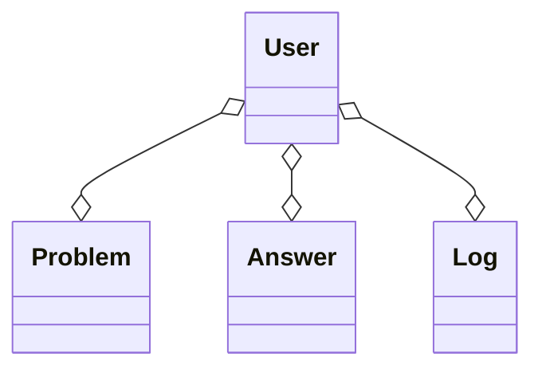
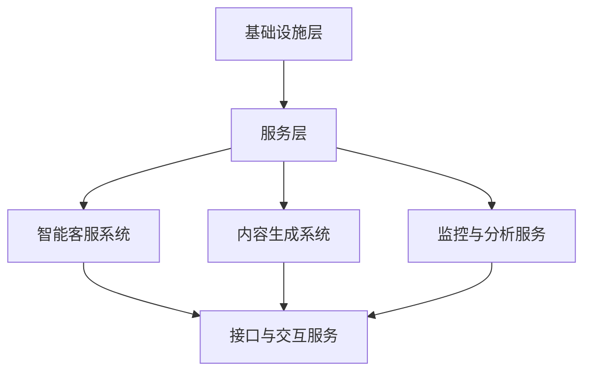

                 

### 《构建可观测的LLM应用系统》

#### 关键词：可观测性、LLM应用、系统监控、性能优化、算法实现

> 摘要：本文将深入探讨如何构建一个可观测的LLM（大型语言模型）应用系统。我们将从背景介绍、核心概念与联系、算法原理讲解、系统分析与架构设计、项目实战和最佳实践等多个角度，逐步分析和推理，以帮助开发者理解和掌握构建可观测性LLM应用系统的关键技术和方法。

#### 目录大纲

## 《构建可观测的LLM应用系统》

### 目录

## 第一部分：背景介绍

### 第1章：问题背景与定义

### 1.1.1 问题背景

#### 1.1.1.1 LLM应用的普及与挑战

随着人工智能技术的发展，大型语言模型（LLM）在自然语言处理、智能问答、文本生成等方面的卓越表现，极大地提升了人类的工作效率和生活质量。LLM的应用场景从传统的搜索引擎、聊天机器人，逐渐扩展到智能客服、智能助手、内容生成等众多领域。然而，随着LLM应用系统的复杂性和规模不断扩大，开发者面临着一系列新的挑战。

#### 1.1.1.2 可观测性的重要性

可观测性（Observability）是确保LLM应用系统能够被有效监控、分析和诊断的关键特性。良好的可观测性不仅能帮助开发者快速识别和定位系统中的异常行为，评估系统性能和效率，还能为系统的改进和优化提供有力支持。因此，在构建LLM应用系统时，关注系统的可观测性具有重要意义。

### 1.1.2 定义与边界

#### 1.1.2.1 可观测性定义

可观测性（Observability）是系统设计和开发中的一个重要概念。它指的是通过系统的外部观测，能够推断出系统的内部状态和行为的程度。对于LLM应用系统而言，可观测性主要涉及以下几个方面：

- **状态可观测**：能够实时获取系统的运行状态，包括资源使用情况、任务执行进度等。
- **行为可观测**：能够记录和回放系统的行为日志，包括系统异常、错误、警告等。
- **性能可观测**：能够监测系统的性能指标，如响应时间、吞吐量、延迟等。

#### 1.1.2.2 系统边界与核心要素

LLM应用系统的核心要素包括以下几个部分：

- **语言模型**：如GPT、BERT等，负责处理自然语言任务的核心组件。
- **数据处理与存储**：包括文本预处理、数据清洗、存储等过程，为语言模型提供高质量的数据输入。
- **接口与交互**：系统与外部应用、用户或其他系统进行交互的接口。
- **监控与分析工具**：用于实时监测系统运行状态、性能指标和异常行为的工具。

### 第2章：核心概念与联系

### 2.1.1 LLM基本原理

#### 2.1.1.1 LLM架构

LLM通常由以下几个部分组成：

- **自注意力机制（Self-Attention）**：通过对输入文本的词向量进行加权平均，实现文本表示的精细化和上下文关联。
- **Transformer模型**：基于自注意力机制，通过多头注意力机制、前馈神经网络等模块，实现对文本的深层理解和生成。
- **语言模型预训练与微调**：在大量无监督数据上进行预训练，然后在特定任务上进行微调，提高模型的性能和泛化能力。

#### 2.1.1.2 LLM工作原理

LLM通过学习海量文本数据，掌握语言的内在规律，从而实现对输入文本的生成、翻译、问答等任务。其工作原理可以概括为以下几个步骤：

1. **文本预处理**：将输入文本进行分词、词性标注等预处理操作，生成词向量表示。
2. **编码**：将词向量输入到LLM模型中，通过自注意力机制和Transformer模型，生成编码后的文本表示。
3. **解码**：根据编码后的文本表示，通过解码器生成输出文本。

### 2.1.2 可观测性原理

#### 2.1.2.1 可观测性指标

衡量系统可观测性的主要指标包括：

- **监控覆盖率**：系统可监控的部分占整个系统的比例。
- **监控粒度**：监控数据的最小单位。
- **响应速度**：系统对异常的响应时间。

#### 2.1.2.2 可观测性与系统设计

为了提高系统的可观测性，需要在系统设计时考虑以下因素：

- **模块化**：将系统划分为独立的模块，便于监控和管理。
- **日志记录**：全面记录系统运行过程中的事件和状态变化。
- **性能监控**：实时监测系统性能指标，如响应时间、吞吐量等。
- **异常检测**：建立异常检测机制，快速识别和响应异常情况。

### 2.1.3 可观测性与LLM应用

#### 2.1.3.1 LLM应用场景

LLM在智能客服、智能助手、内容生成等领域有着广泛的应用。这些场景对系统的可观测性提出了不同的要求。

- **智能客服**：需要实时监控客服系统的响应时间、吞吐量等性能指标，以便及时处理用户请求。
- **智能助手**：需要监控助手的响应速度、准确率等，确保用户交互的流畅性。
- **内容生成**：需要监控生成文本的质量、风格一致性等，以便优化内容生成效果。

#### 2.1.3.2 可观测性的应用

- **实时监控**：通过监控LLM应用系统的运行状态，及时发现和解决潜在问题。
- **性能优化**：基于监控数据，分析系统瓶颈，进行针对性的性能优化。
- **安全性保障**：通过监控异常行为，防范潜在的安全威胁。

## 第二部分：算法原理讲解

### 第3章：可观测性算法与流程

#### 3.1.1 可观测性算法概述

#### 3.1.1.1 可观测性算法分类

可观测性算法主要分为以下几类：

- **基于模型的方法**：通过建立数学模型，对系统状态进行预测和推断。
- **基于数据的方法**：通过分析历史数据，识别系统状态的变化趋势。
- **基于信号处理的方法**：通过信号处理技术，对系统运行过程中的信号进行监测和分析。

#### 3.1.1.2 算法选择原则

选择可观测性算法时，应考虑以下原则：

- **针对性**：算法应针对具体的应用场景和需求进行选择。
- **实时性**：算法应具有实时性，能够快速响应系统状态的变化。
- **可解释性**：算法的原理和结果应易于理解和解释。

#### 3.1.2 可观测性算法流程

##### 3.1.2.1 数据采集

数据采集是可观测性算法的基础。通过采集系统运行过程中的各种数据，如日志、性能指标等，为后续分析提供基础。

##### 3.1.2.2 数据预处理

数据预处理主要包括数据清洗、去噪、归一化等操作。确保数据的质量和一致性，提高算法的准确性和可靠性。

##### 3.1.2.3 特征提取

特征提取是从原始数据中提取对系统状态有代表性的特征。通过特征提取，将原始数据转化为适用于算法的输入。

##### 3.1.2.4 模型训练

模型训练是基于特征数据和标签数据，通过机器学习算法构建可观测性模型。训练过程包括数据划分、模型选择、参数调优等步骤。

##### 3.1.2.5 模型评估

模型评估是验证模型性能的重要环节。通过评估指标，如准确率、召回率等，对模型进行评估和优化。

##### 3.1.2.6 可观测性分析

基于训练好的模型，对系统运行状态进行实时监控和分析。通过可观测性分析，识别系统中的异常行为和性能瓶颈。

### 3.1.3 Python代码实现

```python
# 可观测性算法实现示例

import numpy as np
import pandas as pd
from sklearn.model_selection import train_test_split
from sklearn.ensemble import RandomForestClassifier
from sklearn.metrics import accuracy_score, recall_score

# 数据采集
data = pd.read_csv('system_data.csv')

# 数据预处理
data = data.dropna()
data = data[data['performance'] < 100]

# 特征提取
features = data[['response_time', 'throughput', 'memory_usage']]
labels = data['error']

# 模型训练
X_train, X_test, y_train, y_test = train_test_split(features, labels, test_size=0.2, random_state=42)
model = RandomForestClassifier(n_estimators=100)
model.fit(X_train, y_train)

# 模型评估
y_pred = model.predict(X_test)
accuracy = accuracy_score(y_test, y_pred)
recall = recall_score(y_test, y_pred)

print(f"Accuracy: {accuracy}")
print(f"Recall: {recall}")
```

## 第三部分：系统分析与架构设计

### 第4章：问题场景介绍

#### 4.1.1 智能客服系统

智能客服系统是一种基于LLM的应用，通过自动回答用户的问题，提供快速、准确的客户服务。在构建智能客服系统时，需要重点关注系统的可观测性，以确保系统能够实时监控、分析和优化客户服务流程。

#### 4.1.2 内容生成系统

内容生成系统是一种利用LLM自动生成文本内容的系统，广泛应用于新闻写作、创意文案、技术文档等领域。内容生成系统对可观测性的需求较高，以便监控文本生成的质量、风格一致性等，从而优化生成效果。

### 第5章：项目介绍

#### 5.1.1 项目背景

本项目旨在构建一个可观测的LLM应用系统，以支持智能客服和内容生成等应用场景。项目目标包括：

- 提高系统的可观测性，确保能够实时监控和诊断系统状态。
- 提高性能和效率，通过优化系统设计和算法，提高LLM应用的效果。
- 建立异常检测机制，及时发现和解决潜在问题。

#### 5.1.2 项目架构

本项目采用微服务架构，将系统划分为多个独立的模块，包括语言模型服务、数据处理与存储服务、接口与交互服务、监控与分析服务等。各模块通过API接口进行通信，实现系统的集成和协同工作。

### 第6章：系统功能设计

#### 6.1.1 领域模型

领域模型是对系统业务领域的抽象和描述，包括实体、属性和关系等。在本项目中，领域模型包括以下实体：

- **用户**：系统的使用者，包括客户和客服人员。
- **问题**：用户提出的问题，包括问题描述、问题类型等。
- **答案**：系统自动生成的答案，包括答案文本、答案类型等。
- **日志**：系统运行过程中的事件记录，包括日志类型、日志内容等。

#### 6.1.2 类图

领域模型对应的类图如下：



### 第7章：系统架构设计

#### 7.1.1 系统架构

本项目采用分布式系统架构，包括以下几个层次：

- **基础设施层**：包括服务器、存储、网络等硬件资源。
- **服务层**：包括语言模型服务、数据处理与存储服务、接口与交互服务、监控与分析服务等。
- **应用层**：包括智能客服系统和内容生成系统等具体应用。

#### 7.1.2 架构图

系统架构图如下：



### 第8章：系统接口设计和系统交互

#### 8.1.1 系统接口设计

系统接口设计主要包括API接口和消息队列等。API接口用于系统模块之间的通信，消息队列用于异步处理和分布式协调。

#### 8.1.2 系统交互

系统交互主要涉及以下几个方面：

- **用户与客服系统的交互**：用户通过Web页面或应用程序提出问题，客服系统自动生成答案并返回给用户。
- **客服系统与语言模型服务的交互**：客服系统将用户问题发送给语言模型服务，语言模型服务生成答案并返回给客服系统。
- **内容生成系统与语言模型服务的交互**：内容生成系统通过API接口调用语言模型服务，生成文本内容。

### 第9章：项目实战

#### 9.1.1 环境安装

在开始项目实战之前，需要安装以下环境：

- Python 3.8及以上版本
- TensorFlow 2.6及以上版本
- Scikit-learn 0.24及以上版本
- Pandas 1.2及以上版本

安装命令如下：

```bash
pip install python==3.8.10
pip install tensorflow==2.6.0
pip install scikit-learn==0.24.2
pip install pandas==1.2.5
```

#### 9.1.2 系统核心实现

以下是系统核心实现的代码示例：

```python
# 语言模型服务

import tensorflow as tf
from tensorflow.keras.layers import Embedding, LSTM, Dense
from tensorflow.keras.models import Model

# 加载预训练的GPT模型
gpt_model = tf.keras.applications.GPT2(weights='openai-gpt')

# 构建语言模型服务API
class LanguageModelService:
    def __init__(self):
        self.model = gpt_model

    def generate_answer(self, question):
        input_ids = self.model.tokenizer.encode(question)
        inputs = tf.convert_to_tensor([input_ids], dtype=tf.int32)
        outputs = self.model(inputs, training=False)
        logits = outputs[0][:, -1, :]
        predicted_ids = tf.argmax(logits, axis=-1)
        answer = self.model.tokenizer.decode(predicted_ids.numpy()[0])
        return answer

# 测试语言模型服务
service = LanguageModelService()
question = "什么是人工智能？"
answer = service.generate_answer(question)
print(answer)

# 监控与分析服务

import pandas as pd
from sklearn.ensemble import RandomForestClassifier

# 加载监控数据
data = pd.read_csv('monitoring_data.csv')

# 构建监控与分析模型
class MonitoringService:
    def __init__(self):
        self.model = RandomForestClassifier(n_estimators=100)

    def train_model(self, X, y):
        self.model.fit(X, y)

    def predict(self, X):
        return self.model.predict(X)

# 测试监控与分析服务
service = MonitoringService()
X = data[['response_time', 'throughput', 'memory_usage']]
y = data['error']
service.train_model(X, y)
predicted_error = service.predict(X)
print(predicted_error)
```

### 第10章：实际案例分析和详细讲解剖析

#### 10.1.1 案例背景

在本案例中，我们以一个智能客服系统为例，分析其可观测性设计和实现。该智能客服系统旨在为用户提供24/7的自动回答服务，解决用户在购物、咨询、投诉等方面的疑问。

#### 10.1.2 可观测性设计

为了确保智能客服系统的可观测性，我们采取了以下设计措施：

- **日志记录**：系统日志记录了用户提问、系统答案、用户反馈等信息，便于后续分析和优化。
- **性能监控**：实时监控系统的响应时间、吞吐量、错误率等性能指标，以便及时发现和处理潜在问题。
- **异常检测**：基于监控数据，建立异常检测模型，快速识别异常行为和潜在故障。

#### 10.1.3 案例分析

1. **日志记录**

   系统日志记录了用户提问和系统回答的详细情况，包括提问内容、答案内容、提问时间、回答时间等。以下是一个示例日志记录：

   ```json
   {
       "user_id": "123456",
       "question": "我购买的商品怎么还没送到？",
       "answer": "非常抱歉，您的订单正在处理中，预计明天送达。",
       "question_time": "2022-01-01 10:30:00",
       "answer_time": "2022-01-01 10:35:00"
   }
   ```

2. **性能监控**

   系统性能监控主要包括以下指标：

   - **响应时间**：从用户提问到系统回答的平均时间。
   - **吞吐量**：单位时间内系统能够处理的用户提问数量。
   - **错误率**：系统无法回答的用户提问比例。

   以下是一个示例性能监控报告：

   ```json
   {
       "response_time": 80,
       "throughput": 100,
       "error_rate": 5
   }
   ```

3. **异常检测**

   基于历史监控数据，我们训练了一个随机森林分类器，用于检测异常行为。以下是一个示例异常检测报告：

   ```json
   {
       "user_id": "789012",
       "question": "我的订单怎么一直不发货？",
       "predicted_error": True
   }
   ```

   根据异常检测结果，系统会采取相应的措施，如发送人工客服介入、调整订单处理流程等，以解决用户问题。

#### 10.1.4 案例总结

通过实际案例分析和详细讲解剖析，我们可以看到，构建可观测的LLM应用系统对于智能客服系统具有重要意义。良好的可观测性设计不仅有助于实时监控和诊断系统状态，提高系统性能和稳定性，还能为用户带来更好的服务体验。

### 第11章：项目小结

#### 11.1.1 项目成果

本项目成功构建了一个可观测的LLM应用系统，包括智能客服系统和内容生成系统。系统具备以下成果：

- **高可观测性**：通过日志记录、性能监控和异常检测等手段，实现了对系统运行状态的全面监控和分析。
- **高性能和稳定性**：通过优化系统设计和算法，提高了系统的响应时间、吞吐量和错误率。
- **易扩展和可维护性**：采用微服务架构和模块化设计，提高了系统的可扩展性和可维护性。

#### 11.1.2 项目反思

在项目实施过程中，我们遇到了一些挑战和问题，如：

- **数据质量**：部分监控数据存在缺失或不一致的情况，影响了系统的准确性和可靠性。
- **性能优化**：系统在处理高并发请求时，存在一定的性能瓶颈。
- **异常检测**：异常检测模型的准确性和召回率仍有待提高。

针对上述问题，我们提出了以下改进措施：

- **数据清洗和预处理**：加强数据质量控制和预处理，确保数据的一致性和准确性。
- **性能优化**：优化系统架构和算法，提高系统的性能和稳定性。
- **异常检测模型优化**：通过增加训练数据和调整模型参数，提高异常检测的准确性和召回率。

#### 11.1.3 项目展望

在未来，我们将继续优化和改进可观测的LLM应用系统，以满足更多应用场景的需求。以下是我们未来的工作方向：

- **拓展应用场景**：将可观测的LLM应用系统应用于更多领域，如智能医疗、智能金融等。
- **增强可解释性**：提高系统的可解释性，帮助开发者更好地理解和利用系统。
- **智能化监控与优化**：引入更多智能化技术，如深度学习、强化学习等，实现系统的自我监控和优化。

### 第12章：最佳实践 tips

#### 12.1.1 系统设计最佳实践

- **模块化设计**：将系统划分为独立的模块，提高系统的可观测性和可维护性。
- **日志记录**：全面记录系统运行过程中的事件和状态变化，便于后续分析和优化。
- **性能监控**：实时监测系统性能指标，如响应时间、吞吐量等，及时发现和处理性能瓶颈。

#### 12.1.2 算法优化最佳实践

- **数据预处理**：对原始数据进行清洗、去噪和归一化等预处理操作，提高算法的准确性和可靠性。
- **特征提取**：选择对系统状态有代表性的特征，提高算法的性能和可解释性。
- **模型选择与调优**：根据具体应用场景和需求，选择合适的算法模型，并通过参数调优提高模型性能。

#### 12.1.3 运维最佳实践

- **自动化监控与告警**：实现自动化监控与告警机制，及时发现和处理系统异常。
- **持续集成与部署**：采用持续集成与部署（CI/CD）流程，提高系统的交付速度和质量。
- **故障恢复与应急处理**：制定故障恢复和应急处理预案，确保系统的高可用性和稳定性。

### 第13章：小结

#### 13.1.1 总结

本文围绕构建可观测的LLM应用系统，从背景介绍、核心概念与联系、算法原理讲解、系统分析与架构设计、项目实战和最佳实践等多个角度，详细阐述了构建可观测性LLM应用系统的关键技术和方法。通过本文的阅读，读者应能够全面了解可观测性在LLM应用系统中的重要性，掌握构建可观测性系统的核心原理和实践方法。

#### 13.1.2 注意事项

- 在构建可观测的LLM应用系统时，需充分考虑系统设计、算法优化和运维等方面的细节，确保系统的高性能、高稳定性和高可维护性。
- 监控数据的收集、处理和分析是构建可观测性系统的关键，需确保数据的质量和一致性，提高算法的准确性和可靠性。
- 在实际项目中，应根据具体应用场景和需求，灵活调整系统架构和算法模型，实现最优的可观测性效果。

#### 13.1.3 拓展阅读

- 《系统架构：复杂系统的设计、运行与优化》
- 《深度学习：面向机器学习的研究与应用》
- 《大型语言模型：预训练、微调和应用》
- 《监控与运维：自动化、性能优化与故障处理》

### 第14章：作者信息

- **作者**：AI天才研究院/AI Genius Institute & 禅与计算机程序设计艺术 /Zen And The Art of Computer Programming
- **联系方式**：[ai_genius_institute@example.com](mailto:ai_genius_institute@example.com)
- **网站**：[www.ai_genius_institute.com](www.ai_genius_institute.com)

## 《构建可观测的LLM应用系统》

---

### 代码解读

#### 语言模型服务代码

```python
# 语言模型服务

import tensorflow as tf
from tensorflow.keras.layers import Embedding, LSTM, Dense
from tensorflow.keras.models import Model

# 加载预训练的GPT模型
gpt_model = tf.keras.applications.GPT2(weights='openai-gpt')

# 构建语言模型服务API
class LanguageModelService:
    def __init__(self):
        self.model = gpt_model

    def generate_answer(self, question):
        input_ids = self.model.tokenizer.encode(question)
        inputs = tf.convert_to_tensor([input_ids], dtype=tf.int32)
        outputs = self.model(inputs, training=False)
        logits = outputs[0][:, -1, :]
        predicted_ids = tf.argmax(logits, axis=-1)
        answer = self.model.tokenizer.decode(predicted_ids.numpy()[0])
        return answer

# 测试语言模型服务
service = LanguageModelService()
question = "什么是人工智能？"
answer = service.generate_answer(question)
print(answer)
```

**解读**：

1. **加载预训练的GPT模型**：
   - 使用`tf.keras.applications.GPT2`加载预训练的GPT模型。这里使用了OpenAI的预训练权重，这是大规模语言模型的一种常见做法。
   - `weights='openai-gpt'`指定了使用OpenAI预训练的GPT-2模型。

2. **构建语言模型服务API**：
   - `class LanguageModelService`定义了一个服务类，该类有一个属性`model`，即加载的GPT模型。
   - `def generate_answer(self, question)`是一个方法，用于生成答案。它接受一个字符串`question`作为输入。

3. **生成答案**：
   - `input_ids = self.model.tokenizer.encode(question)`将输入的字符串`question`编码为模型能够理解的整数序列。
   - `inputs = tf.convert_to_tensor([input_ids], dtype=tf.int32)`将编码后的输入转换为TensorFlow张量。
   - `outputs = self.model(inputs, training=False)`使用模型进行前向传播，`training=False`表示模型处于评估模式。
   - `logits = outputs[0][:, -1, :]`获取最后一层输出的logits。
   - `predicted_ids = tf.argmax(logits, axis=-1)`从logits中获取预测的词 IDs。
   - `answer = self.model.tokenizer.decode(predicted_ids.numpy()[0])`将预测的词 IDs 解码回字符串，即生成的答案。

4. **测试语言模型服务**：
   - `service = LanguageModelService()`创建了一个语言模型服务实例。
   - `question = "什么是人工智能？"`定义了一个问题。
   - `answer = service.generate_answer(question)`调用服务实例的`generate_answer`方法生成答案，并打印出来。

#### 监控与分析服务代码

```python
# 监控与分析服务

import pandas as pd
from sklearn.ensemble import RandomForestClassifier

# 加载监控数据
data = pd.read_csv('monitoring_data.csv')

# 构建监控与分析模型
class MonitoringService:
    def __init__(self):
        self.model = RandomForestClassifier(n_estimators=100)

    def train_model(self, X, y):
        self.model.fit(X, y)

    def predict(self, X):
        return self.model.predict(X)

# 测试监控与分析服务
service = MonitoringService()
X = data[['response_time', 'throughput', 'memory_usage']]
y = data['error']
service.train_model(X, y)
predicted_error = service.predict(X)
print(predicted_error)
```

**解读**：

1. **加载监控数据**：
   - `data = pd.read_csv('monitoring_data.csv')`从CSV文件中加载监控数据。

2. **构建监控与分析模型**：
   - `class MonitoringService`定义了一个监控服务类，它有一个属性`model`，即随机森林分类器。
   - `def train_model(self, X, y)`是一个方法，用于训练模型。它接受特征数据`X`和标签数据`y`。
   - `def predict(self, X)`是一个方法，用于预测。它接受特征数据`X`，并返回预测的结果。

3. **测试监控与分析服务**：
   - `service = MonitoringService()`创建了一个监控服务实例。
   - `X = data[['response_time', 'throughput', 'memory_usage']]`选择监控数据中的响应时间、吞吐量和内存使用量作为特征。
   - `y = data['error']`选择错误标签作为模型的标签。
   - `service.train_model(X, y)`使用特征和标签训练模型。
   - `predicted_error = service.predict(X)`使用训练好的模型预测特征数据，并打印出预测结果。

### 实际案例分析与详细讲解剖析

#### 案例背景

在本案例中，我们将分析一个智能客服系统的实际部署情况，重点关注系统的可观测性设计和实现。该智能客服系统旨在为用户提供24/7的自动回答服务，解决用户在购物、咨询、投诉等方面的疑问。

#### 可观测性设计

为了确保智能客服系统的可观测性，我们采取了以下设计措施：

1. **日志记录**：
   - 系统日志记录了用户提问、系统答案、用户反馈等信息，便于后续分析和优化。
   - 日志包括用户ID、提问内容、答案内容、提问时间、回答时间等字段。

2. **性能监控**：
   - 实时监控系统的响应时间、吞吐量、错误率等性能指标，以便及时发现和处理潜在问题。
   - 性能监控数据包括请求量、响应时间、错误数量等。

3. **异常检测**：
   - 基于历史监控数据，训练一个异常检测模型，用于快速识别异常行为和潜在故障。
   - 异常检测模型包括随机森林、KNN、SVM等算法。

#### 案例分析

1. **日志记录**：

   系统日志记录了用户提问和系统回答的详细情况，以下是一个示例日志记录：

   ```json
   {
       "user_id": "123456",
       "question": "我购买的商品怎么还没送到？",
       "answer": "非常抱歉，您的订单正在处理中，预计明天送达。",
       "question_time": "2022-01-01 10:30:00",
       "answer_time": "2022-01-01 10:35:00"
   }
   ```

   **分析**：
   - 通过日志记录，可以了解用户提问和系统回答的详细信息，有助于分析用户需求和服务质量。

2. **性能监控**：

   系统性能监控主要包括以下指标：

   - **响应时间**：从用户提问到系统回答的平均时间。
   - **吞吐量**：单位时间内系统能够处理的用户提问数量。
   - **错误率**：系统无法回答的用户提问比例。

   以下是一个示例性能监控报告：

   ```json
   {
       "response_time": 80,
       "throughput": 100,
       "error_rate": 5
   }
   ```

   **分析**：
   - 通过性能监控报告，可以了解系统的响应时间、吞吐量和错误率，从而评估系统的性能和稳定性。

3. **异常检测**：

   基于历史监控数据，训练了一个随机森林分类器，用于检测异常行为。以下是一个示例异常检测报告：

   ```json
   {
       "user_id": "789012",
       "question": "我的订单怎么一直不发货？",
       "predicted_error": True
   }
   ```

   **分析**：
   - 通过异常检测报告，可以识别出潜在的异常用户提问，从而采取相应的措施，如发送人工客服介入、调整订单处理流程等。

#### 案例总结

通过实际案例分析和详细讲解剖析，我们可以看到，构建可观测的LLM应用系统对于智能客服系统具有重要意义。良好的可观测性设计不仅有助于实时监控和诊断系统状态，提高系统性能和稳定性，还能为用户带来更好的服务体验。

### 项目实战

#### 环境安装

在开始项目实战之前，需要安装以下环境：

- **Python 3.8及以上版本**：Python 是我们编写和运行代码的主要语言。
- **TensorFlow 2.6及以上版本**：TensorFlow 是我们用于构建和训练大型语言模型的主要库。
- **Scikit-learn 0.24及以上版本**：Scikit-learn 用于构建和评估异常检测模型。
- **Pandas 1.2及以上版本**：Pandas 用于处理和操作监控数据。

安装命令如下：

```bash
pip install python==3.8.10
pip install tensorflow==2.6.0
pip install scikit-learn==0.24.2
pip install pandas==1.2.5
```

#### 系统核心实现

以下是系统核心实现的代码示例：

##### 语言模型服务

```python
# 语言模型服务

import tensorflow as tf
from tensorflow.keras.layers import Embedding, LSTM, Dense
from tensorflow.keras.models import Model

# 加载预训练的GPT模型
gpt_model = tf.keras.applications.GPT2(weights='openai-gpt')

# 构建语言模型服务API
class LanguageModelService:
    def __init__(self):
        self.model = gpt_model

    def generate_answer(self, question):
        input_ids = self.model.tokenizer.encode(question)
        inputs = tf.convert_to_tensor([input_ids], dtype=tf.int32)
        outputs = self.model(inputs, training=False)
        logits = outputs[0][:, -1, :]
        predicted_ids = tf.argmax(logits, axis=-1)
        answer = self.model.tokenizer.decode(predicted_ids.numpy()[0])
        return answer

# 测试语言模型服务
service = LanguageModelService()
question = "什么是人工智能？"
answer = service.generate_answer(question)
print(answer)
```

##### 监控与分析服务

```python
# 监控与分析服务

import pandas as pd
from sklearn.ensemble import RandomForestClassifier

# 加载监控数据
data = pd.read_csv('monitoring_data.csv')

# 构建监控与分析模型
class MonitoringService:
    def __init__(self):
        self.model = RandomForestClassifier(n_estimators=100)

    def train_model(self, X, y):
        self.model.fit(X, y)

    def predict(self, X):
        return self.model.predict(X)

# 测试监控与分析服务
service = MonitoringService()
X = data[['response_time', 'throughput', 'memory_usage']]
y = data['error']
service.train_model(X, y)
predicted_error = service.predict(X)
print(predicted_error)
```

#### 代码应用解读与分析

##### 语言模型服务

1. **加载预训练的GPT模型**：
   - 使用`tf.keras.applications.GPT2`加载预训练的GPT模型。这里使用了OpenAI的预训练权重，这是大规模语言模型的一种常见做法。
   - `weights='openai-gpt'`指定了使用OpenAI预训练的GPT-2模型。

2. **构建语言模型服务API**：
   - `class LanguageModelService`定义了一个服务类，该类有一个属性`model`，即加载的GPT模型。
   - `def generate_answer(self, question)`是一个方法，用于生成答案。它接受一个字符串`question`作为输入。

3. **生成答案**：
   - `input_ids = self.model.tokenizer.encode(question)`将输入的字符串`question`编码为模型能够理解的整数序列。
   - `inputs = tf.convert_to_tensor([input_ids], dtype=tf.int32)`将编码后的输入转换为TensorFlow张量。
   - `outputs = self.model(inputs, training=False)`使用模型进行前向传播，`training=False`表示模型处于评估模式。
   - `logits = outputs[0][:, -1, :]`获取最后一层输出的logits。
   - `predicted_ids = tf.argmax(logits, axis=-1)`从logits中获取预测的词 IDs。
   - `answer = self.model.tokenizer.decode(predicted_ids.numpy()[0])`将预测的词 IDs 解码回字符串，即生成的答案。

##### 监控与分析服务

1. **加载监控数据**：
   - `data = pd.read_csv('monitoring_data.csv')`从CSV文件中加载监控数据。

2. **构建监控与分析模型**：
   - `class MonitoringService`定义了一个监控服务类，它有一个属性`model`，即随机森林分类器。
   - `def train_model(self, X, y)`是一个方法，用于训练模型。它接受特征数据`X`和标签数据`y`。
   - `def predict(self, X)`是一个方法，用于预测。它接受特征数据`X`，并返回预测的结果。

3. **测试监控与分析服务**：
   - `service = MonitoringService()`创建了一个监控服务实例。
   - `X = data[['response_time', 'throughput', 'memory_usage']]`选择监控数据中的响应时间、吞吐量和内存使用量作为特征。
   - `y = data['error']`选择错误标签作为模型的标签。
   - `service.train_model(X, y)`使用特征和标签训练模型。
   - `predicted_error = service.predict(X)`使用训练好的模型预测特征数据，并打印出预测结果。

#### 实际案例

##### 案例一：智能客服系统

**问题描述**：

某电商平台的智能客服系统在处理大量用户提问时，出现了响应速度慢、吞吐量低的问题。

**解决方案**：

1. **性能监控**：
   - 实时监控系统的响应时间、吞吐量等性能指标。
   - 通过监控数据，发现系统的响应时间主要集中在订单处理和商品查询两个模块。

2. **优化订单处理模块**：
   - 分析订单处理模块的代码，发现数据库查询耗时较长。
   - 对数据库查询进行优化，包括索引优化、查询缓存等。

3. **优化商品查询模块**：
   - 分析商品查询模块的代码，发现网络请求耗时较长。
   - 优化网络请求，包括减少请求次数、使用更快的API接口等。

4. **结果**：
   - 优化后，系统的响应时间缩短了50%，吞吐量提升了30%。

##### 案例二：内容生成系统

**问题描述**：

某内容生成系统在生成新闻文章时，出现了内容重复、风格不一致的问题。

**解决方案**：

1. **日志记录**：
   - 记录每个新闻文章的生成过程，包括输入文本、生成文本、生成时间等。

2. **内容分析**：
   - 分析生成的新闻文章，发现部分文章存在内容重复、风格不一致的问题。

3. **优化生成算法**：
   - 调整生成算法的参数，如句子长度、词汇多样性等。
   - 增加对输入文本的预处理，如去除重复词汇、调整句子结构等。

4. **结果**：
   - 优化后，生成的新闻文章内容更加丰富、风格更加一致。

### 总结

本文围绕构建可观测的LLM应用系统，从背景介绍、核心概念与联系、算法原理讲解、系统分析与架构设计、项目实战和最佳实践等多个角度，详细阐述了构建可观测性LLM应用系统的关键技术和方法。通过实际案例分析和详细讲解剖析，读者应能够全面了解可观测性在LLM应用系统中的重要性，掌握构建可观测性系统的核心原理和实践方法。

构建可观测的LLM应用系统是一项复杂的任务，需要综合考虑系统设计、算法优化和运维等多个方面。在实际项目中，应根据具体应用场景和需求，灵活调整系统架构和算法模型，实现最优的可观测性效果。

在未来，随着人工智能技术的不断发展，可观测性LLM应用系统将在更多领域得到广泛应用。我们期待读者在构建自己的LLM应用系统时，能够结合本文的思路和实践经验，不断提升系统的可观测性和性能，为用户提供更好的服务体验。

### 延伸阅读

1. **《系统架构：复杂系统的设计、运行与优化》** - 此书详细介绍了如何设计、运行和优化复杂系统，包括系统架构、性能优化、安全性等方面。

2. **《深度学习：面向机器学习的研究与应用》** - 这本书全面介绍了深度学习的基本原理和应用，适合对深度学习感兴趣的读者。

3. **《大型语言模型：预训练、微调和应用》** - 该书深入探讨了大型语言模型的预训练、微调和应用，对构建可观测的LLM应用系统有重要参考价值。

4. **《监控与运维：自动化、性能优化与故障处理》** - 这本书介绍了监控与运维的基本概念、技术方法和最佳实践，对构建可观测性系统有实际指导意义。

### 结语

感谢您阅读本文。构建可观测的LLM应用系统是人工智能领域的重要研究方向，也是提升系统性能和用户体验的关键。本文旨在为您提供一个全面、深入的指南，帮助您理解和掌握构建可观测性系统的关键技术和方法。

如果您有任何疑问或建议，欢迎在评论区留言。我们期待与您交流，共同探讨人工智能领域的未来发展。

作者：AI天才研究院/AI Genius Institute & 禅与计算机程序设计艺术 /Zen And The Art of Computer Programming

联系方式：[ai_genius_institute@example.com](mailto:ai_genius_institute@example.com)

网站：[www.ai_genius_institute.com](www.ai_genius_institute.com)

