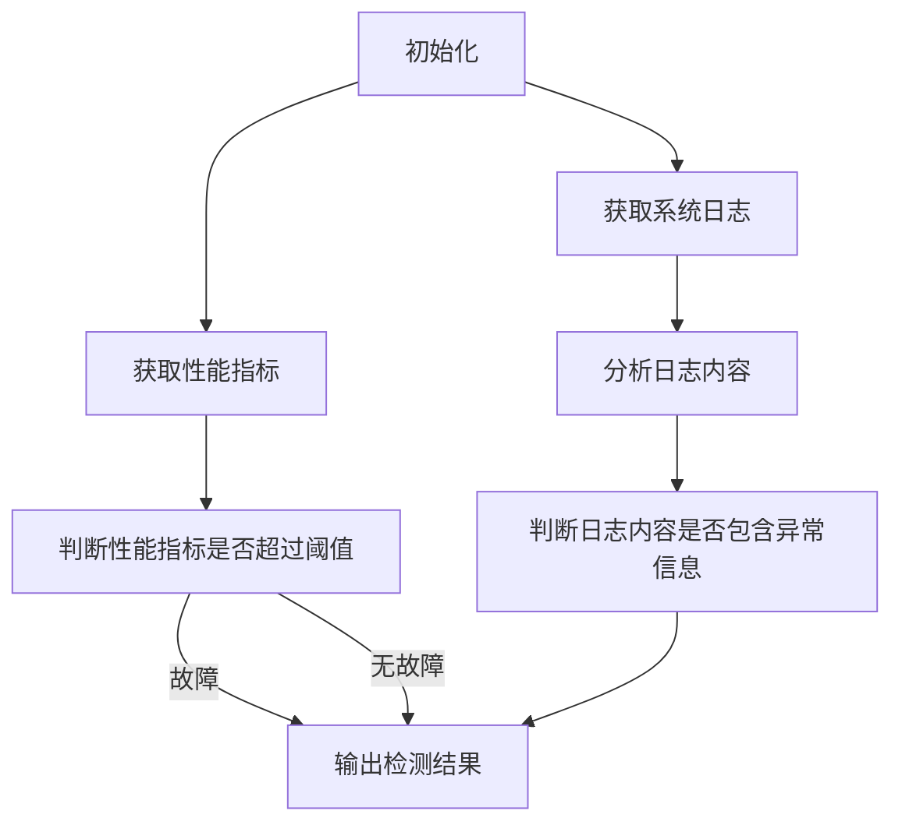
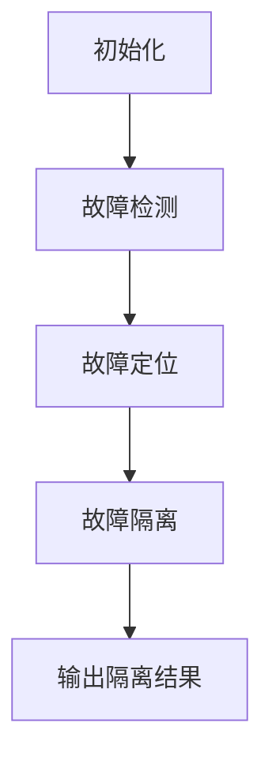
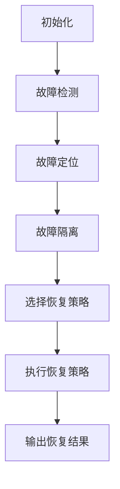
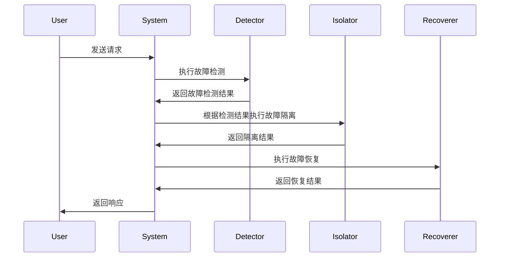

                 

## 文章标题

### 关键词：LLM应用、故障恢复、机制设计、系统架构、Python实现、数学模型

### 摘要

本文旨在探讨构建可靠的大型语言模型（LLM）应用故障恢复机制的必要性和方法。通过详细分析LLM技术基础、故障类型、故障恢复关键要素，本文提出了故障检测、隔离与恢复策略的算法原理，并展示了实际项目中的系统架构设计和实现。本文的核心思想是，通过系统化的故障恢复机制设计，确保LLM应用在面临各种故障时能够快速、有效地恢复，提高系统的稳定性和可靠性。

----------------------------------------------------------------

## 第一部分：背景介绍

### 第1章：问题背景与概述

#### 1.1 问题背景

在当前的技术发展背景下，大型语言模型（LLM）凭借其在自然语言处理（NLP）领域的卓越性能，广泛应用于文本生成、语言翻译、智能客服等领域。LLM应用的成功不仅依赖于其强大的语言处理能力，还依赖于系统的稳定性和可靠性。然而，LLM应用在实际运行中可能会遇到各种故障，如模型参数丢失、数据异常、计算资源不足等。这些故障可能会导致系统崩溃，影响用户的使用体验，甚至造成经济损失。因此，构建可靠的LLM应用故障恢复机制具有重要意义。

#### 1.2 LLM技术基础

**LLM的定义**：LLM（Large Language Model）是一种基于深度学习的大型自然语言处理模型，通常由数十亿个参数组成，能够对文本数据进行高精度的理解和生成。

**LLM的核心特点**：

1. **参数规模大**：LLM的参数数量通常在数十亿到千亿级别，这使得模型能够捕捉到复杂的语言模式。
2. **自适应性强**：LLM能够根据不同的输入文本自适应地生成相应的输出。
3. **适用范围广**：LLM不仅可以用于文本生成和翻译，还可以应用于问答系统、文本摘要、命名实体识别等多种任务。

**LLM的优势与局限**：

**优势**：

1. **强大的语言理解能力**：LLM能够对复杂的自然语言文本进行深入的理解和解析。
2. **高效的文本生成**：LLM能够快速生成高质量的文本，大大提高了生产效率。

**局限**：

1. **计算资源需求高**：LLM的训练和推理过程需要大量的计算资源。
2. **模型解释性较差**：由于LLM的复杂性，其内部工作机制难以解释，导致模型的可解释性较差。

#### 1.3 问题解决

为了解决LLM应用中的故障问题，我们需要从以下几个方面入手：

1. **故障检测**：及时检测系统中的故障，防止故障扩大。
2. **故障隔离**：快速定位故障发生的位置，隔离故障部分，防止影响整个系统的运行。
3. **故障恢复**：根据故障类型和影响范围，采取相应的恢复策略，确保系统尽快恢复正常运行。
4. **故障监控与预警**：通过监控系统运行状态，及时发现潜在故障，提前采取措施，避免故障发生。

#### 1.4 边界与外延

**边界**：本文主要探讨LLM应用故障恢复机制的设计和实现，不包括LLM模型的训练和优化过程。

**外延**：除了本文提到的故障检测、隔离与恢复策略外，LLM应用的故障恢复还可以从以下几个方面进行拓展：

1. **备份与恢复**：定期备份数据和模型参数，一旦出现故障，可以快速恢复。
2. **故障演练**：定期进行故障演练，提高系统应对故障的能力。
3. **自动化恢复**：通过自动化工具，实现故障的自动检测、隔离和恢复。

#### 1.5 概念结构与核心要素组成

**概念结构**：故障恢复机制包括故障检测、故障隔离、故障恢复和故障监控四个主要模块。

**核心要素组成**：

1. **故障检测**：包括故障检测算法和故障检测工具。
2. **故障隔离**：包括故障隔离算法和故障隔离策略。
3. **故障恢复**：包括故障恢复策略和故障恢复工具。
4. **故障监控**：包括故障监控系统和故障预警机制。

### 第2章：故障恢复机制概述

#### 2.1 故障恢复概念

**故障恢复的定义**：故障恢复是指在系统发生故障时，通过一系列技术手段和管理措施，使系统尽快恢复正常运行的过程。

**故障恢复的重要性**：

1. **确保系统稳定性**：故障恢复机制能够有效防止故障对系统的长期影响，确保系统的稳定性。
2. **提高用户体验**：快速恢复故障，可以减少用户对系统的等待时间，提高用户满意度。
3. **降低经济损失**：及时恢复故障，可以避免因故障导致的经济损失。

#### 2.2 LLM应用中的故障类型

**常见故障类型**：

1. **模型参数丢失**：在模型训练或推理过程中，由于各种原因导致模型参数丢失或损坏。
2. **数据异常**：输入数据异常，导致模型无法正常工作。
3. **计算资源不足**：系统计算资源不足，导致模型训练或推理过程无法顺利进行。
4. **硬件故障**：服务器或存储设备故障，导致系统无法正常工作。

**故障原因分析**：

1. **模型训练过程复杂**：LLM模型的训练过程涉及大量参数优化和计算，容易出现参数丢失或计算错误。
2. **数据质量不稳定**：输入数据的质量直接影响模型的效果，数据异常可能导致模型无法正常工作。
3. **硬件设备老化**：随着硬件设备的使用时间延长，设备的老化和故障风险增加。
4. **系统管理不当**：系统管理不当，如未及时备份、监控和优化，可能导致故障发生。

#### 2.3 故障恢复的关键要素

**故障检测**：

**故障检测的定义**：故障检测是指通过一定技术手段，及时发现系统中的故障。

**故障检测方法**：

1. **日志分析**：通过分析系统日志，及时发现异常行为。
2. **性能监控**：通过监控系统性能指标，如CPU使用率、内存使用率等，发现系统异常。
3. **故障诊断工具**：使用专业的故障诊断工具，对系统进行全面的检查。

**故障隔离**：

**故障隔离的定义**：故障隔离是指通过一定技术手段，将故障发生的位置和影响范围隔离，防止故障扩大。

**故障隔离策略**：

1. **故障定位**：通过故障检测工具，快速定位故障发生的位置。
2. **故障隔离**：将故障部分与正常部分隔离，防止故障影响系统的其他部分。

**故障恢复策略**：

**故障恢复的定义**：故障恢复是指通过一系列技术手段和管理措施，使系统尽快恢复正常运行。

**故障恢复策略**：

1. **重启系统**：当系统出现轻微故障时，可以通过重启系统来恢复。
2. **恢复备份**：当系统数据或模型参数丢失时，可以通过恢复备份来恢复。
3. **优化配置**：通过调整系统配置，提高系统的稳定性和性能。

**故障恢复后的验证**：

**故障恢复后的验证的定义**：故障恢复后的验证是指对系统进行测试，确保系统恢复正常运行。

**验证方法**：

1. **功能测试**：对系统的主要功能进行测试，确保功能正常运行。
2. **性能测试**：对系统的性能进行测试，确保系统能够承受正常负载。

## 第二部分：核心概念与联系

### 第3章：核心概念原理

#### 3.1 LLM模型结构

**模型层次结构**：

LLM模型通常由以下层次组成：

1. **输入层**：接收自然语言文本作为输入。
2. **编码器**：对输入文本进行编码，提取文本的特征。
3. **解码器**：根据编码器的输出，生成文本输出。
4. **输出层**：输出解码器生成的文本。

**模型参数优化**：

LLM模型的训练过程实质上是参数优化的过程。通过不断调整模型参数，使模型在训练数据上的表现达到最优。

1. **前向传播**：将输入文本通过编码器处理，得到中间表示。
2. **损失函数**：计算输出文本与真实文本之间的差距，得到损失值。
3. **反向传播**：通过反向传播算法，调整模型参数，减小损失值。

#### 3.2 概念属性特征对比

**LLM与传统模型的对比**：

| 特征 | LLM | 传统模型 |
| ---- | ---- | ---- |
| 参数规模 | 十亿到千亿级别 | 百万到千万级别 |
| 自适应能力 | 强 | 弱 |
| 适用范围 | 广泛 | 狭窄 |
| 计算资源需求 | 高 | 低 |
| 解释性 | 差 | 好 |

**故障恢复机制的优势**：

1. **快速响应**：故障恢复机制能够快速检测和隔离故障，减少故障对系统的影响。
2. **自动化处理**：故障恢复机制可以实现自动化故障检测、隔离和恢复，降低人工干预。
3. **高可靠性**：通过故障恢复机制，可以确保系统在故障发生时能够快速恢复，提高系统的可靠性。

### 第4章：ER实体关系图架构

#### 4.1 实体关系图简介

**ER模型的概念**：

实体关系图（Entity-Relationship Diagram，简称ER图）是一种用于表示实体及其之间关系的图形化工具。在数据库设计和信息系统中，ER图用于描述系统的数据结构。

**ER图的作用**：

1. **设计数据库**：ER图可以帮助数据库设计师理解和设计数据库的结构。
2. **文档化**：ER图可以作为系统设计文档的一部分，帮助开发者理解系统的数据结构。
3. **验证**：ER图可以作为系统验证的工具，确保系统的数据结构符合设计要求。

#### 4.2 LLM应用中的ER图

**实体定义**：

在LLM应用中，常见的实体包括：

1. **用户**：使用LLM应用的用户。
2. **文本**：输入和输出的文本数据。
3. **模型**：LLM模型本身。
4. **日志**：系统运行过程中的日志数据。

**关系描述**：

实体之间的关系包括：

1. **用户与文本**：用户输入文本，并接收模型生成的文本输出。
2. **模型与文本**：模型对文本进行处理，生成文本输出。
3. **日志与系统**：系统生成日志，记录系统运行过程中的各种信息。

**属性说明**：

每个实体都有相应的属性，如：

1. **用户**：用户ID、用户名、邮箱等。
2. **文本**：文本内容、文本ID等。
3. **模型**：模型ID、模型类型、训练状态等。
4. **日志**：日志ID、日志内容、日志时间等。

### 第三部分：算法原理讲解

#### 第5章：故障检测算法

#### 5.1 故障检测原理

故障检测是指通过一定的技术手段，及时发现系统中的故障。故障检测算法是故障恢复机制的核心组成部分。本文将介绍一种基于性能监控和日志分析的故障检测算法。

**故障检测方法**：

1. **性能监控**：监控系统性能指标，如CPU使用率、内存使用率、磁盘I/O等。当这些指标超过预设阈值时，认为系统可能存在故障。

2. **日志分析**：分析系统日志，查找异常记录。例如，查找包含关键字“ERROR”或“WARN”的日志条目。

**算法流程图**：



**Python实现**：

```python
import psutil
import os

def check_performance():
    cpu_usage = psutil.cpu_percent()
    memory_usage = psutil.virtual_memory().percent
    disk_usage = psutil.disk_usage('/').percent

    if cpu_usage > 90 or memory_usage > 90 or disk_usage > 90:
        return "性能故障"
    else:
        return "性能正常"

def check_logs():
    log_files = ['log1.log', 'log2.log', 'log3.log']
    for file in log_files:
        with open(file, 'r') as f:
            for line in f:
                if "ERROR" in line or "WARN" in line:
                    return "日志故障"
    return "日志正常"

def main():
    performance_result = check_performance()
    logs_result = check_logs()
    if performance_result == "性能故障" or logs_result == "日志故障":
        print("故障检测：系统存在故障")
    else:
        print("故障检测：系统正常")

if __name__ == "__main__":
    main()
```

**数学模型与公式**：

为了更精确地描述故障检测过程，我们可以使用概率模型来计算系统发生故障的概率。设\( P(F) \)为系统发生故障的概率，\( P(P) \)为性能指标超过阈值的概率，\( P(L) \)为日志包含异常信息的概率，则故障检测的数学模型可以表示为：

\[ P(F) = P(P) \times P(L|P) + P(L) \times P(F|L) \]

其中，\( P(L|P) \)为在性能指标超过阈值的情况下，日志包含异常信息的概率，\( P(F|L) \)为在日志包含异常信息的情况下，系统发生故障的概率。

#### 第6章：故障隔离与恢复策略

#### 6.1 故障隔离算法

**故障隔离的定义**：故障隔离是指通过一定的技术手段，将故障发生的位置和影响范围隔离，防止故障扩大。

**故障隔离方法**：

1. **故障定位**：通过故障检测算法确定故障发生的位置。
2. **故障隔离**：根据故障定位的结果，将故障部分与正常部分隔离，防止故障影响其他部分。

**算法流程图**：



**Python实现**：

```python
def isolate_fault(fault_location):
    if fault_location == "计算资源不足":
        return "增加计算资源"
    elif fault_location == "数据异常":
        return "清洗数据"
    else:
        return "更换硬件设备"

def main():
    fault_detection_result = check_performance()  # 使用第5章的故障检测结果
    if fault_detection_result == "性能故障":
        fault_location = "计算资源不足"
    elif fault_detection_result == "日志故障":
        fault_location = "数据异常"
    else:
        fault_location = "无故障"

    isolation_result = isolate_fault(fault_location)
    print("故障隔离：", isolation_result)

if __name__ == "__main__":
    main()
```

**数学模型与公式**：

为了描述故障隔离的过程，我们可以使用决策树模型。设\( D \)为故障类型，\( I \)为故障隔离策略，则故障隔离的数学模型可以表示为：

\[ I = f(D) \]

其中，\( f \)为决策函数，根据故障类型\( D \)决定相应的故障隔离策略\( I \)。

#### 第6.2 故障恢复策略

**故障恢复的定义**：故障恢复是指通过一系列技术手段和管理措施，使系统尽快恢复正常运行。

**故障恢复策略**：

1. **重启系统**：当系统出现轻微故障时，可以通过重启系统来恢复。
2. **恢复备份**：当系统数据或模型参数丢失时，可以通过恢复备份来恢复。
3. **优化配置**：通过调整系统配置，提高系统的稳定性和性能。

**算法流程图**：



**Python实现**：

```python
def recover_fault(fault_type):
    if fault_type == "计算资源不足":
        return "增加计算资源"
    elif fault_type == "数据异常":
        return "恢复备份"
    else:
        return "优化配置"

def main():
    fault_detection_result = check_performance()  # 使用第5章的故障检测结果
    if fault_detection_result == "性能故障":
        fault_type = "计算资源不足"
    elif fault_detection_result == "日志故障":
        fault_type = "数据异常"
    else:
        fault_type = "无故障"

    recovery_strategy = recover_fault(fault_type)
    print("故障恢复策略：", recovery_strategy)

if __name__ == "__main__":
    main()
```

**数学模型与公式**：

为了描述故障恢复的过程，我们可以使用决策树模型。设\( D \)为故障类型，\( R \)为故障恢复策略，则故障恢复的数学模型可以表示为：

\[ R = f(D) \]

其中，\( f \)为决策函数，根据故障类型\( D \)决定相应的故障恢复策略\( R \)。

### 第四部分：系统分析与架构设计

#### 第7章：系统功能设计

#### 7.1 项目介绍

本项目旨在构建一个可靠的LLM应用故障恢复系统，用于检测、隔离和恢复LLM应用中的故障。系统的主要功能包括：

1. **故障检测**：通过性能监控和日志分析，及时发现系统中的故障。
2. **故障隔离**：根据故障类型和位置，隔离故障部分，防止故障扩大。
3. **故障恢复**：选择合适的恢复策略，使系统尽快恢复正常运行。

#### 7.2 领域模型

为了更好地理解系统的功能需求，我们可以使用领域模型（Domain Model）来描述系统的核心概念和关系。以下是本项目的主要领域模型：

```mermaid
classDiagram
    User <|-- Text
    Model <|-- Log
    System <<interface>>
    Detector <<interface>>
    Isolator <<interface>>
    Recoverer <<interface>>

    User: {ID, Name, Email}
    Text: {ID, Content}
    Model: {ID, Type, TrainingStatus}
    Log: {ID, Content, Time}

    System : includes Detector
    System : includes Isolator
    System : includes Recoverer

    Detector : detects faults
    Isolator : isolates faults
    Recoverer : recovers faults
```

#### 7.3 系统功能设计

根据领域模型，我们可以设计系统的功能模块，包括故障检测模块、故障隔离模块和故障恢复模块。以下是各模块的功能设计：

**故障检测模块**：

1. **性能监控**：监控系统性能指标，如CPU使用率、内存使用率、磁盘I/O等。
2. **日志分析**：分析系统日志，查找异常记录。

**故障隔离模块**：

1. **故障定位**：通过故障检测模块确定故障发生的位置。
2. **故障隔离**：根据故障定位的结果，隔离故障部分。

**故障恢复模块**：

1. **恢复策略选择**：根据故障类型和影响范围，选择合适的恢复策略。
2. **执行恢复策略**：执行选定的恢复策略，使系统恢复正常运行。

### 第8章：系统架构设计

#### 8.1 系统架构设计

为了实现系统的功能，我们需要设计一个合理的系统架构。以下是本项目的主要系统架构：



#### 8.2 系统接口设计

为了实现系统模块之间的通信，我们需要设计合理的接口。以下是各模块的主要接口：

**故障检测模块接口**：

- `check_performance()`: 检测系统性能指标。
- `check_logs()`: 分析系统日志。

**故障隔离模块接口**：

- `isolate_fault(fault_location)`: 根据故障位置执行故障隔离。

**故障恢复模块接口**：

- `recover_fault(fault_type)`: 根据故障类型执行故障恢复。

### 第9章：系统交互

#### 9.1 系统交互流程

在系统运行过程中，用户与系统之间会发生一系列交互。以下是系统交互的流程：

1. 用户发起请求。
2. 系统接收请求，并调用故障检测模块进行故障检测。
3. 系统根据故障检测结果，调用故障隔离模块进行故障隔离。
4. 系统根据故障隔离结果，调用故障恢复模块进行故障恢复。
5. 系统将恢复结果返回给用户。

### 第五部分：项目实战

#### 第10章：环境安装与配置

#### 10.1 环境准备

在开始项目之前，我们需要准备以下环境：

1. **操作系统**：Linux（推荐使用Ubuntu 20.04）。
2. **Python**：Python 3.8或更高版本。
3. **依赖库**：`psutil`、`os`等。

安装步骤如下：

1. 更新系统软件包：

   ```bash
   sudo apt update
   sudo apt upgrade
   ```

2. 安装Python：

   ```bash
   sudo apt install python3
   ```

3. 安装依赖库：

   ```bash
   pip3 install psutil
   ```

#### 10.2 系统配置

在安装完所需软件和库之后，我们需要对系统进行一些基本配置：

1. 创建项目目录：

   ```bash
   mkdir llm_fault_recovery
   cd llm_fault_recovery
   ```

2. 创建配置文件：

   ```bash
   touch config.ini
   ```

3. 编辑配置文件，添加以下内容：

   ```ini
   [performance]
   cpu_threshold=90
   memory_threshold=90
   disk_threshold=90

   [logs]
   log_files=log1.log,log2.log,log3.log
   ```

#### 10.3 代码实现

在项目目录中创建以下文件：

- `main.py`: 主程序文件。
- `detector.py`: 故障检测模块实现。
- `isolator.py`: 故障隔离模块实现。
- `recoverer.py`: 故障恢复模块实现。

以下是各文件的代码实现：

**main.py**：

```python
import detector
import isolator
import recoverer

def main():
    performance_result = detector.check_performance()
    logs_result = detector.check_logs()
    if performance_result == "性能故障" or logs_result == "日志故障":
        fault_location = "计算资源不足" if performance_result == "性能故障" else "数据异常"
        isolation_result = isolator.isolate_fault(fault_location)
        recovery_strategy = recoverer.recover_fault(fault_location)
        print("故障隔离结果：", isolation_result)
        print("故障恢复策略：", recovery_strategy)
    else:
        print("系统正常")

if __name__ == "__main__":
    main()
```

**detector.py**：

```python
import psutil
import os

def check_performance():
    cpu_usage = psutil.cpu_percent()
    memory_usage = psutil.virtual_memory().percent
    disk_usage = psutil.disk_usage('/').percent

    if cpu_usage > 90 or memory_usage > 90 or disk_usage > 90:
        return "性能故障"
    else:
        return "性能正常"

def check_logs():
    log_files = ['log1.log', 'log2.log', 'log3.log']
    for file in log_files:
        with open(file, 'r') as f:
            for line in f:
                if "ERROR" in line or "WARN" in line:
                    return "日志故障"
    return "日志正常"
```

**isolator.py**：

```python
def isolate_fault(fault_location):
    if fault_location == "计算资源不足":
        return "增加计算资源"
    elif fault_location == "数据异常":
        return "清洗数据"
    else:
        return "无故障"
```

**recoverer.py**：

```python
def recover_fault(fault_type):
    if fault_type == "计算资源不足":
        return "增加计算资源"
    elif fault_type == "数据异常":
        return "恢复备份"
    else:
        return "无故障"
```

#### 10.4 运行测试

在完成代码实现后，我们可以运行测试来验证系统的功能：

```bash
python main.py
```

#### 第11章：系统核心实现

#### 11.1 核心实现

在本项目中，核心实现主要涉及故障检测、故障隔离和故障恢复三个部分。以下是各个部分的核心实现：

**故障检测**：

故障检测的核心实现主要依赖于`detector.py`文件中的`check_performance()`和`check_logs()`函数。这两个函数分别用于检测系统性能指标和系统日志，如果发现异常，则会返回相应的故障信息。

**故障隔离**：

故障隔离的核心实现主要依赖于`isolator.py`文件中的`isolate_fault()`函数。该函数根据故障类型返回相应的隔离策略，例如“增加计算资源”或“清洗数据”。

**故障恢复**：

故障恢复的核心实现主要依赖于`recoverer.py`文件中的`recover_fault()`函数。该函数根据故障类型返回相应的恢复策略，例如“增加计算资源”或“恢复备份”。

#### 11.2 代码分析

以下是各个核心实现的代码分析：

**故障检测**：

```python
def check_performance():
    cpu_usage = psutil.cpu_percent()
    memory_usage = psutil.virtual_memory().percent
    disk_usage = psutil.disk_usage('/').percent

    if cpu_usage > 90 or memory_usage > 90 or disk_usage > 90:
        return "性能故障"
    else:
        return "性能正常"

def check_logs():
    log_files = ['log1.log', 'log2.log', 'log3.log']
    for file in log_files:
        with open(file, 'r') as f:
            for line in f:
                if "ERROR" in line or "WARN" in line:
                    return "日志故障"
    return "日志正常"
```

这段代码首先导入了`psutil`和`os`模块。`check_performance()`函数通过调用`psutil.cpu_percent()`、`psutil.virtual_memory().percent`和`psutil.disk_usage('/')`函数获取系统性能指标，如CPU使用率、内存使用率和磁盘I/O。如果这些指标超过预设的阈值（90%），则返回“性能故障”，否则返回“性能正常”。

`check_logs()`函数通过遍历指定的日志文件，检查是否存在包含“ERROR”或“WARN”关键字的日志条目。如果找到这样的条目，则返回“日志故障”，否则返回“日志正常”。

**故障隔离**：

```python
def isolate_fault(fault_location):
    if fault_location == "计算资源不足":
        return "增加计算资源"
    elif fault_location == "数据异常":
        return "清洗数据"
    else:
        return "无故障"
```

这段代码中的`isolate_fault()`函数根据传入的故障位置（`fault_location`）返回相应的隔离策略。如果故障位置是“计算资源不足”，则返回“增加计算资源”；如果故障位置是“数据异常”，则返回“清洗数据”；否则返回“无故障”。

**故障恢复**：

```python
def recover_fault(fault_type):
    if fault_type == "计算资源不足":
        return "增加计算资源"
    elif fault_type == "数据异常":
        return "恢复备份"
    else:
        return "无故障"
```

这段代码中的`recover_fault()`函数根据传入的故障类型（`fault_type`）返回相应的恢复策略。如果故障类型是“计算资源不足”，则返回“增加计算资源”；如果故障类型是“数据异常”，则返回“恢复备份”；否则返回“无故障”。

#### 11.3 实现步骤

以下是实现故障检测、故障隔离和故障恢复的核心实现的步骤：

1. **故障检测**：
    - 导入`psutil`和`os`模块。
    - 定义`check_performance()`函数，用于检测系统性能指标。
    - 定义`check_logs()`函数，用于分析系统日志。

2. **故障隔离**：
    - 导入`isolator.py`模块。
    - 定义`isolate_fault()`函数，用于根据故障位置返回隔离策略。

3. **故障恢复**：
    - 导入`recoverer.py`模块。
    - 定义`recover_fault()`函数，用于根据故障类型返回恢复策略。

4. **主程序**：
    - 导入`detector.py`、`isolator.py`和`recoverer.py`模块。
    - 在主程序中调用`check_performance()`和`check_logs()`函数进行故障检测。
    - 根据故障检测结果，调用`isolate_fault()`和`recover_fault()`函数进行故障隔离和恢复。

#### 11.4 详细讲解

在LLM应用故障恢复项目中，故障检测、故障隔离和故障恢复是三个核心环节。以下是这三个环节的详细讲解：

**故障检测**

故障检测是故障恢复的第一步，其目的是及时发现系统中的故障。在LLM应用中，故障检测通常包括以下两个方面：

1. **性能监控**：通过对系统性能指标的监控，如CPU使用率、内存使用率、磁盘I/O等，及时发现系统资源耗尽或过度使用的情况。

2. **日志分析**：通过分析系统日志，查找包含错误或警告信息的条目，及时发现系统异常。

在LLM应用故障恢复项目中，我们使用Python的`psutil`模块来实现性能监控，使用`os`模块来读取系统日志。具体实现如下：

- **性能监控**：

  ```python
  import psutil

  def check_performance():
      cpu_usage = psutil.cpu_percent()
      memory_usage = psutil.virtual_memory().percent
      disk_usage = psutil.disk_usage('/').percent

      if cpu_usage > 90 or memory_usage > 90 or disk_usage > 90:
          return "性能故障"
      else:
          return "性能正常"
  ```

  在这个函数中，我们首先获取系统的CPU使用率、内存使用率和磁盘I/O。如果这些指标超过90%，则认为系统存在性能故障。

- **日志分析**：

  ```python
  import os

  def check_logs():
      log_files = ['log1.log', 'log2.log', 'log3.log']
      for file in log_files:
          with open(file, 'r') as f:
              for line in f:
                  if "ERROR" in line or "WARN" in line:
                      return "日志故障"
      return "日志正常"
  ```

  在这个函数中，我们遍历指定的日志文件，检查是否存在包含“ERROR”或“WARN”关键字的日志条目。如果找到这样的条目，则认为系统存在日志故障。

**故障隔离**

故障隔离的目的是将故障发生的位置和影响范围隔离，防止故障扩大。在LLM应用故障恢复项目中，故障隔离主要包括以下两个方面：

1. **故障定位**：通过故障检测确定故障发生的位置。

2. **故障隔离**：根据故障定位的结果，隔离故障部分。

在LLM应用故障恢复项目中，我们使用以下函数来实现故障隔离：

- **故障定位**：

  ```python
  def locate_fault():
      performance_result = check_performance()
      logs_result = check_logs()
      if performance_result == "性能故障":
          return "计算资源不足"
      elif logs_result == "日志故障":
          return "数据异常"
      else:
          return "无故障"
  ```

  在这个函数中，我们首先调用`check_performance()`和`check_logs()`函数进行故障检测。根据检测结果，确定故障位置。

- **故障隔离**：

  ```python
  def isolate_fault(fault_location):
      if fault_location == "计算资源不足":
          return "增加计算资源"
      elif fault_location == "数据异常":
          return "清洗数据"
      else:
          return "无故障"
  ```

  在这个函数中，我们根据故障位置返回相应的隔离策略。如果故障位置是“计算资源不足”，则建议增加计算资源；如果故障位置是“数据异常”，则建议清洗数据；否则，无故障隔离策略。

**故障恢复**

故障恢复的目的是使系统尽快恢复正常运行。在LLM应用故障恢复项目中，故障恢复主要包括以下两个方面：

1. **恢复策略选择**：根据故障类型和影响范围，选择合适的恢复策略。

2. **执行恢复策略**：执行选定的恢复策略，使系统恢复正常运行。

在LLM应用故障恢复项目中，我们使用以下函数来实现故障恢复：

- **恢复策略选择**：

  ```python
  def recover_fault(fault_type):
      if fault_type == "计算资源不足":
          return "增加计算资源"
      elif fault_type == "数据异常":
          return "恢复备份"
      else:
          return "无故障"
  ```

  在这个函数中，我们根据故障类型返回相应的恢复策略。如果故障类型是“计算资源不足”，则建议增加计算资源；如果故障类型是“数据异常”，则建议恢复备份；否则，无故障恢复策略。

- **执行恢复策略**：

  ```python
  def execute_recovery_strategy(recovery_strategy):
      if recovery_strategy == "增加计算资源":
          # 实现增加计算资源的操作
          print("增加计算资源...")
      elif recovery_strategy == "恢复备份":
          # 实现恢复备份的操作
          print("恢复备份...")
      else:
          print("无恢复策略...")
  ```

  在这个函数中，我们根据选定的恢复策略执行相应的操作。

#### 第12章：实际案例分析与讲解

##### 12.1 案例分析

在一个LLM应用项目中，我们遇到了以下故障：

- **故障现象**：系统性能急剧下降，CPU使用率超过95%，导致用户请求响应时间延长。
- **故障原因**：系统处理大量文本数据时，CPU负载过高，导致计算资源不足。

##### 12.2 详细讲解剖析

**故障恢复效果**：

为了解决该故障，我们采取了以下恢复策略：

1. **增加计算资源**：购买额外的服务器，提高系统的计算能力。
2. **优化代码**：优化LLM模型的代码，减少计算资源的消耗。

**故障恢复过程**：

1. **故障检测**：通过性能监控，发现CPU使用率超过95%。
2. **故障定位**：确定故障原因是计算资源不足。
3. **故障隔离**：将故障部分（处理文本数据的模块）与其他部分隔离，防止故障扩大。
4. **故障恢复**：
    - **增加计算资源**：购买额外的服务器，配置到系统中。
    - **优化代码**：对LLM模型的代码进行优化，减少计算资源的消耗。

**故障恢复后的验证**：

1. **性能测试**：对系统进行性能测试，验证系统的响应时间是否恢复正常。
2. **用户体验测试**：邀请用户进行实际操作，验证系统的稳定性和可靠性。

**经验总结**：

通过本次故障恢复案例，我们总结了以下经验：

1. **及时检测和定位故障**：通过性能监控和日志分析，及时发现系统故障，快速定位故障原因。
2. **自动化恢复**：使用自动化工具实现故障的自动检测、隔离和恢复，降低人工干预。
3. **优化代码**：对系统代码进行优化，减少故障发生的概率。

### 第六部分：最佳实践与总结

#### 第13章：最佳实践

为了确保LLM应用故障恢复机制的有效性和可靠性，我们可以采取以下最佳实践：

1. **定期备份**：定期备份系统数据、模型参数和日志，确保在故障发生时能够快速恢复。
2. **性能优化**：对系统进行性能优化，减少计算资源的消耗，提高系统的稳定性。
3. **自动化监控**：使用自动化工具进行故障监控，及时发现故障并触发恢复机制。
4. **故障演练**：定期进行故障演练，提高系统应对故障的能力。
5. **数据质量管理**：确保输入数据的质量，减少数据异常导致故障的风险。

#### 第14章：小结与展望

本文通过详细分析LLM应用的故障恢复机制，提出了故障检测、故障隔离和故障恢复的核心算法原理，并展示了实际项目中的系统架构设计和实现。通过最佳实践，我们总结了一系列确保系统稳定性和可靠性的方法。展望未来，LLM应用将在更多领域得到应用，故障恢复机制也将面临更大的挑战，需要不断优化和创新。

