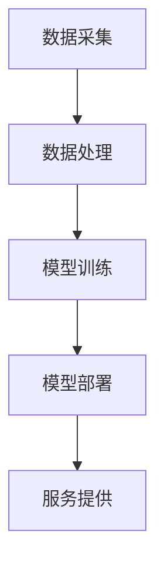
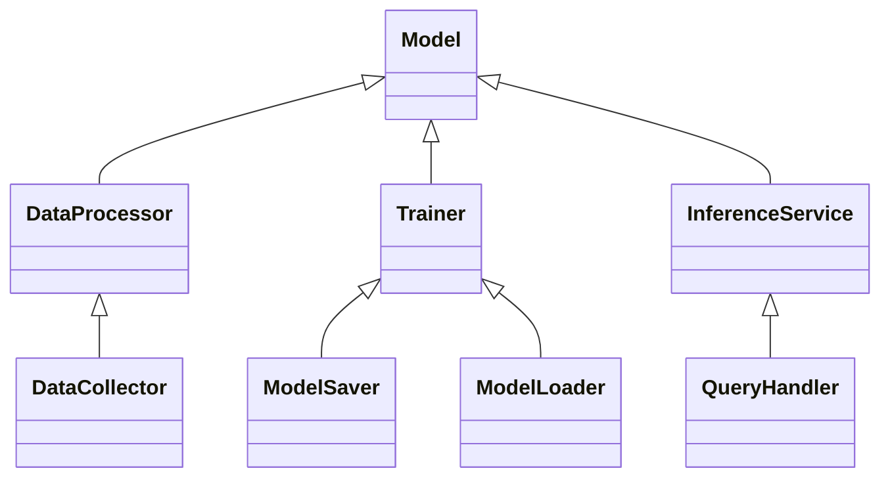
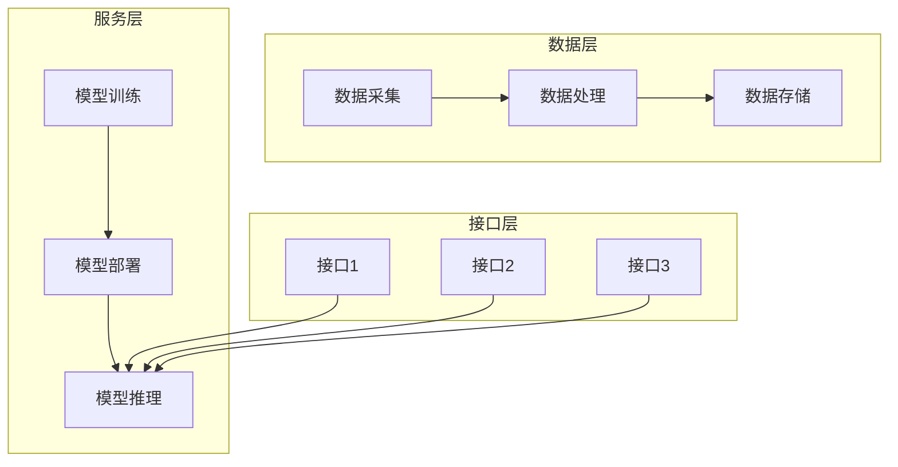
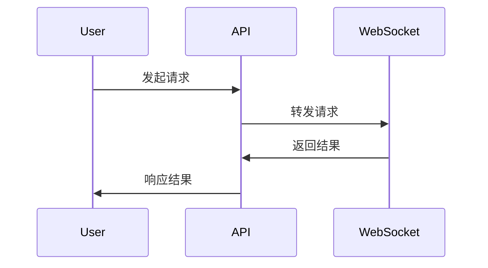
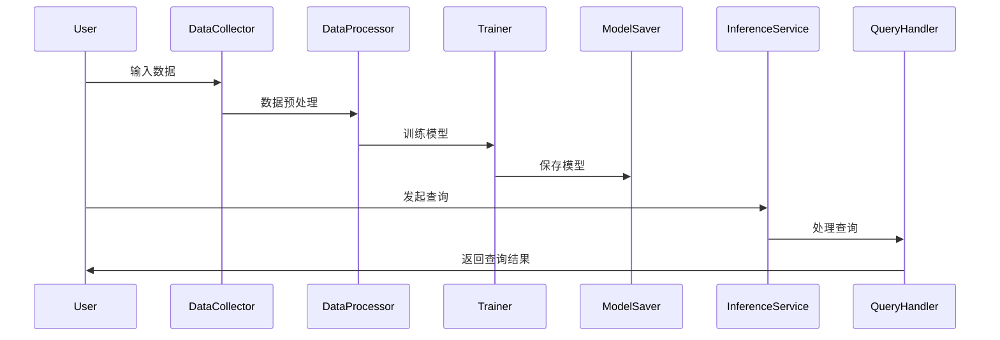

                 

# 《构建可靠的LLM应用灾备方案》

## 关键词

- LLM应用
- 灾备方案
- 可靠性
- 算法原理
- 系统架构
- 实战案例

## 摘要

随着人工智能技术的快速发展，大型语言模型（LLM）在各种应用场景中扮演着越来越重要的角色。然而，LLM应用的高可靠性和稳定性面临着诸多挑战。本文将探讨如何构建一个可靠的LLM应用灾备方案，以应对潜在的系统故障和灾难。本文将从问题背景、核心概念、算法原理、系统分析与架构设计方案以及项目实战等方面展开，旨在为读者提供一个全面、实用的灾备方案参考。

## 第一部分：背景介绍

### 第1章：问题背景

大型语言模型（LLM）在自然语言处理、智能问答、自动翻译、文本生成等领域具有广泛的应用。然而，LLM应用面临着诸多挑战，如数据安全问题、系统稳定性问题、网络攻击等。在遭遇系统故障或灾难时，如何快速恢复LLM应用，确保数据的安全和业务的连续性，成为一个亟待解决的问题。

### 第2章：核心概念

- **LLM**：大型语言模型，是一种基于深度学习技术的自然语言处理模型，能够对文本进行生成、翻译、摘要等操作。
- **灾备**：灾难恢复，是指通过预先准备和规划，确保在系统故障或灾难发生时，数据能够得到有效保护，系统能够快速恢复，业务能够持续运行。
- **灾备方案**：为了实现灾备目标而采取的一系列技术和管理措施。

## 第二部分：核心概念与联系

### 第3章：核心概念原理

LLM工作原理：LLM基于深度学习技术，通过大量数据训练得到，能够在给定输入文本的基础上生成新的文本。

灾备原理：灾备主要依赖于数据备份、系统恢复、业务连续性管理等技术，确保在故障或灾难发生时，系统能够快速恢复正常运行。

LLM应用与灾备的联系：LLM应用需要灾备方案的支持，以确保在故障或灾难发生时，数据安全、系统稳定、业务连续。

### 第4章：概念属性特征对比

| 概念           | 特征                                           |
|--------------|--------------------------------------------|
| LLM应用       | 高计算资源需求、高数据敏感性、高实时性要求             |
| 灾备方案       | 数据备份、系统恢复、业务连续性管理、高可用性           |
| 灾备策略       | 冷备份、热备份、在线备份、混合备份等                 |
| 灾备系统       | 数据中心、备份中心、网络设备、存储设备等               |

### 第5章：ER实体关系图架构

- **LLM应用实体关系**：
  - 模型：存储、训练、部署
  - 数据：采集、处理、存储
  - 服务：接口、请求、响应

- **灾备实体关系**：
  - 备份：数据备份、系统备份
  - 恢复：系统恢复、数据恢复
  - 监控：故障检测、报警

- **LLM应用与灾备的实体关系**：
  - LLM应用与备份、恢复、监控之间存在依赖关系。

## 第三部分：算法原理讲解

### 第6章：算法原理与流程图

LLM应用的算法原理主要包括数据采集、处理、训练、部署等环节。下面是一个简化的Mermaid流程图：



### 第7章：Python源代码与数学模型

#### Python源代码讲解：

```python
import tensorflow as tf
from tensorflow.keras.preprocessing.sequence import pad_sequences

# 数据预处理
max_sequence_length = 100
X = pad_sequences(data, maxlen=max_sequence_length, padding='post', truncating='post')

# 模型训练
model = tf.keras.Sequential([
    tf.keras.layers.Embedding(input_dim=vocab_size, output_dim=embedding_dim),
    tf.keras.layers.Bidirectional(tf.keras.layers.LSTM(64)),
    tf.keras.layers.Dense(units=output_size, activation='softmax')
])

model.compile(optimizer='adam', loss='categorical_crossentropy', metrics=['accuracy'])
model.fit(X, labels, epochs=10)
```

#### 数学模型讲解：

$$
\begin{aligned}
H &= \tanh(W_1 \cdot X + b_1) \\
Y &= \sigma(W_2 \cdot H + b_2)
\end{aligned}
$$

其中，$X$是输入向量，$H$是隐藏层输出，$Y$是预测输出。$W_1$和$W_2$分别是权重矩阵，$b_1$和$b_2$分别是偏置项。$\tanh$和$\sigma$分别是双曲正切函数和 sigmoid 函数。

## 第四部分：系统分析与架构设计方案

### 第8章：问题场景介绍

在本文中，我们将以一个在线智能问答系统为例，介绍LLM应用场景和灾备场景。

### 第9章：系统功能设计

系统功能设计包括数据采集、数据处理、模型训练、模型部署、服务提供等模块。下面是一个简化的Mermaid类图：



### 第10章：系统架构设计

系统架构设计包括数据层、服务层、接口层等。下面是一个简化的Mermaid架构图：



### 第11章：系统接口设计

系统接口设计包括API接口、Websocket接口等。下面是一个简化的Mermaid接口设计图：



### 第12章：系统交互序列图

系统交互序列图展示了数据流和控制流的交互过程。下面是一个简化的Mermaid序列图：



## 第五部分：项目实战

### 第13章：环境安装

在本节中，我们将介绍如何在本地环境安装LLM应用和灾备系统所需的软件和工具。

### 第14章：系统核心实现

在本节中，我们将详细讲解LLM应用的核心实现，包括数据采集、数据处理、模型训练、模型部署和模型推理等模块。

### 第15章：代码应用解读与分析

在本节中，我们将对核心代码进行解读和分析，探讨代码的优化方法和技巧。

### 第16章：实际案例分析与讲解

在本节中，我们将结合实际案例，对LLM应用的灾备方案进行深入分析和讲解。

### 第17章：项目小结

在本节中，我们将对项目进行总结，分享经验教训，并提出改进建议。

## 第六部分：最佳实践 tips、小结、注意事项、拓展阅读

### 第18章：最佳实践 tips

在本节中，我们将总结一些构建可靠LLM应用灾备方案的最佳实践。

### 第19章：小结

在本节中，我们将回顾本文的核心内容，总结主要贡献和不足。

### 第20章：注意事项

在本节中，我们将强调构建灾备方案时需要注意的事项。

### 第21章：拓展阅读

在本节中，我们将推荐一些相关书籍、文献和网络资源，供读者进一步学习。

---

**作者：AI天才研究院/AI Genius Institute & 禅与计算机程序设计艺术 /Zen And The Art of Computer Programming**

