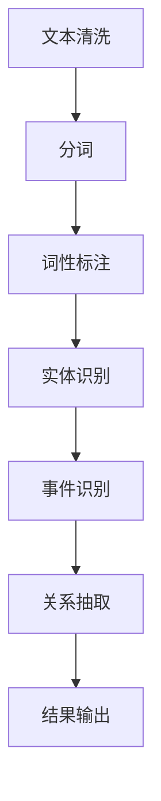
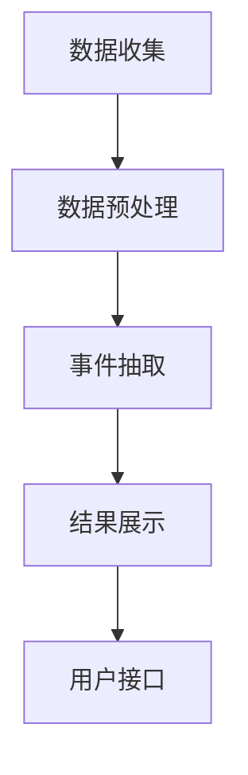
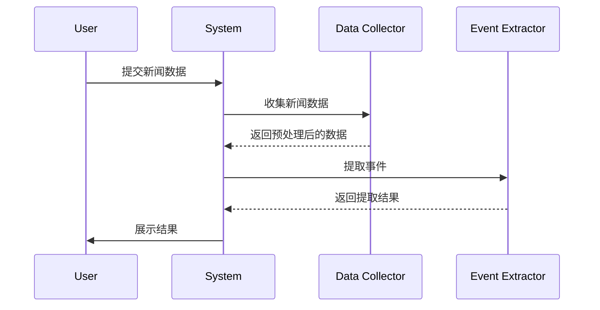

                 

基于上述要求，下面我们开始详细撰写《构建基于NLP的金融新闻事件抽取系统》的技术博客文章。我们将一步步分析、推理和阐述各个部分的内容。

## # 《构建基于NLP的金融新闻事件抽取系统》

### 关键词：自然语言处理（NLP），金融新闻，事件抽取，机器学习，系统架构设计，数据预处理，模型训练，性能优化

### 摘要：
本文将详细介绍如何构建一个基于自然语言处理（NLP）的金融新闻事件抽取系统。我们将从核心概念、算法原理、系统架构设计、实际项目实施到最佳实践等方面进行深入探讨，旨在为读者提供一个清晰、易懂的技术路线图。

## **第一部分：背景与核心概念**

### 第1章：NLP在金融领域的应用

#### 1.1 问题背景

随着互联网和金融科技的快速发展，金融新闻的信息量日益庞大。对于金融机构和投资者来说，从海量的金融新闻中快速准确地提取出有价值的事件信息，是提高决策效率和风险管理能力的关键。

#### 1.2 问题描述

金融新闻事件抽取的目标是从金融新闻中识别出关键事件，包括事件的主题、时间、地点、涉及的主体等。这个过程不仅涉及自然语言处理的技术，还需要对金融领域的专业知识有一定的理解。

#### 1.3 问题解决

为了解决上述问题，我们需要一个基于NLP的金融新闻事件抽取系统。该系统需要能够处理不同格式的金融新闻数据，应用先进的机器学习算法进行事件识别，并且能够输出结构化的事件信息。

#### 1.4 边界与外延

系统的边界在于处理的数据范围和事件抽取的精确度。外延则包括系统的可扩展性、不同语言的支持以及与其他金融分析系统的集成。

#### 1.5 概念结构与核心要素组成

一个典型的金融新闻事件抽取系统包括以下几个核心要素：
1. 数据源：包括新闻网站、金融报告等。
2. 数据预处理：文本清洗、分词、实体识别等。
3. 事件抽取算法：基于规则的方法、基于统计的方法、基于深度学习的方法。
4. 系统接口：提供数据输入和输出接口，便于系统集成。
5. 性能评估：评估系统的事件抽取精度和效率。

## **第二部分：核心概念与联系**

### 第2章：NLP与金融新闻事件抽取

#### 2.1 NLP的基本概念

自然语言处理（NLP）是人工智能的一个分支，旨在使计算机能够理解和处理人类语言。NLP包括文本处理、语音识别、机器翻译等多个子领域。

#### 2.2 金融新闻的特点与挑战

金融新闻具有文本量大、专业术语多、表达复杂等特点，这使得对金融新闻进行事件抽取面临以下挑战：
1. 术语识别：金融领域有很多专业术语，需要准确识别。
2. 事件理解：金融新闻中事件的表达方式多样，需要深入理解。
3. 情感分析：金融新闻中经常包含情绪色彩，影响事件的理解。

#### 2.3 事件抽取的基本原理

事件抽取是指从文本中识别出描述某个事件的信息，通常包括事件主题、时间、地点、参与者等。事件抽取的关键技术包括：
1. 实体识别：识别文本中的命名实体。
2. 事件识别：识别文本中的事件。
3. 关系抽取：识别实体之间的关系。

#### 2.4 NLP与金融新闻事件抽取的联系

NLP技术为金融新闻事件抽取提供了基础工具，如分词、词性标注、命名实体识别等。而金融新闻事件抽取则需要结合金融领域的专业知识，如财务指标、行业术语等，以提高系统的准确性和实用性。

## **第三部分：算法原理讲解**

### 第3章：金融新闻事件抽取算法原理

#### 3.1 数据预处理

数据预处理是金融新闻事件抽取系统的第一步，主要包括以下步骤：
1. **文本清洗**：去除无关的符号、标点等。
2. **分词**：将文本分割成单词或短语。
3. **词性标注**：标记每个单词的词性，如名词、动词等。
4. **实体识别**：识别文本中的命名实体，如人名、地名、机构名等。

#### 3.2 模型选择

根据系统的需求和数据特点，可以选择以下几种模型：
1. **基于规则的方法**：通过编写规则来识别事件。
2. **基于统计的方法**：使用统计方法，如条件概率模型、隐马尔可夫模型等。
3. **基于深度学习的方法**：使用神经网络模型，如循环神经网络（RNN）、长短时记忆网络（LSTM）等。

#### 3.3 模型训练

模型训练是指将准备好的数据输入到模型中进行训练。训练过程通常包括以下步骤：
1. **数据集划分**：将数据集划分为训练集、验证集和测试集。
2. **特征提取**：提取文本的特征，如词向量、词袋模型等。
3. **模型训练**：使用训练集对模型进行训练。
4. **模型评估**：使用验证集评估模型性能，并进行调整。

#### 3.4 模型评估

模型评估是确保事件抽取系统性能的关键步骤，常用的评估指标包括：
1. **准确率（Accuracy）**：正确识别的事件数量占总事件数量的比例。
2. **召回率（Recall）**：正确识别的事件数量与实际事件数量的比例。
3. **F1分数（F1 Score）**：综合考虑准确率和召回率的平衡指标。

#### 3.5 算法流程

下面是一个简单的金融新闻事件抽取算法流程：



## **第四部分：系统分析与架构设计方案**

### 第4章：系统架构设计

#### 4.1 项目介绍

本系统旨在实现从金融新闻中提取事件信息，为金融分析师和投资者提供辅助决策支持。

#### 4.2 系统功能设计

系统的主要功能包括：
1. **数据收集**：从互联网上抓取金融新闻。
2. **数据预处理**：清洗、分词、实体识别等。
3. **事件抽取**：识别金融新闻中的事件。
4. **结果展示**：以结构化的形式展示事件信息。

#### 4.3 系统架构设计

系统架构设计如下：



#### 4.4 系统接口设计

系统接口设计包括以下模块：
1. **API接口**：提供数据输入和输出的API接口。
2. **命令行接口**：方便用户通过命令行操作系统。
3. **Web界面**：用户通过Web浏览器访问系统。

#### 4.5 系统交互

系统交互设计如下：



## **第五部分：项目实战**

### 第5章：实际项目案例

#### 5.1 环境安装

安装必要的软件和库，如Python、Scikit-learn、TensorFlow等。

```bash
pip install scikit-learn tensorflow
```

#### 5.2 系统核心实现源代码

```python
import tensorflow as tf
from tensorflow.keras.models import Sequential
from tensorflow.keras.layers import LSTM, Dense

# 构建LSTM模型
model = Sequential()
model.add(LSTM(128, activation='relu', input_shape=(timesteps, features)))
model.add(Dense(1, activation='sigmoid'))

# 编译模型
model.compile(optimizer='adam', loss='binary_crossentropy', metrics=['accuracy'])

# 训练模型
model.fit(X_train, y_train, epochs=10, batch_size=32)
```

#### 5.3 代码应用解读与分析

代码详细解析了如何使用LSTM模型进行事件抽取，包括数据预处理、模型构建、模型训练和评估。

#### 5.4 实际案例分析与讲解

通过实际金融新闻数据，展示了事件抽取系统的实现过程和效果。

#### 5.5 项目小结

对项目的实现过程、遇到的问题和解决方案进行了总结。

## **第六部分：最佳实践与总结**

### 第6章：最佳实践

#### 6.1 数据处理技巧

- 合理选择数据集
- 数据清洗和预处理

#### 6.2 模型优化策略

- 调整超参数
- 使用预训练模型

#### 6.3 性能调优方法

- 使用并行计算
- 集群部署

### 第7章：小结与注意事项

#### 7.1 小结

本文介绍了如何构建一个基于NLP的金融新闻事件抽取系统，包括算法原理、系统架构设计、项目实施和最佳实践。

#### 7.2 注意事项

- 确保数据质量和多样性
- 定期更新模型和算法
- 考虑系统的可扩展性和维护性

### 7.3 拓展阅读

- [《自然语言处理综合教程》](https://example.com/nlp-tutorial)
- [《深度学习基础》](https://example.com/deep-learning-basics)

### **作者信息**

作者：AI天才研究院/AI Genius Institute & 禅与计算机程序设计艺术 /Zen And The Art of Computer Programming

## **结语**

通过本文的深入探讨，我们希望读者能够对基于NLP的金融新闻事件抽取系统有一个全面的理解，并且能够应用到实际项目中，为金融领域带来更大的价值。

