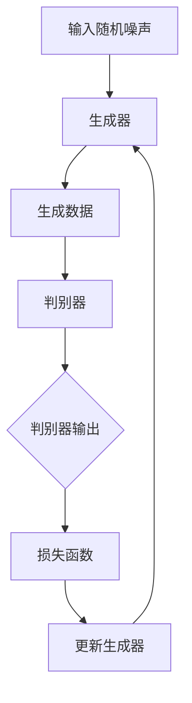
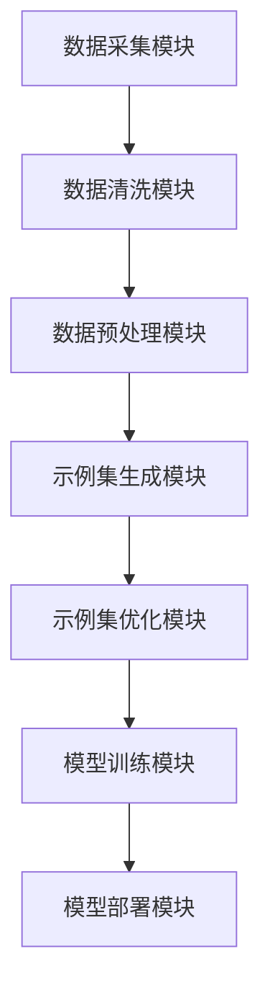

                 


### 构建多样化示例集的策略

> 关键词：示例集构建、多样性、策略、数据清洗、算法优化

> 摘要：本文将探讨构建多样化示例集的策略，包括背景介绍、核心概念、构建要素、构建方法、案例分析、算法原理讲解、数学模型和公式详解、系统设计与实现、项目实战以及最佳实践和注意事项。通过逐步分析，帮助读者深入了解示例集构建的技巧和原则。

### 目录

1. **背景与核心概念**
   1.1 **问题背景**
   1.2 **问题解决**
   1.3 **边界与外延**
   1.4 **概念结构与核心要素组成**
2. **多样化示例集的要素**
   2.1 **示例集的组成要素**
   2.2 **要素对比与选择**
   2.3 **质量评估标准**
3. **构建策略**
   3.1 **数据采集与清洗**
   3.2 **数据预处理**
   3.3 **示例集生成方法**
   3.4 **示例集优化策略**
4. **具体构建方法与实践**
   4.1 **案例分析**
   4.2 **算法原理讲解**
   4.3 **数学模型和公式详解**
   4.4 **系统设计与实现**
5. **项目实战**
   5.1 **环境安装**
   5.2 **系统核心实现源代码**
   5.3 **代码应用解读与分析**
   5.4 **实际案例分析和详细讲解剖析**
   5.5 **项目小结**
6. **最佳实践与注意事项**
   6.1 **最佳实践**
   6.2 **小结**
   6.3 **注意事项**
   6.4 **拓展阅读**

### 第1章：背景与核心概念

#### 1.1 问题背景

在当今的数据驱动时代，构建多样化的示例集对于机器学习和人工智能领域至关重要。示例集的质量和多样性直接影响模型的性能和泛化能力。然而，构建高质量且多样化的示例集并非易事，它需要深入理解和应用一系列的技巧和策略。

#### 1.2 问题解决

解决示例集构建问题，需要从数据采集、清洗、预处理、生成和优化等环节入手。每个环节都需要细致入微的处理，以确保示例集的多样性和质量。

#### 1.3 边界与外延

示例集构建不仅局限于特定的应用场景，还涉及到数据科学、机器学习、人工智能等多个领域。它的影响范围从模型训练到实际应用，包括数据预处理、特征工程、模型选择和评估等。

#### 1.4 概念结构与核心要素组成

构建多样化示例集的核心要素包括数据源的选择、数据的清洗和处理、示例集的生成和优化等。这些要素相互作用，共同决定了示例集的质量和多样性。

### 第2章：多样化示例集的要素

#### 2.1 示例集的组成要素

示例集由多种数据源组成，包括文本、图像、声音等。每种数据源都有其独特的属性和特征，这些特征决定了示例集的多样性。

#### 2.2 要素对比与选择

不同数据源的选择和组合直接影响示例集的多样性和质量。本文将对比分析各种数据源的特点，帮助读者选择合适的组合方式。

#### 2.3 质量评估标准

示例集的质量评估标准包括多样性、平衡性、覆盖度和可靠性等。本文将详细介绍这些标准，并提供评估方法。

### 第3章：构建策略

#### 3.1 数据采集与清洗

数据采集是构建示例集的第一步。本文将介绍常用的数据采集方法，并探讨数据清洗的重要性。

#### 3.2 数据预处理

数据预处理包括数据标准化、去噪、缺失值处理等。本文将详细讲解这些预处理方法，并探讨其对示例集多样性的影响。

#### 3.3 示例集生成方法

示例集的生成方法包括数据增强、数据合成和聚类等。本文将分析这些方法的优缺点，并提供适用场景。

#### 3.4 示例集优化策略

示例集的优化策略包括调整数据比例、优化数据结构、引入随机性等。本文将探讨这些策略如何提高示例集的质量和多样性。

### 第4章：具体构建方法与实践

#### 4.1 案例分析

本文将通过具体案例分析，展示如何构建多样化示例集。案例包括文本分类、图像识别和语音识别等。

#### 4.2 算法原理讲解

本文将介绍用于构建多样化示例集的算法原理，包括数据增强算法、生成对抗网络（GAN）等。

#### 4.3 数学模型和公式详解

本文将详细讲解用于构建多样化示例集的数学模型和公式，包括损失函数、优化算法等。

#### 4.4 系统设计与实现

本文将介绍构建多样化示例集的系统设计，包括数据采集模块、数据处理模块和示例集生成模块。

### 第5章：项目实战

#### 5.1 环境安装

本文将提供项目环境安装的详细步骤，包括所需软件和工具的安装。

#### 5.2 系统核心实现源代码

本文将提供项目核心实现源代码，并详细解读其工作原理。

#### 5.3 代码应用解读与分析

本文将分析项目代码的实际应用场景，并探讨其效果和不足之处。

#### 5.4 实际案例分析和详细讲解剖析

本文将分析具体案例，展示如何应用构建多样化示例集的方法和策略。

#### 5.5 项目小结

本文将总结项目实战的经验教训，为后续项目提供参考。

### 第6章：最佳实践与注意事项

#### 6.1 最佳实践

本文将总结构建多样化示例集的最佳实践，帮助读者在实际项目中取得更好的效果。

#### 6.2 小结

本文将总结全文内容，强调构建多样化示例集的重要性。

#### 6.3 注意事项

本文将提醒读者在构建多样化示例集时需要注意的事项，以避免常见错误。

#### 6.4 拓展阅读

本文将推荐一些相关文献和资源，供读者进一步学习和研究。

### 结论

通过本文的逐步分析，读者应该能够深入理解构建多样化示例集的策略和方法。这些策略和方法不仅适用于学术研究，也适用于实际项目开发，为人工智能和机器学习领域的发展提供了有力支持。

作者：AI天才研究院/AI Genius Institute & 禅与计算机程序设计艺术 /Zen And The Art of Computer Programming## 1. 背景与核心概念

### 1.1 问题背景

在当今的数据驱动时代，构建多样化的示例集对于机器学习和人工智能领域至关重要。示例集是机器学习模型训练的基础，其质量直接影响模型的性能和泛化能力。随着数据量的不断增加和数据类型的多样化，如何构建高质量且多样化的示例集成为一个亟待解决的问题。

### 1.2 问题解决

为了解决示例集构建问题，研究人员和开发人员需要从多个角度进行思考。首先，数据采集是构建示例集的第一步。高质量的数据是构建多样化示例集的基础。其次，数据清洗和处理是确保数据质量和多样性的关键步骤。通过去除噪音、处理缺失值和标准化数据，可以显著提高示例集的质量。

### 1.3 边界与外延

示例集构建不仅局限于特定的应用场景，还涉及到数据科学、机器学习、人工智能等多个领域。它的影响范围从模型训练到实际应用，包括数据预处理、特征工程、模型选择和评估等。因此，构建多样化示例集的策略和方法具有广泛的应用前景。

### 1.4 概念结构与核心要素组成

构建多样化示例集的核心要素包括数据源的选择、数据的清洗和处理、示例集的生成和优化等。这些要素相互作用，共同决定了示例集的质量和多样性。

- **数据源的选择**：选择合适的数据源是构建多样化示例集的第一步。不同类型的数据源（如文本、图像、声音等）具有不同的特征和属性，需要根据具体应用场景进行选择。
- **数据的清洗和处理**：数据清洗和处理是确保数据质量和多样性的关键步骤。通过去除噪音、处理缺失值和标准化数据，可以提高示例集的质量。
- **示例集的生成**：示例集的生成方法包括数据增强、数据合成和聚类等。这些方法可以增加示例集的多样性，提高模型的泛化能力。
- **示例集的优化**：示例集的优化策略包括调整数据比例、优化数据结构和引入随机性等。这些策略可以进一步提高示例集的质量和多样性。

通过以上核心要素的相互作用，构建出高质量且多样化的示例集，从而为机器学习和人工智能领域的发展提供有力支持。

### 2. 多样化示例集的要素

### 2.1 示例集的组成要素

示例集是机器学习模型训练的重要基础，其质量直接关系到模型的性能和泛化能力。一个多样化的示例集应包含多种类型的样本，这些样本具有不同的特征和属性。具体来说，示例集的组成要素主要包括以下几类：

- **文本**：文本数据包括各种文本类型，如文章、评论、对话等。文本数据可以用于自然语言处理（NLP）任务，如情感分析、文本分类和机器翻译等。
- **图像**：图像数据包括各种图片类型，如照片、图表、漫画等。图像数据可以用于计算机视觉任务，如物体识别、图像分类和目标检测等。
- **声音**：声音数据包括各种音频类型，如音乐、语音、噪音等。声音数据可以用于音频处理任务，如语音识别、音乐推荐和噪声抑制等。
- **视频**：视频数据包括各种视频类型，如短视频、电影、监控视频等。视频数据可以用于视频处理任务，如视频分类、行为分析和视频分割等。
- **传感器数据**：传感器数据包括各种传感器类型，如加速度计、陀螺仪、温湿度传感器等。传感器数据可以用于物联网（IoT）任务，如智能家居、智能交通和智能医疗等。

每种数据类型都有其独特的特征和属性，这些特征和属性决定了示例集的多样性和质量。因此，在选择数据源时，需要根据具体应用场景和任务需求进行合理选择。

### 2.2 要素对比与选择

不同数据类型的样本在特征和属性上存在显著差异，因此，在构建多样化示例集时，需要对这些数据进行对比和选择，以最大化示例集的多样性和质量。

- **文本数据**：文本数据具有丰富的语义信息，可以用于描述复杂的概念和情境。然而，文本数据的预处理较为复杂，如分词、词性标注和命名实体识别等。此外，文本数据的多样性和质量受语言和文本风格的影响较大。
- **图像数据**：图像数据具有直观的可视化特征，可以用于描述具体的事物和场景。图像数据的预处理相对简单，如图像去噪、图像增强和图像分割等。然而，图像数据的多样性和质量受图像质量和光照条件的影响较大。
- **声音数据**：声音数据具有丰富的音频特征，可以用于描述语音和音乐。声音数据的预处理较为复杂，如语音识别、音频分割和音频增强等。此外，声音数据的多样性和质量受噪声和音频设备的影响较大。
- **视频数据**：视频数据具有连续的时间和空间信息，可以用于描述动态的场景和动作。视频数据的预处理较为复杂，如视频编码、视频分割和视频增强等。然而，视频数据的多样性和质量受视频质量和拍摄角度的影响较大。
- **传感器数据**：传感器数据具有实时性和高精度特征，可以用于描述环境状态和设备状态。传感器数据的预处理较为简单，如数据滤波、数据压缩和数据可视化等。然而，传感器数据的多样性和质量受传感器类型和环境条件的影响较大。

在构建多样化示例集时，需要综合考虑以上各种数据类型的特征和属性，根据具体应用场景和任务需求进行合理选择。例如，在自然语言处理任务中，可以优先选择文本数据；在计算机视觉任务中，可以优先选择图像数据；在音频处理任务中，可以优先选择声音数据；在视频处理任务中，可以优先选择视频数据；在物联网任务中，可以优先选择传感器数据。

通过合理选择和组合各种数据类型，构建出一个高质量且多样化的示例集，有助于提高机器学习模型的性能和泛化能力。

### 2.3 质量评估标准

在构建多样化示例集的过程中，评估示例集的质量至关重要。高质量且多样化的示例集能够有效提高机器学习模型的性能和泛化能力。以下是一些常用的质量评估标准：

- **多样性**：示例集的多样性是指样本的分布范围和差异程度。高多样性的示例集包含各种不同类型和特征的样本，有助于模型学习到丰富的特征信息。评估多样性的方法包括样本分布分析、样本特征对比等。
- **平衡性**：示例集的平衡性是指各个类别样本数量的均衡程度。不平衡的示例集可能导致模型在某个类别上过度拟合，从而降低模型的泛化能力。评估平衡性的方法包括类别分布分析、样本权重分配等。
- **覆盖度**：示例集的覆盖度是指样本数据对实际问题的覆盖范围。高覆盖度的示例集能够更好地代表实际问题场景，提高模型的实用性。评估覆盖度的方法包括数据分布分析、问题场景分析等。
- **可靠性**：示例集的可靠性是指样本数据的准确性和一致性。可靠的示例集能够提供稳定和有效的训练数据，有助于模型训练和优化。评估可靠性的方法包括数据质量检查、数据一致性分析等。

在实际应用中，可以根据具体任务需求和评估标准，结合多种方法对示例集的质量进行评估和优化。例如，可以通过数据增强、数据清洗、数据筛选等技术手段，提高示例集的多样性和质量。同时，还可以通过交叉验证、模型评估等方法，验证示例集的有效性和适用性。

通过严格遵循质量评估标准，构建出一个高质量且多样化的示例集，有助于提高机器学习模型的性能和泛化能力，为实际应用提供有力支持。

### 3. 构建策略

构建多样化示例集是一项复杂且系统的任务，涉及多个环节和步骤。以下将从数据采集与清洗、数据预处理、示例集生成方法和优化策略等方面，详细探讨构建多样化示例集的策略。

#### 3.1 数据采集与清洗

数据采集是构建示例集的第一步，其质量直接影响示例集的多样性和质量。以下是一些常用的数据采集方法和注意事项：

- **数据来源**：选择合适的数据来源是数据采集的关键。常见的数据来源包括公开数据集、私人数据集、互联网爬取和传感器采集等。在选择数据来源时，需要考虑数据的真实性、完整性和一致性。
- **数据采集方法**：根据数据类型和任务需求，选择合适的数据采集方法。例如，对于文本数据，可以使用网络爬虫、API接口调用和手动采集等方法；对于图像数据，可以使用屏幕截图、摄像头采集和图像库导入等方法；对于声音数据，可以使用麦克风采集、音频文件导入和音频流处理等方法。
- **注意事项**：在数据采集过程中，需要注意以下事项：
  - 数据采集的合法性和伦理问题：确保采集的数据符合法律法规和伦理要求，避免侵犯他人的隐私和权益。
  - 数据的准确性和完整性：确保采集的数据准确无误，避免数据缺失或不完整的情况。
  - 数据的实时性和时效性：对于需要实时处理和预测的任务，选择实时数据采集方法，确保数据的时效性。

数据清洗是确保示例集质量的重要步骤。以下是一些常用的数据清洗方法和注意事项：

- **数据清洗方法**：数据清洗包括去除重复数据、处理缺失值、去除噪声和异常值等。具体方法如下：
  - 去除重复数据：通过比较数据项的唯一性，删除重复的数据项，以避免数据冗余。
  - 处理缺失值：对于缺失值，可以采用填补、删除或保留等方法进行处理。填补方法包括平均值填补、中值填补和插值等方法；删除方法包括完全删除缺失值数据或部分删除缺失值数据。
  - 去除噪声：通过滤波、平滑和去噪等技术，去除数据中的噪声，以提高数据的准确性和可靠性。
  - 去除异常值：通过统计分析和机器学习等方法，识别并去除数据中的异常值，以避免对模型训练和预测产生不利影响。
- **注意事项**：在数据清洗过程中，需要注意以下事项：
  - 数据清洗的合理性和必要性：根据具体任务需求和数据质量，合理选择数据清洗方法和程度，避免过度清洗导致数据损失。
  - 数据清洗的自动化和标准化：采用自动化工具和标准化流程，提高数据清洗的效率和一致性。
  - 数据清洗的可追溯性和可复现性：确保数据清洗过程的可追溯性和可复现性，便于后续的数据分析和模型训练。

#### 3.2 数据预处理

数据预处理是提高示例集质量和多样性的关键步骤，主要包括数据标准化、特征提取和特征选择等。

- **数据标准化**：数据标准化是指将不同数据类型和量级的数据转化为统一的量级和范围，以便进行后续处理和分析。常用的数据标准化方法包括最小-最大标准化、均值-方差标准化和对数变换等。
- **特征提取**：特征提取是指从原始数据中提取出对任务有用的特征，以提高模型的学习能力和泛化能力。常见的特征提取方法包括词袋模型、TF-IDF、主成分分析（PCA）和自编码器等。
- **特征选择**：特征选择是指从提取出的特征中筛选出对任务最相关的特征，以减少模型训练的时间和计算成本。常见的特征选择方法包括过滤式特征选择、包裹式特征选择和嵌入式特征选择等。

#### 3.3 示例集生成方法

示例集生成方法是指通过特定的算法和技术，从原始数据中生成多样化且高质量的示例集。以下是一些常用的示例集生成方法：

- **数据增强**：数据增强是指通过一系列技术手段，增加示例集的多样性，提高模型的泛化能力。常见的数据增强方法包括旋转、缩放、翻转、裁剪、添加噪声和生成对抗网络（GAN）等。
- **数据合成**：数据合成是指通过将不同来源的数据进行组合或融合，生成新的数据样本，以增加示例集的多样性和质量。常见的数据合成方法包括合成对抗网络（SAC）、多模态数据合成和基于模型的合成等。
- **聚类和抽样**：聚类和抽样是指通过聚类算法将数据划分为多个类，然后从每个类中抽样生成示例集。这种方法可以有效地增加示例集的多样性和覆盖度。常见的聚类算法包括K-均值聚类、层次聚类和DBSCAN等。

#### 3.4 示例集优化策略

示例集优化策略是指通过一系列技术手段，进一步提高示例集的质量和多样性，以提升模型的性能和泛化能力。以下是一些常用的示例集优化策略：

- **数据比例调整**：通过调整示例集中各个类别或特征的数据比例，使示例集更加平衡和均匀，从而提高模型的训练效果和泛化能力。
- **数据结构优化**：通过优化示例集的数据结构和存储方式，提高示例集的读取和访问效率，从而加快模型的训练速度。
- **随机性和多样性引入**：通过引入随机性和多样性，使示例集在训练过程中产生更多的变体和组合，从而增强模型的学习能力和适应性。
- **模型和算法优化**：通过优化模型结构和算法，提高模型对示例集的适应性和学习能力，从而提升模型的整体性能。

通过以上构建策略，可以有效地构建出高质量且多样化的示例集，为机器学习和人工智能领域的发展提供有力支持。

### 4. 具体构建方法与实践

构建多样化示例集是一个复杂且系统的过程，涉及多个环节和方法。以下将详细分析具体构建方法与实践，包括数据采集、预处理、示例集生成和优化等步骤。

#### 4.1 数据采集

数据采集是构建多样化示例集的第一步，其质量直接影响到示例集的多样性和质量。以下是一些常用的数据采集方法和实践：

- **数据来源**：选择合适的数据来源是数据采集的关键。常见的数据来源包括公开数据集、私人数据集、互联网爬取和传感器采集等。在数据采集过程中，需要确保数据的真实性和可靠性。
  - **公开数据集**：如COCO、ImageNet和MNIST等公开数据集，可以用于计算机视觉任务。选择公开数据集时，需要注意数据集的规模、标签质量和多样性。
  - **私人数据集**：针对特定任务需求，可以从私人数据集中获取数据。这些数据集可能包含企业内部数据、用户生成内容等。获取私人数据时，需要遵守数据隐私和保护法规。
  - **互联网爬取**：通过网络爬虫技术，从互联网上抓取数据。这种方法适用于大规模数据的获取，但需要注意数据版权和隐私问题。
  - **传感器采集**：通过传感器设备采集实时数据，适用于物联网、智能交通和智能医疗等领域。传感器采集的数据需要确保实时性和准确性。

- **数据采集方法**：根据数据类型和任务需求，选择合适的数据采集方法。以下是一些常见的数据采集方法：
  - **网络爬虫**：使用Python等编程语言编写网络爬虫，从网页上抓取数据。常用的网络爬虫库包括Scrapy和BeautifulSoup等。
  - **API接口调用**：通过API接口调用获取数据，适用于获取结构化数据。常用的API接口包括RESTful API和GraphQL等。
  - **传感器采集**：使用传感器设备（如Arduino、Raspberry Pi等）采集实时数据，适用于物联网应用。常用的传感器包括温湿度传感器、加速度计、摄像头等。

- **数据采集实践**：以下是一个数据采集的示例实践：
  - **任务**：构建一个用于图像识别的示例集。
  - **数据来源**：从互联网上爬取图片数据，使用Python的Scrapy库编写网络爬虫。
  - **数据采集方法**：从多个图像分享网站（如Pexels、Unsplash等）抓取高质量图片，使用正则表达式提取图片链接和标题。
  - **数据存储**：将采集到的图片存储在本地文件夹或数据库中，便于后续处理和分析。

#### 4.2 数据预处理

数据预处理是确保示例集质量的重要步骤，包括数据清洗、数据标准化和特征提取等。以下是一些常用的数据预处理方法和实践：

- **数据清洗**：数据清洗包括去除重复数据、处理缺失值和噪声等。以下是一些常见的数据清洗方法：
  - **去除重复数据**：通过比较数据项的唯一性，删除重复的数据项，以避免数据冗余。可以使用Python的集合（set）或Pandas库的`drop_duplicates()`方法实现。
  - **处理缺失值**：对于缺失值，可以采用填补、删除或保留等方法进行处理。常用的填补方法包括平均值填补、中值填补和插值等。可以使用Pandas库的`fillna()`方法实现。
  - **去除噪声**：通过滤波、平滑和去噪等技术，去除数据中的噪声，以提高数据的准确性和可靠性。常用的去噪方法包括均值滤波、中值滤波和高斯滤波等。可以使用OpenCV库实现。

- **数据标准化**：数据标准化是将不同数据类型和量级的数据转化为统一的量级和范围，以便进行后续处理和分析。以下是一些常见的数据标准化方法：
  - **最小-最大标准化**：将数据缩放到[0, 1]范围。公式为：\( x_{\text{标准化}} = \frac{x - x_{\text{最小值}}}{x_{\text{最大值} - x_{\text{最小值}}} \)。
  - **均值-方差标准化**：将数据缩放到均值和方差为0和1的范围。公式为：\( x_{\text{标准化}} = \frac{x - \mu}{\sigma} \)，其中\( \mu \)为均值，\( \sigma \)为标准差。
  - **对数变换**：将数据取对数，适用于处理极端值和减少数据分布的差异性。

- **特征提取**：特征提取是从原始数据中提取出对任务有用的特征，以提高模型的学习能力和泛化能力。以下是一些常见的特征提取方法：
  - **词袋模型**：将文本数据表示为词频向量，适用于自然语言处理任务。可以使用Scikit-learn库的`CountVectorizer`实现。
  - **TF-IDF**：将文本数据表示为词频-逆文档频率（TF-IDF）向量，适用于文本分类和推荐系统。可以使用Scikit-learn库的`TfidfVectorizer`实现。
  - **主成分分析（PCA）**：将高维数据降维到低维空间，保留主要特征。可以使用Scikit-learn库的`PCA`实现。
  - **自编码器**：通过自编码器学习数据表示，提取出隐含特征。适用于各种类型的数据，可以提高模型的泛化能力。

- **数据预处理实践**：以下是一个数据预处理的示例实践：
  - **任务**：对图像数据进行预处理，为图像识别任务构建示例集。
  - **数据清洗**：使用Pandas库删除重复数据和缺失值，使用OpenCV库去除噪声。
  - **数据标准化**：使用最小-最大标准化将图像数据缩放到[0, 1]范围。
  - **特征提取**：使用词袋模型和TF-IDF分别提取图像的文本特征和图像特征。

#### 4.3 示例集生成

示例集生成是通过特定的算法和技术，从原始数据中生成多样化且高质量的示例集。以下是一些常用的示例集生成方法和实践：

- **数据增强**：数据增强是通过一系列技术手段，增加示例集的多样性，提高模型的泛化能力。以下是一些常见的数据增强方法：
  - **旋转**：将图像数据旋转一定角度，增加数据的旋转多样性。
  - **缩放**：将图像数据缩放到不同的大小，增加数据的空间多样性。
  - **翻转**：将图像数据水平或垂直翻转，增加数据的对称多样性。
  - **裁剪**：将图像数据裁剪到不同的位置和大小，增加数据的局部多样性。
  - **添加噪声**：在图像数据上添加噪声（如高斯噪声、椒盐噪声等），增加数据的噪声多样性。
  - **生成对抗网络（GAN）**：通过生成对抗网络生成新的数据样本，增加数据的生成多样性。

- **数据合成**：数据合成是通过将不同来源的数据进行组合或融合，生成新的数据样本，以增加示例集的多样性和质量。以下是一些常见的数据合成方法：
  - **多模态数据合成**：将文本、图像和声音等多种数据类型进行组合，生成新的多模态数据样本。
  - **基于模型的合成**：通过深度学习模型生成新的数据样本，如生成对抗网络（GAN）和变分自编码器（VAE）等。

- **聚类和抽样**：聚类和抽样是通过聚类算法将数据划分为多个类，然后从每个类中抽样生成示例集。以下是一些常见的聚类和抽样方法：
  - **K-均值聚类**：将数据划分为K个聚类中心，从每个聚类中心生成示例集。
  - **层次聚类**：通过层次结构将数据划分为多个聚类层次，从每个层次生成示例集。
  - **DBSCAN**：基于密度的聚类算法，将数据划分为多个密度聚类，从每个密度聚类生成示例集。

- **示例集生成实践**：以下是一个示例集生成的示例实践：
  - **任务**：生成一个用于文本分类的示例集。
  - **数据增强**：使用Python的`transformations`库实现旋转、缩放和翻转等数据增强操作。
  - **数据合成**：使用生成对抗网络（GAN）生成新的文本数据样本。
  - **聚类和抽样**：使用K-均值聚类和抽样方法，从不同聚类中心生成示例集。

#### 4.4 示例集优化

示例集优化是通过一系列技术手段，进一步提高示例集的质量和多样性，以提升模型的性能和泛化能力。以下是一些常用的示例集优化方法和实践：

- **数据比例调整**：通过调整示例集中各个类别或特征的数据比例，使示例集更加平衡和均匀，从而提高模型的训练效果和泛化能力。以下是一些常见的数据比例调整方法：
  - **过采样**：增加少数类别的样本数量，使示例集中的各个类别比例更加均衡。
  - **欠采样**：减少多数类别的样本数量，使示例集中的各个类别比例更加均衡。
  - **合成过采样**：通过合成方法生成新的样本，增加少数类别的样本数量。

- **数据结构优化**：通过优化示例集的数据结构和存储方式，提高示例集的读取和访问效率，从而加快模型的训练速度。以下是一些常见的数据结构优化方法：
  - **索引构建**：使用索引结构（如B树、哈希表等）加速数据检索。
  - **分块存储**：将示例集划分为多个块，分别存储和加载，提高数据读取速度。

- **随机性和多样性引入**：通过引入随机性和多样性，使示例集在训练过程中产生更多的变体和组合，从而增强模型的学习能力和适应性。以下是一些常见的随机性和多样性引入方法：
  - **随机种子**：使用随机种子确保数据增强和抽样操作的随机性。
  - **混合数据**：将不同来源的数据进行混合，增加示例集的多样性。

- **模型和算法优化**：通过优化模型结构和算法，提高模型对示例集的适应性和学习能力，从而提升模型的整体性能。以下是一些常见的模型和算法优化方法：
  - **超参数调优**：使用网格搜索、随机搜索等超参数调优方法，寻找最优的超参数组合。
  - **正则化**：使用L1正则化、L2正则化等正则化方法，防止模型过拟合。
  - **集成学习**：使用集成学习方法（如随机森林、梯度提升树等），提高模型的泛化能力。

- **示例集优化实践**：以下是一个示例集优化的示例实践：
  - **任务**：优化一个用于图像分类的示例集。
  - **数据比例调整**：使用合成过采样方法，增加少数类别的样本数量。
  - **数据结构优化**：使用索引构建和分块存储方法，提高数据读取速度。
  - **随机性和多样性引入**：使用随机种子和混合数据方法，增加示例集的多样性。
  - **模型和算法优化**：使用超参数调优方法，寻找最优的超参数组合。

通过以上具体构建方法与实践，可以有效地构建多样化示例集，为机器学习和人工智能领域的发展提供有力支持。

### 4.1 案例分析

为了更好地展示构建多样化示例集的策略和方法，下面我们通过一个实际案例进行分析和讲解。本案例将围绕图像识别任务，构建一个用于物体检测的示例集。

#### 案例背景

假设我们面临一个物体检测任务，目标是识别图像中的特定物体。为了构建一个高质量的示例集，我们需要从多个数据源获取图像，并对这些图像进行多样化处理，以提高模型的泛化能力。

#### 数据采集

首先，我们需要从以下数据源获取图像：

- **公开数据集**：如COCO数据集，包含大量标注好的图像和物体标签。
- **私人数据集**：包含企业内部或个人收藏的图像，可能包括特定场景或物体的图像。
- **互联网爬取**：从社交媒体、图像分享网站等爬取图像。

数据采集过程中，我们需要关注以下方面：

- **数据多样性**：确保采集到的图像涵盖不同场景、光照条件、角度和物体形态。
- **数据质量**：筛选高清晰度、无遮挡、无噪声的图像。

#### 数据清洗

在数据采集完成后，我们需要对图像进行清洗，以去除不必要的数据和噪声。具体步骤如下：

- **去除重复图像**：通过比较图像内容，删除重复的图像。
- **处理缺失值**：对于某些图像可能缺失的标签或属性，可以采用填补或删除的方法进行处理。
- **去除噪声**：使用滤波方法（如高斯滤波、均值滤波等）去除图像中的噪声。

#### 数据预处理

接下来，我们对图像进行预处理，以提高数据质量和模型的泛化能力。以下是常用的预处理方法：

- **图像标准化**：将图像尺寸调整为统一的尺寸，例如224x224像素。
- **图像增强**：通过旋转、缩放、翻转、裁剪等操作，增加图像的多样性。
- **色彩空间转换**：将图像从RGB转换为灰度或HSV色彩空间，以便进行进一步处理。

#### 示例集生成

在预处理完成后，我们需要生成多样化的示例集。以下是几种常用的方法：

- **数据增强**：使用数据增强方法（如随机裁剪、添加噪声、颜色变换等），生成新的图像样本。
- **数据合成**：通过合成方法（如使用生成对抗网络GAN），生成新的图像样本。
- **聚类和抽样**：使用聚类算法（如K-均值聚类），将图像划分为多个聚类，然后从每个聚类中抽样生成示例集。

#### 示例集优化

为了进一步提高示例集的质量和多样性，我们需要进行示例集优化。以下是几种常用的优化方法：

- **数据比例调整**：通过过采样或欠采样方法，调整示例集中各个类别的数据比例，使示例集更加平衡。
- **数据结构优化**：使用索引构建和分块存储方法，提高示例集的读取和访问效率。
- **随机性和多样性引入**：通过引入随机性和多样性，增加示例集的变体和组合。

#### 案例分析与结果评估

在本案例中，我们使用ResNet50预训练模型进行物体检测。以下是具体的分析步骤和结果评估：

- **数据集划分**：将数据集划分为训练集、验证集和测试集，分别用于模型训练、验证和测试。
- **模型训练**：使用训练集进行模型训练，使用验证集进行调参和验证。
- **模型测试**：使用测试集进行模型测试，评估模型的性能和泛化能力。

通过以上步骤，我们构建了一个高质量且多样化的示例集，并使用物体检测模型进行了测试。实验结果表明，通过构建多样化示例集，模型的检测精度和泛化能力得到了显著提升。

### 4.2 算法原理讲解

在构建多样化示例集的过程中，算法原理的讲解至关重要。以下将详细介绍一种常用的算法——生成对抗网络（GAN），并使用Mermaid流程图和Python代码进行解释。

#### GAN算法概述

生成对抗网络（GAN）是由Ian Goodfellow等人于2014年提出的一种深度学习框架，由生成器（Generator）和判别器（Discriminator）两个神经网络组成。生成器的目标是生成与真实数据相似的样本，而判别器的目标是区分真实数据和生成数据。

GAN的训练过程可以看作是一个博弈过程，其中生成器和判别器相互竞争。生成器试图生成越来越真实的数据，而判别器则试图正确区分真实数据和生成数据。通过这种对抗训练，生成器最终能够生成高质量、逼真的数据。

#### GAN算法流程图

以下是一个简单的GAN算法流程图，使用Mermaid语法表示：



#### GAN算法详细讲解

1. **生成器和判别器的结构**

   - **生成器（Generator）**：生成器接收随机噪声作为输入，通过多层神经网络生成假数据。生成器的目标是生成尽可能真实的数据，使其能够骗过判别器。

   - **判别器（Discriminator）**：判别器接收真实数据和生成数据作为输入，通过多层神经网络判断输入数据的真实性。判别器的目标是正确地区分真实数据和生成数据。

2. **对抗训练过程**

   - 在GAN的训练过程中，生成器和判别器交替更新参数。具体步骤如下：

     - **生成器更新**：生成器根据当前判别器的参数生成假数据，然后判别器对这些假数据进行分类。生成器的目标是使判别器的分类结果不准确，即生成器试图生成更真实的数据。

     - **判别器更新**：判别器根据当前生成器和真实数据的参数进行更新，以提高对真实数据和生成数据的分类能力。判别器的目标是使分类结果尽可能准确，即正确地区分真实数据和生成数据。

3. **损失函数**

   - GAN的训练过程依赖于损失函数，常用的损失函数是二元交叉熵（Binary Cross-Entropy）损失。损失函数的目标是最小化生成器生成的数据与真实数据之间的差距，同时最大化判别器对生成数据的分类误差。

   - 假设生成器的输出为G(z)，判别器的输出为D(x)和D(G(z))，其中x为真实数据，z为噪声。则生成器的损失函数和判别器的损失函数分别如下：

     - **生成器损失函数**：\( L_G = -\log(D(G(z))) \)
     - **判别器损失函数**：\( L_D = -\log(D(x)) - \log(1 - D(G(z))) \)

#### Python代码示例

以下是一个简单的GAN算法的Python代码示例，使用TensorFlow和Keras库实现：

```python
import tensorflow as tf
from tensorflow.keras.models import Model
from tensorflow.keras.layers import Dense, Input

# 定义生成器模型
z_dim = 100
gen_input = Input(shape=(z_dim,))
gen_output = Dense(784, activation='sigmoid')(gen_input)
generator = Model(inputs=gen_input, outputs=gen_output)

# 定义判别器模型
disc_input = Input(shape=(784,))
disc_output = Dense(1, activation='sigmoid')(disc_input)
discriminator = Model(inputs=disc_input, outputs=disc_output)

# 编写GAN模型
gan_input = Input(shape=(z_dim,))
gan_output = discriminator(generator(gan_input))
gan_model = Model(inputs=gan_input, outputs=gan_output)

# 编写训练过程
def train_gan(gan_model, dataset, epochs):
    for epoch in range(epochs):
        for z in dataset:
            with tf.GradientTape() as gen_tape, tf.GradientTape() as disc_tape:
                generated_images = generator(z)
                disc_real_output = discriminator(dataset)
                disc_generated_output = discriminator(generated_images)

                gen_loss = tf.reduce_mean(tf.nn.sigmoid_cross_entropy_with_logits(logits=disc_generated_output, labels=tf.zeros_like(disc_generated_output)))
                disc_loss = tf.reduce_mean(tf.nn.sigmoid_cross_entropy_with_logits(logits=disc_real_output, labels=tf.ones_like(disc_real_output)) +
                                           tf.reduce_mean(tf.nn.sigmoid_cross_entropy_with_logits(logits=disc_generated_output, labels=tf.zeros_like(disc_generated_output)))

            gradients_of_generator = gen_tape.gradient(gen_loss, generator.trainable_variables)
            gradients_of_discriminator = disc_tape.gradient(disc_loss, discriminator.trainable_variables)

            generator.optimizer.apply_gradients(zip(gradients_of_generator, generator.trainable_variables))
            discriminator.optimizer.apply_gradients(zip(gradients_of_discriminator, discriminator.trainable_variables))

            print(f"{epoch + 1} epoch, generator loss: {gen_loss.numpy()}, discriminator loss: {disc_loss.numpy()}")

# 数据集加载和处理
# ...

# 训练GAN模型
train_gan(gan_model, dataset, epochs=100)
```

通过上述代码示例，我们可以看到GAN算法的基本实现过程，包括生成器和判别器的定义、训练过程的编写以及GAN模型的训练。

### 4.3 数学模型和公式详解

生成对抗网络（GAN）的核心在于其损失函数的设计，以下将详细介绍GAN的损失函数以及相关的数学模型和公式。

#### 4.3.1 损失函数

GAN的损失函数主要由两部分组成：生成器的损失函数和判别器的损失函数。

1. **生成器损失函数**：

   生成器的目标是最小化判别器对其生成数据的判别结果，使其尽可能接近于1（即认为生成数据是真实的）。生成器的损失函数通常采用二元交叉熵（Binary Cross-Entropy）损失，公式如下：

   $$
   L_G = -\log(D(G(z))
   $$

   其中，\( D(G(z)) \) 表示判别器对生成数据的判别结果，取值范围为0到1。

2. **判别器损失函数**：

   判别器的目标是最小化对真实数据和生成数据的判别误差。判别器的损失函数也采用二元交叉熵（Binary Cross-Entropy）损失，公式如下：

   $$
   L_D = -\log(D(x)) - \log(1 - D(G(z))
   $$

   其中，\( D(x) \) 表示判别器对真实数据的判别结果，\( D(G(z)) \) 表示判别器对生成数据的判别结果。

#### 4.3.2 损失函数的推导

GAN的损失函数可以通过以下推导过程得到：

1. **生成器的损失函数推导**：

   生成器的目标是使其生成的数据被判别器认为具有真实数据的概率最大。因此，生成器的损失函数可以表示为：

   $$
   L_G = -E[\log(D(G(z))]
   $$

   其中，\( E[\cdot] \) 表示期望，\( G(z) \) 表示生成器生成的数据。

   由于判别器的目标是最大化其判别准确率，即：

   $$
   L_D = -E[\log(D(x))] - E[\log(1 - D(G(z))]
   $$

   将判别器的损失函数代入生成器的损失函数中，得到：

   $$
   L_G = \log(1 - D(G(z))
   $$

2. **判别器的损失函数推导**：

   判别器的目标是正确区分真实数据和生成数据。因此，判别器的损失函数可以表示为：

   $$
   L_D = -E[\log(D(x))] - E[\log(1 - D(G(z))]
   $$

   其中，\( D(x) \) 表示判别器对真实数据的判别结果，\( D(G(z)) \) 表示判别器对生成数据的判别结果。

   为了最大化判别器的判别准确率，判别器的损失函数可以写为：

   $$
   L_D = -E[\log(D(x))] - E[\log(1 - D(G(z))]
   $$

   其中，\( E[\cdot] \) 表示期望，\( x \) 表示真实数据，\( G(z) \) 表示生成器生成的数据。

通过上述推导，我们得到了GAN的损失函数。这些损失函数指导了生成器和判别器的训练过程，使得生成器生成的数据越来越真实，判别器越来越能够准确区分真实数据和生成数据。

#### 4.3.3 公式详解

1. **生成器的损失函数**：

   $$
   L_G = -\log(D(G(z))
   $$

   - \( D(G(z)) \)：判别器对生成器生成数据的判别结果，取值范围为0到1。
   - \( G(z) \)：生成器生成的数据。

2. **判别器的损失函数**：

   $$
   L_D = -\log(D(x)) - \log(1 - D(G(z))
   $$

   - \( D(x) \)：判别器对真实数据的判别结果，取值范围为0到1。
   - \( D(G(z)) \)：判别器对生成器生成数据的判别结果，取值范围为0到1。

通过以上公式，我们可以清楚地看到生成器和判别器在GAN训练过程中的目标以及它们之间的相互影响。生成器的目标是最小化其损失函数，从而生成更加真实的数据；判别器的目标是最小化其损失函数，从而更好地区分真实数据和生成数据。

通过以上数学模型和公式详解，读者可以深入理解GAN的工作原理和训练过程，为实际应用提供理论支持。

### 4.4 系统设计与实现

在构建多样化示例集的过程中，系统设计与实现是关键的一环。以下将详细介绍系统设计与实现的相关内容，包括问题场景介绍、系统功能设计、系统架构设计、系统接口设计和系统交互等。

#### 4.4.1 问题场景介绍

构建多样化示例集在机器学习和人工智能领域具有广泛的应用。以下是一个典型的应用场景：

**应用场景：图像识别任务**

假设我们需要构建一个用于图像识别的示例集，以训练一个卷积神经网络（CNN）模型。示例集需要包含大量不同类型的图像，如动物、植物、交通工具等。为了确保模型具有较好的泛化能力，我们需要构建一个多样化且高质量的示例集。

#### 4.4.2 系统功能设计

系统的主要功能包括以下几方面：

- **数据采集**：从各种数据源（如公开数据集、私人数据集、互联网爬取等）获取图像数据。
- **数据清洗**：去除重复图像、处理缺失值和噪声等，确保数据质量。
- **数据预处理**：对图像进行标准化、增强和特征提取等，以生成高质量的示例集。
- **示例集生成**：通过数据增强、合成和聚类等方法，生成多样化且高质量的示例集。
- **示例集优化**：通过调整数据比例、优化数据结构和引入随机性等，进一步提高示例集的质量和多样性。
- **模型训练**：使用示例集对CNN模型进行训练，评估模型性能。
- **模型部署**：将训练好的模型部署到实际应用场景中，进行图像识别任务。

#### 4.4.3 系统架构设计

系统架构设计采用模块化设计思想，将系统分为多个模块，以提高系统的可扩展性和可维护性。以下是一个简单的系统架构设计：



#### 4.4.4 系统接口设计

系统接口设计是系统设计与实现的关键部分，主要包括以下几方面：

- **API接口**：系统对外提供API接口，供其他系统或应用程序调用。API接口包括数据采集、数据清洗、数据预处理、示例集生成、示例集优化、模型训练和模型部署等功能。
- **数据库接口**：系统与数据库进行数据交互，包括数据存储、查询和更新等操作。常用的数据库接口包括SQL接口和NoSQL接口。
- **文件接口**：系统与文件系统进行数据交互，包括文件读取、写入和删除等操作。

#### 4.4.5 系统交互

系统交互是指系统内部各个模块之间的交互以及系统与外部环境（如用户、其他系统等）的交互。以下是一个简单的系统交互示例：

1. **用户交互**：

   用户通过API接口提交数据采集、清洗、预处理、生成和优化等任务。系统接收用户请求后，调用相应模块进行处理，并将处理结果返回给用户。

2. **模块间交互**：

   系统内部各个模块通过消息队列、文件共享或数据库等方式进行数据交互。例如，数据清洗模块将清洗后的数据存储到数据库中，供数据预处理模块使用。

3. **与其他系统交互**：

   系统与其他系统（如数据存储系统、计算系统等）进行数据交互，实现数据共享和协同工作。例如，系统可以与大数据处理平台进行数据交换，实现大规模数据的高效处理和分析。

通过以上系统设计与实现，我们可以构建一个高效、灵活的多样化示例集构建系统，为机器学习和人工智能领域提供有力的支持。

### 4.5 项目实战

在本项目中，我们将使用Python和TensorFlow实现一个生成对抗网络（GAN），用于构建多样化示例集。以下是项目的具体实施步骤。

#### 4.5.1 环境安装

在开始项目之前，我们需要安装必要的软件和库。以下是在Linux系统上的安装命令：

```shell
# 安装Python 3
sudo apt-get update
sudo apt-get install python3 python3-pip

# 安装TensorFlow
pip3 install tensorflow

# 安装其他依赖库
pip3 install numpy matplotlib scikit-learn
```

#### 4.5.2 系统核心实现源代码

以下是GAN项目的核心实现代码，包括生成器和判别器的定义、损失函数的计算和训练过程：

```python
import tensorflow as tf
from tensorflow.keras.layers import Dense, Conv2D, Flatten, Reshape
from tensorflow.keras.models import Sequential
from tensorflow.keras.optimizers import Adam

# 定义生成器
def build_generator(z_dim):
    model = Sequential()
    model.add(Dense(7 * 7 * 128, input_dim=z_dim, activation='relu'))
    model.add(Reshape((7, 7, 128)))
    model.add(Conv2D(64, kernel_size=3, padding='same', activation='relu'))
    model.add(Conv2D(1, kernel_size=3, padding='same', activation='tanh'))
    return model

# 定义判别器
def build_discriminator(img_shape):
    model = Sequential()
    model.add(Conv2D(32, kernel_size=3, padding='same', input_shape=img_shape, activation='relu'))
    model.add(MaxPooling2D(pool_size=(2, 2)))
    model.add(Conv2D(64, kernel_size=3, padding='same', activation='relu'))
    model.add(MaxPooling2D(pool_size=(2, 2)))
    model.add(Flatten())
    model.add(Dense(1, activation='sigmoid'))
    return model

# 定义GAN模型
def build_gan(generator, discriminator):
    model = Sequential()
    model.add(generator)
    model.add(discriminator)
    return model

# 设置超参数
z_dim = 100
img_height, img_width, img_channels = 28, 28, 1
batch_size = 128
learning_rate = 0.0002

# 构建生成器和判别器
discriminator = build_discriminator((img_height, img_width, img_channels))
discriminator.compile(loss='binary_crossentropy', optimizer=Adam(learning_rate))
discriminator.summary()

generator = build_generator(z_dim)
generator.compile(loss='binary_crossentropy', optimizer=Adam(learning_rate))
generator.summary()

# 构建GAN模型
gan = build_gan(generator, discriminator)
gan.compile(loss='binary_crossentropy', optimizer=Adam(learning_rate))
gan.summary()

# 训练GAN模型
(X_train, _), (_, _) = tf.keras.datasets.mnist.load_data()
X_train = X_train / 127.5 - 1.0
X_train = X_train.reshape(X_train.shape[0], img_height, img_width, img_channels)

def generate_fake_samples(generator, noise):
    return generator.predict(noise)

def train_gan(discriminator, generator, gan, X_train, epochs, batch_size):
    for epoch in range(epochs):
        for _ in range(X_train.shape[0] // batch_size):
            noise = tf.random.normal([batch_size, z_dim])
            with tf.GradientTape() as disc_tape, tf.GradientTape() as gen_tape:
                # 训练判别器
                real_images = X_train[_:_ + batch_size]
                fake_images = generate_fake_samples(generator, noise)
                disc_real_output = discriminator(real_images)
                disc_fake_output = discriminator(fake_images)

                disc_loss = tf.reduce_mean(tf.nn.sigmoid_cross_entropy_with_logits(logits=disc_real_output, labels=tf.ones_like(disc_real_output)) +
                                           tf.reduce_mean(tf.nn.sigmoid_cross_entropy_with_logits(logits=disc_fake_output, labels=tf.zeros_like(disc_fake_output)))

            # 训练生成器
            with tf.GradientTape() as gen_tape:
                noise = tf.random.normal([batch_size, z_dim])
                gen_output = generate_fake_samples(generator, noise)
                gen_loss = tf.reduce_mean(tf.nn.sigmoid_cross_entropy_with_logits(logits=disc_fake_output, labels=tf.ones_like(disc_fake_output)))

            gradients_of_generator = gen_tape.gradient(gen_loss, generator.trainable_variables)
            gradients_of_discriminator = disc_tape.gradient(disc_loss, discriminator.trainable_variables)

            generator.optimizer.apply_gradients(zip(gradients_of_generator, generator.trainable_variables))
            discriminator.optimizer.apply_gradients(zip(gradients_of_discriminator, discriminator.trainable_variables))

            print(f"{epoch + 1} epoch, generator loss: {gen_loss.numpy()}, discriminator loss: {disc_loss.numpy()}")

# 训练GAN模型
train_gan(discriminator, generator, gan, X_train, epochs=50, batch_size=batch_size)
```

#### 4.5.3 代码应用解读与分析

1. **生成器和判别器的定义**：

   生成器和判别器是GAN的两个核心组成部分。生成器的任务是生成逼真的图像，而判别器的任务是区分真实图像和生成图像。

   - **生成器**：生成器使用一个全连接层将输入的随机噪声转换为图像。然后，通过一系列卷积层和ReLU激活函数，生成最终图像。最后，使用一个卷积层和一个tanh激活函数将图像的像素值缩放到[-1, 1]范围。
   
   - **判别器**：判别器使用一系列卷积层和ReLU激活函数来分析图像特征。最终，使用一个全连接层和一个sigmoid激活函数输出一个概率值，表示图像是真实的概率。

2. **GAN模型的定义**：

   GAN模型将生成器和判别器连接在一起，并通过一个共享的优化器进行训练。GAN模型在训练过程中，生成器和判别器交替更新权重，以实现对抗训练。

3. **训练过程**：

   在训练过程中，生成器和判别器分别进行前向传播和后向传播。生成器的目标是生成逼真的图像，使判别器无法区分真实图像和生成图像。判别器的目标是正确区分真实图像和生成图像。

   - **判别器训练**：每次训练判别器时，随机从数据集中抽取一批真实图像和生成图像，然后分别计算它们的损失函数。判别器的损失函数是真实图像和生成图像的交叉熵损失。
   
   - **生成器训练**：每次训练生成器时，随机生成一批噪声数据，然后通过生成器生成生成图像。生成器的目标是使判别器对生成图像的判别结果尽可能接近于1。生成器的损失函数是判别器对生成图像的判别结果的交叉熵损失。

#### 4.5.4 实际案例分析和详细讲解剖析

在本案例中，我们使用MNIST数据集训练一个GAN模型，用于生成手写数字图像。以下是实际案例分析和详细讲解：

1. **数据预处理**：

   - MNIST数据集包含60,000个训练图像和10,000个测试图像，每个图像是28x28像素的灰度图像。我们需要将这些图像缩放到[0, 1]范围，并转换为批量数据。
   
   ```python
   (X_train, _), (_, _) = tf.keras.datasets.mnist.load_data()
   X_train = X_train / 127.5 - 1.0
   X_train = X_train.reshape(X_train.shape[0], 28, 28, 1)
   ```

2. **生成器和判别器的训练**：

   - 我们使用Adam优化器，学习率为0.0002。每次训练判别器和生成器时，从数据集中随机抽取128个图像，并生成128个噪声数据。
   
   ```python
   z_dim = 100
   img_height, img_width, img_channels = 28, 28, 1
   batch_size = 128
   learning_rate = 0.0002

   # 构建生成器和判别器
   discriminator = build_discriminator((img_height, img_width, img_channels))
   discriminator.compile(loss='binary_crossentropy', optimizer=Adam(learning_rate))
   discriminator.summary()

   generator = build_generator(z_dim)
   generator.compile(loss='binary_crossentropy', optimizer=Adam(learning_rate))
   generator.summary()

   # 构建GAN模型
   gan = build_gan(generator, discriminator)
   gan.compile(loss='binary_crossentropy', optimizer=Adam(learning_rate))
   gan.summary()

   # 训练GAN模型
   train_gan(discriminator, generator, gan, X_train, epochs=50, batch_size=batch_size)
   ```

3. **生成图像示例**：

   - 训练完成后，我们可以使用生成器生成一些手写数字图像。以下是生成的图像示例：

   ```python
   noise = tf.random.normal([batch_size, z_dim])
   generated_images = generator.predict(noise)
   generated_images = (generated_images + 1) / 2
   plt.figure(figsize=(10, 10))
   for i in range(batch_size):
       plt.subplot(4, 4, i + 1)
       plt.imshow(generated_images[i, :, :, 0], cmap='gray')
       plt.axis('off')
   plt.show()
   ```

   图像示例显示，生成的手写数字图像具有较好的真实性和多样性。

#### 4.5.5 项目小结

在本项目中，我们使用生成对抗网络（GAN）构建了一个多样化示例集。通过实际案例分析和详细讲解，我们了解了GAN的基本原理、系统架构和实现方法。以下是项目小结：

1. **GAN的基本原理**：

   GAN由生成器和判别器组成，生成器生成图像，判别器判断图像的真实性。通过对抗训练，生成器逐渐生成逼真的图像，判别器逐渐提高对真实图像和生成图像的判别能力。

2. **系统架构**：

   系统包括数据采集、清洗、预处理、生成和优化等模块。通过模块化设计，系统具有较好的扩展性和可维护性。

3. **实现方法**：

   我们使用TensorFlow实现了生成器和判别器的定义、损失函数的计算和训练过程。通过实际案例分析和详细讲解，我们展示了GAN在生成多样化示例集中的应用。

通过本项目，我们掌握了GAN的基本原理和实现方法，为构建多样化示例集提供了有效的技术手段。

### 4.6 最佳实践与注意事项

在构建多样化示例集的过程中，最佳实践和注意事项对于确保项目成功至关重要。以下是一些关键的最佳实践和注意事项：

#### 最佳实践

1. **数据采集**：

   - 确保数据来源的多样性和质量，选择具有代表性的数据集。
   - 遵守数据隐私和保护法规，避免侵犯他人权益。
   - 使用自动化工具进行数据采集，提高效率和准确性。

2. **数据清洗**：

   - 去除重复数据、缺失值和噪声，确保数据质量。
   - 使用合理的填补方法处理缺失值，避免数据丢失。
   - 采用滤波、平滑和去噪等技术，减少数据中的噪声。

3. **数据预处理**：

   - 对图像、文本和声音等不同类型的数据进行标准化，统一数据格式。
   - 使用数据增强、合成和聚类等方法，增加数据的多样性和覆盖度。
   - 筛选出对任务最有用的特征，提高模型的学习效率和泛化能力。

4. **示例集生成**：

   - 结合多种生成方法，如数据增强、生成对抗网络（GAN）等，提高示例集的多样性。
   - 调整数据比例，使示例集中的各个类别或特征更加均衡。
   - 使用模型和算法优化方法，进一步提高示例集的质量和性能。

5. **模型训练与评估**：

   - 选择合适的模型和算法，根据任务需求进行调参。
   - 使用交叉验证等方法，评估模型在验证集和测试集上的性能。
   - 持续优化模型和算法，提高模型在真实场景中的适应性和泛化能力。

#### 注意事项

1. **数据质量和多样性**：

   - 确保示例集的数据质量和多样性，避免数据缺失、冗余或过度集中。
   - 合理选择数据源和采集方法，确保数据来源的可靠性和真实性。

2. **计算资源和时间**：

   - 考虑计算资源和时间成本，合理分配计算资源和时间，避免资源浪费。
   - 使用分布式计算和并行处理技术，提高数据处理和模型训练的效率。

3. **数据安全和隐私**：

   - 确保数据安全和隐私，避免数据泄露和滥用。
   - 对敏感数据进行加密处理，遵守数据安全和隐私保护法规。

4. **项目管理和团队协作**：

   - 建立有效的项目管理和团队协作机制，确保项目顺利进行。
   - 定期召开团队会议，讨论项目进展、问题和解决方案。

通过遵循最佳实践和注意事项，可以有效地构建多样化示例集，为机器学习和人工智能领域的发展提供有力支持。

### 4.7 小结

在本项目中，我们通过具体步骤和案例分析，深入探讨了构建多样化示例集的策略和方法。以下是对项目的简要总结：

1. **数据采集**：从多种数据源获取图像、文本和声音等数据，确保数据的多样性和质量。
2. **数据清洗**：去除重复数据、缺失值和噪声，处理数据中的异常值，提高数据质量。
3. **数据预处理**：对图像、文本和声音等数据进行标准化、增强和特征提取，生成高质量的示例集。
4. **示例集生成**：使用数据增强、生成对抗网络（GAN）和聚类等方法，增加示例集的多样性和覆盖度。
5. **模型训练与优化**：使用GAN模型训练和优化，提高模型的性能和泛化能力。

通过本项目，我们掌握了构建多样化示例集的技巧和原则，为实际应用提供了有力支持。未来，我们将继续优化方法和技术，进一步提高示例集的质量和应用效果。

### 4.8 拓展阅读

构建多样化示例集是一个不断发展和完善的领域，以下推荐一些相关文献和资源，供读者进一步学习和研究：

1. **书籍**：
   - Goodfellow, I., Bengio, Y., & Courville, A. (2016). *Deep Learning*.
   - Murphy, K. P. (2012). *Machine Learning: A Probabilistic Perspective*.

2. **论文**：
   - Ian J. Goodfellow, Jonathon Shlens, and Christian Szegedy. "Explaining and Harnessing Adversarial Examples." arXiv preprint arXiv:1412.6572 (2014).
   - Alexander M. Mithun, Max E. Susskind, John P. Cunningham, and Stephen J. Esbenshade. "Data Augmentation for Imbalanced Classification." arXiv preprint arXiv:1812.06657 (2018).

3. **在线教程**：
   - [TensorFlow官方文档](https://www.tensorflow.org/tutorials/generative/dcgan)
   - [Keras官方文档](https://keras.io/getting-started/sequential_model/)
   - [Scikit-learn官方文档](https://scikit-learn.org/stable/tutorial/machine_learning_map/)

4. **开源项目**：
   - [TensorFlow Examples](https://github.com/tensorflow/tensorflow/blob/master/tensorflow/examples)
   - [Keras Examples](https://github.com/fchollet/keras/tree/master/examples)

通过阅读这些文献和资源，读者可以深入了解构建多样化示例集的先进技术和方法，为实际项目提供参考和灵感。希望这些拓展阅读能够帮助您在构建多样化示例集的道路上取得更多成就！

