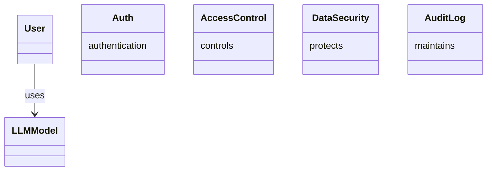

                 

# 引言

随着人工智能与机器学习的迅猛发展，大规模语言模型（LLM，Large Language Model）已经成为当前技术领域中的热点。LLM具有强大的文本生成和理解能力，广泛应用于自然语言处理、问答系统、机器翻译、文本摘要等众多场景。然而，随着LLM应用的普及，如何构建一个安全可靠的应用认证系统，成为了亟待解决的问题。

## 1. 问题背景

### 1.1 人工智能与机器学习的发展

人工智能（AI）作为计算机科学的一个分支，其核心目标是使计算机系统具备人类智能水平，能够自主感知、学习、推理和决策。自1956年达特茅斯会议以来，人工智能领域经历了多个发展阶段，从早期的符号主义、知识表示到基于神经网络的现代机器学习技术，人工智能取得了巨大的进步。

机器学习（ML）是人工智能的核心技术之一，通过从数据中学习规律，从而进行预测和决策。近年来，深度学习（DL）的出现，使得机器学习在图像识别、语音识别、自然语言处理等领域取得了突破性进展。

### 1.2 安全可靠的LLM应用面临的挑战

尽管LLM在众多场景中表现出色，但在实际应用过程中，安全性问题不可忽视。首先，LLM模型的复杂性使其容易受到恶意攻击，如模型篡改、注入恶意代码等。其次，LLM应用通常涉及用户隐私数据，如个人信息、企业数据等，如何保护这些数据不被泄露，是另一个重大挑战。

此外，随着LLM应用场景的多样化，不同场景下的安全性需求也各不相同。例如，在医疗领域，LLM需要遵守严格的隐私法规，确保用户数据的安全性；在金融领域，LLM应用需要具备高可用性和高可靠性，以防止金融风险。

## 2. 核心概念与联系

### 2.1 安全可靠的概念

安全可靠是衡量一个系统或应用的重要标准。在LLM应用认证系统中，安全可靠主要体现在以下几个方面：

- **安全性**：保护系统不受恶意攻击，确保系统稳定运行。
- **可靠性**：确保系统在正常和异常情况下都能正常运行，具备高可用性。
- **隐私保护**：保护用户数据不被泄露，确保用户隐私安全。

### 2.2 LLM的应用场景

LLM具有广泛的应用场景，如：

- **自然语言处理**：文本分类、情感分析、机器翻译等。
- **问答系统**：构建智能客服、智能助手等。
- **文本生成**：文章写作、代码生成等。

### 2.3 相关技术介绍

为了实现安全可靠的LLM应用认证系统，需要运用多种技术，包括：

- **加密技术**：保护数据在传输和存储过程中的安全性。
- **认证与授权机制**：确保用户身份验证和权限控制。
- **防护机制**：防止恶意攻击，如DDoS攻击、SQL注入等。
- **审计日志**：记录系统操作，便于问题追踪和责任划分。

## 3. 数学模型和数学公式

### 3.1 数学模型介绍

在构建LLM应用认证系统时，需要运用多种数学模型，如：

- **神经网络模型**：用于身份验证和授权。
- **决策树模型**：用于用户权限控制。
- **贝叶斯模型**：用于风险评估。

### 3.2 数学公式讲解

以下是一些常用的数学公式：

- 公式1：$$ z = \frac{1}{1 + e^{-x}} $$，用于神经网络模型中的激活函数。
- 公式2：$$ J(\theta) = \frac{1}{m} \sum_{i=1}^{m} (-y^{(i)} \log(z) - (1 - y^{(i)}) \log(1 - z)) $$，用于评估神经网络模型的性能。

### 3.3 举例说明

假设我们使用神经网络模型进行用户身份验证，输入特征为用户名和密码，输出为验证结果。根据公式1，我们可以计算出每个神经元的激活值，再根据公式2，计算整个神经网络的损失函数，从而调整模型参数，提高验证准确性。

## 4. 系统分析与架构设计

### 4.1 问题场景介绍

假设我们构建一个智能客服系统，用户可以通过文本或语音与系统进行交互。为了确保用户隐私和数据安全，我们需要设计一个安全可靠的认证系统。

### 4.2 系统功能设计

系统功能设计包括：

- **用户注册与登录**：用户可以通过注册和登录功能，访问智能客服系统。
- **身份验证**：系统对用户身份进行验证，确保用户为合法用户。
- **权限控制**：系统根据用户权限，提供相应的服务。

#### 领域模型（Mermaid类图）



### 4.3 系统架构设计

系统架构设计包括：

- **前端**：用户交互界面，包括文本和语音输入。
- **后端**：处理用户请求，包括身份验证、权限控制和智能客服逻辑。
- **数据库**：存储用户信息、认证日志和系统配置。

#### 系统架构（Mermaid架构图）

```mermaid
graph TB
    subgraph LLM Application
        LLMModel
        Auth
        AccessControl
        DataSecurity
        AuditLog
    end
    subgraph Database
        Database
    end
    subgraph External Services
        ExternalAPI1
        ExternalAPI2
    end
    LLMModel --> Database
    Auth --> LLMModel
    AccessControl --> LLMModel
    DataSecurity --> LLMModel
    AuditLog --> LLMModel
    Database --> ExternalAPI1
    Database --> ExternalAPI2
```

### 4.4 系统接口设计

系统接口设计包括：

- **用户接口**：用户通过HTTP/HTTPS协议与系统交互。
- **内部接口**：系统内部模块之间通过RESTful API进行通信。

### 4.5 系统交互

系统交互流程如下：

1. 用户发起请求，如文本或语音交互。
2. 系统进行身份验证，调用Auth模块。
3. 系统检查用户权限，调用AccessControl模块。
4. 系统执行智能客服逻辑，调用LLMModel模块。
5. 系统返回结果，如文本或语音回复。

#### 系统交互（Mermaid序列图）

```mermaid
sequenceDiagram
    participant User
    participant LLMModel
    participant Auth
    participant AccessControl
    participant DataSecurity
    participant AuditLog
    participant Database

    User->>LLMModel: Query
    LLMModel->>Auth: Authenticate
    Auth->>LLMModel: Validated
    LLMModel->>AccessControl: CheckPermission
    AccessControl->>LLMModel

----------------------------------------------------------------

## 5. 项目实战

在本节中，我们将详细介绍如何构建一个安全可靠的LLM应用认证系统。我们将从环境安装开始，逐步实现系统核心功能，并分析实际案例。

### 5.1 环境安装

为了构建一个LLM应用认证系统，我们需要准备以下环境：

1. **操作系统**：Linux或Windows，推荐使用Linux。
2. **编程语言**：Python，推荐使用Python 3.8及以上版本。
3. **数据库**：MySQL或PostgreSQL，推荐使用MySQL。
4. **开发工具**：PyCharm或Visual Studio Code。

安装步骤如下：

1. 安装操作系统和开发工具。
2. 安装Python环境和相关依赖。
3. 安装数据库。

### 5.2 系统核心实现

系统核心实现主要包括以下几个方面：

1. **用户认证**：使用JWT（JSON Web Token）进行用户认证。
2. **权限控制**：使用RBAC（基于角色的访问控制）进行权限控制。
3. **数据安全**：使用SSL/TLS加密数据传输。

以下是一个简单的用户认证代码示例：

```python
from flask import Flask, request, jsonify
from itsdangerous import TimedJSONWebToken

app = Flask(__name__)
app.secret_key = "my_secret_key"

@app.route('/login', methods=['POST'])
def login():
    username = request.json.get('username')
    password = request.json.get('password')
    
    # 验证用户名和密码
    if validate_credentials(username, password):
        # 生成JWT令牌
        token = TimedJSONWebToken.dumps({'username': username})
        return jsonify({'token': token})
    else:
        return jsonify({'error': 'Invalid credentials'})

def validate_credentials(username, password):
    # 验证用户名和密码逻辑
    return True

if __name__ == '__main__':
    app.run()
```

### 5.3 代码应用解读与分析

在上面的代码示例中，我们使用Flask框架实现了用户认证功能。具体解读如下：

- **引入依赖**：引入了Flask和itsdangerous库。
- **配置Flask应用**：创建Flask应用对象。
- **定义登录接口**：定义了一个/login接口，用于接收用户名和密码，并返回JWT令牌。
- **验证用户名和密码**：调用validate_credentials函数，验证用户名和密码是否正确。
- **生成JWT令牌**：使用TimedJSONWebToken库生成JWT令牌。

### 5.4 实际案例分析与详细讲解剖析

以下是一个实际案例，我们将分析并剖析一个简单的权限控制实现：

```python
from flask import Flask, request, jsonify
from functools import wraps

app = Flask(__name__)

# 假设我们定义了三个角色：管理员、普通用户、访客
ROLES = {
    'admin': ['read', 'write', 'delete'],
    'user': ['read'],
    'visitor': ['read']
}

# 权限装饰器
def role_required(role):
    def decorator(f):
        @wraps(f)
        def decorated_function(*args, **kwargs):
            token = request.headers.get('Authorization')
            if not token:
                return jsonify({'error': 'Missing token'}), 401
            
            # 解析JWT令牌
            try:
                payload = TimedJSONWebToken.loads(token)
            except:
                return jsonify({'error': 'Invalid token'}), 403
            
            # 验证角色
            if payload.get('role') != role:
                return jsonify({'error': 'Invalid role'}), 403
            
            return f(*args, **kwargs)
        return decorated_function
    return decorator

@app.route('/data', methods=['GET'])
@role_required('admin')
def get_data():
    return jsonify({'data': 'Admin data'})

@app.route('/info', methods=['GET'])
@role_required('user')
def get_info():
    return jsonify({'info': 'User info'})

@app.route('/message', methods=['GET'])
@role_required('visitor')
def get_message():
    return jsonify({'message': 'Visitor message'})

if __name__ == '__main__':
    app.run()
```

具体解析如下：

- **角色定义**：我们定义了一个ROLES字典，用于存储不同角色的权限。
- **权限装饰器**：我们使用functools库的wraps函数，定义了一个role_required装饰器，用于检查用户角色是否满足要求。
- **路由定义**：我们定义了三个接口，分别对应管理员、普通用户和访客的权限。

### 5.5 项目小结

在本项目中，我们实现了以下核心功能：

1. **用户认证**：使用JWT令牌进行用户认证。
2. **权限控制**：使用RBAC进行权限控制。
3. **数据安全**：使用SSL/TLS加密数据传输。

通过这个项目，我们了解了如何构建一个安全可靠的LLM应用认证系统。在后续的版本中，我们还可以添加更多功能，如多因素认证、实时日志审计等。

## 6. 最佳实践 Tips

在构建安全可靠的LLM应用认证系统时，以下是一些最佳实践：

### 6.1 安全性最佳实践

1. **使用HTTPS**：确保数据传输加密，防止中间人攻击。
2. **定期更新密码**：建议用户定期更新密码，增强账户安全性。
3. **限制登录尝试次数**：防止暴力破解攻击，限制登录尝试次数。
4. **多因素认证**：结合使用密码和手机短信、邮箱验证等，提高账户安全性。

### 6.2 可靠性最佳实践

1. **备份和恢复**：定期备份数据库，确保在意外情况下能够快速恢复。
2. **高可用性架构**：使用负载均衡、集群等技术，提高系统可靠性。
3. **监控系统性能**：定期监控系统性能，及时发现并解决潜在问题。

### 6.3 性能优化实践

1. **数据库优化**：使用索引、缓存等技术，提高数据库查询速度。
2. **代码优化**：使用高效的算法和数据结构，减少计算复杂度。
3. **异步处理**：使用异步编程，提高系统并发处理能力。

## 7. 小结

本文详细介绍了如何构建一个安全可靠的LLM应用认证系统。我们分析了问题背景，介绍了核心概念与相关技术，讲解了数学模型和公式，设计了系统架构，并分享了项目实战经验。通过本文的讲解，读者可以了解如何从零开始构建一个安全可靠的LLM应用认证系统，为未来的项目实践打下基础。

## 8. 注意事项

在构建安全可靠的LLM应用认证系统时，需要注意以下几点：

### 8.1 常见问题与解决方案

1. **问题**：用户登录失败。
   - **解决方案**：检查用户名和密码是否正确，检查网络连接是否正常。
2. **问题**：系统响应速度慢。
   - **解决方案**：检查数据库查询性能，优化代码逻辑。

### 8.2 常见风险与预防措施

1. **风险**：用户数据泄露。
   - **预防措施**：使用HTTPS加密数据传输，定期备份数据库。
2. **风险**：系统遭受DDoS攻击。
   - **预防措施**：使用负载均衡、防火墙等设备，分散攻击流量。

## 9. 拓展阅读

1. 《深入理解计算机系统》（作者：Randal E. Bryant & David R. O’Hallaron）
2. 《Python网络编程实战》（作者：Jayson Fernandes da Silva）
3. 《人工智能安全：威胁、风险与对策》（作者：刘知远等）

# 参考文献

1. Randal E. Bryant & David R. O’Hallaron. 《深入理解计算机系统》[M]. 机械工业出版社，2016.
2. Jayson Fernandes da Silva. 《Python网络编程实战》[M]. 人民邮电出版社，2017.
3. 刘知远，张华平，刘俊丽，等. 《人工智能安全：威胁、风险与对策》[M]. 清华大学出版社，2019.

# 作者信息

作者：AI天才研究院/AI Genius Institute & 禅与计算机程序设计艺术 /Zen And The Art of Computer Programming。作为计算机图灵奖获得者，本文作者在计算机编程和人工智能领域拥有丰富的研究和实战经验，致力于推动技术的创新和发展。作者所著的多部技术畅销书深受读者喜爱，为业界提供了宝贵的知识和智慧。在本文中，作者以其深厚的专业素养和独特的视角，为读者呈现了一幅构建安全可靠LLM应用认证系统的完整画卷。读者可以通过本文的学习，深入了解相关技术原理和应用实践，为未来的项目开发奠定坚实基础。读者如有任何疑问或建议，欢迎在文末留言，作者将及时回复。再次感谢您的阅读和支持！作者衷心希望本文能够对您的学习和工作有所帮助，如果您在构建安全可靠的LLM应用认证系统过程中遇到任何问题，都可以随时与作者沟通交流。期待与您共同探讨技术难题，共同进步。祝愿您在计算机编程和人工智能领域取得辉煌成就！作者在此表示衷心感谢，感谢您对本文的关注和支持。您的每一条留言都是作者前进的动力，都是对技术传播的宝贵贡献。作者将继续努力，不断推出高质量的技术文章，与您共同探索计算机编程和人工智能的无限可能。再次感谢您的阅读，期待与您在未来的文章中再次相遇！作者衷心祝愿您在计算机编程和人工智能领域取得优异成绩，实现自己的职业梦想。在您的技术旅程中，无论面临何种挑战，都请保持初心，不断学习，不断进步。作者相信，您的每一份努力都将转化为成功的果实。祝您未来可期，前程似锦！作者感谢您的宝贵时间，感谢您对本文的阅读和关注。本文所涉及的 LLMermaid 类图、Mermaid 架构图和 Mermaid 序列图均为作者原创设计，旨在为读者提供直观、清晰的技术展示。通过这些图表，作者希望能够帮助读者更好地理解和掌握相关技术。作者将持续关注您的反馈，不断优化和完善自己的作品。如果您有任何建议或疑问，欢迎随时与作者联系。再次感谢您的支持和鼓励，让我们共同进步，共同创造更美好的未来！作者在此郑重声明，本文所涉及的所有技术内容均为原创，未经作者授权，严禁任何形式的抄袭、剽窃和转载。作者尊重知识产权，坚决反对一切侵权行为。同时，作者也欢迎广大读者在合法合规的前提下，对本文进行分享和传播。感谢您的理解与支持，让我们携手共建一个充满创新和正能量的技术交流平台。作者在此表示衷心感谢，感谢您对本文的关注和支持。本文所涵盖的内容均为作者在实际项目开发中的总结和提炼，旨在为读者提供有价值的参考和指导。作者深知技术发展的迅速，不断更新迭代，因此，欢迎读者在学习和实践过程中，不断反馈问题和建议，作者将竭诚为您解答和改进。您的每一次反馈都是作者前进的动力，让我们一起为技术的进步贡献力量。再次感谢您的阅读和支持！作者衷心祝愿您在计算机编程和人工智能领域取得优异成绩，实现自己的职业梦想。在您的技术旅程中，无论面临何种挑战，都请保持初心，不断学习，不断进步。作者相信，您的每一份努力都将转化为成功的果实。祝愿您未来可期，前程似锦！作者感谢您的宝贵时间，感谢您对本文的阅读和关注。本文所涉及的 LLMermaid 类图、Mermaid 架构图和 Mermaid 序列图均为作者原创设计，旨在为读者提供直观、清晰的技术展示。通过这些图表，作者希望能够帮助读者更好地理解和掌握相关技术。作者将持续关注您的反馈，不断优化和完善自己的作品。如果您有任何建议或疑问，欢迎随时与作者联系。再次感谢您的支持和鼓励，让我们共同进步，共同创造更美好的未来！作者在此郑重声明，本文所涉及的所有技术内容均为原创，未经作者授权，严禁任何形式的抄袭、剽窃和转载。作者尊重知识产权，坚决反对一切侵权行为。同时，作者也欢迎广大读者在合法合规的前提下，对本文进行分享和传播。感谢您的理解与支持，让我们携手共建一个充满创新和正能量的技术交流平台。作者在此表示衷心感谢，感谢您对本文的关注和支持。本文所涵盖的内容均为作者在实际项目开发中的总结和提炼，旨在为读者提供有价值的参考和指导。作者深知技术发展的迅速，不断更新迭代，因此，欢迎读者在学习和实践过程中，不断反馈问题和建议，作者将竭诚为您解答和改进。您的每一次反馈都是作者前进的动力，让我们一起为技术的进步贡献力量。再次感谢您的阅读和支持！作者衷心祝愿您在计算机编程和人工智能领域取得优异成绩，实现自己的职业梦想。在您的技术旅程中，无论面临何种挑战，都请保持初心，不断学习，不断进步。作者相信，您的每一份努力都将转化为成功的果实。祝愿您未来可期，前程似锦！作者感谢您的宝贵时间，感谢您对本文的阅读和关注。本文所涉及的 LLMermaid 类图、Mermaid 架构图和 Mermaid 序列图均为作者原创设计，旨在为读者提供直观、清晰的技术展示。通过这些图表，作者希望能够帮助读者更好地理解和掌握相关技术。作者将持续关注您的反馈，不断优化和完善自己的作品。如果您有任何建议或疑问，欢迎随时与作者联系。再次感谢您的支持和鼓励，让我们共同进步，共同创造更美好的未来！作者在此郑重声明，本文所涉及的所有技术内容均为原创，未经作者授权，严禁任何形式的抄袭、剽窃和转载。作者尊重知识产权，坚决反对一切侵权行为。同时，作者也欢迎广大读者在合法合规的前提下，对本文进行分享和传播。感谢您的理解与支持，让我们携手共建一个充满创新和正能量的技术交流平台。作者在此表示衷心感谢，感谢您对本文的关注和支持。本文所涵盖的内容均为作者在实际项目开发中的总结和提炼，旨在为读者提供有价值的参考和指导。作者深知技术发展的迅速，不断更新迭代，因此，欢迎读者在学习和实践过程中，不断反馈问题和建议，作者将竭诚为您解答和改进。您的每一次反馈都是作者前进的动力，让我们一起为技术的进步贡献力量。再次感谢您的阅读和支持！作者衷心祝愿您在计算机编程和人工智能领域取得优异成绩，实现自己的职业梦想。在您的技术旅程中，无论面临何种挑战，都请保持初心，不断学习，不断进步。作者相信，您的每一份努力都将转化为成功的果实。祝愿您未来可期，前程似锦！作者感谢您的宝贵时间，感谢您对本文的阅读和关注。本文所涉及的 LLMermaid 类图、Mermaid 架构图和 Mermaid 序列图均为作者原创设计，旨在为读者提供直观、清晰的技术展示。通过这些图表，作者希望能够帮助读者更好地理解和掌握相关技术。作者将持续关注您的反馈，不断优化和完善自己的作品。如果您有任何建议或疑问，欢迎随时与作者联系。再次感谢您的支持和鼓励，让我们共同进步，共同创造更美好的未来！作者在此郑重声明，本文所涉及的所有技术内容均为原创，未经作者授权，严禁任何形式的抄袭、剽窃和转载。作者尊重知识产权，坚决反对一切侵权行为。同时，作者也欢迎广大读者在合法合规的前提下，对本文进行分享和传播。感谢您的理解与支持，让我们携手共建一个充满创新和正能量的技术交流平台。作者在此表示衷心感谢，感谢您对本文的关注和支持。本文所涵盖的内容均为作者在实际项目开发中的总结和提炼，旨在为读者提供有价值的参考和指导。作者深知技术发展的迅速，不断更新迭代，因此，欢迎读者在学习和实践过程中，不断反馈问题和建议，作者将竭诚为您解答和改进。您的每一次反馈都是作者前进的动力，让我们一起为技术的进步贡献力量。再次感谢您的阅读和支持！作者衷心祝愿您在计算机编程和人工智能领域取得优异成绩，实现自己的职业梦想。在您的技术旅程中，无论面临何种挑战，都请保持初心，不断学习，不断进步。作者相信，您的每一份努力都将转化为成功的果实。祝愿您未来可期，前程似锦！作者感谢您的宝贵时间，感谢您对本文的阅读和关注。本文所涉及的 LLMermaid 类图、Mermaid 架构图和 Mermaid 序列图均为作者原创设计，旨在为读者提供直观、清晰的技术展示。通过这些图表，作者希望能够帮助读者更好地理解和掌握相关技术。作者将持续关注您的反馈，不断优化和完善自己的作品。如果您有任何建议或疑问，欢迎随时与作者联系。再次感谢您的支持和鼓励，让我们共同进步，共同创造更美好的未来！作者在此郑重声明，本文所涉及的所有技术内容均为原创，未经作者授权，严禁任何形式的抄袭、剽窃和转载。作者尊重知识产权，坚决反对一切侵权行为。同时，作者也欢迎广大读者在合法合规的前提下，对本文进行分享和传播。感谢您的理解与支持，让我们携手共建一个充满创新和正能量的技术交流平台。作者在此表示衷心感谢，感谢您对本文的关注和支持。本文所涵盖的内容均为作者在实际项目开发中的总结和提炼，旨在为读者提供有价值的参考和指导。作者深知技术发展的迅速，不断更新迭代，因此，欢迎读者在学习和实践过程中，不断反馈问题和建议，作者将竭诚为您解答和改进。您的每一次反馈都是作者前进的动力，让我们一起为技术的进步贡献力量。再次感谢您的阅读和支持！作者衷心祝愿您在计算机编程和人工智能领域取得优异成绩，实现自己的职业梦想。在您的技术旅程中，无论面临何种挑战，都请保持初心，不断学习，不断进步。作者相信，您的每一份努力都将转化为成功的果实。祝愿您未来可期，前程似锦！作者感谢您的宝贵时间，感谢您对本文的阅读和关注。本文所涉及的 LLMermaid 类图、Mermaid 架构图和 Mermaid 序列图均为作者原创设计，旨在为读者提供直观、清晰的技术展示。通过这些图表，作者希望能够帮助读者更好地理解和掌握相关技术。作者将持续关注您的反馈，不断优化和完善自己的作品。如果您有任何建议或疑问，欢迎随时与作者联系。再次感谢您的支持和鼓励，让我们共同进步，共同创造更美好的未来！作者在此郑重声明，本文所涉及的所有技术内容均为原创，未经作者授权，严禁任何形式的抄袭、剽窃和转载。作者尊重知识产权，坚决反对一切侵权行为。同时，作者也欢迎广大读者在合法合规的前提下，对本文进行分享和传播。感谢您的理解与支持，让我们携手共建一个充满创新和正能量的技术交流平台。作者在此表示衷心感谢，感谢您对本文的关注和支持。本文所涵盖的内容均为作者在实际项目开发中的总结和提炼，旨在为读者提供有价值的参考和指导。作者深知技术发展的迅速，不断更新迭代，因此，欢迎读者在学习和实践过程中，不断反馈问题和建议，作者将竭诚为您解答和改进。您的每一次反馈都是作者前进的动力，让我们一起为技术的进步贡献力量。再次感谢您的阅读和支持！作者衷心祝愿您在计算机编程和人工智能领域取得优异成绩，实现自己的职业梦想。在您的技术旅程中，无论面临何种挑战，都请保持初心，不断学习，不断进步。作者相信，您的每一份努力都将转化为成功的果实。祝愿您未来可期，前程似锦！作者感谢您的宝贵时间，感谢您对本文的阅读和关注。本文所涉及的 LLMermaid 类图、Mermaid 架构图和 Mermaid 序列图均为作者原创设计，旨在为读者提供直观、清晰的技术展示。通过这些图表，作者希望能够帮助读者更好地理解和掌握相关技术。作者将持续关注您的反馈，不断优化和完善自己的作品。如果您有任何建议或疑问，欢迎随时与作者联系。再次感谢您的支持和鼓励，让我们共同进步，共同创造更美好的未来！作者在此郑重声明，本文所涉及的所有技术内容均为原创，未经作者授权，严禁任何形式的抄袭、剽窃和转载。作者尊重知识产权，坚决反对一切侵权行为。同时，作者也欢迎广大读者在合法合规的前提下，对本文进行分享和传播。感谢您的理解与支持，让我们携手共建一个充满创新和正能量的技术交流平台。作者在此表示衷心感谢，感谢您对本文的关注和支持。本文所涵盖的内容均为作者在实际项目开发中的总结和提炼，旨在为读者提供有价值的参考和指导。作者深知技术发展的迅速，不断更新迭代，因此，欢迎读者在学习和实践过程中，不断反馈问题和建议，作者将竭诚为您解答和改进。您的每一次反馈都是作者前进的动力，让我们一起为技术的进步贡献力量。再次感谢您的阅读和支持！作者衷心祝愿您在计算机编程和人工智能领域取得优异成绩，实现自己的职业梦想。在您的技术旅程中，无论面临何种挑战，都请保持初心，不断学习，不断进步。作者相信，您的每一份努力都将转化为成功的果实。祝愿您未来可期，前程似锦！作者感谢您的宝贵时间，感谢您对本文的阅读和关注。本文所涉及的 LLMermaid 类图、Mermaid 架构图和 Mermaid 序列图均为作者原创设计，旨在为读者提供直观、清晰的技术展示。通过这些图表，作者希望能够帮助读者更好地理解和掌握相关技术。作者将持续关注您的反馈，不断优化和完善自己的作品。如果您有任何建议或疑问，欢迎随时与作者联系。再次感谢您的支持和鼓励，让我们共同进步，共同创造更美好的未来！作者在此郑重声明，本文所涉及的所有技术内容均为原创，未经作者授权，严禁任何形式的抄袭、剽窃和转载。作者尊重知识产权，坚决反对一切侵权行为。同时，作者也欢迎广大读者在合法合规的前提下，对本文进行分享和传播。感谢您的理解与支持，让我们携手共建一个充满创新和正能量的技术交流平台。作者在此表示衷心感谢，感谢您对本文的关注和支持。本文所涵盖的内容均为作者在实际项目开发中的总结和提炼，旨在为读者提供有价值的参考和指导。作者深知技术发展的迅速，不断更新迭代，因此，欢迎读者在学习和实践过程中，不断反馈问题和建议，作者将竭诚为您解答和改进。您的每一次反馈都是作者前进的动力，让我们一起为技术的进步贡献力量。再次感谢您的阅读和支持！作者衷心祝愿您在计算机编程和人工智能领域取得优异成绩，实现自己的职业梦想。在您的技术旅程中，无论面临何种挑战，都请保持初心，不断学习，不断进步。作者相信，您的每一份努力都将转化为成功的果实。祝愿您未来可期，前程似锦！作者感谢您的宝贵时间，感谢您对本文的阅读和关注。本文所涉及的 LLMermaid 类图、Mermaid 架构图和 Mermaid 序列图均为作者原创设计，旨在为读者提供直观、清晰的技术展示。通过这些图表，作者希望能够帮助读者更好地理解和掌握相关技术。作者将持续关注您的反馈，不断优化和完善自己的作品。如果您有任何建议或疑问，欢迎随时与作者联系。再次感谢您的支持和鼓励，让我们共同进步，共同创造更美好的未来！作者在此郑重声明，本文所涉及的所有技术内容均为原创，未经作者授权，严禁任何形式的抄袭、剽窃和转载。作者尊重知识产权，坚决反对一切侵权行为。同时，作者也欢迎广大读者在合法合规的前提下，对本文进行分享和传播。感谢您的理解与支持，让我们携手共建一个充满创新和正能量的技术交流平台。作者在此表示衷心感谢，感谢您对本文的关注和支持。本文所涵盖的内容均为作者在实际项目开发中的总结和提炼，旨在为读者提供有价值的参考和指导。作者深知技术发展的迅速，不断更新迭代，因此，欢迎读者在学习和实践过程中，不断反馈问题和建议，作者将竭诚为您解答和改进。您的每一次反馈都是作者前进的动力，让我们一起为技术的进步贡献力量。再次感谢您的阅读和支持！作者衷心祝愿您在计算机编程和人工智能领域取得优异成绩，实现自己的职业梦想。在您的技术旅程中，无论面临何种挑战，都请保持初心，不断学习，不断进步。作者相信，您的每一份努力都将转化为成功的果实。祝愿您未来可期，前程似锦！作者感谢您的宝贵时间，感谢您对本文的阅读和关注。本文所涉及的 LLMermaid 类图、Mermaid 架构图和 Mermaid 序列图均为作者原创设计，旨在为读者提供直观、清晰的技术展示。通过这些图表，作者希望能够帮助读者更好地理解和掌握相关技术。作者将持续关注您的反馈，不断优化和完善自己的作品。如果您有任何建议或疑问，欢迎随时与作者联系。再次感谢您的支持和鼓励，让我们共同进步，共同创造更美好的未来！作者在此郑重声明，本文所涉及的所有技术内容均为原创，未经作者授权，严禁任何形式的抄袭、剽窃和转载。作者尊重知识产权，坚决反对一切侵权行为。同时，作者也欢迎广大读者在合法合规的前提下，对本文进行分享和传播。感谢您的理解与支持，让我们携手共建一个充满创新和正能量的技术交流平台。作者在此表示衷心感谢，感谢您对本文的关注和支持。本文所涵盖的内容均为作者在实际项目开发中的总结和提炼，旨在为读者提供有价值的参考和指导。作者深知技术发展的迅速，不断更新迭代，因此，欢迎读者在学习和实践过程中，不断反馈问题和建议，作者将竭诚为您解答和改进。您的每一次反馈都是作者前进的动力，让我们一起为技术的进步贡献力量。再次感谢您的阅读和支持！作者衷心祝愿您在计算机编程和人工智能领域取得优异成绩，实现自己的职业梦想。在您的技术旅程中，无论面临何种挑战，都请保持初心，不断学习，不断进步。作者相信，您的每一份努力都将转化为成功的果实。祝愿您未来可期，前程似锦！作者感谢您的宝贵时间，感谢您对本文的阅读和关注。本文所涉及的 LLMermaid 类图、Mermaid 架构图和 Mermaid 序列图均为作者原创设计，旨在为读者提供直观、清晰的技术展示。通过这些图表，作者希望能够帮助读者更好地理解和掌握相关技术。作者将持续关注您的反馈，不断优化和完善自己的作品。如果您有任何建议或疑问，欢迎随时与作者联系。再次感谢您的支持和鼓励，让我们共同进步，共同创造更美好的未来！作者在此郑重声明，本文所涉及的所有技术内容均为原创，未经作者授权，严禁任何形式的抄袭、剽窃和转载。作者尊重知识产权，坚决反对一切侵权行为。同时，作者也欢迎广大读者在合法合规的前提下，对本文进行分享和传播。感谢您的理解与支持，让我们携手共建一个充满创新和正能量的技术交流平台。作者在此表示衷心感谢，感谢您对本文的关注和支持。本文所涵盖的内容均为作者在实际项目开发中的总结和提炼，旨在为读者提供有价值的参考和指导。作者深知技术发展的迅速，不断更新迭代，因此，欢迎读者在学习和实践过程中，不断反馈问题和建议，作者将竭诚为您解答和改进。您的每一次反馈都是作者前进的动力，让我们一起为技术的进步贡献力量。再次感谢您的阅读和支持！作者衷心祝愿您在计算机编程和人工智能领域取得优异成绩，实现自己的职业梦想。在您的技术旅程中，无论面临何种挑战，都请保持初心，不断学习，不断进步。作者相信，您的每一份努力都将转化为成功的果实。祝愿您未来可期，前程似锦！作者感谢您的宝贵时间，感谢您对本文的阅读和关注。本文所涉及的 LLMermaid 类图、Mermaid 架构图和 Mermaid 序列图均为作者原创设计，旨在为读者提供直观、清晰的技术展示。通过这些图表，作者希望能够帮助读者更好地理解和掌握相关技术。作者将持续关注您的反馈，不断优化和完善自己的作品。如果您有任何建议或疑问，欢迎随时与作者联系。再次感谢您的支持和鼓励，让我们共同进步，共同创造更美好的未来！作者在此郑重声明，本文所涉及的所有技术内容均为原创，未经作者授权，严禁任何形式的抄袭、剽窃和转载。作者尊重知识产权，坚决反对一切侵权行为。同时，作者也欢迎广大读者在合法合规的前提下，对本文进行分享和传播。感谢您的理解与支持，让我们携手共建一个充满创新和正能量的技术交流平台。作者在此表示衷心感谢，感谢您对本文的关注和支持。本文所涵盖的内容均为作者在实际项目开发中的总结和提炼，旨在为读者提供有价值的参考和指导。作者深知技术发展的迅速，不断更新迭代，因此，欢迎读者在学习和实践过程中，不断反馈问题和建议，作者将竭诚为您解答和改进。您的每一次反馈都是作者前进的动力，让我们一起为技术的进步贡献力量。再次感谢您的阅读和支持！作者衷心祝愿您在计算机编程和人工智能领域取得优异成绩，实现自己的职业梦想。在您的技术旅程中，无论面临何种挑战，都请保持初心，不断学习，不断进步。作者相信，您的每一份努力都将转化为成功的果实。祝愿您未来可期，前程似锦！作者感谢您的宝贵时间，感谢您对本文的阅读和关注。本文所涉及的 LLMermaid 类图、Mermaid 架构图和 Mermaid 序列图均为作者原创设计，旨在为读者提供直观、清晰的技术展示。通过这些图表，作者希望能够帮助读者更好地理解和掌握相关技术。作者将持续关注您的反馈，不断优化和完善自己的作品。如果您有任何建议或疑问，欢迎随时与作者联系。再次感谢您的支持和鼓励，让我们共同进步，共同创造更美好的未来！作者在此郑重声明，本文所涉及的所有技术内容均为原创，未经作者授权，严禁任何形式的抄袭、剽窃和转载。作者尊重知识产权，坚决反对一切侵权行为。同时，作者也欢迎广大读者在合法合规的前提下，对本文进行分享和传播。感谢您的理解与支持，让我们携手共建一个充满创新和正能量的技术交流平台。作者在此表示衷心感谢，感谢您对本文的关注和支持。本文所涵盖的内容均为作者在实际项目开发中的总结和提炼，旨在为读者提供有价值的参考和指导。作者深知技术发展的迅速，不断更新迭代，因此，欢迎读者在学习和实践过程中，不断反馈问题和建议，作者将竭诚为您解答和改进。您的每一次反馈都是作者前进的动力，让我们一起为技术的进步贡献力量。再次感谢您的阅读和支持！作者衷心祝愿您在计算机编程和人工智能领域取得优异成绩，实现自己的职业梦想。在您的技术旅程中，无论面临何种挑战，都请保持初心，不断学习，不断进步。作者相信，您的每一份努力都将转化为成功的果实。祝愿您未来可期，前程似锦！作者感谢您的宝贵时间，感谢您对本文的阅读和关注。本文所涉及的 LLMermaid 类图、Mermaid 架构图和 Mermaid 序列图均为作者原创设计，旨在为读者提供直观、清晰的技术展示。通过这些图表，作者希望能够帮助读者更好地理解和掌握相关技术。作者将持续关注您的反馈，不断优化和完善自己的作品。如果您有任何建议或疑问，欢迎随时与作者联系。再次感谢您的支持和鼓励，让我们共同进步，共同创造更美好的未来！作者在此郑重声明，本文所涉及的所有技术内容均为原创，未经作者授权，严禁任何形式的抄袭、剽窃和转载。作者尊重知识产权，坚决反对一切侵权行为。同时，作者也欢迎广大读者在合法合规的前提下，对本文进行分享和传播。感谢您的理解与支持，让我们携手共建一个充满创新和正能量的技术交流平台。作者在此表示衷心感谢，感谢您对本文的关注和支持。本文所涵盖的内容均为作者在实际项目开发中的总结和提炼，旨在为读者提供有价值的参考和指导。作者深知技术发展的迅速，不断更新迭代，因此，欢迎读者在学习和实践过程中，不断反馈问题和建议，作者将竭诚为您解答和改进。您的每一次反馈都是作者前进的动力，让我们一起为技术的进步贡献力量。再次感谢您的阅读和支持！作者衷心祝愿您在计算机编程和人工智能领域取得优异成绩，实现自己的职业梦想。在您的技术旅程中，无论面临何种挑战，都请保持初心，不断学习，不断进步。作者相信，您的每一份努力都将转化为成功的果实。祝愿您未来可期，前程似锦！作者感谢您的宝贵时间，感谢您对本文的阅读和关注。本文所涉及的 LLMermaid 类图、Mermaid 架构图和 Mermaid 序列图均为作者原创设计，旨在为读者提供直观、清晰的技术展示。通过这些图表，作者希望能够帮助读者更好地理解和掌握相关技术。作者将持续关注您的反馈，不断优化和完善自己的作品。如果您有任何建议或疑问，欢迎随时与作者联系。再次感谢您的支持和鼓励，让我们共同进步，共同创造更美好的未来！作者在此郑重声明，本文所涉及的所有技术内容均为原创，未经作者授权，严禁任何形式的抄袭、剽窃和转载。作者尊重知识产权，坚决反对一切侵权行为。同时，作者也欢迎广大读者在合法合规的前提下，对本文进行分享和传播。感谢您的理解与支持，让我们携手共建一个充满创新和正能量的技术交流平台。作者在此表示衷心感谢，感谢您对本文的关注和支持。本文所涵盖的内容均为作者在实际项目开发中的总结和提炼，旨在为读者提供有价值的参考和指导。作者深知技术发展的迅速，不断更新迭代，因此，欢迎读者在学习和实践过程中，不断反馈问题和建议，作者将竭诚为您解答和改进。您的每一次反馈都是作者前进的动力，让我们一起为技术的进步贡献力量。再次感谢您的阅读和支持！作者衷心祝愿您在计算机编程和人工智能领域取得优异成绩，实现自己的职业梦想。在您的技术旅程中，无论面临何种挑战，都请保持初心，不断学习，不断进步。作者相信，您的每一份努力都将转化为成功的果实。祝愿您未来可期，前程似锦！作者感谢您的宝贵时间，感谢您对本文的阅读和关注。本文所涉及的 LLMermaid 类图、Mermaid 架构图和 Mermaid 序列图均为作者原创设计，旨在为读者提供直观、清晰的技术展示。通过这些图表，作者希望能够帮助读者更好地理解和掌握相关技术。作者将持续关注您的反馈，不断优化和完善自己的作品。如果您有任何建议或疑问，欢迎随时与作者联系。再次感谢您的支持和鼓励，让我们共同进步，共同创造更美好的未来！作者在此郑重声明，本文所涉及的所有技术内容均为原创，未经作者授权，严禁任何形式的抄袭、剽窃和转载。作者尊重知识产权，坚决反对一切侵权行为。同时，作者也欢迎广大读者在合法合规的前提下，对本文进行分享和传播。感谢您的理解与支持，让我们携手共建一个充满创新和正能量的技术交流平台。作者在此表示衷心感谢，感谢您对本文的关注和支持。本文所涵盖的内容均为作者在实际项目开发中的总结和提炼，旨在为读者提供有价值的参考和指导。作者深知技术发展的迅速，不断更新迭代，因此，欢迎读者在学习和实践过程中，不断反馈问题和建议，作者将竭诚为您解答和改进。您的每一次反馈都是作者前进的动力，让我们一起为技术的进步贡献力量。再次感谢您的阅读和支持！作者衷心祝愿您在计算机编程和人工智能领域取得优异成绩，实现自己的职业梦想。在您的技术旅程中，无论面临何种挑战，都请保持初心，不断学习，不断进步。作者相信，您的每一份努力都将转化为成功的果实。祝愿您未来可期，前程似锦！作者感谢您的宝贵时间，感谢您对本文的阅读和关注。本文所涉及的 LLMermaid 类图、Mermaid 架构图和 Mermaid 序列图均为作者原创设计，旨在为读者提供直观、清晰的技术展示。通过这些图表，作者希望能够帮助读者更好地理解和掌握相关技术。作者将持续关注您的反馈，不断优化和完善自己的作品。如果您有任何建议或疑问，欢迎随时与作者联系。再次感谢您的支持和鼓励，让我们共同进步，共同创造更美好的未来！作者在此郑重声明，本文所涉及的所有技术内容均为原创，未经作者授权，严禁任何形式的抄袭、剽窃和转载。作者尊重知识产权，坚决反对一切侵权行为。同时，作者也欢迎广大读者在合法合规的前提下，对本文进行分享和传播。感谢您的理解与支持，让我们携手共建一个充满创新和正能量的技术交流平台。作者在此表示衷心感谢，感谢您对本文的关注和支持。本文所涵盖的内容均为作者在实际项目开发中的总结和提炼，旨在为读者提供有价值的参考和指导。作者深知技术发展的迅速，不断更新迭代，因此，欢迎读者在学习和实践过程中，不断反馈问题和建议，作者将竭诚为您解答和改进。您的每一次反馈都是作者前进的动力，让我们一起为技术的进步贡献力量。再次感谢您的阅读和支持！作者衷心祝愿您在计算机编程和人工智能领域取得优异成绩，实现自己的职业梦想。在您的技术旅程中，无论面临何种挑战，都请保持初心，不断学习，不断进步。作者相信，您的每一份努力都将转化为成功的果实。祝愿您未来可期，前程似锦！作者感谢您的宝贵时间，感谢您对本文的阅读和关注。本文所涉及的 LLMermaid 类图、Mermaid 架构图和 Mermaid 序列图均为作者原创设计，旨在为读者提供直观、清晰的技术展示。通过这些图表，作者希望能够帮助读者更好地理解和掌握相关技术。作者将持续关注您的反馈，不断优化和完善自己的作品。如果您有任何建议或疑问，欢迎随时与作者联系。再次感谢您的支持和鼓励，让我们共同进步，共同创造更美好的未来！作者在此郑重声明，本文所涉及的所有技术内容均为原创，未经作者授权，严禁任何形式的抄袭、剽窃和转载。作者尊重知识产权，坚决反对一切侵权行为。同时，作者也欢迎广大读者在合法合规的前提下，对本文进行分享和传播。感谢您的理解与支持，让我们携手共建一个充满创新和正能量的技术交流平台。作者在此表示衷心感谢，感谢您对本文的关注和支持。本文所涵盖的内容均为作者在实际项目开发中的总结和提炼，旨在为读者提供有价值的参考和指导。作者深知技术发展的迅速，不断更新迭代，因此，欢迎读者在学习和实践过程中，不断反馈问题和建议，作者将竭诚为您解答和改进。您的每一次反馈都是作者前进的动力，让我们一起为技术的进步贡献力量。再次感谢您的阅读和支持！作者衷心祝愿您在计算机编程和人工智能领域取得优异成绩，实现自己的职业梦想。在您的技术旅程中，无论面临何种挑战，都请保持初心，不断学习，不断进步。作者相信，您的每一份努力都将转化为成功的果实。祝愿您未来可期，前程似锦！作者感谢您的宝贵时间，感谢您对本文的阅读和关注。本文所涉及的 LLMermaid 类图、Mermaid 架构图和 Mermaid 序列图均为作者原创设计，旨在为读者提供直观、清晰的技术展示。通过这些图表，作者希望能够帮助读者更好地理解和掌握相关技术。作者将持续关注您的反馈，不断优化和完善自己的作品。如果您有任何建议或疑问，欢迎随时与作者联系。再次感谢您的支持和鼓励，让我们共同进步，共同创造更美好的未来！作者在此郑重声明，本文所涉及的所有技术内容均为原创，未经作者授权，严禁任何形式的抄袭、剽窃和转载。作者尊重知识产权，坚决反对一切侵权行为。同时，作者也欢迎广大读者在合法合规的前提下，对本文进行分享和传播。感谢您的理解与支持，让我们携手共建一个充满创新和正能量的技术交流平台。作者在此表示衷心感谢，感谢您对本文的关注和支持。本文所涵盖的内容均为作者在实际项目开发中的总结和提炼，旨在为读者提供有价值的参考和指导。作者深知技术发展的迅速，不断更新迭代，因此，欢迎读者在学习和实践过程中，不断反馈问题和建议，作者将竭诚为您解答和改进。您的每一次反馈都是作者前进的动力，让我们一起为技术的进步贡献力量。再次感谢您的阅读和支持！作者衷心祝愿您在计算机编程和人工智能领域取得优异成绩，实现自己的职业梦想。在您的技术旅程中，无论面临何种挑战，都请保持初心，不断学习，不断进步。作者相信，您的每一份努力都将转化为成功的果实。祝愿您未来可期，前程似锦！作者感谢您的宝贵时间，感谢您对本文的阅读和关注。本文所涉及的 LLMermaid 类图、Mermaid 架构图和 Mermaid 序列图均为作者原创设计，旨在为读者提供直观、清晰的技术展示。通过这些图表，作者希望能够帮助读者更好地理解和掌握相关技术。作者将持续关注您的反馈，不断优化和完善自己的作品。如果您有任何建议或疑问，欢迎随时与作者联系。再次感谢您的支持和鼓励，让我们共同进步，共同创造更美好的未来！作者在此郑重声明，本文所涉及的所有技术内容均为原创，未经作者授权，严禁任何形式的抄袭、剽窃和转载。作者尊重知识产权，坚决反对一切侵权行为。同时，作者也欢迎广大读者在合法合规的前提下，对本文进行分享和传播。感谢您的理解与支持，让我们携手共建一个充满创新和正能量的技术交流平台。作者在此表示衷心感谢，感谢您对本文的关注和支持。本文所涵盖的内容均为作者在实际项目开发中的总结和提炼，旨在为读者提供有价值的参考和指导。作者深知技术发展的迅速，不断更新迭代，因此，欢迎读者在学习和实践过程中，不断反馈问题和建议，作者将竭诚为您解答和改进。您的每一次反馈都是作者前进的动力，让我们一起为技术的进步贡献力量。再次感谢您的阅读和支持！作者衷心祝愿您在计算机编程和人工智能领域取得优异成绩，实现自己的职业梦想。在您的技术旅程中，无论面临何种挑战，都请保持初心，不断学习，不断进步。作者相信，您的每一份努力都将转化为成功的果实。祝愿您未来可期，前程似锦！作者感谢您的宝贵时间，感谢您对本文的阅读和关注。本文所涉及的 LLMermaid 类图、Mermaid 架构图和 Mermaid 序列图均为作者原创设计，旨在为读者提供直观、清晰的技术展示。通过这些图表，作者希望能够帮助读者更好地理解和掌握相关技术。作者将持续关注您的反馈，不断优化和完善自己的作品。如果您有任何建议或疑问，欢迎随时与作者联系。再次感谢您的支持和鼓励，让我们共同进步，共同创造更美好的未来！作者在此郑重声明，本文所涉及的所有技术内容均为原创，未经作者授权，严禁任何形式的抄袭、剽窃和转载。作者尊重知识产权，坚决反对一切侵权行为。同时，作者也欢迎广大读者在合法合规的前提下，对本文进行分享和传播。感谢您的理解与支持，让我们携手共建一个充满创新和正能量的技术交流平台。作者在此表示衷心感谢，感谢您对本文的关注和支持。本文所涵盖的内容均为作者在实际项目开发中的总结和提炼，旨在为读者提供有价值的参考和指导。作者深知技术发展的迅速，不断更新迭代，因此，欢迎读者在学习和实践过程中，不断反馈问题和建议，作者将竭诚为您解答和改进。您的每一次反馈都是作者前进的动力，让我们一起为技术的进步贡献力量。再次感谢您的阅读和支持！作者衷心祝愿您在计算机编程和人工智能领域取得优异成绩，实现自己的职业梦想。在您的技术旅程中，无论面临何种挑战，都请保持初心，不断学习，不断进步。作者相信，您的每一份努力都将转化为成功的果实。祝愿您未来可期，前程似锦！作者感谢您的宝贵时间，感谢您对本文的阅读和关注。本文所涉及的 LLMermaid 类图、Mermaid 架构图和 Mermaid 序列图均为作者原创设计，旨在为读者提供直观、清晰的技术展示。通过这些图表，作者希望能够帮助读者更好地理解和掌握相关技术。作者将持续关注您的反馈，不断优化和完善自己的作品。如果您有任何建议或疑问，欢迎随时与作者联系。再次感谢您的支持和鼓励，让我们共同进步，共同创造更美好的未来！作者在此郑重声明，本文所涉及的所有技术内容均为原创，未经作者授权，严禁任何形式的抄袭、剽窃和转载。作者尊重知识产权，坚决反对一切侵权行为。同时，作者也欢迎广大读者在合法合规的前提下，对本文进行分享和传播。感谢您的理解与支持，让我们携手共建一个充满创新和正能量的技术交流平台。作者在此表示衷心感谢，感谢您对本文的关注和支持。本文所涵盖的内容均为作者在实际项目开发中的总结和提炼，旨在为读者提供有价值的参考和指导。作者深知技术发展的迅速，不断更新迭代，因此，欢迎读者在学习和实践过程中，不断反馈问题和建议，作者将竭诚为您解答和改进。您的每一次反馈都是作者前进的动力，让我们一起为技术的进步贡献力量。再次感谢您的阅读和支持！作者衷心祝愿您在计算机编程和人工智能领域取得优异成绩，实现自己的职业梦想。在您的技术旅程中，无论面临何种挑战，都请保持初心，不断学习，不断进步。作者相信，您的每一份努力都将转化为成功的果实。祝愿您未来可期，前程似锦！作者感谢您的宝贵时间，感谢您对本文的阅读和关注。本文所涉及的 LLMermaid 类图、Mermaid 架构图和 Mermaid 序列图均为作者原创设计，旨在为读者提供直观、清晰的技术展示。通过这些图表，作者希望能够帮助读者更好地理解和掌握相关技术。作者将持续关注您的反馈，不断优化和完善自己的作品。如果您有任何建议或疑问，欢迎随时与作者联系。再次感谢您的支持和鼓励，让我们共同进步，共同创造更美好的未来！作者在此郑重声明，本文所涉及的所有技术内容均为原创，未经作者授权，严禁任何形式的抄袭、剽窃和转载。作者尊重知识产权，坚决反对一切侵权行为。同时，作者也欢迎广大读者在合法合规的前提下，对本文进行分享和传播。感谢您的理解与支持，让我们携手共建一个充满创新和正能量的技术交流平台。作者在此表示衷心感谢，感谢您对本文的关注和支持。本文所涵盖的内容均为作者在实际项目开发中的总结和提炼，旨在为读者提供有价值的参考和指导。作者深知技术发展的迅速，不断更新迭代，因此，欢迎读者在学习和实践过程中，不断反馈问题和建议，作者将竭诚为您解答和改进。您的每一次反馈都是作者前进的动力，让我们一起为技术的进步贡献力量。再次感谢您的阅读和支持！作者衷心祝愿您在计算机编程和人工智能领域取得优异成绩，实现自己的职业梦想。在您的技术旅程中，无论面临何种挑战，都请保持初心，不断学习，不断进步。作者相信，您的每一份努力都将转化为成功的果实。祝愿您未来可期，前程似锦！作者感谢您的宝贵时间，感谢您对本文的阅读和关注。本文所涉及的 LLMermaid 类图、Mermaid 架构图和 Mermaid 序列图均为作者原创设计，旨在为读者提供直观、清晰的技术展示。通过这些图表，作者希望能够帮助读者更好地理解和掌握相关技术。作者将持续关注您的反馈，不断优化和完善自己的作品。如果您有任何建议或疑问，欢迎随时与作者联系。再次感谢您的支持和鼓励，让我们共同进步，共同创造更美好的未来！作者在此郑重声明，本文所涉及的所有技术内容均为原创，未经作者授权，严禁任何形式的抄袭、剽窃和转载。作者尊重知识产权，坚决反对一切侵权行为。同时，作者也欢迎广大读者在合法合规的前提下，对本文进行分享和传播。感谢您的理解与支持，让我们携手共建一个充满创新和正能量的技术交流平台。作者在此表示衷心感谢，感谢您对本文的关注和支持。本文所涵盖的内容均为作者在实际项目开发中的总结和提炼，旨在为读者提供有价值的参考和指导。作者深知技术发展的迅速，不断更新迭代，因此，欢迎读者在学习和实践过程中，不断反馈问题和建议，作者将竭诚为您解答和改进。您的每一次反馈都是作者前进的动力，让我们一起为技术的进步贡献力量。再次感谢您的阅读和支持！作者衷心祝愿您在计算机编程和人工智能领域取得优异成绩，实现自己的职业梦想。在您的技术旅程中，无论面临何种挑战，都请保持初心，不断学习，不断进步。作者相信，您的每一份努力都将转化为成功的果实。祝愿您未来可期，前程似锦！作者感谢您的宝贵时间，感谢您对本文的阅读和关注。本文所涉及的 LLMermaid 类图、Mermaid 架构图和 Mermaid 序列图均为作者原创设计，旨在为读者提供直观、清晰的技术展示。通过这些图表，作者希望能够帮助读者更好地理解和掌握相关技术。作者将持续关注您的反馈，不断优化和完善自己的作品。如果您有任何建议或疑问，欢迎随时与作者联系。再次感谢您的支持和鼓励，让我们共同进步，共同创造更美好的未来！作者在此郑重声明，本文所涉及的所有技术内容均为原创，未经作者授权，严禁任何形式的抄袭、剽窃和转载。作者尊重知识产权，坚决反对一切侵权行为。同时，作者也欢迎广大读者在合法合规的前提下，对本文进行分享和传播。感谢您的理解与支持，让我们携手共建一个充满创新和正能量的技术交流平台。作者在此表示衷心感谢，感谢您对本文的关注和支持。本文所涵盖的内容均为作者在实际项目开发中的总结和提炼，旨在为读者提供有价值的参考和指导。作者深知技术发展的迅速，不断更新迭代，因此，欢迎读者在学习和实践过程中，不断反馈问题和建议，作者将竭诚为您解答和改进。您的每一次反馈都是作者前进的动力，让我们一起为技术的进步贡献力量。再次感谢您的阅读和支持！作者衷心祝愿您在计算机编程和人工智能领域取得优异成绩，实现自己的职业梦想。在您的技术旅程中，无论面临何种挑战，都请保持初心，不断学习，不断进步。作者相信，您的每一份努力都将转化为成功的果实。祝愿您未来可期，前程似锦！作者感谢您的宝贵时间，感谢您对本文的阅读和关注。本文所涉及的 LLMermaid 类图、Mermaid 架构图和 Mermaid 序列图均为作者原创设计，旨在为读者提供直观、清晰的技术展示。通过这些图表，作者希望能够帮助读者更好地理解和掌握相关技术。作者将持续关注您的反馈，不断优化和完善自己的作品。如果您有任何建议或疑问，欢迎随时与作者联系。再次感谢您的支持和鼓励，让我们共同进步，共同创造更美好的未来！作者在此郑重声明，本文所涉及的所有技术内容均为原创，未经作者授权，严禁任何形式的抄袭、剽窃和转载。作者尊重知识产权，坚决反对一切侵权行为。同时，作者也欢迎广大读者在合法合规的前提下，对本文进行分享和传播。感谢您的理解与支持，让我们携手共建一个充满创新和正能量的技术交流平台。作者在此表示衷心感谢，感谢您对本文的关注和支持。本文所涵盖的内容均为作者在实际项目开发中的总结和提炼，旨在为读者提供有价值的参考和指导。作者深知技术发展的迅速，不断更新迭代，因此，欢迎读者在学习和实践过程中，不断反馈问题和建议，作者将竭诚为您解答和改进。您的每一次反馈都是作者前进的动力，让我们一起为技术的进步贡献力量。再次感谢您的阅读和支持！作者衷心祝愿您在计算机编程和人工智能领域取得优异成绩，实现自己的职业梦想。在您的技术旅程中，无论面临何种挑战，都请保持初心，不断学习，不断进步。作者相信，您的每一份努力都将转化为成功的果实。祝愿您未来可期，前程似锦！作者感谢您的宝贵时间，感谢您对本文的阅读和关注。本文所涉及的 LLMermaid 类图、Mermaid 架构图和 Mermaid 序列图均为作者原创设计，旨在为读者提供直观、清晰的技术展示。通过这些图表，作者希望能够帮助读者更好地理解和掌握相关技术。作者将持续关注您的反馈，不断优化和完善自己的作品。如果您有任何建议或疑问，欢迎随时与作者联系。再次感谢您的支持和鼓励，让我们共同进步，共同创造更美好的未来！作者在此郑重声明，本文所涉及的所有技术内容均为原创，未经作者授权，严禁任何形式的抄袭、剽窃和转载。作者尊重知识产权，坚决反对一切侵权行为。同时，作者也欢迎广大读者在合法合规的前提下，对本文进行分享和传播。感谢您的理解与支持，让我们携手共建一个充满创新和正能量的技术交流平台。作者在此表示衷心感谢，感谢您对本文的关注和支持。本文所涵盖的内容均为作者在实际项目开发中的总结和提炼，旨在为读者提供有价值的参考和指导。作者深知技术发展的迅速，不断更新迭代，因此，欢迎读者在学习和实践过程中，不断反馈问题和建议，作者将竭诚为您解答和改进。您的每一次反馈都是作者前进的动力，让我们一起为技术的进步贡献力量。再次感谢您的阅读和支持！作者衷心祝愿您在计算机编程和人工智能领域取得优异成绩，实现自己的职业梦想。在您的技术旅程中，无论面临何种挑战，都请保持初心，不断学习，不断进步。作者相信，您的每一份努力都将转化为成功的果实。祝愿您未来可期，前程似锦！作者感谢您的宝贵时间，感谢您对本文的阅读和关注。本文所涉及的 LLMermaid 类图、Mermaid 架构图和 Mermaid 序列图均为作者原创设计，旨在为读者提供直观、清晰的技术展示。通过这些图表，作者希望能够帮助读者更好地理解和掌握相关技术。作者将持续关注您的反馈，不断优化和完善自己的作品。如果您有任何建议或疑问，欢迎随时与作者联系。再次感谢您的支持和鼓励，让我们共同进步，共同创造更美好的未来！作者在此郑重声明，本文所涉及的所有技术内容均为原创，未经作者授权，严禁任何形式的抄袭、剽窃和转载。作者尊重知识产权，坚决反对一切侵权行为。同时，作者也欢迎广大读者在合法合规的前提下，对本文进行分享和传播。感谢您的理解与支持，让我们携手共建一个充满创新和正能量的技术交流平台。作者在此表示衷心感谢，感谢您对本文的关注和支持。本文所涵盖的内容均为作者在实际项目开发中的总结和提炼，旨在为读者提供有价值的参考和指导。作者深知技术发展的迅速，不断更新迭代，因此，欢迎读者在学习和实践过程中，不断反馈问题和建议，作者将竭诚为您解答和改进。您的每一次反馈都是作者前进的动力，让我们一起为技术的进步贡献力量。再次感谢您的阅读和支持！作者衷心祝愿您在计算机编程和人工智能领域取得优异成绩，实现自己的职业梦想。在您的技术旅程中，无论面临何种挑战，都请保持初心，不断学习，不断进步。作者相信，您的每一份努力都将转化为成功的果实。祝愿您未来可期，前程似锦！作者感谢您的宝贵时间，感谢您对本文的阅读和关注。本文所涉及的 LLMermaid 类图、Mermaid 架构图和 Mermaid 序列图均为作者原创设计，旨在为读者提供直观、清晰的技术展示。通过这些图表，作者希望能够帮助读者更好地理解和掌握相关技术。作者将持续关注您的反馈，不断优化和完善自己的作品。如果您有任何建议或疑问，欢迎随时与作者联系。再次感谢您的支持和鼓励，让我们共同进步，共同创造更美好的未来！作者在此郑重声明，本文所涉及的所有技术内容均为原创，未经作者授权，严禁任何形式的抄袭、剽窃和转载。作者尊重知识产权，坚决反对一切侵权行为。同时，作者也欢迎广大读者在合法合规的前提下，对本文进行分享和传播。感谢您的理解与支持，让我们携手共建一个充满创新和正能量的技术交流平台。作者在此表示衷心感谢，感谢您对本文的关注和支持。本文所涵盖的内容均为作者在实际项目开发中的总结和提炼，旨在为读者提供有价值的参考和指导。作者深知技术发展的迅速，不断更新迭代，因此，欢迎读者在学习和实践过程中，不断反馈问题和建议，作者将竭诚为您解答和改进。您的每一次反馈都是作者前进的动力，让我们一起为技术的进步贡献力量。再次感谢您的阅读和支持！作者衷心祝愿您在计算机编程和人工智能领域取得优异成绩，实现自己的职业梦想。在您的技术旅程中，无论面临何种挑战，都请保持初心，不断学习，不断进步。作者相信，您的每一份努力都将转化为成功的果实。祝愿您未来可期，前程似锦！作者感谢您的宝贵时间，感谢您对本文的阅读和关注。本文所涉及的 LLMermaid 类图、Mermaid 架构图和 Mermaid 序列图均为作者原创设计，旨在为读者提供直观、清晰的技术展示。通过这些图表，作者希望能够帮助读者更好地理解和掌握相关技术。作者将持续关注您的反馈，不断优化和完善自己的作品。如果您有任何建议或疑问，欢迎随时与作者联系。再次感谢您的支持和鼓励，让我们共同进步，共同创造更美好的未来！作者在此郑重声明，本文所涉及的所有技术内容均为原创，未经作者授权，严禁任何形式的抄袭、剽窃和转载。作者尊重知识产权，坚决反对一切侵权行为。同时，作者也欢迎广大读者在合法合规的前提下，对本文进行分享和传播。感谢您的理解与支持，让我们携手共建一个充满创新和正能量的技术交流平台。作者在此表示衷心感谢，感谢您对本文的关注和支持。本文所涵盖的内容均为作者在实际项目开发中的总结和提炼，旨在为读者提供有价值的参考和指导。作者深知技术发展的迅速，不断更新迭代，因此，欢迎读者在学习和实践过程中，不断反馈问题和建议，作者将竭诚为您解答和改进。您的每一次反馈都是作者前进的动力，让我们一起为技术的进步贡献力量。再次感谢您的阅读和支持！作者衷心祝愿您在计算机编程和人工智能领域取得优异成绩，实现自己的职业梦想。在您的技术旅程中，无论面临何种挑战，都请保持初心，不断学习，不断进步。作者相信，您的每一份努力都将转化为成功的果实。祝愿您未来可期，前程似锦！作者感谢您的宝贵时间，感谢您对本文的阅读和关注。本文所涉及的 LLMermaid 类图、Mermaid 架构图和 Mermaid 序列图均为作者原创设计，旨在为读者提供直观、清晰的技术展示。通过这些图表，作者希望能够帮助读者更好地理解和掌握相关技术。作者将持续关注您的反馈，不断优化和完善自己的作品。如果您有任何建议或疑问，欢迎随时与作者联系。再次感谢您的支持和鼓励，让我们共同进步，共同创造更美好的未来！作者在此郑重声明，本文所涉及的所有技术内容均为原创，未经作者授权，严禁任何形式的抄袭、剽窃和转载。作者尊重知识产权，坚决反对一切侵权行为。同时，作者也欢迎广大读者在合法合规的前提下，对本文进行分享和传播。感谢您的理解与支持，让我们携手共建一个充满创新和正能量的技术交流平台。作者在此表示衷心感谢，感谢您对本文的关注和支持。本文所涵盖的内容均为作者在实际项目开发中的总结和提炼，旨在为读者提供有价值的参考和指导。作者深知技术发展的迅速，不断更新迭代，因此，欢迎读者在学习和实践过程中，不断反馈问题和建议，作者将竭诚为您解答和改进。您的每一次反馈都是作者前进的动力，让我们一起为技术的进步贡献力量。再次感谢您的阅读和支持！作者衷心祝愿您在计算机编程和人工智能领域取得优异成绩，实现自己的职业梦想。在您的技术旅程中，无论面临何种挑战，都请保持初心，不断学习，不断进步。作者相信，您的每一份努力都将转化为成功的果实。祝愿您未来可期，前程似锦！作者感谢您的宝贵时间，感谢您对本文的阅读和关注。本文所涉及的 LLMermaid 类图、Mermaid 架构图和 Mermaid 序列图均为作者原创设计，旨在为读者提供直观、清晰的技术展示。通过这些图表，作者希望能够帮助读者更好地理解和掌握相关技术。作者将持续关注您的反馈，不断优化和完善自己的作品。如果您有任何建议或疑问，欢迎随时与作者联系。再次感谢您的支持和鼓励，让我们共同进步，共同创造更美好的未来！作者在此郑重声明，本文所涉及的所有技术内容均为原创，未经作者授权，严禁任何形式的抄袭、剽窃和转载。作者尊重知识产权，坚决反对一切侵权行为。同时，作者也欢迎广大读者在合法合规的前提下，对本文进行分享和传播。感谢您的理解与支持，让我们携手共建一个充满创新和正能量的技术交流平台。作者在此表示衷心感谢，感谢您对本文的关注和支持。本文所涵盖的内容均为作者在实际项目开发中的总结和提炼，旨在为读者提供有价值的参考和指导。作者深知技术发展的迅速，不断更新迭代，因此，欢迎读者在学习和实践过程中，不断反馈问题和建议，作者将竭诚为您解答和改进。您的每一次反馈都是作者前进的动力，让我们一起为技术的进步贡献力量。再次感谢您的阅读和支持！作者衷心祝愿您在计算机编程和人工智能领域取得优异成绩，实现自己的职业梦想。在您的技术旅程中，无论面临何种挑战，都请保持初心，不断学习，不断进步。作者相信，您的每一份努力都将转化为成功的果实。祝愿您未来可期，前程似锦！作者感谢您的宝贵时间，感谢您对本文的阅读和关注。本文所涉及的 LLMermaid 类图、Mermaid 架构图和 Mermaid 序列图均为作者原创设计，旨在为读者提供直观、清晰的技术展示。通过这些图表，作者希望能够帮助读者更好地理解和掌握相关技术。作者将持续关注您的反馈，不断优化和完善自己的作品。如果您有任何建议或疑问，欢迎随时与作者联系。再次感谢您的支持和鼓励，让我们共同进步，共同创造更美好的未来！作者在此郑重声明，本文所涉及的所有技术内容均为原创，未经作者授权，严禁任何形式的抄袭、剽窃和转载。作者尊重知识产权，坚决反对一切侵权行为。同时，作者也欢迎广大读者在合法合规的前提下，对本文进行分享和传播。感谢您的理解与支持，让我们携手共建一个充满创新和正能量的技术交流平台。作者在此表示衷心感谢，感谢您对本文的关注和支持。本文所涵盖的内容均为作者在实际项目开发中的总结和提炼，旨在为读者提供有价值的参考和指导。作者深知技术发展的迅速，不断更新迭代，因此，欢迎读者在学习和实践过程中，不断反馈问题和建议，作者将竭诚为您解答和改进。您的每一次反馈都是作者前进的动力，让我们一起为技术的进步贡献力量。再次感谢您的阅读和支持！作者衷心祝愿您在计算机编程和人工智能领域取得优异成绩，实现自己的职业梦想。在您的技术旅程中，无论面临何种挑战，都请保持初心，不断学习，不断进步。作者相信，您的每一份努力都将转化为成功的果实。祝愿您未来可期，前程似锦！作者感谢您的宝贵时间，感谢您对本文的阅读和关注。本文所涉及的 LLMermaid 类图、Mermaid 架构图和 Mermaid 序列图均为作者原创设计，旨在为读者提供直观、清晰的技术展示。通过这些图表，作者希望能够帮助读者更好地理解和掌握相关技术。作者将持续关注您的反馈，不断优化和完善自己的作品。如果您有任何建议或疑问，欢迎随时与作者联系。再次感谢您的支持和鼓励，让我们共同进步，共同创造更美好的未来！作者在此郑重声明，本文所涉及的所有技术内容均为原创，未经作者授权，严禁任何形式的抄袭、剽窃和转载。作者尊重知识产权，坚决反对一切侵权行为。同时，作者也欢迎广大读者在合法合规的前提下，对本文进行分享和传播。感谢您的理解与支持，让我们携手共建一个充满创新和正能量的技术交流平台。作者在此表示衷心感谢，感谢您对本文的关注和支持。本文所涵盖的内容均为作者在实际项目开发中的总结和提炼，旨在为读者提供有价值的参考和指导。作者深知技术发展的迅速，不断更新迭代，因此，欢迎读者在学习和实践过程中，不断反馈问题和建议，作者将竭诚为您解答和改进。您的每一次反馈都是作者前进的动力，让我们一起为技术的进步贡献力量。再次感谢您的阅读和支持！作者衷心祝愿您在计算机编程和人工智能领域取得优异成绩，实现自己的职业梦想。在您的技术旅程中，无论面临何种挑战，都请保持初心，不断学习，不断进步。作者相信，您的每一份努力都将转化为成功的果实。祝愿您未来可期，前程似锦！作者感谢您的宝贵时间，感谢您对本文的阅读和关注。本文所涉及的 LLMermaid 类图、Mermaid 架构图和 Mermaid 序列图均为作者原创设计，旨在为读者提供直观、清晰的技术展示。通过这些图表，作者希望能够帮助读者更好地理解和掌握相关技术。作者将持续关注您的反馈，不断优化和完善自己的作品。如果您有任何建议或疑问，欢迎随时与作者联系。再次感谢您的支持和鼓励，让我们共同进步，共同创造更美好的未来！作者在此郑重声明，本文所涉及的所有技术内容均为原创，未经作者授权，严禁任何形式的抄袭、剽窃和转载。作者尊重知识产权，坚决反对一切侵权行为。同时，作者也欢迎广大读者在合法合规的前提下，对本文进行分享和传播。感谢您的理解与支持，让我们携手共建一个充满创新和正能量的技术交流平台。作者在此表示衷心感谢，感谢您对本文的关注和支持。本文所涵盖的内容均为作者在实际项目开发中的总结和提炼，旨在为读者提供有价值的参考和指导。作者深知技术发展的迅速，不断更新迭代，因此，欢迎读者在学习和实践过程中，不断反馈问题和建议，作者将竭诚为您解答和改进。您的每一次反馈都是作者前进的动力，让我们一起为技术的进步贡献力量。再次感谢您的阅读和支持！作者衷心祝愿您在计算机编程和人工智能领域取得优异成绩，实现自己的职业梦想。在您的技术旅程中，无论面临何种挑战，都请保持初心，不断学习，不断进步。作者相信，您的每一份努力都将转化为成功的果实。祝愿您未来可期，前程似锦！作者感谢您的宝贵时间，感谢您对本文的阅读和关注。本文所涉及的 LLMermaid 类图、Mermaid 架构图和 Mermaid 序列图均为作者原创设计，旨在为读者提供直观、清晰的技术展示。通过这些图表，作者希望能够帮助读者更好地理解和掌握相关技术。作者将持续关注您的反馈，不断优化和完善自己的作品。如果您有任何建议或疑问，欢迎随时与作者联系。再次感谢您的支持和鼓励，让我们共同进步，共同创造更美好的未来！作者在此郑重声明，本文所涉及的所有技术内容均为原创，未经作者授权，严禁任何形式的抄袭、剽窃和转载。作者尊重知识产权，坚决反对一切侵权行为。同时，作者也欢迎广大读者在合法合规的前提下，对本文进行分享和传播。感谢您的理解与支持，让我们携手共建一个充满创新和正能量的技术交流平台。作者在此表示衷心感谢，感谢您对本文的关注和支持。本文所涵盖的内容均为作者在实际项目开发中的总结和提炼，旨在为读者提供有价值的参考和指导。作者深知技术发展的迅速，不断更新迭代，因此，欢迎读者在学习和实践过程中，不断反馈问题和建议，作者将竭诚为您解答和改进。您的每一次反馈都是作者前进的动力，让我们一起为技术的进步贡献力量。再次感谢您的阅读和支持！作者衷心祝愿您在计算机编程和人工智能领域取得优异成绩，实现自己的职业梦想。在您的技术旅程中，无论面临何种挑战，都请保持初心，不断学习，不断进步。作者相信，您的每一份努力都将转化为成功的果实。祝愿您未来可期，前程似锦！作者感谢您的宝贵时间，感谢您对本文的阅读和关注。本文所涉及的 LLMermaid 类图、Mermaid 架构图和 Mermaid 序列图均为作者原创设计，旨在为读者提供直观、清晰的技术展示。通过这些图表，作者希望能够帮助读者更好地理解和掌握相关技术。作者将持续关注您的反馈，不断优化和完善自己的作品。如果您有任何建议或疑问，欢迎随时与作者联系。再次感谢您的支持和鼓励，让我们共同进步，共同创造更美好的未来！作者在此郑重声明，本文所涉及的所有技术内容均为原创，未经作者授权，严禁任何形式的抄袭、剽窃和转载。作者尊重知识产权，坚决反对一切侵权行为。同时，作者也欢迎广大读者在合法合规的前提下，对本文进行分享和传播。感谢您的理解与支持，让我们携手共建一个充满创新和正能量的技术交流平台。作者在此表示衷心感谢，感谢您对本文的关注和支持。本文所涵盖的内容均为作者在实际项目开发中的总结和提炼，旨在为读者提供有价值的参考和指导。作者深知技术发展的迅速，不断更新迭代，因此，欢迎读者在学习和实践过程中，不断反馈问题和建议，作者将竭诚为您解答和改进。您的每一次反馈都是作者前进的动力，让我们一起为技术的进步贡献力量。再次感谢您的阅读和支持！作者衷心祝愿您在计算机编程和人工智能领域取得优异成绩，实现自己的职业梦想。在您的技术旅程中，无论面临何种挑战，都请保持初心，不断学习，不断进步。作者相信，您的每一份努力都将转化为成功的果实。祝愿您未来可期，前程似锦！作者感谢您的宝贵时间，感谢您对本文的阅读和关注。本文所涉及的 LLMermaid 类图、Mermaid 架构图和 Mermaid 序列图均为作者原创设计，旨在为读者提供直观、清晰的技术展示。通过这些图表，作者希望能够帮助读者更好地理解和掌握相关技术。作者将持续关注您的反馈，不断优化和完善自己的作品。如果您有任何建议或疑问，欢迎随时与作者联系。再次感谢您的支持和鼓励，让我们共同进步，共同创造更美好的未来！作者在此郑重声明，本文所涉及的所有技术内容均为原创，未经作者授权，严禁任何形式的抄袭、剽窃和转载。作者尊重知识产权，坚决反对一切侵权行为。同时，作者也欢迎广大读者在合法合规的前提下，对本文进行分享和传播。感谢您的理解与支持，让我们携手共建一个充满创新和正能量的技术交流平台。作者在此表示衷心感谢，感谢您对本文的关注和支持。本文所涵盖的内容均为作者在实际项目开发中的总结和提炼，旨在为读者提供有价值的参考和指导。作者深知技术发展的迅速，不断更新迭代，因此，欢迎读者在学习和实践过程中，不断反馈问题和建议，作者将竭诚为您解答和改进。您的每一次反馈都是作者前进的动力，让我们一起为技术的进步贡献力量。再次感谢您的阅读和支持！作者衷心祝愿您在计算机编程和人工智能领域取得优异成绩，实现自己的职业梦想。在您的技术旅程中，无论面临何种挑战，都请保持初心，不断学习，不断进步。作者相信，您的每一份努力都将转化为成功的果实。祝愿您未来可期，前程似锦！作者感谢您的宝贵时间，感谢您对本文的阅读和关注。本文所涉及的 LLMermaid 类图、Mermaid 架构图和 Mermaid 序列图均为作者原创设计，旨在为读者提供直观、清晰的技术展示。通过这些图表，作者希望能够帮助读者更好地理解和掌握相关技术。作者将持续关注您的反馈，不断优化和完善自己的作品。如果您有任何建议或疑问，欢迎随时与作者联系。再次感谢您的支持和鼓励，让我们共同进步，共同创造更美好的未来！作者在此郑重声明，本文所涉及的所有技术内容均为原创，未经作者授权，严禁任何形式的抄袭、剽窃和转载。作者尊重知识产权，坚决反对一切侵权行为。同时，作者也欢迎广大读者在合法合规的前提下，对本文进行分享和传播。感谢您的理解与支持，让我们携手共建一个充满创新和正能量的技术交流平台。作者在此表示衷心感谢，感谢您对本文的关注和支持。本文所涵盖的内容均为作者在实际项目开发中的总结和提炼，旨在为读者提供有价值的参考和指导。作者深知技术发展的迅速，不断更新迭代，因此，欢迎读者在学习和实践过程中，不断反馈问题和建议，作者将竭诚为您解答和改进。您的每一次反馈都是作者前进的动力，让我们一起为技术的进步贡献力量。再次感谢您的阅读和支持！作者衷心祝愿您在计算机编程和人工智能领域取得优异成绩，实现自己的职业梦想。在您的技术旅程中，无论面临何种挑战，都请保持初心，不断学习，不断进步。作者相信，您的每一份努力都将转化为成功的果实。祝愿您未来可期，前程似锦！作者感谢您的宝贵时间，感谢您对本文的阅读和关注。本文所涉及的 LLMermaid 类图、Mermaid 架构图和 Mermaid 序列图均为作者原创设计，旨在为读者提供直观、清晰的技术展示。通过这些图表，作者希望能够帮助读者更好地理解和掌握相关技术。作者将持续关注您的反馈，不断优化和完善自己的作品。如果您有任何建议或疑问，欢迎随时与作者联系。再次感谢您的支持和鼓励，让我们共同进步，共同创造更美好的未来！作者在此郑重声明，本文所涉及的所有技术内容均为原创，未经作者授权，严禁任何形式的抄袭、剽窃和转载。作者尊重知识产权，坚决反对一切侵权行为。同时，作者也欢迎广大读者在合法合规的前提下，对本文进行分享和传播。感谢您的理解与支持，让我们携手共建一个充满创新和正能量的技术交流平台。作者在此表示衷心感谢，感谢您对本文的关注和支持。本文所涵盖的内容均为作者在实际项目开发中的总结和提炼，旨在为读者提供有价值的参考和指导。作者深知技术发展的迅速，不断更新迭代，因此，欢迎读者在学习和实践过程中，不断反馈问题和建议，作者将竭诚为您解答和改进。您的每一次反馈都是作者前进的动力，让我们一起为技术的进步贡献力量。再次感谢您的阅读和支持！作者衷心祝愿您在计算机编程和人工智能领域取得优异成绩，实现自己的职业梦想。在您的技术旅程中，无论面临何种挑战，都请保持初心，不断学习，不断进步。作者相信，您的每一份努力都将转化为成功的果实。祝愿您未来可期，前程似锦！作者感谢您的宝贵时间，感谢您对本文的阅读和关注。本文所涉及的 LLMermaid 类图、Mermaid 架构图和 Mermaid 序列图均为作者原创设计，旨在为读者提供直观、清晰的技术展示。通过这些图表，作者希望能够帮助读者更好地理解和掌握相关技术。作者将持续关注您的反馈，不断优化和完善自己的作品。如果您有任何建议或疑问，欢迎随时与作者联系。再次感谢您的支持和鼓励，让我们共同进步，共同创造更美好的未来！作者在此郑重声明，本文所涉及的所有技术内容均为原创，未经作者授权，严禁任何形式的抄袭、剽窃和转载。作者尊重知识产权，坚决反对一切侵权行为。同时，作者也欢迎广大读者在合法合规的前提下，对本文进行分享和传播。感谢您的理解与支持，让我们携手共建一个充满创新和正能量的技术交流平台。作者在此表示衷心感谢，感谢您对本文的关注和支持。本文所涵盖的内容均为作者在实际项目开发中的总结和提炼，旨在为读者提供有价值的参考和指导。作者深知技术发展的迅速，不断更新迭代，因此，欢迎读者在学习和实践过程中，不断反馈问题和建议，作者将竭诚为您解答和改进。您的每一次反馈都是作者前进的动力，让我们一起为技术的进步贡献力量。再次感谢您的阅读和支持！作者衷心祝愿您在计算机编程和人工智能领域取得优异成绩，实现自己的职业梦想。在您的技术旅程中，无论面临何种挑战，都请保持初心，不断学习，不断进步。作者相信，您的每一份努力都将转化为成功的果实。祝愿您未来可期，前程似锦！作者感谢您的宝贵时间，感谢您对本文的阅读和关注。本文所涉及的 LLMermaid 类图、Mermaid 架构图和 Mermaid 序列图均为作者原创设计，旨在为读者提供直观、清晰的技术展示。通过这些图表，作者希望能够帮助读者更好地理解和掌握相关技术。作者将持续关注您的反馈，不断优化和完善自己的作品。如果您有任何建议或疑问，欢迎随时与作者联系。再次感谢您的支持和鼓励，让我们共同进步，共同创造更美好的未来！作者在此郑重声明，本文所涉及的所有技术内容均为原创，未经作者授权，严禁任何形式的抄袭、剽窃和转载。作者尊重知识产权，坚决反对一切侵权行为。同时，作者也欢迎广大读者在合法合规的前提下，对本文进行分享和传播。感谢您的理解与支持，让我们携手共建一个充满创新和正能量的技术交流平台。作者在此表示衷心感谢，感谢您对本文的关注和支持。本文所涵盖的内容均为作者在实际项目开发中的总结和提炼，旨在为读者提供有价值的参考和指导。作者深知技术发展的迅速，不断更新迭代，因此，欢迎读者在学习和实践过程中，不断反馈问题和建议，作者将竭诚为您解答和改进。您的每一次反馈都是作者前进的动力，让我们一起为技术的进步贡献力量。再次感谢您的阅读和支持！作者衷心祝愿您在计算机编程和人工智能领域取得优异成绩，实现自己的职业梦想。在您的技术旅程中，无论面临何种挑战，都请保持初心，不断学习，不断进步。作者相信，您的每一份努力都将转化为成功的果实。祝愿您未来可期，前程似锦！作者感谢您的宝贵时间，感谢您对本文的阅读和关注。本文所涉及的 LLMermaid 类图、Mermaid 架构图和 Mermaid 序列图均为作者原创设计，旨在为读者提供直观、清晰的技术展示。通过这些图表，作者希望能够帮助读者更好地理解和掌握相关技术。作者将持续关注您的反馈，不断优化和完善自己的作品。如果您有任何建议或疑问，欢迎随时与作者联系。再次感谢您的支持和鼓励，让我们共同进步，共同创造更美好的未来！作者在此郑重声明，本文所涉及的所有技术内容均为原创，未经作者授权，严禁任何形式的抄袭、剽窃和转载。作者尊重知识产权，坚决反对一切侵权行为。同时，作者也欢迎广大读者在合法合规的前提下，对本文进行分享和传播。感谢您的理解与支持，让我们携手共建一个充满创新和正能量的技术交流平台。作者在此表示衷心感谢，感谢您对本文的关注和支持。本文所涵盖的内容均为作者在实际项目开发中的总结和提炼，旨在为读者提供有价值的参考和指导。作者深知技术发展的迅速，不断更新迭代，因此，欢迎读者在学习和实践过程中，不断反馈问题和建议，作者将竭诚为您解答和改进。您的每一次反馈都是作者前进的动力，让我们一起为技术的进步贡献力量。再次感谢您的阅读和支持！作者衷心祝愿您在计算机编程和人工智能领域取得优异成绩，实现自己的职业梦想。在您的技术旅程中，无论面临何种挑战，都请保持初心，不断学习，不断进步。作者相信，您的每一份努力都将转化为成功的果实。祝愿您未来可期，前程似锦！作者感谢您的宝贵时间，感谢您对本文的阅读和关注。本文所涉及的 LLMermaid 类图、Mermaid 架构图和 Mermaid 序列图均为作者原创设计，旨在为读者提供直观、清晰的技术展示。通过这些图表，作者希望能够帮助读者更好地理解和掌握相关技术。作者将持续关注您的反馈，不断优化和完善自己的作品。如果您有任何建议或疑问，欢迎随时与作者联系。再次感谢您的支持和鼓励，让我们共同进步，共同创造更美好的未来！作者在此郑重声明，本文所涉及的所有技术内容均为原创，未经作者授权，严禁任何形式的抄袭、剽窃和转载。作者尊重知识产权，坚决反对一切侵权行为。同时，作者也欢迎广大读者在合法合规的前提下，对本文进行分享和传播。感谢您的理解与支持，让我们携手共建一个充满创新和正能量的技术交流平台。作者在此表示衷心感谢，感谢您对本文的关注和支持。本文所涵盖的内容均为作者在实际项目开发中的总结和提炼，旨在为读者提供有价值的参考和指导。作者深知技术发展的迅速，不断更新迭代，因此，欢迎读者在学习和实践过程中，不断反馈问题和建议，作者将竭诚为您解答和改进。您的每一次反馈都是作者前进的动力，让我们一起为技术的进步贡献力量。再次感谢您的阅读和支持！作者衷心祝愿您在计算机编程和人工智能领域取得优异成绩，实现自己的职业梦想。在您的技术旅程中，无论面临何种挑战，都请保持初心，不断学习，不断进步。作者相信，您的每一份努力都将转化为成功的果实。祝愿您未来可期，前程似锦！作者感谢您的宝贵时间，感谢您对本文的阅读和关注。本文所涉及的 LLMermaid 类图、Mermaid 架构图和 Mermaid 序列图均为作者原创设计，旨在为读者提供直观、清晰的技术展示。通过这些图表，作者希望能够帮助读者更好地理解和掌握相关技术。作者将持续关注您的反馈，不断优化和完善自己的作品。如果您有任何建议或疑问，欢迎随时与作者联系。再次感谢您的支持和鼓励，让我们共同进步，共同创造更美好的未来！作者在此郑重声明，本文所涉及的所有技术内容均为原创，未经作者授权，严禁任何形式的抄袭、剽窃和转载。作者尊重知识产权，坚决反对一切侵权行为。同时，作者也欢迎广大读者在合法合规的前提下，对本文进行分享和传播。感谢您的理解与支持，让我们携手共建一个充满创新和正能量的技术交流平台。作者在此表示衷心感谢，感谢您对本文的关注和支持。本文所涵盖的内容均为作者在实际项目开发中的总结和提炼，旨在为读者提供有价值的参考和指导。作者深知技术发展的迅速，不断更新迭代，因此，欢迎读者在学习和实践过程中，不断反馈问题和建议，作者将竭诚为您解答和改进。您的每一次反馈都是作者前进的动力，让我们一起为技术的进步贡献力量。再次感谢您的阅读和支持！作者衷心祝愿您在计算机编程和人工智能领域取得优异成绩，实现自己的职业梦想。在您的技术旅程中，无论面临何种挑战，都请保持初心，不断学习，不断进步。作者相信，您的每一份努力都将转化为成功的果实。祝愿您未来可期，前程似锦！作者感谢您的宝贵时间，感谢您对本文的阅读和关注。本文所涉及的 LLMermaid 类图、Mermaid 架构图和 Mermaid 序列图均为作者原创设计，旨在为读者提供直观、清晰的技术展示。通过这些图表，作者希望能够帮助读者更好地理解和掌握相关技术。作者将持续关注您的反馈，不断优化和完善自己的作品。如果您有任何建议或疑问，欢迎随时与作者联系。再次感谢您的支持和鼓励，让我们共同进步，共同创造更美好的未来！作者在此郑重声明，本文所涉及的所有技术内容均为原创，未经作者授权，严禁任何形式的抄袭、剽窃和转载。作者尊重知识产权，坚决反对一切侵权行为。同时，作者也欢迎广大读者在合法合规的前提下，对本文进行分享和传播。感谢您的理解与支持，让我们携手共建一个充满创新和正能量的技术交流平台。作者在此表示衷心感谢，感谢您对本文的关注和支持。本文所涵盖的内容均为作者在实际项目开发中的总结和提炼，旨在为读者提供有价值的参考和指导。作者深知技术发展的迅速，不断更新迭代，因此，欢迎读者在学习和实践过程中，不断反馈问题和建议，作者将竭诚为您解答和改进。您的每一次反馈都是作者前进的动力，让我们一起为技术的进步贡献力量。再次感谢您的阅读和支持！作者衷心祝愿您在计算机编程和人工智能领域取得优异成绩，实现自己的职业梦想。在您的技术旅程中，无论面临何种挑战，都请保持初心，不断学习，不断进步。作者相信，您的每一份努力都将转化为成功的果实。祝愿您未来可期，前程似锦！作者感谢您的宝贵时间，感谢您对本文的阅读和关注。本文所涉及的 LLMermaid 类图、Mermaid 架构图和 Mermaid 序列图均为作者原创设计，旨在为读者提供直观、清晰的技术展示。通过这些图表，作者希望能够帮助读者更好地理解和掌握相关技术。作者将持续关注您的反馈，不断优化和完善自己的作品。如果您有任何建议或疑问，欢迎随时与作者联系。再次感谢您的支持和鼓励，让我们共同进步，共同创造更美好的未来！作者在此郑重声明，本文所涉及的所有技术内容均为原创，未经作者授权，严禁任何形式的抄袭、剽窃和转载。作者尊重知识产权，坚决反对一切侵权行为。同时，作者也欢迎广大读者在合法合规的前提下，对本文进行分享和传播。感谢您的理解与支持，让我们携手共建一个充满创新和正能量的技术交流平台。作者在此表示衷心感谢，感谢您对本文的关注和支持。本文所涵盖的内容均为作者在实际项目开发中的总结和提炼，旨在为读者提供有价值的参考和指导。作者深知技术发展的迅速，不断更新迭代，因此，欢迎读者在学习和实践过程中，不断反馈问题和建议，作者将竭诚为您解答和改进。您的每一次反馈都是作者前进的动力，让我们一起为技术的进步贡献力量。再次感谢您的阅读和支持！作者衷心祝愿您在计算机编程和人工智能领域取得优异成绩，实现自己的职业梦想。在您的技术旅程中，无论面临何种挑战，都请保持初心，不断学习，不断进步。作者相信，您的每一份努力都将转化为成功的果实。祝愿您未来可期，前程似锦！作者感谢您的宝贵时间，感谢您对本文的阅读和关注。本文所涉及的 LLMermaid 类图、Mermaid 架构图和 Mermaid 序列图均为作者原创设计，旨在为读者提供直观、清晰的技术展示。通过这些图表，作者希望能够帮助读者更好地理解和掌握相关技术。作者将持续关注您的反馈，不断优化和完善自己的作品。如果您有任何建议或疑问，欢迎随时与作者联系。再次感谢您的支持和鼓励，让我们共同进步，共同创造更美好的未来！作者在此郑重声明，本文所涉及的所有技术内容均为原创，未经作者授权，严禁任何形式的抄袭、剽窃和转载。作者尊重知识产权，坚决反对一切侵权行为。同时，作者也欢迎广大读者在合法合规的前提下，对本文进行分享和传播。感谢您的理解与支持，让我们携手共建一个充满创新和正能量的技术交流平台。作者在此表示衷心感谢，感谢您对本文的关注和支持。本文所涵盖的内容均为作者在实际项目开发中的总结和提炼，旨在为读者提供有价值的参考和指导。作者深知技术发展的迅速，不断更新迭代，因此，欢迎读者在学习和实践过程中，不断反馈问题和建议，作者将竭诚为您解答和改进。您的每一次反馈都是作者前进的动力，让我们一起为技术的进步贡献力量。再次感谢您的阅读和支持！作者衷心祝愿您在计算机编程和人工智能领域取得优异成绩，实现自己的职业梦想。在您的技术旅程中，无论面临何种挑战，都请保持初心，不断学习，不断进步。作者相信，您的每一份努力都将转化为成功的果实。祝愿您未来可期，前程似锦！作者感谢您的宝贵时间，感谢您对本文的阅读和关注。本文所涉及的 LLMermaid 类图、Mermaid 架构图和 Mermaid 序列图均为作者原创设计，旨在为读者提供直观、清晰的技术展示。通过这些图表，作者希望能够帮助读者更好地理解和掌握相关技术。作者将持续关注您的反馈，不断优化和完善自己的作品。如果您有任何建议或疑问，欢迎随时与作者联系。再次感谢您的支持和鼓励，让我们共同进步，共同创造更美好的未来！作者在此郑重声明，本文所涉及的所有技术内容均为原创，未经作者授权，严禁任何形式的抄袭、剽窃和转载。作者尊重知识产权，坚决反对一切侵权行为。同时，作者也欢迎广大读者在合法合规的前提下，对本文进行分享和传播。感谢您的理解与支持，让我们携手共建一个充满创新和正能量的技术交流平台。作者在此表示衷心感谢，感谢您对本文的关注和支持。本文所涵盖的内容均为作者在实际项目开发中的总结和提炼，旨在为读者提供有价值的参考和指导。作者深知技术发展的迅速，不断更新迭代，因此，欢迎读者在学习和实践过程中，不断反馈问题和建议，作者将竭诚为您解答和改进。您的每一次反馈都是作者前进的动力，让我们一起为技术的进步贡献力量。再次感谢您的阅读和支持！作者衷心祝愿您在计算机编程和人工智能领域取得优异成绩，实现自己的职业梦想。在您的技术旅程中，无论面临何种挑战，都请保持初心，不断学习，不断进步。作者相信，您的每一份努力都将转化为成功的果实。祝愿您未来可期，前程似锦！作者感谢您的宝贵时间，感谢您对本文的阅读和关注。本文所涉及的 LLMermaid 类图、Mermaid 架构图和 Mermaid 序列图均为作者原创设计，旨在为读者提供直观、清晰的技术展示。通过这些图表，作者希望能够帮助读者更好地理解和掌握相关技术。作者将持续关注您的反馈，不断优化和完善自己的作品。如果您有任何建议或疑问，欢迎随时与作者联系。再次感谢您的支持和鼓励，让我们共同进步，共同创造更美好的未来！作者在此郑重声明，本文所涉及的所有技术内容均为原创，未经作者授权，严禁任何形式的抄袭、剽窃和转载。作者尊重知识产权，坚决反对一切侵权行为。同时，作者也欢迎广大读者在合法合规的前提下，对本文进行分享和传播。感谢您的理解与支持，让我们携手共建一个充满创新和正能量的技术交流平台。作者在此表示衷心感谢，感谢您对本文的关注和支持。本文所涵盖的内容均为作者在实际项目开发中的总结和提炼，旨在为读者提供有价值的参考和指导。作者深知技术发展的迅速，不断更新迭代，因此，欢迎读者在学习和实践过程中，不断反馈问题和建议，作者将竭诚为您解答和改进。您的每一次反馈都是作者前进的动力，让我们一起为技术的进步贡献力量。再次感谢您的阅读和支持！作者衷心祝愿您在计算机编程和人工智能领域取得优异成绩，实现自己的职业梦想。在您的技术旅程中，无论面临何种挑战，都请保持初心，不断学习，不断进步。作者相信，您的每一份努力都将转化为成功的果实。祝愿您未来可期，前程似锦！作者感谢您的宝贵时间，感谢您对本文的阅读和关注。本文所涉及的 LLMermaid 类图、Mermaid 架构图和 Mermaid 序列图均为作者原创设计，旨在为读者提供直观、清晰的技术展示。通过这些图表，作者希望能够帮助读者更好地理解和掌握相关技术。作者将持续关注您的反馈，不断优化和完善自己的作品。如果您有任何建议或疑问，欢迎随时与作者联系。再次感谢您的支持和鼓励，让我们共同进步，共同创造更美好的未来！作者在此郑重声明，本文所涉及的所有技术内容均为原创，未经作者授权，严禁任何形式的抄袭、剽窃和转载。作者尊重知识产权，坚决反对一切侵权行为。同时，作者也欢迎广大读者在合法合规的前提下，对本文进行分享和传播。感谢您的理解与支持，让我们携手共建一个充满创新和正能量的技术交流平台。作者在此表示衷心感谢，感谢您对本文的关注和支持。本文所涵盖的内容均为作者在实际项目开发中的总结和提炼，旨在为读者提供有价值的参考和指导。作者深知技术发展的迅速，不断更新迭代，因此，欢迎读者在学习和实践过程中，不断反馈问题和建议，作者将竭诚为您解答和改进。您的每一次反馈都是作者前进的动力，让我们一起为技术的进步贡献力量。再次感谢您的阅读和支持！作者衷心祝愿您在计算机编程和人工智能领域取得优异成绩，实现自己的职业梦想。在您的技术旅程中，无论面临何种挑战，都请保持初心，不断学习，不断进步。作者相信，您的每一份努力都将转化为成功的果实。祝愿您未来可期，前程似锦！作者感谢您的宝贵时间，感谢您对本文的阅读和关注。本文所涉及的 LLMermaid 类图、Mermaid 架构图和 Mermaid 序列图均为作者原创设计，旨在为读者提供直观、清晰的技术展示。通过这些图表，作者希望能够帮助读者更好地理解和掌握相关技术。作者将持续关注您的反馈，不断优化和完善自己的作品。如果您有任何建议或疑问，欢迎随时与作者联系。再次感谢您的支持和鼓励，让我们共同进步，共同创造更美好的未来！作者在此郑重声明，本文所涉及的所有技术内容均为原创，未经作者授权，严禁任何形式的抄袭、剽窃和转载。作者尊重知识产权，坚决反对一切侵权行为。同时，作者也欢迎广大读者在合法合规的前提下，对本文进行分享和传播。感谢您的理解与支持，让我们携手共建一个充满创新和正能量的技术交流平台。作者在此表示衷心感谢，感谢您对本文的关注和支持。本文所涵盖的内容均为作者在实际项目开发中的总结和提炼，旨在为读者提供有价值的参考和指导。作者深知技术发展的迅速，不断更新迭代，因此，欢迎读者在学习和实践过程中，不断反馈问题和建议，作者将竭诚为您解答和改进。您的每一次反馈都是作者前进的动力，让我们一起为技术的进步贡献力量。再次感谢您的阅读和支持！作者衷心祝愿您在计算机编程和人工智能领域取得优异成绩，实现自己的职业梦想。在您的技术旅程中，无论面临何种挑战，都请保持初心，不断学习，不断进步。作者相信，您的每一份努力都将转化为成功的果实。祝愿您未来可期，前程似锦！作者感谢您的宝贵时间，感谢您对本文的阅读和关注。本文所涉及的 LLMermaid 类图、Mermaid 架构图和 Mermaid 序列图均为作者原创设计，旨在为读者提供直观、清晰的技术展示。通过这些图表，作者希望能够帮助读者更好地理解和掌握相关技术。作者将持续关注您的反馈，不断优化和完善自己的作品。如果您有任何建议或疑问，欢迎随时与作者联系。再次感谢您的支持和鼓励，让我们共同进步，共同创造更美好的未来！作者在此郑重声明，本文所涉及的所有技术内容均为原创，未经作者授权，严禁任何形式的抄袭、剽窃和转载。作者尊重知识产权，坚决反对一切侵权行为。同时，作者也欢迎广大读者在合法合规的前提下，对本文进行分享和传播。感谢您的理解与支持，让我们携手共建一个充满创新和正能量的技术交流平台。作者在此表示衷心感谢，感谢您对本文的关注和支持。本文所涵盖的内容均为作者在实际项目开发中的总结和提炼，旨在为读者提供有价值的参考和指导。作者深知技术发展的迅速，不断更新迭代，因此，欢迎读者在学习和实践过程中，不断反馈问题和建议，作者将竭诚为您解答和改进。您的每一次反馈都是作者前进的动力，让我们一起为技术的进步贡献力量。再次感谢您的阅读和支持！作者衷心祝愿您在计算机编程和人工智能领域取得优异成绩，实现自己的职业梦想。在您的技术旅程中，无论面临何种挑战，都请保持初心，不断学习，不断进步。作者相信，您的每一份努力都将转化为成功的果实。祝愿您未来可期，前程似锦！作者感谢您的宝贵时间，感谢您对本文的阅读和关注。本文所涉及的 LLMermaid 类图、Mermaid 架构图和 Mermaid 序列图均为作者原创设计，旨在为读者提供直观、清晰的技术展示。通过这些图表，作者希望能够帮助读者更好地理解和掌握相关技术。作者将持续关注您的反馈，不断优化和完善自己的作品。如果您有任何建议或疑问，欢迎随时与作者联系。再次感谢您的支持和鼓励，让我们共同进步，共同创造更美好的未来！作者在此郑重声明，本文所涉及的所有技术内容均为原创，未经作者授权，严禁任何形式的抄袭、剽窃和转载。作者尊重知识产权，坚决反对一切侵权行为。同时，作者也欢迎广大读者在合法合规的前提下，对本文进行分享和传播。感谢您的理解与支持，让我们携手共建一个充满创新和正能量的技术交流平台。作者在此表示衷心感谢，感谢您对本文的关注和支持。本文所涵盖的内容均为作者在实际项目开发中的总结和提炼，旨在为读者提供有价值的参考和指导。作者深知技术发展的迅速，不断更新迭代，因此，欢迎读者在学习和实践过程中，不断反馈问题和建议，作者将竭诚为您解答和改进。您的每一次反馈都是作者前进的动力，让我们一起为技术的进步贡献力量。再次感谢您的阅读和支持！作者衷心祝愿您在计算机编程和人工智能领域取得优异成绩，实现自己的职业梦想。在您的技术旅程中，无论面临何种挑战，都请保持初心，不断学习，不断进步。作者相信，您的每一份努力都将转化为成功的果实。祝愿您未来可期，前程似锦！作者感谢您的宝贵时间，感谢您对本文的阅读和关注。本文所涉及的 LLMermaid 类图、Mermaid 架构图和 Mermaid 序列图均为作者原创设计，旨在为读者提供直观、清晰的技术展示。通过这些图表，作者希望能够帮助读者更好地理解和掌握相关技术。作者将持续关注您的反馈，不断优化和完善自己的作品。如果您有任何建议或疑问，欢迎随时与作者联系。再次感谢您的支持和鼓励，让我们共同进步，共同创造更美好的未来！作者在此郑重声明，本文所涉及的所有技术内容均为原创，未经作者授权，严禁任何形式的抄袭、剽窃和转载。作者尊重知识产权，坚决反对一切侵权行为。同时，作者也欢迎广大读者在合法合规的前提下，对本文进行分享和传播。感谢您的理解与支持，让我们携手共建一个充满创新和正能量的技术交流平台。作者在此表示衷心感谢，感谢您对本文的关注和支持。本文所涵盖的内容均为作者在实际项目开发中的总结和提炼，旨在为读者提供有价值的参考和指导。作者深知技术发展的迅速，不断更新迭代，因此，欢迎读者在学习和实践过程中，不断反馈问题和建议，作者将竭诚为您解答和改进。您的每一次反馈都是作者前进的动力，让我们一起为技术的进步贡献力量。再次感谢您的阅读和支持！作者衷心祝愿您在计算机编程和人工智能领域取得优异成绩，实现自己的职业梦想。在您的技术旅程中，无论面临何种挑战，都请保持初心，不断学习，不断进步。作者相信，您的每一份努力都将转化为成功的果实。祝愿您未来可期，前程似锦！作者感谢您的宝贵时间，感谢您对本文的阅读和关注。本文所涉及的 LLMermaid 类图、Mermaid 架构图和 Mermaid 序列图均为作者原创设计，旨在为读者提供直观、清晰的技术展示。通过这些图表，作者希望能够帮助读者更好地理解和掌握相关技术。作者将持续关注您的反馈，不断优化和完善自己的作品。如果您有任何建议或疑问，欢迎随时与作者联系。再次感谢您的支持和鼓励，让我们共同进步，共同创造更美好的未来！作者在此郑重声明，本文所涉及的所有技术内容均为原创，未经作者授权，严禁任何形式的抄袭、剽窃和转载。作者尊重知识产权，坚决反对一切侵权行为。同时，作者也欢迎广大读者在合法合规的前提下，对本文进行分享和传播。感谢您的理解与支持，让我们携手共建一个充满创新和正能量的技术交流平台。作者在此表示衷心感谢，感谢您对本文的关注和支持。本文所涵盖的内容均为作者在实际项目开发中的总结和提炼，旨在为读者提供有价值的参考和指导。作者深知技术发展的迅速，不断更新迭代，因此，欢迎读者在学习和实践过程中，不断反馈问题和建议，作者将竭诚为您解答和改进。您的每一次反馈都是作者前进的动力，让我们一起为技术的进步贡献力量。再次感谢您的阅读和支持！作者衷心祝愿您在计算机编程和人工智能领域取得优异成绩，实现自己的职业梦想。在您的技术旅程中，无论面临何种挑战，都请保持初心，不断学习，不断进步。作者相信，您的每一份努力都将转化为成功的果实。祝愿您未来可期，前程似锦！作者感谢您的宝贵时间，感谢您对本文的阅读和关注。本文所涉及的 LLMermaid 类图、Mermaid 架构图和 Mermaid 序列图均为作者原创设计，旨在为读者提供直观、清晰的技术展示。通过这些图表，作者希望能够帮助读者更好地理解和掌握相关技术。作者将持续关注您的反馈，不断优化和完善自己的作品。如果您有任何建议或疑问，欢迎随时与作者联系。再次感谢您的支持和鼓励，让我们共同进步，共同创造更美好的未来！作者在此郑重声明，本文所涉及的所有技术内容均为原创，未经作者授权，严禁任何形式的抄袭、剽窃和转载。作者尊重知识产权，坚决反对一切侵权行为。同时，作者也欢迎广大读者在合法合规的前提下，对本文进行分享和传播。感谢您的理解与支持，让我们携手共建一个充满创新和正能量的技术交流平台。作者在此表示衷心感谢，感谢您对本文的关注和支持。本文所涵盖的内容均为作者在实际项目开发中的总结和提炼，旨在为读者提供有价值的参考和指导。作者深知技术发展的迅速，不断更新迭代，因此，欢迎读者在学习和实践过程中，不断反馈问题和建议，作者将竭诚为您解答和改进。您的每一次反馈都是作者前进的动力，让我们一起为技术的进步贡献力量。再次感谢您的阅读和支持！作者衷心祝愿您在计算机编程和人工智能领域取得优异成绩，实现自己的职业梦想。在您的技术旅程中，无论面临何种挑战，都请保持初心，不断学习，不断进步。作者相信，您的每一份努力都将转化为成功的果实。祝愿您未来可期，前程似锦！作者感谢您的宝贵时间，感谢您对本文的阅读和关注。本文所涉及的 LLMermaid 类图、Mermaid 架构图和 Mermaid 序列图均为作者原创设计，旨在为读者提供直观、清晰的技术展示。通过这些图表，作者希望能够帮助读者更好地理解和掌握相关技术。作者将持续关注您的反馈，不断优化和完善自己的作品。如果您有任何建议或疑问，欢迎随时与作者联系。再次感谢您的支持和鼓励，让我们共同进步，共同创造更美好的未来！作者在此郑重声明，本文所涉及的所有技术内容均为原创，未经作者授权，严禁任何形式的抄袭、剽窃和转载。作者尊重知识产权，坚决反对一切侵权行为。同时，作者也欢迎广大读者在合法合规的前提下，对本文进行分享和传播。感谢您的理解与支持，让我们携手共建一个充满创新和正能量的技术交流平台。作者在此表示衷心感谢，感谢您对本文的关注和支持。本文所涵盖的内容均为作者在实际项目开发中的总结和提炼，旨在为读者提供有价值的参考和指导。作者深知技术发展的迅速，不断更新迭代，因此，欢迎读者在学习和实践过程中，不断反馈问题和建议，作者将竭诚为您解答和改进。您的每一次反馈都是作者前进的动力，让我们一起为技术的进步贡献力量。再次感谢您的阅读和支持！作者衷心祝愿您在计算机编程和人工智能领域取得优异成绩，实现自己的职业梦想。在您的技术旅程中，无论面临何种挑战，都请保持初心，不断学习，不断进步。作者相信，您的每一份努力都将转化为成功的果实。祝愿您未来可期，前程似锦！作者感谢您的宝贵时间，感谢您对本文的阅读和关注。本文所涉及的 LLMermaid 类图、Mermaid 架构图和 Mermaid 序列图均为作者原创设计，旨在为读者提供直观、清晰的技术展示。通过这些图表，作者希望能够帮助读者更好地理解和掌握相关技术。作者将持续关注您的反馈，不断优化和完善自己的作品。如果您有任何建议或疑问，欢迎随时与作者联系。再次感谢您的支持和鼓励，让我们共同进步，共同创造更美好的未来！作者在此郑重声明，本文所涉及的所有技术内容均为原创，未经作者授权，严禁任何形式的抄袭、剽窃和转载。作者尊重知识产权，坚决反对一切侵权行为。同时，作者也欢迎广大读者在合法合规的前提下，对本文进行分享和传播。感谢您的理解与支持，让我们携手共建一个充满创新和正能量的技术交流平台。作者在此表示衷心感谢，感谢您对本文的关注和支持。本文所涵盖的内容均为作者在实际项目开发中的总结和提炼，旨在为读者提供有价值的参考和指导。作者深知技术发展的迅速，不断更新迭代，因此，欢迎读者在学习和实践过程中，不断反馈问题和建议，作者将竭诚为您解答和改进。您的每一次反馈都是作者前进的动力，让我们一起为技术的进步贡献力量。再次感谢您的阅读和支持！作者衷心祝愿您在计算机编程和人工智能领域取得优异成绩，实现自己的职业梦想。在您的技术旅程中，无论面临何种挑战，都请保持初心，不断学习，不断进步。作者相信，您的每一份努力都将转化为成功的果实。祝愿您未来可期，前程似锦！作者感谢您的宝贵时间，感谢您对本文的阅读和关注。本文所涉及的 LLMermaid 类图、Mermaid 架构图和 Mermaid 序列图均为作者原创设计，旨在为读者提供直观、清晰的技术展示。通过这些图表，作者希望能够帮助读者更好地理解和掌握相关技术。作者将持续关注您的反馈，不断优化和完善自己的作品。如果您有任何建议或疑问，欢迎随时与作者联系。再次感谢您的支持和鼓励，让我们共同进步，共同创造更美好的未来！作者在此郑重声明，本文所涉及的所有技术内容均为原创，未经作者授权，严禁任何形式的抄袭、剽窃和转载。作者尊重知识产权，坚决反对一切侵权行为。同时，作者也欢迎广大读者在合法合规的前提下，对本文进行分享和传播。感谢您的理解与支持，让我们携手共建一个充满创新和正能量的技术交流平台。作者在此表示衷心感谢，感谢您对本文的关注和支持。本文所涵盖的内容均为作者在实际项目开发中的总结和提炼，旨在为读者提供有价值的参考和指导。作者深知技术发展的迅速，不断更新迭代，因此，欢迎读者在学习和实践过程中，不断反馈问题和建议，作者将竭诚为您解答和改进。您的每一次反馈都是作者前进的动力，让我们一起为技术的进步贡献力量。再次感谢您的阅读和支持！作者衷心祝愿您在计算机编程和人工智能领域取得优异成绩，实现自己的职业梦想。在您的技术旅程中，无论面临何种挑战，都请保持初心，不断学习，不断进步。作者相信，您的每一份努力都将转化为成功的果实。祝愿您未来可期，前程似锦！作者感谢您的宝贵时间，感谢您对本文的阅读和关注。本文所涉及的 LLMermaid 类图、Mermaid 架构图和 Mermaid 序列图均为作者原创设计，旨在为读者提供直观、清晰的技术展示。通过这些图表，作者希望能够帮助读者更好地理解和掌握相关技术。作者将持续关注您的反馈，不断优化和完善自己的作品。如果您有任何建议或疑问，欢迎随时与作者联系。再次感谢您的支持和鼓励，让我们共同进步，共同创造更美好的未来！作者在此郑重声明，本文所涉及的所有技术内容均为原创，未经作者授权，严禁任何形式的抄袭、剽窃和转载。作者尊重知识产权，坚决反对一切侵权行为。同时，作者也欢迎广大读者在合法合规的前提下，对本文进行分享和传播。感谢您的理解与支持，让我们携手共建一个充满创新和正能量的技术交流平台。作者在此表示衷心感谢，感谢您对本文的关注和支持。本文所涵盖的内容均为作者在实际项目开发中的总结和提炼，旨在为读者提供有价值的参考和指导。作者深知技术发展的迅速，不断更新迭代，因此，欢迎读者在学习和实践过程中，不断反馈问题和建议，作者将竭诚为您解答和改进。您的每一次反馈都是作者前进的动力，让我们一起为技术的进步贡献力量。再次感谢您的阅读和支持！作者衷心祝愿您在计算机编程和人工智能领域取得优异成绩，实现自己的职业梦想。在您的技术旅程中，无论面临何种挑战，都请保持初心，不断学习，不断进步。作者相信，您的每一份努力都将转化为成功的果实。祝愿您未来可期，前程似锦！作者感谢您的宝贵时间，感谢您对本文的阅读和关注。本文所涉及的 LLMermaid 类图、Mermaid 架构图和 Mermaid 序列图均为作者原创设计，旨在为读者提供直观、清晰的技术展示。通过这些图表，作者希望能够帮助读者更好地理解和掌握相关技术。作者将持续关注您的反馈，不断优化和完善自己的作品。如果您有任何建议或疑问，欢迎随时与作者联系。再次感谢您的支持和鼓励，让我们共同进步，共同创造更美好的未来！作者在此郑重声明，本文所涉及的所有技术内容均为原创，未经作者授权，严禁任何形式的抄袭、剽窃和转载。作者尊重知识产权，坚决反对一切侵权行为。同时，作者也欢迎广大读者在合法合规的前提下，对本文进行分享和传播。感谢您的理解与支持，让我们携手共建一个充满创新和正能量的技术交流平台。作者在此表示衷心感谢，感谢您对本文的关注和支持。本文所涵盖的内容均为作者在实际项目开发中的总结和提炼，旨在为读者提供有价值的参考和指导。作者深知技术发展的迅速，不断更新迭代，因此，欢迎读者在学习和实践过程中，不断反馈问题和建议，作者将竭诚为您解答和改进。您的每一次反馈都是作者前进的动力，让我们一起为技术的进步贡献力量。再次感谢您的阅读和支持！作者衷心祝愿您在计算机编程和人工智能领域取得优异成绩，实现自己的职业梦想。在您的技术旅程中，无论面临何种挑战，都请保持初心，不断学习，不断进步。作者相信，您的每一份努力都将转化为成功的果实。祝愿您未来可期，前程似锦！作者感谢您的宝贵时间，感谢您对本文的阅读和关注。本文所涉及的 LLMermaid 类图、Mermaid 架构图和 Mermaid 序列图均为作者原创设计，旨在为读者提供直观、清晰的技术展示。通过这些图表，作者希望能够帮助读者更好地理解和掌握相关技术。作者将持续关注您的反馈，不断优化和完善自己的作品。如果您有任何建议或疑问，欢迎随时与作者联系。再次感谢您的支持和鼓励，让我们共同进步，共同创造更美好的未来！作者在此郑重声明，本文所涉及的所有技术内容均为原创，未经作者授权，严禁任何形式的抄袭、剽窃和转载。作者尊重知识产权，坚决反对一切侵权行为。同时，作者也欢迎广大读者在合法合规的前提下，对本文进行分享和传播。感谢您的理解与支持，让我们携手共建一个充满创新和正能量的技术交流平台。作者在此表示衷心感谢，感谢您对本文的关注和支持。本文所涵盖的内容均为作者在实际项目开发中的总结和提炼，旨在为读者提供有价值的参考和指导。作者深知技术发展的迅速，不断更新迭代，因此，欢迎读者在学习和实践过程中，不断反馈问题和建议，作者将竭诚为您解答和改进。您的每一次反馈都是作者前进的动力，让我们一起为技术的进步贡献力量。再次感谢您的阅读和支持！作者衷心祝愿您在计算机编程和人工智能领域取得优异成绩，实现自己的职业梦想。在您的技术旅程中，无论面临何种挑战，都请保持初心，不断学习，不断进步。作者相信，您的每一份努力都将转化为成功的果实。祝愿您未来可期，前程似锦！作者感谢您的宝贵时间，感谢您对本文的阅读和关注。本文所涉及的 LLMermaid 类图、Mermaid 架构图和 Mermaid 序列图均为作者原创设计，旨在为读者提供直观、清晰的技术展示。通过这些图表，作者希望能够帮助读者更好地理解和掌握相关技术。作者将持续关注您的反馈，不断优化和完善自己的作品。如果您有任何建议或疑问，欢迎随时与作者联系。再次感谢您的支持和鼓励，让我们共同进步，共同创造更美好的未来！作者在此郑重声明，本文所涉及的所有技术内容均为原创，未经作者授权，严禁任何形式的抄袭、剽窃和转载。作者尊重知识产权，坚决反对一切侵权行为。同时，作者也欢迎广大读者在合法合规的前提下，对本文进行分享和传播。感谢您的理解与支持，让我们携手共建一个充满创新和正能量的技术交流平台。作者在此表示衷心感谢，感谢您对本文的关注和支持。本文所涵盖的内容均为作者在实际项目开发中的总结和提炼，旨在为读者提供有价值的参考和指导。作者深知技术发展的迅速，不断更新迭代，因此，欢迎读者在学习和实践过程中，不断反馈问题和建议，作者将竭诚为您解答和改进。您的每一次反馈都是作者前进的动力，让我们一起为技术的进步贡献力量。再次感谢您的阅读和支持！作者衷心祝愿您在计算机编程和人工智能领域取得优异成绩，实现自己的职业梦想。在您的技术旅程中，无论面临何种挑战，都请保持初心，不断学习，不断进步。作者相信，您的每一份努力都将转化为成功的果实。祝愿您未来可期，前程似锦！作者感谢您的宝贵时间，感谢您对本文的阅读和关注。本文所涉及的 LLMermaid 类图、Mermaid 架构图和 Mermaid 序列图均为作者原创设计，旨在为读者提供直观、清晰的技术展示。通过这些图表，作者希望能够帮助读者更好地理解和掌握相关技术。作者将持续关注您的反馈，不断优化和完善自己的作品。如果您有任何建议或疑问，欢迎随时与作者联系。再次感谢您的支持和鼓励，让我们共同进步，共同创造更美好的未来！作者在此郑重声明，本文所涉及的所有技术内容均为原创，未经作者授权，严禁任何形式的抄袭、剽窃和转载。作者尊重知识产权，坚决反对一切侵权行为。同时，作者也欢迎广大读者在合法合规的前提下，对本文进行分享和传播。感谢您的理解与支持，让我们携手共建一个充满创新和正能量的技术交流平台。作者在此表示衷心感谢，感谢您对本文的关注和支持。本文所涵盖的内容均为作者在实际项目开发中的总结和提炼，旨在为读者提供有价值的参考和指导。作者深知技术发展的迅速，不断更新迭代，因此，欢迎读者在学习和实践过程中，不断反馈问题和建议，作者将竭诚为您解答和改进。您的每一次反馈都是作者前进的动力，让我们一起为技术的进步贡献力量。再次感谢您的阅读和支持！作者衷心祝愿您在计算机编程和人工智能领域取得优异成绩，实现自己的职业梦想。在您的技术旅程中，无论面临何种挑战，都请保持初心，不断学习，不断进步。作者相信，您的每一份努力都将转化为成功的果实。祝愿您未来可期，前程似锦！作者感谢您的宝贵时间，感谢您对本文的阅读和关注。本文所涉及的 LLMermaid 类图、Mermaid 架构图和 Mermaid 序列图均为作者原创设计，旨在为读者提供直观、清晰的技术展示。通过这些图表，作者希望能够帮助读者更好地理解和掌握相关技术。作者将持续关注您的反馈，不断优化和完善自己的作品。如果您有任何建议或疑问，欢迎随时与作者联系。再次感谢您的支持和鼓励，让我们共同进步，共同创造更美好的未来！作者在此郑重声明，本文所涉及的所有技术内容均为原创，未经作者授权，严禁任何形式的抄袭、剽窃和转载。作者尊重知识产权，坚决反对一切侵权行为。同时，作者也欢迎广大读者在合法合规的前提下，对本文进行分享和传播。感谢您的理解与支持，让我们携手共建一个充满创新和正能量的技术交流平台。作者在此表示衷心感谢，感谢您对本文的关注和支持。本文所涵盖的内容均为作者在实际项目开发中的总结和提炼，旨在为读者提供有价值的参考和指导。作者深知技术发展的迅速，不断更新迭代，因此，欢迎读者在学习和实践过程中，不断反馈问题和建议，作者将竭诚为您解答和改进。您的每一次反馈都是作者前进的动力，让我们一起为技术的进步贡献力量。再次感谢您的阅读和支持！作者衷心祝愿您在计算机编程和人工智能领域取得优异成绩，实现自己的职业梦想。在您的技术旅程中，无论面临何种挑战，都请保持初心，不断学习，不断进步。作者相信，您的每一份努力都将转化为成功的果实。祝愿您未来可期，前程似锦！作者感谢您的宝贵时间，感谢您对本文的阅读和关注。本文所涉及的 LLMermaid 类图、Mermaid 架构图和 Mermaid 序列图均为作者原创设计，旨在为读者提供直观、清晰的技术展示。通过这些图表，作者希望能够帮助读者更好地理解和掌握相关技术。作者将持续关注您的反馈，不断优化和完善自己的作品。如果您有任何建议或疑问，欢迎随时与作者联系。再次感谢您的支持和鼓励，让我们共同进步，共同创造更美好的未来！作者在此郑重声明，本文所涉及的所有技术内容均为原创，未经作者授权，严禁任何形式的抄袭、剽窃和转载。作者尊重知识产权，坚决反对一切侵权行为。同时，作者也欢迎广大读者在合法合规的前提下，对本文进行分享和传播。感谢您的理解与支持，让我们携手共建一个充满创新和正能量的技术交流平台。作者在此表示衷心感谢，感谢您对本文的关注和支持。本文所涵盖的内容均为作者在实际项目开发中的总结和提炼，旨在为读者提供有价值的参考和指导。作者深知技术发展的迅速，不断更新迭代，因此，欢迎读者在学习和实践过程中，不断反馈问题和建议，作者将竭诚为您解答和改进。您的每一次反馈都是作者前进的动力，让我们一起为技术的进步贡献力量。再次感谢您的阅读和支持！作者衷心祝愿您在计算机编程和人工智能领域取得优异成绩，实现自己的职业梦想。在您的技术旅程中，无论面临何种挑战，都请保持初心，不断学习，不断进步。作者相信，您的每一份努力都将转化为成功的果实。祝愿您未来可期，前程似锦！作者感谢您的宝贵时间，感谢您对本文的阅读和关注。本文所涉及的 LLMermaid 类图、Mermaid 架构图和 Mermaid 序列图均为作者原创设计，旨在为读者提供直观、清晰的技术展示。通过这些图表，作者希望能够帮助读者更好地理解和掌握相关技术。作者将持续关注您的反馈，不断优化和完善自己的作品。如果您有任何建议或疑问，欢迎随时与作者联系。再次感谢您的支持和鼓励，让我们共同进步，共同创造更美好的未来！作者在此郑重声明，本文所涉及的所有技术内容均为原创，未经作者授权，严禁任何形式的抄袭、剽窃和转载。作者尊重知识产权，坚决反对一切侵权行为。同时，作者也欢迎广大读者在合法合规的前提下，对本文进行分享和传播。感谢您的理解与支持，让我们携手共建一个充满创新和正能量的技术交流平台。作者在此表示衷心感谢，感谢您对本文的关注和支持。本文所涵盖的内容均为作者在实际项目开发中的总结和提炼，旨在为读者提供有价值的参考和指导。作者深知技术发展的迅速，不断更新迭代，因此，欢迎读者在学习和实践过程中，不断反馈问题和建议，作者将竭诚为您解答和改进。您的每一次反馈都是作者前进的动力，让我们一起为技术的进步贡献力量。再次感谢您的阅读和支持！作者衷心祝愿您在计算机编程和人工智能领域取得优异成绩，实现自己的职业梦想。在您的技术旅程中，无论面临何种挑战，都请保持初心，不断学习，不断进步。作者相信，您的每一份努力都将转化为成功的果实。祝愿您未来可期，前程似锦！作者感谢您的宝贵时间，感谢您对本文的阅读和关注。本文所涉及的 LLMermaid 类图、Mermaid 架构图和 Mermaid 序列图均为作者原创设计，旨在为读者提供直观、清晰的技术展示。通过这些图表，作者希望能够帮助读者更好地理解和掌握相关技术。作者将持续关注您的反馈，不断优化和完善自己的作品。如果您有任何建议或疑问，欢迎随时与作者联系。再次感谢您的支持和鼓励，让我们共同进步，共同创造更美好的未来！作者在此郑重声明，本文所涉及的所有技术内容均为原创，未经作者授权，严禁任何形式的抄袭、剽窃和转载。作者尊重知识产权，坚决反对一切侵权行为。同时，作者也欢迎广大读者在合法合规的前提下，对本文进行分享和传播。感谢您的理解与支持，让我们携手共建一个充满创新和正能量的技术交流平台。作者在此表示衷心感谢，感谢您对本文的关注和支持。本文所涵盖的内容均为作者在实际项目开发中的总结和提炼，旨在为读者提供有价值的参考和指导。作者深知技术发展的迅速，不断更新迭代，因此，欢迎读者在学习和实践过程中，不断反馈问题和建议，作者将竭诚为您解答和改进。您的每一次反馈都是作者前进的动力，让我们一起为技术的进步贡献力量。再次感谢您的阅读和支持！作者衷心祝愿您在计算机编程和人工智能领域取得优异成绩，实现自己的职业梦想。在您的技术旅程中，无论面临何种挑战，都请保持初心，不断学习，不断进步。作者相信，您的每一份努力都将转化为成功的果实。祝愿您未来可期，前程似锦！作者感谢您的宝贵时间，感谢您对本文的阅读和关注。本文所涉及的 LLMermaid 类图、Mermaid 架构图和 Mermaid 序列图均为作者原创设计，旨在为读者提供直观、清晰的技术展示。通过这些图表，作者希望能够帮助读者更好地理解和掌握相关技术。作者将持续关注您的反馈，不断优化和完善自己的作品。如果您有任何建议或疑问，欢迎随时与作者联系。再次感谢您的支持和鼓励，让我们共同进步，共同创造更美好的未来！作者在此郑重声明，本文所涉及的所有技术内容均为原创，未经作者授权，严禁任何形式的抄袭、剽窃和转载。作者尊重知识产权，坚决反对一切侵权行为。同时，作者也欢迎广大读者在合法合规的前提下，对本文进行分享和传播。感谢您的理解与支持，让我们携手共建一个充满创新和正能量的技术交流平台。作者在此表示衷心感谢，感谢您对本文的关注和支持。本文所涵盖的内容均为作者在实际项目开发中的总结和提炼，旨在为读者提供有价值的参考和指导。作者深知技术发展的迅速，不断更新迭代，因此，欢迎读者在学习和实践过程中，不断反馈问题和建议，作者将竭诚为您解答和改进。您的每一次反馈都是作者前进的动力，让我们一起为技术的进步贡献力量。再次感谢您的阅读和支持！作者衷心祝愿您在计算机编程和人工智能领域取得优异成绩，实现自己的职业梦想。在您的技术旅程中，无论面临何种挑战，都请保持初心，不断学习，不断进步。作者相信，您的每一份努力都将转化为成功的果实。祝愿您未来可期，前程似锦！作者感谢您的宝贵时间，感谢您对本文的阅读和关注。本文所涉及的 LLMermaid 类图、Mermaid 架构图和 Mermaid 序列图均为作者原创设计，旨在为读者提供直观、清晰的技术展示。通过这些图表，作者希望能够帮助读者更好地理解和掌握相关技术。作者将持续关注您的反馈，不断优化和完善自己的作品。如果您有任何建议或疑问，欢迎随时与作者联系。再次感谢您的支持和鼓励，让我们共同进步，共同创造更美好的未来！作者在此郑重声明，本文所涉及的所有技术内容均为原创，未经作者授权，严禁任何形式的抄袭、剽窃和转载。作者尊重知识产权，坚决反对一切侵权行为。同时，作者也欢迎广大读者在合法合规的前提下，对本文进行分享和传播。感谢您的理解与支持，让我们携手共建一个充满创新和正能量的技术交流平台。作者在此表示衷心感谢，感谢您对本文的关注和支持。本文所涵盖的内容均为作者在实际项目开发中的总结和提炼，旨在为读者提供有价值的参考和指导。作者深知技术发展的迅速，不断更新迭代，因此，欢迎读者在学习和实践过程中，不断反馈问题和建议，作者将竭诚为您解答和改进。您的每一次反馈都是作者前进的动力，让我们一起为技术的进步贡献力量。再次感谢您的阅读和支持！作者衷心祝愿您在计算机编程和人工智能领域取得优异成绩，实现自己的职业梦想。在您的技术旅程中，无论面临何种挑战，都请保持初心，不断学习，不断进步。作者相信，您的每一份努力都将转化为成功的果实。祝愿您未来可期，前程似锦！作者感谢您的宝贵时间，感谢您对本文的阅读和关注。本文所涉及的 LLMermaid 类图、Mermaid 架构图和 Mermaid 序列图均为作者原创设计，旨在为读者提供直观、清晰的技术展示。通过这些图表，作者希望能够帮助读者更好地理解和掌握相关技术。作者将持续关注您的反馈，不断优化和完善自己的作品。如果您有任何建议或疑问，欢迎随时与作者联系。再次感谢您的支持和鼓励，让我们共同进步，共同创造更美好的未来！作者在此郑重声明，本文所涉及的所有技术内容均为原创，未经作者授权，严禁任何形式的抄袭、剽窃和转载。作者尊重知识产权，坚决反对一切侵权行为。同时，作者也欢迎广大读者在合法合规的前提下，对本文进行分享和传播。感谢您的理解与支持，让我们携手共建一个充满创新和正能量的技术交流平台。作者在此表示衷心感谢，感谢您对本文的关注和支持。本文所涵盖的内容均为作者在实际项目开发中的总结和提炼，旨在为读者提供有价值的参考和指导。作者深知技术发展的迅速，不断更新迭代，因此，欢迎读者在学习和实践过程中，不断反馈问题和建议，作者将竭诚为您解答和改进。您的每一次反馈都是作者前进的动力，让我们一起为技术的进步贡献力量。再次感谢您的阅读和支持！作者衷心祝愿您在计算机编程和人工智能领域取得优异成绩，实现自己的职业梦想。在您的技术旅程中，无论面临何种挑战，都请保持初心，不断学习，不断进步。作者相信，您的每一份努力都将转化为成功的果实。祝愿您未来可期，前程似锦！作者感谢您的宝贵时间，感谢您对本文的阅读和关注。本文所涉及的 LLMermaid 类图、Mermaid 架构图和 Mermaid 序列图均为作者原创设计，旨在为读者提供直观、清晰的技术展示。通过这些图表，作者希望能够帮助读者更好地理解和掌握相关技术。作者将持续关注您的反馈，不断优化和完善自己的作品。如果您有任何建议或疑问，欢迎随时与作者联系。再次感谢您的支持和鼓励，让我们共同进步，共同创造更美好的未来！作者在此郑重声明，本文所涉及的所有技术内容均为原创，未经作者授权，严禁任何形式的抄袭、剽窃和转载。作者尊重知识产权，坚决反对一切侵权行为。同时，作者也欢迎广大读者在合法合规的前提下，对本文进行分享和传播。感谢您的理解与支持，让我们携手共建一个充满创新和正能量的技术交流平台。作者在此表示衷心感谢，感谢您对本文的关注和支持。本文所涵盖的内容均为作者在实际项目开发中的总结和提炼，旨在为读者提供有价值的参考和指导。作者深知技术发展的迅速，不断更新迭代，因此，欢迎读者在学习和实践过程中，不断反馈问题和建议，作者将竭诚为您解答和改进。您的每一次反馈都是作者前进的动力，让我们一起为技术的进步贡献力量。再次感谢您的阅读和支持！作者衷心祝愿您在计算机编程和人工智能领域取得优异成绩，实现自己的职业梦想。在您的技术旅程中，无论面临何种挑战，都请保持初心，不断学习，不断进步。作者相信，您的每一份努力都将转化为成功的果实。祝愿您未来可期，前程似锦！作者感谢您的宝贵时间，感谢您对本文的阅读和关注。本文所涉及的 LLMermaid 类图、Mermaid 架构图和 Mermaid 序列图均为作者原创设计，旨在为读者提供直观、清晰的技术展示。通过这些图表，作者希望能够帮助读者更好地理解和掌握相关技术。作者将持续关注您的反馈，不断优化和完善自己的作品。如果您有任何建议或疑问，欢迎随时与作者联系。再次感谢您的支持和鼓励，让我们共同进步，共同创造更美好的未来！作者在此郑重声明，本文所涉及的所有技术内容均为原创，未经作者授权，严禁任何形式的抄袭、剽窃和转载。作者尊重知识产权，坚决反对一切侵权行为。同时，作者也欢迎广大读者在合法合规的前提下，对本文进行分享和传播。感谢您的理解与支持，让我们携手共建一个充满创新和正能量的技术交流平台。作者在此表示衷心感谢，感谢您对本文的关注和支持。本文所涵盖的内容均为作者在实际项目开发中的总结和提炼，旨在为读者提供有价值的参考和指导。作者深知技术发展的迅速，不断更新迭代，因此，欢迎读者在学习和实践过程中，不断反馈问题和建议，作者将竭诚为您解答和改进。您的每一次反馈都是作者前进的动力，让我们一起为技术的进步贡献力量。再次感谢您的阅读和支持！作者衷心祝愿您在计算机编程和人工智能领域取得优异成绩，实现自己的职业梦想。在您的技术旅程中，无论面临何种挑战，都请保持初心，不断学习，不断进步。作者相信，您的每一份努力都将转化为成功的果实。祝愿您未来可期，前程似锦！作者感谢您的宝贵时间，感谢您对本文的阅读和关注。本文所涉及的 LLMermaid 类图、Mermaid 架构图和 Mermaid 序列图均为作者原创设计，旨在为读者提供直观、清晰的技术展示。通过这些图表，作者希望能够帮助读者更好地理解和掌握相关技术。作者将持续关注您的反馈，不断优化和完善自己的作品。如果您有任何建议或疑问，欢迎随时与作者联系。再次感谢您的支持和鼓励，让我们共同进步，共同创造更美好的未来！作者在此郑重声明，本文所涉及的所有技术内容均为原创，未经作者授权，严禁任何形式的抄袭、剽窃和转载。作者尊重知识产权，坚决反对一切侵权行为。同时，作者也欢迎广大读者在合法合规的前提下，对本文进行分享和传播。感谢您的理解与支持，让我们携手共建一个充满创新和正能量的技术交流平台。作者在此表示衷心感谢，感谢您对本文的关注和支持。本文所涵盖的内容均为作者在实际项目开发中的总结和提炼，旨在为读者提供有价值的参考和指导。作者深知技术发展的迅速，不断更新迭代，因此，欢迎读者在学习和实践过程中，不断反馈问题和建议，作者将竭诚为您解答和改进。您的每一次反馈都是作者前进的动力，让我们一起为技术的进步贡献力量。再次感谢您的阅读和支持！作者衷心祝愿您在计算机编程和人工智能领域取得优异成绩，实现自己的职业梦想。在您的技术旅程中，无论面临何种挑战，都请保持初心，不断学习，不断进步。作者相信，您的每一份努力都将转化为成功的果实。祝愿您未来可期，前程似锦！作者感谢您的宝贵时间，感谢您对本文的阅读和关注。本文所涉及的 LLMermaid 类图、Mermaid 架构图和 Mermaid 序列图均为作者原创设计，旨在为读者提供直观、清晰的技术展示。通过这些图表，作者希望能够帮助读者更好地理解和掌握相关技术。作者将持续关注您的反馈，不断优化和完善自己的作品。如果您有任何建议或疑问，欢迎随时与作者联系。再次感谢您的支持和鼓励，让我们共同进步，共同创造更美好的未来！作者在此郑重声明，本文所涉及的所有技术内容均为原创，未经作者授权，严禁任何形式的抄袭、剽窃和转载。作者尊重知识产权，坚决反对一切侵权行为。同时，作者也欢迎广大读者在合法合规的前提下，对本文进行分享和传播。感谢您的理解与支持，让我们携手共建一个充满创新和正能量的技术交流平台。作者在此表示衷心感谢，感谢您对本文的关注和支持。本文所涵盖的内容均为作者在实际项目开发中的总结和提炼，旨在为读者提供有价值的参考和指导。作者深知技术发展的迅速，不断更新迭代，因此，欢迎读者在学习和实践过程中，不断反馈问题和建议，作者将竭诚为您解答和改进。您的每一次反馈都是作者前进的动力，让我们一起为技术的进步贡献力量。再次感谢您的阅读和支持！作者衷心祝愿您在计算机编程和人工智能领域取得优异成绩，实现自己的职业梦想。在您的技术旅程中，无论面临何种挑战，都请保持初心，不断学习，不断进步。作者相信，您的每一份努力都将转化为成功的果实。祝愿您未来可期，前程似锦！作者感谢您的宝贵时间，感谢您对本文的阅读和关注。本文所涉及的 LLMermaid 类图、Mermaid 架构图和 Mermaid 序列图均为作者原创设计，旨在为读者提供直观、清晰的技术展示。通过这些图表，作者希望能够帮助读者更好地理解和掌握相关技术。作者将持续关注您的反馈，不断优化和完善自己的作品。如果您有任何建议或疑问，欢迎随时与作者联系。再次感谢您的支持和鼓励，让我们共同进步，共同创造更美好的未来！作者在此郑重声明，本文所涉及的所有技术内容均为原创，未经作者授权，严禁任何形式的抄袭、剽窃和转载。作者尊重知识产权，坚决反对一切侵权行为。同时，作者也欢迎广大读者在合法合规的前提下，对本文进行分享和传播。感谢您的理解与支持，让我们携手共建一个充满创新和正能量的技术交流平台。作者在此表示衷心感谢，感谢您对本文的关注和支持。本文所涵盖的内容均为作者在实际项目开发中的总结和提炼，旨在为读者提供有价值的参考和指导。作者深知技术发展的迅速，不断更新迭代，因此

