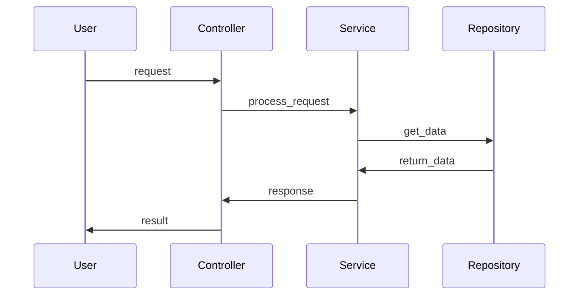

                 

### 第1章：复杂任务处理背景

#### 1.1 问题背景

随着信息技术的飞速发展，现代社会面临着越来越多的复杂任务处理需求。这些任务涵盖了从数据处理、智能决策到自动化控制等众多领域。复杂任务通常涉及大量的数据输入、复杂的计算逻辑、以及多变的执行环境，这使得传统的单一结构处理方法难以应对。为了有效解决这些问题，我们需要一种更为灵活、可扩展和易于维护的处理架构。

在数据处理领域，随着大数据和云计算的普及，海量数据的存储、处理和分析成为关键挑战。传统的数据处理流程往往依赖于线性的数据处理方法，这种方式在数据量较少时可能效果良好，但当数据量达到海量级别时，其性能和效率会受到严重影响。

智能决策领域，随着人工智能技术的不断进步，智能决策系统在金融、医疗、交通等领域的应用越来越广泛。然而，智能决策系统的开发面临着数据获取和处理、算法选择与优化、系统稳定性与可靠性等一系列问题。

自动化控制领域，自动化控制系统在工业生产、智能交通、智能家居等领域的应用日益增多。然而，随着系统的复杂度增加，如何确保系统的稳定性、可靠性和灵活性成为亟待解决的问题。

#### 1.2 核心概念

层次化示例结构是一种用于处理复杂任务的结构化方法。其核心概念包括模块化、层次化和依赖注入。

- **模块化**：模块化是将系统划分为若干功能独立、可重用的模块，每个模块负责完成特定的功能。模块化的好处是提高系统的可维护性和可扩展性，使得系统更容易理解和修改。

- **层次化**：层次化是将系统按照功能划分为多个层次，每个层次负责不同的任务。层次化的好处是降低系统的复杂度，使得各个层次之间的依赖关系更加清晰，从而提高系统的稳定性和可维护性。

- **依赖注入**：依赖注入是一种设计模式，用于在系统运行时动态地注入组件之间的依赖关系。依赖注入的好处是提高系统的模块化和可测试性，使得各个模块之间更加独立，从而降低系统的耦合度。

#### 1.3 相关概念联系与区别

层次化示例结构与模块化、组件化、分层架构等概念密切相关，但它们之间存在一定的区别。

- **模块化**：模块化是一种设计理念，强调系统的分解为独立的模块。模块化是层次化示例结构的基础。

- **组件化**：组件化是将系统划分为功能独立的组件，组件之间通过接口进行通信。组件化是模块化的扩展，它强调组件之间的松耦合。

- **分层架构**：分层架构是将系统按照功能划分为多个层次，每个层次负责不同的任务。分层架构是层次化示例结构的具体实现。

层次化示例结构与这些概念的联系与区别如下表所示：

| 概念      | 定义                                                                 | 联系与区别                                                       |
|-----------|--------------------------------------------------------------------|--------------------------------------------------------------|
| 模块化    | 将系统划分为功能独立的模块。                                         | 层次化示例结构的基础，强调模块的独立性和可重用性。               |
| 组件化    | 将系统划分为功能独立的组件，组件之间通过接口进行通信。                   | 模块化的扩展，强调组件之间的松耦合。                           |
| 分层架构  | 将系统按照功能划分为多个层次，每个层次负责不同的任务。                   | 层次化示例结构的具体实现，强调层次之间的职责划分和依赖关系。     |

通过对比可以看出，层次化示例结构是模块化、组件化和分层架构的综合应用，它旨在提供一种灵活、高效且易于维护的处理复杂任务的架构。

---

### 第2章：层次化示例结构概述

#### 2.1 层次化示例结构的定义与重要性

层次化示例结构（Hierarchical Example Structure, HES）是一种用于处理复杂任务的架构设计方法。它通过将系统划分为多个层次，每个层次负责不同的任务和功能，从而实现系统的模块化、层次化和依赖注入。层次化示例结构的定义可以概括为：一种基于层次化思想，通过模块化和依赖注入技术实现系统结构和功能分离的架构设计方法。

层次化示例结构在处理复杂任务中具有重要意义，主要体现在以下几个方面：

1. **模块化**：层次化示例结构通过模块化将系统划分为若干功能独立的模块，每个模块负责特定的功能。模块化提高了系统的可维护性和可扩展性，使得系统更容易进行修改和扩展。

2. **层次化**：层次化示例结构通过层次化将系统划分为多个层次，每个层次负责不同的任务和功能。层次化降低了系统的复杂度，使得各个层次之间的依赖关系更加清晰，从而提高了系统的稳定性和可维护性。

3. **依赖注入**：层次化示例结构通过依赖注入技术实现模块之间的依赖关系。依赖注入使得各个模块之间更加独立，降低了系统的耦合度，从而提高了系统的可测试性和可维护性。

4. **灵活性和可扩展性**：层次化示例结构提供了灵活的扩展机制，通过增加新的层次或修改现有层次的功能，可以轻松应对新的需求或变化。这种灵活性使得系统具有更强的适应能力。

#### 2.2 层次化示例结构的组成部分

层次化示例结构通常包括以下几个组成部分：

1. **模块**：模块是层次化示例结构的基本组成单位，负责实现特定的功能。模块通常具有以下特点：
   - **功能独立性**：模块内部的功能是独立的，模块之间通过接口进行通信，从而实现模块间的解耦。
   - **可重用性**：模块是可重用的，可以在不同的系统中复用。
   - **可测试性**：模块是独立的，可以单独进行测试，从而提高测试效率。

2. **层次**：层次是层次化示例结构中的组织形式，负责将系统划分为多个层次，每个层次负责不同的任务和功能。层次通常具有以下特点：
   - **职责明确**：每个层次都有明确的职责和功能，层次之间的职责划分清晰。
   - **依赖关系**：层次之间存在依赖关系，低层次为高层次提供基础支持。

3. **依赖注入**：依赖注入是层次化示例结构中的重要技术，用于实现模块之间的依赖关系。依赖注入通常通过以下方式实现：
   - **构造函数注入**：通过构造函数将依赖关系注入到模块中。
   - **setter方法注入**：通过setter方法将依赖关系注入到模块中。
   - **接口注入**：通过接口将依赖关系注入到模块中。

4. **接口**：接口是层次化示例结构中的关键组成部分，用于定义模块之间的通信协议。接口通常具有以下特点：
   - **抽象性**：接口定义了模块之间的抽象通信方式，不涉及具体的实现细节。
   - **兼容性**：接口提供了模块之间的兼容性保证，使得不同的模块可以通过统一的接口进行通信。

层次化示例结构的组成部分如图所示：

```mermaid
classDiagram
Class01 <|-- Class02
Class03 <|-- Class04
Class05 <|-- Class06
Class01 {
    +int x
    +int y
    +move(int x, int y)
}
Class02 {
    +int x
    +int y
    +draw()
}
Class03 {
    +int x
    +int y
    +resize(int x, int y)
}
Class04 {
    +int x
    +int y
    +rotate(int angle)
}
Class05 {
    +int x
    +int y
    +draw()
    +resize(int x, int y)
}
Class06 {
    +int x
    +int y
    +rotate(int angle)
    +draw()
}
Class01 ..|> Class02 : implements
Class01 ..|> Class03 : implements
Class01 ..|> Class04 : implements
Class01 ..|> Class05 : implements
Class01 ..|> Class06 : implements
```

通过上述组成部分，层次化示例结构能够实现系统的模块化、层次化和依赖注入，从而提高系统的可维护性、可扩展性和灵活性。

---

### 第3章：层次化示例结构设计原则

#### 3.1 设计原则一：模块化

模块化是层次化示例结构设计的重要原则之一。模块化设计的目标是将系统划分为多个功能独立、可重用的模块，每个模块负责实现特定的功能。模块化设计原则主要包括以下几点：

1. **功能独立性**：每个模块应具有明确的功能和职责，模块内部的功能是独立的，模块之间通过接口进行通信。功能独立性有助于降低模块间的耦合度，提高系统的可维护性和可扩展性。

2. **可重用性**：模块应具有高可重用性，可以独立于其他模块使用。通过模块的重用，可以减少重复代码，提高开发效率，同时降低系统的维护成本。

3. **可测试性**：模块应具有独立的测试功能，可以在没有其他模块参与的情况下进行单元测试。这有助于发现和修复模块内的错误，提高系统的稳定性。

4. **模块边界清晰**：模块的边界应清晰明确，模块内部的功能和接口应相互独立。模块的边界可以通过定义接口来实现，接口定义了模块之间的通信方式。

以下是一个模块化设计的实例：

```python
# 模块 A：数据读取
def read_data(file_path):
    # 读取文件并返回数据
    pass

# 模块 B：数据处理
def process_data(data):
    # 处理数据并返回结果
    pass

# 模块 C：数据写入
def write_data(result, file_path):
    # 将结果写入文件
    pass

# 完整的执行流程
def main():
    file_path = "data.txt"
    data = read_data(file_path)
    result = process_data(data)
    write_data(result, file_path)

if __name__ == "__main__":
    main()
```

在这个实例中，模块 A、模块 B 和模块 C 各自实现了不同的功能，它们之间通过接口进行通信，从而实现了模块化设计。

#### 3.2 设计原则二：层次化

层次化设计是层次化示例结构的另一个重要原则。层次化设计的核心思想是将系统划分为多个层次，每个层次负责不同的任务和功能。层次化设计原则主要包括以下几点：

1. **职责划分**：每个层次应具有明确的职责和功能，层次之间的职责划分应清晰。高层次的职责通常是策略性的、全局性的，而低层次的职责则是具体的、技术性的。

2. **层次依赖**：低层次为高层次提供基础支持，高层次调用低层次实现具体的功能。层次之间的依赖关系应遵循“依赖倒置原则”，即高层次不依赖于低层次，而低层次依赖于高层次。

3. **层次分离**：层次之间的分离应明确，每个层次的实现应独立。层次分离有助于降低系统的复杂度，提高系统的可维护性和可扩展性。

以下是一个层次化设计的实例：



在这个实例中，系统划分为用户层（User）、控制层（Controller）、服务层（Service）和数据层（Repository）。用户层负责接收用户请求，控制层负责处理请求并转发给服务层，服务层负责具体的数据处理，数据层负责数据的存储和读取。

#### 3.3 设计原则三：可扩展性

可扩展性是层次化示例结构设计的重要原则之一。可扩展性的目标是使系统能够在未来的需求变化中保持稳定性和灵活性。可扩展性设计原则主要包括以下几点：

1. **模块化扩展**：系统应具备模块化扩展能力，通过增加新的模块或修改现有模块的功能，可以轻松应对新的需求。模块化扩展有助于降低系统的复杂性，提高系统的可维护性和可扩展性。

2. **接口定义**：系统应提供清晰的接口定义，接口应具备良好的抽象性和兼容性，使得模块之间能够方便地进行替换和扩展。接口定义有助于实现模块之间的松耦合，提高系统的可扩展性。

3. **配置管理**：系统应具备良好的配置管理能力，通过配置文件或参数设置，可以灵活地调整系统的行为和功能。配置管理有助于实现系统的动态扩展，提高系统的灵活性和可适应性。

以下是一个可扩展性设计的实例：

```python
# 数据读取模块
class DataReader:
    def read_data(self):
        # 读取数据
        pass

# 数据处理模块
class DataProcessor:
    def process_data(self, data):
        # 处理数据
        pass

# 数据写入模块
class DataWriter:
    def write_data(self, data):
        # 写入数据
        pass

# 系统配置
class Config:
    def __init__(self):
        self.data_reader = DataReader()
        self.data_processor = DataProcessor()
        self.data_writer = DataWriter()

# 系统运行
def main(config):
    data = config.data_reader.read_data()
    processed_data = config.data_processor.process_data(data)
    config.data_writer.write_data(processed_data)

if __name__ == "__main__":
    config = Config()
    main(config)
```

在这个实例中，系统通过配置类（Config）管理各个模块，可以通过修改配置类中的模块实例，实现模块的替换和扩展。这种方式提高了系统的可扩展性，使得系统能够灵活地应对新的需求。

---

### 第4章：层次化示例结构实现

#### 4.1 实现技术一：模块化编程

模块化编程是层次化示例结构实现的基础。模块化编程的目标是将系统划分为多个功能独立、可重用的模块，每个模块负责实现特定的功能。以下是一个模块化编程的实例：

```python
# 数据读取模块
class DataReader:
    def read_data(self):
        # 读取数据
        pass

# 数据处理模块
class DataProcessor:
    def process_data(self, data):
        # 处理数据
        pass

# 数据写入模块
class DataWriter:
    def write_data(self, data):
        # 写入数据
        pass

# 系统运行
def main():
    data_reader = DataReader()
    data_processor = DataProcessor()
    data_writer = DataWriter()

    data = data_reader.read_data()
    processed_data = data_processor.process_data(data)
    data_writer.write_data(processed_data)

if __name__ == "__main__":
    main()
```

在这个实例中，系统划分为数据读取模块、数据处理模块和数据写入模块。每个模块负责实现特定的功能，模块之间通过接口进行通信，从而实现了模块化编程。

#### 4.2 实现技术二：分层设计

分层设计是层次化示例结构实现的核心。分层设计的核心思想是将系统划分为多个层次，每个层次负责不同的任务和功能。以下是一个分层设计的实例：


在这个实例中，系统划分为用户层（User）、控制层（Controller）、服务层（Service）和数据层（Repository）。用户层负责接收用户请求，控制层负责处理请求并转发给服务层，服务层负责具体的数据处理，数据层负责数据的存储和读取。

#### 4.3 实现技术三：依赖注入

依赖注入是层次化示例结构实现的关键技术。依赖注入的目标是降低模块之间的耦合度，提高系统的可维护性和可扩展性。以下是一个依赖注入的实例：

```python
# 数据读取模块
class DataReader:
    def read_data(self):
        # 读取数据
        pass

# 数据处理模块
class DataProcessor:
    def process_data(self, data):
        # 处理数据
        pass

# 数据写入模块
class DataWriter:
    def write_data(self, data):
        # 写入数据
        pass

# 系统配置
class Config:
    def __init__(self):
        self.data_reader = DataReader()
        self.data_processor = DataProcessor()
        self.data_writer = DataWriter()

# 系统运行
def main(config):
    data = config.data_reader.read_data()
    processed_data = config.data_processor.process_data(data)
    config.data_writer.write_data(processed_data)

if __name__ == "__main__":
    config = Config()
    main(config)
```

在这个实例中，系统通过配置类（Config）管理各个模块，通过构造函数和setter方法实现依赖注入。这种方式降低了模块之间的耦合度，提高了系统的可维护性和可扩展性。

---

### 第5章：层次化示例结构应用

#### 5.1 应用场景一：系统架构设计

层次化示例结构在系统架构设计中具有广泛应用。通过层次化示例结构，可以清晰地划分系统层次，明确各层次的职责和功能，从而提高系统的可维护性和可扩展性。以下是一个系统架构设计的实例：


在这个实例中，系统划分为用户层（User）、控制层（Controller）、服务层（Service）和数据层（Repository）。用户层负责接收用户请求，控制层负责处理请求并转发给服务层，服务层负责具体的数据处理，数据层负责数据的存储和读取。

#### 5.2 应用场景二：软件开发

层次化示例结构在软件开发中也具有广泛应用。通过层次化示例结构，可以清晰地划分模块和层次，实现模块化和层次化设计，从而提高软件的可维护性和可扩展性。以下是一个软件开发实例：

```python
# 数据读取模块
class DataReader:
    def read_data(self):
        # 读取数据
        pass

# 数据处理模块
class DataProcessor:
    def process_data(self, data):
        # 处理数据
        pass

# 数据写入模块
class DataWriter:
    def write_data(self, data):
        # 写入数据
        pass

# 系统运行
def main():
    data_reader = DataReader()
    data_processor = DataProcessor()
    data_writer = DataWriter()

    data = data_reader.read_data()
    processed_data = data_processor.process_data(data)
    data_writer.write_data(processed_data)

if __name__ == "__main__":
    main()
```

在这个实例中，系统划分为数据读取模块、数据处理模块和数据写入模块。每个模块负责实现特定的功能，模块之间通过接口进行通信，从而实现了模块化和层次化设计。

#### 5.3 应用场景三：复杂问题求解

层次化示例结构在复杂问题求解中也具有重要作用。通过层次化示例结构，可以清晰地划分问题的层次和模块，从而简化问题的求解过程，提高求解效率。以下是一个复杂问题求解实例：

```python
# 问题求解模块
class ProblemSolver:
    def solve_problem(self):
        # 求解问题
        pass

# 系统运行
def main():
    problem_solver = ProblemSolver()
    solution = problem_solver.solve_problem()
    print(solution)

if __name__ == "__main__":
    main()
```

在这个实例中，系统划分为问题求解模块。问题求解模块负责实现问题的求解，从而实现了模块化和层次化设计。

---

### 第6章：层次化示例结构优化

#### 6.1 优化策略一：性能优化

层次化示例结构在处理复杂任务时，其性能优化是一个重要方面。性能优化主要包括以下几个方面：

1. **算法优化**：对层次化示例结构中的算法进行优化，提高算法的执行效率。例如，采用更高效的排序算法、查找算法等。

2. **缓存技术**：利用缓存技术，减少数据的重复读取和计算。通过合理设置缓存策略，降低系统的响应时间和资源消耗。

3. **并行处理**：利用多线程、多进程等技术，实现任务的并行处理。通过并行处理，提高系统的处理速度和吞吐量。

4. **资源管理**：优化资源的使用，包括内存、CPU、网络等。通过合理分配和调度资源，提高系统的整体性能。

以下是一个性能优化的实例：

```python
# 使用并行处理优化性能
import concurrent.futures

def process_data(data):
    # 处理数据
    pass

# 系统运行
def main():
    data = read_data()
    processed_data = []

    with concurrent.futures.ThreadPoolExecutor() as executor:
        future_to_data = {executor.submit(process_data, data): data for data in data}

    for future in concurrent.futures.as_completed(future_to_data):
        processed_data.append(future.result())

    write_data(processed_data)

if __name__ == "__main__":
    main()
```

在这个实例中，通过使用并行处理，提高了数据处理的速度和效率。

#### 6.2 优化策略二：可维护性优化

层次化示例结构的可维护性优化主要包括以下几个方面：

1. **代码规范**：遵循统一的代码规范，包括命名规范、注释规范等。良好的代码规范可以提高代码的可读性和可维护性。

2. **单元测试**：编写单元测试，对系统的各个模块进行测试。单元测试可以及时发现和修复模块内的错误，提高系统的稳定性。

3. **文档化**：编写详细的文档，包括模块的用途、功能、接口说明等。良好的文档可以提高系统的可维护性和可理解性。

4. **版本控制**：使用版本控制工具，如Git，对代码进行管理。版本控制可以帮助追溯代码的修改历史，便于代码的维护和协同开发。

以下是一个可维护性优化的实例：

```python
# 使用注释提高代码可读性
class DataReader:
    """
    数据读取模块
    负责从文件中读取数据
    """

    def read_data(self, file_path):
        """
        读取数据
        :param file_path: 文件路径
        :return: 数据
        """
        pass

# 系统运行
def main():
    data_reader = DataReader()
    data = data_reader.read_data("data.txt")
    # 处理数据
    pass

if __name__ == "__main__":
    main()
```

在这个实例中，通过添加注释，提高了代码的可读性和可维护性。

#### 6.3 优化策略三：可扩展性优化

层次化示例结构的可扩展性优化主要包括以下几个方面：

1. **模块化扩展**：设计灵活的模块化结构，使得系统可以方便地添加新的模块或修改现有模块的功能。

2. **配置管理**：通过配置管理，实现系统的动态扩展和灵活配置。通过配置文件或参数设置，可以灵活地调整系统的行为和功能。

3. **接口定义**：定义清晰的接口，使得模块之间能够方便地进行替换和扩展。良好的接口定义可以提高系统的可扩展性和兼容性。

以下是一个可扩展性优化的实例：

```python
# 系统配置
class Config:
    def __init__(self):
        self.data_reader = DataReader()
        self.data_processor = DataProcessor()
        self.data_writer = DataWriter()

# 系统运行
def main(config):
    data = config.data_reader.read_data()
    processed_data = config.data_processor.process_data(data)
    config.data_writer.write_data(processed_data)

if __name__ == "__main__":
    config = Config()
    main(config)
```

在这个实例中，通过使用配置类（Config），实现了模块的灵活配置和扩展。

---

### 第7章：案例分析

#### 7.1 案例一：电商系统

电商系统是一个典型的复杂任务处理场景。通过层次化示例结构，可以有效地设计电商系统的架构，提高系统的可维护性和可扩展性。以下是一个电商系统的案例分析：

**系统功能设计**：

- **用户层**：负责处理用户请求，提供用户界面。
- **控制层**：负责处理用户请求，将请求转发给服务层。
- **服务层**：负责具体的业务逻辑处理，如订单处理、商品管理、支付等。
- **数据层**：负责数据的存储和读取，如用户数据、订单数据、商品数据等。

**系统架构设计**：


在这个电商系统中，用户层、控制层、服务层和数据层通过层次化示例结构进行划分，每个层次负责不同的功能，从而提高了系统的可维护性和可扩展性。

**系统接口设计和系统交互**：


在这个系统交互中，用户层通过控制器层与服务层进行交互，服务层通过数据层进行数据存储和读取，从而实现了系统的功能。

#### 7.2 案例二：人工智能应用

人工智能应用也是一个复杂的任务处理场景。通过层次化示例结构，可以有效地设计人工智能应用的架构，提高系统的可维护性和可扩展性。以下是一个人工智能应用的案例分析：

**系统功能设计**：

- **用户层**：负责处理用户请求，提供用户界面。
- **控制层**：负责处理用户请求，将请求转发给服务层。
- **服务层**：负责具体的业务逻辑处理，如数据预处理、模型训练、预测等。
- **数据层**：负责数据的存储和读取，如训练数据、测试数据等。

**系统架构设计**：


在这个人工智能应用中，用户层、控制层、服务层和数据层通过层次化示例结构进行划分，每个层次负责不同的功能，从而提高了系统的可维护性和可扩展性。

**系统接口设计和系统交互**：


在这个系统交互中，用户层通过控制器层与服务层进行交互，服务层通过数据层进行数据存储和读取，从而实现了系统的功能。

#### 7.3 案例分析小结

通过以上两个案例的分析，我们可以看到层次化示例结构在复杂任务处理中的应用效果。层次化示例结构通过模块化、层次化和依赖注入等技术，有效地降低了系统的复杂度，提高了系统的可维护性和可扩展性。同时，层次化示例结构也提供了清晰的接口设计和系统交互，使得系统更加灵活和高效。在实际应用中，层次化示例结构可以帮助我们更好地设计和管理复杂系统，从而实现高效的任务处理。

---

### 第8章：实践指南

#### 8.1 实践步骤一：需求分析

在构建层次化示例结构之前，首先需要进行需求分析。需求分析是系统设计的重要环节，它决定了层次化示例结构的实现方向和具体细节。以下是一些建议和步骤：

1. **明确系统目标**：首先明确系统的目标和需求，包括系统要解决的主要问题、目标用户群体、业务场景等。明确系统目标有助于确定层次化示例结构的设计方向。

2. **需求收集**：通过访谈、问卷调查、用户观察等方式，收集用户的实际需求和期望。需求收集要尽量全面，以确保层次化示例结构能够满足用户需求。

3. **需求分类**：将收集到的需求进行分类，区分出核心需求和非核心需求。核心需求是层次化示例结构必须实现的功能，而非核心需求则可以根据实际情况进行取舍。

4. **需求文档**：编写详细的的需求文档，包括需求描述、功能需求、性能需求、安全需求等。需求文档是层次化示例结构设计的依据，必须准确、清晰地描述系统需求。

5. **需求验证**：对需求文档进行评审和验证，确保需求的准确性和完整性。需求验证可以通过用户评审、专家评审等方式进行。

以下是一个需求分析的示例：

**需求描述**：

系统需要提供用户登录、商品浏览、购物车管理、订单处理等功能。

**功能需求**：

- 用户登录：用户可以通过用户名和密码登录系统。
- 商品浏览：用户可以浏览系统中的商品信息。
- 购物车管理：用户可以将商品加入购物车，可以对购物车中的商品进行修改和删除。
- 订单处理：用户可以提交订单，系统需要对订单进行处理。

**性能需求**：

- 系统响应时间：系统响应时间不超过2秒。
- 数据处理能力：系统每天能处理10万次用户请求。

**安全需求**：

- 用户数据安全：系统需要确保用户数据的安全，防止数据泄露。
- 系统安全性：系统需要具备一定的安全性，防止恶意攻击。

通过以上需求分析，我们可以明确系统的目标、功能需求、性能需求和安全需求，为层次化示例结构的设计提供依据。

#### 8.2 实践步骤二：设计层次化示例结构

在完成需求分析后，接下来就是设计层次化示例结构。设计层次化示例结构是系统实现的重要环节，它决定了系统的可维护性和可扩展性。以下是一些建议和步骤：

1. **划分模块**：根据需求分析的结果，将系统划分为多个功能独立的模块。每个模块应负责特定的功能，模块之间通过接口进行通信。模块划分要尽量清晰，避免模块功能重叠。

2. **确定层次**：根据模块的功能和职责，将模块划分为不同的层次。通常，系统可以分为用户层、控制层、服务层和数据层。用户层负责与用户交互，控制层负责处理用户请求，服务层负责具体的业务逻辑处理，数据层负责数据的存储和读取。

3. **定义接口**：接口是模块之间通信的桥梁，它定义了模块之间的抽象通信方式。定义接口时，要确保接口的抽象性和兼容性，使得模块之间能够方便地进行替换和扩展。

4. **层次关系**：明确各个层次之间的依赖关系，遵循“依赖倒置原则”，即高层次不依赖于低层次，而低层次依赖于高层次。层次关系决定了模块之间的协作方式，影响系统的可维护性和可扩展性。

5. **设计文档**：编写详细的设计文档，包括模块划分、层次关系、接口定义等。设计文档是层次化示例结构的依据，必须准确、清晰地描述系统设计。

以下是一个设计层次化示例结构的示例：

**模块划分**：

- 用户层：用户登录模块、商品浏览模块、购物车管理模块、订单处理模块。
- 控制层：用户登录控制器、商品浏览控制器、购物车管理控制器、订单处理控制器。
- 服务层：用户服务模块、商品服务模块、购物车服务模块、订单服务模块。
- 数据层：用户数据模块、商品数据模块、购物车数据模块、订单数据模块。

**层次关系**：

- 用户层 -> 控制层：用户层通过接口与控制层进行通信，控制层负责处理用户请求。
- 控制层 -> 服务层：控制层通过接口与服务层进行通信，服务层负责具体的业务逻辑处理。
- 服务层 -> 数据层：服务层通过接口与数据层进行通信，数据层负责数据的存储和读取。

**接口定义**：

- 用户层 -> 控制层：用户登录接口、商品浏览接口、购物车管理接口、订单处理接口。
- 控制层 -> 服务层：用户登录接口、商品浏览接口、购物车管理接口、订单处理接口。
- 服务层 -> 数据层：用户登录接口、商品浏览接口、购物车管理接口、订单处理接口。

通过以上设计，我们可以构建一个层次化示例结构，确保系统的可维护性和可扩展性。

#### 8.3 实践步骤三：实现与优化

在完成层次化示例结构的设计后，接下来就是实现和优化。以下是一些建议和步骤：

1. **模块实现**：根据设计文档，实现各个模块的功能。模块实现要遵循设计原则，确保模块之间的独立性和可重用性。实现过程中，要遵循代码规范，确保代码的可读性和可维护性。

2. **接口实现**：根据接口定义，实现模块之间的通信接口。接口实现要确保抽象性和兼容性，使得模块之间能够方便地进行替换和扩展。

3. **集成测试**：在模块实现完成后，进行集成测试。集成测试要确保模块之间的接口通信正常，系统的整体功能符合需求。集成测试可以采用自动化测试工具进行，提高测试效率。

4. **性能优化**：根据系统的性能需求，对系统进行性能优化。性能优化可以采用算法优化、缓存技术、并行处理等技术，提高系统的响应速度和处理能力。

5. **安全优化**：根据系统的安全需求，对系统进行安全优化。安全优化可以采用加密技术、安全策略等技术，提高系统的安全性。

6. **持续迭代**：在系统上线后，持续进行迭代优化。通过收集用户反馈、监控系统性能，不断优化系统的功能和性能。

以下是一个实现与优化的示例：

**模块实现**：

- 用户登录模块：实现用户登录功能，包括用户身份验证、登录状态管理等。
- 商品浏览模块：实现商品浏览功能，包括商品信息展示、商品分类等。
- 购物车管理模块：实现购物车管理功能，包括商品添加、修改、删除等。
- 订单处理模块：实现订单处理功能，包括订单生成、订单状态管理等。

**接口实现**：

- 用户层 -> 控制层：实现用户登录接口、商品浏览接口、购物车管理接口、订单处理接口。
- 控制层 -> 服务层：实现用户登录接口、商品浏览接口、购物车管理接口、订单处理接口。
- 服务层 -> 数据层：实现用户登录接口、商品浏览接口、购物车管理接口、订单处理接口。

**集成测试**：

- 进行用户登录、商品浏览、购物车管理、订单处理等功能的集成测试，确保模块之间的接口通信正常，系统的整体功能符合需求。

**性能优化**：

- 采用缓存技术，提高系统的响应速度和处理能力。
- 采用并行处理技术，提高系统的处理速度和吞吐量。

**安全优化**：

- 采用加密技术，提高用户数据的安全性。
- 采用安全策略，防止恶意攻击和数据泄露。

**持续迭代**：

- 收集用户反馈，持续优化系统的功能和性能。
- 监控系统性能，及时解决性能瓶颈。

通过以上实现与优化，我们可以构建一个高效、稳定、安全的层次化示例结构，满足复杂任务处理的需求。

---

### 第9章：最佳实践

#### 9.1 最佳实践一：模块化代码组织

在构建层次化示例结构时，模块化代码组织是一个重要的最佳实践。良好的代码组织可以提高代码的可读性、可维护性和可扩展性。以下是一些模块化代码组织的最佳实践：

1. **功能模块化**：根据系统的功能需求，将代码划分为多个功能模块。每个模块应负责实现特定的功能，模块之间通过接口进行通信。

2. **层次化组织**：按照层次化示例结构的层次划分，将代码组织成不同的目录结构。通常，系统可以分为用户层、控制层、服务层和数据层，每个层次对应一个目录层级。

3. **命名规范**：遵循统一的命名规范，确保代码的可读性和一致性。命名规范应包括模块名、类名、函数名等。

4. **代码注释**：为代码添加详细的注释，解释代码的功能、用途和实现原理。良好的注释可以提高代码的可维护性。

5. **代码格式**：遵循统一的代码格式规范，确保代码的一致性和可读性。代码格式规范应包括缩进、空格、括号等。

以下是一个模块化代码组织的示例：

```
# 用户层
user_layer/
    user_login.py
    user_management.py

# 控制层
control_layer/
    controller.py

# 服务层
service_layer/
    service.py

# 数据层
data_layer/
    data.py
```

在这个示例中，代码按照层次化示例结构的层次划分进行了组织，每个模块都对应一个目录层级。模块之间的接口通过文件名进行命名，确保代码的清晰和简洁。

#### 9.2 最佳实践二：分层架构设计

分层架构设计是层次化示例结构实现的核心。良好的分层架构可以提高系统的可维护性和可扩展性。以下是一些分层架构设计的最佳实践：

1. **职责划分**：根据系统的功能需求，明确每个层次的职责和功能。用户层负责与用户交互，控制层负责处理用户请求，服务层负责具体的业务逻辑处理，数据层负责数据的存储和读取。

2. **依赖关系**：遵循“依赖倒置原则”，确保高层次不依赖于低层次，而低层次依赖于高层次。这样，系统的修改和扩展会更加灵活和方便。

3. **接口定义**：为每个层次定义清晰的接口，确保模块之间通过接口进行通信。接口应具备抽象性和兼容性，使得模块之间能够方便地进行替换和扩展。

4. **模块化组件**：将系统划分为多个模块化组件，每个组件负责实现特定的功能。模块化组件可以提高代码的可维护性和可扩展性。

5. **分层文档**：编写详细的分层文档，包括每个层次的职责、接口定义、模块化组件等。分层文档是系统设计的依据，有助于理解系统的结构和实现原理。

以下是一个分层架构设计的示例：

```
用户层 -> 控制层 -> 服务层 -> 数据层
```

在这个示例中，系统划分为用户层、控制层、服务层和数据层。每个层次都有明确的职责和功能，层次之间通过接口进行通信。这种分层架构设计提高了系统的可维护性和可扩展性。

#### 9.3 最佳实践三：依赖注入应用

依赖注入是层次化示例结构实现的关键技术。良好的依赖注入可以提高系统的可维护性和可扩展性。以下是一些依赖注入的最佳实践：

1. **构造函数注入**：通过构造函数将依赖关系注入到模块中。构造函数注入是最简单和最常用的依赖注入方式。

2. **setter方法注入**：通过setter方法将依赖关系注入到模块中。setter方法注入比构造函数注入更灵活，适用于依赖关系较复杂的场景。

3. **接口注入**：通过接口将依赖关系注入到模块中。接口注入使得模块更加独立，便于替换和扩展。

4. **依赖注入框架**：使用依赖注入框架，如Spring、Django等，实现自动依赖注入。依赖注入框架可以简化开发过程，提高系统的可维护性和可扩展性。

5. **依赖关系配置**：合理配置依赖关系，确保模块之间的依赖关系清晰。依赖关系配置可以通过配置文件、代码注释等方式进行。

以下是一个依赖注入应用的示例：

```python
# 模块 A：数据读取
class DataReader:
    def __init__(self):
        self.data_source = DataSource()

    def read_data(self):
        return self.data_source.read()

# 模块 B：数据处理
class DataProcessor:
    def __init__(self):
        self.data_reader = DataReader()

    def process_data(self):
        data = self.data_reader.read_data()
        # 处理数据
        pass

# 系统运行
def main():
    data_processor = DataProcessor()
    data_processor.process_data()

if __name__ == "__main__":
    main()
```

在这个示例中，模块 A 和模块 B 通过构造函数注入实现了依赖关系。通过这种方式，模块 A 和模块 B 之间的依赖关系变得清晰，便于替换和扩展。

---

### 第10章：注意事项与拓展阅读

#### 10.1 注意事项

在构建层次化示例结构时，需要注意以下几个方面：

1. **模块独立性**：确保模块具有独立性，避免模块间出现强依赖关系，以提高系统的可维护性和可扩展性。

2. **层次清晰**：在设计层次化示例结构时，要确保层次划分清晰，职责明确，避免层次之间出现功能重叠。

3. **接口定义**：定义清晰的接口，确保接口的抽象性和兼容性，使得模块之间能够方便地进行替换和扩展。

4. **依赖注入**：合理使用依赖注入技术，降低模块之间的耦合度，提高系统的可维护性和可扩展性。

5. **性能优化**：在实现层次化示例结构时，要充分考虑系统的性能需求，进行适当的性能优化，确保系统的响应速度和处理能力。

6. **安全性**：在设计层次化示例结构时，要充分考虑系统的安全性，防止数据泄露和恶意攻击。

#### 10.2 拓展阅读

为了更深入地了解层次化示例结构，以下是一些拓展阅读建议：

1. **《软件架构设计：面向对象、服务导向与模型驱动方法》**：本书详细介绍了软件架构设计的方法和技术，包括面向对象、服务导向和模型驱动方法。

2. **《设计模式：可复用面向对象软件的基础》**：本书介绍了多种设计模式，包括依赖注入模式，提供了大量实际的代码示例。

3. **《架构风格与架构指引》**：本书探讨了不同类型的架构风格和设计模式，提供了实用的架构指引。

4. **《深入理解计算机系统》**：本书从系统层面深入探讨了计算机系统的原理和实现，包括层次化结构的实现和优化。

通过阅读这些书籍，可以更全面地了解层次化示例结构的原理和应用，提高系统设计和开发的水平。

