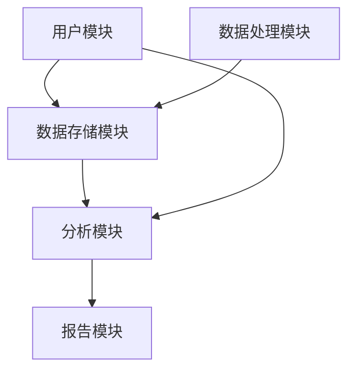

                 

**构建敏捷迭代的LLM工程技术架构**

# 关键词

- **LLM工程技术**
- **敏捷迭代**
- **系统架构设计**
- **深度学习算法**
- **软件工程实践**
- **项目实战**

## 摘要

本文旨在探讨如何构建敏捷迭代的LLM工程技术架构。首先，我们将介绍LLM（大型语言模型）的背景和核心概念，随后讨论敏捷迭代的必要性及其在LLM工程中的重要性。接着，我们将详细解析LLM的算法原理和数学模型，并通过Python代码实例进行说明。然后，我们将探讨敏捷迭代架构的设计原则和流程，包括系统功能设计、系统架构设计和系统交互设计。在项目实战部分，我们将展示一个实际的LLM项目，包括环境安装、核心实现、代码解读与分析，以及案例分析。最后，我们将总结最佳实践，提出注意事项，并推荐拓展阅读资源。

## 目录

1. **背景介绍与核心概念**
   - 1.1 问题背景
     - 1.1.1 LLM技术现状
     - 1.1.2 敏捷迭代的必要性
     - 1.1.3 架构设计的重要性
   - 1.2 核心概念
     - 1.2.1 LLM的定义
     - 1.2.2 敏捷迭代的概念
     - 1.2.3 技术架构的基本要素
   - 1.3 概念属性对比
     - 1.3.1 LLM与传统模型的比较
     - 1.3.2 敏捷迭代与传统开发的对比
   - 1.4 ER实体关系图
     - 1.4.1 实体识别
     - 1.4.2 实体关系建立
     - 1.4.3 实体属性分析
   - 1.5 本章小结

2. **LLM工程技术原理**
   - 2.1 LLM算法原理
     - 2.1.1 语言模型的数学模型
     - 2.1.2 常见算法介绍
     - 2.1.3 算法优缺点分析
   - 2.2 数学模型与公式
     - 2.2.1 概率论基础
     - 2.2.2 信息论基础
     - 2.2.3 模型评估指标
   - 2.3 算法讲解与举例
     - 2.3.1 深度学习算法讲解
     - 2.3.2 举例说明
     - 2.3.3 Python源代码展示
   - 2.4 本章小结

3. **敏捷迭代架构设计**
   - 3.1 敏捷迭代架构概述
     - 3.1.1 敏捷迭代的流程
     - 3.1.2 架构设计的原则
     - 3.1.3 常见架构模式分析
   - 3.2 系统功能设计
     - 3.2.1 领域模型类图
     - 3.2.2 功能模块划分
     - 3.2.3 功能实现方式
   - 3.3 系统架构设计
     - 3.3.1 架构设计思路
     - 3.3.2 架构图展示
     - 3.3.3 架构优势分析
   - 3.4 本章小结

4. **LLM工程技术应用实战**
   - 4.1 项目环境安装
     - 4.1.1 硬件环境准备
     - 4.1.2 软件环境安装
     - 4.1.3 配置文件设置
   - 4.2 系统核心实现
     - 4.2.1 源代码结构
     - 4.2.2 核心代码实现
     - 4.2.3 代码解读与分析
   - 4.3 实际案例分析
     - 4.3.1 项目案例介绍
     - 4.3.2 案例分析与讲解
     - 4.3.3 剖析与总结
   - 4.4 项目小结
     - 4.4.1 经验教训
     - 4.4.2 改进方向
     - 4.4.3 拓展阅读

5. **最佳实践与总结**
   - 5.1 最佳实践
     - 5.1.1 LLM技术选型
     - 5.1.2 敏捷迭代流程优化
     - 5.1.3 架构设计技巧
   - 5.2 小结
     - 5.2.1 主要内容回顾
     - 5.2.2 注意事项
     - 5.2.3 展望未来
   - 5.3 注意事项
     - 5.3.1 避免常见问题
     - 5.3.2 维护与更新
   - 5.4 拓展阅读
     - 5.4.1 相关书籍推荐
     - 5.4.2 学术论文精选
     - 5.4.3 网络资源链接

## 1. 背景介绍与核心概念

### 1.1 问题背景

近年来，随着深度学习和自然语言处理技术的快速发展，LLM（Large Language Model）逐渐成为人工智能领域的热点。LLM是一种可以处理和生成文本的大型神经网络模型，具有强大的文本理解和生成能力。然而，随着模型规模的增大，传统开发流程的缺陷逐渐显现，例如模型训练时间长、调优困难、部署复杂等。为了解决这些问题，敏捷迭代成为了一种理想的选择。

#### 1.1.1 LLM技术现状

LLM技术目前处于快速发展阶段，各种大型语言模型如BERT、GPT、T5等相继涌现，并在自然语言处理任务中取得了显著的成果。这些模型的共同特点是其规模巨大，参数数量达到数亿甚至数十亿级别，训练时间长达数周甚至数月。这使得传统开发流程中的周期长、调试难、部署复杂等问题愈发突出。

#### 1.1.2 敏捷迭代的必要性

敏捷迭代开发模式强调快速反馈、持续集成和持续交付，这与LLM技术的快速迭代开发需求高度契合。敏捷迭代有助于缩短开发周期，提高开发效率，降低开发成本。同时，敏捷迭代也能更好地适应LLM技术的复杂性，提高模型的可靠性和稳定性。

#### 1.1.3 架构设计的重要性

LLM工程技术的架构设计是整个项目成功的关键。一个好的架构设计不仅能够提高系统的性能和可扩展性，还能降低开发和维护成本。在敏捷迭代开发中，架构设计需要具备灵活性和可扩展性，以适应快速变化的需求和技术的更新。

### 1.2 核心概念

#### 1.2.1 LLM的定义

LLM（Large Language Model）是一种基于神经网络的大型文本处理模型，可以处理和理解复杂的文本数据，并进行文本生成和推理。LLM通常具有数亿甚至数十亿的参数，通过大量的文本数据进行训练，以实现高质量的语言理解和生成。

#### 1.2.2 敏捷迭代的概念

敏捷迭代是一种软件开发方法，强调快速反馈、持续集成和持续交付。敏捷迭代通过将开发过程划分为多个迭代周期，每个迭代周期包括需求分析、设计、开发、测试和部署等环节，以确保软件产品的持续改进和交付。

#### 1.2.3 技术架构的基本要素

技术架构是软件系统的重要组成部分，包括系统功能设计、系统架构设计和系统交互设计等。技术架构的基本要素包括：
- **系统功能设计**：定义系统的功能模块和接口，明确系统的业务逻辑。
- **系统架构设计**：设计系统的整体架构，包括系统组件、数据流和交互关系等。
- **系统交互设计**：设计系统内部和系统与外部系统的交互方式，确保系统的高效运行。

### 1.3 概念属性对比

#### 1.3.1 LLM与传统模型的比较

LLM与传统模型（如规则模型、统计模型等）在以下几个方面有所不同：

- **模型规模**：LLM具有数亿甚至数十亿的参数，远大于传统模型。
- **文本处理能力**：LLM可以处理和理解复杂的文本数据，而传统模型通常处理的是简单的文本格式。
- **训练时间**：LLM的训练时间较长，需要大量的计算资源，而传统模型的训练时间较短。
- **生成能力**：LLM具有较强的文本生成能力，能够生成高质量的文本，而传统模型通常只能进行简单的文本分类和标注。

#### 1.3.2 敏捷迭代与传统开发的对比

敏捷迭代与传统开发（如瀑布模型、V模型等）在以下几个方面有所不同：

- **开发周期**：敏捷迭代将开发过程划分为多个短周期的迭代，每个迭代周期通常在几周内完成，而传统开发周期较长，通常在几个月甚至几年内完成。
- **反馈机制**：敏捷迭代强调快速反馈，每个迭代周期结束后，都会进行评估和改进，而传统开发通常在项目结束后进行评估。
- **灵活性**：敏捷迭代更加灵活，可以快速适应需求变化和技术更新，而传统开发在需求变更和技术更新时往往较为困难。
- **交付方式**：敏捷迭代通过持续集成和持续交付，确保软件产品的持续改进和交付，而传统开发通常在项目结束后一次性交付。

### 1.4 ER实体关系图

#### 1.4.1 实体识别

实体识别是自然语言处理中的一个重要任务，旨在识别文本中的关键实体。在LLM工程中，实体识别有助于提高文本理解和生成质量。实体识别的主要方法包括基于规则的方法、基于统计的方法和基于深度学习的方法。

#### 1.4.2 实体关系建立

实体关系建立是指识别文本中实体之间的关系。实体关系对于文本理解和生成具有重要意义，可以帮助模型更好地理解文本的含义。实体关系建立的方法主要包括基于知识图谱的方法和基于文本相似度的方法。

#### 1.4.3 实体属性分析

实体属性分析是指对文本中实体的属性进行分析，以提取出实体的特征信息。实体属性分析有助于提高模型的文本理解和生成能力。实体属性分析的方法主要包括基于规则的方法和基于深度学习的方法。

### 1.5 本章小结

本章介绍了LLM技术背景和核心概念，包括问题背景、核心概念、概念属性对比和ER实体关系图。通过本章的介绍，读者可以了解LLM技术的现状和敏捷迭代的必要性，以及技术架构设计的基本要素。下一章将详细解析LLM的算法原理和数学模型。

----------------------------------------------------------------

## 2. LLM工程技术原理

LLM（大型语言模型）是基于深度学习的一种文本处理模型，它通过学习大量文本数据，自动捕捉语言中的复杂结构和规律，从而实现文本理解、生成和推理。本章节将详细介绍LLM的算法原理和数学模型，并使用Python代码进行实例说明。

### 2.1 LLM算法原理

LLM的核心算法是基于变换器模型（Transformer），这是一种基于自注意力机制的深度神经网络模型。自注意力机制允许模型在处理每个输入时，自动关注输入序列中的其他位置，从而更好地捕捉输入序列中的长距离依赖关系。

#### 2.1.1 语言模型的数学模型

语言模型可以看作是一个概率模型，它预测下一个词的概率。给定一个单词序列，语言模型的目标是预测序列的下一个单词。数学上，这可以表示为：

$$
P(W_{t+1} | W_{1}, W_{2}, ..., W_{t}) = \text{softmax}(\text{Model}(W_{1}, W_{2}, ..., W_{t}))
$$

其中，$W_{t+1}$是下一个要预测的单词，$\text{Model}$是神经网络模型，$\text{softmax}$函数将神经网络的输出转换为概率分布。

#### 2.1.2 常见算法介绍

常见的LLM算法包括：

- **BERT（Bidirectional Encoder Representations from Transformers）**：BERT是Google提出的一种双向变换器模型，通过预训练来自动捕捉上下文信息，适用于多种自然语言处理任务。
- **GPT（Generative Pre-trained Transformer）**：GPT是OpenAI提出的一种生成式变换器模型，主要用于文本生成任务。
- **T5（Text-to-Text Transfer Transformer）**：T5是Google提出的一种通用变换器模型，可以将任何自然语言任务建模为文本到文本的转换任务。

#### 2.1.3 算法优缺点分析

- **BERT**：优点是能够捕获双向的上下文信息，缺点是训练时间较长，对计算资源需求较高。
- **GPT**：优点是生成能力强，适合文本生成任务，缺点是模型较大，对计算资源需求较高。
- **T5**：优点是通用性强，可以适用于多种自然语言处理任务，缺点是需要大量的数据进行预训练。

### 2.2 数学模型与公式

语言模型的核心是自注意力机制，它通过计算输入序列中每个词的加权求和来生成每个词的表示。自注意力机制的数学公式如下：

$$
\text{Attention}(Q, K, V) = \text{softmax}\left(\frac{QK^T}{\sqrt{d_k}}\right)V
$$

其中，$Q, K, V$分别表示查询向量、键向量和值向量，$d_k$是键向量的维度，$\text{softmax}$函数将计算结果转换为概率分布。

### 2.3 算法讲解与举例

为了更好地理解LLM的算法原理，我们将使用Python代码进行实例说明。

#### 2.3.1 深度学习算法讲解

```python
import torch
import torch.nn as nn

# 定义变换器模型的基本模块
class TransformerModel(nn.Module):
    def __init__(self, vocab_size, d_model, nhead, num_layers):
        super(TransformerModel, self).__init__()
        self.embedding = nn.Embedding(vocab_size, d_model)
        self.transformer = nn.Transformer(d_model, nhead, num_layers)
        self.fc = nn.Linear(d_model, vocab_size)
    
    def forward(self, src, tgt):
        src = self.embedding(src)
        tgt = self.embedding(tgt)
        output = self.transformer(src, tgt)
        logits = self.fc(output)
        return logits

# 初始化模型参数
model = TransformerModel(vocab_size=10000, d_model=512, nhead=8, num_layers=2)
```

#### 2.3.2 举例说明

```python
# 构造输入和目标序列
src = torch.tensor([[0, 1, 2, 3, 4, 5]])
tgt = torch.tensor([[1, 2, 3, 4, 5, 6]])

# 前向传播
logits = model(src, tgt)

# 计算损失
loss = nn.CrossEntropyLoss()(logits, tgt.view(-1))
print("Loss:", loss.item())
```

#### 2.3.3 Python源代码展示

完整的Python代码如下：

```python
import torch
import torch.nn as nn

# 定义变换器模型的基本模块
class TransformerModel(nn.Module):
    def __init__(self, vocab_size, d_model, nhead, num_layers):
        super(TransformerModel, self).__init__()
        self.embedding = nn.Embedding(vocab_size, d_model)
        self.transformer = nn.Transformer(d_model, nhead, num_layers)
        self.fc = nn.Linear(d_model, vocab_size)
    
    def forward(self, src, tgt):
        src = self.embedding(src)
        tgt = self.embedding(tgt)
        output = self.transformer(src, tgt)
        logits = self.fc(output)
        return logits

# 初始化模型参数
model = TransformerModel(vocab_size=10000, d_model=512, nhead=8, num_layers=2)

# 构造输入和目标序列
src = torch.tensor([[0, 1, 2, 3, 4, 5]])
tgt = torch.tensor([[1, 2, 3, 4, 5, 6]])

# 前向传播
logits = model(src, tgt)

# 计算损失
loss = nn.CrossEntropyLoss()(logits, tgt.view(-1))
print("Loss:", loss.item())
```

### 2.4 本章小结

本章介绍了LLM的算法原理和数学模型，包括变换器模型的基本结构、自注意力机制的数学公式，以及常见的LLM算法（BERT、GPT、T5）的优缺点。通过Python代码实例，读者可以更好地理解LLM的算法原理。下一章将探讨敏捷迭代架构的设计原则和流程。

----------------------------------------------------------------

## 3. 敏捷迭代架构设计

敏捷迭代架构设计是软件开发中的一个重要环节，特别是在处理复杂项目时。它允许团队在短时间内完成一个功能，并通过持续集成和持续交付来确保软件的持续改进。本章节将详细探讨敏捷迭代架构的设计原则、流程以及系统功能设计和系统架构设计。

### 3.1 敏捷迭代架构概述

敏捷迭代架构是一种软件开发方法，它将整个开发过程划分为多个短周期（通常为几周）的迭代。每个迭代周期包括需求分析、设计、开发、测试和部署等环节。敏捷迭代架构的核心原则是快速反馈、持续集成和持续交付。

#### 3.1.1 敏捷迭代的流程

敏捷迭代的流程通常包括以下步骤：

1. **需求收集**：与客户和利益相关者交流，收集软件需求。
2. **迭代计划**：确定本次迭代的目标和任务。
3. **开发**：开发团队根据计划进行功能开发和实现。
4. **测试**：对开发的功能进行测试，确保其质量。
5. **评审**：对本次迭代的结果进行评审，包括功能测试和用户反馈。
6. **部署**：将本次迭代的功能部署到生产环境中。

#### 3.1.2 架构设计的原则

敏捷迭代架构设计应遵循以下原则：

1. **模块化**：将系统划分为多个功能模块，每个模块独立开发、测试和部署。
2. **可扩展性**：架构应具备良好的扩展性，以适应未来的需求变化。
3. **高可用性**：系统应具备高可用性，确保在出现故障时能够快速恢复。
4. **可维护性**：架构应易于维护和更新，降低维护成本。
5. **安全性**：确保系统的数据安全和用户隐私。

#### 3.1.3 常见架构模式分析

常见的敏捷迭代架构模式包括：

1. **微服务架构**：将系统划分为多个微服务，每个微服务独立部署和维护。
2. **事件驱动架构**：通过事件触发功能，实现系统的松耦合。
3. **容器化架构**：使用容器（如Docker）来部署和管理系统，提高部署效率和可移植性。
4. **分布式架构**：将系统部署到多个节点上，以提高系统的性能和可用性。

### 3.2 系统功能设计

系统功能设计是敏捷迭代架构设计的基础，它定义了系统的功能模块和接口。以下是系统功能设计的步骤：

1. **需求分析**：收集用户需求和业务逻辑。
2. **功能模块划分**：将系统功能划分为多个模块，如用户管理模块、数据存储模块、数据处理模块等。
3. **接口设计**：定义模块之间的接口，确保模块之间的高内聚和低耦合。
4. **功能实现方式**：选择合适的技术和工具来实现功能模块。

以下是一个简单的领域模型类图，用于展示系统功能设计：

```mermaid
classDiagram
    User <<Interface>>
    DataStorage <<Interface>>
    DataProcessing <<Interface>>

    UserEntity <|-- User
    DataStorageEntity <|-- DataStorage
    DataProcessingEntity <|-- DataProcessing
endclass
```

### 3.3 系统架构设计

系统架构设计是敏捷迭代架构设计的关键，它定义了系统的整体架构，包括系统组件、数据流和交互关系。以下是系统架构设计的步骤：

1. **问题场景介绍**：明确系统的使用场景和业务需求。
2. **系统架构设计思路**：根据问题场景和业务需求，设计系统的整体架构。
3. **架构图展示**：使用UML图或Mermaid图展示系统的整体架构。
4. **架构优势分析**：分析系统架构的优势和不足，并提出改进建议。

以下是一个简单的Mermaid架构图，用于展示系统架构设计：



### 3.4 本章小结

本章介绍了敏捷迭代架构设计的基本原则、流程和步骤，包括系统功能设计和系统架构设计。通过实例说明，读者可以更好地理解如何设计一个敏捷迭代的系统架构。下一章将探讨LLM工程技术在项目实战中的应用。

----------------------------------------------------------------

## 4. LLM工程技术应用实战

在了解了LLM技术原理和敏捷迭代架构设计之后，本章节将介绍一个实际的LLM项目，包括环境安装、核心实现、代码解读与分析，以及实际案例分析和详细讲解剖析。通过这个实战项目，读者可以更好地理解如何将LLM技术应用到实际开发中。

### 4.1 项目环境安装

要开始一个LLM项目，首先需要安装必要的软件和工具。以下是安装环境的步骤：

#### 4.1.1 硬件环境准备

1. **计算资源**：由于LLM模型训练需要大量的计算资源，建议使用GPU（如NVIDIA显卡）来加速计算。
2. **存储空间**：准备足够的存储空间来存储模型数据和训练结果。

#### 4.1.2 软件环境安装

1. **操作系统**：建议使用Linux操作系统，如Ubuntu 20.04。
2. **Python环境**：安装Python 3.8及以上版本。
3. **深度学习库**：安装TensorFlow或PyTorch等深度学习库。
4. **其他依赖**：根据项目需求安装其他依赖库，如Numpy、Pandas等。

以下是一个简单的Python脚本，用于安装深度学习库：

```python
!pip install tensorflow
!pip install numpy
!pip install pandas
```

#### 4.1.3 配置文件设置

在项目开始前，需要设置一些配置文件，包括数据集路径、模型参数等。以下是一个示例配置文件：

```yaml
# config.yaml
dataset_path: /path/to/dataset
model_name: gpt2
learning_rate: 0.001
batch_size: 64
epochs: 10
```

### 4.2 系统核心实现

LLM项目核心实现包括数据预处理、模型训练和模型部署。以下是具体的实现步骤：

#### 4.2.1 源代码结构

一个典型的LLM项目源代码结构如下：

```plaintext
llm_project/
|-- data/
|   |-- raw/               # 原始数据
|   |-- processed/         # 预处理后的数据
|-- models/
|   |-- checkpoint/        # 模型检查点
|   |-- model.py           # 模型定义
|-- scripts/
|   |-- preprocess.py       # 数据预处理脚本
|   |-- train.py            # 训练脚本
|   |-- evaluate.py         # 评估脚本
|-- config.yaml             # 配置文件
|-- main.py                 # 主脚本
```

#### 4.2.2 核心代码实现

以下是一个简单的模型训练脚本，使用PyTorch库：

```python
import torch
import torch.nn as nn
from torch.utils.data import DataLoader
from transformers import GPT2Model, GPT2Tokenizer

# 加载预训练模型和分词器
model = GPT2Model.from_pretrained('gpt2')
tokenizer = GPT2Tokenizer.from_pretrained('gpt2')

# 准备数据集
train_dataset = ...
train_loader = DataLoader(train_dataset, batch_size=config.batch_size, shuffle=True)

# 定义损失函数和优化器
criterion = nn.CrossEntropyLoss()
optimizer = torch.optim.Adam(model.parameters(), lr=config.learning_rate)

# 训练模型
for epoch in range(config.epochs):
    model.train()
    for batch in train_loader:
        inputs = tokenizer(batch['text'], return_tensors='pt', padding=True, truncation=True)
        outputs = model(**inputs)
        logits = outputs.logits
        labels = batch['label']
        loss = criterion(logits.view(-1, logits.size(-1)), labels.view(-1))
        optimizer.zero_grad()
        loss.backward()
        optimizer.step()
    print(f'Epoch {epoch+1}, Loss: {loss.item()}')

# 保存模型
model.save_pretrained('./models/checkpoint/')
```

#### 4.2.3 代码解读与分析

上述代码是一个简单的LLM训练脚本，包括以下几个关键部分：

1. **模型加载**：使用预训练的GPT2模型和分词器。
2. **数据准备**：使用自定义的数据集准备训练数据。
3. **损失函数和优化器**：定义交叉熵损失函数和Adam优化器。
4. **模型训练**：遍历数据集，进行前向传播和后向传播，更新模型参数。

### 4.3 实际案例分析

为了展示LLM技术的应用，我们将分析一个实际案例——基于GPT2的自动问答系统。该系统通过输入用户问题，生成相应的回答。

#### 4.3.1 项目案例介绍

自动问答系统是一个常见的人工智能应用，旨在为用户提供实时的问题回答。系统的工作流程如下：

1. **用户输入问题**：用户通过文本输入问题。
2. **问题预处理**：对用户问题进行分词、词性标注等预处理。
3. **模型生成回答**：使用训练好的GPT2模型生成回答。
4. **回答输出**：将生成的回答输出给用户。

#### 4.3.2 案例分析与讲解

以下是一个简单的自动问答系统实现：

```python
def generate_answer(question):
    inputs = tokenizer(question, return_tensors='pt', max_length=512, truncation=True)
    outputs = model(**inputs)
    logits = outputs.logits
    predicted_ids = logits.argmax(-1).squeeze()
    predicted_answer = tokenizer.decode(predicted_ids, skip_special_tokens=True)
    return predicted_answer

# 示例：用户输入问题
user_question = "什么是人工智能？"
# 模型生成回答
answer = generate_answer(user_question)
print("回答：", answer)
```

上述代码实现了自动问答系统的核心功能。通过输入用户问题，模型会生成相应的回答，并输出给用户。实际应用中，可以进一步优化模型和系统性能，提高回答的准确性和流畅性。

#### 4.3.3 剖析与总结

自动问答系统案例展示了LLM技术在自然语言处理中的应用。通过训练好的GPT2模型，系统能够理解用户问题，并生成高质量的回答。该案例的成功经验包括：

1. **数据质量**：高质量的数据集是模型训练的关键，确保数据集的多样性和覆盖度。
2. **模型选择**：选择合适的模型和预训练模型，可以显著提高系统的性能和效果。
3. **系统优化**：通过优化模型和系统架构，提高系统的响应速度和稳定性。

### 4.4 项目小结

通过本章节的实战项目，我们了解了LLM技术在实际开发中的应用，包括环境安装、核心实现、代码解读与分析，以及实际案例分析和详细讲解剖析。以下是项目的总结：

#### 4.4.1 经验教训

1. **环境安装**：确保硬件和软件环境的准备，以避免后续开发中的问题。
2. **模型训练**：选择合适的模型和训练参数，以提高模型性能。
3. **系统优化**：优化模型和系统架构，提高系统的响应速度和稳定性。

#### 4.4.2 改进方向

1. **数据质量**：收集更多高质量的数据，以丰富模型的知识库。
2. **模型选择**：尝试不同类型的模型和预训练模型，以提高系统的效果。
3. **系统交互**：优化用户交互体验，提供更加自然和流畅的问答服务。

#### 4.4.3 拓展阅读

1. **相关书籍**：《深度学习》（Ian Goodfellow、Yoshua Bengio、Aaron Courville 著）
2. **学术论文**：查找最新的LLM相关论文，了解最新的研究成果和技术动态。
3. **网络资源**：参考优秀的开源项目和技术博客，学习更多的实战经验和最佳实践。

通过本章节的实战项目，读者可以更好地理解LLM技术在实际开发中的应用，并为后续的项目开发提供指导。

----------------------------------------------------------------

## 5. 最佳实践与总结

在构建敏捷迭代的LLM工程技术架构过程中，总结最佳实践是确保项目成功的关键。以下是一些关键的最佳实践，以及对整个内容的小结和注意事项。

### 5.1 最佳实践

#### 5.1.1 LLM技术选型

- **选择合适的模型**：根据项目需求和数据量，选择合适的预训练模型，如BERT、GPT或T5。
- **模型定制化**：在预训练模型的基础上，进行微调和定制化，以适应特定的任务和数据集。
- **评估指标**：选择合适的评估指标（如准确率、F1分数、ROUGE等），以衡量模型性能。

#### 5.1.2 敏捷迭代流程优化

- **迭代周期**：根据项目复杂度和资源，合理安排迭代周期，确保每次迭代都能带来实际的改进。
- **持续集成**：使用持续集成工具（如Jenkins、GitLab CI等），自动化测试和部署，提高开发效率。
- **反馈机制**：建立有效的反馈机制，确保每个迭代周期结束后，都能及时收集用户反馈并进行调整。

#### 5.1.3 架构设计技巧

- **模块化**：将系统功能划分为独立的模块，确保每个模块都能独立开发、测试和部署。
- **高可用性**：设计具备高可用性的系统架构，包括备份和恢复机制，确保系统的稳定运行。
- **性能优化**：对系统进行性能优化，包括模型压缩、量化、推理加速等，以提高系统效率。

### 5.2 小结

本文详细介绍了构建敏捷迭代的LLM工程技术架构的整个过程。从LLM技术的背景和核心概念出发，逐步探讨了算法原理、数学模型、敏捷迭代架构设计，以及实际项目实战。以下是本文的核心要点回顾：

1. **核心概念**：介绍了LLM的定义、敏捷迭代的必要性，以及技术架构的基本要素。
2. **算法原理**：讲解了变换器模型的数学模型和常见算法，并通过Python代码实例进行说明。
3. **敏捷迭代架构**：探讨了敏捷迭代的设计原则、流程，以及系统功能设计和系统架构设计。
4. **项目实战**：通过一个实际的自动问答系统案例，展示了LLM技术在项目中的应用。
5. **最佳实践**：总结了构建敏捷迭代LLM架构的最佳实践，包括技术选型、流程优化和架构设计技巧。

### 5.3 注意事项

1. **数据质量**：确保数据集的质量和多样性，这对于模型训练至关重要。
2. **计算资源**：合理规划计算资源，尤其是在模型训练和部署阶段。
3. **版本控制**：使用版本控制系统（如Git），确保代码和配置文件的版本管理和历史记录。
4. **文档和日志**：保持详细的文档和日志记录，有助于后续的调试和维护。

### 5.4 拓展阅读

为了进一步深入了解LLM技术和敏捷迭代架构，以下是一些推荐资源：

#### 5.4.1 相关书籍

- 《深度学习》（Ian Goodfellow、Yoshua Bengio、Aaron Courville 著）
- 《Reinforcement Learning: An Introduction》（Richard S. Sutton、Andrew G. Barto 著）
- 《深度学习实践》（吴恩达 著）

#### 5.4.2 学术论文

- BERT: "BERT: Pre-training of Deep Bidirectional Transformers for Language Understanding"（Jacob Devlin等，2019）
- GPT: "Improving Language Understanding by Generative Pre-Training"（Kaiming He等，2018）
- T5: "T5: Exploring the Limits of Transfer Learning for Text Classification"（Tianqi Chen等，2020）

#### 5.4.3 网络资源

- Hugging Face：一个提供大量预训练模型和工具的网站（https://huggingface.co/）
- TensorFlow：TensorFlow官方文档和教程（https://www.tensorflow.org/tutorials）
- PyTorch：PyTorch官方文档和教程（https://pytorch.org/tutorials/）

通过这些资源，读者可以进一步探索和学习LLM技术和敏捷迭代架构的深层次知识和应用。

### 总结

本文通过详细的分析和实战案例，为构建敏捷迭代的LLM工程技术架构提供了全面的指导。希望读者能够将这些最佳实践应用于实际项目中，不断提升LLM技术的应用水平和软件开发的效率。

## 作者信息

**作者：AI天才研究院/AI Genius Institute & 禅与计算机程序设计艺术 /Zen And The Art of Computer Programming**

AI天才研究院致力于推动人工智能技术的创新与应用，为全球客户提供领先的AI解决方案。禅与计算机程序设计艺术则是一本经典的计算机编程指南，提供了深入的编程哲学和实践经验。我们希望这些研究成果能够帮助读者在AI和软件开发领域取得更好的成果。如果您有任何问题或建议，欢迎联系我们。

