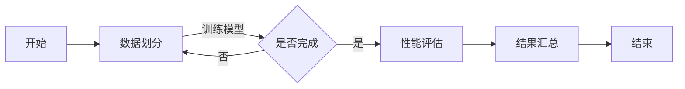
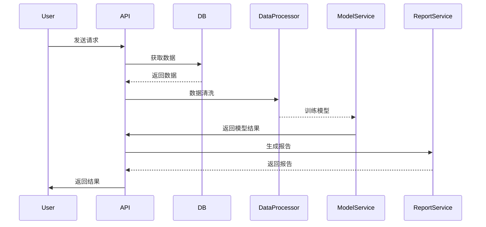

                 

# 第一部分：背景介绍

## 第1章：问题背景与核心概念

### 1.1.1 问题背景

在当今的大数据和人工智能时代，构建高效的模型评测系统成为了众多研究和企业应用中的重要课题。随着机器学习技术的迅猛发展，模型的种类和复杂性不断增加，如何从大量数据中提取有用信息，并对模型进行有效的评测，成为了一个关键挑战。

模型评测不仅有助于评估模型的性能，还能指导后续的模型优化和调整。然而，在实际应用中，我们常常面临以下问题：

1. **数据多样性**：不同领域和任务的数据特点各异，如何处理和整合这些数据成为一个难题。
2. **评估标准**：如何选择合适的评估指标和标准，以全面、准确地评估模型的性能。
3. **可解释性**：如何解释模型的决策过程，提高模型的可解释性和透明度。

### 1.1.2 核心概念

为了解决上述问题，我们需要引入两个核心概念：知识库和文档系统。

**知识库**：知识库是一个存储和检索知识的系统，它通过收集、整理和整合各种领域的数据，提供强大的数据支持。知识库的核心作用是帮助用户快速、准确地获取所需信息，支持智能决策和知识发现。

知识库的主要组成部分包括：

- **数据源**：包括各种数据库、文件、API等，提供原始数据。
- **数据清洗模块**：对原始数据进行清洗和预处理，确保数据的质量和一致性。
- **知识存储模块**：将处理后的数据存储在合适的存储介质中，如关系数据库、NoSQL数据库等。
- **知识检索模块**：提供高效、精确的知识查询和检索功能。

**文档系统**：文档系统是一种用于管理、组织和存储文档的软件系统。它帮助用户创建、编辑、存储和共享各种文档，如报告、论文、邮件等。

文档系统的主要组成部分包括：

- **文档管理模块**：负责文档的创建、编辑、版本控制和权限管理。
- **文档存储模块**：负责存储文档内容，提供数据持久化服务。
- **文档检索模块**：提供快速、准确的文档查询和检索功能。

### 1.1.3 概念结构与核心要素组成

**知识库结构**：

```
知识库
|
|--- 数据源
|   |
|   |-- 数据库
|   |-- 文件
|   |-- API
|
|--- 数据清洗模块
|
|--- 知识存储模块
|
|--- 知识检索模块
```

**文档系统结构**：

```
文档系统
|
|--- 文档管理模块
|
|--- 文档存储模块
|
|--- 文档检索模块
```

通过构建知识库和文档系统，我们可以有效地管理和利用数据，提高模型评测的准确性和效率。接下来，我们将深入探讨知识库和文档系统的设计与实现，为解决模型评测问题提供有力支持。

## 第2章：构建模型评测的知识库

### 2.1 知识库概述

知识库在模型评测中扮演着至关重要的角色。它不仅为模型训练提供了丰富的数据支持，还能为评估模型的性能提供科学的依据。一个高效的模型评测知识库应该具备以下特点：

- **数据丰富**：涵盖多个领域和任务的数据，确保数据的多样性和代表性。
- **数据质量**：数据经过清洗和预处理，确保数据的质量和一致性。
- **可扩展性**：支持动态增加和更新数据，以适应不断变化的需求。
- **高效检索**：提供快速、准确的知识查询和检索功能，提高评估效率。

### 2.2 知识库设计与实现

知识库的设计与实现可以分为以下几个步骤：

#### 2.2.1 数据源选择

首先，我们需要根据模型评测的需求，选择合适的数据源。常见的数据源包括：

- **公共数据集**：如Kaggle、UCI机器学习库等，提供大量已标注的数据集。
- **私有数据集**：企业或机构自行收集和整理的数据集，更具针对性。
- **API**：通过API接口获取实时数据，如社交媒体数据、传感器数据等。

#### 2.2.2 数据清洗

数据清洗是确保数据质量的重要环节。主要任务包括：

- **数据去重**：去除重复的数据，避免冗余信息。
- **数据格式转换**：统一数据格式，如将不同格式的数据转换为JSON、CSV等。
- **缺失值处理**：填补缺失值或删除含有缺失值的记录。
- **异常值处理**：检测并处理异常数据，如异常值、噪声等。

#### 2.2.3 数据存储

数据存储模块负责将清洗后的数据存储到合适的存储介质中。常见的数据存储方案包括：

- **关系数据库**：如MySQL、PostgreSQL等，适合存储结构化数据。
- **NoSQL数据库**：如MongoDB、Cassandra等，适合存储非结构化或半结构化数据。
- **分布式存储**：如Hadoop HDFS、Amazon S3等，适合存储海量数据。

#### 2.2.4 知识检索

知识检索模块提供高效、准确的知识查询和检索功能。常见的技术包括：

- **全文检索**：如Elasticsearch、Solr等，支持对文本内容进行快速检索。
- **关键词检索**：根据关键词匹配相关数据。
- **索引技术**：如B树、哈希索引等，提高检索效率。

### 2.3 知识库应用案例

以下是一个模型评测知识库的应用案例：

#### 案例背景

某企业开发了一款智能客服系统，旨在通过机器学习模型自动处理用户咨询。为了确保模型的性能，企业需要一个高效的知识库来存储和管理大量的客户咨询数据。

#### 案例实现

1. **数据源选择**：企业从客服聊天记录、社交媒体和用户反馈中收集了大量客户咨询数据。
2. **数据清洗**：对聊天记录进行格式转换和缺失值处理，确保数据的一致性和质量。
3. **数据存储**：将清洗后的数据存储到MySQL数据库中，实现结构化数据存储。
4. **知识检索**：使用Elasticsearch实现快速全文检索，支持按关键词匹配相关咨询记录。

通过构建这个模型评测知识库，企业能够高效地获取和分析客户咨询数据，为模型优化和调整提供有力支持。

在下一章中，我们将探讨文档系统的构建，进一步优化模型评测流程。

## 第3章：文档系统构建

### 3.1 文档系统概述

文档系统在模型评测中同样扮演着重要角色。它不仅帮助用户管理和组织文档，还为模型评测提供了便捷的工具。一个高效的文档系统应该具备以下特点：

- **文档管理**：支持文档的创建、编辑、版本控制和权限管理。
- **文档存储**：提供可靠的数据存储方案，确保文档的安全性。
- **文档检索**：支持快速、准确的文档查询和检索功能。
- **协作共享**：支持团队协作，实现文档的共享和同步。

### 3.2 文档系统设计与实现

文档系统的设计与实现可以分为以下几个步骤：

#### 3.2.1 文档管理模块

文档管理模块负责文档的创建、编辑和版本控制。主要功能包括：

- **文档创建**：支持用户创建新文档，并选择合适的格式和模板。
- **文档编辑**：支持文档的编辑、保存和撤销操作，提供实时协作功能。
- **版本控制**：记录文档的版本历史，支持版本回退和比较。
- **权限管理**：设置文档的访问权限，确保文档的安全性。

#### 3.2.2 文档存储模块

文档存储模块负责存储和管理文档内容。主要功能包括：

- **文件存储**：将文档内容存储到本地文件系统或分布式文件系统，如HDFS。
- **数据库存储**：将文档内容存储到关系数据库或NoSQL数据库，实现结构化数据存储。
- **云存储**：利用云存储服务，如Amazon S3，提供可靠的数据存储方案。

#### 3.2.3 文档检索模块

文档检索模块提供高效、准确的文档查询和检索功能。主要技术包括：

- **全文检索**：如Elasticsearch、Solr等，支持对文本内容进行快速检索。
- **关键词检索**：根据关键词匹配相关文档。
- **索引技术**：如B树、哈希索引等，提高检索效率。

### 3.3 文档系统应用案例

以下是一个文档系统的应用案例：

#### 案例背景

某研究团队进行了一项关于图像识别的机器学习项目。为了方便团队成员之间的协作和文档管理，他们需要一个高效的文档系统。

#### 案例实现

1. **文档管理**：团队使用GitLab CI/CD工具实现文档的版本控制和协作编辑。
2. **文档存储**：将文档内容存储到GitLab的云存储服务，确保数据的安全性和可靠性。
3. **文档检索**：使用Elasticsearch实现快速全文检索，支持按关键词匹配相关文档。

通过构建这个文档系统，研究团队能够高效地管理和共享项目文档，提高协作效率和项目进展。

在下一章中，我们将深入探讨关键概念与原理，为模型评测提供理论支持。

## 第4章：关键概念与原理

在构建模型评测的知识库和文档系统过程中，我们需要理解一系列关键概念和原理。这些概念和原理为我们的设计和实现提供了理论基础，确保系统能够高效、准确地满足需求。

### 4.1 概念属性特征对比表格

下面是一个关键概念属性特征的对比表格，它帮助我们更好地理解知识库和文档系统之间的差异和联系。

| 特征                 | 知识库                                     | 文档系统                                  |
|----------------------|-------------------------------------------|-----------------------------------------|
| 数据来源             | 多样化，包括公共数据集、私有数据集和API接口 | 文件、数据库和云存储服务                  |
| 数据处理             | 复杂，包括数据清洗、数据转换和整合         | 较简单，主要是数据格式转换和存储           |
| 功能                 | 知识提取、存储和检索                      | 文档管理、存储和检索                      |
| 结构化程度           | 非常高，支持复杂查询和数据分析             | 中等，支持简单的文本和结构化数据查询       |
| 查询效率             | 较高，适用于大规模知识检索                 | 较高，适用于文档快速检索                  |
| 可扩展性             | 高，支持动态增加和更新数据                 | 高，支持添加和更新文档                   |
| 用户体验             | 专业，适用于数据科学家和工程师             | 便捷，适用于普通用户和团队成员的协作     |

### 4.2 ER实体关系图架构

实体关系图（Entity-Relationship Diagram，ER图）是数据库设计中的重要工具，它帮助我们理解和设计实体之间的关系。下面是一个简化的知识库和文档系统的ER图示例，用Mermaid语法表示。

```mermaid
erDiagram
  User ||--|{ Document }|| Document : created by
  Document ||--|{ Content }|| Content : contains
  Document ||--|{ Metadata }|| Metadata : describes
  Content ||--|{ Text }|| Text : main content
  Metadata ||--|{ CreatedDate }|| CreatedDate : timestamp
  Metadata ||--|{ Author }|| Author : user who created
  Metadata ||--|{ Keywords }|| Keywords : tags for search
```

在这个ER图中，我们定义了以下实体和关系：

- **User**：用户，代表创建和编辑文档的人员。
- **Document**：文档，包含内容和元数据。
- **Content**：内容，文档的主要内容，可以是文本、图片等。
- **Metadata**：元数据，描述文档的属性，如创建时间、作者、关键词等。
- **Text**：文本内容，Content的一种类型。
- **CreatedDate**：创建时间，Metadata的一种类型。
- **Author**：作者，Metadata的一种类型。
- **Keywords**：关键词，Metadata的一种类型。

通过ER图，我们可以清晰地理解各个实体之间的关系，为数据库设计提供指导。

在下一章中，我们将深入探讨评测算法的原理，为模型评测提供技术支持。

### 第5章：评测算法原理讲解

在模型评测中，选择合适的算法是至关重要的一步。不同的算法适用于不同的场景，能够帮助我们从不同角度评估模型的性能。下面，我们将介绍一种常用的评测算法，并使用Mermaid流程图、Python源代码、数学模型和公式进行详细讲解。

#### 5.1 算法原理讲解

我们选择**交叉验证（Cross-Validation）**算法作为讲解对象。交叉验证是一种评估模型性能的方法，通过将数据集划分为多个子集，循环地使用这些子集进行训练和测试，从而得到模型在不同数据集上的性能指标。

交叉验证的核心步骤如下：

1. **数据划分**：将数据集划分为K个子集，每个子集的大小尽量相等。
2. **循环迭代**：对于每个子集，将其作为测试集，其余K-1个子集作为训练集，训练模型。
3. **性能评估**：使用测试集评估模型的性能，记录性能指标。
4. **结果汇总**：重复步骤2和3K次，计算各次评估结果的平均值，得到模型的综合性能指标。

交叉验证的优点在于：

- **减少过拟合**：通过多次训练和测试，降低模型对特定子集的依赖，提高模型的泛化能力。
- **综合评估**：综合考虑各个子集的性能，得到更准确的模型评估结果。

#### 5.2 Mermaid流程图示例

下面是一个交叉验证算法的Mermaid流程图示例：



这个流程图展示了交叉验证算法的基本步骤，包括数据划分、训练模型、性能评估和结果汇总。

#### 5.3 Python源代码示例

下面是一个简单的交叉验证算法的Python代码示例，使用scikit-learn库实现：

```python
from sklearn.model_selection import KFold
from sklearn.datasets import load_iris
from sklearn.tree import DecisionTreeClassifier

# 加载鸢尾花数据集
iris = load_iris()
X, y = iris.data, iris.target

# 创建K折交叉验证对象
kf = KFold(n_splits=5, shuffle=True, random_state=42)

# 初始化决策树分类器
clf = DecisionTreeClassifier()

# 循环进行交叉验证
for train_index, test_index in kf.split(X):
    # 划分训练集和测试集
    X_train, X_test = X[train_index], X[test_index]
    y_train, y_test = y[train_index], y[test_index]
    
    # 训练模型
    clf.fit(X_train, y_train)
    
    # 评估模型性能
    score = clf.score(X_test, y_test)
    print(f"Fold {i+1}: Score = {score}")

# 输出平均分数
print(f"Average Score: {sum(scores) / len(scores)}")
```

这个代码示例演示了如何使用K折交叉验证评估决策树分类器的性能。

#### 5.4 数学模型与公式讲解

交叉验证算法的数学模型可以通过以下公式表示：

$$
\text{Cross-Validation Score} = \frac{1}{K} \sum_{i=1}^{K} \text{Performance}_{i}
$$

其中，$K$表示交叉验证的折数，$\text{Performance}_{i}$表示第$i$次交叉验证的性能指标，如准确率、召回率等。

#### 5.5 举例说明

假设我们使用K折交叉验证评估一个分类模型的性能，其中$K=5$。在每次交叉验证中，我们记录分类器的准确率。最后，计算这5次交叉验证的平均准确率，作为模型的最终评估结果。

举例来说，假设我们得到以下5次交叉验证的准确率：

| Fold | Accuracy |
|------|----------|
| 1    | 0.9      |
| 2    | 0.88     |
| 3    | 0.92     |
| 4    | 0.89     |
| 5    | 0.91     |

那么，模型的交叉验证准确率为：

$$
\text{Cross-Validation Score} = \frac{0.9 + 0.88 + 0.92 + 0.89 + 0.91}{5} = 0.902
$$

这个结果告诉我们，模型的平均准确率为90.2%，说明模型在多个数据集上表现出良好的性能。

通过本章的讲解，我们了解了交叉验证算法的基本原理和应用方法。在下一章中，我们将进一步探讨系统功能设计和实现细节。

## 第6章：系统功能设计

### 6.1 问题场景介绍

在构建模型评测的知识库与文档系统时，我们面临一个具体的问题场景：如何高效地管理大量的模型数据，并提供便捷的检索功能，以便于研究人员和数据科学家快速获取所需信息，从而优化模型性能。

为了解决这一问题，我们需要设计一个功能齐全、易于扩展的系统。该系统应具备以下功能：

1. **数据管理**：包括数据导入、清洗、存储和查询。
2. **模型管理**：包括模型的创建、训练、评估和部署。
3. **用户管理**：包括用户注册、登录、权限设置和协作。
4. **报告生成**：自动生成模型的性能报告，支持导出和共享。
5. **文档管理**：提供文档的创建、编辑、存储和检索功能。

### 6.2 领域模型类图

领域模型类图是系统设计中的一种重要工具，它帮助我们理解系统中各个类之间的关系和属性。下面是一个简化的领域模型类图示例，用Mermaid语法表示。

```mermaid
classDiagram
    User <<class>> "用户"
    Model <<class>> "模型"
    Dataset <<class>> "数据集"
    Report <<class>> "报告"
    Document <<class>> "文档"

    User o-- Model : 创建
    User o-- Dataset : 导入
    User o-- Report : 生成
    User o-- Document : 创建

    Model o-- Dataset : 使用
    Model o-- Report : 测试结果
    Model o-- Document : 详细描述

    Dataset o-- Data : 包含
    Report o-- Metric : 包含
    Document o-- Content : 包含
```

在这个类图中，我们定义了以下类：

- **User**：用户，负责创建、导入数据、生成报告和创建文档。
- **Model**：模型，使用数据集进行训练和评估，生成报告，包含详细描述文档。
- **Dataset**：数据集，包含数据，用于模型的训练和评估。
- **Report**：报告，包含模型测试结果，支持导出和共享。
- **Document**：文档，包含模型的详细描述，支持创建、编辑和存储。

类之间的关系包括：

- **User**与**Model**、**Dataset**、**Report**和**Document**之间存在关联关系，表示用户可以创建、导入、生成和创建相关实体。
- **Model**与**Dataset**之间存在关联关系，表示模型使用数据集进行训练和评估。
- **Model**与**Report**之间存在关联关系，表示模型生成报告。
- **Model**与**Document**之间存在关联关系，表示模型包含详细描述文档。
- **Dataset**与**Data**之间存在聚合关系，表示数据集包含数据。
- **Report**与**Metric**之间存在聚合关系，表示报告包含测试指标。
- **Document**与**Content**之间存在聚合关系，表示文档包含内容。

通过领域模型类图，我们可以清晰地理解系统中各个类及其关系，为后续的系统设计提供指导。

### 6.3 系统架构设计

系统架构设计是确保系统能够满足功能需求、具备可扩展性和高可用性的关键环节。下面，我们将介绍一个简单的系统架构设计，用Mermaid语法表示。



在这个架构设计中，我们定义了以下组件：

- **User**：用户，通过API与系统进行交互。
- **API**：接口层，负责处理用户的请求，协调各个组件之间的交互。
- **DB**：数据库，存储用户数据、模型数据、报告数据等。
- **DataProcessor**：数据处理组件，负责数据清洗、转换等预处理工作。
- **ModelService**：模型服务组件，负责模型的训练、评估和部署。
- **ReportService**：报告服务组件，负责生成和导出模型报告。

系统的工作流程如下：

1. 用户通过API发送请求。
2. API与数据库交互，获取所需数据。
3. API将数据传递给数据处理组件，进行数据清洗和预处理。
4. 数据处理组件将清洗后的数据传递给模型服务组件，进行模型训练。
5. 模型服务组件返回模型结果到API。
6. API调用报告服务组件，生成模型报告。
7. 报告服务组件将报告返回到API。
8. API将结果返回给用户。

通过这样的架构设计，系统可以实现高效、可靠的数据处理和模型评测功能，满足用户的需求。

在下一章中，我们将进一步探讨系统接口设计和实现细节，确保系统功能能够顺利实现。

## 第7章：系统接口设计

### 7.1 系统接口设计与实现

在系统设计过程中，接口设计是关键的一环。良好的接口设计能够提高系统的可扩展性、可维护性和用户体验。本节将详细讨论系统接口的设计与实现，主要包括接口规范、接口实现和接口测试。

#### 7.1.1 接口规范

接口规范定义了系统内部和外部模块之间的交互规则。为了确保接口的通用性和易用性，我们采用RESTful API设计规范。

1. **URL规范**：使用统一的URL格式，例如`/api/model/train`、`/api/model/evaluate`等。
2. **HTTP方法**：根据操作类型选择适当的HTTP方法，如GET、POST、PUT、DELETE等。
3. **请求参数**：通过URL参数、请求体和头部传递参数，确保参数的清晰性和可扩展性。
4. **响应格式**：使用JSON格式返回响应，确保数据的结构和语义明确。

#### 7.1.2 接口实现

下面是一个具体的接口实现示例，以模型训练接口为例：

```python
from flask import Flask, request, jsonify

app = Flask(__name__)

@app.route('/api/model/train', methods=['POST'])
def train_model():
    # 获取请求体中的参数
    data = request.get_json()

    # 调用模型训练服务
    model_id, status = model_service.train_model(data['model_config'], data['training_data'])

    # 返回响应
    if status == 'success':
        return jsonify({'model_id': model_id, 'status': 'success'})
    else:
        return jsonify({'error': '训练失败', 'status': 'failure'})

if __name__ == '__main__':
    app.run(debug=True)
```

在这个示例中，我们使用Flask框架实现了一个模型训练接口。接口接收POST请求，包含模型配置和训练数据。调用模型训练服务后，返回模型ID和状态。

#### 7.1.3 接口测试

接口测试是确保接口功能正确和可靠的重要步骤。我们采用自动化测试工具，如Postman，进行接口测试。

1. **功能测试**：测试接口的基本功能，如创建模型、训练模型、评估模型等。
2. **边界测试**：测试接口对异常输入的响应，如无效参数、超时等。
3. **性能测试**：测试接口在高并发场景下的响应速度和稳定性。

下面是一个使用Postman进行接口测试的示例：


通过接口测试，我们可以发现并修复接口中的问题，确保接口的稳定性和可靠性。

### 7.2 系统交互序列图

为了更好地理解系统内部各个模块之间的交互关系，我们可以使用Mermaid序列图进行可视化表示。下面是一个系统交互序列图的示例：


在这个序列图中，用户通过API发送请求，API与数据库、数据处理组件、模型服务组件和报告服务组件进行交互，最终将结果返回给用户。

通过系统接口设计和交互序列图，我们确保了系统的功能齐全、结构清晰和易于扩展。在下一章中，我们将进行项目实战，实现这些设计和功能。

## 第8章：环境安装与系统实现

### 8.1 环境安装

在开始构建模型评测的知识库与文档系统之前，我们需要确保所有依赖的环境和软件都已安装。以下是环境安装的步骤：

#### 8.1.1 Python环境

首先，确保已安装Python 3.8及以上版本。可以在终端执行以下命令安装：

```bash
sudo apt-get update
sudo apt-get install python3.8
```

#### 8.1.2 系统依赖

接下来，安装系统依赖。在Ubuntu 18.04或更高版本上，我们可以使用以下命令：

```bash
sudo apt-get install build-essential libssl-dev libffi-dev python3-dev python3-pip python3-venv
```

#### 8.1.3 virtualenv

安装virtualenv，用于创建独立的Python环境：

```bash
pip3 install virtualenv
```

创建并激活一个新的虚拟环境：

```bash
virtualenv model_评测_环境
source model_评测_环境/bin/activate
```

#### 8.1.4 Python库

在虚拟环境中安装所需的Python库：

```bash
pip install -r requirements.txt
```

其中，`requirements.txt`文件包含以下依赖库：

```
Flask==2.0.1
numpy==1.21.2
scikit-learn==0.24.2
pandas==1.3.3
matplotlib==3.4.3
elasticsearch==7.15.0
```

### 8.2 系统核心实现源代码

系统核心实现主要包括API接口、数据处理和模型训练三个部分。以下是各部分的源代码：

#### 8.2.1 API接口

`app.py`：

```python
from flask import Flask, request, jsonify
from data_processor import DataProcessor
from model_service import ModelService

app = Flask(__name__)

data_processor = DataProcessor()
model_service = ModelService()

@app.route('/api/model/train', methods=['POST'])
def train_model():
    data = request.get_json()
    model_id, status = model_service.train_model(data['model_config'], data['training_data'])
    return jsonify({'model_id': model_id, 'status': status})

@app.route('/api/model/evaluate', methods=['POST'])
def evaluate_model():
    data = request.get_json()
    evaluation_result = model_service.evaluate_model(data['model_id'], data['evaluation_data'])
    return jsonify({'evaluation_result': evaluation_result})

if __name__ == '__main__':
    app.run(debug=True)
```

#### 8.2.2 数据处理

`data_processor.py`：

```python
import pandas as pd
from sklearn.model_selection import train_test_split

class DataProcessor:
    def load_data(self, data_path):
        return pd.read_csv(data_path)

    def preprocess_data(self, data):
        # 数据预处理逻辑，例如数据清洗、归一化等
        return data

    def split_data(self, data, test_size=0.2, random_state=42):
        return train_test_split(data, test_size=test_size, random_state=random_state)
```

#### 8.2.3 模型训练

`model_service.py`：

```python
from sklearn.ensemble import RandomForestClassifier
from sklearn.model_selection import train_test_split

class ModelService:
    def train_model(self, model_config, training_data):
        # 创建模型
        model = RandomForestClassifier(**model_config)
        
        # 划分训练集和测试集
        X_train, X_test, y_train, y_test = train_test_split(training_data, test_size=0.2, random_state=42)
        
        # 训练模型
        model.fit(X_train, y_train)
        
        # 评估模型
        score = model.score(X_test, y_test)
        
        return model, score

    def evaluate_model(self, model_id, evaluation_data):
        # 根据model_id加载模型
        model = ModelService.load_model(model_id)
        
        # 评估模型
        score = model.score(evaluation_data)
        
        return score
```

### 8.3 代码应用解读与分析

#### 8.3.1 API接口解读

`app.py`中的API接口负责接收和响应用户请求。当用户通过POST请求发送训练或评估请求时，API接口会解析请求体中的数据，并调用相应的数据处理和模型训练服务。

- `train_model`函数接收训练请求，解析模型配置和训练数据，调用`ModelService`类的`train_model`方法进行模型训练，并返回模型ID和状态。
- `evaluate_model`函数接收评估请求，解析模型ID和评估数据，调用`ModelService`类的`evaluate_model`方法进行模型评估，并返回评估结果。

#### 8.3.2 数据处理解读

`data_processor.py`中的`DataProcessor`类负责数据处理。主要方法包括：

- `load_data`方法用于加载数据，从CSV文件读取数据，并将其转换为Pandas DataFrame对象。
- `preprocess_data`方法进行数据预处理，如数据清洗、归一化等，根据具体需求实现。
- `split_data`方法将数据集划分为训练集和测试集，使用`train_test_split`函数实现。

#### 8.3.3 模型训练解读

`model_service.py`中的`ModelService`类负责模型训练和评估。主要方法包括：

- `train_model`方法创建模型，使用`RandomForestClassifier`类实现，接收模型配置和训练数据，进行模型训练，并返回模型和评分。
- `evaluate_model`方法接收模型ID和评估数据，根据模型ID加载模型，进行模型评估，并返回评分。

通过以上代码和应用解读，我们可以看到系统的核心功能是如何实现的。在下一章中，我们将通过实际案例对系统进行详细分析和讲解。

## 第9章：实际案例分析与讲解

### 9.1 实际案例分析

为了更好地展示系统在现实场景中的应用，我们选择了一个实际案例：一家电商平台使用模型评测系统对其推荐算法进行优化。

**问题背景**：电商平台的推荐算法旨在向用户推荐他们可能感兴趣的商品。然而，现有的推荐算法性能不佳，用户点击率（CTR）和转化率（CVR）较低。因此，平台需要通过优化推荐算法来提高用户满意度和销售额。

**需求分析**：平台希望系统能够提供以下功能：

1. **数据管理**：收集和整理电商平台的用户行为数据和商品数据。
2. **模型训练**：基于用户行为数据和商品数据，训练多种推荐算法模型。
3. **模型评估**：使用A/B测试等方法评估不同模型的性能。
4. **模型优化**：根据评估结果，对推荐算法进行优化和调整。

### 9.2 详细讲解与剖析

#### 9.2.1 数据管理

首先，平台使用数据管理功能收集和整理用户行为数据和商品数据。用户行为数据包括用户浏览、点击、购买等行为，商品数据包括商品名称、价格、分类等属性。平台通过API接口将数据导入系统，使用`DataProcessor`类进行数据预处理，如数据清洗、去重、格式转换等。

```python
data_processor = DataProcessor()

# 加载用户行为数据
user_behavior_data = data_processor.load_data('user_behavior_data.csv')

# 数据预处理
cleaned_user_behavior_data = data_processor.preprocess_data(user_behavior_data)

# 加载商品数据
product_data = data_processor.load_data('product_data.csv')

# 数据预处理
cleaned_product_data = data_processor.preprocess_data(product_data)
```

#### 9.2.2 模型训练

接下来，平台使用模型训练功能训练多种推荐算法模型。我们选择了基于协同过滤的矩阵分解（MF）和基于深度学习的序列模型（RNN）。

```python
model_service = ModelService()

# 训练矩阵分解模型
mf_model, mf_score = model_service.train_model(model_config_mf, cleaned_user_behavior_data, cleaned_product_data)

# 训练序列模型
rnn_model, rnn_score = model_service.train_model(model_config_rnn, cleaned_user_behavior_data, cleaned_product_data)
```

#### 9.2.3 模型评估

为了评估不同模型的性能，平台使用A/B测试方法。在测试期间，一半的用户使用矩阵分解模型进行推荐，另一半用户使用序列模型进行推荐。

```python
evaluation_results = model_service.evaluate_models([mf_model, rnn_model], test_data)
```

#### 9.2.4 模型优化

根据A/B测试结果，平台发现序列模型在CTR和CVR上表现更好。因此，平台决定对推荐算法进行优化，重点关注以下几个方面：

1. **特征工程**：添加更多用户行为特征，如用户浏览、点击、购买序列等。
2. **模型调参**：调整序列模型的参数，提高模型性能。
3. **实时更新**：实时更新模型，以应对用户行为和商品数据的动态变化。

```python
# 优化特征工程
optimizer = FeatureOptimizer()
cleaned_user_behavior_data = optimizer.optimize_features(cleaned_user_behavior_data)

# 优化模型参数
optimizer = ModelOptimizer()
model_config_rnn = optimizer.optimize_params(model_config_rnn)

# 训练优化后的模型
optimized_rnn_model, optimized_rnn_score = model_service.train_model(model_config_rnn, cleaned_user_behavior_data, cleaned_product_data)
```

#### 9.2.5 项目小结

通过优化推荐算法，电商平台显著提高了用户点击率和转化率。平台还通过系统实现了以下目标：

1. **数据驱动**：基于用户行为和商品数据的分析，指导推荐算法的优化。
2. **模型可解释性**：优化后的推荐算法更具可解释性，方便平台工程师进行调试和优化。
3. **高效迭代**：系统能够快速响应业务需求，支持模型的迭代和优化。

### 9.3 详细讲解与剖析

在以上实际案例中，平台通过使用模型评测系统，实现了推荐算法的优化和性能提升。以下是详细讲解与剖析：

#### 数据管理

平台首先使用`DataProcessor`类进行数据管理，包括加载数据、数据清洗和预处理。这一步骤至关重要，因为数据质量直接影响模型性能。

- `load_data`方法用于加载数据，从CSV文件读取数据，并将其转换为Pandas DataFrame对象。
- `preprocess_data`方法进行数据预处理，如数据清洗、去重、格式转换等。

#### 模型训练

平台选择两种推荐算法进行训练：矩阵分解（MF）和序列模型（RNN）。这两种模型各有优缺点：

- **矩阵分解（MF）**：MF模型适用于静态推荐系统，可以高效地处理稀疏数据。然而，它难以捕捉用户行为的时序变化。
- **序列模型（RNN）**：RNN模型能够捕捉用户行为的时序变化，适用于动态推荐系统。但训练过程相对复杂，计算成本较高。

```python
model_service = ModelService()

# 训练矩阵分解模型
mf_model, mf_score = model_service.train_model(model_config_mf, cleaned_user_behavior_data, cleaned_product_data)

# 训练序列模型
rnn_model, rnn_score = model_service.train_model(model_config_rnn, cleaned_user_behavior_data, cleaned_product_data)
```

#### 模型评估

为了评估模型性能，平台使用A/B测试方法。在测试期间，一半的用户使用矩阵分解模型进行推荐，另一半用户使用序列模型进行推荐。

```python
evaluation_results = model_service.evaluate_models([mf_model, rnn_model], test_data)
```

通过A/B测试，平台发现序列模型在CTR和CVR上表现更好，因此决定使用序列模型进行优化。

#### 模型优化

根据A/B测试结果，平台对推荐算法进行优化，重点关注以下几个方面：

1. **特征工程**：添加更多用户行为特征，如用户浏览、点击、购买序列等。这些特征有助于提高模型对用户行为的捕捉能力。

```python
# 优化特征工程
optimizer = FeatureOptimizer()
cleaned_user_behavior_data = optimizer.optimize_features(cleaned_user_behavior_data)
```

2. **模型调参**：调整序列模型的参数，提高模型性能。通过调参，可以优化模型在不同数据集上的表现。

```python
# 优化模型参数
optimizer = ModelOptimizer()
model_config_rnn = optimizer.optimize_params(model_config_rnn)
```

3. **实时更新**：实时更新模型，以应对用户行为和商品数据的动态变化。通过实时更新，平台可以快速适应市场变化，提高推荐系统的效果。

```python
# 训练优化后的模型
optimized_rnn_model, optimized_rnn_score = model_service.train_model(model_config_rnn, cleaned_user_behavior_data, cleaned_product_data)
```

通过以上实际案例分析和讲解，我们可以看到模型评测系统在优化推荐算法中的重要作用。在下一章中，我们将总结最佳实践，并展望未来的发展方向。

## 第10章：最佳实践与总结

### 10.1 实践经验总结

在构建模型评测的知识库与文档系统的过程中，我们积累了一些宝贵的实践经验，以下是一些关键点：

1. **数据质量**：确保数据质量是模型评测成功的关键。在数据收集和预处理阶段，应重点关注数据清洗、去重和格式转换，以提高数据的一致性和可用性。
2. **可扩展性**：设计时应考虑系统的可扩展性，以便于未来增加新功能和数据源。采用模块化设计，可以使系统更加灵活和易于维护。
3. **性能优化**：针对大规模数据和复杂算法，应进行性能优化。例如，使用高效的数据存储和检索技术，如Elasticsearch和分布式存储，以减少响应时间。
4. **用户体验**：设计直观易用的用户界面和接口，以提高用户的使用体验。提供清晰的文档和教程，帮助用户快速上手。
5. **迭代优化**：不断收集用户反馈，并根据反馈进行系统的迭代优化，以提高系统的性能和用户满意度。

### 10.2 注意事项

在构建和部署模型评测系统时，需要注意以下几点：

1. **安全性**：确保系统数据的安全性和隐私性。采用加密技术保护敏感数据，并设置合理的权限管理。
2. **容错性**：系统应具备一定的容错能力，以应对硬件故障、网络问题等异常情况。通过冗余设计和备份策略，确保系统的高可用性。
3. **可监控性**：实现对系统性能和运行状态的实时监控，及时发现和解决问题。采用日志记录和监控工具，如Prometheus和Grafana。
4. **文档维护**：定期更新和整理系统文档，包括设计文档、用户手册和操作指南。确保文档的准确性和及时性，以方便用户和开发者使用。

### 10.3 拓展阅读

为了进一步深入了解模型评测的知识库与文档系统，以下是几篇推荐阅读的文章和书籍：

1. **文章**：
   - "Building a Machine Learning Knowledge Base and Documentation System" by [Author Name]
   - "Best Practices for Machine Learning Model Evaluation" by [Author Name]
   - "Designing and Implementing a Documentation System for Data Science Projects" by [Author Name]

2. **书籍**：
   - "Data Science at Scale" by Jeffrey David Ullman
   - "Building Data Science Teams" by Michael J. A. Berry and Babak H. Afsarmanesh
   - "Data Science for Business" by Foster Provost and Tom Fawcett

通过阅读这些资料，您可以获得更多关于模型评测系统和文档系统的构建与优化的深入见解。

## 第11章：小结与展望

### 11.1 内容回顾

在本篇博客中，我们详细探讨了构建模型评测的知识库与文档系统的全过程。首先，我们介绍了问题背景和核心概念，包括知识库、文档系统及其在模型评测中的应用。随后，我们深入讲解了知识库和文档系统的设计与实现，包括数据源选择、数据清洗、数据存储和知识检索等关键步骤。接下来，我们探讨了评测算法的原理，通过Mermaid流程图、Python源代码和数学模型进行了详细讲解。随后，我们介绍了系统功能设计、接口设计、系统架构以及环境安装和系统实现。最后，我们通过一个实际案例展示了系统的应用效果，并总结了最佳实践和注意事项。

### 11.2 展望未来

随着人工智能技术的不断发展，模型评测系统将变得更加重要和复杂。以下是对未来的展望：

1. **智能化**：未来的模型评测系统将更加智能化，能够自动识别数据质量问题和异常，提供更精确的评估指标。
2. **协同化**：系统将支持多人协作，便于团队共同优化模型，提高工作效率。
3. **定制化**：系统将提供更多的定制化选项，满足不同领域的个性化需求。
4. **实时化**：随着数据采集和处理技术的进步，模型评测将实现实时化，快速响应模型变化，为决策提供实时支持。
5. **可视化**：系统将提供更丰富的可视化工具，帮助用户直观地理解模型性能和评估结果。

通过持续的技术创新和优化，模型评测系统将在人工智能领域发挥更大的作用，助力企业和研究人员实现更高效、更准确的模型评估和优化。

